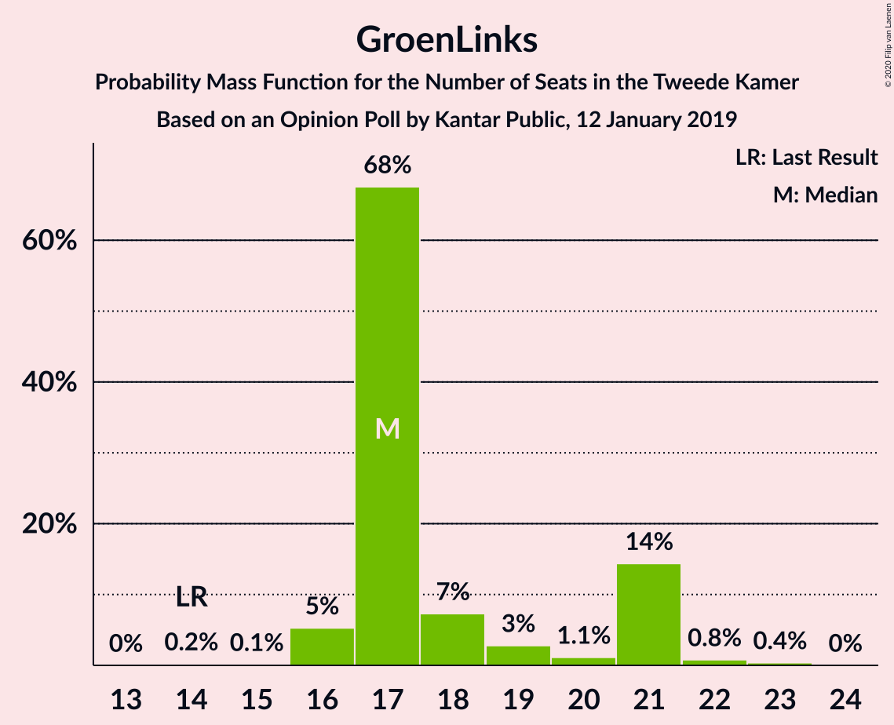
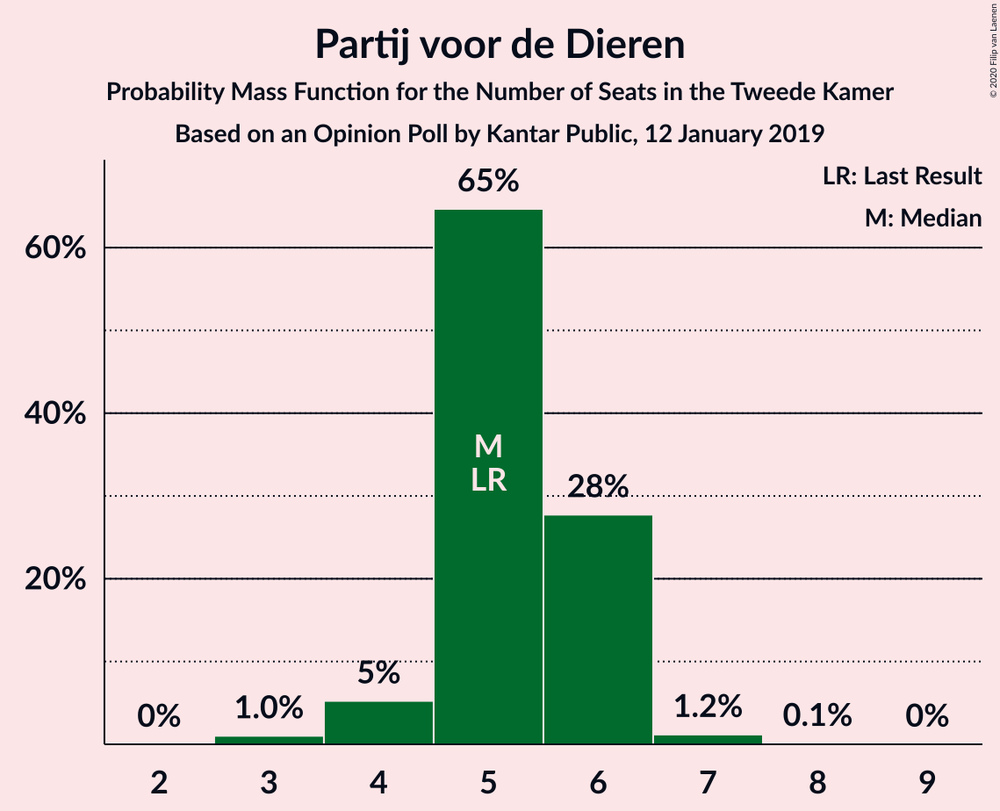
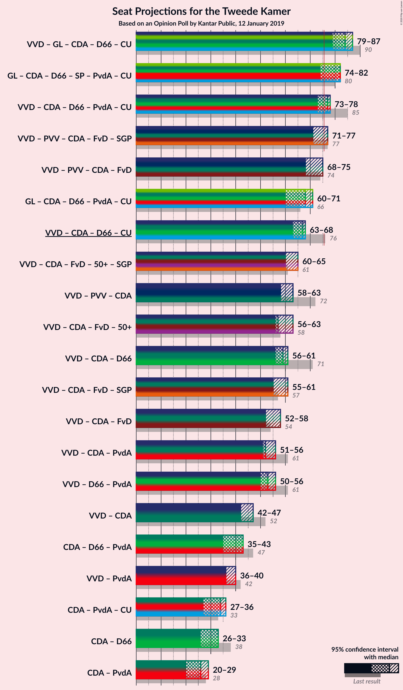
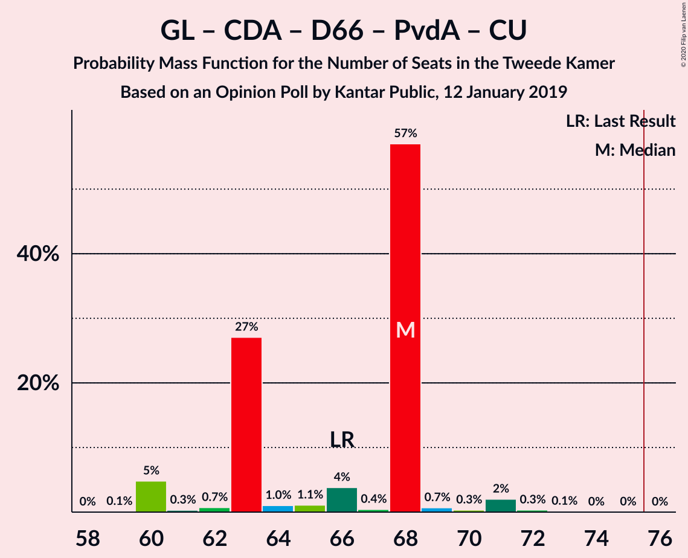
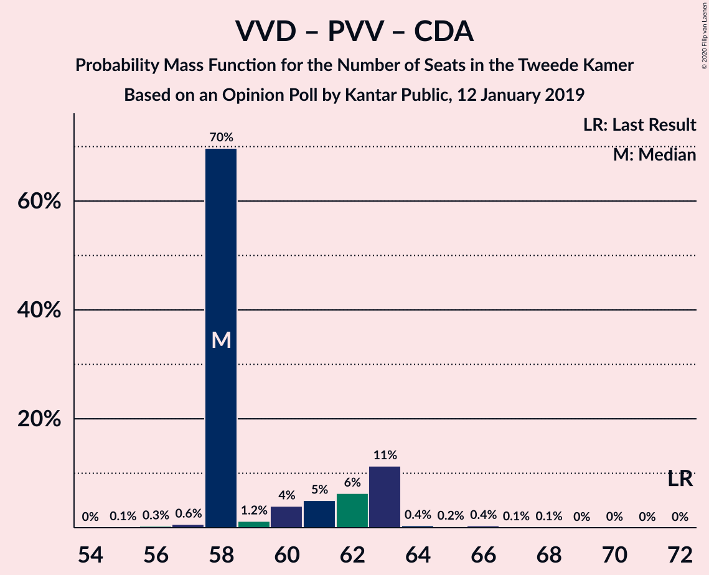
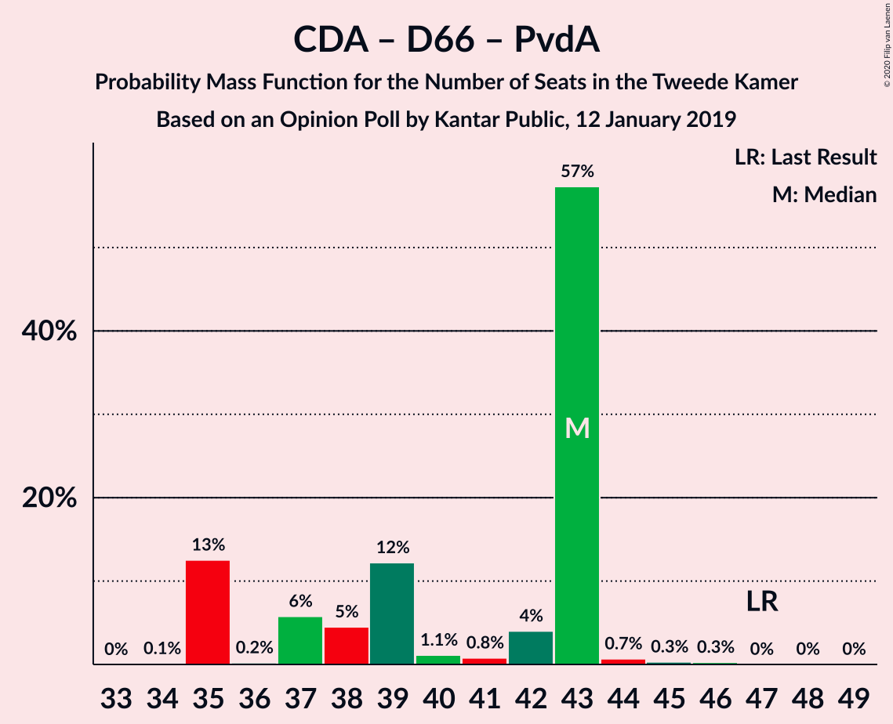

# Opinion Poll by Kantar Public, 12 January 2019

<a href="#voting-intentions">Voting Intentions</a> | <a href="#seats">Seats</a> | <a href="#coalitions">Coalitions</a> | <a href="#technical-information">Technical Information</a>

## Voting Intentions

### Confidence Intervals

| Party | Last Result | Poll Result | 80% Confidence Interval | 90% Confidence Interval | 95% Confidence Interval | 99% Confidence Interval |
|:-----:|:-----------:|:-----------:|:-----------------------:|:-----------------------:|:-----------------------:|:-----------------------:|
| Volkspartij voor Vrijheid en Democratie | 21.3% | 18.6% | 17.0–20.3% |16.6–20.7% |16.2–21.2% |15.5–22.0% |
| GroenLinks | 9.1% | 12.6% | 11.3–14.1% |11.0–14.5% |10.7–14.9% |10.1–15.6% |
| Partij voor de Vrijheid | 13.1% | 11.3% | 10.0–12.7% |9.7–13.1% |9.4–13.4% |8.9–14.1% |
| Christen-Democratisch Appèl | 12.4% | 10.6% | 9.4–12.0% |9.1–12.4% |8.8–12.8% |8.3–13.4% |
| Democraten 66 | 12.2% | 9.9% | 8.8–11.2% |8.4–11.6% |8.2–12.0% |7.7–12.6% |
| Socialistische Partij | 9.1% | 7.9% | 6.9–9.2% |6.6–9.5% |6.4–9.8% |5.9–10.4% |
| Forum voor Democratie | 1.8% | 7.9% | 6.9–9.2% |6.6–9.5% |6.4–9.8% |5.9–10.4% |
| Partij van de Arbeid | 5.7% | 6.7% | 5.7–7.8% |5.5–8.2% |5.3–8.4% |4.8–9.0% |
| ChristenUnie | 3.4% | 4.6% | 3.8–5.6% |3.6–5.9% |3.4–6.1% |3.1–6.6% |
| Partij voor de Dieren | 3.2% | 3.3% | 2.7–4.2% |2.5–4.5% |2.4–4.7% |2.1–5.1% |
| 50Plus | 3.1% | 2.6% | 2.1–3.4% |1.9–3.6% |1.8–3.8% |1.5–4.2% |
| Staatkundig Gereformeerde Partij | 2.1% | 2.0% | 1.5–2.7% |1.4–2.9% |1.3–3.1% |1.1–3.5% |
| DENK | 2.1% | 2.0% | 1.5–2.7% |1.4–2.9% |1.3–3.1% |1.1–3.5% |

*Note:* The poll result column reflects the actual value used in the calculations. Published results may vary slightly, and in addition be rounded to fewer digits.

## Seats

### Confidence Intervals

| Party | Last Result | Median | 80% Confidence Interval | 90% Confidence Interval | 95% Confidence Interval | 99% Confidence Interval |
|:-----:|:-----------:|:------:|:-----------------------:|:-----------------------:|:-----------------------:|:-----------------------:|
| <a href="#volkspartij-voor-vrijheid-en-democratie">Volkspartij voor Vrijheid en Democratie</a> | 33 | 26 | 26–29 |26–29 |26–29 |25–32 |
| <a href="#groenlinks">GroenLinks</a> | 14 | 17 | 17–18 |16–19 |16–20 |16–22 |
| <a href="#partij-voor-de-vrijheid">Partij voor de Vrijheid</a> | 20 | 16 | 16–17 |16–19 |16–19 |14–19 |
| <a href="#christen-democratisch-appèl">Christen-Democratisch Appèl</a> | 19 | 16 | 15–16 |14–16 |14–16 |13–18 |
| <a href="#democraten-66">Democraten 66</a> | 19 | 17 | 14–17 |12–17 |12–17 |12–19 |
| <a href="#socialistische-partij">Socialistische Partij</a> | 14 | 14 | 13–14 |11–15 |11–15 |10–15 |
| <a href="#forum-voor-democratie">Forum voor Democratie</a> | 2 | 10 | 10–14 |10–14 |10–14 |9–15 |
| <a href="#partij-van-de-arbeid">Partij van de Arbeid</a> | 9 | 10 | 10 |9–10 |9–10 |8–12 |
| <a href="#christenunie">ChristenUnie</a> | 5 | 8 | 7–8 |6–8 |6–8 |5–10 |
| <a href="#partij-voor-de-dieren">Partij voor de Dieren</a> | 5 | 5 | 5 |4–6 |4–6 |4–7 |
| <a href="#50plus">50Plus</a> | 4 | 5 | 3–5 |3–5 |3–5 |2–5 |
| <a href="#staatkundig-gereformeerde-partij">Staatkundig Gereformeerde Partij</a> | 3 | 3 | 2–3 |2–4 |2–4 |2–5 |
| <a href="#denk">DENK</a> | 3 | 3 | 3–4 |3–5 |2–6 |1–6 |

### Volkspartij voor Vrijheid en Democratie

*For a full overview of the results for this party, see the [Volkspartij voor Vrijheid en Democratie](party-volkspartijvoorvrijheidendemocratie.html) page.*

| Number of Seats | Probability | Accumulated | Special Marks |
|:---------------:|:-----------:|:-----------:|:-------------:|
| 23 | 0% | 100% |  |
| 24 | 0.4% | 99.9% |  |
| 25 | 0.4% | 99.6% |  |
| 26 | 78% | 99.1% | Median |
| 27 | 0.2% | 21% |  |
| 28 | 4% | 21% |  |
| 29 | 14% | 17% |  |
| 30 | 1.4% | 2% |  |
| 31 | 0.3% | 1.0% |  |
| 32 | 0.5% | 0.8% |  |
| 33 | 0.2% | 0.2% | Last Result |
| 34 | 0.1% | 0.1% |  |
| 35 | 0% | 0% |  |

### GroenLinks

*For a full overview of the results for this party, see the [GroenLinks](party-groenlinks.html) page.*

| Number of Seats | Probability | Accumulated | Special Marks |
|:---------------:|:-----------:|:-----------:|:-------------:|
| 14 | 0.2% | 100% | Last Result |
| 15 | 0.1% | 99.8% |  |
| 16 | 7% | 99.8% |  |
| 17 | 78% | 93% | Median |
| 18 | 9% | 15% |  |
| 19 | 3% | 6% |  |
| 20 | 1.1% | 3% |  |
| 21 | 0.6% | 2% |  |
| 22 | 1.0% | 1.3% |  |
| 23 | 0.2% | 0.3% |  |
| 24 | 0% | 0% |  |

### Partij voor de Vrijheid

*For a full overview of the results for this party, see the [Partij voor de Vrijheid](party-partijvoordevrijheid.html) page.*

| Number of Seats | Probability | Accumulated | Special Marks |
|:---------------:|:-----------:|:-----------:|:-------------:|
| 13 | 0% | 100% |  |
| 14 | 1.1% | 99.9% |  |
| 15 | 0.9% | 98.8% |  |
| 16 | 82% | 98% | Median |
| 17 | 8% | 16% |  |
| 18 | 2% | 8% |  |
| 19 | 7% | 7% |  |
| 20 | 0.1% | 0.3% | Last Result |
| 21 | 0.1% | 0.2% |  |
| 22 | 0% | 0% |  |

### Christen-Democratisch Appèl

*For a full overview of the results for this party, see the [Christen-Democratisch Appèl](party-christen-democratischappèl.html) page.*

| Number of Seats | Probability | Accumulated | Special Marks |
|:---------------:|:-----------:|:-----------:|:-------------:|
| 11 | 0.2% | 100% |  |
| 12 | 0.1% | 99.8% |  |
| 13 | 0.6% | 99.8% |  |
| 14 | 9% | 99.2% |  |
| 15 | 8% | 90% |  |
| 16 | 81% | 82% | Median |
| 17 | 0.6% | 1.2% |  |
| 18 | 0.4% | 0.6% |  |
| 19 | 0.1% | 0.2% | Last Result |
| 20 | 0.1% | 0.1% |  |
| 21 | 0% | 0% |  |

### Democraten 66

*For a full overview of the results for this party, see the [Democraten 66](party-democraten66.html) page.*

| Number of Seats | Probability | Accumulated | Special Marks |
|:---------------:|:-----------:|:-----------:|:-------------:|
| 11 | 0.2% | 100% |  |
| 12 | 8% | 99.8% |  |
| 13 | 2% | 92% |  |
| 14 | 1.5% | 90% |  |
| 15 | 7% | 89% |  |
| 16 | 4% | 82% |  |
| 17 | 77% | 78% | Median |
| 18 | 0.4% | 1.1% |  |
| 19 | 0.5% | 0.7% | Last Result |
| 20 | 0.1% | 0.1% |  |
| 21 | 0% | 0% |  |

### Socialistische Partij

*For a full overview of the results for this party, see the [Socialistische Partij](party-socialistischepartij.html) page.*

| Number of Seats | Probability | Accumulated | Special Marks |
|:---------------:|:-----------:|:-----------:|:-------------:|
| 8 | 0.1% | 100% |  |
| 9 | 0.3% | 99.8% |  |
| 10 | 1.1% | 99.5% |  |
| 11 | 7% | 98% |  |
| 12 | 2% | 92% |  |
| 13 | 5% | 90% |  |
| 14 | 78% | 85% | Last Result, Median |
| 15 | 7% | 7% |  |
| 16 | 0.2% | 0.2% |  |
| 17 | 0% | 0% |  |

### Forum voor Democratie

*For a full overview of the results for this party, see the [Forum voor Democratie](party-forumvoordemocratie.html) page.*

| Number of Seats | Probability | Accumulated | Special Marks |
|:---------------:|:-----------:|:-----------:|:-------------:|
| 2 | 0% | 100% | Last Result |
| 3 | 0% | 100% |  |
| 4 | 0% | 100% |  |
| 5 | 0% | 100% |  |
| 6 | 0% | 100% |  |
| 7 | 0% | 100% |  |
| 8 | 0% | 100% |  |
| 9 | 1.1% | 100% |  |
| 10 | 85% | 98.9% | Median |
| 11 | 1.2% | 13% |  |
| 12 | 1.4% | 12% |  |
| 13 | 0.5% | 11% |  |
| 14 | 9% | 10% |  |
| 15 | 1.0% | 1.0% |  |
| 16 | 0% | 0% |  |

### Partij van de Arbeid

*For a full overview of the results for this party, see the [Partij van de Arbeid](party-partijvandearbeid.html) page.*

| Number of Seats | Probability | Accumulated | Special Marks |
|:---------------:|:-----------:|:-----------:|:-------------:|
| 7 | 0.2% | 100% |  |
| 8 | 0.7% | 99.8% |  |
| 9 | 9% | 99.1% | Last Result |
| 10 | 88% | 90% | Median |
| 11 | 0.7% | 2% |  |
| 12 | 1.2% | 1.4% |  |
| 13 | 0.1% | 0.2% |  |
| 14 | 0% | 0% |  |

### ChristenUnie

*For a full overview of the results for this party, see the [ChristenUnie](party-christenunie.html) page.*

| Number of Seats | Probability | Accumulated | Special Marks |
|:---------------:|:-----------:|:-----------:|:-------------:|
| 4 | 0.3% | 100% |  |
| 5 | 0.8% | 99.7% | Last Result |
| 6 | 5% | 99.0% |  |
| 7 | 15% | 94% |  |
| 8 | 79% | 80% | Median |
| 9 | 0.4% | 1.1% |  |
| 10 | 0.5% | 0.6% |  |
| 11 | 0.1% | 0.1% |  |
| 12 | 0% | 0% |  |

### Partij voor de Dieren

*For a full overview of the results for this party, see the [Partij voor de Dieren](party-partijvoordedieren.html) page.*

| Number of Seats | Probability | Accumulated | Special Marks |
|:---------------:|:-----------:|:-----------:|:-------------:|
| 3 | 0.3% | 100% |  |
| 4 | 6% | 99.7% |  |
| 5 | 85% | 94% | Last Result, Median |
| 6 | 8% | 9% |  |
| 7 | 1.4% | 2% |  |
| 8 | 0.1% | 0.1% |  |
| 9 | 0% | 0% |  |

### 50Plus

*For a full overview of the results for this party, see the [50Plus](party-50plus.html) page.*

| Number of Seats | Probability | Accumulated | Special Marks |
|:---------------:|:-----------:|:-----------:|:-------------:|
| 2 | 2% | 100% |  |
| 3 | 8% | 98% |  |
| 4 | 2% | 90% | Last Result |
| 5 | 88% | 88% | Median |
| 6 | 0.1% | 0.3% |  |
| 7 | 0.2% | 0.2% |  |
| 8 | 0% | 0% |  |

### Staatkundig Gereformeerde Partij

*For a full overview of the results for this party, see the [Staatkundig Gereformeerde Partij](party-staatkundiggereformeerdepartij.html) page.*

| Number of Seats | Probability | Accumulated | Special Marks |
|:---------------:|:-----------:|:-----------:|:-------------:|
| 2 | 12% | 100% |  |
| 3 | 79% | 88% | Last Result, Median |
| 4 | 9% | 10% |  |
| 5 | 0.7% | 0.9% |  |
| 6 | 0.2% | 0.2% |  |
| 7 | 0% | 0% |  |

### DENK

*For a full overview of the results for this party, see the [DENK](party-denk.html) page.*

| Number of Seats | Probability | Accumulated | Special Marks |
|:---------------:|:-----------:|:-----------:|:-------------:|
| 1 | 0.9% | 100% |  |
| 2 | 4% | 99.1% |  |
| 3 | 85% | 95% | Last Result, Median |
| 4 | 0.9% | 11% |  |
| 5 | 7% | 10% |  |
| 6 | 3% | 3% |  |
| 7 | 0% | 0% |  |

## Coalitions

### Confidence Intervals

| Coalition | Last Result | Median | Majority? | 80% Confidence Interval | 90% Confidence Interval | 95% Confidence Interval | 99% Confidence Interval |
|:---------:|:-----------:|:------:|:---------:|:-----------------------:|:-----------------------:|:-----------------------:|:-----------------------:|
| Volkspartij voor Vrijheid en Democratie – GroenLinks – Christen-Democratisch Appèl – Democraten 66 – ChristenUnie | 90 | 84 | 100% | 83–84 | 79–84 | 79–85 | 79–89 |
| GroenLinks – Christen-Democratisch Appèl – Democraten 66 – Socialistische Partij – Partij van de Arbeid – ChristenUnie | 80 | 82 | 86% | 75–82 | 74–82 | 74–82 | 74–82 |
| Volkspartij voor Vrijheid en Democratie – Christen-Democratisch Appèl – Democraten 66 – Partij van de Arbeid – ChristenUnie | 85 | 77 | 83% | 73–77 | 73–77 | 73–77 | 71–79 |
| Volkspartij voor Vrijheid en Democratie – Partij voor de Vrijheid – Christen-Democratisch Appèl – Forum voor Democratie – Staatkundig Gereformeerde Partij | 77 | 71 | 18% | 71–76 | 71–77 | 71–77 | 71–80 |
| Volkspartij voor Vrijheid en Democratie – Partij voor de Vrijheid – Christen-Democratisch Appèl – Forum voor Democratie | 74 | 68 | 0.5% | 68–73 | 68–75 | 68–75 | 68–76 |
| GroenLinks – Christen-Democratisch Appèl – Democraten 66 – Partij van de Arbeid – ChristenUnie | 66 | 68 | 0% | 63–68 | 60–68 | 60–68 | 60–71 |
| Volkspartij voor Vrijheid en Democratie – Christen-Democratisch Appèl – Democraten 66 – ChristenUnie | 76 | 67 | 0% | 64–67 | 63–67 | 63–67 | 61–69 |
| Volkspartij voor Vrijheid en Democratie – Christen-Democratisch Appèl – Forum voor Democratie – 50Plus – Staatkundig Gereformeerde Partij | 61 | 60 | 0% | 60–63 | 60–65 | 60–65 | 59–67 |
| Volkspartij voor Vrijheid en Democratie – Christen-Democratisch Appèl – Forum voor Democratie – 50Plus | 58 | 57 | 0% | 57–59 | 56–63 | 56–63 | 56–63 |
| Volkspartij voor Vrijheid en Democratie – Partij voor de Vrijheid – Christen-Democratisch Appèl | 72 | 58 | 0% | 58–61 | 58–62 | 58–62 | 57–64 |
| Volkspartij voor Vrijheid en Democratie – Christen-Democratisch Appèl – Forum voor Democratie – Staatkundig Gereformeerde Partij | 57 | 55 | 0% | 55–60 | 55–60 | 55–61 | 55–63 |
| Volkspartij voor Vrijheid en Democratie – Christen-Democratisch Appèl – Democraten 66 | 71 | 59 | 0% | 57–59 | 56–59 | 56–60 | 54–63 |
| Volkspartij voor Vrijheid en Democratie – Christen-Democratisch Appèl – Forum voor Democratie | 54 | 52 | 0% | 52–57 | 52–58 | 52–58 | 52–59 |
| Volkspartij voor Vrijheid en Democratie – Democraten 66 – Partij van de Arbeid | 61 | 53 | 0% | 52–53 | 51–54 | 51–55 | 49–57 |
| Volkspartij voor Vrijheid en Democratie – Christen-Democratisch Appèl – Partij van de Arbeid | 61 | 52 | 0% | 52–54 | 52–54 | 52–54 | 49–57 |
| Volkspartij voor Vrijheid en Democratie – Christen-Democratisch Appèl | 52 | 42 | 0% | 42–44 | 42–44 | 42–44 | 40–47 |
| Christen-Democratisch Appèl – Democraten 66 – Partij van de Arbeid | 47 | 43 | 0% | 38–43 | 37–43 | 37–43 | 35–43 |
| Volkspartij voor Vrijheid en Democratie – Partij van de Arbeid | 42 | 36 | 0% | 36–39 | 36–39 | 36–40 | 34–41 |
| Christen-Democratisch Appèl – Partij van de Arbeid – ChristenUnie | 33 | 34 | 0% | 31–34 | 30–34 | 30–34 | 28–37 |
| Christen-Democratisch Appèl – Democraten 66 | 38 | 33 | 0% | 28–33 | 27–33 | 27–33 | 26–34 |
| Christen-Democratisch Appèl – Partij van de Arbeid | 28 | 26 | 0% | 24–26 | 23–26 | 23–26 | 22–28 |

### Volkspartij voor Vrijheid en Democratie – GroenLinks – Christen-Democratisch Appèl – Democraten 66 – ChristenUnie

| Number of Seats | Probability | Accumulated | Special Marks |
|:---------------:|:-----------:|:-----------:|:-------------:|
| 79 | 7% | 100% |  |
| 80 | 0.5% | 93% |  |
| 81 | 0.2% | 93% |  |
| 82 | 2% | 93% |  |
| 83 | 7% | 90% |  |
| 84 | 80% | 84% | Median |
| 85 | 1.3% | 4% |  |
| 86 | 0.2% | 2% |  |
| 87 | 0.4% | 2% |  |
| 88 | 0.3% | 2% |  |
| 89 | 1.1% | 1.3% |  |
| 90 | 0% | 0.2% | Last Result |
| 91 | 0% | 0.2% |  |
| 92 | 0.2% | 0.2% |  |
| 93 | 0% | 0% |  |

### GroenLinks – Christen-Democratisch Appèl – Democraten 66 – Socialistische Partij – Partij van de Arbeid – ChristenUnie

| Number of Seats | Probability | Accumulated | Special Marks |
|:---------------:|:-----------:|:-----------:|:-------------:|
| 72 | 0.3% | 100% |  |
| 73 | 0.1% | 99.6% |  |
| 74 | 6% | 99.5% |  |
| 75 | 8% | 94% |  |
| 76 | 2% | 86% | Majority |
| 77 | 1.0% | 85% |  |
| 78 | 2% | 84% |  |
| 79 | 3% | 82% |  |
| 80 | 0.9% | 79% | Last Result |
| 81 | 0.2% | 78% |  |
| 82 | 77% | 78% | Median |
| 83 | 0.4% | 0.5% |  |
| 84 | 0% | 0.1% |  |
| 85 | 0% | 0.1% |  |
| 86 | 0% | 0.1% |  |
| 87 | 0% | 0% |  |

### Volkspartij voor Vrijheid en Democratie – Christen-Democratisch Appèl – Democraten 66 – Partij van de Arbeid – ChristenUnie

| Number of Seats | Probability | Accumulated | Special Marks |
|:---------------:|:-----------:|:-----------:|:-------------:|
| 69 | 0.2% | 100% |  |
| 70 | 0% | 99.8% |  |
| 71 | 0.7% | 99.8% |  |
| 72 | 1.2% | 99.1% |  |
| 73 | 8% | 98% |  |
| 74 | 6% | 90% |  |
| 75 | 1.1% | 84% |  |
| 76 | 3% | 83% | Majority |
| 77 | 78% | 80% | Median |
| 78 | 0.2% | 2% |  |
| 79 | 1.0% | 1.3% |  |
| 80 | 0.1% | 0.3% |  |
| 81 | 0% | 0.2% |  |
| 82 | 0% | 0.1% |  |
| 83 | 0.1% | 0.1% |  |
| 84 | 0% | 0% |  |
| 85 | 0% | 0% | Last Result |

### Volkspartij voor Vrijheid en Democratie – Partij voor de Vrijheid – Christen-Democratisch Appèl – Forum voor Democratie – Staatkundig Gereformeerde Partij

| Number of Seats | Probability | Accumulated | Special Marks |
|:---------------:|:-----------:|:-----------:|:-------------:|
| 70 | 0.2% | 100% |  |
| 71 | 77% | 99.8% | Median |
| 72 | 3% | 23% |  |
| 73 | 0.2% | 20% |  |
| 74 | 0.9% | 19% |  |
| 75 | 0.9% | 18% |  |
| 76 | 8% | 18% | Majority |
| 77 | 8% | 9% | Last Result |
| 78 | 1.1% | 2% |  |
| 79 | 0.2% | 0.7% |  |
| 80 | 0.1% | 0.5% |  |
| 81 | 0.1% | 0.4% |  |
| 82 | 0.3% | 0.3% |  |
| 83 | 0% | 0% |  |

### Volkspartij voor Vrijheid en Democratie – Partij voor de Vrijheid – Christen-Democratisch Appèl – Forum voor Democratie

| Number of Seats | Probability | Accumulated | Special Marks |
|:---------------:|:-----------:|:-----------:|:-------------:|
| 67 | 0.2% | 100% |  |
| 68 | 77% | 99.8% | Median |
| 69 | 0.6% | 23% |  |
| 70 | 3% | 22% |  |
| 71 | 0.8% | 19% |  |
| 72 | 8% | 19% |  |
| 73 | 1.4% | 10% |  |
| 74 | 1.1% | 9% | Last Result |
| 75 | 7% | 8% |  |
| 76 | 0.1% | 0.5% | Majority |
| 77 | 0% | 0.5% |  |
| 78 | 0.2% | 0.4% |  |
| 79 | 0.2% | 0.3% |  |
| 80 | 0.1% | 0.1% |  |
| 81 | 0% | 0% |  |

### GroenLinks – Christen-Democratisch Appèl – Democraten 66 – Partij van de Arbeid – ChristenUnie

| Number of Seats | Probability | Accumulated | Special Marks |
|:---------------:|:-----------:|:-----------:|:-------------:|
| 59 | 0.1% | 100% |  |
| 60 | 6% | 99.9% |  |
| 61 | 0.1% | 94% |  |
| 62 | 0.9% | 93% |  |
| 63 | 7% | 93% |  |
| 64 | 0.8% | 86% |  |
| 65 | 1.3% | 85% |  |
| 66 | 5% | 83% | Last Result |
| 67 | 0.3% | 79% |  |
| 68 | 77% | 78% | Median |
| 69 | 0.6% | 1.3% |  |
| 70 | 0.1% | 0.6% |  |
| 71 | 0.2% | 0.6% |  |
| 72 | 0.2% | 0.4% |  |
| 73 | 0.2% | 0.2% |  |
| 74 | 0% | 0.1% |  |
| 75 | 0% | 0% |  |

### Volkspartij voor Vrijheid en Democratie – Christen-Democratisch Appèl – Democraten 66 – ChristenUnie

| Number of Seats | Probability | Accumulated | Special Marks |
|:---------------:|:-----------:|:-----------:|:-------------:|
| 59 | 0% | 100% |  |
| 60 | 0.4% | 99.9% |  |
| 61 | 0.4% | 99.5% |  |
| 62 | 0.4% | 99.1% |  |
| 63 | 8% | 98.7% |  |
| 64 | 1.5% | 91% |  |
| 65 | 6% | 89% |  |
| 66 | 3% | 83% |  |
| 67 | 77% | 80% | Median |
| 68 | 1.1% | 2% |  |
| 69 | 0.8% | 1.2% |  |
| 70 | 0.2% | 0.4% |  |
| 71 | 0.2% | 0.2% |  |
| 72 | 0% | 0.1% |  |
| 73 | 0% | 0% |  |
| 74 | 0% | 0% |  |
| 75 | 0% | 0% |  |
| 76 | 0% | 0% | Last Result, Majority |

### Volkspartij voor Vrijheid en Democratie – Christen-Democratisch Appèl – Forum voor Democratie – 50Plus – Staatkundig Gereformeerde Partij

| Number of Seats | Probability | Accumulated | Special Marks |
|:---------------:|:-----------:|:-----------:|:-------------:|
| 56 | 0.2% | 100% |  |
| 57 | 0% | 99.8% |  |
| 58 | 0% | 99.7% |  |
| 59 | 0.7% | 99.7% |  |
| 60 | 82% | 99.0% | Median |
| 61 | 3% | 16% | Last Result |
| 62 | 1.5% | 13% |  |
| 63 | 4% | 12% |  |
| 64 | 0.3% | 8% |  |
| 65 | 7% | 8% |  |
| 66 | 0.1% | 0.7% |  |
| 67 | 0.3% | 0.6% |  |
| 68 | 0.2% | 0.3% |  |
| 69 | 0.1% | 0.1% |  |
| 70 | 0% | 0% |  |

### Volkspartij voor Vrijheid en Democratie – Christen-Democratisch Appèl – Forum voor Democratie – 50Plus

| Number of Seats | Probability | Accumulated | Special Marks |
|:---------------:|:-----------:|:-----------:|:-------------:|
| 53 | 0.2% | 100% |  |
| 54 | 0.1% | 99.8% |  |
| 55 | 0% | 99.7% |  |
| 56 | 6% | 99.7% |  |
| 57 | 78% | 94% | Median |
| 58 | 1.5% | 17% | Last Result |
| 59 | 5% | 15% |  |
| 60 | 0.7% | 10% |  |
| 61 | 2% | 9% |  |
| 62 | 0.3% | 7% |  |
| 63 | 7% | 7% |  |
| 64 | 0.3% | 0.4% |  |
| 65 | 0% | 0.2% |  |
| 66 | 0.1% | 0.2% |  |
| 67 | 0% | 0% |  |

### Volkspartij voor Vrijheid en Democratie – Partij voor de Vrijheid – Christen-Democratisch Appèl

| Number of Seats | Probability | Accumulated | Special Marks |
|:---------------:|:-----------:|:-----------:|:-------------:|
| 55 | 0.1% | 100% |  |
| 56 | 0.2% | 99.8% |  |
| 57 | 0.8% | 99.7% |  |
| 58 | 78% | 98.9% | Median |
| 59 | 0.7% | 20% |  |
| 60 | 5% | 20% |  |
| 61 | 7% | 15% |  |
| 62 | 6% | 8% |  |
| 63 | 1.2% | 2% |  |
| 64 | 0.2% | 0.6% |  |
| 65 | 0.2% | 0.4% |  |
| 66 | 0% | 0.2% |  |
| 67 | 0% | 0.2% |  |
| 68 | 0.1% | 0.2% |  |
| 69 | 0% | 0.1% |  |
| 70 | 0.1% | 0.1% |  |
| 71 | 0% | 0% |  |
| 72 | 0% | 0% | Last Result |

### Volkspartij voor Vrijheid en Democratie – Christen-Democratisch Appèl – Forum voor Democratie – Staatkundig Gereformeerde Partij

| Number of Seats | Probability | Accumulated | Special Marks |
|:---------------:|:-----------:|:-----------:|:-------------:|
| 53 | 0.1% | 100% |  |
| 54 | 0.2% | 99.9% |  |
| 55 | 77% | 99.7% | Median |
| 56 | 3% | 23% |  |
| 57 | 7% | 19% | Last Result |
| 58 | 0.8% | 13% |  |
| 59 | 1.0% | 12% |  |
| 60 | 8% | 11% |  |
| 61 | 2% | 3% |  |
| 62 | 0.4% | 1.0% |  |
| 63 | 0.2% | 0.6% |  |
| 64 | 0.3% | 0.4% |  |
| 65 | 0.2% | 0.2% |  |
| 66 | 0% | 0% |  |

### Volkspartij voor Vrijheid en Democratie – Christen-Democratisch Appèl – Democraten 66

| Number of Seats | Probability | Accumulated | Special Marks |
|:---------------:|:-----------:|:-----------:|:-------------:|
| 52 | 0.1% | 100% |  |
| 53 | 0.2% | 99.9% |  |
| 54 | 0.4% | 99.8% |  |
| 55 | 1.1% | 99.3% |  |
| 56 | 8% | 98% |  |
| 57 | 1.3% | 91% |  |
| 58 | 6% | 89% |  |
| 59 | 78% | 83% | Median |
| 60 | 3% | 5% |  |
| 61 | 0.7% | 2% |  |
| 62 | 0% | 0.9% |  |
| 63 | 0.5% | 0.9% |  |
| 64 | 0.2% | 0.4% |  |
| 65 | 0% | 0.1% |  |
| 66 | 0.1% | 0.1% |  |
| 67 | 0% | 0% |  |
| 68 | 0% | 0% |  |
| 69 | 0% | 0% |  |
| 70 | 0% | 0% |  |
| 71 | 0% | 0% | Last Result |

### Volkspartij voor Vrijheid en Democratie – Christen-Democratisch Appèl – Forum voor Democratie

| Number of Seats | Probability | Accumulated | Special Marks |
|:---------------:|:-----------:|:-----------:|:-------------:|
| 50 | 0% | 100% |  |
| 51 | 0.2% | 99.9% |  |
| 52 | 77% | 99.7% | Median |
| 53 | 7% | 23% |  |
| 54 | 4% | 16% | Last Result |
| 55 | 0.5% | 12% |  |
| 56 | 1.3% | 12% |  |
| 57 | 2% | 10% |  |
| 58 | 7% | 8% |  |
| 59 | 0.9% | 1.4% |  |
| 60 | 0.2% | 0.4% |  |
| 61 | 0.2% | 0.3% |  |
| 62 | 0.1% | 0.1% |  |
| 63 | 0% | 0% |  |

### Volkspartij voor Vrijheid en Democratie – Democraten 66 – Partij van de Arbeid

| Number of Seats | Probability | Accumulated | Special Marks |
|:---------------:|:-----------:|:-----------:|:-------------:|
| 46 | 0.1% | 100% |  |
| 47 | 0.1% | 99.9% |  |
| 48 | 0.1% | 99.8% |  |
| 49 | 0.6% | 99.7% |  |
| 50 | 1.0% | 99.1% |  |
| 51 | 8% | 98% |  |
| 52 | 0.9% | 90% |  |
| 53 | 83% | 89% | Median |
| 54 | 4% | 7% |  |
| 55 | 1.0% | 3% |  |
| 56 | 0.6% | 2% |  |
| 57 | 0.7% | 1.0% |  |
| 58 | 0.3% | 0.3% |  |
| 59 | 0% | 0% |  |
| 60 | 0% | 0% |  |
| 61 | 0% | 0% | Last Result |

### Volkspartij voor Vrijheid en Democratie – Christen-Democratisch Appèl – Partij van de Arbeid

| Number of Seats | Probability | Accumulated | Special Marks |
|:---------------:|:-----------:|:-----------:|:-------------:|
| 48 | 0.1% | 100% |  |
| 49 | 0.7% | 99.8% |  |
| 50 | 0.3% | 99.2% |  |
| 51 | 0.3% | 98.9% |  |
| 52 | 84% | 98.5% | Median |
| 53 | 2% | 15% |  |
| 54 | 11% | 13% |  |
| 55 | 0.4% | 2% |  |
| 56 | 1.0% | 2% |  |
| 57 | 0.2% | 0.6% |  |
| 58 | 0.3% | 0.4% |  |
| 59 | 0.1% | 0.1% |  |
| 60 | 0% | 0.1% |  |
| 61 | 0% | 0.1% | Last Result |
| 62 | 0.1% | 0.1% |  |
| 63 | 0% | 0% |  |

### Volkspartij voor Vrijheid en Democratie – Christen-Democratisch Appèl

| Number of Seats | Probability | Accumulated | Special Marks |
|:---------------:|:-----------:|:-----------:|:-------------:|
| 38 | 0.1% | 100% |  |
| 39 | 0% | 99.8% |  |
| 40 | 0.7% | 99.8% |  |
| 41 | 0.2% | 99.1% |  |
| 42 | 79% | 98.9% | Median |
| 43 | 7% | 20% |  |
| 44 | 11% | 13% |  |
| 45 | 0.5% | 2% |  |
| 46 | 0.8% | 2% |  |
| 47 | 0.5% | 0.8% |  |
| 48 | 0% | 0.3% |  |
| 49 | 0% | 0.3% |  |
| 50 | 0.2% | 0.3% |  |
| 51 | 0% | 0.1% |  |
| 52 | 0% | 0.1% | Last Result |
| 53 | 0% | 0% |  |

### Christen-Democratisch Appèl – Democraten 66 – Partij van de Arbeid

| Number of Seats | Probability | Accumulated | Special Marks |
|:---------------:|:-----------:|:-----------:|:-------------:|
| 32 | 0.1% | 100% |  |
| 33 | 0% | 99.9% |  |
| 34 | 0.1% | 99.9% |  |
| 35 | 1.0% | 99.8% |  |
| 36 | 0.2% | 98.8% |  |
| 37 | 8% | 98.6% |  |
| 38 | 6% | 91% |  |
| 39 | 2% | 85% |  |
| 40 | 0.9% | 83% |  |
| 41 | 0.5% | 82% |  |
| 42 | 3% | 82% |  |
| 43 | 78% | 78% | Median |
| 44 | 0.2% | 0.4% |  |
| 45 | 0.1% | 0.2% |  |
| 46 | 0% | 0.1% |  |
| 47 | 0% | 0.1% | Last Result |
| 48 | 0% | 0% |  |

### Volkspartij voor Vrijheid en Democratie – Partij van de Arbeid

| Number of Seats | Probability | Accumulated | Special Marks |
|:---------------:|:-----------:|:-----------:|:-------------:|
| 33 | 0.3% | 100% |  |
| 34 | 0.5% | 99.7% |  |
| 35 | 0.2% | 99.2% |  |
| 36 | 77% | 98.9% | Median |
| 37 | 0.6% | 22% |  |
| 38 | 11% | 21% |  |
| 39 | 7% | 10% |  |
| 40 | 2% | 3% |  |
| 41 | 0.7% | 1.1% |  |
| 42 | 0.3% | 0.4% | Last Result |
| 43 | 0% | 0.1% |  |
| 44 | 0% | 0% |  |

### Christen-Democratisch Appèl – Partij van de Arbeid – ChristenUnie

| Number of Seats | Probability | Accumulated | Special Marks |
|:---------------:|:-----------:|:-----------:|:-------------:|
| 27 | 0.1% | 100% |  |
| 28 | 0.4% | 99.9% |  |
| 29 | 0.3% | 99.5% |  |
| 30 | 7% | 99.2% |  |
| 31 | 3% | 92% |  |
| 32 | 10% | 89% |  |
| 33 | 1.2% | 79% | Last Result |
| 34 | 77% | 78% | Median |
| 35 | 0% | 1.0% |  |
| 36 | 0.4% | 1.0% |  |
| 37 | 0.2% | 0.6% |  |
| 38 | 0.1% | 0.3% |  |
| 39 | 0.2% | 0.2% |  |
| 40 | 0% | 0% |  |

### Christen-Democratisch Appèl – Democraten 66

| Number of Seats | Probability | Accumulated | Special Marks |
|:---------------:|:-----------:|:-----------:|:-------------:|
| 24 | 0.1% | 100% |  |
| 25 | 0.1% | 99.9% |  |
| 26 | 1.1% | 99.8% |  |
| 27 | 7% | 98.7% |  |
| 28 | 3% | 92% |  |
| 29 | 7% | 89% |  |
| 30 | 0.1% | 83% |  |
| 31 | 1.0% | 83% |  |
| 32 | 3% | 82% |  |
| 33 | 78% | 78% | Median |
| 34 | 0.4% | 0.6% |  |
| 35 | 0% | 0.2% |  |
| 36 | 0.1% | 0.1% |  |
| 37 | 0% | 0% |  |
| 38 | 0% | 0% | Last Result |

### Christen-Democratisch Appèl – Partij van de Arbeid

| Number of Seats | Probability | Accumulated | Special Marks |
|:---------------:|:-----------:|:-----------:|:-------------:|
| 20 | 0.1% | 100% |  |
| 21 | 0.2% | 99.9% |  |
| 22 | 0.6% | 99.7% |  |
| 23 | 7% | 99.1% |  |
| 24 | 3% | 92% |  |
| 25 | 7% | 89% |  |
| 26 | 81% | 83% | Median |
| 27 | 0.9% | 1.4% |  |
| 28 | 0.2% | 0.5% | Last Result |
| 29 | 0.2% | 0.4% |  |
| 30 | 0.1% | 0.2% |  |
| 31 | 0% | 0.1% |  |
| 32 | 0% | 0.1% |  |
| 33 | 0% | 0% |  |

## Technical Information

### Opinion Poll

+ **Polling firm:** Kantar Public
+ **Commissioner(s):** —
+ **Fieldwork period:** 12 January 2019

### Calculations

+ **Sample size:** 959
+ **Simulations done:** 524,288
+ **Error estimate:** 3.12%

