# Opinion Poll by Kantar Public, 12 January 2019

<a href="#voting-intentions">Voting Intentions</a> | <a href="#seats">Seats</a> | <a href="#coalitions">Coalitions</a> | <a href="#technical-information">Technical Information</a>

## Voting Intentions

### Confidence Intervals

| Party | Last Result | Poll Result | 80% Confidence Interval | 90% Confidence Interval | 95% Confidence Interval | 99% Confidence Interval |
|:-----:|:-----------:|:-----------:|:-----------------------:|:-----------------------:|:-----------------------:|:-----------------------:|
| Volkspartij voor Vrijheid en Democratie | 21.3% | 18.6% | 17.0–20.3% |16.6–20.7% |16.2–21.2% |15.5–22.0% |
| GroenLinks | 9.1% | 12.6% | 11.3–14.1% |11.0–14.5% |10.7–14.9% |10.1–15.6% |
| Partij voor de Vrijheid | 13.1% | 11.3% | 10.0–12.7% |9.7–13.1% |9.4–13.4% |8.9–14.1% |
| Christen-Democratisch Appèl | 12.4% | 10.6% | 9.4–12.0% |9.1–12.4% |8.8–12.8% |8.3–13.4% |
| Democraten 66 | 12.2% | 9.9% | 8.8–11.2% |8.4–11.6% |8.2–12.0% |7.7–12.6% |
| Socialistische Partij | 9.1% | 7.9% | 6.9–9.2% |6.6–9.5% |6.4–9.8% |5.9–10.4% |
| Forum voor Democratie | 1.8% | 7.9% | 6.9–9.2% |6.6–9.5% |6.4–9.8% |5.9–10.4% |
| Partij van de Arbeid | 5.7% | 6.7% | 5.7–7.8% |5.5–8.2% |5.3–8.4% |4.8–9.0% |
| ChristenUnie | 3.4% | 4.6% | 3.8–5.6% |3.6–5.9% |3.4–6.1% |3.1–6.6% |
| Partij voor de Dieren | 3.2% | 3.3% | 2.7–4.2% |2.5–4.5% |2.4–4.7% |2.1–5.1% |
| 50Plus | 3.1% | 2.6% | 2.1–3.4% |1.9–3.6% |1.8–3.8% |1.5–4.2% |
| Staatkundig Gereformeerde Partij | 2.1% | 2.0% | 1.5–2.7% |1.4–2.9% |1.3–3.1% |1.1–3.5% |
| DENK | 2.1% | 2.0% | 1.5–2.7% |1.4–2.9% |1.3–3.1% |1.1–3.5% |

*Note:* The poll result column reflects the actual value used in the calculations. Published results may vary slightly, and in addition be rounded to fewer digits.

## Seats

### Confidence Intervals

| Party | Last Result | Median | 80% Confidence Interval | 90% Confidence Interval | 95% Confidence Interval | 99% Confidence Interval |
|:-----:|:-----------:|:------:|:-----------------------:|:-----------------------:|:-----------------------:|:-----------------------:|
| <a href="#volkspartij-voor-vrijheid-en-democratie">Volkspartij voor Vrijheid en Democratie</a> | 33 | 29 | 28–29 |26–30 |26–30 |24–32 |
| <a href="#groenlinks">GroenLinks</a> | 14 | 16 | 16–20 |16–22 |16–22 |16–22 |
| <a href="#partij-voor-de-vrijheid">Partij voor de Vrijheid</a> | 20 | 17 | 16–17 |16–17 |15–18 |15–19 |
| <a href="#christen-democratisch-appèl">Christen-Democratisch Appèl</a> | 19 | 15 | 14–16 |14–16 |14–17 |14–19 |
| <a href="#democraten-66">Democraten 66</a> | 19 | 12 | 12–16 |12–16 |12–19 |12–19 |
| <a href="#socialistische-partij">Socialistische Partij</a> | 14 | 15 | 13–15 |13–15 |10–15 |9–15 |
| <a href="#forum-voor-democratie">Forum voor Democratie</a> | 2 | 14 | 10–14 |10–15 |10–15 |10–15 |
| <a href="#partij-van-de-arbeid">Partij van de Arbeid</a> | 9 | 10 | 10 |9–11 |9–12 |8–13 |
| <a href="#christenunie">ChristenUnie</a> | 5 | 7 | 6–8 |6–8 |6–8 |4–9 |
| <a href="#partij-voor-de-dieren">Partij voor de Dieren</a> | 5 | 5 | 4–6 |4–6 |4–6 |4–7 |
| <a href="#50plus">50Plus</a> | 4 | 5 | 2–5 |2–5 |2–5 |2–5 |
| <a href="#staatkundig-gereformeerde-partij">Staatkundig Gereformeerde Partij</a> | 3 | 2 | 2–4 |2–4 |2–5 |2–5 |
| <a href="#denk">DENK</a> | 3 | 3 | 2–6 |2–6 |2–6 |1–6 |

### Volkspartij voor Vrijheid en Democratie

*For a full overview of the results for this party, see the [Volkspartij voor Vrijheid en Democratie](party-volkspartijvoorvrijheidendemocratie.html) page.*

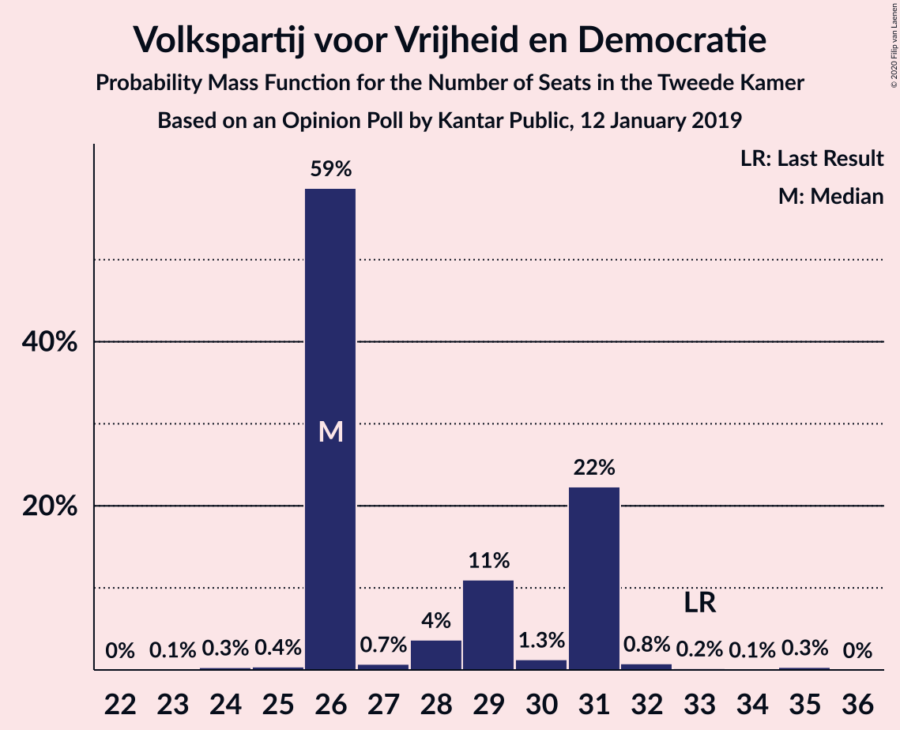

| Number of Seats | Probability | Accumulated | Special Marks |
|:---------------:|:-----------:|:-----------:|:-------------:|
| 23 | 0.3% | 100% |  |
| 24 | 1.3% | 99.6% |  |
| 25 | 0.5% | 98% |  |
| 26 | 3% | 98% |  |
| 27 | 0.2% | 95% |  |
| 28 | 26% | 94% |  |
| 29 | 63% | 69% | Median |
| 30 | 5% | 6% |  |
| 31 | 0.1% | 0.6% |  |
| 32 | 0.2% | 0.5% |  |
| 33 | 0% | 0.3% | Last Result |
| 34 | 0.2% | 0.3% |  |
| 35 | 0% | 0% |  |

### GroenLinks

*For a full overview of the results for this party, see the [GroenLinks](party-groenlinks.html) page.*

| Number of Seats | Probability | Accumulated | Special Marks |
|:---------------:|:-----------:|:-----------:|:-------------:|
| 14 | 0% | 100% | Last Result |
| 15 | 0% | 100% |  |
| 16 | 58% | 100% | Median |
| 17 | 4% | 42% |  |
| 18 | 23% | 39% |  |
| 19 | 6% | 16% |  |
| 20 | 2% | 10% |  |
| 21 | 0.3% | 9% |  |
| 22 | 8% | 8% |  |
| 23 | 0.1% | 0.1% |  |
| 24 | 0% | 0% |  |

### Partij voor de Vrijheid

*For a full overview of the results for this party, see the [Partij voor de Vrijheid](party-partijvoordevrijheid.html) page.*

| Number of Seats | Probability | Accumulated | Special Marks |
|:---------------:|:-----------:|:-----------:|:-------------:|
| 13 | 0.2% | 100% |  |
| 14 | 0% | 99.8% |  |
| 15 | 3% | 99.8% |  |
| 16 | 30% | 96% |  |
| 17 | 62% | 66% | Median |
| 18 | 4% | 5% |  |
| 19 | 0.6% | 1.0% |  |
| 20 | 0.1% | 0.4% | Last Result |
| 21 | 0.3% | 0.3% |  |
| 22 | 0% | 0% |  |

### Christen-Democratisch Appèl

*For a full overview of the results for this party, see the [Christen-Democratisch Appèl](party-christen-democratischappèl.html) page.*

| Number of Seats | Probability | Accumulated | Special Marks |
|:---------------:|:-----------:|:-----------:|:-------------:|
| 13 | 0.3% | 100% |  |
| 14 | 19% | 99.6% |  |
| 15 | 53% | 81% | Median |
| 16 | 26% | 28% |  |
| 17 | 0.5% | 3% |  |
| 18 | 1.1% | 2% |  |
| 19 | 0.7% | 1.0% | Last Result |
| 20 | 0.2% | 0.3% |  |
| 21 | 0% | 0% |  |

### Democraten 66

*For a full overview of the results for this party, see the [Democraten 66](party-democraten66.html) page.*

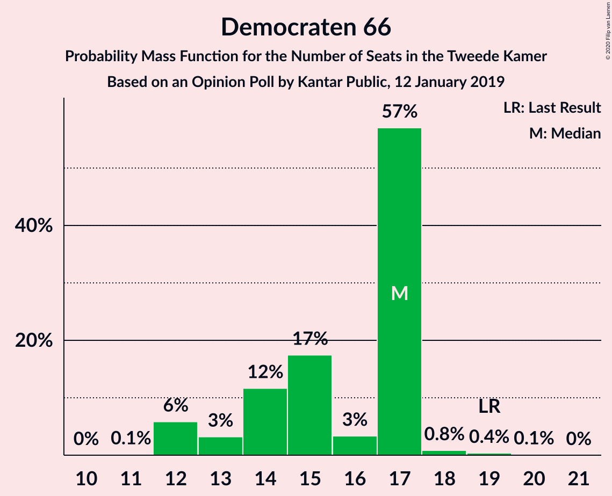

| Number of Seats | Probability | Accumulated | Special Marks |
|:---------------:|:-----------:|:-----------:|:-------------:|
| 11 | 0.2% | 100% |  |
| 12 | 64% | 99.8% | Median |
| 13 | 3% | 36% |  |
| 14 | 2% | 34% |  |
| 15 | 5% | 32% |  |
| 16 | 23% | 27% |  |
| 17 | 0.2% | 4% |  |
| 18 | 0.3% | 4% |  |
| 19 | 3% | 3% | Last Result |
| 20 | 0% | 0% |  |

### Socialistische Partij

*For a full overview of the results for this party, see the [Socialistische Partij](party-socialistischepartij.html) page.*

| Number of Seats | Probability | Accumulated | Special Marks |
|:---------------:|:-----------:|:-----------:|:-------------:|
| 9 | 2% | 100% |  |
| 10 | 0.6% | 98% |  |
| 11 | 2% | 97% |  |
| 12 | 0.3% | 95% |  |
| 13 | 37% | 95% |  |
| 14 | 5% | 58% | Last Result |
| 15 | 53% | 53% | Median |
| 16 | 0.1% | 0.1% |  |
| 17 | 0.1% | 0.1% |  |
| 18 | 0% | 0% |  |

### Forum voor Democratie

*For a full overview of the results for this party, see the [Forum voor Democratie](party-forumvoordemocratie.html) page.*

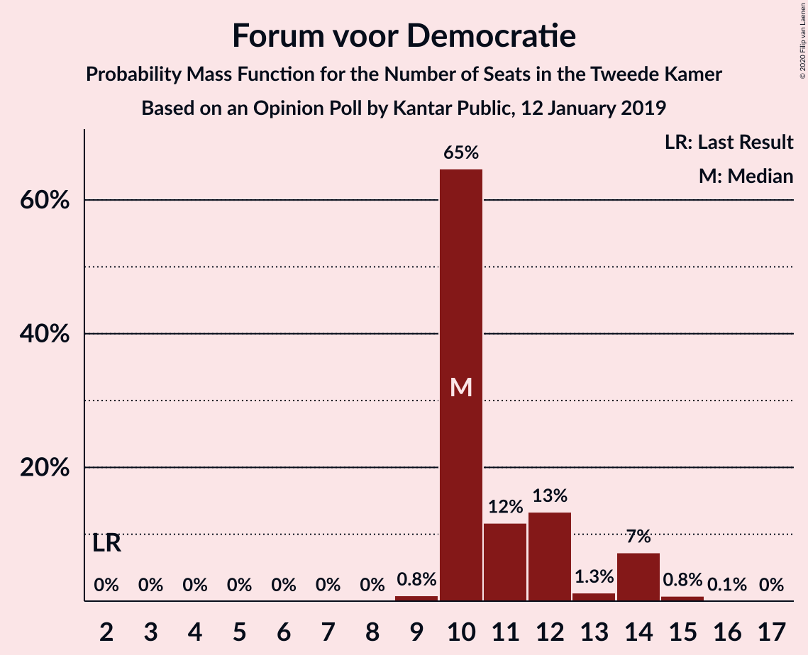

| Number of Seats | Probability | Accumulated | Special Marks |
|:---------------:|:-----------:|:-----------:|:-------------:|
| 2 | 0% | 100% | Last Result |
| 3 | 0% | 100% |  |
| 4 | 0% | 100% |  |
| 5 | 0% | 100% |  |
| 6 | 0% | 100% |  |
| 7 | 0% | 100% |  |
| 8 | 0% | 100% |  |
| 9 | 0.4% | 99.9% |  |
| 10 | 23% | 99.6% |  |
| 11 | 0.4% | 77% |  |
| 12 | 7% | 76% |  |
| 13 | 0.8% | 69% |  |
| 14 | 64% | 69% | Median |
| 15 | 5% | 5% |  |
| 16 | 0% | 0% |  |

### Partij van de Arbeid

*For a full overview of the results for this party, see the [Partij van de Arbeid](party-partijvandearbeid.html) page.*

| Number of Seats | Probability | Accumulated | Special Marks |
|:---------------:|:-----------:|:-----------:|:-------------:|
| 6 | 0.1% | 100% |  |
| 7 | 0.1% | 99.9% |  |
| 8 | 0.6% | 99.9% |  |
| 9 | 8% | 99.3% | Last Result |
| 10 | 85% | 91% | Median |
| 11 | 3% | 6% |  |
| 12 | 2% | 3% |  |
| 13 | 0.7% | 0.8% |  |
| 14 | 0.1% | 0.1% |  |
| 15 | 0% | 0% |  |

### ChristenUnie

*For a full overview of the results for this party, see the [ChristenUnie](party-christenunie.html) page.*

| Number of Seats | Probability | Accumulated | Special Marks |
|:---------------:|:-----------:|:-----------:|:-------------:|
| 4 | 0.5% | 100% |  |
| 5 | 2% | 99.5% | Last Result |
| 6 | 30% | 98% |  |
| 7 | 58% | 68% | Median |
| 8 | 8% | 10% |  |
| 9 | 2% | 2% |  |
| 10 | 0% | 0% |  |

### Partij voor de Dieren

*For a full overview of the results for this party, see the [Partij voor de Dieren](party-partijvoordedieren.html) page.*

| Number of Seats | Probability | Accumulated | Special Marks |
|:---------------:|:-----------:|:-----------:|:-------------:|
| 3 | 0.4% | 100% |  |
| 4 | 31% | 99.6% |  |
| 5 | 54% | 68% | Last Result, Median |
| 6 | 12% | 14% |  |
| 7 | 2% | 2% |  |
| 8 | 0.2% | 0.3% |  |
| 9 | 0% | 0% |  |

### 50Plus

*For a full overview of the results for this party, see the [50Plus](party-50plus.html) page.*

| Number of Seats | Probability | Accumulated | Special Marks |
|:---------------:|:-----------:|:-----------:|:-------------:|
| 2 | 13% | 100% |  |
| 3 | 5% | 87% |  |
| 4 | 6% | 82% | Last Result |
| 5 | 75% | 76% | Median |
| 6 | 0.2% | 0.2% |  |
| 7 | 0% | 0% |  |

### Staatkundig Gereformeerde Partij

*For a full overview of the results for this party, see the [Staatkundig Gereformeerde Partij](party-staatkundiggereformeerdepartij.html) page.*

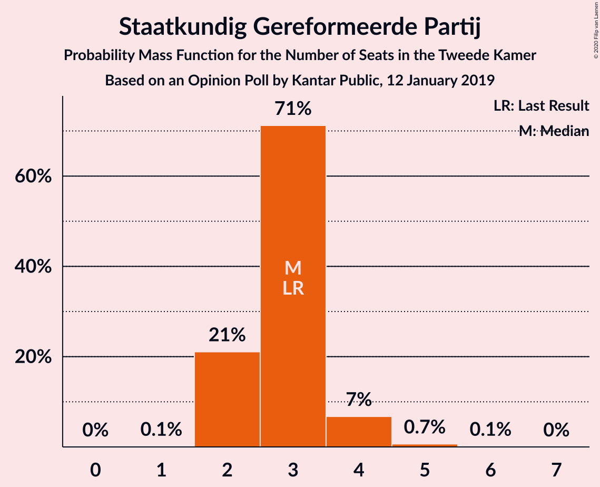

| Number of Seats | Probability | Accumulated | Special Marks |
|:---------------:|:-----------:|:-----------:|:-------------:|
| 1 | 0.1% | 100% |  |
| 2 | 86% | 99.9% | Median |
| 3 | 0.6% | 14% | Last Result |
| 4 | 11% | 14% |  |
| 5 | 3% | 3% |  |
| 6 | 0% | 0% |  |

### DENK

*For a full overview of the results for this party, see the [DENK](party-denk.html) page.*

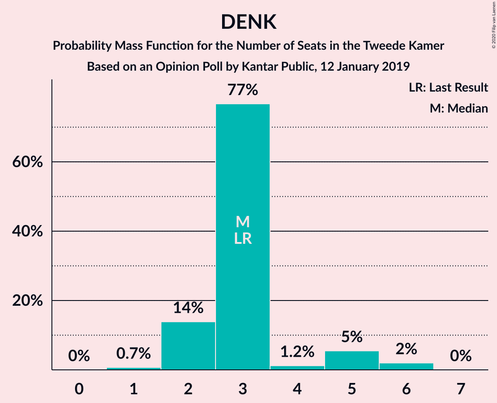

| Number of Seats | Probability | Accumulated | Special Marks |
|:---------------:|:-----------:|:-----------:|:-------------:|
| 1 | 0.6% | 100% |  |
| 2 | 13% | 99.4% |  |
| 3 | 58% | 87% | Last Result, Median |
| 4 | 3% | 29% |  |
| 5 | 3% | 26% |  |
| 6 | 22% | 22% |  |
| 7 | 0% | 0% |  |

## Coalitions

### Confidence Intervals

| Coalition | Last Result | Median | Majority? | 80% Confidence Interval | 90% Confidence Interval | 95% Confidence Interval | 99% Confidence Interval |
|:---------:|:-----------:|:------:|:---------:|:-----------------------:|:-----------------------:|:-----------------------:|:-----------------------:|
| Volkspartij voor Vrijheid en Democratie – GroenLinks – Christen-Democratisch Appèl – Democraten 66 – ChristenUnie | 90 | 79 | 100% | 79–85 | 79–85 | 79–85 | 79–89 |
| GroenLinks – Christen-Democratisch Appèl – Democraten 66 – Socialistische Partij – Partij van de Arbeid – ChristenUnie | 80 | 75 | 45% | 75–79 | 75–79 | 75–79 | 72–83 |
| Volkspartij voor Vrijheid en Democratie – Partij voor de Vrijheid – Christen-Democratisch Appèl – Forum voor Democratie – Staatkundig Gereformeerde Partij | 77 | 77 | 72% | 72–77 | 72–78 | 71–78 | 71–80 |
| Volkspartij voor Vrijheid en Democratie – Christen-Democratisch Appèl – Democraten 66 – Partij van de Arbeid – ChristenUnie | 85 | 73 | 32% | 72–76 | 72–76 | 71–77 | 69–83 |
| Volkspartij voor Vrijheid en Democratie – Partij voor de Vrijheid – Christen-Democratisch Appèl – Forum voor Democratie | 74 | 75 | 0.9% | 70–75 | 70–75 | 69–75 | 69–76 |
| GroenLinks – Christen-Democratisch Appèl – Democraten 66 – Partij van de Arbeid – ChristenUnie | 66 | 60 | 0% | 60–66 | 60–66 | 60–68 | 60–72 |
| Volkspartij voor Vrijheid en Democratie – Christen-Democratisch Appèl – Democraten 66 – ChristenUnie | 76 | 63 | 0% | 63–66 | 61–66 | 60–67 | 60–70 |
| Volkspartij voor Vrijheid en Democratie – Christen-Democratisch Appèl – Forum voor Democratie – 50Plus – Staatkundig Gereformeerde Partij | 61 | 65 | 0% | 61–65 | 61–65 | 59–65 | 58–66 |
| Volkspartij voor Vrijheid en Democratie – Christen-Democratisch Appèl – Forum voor Democratie – 50Plus | 58 | 63 | 0% | 59–63 | 58–63 | 57–63 | 55–63 |
| Volkspartij voor Vrijheid en Democratie – Partij voor de Vrijheid – Christen-Democratisch Appèl | 72 | 61 | 0% | 60–61 | 59–61 | 57–61 | 57–63 |
| Volkspartij voor Vrijheid en Democratie – Christen-Democratisch Appèl – Forum voor Democratie – Staatkundig Gereformeerde Partij | 57 | 60 | 0% | 56–61 | 56–61 | 56–61 | 53–61 |
| Volkspartij voor Vrijheid en Democratie – Christen-Democratisch Appèl – Democraten 66 | 71 | 56 | 0% | 55–60 | 55–60 | 54–61 | 54–61 |
| Volkspartij voor Vrijheid en Democratie – Christen-Democratisch Appèl – Forum voor Democratie | 54 | 58 | 0% | 54–58 | 54–59 | 54–59 | 51–59 |
| Volkspartij voor Vrijheid en Democratie – Democraten 66 – Partij van de Arbeid | 61 | 51 | 0% | 50–54 | 49–55 | 49–57 | 46–57 |
| Volkspartij voor Vrijheid en Democratie – Christen-Democratisch Appèl – Partij van de Arbeid | 61 | 54 | 0% | 52–54 | 52–54 | 52–55 | 50–59 |
| Volkspartij voor Vrijheid en Democratie – Christen-Democratisch Appèl | 52 | 44 | 0% | 43–44 | 42–44 | 42–44 | 40–47 |
| Christen-Democratisch Appèl – Democraten 66 – Partij van de Arbeid | 47 | 37 | 0% | 37–42 | 35–42 | 35–43 | 35–44 |
| Volkspartij voor Vrijheid en Democratie – Partij van de Arbeid | 42 | 39 | 0% | 38–39 | 37–40 | 37–41 | 33–42 |
| Christen-Democratisch Appèl – Partij van de Arbeid – ChristenUnie | 33 | 32 | 0% | 31–32 | 31–33 | 30–33 | 30–38 |
| Christen-Democratisch Appèl – Democraten 66 | 38 | 27 | 0% | 27–32 | 26–32 | 26–33 | 26–33 |
| Christen-Democratisch Appèl – Partij van de Arbeid | 28 | 25 | 0% | 24–26 | 23–27 | 23–27 | 23–30 |

### Volkspartij voor Vrijheid en Democratie – GroenLinks – Christen-Democratisch Appèl – Democraten 66 – ChristenUnie

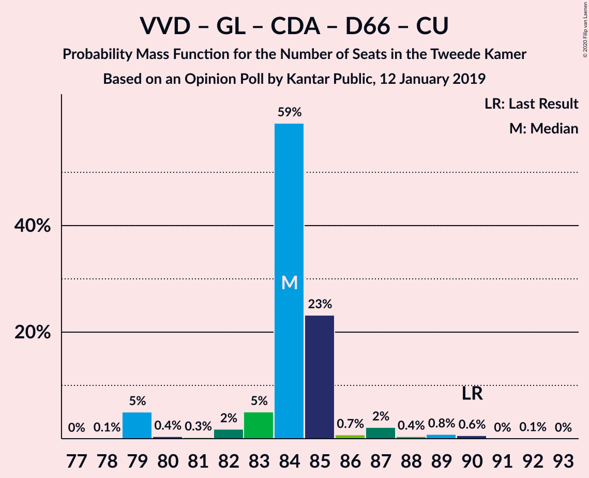

| Number of Seats | Probability | Accumulated | Special Marks |
|:---------------:|:-----------:|:-----------:|:-------------:|
| 78 | 0.1% | 100% |  |
| 79 | 56% | 99.9% | Median |
| 80 | 2% | 44% |  |
| 81 | 0.7% | 42% |  |
| 82 | 5% | 42% |  |
| 83 | 0.5% | 37% |  |
| 84 | 26% | 36% |  |
| 85 | 9% | 10% |  |
| 86 | 0% | 1.2% |  |
| 87 | 0% | 1.2% |  |
| 88 | 0.5% | 1.2% |  |
| 89 | 0.3% | 0.6% |  |
| 90 | 0% | 0.3% | Last Result |
| 91 | 0.2% | 0.3% |  |
| 92 | 0% | 0% |  |

### GroenLinks – Christen-Democratisch Appèl – Democraten 66 – Socialistische Partij – Partij van de Arbeid – ChristenUnie

| Number of Seats | Probability | Accumulated | Special Marks |
|:---------------:|:-----------:|:-----------:|:-------------:|
| 72 | 2% | 100% |  |
| 73 | 0.3% | 98% |  |
| 74 | 0% | 98% |  |
| 75 | 53% | 98% | Median |
| 76 | 5% | 45% | Majority |
| 77 | 3% | 40% |  |
| 78 | 8% | 37% |  |
| 79 | 26% | 29% |  |
| 80 | 0.1% | 2% | Last Result |
| 81 | 0.6% | 2% |  |
| 82 | 1.0% | 2% |  |
| 83 | 0.7% | 0.8% |  |
| 84 | 0.1% | 0.1% |  |
| 85 | 0% | 0% |  |

### Volkspartij voor Vrijheid en Democratie – Partij voor de Vrijheid – Christen-Democratisch Appèl – Forum voor Democratie – Staatkundig Gereformeerde Partij

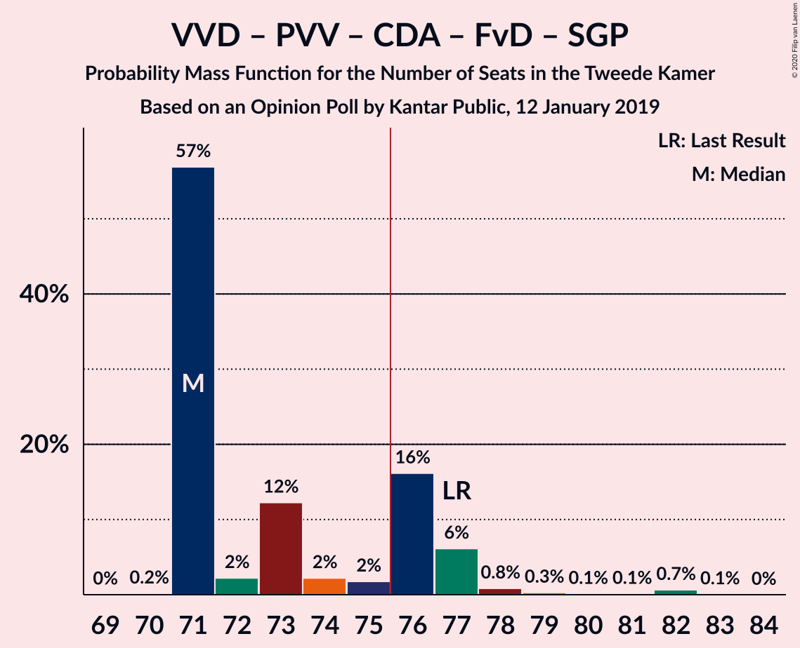

| Number of Seats | Probability | Accumulated | Special Marks |
|:---------------:|:-----------:|:-----------:|:-------------:|
| 70 | 0.1% | 100% |  |
| 71 | 4% | 99.9% |  |
| 72 | 23% | 96% |  |
| 73 | 0.1% | 74% |  |
| 74 | 2% | 74% |  |
| 75 | 0.2% | 72% |  |
| 76 | 0.2% | 72% | Majority |
| 77 | 62% | 71% | Last Result, Median |
| 78 | 8% | 9% |  |
| 79 | 0.3% | 1.1% |  |
| 80 | 0.5% | 0.8% |  |
| 81 | 0% | 0.3% |  |
| 82 | 0.2% | 0.2% |  |
| 83 | 0% | 0% |  |

### Volkspartij voor Vrijheid en Democratie – Christen-Democratisch Appèl – Democraten 66 – Partij van de Arbeid – ChristenUnie

| Number of Seats | Probability | Accumulated | Special Marks |
|:---------------:|:-----------:|:-----------:|:-------------:|
| 69 | 0.5% | 100% |  |
| 70 | 0% | 99.4% |  |
| 71 | 3% | 99.4% |  |
| 72 | 8% | 96% |  |
| 73 | 55% | 88% | Median |
| 74 | 0.1% | 33% |  |
| 75 | 1.1% | 33% |  |
| 76 | 28% | 32% | Majority |
| 77 | 3% | 4% |  |
| 78 | 0% | 1.0% |  |
| 79 | 0% | 1.0% |  |
| 80 | 0.1% | 1.0% |  |
| 81 | 0% | 0.9% |  |
| 82 | 0.4% | 0.9% |  |
| 83 | 0.5% | 0.5% |  |
| 84 | 0% | 0% |  |
| 85 | 0% | 0% | Last Result |

### Volkspartij voor Vrijheid en Democratie – Partij voor de Vrijheid – Christen-Democratisch Appèl – Forum voor Democratie

| Number of Seats | Probability | Accumulated | Special Marks |
|:---------------:|:-----------:|:-----------:|:-------------:|
| 67 | 0.1% | 100% |  |
| 68 | 0.1% | 99.9% |  |
| 69 | 4% | 99.8% |  |
| 70 | 22% | 96% |  |
| 71 | 0% | 74% |  |
| 72 | 5% | 74% |  |
| 73 | 2% | 69% |  |
| 74 | 8% | 67% | Last Result |
| 75 | 58% | 59% | Median |
| 76 | 0.5% | 0.9% | Majority |
| 77 | 0.1% | 0.4% |  |
| 78 | 0% | 0.2% |  |
| 79 | 0% | 0.2% |  |
| 80 | 0.2% | 0.2% |  |
| 81 | 0% | 0% |  |

### GroenLinks – Christen-Democratisch Appèl – Democraten 66 – Partij van de Arbeid – ChristenUnie

| Number of Seats | Probability | Accumulated | Special Marks |
|:---------------:|:-----------:|:-----------:|:-------------:|
| 60 | 53% | 100% | Median |
| 61 | 0% | 47% |  |
| 62 | 5% | 47% |  |
| 63 | 2% | 42% |  |
| 64 | 4% | 40% |  |
| 65 | 8% | 37% |  |
| 66 | 26% | 28% | Last Result |
| 67 | 0.2% | 3% |  |
| 68 | 0.1% | 3% |  |
| 69 | 0.5% | 2% |  |
| 70 | 0.3% | 2% |  |
| 71 | 1.0% | 2% |  |
| 72 | 0.4% | 0.7% |  |
| 73 | 0.3% | 0.3% |  |
| 74 | 0% | 0% |  |

### Volkspartij voor Vrijheid en Democratie – Christen-Democratisch Appèl – Democraten 66 – ChristenUnie

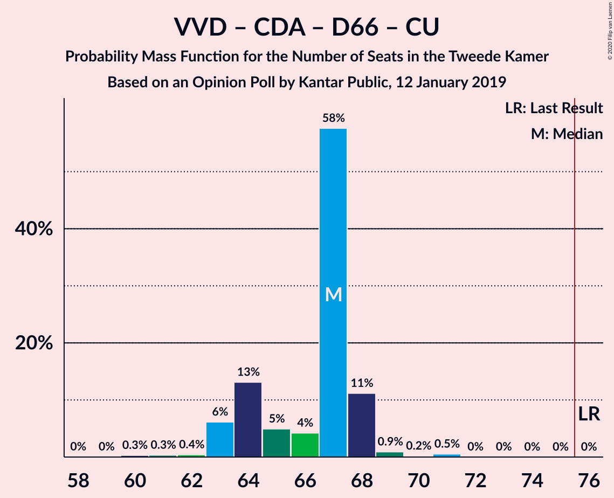

| Number of Seats | Probability | Accumulated | Special Marks |
|:---------------:|:-----------:|:-----------:|:-------------:|
| 58 | 0% | 100% |  |
| 59 | 0.1% | 99.9% |  |
| 60 | 3% | 99.9% |  |
| 61 | 3% | 97% |  |
| 62 | 0.1% | 94% |  |
| 63 | 61% | 94% | Median |
| 64 | 0.1% | 33% |  |
| 65 | 1.2% | 33% |  |
| 66 | 27% | 32% |  |
| 67 | 4% | 5% |  |
| 68 | 0.1% | 1.1% |  |
| 69 | 0.4% | 1.0% |  |
| 70 | 0.3% | 0.6% |  |
| 71 | 0% | 0.3% |  |
| 72 | 0% | 0.3% |  |
| 73 | 0.2% | 0.3% |  |
| 74 | 0% | 0% |  |
| 75 | 0% | 0% |  |
| 76 | 0% | 0% | Last Result, Majority |

### Volkspartij voor Vrijheid en Democratie – Christen-Democratisch Appèl – Forum voor Democratie – 50Plus – Staatkundig Gereformeerde Partij

| Number of Seats | Probability | Accumulated | Special Marks |
|:---------------:|:-----------:|:-----------:|:-------------:|
| 55 | 0.3% | 100% |  |
| 56 | 0.1% | 99.7% |  |
| 57 | 0% | 99.6% |  |
| 58 | 0.1% | 99.6% |  |
| 59 | 4% | 99.5% |  |
| 60 | 0% | 96% |  |
| 61 | 23% | 96% | Last Result |
| 62 | 0.6% | 72% |  |
| 63 | 16% | 72% |  |
| 64 | 0% | 56% |  |
| 65 | 55% | 56% | Median |
| 66 | 0.2% | 0.5% |  |
| 67 | 0.1% | 0.3% |  |
| 68 | 0.2% | 0.3% |  |
| 69 | 0% | 0% |  |

### Volkspartij voor Vrijheid en Democratie – Christen-Democratisch Appèl – Forum voor Democratie – 50Plus

| Number of Seats | Probability | Accumulated | Special Marks |
|:---------------:|:-----------:|:-----------:|:-------------:|
| 52 | 0.3% | 100% |  |
| 53 | 0.1% | 99.7% |  |
| 54 | 0.1% | 99.6% |  |
| 55 | 0% | 99.5% |  |
| 56 | 0% | 99.5% |  |
| 57 | 4% | 99.5% |  |
| 58 | 3% | 96% | Last Result |
| 59 | 31% | 93% |  |
| 60 | 0.4% | 61% |  |
| 61 | 8% | 61% |  |
| 62 | 0.2% | 53% |  |
| 63 | 53% | 53% | Median |
| 64 | 0% | 0.4% |  |
| 65 | 0.1% | 0.3% |  |
| 66 | 0.2% | 0.2% |  |
| 67 | 0% | 0% |  |

### Volkspartij voor Vrijheid en Democratie – Partij voor de Vrijheid – Christen-Democratisch Appèl

| Number of Seats | Probability | Accumulated | Special Marks |
|:---------------:|:-----------:|:-----------:|:-------------:|
| 56 | 0% | 100% |  |
| 57 | 4% | 99.9% |  |
| 58 | 1.3% | 96% |  |
| 59 | 2% | 95% |  |
| 60 | 39% | 93% |  |
| 61 | 53% | 54% | Median |
| 62 | 0.4% | 2% |  |
| 63 | 0.9% | 1.3% |  |
| 64 | 0.1% | 0.4% |  |
| 65 | 0.1% | 0.3% |  |
| 66 | 0% | 0.3% |  |
| 67 | 0% | 0.3% |  |
| 68 | 0% | 0.3% |  |
| 69 | 0% | 0.2% |  |
| 70 | 0.2% | 0.2% |  |
| 71 | 0% | 0% |  |
| 72 | 0% | 0% | Last Result |

### Volkspartij voor Vrijheid en Democratie – Christen-Democratisch Appèl – Forum voor Democratie – Staatkundig Gereformeerde Partij

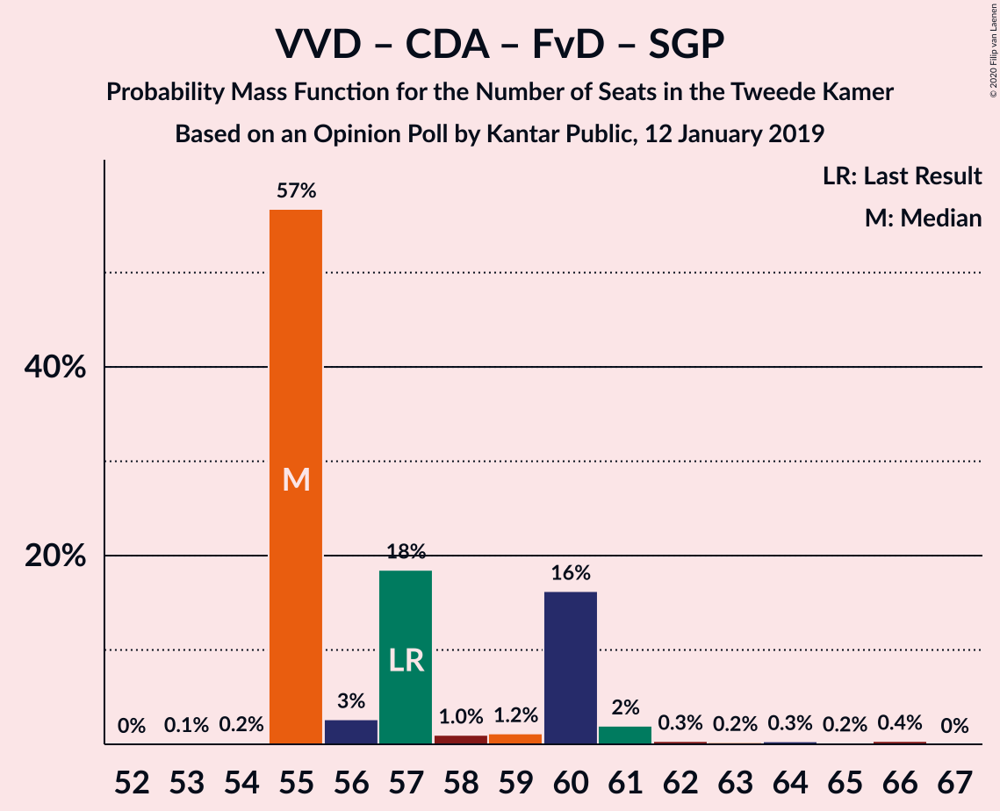

| Number of Seats | Probability | Accumulated | Special Marks |
|:---------------:|:-----------:|:-----------:|:-------------:|
| 51 | 0.3% | 100% |  |
| 52 | 0% | 99.7% |  |
| 53 | 0.2% | 99.7% |  |
| 54 | 0.1% | 99.5% |  |
| 55 | 0.1% | 99.4% |  |
| 56 | 26% | 99.3% |  |
| 57 | 0.6% | 74% | Last Result |
| 58 | 1.4% | 73% |  |
| 59 | 3% | 72% |  |
| 60 | 53% | 69% | Median |
| 61 | 16% | 16% |  |
| 62 | 0% | 0.4% |  |
| 63 | 0% | 0.3% |  |
| 64 | 0.3% | 0.3% |  |
| 65 | 0% | 0% |  |

### Volkspartij voor Vrijheid en Democratie – Christen-Democratisch Appèl – Democraten 66

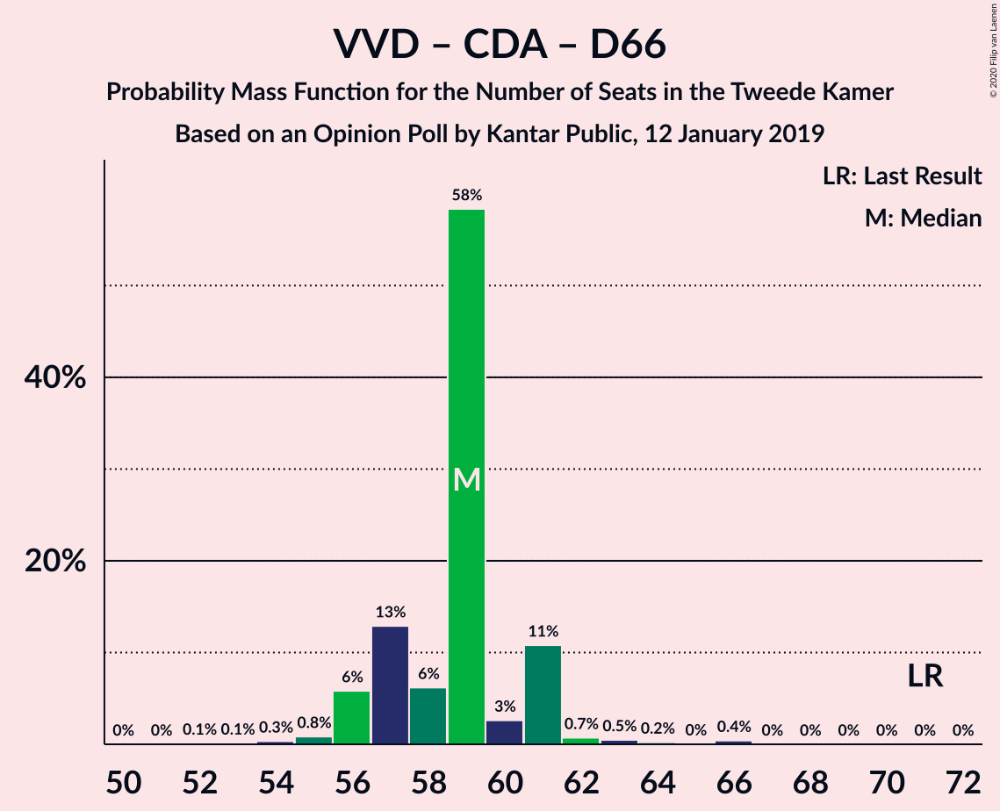

| Number of Seats | Probability | Accumulated | Special Marks |
|:---------------:|:-----------:|:-----------:|:-------------:|
| 52 | 0% | 100% |  |
| 53 | 0.1% | 99.9% |  |
| 54 | 3% | 99.9% |  |
| 55 | 8% | 97% |  |
| 56 | 55% | 88% | Median |
| 57 | 0.6% | 33% |  |
| 58 | 0% | 32% |  |
| 59 | 5% | 32% |  |
| 60 | 23% | 27% |  |
| 61 | 4% | 4% |  |
| 62 | 0.1% | 0.4% |  |
| 63 | 0% | 0.3% |  |
| 64 | 0% | 0.3% |  |
| 65 | 0.2% | 0.3% |  |
| 66 | 0% | 0.1% |  |
| 67 | 0% | 0.1% |  |
| 68 | 0% | 0% |  |
| 69 | 0% | 0% |  |
| 70 | 0% | 0% |  |
| 71 | 0% | 0% | Last Result |

### Volkspartij voor Vrijheid en Democratie – Christen-Democratisch Appèl – Forum voor Democratie

| Number of Seats | Probability | Accumulated | Special Marks |
|:---------------:|:-----------:|:-----------:|:-------------:|
| 48 | 0.3% | 100% |  |
| 49 | 0% | 99.7% |  |
| 50 | 0.1% | 99.7% |  |
| 51 | 0.1% | 99.5% |  |
| 52 | 0.1% | 99.4% |  |
| 53 | 0% | 99.3% |  |
| 54 | 29% | 99.3% | Last Result |
| 55 | 0.6% | 71% |  |
| 56 | 1.3% | 70% |  |
| 57 | 11% | 69% |  |
| 58 | 53% | 58% | Median |
| 59 | 5% | 6% |  |
| 60 | 0% | 0.4% |  |
| 61 | 0% | 0.3% |  |
| 62 | 0.3% | 0.3% |  |
| 63 | 0% | 0% |  |

### Volkspartij voor Vrijheid en Democratie – Democraten 66 – Partij van de Arbeid

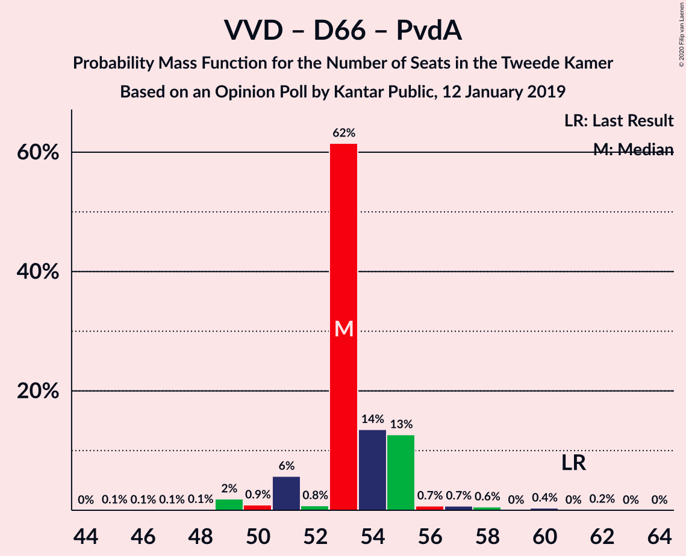

| Number of Seats | Probability | Accumulated | Special Marks |
|:---------------:|:-----------:|:-----------:|:-------------:|
| 45 | 0.2% | 100% |  |
| 46 | 0.5% | 99.8% |  |
| 47 | 0% | 99.3% |  |
| 48 | 1.1% | 99.3% |  |
| 49 | 3% | 98% |  |
| 50 | 8% | 95% |  |
| 51 | 53% | 87% | Median |
| 52 | 0.1% | 34% |  |
| 53 | 0% | 34% |  |
| 54 | 24% | 34% |  |
| 55 | 6% | 10% |  |
| 56 | 0.4% | 4% |  |
| 57 | 4% | 4% |  |
| 58 | 0.3% | 0.4% |  |
| 59 | 0% | 0.1% |  |
| 60 | 0% | 0.1% |  |
| 61 | 0% | 0.1% | Last Result |
| 62 | 0% | 0% |  |

### Volkspartij voor Vrijheid en Democratie – Christen-Democratisch Appèl – Partij van de Arbeid

| Number of Seats | Probability | Accumulated | Special Marks |
|:---------------:|:-----------:|:-----------:|:-------------:|
| 47 | 0.3% | 100% |  |
| 48 | 0.1% | 99.7% |  |
| 49 | 0.2% | 99.7% |  |
| 50 | 0% | 99.5% |  |
| 51 | 0.2% | 99.5% |  |
| 52 | 13% | 99.3% |  |
| 53 | 3% | 86% |  |
| 54 | 80% | 83% | Median |
| 55 | 2% | 3% |  |
| 56 | 0.3% | 1.3% |  |
| 57 | 0.1% | 1.0% |  |
| 58 | 0.3% | 1.0% |  |
| 59 | 0.4% | 0.7% |  |
| 60 | 0% | 0.3% |  |
| 61 | 0% | 0.3% | Last Result |
| 62 | 0.2% | 0.3% |  |
| 63 | 0% | 0% |  |

### Volkspartij voor Vrijheid en Democratie – Christen-Democratisch Appèl

| Number of Seats | Probability | Accumulated | Special Marks |
|:---------------:|:-----------:|:-----------:|:-------------:|
| 37 | 0.3% | 100% |  |
| 38 | 0.1% | 99.7% |  |
| 39 | 0% | 99.6% |  |
| 40 | 0.1% | 99.6% |  |
| 41 | 0.2% | 99.5% |  |
| 42 | 8% | 99.3% |  |
| 43 | 10% | 92% |  |
| 44 | 80% | 82% | Median |
| 45 | 0.4% | 1.3% |  |
| 46 | 0.4% | 1.0% |  |
| 47 | 0.2% | 0.6% |  |
| 48 | 0% | 0.3% |  |
| 49 | 0% | 0.3% |  |
| 50 | 0% | 0.3% |  |
| 51 | 0% | 0.3% |  |
| 52 | 0.2% | 0.2% | Last Result |
| 53 | 0% | 0% |  |

### Christen-Democratisch Appèl – Democraten 66 – Partij van de Arbeid

| Number of Seats | Probability | Accumulated | Special Marks |
|:---------------:|:-----------:|:-----------:|:-------------:|
| 35 | 8% | 100% |  |
| 36 | 0.2% | 92% |  |
| 37 | 53% | 92% | Median |
| 38 | 0.1% | 39% |  |
| 39 | 10% | 39% |  |
| 40 | 0.8% | 29% |  |
| 41 | 0.1% | 28% |  |
| 42 | 24% | 28% |  |
| 43 | 4% | 4% |  |
| 44 | 0.4% | 0.8% |  |
| 45 | 0.3% | 0.4% |  |
| 46 | 0% | 0.1% |  |
| 47 | 0% | 0% | Last Result |

### Volkspartij voor Vrijheid en Democratie – Partij van de Arbeid

| Number of Seats | Probability | Accumulated | Special Marks |
|:---------------:|:-----------:|:-----------:|:-------------:|
| 33 | 0.9% | 100% |  |
| 34 | 1.2% | 99.1% |  |
| 35 | 0% | 98% |  |
| 36 | 0.1% | 98% |  |
| 37 | 3% | 98% |  |
| 38 | 34% | 94% |  |
| 39 | 53% | 61% | Median |
| 40 | 5% | 8% |  |
| 41 | 2% | 3% |  |
| 42 | 0.9% | 1.2% | Last Result |
| 43 | 0.2% | 0.3% |  |
| 44 | 0% | 0.1% |  |
| 45 | 0% | 0.1% |  |
| 46 | 0% | 0% |  |

### Christen-Democratisch Appèl – Partij van de Arbeid – ChristenUnie

| Number of Seats | Probability | Accumulated | Special Marks |
|:---------------:|:-----------:|:-----------:|:-------------:|
| 28 | 0.2% | 100% |  |
| 29 | 0.1% | 99.8% |  |
| 30 | 4% | 99.7% |  |
| 31 | 15% | 96% |  |
| 32 | 75% | 81% | Median |
| 33 | 3% | 6% | Last Result |
| 34 | 0.1% | 2% |  |
| 35 | 0.1% | 2% |  |
| 36 | 0% | 2% |  |
| 37 | 1.1% | 2% |  |
| 38 | 0.7% | 1.1% |  |
| 39 | 0.4% | 0.4% |  |
| 40 | 0% | 0% |  |

### Christen-Democratisch Appèl – Democraten 66

| Number of Seats | Probability | Accumulated | Special Marks |
|:---------------:|:-----------:|:-----------:|:-------------:|
| 26 | 8% | 100% |  |
| 27 | 54% | 92% | Median |
| 28 | 3% | 37% |  |
| 29 | 5% | 34% |  |
| 30 | 0.3% | 29% |  |
| 31 | 0.6% | 29% |  |
| 32 | 24% | 28% |  |
| 33 | 4% | 4% |  |
| 34 | 0.1% | 0.1% |  |
| 35 | 0% | 0.1% |  |
| 36 | 0% | 0.1% |  |
| 37 | 0% | 0% |  |
| 38 | 0% | 0% | Last Result |

### Christen-Democratisch Appèl – Partij van de Arbeid

| Number of Seats | Probability | Accumulated | Special Marks |
|:---------------:|:-----------:|:-----------:|:-------------:|
| 21 | 0.1% | 100% |  |
| 22 | 0.2% | 99.8% |  |
| 23 | 8% | 99.6% |  |
| 24 | 9% | 92% |  |
| 25 | 53% | 83% | Median |
| 26 | 24% | 30% |  |
| 27 | 4% | 6% |  |
| 28 | 1.2% | 2% | Last Result |
| 29 | 0.6% | 1.2% |  |
| 30 | 0.6% | 0.6% |  |
| 31 | 0% | 0.1% |  |
| 32 | 0% | 0% |  |

## Technical Information

### Opinion Poll

+ **Polling firm:** Kantar Public
+ **Commissioner(s):** —
+ **Fieldwork period:** 12 January 2019

### Calculations

+ **Sample size:** 959
+ **Simulations done:** 131,072
+ **Error estimate:** 2.45%

