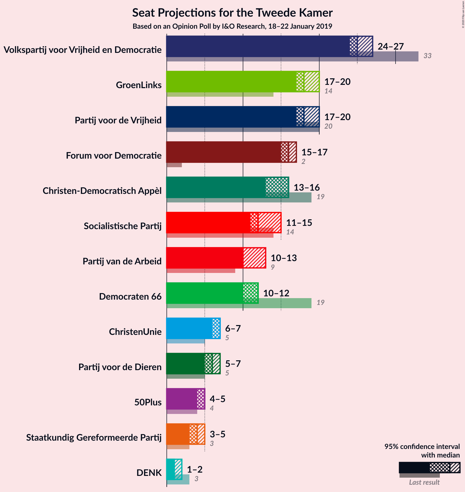
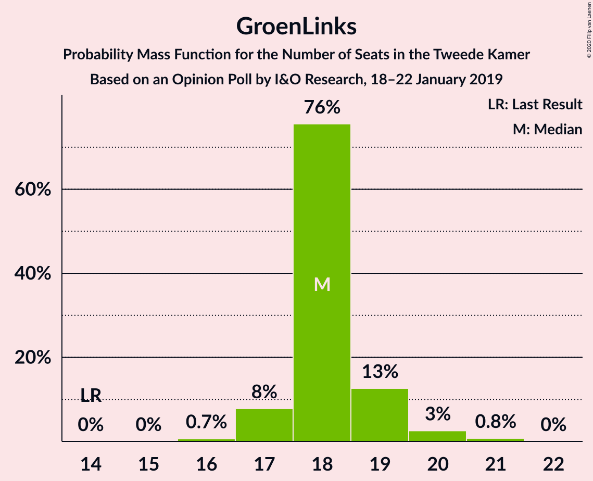
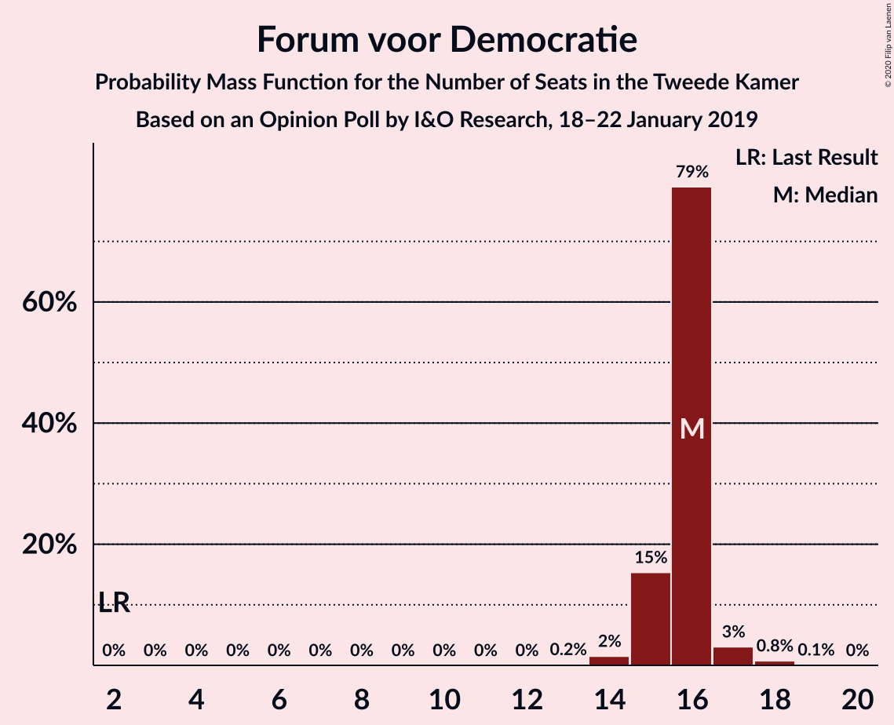
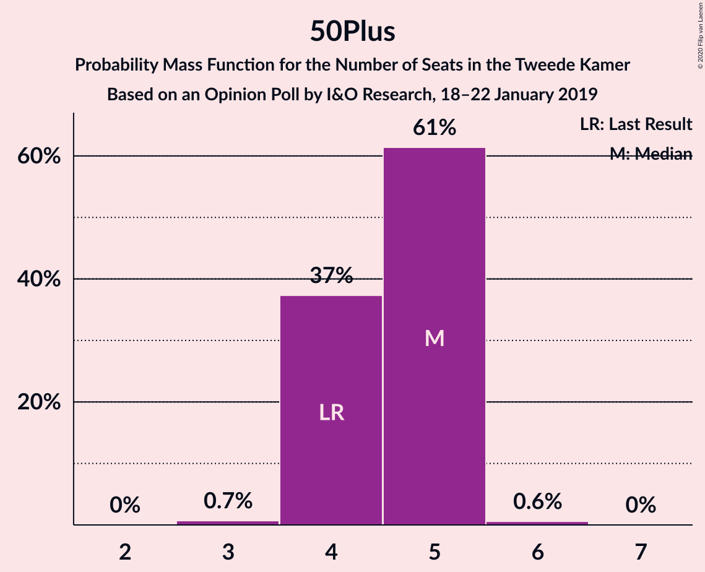
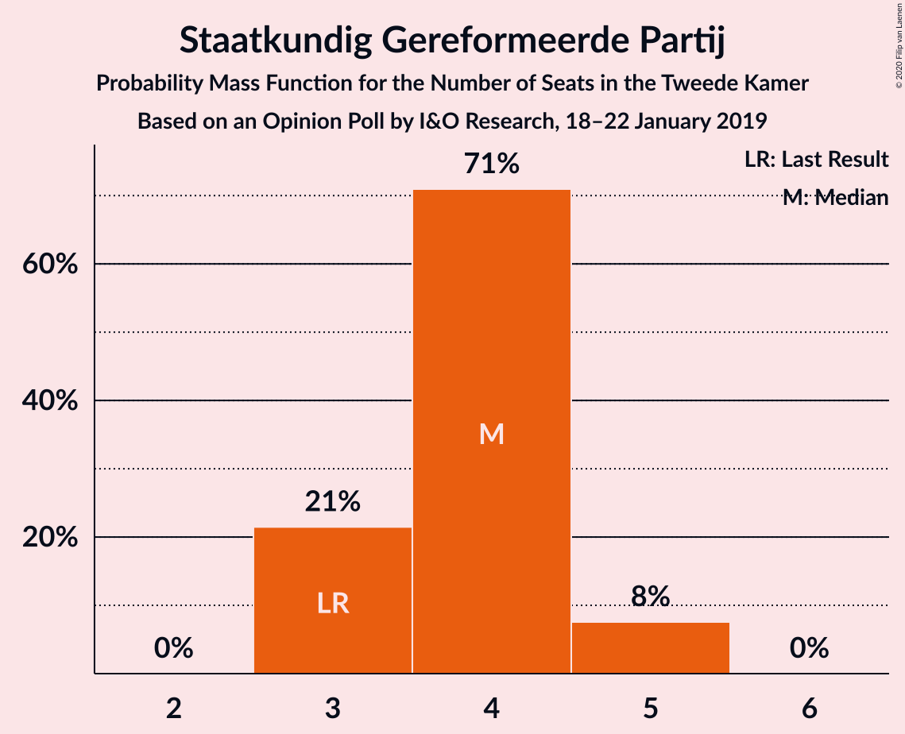
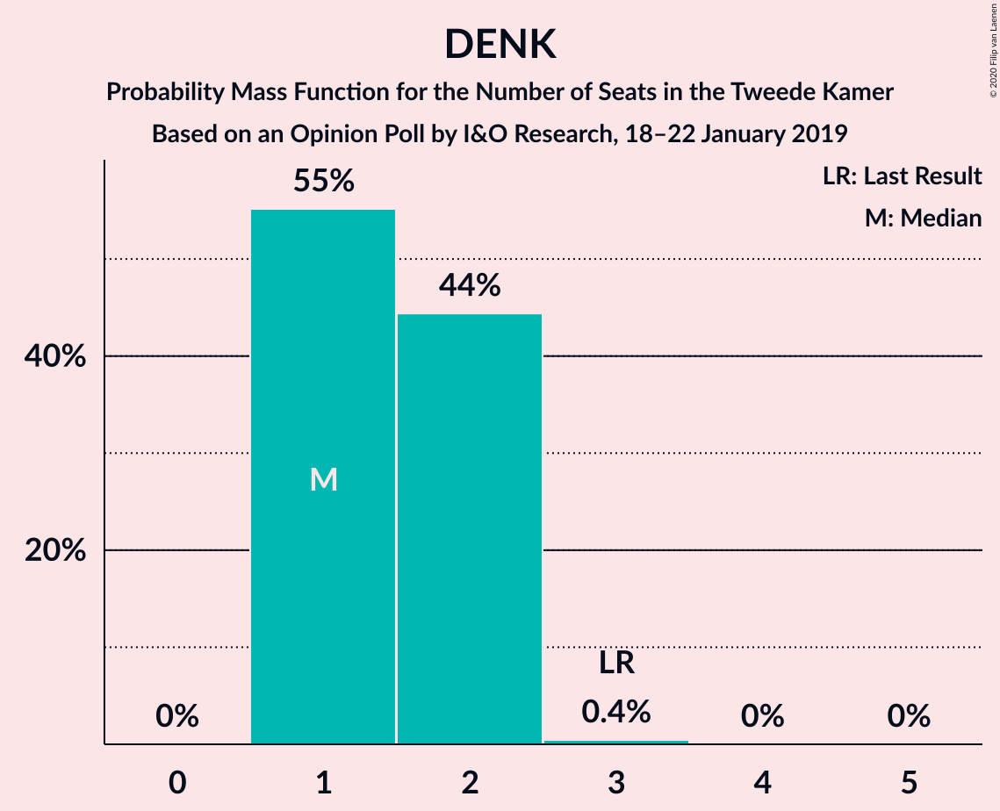
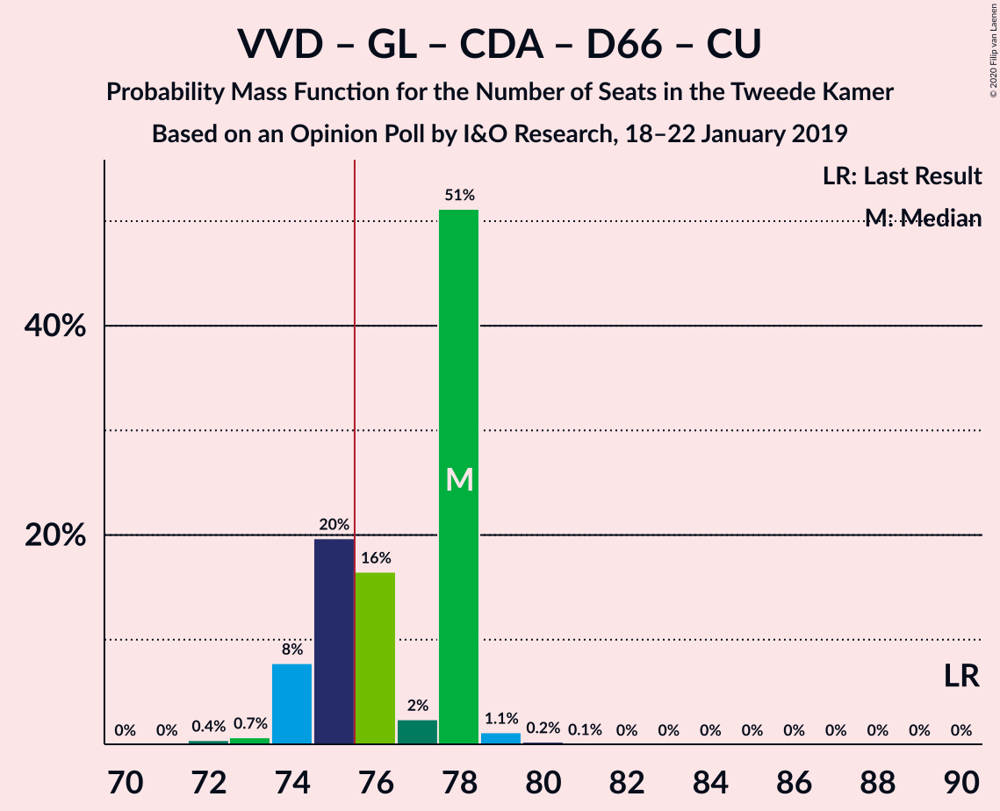
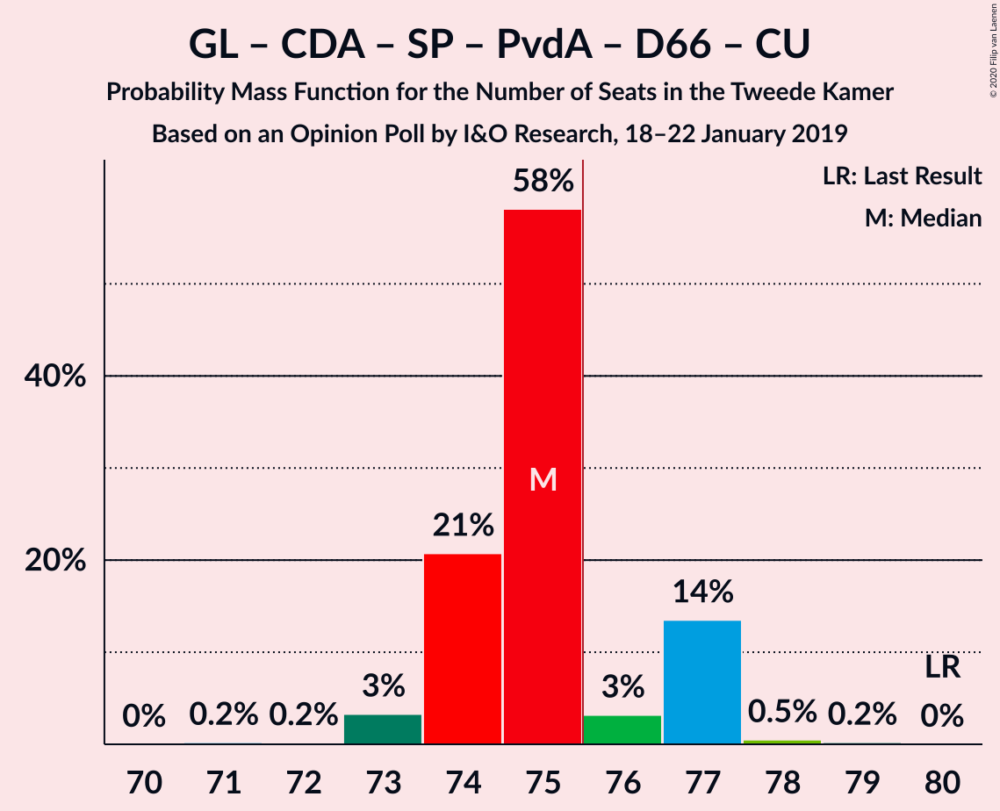
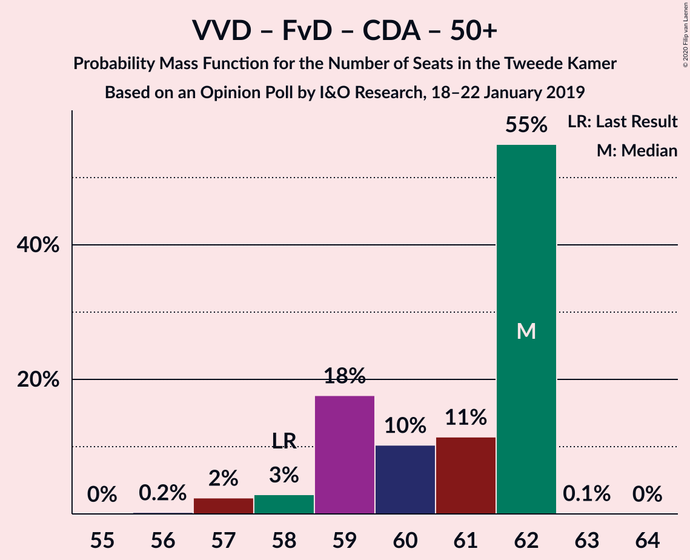
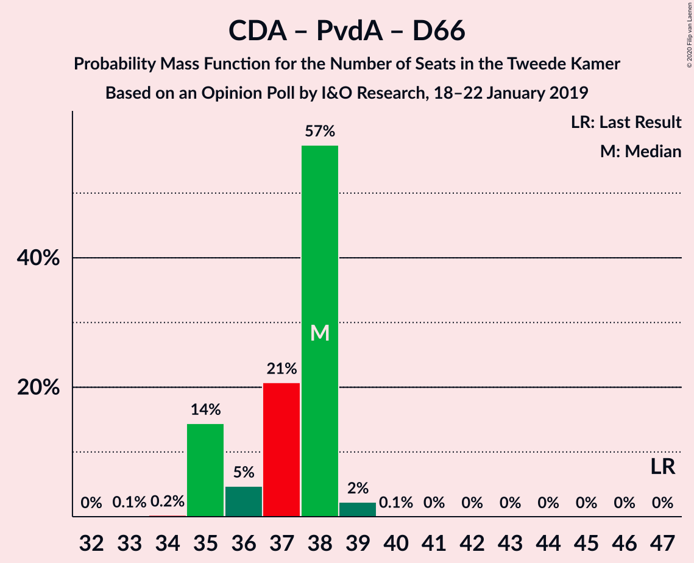

# Opinion Poll by I&O Research, 18–22 January 2019

<a href="#voting-intentions">Voting Intentions</a> | <a href="#seats">Seats</a> | <a href="#coalitions">Coalitions</a> | <a href="#technical-information">Technical Information</a>

## Voting Intentions

### Confidence Intervals

| Party | Last Result | Poll Result | 80% Confidence Interval | 90% Confidence Interval | 95% Confidence Interval | 99% Confidence Interval |
|:-----:|:-----------:|:-----------:|:-----------------------:|:-----------------------:|:-----------------------:|:-----------------------:|
| Volkspartij voor Vrijheid en Democratie | 21.3% | 16.3% | 15.5–17.1% |15.3–17.3% |15.2–17.5% |14.8–17.9% |
| GroenLinks | 9.1% | 12.0% | 11.4–12.7% |11.2–12.9% |11.0–13.1% |10.7–13.5% |
| Partij voor de Vrijheid | 13.1% | 11.8% | 11.2–12.5% |11.0–12.7% |10.8–12.9% |10.5–13.2% |
| Forum voor Democratie | 1.8% | 10.4% | 9.8–11.1% |9.6–11.3% |9.5–11.4% |9.2–11.8% |
| Christen-Democratisch Appèl | 12.4% | 9.6% | 9.0–10.3% |8.8–10.5% |8.7–10.6% |8.4–10.9% |
| Socialistische Partij | 9.1% | 8.6% | 8.0–9.2% |7.9–9.4% |7.7–9.5% |7.5–9.8% |
| Partij van de Arbeid | 5.7% | 7.5% | 7.0–8.1% |6.8–8.2% |6.7–8.4% |6.4–8.7% |
| Democraten 66 | 12.2% | 7.2% | 6.7–7.8% |6.5–7.9% |6.4–8.1% |6.2–8.4% |
| ChristenUnie | 3.4% | 4.8% | 4.4–5.3% |4.3–5.4% |4.1–5.5% |3.9–5.8% |
| Partij voor de Dieren | 3.2% | 4.2% | 3.8–4.7% |3.7–4.8% |3.6–4.9% |3.4–5.1% |
| 50Plus | 3.1% | 3.1% | 2.8–3.5% |2.7–3.6% |2.6–3.7% |2.4–3.9% |
| Staatkundig Gereformeerde Partij | 2.1% | 2.7% | 2.4–3.1% |2.3–3.2% |2.2–3.3% |2.1–3.5% |
| DENK | 2.1% | 1.4% | 1.2–1.7% |1.1–1.8% |1.1–1.8% |1.0–2.0% |

*Note:* The poll result column reflects the actual value used in the calculations. Published results may vary slightly, and in addition be rounded to fewer digits.

## Seats

### Confidence Intervals

| Party | Last Result | Median | 80% Confidence Interval | 90% Confidence Interval | 95% Confidence Interval | 99% Confidence Interval |
|:-----:|:-----------:|:------:|:-----------------------:|:-----------------------:|:-----------------------:|:-----------------------:|
| <a href="#volkspartij-voor-vrijheid-en-democratie">Volkspartij voor Vrijheid en Democratie</a> | 33 | 27 | 26–27 |25–27 |24–27 |23–27 |
| <a href="#groenlinks">GroenLinks</a> | 14 | 18 | 18 |18–19 |18–20 |17–20 |
| <a href="#partij-voor-de-vrijheid">Partij voor de Vrijheid</a> | 20 | 19 | 19 |18–19 |18–19 |17–21 |
| <a href="#forum-voor-democratie">Forum voor Democratie</a> | 2 | 16 | 16 |15–16 |15–16 |14–18 |
| <a href="#christen-democratisch-appèl">Christen-Democratisch Appèl</a> | 19 | 14 | 14 |14–15 |14–15 |14–16 |
| <a href="#socialistische-partij">Socialistische Partij</a> | 14 | 14 | 14 |12–14 |12–14 |12–14 |
| <a href="#partij-van-de-arbeid">Partij van de Arbeid</a> | 9 | 11 | 11 |11–12 |11–12 |10–13 |
| <a href="#democraten-66">Democraten 66</a> | 19 | 10 | 10 |10 |9–11 |9–12 |
| <a href="#christenunie">ChristenUnie</a> | 5 | 7 | 7 |7 |7 |6–8 |
| <a href="#partij-voor-de-dieren">Partij voor de Dieren</a> | 5 | 5 | 5–6 |5–6 |5–6 |5–7 |
| <a href="#50plus">50Plus</a> | 4 | 4 | 4 |4 |4–5 |4–5 |
| <a href="#staatkundig-gereformeerde-partij">Staatkundig Gereformeerde Partij</a> | 3 | 3 | 3 |3–4 |3–4 |3–5 |
| <a href="#denk">DENK</a> | 3 | 2 | 2 |2 |1–2 |1–3 |

### Volkspartij voor Vrijheid en Democratie

*For a full overview of the results for this party, see the [Volkspartij voor Vrijheid en Democratie](party-volkspartijvoorvrijheidendemocratie.html) page.*

| Number of Seats | Probability | Accumulated | Special Marks |
|:---------------:|:-----------:|:-----------:|:-------------:|
| 23 | 0.5% | 100% |  |
| 24 | 3% | 99.5% |  |
| 25 | 6% | 97% |  |
| 26 | 1.4% | 91% |  |
| 27 | 89% | 89% | Median |
| 28 | 0% | 0% |  |
| 29 | 0% | 0% |  |
| 30 | 0% | 0% |  |
| 31 | 0% | 0% |  |
| 32 | 0% | 0% |  |
| 33 | 0% | 0% | Last Result |

### GroenLinks

*For a full overview of the results for this party, see the [GroenLinks](party-groenlinks.html) page.*

| Number of Seats | Probability | Accumulated | Special Marks |
|:---------------:|:-----------:|:-----------:|:-------------:|
| 14 | 0% | 100% | Last Result |
| 15 | 0.2% | 100% |  |
| 16 | 0.2% | 99.8% |  |
| 17 | 0.9% | 99.7% |  |
| 18 | 91% | 98.7% | Median |
| 19 | 3% | 7% |  |
| 20 | 5% | 5% |  |
| 21 | 0% | 0% |  |

### Partij voor de Vrijheid

*For a full overview of the results for this party, see the [Partij voor de Vrijheid](party-partijvoordevrijheid.html) page.*

| Number of Seats | Probability | Accumulated | Special Marks |
|:---------------:|:-----------:|:-----------:|:-------------:|
| 15 | 0.1% | 100% |  |
| 16 | 0.2% | 99.9% |  |
| 17 | 1.3% | 99.6% |  |
| 18 | 6% | 98% |  |
| 19 | 91% | 92% | Median |
| 20 | 0.2% | 1.0% | Last Result |
| 21 | 0.8% | 0.8% |  |
| 22 | 0% | 0% |  |

### Forum voor Democratie

*For a full overview of the results for this party, see the [Forum voor Democratie](party-forumvoordemocratie.html) page.*

| Number of Seats | Probability | Accumulated | Special Marks |
|:---------------:|:-----------:|:-----------:|:-------------:|
| 2 | 0% | 100% | Last Result |
| 3 | 0% | 100% |  |
| 4 | 0% | 100% |  |
| 5 | 0% | 100% |  |
| 6 | 0% | 100% |  |
| 7 | 0% | 100% |  |
| 8 | 0% | 100% |  |
| 9 | 0% | 100% |  |
| 10 | 0% | 100% |  |
| 11 | 0% | 100% |  |
| 12 | 0% | 100% |  |
| 13 | 0% | 100% |  |
| 14 | 2% | 100% |  |
| 15 | 5% | 98% |  |
| 16 | 91% | 93% | Median |
| 17 | 2% | 2% |  |
| 18 | 0.5% | 0.6% |  |
| 19 | 0% | 0% |  |

### Christen-Democratisch Appèl

*For a full overview of the results for this party, see the [Christen-Democratisch Appèl](party-christen-democratischappèl.html) page.*

| Number of Seats | Probability | Accumulated | Special Marks |
|:---------------:|:-----------:|:-----------:|:-------------:|
| 13 | 0.3% | 100% |  |
| 14 | 93% | 99.7% | Median |
| 15 | 6% | 7% |  |
| 16 | 0.9% | 0.9% |  |
| 17 | 0% | 0% |  |
| 18 | 0% | 0% |  |
| 19 | 0% | 0% | Last Result |

### Socialistische Partij

*For a full overview of the results for this party, see the [Socialistische Partij](party-socialistischepartij.html) page.*

| Number of Seats | Probability | Accumulated | Special Marks |
|:---------------:|:-----------:|:-----------:|:-------------:|
| 11 | 0.4% | 100% |  |
| 12 | 5% | 99.6% |  |
| 13 | 4% | 94% |  |
| 14 | 90% | 91% | Last Result, Median |
| 15 | 0.4% | 0.4% |  |
| 16 | 0% | 0% |  |

### Partij van de Arbeid

*For a full overview of the results for this party, see the [Partij van de Arbeid](party-partijvandearbeid.html) page.*

| Number of Seats | Probability | Accumulated | Special Marks |
|:---------------:|:-----------:|:-----------:|:-------------:|
| 9 | 0.3% | 100% | Last Result |
| 10 | 1.2% | 99.7% |  |
| 11 | 93% | 98% | Median |
| 12 | 5% | 5% |  |
| 13 | 0.9% | 1.0% |  |
| 14 | 0.1% | 0.1% |  |
| 15 | 0% | 0% |  |

### Democraten 66

*For a full overview of the results for this party, see the [Democraten 66](party-democraten66.html) page.*

| Number of Seats | Probability | Accumulated | Special Marks |
|:---------------:|:-----------:|:-----------:|:-------------:|
| 9 | 3% | 100% |  |
| 10 | 94% | 97% | Median |
| 11 | 2% | 3% |  |
| 12 | 0.8% | 0.8% |  |
| 13 | 0% | 0% |  |
| 14 | 0% | 0% |  |
| 15 | 0% | 0% |  |
| 16 | 0% | 0% |  |
| 17 | 0% | 0% |  |
| 18 | 0% | 0% |  |
| 19 | 0% | 0% | Last Result |

### ChristenUnie

*For a full overview of the results for this party, see the [ChristenUnie](party-christenunie.html) page.*

| Number of Seats | Probability | Accumulated | Special Marks |
|:---------------:|:-----------:|:-----------:|:-------------:|
| 5 | 0% | 100% | Last Result |
| 6 | 1.1% | 100% |  |
| 7 | 96% | 98.9% | Median |
| 8 | 2% | 2% |  |
| 9 | 0.1% | 0.1% |  |
| 10 | 0% | 0% |  |

### Partij voor de Dieren

*For a full overview of the results for this party, see the [Partij voor de Dieren](party-partijvoordedieren.html) page.*

| Number of Seats | Probability | Accumulated | Special Marks |
|:---------------:|:-----------:|:-----------:|:-------------:|
| 5 | 90% | 100% | Last Result, Median |
| 6 | 9% | 10% |  |
| 7 | 1.3% | 2% |  |
| 8 | 0.4% | 0.5% |  |
| 9 | 0% | 0% |  |

### 50Plus

*For a full overview of the results for this party, see the [50Plus](party-50plus.html) page.*

| Number of Seats | Probability | Accumulated | Special Marks |
|:---------------:|:-----------:|:-----------:|:-------------:|
| 3 | 0.2% | 100% |  |
| 4 | 96% | 99.8% | Last Result, Median |
| 5 | 3% | 3% |  |
| 6 | 0.2% | 0.2% |  |
| 7 | 0% | 0% |  |

### Staatkundig Gereformeerde Partij

*For a full overview of the results for this party, see the [Staatkundig Gereformeerde Partij](party-staatkundiggereformeerdepartij.html) page.*

| Number of Seats | Probability | Accumulated | Special Marks |
|:---------------:|:-----------:|:-----------:|:-------------:|
| 3 | 91% | 100% | Last Result, Median |
| 4 | 7% | 9% |  |
| 5 | 1.3% | 1.3% |  |
| 6 | 0% | 0% |  |

### DENK

*For a full overview of the results for this party, see the [DENK](party-denk.html) page.*

| Number of Seats | Probability | Accumulated | Special Marks |
|:---------------:|:-----------:|:-----------:|:-------------:|
| 1 | 3% | 100% |  |
| 2 | 95% | 97% | Median |
| 3 | 2% | 2% | Last Result |
| 4 | 0% | 0% |  |

## Coalitions

### Confidence Intervals

| Coalition | Last Result | Median | Majority? | 80% Confidence Interval | 90% Confidence Interval | 95% Confidence Interval | 99% Confidence Interval |
|:---------:|:-----------:|:------:|:---------:|:-----------------------:|:-----------------------:|:-----------------------:|:-----------------------:|
| Volkspartij voor Vrijheid en Democratie – Partij voor de Vrijheid – Forum voor Democratie – Christen-Democratisch Appèl – Staatkundig Gereformeerde Partij | 77 | 79 | 98.5% | 79 | 77–79 | 77–79 | 73–80 |
| Volkspartij voor Vrijheid en Democratie – GroenLinks – Christen-Democratisch Appèl – Democraten 66 – ChristenUnie | 90 | 76 | 95% | 76 | 76–77 | 73–77 | 72–78 |
| Volkspartij voor Vrijheid en Democratie – Partij voor de Vrijheid – Forum voor Democratie – Christen-Democratisch Appèl | 74 | 76 | 89% | 75–76 | 73–76 | 73–76 | 70–76 |
| GroenLinks – Christen-Democratisch Appèl – Socialistische Partij – Partij van de Arbeid – Democraten 66 – ChristenUnie | 80 | 74 | 2% | 74 | 74–75 | 74–75 | 73–78 |
| Volkspartij voor Vrijheid en Democratie – Christen-Democratisch Appèl – Partij van de Arbeid – Democraten 66 – ChristenUnie | 85 | 69 | 0% | 69 | 68–69 | 67–69 | 66–71 |
| Volkspartij voor Vrijheid en Democratie – Forum voor Democratie – Christen-Democratisch Appèl – 50Plus – Staatkundig Gereformeerde Partij | 61 | 64 | 0% | 64 | 63–64 | 63–64 | 61–66 |
| GroenLinks – Christen-Democratisch Appèl – Partij van de Arbeid – Democraten 66 – ChristenUnie | 66 | 60 | 0% | 60 | 60–63 | 60–63 | 60–65 |
| Volkspartij voor Vrijheid en Democratie – Forum voor Democratie – Christen-Democratisch Appèl – 50Plus | 58 | 61 | 0% | 61 | 59–61 | 59–61 | 57–62 |
| Volkspartij voor Vrijheid en Democratie – Forum voor Democratie – Christen-Democratisch Appèl – Staatkundig Gereformeerde Partij | 57 | 60 | 0% | 60 | 59–60 | 58–60 | 56–62 |
| Volkspartij voor Vrijheid en Democratie – Partij voor de Vrijheid – Christen-Democratisch Appèl | 72 | 60 | 0% | 60 | 58–60 | 57–60 | 55–61 |
| Volkspartij voor Vrijheid en Democratie – Christen-Democratisch Appèl – Democraten 66 – ChristenUnie | 76 | 58 | 0% | 58 | 57–58 | 55–58 | 54–60 |
| Volkspartij voor Vrijheid en Democratie – Forum voor Democratie – Christen-Democratisch Appèl | 54 | 57 | 0% | 57 | 55–57 | 55–57 | 53–57 |
| Volkspartij voor Vrijheid en Democratie – Christen-Democratisch Appèl – Partij van de Arbeid | 61 | 52 | 0% | 52 | 51–52 | 51–52 | 49–52 |
| Volkspartij voor Vrijheid en Democratie – Christen-Democratisch Appèl – Democraten 66 | 71 | 51 | 0% | 51 | 50–51 | 48–51 | 47–52 |
| Volkspartij voor Vrijheid en Democratie – Partij van de Arbeid – Democraten 66 | 61 | 48 | 0% | 48 | 46–48 | 46–48 | 44–49 |
| Volkspartij voor Vrijheid en Democratie – Christen-Democratisch Appèl | 52 | 41 | 0% | 40–41 | 39–41 | 39–41 | 38–41 |
| Volkspartij voor Vrijheid en Democratie – Partij van de Arbeid | 42 | 38 | 0% | 37–38 | 36–38 | 36–38 | 33–38 |
| Christen-Democratisch Appèl – Partij van de Arbeid – Democraten 66 | 47 | 35 | 0% | 35 | 35–36 | 35–37 | 34–39 |
| Christen-Democratisch Appèl – Partij van de Arbeid – ChristenUnie | 33 | 32 | 0% | 32 | 32–33 | 32–34 | 32–35 |
| Christen-Democratisch Appèl – Partij van de Arbeid | 28 | 25 | 0% | 25–26 | 25–26 | 25–26 | 25–28 |
| Christen-Democratisch Appèl – Democraten 66 | 38 | 24 | 0% | 24 | 24–25 | 24–25 | 23–27 |

### Volkspartij voor Vrijheid en Democratie – Partij voor de Vrijheid – Forum voor Democratie – Christen-Democratisch Appèl – Staatkundig Gereformeerde Partij

| Number of Seats | Probability | Accumulated | Special Marks |
|:---------------:|:-----------:|:-----------:|:-------------:|
| 73 | 0.9% | 100% |  |
| 74 | 0.6% | 99.1% |  |
| 75 | 0% | 98.6% |  |
| 76 | 0.7% | 98.5% | Majority |
| 77 | 4% | 98% | Last Result |
| 78 | 3% | 94% |  |
| 79 | 89% | 90% | Median |
| 80 | 0.5% | 0.9% |  |
| 81 | 0.4% | 0.4% |  |
| 82 | 0% | 0% |  |

### Volkspartij voor Vrijheid en Democratie – GroenLinks – Christen-Democratisch Appèl – Democraten 66 – ChristenUnie

| Number of Seats | Probability | Accumulated | Special Marks |
|:---------------:|:-----------:|:-----------:|:-------------:|
| 72 | 0.9% | 100% |  |
| 73 | 2% | 99.1% |  |
| 74 | 0.8% | 97% |  |
| 75 | 1.0% | 96% |  |
| 76 | 89% | 95% | Median, Majority |
| 77 | 5% | 6% |  |
| 78 | 0.7% | 0.9% |  |
| 79 | 0.1% | 0.1% |  |
| 80 | 0% | 0% |  |
| 81 | 0% | 0% |  |
| 82 | 0% | 0% |  |
| 83 | 0% | 0% |  |
| 84 | 0% | 0% |  |
| 85 | 0% | 0% |  |
| 86 | 0% | 0% |  |
| 87 | 0% | 0% |  |
| 88 | 0% | 0% |  |
| 89 | 0% | 0% |  |
| 90 | 0% | 0% | Last Result |

### Volkspartij voor Vrijheid en Democratie – Partij voor de Vrijheid – Forum voor Democratie – Christen-Democratisch Appèl

| Number of Seats | Probability | Accumulated | Special Marks |
|:---------------:|:-----------:|:-----------:|:-------------:|
| 69 | 0.4% | 100% |  |
| 70 | 0.6% | 99.6% |  |
| 71 | 0.5% | 99.0% |  |
| 72 | 0.2% | 98.5% |  |
| 73 | 5% | 98% |  |
| 74 | 2% | 93% | Last Result |
| 75 | 2% | 91% |  |
| 76 | 89% | 89% | Median, Majority |
| 77 | 0.4% | 0.4% |  |
| 78 | 0% | 0% |  |

### GroenLinks – Christen-Democratisch Appèl – Socialistische Partij – Partij van de Arbeid – Democraten 66 – ChristenUnie

| Number of Seats | Probability | Accumulated | Special Marks |
|:---------------:|:-----------:|:-----------:|:-------------:|
| 71 | 0.4% | 100% |  |
| 72 | 0% | 99.6% |  |
| 73 | 2% | 99.6% |  |
| 74 | 91% | 98% | Median |
| 75 | 5% | 7% |  |
| 76 | 0.6% | 2% | Majority |
| 77 | 0.6% | 2% |  |
| 78 | 0.6% | 1.1% |  |
| 79 | 0.5% | 0.5% |  |
| 80 | 0% | 0% | Last Result |

### Volkspartij voor Vrijheid en Democratie – Christen-Democratisch Appèl – Partij van de Arbeid – Democraten 66 – ChristenUnie

| Number of Seats | Probability | Accumulated | Special Marks |
|:---------------:|:-----------:|:-----------:|:-------------:|
| 66 | 1.2% | 100% |  |
| 67 | 2% | 98.8% |  |
| 68 | 6% | 97% |  |
| 69 | 89% | 91% | Median |
| 70 | 0.6% | 2% |  |
| 71 | 0.8% | 1.1% |  |
| 72 | 0.3% | 0.3% |  |
| 73 | 0% | 0% |  |
| 74 | 0% | 0% |  |
| 75 | 0% | 0% |  |
| 76 | 0% | 0% | Majority |
| 77 | 0% | 0% |  |
| 78 | 0% | 0% |  |
| 79 | 0% | 0% |  |
| 80 | 0% | 0% |  |
| 81 | 0% | 0% |  |
| 82 | 0% | 0% |  |
| 83 | 0% | 0% |  |
| 84 | 0% | 0% |  |
| 85 | 0% | 0% | Last Result |

### Volkspartij voor Vrijheid en Democratie – Forum voor Democratie – Christen-Democratisch Appèl – 50Plus – Staatkundig Gereformeerde Partij

| Number of Seats | Probability | Accumulated | Special Marks |
|:---------------:|:-----------:|:-----------:|:-------------:|
| 60 | 0.2% | 100% |  |
| 61 | 1.3% | 99.8% | Last Result |
| 62 | 0.9% | 98% |  |
| 63 | 6% | 98% |  |
| 64 | 90% | 92% | Median |
| 65 | 0.6% | 1.4% |  |
| 66 | 0.4% | 0.9% |  |
| 67 | 0.4% | 0.4% |  |
| 68 | 0% | 0% |  |

### GroenLinks – Christen-Democratisch Appèl – Partij van de Arbeid – Democraten 66 – ChristenUnie

| Number of Seats | Probability | Accumulated | Special Marks |
|:---------------:|:-----------:|:-----------:|:-------------:|
| 60 | 92% | 100% | Median |
| 61 | 1.2% | 8% |  |
| 62 | 0.6% | 7% |  |
| 63 | 5% | 6% |  |
| 64 | 0.7% | 1.2% |  |
| 65 | 0% | 0.5% |  |
| 66 | 0% | 0.5% | Last Result |
| 67 | 0.5% | 0.5% |  |
| 68 | 0% | 0% |  |

### Volkspartij voor Vrijheid en Democratie – Forum voor Democratie – Christen-Democratisch Appèl – 50Plus

| Number of Seats | Probability | Accumulated | Special Marks |
|:---------------:|:-----------:|:-----------:|:-------------:|
| 57 | 0.6% | 100% |  |
| 58 | 1.0% | 99.4% | Last Result |
| 59 | 8% | 98% |  |
| 60 | 0.4% | 91% |  |
| 61 | 90% | 91% | Median |
| 62 | 0.2% | 0.6% |  |
| 63 | 0.4% | 0.4% |  |
| 64 | 0% | 0% |  |

### Volkspartij voor Vrijheid en Democratie – Forum voor Democratie – Christen-Democratisch Appèl – Staatkundig Gereformeerde Partij

| Number of Seats | Probability | Accumulated | Special Marks |
|:---------------:|:-----------:|:-----------:|:-------------:|
| 56 | 1.3% | 100% |  |
| 57 | 1.1% | 98.7% | Last Result |
| 58 | 0.1% | 98% |  |
| 59 | 6% | 97% |  |
| 60 | 90% | 91% | Median |
| 61 | 0.4% | 1.1% |  |
| 62 | 0.7% | 0.7% |  |
| 63 | 0% | 0% |  |

### Volkspartij voor Vrijheid en Democratie – Partij voor de Vrijheid – Christen-Democratisch Appèl

| Number of Seats | Probability | Accumulated | Special Marks |
|:---------------:|:-----------:|:-----------:|:-------------:|
| 53 | 0.1% | 100% |  |
| 54 | 0% | 99.9% |  |
| 55 | 0.4% | 99.9% |  |
| 56 | 2% | 99.5% |  |
| 57 | 1.0% | 98% |  |
| 58 | 6% | 97% |  |
| 59 | 0.3% | 90% |  |
| 60 | 89% | 90% | Median |
| 61 | 1.2% | 1.2% |  |
| 62 | 0% | 0% |  |
| 63 | 0% | 0% |  |
| 64 | 0% | 0% |  |
| 65 | 0% | 0% |  |
| 66 | 0% | 0% |  |
| 67 | 0% | 0% |  |
| 68 | 0% | 0% |  |
| 69 | 0% | 0% |  |
| 70 | 0% | 0% |  |
| 71 | 0% | 0% |  |
| 72 | 0% | 0% | Last Result |

### Volkspartij voor Vrijheid en Democratie – Christen-Democratisch Appèl – Democraten 66 – ChristenUnie

| Number of Seats | Probability | Accumulated | Special Marks |
|:---------------:|:-----------:|:-----------:|:-------------:|
| 54 | 0.9% | 100% |  |
| 55 | 2% | 99.1% |  |
| 56 | 0.9% | 97% |  |
| 57 | 5% | 96% |  |
| 58 | 90% | 91% | Median |
| 59 | 0.3% | 1.0% |  |
| 60 | 0.5% | 0.7% |  |
| 61 | 0.2% | 0.2% |  |
| 62 | 0% | 0% |  |
| 63 | 0% | 0% |  |
| 64 | 0% | 0% |  |
| 65 | 0% | 0% |  |
| 66 | 0% | 0% |  |
| 67 | 0% | 0% |  |
| 68 | 0% | 0% |  |
| 69 | 0% | 0% |  |
| 70 | 0% | 0% |  |
| 71 | 0% | 0% |  |
| 72 | 0% | 0% |  |
| 73 | 0% | 0% |  |
| 74 | 0% | 0% |  |
| 75 | 0% | 0% |  |
| 76 | 0% | 0% | Last Result, Majority |

### Volkspartij voor Vrijheid en Democratie – Forum voor Democratie – Christen-Democratisch Appèl

| Number of Seats | Probability | Accumulated | Special Marks |
|:---------------:|:-----------:|:-----------:|:-------------:|
| 52 | 0.4% | 100% |  |
| 53 | 0.9% | 99.6% |  |
| 54 | 1.2% | 98.7% | Last Result |
| 55 | 7% | 98% |  |
| 56 | 0.2% | 90% |  |
| 57 | 90% | 90% | Median |
| 58 | 0.4% | 0.4% |  |
| 59 | 0% | 0% |  |

### Volkspartij voor Vrijheid en Democratie – Christen-Democratisch Appèl – Partij van de Arbeid

| Number of Seats | Probability | Accumulated | Special Marks |
|:---------------:|:-----------:|:-----------:|:-------------:|
| 48 | 0.2% | 100% |  |
| 49 | 0.5% | 99.8% |  |
| 50 | 2% | 99.2% |  |
| 51 | 7% | 98% |  |
| 52 | 91% | 91% | Median |
| 53 | 0% | 0.1% |  |
| 54 | 0.1% | 0.1% |  |
| 55 | 0% | 0% |  |
| 56 | 0% | 0% |  |
| 57 | 0% | 0% |  |
| 58 | 0% | 0% |  |
| 59 | 0% | 0% |  |
| 60 | 0% | 0% |  |
| 61 | 0% | 0% | Last Result |

### Volkspartij voor Vrijheid en Democratie – Christen-Democratisch Appèl – Democraten 66

| Number of Seats | Probability | Accumulated | Special Marks |
|:---------------:|:-----------:|:-----------:|:-------------:|
| 47 | 0.9% | 100% |  |
| 48 | 2% | 99.1% |  |
| 49 | 0.7% | 97% |  |
| 50 | 6% | 96% |  |
| 51 | 90% | 90% | Median |
| 52 | 0.4% | 0.7% |  |
| 53 | 0.3% | 0.3% |  |
| 54 | 0% | 0% |  |
| 55 | 0% | 0% |  |
| 56 | 0% | 0% |  |
| 57 | 0% | 0% |  |
| 58 | 0% | 0% |  |
| 59 | 0% | 0% |  |
| 60 | 0% | 0% |  |
| 61 | 0% | 0% |  |
| 62 | 0% | 0% |  |
| 63 | 0% | 0% |  |
| 64 | 0% | 0% |  |
| 65 | 0% | 0% |  |
| 66 | 0% | 0% |  |
| 67 | 0% | 0% |  |
| 68 | 0% | 0% |  |
| 69 | 0% | 0% |  |
| 70 | 0% | 0% |  |
| 71 | 0% | 0% | Last Result |

### Volkspartij voor Vrijheid en Democratie – Partij van de Arbeid – Democraten 66

| Number of Seats | Probability | Accumulated | Special Marks |
|:---------------:|:-----------:|:-----------:|:-------------:|
| 43 | 0.2% | 100% |  |
| 44 | 0.5% | 99.8% |  |
| 45 | 1.0% | 99.3% |  |
| 46 | 6% | 98% |  |
| 47 | 0.7% | 92% |  |
| 48 | 90% | 91% | Median |
| 49 | 0.5% | 0.6% |  |
| 50 | 0.2% | 0.2% |  |
| 51 | 0% | 0% |  |
| 52 | 0% | 0% |  |
| 53 | 0% | 0% |  |
| 54 | 0% | 0% |  |
| 55 | 0% | 0% |  |
| 56 | 0% | 0% |  |
| 57 | 0% | 0% |  |
| 58 | 0% | 0% |  |
| 59 | 0% | 0% |  |
| 60 | 0% | 0% |  |
| 61 | 0% | 0% | Last Result |

### Volkspartij voor Vrijheid en Democratie – Christen-Democratisch Appèl

| Number of Seats | Probability | Accumulated | Special Marks |
|:---------------:|:-----------:|:-----------:|:-------------:|
| 38 | 2% | 100% |  |
| 39 | 3% | 98% |  |
| 40 | 6% | 95% |  |
| 41 | 89% | 89% | Median |
| 42 | 0.4% | 0.4% |  |
| 43 | 0% | 0% |  |
| 44 | 0% | 0% |  |
| 45 | 0% | 0% |  |
| 46 | 0% | 0% |  |
| 47 | 0% | 0% |  |
| 48 | 0% | 0% |  |
| 49 | 0% | 0% |  |
| 50 | 0% | 0% |  |
| 51 | 0% | 0% |  |
| 52 | 0% | 0% | Last Result |

### Volkspartij voor Vrijheid en Democratie – Partij van de Arbeid

| Number of Seats | Probability | Accumulated | Special Marks |
|:---------------:|:-----------:|:-----------:|:-------------:|
| 33 | 0.7% | 100% |  |
| 34 | 0.3% | 99.3% |  |
| 35 | 0.2% | 99.0% |  |
| 36 | 6% | 98.8% |  |
| 37 | 3% | 93% |  |
| 38 | 90% | 90% | Median |
| 39 | 0.2% | 0.2% |  |
| 40 | 0% | 0% |  |
| 41 | 0% | 0% |  |
| 42 | 0% | 0% | Last Result |

### Christen-Democratisch Appèl – Partij van de Arbeid – Democraten 66

| Number of Seats | Probability | Accumulated | Special Marks |
|:---------------:|:-----------:|:-----------:|:-------------:|
| 34 | 0.6% | 100% |  |
| 35 | 91% | 99.3% | Median |
| 36 | 5% | 8% |  |
| 37 | 1.5% | 3% |  |
| 38 | 0.9% | 1.5% |  |
| 39 | 0.5% | 0.6% |  |
| 40 | 0.1% | 0.1% |  |
| 41 | 0% | 0% |  |
| 42 | 0% | 0% |  |
| 43 | 0% | 0% |  |
| 44 | 0% | 0% |  |
| 45 | 0% | 0% |  |
| 46 | 0% | 0% |  |
| 47 | 0% | 0% | Last Result |

### Christen-Democratisch Appèl – Partij van de Arbeid – ChristenUnie

| Number of Seats | Probability | Accumulated | Special Marks |
|:---------------:|:-----------:|:-----------:|:-------------:|
| 30 | 0.1% | 100% |  |
| 31 | 0.1% | 99.9% |  |
| 32 | 90% | 99.9% | Median |
| 33 | 7% | 10% | Last Result |
| 34 | 2% | 3% |  |
| 35 | 0.2% | 0.7% |  |
| 36 | 0.5% | 0.5% |  |
| 37 | 0% | 0% |  |

### Christen-Democratisch Appèl – Partij van de Arbeid

| Number of Seats | Probability | Accumulated | Special Marks |
|:---------------:|:-----------:|:-----------:|:-------------:|
| 23 | 0.1% | 100% |  |
| 24 | 0.3% | 99.9% |  |
| 25 | 89% | 99.6% | Median |
| 26 | 9% | 10% |  |
| 27 | 0.7% | 1.4% |  |
| 28 | 0.6% | 0.7% | Last Result |
| 29 | 0.1% | 0.1% |  |
| 30 | 0% | 0% |  |

### Christen-Democratisch Appèl – Democraten 66

| Number of Seats | Probability | Accumulated | Special Marks |
|:---------------:|:-----------:|:-----------:|:-------------:|
| 23 | 2% | 100% |  |
| 24 | 91% | 98% | Median |
| 25 | 5% | 7% |  |
| 26 | 1.0% | 2% |  |
| 27 | 0.7% | 1.0% |  |
| 28 | 0.3% | 0.3% |  |
| 29 | 0% | 0% |  |
| 30 | 0% | 0% |  |
| 31 | 0% | 0% |  |
| 32 | 0% | 0% |  |
| 33 | 0% | 0% |  |
| 34 | 0% | 0% |  |
| 35 | 0% | 0% |  |
| 36 | 0% | 0% |  |
| 37 | 0% | 0% |  |
| 38 | 0% | 0% | Last Result |

## Technical Information

### Opinion Poll

+ **Polling firm:** I&O Research
+ **Commissioner(s):** —
+ **Fieldwork period:** 18–22 January 2019

### Calculations

+ **Sample size:** 3734
+ **Simulations done:** 131,072
+ **Error estimate:** 1.45%

