# Opinion Poll by Ipsos for EenVandaag, 25–28 January 2019

<a href="#voting-intentions">Voting Intentions</a> | <a href="#seats">Seats</a> | <a href="#coalitions">Coalitions</a> | <a href="#technical-information">Technical Information</a>

## Voting Intentions

### Confidence Intervals

| Party | Last Result | Poll Result | 80% Confidence Interval | 90% Confidence Interval | 95% Confidence Interval | 99% Confidence Interval |
|:-----:|:-----------:|:-----------:|:-----------------------:|:-----------------------:|:-----------------------:|:-----------------------:|
| Volkspartij voor Vrijheid en Democratie | 21.3% | 17.5% | 16.0–19.1% |15.6–19.5% |15.2–20.0% |14.6–20.7% |
| Partij voor de Vrijheid | 13.1% | 13.1% | 11.8–14.5% |11.4–15.0% |11.1–15.3% |10.5–16.0% |
| GroenLinks | 9.1% | 11.4% | 10.2–12.8% |9.8–13.2% |9.6–13.5% |9.0–14.2% |
| Christen-Democratisch Appèl | 12.4% | 9.1% | 8.0–10.3% |7.7–10.7% |7.5–11.0% |7.0–11.7% |
| Democraten 66 | 12.2% | 8.5% | 7.5–9.7% |7.1–10.1% |6.9–10.4% |6.4–11.0% |
| Socialistische Partij | 9.1% | 8.2% | 7.2–9.4% |6.9–9.8% |6.6–10.1% |6.2–10.7% |
| Forum voor Democratie | 1.8% | 7.8% | 6.8–9.0% |6.5–9.3% |6.3–9.6% |5.8–10.2% |
| Partij van de Arbeid | 5.7% | 5.7% | 4.8–6.8% |4.6–7.0% |4.4–7.3% |4.0–7.8% |
| Partij voor de Dieren | 3.2% | 4.9% | 4.1–5.9% |3.9–6.2% |3.7–6.4% |3.4–6.9% |
| ChristenUnie | 3.4% | 4.7% | 3.9–5.7% |3.7–5.9% |3.5–6.2% |3.2–6.7% |
| 50Plus | 3.1% | 3.6% | 2.9–4.5% |2.8–4.7% |2.6–4.9% |2.3–5.4% |
| Staatkundig Gereformeerde Partij | 2.1% | 2.4% | 1.9–3.1% |1.7–3.4% |1.6–3.6% |1.4–3.9% |
| DENK | 2.1% | 2.2% | 1.7–2.9% |1.6–3.1% |1.4–3.3% |1.2–3.7% |

*Note:* The poll result column reflects the actual value used in the calculations. Published results may vary slightly, and in addition be rounded to fewer digits.

## Seats

### Confidence Intervals

| Party | Last Result | Median | 80% Confidence Interval | 90% Confidence Interval | 95% Confidence Interval | 99% Confidence Interval |
|:-----:|:-----------:|:------:|:-----------------------:|:-----------------------:|:-----------------------:|:-----------------------:|
| <a href="#volkspartij-voor-vrijheid-en-democratie">Volkspartij voor Vrijheid en Democratie</a> | 33 | 26 | 25–28 |25–28 |24–30 |23–31 |
| <a href="#partij-voor-de-vrijheid">Partij voor de Vrijheid</a> | 20 | 19 | 17–22 |17–23 |17–25 |17–25 |
| <a href="#groenlinks">GroenLinks</a> | 14 | 19 | 15–20 |15–21 |14–21 |13–22 |
| <a href="#christen-democratisch-appèl">Christen-Democratisch Appèl</a> | 19 | 14 | 13–15 |12–15 |11–16 |10–17 |
| <a href="#democraten-66">Democraten 66</a> | 19 | 12 | 10–14 |10–14 |10–15 |10–16 |
| <a href="#socialistische-partij">Socialistische Partij</a> | 14 | 11 | 10–13 |9–15 |9–15 |9–15 |
| <a href="#forum-voor-democratie">Forum voor Democratie</a> | 2 | 12 | 10–13 |10–13 |10–14 |9–15 |
| <a href="#partij-van-de-arbeid">Partij van de Arbeid</a> | 9 | 8 | 7–10 |7–10 |6–11 |6–11 |
| <a href="#partij-voor-de-dieren">Partij voor de Dieren</a> | 5 | 8 | 6–9 |6–9 |6–10 |5–10 |
| <a href="#christenunie">ChristenUnie</a> | 5 | 6 | 6–8 |6–8 |5–8 |4–9 |
| <a href="#50plus">50Plus</a> | 4 | 6 | 5–7 |5–7 |4–7 |3–8 |
| <a href="#staatkundig-gereformeerde-partij">Staatkundig Gereformeerde Partij</a> | 3 | 4 | 2–4 |2–4 |2–5 |2–6 |
| <a href="#denk">DENK</a> | 3 | 4 | 2–4 |2–5 |2–5 |2–6 |

### Volkspartij voor Vrijheid en Democratie

*For a full overview of the results for this party, see the [Volkspartij voor Vrijheid en Democratie](party-volkspartijvoorvrijheidendemocratie.html) page.*

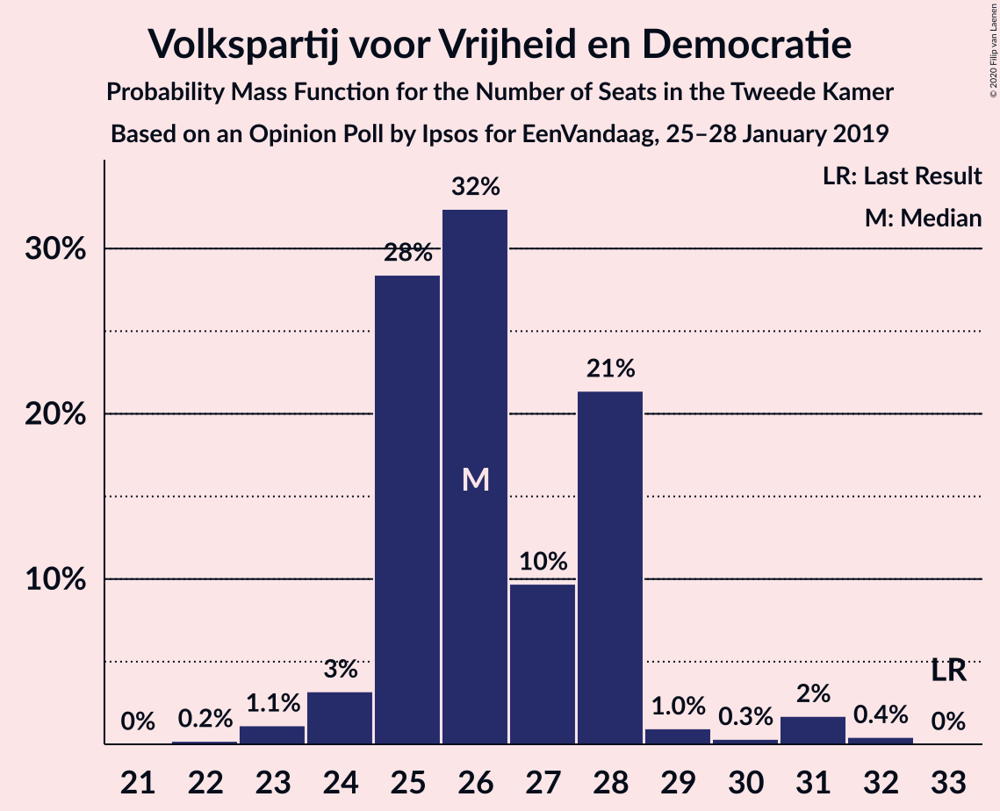

| Number of Seats | Probability | Accumulated | Special Marks |
|:---------------:|:-----------:|:-----------:|:-------------:|
| 22 | 0.2% | 100% |  |
| 23 | 1.1% | 99.7% |  |
| 24 | 3% | 98.6% |  |
| 25 | 28% | 95% |  |
| 26 | 32% | 67% | Median |
| 27 | 10% | 35% |  |
| 28 | 21% | 25% |  |
| 29 | 1.0% | 3% |  |
| 30 | 0.3% | 3% |  |
| 31 | 2% | 2% |  |
| 32 | 0.4% | 0.5% |  |
| 33 | 0% | 0% | Last Result |

### Partij voor de Vrijheid

*For a full overview of the results for this party, see the [Partij voor de Vrijheid](party-partijvoordevrijheid.html) page.*

| Number of Seats | Probability | Accumulated | Special Marks |
|:---------------:|:-----------:|:-----------:|:-------------:|
| 16 | 0.3% | 100% |  |
| 17 | 23% | 99.6% |  |
| 18 | 3% | 77% |  |
| 19 | 24% | 73% | Median |
| 20 | 6% | 49% | Last Result |
| 21 | 7% | 44% |  |
| 22 | 32% | 37% |  |
| 23 | 2% | 5% |  |
| 24 | 0.7% | 4% |  |
| 25 | 3% | 3% |  |
| 26 | 0% | 0.2% |  |
| 27 | 0.1% | 0.1% |  |
| 28 | 0% | 0% |  |

### GroenLinks

*For a full overview of the results for this party, see the [GroenLinks](party-groenlinks.html) page.*

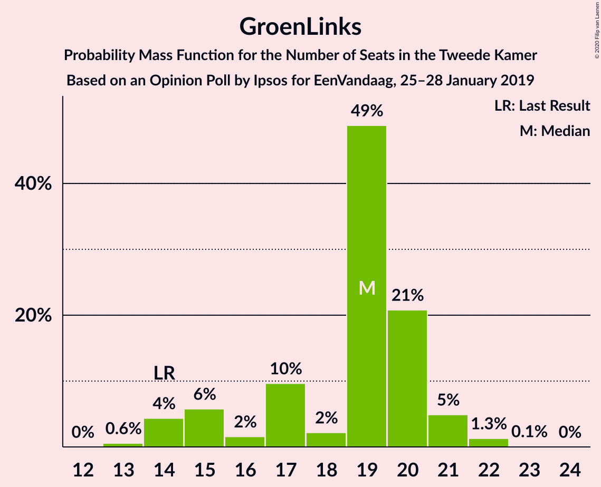

| Number of Seats | Probability | Accumulated | Special Marks |
|:---------------:|:-----------:|:-----------:|:-------------:|
| 13 | 0.6% | 100% |  |
| 14 | 4% | 99.4% | Last Result |
| 15 | 6% | 95% |  |
| 16 | 2% | 89% |  |
| 17 | 10% | 88% |  |
| 18 | 2% | 78% |  |
| 19 | 49% | 76% | Median |
| 20 | 21% | 27% |  |
| 21 | 5% | 6% |  |
| 22 | 1.3% | 1.4% |  |
| 23 | 0.1% | 0.1% |  |
| 24 | 0% | 0% |  |

### Christen-Democratisch Appèl

*For a full overview of the results for this party, see the [Christen-Democratisch Appèl](party-christen-democratischappèl.html) page.*

| Number of Seats | Probability | Accumulated | Special Marks |
|:---------------:|:-----------:|:-----------:|:-------------:|
| 10 | 2% | 100% |  |
| 11 | 1.1% | 98% |  |
| 12 | 4% | 97% |  |
| 13 | 17% | 93% |  |
| 14 | 59% | 76% | Median |
| 15 | 14% | 17% |  |
| 16 | 2% | 3% |  |
| 17 | 0.7% | 0.8% |  |
| 18 | 0.1% | 0.1% |  |
| 19 | 0% | 0% | Last Result |

### Democraten 66

*For a full overview of the results for this party, see the [Democraten 66](party-democraten66.html) page.*

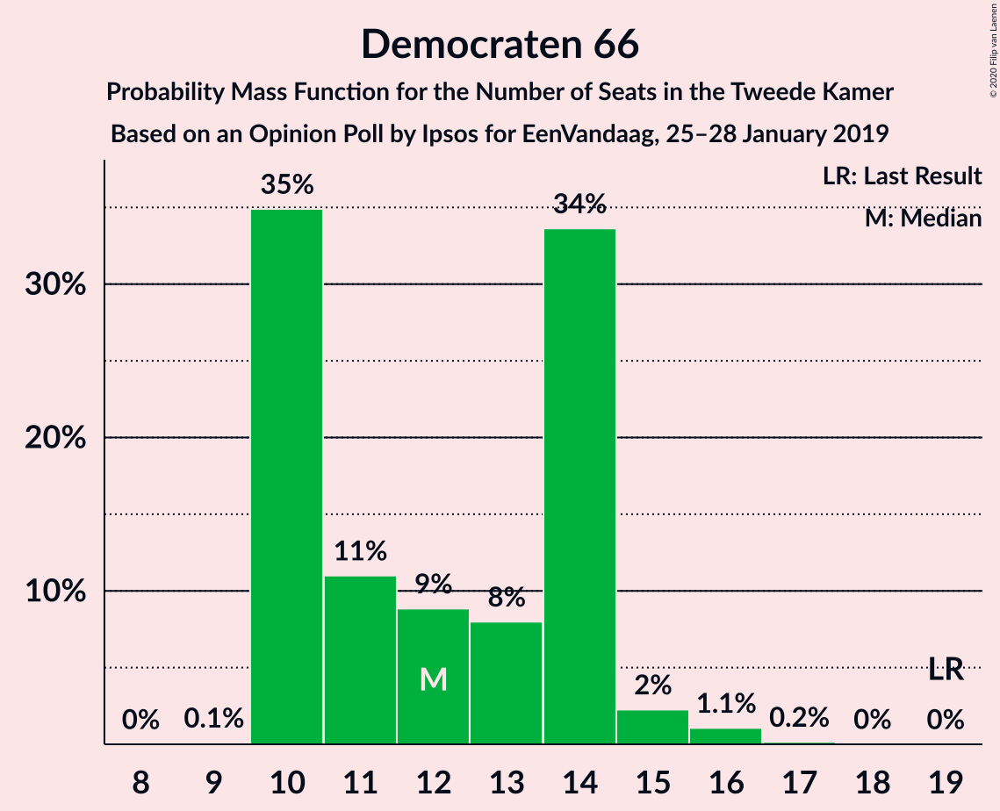

| Number of Seats | Probability | Accumulated | Special Marks |
|:---------------:|:-----------:|:-----------:|:-------------:|
| 9 | 0.1% | 100% |  |
| 10 | 35% | 99.9% |  |
| 11 | 11% | 65% |  |
| 12 | 9% | 54% | Median |
| 13 | 8% | 45% |  |
| 14 | 34% | 37% |  |
| 15 | 2% | 4% |  |
| 16 | 1.1% | 1.2% |  |
| 17 | 0.2% | 0.2% |  |
| 18 | 0% | 0% |  |
| 19 | 0% | 0% | Last Result |

### Socialistische Partij

*For a full overview of the results for this party, see the [Socialistische Partij](party-socialistischepartij.html) page.*

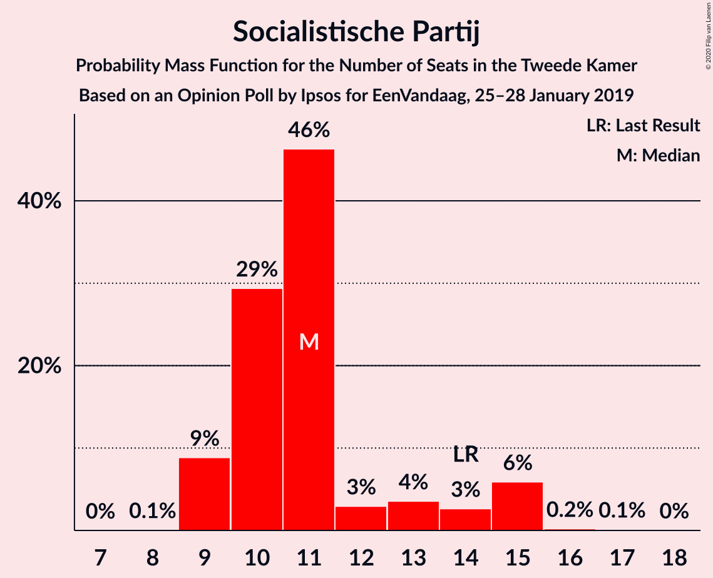

| Number of Seats | Probability | Accumulated | Special Marks |
|:---------------:|:-----------:|:-----------:|:-------------:|
| 8 | 0.1% | 100% |  |
| 9 | 9% | 99.9% |  |
| 10 | 29% | 91% |  |
| 11 | 46% | 62% | Median |
| 12 | 3% | 15% |  |
| 13 | 4% | 12% |  |
| 14 | 3% | 9% | Last Result |
| 15 | 6% | 6% |  |
| 16 | 0.2% | 0.4% |  |
| 17 | 0.1% | 0.2% |  |
| 18 | 0% | 0% |  |

### Forum voor Democratie

*For a full overview of the results for this party, see the [Forum voor Democratie](party-forumvoordemocratie.html) page.*

| Number of Seats | Probability | Accumulated | Special Marks |
|:---------------:|:-----------:|:-----------:|:-------------:|
| 2 | 0% | 100% | Last Result |
| 3 | 0% | 100% |  |
| 4 | 0% | 100% |  |
| 5 | 0% | 100% |  |
| 6 | 0% | 100% |  |
| 7 | 0% | 100% |  |
| 8 | 0.2% | 100% |  |
| 9 | 2% | 99.8% |  |
| 10 | 11% | 98% |  |
| 11 | 35% | 87% |  |
| 12 | 28% | 52% | Median |
| 13 | 20% | 24% |  |
| 14 | 2% | 4% |  |
| 15 | 1.4% | 2% |  |
| 16 | 0.2% | 0.3% |  |
| 17 | 0% | 0% |  |

### Partij van de Arbeid

*For a full overview of the results for this party, see the [Partij van de Arbeid](party-partijvandearbeid.html) page.*

| Number of Seats | Probability | Accumulated | Special Marks |
|:---------------:|:-----------:|:-----------:|:-------------:|
| 5 | 0.1% | 100% |  |
| 6 | 2% | 99.9% |  |
| 7 | 21% | 97% |  |
| 8 | 30% | 76% | Median |
| 9 | 29% | 46% | Last Result |
| 10 | 14% | 17% |  |
| 11 | 3% | 3% |  |
| 12 | 0.2% | 0.3% |  |
| 13 | 0% | 0% |  |

### Partij voor de Dieren

*For a full overview of the results for this party, see the [Partij voor de Dieren](party-partijvoordedieren.html) page.*

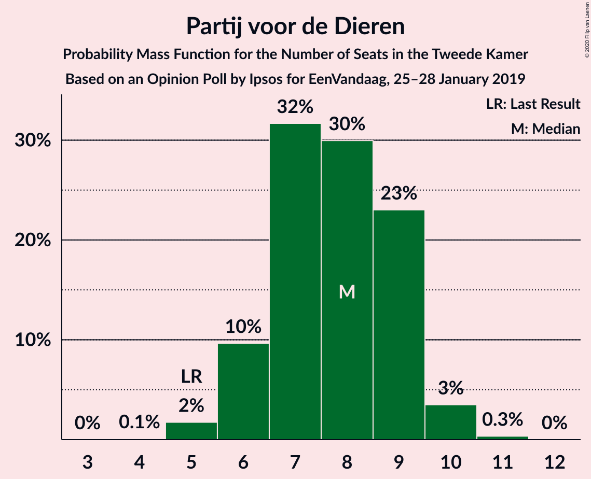

| Number of Seats | Probability | Accumulated | Special Marks |
|:---------------:|:-----------:|:-----------:|:-------------:|
| 4 | 0.1% | 100% |  |
| 5 | 2% | 99.9% | Last Result |
| 6 | 10% | 98% |  |
| 7 | 32% | 89% |  |
| 8 | 30% | 57% | Median |
| 9 | 23% | 27% |  |
| 10 | 3% | 4% |  |
| 11 | 0.3% | 0.4% |  |
| 12 | 0% | 0% |  |

### ChristenUnie

*For a full overview of the results for this party, see the [ChristenUnie](party-christenunie.html) page.*

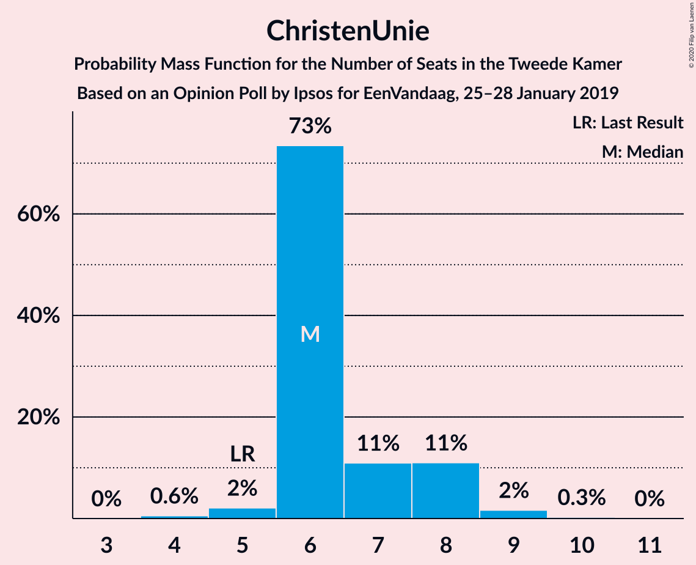

| Number of Seats | Probability | Accumulated | Special Marks |
|:---------------:|:-----------:|:-----------:|:-------------:|
| 4 | 0.6% | 100% |  |
| 5 | 2% | 99.4% | Last Result |
| 6 | 73% | 97% | Median |
| 7 | 11% | 24% |  |
| 8 | 11% | 13% |  |
| 9 | 2% | 2% |  |
| 10 | 0.3% | 0.3% |  |
| 11 | 0% | 0% |  |

### 50Plus

*For a full overview of the results for this party, see the [50Plus](party-50plus.html) page.*

| Number of Seats | Probability | Accumulated | Special Marks |
|:---------------:|:-----------:|:-----------:|:-------------:|
| 3 | 0.9% | 100% |  |
| 4 | 3% | 99.1% | Last Result |
| 5 | 39% | 96% |  |
| 6 | 39% | 56% | Median |
| 7 | 17% | 18% |  |
| 8 | 1.1% | 1.1% |  |
| 9 | 0% | 0% |  |

### Staatkundig Gereformeerde Partij

*For a full overview of the results for this party, see the [Staatkundig Gereformeerde Partij](party-staatkundiggereformeerdepartij.html) page.*

| Number of Seats | Probability | Accumulated | Special Marks |
|:---------------:|:-----------:|:-----------:|:-------------:|
| 2 | 14% | 100% |  |
| 3 | 9% | 86% | Last Result |
| 4 | 74% | 77% | Median |
| 5 | 3% | 3% |  |
| 6 | 0.6% | 0.7% |  |
| 7 | 0% | 0% |  |

### DENK

*For a full overview of the results for this party, see the [DENK](party-denk.html) page.*

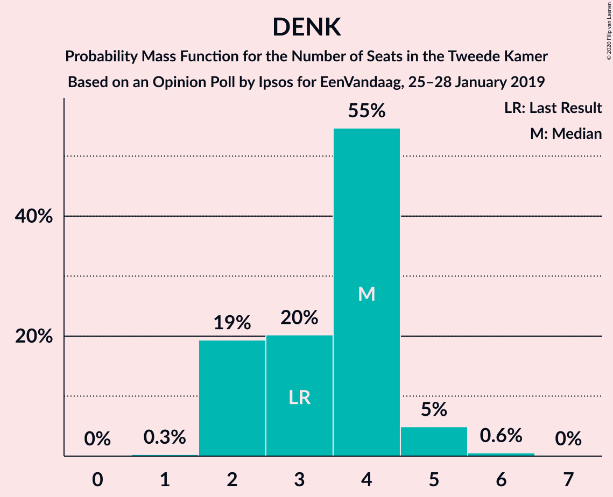

| Number of Seats | Probability | Accumulated | Special Marks |
|:---------------:|:-----------:|:-----------:|:-------------:|
| 1 | 0.3% | 100% |  |
| 2 | 19% | 99.7% |  |
| 3 | 20% | 80% | Last Result |
| 4 | 55% | 60% | Median |
| 5 | 5% | 5% |  |
| 6 | 0.6% | 0.6% |  |
| 7 | 0% | 0% |  |

## Coalitions

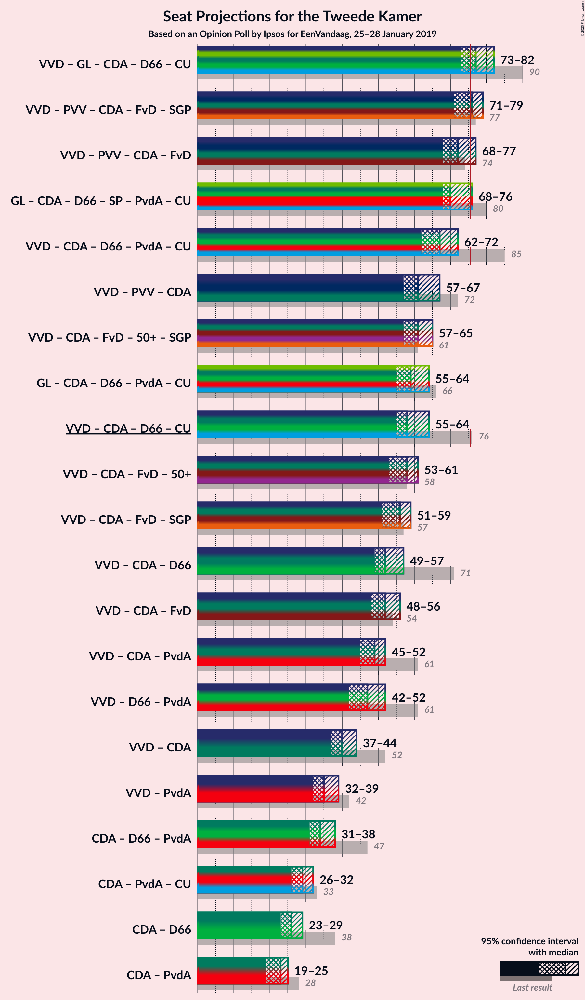

### Confidence Intervals

| Coalition | Last Result | Median | Majority? | 80% Confidence Interval | 90% Confidence Interval | 95% Confidence Interval | 99% Confidence Interval |
|:---------:|:-----------:|:------:|:---------:|:-----------------------:|:-----------------------:|:-----------------------:|:-----------------------:|
| Volkspartij voor Vrijheid en Democratie – GroenLinks – Christen-Democratisch Appèl – Democraten 66 – ChristenUnie | 90 | 77 | 64% | 75–79 | 74–80 | 73–82 | 70–83 |
| Volkspartij voor Vrijheid en Democratie – Partij voor de Vrijheid – Christen-Democratisch Appèl – Forum voor Democratie – Staatkundig Gereformeerde Partij | 77 | 76 | 60% | 73–78 | 71–79 | 71–79 | 69–82 |
| Volkspartij voor Vrijheid en Democratie – Partij voor de Vrijheid – Christen-Democratisch Appèl – Forum voor Democratie | 74 | 72 | 5% | 69–74 | 69–75 | 68–77 | 66–78 |
| GroenLinks – Christen-Democratisch Appèl – Democraten 66 – Socialistische Partij – Partij van de Arbeid – ChristenUnie | 80 | 70 | 3% | 68–73 | 68–74 | 68–76 | 65–77 |
| Volkspartij voor Vrijheid en Democratie – Christen-Democratisch Appèl – Democraten 66 – Partij van de Arbeid – ChristenUnie | 85 | 67 | 0.1% | 62–71 | 62–72 | 62–72 | 62–74 |
| Volkspartij voor Vrijheid en Democratie – Partij voor de Vrijheid – Christen-Democratisch Appèl | 72 | 61 | 0% | 57–63 | 57–63 | 57–67 | 55–67 |
| Volkspartij voor Vrijheid en Democratie – Christen-Democratisch Appèl – Forum voor Democratie – 50Plus – Staatkundig Gereformeerde Partij | 61 | 61 | 0% | 58–64 | 58–65 | 57–65 | 55–66 |
| GroenLinks – Christen-Democratisch Appèl – Democraten 66 – Partij van de Arbeid – ChristenUnie | 66 | 59 | 0% | 57–62 | 57–64 | 55–64 | 53–66 |
| Volkspartij voor Vrijheid en Democratie – Christen-Democratisch Appèl – Democraten 66 – ChristenUnie | 76 | 58 | 0% | 55–63 | 55–64 | 55–64 | 55–66 |
| Volkspartij voor Vrijheid en Democratie – Christen-Democratisch Appèl – Forum voor Democratie – 50Plus | 58 | 58 | 0% | 55–60 | 54–61 | 53–61 | 52–63 |
| Volkspartij voor Vrijheid en Democratie – Christen-Democratisch Appèl – Forum voor Democratie – Staatkundig Gereformeerde Partij | 57 | 56 | 0% | 53–57 | 52–58 | 51–59 | 49–61 |
| Volkspartij voor Vrijheid en Democratie – Christen-Democratisch Appèl – Democraten 66 | 71 | 52 | 0% | 49–55 | 49–57 | 49–57 | 48–59 |
| Volkspartij voor Vrijheid en Democratie – Christen-Democratisch Appèl – Forum voor Democratie | 54 | 52 | 0% | 50–53 | 50–54 | 48–56 | 46–58 |
| Volkspartij voor Vrijheid en Democratie – Christen-Democratisch Appèl – Partij van de Arbeid | 61 | 49 | 0% | 46–51 | 46–52 | 45–52 | 44–53 |
| Volkspartij voor Vrijheid en Democratie – Democraten 66 – Partij van de Arbeid | 61 | 47 | 0% | 42–49 | 42–51 | 42–52 | 42–53 |
| Volkspartij voor Vrijheid en Democratie – Christen-Democratisch Appèl | 52 | 40 | 0% | 38–42 | 38–43 | 37–44 | 36–46 |
| Volkspartij voor Vrijheid en Democratie – Partij van de Arbeid | 42 | 35 | 0% | 32–36 | 32–37 | 32–39 | 30–40 |
| Christen-Democratisch Appèl – Democraten 66 – Partij van de Arbeid | 47 | 34 | 0% | 31–37 | 31–38 | 31–38 | 30–41 |
| Christen-Democratisch Appèl – Partij van de Arbeid – ChristenUnie | 33 | 29 | 0% | 27–31 | 26–31 | 26–32 | 25–33 |
| Christen-Democratisch Appèl – Democraten 66 | 38 | 26 | 0% | 24–29 | 24–29 | 23–29 | 22–31 |
| Christen-Democratisch Appèl – Partij van de Arbeid | 28 | 23 | 0% | 21–24 | 20–24 | 19–25 | 18–25 |

### Volkspartij voor Vrijheid en Democratie – GroenLinks – Christen-Democratisch Appèl – Democraten 66 – ChristenUnie

| Number of Seats | Probability | Accumulated | Special Marks |
|:---------------:|:-----------:|:-----------:|:-------------:|
| 70 | 0.8% | 100% |  |
| 71 | 0.3% | 99.1% |  |
| 72 | 0.7% | 98.9% |  |
| 73 | 2% | 98% |  |
| 74 | 5% | 96% |  |
| 75 | 27% | 91% |  |
| 76 | 2% | 64% | Majority |
| 77 | 17% | 62% | Median |
| 78 | 4% | 45% |  |
| 79 | 31% | 41% |  |
| 80 | 6% | 10% |  |
| 81 | 1.3% | 4% |  |
| 82 | 1.1% | 3% |  |
| 83 | 2% | 2% |  |
| 84 | 0.1% | 0.3% |  |
| 85 | 0.1% | 0.1% |  |
| 86 | 0% | 0.1% |  |
| 87 | 0% | 0% |  |
| 88 | 0% | 0% |  |
| 89 | 0% | 0% |  |
| 90 | 0% | 0% | Last Result |

### Volkspartij voor Vrijheid en Democratie – Partij voor de Vrijheid – Christen-Democratisch Appèl – Forum voor Democratie – Staatkundig Gereformeerde Partij

| Number of Seats | Probability | Accumulated | Special Marks |
|:---------------:|:-----------:|:-----------:|:-------------:|
| 68 | 0% | 100% |  |
| 69 | 0.7% | 99.9% |  |
| 70 | 1.5% | 99.3% |  |
| 71 | 5% | 98% |  |
| 72 | 2% | 92% |  |
| 73 | 23% | 91% |  |
| 74 | 2% | 68% |  |
| 75 | 7% | 66% | Median |
| 76 | 30% | 60% | Majority |
| 77 | 5% | 30% | Last Result |
| 78 | 19% | 25% |  |
| 79 | 3% | 6% |  |
| 80 | 1.4% | 2% |  |
| 81 | 0.3% | 0.8% |  |
| 82 | 0.4% | 0.5% |  |
| 83 | 0.1% | 0.1% |  |
| 84 | 0% | 0% |  |

### Volkspartij voor Vrijheid en Democratie – Partij voor de Vrijheid – Christen-Democratisch Appèl – Forum voor Democratie

| Number of Seats | Probability | Accumulated | Special Marks |
|:---------------:|:-----------:|:-----------:|:-------------:|
| 65 | 0.1% | 100% |  |
| 66 | 2% | 99.9% |  |
| 67 | 0.3% | 98% |  |
| 68 | 2% | 98% |  |
| 69 | 26% | 96% |  |
| 70 | 2% | 70% |  |
| 71 | 3% | 67% | Median |
| 72 | 26% | 64% |  |
| 73 | 13% | 38% |  |
| 74 | 20% | 25% | Last Result |
| 75 | 0.7% | 6% |  |
| 76 | 1.5% | 5% | Majority |
| 77 | 3% | 3% |  |
| 78 | 0.5% | 0.7% |  |
| 79 | 0.1% | 0.2% |  |
| 80 | 0.1% | 0.1% |  |
| 81 | 0% | 0% |  |

### GroenLinks – Christen-Democratisch Appèl – Democraten 66 – Socialistische Partij – Partij van de Arbeid – ChristenUnie

| Number of Seats | Probability | Accumulated | Special Marks |
|:---------------:|:-----------:|:-----------:|:-------------:|
| 63 | 0.1% | 100% |  |
| 64 | 0.4% | 99.9% |  |
| 65 | 0.7% | 99.5% |  |
| 66 | 0.3% | 98.9% |  |
| 67 | 0.9% | 98.6% |  |
| 68 | 32% | 98% |  |
| 69 | 8% | 66% |  |
| 70 | 16% | 57% | Median |
| 71 | 2% | 41% |  |
| 72 | 27% | 39% |  |
| 73 | 5% | 12% |  |
| 74 | 3% | 7% |  |
| 75 | 1.4% | 4% |  |
| 76 | 1.1% | 3% | Majority |
| 77 | 1.1% | 1.5% |  |
| 78 | 0.4% | 0.4% |  |
| 79 | 0% | 0.1% |  |
| 80 | 0% | 0% | Last Result |

### Volkspartij voor Vrijheid en Democratie – Christen-Democratisch Appèl – Democraten 66 – Partij van de Arbeid – ChristenUnie

| Number of Seats | Probability | Accumulated | Special Marks |
|:---------------:|:-----------:|:-----------:|:-------------:|
| 61 | 0% | 100% |  |
| 62 | 18% | 99.9% |  |
| 63 | 0.3% | 82% |  |
| 64 | 0.7% | 82% |  |
| 65 | 8% | 81% |  |
| 66 | 22% | 73% | Median |
| 67 | 3% | 51% |  |
| 68 | 6% | 48% |  |
| 69 | 27% | 42% |  |
| 70 | 4% | 15% |  |
| 71 | 2% | 11% |  |
| 72 | 7% | 9% |  |
| 73 | 1.3% | 2% |  |
| 74 | 0.3% | 0.6% |  |
| 75 | 0.2% | 0.3% |  |
| 76 | 0.1% | 0.1% | Majority |
| 77 | 0% | 0% |  |
| 78 | 0% | 0% |  |
| 79 | 0% | 0% |  |
| 80 | 0% | 0% |  |
| 81 | 0% | 0% |  |
| 82 | 0% | 0% |  |
| 83 | 0% | 0% |  |
| 84 | 0% | 0% |  |
| 85 | 0% | 0% | Last Result |

### Volkspartij voor Vrijheid en Democratie – Partij voor de Vrijheid – Christen-Democratisch Appèl

| Number of Seats | Probability | Accumulated | Special Marks |
|:---------------:|:-----------:|:-----------:|:-------------:|
| 53 | 0% | 100% |  |
| 54 | 0.1% | 99.9% |  |
| 55 | 2% | 99.8% |  |
| 56 | 0.4% | 98% |  |
| 57 | 29% | 98% |  |
| 58 | 2% | 69% |  |
| 59 | 3% | 67% | Median |
| 60 | 2% | 65% |  |
| 61 | 44% | 63% |  |
| 62 | 7% | 19% |  |
| 63 | 7% | 12% |  |
| 64 | 1.1% | 5% |  |
| 65 | 0.5% | 4% |  |
| 66 | 0.6% | 3% |  |
| 67 | 3% | 3% |  |
| 68 | 0.1% | 0.2% |  |
| 69 | 0% | 0.1% |  |
| 70 | 0.1% | 0.1% |  |
| 71 | 0% | 0% |  |
| 72 | 0% | 0% | Last Result |

### Volkspartij voor Vrijheid en Democratie – Christen-Democratisch Appèl – Forum voor Democratie – 50Plus – Staatkundig Gereformeerde Partij

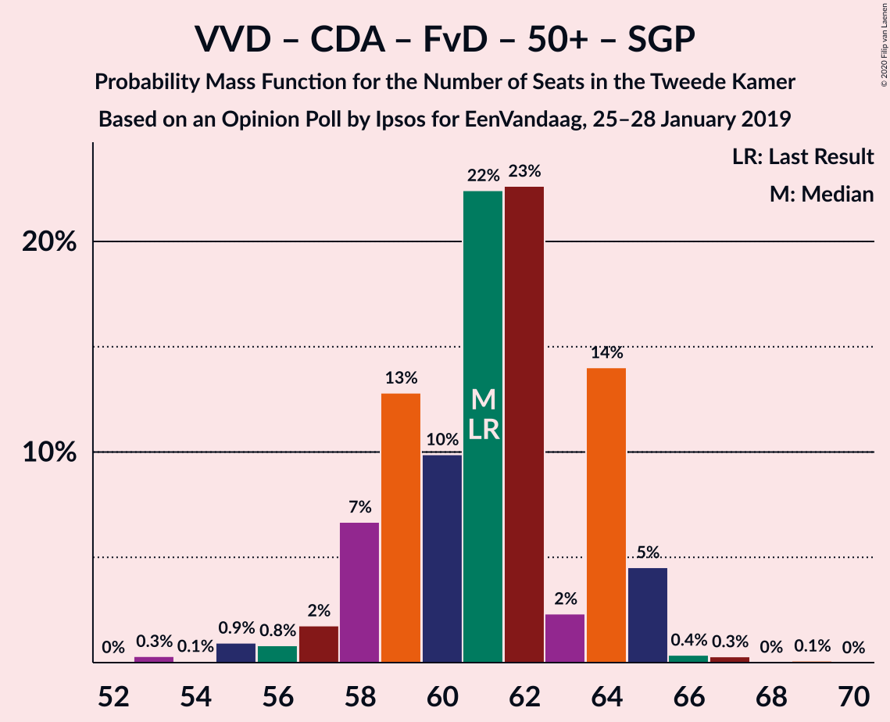

| Number of Seats | Probability | Accumulated | Special Marks |
|:---------------:|:-----------:|:-----------:|:-------------:|
| 53 | 0.3% | 100% |  |
| 54 | 0.1% | 99.7% |  |
| 55 | 0.9% | 99.6% |  |
| 56 | 0.8% | 98.7% |  |
| 57 | 2% | 98% |  |
| 58 | 7% | 96% |  |
| 59 | 13% | 89% |  |
| 60 | 10% | 77% |  |
| 61 | 22% | 67% | Last Result |
| 62 | 23% | 44% | Median |
| 63 | 2% | 22% |  |
| 64 | 14% | 19% |  |
| 65 | 5% | 5% |  |
| 66 | 0.4% | 0.8% |  |
| 67 | 0.3% | 0.4% |  |
| 68 | 0% | 0.1% |  |
| 69 | 0.1% | 0.1% |  |
| 70 | 0% | 0% |  |

### GroenLinks – Christen-Democratisch Appèl – Democraten 66 – Partij van de Arbeid – ChristenUnie

| Number of Seats | Probability | Accumulated | Special Marks |
|:---------------:|:-----------:|:-----------:|:-------------:|
| 51 | 0% | 100% |  |
| 52 | 0.2% | 99.9% |  |
| 53 | 0.6% | 99.8% |  |
| 54 | 1.3% | 99.2% |  |
| 55 | 1.1% | 98% |  |
| 56 | 2% | 97% |  |
| 57 | 35% | 95% |  |
| 58 | 5% | 60% |  |
| 59 | 10% | 55% | Median |
| 60 | 13% | 45% |  |
| 61 | 1.1% | 31% |  |
| 62 | 23% | 30% |  |
| 63 | 0.4% | 7% |  |
| 64 | 5% | 7% |  |
| 65 | 1.2% | 2% |  |
| 66 | 0.7% | 0.8% | Last Result |
| 67 | 0% | 0.1% |  |
| 68 | 0% | 0.1% |  |
| 69 | 0% | 0% |  |

### Volkspartij voor Vrijheid en Democratie – Christen-Democratisch Appèl – Democraten 66 – ChristenUnie

| Number of Seats | Probability | Accumulated | Special Marks |
|:---------------:|:-----------:|:-----------:|:-------------:|
| 53 | 0.1% | 100% |  |
| 54 | 0.1% | 99.9% |  |
| 55 | 19% | 99.8% |  |
| 56 | 10% | 81% |  |
| 57 | 6% | 71% |  |
| 58 | 18% | 65% | Median |
| 59 | 4% | 47% |  |
| 60 | 24% | 43% |  |
| 61 | 8% | 19% |  |
| 62 | 1.3% | 11% |  |
| 63 | 4% | 10% |  |
| 64 | 5% | 6% |  |
| 65 | 0.7% | 1.3% |  |
| 66 | 0.3% | 0.6% |  |
| 67 | 0.3% | 0.3% |  |
| 68 | 0% | 0% |  |
| 69 | 0% | 0% |  |
| 70 | 0% | 0% |  |
| 71 | 0% | 0% |  |
| 72 | 0% | 0% |  |
| 73 | 0% | 0% |  |
| 74 | 0% | 0% |  |
| 75 | 0% | 0% |  |
| 76 | 0% | 0% | Last Result, Majority |

### Volkspartij voor Vrijheid en Democratie – Christen-Democratisch Appèl – Forum voor Democratie – 50Plus

| Number of Seats | Probability | Accumulated | Special Marks |
|:---------------:|:-----------:|:-----------:|:-------------:|
| 50 | 0.3% | 100% |  |
| 51 | 0.1% | 99.7% |  |
| 52 | 0.9% | 99.5% |  |
| 53 | 2% | 98.7% |  |
| 54 | 2% | 97% |  |
| 55 | 11% | 95% |  |
| 56 | 11% | 84% |  |
| 57 | 23% | 74% |  |
| 58 | 29% | 51% | Last Result, Median |
| 59 | 2% | 22% |  |
| 60 | 13% | 20% |  |
| 61 | 6% | 7% |  |
| 62 | 0.5% | 1.2% |  |
| 63 | 0.5% | 0.7% |  |
| 64 | 0% | 0.1% |  |
| 65 | 0.1% | 0.1% |  |
| 66 | 0% | 0% |  |

### Volkspartij voor Vrijheid en Democratie – Christen-Democratisch Appèl – Forum voor Democratie – Staatkundig Gereformeerde Partij

| Number of Seats | Probability | Accumulated | Special Marks |
|:---------------:|:-----------:|:-----------:|:-------------:|
| 48 | 0.1% | 100% |  |
| 49 | 0.9% | 99.9% |  |
| 50 | 0.2% | 99.0% |  |
| 51 | 1.3% | 98.8% |  |
| 52 | 6% | 97% |  |
| 53 | 3% | 92% |  |
| 54 | 20% | 89% |  |
| 55 | 3% | 69% |  |
| 56 | 44% | 66% | Median |
| 57 | 14% | 22% | Last Result |
| 58 | 5% | 8% |  |
| 59 | 2% | 3% |  |
| 60 | 0.4% | 1.1% |  |
| 61 | 0.2% | 0.7% |  |
| 62 | 0.1% | 0.4% |  |
| 63 | 0.3% | 0.3% |  |
| 64 | 0% | 0% |  |

### Volkspartij voor Vrijheid en Democratie – Christen-Democratisch Appèl – Democraten 66

| Number of Seats | Probability | Accumulated | Special Marks |
|:---------------:|:-----------:|:-----------:|:-------------:|
| 46 | 0.1% | 100% |  |
| 47 | 0.3% | 99.8% |  |
| 48 | 0.6% | 99.5% |  |
| 49 | 19% | 99.0% |  |
| 50 | 10% | 80% |  |
| 51 | 11% | 70% |  |
| 52 | 15% | 59% | Median |
| 53 | 7% | 44% |  |
| 54 | 26% | 37% |  |
| 55 | 2% | 11% |  |
| 56 | 4% | 10% |  |
| 57 | 3% | 5% |  |
| 58 | 0.2% | 2% |  |
| 59 | 2% | 2% |  |
| 60 | 0.3% | 0.4% |  |
| 61 | 0.1% | 0.1% |  |
| 62 | 0% | 0% |  |
| 63 | 0% | 0% |  |
| 64 | 0% | 0% |  |
| 65 | 0% | 0% |  |
| 66 | 0% | 0% |  |
| 67 | 0% | 0% |  |
| 68 | 0% | 0% |  |
| 69 | 0% | 0% |  |
| 70 | 0% | 0% |  |
| 71 | 0% | 0% | Last Result |

### Volkspartij voor Vrijheid en Democratie – Christen-Democratisch Appèl – Forum voor Democratie

| Number of Seats | Probability | Accumulated | Special Marks |
|:---------------:|:-----------:|:-----------:|:-------------:|
| 45 | 0.1% | 100% |  |
| 46 | 0.9% | 99.9% |  |
| 47 | 0.2% | 99.0% |  |
| 48 | 2% | 98.7% |  |
| 49 | 2% | 97% |  |
| 50 | 20% | 96% |  |
| 51 | 4% | 75% |  |
| 52 | 46% | 72% | Median |
| 53 | 17% | 25% |  |
| 54 | 5% | 9% | Last Result |
| 55 | 1.0% | 4% |  |
| 56 | 2% | 3% |  |
| 57 | 0.4% | 1.0% |  |
| 58 | 0.3% | 0.6% |  |
| 59 | 0.3% | 0.3% |  |
| 60 | 0% | 0% |  |

### Volkspartij voor Vrijheid en Democratie – Christen-Democratisch Appèl – Partij van de Arbeid

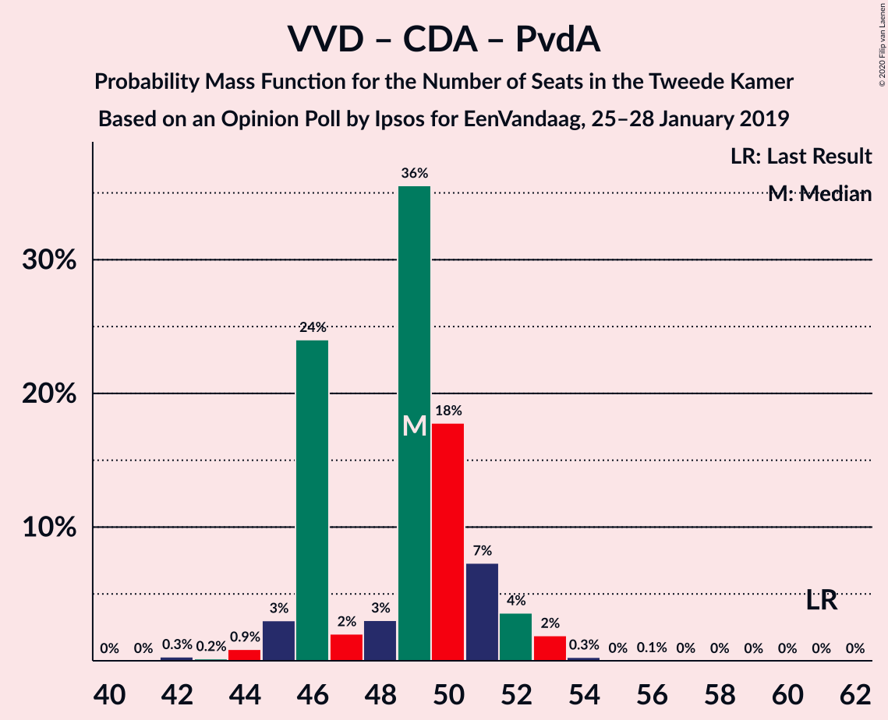

| Number of Seats | Probability | Accumulated | Special Marks |
|:---------------:|:-----------:|:-----------:|:-------------:|
| 42 | 0.3% | 100% |  |
| 43 | 0.2% | 99.7% |  |
| 44 | 0.9% | 99.5% |  |
| 45 | 3% | 98.7% |  |
| 46 | 24% | 96% |  |
| 47 | 2% | 72% |  |
| 48 | 3% | 70% | Median |
| 49 | 36% | 67% |  |
| 50 | 18% | 31% |  |
| 51 | 7% | 13% |  |
| 52 | 4% | 6% |  |
| 53 | 2% | 2% |  |
| 54 | 0.3% | 0.4% |  |
| 55 | 0% | 0.1% |  |
| 56 | 0.1% | 0.1% |  |
| 57 | 0% | 0% |  |
| 58 | 0% | 0% |  |
| 59 | 0% | 0% |  |
| 60 | 0% | 0% |  |
| 61 | 0% | 0% | Last Result |

### Volkspartij voor Vrijheid en Democratie – Democraten 66 – Partij van de Arbeid

| Number of Seats | Probability | Accumulated | Special Marks |
|:---------------:|:-----------:|:-----------:|:-------------:|
| 41 | 0% | 100% |  |
| 42 | 18% | 99.9% |  |
| 43 | 0.4% | 82% |  |
| 44 | 1.3% | 82% |  |
| 45 | 1.4% | 80% |  |
| 46 | 24% | 79% | Median |
| 47 | 14% | 55% |  |
| 48 | 4% | 41% |  |
| 49 | 28% | 37% |  |
| 50 | 3% | 9% |  |
| 51 | 3% | 6% |  |
| 52 | 1.2% | 3% |  |
| 53 | 1.3% | 2% |  |
| 54 | 0.2% | 0.3% |  |
| 55 | 0.1% | 0.1% |  |
| 56 | 0% | 0% |  |
| 57 | 0% | 0% |  |
| 58 | 0% | 0% |  |
| 59 | 0% | 0% |  |
| 60 | 0% | 0% |  |
| 61 | 0% | 0% | Last Result |

### Volkspartij voor Vrijheid en Democratie – Christen-Democratisch Appèl

| Number of Seats | Probability | Accumulated | Special Marks |
|:---------------:|:-----------:|:-----------:|:-------------:|
| 34 | 0.3% | 100% |  |
| 35 | 0.1% | 99.7% |  |
| 36 | 2% | 99.6% |  |
| 37 | 2% | 98% |  |
| 38 | 6% | 95% |  |
| 39 | 33% | 89% |  |
| 40 | 25% | 56% | Median |
| 41 | 2% | 31% |  |
| 42 | 20% | 29% |  |
| 43 | 7% | 10% |  |
| 44 | 0.7% | 3% |  |
| 45 | 1.3% | 2% |  |
| 46 | 0.5% | 0.8% |  |
| 47 | 0.3% | 0.3% |  |
| 48 | 0% | 0% |  |
| 49 | 0% | 0% |  |
| 50 | 0% | 0% |  |
| 51 | 0% | 0% |  |
| 52 | 0% | 0% | Last Result |

### Volkspartij voor Vrijheid en Democratie – Partij van de Arbeid

| Number of Seats | Probability | Accumulated | Special Marks |
|:---------------:|:-----------:|:-----------:|:-------------:|
| 30 | 0.8% | 100% |  |
| 31 | 0.3% | 99.2% |  |
| 32 | 21% | 98.9% |  |
| 33 | 6% | 78% |  |
| 34 | 2% | 72% | Median |
| 35 | 32% | 70% |  |
| 36 | 31% | 38% |  |
| 37 | 3% | 7% |  |
| 38 | 0.9% | 4% |  |
| 39 | 2% | 3% |  |
| 40 | 0.3% | 0.6% |  |
| 41 | 0.2% | 0.3% |  |
| 42 | 0.2% | 0.2% | Last Result |
| 43 | 0% | 0% |  |

### Christen-Democratisch Appèl – Democraten 66 – Partij van de Arbeid

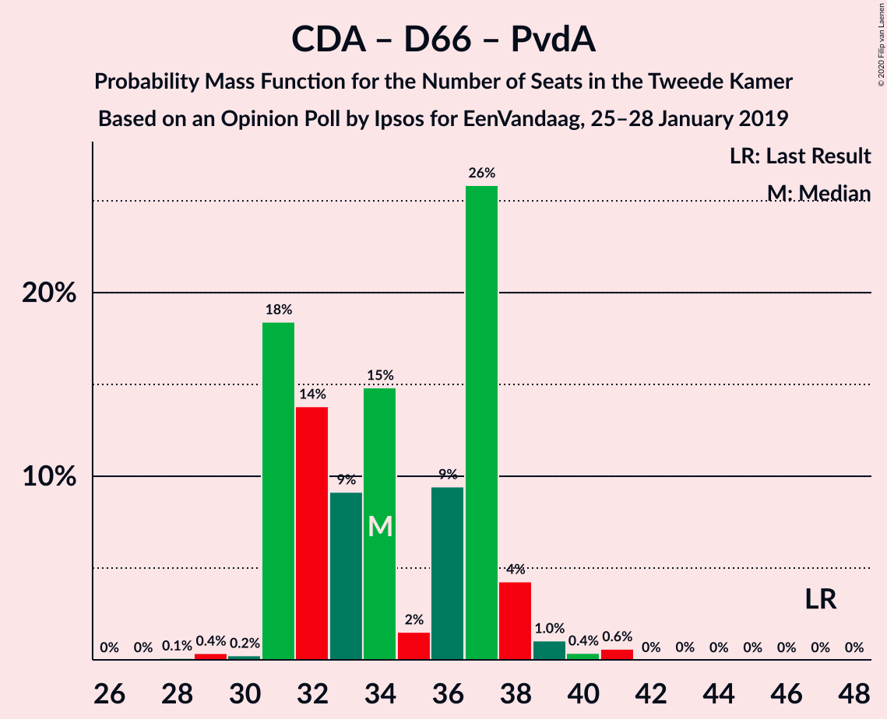

| Number of Seats | Probability | Accumulated | Special Marks |
|:---------------:|:-----------:|:-----------:|:-------------:|
| 28 | 0.1% | 100% |  |
| 29 | 0.4% | 99.9% |  |
| 30 | 0.2% | 99.5% |  |
| 31 | 18% | 99.3% |  |
| 32 | 14% | 81% |  |
| 33 | 9% | 67% |  |
| 34 | 15% | 58% | Median |
| 35 | 2% | 43% |  |
| 36 | 9% | 42% |  |
| 37 | 26% | 32% |  |
| 38 | 4% | 6% |  |
| 39 | 1.0% | 2% |  |
| 40 | 0.4% | 1.0% |  |
| 41 | 0.6% | 0.6% |  |
| 42 | 0% | 0% |  |
| 43 | 0% | 0% |  |
| 44 | 0% | 0% |  |
| 45 | 0% | 0% |  |
| 46 | 0% | 0% |  |
| 47 | 0% | 0% | Last Result |

### Christen-Democratisch Appèl – Partij van de Arbeid – ChristenUnie

| Number of Seats | Probability | Accumulated | Special Marks |
|:---------------:|:-----------:|:-----------:|:-------------:|
| 23 | 0.1% | 100% |  |
| 24 | 0.4% | 99.9% |  |
| 25 | 2% | 99.6% |  |
| 26 | 3% | 98% |  |
| 27 | 25% | 95% |  |
| 28 | 16% | 70% | Median |
| 29 | 31% | 54% |  |
| 30 | 5% | 23% |  |
| 31 | 15% | 18% |  |
| 32 | 2% | 3% |  |
| 33 | 2% | 2% | Last Result |
| 34 | 0.1% | 0.2% |  |
| 35 | 0% | 0.1% |  |
| 36 | 0% | 0% |  |

### Christen-Democratisch Appèl – Democraten 66

| Number of Seats | Probability | Accumulated | Special Marks |
|:---------------:|:-----------:|:-----------:|:-------------:|
| 21 | 0.2% | 100% |  |
| 22 | 0.8% | 99.8% |  |
| 23 | 2% | 99.1% |  |
| 24 | 40% | 97% |  |
| 25 | 7% | 57% |  |
| 26 | 12% | 51% | Median |
| 27 | 5% | 39% |  |
| 28 | 24% | 34% |  |
| 29 | 8% | 10% |  |
| 30 | 2% | 2% |  |
| 31 | 0.5% | 0.7% |  |
| 32 | 0.1% | 0.2% |  |
| 33 | 0% | 0% |  |
| 34 | 0% | 0% |  |
| 35 | 0% | 0% |  |
| 36 | 0% | 0% |  |
| 37 | 0% | 0% |  |
| 38 | 0% | 0% | Last Result |

### Christen-Democratisch Appèl – Partij van de Arbeid

| Number of Seats | Probability | Accumulated | Special Marks |
|:---------------:|:-----------:|:-----------:|:-------------:|
| 17 | 0.2% | 100% |  |
| 18 | 2% | 99.8% |  |
| 19 | 2% | 98% |  |
| 20 | 3% | 96% |  |
| 21 | 25% | 94% |  |
| 22 | 16% | 69% | Median |
| 23 | 39% | 53% |  |
| 24 | 11% | 14% |  |
| 25 | 2% | 3% |  |
| 26 | 0.1% | 0.5% |  |
| 27 | 0.3% | 0.3% |  |
| 28 | 0% | 0% | Last Result |

## Technical Information

### Opinion Poll

+ **Polling firm:** Ipsos
+ **Commissioner(s):** EenVandaag
+ **Fieldwork period:** 25–28 January 2019

### Calculations

+ **Sample size:** 1002
+ **Simulations done:** 1,048,576
+ **Error estimate:** 3.03%

