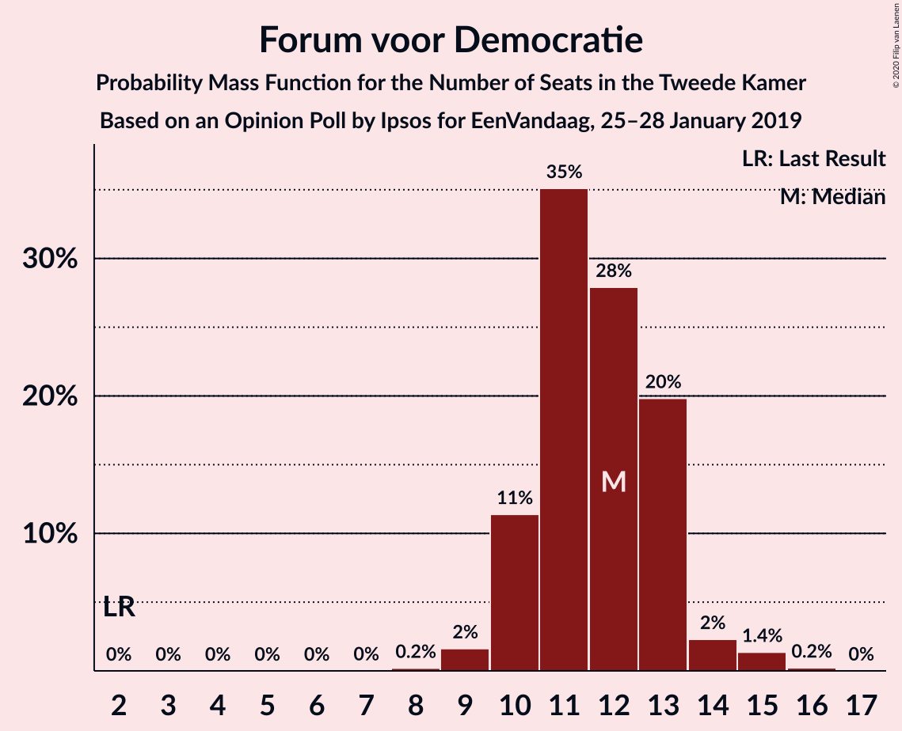
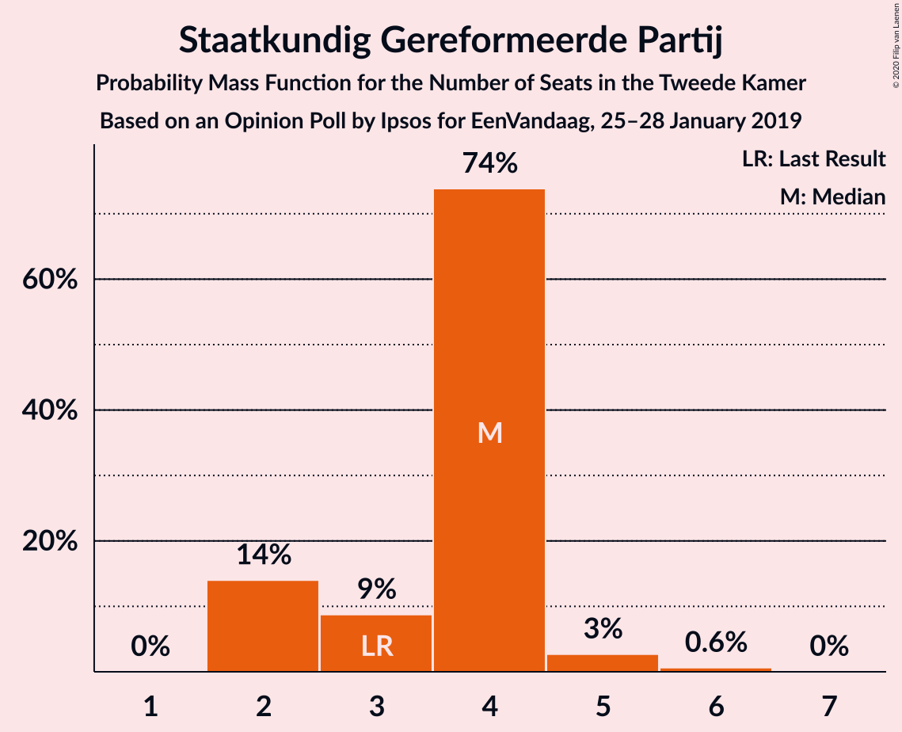
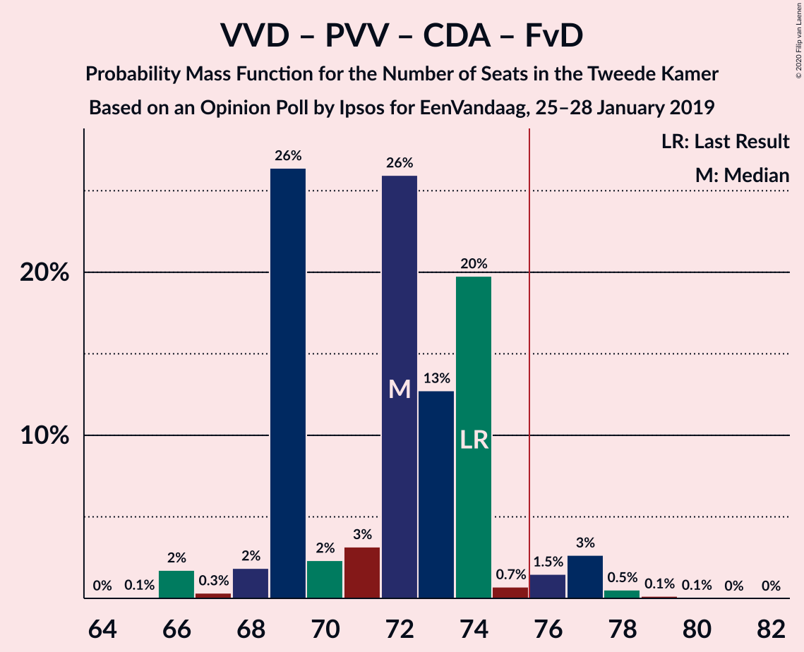
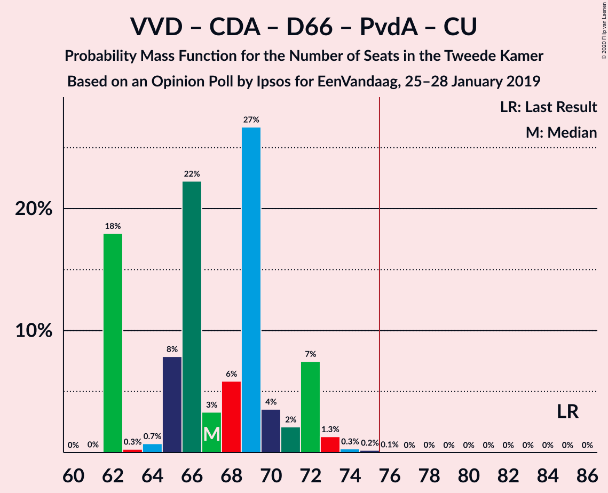
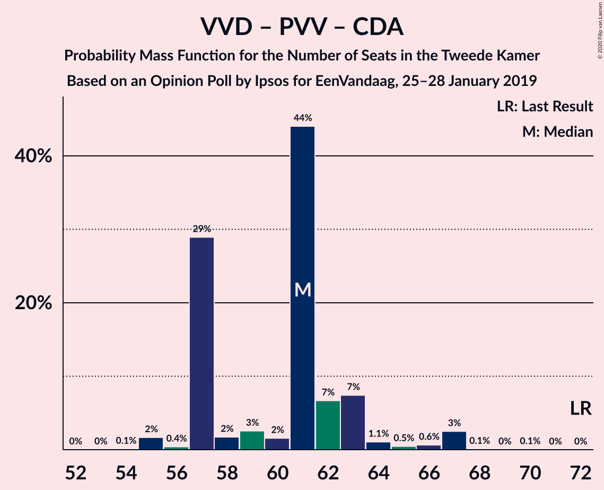
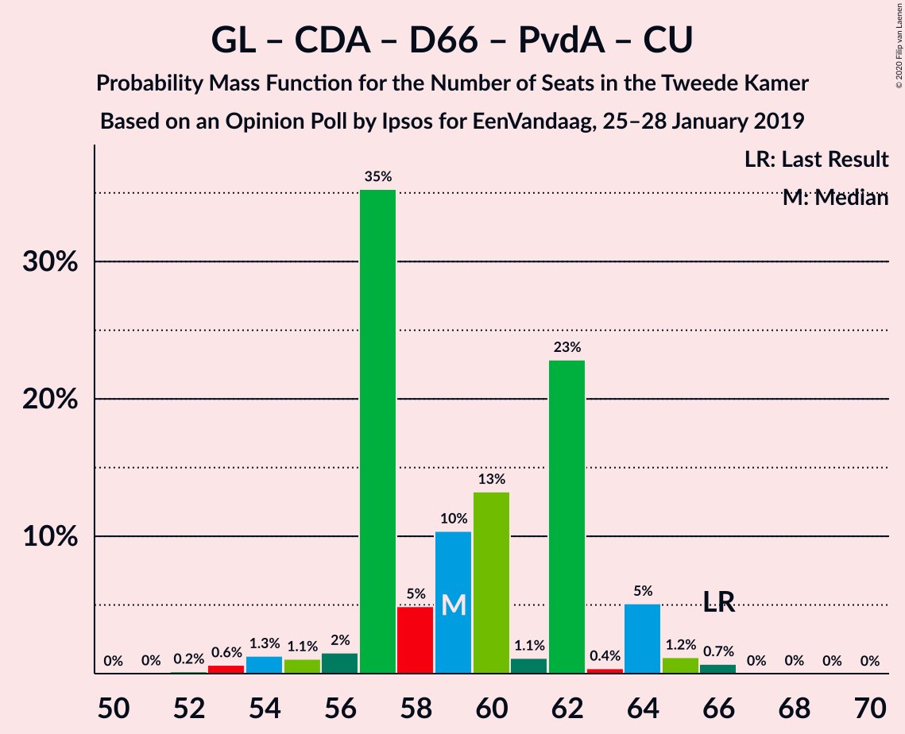
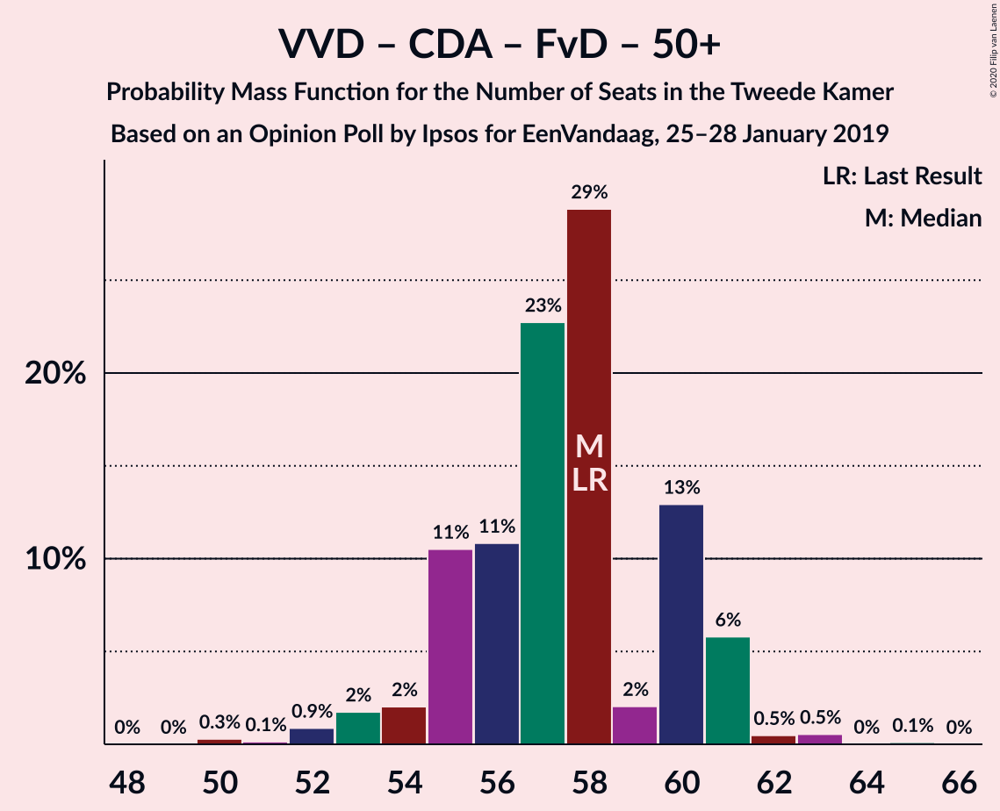

# Opinion Poll by Ipsos for EenVandaag, 25–28 January 2019

<a href="#voting-intentions">Voting Intentions</a> | <a href="#seats">Seats</a> | <a href="#coalitions">Coalitions</a> | <a href="#technical-information">Technical Information</a>

## Voting Intentions

### Confidence Intervals

| Party | Last Result | Poll Result | 80% Confidence Interval | 90% Confidence Interval | 95% Confidence Interval | 99% Confidence Interval |
|:-----:|:-----------:|:-----------:|:-----------------------:|:-----------------------:|:-----------------------:|:-----------------------:|
| Volkspartij voor Vrijheid en Democratie | 21.3% | 17.5% | 16.0–19.1% |15.6–19.5% |15.2–20.0% |14.6–20.7% |
| Partij voor de Vrijheid | 13.1% | 13.1% | 11.8–14.5% |11.4–15.0% |11.1–15.3% |10.5–16.0% |
| GroenLinks | 9.1% | 11.4% | 10.2–12.8% |9.8–13.2% |9.6–13.5% |9.0–14.2% |
| Christen-Democratisch Appèl | 12.4% | 9.1% | 8.0–10.3% |7.7–10.7% |7.5–11.0% |7.0–11.7% |
| Democraten 66 | 12.2% | 8.5% | 7.5–9.7% |7.1–10.1% |6.9–10.4% |6.4–11.0% |
| Socialistische Partij | 9.1% | 8.2% | 7.2–9.4% |6.9–9.8% |6.6–10.1% |6.2–10.7% |
| Forum voor Democratie | 1.8% | 7.8% | 6.8–9.0% |6.5–9.3% |6.3–9.6% |5.8–10.2% |
| Partij van de Arbeid | 5.7% | 5.7% | 4.8–6.8% |4.6–7.0% |4.4–7.3% |4.0–7.8% |
| Partij voor de Dieren | 3.2% | 4.9% | 4.1–5.9% |3.9–6.2% |3.7–6.4% |3.4–6.9% |
| ChristenUnie | 3.4% | 4.7% | 3.9–5.7% |3.7–5.9% |3.5–6.2% |3.2–6.7% |
| 50Plus | 3.1% | 3.6% | 2.9–4.5% |2.8–4.7% |2.6–4.9% |2.3–5.4% |
| Staatkundig Gereformeerde Partij | 2.1% | 2.4% | 1.9–3.1% |1.7–3.4% |1.6–3.6% |1.4–3.9% |
| DENK | 2.1% | 2.2% | 1.7–2.9% |1.6–3.1% |1.4–3.3% |1.2–3.7% |

*Note:* The poll result column reflects the actual value used in the calculations. Published results may vary slightly, and in addition be rounded to fewer digits.

## Seats

### Confidence Intervals

| Party | Last Result | Median | 80% Confidence Interval | 90% Confidence Interval | 95% Confidence Interval | 99% Confidence Interval |
|:-----:|:-----------:|:------:|:-----------------------:|:-----------------------:|:-----------------------:|:-----------------------:|
| <a href="#volkspartij-voor-vrijheid-en-democratie">Volkspartij voor Vrijheid en Democratie</a> | 33 | 28 | 26–31 |24–31 |24–32 |23–32 |
| <a href="#partij-voor-de-vrijheid">Partij voor de Vrijheid</a> | 20 | 20 | 17–21 |17–21 |17–22 |16–25 |
| <a href="#groenlinks">GroenLinks</a> | 14 | 15 | 14–19 |14–19 |14–20 |14–23 |
| <a href="#christen-democratisch-appèl">Christen-Democratisch Appèl</a> | 19 | 15 | 13–15 |12–16 |10–16 |10–18 |
| <a href="#democraten-66">Democraten 66</a> | 19 | 14 | 12–14 |12–14 |10–14 |10–16 |
| <a href="#socialistische-partij">Socialistische Partij</a> | 14 | 11 | 11–14 |11–14 |10–15 |8–15 |
| <a href="#forum-voor-democratie">Forum voor Democratie</a> | 2 | 10 | 10–12 |10–13 |10–14 |9–15 |
| <a href="#partij-van-de-arbeid">Partij van de Arbeid</a> | 9 | 9 | 7–9 |6–10 |6–10 |5–13 |
| <a href="#partij-voor-de-dieren">Partij voor de Dieren</a> | 5 | 10 | 6–10 |6–10 |5–10 |4–10 |
| <a href="#christenunie">ChristenUnie</a> | 5 | 6 | 5–8 |5–8 |5–9 |4–9 |
| <a href="#50plus">50Plus</a> | 4 | 5 | 4–5 |4–6 |4–6 |3–8 |
| <a href="#staatkundig-gereformeerde-partij">Staatkundig Gereformeerde Partij</a> | 3 | 3 | 3–4 |2–4 |2–4 |2–6 |
| <a href="#denk">DENK</a> | 3 | 4 | 3–4 |2–4 |2–6 |2–6 |

### Volkspartij voor Vrijheid en Democratie

*For a full overview of the results for this party, see the [Volkspartij voor Vrijheid en Democratie](party-volkspartijvoorvrijheidendemocratie.html) page.*

| Number of Seats | Probability | Accumulated | Special Marks |
|:---------------:|:-----------:|:-----------:|:-------------:|
| 22 | 0.4% | 100% |  |
| 23 | 1.0% | 99.6% |  |
| 24 | 5% | 98.6% |  |
| 25 | 2% | 93% |  |
| 26 | 5% | 91% |  |
| 27 | 7% | 87% |  |
| 28 | 49% | 80% | Median |
| 29 | 1.4% | 31% |  |
| 30 | 0.5% | 29% |  |
| 31 | 26% | 29% |  |
| 32 | 3% | 3% |  |
| 33 | 0.1% | 0.1% | Last Result |
| 34 | 0% | 0% |  |

### Partij voor de Vrijheid

*For a full overview of the results for this party, see the [Partij voor de Vrijheid](party-partijvoordevrijheid.html) page.*

| Number of Seats | Probability | Accumulated | Special Marks |
|:---------------:|:-----------:|:-----------:|:-------------:|
| 15 | 0.1% | 100% |  |
| 16 | 0.6% | 99.9% |  |
| 17 | 23% | 99.3% |  |
| 18 | 8% | 76% |  |
| 19 | 5% | 69% |  |
| 20 | 52% | 64% | Last Result, Median |
| 21 | 8% | 12% |  |
| 22 | 2% | 4% |  |
| 23 | 0.6% | 2% |  |
| 24 | 0.3% | 1.1% |  |
| 25 | 0.6% | 0.8% |  |
| 26 | 0.1% | 0.2% |  |
| 27 | 0% | 0.1% |  |
| 28 | 0.1% | 0.1% |  |
| 29 | 0% | 0% |  |

### GroenLinks

*For a full overview of the results for this party, see the [GroenLinks](party-groenlinks.html) page.*

| Number of Seats | Probability | Accumulated | Special Marks |
|:---------------:|:-----------:|:-----------:|:-------------:|
| 13 | 0.1% | 100% |  |
| 14 | 49% | 99.9% | Last Result |
| 15 | 2% | 51% | Median |
| 16 | 4% | 48% |  |
| 17 | 2% | 45% |  |
| 18 | 13% | 42% |  |
| 19 | 26% | 29% |  |
| 20 | 2% | 4% |  |
| 21 | 1.2% | 2% |  |
| 22 | 0.1% | 0.7% |  |
| 23 | 0.6% | 0.6% |  |
| 24 | 0% | 0% |  |

### Christen-Democratisch Appèl

*For a full overview of the results for this party, see the [Christen-Democratisch Appèl](party-christen-democratischappèl.html) page.*

| Number of Seats | Probability | Accumulated | Special Marks |
|:---------------:|:-----------:|:-----------:|:-------------:|
| 10 | 4% | 100% |  |
| 11 | 0.6% | 96% |  |
| 12 | 4% | 95% |  |
| 13 | 8% | 92% |  |
| 14 | 23% | 84% |  |
| 15 | 53% | 61% | Median |
| 16 | 5% | 8% |  |
| 17 | 2% | 2% |  |
| 18 | 0.8% | 0.8% |  |
| 19 | 0% | 0% | Last Result |

### Democraten 66

*For a full overview of the results for this party, see the [Democraten 66](party-democraten66.html) page.*

| Number of Seats | Probability | Accumulated | Special Marks |
|:---------------:|:-----------:|:-----------:|:-------------:|
| 9 | 0.1% | 100% |  |
| 10 | 4% | 99.9% |  |
| 11 | 0.9% | 96% |  |
| 12 | 11% | 95% |  |
| 13 | 6% | 84% |  |
| 14 | 75% | 77% | Median |
| 15 | 2% | 2% |  |
| 16 | 0.3% | 0.5% |  |
| 17 | 0.1% | 0.2% |  |
| 18 | 0.1% | 0.1% |  |
| 19 | 0% | 0% | Last Result |

### Socialistische Partij

*For a full overview of the results for this party, see the [Socialistische Partij](party-socialistischepartij.html) page.*

| Number of Seats | Probability | Accumulated | Special Marks |
|:---------------:|:-----------:|:-----------:|:-------------:|
| 8 | 0.7% | 100% |  |
| 9 | 2% | 99.3% |  |
| 10 | 2% | 98% |  |
| 11 | 56% | 96% | Median |
| 12 | 10% | 40% |  |
| 13 | 8% | 30% |  |
| 14 | 19% | 22% | Last Result |
| 15 | 3% | 3% |  |
| 16 | 0.1% | 0.1% |  |
| 17 | 0% | 0% |  |

### Forum voor Democratie

*For a full overview of the results for this party, see the [Forum voor Democratie](party-forumvoordemocratie.html) page.*

| Number of Seats | Probability | Accumulated | Special Marks |
|:---------------:|:-----------:|:-----------:|:-------------:|
| 2 | 0% | 100% | Last Result |
| 3 | 0% | 100% |  |
| 4 | 0% | 100% |  |
| 5 | 0% | 100% |  |
| 6 | 0% | 100% |  |
| 7 | 0.1% | 100% |  |
| 8 | 0.1% | 99.9% |  |
| 9 | 0.9% | 99.8% |  |
| 10 | 54% | 98.9% | Median |
| 11 | 24% | 45% |  |
| 12 | 14% | 21% |  |
| 13 | 4% | 7% |  |
| 14 | 2% | 3% |  |
| 15 | 0.5% | 0.6% |  |
| 16 | 0.1% | 0.1% |  |
| 17 | 0% | 0% |  |

### Partij van de Arbeid

*For a full overview of the results for this party, see the [Partij van de Arbeid](party-partijvandearbeid.html) page.*

| Number of Seats | Probability | Accumulated | Special Marks |
|:---------------:|:-----------:|:-----------:|:-------------:|
| 5 | 0.6% | 100% |  |
| 6 | 6% | 99.4% |  |
| 7 | 10% | 93% |  |
| 8 | 26% | 83% |  |
| 9 | 50% | 57% | Last Result, Median |
| 10 | 5% | 7% |  |
| 11 | 0.9% | 2% |  |
| 12 | 0.2% | 0.9% |  |
| 13 | 0.7% | 0.7% |  |
| 14 | 0% | 0% |  |

### Partij voor de Dieren

*For a full overview of the results for this party, see the [Partij voor de Dieren](party-partijvoordedieren.html) page.*

| Number of Seats | Probability | Accumulated | Special Marks |
|:---------------:|:-----------:|:-----------:|:-------------:|
| 4 | 0.6% | 100% |  |
| 5 | 3% | 99.4% | Last Result |
| 6 | 24% | 96% |  |
| 7 | 5% | 73% |  |
| 8 | 7% | 68% |  |
| 9 | 10% | 61% |  |
| 10 | 51% | 52% | Median |
| 11 | 0% | 0.1% |  |
| 12 | 0% | 0% |  |

### ChristenUnie

*For a full overview of the results for this party, see the [ChristenUnie](party-christenunie.html) page.*

| Number of Seats | Probability | Accumulated | Special Marks |
|:---------------:|:-----------:|:-----------:|:-------------:|
| 4 | 1.4% | 100% |  |
| 5 | 27% | 98.6% | Last Result |
| 6 | 60% | 72% | Median |
| 7 | 2% | 12% |  |
| 8 | 5% | 10% |  |
| 9 | 5% | 5% |  |
| 10 | 0.3% | 0.4% |  |
| 11 | 0.1% | 0.1% |  |
| 12 | 0% | 0% |  |

### 50Plus

*For a full overview of the results for this party, see the [50Plus](party-50plus.html) page.*

| Number of Seats | Probability | Accumulated | Special Marks |
|:---------------:|:-----------:|:-----------:|:-------------:|
| 2 | 0.3% | 100% |  |
| 3 | 1.0% | 99.7% |  |
| 4 | 12% | 98.7% | Last Result |
| 5 | 77% | 87% | Median |
| 6 | 8% | 10% |  |
| 7 | 0.5% | 2% |  |
| 8 | 2% | 2% |  |
| 9 | 0.1% | 0.1% |  |
| 10 | 0% | 0% |  |

### Staatkundig Gereformeerde Partij

*For a full overview of the results for this party, see the [Staatkundig Gereformeerde Partij](party-staatkundiggereformeerdepartij.html) page.*

| Number of Seats | Probability | Accumulated | Special Marks |
|:---------------:|:-----------:|:-----------:|:-------------:|
| 2 | 8% | 100% |  |
| 3 | 75% | 92% | Last Result, Median |
| 4 | 14% | 17% |  |
| 5 | 0.5% | 2% |  |
| 6 | 2% | 2% |  |
| 7 | 0% | 0% |  |

### DENK

*For a full overview of the results for this party, see the [DENK](party-denk.html) page.*

| Number of Seats | Probability | Accumulated | Special Marks |
|:---------------:|:-----------:|:-----------:|:-------------:|
| 1 | 0.1% | 100% |  |
| 2 | 7% | 99.9% |  |
| 3 | 25% | 93% | Last Result |
| 4 | 63% | 68% | Median |
| 5 | 0.6% | 5% |  |
| 6 | 4% | 4% |  |
| 7 | 0.1% | 0.1% |  |
| 8 | 0% | 0% |  |

## Coalitions

### Confidence Intervals

| Coalition | Last Result | Median | Majority? | 80% Confidence Interval | 90% Confidence Interval | 95% Confidence Interval | 99% Confidence Interval |
|:---------:|:-----------:|:------:|:---------:|:-----------------------:|:-----------------------:|:-----------------------:|:-----------------------:|
| Volkspartij voor Vrijheid en Democratie – GroenLinks – Christen-Democratisch Appèl – Democraten 66 – ChristenUnie | 90 | 77 | 92% | 76–83 | 75–83 | 75–83 | 74–83 |
| Volkspartij voor Vrijheid en Democratie – Partij voor de Vrijheid – Christen-Democratisch Appèl – Forum voor Democratie – Staatkundig Gereformeerde Partij | 77 | 76 | 82% | 72–78 | 71–80 | 70–82 | 70–82 |
| Volkspartij voor Vrijheid en Democratie – Partij voor de Vrijheid – Christen-Democratisch Appèl – Forum voor Democratie | 74 | 73 | 10% | 69–76 | 68–78 | 67–78 | 67–79 |
| GroenLinks – Christen-Democratisch Appèl – Democraten 66 – Socialistische Partij – Partij van de Arbeid – ChristenUnie | 80 | 69 | 0.6% | 69–74 | 68–74 | 67–74 | 65–76 |
| Volkspartij voor Vrijheid en Democratie – Christen-Democratisch Appèl – Democraten 66 – Partij van de Arbeid – ChristenUnie | 85 | 72 | 0.1% | 66–72 | 65–73 | 64–73 | 63–73 |
| Volkspartij voor Vrijheid en Democratie – Christen-Democratisch Appèl – Forum voor Democratie – 50Plus – Staatkundig Gereformeerde Partij | 61 | 61 | 0% | 60–64 | 55–67 | 53–67 | 53–69 |
| Volkspartij voor Vrijheid en Democratie – Christen-Democratisch Appèl – Democraten 66 – ChristenUnie | 76 | 63 | 0% | 57–64 | 57–65 | 56–66 | 54–66 |
| Volkspartij voor Vrijheid en Democratie – Partij voor de Vrijheid – Christen-Democratisch Appèl | 72 | 63 | 0% | 58–64 | 57–66 | 55–66 | 55–66 |
| GroenLinks – Christen-Democratisch Appèl – Democraten 66 – Partij van de Arbeid – ChristenUnie | 66 | 58 | 0% | 58–60 | 56–61 | 55–63 | 54–64 |
| Volkspartij voor Vrijheid en Democratie – Christen-Democratisch Appèl – Forum voor Democratie – 50Plus | 58 | 58 | 0% | 57–61 | 52–63 | 50–63 | 50–65 |
| Volkspartij voor Vrijheid en Democratie – Christen-Democratisch Appèl – Forum voor Democratie – Staatkundig Gereformeerde Partij | 57 | 56 | 0% | 55–59 | 50–61 | 49–63 | 49–63 |
| Volkspartij voor Vrijheid en Democratie – Christen-Democratisch Appèl – Democraten 66 | 71 | 57 | 0% | 52–59 | 48–59 | 48–60 | 47–60 |
| Volkspartij voor Vrijheid en Democratie – Christen-Democratisch Appèl – Forum voor Democratie | 54 | 53 | 0% | 51–56 | 47–58 | 46–59 | 46–59 |
| Volkspartij voor Vrijheid en Democratie – Democraten 66 – Partij van de Arbeid | 61 | 51 | 0% | 46–53 | 45–53 | 45–53 | 43–54 |
| Volkspartij voor Vrijheid en Democratie – Christen-Democratisch Appèl – Partij van de Arbeid | 61 | 52 | 0% | 47–53 | 45–53 | 42–53 | 42–56 |
| Volkspartij voor Vrijheid en Democratie – Christen-Democratisch Appèl | 52 | 43 | 0% | 40–46 | 37–46 | 34–47 | 34–47 |
| Volkspartij voor Vrijheid en Democratie – Partij van de Arbeid | 42 | 37 | 0% | 33–39 | 32–39 | 32–40 | 30–40 |
| Christen-Democratisch Appèl – Democraten 66 – Partij van de Arbeid | 47 | 37 | 0% | 33–38 | 32–38 | 32–38 | 30–39 |
| Christen-Democratisch Appèl – Partij van de Arbeid – ChristenUnie | 33 | 30 | 0% | 27–30 | 26–30 | 26–31 | 26–33 |
| Christen-Democratisch Appèl – Democraten 66 | 38 | 29 | 0% | 25–29 | 24–29 | 23–30 | 22–32 |
| Christen-Democratisch Appèl – Partij van de Arbeid | 28 | 24 | 0% | 21–24 | 19–24 | 18–25 | 18–27 |

### Volkspartij voor Vrijheid en Democratie – GroenLinks – Christen-Democratisch Appèl – Democraten 66 – ChristenUnie

| Number of Seats | Probability | Accumulated | Special Marks |
|:---------------:|:-----------:|:-----------:|:-------------:|
| 69 | 0.1% | 100% |  |
| 70 | 0% | 99.8% |  |
| 71 | 0% | 99.8% |  |
| 72 | 0% | 99.8% |  |
| 73 | 0.1% | 99.8% |  |
| 74 | 0.3% | 99.7% |  |
| 75 | 7% | 99.4% |  |
| 76 | 11% | 92% | Majority |
| 77 | 47% | 81% |  |
| 78 | 0.4% | 34% | Median |
| 79 | 1.3% | 33% |  |
| 80 | 2% | 32% |  |
| 81 | 0.2% | 30% |  |
| 82 | 7% | 30% |  |
| 83 | 23% | 23% |  |
| 84 | 0% | 0.1% |  |
| 85 | 0% | 0.1% |  |
| 86 | 0% | 0% |  |
| 87 | 0% | 0% |  |
| 88 | 0% | 0% |  |
| 89 | 0% | 0% |  |
| 90 | 0% | 0% | Last Result |

### Volkspartij voor Vrijheid en Democratie – Partij voor de Vrijheid – Christen-Democratisch Appèl – Forum voor Democratie – Staatkundig Gereformeerde Partij

| Number of Seats | Probability | Accumulated | Special Marks |
|:---------------:|:-----------:|:-----------:|:-------------:|
| 67 | 0.1% | 100% |  |
| 68 | 0% | 99.9% |  |
| 69 | 0.3% | 99.9% |  |
| 70 | 4% | 99.6% |  |
| 71 | 0.9% | 96% |  |
| 72 | 5% | 95% |  |
| 73 | 0.7% | 90% |  |
| 74 | 2% | 89% |  |
| 75 | 5% | 87% |  |
| 76 | 65% | 82% | Median, Majority |
| 77 | 2% | 17% | Last Result |
| 78 | 6% | 15% |  |
| 79 | 3% | 9% |  |
| 80 | 0.8% | 6% |  |
| 81 | 0.1% | 5% |  |
| 82 | 5% | 5% |  |
| 83 | 0% | 0% |  |

### Volkspartij voor Vrijheid en Democratie – Partij voor de Vrijheid – Christen-Democratisch Appèl – Forum voor Democratie

| Number of Seats | Probability | Accumulated | Special Marks |
|:---------------:|:-----------:|:-----------:|:-------------:|
| 64 | 0.1% | 100% |  |
| 65 | 0.2% | 99.9% |  |
| 66 | 0.1% | 99.7% |  |
| 67 | 4% | 99.6% |  |
| 68 | 4% | 96% |  |
| 69 | 2% | 91% |  |
| 70 | 0.7% | 89% |  |
| 71 | 4% | 89% |  |
| 72 | 4% | 85% |  |
| 73 | 65% | 81% | Median |
| 74 | 2% | 16% | Last Result |
| 75 | 3% | 13% |  |
| 76 | 4% | 10% | Majority |
| 77 | 0.3% | 6% |  |
| 78 | 5% | 5% |  |
| 79 | 0.5% | 0.5% |  |
| 80 | 0% | 0% |  |

### GroenLinks – Christen-Democratisch Appèl – Democraten 66 – Socialistische Partij – Partij van de Arbeid – ChristenUnie

| Number of Seats | Probability | Accumulated | Special Marks |
|:---------------:|:-----------:|:-----------:|:-------------:|
| 65 | 0.5% | 100% |  |
| 66 | 0.7% | 99.4% |  |
| 67 | 3% | 98.8% |  |
| 68 | 3% | 96% |  |
| 69 | 52% | 93% |  |
| 70 | 4% | 40% | Median |
| 71 | 8% | 36% |  |
| 72 | 0.9% | 28% |  |
| 73 | 5% | 27% |  |
| 74 | 20% | 22% |  |
| 75 | 1.2% | 2% |  |
| 76 | 0.1% | 0.6% | Majority |
| 77 | 0.1% | 0.5% |  |
| 78 | 0.1% | 0.4% |  |
| 79 | 0% | 0.3% |  |
| 80 | 0% | 0.3% | Last Result |
| 81 | 0.2% | 0.2% |  |
| 82 | 0% | 0% |  |

### Volkspartij voor Vrijheid en Democratie – Christen-Democratisch Appèl – Democraten 66 – Partij van de Arbeid – ChristenUnie

| Number of Seats | Probability | Accumulated | Special Marks |
|:---------------:|:-----------:|:-----------:|:-------------:|
| 60 | 0.1% | 100% |  |
| 61 | 0% | 99.9% |  |
| 62 | 0.1% | 99.9% |  |
| 63 | 0.8% | 99.9% |  |
| 64 | 3% | 99.0% |  |
| 65 | 6% | 96% |  |
| 66 | 0.9% | 90% |  |
| 67 | 4% | 89% |  |
| 68 | 6% | 86% |  |
| 69 | 2% | 80% |  |
| 70 | 1.0% | 78% |  |
| 71 | 5% | 77% |  |
| 72 | 65% | 72% | Median |
| 73 | 7% | 7% |  |
| 74 | 0.2% | 0.3% |  |
| 75 | 0% | 0.1% |  |
| 76 | 0.1% | 0.1% | Majority |
| 77 | 0% | 0% |  |
| 78 | 0% | 0% |  |
| 79 | 0% | 0% |  |
| 80 | 0% | 0% |  |
| 81 | 0% | 0% |  |
| 82 | 0% | 0% |  |
| 83 | 0% | 0% |  |
| 84 | 0% | 0% |  |
| 85 | 0% | 0% | Last Result |

### Volkspartij voor Vrijheid en Democratie – Christen-Democratisch Appèl – Forum voor Democratie – 50Plus – Staatkundig Gereformeerde Partij

| Number of Seats | Probability | Accumulated | Special Marks |
|:---------------:|:-----------:|:-----------:|:-------------:|
| 53 | 4% | 100% |  |
| 54 | 0.2% | 96% |  |
| 55 | 2% | 96% |  |
| 56 | 0.4% | 94% |  |
| 57 | 0.1% | 93% |  |
| 58 | 0.2% | 93% |  |
| 59 | 2% | 93% |  |
| 60 | 2% | 91% |  |
| 61 | 52% | 90% | Last Result, Median |
| 62 | 7% | 38% |  |
| 63 | 4% | 31% |  |
| 64 | 18% | 27% |  |
| 65 | 2% | 9% |  |
| 66 | 0.8% | 7% |  |
| 67 | 4% | 6% |  |
| 68 | 0% | 2% |  |
| 69 | 2% | 2% |  |
| 70 | 0% | 0% |  |

### Volkspartij voor Vrijheid en Democratie – Christen-Democratisch Appèl – Democraten 66 – ChristenUnie

| Number of Seats | Probability | Accumulated | Special Marks |
|:---------------:|:-----------:|:-----------:|:-------------:|
| 52 | 0.1% | 100% |  |
| 53 | 0.1% | 99.9% |  |
| 54 | 0.8% | 99.9% |  |
| 55 | 0.8% | 99.0% |  |
| 56 | 1.1% | 98% |  |
| 57 | 7% | 97% |  |
| 58 | 5% | 90% |  |
| 59 | 0.7% | 85% |  |
| 60 | 1.1% | 84% |  |
| 61 | 5% | 83% |  |
| 62 | 2% | 78% |  |
| 63 | 47% | 76% | Median |
| 64 | 19% | 29% |  |
| 65 | 6% | 10% |  |
| 66 | 4% | 4% |  |
| 67 | 0% | 0.1% |  |
| 68 | 0% | 0% |  |
| 69 | 0% | 0% |  |
| 70 | 0% | 0% |  |
| 71 | 0% | 0% |  |
| 72 | 0% | 0% |  |
| 73 | 0% | 0% |  |
| 74 | 0% | 0% |  |
| 75 | 0% | 0% |  |
| 76 | 0% | 0% | Last Result, Majority |

### Volkspartij voor Vrijheid en Democratie – Partij voor de Vrijheid – Christen-Democratisch Appèl

| Number of Seats | Probability | Accumulated | Special Marks |
|:---------------:|:-----------:|:-----------:|:-------------:|
| 54 | 0.2% | 100% |  |
| 55 | 4% | 99.8% |  |
| 56 | 0.1% | 96% |  |
| 57 | 4% | 95% |  |
| 58 | 6% | 92% |  |
| 59 | 1.3% | 85% |  |
| 60 | 2% | 84% |  |
| 61 | 1.3% | 82% |  |
| 62 | 19% | 81% |  |
| 63 | 50% | 62% | Median |
| 64 | 2% | 11% |  |
| 65 | 0.1% | 9% |  |
| 66 | 9% | 9% |  |
| 67 | 0% | 0.2% |  |
| 68 | 0.1% | 0.2% |  |
| 69 | 0% | 0.1% |  |
| 70 | 0% | 0% |  |
| 71 | 0% | 0% |  |
| 72 | 0% | 0% | Last Result |

### GroenLinks – Christen-Democratisch Appèl – Democraten 66 – Partij van de Arbeid – ChristenUnie

| Number of Seats | Probability | Accumulated | Special Marks |
|:---------------:|:-----------:|:-----------:|:-------------:|
| 52 | 0% | 100% |  |
| 53 | 0% | 99.9% |  |
| 54 | 0.6% | 99.9% |  |
| 55 | 4% | 99.3% |  |
| 56 | 4% | 96% |  |
| 57 | 0.5% | 92% |  |
| 58 | 59% | 92% |  |
| 59 | 4% | 33% | Median |
| 60 | 23% | 28% |  |
| 61 | 1.4% | 6% |  |
| 62 | 1.0% | 4% |  |
| 63 | 2% | 3% |  |
| 64 | 1.2% | 2% |  |
| 65 | 0.1% | 0.5% |  |
| 66 | 0% | 0.3% | Last Result |
| 67 | 0.1% | 0.3% |  |
| 68 | 0% | 0.2% |  |
| 69 | 0.2% | 0.2% |  |
| 70 | 0% | 0% |  |

### Volkspartij voor Vrijheid en Democratie – Christen-Democratisch Appèl – Forum voor Democratie – 50Plus

| Number of Seats | Probability | Accumulated | Special Marks |
|:---------------:|:-----------:|:-----------:|:-------------:|
| 50 | 4% | 100% |  |
| 51 | 0.9% | 96% |  |
| 52 | 0.9% | 95% |  |
| 53 | 1.3% | 94% |  |
| 54 | 0.1% | 93% |  |
| 55 | 0.3% | 93% |  |
| 56 | 2% | 93% |  |
| 57 | 6% | 90% |  |
| 58 | 51% | 84% | Last Result, Median |
| 59 | 2% | 33% |  |
| 60 | 1.3% | 31% |  |
| 61 | 21% | 30% |  |
| 62 | 1.1% | 9% |  |
| 63 | 6% | 8% |  |
| 64 | 0% | 2% |  |
| 65 | 2% | 2% |  |
| 66 | 0% | 0% |  |

### Volkspartij voor Vrijheid en Democratie – Christen-Democratisch Appèl – Forum voor Democratie – Staatkundig Gereformeerde Partij

| Number of Seats | Probability | Accumulated | Special Marks |
|:---------------:|:-----------:|:-----------:|:-------------:|
| 48 | 0.1% | 100% |  |
| 49 | 4% | 99.9% |  |
| 50 | 1.4% | 96% |  |
| 51 | 0.7% | 94% |  |
| 52 | 0.4% | 94% |  |
| 53 | 1.0% | 93% |  |
| 54 | 0.9% | 92% |  |
| 55 | 5% | 91% |  |
| 56 | 50% | 86% | Median |
| 57 | 5% | 36% | Last Result |
| 58 | 5% | 31% |  |
| 59 | 19% | 27% |  |
| 60 | 1.4% | 8% |  |
| 61 | 2% | 7% |  |
| 62 | 0.7% | 5% |  |
| 63 | 4% | 4% |  |
| 64 | 0% | 0% |  |

### Volkspartij voor Vrijheid en Democratie – Christen-Democratisch Appèl – Democraten 66

| Number of Seats | Probability | Accumulated | Special Marks |
|:---------------:|:-----------:|:-----------:|:-------------:|
| 46 | 0.1% | 100% |  |
| 47 | 1.2% | 99.9% |  |
| 48 | 5% | 98.6% |  |
| 49 | 0.1% | 94% |  |
| 50 | 2% | 94% |  |
| 51 | 0.9% | 92% |  |
| 52 | 3% | 91% |  |
| 53 | 5% | 88% |  |
| 54 | 2% | 83% |  |
| 55 | 3% | 81% |  |
| 56 | 2% | 78% |  |
| 57 | 49% | 76% | Median |
| 58 | 0.1% | 27% |  |
| 59 | 23% | 27% |  |
| 60 | 4% | 4% |  |
| 61 | 0% | 0% |  |
| 62 | 0% | 0% |  |
| 63 | 0% | 0% |  |
| 64 | 0% | 0% |  |
| 65 | 0% | 0% |  |
| 66 | 0% | 0% |  |
| 67 | 0% | 0% |  |
| 68 | 0% | 0% |  |
| 69 | 0% | 0% |  |
| 70 | 0% | 0% |  |
| 71 | 0% | 0% | Last Result |

### Volkspartij voor Vrijheid en Democratie – Christen-Democratisch Appèl – Forum voor Democratie

| Number of Seats | Probability | Accumulated | Special Marks |
|:---------------:|:-----------:|:-----------:|:-------------:|
| 45 | 0.1% | 100% |  |
| 46 | 4% | 99.9% |  |
| 47 | 1.2% | 96% |  |
| 48 | 2% | 95% |  |
| 49 | 0.4% | 93% |  |
| 50 | 2% | 93% |  |
| 51 | 4% | 91% |  |
| 52 | 0.9% | 86% |  |
| 53 | 51% | 86% | Median |
| 54 | 3% | 34% | Last Result |
| 55 | 0.6% | 31% |  |
| 56 | 23% | 30% |  |
| 57 | 2% | 8% |  |
| 58 | 1.1% | 6% |  |
| 59 | 5% | 5% |  |
| 60 | 0% | 0% |  |

### Volkspartij voor Vrijheid en Democratie – Democraten 66 – Partij van de Arbeid

| Number of Seats | Probability | Accumulated | Special Marks |
|:---------------:|:-----------:|:-----------:|:-------------:|
| 39 | 0.1% | 100% |  |
| 40 | 0% | 99.9% |  |
| 41 | 0% | 99.9% |  |
| 42 | 0.1% | 99.9% |  |
| 43 | 0.5% | 99.8% |  |
| 44 | 1.3% | 99.3% |  |
| 45 | 4% | 98% |  |
| 46 | 8% | 94% |  |
| 47 | 0.9% | 86% |  |
| 48 | 1.2% | 85% |  |
| 49 | 7% | 84% |  |
| 50 | 6% | 77% |  |
| 51 | 47% | 71% | Median |
| 52 | 5% | 25% |  |
| 53 | 18% | 19% |  |
| 54 | 0.8% | 0.9% |  |
| 55 | 0% | 0% |  |
| 56 | 0% | 0% |  |
| 57 | 0% | 0% |  |
| 58 | 0% | 0% |  |
| 59 | 0% | 0% |  |
| 60 | 0% | 0% |  |
| 61 | 0% | 0% | Last Result |

### Volkspartij voor Vrijheid en Democratie – Christen-Democratisch Appèl – Partij van de Arbeid

| Number of Seats | Probability | Accumulated | Special Marks |
|:---------------:|:-----------:|:-----------:|:-------------:|
| 42 | 4% | 100% |  |
| 43 | 0.3% | 96% |  |
| 44 | 0.6% | 96% |  |
| 45 | 0.5% | 95% |  |
| 46 | 0.7% | 95% |  |
| 47 | 5% | 94% |  |
| 48 | 3% | 89% |  |
| 49 | 2% | 85% |  |
| 50 | 5% | 83% |  |
| 51 | 0.4% | 78% |  |
| 52 | 48% | 78% | Median |
| 53 | 29% | 30% |  |
| 54 | 0.7% | 2% |  |
| 55 | 0.2% | 1.0% |  |
| 56 | 0.7% | 0.8% |  |
| 57 | 0% | 0% |  |
| 58 | 0% | 0% |  |
| 59 | 0% | 0% |  |
| 60 | 0% | 0% |  |
| 61 | 0% | 0% | Last Result |

### Volkspartij voor Vrijheid en Democratie – Christen-Democratisch Appèl

| Number of Seats | Probability | Accumulated | Special Marks |
|:---------------:|:-----------:|:-----------:|:-------------:|
| 34 | 4% | 100% |  |
| 35 | 0% | 96% |  |
| 36 | 0.2% | 96% |  |
| 37 | 3% | 96% |  |
| 38 | 0.5% | 93% |  |
| 39 | 0.6% | 93% |  |
| 40 | 10% | 92% |  |
| 41 | 3% | 82% |  |
| 42 | 2% | 79% |  |
| 43 | 47% | 78% | Median |
| 44 | 0.4% | 30% |  |
| 45 | 20% | 30% |  |
| 46 | 5% | 10% |  |
| 47 | 5% | 5% |  |
| 48 | 0.1% | 0.1% |  |
| 49 | 0% | 0% |  |
| 50 | 0% | 0% |  |
| 51 | 0% | 0% |  |
| 52 | 0% | 0% | Last Result |

### Volkspartij voor Vrijheid en Democratie – Partij van de Arbeid

| Number of Seats | Probability | Accumulated | Special Marks |
|:---------------:|:-----------:|:-----------:|:-------------:|
| 29 | 0.1% | 100% |  |
| 30 | 1.1% | 99.9% |  |
| 31 | 1.0% | 98.8% |  |
| 32 | 5% | 98% |  |
| 33 | 5% | 93% |  |
| 34 | 1.4% | 88% |  |
| 35 | 0.8% | 86% |  |
| 36 | 3% | 86% |  |
| 37 | 55% | 82% | Median |
| 38 | 5% | 27% |  |
| 39 | 19% | 22% |  |
| 40 | 3% | 3% |  |
| 41 | 0.2% | 0.3% |  |
| 42 | 0% | 0% | Last Result |

### Christen-Democratisch Appèl – Democraten 66 – Partij van de Arbeid

| Number of Seats | Probability | Accumulated | Special Marks |
|:---------------:|:-----------:|:-----------:|:-------------:|
| 28 | 0.4% | 100% |  |
| 29 | 0% | 99.6% |  |
| 30 | 0.1% | 99.5% |  |
| 31 | 2% | 99.5% |  |
| 32 | 5% | 98% |  |
| 33 | 6% | 92% |  |
| 34 | 8% | 87% |  |
| 35 | 0.9% | 79% |  |
| 36 | 27% | 78% |  |
| 37 | 1.2% | 51% |  |
| 38 | 47% | 50% | Median |
| 39 | 2% | 2% |  |
| 40 | 0% | 0.2% |  |
| 41 | 0.2% | 0.2% |  |
| 42 | 0% | 0% |  |
| 43 | 0% | 0% |  |
| 44 | 0% | 0% |  |
| 45 | 0% | 0% |  |
| 46 | 0% | 0% |  |
| 47 | 0% | 0% | Last Result |

### Christen-Democratisch Appèl – Partij van de Arbeid – ChristenUnie

| Number of Seats | Probability | Accumulated | Special Marks |
|:---------------:|:-----------:|:-----------:|:-------------:|
| 23 | 0.1% | 100% |  |
| 24 | 0.3% | 99.9% |  |
| 25 | 0.1% | 99.6% |  |
| 26 | 6% | 99.5% |  |
| 27 | 25% | 93% |  |
| 28 | 12% | 68% |  |
| 29 | 2% | 56% |  |
| 30 | 49% | 54% | Median |
| 31 | 3% | 5% |  |
| 32 | 1.5% | 2% |  |
| 33 | 0.2% | 0.6% | Last Result |
| 34 | 0% | 0.4% |  |
| 35 | 0.3% | 0.4% |  |
| 36 | 0.1% | 0.1% |  |
| 37 | 0% | 0% |  |

### Christen-Democratisch Appèl – Democraten 66

| Number of Seats | Probability | Accumulated | Special Marks |
|:---------------:|:-----------:|:-----------:|:-------------:|
| 21 | 0.4% | 100% |  |
| 22 | 0.6% | 99.5% |  |
| 23 | 3% | 98.9% |  |
| 24 | 5% | 96% |  |
| 25 | 3% | 91% |  |
| 26 | 9% | 88% |  |
| 27 | 0.7% | 80% |  |
| 28 | 25% | 79% |  |
| 29 | 51% | 54% | Median |
| 30 | 2% | 3% |  |
| 31 | 0.5% | 1.4% |  |
| 32 | 0.8% | 0.9% |  |
| 33 | 0% | 0.1% |  |
| 34 | 0% | 0% |  |
| 35 | 0% | 0% |  |
| 36 | 0% | 0% |  |
| 37 | 0% | 0% |  |
| 38 | 0% | 0% | Last Result |

### Christen-Democratisch Appèl – Partij van de Arbeid

| Number of Seats | Probability | Accumulated | Special Marks |
|:---------------:|:-----------:|:-----------:|:-------------:|
| 17 | 0.1% | 100% |  |
| 18 | 5% | 99.9% |  |
| 19 | 0.4% | 95% |  |
| 20 | 2% | 95% |  |
| 21 | 8% | 93% |  |
| 22 | 28% | 85% |  |
| 23 | 5% | 57% |  |
| 24 | 48% | 51% | Median |
| 25 | 2% | 3% |  |
| 26 | 0.3% | 1.2% |  |
| 27 | 0.8% | 0.9% |  |
| 28 | 0.1% | 0.1% | Last Result |
| 29 | 0% | 0% |  |

## Technical Information

### Opinion Poll

+ **Polling firm:** Ipsos
+ **Commissioner(s):** EenVandaag
+ **Fieldwork period:** 25–28 January 2019

### Calculations

+ **Sample size:** 1002
+ **Simulations done:** 131,072
+ **Error estimate:** 2.94%

