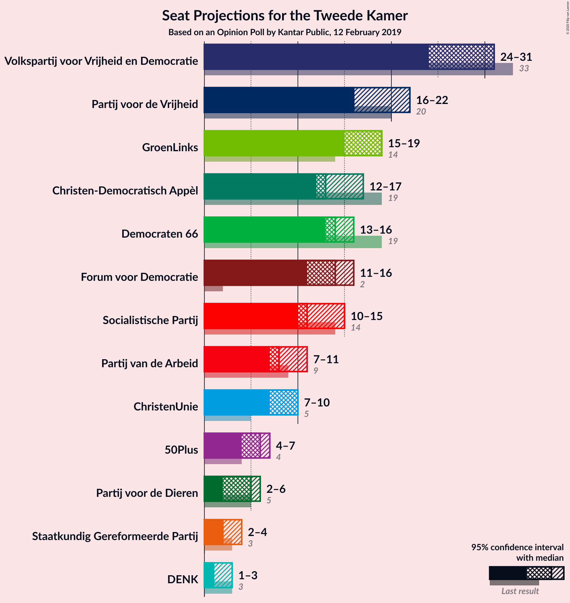
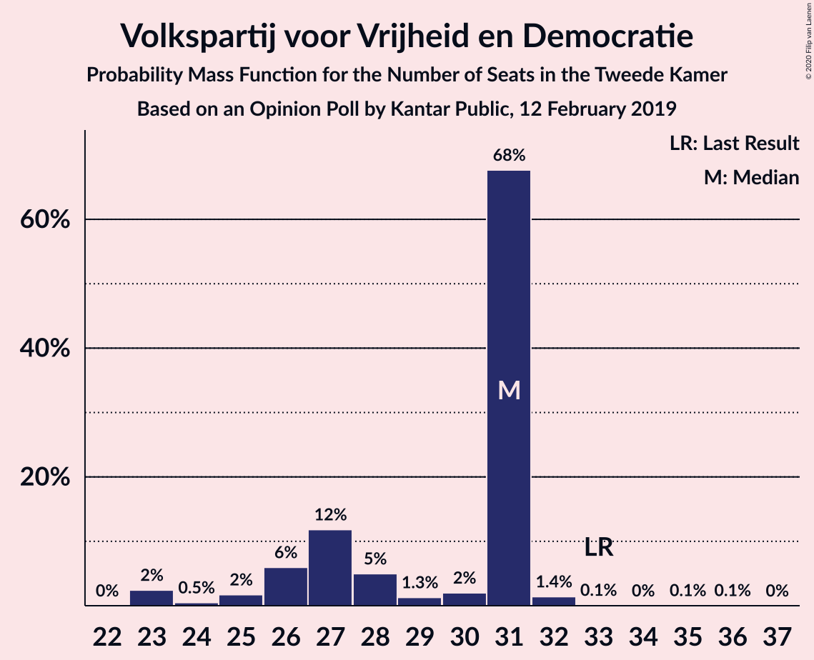
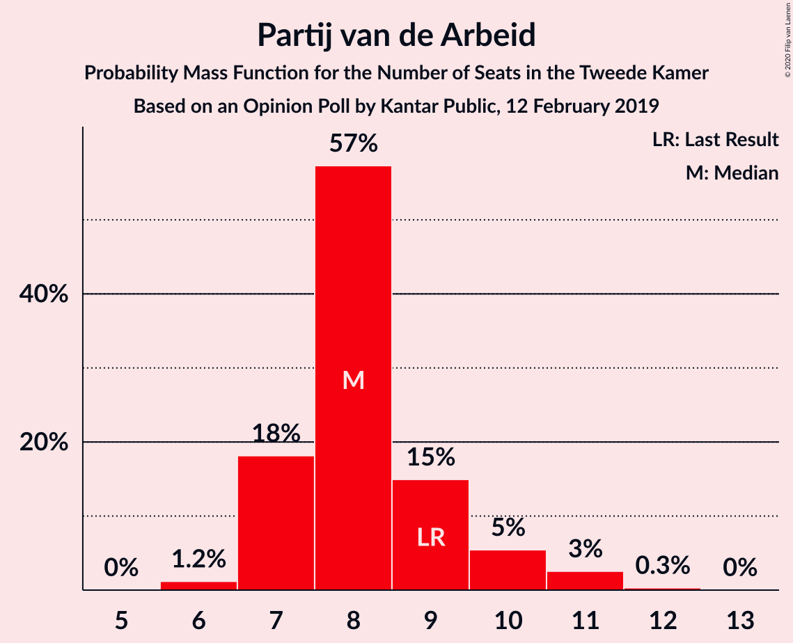
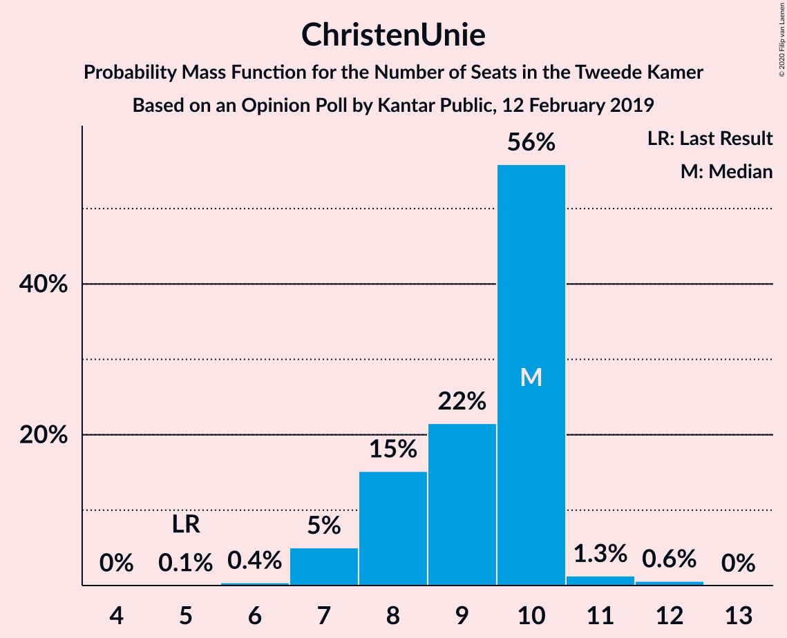
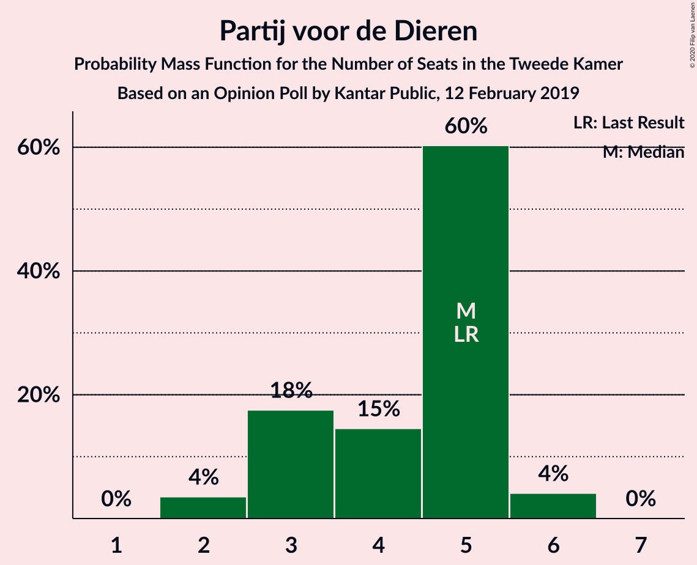
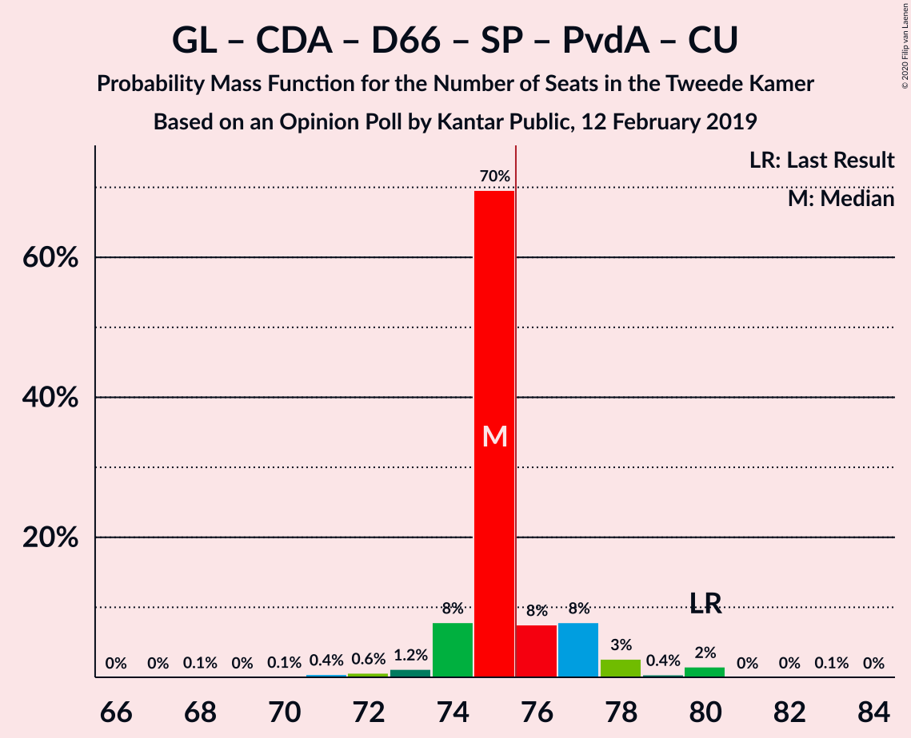
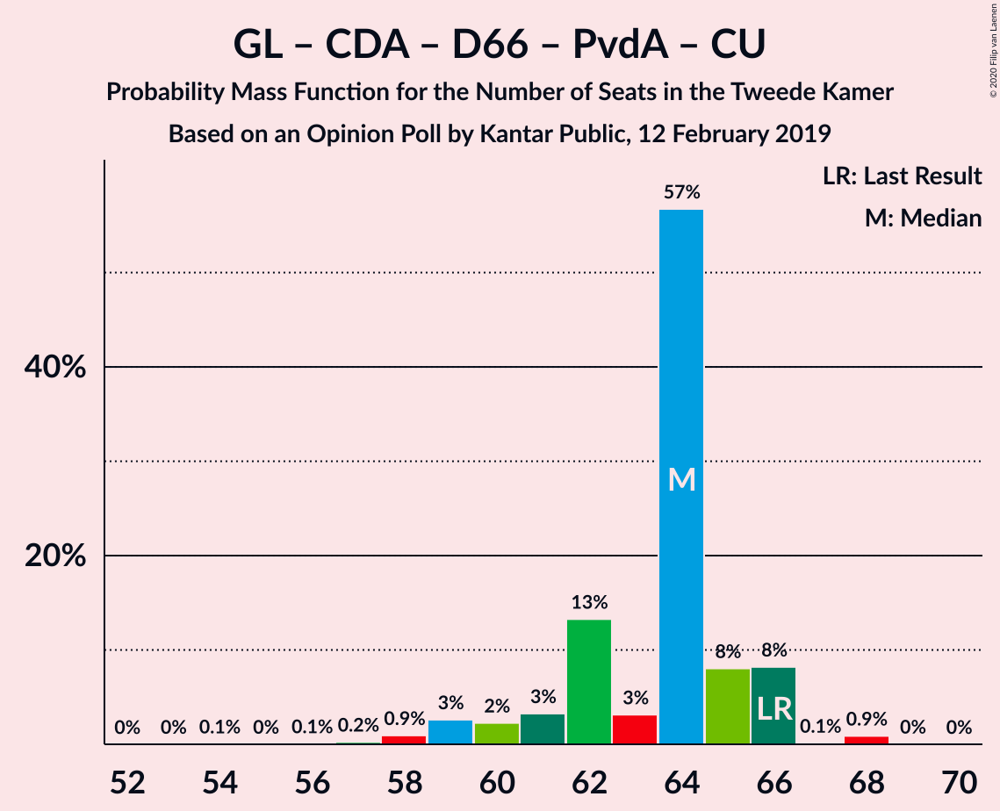
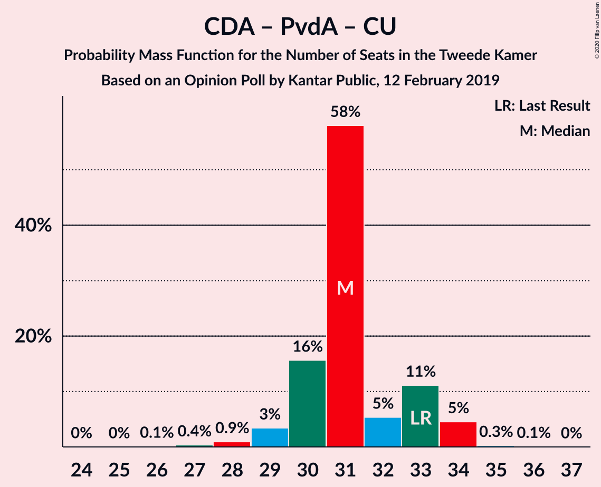

# Opinion Poll by Kantar Public, 12 February 2019

<a href="#voting-intentions">Voting Intentions</a> | <a href="#seats">Seats</a> | <a href="#coalitions">Coalitions</a> | <a href="#technical-information">Technical Information</a>

## Voting Intentions

### Confidence Intervals

| Party | Last Result | Poll Result | 80% Confidence Interval | 90% Confidence Interval | 95% Confidence Interval | 99% Confidence Interval |
|:-----:|:-----------:|:-----------:|:-----------------------:|:-----------------------:|:-----------------------:|:-----------------------:|
| Volkspartij voor Vrijheid en Democratie | 21.3% | 18.7% | 17.1–20.4% |16.7–20.9% |16.3–21.3% |15.6–22.1% |
| Partij voor de Vrijheid | 13.1% | 12.0% | 10.7–13.4% |10.3–13.8% |10.0–14.2% |9.5–14.9% |
| GroenLinks | 9.1% | 11.3% | 10.1–12.8% |9.8–13.2% |9.5–13.5% |8.9–14.2% |
| Christen-Democratisch Appèl | 12.4% | 9.3% | 8.2–10.7% |7.9–11.0% |7.7–11.4% |7.1–12.0% |
| Democraten 66 | 12.2% | 9.3% | 8.2–10.7% |7.9–11.0% |7.7–11.4% |7.1–12.0% |
| Forum voor Democratie | 1.8% | 9.3% | 8.2–10.7% |7.9–11.0% |7.7–11.4% |7.1–12.0% |
| Socialistische Partij | 9.1% | 8.7% | 7.6–10.0% |7.3–10.4% |7.1–10.7% |6.6–11.3% |
| Partij van de Arbeid | 5.7% | 6.0% | 5.1–7.1% |4.8–7.4% |4.6–7.7% |4.3–8.2% |
| ChristenUnie | 3.4% | 5.4% | 4.5–6.4% |4.3–6.7% |4.1–7.0% |3.7–7.5% |
| 50Plus | 3.1% | 4.0% | 3.3–4.9% |3.1–5.2% |2.9–5.4% |2.6–5.9% |
| Partij voor de Dieren | 3.2% | 2.6% | 2.1–3.4% |1.9–3.6% |1.8–3.9% |1.5–4.3% |
| Staatkundig Gereformeerde Partij | 2.1% | 2.0% | 1.5–2.7% |1.4–2.9% |1.3–3.1% |1.1–3.5% |
| DENK | 2.1% | 1.4% | 1.0–2.0% |0.9–2.2% |0.8–2.3% |0.7–2.7% |

*Note:* The poll result column reflects the actual value used in the calculations. Published results may vary slightly, and in addition be rounded to fewer digits.

## Seats

### Confidence Intervals

| Party | Last Result | Median | 80% Confidence Interval | 90% Confidence Interval | 95% Confidence Interval | 99% Confidence Interval |
|:-----:|:-----------:|:------:|:-----------------------:|:-----------------------:|:-----------------------:|:-----------------------:|
| <a href="#volkspartij-voor-vrijheid-en-democratie">Volkspartij voor Vrijheid en Democratie</a> | 33 | 27 | 25–28 |25–29 |25–31 |24–33 |
| <a href="#partij-voor-de-vrijheid">Partij voor de Vrijheid</a> | 20 | 20 | 16–21 |16–21 |15–21 |14–22 |
| <a href="#groenlinks">GroenLinks</a> | 14 | 16 | 15–18 |13–18 |13–19 |13–21 |
| <a href="#christen-democratisch-appèl">Christen-Democratisch Appèl</a> | 19 | 17 | 13–17 |13–17 |12–17 |11–18 |
| <a href="#democraten-66">Democraten 66</a> | 19 | 15 | 13–15 |13–15 |13–15 |12–17 |
| <a href="#forum-voor-democratie">Forum voor Democratie</a> | 2 | 13 | 13–14 |12–15 |11–16 |11–17 |
| <a href="#socialistische-partij">Socialistische Partij</a> | 14 | 14 | 12–14 |11–16 |11–16 |9–17 |
| <a href="#partij-van-de-arbeid">Partij van de Arbeid</a> | 9 | 8 | 6–10 |6–12 |6–12 |6–12 |
| <a href="#christenunie">ChristenUnie</a> | 5 | 8 | 8–11 |7–11 |7–11 |5–14 |
| <a href="#50plus">50Plus</a> | 4 | 5 | 4–8 |4–8 |4–8 |4–9 |
| <a href="#partij-voor-de-dieren">Partij voor de Dieren</a> | 5 | 3 | 3–5 |3–5 |3–6 |2–6 |
| <a href="#staatkundig-gereformeerde-partij">Staatkundig Gereformeerde Partij</a> | 3 | 3 | 2–4 |2–4 |2–4 |2–5 |
| <a href="#denk">DENK</a> | 3 | 2 | 1–2 |1–3 |1–3 |1–4 |

### Volkspartij voor Vrijheid en Democratie

*For a full overview of the results for this party, see the [Volkspartij voor Vrijheid en Democratie](party-volkspartijvoorvrijheidendemocratie.html) page.*

| Number of Seats | Probability | Accumulated | Special Marks |
|:---------------:|:-----------:|:-----------:|:-------------:|
| 23 | 0.4% | 100% |  |
| 24 | 1.2% | 99.6% |  |
| 25 | 21% | 98% |  |
| 26 | 16% | 77% |  |
| 27 | 51% | 61% | Median |
| 28 | 2% | 10% |  |
| 29 | 4% | 9% |  |
| 30 | 0.8% | 5% |  |
| 31 | 3% | 4% |  |
| 32 | 0.1% | 0.8% |  |
| 33 | 0.7% | 0.8% | Last Result |
| 34 | 0% | 0.1% |  |
| 35 | 0% | 0% |  |

### Partij voor de Vrijheid

*For a full overview of the results for this party, see the [Partij voor de Vrijheid](party-partijvoordevrijheid.html) page.*

| Number of Seats | Probability | Accumulated | Special Marks |
|:---------------:|:-----------:|:-----------:|:-------------:|
| 14 | 0.7% | 100% |  |
| 15 | 4% | 99.3% |  |
| 16 | 16% | 95% |  |
| 17 | 5% | 80% |  |
| 18 | 1.4% | 74% |  |
| 19 | 22% | 73% |  |
| 20 | 2% | 51% | Last Result, Median |
| 21 | 49% | 50% |  |
| 22 | 0.2% | 0.6% |  |
| 23 | 0.4% | 0.4% |  |
| 24 | 0% | 0% |  |

### GroenLinks

*For a full overview of the results for this party, see the [GroenLinks](party-groenlinks.html) page.*

| Number of Seats | Probability | Accumulated | Special Marks |
|:---------------:|:-----------:|:-----------:|:-------------:|
| 12 | 0% | 100% |  |
| 13 | 7% | 99.9% |  |
| 14 | 1.0% | 93% | Last Result |
| 15 | 7% | 92% |  |
| 16 | 47% | 85% | Median |
| 17 | 20% | 37% |  |
| 18 | 15% | 18% |  |
| 19 | 1.4% | 3% |  |
| 20 | 0.9% | 2% |  |
| 21 | 0.3% | 0.7% |  |
| 22 | 0.2% | 0.4% |  |
| 23 | 0.2% | 0.2% |  |
| 24 | 0% | 0% |  |

### Christen-Democratisch Appèl

*For a full overview of the results for this party, see the [Christen-Democratisch Appèl](party-christen-democratischappèl.html) page.*

| Number of Seats | Probability | Accumulated | Special Marks |
|:---------------:|:-----------:|:-----------:|:-------------:|
| 10 | 0.1% | 100% |  |
| 11 | 0.7% | 99.9% |  |
| 12 | 4% | 99.3% |  |
| 13 | 17% | 96% |  |
| 14 | 6% | 79% |  |
| 15 | 1.0% | 73% |  |
| 16 | 21% | 72% |  |
| 17 | 51% | 52% | Median |
| 18 | 0.9% | 0.9% |  |
| 19 | 0% | 0% | Last Result |

### Democraten 66

*For a full overview of the results for this party, see the [Democraten 66](party-democraten66.html) page.*

| Number of Seats | Probability | Accumulated | Special Marks |
|:---------------:|:-----------:|:-----------:|:-------------:|
| 11 | 0.3% | 100% |  |
| 12 | 0.6% | 99.7% |  |
| 13 | 22% | 99.1% |  |
| 14 | 4% | 78% |  |
| 15 | 72% | 74% | Median |
| 16 | 0.7% | 2% |  |
| 17 | 1.1% | 1.3% |  |
| 18 | 0% | 0.2% |  |
| 19 | 0% | 0.1% | Last Result |
| 20 | 0.1% | 0.1% |  |
| 21 | 0% | 0% |  |

### Forum voor Democratie

*For a full overview of the results for this party, see the [Forum voor Democratie](party-forumvoordemocratie.html) page.*

| Number of Seats | Probability | Accumulated | Special Marks |
|:---------------:|:-----------:|:-----------:|:-------------:|
| 2 | 0% | 100% | Last Result |
| 3 | 0% | 100% |  |
| 4 | 0% | 100% |  |
| 5 | 0% | 100% |  |
| 6 | 0% | 100% |  |
| 7 | 0% | 100% |  |
| 8 | 0% | 100% |  |
| 9 | 0% | 100% |  |
| 10 | 0.3% | 100% |  |
| 11 | 3% | 99.7% |  |
| 12 | 1.5% | 96% |  |
| 13 | 60% | 95% | Median |
| 14 | 28% | 35% |  |
| 15 | 3% | 7% |  |
| 16 | 2% | 3% |  |
| 17 | 1.0% | 1.1% |  |
| 18 | 0% | 0.1% |  |
| 19 | 0.1% | 0.1% |  |
| 20 | 0% | 0% |  |

### Socialistische Partij

*For a full overview of the results for this party, see the [Socialistische Partij](party-socialistischepartij.html) page.*

| Number of Seats | Probability | Accumulated | Special Marks |
|:---------------:|:-----------:|:-----------:|:-------------:|
| 8 | 0.1% | 100% |  |
| 9 | 0.8% | 99.9% |  |
| 10 | 0.8% | 99.1% |  |
| 11 | 4% | 98% |  |
| 12 | 32% | 94% |  |
| 13 | 2% | 62% |  |
| 14 | 52% | 60% | Last Result, Median |
| 15 | 2% | 8% |  |
| 16 | 6% | 6% |  |
| 17 | 0.4% | 0.7% |  |
| 18 | 0.3% | 0.3% |  |
| 19 | 0% | 0% |  |

### Partij van de Arbeid

*For a full overview of the results for this party, see the [Partij van de Arbeid](party-partijvandearbeid.html) page.*

| Number of Seats | Probability | Accumulated | Special Marks |
|:---------------:|:-----------:|:-----------:|:-------------:|
| 5 | 0.5% | 100% |  |
| 6 | 20% | 99.5% |  |
| 7 | 14% | 80% |  |
| 8 | 47% | 66% | Median |
| 9 | 2% | 19% | Last Result |
| 10 | 9% | 17% |  |
| 11 | 3% | 8% |  |
| 12 | 6% | 6% |  |
| 13 | 0% | 0% |  |

### ChristenUnie

*For a full overview of the results for this party, see the [ChristenUnie](party-christenunie.html) page.*

| Number of Seats | Probability | Accumulated | Special Marks |
|:---------------:|:-----------:|:-----------:|:-------------:|
| 4 | 0.1% | 100% |  |
| 5 | 1.1% | 99.9% | Last Result |
| 6 | 0.8% | 98.9% |  |
| 7 | 5% | 98% |  |
| 8 | 53% | 93% | Median |
| 9 | 6% | 40% |  |
| 10 | 21% | 34% |  |
| 11 | 13% | 14% |  |
| 12 | 0% | 0.8% |  |
| 13 | 0.1% | 0.7% |  |
| 14 | 0.6% | 0.6% |  |
| 15 | 0% | 0% |  |

### 50Plus

*For a full overview of the results for this party, see the [50Plus](party-50plus.html) page.*

| Number of Seats | Probability | Accumulated | Special Marks |
|:---------------:|:-----------:|:-----------:|:-------------:|
| 3 | 0.1% | 100% |  |
| 4 | 25% | 99.9% | Last Result |
| 5 | 33% | 75% | Median |
| 6 | 9% | 42% |  |
| 7 | 16% | 33% |  |
| 8 | 16% | 17% |  |
| 9 | 0.5% | 0.5% |  |
| 10 | 0.1% | 0.1% |  |
| 11 | 0% | 0% |  |

### Partij voor de Dieren

*For a full overview of the results for this party, see the [Partij voor de Dieren](party-partijvoordedieren.html) page.*

| Number of Seats | Probability | Accumulated | Special Marks |
|:---------------:|:-----------:|:-----------:|:-------------:|
| 2 | 0.7% | 100% |  |
| 3 | 65% | 99.2% | Median |
| 4 | 8% | 35% |  |
| 5 | 23% | 27% | Last Result |
| 6 | 4% | 4% |  |
| 7 | 0.2% | 0.3% |  |
| 8 | 0% | 0% |  |

### Staatkundig Gereformeerde Partij

*For a full overview of the results for this party, see the [Staatkundig Gereformeerde Partij](party-staatkundiggereformeerdepartij.html) page.*

| Number of Seats | Probability | Accumulated | Special Marks |
|:---------------:|:-----------:|:-----------:|:-------------:|
| 1 | 0.4% | 100% |  |
| 2 | 14% | 99.6% |  |
| 3 | 67% | 85% | Last Result, Median |
| 4 | 17% | 18% |  |
| 5 | 0.9% | 1.1% |  |
| 6 | 0.2% | 0.2% |  |
| 7 | 0% | 0% |  |

### DENK

*For a full overview of the results for this party, see the [DENK](party-denk.html) page.*

| Number of Seats | Probability | Accumulated | Special Marks |
|:---------------:|:-----------:|:-----------:|:-------------:|
| 1 | 28% | 100% |  |
| 2 | 66% | 72% | Median |
| 3 | 4% | 6% | Last Result |
| 4 | 1.3% | 1.3% |  |
| 5 | 0% | 0% |  |

## Coalitions

### Confidence Intervals

| Coalition | Last Result | Median | Majority? | 80% Confidence Interval | 90% Confidence Interval | 95% Confidence Interval | 99% Confidence Interval |
|:---------:|:-----------:|:------:|:---------:|:-----------------------:|:-----------------------:|:-----------------------:|:-----------------------:|
| Volkspartij voor Vrijheid en Democratie – GroenLinks – Christen-Democratisch Appèl – Democraten 66 – ChristenUnie | 90 | 83 | 97% | 79–84 | 78–84 | 75–86 | 75–87 |
| Volkspartij voor Vrijheid en Democratie – Partij voor de Vrijheid – Christen-Democratisch Appèl – Forum voor Democratie – Staatkundig Gereformeerde Partij | 77 | 78 | 78% | 75–81 | 72–81 | 72–81 | 71–81 |
| GroenLinks – Christen-Democratisch Appèl – Democraten 66 – Socialistische Partij – Partij van de Arbeid – ChristenUnie | 80 | 76 | 79% | 74–80 | 74–80 | 73–80 | 71–80 |
| Volkspartij voor Vrijheid en Democratie – Partij voor de Vrijheid – Christen-Democratisch Appèl – Forum voor Democratie | 74 | 74 | 39% | 72–78 | 70–79 | 69–79 | 69–79 |
| Volkspartij voor Vrijheid en Democratie – Christen-Democratisch Appèl – Democraten 66 – Partij van de Arbeid – ChristenUnie | 85 | 74 | 11% | 71–76 | 71–77 | 70–77 | 68–80 |
| Volkspartij voor Vrijheid en Democratie – Christen-Democratisch Appèl – Democraten 66 – ChristenUnie | 76 | 66 | 0% | 64–67 | 62–67 | 60–69 | 58–70 |
| Volkspartij voor Vrijheid en Democratie – Christen-Democratisch Appèl – Forum voor Democratie – 50Plus – Staatkundig Gereformeerde Partij | 61 | 65 | 0% | 62–67 | 62–67 | 59–69 | 59–70 |
| GroenLinks – Christen-Democratisch Appèl – Democraten 66 – Partij van de Arbeid – ChristenUnie | 66 | 64 | 0% | 60–66 | 60–66 | 60–67 | 58–69 |
| Volkspartij voor Vrijheid en Democratie – Christen-Democratisch Appèl – Forum voor Democratie – 50Plus | 58 | 62 | 0% | 59–64 | 59–64 | 56–65 | 56–66 |
| Volkspartij voor Vrijheid en Democratie – Partij voor de Vrijheid – Christen-Democratisch Appèl | 72 | 61 | 0% | 59–65 | 57–65 | 56–65 | 55–65 |
| Volkspartij voor Vrijheid en Democratie – Christen-Democratisch Appèl – Forum voor Democratie – Staatkundig Gereformeerde Partij | 57 | 59 | 0% | 57–60 | 56–61 | 53–62 | 53–63 |
| Volkspartij voor Vrijheid en Democratie – Christen-Democratisch Appèl – Democraten 66 | 71 | 58 | 0% | 53–59 | 53–59 | 52–60 | 51–60 |
| Volkspartij voor Vrijheid en Democratie – Christen-Democratisch Appèl – Forum voor Democratie | 54 | 56 | 0% | 53–58 | 53–58 | 50–58 | 50–61 |
| Volkspartij voor Vrijheid en Democratie – Christen-Democratisch Appèl – Partij van de Arbeid | 61 | 51 | 0% | 47–54 | 47–54 | 47–56 | 45–56 |
| Volkspartij voor Vrijheid en Democratie – Democraten 66 – Partij van de Arbeid | 61 | 50 | 0% | 46–52 | 46–53 | 46–55 | 46–56 |
| Volkspartij voor Vrijheid en Democratie – Christen-Democratisch Appèl | 52 | 43 | 0% | 40–44 | 39–44 | 39–44 | 38–46 |
| Christen-Democratisch Appèl – Democraten 66 – Partij van de Arbeid | 47 | 40 | 0% | 33–40 | 33–42 | 33–42 | 33–42 |
| Volkspartij voor Vrijheid en Democratie – Partij van de Arbeid | 42 | 35 | 0% | 31–38 | 31–39 | 31–42 | 31–43 |
| Christen-Democratisch Appèl – Partij van de Arbeid – ChristenUnie | 33 | 33 | 0% | 31–34 | 31–35 | 29–35 | 26–39 |
| Christen-Democratisch Appèl – Democraten 66 | 38 | 32 | 0% | 26–32 | 26–32 | 25–32 | 24–34 |
| Christen-Democratisch Appèl – Partij van de Arbeid | 28 | 25 | 0% | 20–26 | 20–27 | 20–27 | 20–27 |

### Volkspartij voor Vrijheid en Democratie – GroenLinks – Christen-Democratisch Appèl – Democraten 66 – ChristenUnie

| Number of Seats | Probability | Accumulated | Special Marks |
|:---------------:|:-----------:|:-----------:|:-------------:|
| 73 | 0.1% | 100% |  |
| 74 | 0% | 99.9% |  |
| 75 | 3% | 99.9% |  |
| 76 | 0.9% | 97% | Majority |
| 77 | 0.3% | 96% |  |
| 78 | 2% | 96% |  |
| 79 | 6% | 93% |  |
| 80 | 18% | 87% |  |
| 81 | 1.1% | 70% |  |
| 82 | 0.6% | 69% |  |
| 83 | 49% | 68% | Median |
| 84 | 15% | 19% |  |
| 85 | 0.7% | 3% |  |
| 86 | 2% | 3% |  |
| 87 | 0.3% | 0.6% |  |
| 88 | 0.2% | 0.3% |  |
| 89 | 0.1% | 0.1% |  |
| 90 | 0% | 0% | Last Result |

### Volkspartij voor Vrijheid en Democratie – Partij voor de Vrijheid – Christen-Democratisch Appèl – Forum voor Democratie – Staatkundig Gereformeerde Partij

| Number of Seats | Probability | Accumulated | Special Marks |
|:---------------:|:-----------:|:-----------:|:-------------:|
| 71 | 0.5% | 100% |  |
| 72 | 6% | 99.5% |  |
| 73 | 0.4% | 94% |  |
| 74 | 1.2% | 93% |  |
| 75 | 14% | 92% |  |
| 76 | 3% | 78% | Majority |
| 77 | 20% | 74% | Last Result |
| 78 | 14% | 55% |  |
| 79 | 3% | 41% |  |
| 80 | 2% | 38% | Median |
| 81 | 36% | 36% |  |
| 82 | 0.1% | 0.3% |  |
| 83 | 0% | 0.3% |  |
| 84 | 0.2% | 0.3% |  |
| 85 | 0% | 0.1% |  |
| 86 | 0% | 0% |  |

### GroenLinks – Christen-Democratisch Appèl – Democraten 66 – Socialistische Partij – Partij van de Arbeid – ChristenUnie

| Number of Seats | Probability | Accumulated | Special Marks |
|:---------------:|:-----------:|:-----------:|:-------------:|
| 68 | 0.1% | 100% |  |
| 69 | 0% | 99.9% |  |
| 70 | 0.3% | 99.9% |  |
| 71 | 0.9% | 99.6% |  |
| 72 | 0.4% | 98.7% |  |
| 73 | 3% | 98% |  |
| 74 | 16% | 96% |  |
| 75 | 1.3% | 80% |  |
| 76 | 35% | 79% | Majority |
| 77 | 6% | 43% |  |
| 78 | 22% | 37% | Median |
| 79 | 1.1% | 15% |  |
| 80 | 14% | 14% | Last Result |
| 81 | 0.1% | 0.2% |  |
| 82 | 0% | 0.2% |  |
| 83 | 0.1% | 0.2% |  |
| 84 | 0% | 0% |  |

### Volkspartij voor Vrijheid en Democratie – Partij voor de Vrijheid – Christen-Democratisch Appèl – Forum voor Democratie

| Number of Seats | Probability | Accumulated | Special Marks |
|:---------------:|:-----------:|:-----------:|:-------------:|
| 68 | 0.4% | 100% |  |
| 69 | 3% | 99.6% |  |
| 70 | 3% | 96% |  |
| 71 | 1.3% | 93% |  |
| 72 | 15% | 92% |  |
| 73 | 1.1% | 77% |  |
| 74 | 34% | 76% | Last Result |
| 75 | 3% | 42% |  |
| 76 | 0.2% | 39% | Majority |
| 77 | 1.2% | 39% | Median |
| 78 | 32% | 37% |  |
| 79 | 5% | 5% |  |
| 80 | 0.1% | 0.3% |  |
| 81 | 0% | 0.2% |  |
| 82 | 0.2% | 0.2% |  |
| 83 | 0% | 0% |  |

### Volkspartij voor Vrijheid en Democratie – Christen-Democratisch Appèl – Democraten 66 – Partij van de Arbeid – ChristenUnie

| Number of Seats | Probability | Accumulated | Special Marks |
|:---------------:|:-----------:|:-----------:|:-------------:|
| 66 | 0.1% | 100% |  |
| 67 | 0.3% | 99.9% |  |
| 68 | 0.2% | 99.6% |  |
| 69 | 0.3% | 99.3% |  |
| 70 | 2% | 99.0% |  |
| 71 | 13% | 97% |  |
| 72 | 21% | 84% |  |
| 73 | 5% | 63% |  |
| 74 | 14% | 58% |  |
| 75 | 32% | 44% | Median |
| 76 | 4% | 11% | Majority |
| 77 | 6% | 7% |  |
| 78 | 0.1% | 1.5% |  |
| 79 | 0.7% | 1.4% |  |
| 80 | 0.7% | 0.8% |  |
| 81 | 0% | 0.1% |  |
| 82 | 0.1% | 0.1% |  |
| 83 | 0% | 0% |  |
| 84 | 0% | 0% |  |
| 85 | 0% | 0% | Last Result |

### Volkspartij voor Vrijheid en Democratie – Christen-Democratisch Appèl – Democraten 66 – ChristenUnie

| Number of Seats | Probability | Accumulated | Special Marks |
|:---------------:|:-----------:|:-----------:|:-------------:|
| 57 | 0.2% | 100% |  |
| 58 | 0.6% | 99.7% |  |
| 59 | 0.1% | 99.2% |  |
| 60 | 3% | 99.1% |  |
| 61 | 0.7% | 96% |  |
| 62 | 1.2% | 95% |  |
| 63 | 3% | 94% |  |
| 64 | 15% | 91% |  |
| 65 | 4% | 76% |  |
| 66 | 32% | 72% |  |
| 67 | 36% | 40% | Median |
| 68 | 1.2% | 4% |  |
| 69 | 2% | 3% |  |
| 70 | 0.7% | 0.8% |  |
| 71 | 0% | 0.1% |  |
| 72 | 0% | 0.1% |  |
| 73 | 0% | 0.1% |  |
| 74 | 0.1% | 0.1% |  |
| 75 | 0% | 0% |  |
| 76 | 0% | 0% | Last Result, Majority |

### Volkspartij voor Vrijheid en Democratie – Christen-Democratisch Appèl – Forum voor Democratie – 50Plus – Staatkundig Gereformeerde Partij

| Number of Seats | Probability | Accumulated | Special Marks |
|:---------------:|:-----------:|:-----------:|:-------------:|
| 58 | 0% | 100% |  |
| 59 | 3% | 99.9% |  |
| 60 | 0.7% | 97% |  |
| 61 | 0.4% | 97% | Last Result |
| 62 | 19% | 96% |  |
| 63 | 4% | 77% |  |
| 64 | 18% | 73% |  |
| 65 | 32% | 54% | Median |
| 66 | 4% | 22% |  |
| 67 | 15% | 18% |  |
| 68 | 0.3% | 3% |  |
| 69 | 1.0% | 3% |  |
| 70 | 2% | 2% |  |
| 71 | 0% | 0.1% |  |
| 72 | 0% | 0.1% |  |
| 73 | 0% | 0% |  |

### GroenLinks – Christen-Democratisch Appèl – Democraten 66 – Partij van de Arbeid – ChristenUnie

| Number of Seats | Probability | Accumulated | Special Marks |
|:---------------:|:-----------:|:-----------:|:-------------:|
| 55 | 0.1% | 100% |  |
| 56 | 0% | 99.9% |  |
| 57 | 0.4% | 99.9% |  |
| 58 | 1.2% | 99.5% |  |
| 59 | 0.4% | 98% |  |
| 60 | 20% | 98% |  |
| 61 | 0.4% | 78% |  |
| 62 | 5% | 78% |  |
| 63 | 6% | 73% |  |
| 64 | 50% | 68% | Median |
| 65 | 1.4% | 18% |  |
| 66 | 14% | 16% | Last Result |
| 67 | 1.2% | 3% |  |
| 68 | 0.7% | 2% |  |
| 69 | 0.8% | 0.8% |  |
| 70 | 0% | 0% |  |

### Volkspartij voor Vrijheid en Democratie – Christen-Democratisch Appèl – Forum voor Democratie – 50Plus

| Number of Seats | Probability | Accumulated | Special Marks |
|:---------------:|:-----------:|:-----------:|:-------------:|
| 55 | 0.3% | 100% |  |
| 56 | 3% | 99.7% |  |
| 57 | 0.3% | 97% |  |
| 58 | 0.9% | 97% | Last Result |
| 59 | 18% | 96% |  |
| 60 | 14% | 78% |  |
| 61 | 5% | 63% |  |
| 62 | 36% | 58% | Median |
| 63 | 2% | 22% |  |
| 64 | 17% | 21% |  |
| 65 | 2% | 4% |  |
| 66 | 2% | 2% |  |
| 67 | 0.3% | 0.3% |  |
| 68 | 0% | 0.1% |  |
| 69 | 0% | 0% |  |

### Volkspartij voor Vrijheid en Democratie – Partij voor de Vrijheid – Christen-Democratisch Appèl

| Number of Seats | Probability | Accumulated | Special Marks |
|:---------------:|:-----------:|:-----------:|:-------------:|
| 53 | 0% | 100% |  |
| 54 | 0.2% | 99.9% |  |
| 55 | 0.4% | 99.8% |  |
| 56 | 4% | 99.4% |  |
| 57 | 0.9% | 95% |  |
| 58 | 4% | 94% |  |
| 59 | 14% | 91% |  |
| 60 | 22% | 76% |  |
| 61 | 16% | 54% |  |
| 62 | 0.5% | 38% |  |
| 63 | 1.3% | 38% |  |
| 64 | 0.1% | 36% | Median |
| 65 | 36% | 36% |  |
| 66 | 0.1% | 0.3% |  |
| 67 | 0% | 0.2% |  |
| 68 | 0% | 0.2% |  |
| 69 | 0% | 0.2% |  |
| 70 | 0.2% | 0.2% |  |
| 71 | 0% | 0% |  |
| 72 | 0% | 0% | Last Result |

### Volkspartij voor Vrijheid en Democratie – Christen-Democratisch Appèl – Forum voor Democratie – Staatkundig Gereformeerde Partij

| Number of Seats | Probability | Accumulated | Special Marks |
|:---------------:|:-----------:|:-----------:|:-------------:|
| 52 | 0.1% | 100% |  |
| 53 | 3% | 99.9% |  |
| 54 | 0.7% | 97% |  |
| 55 | 0.6% | 97% |  |
| 56 | 1.0% | 96% |  |
| 57 | 16% | 95% | Last Result |
| 58 | 20% | 79% |  |
| 59 | 17% | 60% |  |
| 60 | 36% | 42% | Median |
| 61 | 2% | 6% |  |
| 62 | 3% | 4% |  |
| 63 | 0.8% | 1.0% |  |
| 64 | 0% | 0.1% |  |
| 65 | 0% | 0.1% |  |
| 66 | 0% | 0.1% |  |
| 67 | 0% | 0% |  |

### Volkspartij voor Vrijheid en Democratie – Christen-Democratisch Appèl – Democraten 66

| Number of Seats | Probability | Accumulated | Special Marks |
|:---------------:|:-----------:|:-----------:|:-------------:|
| 49 | 0% | 100% |  |
| 50 | 0.2% | 99.9% |  |
| 51 | 0.7% | 99.8% |  |
| 52 | 3% | 99.1% |  |
| 53 | 13% | 96% |  |
| 54 | 4% | 83% |  |
| 55 | 0.8% | 78% |  |
| 56 | 19% | 78% |  |
| 57 | 3% | 59% |  |
| 58 | 16% | 55% |  |
| 59 | 36% | 39% | Median |
| 60 | 2% | 3% |  |
| 61 | 0.3% | 0.4% |  |
| 62 | 0.1% | 0.2% |  |
| 63 | 0% | 0.1% |  |
| 64 | 0.1% | 0.1% |  |
| 65 | 0% | 0% |  |
| 66 | 0% | 0% |  |
| 67 | 0% | 0% |  |
| 68 | 0% | 0% |  |
| 69 | 0% | 0% |  |
| 70 | 0% | 0% |  |
| 71 | 0% | 0% | Last Result |

### Volkspartij voor Vrijheid en Democratie – Christen-Democratisch Appèl – Forum voor Democratie

| Number of Seats | Probability | Accumulated | Special Marks |
|:---------------:|:-----------:|:-----------:|:-------------:|
| 50 | 3% | 100% |  |
| 51 | 0.8% | 97% |  |
| 52 | 1.1% | 97% |  |
| 53 | 13% | 95% |  |
| 54 | 0.5% | 83% | Last Result |
| 55 | 23% | 82% |  |
| 56 | 14% | 59% |  |
| 57 | 35% | 45% | Median |
| 58 | 8% | 10% |  |
| 59 | 2% | 2% |  |
| 60 | 0.1% | 0.9% |  |
| 61 | 0.7% | 0.8% |  |
| 62 | 0% | 0.1% |  |
| 63 | 0% | 0.1% |  |
| 64 | 0% | 0% |  |

### Volkspartij voor Vrijheid en Democratie – Christen-Democratisch Appèl – Partij van de Arbeid

| Number of Seats | Probability | Accumulated | Special Marks |
|:---------------:|:-----------:|:-----------:|:-------------:|
| 44 | 0.3% | 100% |  |
| 45 | 0.2% | 99.6% |  |
| 46 | 1.2% | 99.5% |  |
| 47 | 31% | 98% |  |
| 48 | 0.3% | 67% |  |
| 49 | 3% | 67% |  |
| 50 | 1.1% | 64% |  |
| 51 | 19% | 63% |  |
| 52 | 32% | 44% | Median |
| 53 | 1.3% | 12% |  |
| 54 | 8% | 11% |  |
| 55 | 0.2% | 3% |  |
| 56 | 2% | 3% |  |
| 57 | 0% | 0% |  |
| 58 | 0% | 0% |  |
| 59 | 0% | 0% |  |
| 60 | 0% | 0% |  |
| 61 | 0% | 0% | Last Result |

### Volkspartij voor Vrijheid en Democratie – Democraten 66 – Partij van de Arbeid

| Number of Seats | Probability | Accumulated | Special Marks |
|:---------------:|:-----------:|:-----------:|:-------------:|
| 45 | 0.2% | 100% |  |
| 46 | 19% | 99.8% |  |
| 47 | 13% | 80% |  |
| 48 | 0.9% | 68% |  |
| 49 | 15% | 67% |  |
| 50 | 35% | 51% | Median |
| 51 | 0.7% | 16% |  |
| 52 | 9% | 16% |  |
| 53 | 3% | 6% |  |
| 54 | 0.1% | 3% |  |
| 55 | 0.7% | 3% |  |
| 56 | 2% | 2% |  |
| 57 | 0% | 0.2% |  |
| 58 | 0% | 0.2% |  |
| 59 | 0.1% | 0.1% |  |
| 60 | 0% | 0% |  |
| 61 | 0% | 0% | Last Result |

### Volkspartij voor Vrijheid en Democratie – Christen-Democratisch Appèl

| Number of Seats | Probability | Accumulated | Special Marks |
|:---------------:|:-----------:|:-----------:|:-------------:|
| 36 | 0.2% | 100% |  |
| 37 | 0.1% | 99.8% |  |
| 38 | 2% | 99.7% |  |
| 39 | 3% | 98% |  |
| 40 | 13% | 95% |  |
| 41 | 23% | 82% |  |
| 42 | 0.8% | 59% |  |
| 43 | 17% | 58% |  |
| 44 | 39% | 41% | Median |
| 45 | 0.9% | 2% |  |
| 46 | 0.9% | 1.1% |  |
| 47 | 0.2% | 0.3% |  |
| 48 | 0% | 0.1% |  |
| 49 | 0% | 0% |  |
| 50 | 0% | 0% |  |
| 51 | 0% | 0% |  |
| 52 | 0% | 0% | Last Result |

### Christen-Democratisch Appèl – Democraten 66 – Partij van de Arbeid

| Number of Seats | Probability | Accumulated | Special Marks |
|:---------------:|:-----------:|:-----------:|:-------------:|
| 32 | 0.2% | 100% |  |
| 33 | 13% | 99.8% |  |
| 34 | 1.2% | 87% |  |
| 35 | 5% | 86% |  |
| 36 | 2% | 81% |  |
| 37 | 19% | 79% |  |
| 38 | 3% | 61% |  |
| 39 | 3% | 57% |  |
| 40 | 46% | 54% | Median |
| 41 | 0.8% | 8% |  |
| 42 | 7% | 7% |  |
| 43 | 0.1% | 0.1% |  |
| 44 | 0% | 0% |  |
| 45 | 0% | 0% |  |
| 46 | 0% | 0% |  |
| 47 | 0% | 0% | Last Result |

### Volkspartij voor Vrijheid en Democratie – Partij van de Arbeid

| Number of Seats | Probability | Accumulated | Special Marks |
|:---------------:|:-----------:|:-----------:|:-------------:|
| 30 | 0.2% | 100% |  |
| 31 | 19% | 99.8% |  |
| 32 | 2% | 81% |  |
| 33 | 0.6% | 79% |  |
| 34 | 26% | 79% |  |
| 35 | 33% | 52% | Median |
| 36 | 0.7% | 20% |  |
| 37 | 9% | 19% |  |
| 38 | 3% | 11% |  |
| 39 | 4% | 8% |  |
| 40 | 0.2% | 4% |  |
| 41 | 0.7% | 3% |  |
| 42 | 0.4% | 3% | Last Result |
| 43 | 2% | 2% |  |
| 44 | 0.1% | 0.1% |  |
| 45 | 0% | 0% |  |

### Christen-Democratisch Appèl – Partij van de Arbeid – ChristenUnie

| Number of Seats | Probability | Accumulated | Special Marks |
|:---------------:|:-----------:|:-----------:|:-------------:|
| 25 | 0.1% | 100% |  |
| 26 | 0.8% | 99.9% |  |
| 27 | 0.1% | 99.1% |  |
| 28 | 1.5% | 99.1% |  |
| 29 | 0.6% | 98% |  |
| 30 | 1.0% | 97% |  |
| 31 | 17% | 96% |  |
| 32 | 23% | 79% |  |
| 33 | 45% | 56% | Last Result, Median |
| 34 | 4% | 12% |  |
| 35 | 5% | 7% |  |
| 36 | 2% | 2% |  |
| 37 | 0% | 0.7% |  |
| 38 | 0% | 0.6% |  |
| 39 | 0.6% | 0.6% |  |
| 40 | 0% | 0% |  |

### Christen-Democratisch Appèl – Democraten 66

| Number of Seats | Probability | Accumulated | Special Marks |
|:---------------:|:-----------:|:-----------:|:-------------:|
| 22 | 0.3% | 100% |  |
| 23 | 0% | 99.7% |  |
| 24 | 0.7% | 99.7% |  |
| 25 | 3% | 99.0% |  |
| 26 | 15% | 96% |  |
| 27 | 4% | 81% |  |
| 28 | 2% | 76% |  |
| 29 | 1.5% | 75% |  |
| 30 | 1.2% | 73% |  |
| 31 | 20% | 72% |  |
| 32 | 49% | 51% | Median |
| 33 | 0.9% | 2% |  |
| 34 | 1.1% | 1.1% |  |
| 35 | 0% | 0% |  |
| 36 | 0% | 0% |  |
| 37 | 0% | 0% |  |
| 38 | 0% | 0% | Last Result |

### Christen-Democratisch Appèl – Partij van de Arbeid

| Number of Seats | Probability | Accumulated | Special Marks |
|:---------------:|:-----------:|:-----------:|:-------------:|
| 18 | 0.3% | 100% |  |
| 19 | 0.1% | 99.6% |  |
| 20 | 13% | 99.5% |  |
| 21 | 3% | 87% |  |
| 22 | 22% | 84% |  |
| 23 | 2% | 61% |  |
| 24 | 0.3% | 59% |  |
| 25 | 47% | 59% | Median |
| 26 | 4% | 11% |  |
| 27 | 7% | 7% |  |
| 28 | 0% | 0.1% | Last Result |
| 29 | 0% | 0% |  |

## Technical Information

### Opinion Poll

+ **Polling firm:** Kantar Public
+ **Commissioner(s):** —
+ **Fieldwork period:** 12 February 2019

### Calculations

+ **Sample size:** 953
+ **Simulations done:** 262,144
+ **Error estimate:** 2.55%

