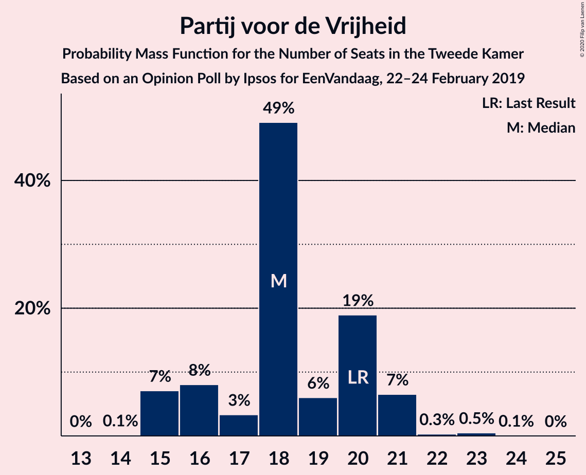
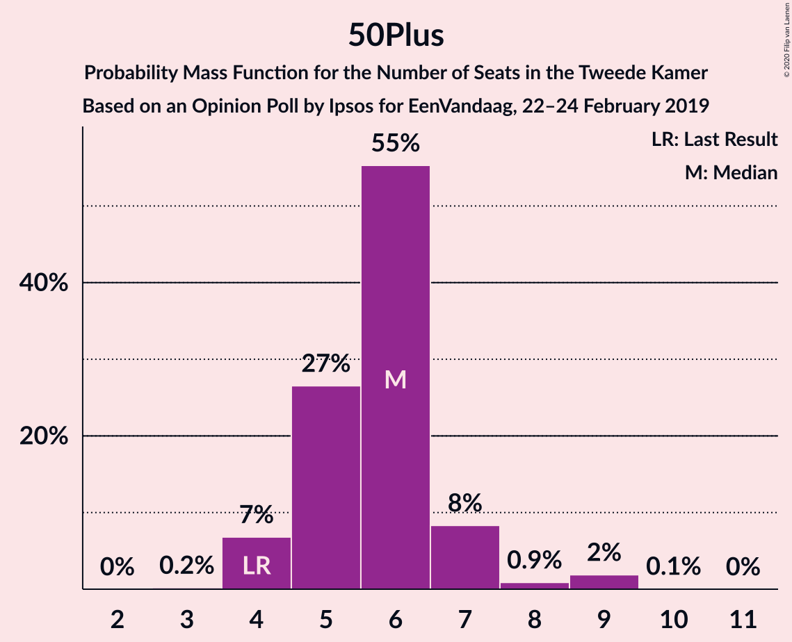
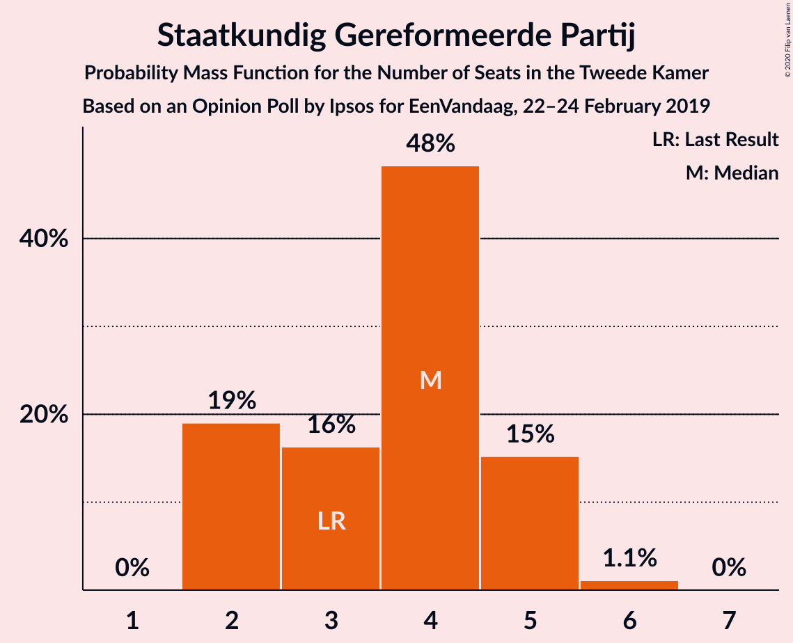
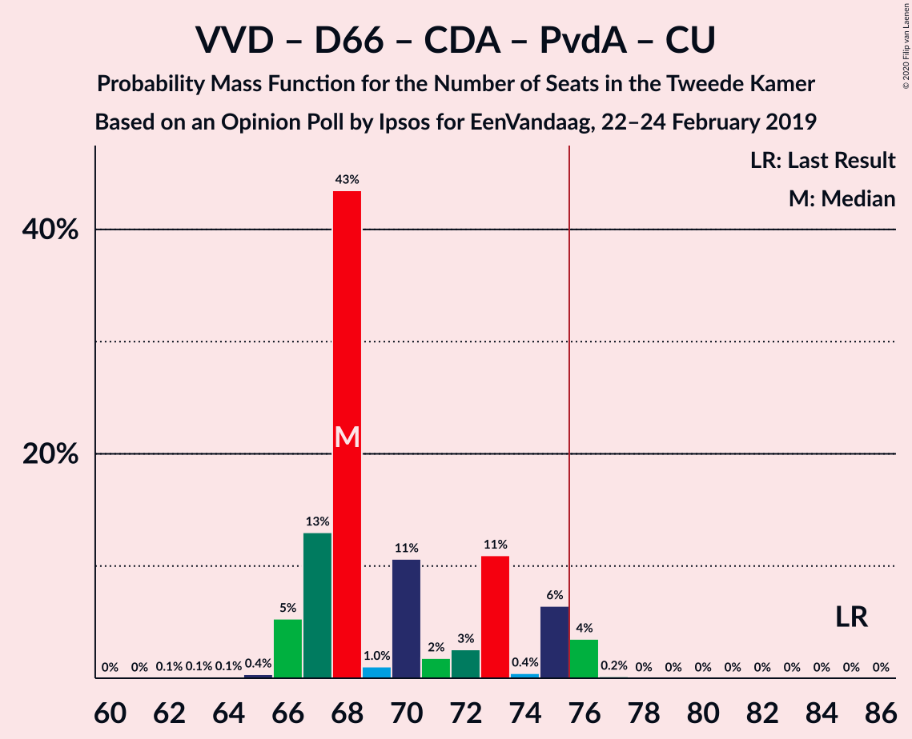
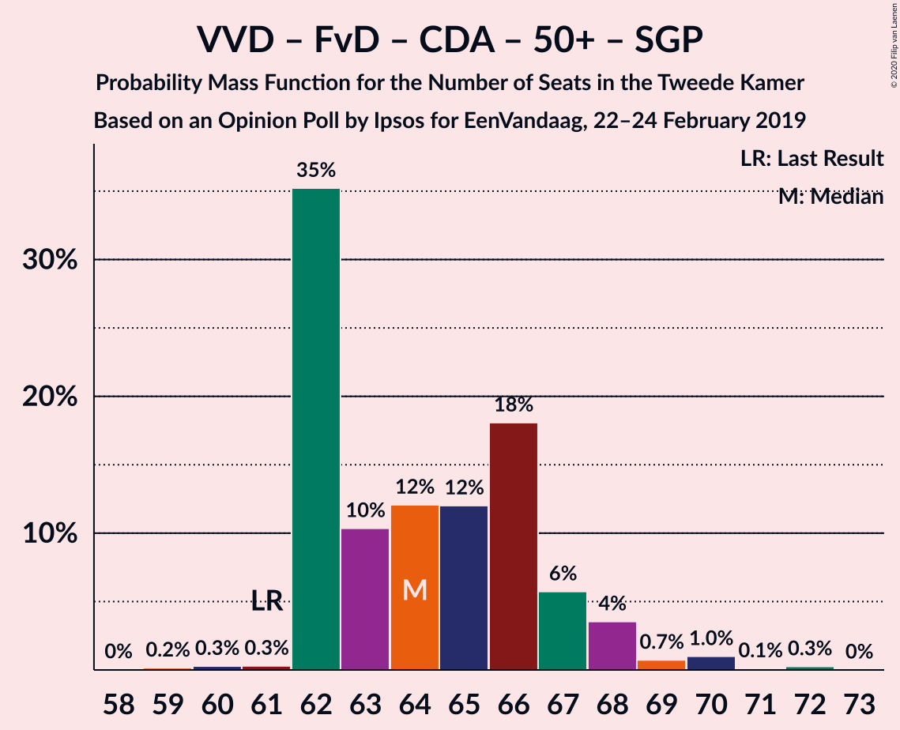
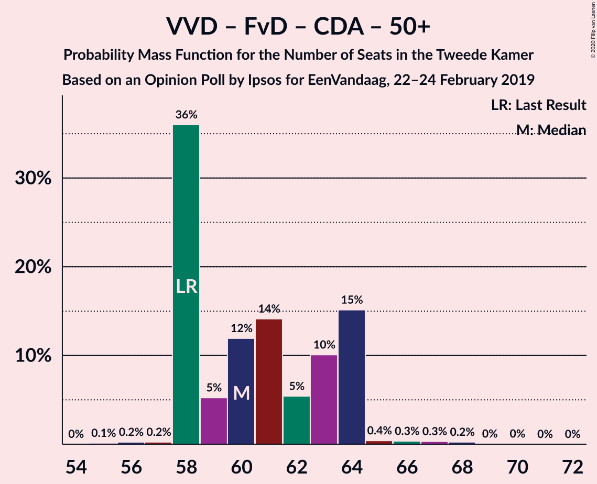
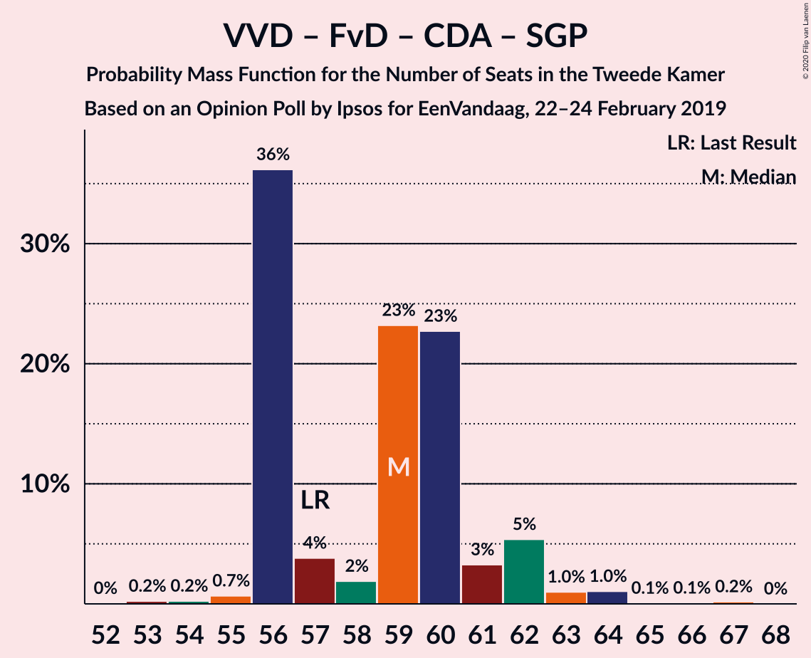
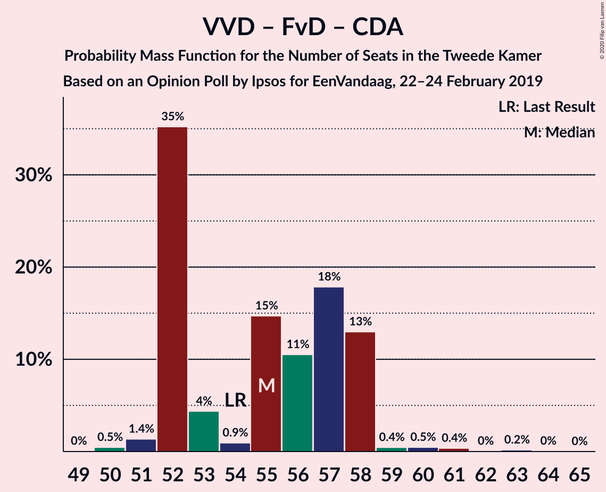

# Opinion Poll by Ipsos for EenVandaag, 22–24 February 2019

<a href="#voting-intentions">Voting Intentions</a> | <a href="#seats">Seats</a> | <a href="#coalitions">Coalitions</a> | <a href="#technical-information">Technical Information</a>

## Voting Intentions

### Confidence Intervals

| Party | Last Result | Poll Result | 80% Confidence Interval | 90% Confidence Interval | 95% Confidence Interval | 99% Confidence Interval |
|:-----:|:-----------:|:-----------:|:-----------------------:|:-----------------------:|:-----------------------:|:-----------------------:|
| Volkspartij voor Vrijheid en Democratie | 21.3% | 18.4% | 16.9–20.1% |16.5–20.5% |16.2–20.9% |15.5–21.7% |
| Partij voor de Vrijheid | 13.1% | 12.4% | 11.1–13.8% |10.8–14.2% |10.5–14.5% |9.9–15.2% |
| GroenLinks | 9.1% | 10.6% | 9.5–12.0% |9.1–12.3% |8.9–12.7% |8.4–13.3% |
| Forum voor Democratie | 1.8% | 9.9% | 8.8–11.2% |8.5–11.6% |8.2–11.9% |7.7–12.6% |
| Democraten 66 | 12.2% | 9.2% | 8.1–10.4% |7.8–10.8% |7.5–11.1% |7.1–11.7% |
| Christen-Democratisch Appèl | 12.4% | 8.6% | 7.5–9.8% |7.3–10.2% |7.0–10.5% |6.5–11.1% |
| Socialistische Partij | 9.1% | 7.4% | 6.4–8.6% |6.2–8.9% |6.0–9.2% |5.5–9.8% |
| Partij van de Arbeid | 5.7% | 6.1% | 5.3–7.2% |5.0–7.5% |4.8–7.8% |4.4–8.3% |
| ChristenUnie | 3.4% | 4.2% | 3.5–5.1% |3.3–5.4% |3.1–5.6% |2.8–6.1% |
| Partij voor de Dieren | 3.2% | 4.1% | 3.4–5.0% |3.2–5.3% |3.0–5.5% |2.7–6.0% |
| 50Plus | 3.1% | 4.1% | 3.4–5.0% |3.2–5.3% |3.0–5.5% |2.7–6.0% |
| Staatkundig Gereformeerde Partij | 2.1% | 2.5% | 2.0–3.3% |1.9–3.5% |1.7–3.7% |1.5–4.1% |
| DENK | 2.1% | 2.1% | 1.7–2.9% |1.5–3.0% |1.4–3.2% |1.2–3.6% |

*Note:* The poll result column reflects the actual value used in the calculations. Published results may vary slightly, and in addition be rounded to fewer digits.

## Seats

### Confidence Intervals

| Party | Last Result | Median | 80% Confidence Interval | 90% Confidence Interval | 95% Confidence Interval | 99% Confidence Interval |
|:-----:|:-----------:|:------:|:-----------------------:|:-----------------------:|:-----------------------:|:-----------------------:|
| <a href="#volkspartij-voor-vrijheid-en-democratie">Volkspartij voor Vrijheid en Democratie</a> | 33 | 28 | 28–29 |28–29 |28–29 |25–33 |
| <a href="#partij-voor-de-vrijheid">Partij voor de Vrijheid</a> | 20 | 18 | 18–20 |18–20 |16–20 |15–21 |
| <a href="#groenlinks">GroenLinks</a> | 14 | 18 | 14–18 |13–18 |13–18 |13–20 |
| <a href="#forum-voor-democratie">Forum voor Democratie</a> | 2 | 15 | 15 |14–17 |14–17 |11–17 |
| <a href="#democraten-66">Democraten 66</a> | 19 | 12 | 12–15 |11–15 |11–15 |11–17 |
| <a href="#christen-democratisch-appèl">Christen-Democratisch Appèl</a> | 19 | 12 | 12–13 |12–13 |12–13 |11–15 |
| <a href="#socialistische-partij">Socialistische Partij</a> | 14 | 13 | 9–13 |9–13 |9–13 |9–13 |
| <a href="#partij-van-de-arbeid">Partij van de Arbeid</a> | 9 | 10 | 10–11 |10–12 |9–12 |8–12 |
| <a href="#christenunie">ChristenUnie</a> | 5 | 5 | 5–6 |5–6 |5–7 |5–8 |
| <a href="#partij-voor-de-dieren">Partij voor de Dieren</a> | 5 | 6 | 6–7 |6–8 |5–8 |5–8 |
| <a href="#50plus">50Plus</a> | 4 | 5 | 4–7 |4–9 |4–9 |4–9 |
| <a href="#staatkundig-gereformeerde-partij">Staatkundig Gereformeerde Partij</a> | 3 | 5 | 2–5 |2–5 |2–5 |2–5 |
| <a href="#denk">DENK</a> | 3 | 3 | 3 |3 |3 |3–5 |

### Volkspartij voor Vrijheid en Democratie

*For a full overview of the results for this party, see the [Volkspartij voor Vrijheid en Democratie](party-volkspartijvoorvrijheidendemocratie.html) page.*

| Number of Seats | Probability | Accumulated | Special Marks |
|:---------------:|:-----------:|:-----------:|:-------------:|
| 24 | 0% | 100% |  |
| 25 | 0.9% | 99.9% |  |
| 26 | 0.6% | 99.0% |  |
| 27 | 0.2% | 98% |  |
| 28 | 64% | 98% | Median |
| 29 | 32% | 34% |  |
| 30 | 1.2% | 2% |  |
| 31 | 0.4% | 1.0% |  |
| 32 | 0.1% | 0.6% |  |
| 33 | 0.5% | 0.5% | Last Result |
| 34 | 0% | 0% |  |

### Partij voor de Vrijheid

*For a full overview of the results for this party, see the [Partij voor de Vrijheid](party-partijvoordevrijheid.html) page.*

| Number of Seats | Probability | Accumulated | Special Marks |
|:---------------:|:-----------:|:-----------:|:-------------:|
| 15 | 2% | 100% |  |
| 16 | 0.7% | 98% |  |
| 17 | 1.1% | 97% |  |
| 18 | 56% | 96% | Median |
| 19 | 14% | 40% |  |
| 20 | 25% | 26% | Last Result |
| 21 | 0.9% | 1.4% |  |
| 22 | 0.3% | 0.4% |  |
| 23 | 0.1% | 0.1% |  |
| 24 | 0% | 0% |  |

### GroenLinks

*For a full overview of the results for this party, see the [GroenLinks](party-groenlinks.html) page.*

| Number of Seats | Probability | Accumulated | Special Marks |
|:---------------:|:-----------:|:-----------:|:-------------:|
| 12 | 0.1% | 100% |  |
| 13 | 8% | 99.9% |  |
| 14 | 6% | 92% | Last Result |
| 15 | 0.2% | 86% |  |
| 16 | 1.2% | 85% |  |
| 17 | 0.3% | 84% |  |
| 18 | 83% | 84% | Median |
| 19 | 0% | 0.5% |  |
| 20 | 0.1% | 0.5% |  |
| 21 | 0.4% | 0.4% |  |
| 22 | 0% | 0% |  |

### Forum voor Democratie

*For a full overview of the results for this party, see the [Forum voor Democratie](party-forumvoordemocratie.html) page.*

| Number of Seats | Probability | Accumulated | Special Marks |
|:---------------:|:-----------:|:-----------:|:-------------:|
| 2 | 0% | 100% | Last Result |
| 3 | 0% | 100% |  |
| 4 | 0% | 100% |  |
| 5 | 0% | 100% |  |
| 6 | 0% | 100% |  |
| 7 | 0% | 100% |  |
| 8 | 0% | 100% |  |
| 9 | 0% | 100% |  |
| 10 | 0% | 100% |  |
| 11 | 1.1% | 100% |  |
| 12 | 0.6% | 98.9% |  |
| 13 | 0.6% | 98% |  |
| 14 | 7% | 98% |  |
| 15 | 83% | 91% | Median |
| 16 | 0.8% | 8% |  |
| 17 | 7% | 7% |  |
| 18 | 0.1% | 0.1% |  |
| 19 | 0% | 0% |  |

### Democraten 66

*For a full overview of the results for this party, see the [Democraten 66](party-democraten66.html) page.*

| Number of Seats | Probability | Accumulated | Special Marks |
|:---------------:|:-----------:|:-----------:|:-------------:|
| 10 | 0.3% | 100% |  |
| 11 | 7% | 99.7% |  |
| 12 | 56% | 92% | Median |
| 13 | 7% | 37% |  |
| 14 | 0.9% | 30% |  |
| 15 | 28% | 29% |  |
| 16 | 0.3% | 1.5% |  |
| 17 | 0.9% | 1.2% |  |
| 18 | 0.3% | 0.3% |  |
| 19 | 0% | 0% | Last Result |

### Christen-Democratisch Appèl

*For a full overview of the results for this party, see the [Christen-Democratisch Appèl](party-christen-democratischappèl.html) page.*

| Number of Seats | Probability | Accumulated | Special Marks |
|:---------------:|:-----------:|:-----------:|:-------------:|
| 9 | 0.3% | 100% |  |
| 10 | 0.2% | 99.7% |  |
| 11 | 0.5% | 99.5% |  |
| 12 | 63% | 99.0% | Median |
| 13 | 34% | 36% |  |
| 14 | 0.9% | 2% |  |
| 15 | 0.6% | 0.7% |  |
| 16 | 0% | 0.1% |  |
| 17 | 0% | 0% |  |
| 18 | 0% | 0% |  |
| 19 | 0% | 0% | Last Result |

### Socialistische Partij

*For a full overview of the results for this party, see the [Socialistische Partij](party-socialistischepartij.html) page.*

| Number of Seats | Probability | Accumulated | Special Marks |
|:---------------:|:-----------:|:-----------:|:-------------:|
| 8 | 0.2% | 100% |  |
| 9 | 31% | 99.8% |  |
| 10 | 1.3% | 69% |  |
| 11 | 8% | 67% |  |
| 12 | 3% | 59% |  |
| 13 | 56% | 56% | Median |
| 14 | 0.1% | 0.4% | Last Result |
| 15 | 0.3% | 0.3% |  |
| 16 | 0% | 0% |  |

### Partij van de Arbeid

*For a full overview of the results for this party, see the [Partij van de Arbeid](party-partijvandearbeid.html) page.*

| Number of Seats | Probability | Accumulated | Special Marks |
|:---------------:|:-----------:|:-----------:|:-------------:|
| 6 | 0.4% | 100% |  |
| 7 | 0% | 99.6% |  |
| 8 | 0.8% | 99.6% |  |
| 9 | 3% | 98.8% | Last Result |
| 10 | 63% | 96% | Median |
| 11 | 26% | 33% |  |
| 12 | 7% | 7% |  |
| 13 | 0% | 0% |  |

### ChristenUnie

*For a full overview of the results for this party, see the [ChristenUnie](party-christenunie.html) page.*

| Number of Seats | Probability | Accumulated | Special Marks |
|:---------------:|:-----------:|:-----------:|:-------------:|
| 4 | 0.4% | 100% |  |
| 5 | 81% | 99.6% | Last Result, Median |
| 6 | 14% | 18% |  |
| 7 | 3% | 4% |  |
| 8 | 0.7% | 0.9% |  |
| 9 | 0.1% | 0.1% |  |
| 10 | 0% | 0% |  |

### Partij voor de Dieren

*For a full overview of the results for this party, see the [Partij voor de Dieren](party-partijvoordedieren.html) page.*

| Number of Seats | Probability | Accumulated | Special Marks |
|:---------------:|:-----------:|:-----------:|:-------------:|
| 4 | 0.4% | 100% |  |
| 5 | 4% | 99.6% | Last Result |
| 6 | 82% | 96% | Median |
| 7 | 8% | 14% |  |
| 8 | 6% | 6% |  |
| 9 | 0% | 0% |  |

### 50Plus

*For a full overview of the results for this party, see the [50Plus](party-50plus.html) page.*

| Number of Seats | Probability | Accumulated | Special Marks |
|:---------------:|:-----------:|:-----------:|:-------------:|
| 3 | 0.1% | 100% |  |
| 4 | 25% | 99.9% | Last Result |
| 5 | 56% | 75% | Median |
| 6 | 8% | 18% |  |
| 7 | 3% | 10% |  |
| 8 | 0.6% | 7% |  |
| 9 | 6% | 6% |  |
| 10 | 0% | 0% |  |

### Staatkundig Gereformeerde Partij

*For a full overview of the results for this party, see the [Staatkundig Gereformeerde Partij](party-staatkundiggereformeerdepartij.html) page.*

| Number of Seats | Probability | Accumulated | Special Marks |
|:---------------:|:-----------:|:-----------:|:-------------:|
| 2 | 25% | 100% |  |
| 3 | 4% | 75% | Last Result |
| 4 | 14% | 71% |  |
| 5 | 56% | 56% | Median |
| 6 | 0.3% | 0.3% |  |
| 7 | 0.1% | 0.1% |  |
| 8 | 0% | 0% |  |

### DENK

*For a full overview of the results for this party, see the [DENK](party-denk.html) page.*

| Number of Seats | Probability | Accumulated | Special Marks |
|:---------------:|:-----------:|:-----------:|:-------------:|
| 2 | 0.2% | 100% |  |
| 3 | 98.6% | 99.8% | Last Result, Median |
| 4 | 0.5% | 1.1% |  |
| 5 | 0.6% | 0.6% |  |
| 6 | 0% | 0% |  |

## Coalitions

### Confidence Intervals

| Coalition | Last Result | Median | Majority? | 80% Confidence Interval | 90% Confidence Interval | 95% Confidence Interval | 99% Confidence Interval |
|:---------:|:-----------:|:------:|:---------:|:-----------------------:|:-----------------------:|:-----------------------:|:-----------------------:|
| Volkspartij voor Vrijheid en Democratie – Partij voor de Vrijheid – Forum voor Democratie – Christen-Democratisch Appèl – Staatkundig Gereformeerde Partij | 77 | 78 | 97% | 78–79 | 77–81 | 74–81 | 74–81 |
| Volkspartij voor Vrijheid en Democratie – GroenLinks – Democraten 66 – Christen-Democratisch Appèl – ChristenUnie | 90 | 75 | 30% | 74–80 | 71–80 | 71–81 | 71–83 |
| Volkspartij voor Vrijheid en Democratie – Partij voor de Vrijheid – Forum voor Democratie – Christen-Democratisch Appèl | 74 | 73 | 32% | 73–77 | 73–77 | 71–77 | 71–77 |
| GroenLinks – Democraten 66 – Christen-Democratisch Appèl – Socialistische Partij – Partij van de Arbeid – ChristenUnie | 80 | 70 | 0% | 65–71 | 65–71 | 65–74 | 65–75 |
| Volkspartij voor Vrijheid en Democratie – Democraten 66 – Christen-Democratisch Appèl – Partij van de Arbeid – ChristenUnie | 85 | 67 | 0.5% | 67–73 | 67–73 | 67–73 | 67–76 |
| Volkspartij voor Vrijheid en Democratie – Forum voor Democratie – Christen-Democratisch Appèl – 50Plus – Staatkundig Gereformeerde Partij | 61 | 65 | 0% | 63–68 | 63–68 | 63–68 | 62–68 |
| Volkspartij voor Vrijheid en Democratie – Forum voor Democratie – Christen-Democratisch Appèl – 50Plus | 58 | 60 | 0% | 60–64 | 60–64 | 60–64 | 58–64 |
| Volkspartij voor Vrijheid en Democratie – Democraten 66 – Christen-Democratisch Appèl – ChristenUnie | 76 | 57 | 0% | 57–62 | 57–62 | 57–63 | 57–66 |
| Volkspartij voor Vrijheid en Democratie – Forum voor Democratie – Christen-Democratisch Appèl – Staatkundig Gereformeerde Partij | 57 | 60 | 0% | 59–60 | 59–62 | 59–62 | 54–62 |
| Volkspartij voor Vrijheid en Democratie – Partij voor de Vrijheid – Christen-Democratisch Appèl | 72 | 58 | 0% | 58–62 | 58–62 | 56–62 | 56–63 |
| GroenLinks – Democraten 66 – Christen-Democratisch Appèl – Partij van de Arbeid – ChristenUnie | 66 | 57 | 0% | 56–62 | 54–62 | 54–62 | 54–64 |
| Volkspartij voor Vrijheid en Democratie – Forum voor Democratie – Christen-Democratisch Appèl | 54 | 55 | 0% | 55–57 | 55–58 | 55–58 | 52–58 |
| Volkspartij voor Vrijheid en Democratie – Democraten 66 – Christen-Democratisch Appèl | 71 | 52 | 0% | 52–57 | 52–57 | 52–57 | 51–59 |
| Volkspartij voor Vrijheid en Democratie – Democraten 66 – Partij van de Arbeid | 61 | 50 | 0% | 50–55 | 50–55 | 50–55 | 48–57 |
| Volkspartij voor Vrijheid en Democratie – Christen-Democratisch Appèl – Partij van de Arbeid | 61 | 50 | 0% | 50–53 | 50–53 | 50–53 | 47–54 |
| Volkspartij voor Vrijheid en Democratie – Christen-Democratisch Appèl | 52 | 40 | 0% | 40–42 | 40–42 | 40–42 | 38–44 |
| Volkspartij voor Vrijheid en Democratie – Partij van de Arbeid | 42 | 38 | 0% | 38–40 | 38–41 | 37–41 | 33–42 |
| Democraten 66 – Christen-Democratisch Appèl – Partij van de Arbeid | 47 | 34 | 0% | 34–39 | 34–39 | 34–39 | 33–40 |
| Christen-Democratisch Appèl – Partij van de Arbeid – ChristenUnie | 33 | 27 | 0% | 27–29 | 27–30 | 27–30 | 25–31 |
| Democraten 66 – Christen-Democratisch Appèl | 38 | 24 | 0% | 24–28 | 23–28 | 23–28 | 23–30 |
| Christen-Democratisch Appèl – Partij van de Arbeid | 28 | 22 | 0% | 22–24 | 22–24 | 22–24 | 18–25 |

### Volkspartij voor Vrijheid en Democratie – Partij voor de Vrijheid – Forum voor Democratie – Christen-Democratisch Appèl – Staatkundig Gereformeerde Partij

| Number of Seats | Probability | Accumulated | Special Marks |
|:---------------:|:-----------:|:-----------:|:-------------:|
| 72 | 0% | 100% |  |
| 73 | 0.2% | 99.9% |  |
| 74 | 3% | 99.7% |  |
| 75 | 0% | 97% |  |
| 76 | 1.5% | 97% | Majority |
| 77 | 1.1% | 96% | Last Result |
| 78 | 62% | 95% | Median |
| 79 | 25% | 33% |  |
| 80 | 0.4% | 8% |  |
| 81 | 7% | 8% |  |
| 82 | 0.1% | 0.2% |  |
| 83 | 0.1% | 0.1% |  |
| 84 | 0% | 0% |  |

### Volkspartij voor Vrijheid en Democratie – GroenLinks – Democraten 66 – Christen-Democratisch Appèl – ChristenUnie

| Number of Seats | Probability | Accumulated | Special Marks |
|:---------------:|:-----------:|:-----------:|:-------------:|
| 71 | 7% | 100% |  |
| 72 | 0% | 93% |  |
| 73 | 0.2% | 93% |  |
| 74 | 6% | 93% |  |
| 75 | 56% | 86% | Median |
| 76 | 0.2% | 30% | Majority |
| 77 | 0.9% | 30% |  |
| 78 | 0.2% | 29% |  |
| 79 | 0% | 29% |  |
| 80 | 25% | 29% |  |
| 81 | 2% | 3% |  |
| 82 | 0.2% | 1.1% |  |
| 83 | 0.6% | 1.0% |  |
| 84 | 0% | 0.4% |  |
| 85 | 0% | 0.4% |  |
| 86 | 0.4% | 0.4% |  |
| 87 | 0% | 0% |  |
| 88 | 0% | 0% |  |
| 89 | 0% | 0% |  |
| 90 | 0% | 0% | Last Result |

### Volkspartij voor Vrijheid en Democratie – Partij voor de Vrijheid – Forum voor Democratie – Christen-Democratisch Appèl

| Number of Seats | Probability | Accumulated | Special Marks |
|:---------------:|:-----------:|:-----------:|:-------------:|
| 68 | 0% | 100% |  |
| 69 | 0% | 99.9% |  |
| 70 | 0.3% | 99.9% |  |
| 71 | 3% | 99.6% |  |
| 72 | 0.6% | 97% |  |
| 73 | 56% | 96% | Median |
| 74 | 7% | 40% | Last Result |
| 75 | 0.2% | 33% |  |
| 76 | 0% | 32% | Majority |
| 77 | 32% | 32% |  |
| 78 | 0.3% | 0.4% |  |
| 79 | 0.1% | 0.2% |  |
| 80 | 0.1% | 0.1% |  |
| 81 | 0% | 0% |  |

### GroenLinks – Democraten 66 – Christen-Democratisch Appèl – Socialistische Partij – Partij van de Arbeid – ChristenUnie

| Number of Seats | Probability | Accumulated | Special Marks |
|:---------------:|:-----------:|:-----------:|:-------------:|
| 63 | 0.1% | 100% |  |
| 64 | 0% | 99.9% |  |
| 65 | 14% | 99.9% |  |
| 66 | 0% | 86% |  |
| 67 | 0.3% | 86% |  |
| 68 | 0.2% | 86% |  |
| 69 | 1.1% | 86% |  |
| 70 | 56% | 85% | Median |
| 71 | 25% | 29% |  |
| 72 | 0.4% | 4% |  |
| 73 | 0% | 3% |  |
| 74 | 3% | 3% |  |
| 75 | 0.6% | 0.7% |  |
| 76 | 0% | 0% | Majority |
| 77 | 0% | 0% |  |
| 78 | 0% | 0% |  |
| 79 | 0% | 0% |  |
| 80 | 0% | 0% | Last Result |

### Volkspartij voor Vrijheid en Democratie – Democraten 66 – Christen-Democratisch Appèl – Partij van de Arbeid – ChristenUnie

| Number of Seats | Probability | Accumulated | Special Marks |
|:---------------:|:-----------:|:-----------:|:-------------:|
| 62 | 0.3% | 100% |  |
| 63 | 0% | 99.7% |  |
| 64 | 0% | 99.7% |  |
| 65 | 0% | 99.6% |  |
| 66 | 0% | 99.6% |  |
| 67 | 56% | 99.6% | Median |
| 68 | 0% | 44% |  |
| 69 | 0.8% | 44% |  |
| 70 | 14% | 43% |  |
| 71 | 0.1% | 30% |  |
| 72 | 2% | 30% |  |
| 73 | 26% | 27% |  |
| 74 | 0.7% | 1.5% |  |
| 75 | 0.3% | 0.8% |  |
| 76 | 0.5% | 0.5% | Majority |
| 77 | 0% | 0% |  |
| 78 | 0% | 0% |  |
| 79 | 0% | 0% |  |
| 80 | 0% | 0% |  |
| 81 | 0% | 0% |  |
| 82 | 0% | 0% |  |
| 83 | 0% | 0% |  |
| 84 | 0% | 0% |  |
| 85 | 0% | 0% | Last Result |

### Volkspartij voor Vrijheid en Democratie – Forum voor Democratie – Christen-Democratisch Appèl – 50Plus – Staatkundig Gereformeerde Partij

| Number of Seats | Probability | Accumulated | Special Marks |
|:---------------:|:-----------:|:-----------:|:-------------:|
| 60 | 0.2% | 100% |  |
| 61 | 0% | 99.7% | Last Result |
| 62 | 1.4% | 99.7% |  |
| 63 | 25% | 98% |  |
| 64 | 0.6% | 74% |  |
| 65 | 56% | 73% | Median |
| 66 | 3% | 17% |  |
| 67 | 0.7% | 14% |  |
| 68 | 13% | 13% |  |
| 69 | 0.1% | 0.2% |  |
| 70 | 0% | 0.1% |  |
| 71 | 0% | 0% |  |

### Volkspartij voor Vrijheid en Democratie – Forum voor Democratie – Christen-Democratisch Appèl – 50Plus

| Number of Seats | Probability | Accumulated | Special Marks |
|:---------------:|:-----------:|:-----------:|:-------------:|
| 56 | 0% | 100% |  |
| 57 | 0% | 99.9% |  |
| 58 | 0.6% | 99.9% | Last Result |
| 59 | 1.3% | 99.3% |  |
| 60 | 56% | 98% | Median |
| 61 | 25% | 42% |  |
| 62 | 0.4% | 17% |  |
| 63 | 3% | 17% |  |
| 64 | 13% | 14% |  |
| 65 | 0.2% | 0.3% |  |
| 66 | 0% | 0.1% |  |
| 67 | 0% | 0.1% |  |
| 68 | 0% | 0% |  |

### Volkspartij voor Vrijheid en Democratie – Democraten 66 – Christen-Democratisch Appèl – ChristenUnie

| Number of Seats | Probability | Accumulated | Special Marks |
|:---------------:|:-----------:|:-----------:|:-------------:|
| 55 | 0.2% | 100% |  |
| 56 | 0.3% | 99.8% |  |
| 57 | 56% | 99.5% | Median |
| 58 | 7% | 44% |  |
| 59 | 0.5% | 37% |  |
| 60 | 6% | 36% |  |
| 61 | 0.3% | 30% |  |
| 62 | 25% | 30% |  |
| 63 | 2% | 4% |  |
| 64 | 0.9% | 2% |  |
| 65 | 0.5% | 1.1% |  |
| 66 | 0.1% | 0.6% |  |
| 67 | 0.5% | 0.5% |  |
| 68 | 0% | 0% |  |
| 69 | 0% | 0% |  |
| 70 | 0% | 0% |  |
| 71 | 0% | 0% |  |
| 72 | 0% | 0% |  |
| 73 | 0% | 0% |  |
| 74 | 0% | 0% |  |
| 75 | 0% | 0% |  |
| 76 | 0% | 0% | Last Result, Majority |

### Volkspartij voor Vrijheid en Democratie – Forum voor Democratie – Christen-Democratisch Appèl – Staatkundig Gereformeerde Partij

| Number of Seats | Probability | Accumulated | Special Marks |
|:---------------:|:-----------:|:-----------:|:-------------:|
| 54 | 0.5% | 100% |  |
| 55 | 0% | 99.4% |  |
| 56 | 0.7% | 99.4% |  |
| 57 | 0.3% | 98.7% | Last Result |
| 58 | 0.3% | 98% |  |
| 59 | 34% | 98% |  |
| 60 | 56% | 64% | Median |
| 61 | 0.5% | 8% |  |
| 62 | 7% | 7% |  |
| 63 | 0.1% | 0.2% |  |
| 64 | 0.1% | 0.1% |  |
| 65 | 0% | 0% |  |

### Volkspartij voor Vrijheid en Democratie – Partij voor de Vrijheid – Christen-Democratisch Appèl

| Number of Seats | Probability | Accumulated | Special Marks |
|:---------------:|:-----------:|:-----------:|:-------------:|
| 54 | 0.1% | 100% |  |
| 55 | 0.1% | 99.9% |  |
| 56 | 3% | 99.9% |  |
| 57 | 0.5% | 97% |  |
| 58 | 56% | 97% | Median |
| 59 | 0.4% | 41% |  |
| 60 | 14% | 40% |  |
| 61 | 0.3% | 26% |  |
| 62 | 25% | 26% |  |
| 63 | 0.7% | 1.1% |  |
| 64 | 0.1% | 0.4% |  |
| 65 | 0.3% | 0.3% |  |
| 66 | 0% | 0% |  |
| 67 | 0% | 0% |  |
| 68 | 0% | 0% |  |
| 69 | 0% | 0% |  |
| 70 | 0% | 0% |  |
| 71 | 0% | 0% |  |
| 72 | 0% | 0% | Last Result |

### GroenLinks – Democraten 66 – Christen-Democratisch Appèl – Partij van de Arbeid – ChristenUnie

| Number of Seats | Probability | Accumulated | Special Marks |
|:---------------:|:-----------:|:-----------:|:-------------:|
| 53 | 0.1% | 100% |  |
| 54 | 7% | 99.8% |  |
| 55 | 0.2% | 92% |  |
| 56 | 6% | 92% |  |
| 57 | 56% | 86% | Median |
| 58 | 0.2% | 30% |  |
| 59 | 0.5% | 29% |  |
| 60 | 0.5% | 29% |  |
| 61 | 0.3% | 28% |  |
| 62 | 27% | 28% |  |
| 63 | 0.2% | 0.9% |  |
| 64 | 0.4% | 0.7% |  |
| 65 | 0% | 0.3% |  |
| 66 | 0.3% | 0.3% | Last Result |
| 67 | 0% | 0% |  |

### Volkspartij voor Vrijheid en Democratie – Forum voor Democratie – Christen-Democratisch Appèl

| Number of Seats | Probability | Accumulated | Special Marks |
|:---------------:|:-----------:|:-----------:|:-------------:|
| 50 | 0% | 100% |  |
| 51 | 0.3% | 99.9% |  |
| 52 | 0.2% | 99.7% |  |
| 53 | 1.1% | 99.4% |  |
| 54 | 0.4% | 98% | Last Result |
| 55 | 62% | 98% | Median |
| 56 | 3% | 36% |  |
| 57 | 25% | 33% |  |
| 58 | 7% | 7% |  |
| 59 | 0% | 0.2% |  |
| 60 | 0.1% | 0.1% |  |
| 61 | 0% | 0.1% |  |
| 62 | 0% | 0% |  |

### Volkspartij voor Vrijheid en Democratie – Democraten 66 – Christen-Democratisch Appèl

| Number of Seats | Probability | Accumulated | Special Marks |
|:---------------:|:-----------:|:-----------:|:-------------:|
| 49 | 0.3% | 100% |  |
| 50 | 0% | 99.7% |  |
| 51 | 0.4% | 99.6% |  |
| 52 | 63% | 99.3% | Median |
| 53 | 0% | 37% |  |
| 54 | 7% | 37% |  |
| 55 | 0.4% | 30% |  |
| 56 | 2% | 29% |  |
| 57 | 25% | 27% |  |
| 58 | 0.2% | 2% |  |
| 59 | 2% | 2% |  |
| 60 | 0% | 0.1% |  |
| 61 | 0% | 0% |  |
| 62 | 0% | 0% |  |
| 63 | 0% | 0% |  |
| 64 | 0% | 0% |  |
| 65 | 0% | 0% |  |
| 66 | 0% | 0% |  |
| 67 | 0% | 0% |  |
| 68 | 0% | 0% |  |
| 69 | 0% | 0% |  |
| 70 | 0% | 0% |  |
| 71 | 0% | 0% | Last Result |

### Volkspartij voor Vrijheid en Democratie – Democraten 66 – Partij van de Arbeid

| Number of Seats | Probability | Accumulated | Special Marks |
|:---------------:|:-----------:|:-----------:|:-------------:|
| 45 | 0% | 100% |  |
| 46 | 0.3% | 99.9% |  |
| 47 | 0% | 99.6% |  |
| 48 | 0.4% | 99.6% |  |
| 49 | 0.3% | 99.3% |  |
| 50 | 56% | 98.9% | Median |
| 51 | 6% | 43% |  |
| 52 | 10% | 37% |  |
| 53 | 0.1% | 27% |  |
| 54 | 0.6% | 27% |  |
| 55 | 25% | 26% |  |
| 56 | 0.1% | 1.2% |  |
| 57 | 1.1% | 1.1% |  |
| 58 | 0% | 0% |  |
| 59 | 0% | 0% |  |
| 60 | 0% | 0% |  |
| 61 | 0% | 0% | Last Result |

### Volkspartij voor Vrijheid en Democratie – Christen-Democratisch Appèl – Partij van de Arbeid

| Number of Seats | Probability | Accumulated | Special Marks |
|:---------------:|:-----------:|:-----------:|:-------------:|
| 41 | 0.3% | 100% |  |
| 42 | 0% | 99.7% |  |
| 43 | 0% | 99.7% |  |
| 44 | 0% | 99.7% |  |
| 45 | 0% | 99.7% |  |
| 46 | 0% | 99.6% |  |
| 47 | 0.2% | 99.6% |  |
| 48 | 0.3% | 99.4% |  |
| 49 | 0.2% | 99.1% |  |
| 50 | 58% | 98.9% | Median |
| 51 | 6% | 40% |  |
| 52 | 1.2% | 34% |  |
| 53 | 33% | 33% |  |
| 54 | 0.1% | 0.5% |  |
| 55 | 0.3% | 0.4% |  |
| 56 | 0% | 0.1% |  |
| 57 | 0% | 0.1% |  |
| 58 | 0% | 0% |  |
| 59 | 0% | 0% |  |
| 60 | 0% | 0% |  |
| 61 | 0% | 0% | Last Result |

### Volkspartij voor Vrijheid en Democratie – Christen-Democratisch Appèl

| Number of Seats | Probability | Accumulated | Special Marks |
|:---------------:|:-----------:|:-----------:|:-------------:|
| 35 | 0.3% | 100% |  |
| 36 | 0% | 99.7% |  |
| 37 | 0% | 99.7% |  |
| 38 | 0.3% | 99.6% |  |
| 39 | 0.7% | 99.3% |  |
| 40 | 56% | 98.6% | Median |
| 41 | 16% | 43% |  |
| 42 | 26% | 27% |  |
| 43 | 0.2% | 2% |  |
| 44 | 0.9% | 1.4% |  |
| 45 | 0.4% | 0.5% |  |
| 46 | 0% | 0.1% |  |
| 47 | 0.1% | 0.1% |  |
| 48 | 0% | 0% |  |
| 49 | 0% | 0% |  |
| 50 | 0% | 0% |  |
| 51 | 0% | 0% |  |
| 52 | 0% | 0% | Last Result |

### Volkspartij voor Vrijheid en Democratie – Partij van de Arbeid

| Number of Seats | Probability | Accumulated | Special Marks |
|:---------------:|:-----------:|:-----------:|:-------------:|
| 32 | 0.3% | 100% |  |
| 33 | 0.2% | 99.7% |  |
| 34 | 0.1% | 99.4% |  |
| 35 | 0.4% | 99.4% |  |
| 36 | 0.4% | 99.0% |  |
| 37 | 3% | 98.5% |  |
| 38 | 62% | 96% | Median |
| 39 | 0.3% | 34% |  |
| 40 | 25% | 34% |  |
| 41 | 7% | 8% |  |
| 42 | 0.7% | 0.7% | Last Result |
| 43 | 0% | 0% |  |

### Democraten 66 – Christen-Democratisch Appèl – Partij van de Arbeid

| Number of Seats | Probability | Accumulated | Special Marks |
|:---------------:|:-----------:|:-----------:|:-------------:|
| 29 | 0.3% | 100% |  |
| 30 | 0% | 99.7% |  |
| 31 | 0% | 99.7% |  |
| 32 | 0.1% | 99.7% |  |
| 33 | 0.2% | 99.6% |  |
| 34 | 56% | 99.4% | Median |
| 35 | 8% | 44% |  |
| 36 | 6% | 36% |  |
| 37 | 3% | 30% |  |
| 38 | 0.3% | 27% |  |
| 39 | 26% | 26% |  |
| 40 | 0.3% | 0.6% |  |
| 41 | 0% | 0.4% |  |
| 42 | 0% | 0.3% |  |
| 43 | 0.3% | 0.3% |  |
| 44 | 0% | 0% |  |
| 45 | 0% | 0% |  |
| 46 | 0% | 0% |  |
| 47 | 0% | 0% | Last Result |

### Christen-Democratisch Appèl – Partij van de Arbeid – ChristenUnie

| Number of Seats | Probability | Accumulated | Special Marks |
|:---------------:|:-----------:|:-----------:|:-------------:|
| 22 | 0.3% | 100% |  |
| 23 | 0% | 99.7% |  |
| 24 | 0.1% | 99.7% |  |
| 25 | 0.1% | 99.6% |  |
| 26 | 0.1% | 99.5% |  |
| 27 | 56% | 99.4% | Median |
| 28 | 0.5% | 43% |  |
| 29 | 34% | 42% |  |
| 30 | 8% | 8% |  |
| 31 | 0.4% | 0.9% |  |
| 32 | 0.4% | 0.5% |  |
| 33 | 0.1% | 0.1% | Last Result |
| 34 | 0% | 0% |  |

### Democraten 66 – Christen-Democratisch Appèl

| Number of Seats | Probability | Accumulated | Special Marks |
|:---------------:|:-----------:|:-----------:|:-------------:|
| 23 | 8% | 100% |  |
| 24 | 56% | 92% | Median |
| 25 | 0.3% | 37% |  |
| 26 | 7% | 36% |  |
| 27 | 0.3% | 29% |  |
| 28 | 27% | 29% |  |
| 29 | 1.3% | 2% |  |
| 30 | 0.4% | 0.8% |  |
| 31 | 0% | 0.4% |  |
| 32 | 0.3% | 0.4% |  |
| 33 | 0% | 0% |  |
| 34 | 0% | 0% |  |
| 35 | 0% | 0% |  |
| 36 | 0% | 0% |  |
| 37 | 0% | 0% |  |
| 38 | 0% | 0% | Last Result |

### Christen-Democratisch Appèl – Partij van de Arbeid

| Number of Seats | Probability | Accumulated | Special Marks |
|:---------------:|:-----------:|:-----------:|:-------------:|
| 15 | 0.3% | 100% |  |
| 16 | 0% | 99.7% |  |
| 17 | 0% | 99.7% |  |
| 18 | 0.2% | 99.7% |  |
| 19 | 0% | 99.5% |  |
| 20 | 0.5% | 99.4% |  |
| 21 | 0.1% | 99.0% |  |
| 22 | 59% | 98.9% | Median |
| 23 | 7% | 40% |  |
| 24 | 33% | 33% |  |
| 25 | 0.5% | 0.6% |  |
| 26 | 0% | 0.2% |  |
| 27 | 0.1% | 0.1% |  |
| 28 | 0% | 0% | Last Result |

## Technical Information

### Opinion Poll

+ **Polling firm:** Ipsos
+ **Commissioner(s):** EenVandaag
+ **Fieldwork period:** 22–24 February 2019

### Calculations

+ **Sample size:** 1026
+ **Simulations done:** 131,072
+ **Error estimate:** 2.67%

