# Opinion Poll by Ipsos for EenVandaag, 22–24 February 2019

<a href="#voting-intentions">Voting Intentions</a> | <a href="#seats">Seats</a> | <a href="#coalitions">Coalitions</a> | <a href="#technical-information">Technical Information</a>

## Voting Intentions

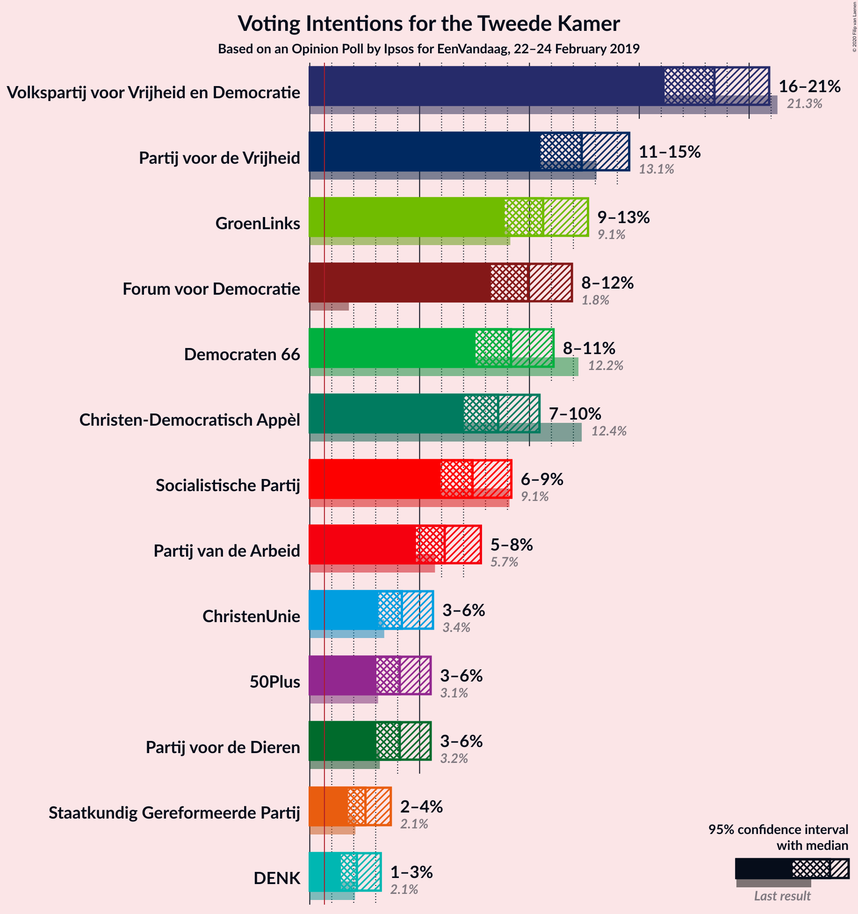

### Confidence Intervals

| Party | Last Result | Poll Result | 80% Confidence Interval | 90% Confidence Interval | 95% Confidence Interval | 99% Confidence Interval |
|:-----:|:-----------:|:-----------:|:-----------------------:|:-----------------------:|:-----------------------:|:-----------------------:|
| Volkspartij voor Vrijheid en Democratie | 21.3% | 18.4% | 16.9–20.1% |16.5–20.5% |16.2–20.9% |15.5–21.7% |
| Partij voor de Vrijheid | 13.1% | 12.4% | 11.1–13.8% |10.8–14.2% |10.5–14.5% |9.9–15.2% |
| GroenLinks | 9.1% | 10.6% | 9.5–12.0% |9.1–12.3% |8.9–12.7% |8.4–13.3% |
| Forum voor Democratie | 1.8% | 9.9% | 8.8–11.2% |8.5–11.6% |8.2–11.9% |7.7–12.6% |
| Democraten 66 | 12.2% | 9.2% | 8.1–10.4% |7.8–10.8% |7.5–11.1% |7.1–11.7% |
| Christen-Democratisch Appèl | 12.4% | 8.6% | 7.5–9.8% |7.3–10.2% |7.0–10.5% |6.5–11.1% |
| Socialistische Partij | 9.1% | 7.4% | 6.4–8.6% |6.2–8.9% |6.0–9.2% |5.5–9.8% |
| Partij van de Arbeid | 5.7% | 6.1% | 5.3–7.2% |5.0–7.5% |4.8–7.8% |4.4–8.3% |
| ChristenUnie | 3.4% | 4.2% | 3.5–5.1% |3.3–5.4% |3.1–5.6% |2.8–6.1% |
| Partij voor de Dieren | 3.2% | 4.1% | 3.4–5.0% |3.2–5.3% |3.0–5.5% |2.7–6.0% |
| 50Plus | 3.1% | 4.1% | 3.4–5.0% |3.2–5.3% |3.0–5.5% |2.7–6.0% |
| Staatkundig Gereformeerde Partij | 2.1% | 2.5% | 2.0–3.3% |1.9–3.5% |1.7–3.7% |1.5–4.1% |
| DENK | 2.1% | 2.1% | 1.7–2.9% |1.5–3.0% |1.4–3.2% |1.2–3.6% |

*Note:* The poll result column reflects the actual value used in the calculations. Published results may vary slightly, and in addition be rounded to fewer digits.

## Seats

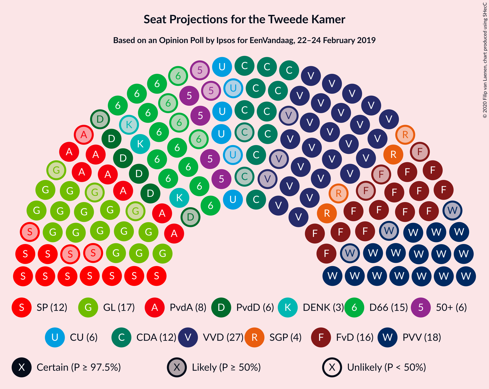

### Confidence Intervals

| Party | Last Result | Median | 80% Confidence Interval | 90% Confidence Interval | 95% Confidence Interval | 99% Confidence Interval |
|:-----:|:-----------:|:------:|:-----------------------:|:-----------------------:|:-----------------------:|:-----------------------:|
| <a href="#volkspartij-voor-vrijheid-en-democratie">Volkspartij voor Vrijheid en Democratie</a> | 33 | 27 | 24–30 |24–31 |24–32 |23–33 |
| <a href="#partij-voor-de-vrijheid">Partij voor de Vrijheid</a> | 20 | 18 | 16–20 |15–21 |15–21 |15–23 |
| <a href="#groenlinks">GroenLinks</a> | 14 | 17 | 15–19 |14–19 |14–19 |13–20 |
| <a href="#forum-voor-democratie">Forum voor Democratie</a> | 2 | 16 | 13–16 |13–17 |13–17 |12–19 |
| <a href="#democraten-66">Democraten 66</a> | 19 | 15 | 12–15 |12–17 |11–17 |11–17 |
| <a href="#christen-democratisch-appèl">Christen-Democratisch Appèl</a> | 19 | 12 | 12–14 |10–14 |10–15 |10–17 |
| <a href="#socialistische-partij">Socialistische Partij</a> | 14 | 12 | 10–13 |9–13 |9–13 |9–14 |
| <a href="#partij-van-de-arbeid">Partij van de Arbeid</a> | 9 | 10 | 8–11 |7–11 |7–12 |7–12 |
| <a href="#christenunie">ChristenUnie</a> | 5 | 6 | 5–7 |4–8 |4–8 |4–9 |
| <a href="#partij-voor-de-dieren">Partij voor de Dieren</a> | 5 | 6 | 5–7 |4–7 |4–7 |4–9 |
| <a href="#50plus">50Plus</a> | 4 | 6 | 5–7 |4–7 |4–8 |4–9 |
| <a href="#staatkundig-gereformeerde-partij">Staatkundig Gereformeerde Partij</a> | 3 | 4 | 2–5 |2–5 |2–5 |2–6 |
| <a href="#denk">DENK</a> | 3 | 3 | 2–4 |2–4 |2–4 |1–5 |

### Volkspartij voor Vrijheid en Democratie

*For a full overview of the results for this party, see the [Volkspartij voor Vrijheid en Democratie](party-volkspartijvoorvrijheidendemocratie.html) page.*

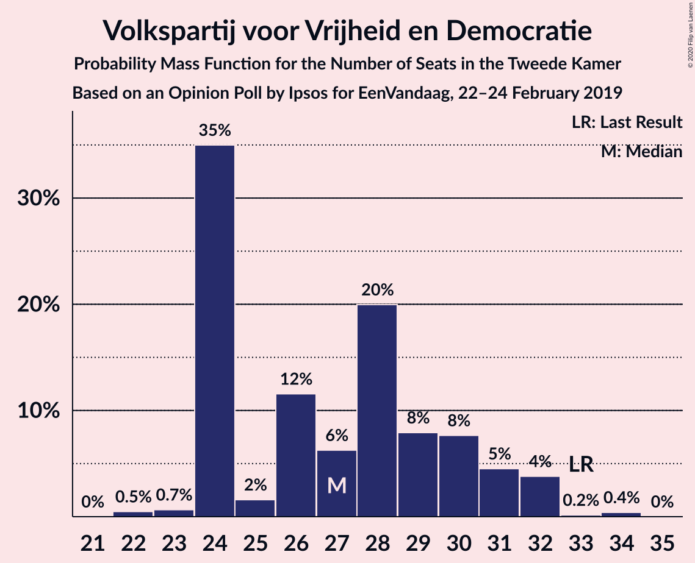

| Number of Seats | Probability | Accumulated | Special Marks |
|:---------------:|:-----------:|:-----------:|:-------------:|
| 22 | 0.5% | 100% |  |
| 23 | 0.7% | 99.5% |  |
| 24 | 35% | 98.9% |  |
| 25 | 2% | 64% |  |
| 26 | 12% | 62% |  |
| 27 | 6% | 51% | Median |
| 28 | 20% | 44% |  |
| 29 | 8% | 24% |  |
| 30 | 8% | 17% |  |
| 31 | 5% | 9% |  |
| 32 | 4% | 4% |  |
| 33 | 0.2% | 0.6% | Last Result |
| 34 | 0.4% | 0.4% |  |
| 35 | 0% | 0% |  |

### Partij voor de Vrijheid

*For a full overview of the results for this party, see the [Partij voor de Vrijheid](party-partijvoordevrijheid.html) page.*

| Number of Seats | Probability | Accumulated | Special Marks |
|:---------------:|:-----------:|:-----------:|:-------------:|
| 14 | 0.1% | 100% |  |
| 15 | 7% | 99.9% |  |
| 16 | 8% | 93% |  |
| 17 | 3% | 85% |  |
| 18 | 49% | 81% | Median |
| 19 | 6% | 32% |  |
| 20 | 19% | 26% | Last Result |
| 21 | 7% | 7% |  |
| 22 | 0.3% | 0.9% |  |
| 23 | 0.5% | 0.6% |  |
| 24 | 0.1% | 0.1% |  |
| 25 | 0% | 0% |  |

### GroenLinks

*For a full overview of the results for this party, see the [GroenLinks](party-groenlinks.html) page.*

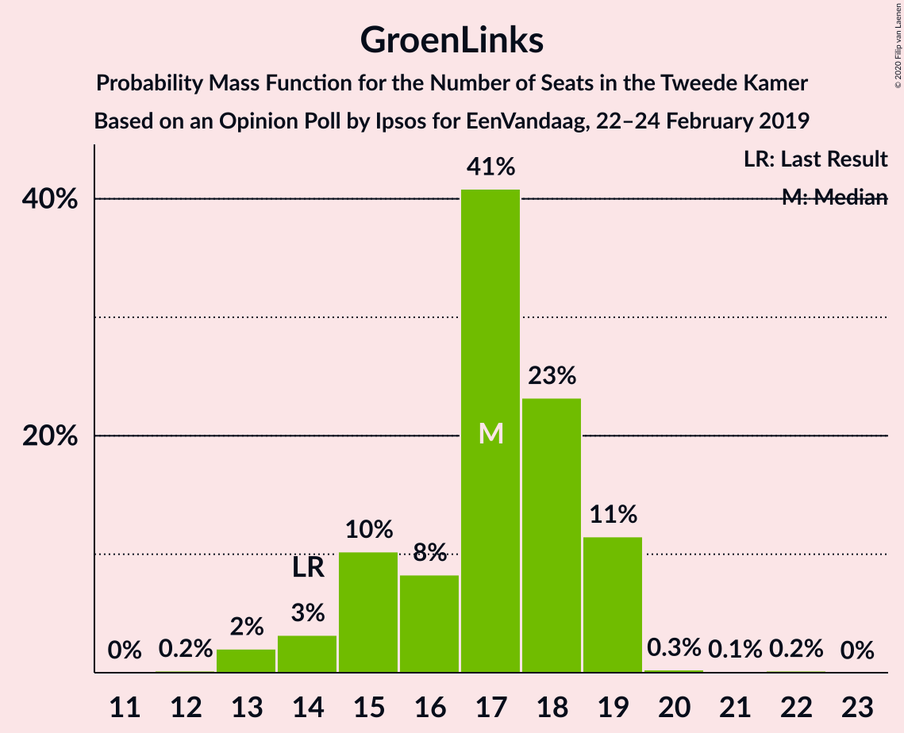

| Number of Seats | Probability | Accumulated | Special Marks |
|:---------------:|:-----------:|:-----------:|:-------------:|
| 12 | 0.2% | 100% |  |
| 13 | 2% | 99.8% |  |
| 14 | 3% | 98% | Last Result |
| 15 | 10% | 95% |  |
| 16 | 8% | 84% |  |
| 17 | 41% | 76% | Median |
| 18 | 23% | 35% |  |
| 19 | 11% | 12% |  |
| 20 | 0.3% | 0.6% |  |
| 21 | 0.1% | 0.3% |  |
| 22 | 0.2% | 0.2% |  |
| 23 | 0% | 0% |  |

### Forum voor Democratie

*For a full overview of the results for this party, see the [Forum voor Democratie](party-forumvoordemocratie.html) page.*

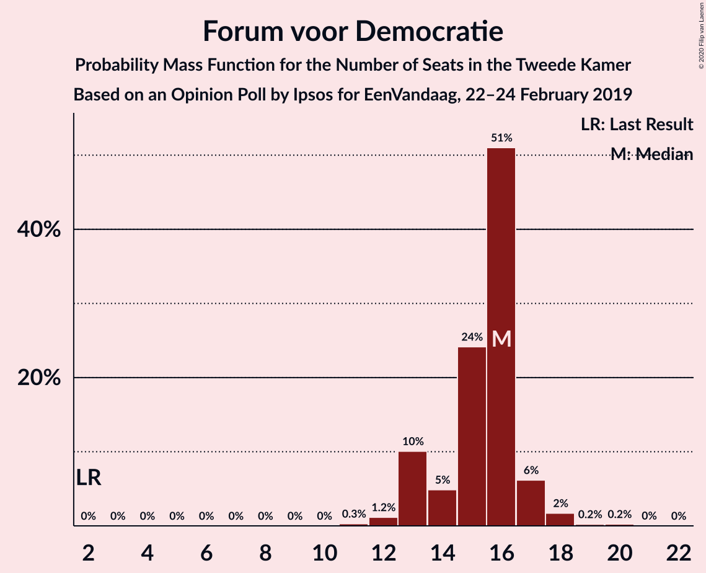

| Number of Seats | Probability | Accumulated | Special Marks |
|:---------------:|:-----------:|:-----------:|:-------------:|
| 2 | 0% | 100% | Last Result |
| 3 | 0% | 100% |  |
| 4 | 0% | 100% |  |
| 5 | 0% | 100% |  |
| 6 | 0% | 100% |  |
| 7 | 0% | 100% |  |
| 8 | 0% | 100% |  |
| 9 | 0% | 100% |  |
| 10 | 0% | 100% |  |
| 11 | 0.3% | 100% |  |
| 12 | 1.2% | 99.7% |  |
| 13 | 10% | 98.5% |  |
| 14 | 5% | 88% |  |
| 15 | 24% | 84% |  |
| 16 | 51% | 59% | Median |
| 17 | 6% | 8% |  |
| 18 | 2% | 2% |  |
| 19 | 0.2% | 0.5% |  |
| 20 | 0.2% | 0.3% |  |
| 21 | 0% | 0% |  |

### Democraten 66

*For a full overview of the results for this party, see the [Democraten 66](party-democraten66.html) page.*

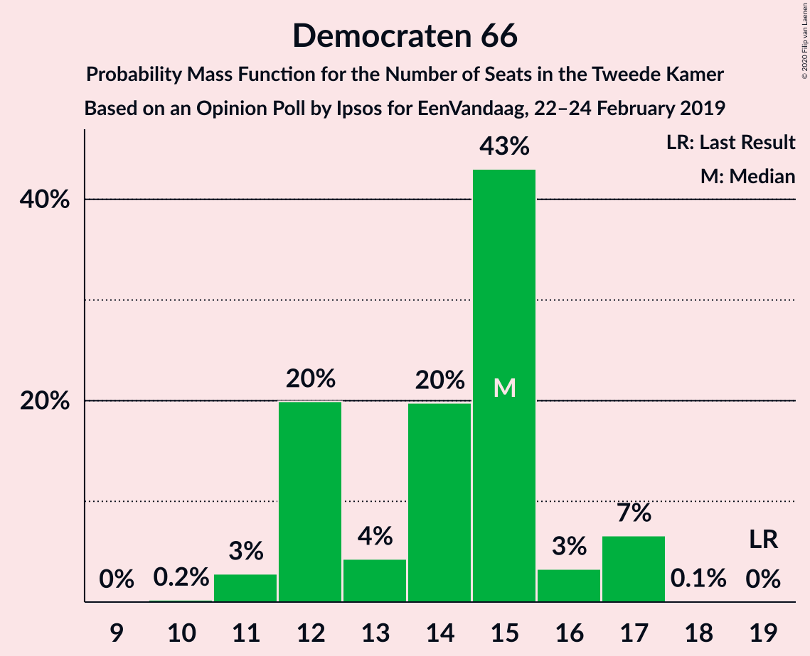

| Number of Seats | Probability | Accumulated | Special Marks |
|:---------------:|:-----------:|:-----------:|:-------------:|
| 10 | 0.2% | 100% |  |
| 11 | 3% | 99.8% |  |
| 12 | 20% | 97% |  |
| 13 | 4% | 77% |  |
| 14 | 20% | 73% |  |
| 15 | 43% | 53% | Median |
| 16 | 3% | 10% |  |
| 17 | 7% | 7% |  |
| 18 | 0.1% | 0.1% |  |
| 19 | 0% | 0% | Last Result |

### Christen-Democratisch Appèl

*For a full overview of the results for this party, see the [Christen-Democratisch Appèl](party-christen-democratischappèl.html) page.*

| Number of Seats | Probability | Accumulated | Special Marks |
|:---------------:|:-----------:|:-----------:|:-------------:|
| 9 | 0.1% | 100% |  |
| 10 | 6% | 99.9% |  |
| 11 | 2% | 94% |  |
| 12 | 51% | 92% | Median |
| 13 | 19% | 40% |  |
| 14 | 18% | 21% |  |
| 15 | 2% | 4% |  |
| 16 | 0.5% | 2% |  |
| 17 | 1.0% | 1.1% |  |
| 18 | 0% | 0% |  |
| 19 | 0% | 0% | Last Result |

### Socialistische Partij

*For a full overview of the results for this party, see the [Socialistische Partij](party-socialistischepartij.html) page.*

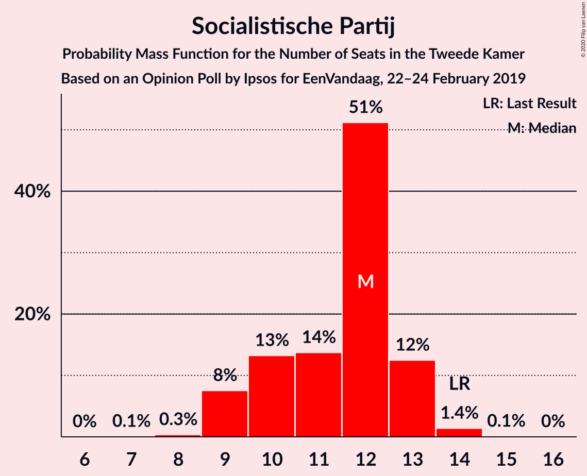

| Number of Seats | Probability | Accumulated | Special Marks |
|:---------------:|:-----------:|:-----------:|:-------------:|
| 7 | 0.1% | 100% |  |
| 8 | 0.3% | 99.9% |  |
| 9 | 8% | 99.6% |  |
| 10 | 13% | 92% |  |
| 11 | 14% | 79% |  |
| 12 | 51% | 65% | Median |
| 13 | 12% | 14% |  |
| 14 | 1.4% | 1.5% | Last Result |
| 15 | 0.1% | 0.1% |  |
| 16 | 0% | 0% |  |

### Partij van de Arbeid

*For a full overview of the results for this party, see the [Partij van de Arbeid](party-partijvandearbeid.html) page.*

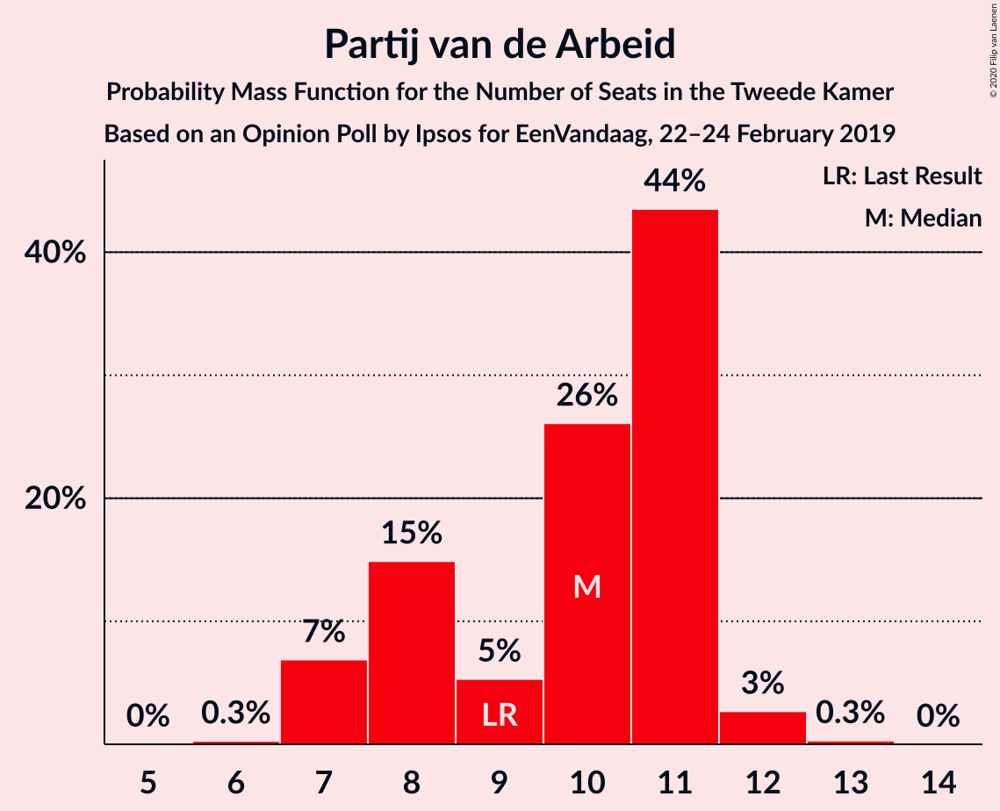

| Number of Seats | Probability | Accumulated | Special Marks |
|:---------------:|:-----------:|:-----------:|:-------------:|
| 6 | 0.3% | 100% |  |
| 7 | 7% | 99.7% |  |
| 8 | 15% | 93% |  |
| 9 | 5% | 78% | Last Result |
| 10 | 26% | 73% | Median |
| 11 | 44% | 47% |  |
| 12 | 3% | 3% |  |
| 13 | 0.3% | 0.3% |  |
| 14 | 0% | 0% |  |

### ChristenUnie

*For a full overview of the results for this party, see the [ChristenUnie](party-christenunie.html) page.*

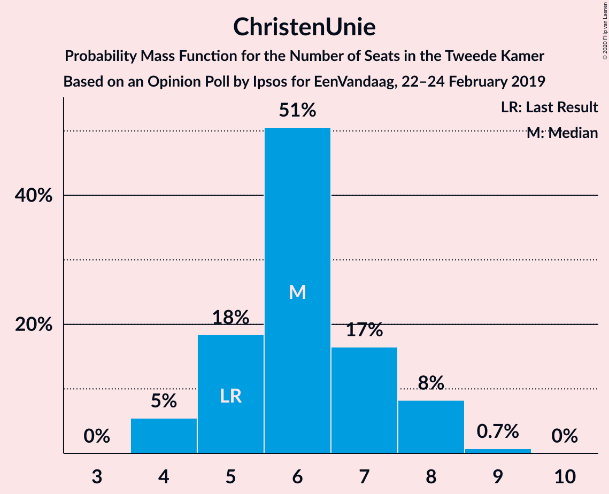

| Number of Seats | Probability | Accumulated | Special Marks |
|:---------------:|:-----------:|:-----------:|:-------------:|
| 4 | 5% | 100% |  |
| 5 | 18% | 95% | Last Result |
| 6 | 51% | 76% | Median |
| 7 | 17% | 26% |  |
| 8 | 8% | 9% |  |
| 9 | 0.7% | 0.8% |  |
| 10 | 0% | 0% |  |

### Partij voor de Dieren

*For a full overview of the results for this party, see the [Partij voor de Dieren](party-partijvoordedieren.html) page.*

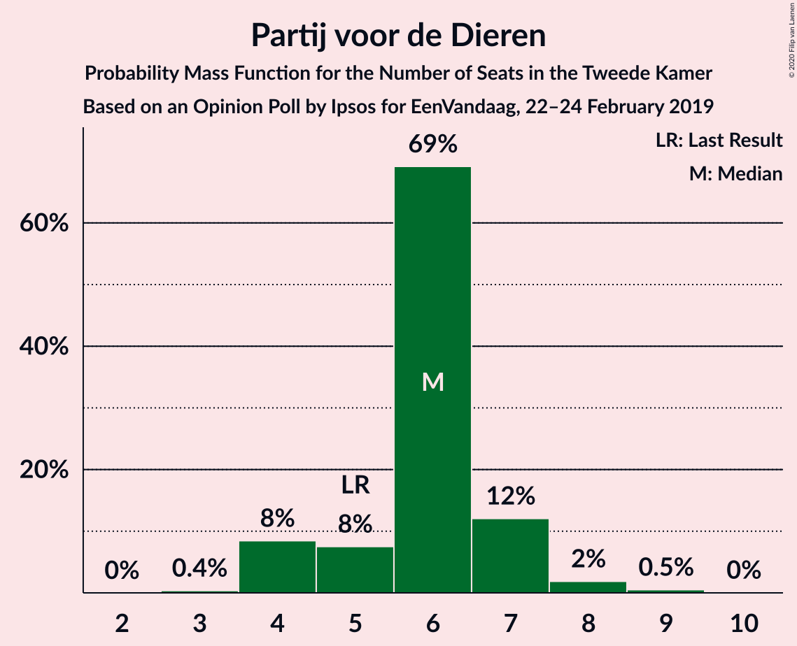

| Number of Seats | Probability | Accumulated | Special Marks |
|:---------------:|:-----------:|:-----------:|:-------------:|
| 3 | 0.4% | 100% |  |
| 4 | 8% | 99.6% |  |
| 5 | 8% | 91% | Last Result |
| 6 | 69% | 84% | Median |
| 7 | 12% | 14% |  |
| 8 | 2% | 2% |  |
| 9 | 0.5% | 0.6% |  |
| 10 | 0% | 0% |  |

### 50Plus

*For a full overview of the results for this party, see the [50Plus](party-50plus.html) page.*

| Number of Seats | Probability | Accumulated | Special Marks |
|:---------------:|:-----------:|:-----------:|:-------------:|
| 3 | 0.2% | 100% |  |
| 4 | 7% | 99.8% | Last Result |
| 5 | 27% | 93% |  |
| 6 | 55% | 66% | Median |
| 7 | 8% | 11% |  |
| 8 | 0.9% | 3% |  |
| 9 | 2% | 2% |  |
| 10 | 0.1% | 0.1% |  |
| 11 | 0% | 0% |  |

### Staatkundig Gereformeerde Partij

*For a full overview of the results for this party, see the [Staatkundig Gereformeerde Partij](party-staatkundiggereformeerdepartij.html) page.*

| Number of Seats | Probability | Accumulated | Special Marks |
|:---------------:|:-----------:|:-----------:|:-------------:|
| 2 | 19% | 100% |  |
| 3 | 16% | 81% | Last Result |
| 4 | 48% | 65% | Median |
| 5 | 15% | 16% |  |
| 6 | 1.1% | 1.1% |  |
| 7 | 0% | 0% |  |

### DENK

*For a full overview of the results for this party, see the [DENK](party-denk.html) page.*

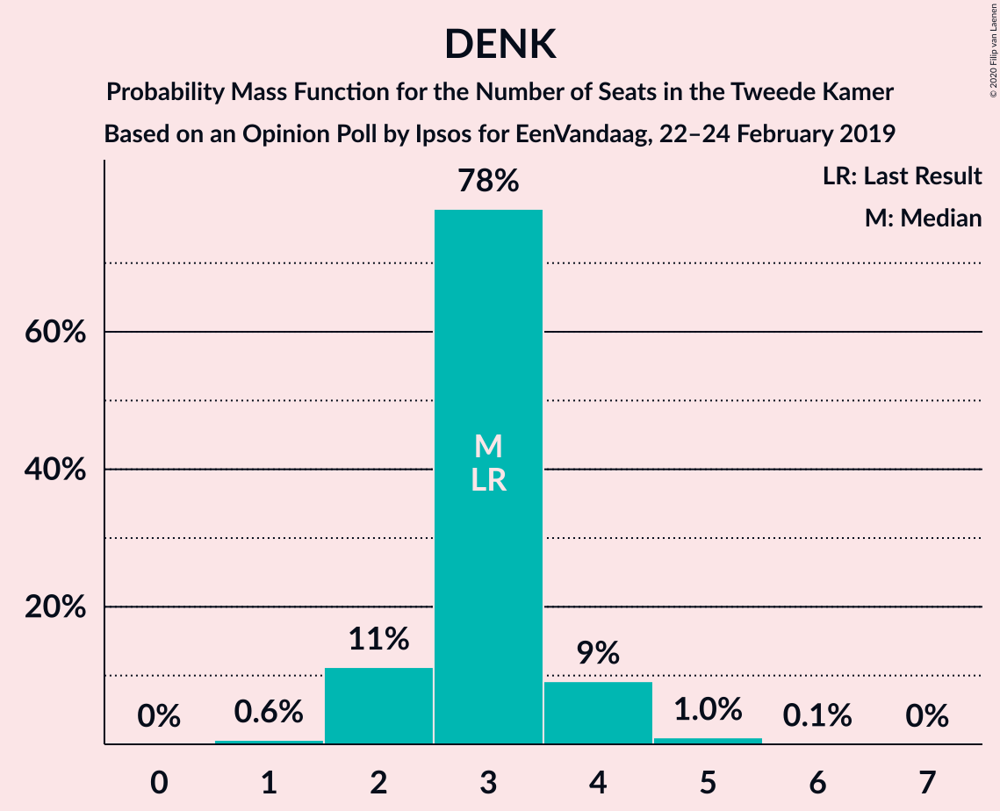

| Number of Seats | Probability | Accumulated | Special Marks |
|:---------------:|:-----------:|:-----------:|:-------------:|
| 1 | 0.6% | 100% |  |
| 2 | 11% | 99.4% |  |
| 3 | 78% | 88% | Last Result, Median |
| 4 | 9% | 10% |  |
| 5 | 1.0% | 1.1% |  |
| 6 | 0.1% | 0.1% |  |
| 7 | 0% | 0% |  |

## Coalitions

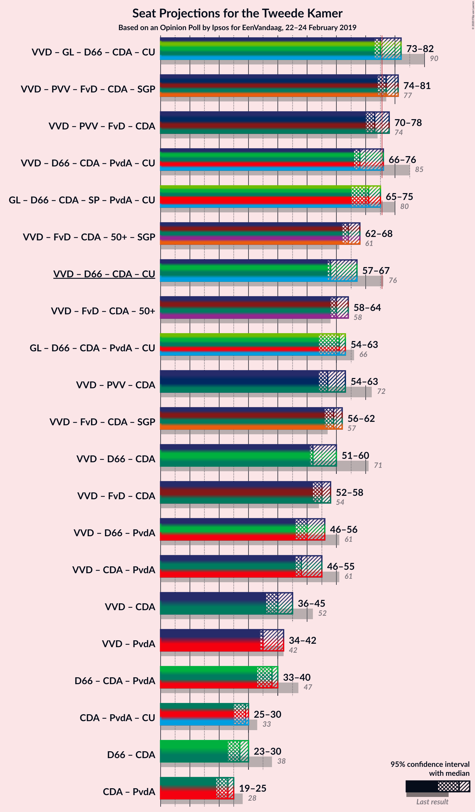

### Confidence Intervals

| Coalition | Last Result | Median | Majority? | 80% Confidence Interval | 90% Confidence Interval | 95% Confidence Interval | 99% Confidence Interval |
|:---------:|:-----------:|:------:|:---------:|:-----------------------:|:-----------------------:|:-----------------------:|:-----------------------:|
| Volkspartij voor Vrijheid en Democratie – GroenLinks – Democraten 66 – Christen-Democratisch Appèl – ChristenUnie | 90 | 75 | 44% | 74–81 | 74–82 | 73–82 | 71–83 |
| Volkspartij voor Vrijheid en Democratie – Partij voor de Vrijheid – Forum voor Democratie – Christen-Democratisch Appèl – Staatkundig Gereformeerde Partij | 77 | 77 | 51% | 74–80 | 74–81 | 74–81 | 73–84 |
| Volkspartij voor Vrijheid en Democratie – Partij voor de Vrijheid – Forum voor Democratie – Christen-Democratisch Appèl | 74 | 73 | 24% | 70–78 | 70–78 | 70–78 | 69–81 |
| Volkspartij voor Vrijheid en Democratie – Democraten 66 – Christen-Democratisch Appèl – Partij van de Arbeid – ChristenUnie | 85 | 68 | 4% | 67–75 | 66–75 | 66–76 | 65–76 |
| GroenLinks – Democraten 66 – Christen-Democratisch Appèl – Socialistische Partij – Partij van de Arbeid – ChristenUnie | 80 | 71 | 0% | 67–74 | 66–75 | 65–75 | 62–75 |
| Volkspartij voor Vrijheid en Democratie – Forum voor Democratie – Christen-Democratisch Appèl – 50Plus – Staatkundig Gereformeerde Partij | 61 | 64 | 0% | 62–67 | 62–68 | 62–68 | 60–70 |
| Volkspartij voor Vrijheid en Democratie – Democraten 66 – Christen-Democratisch Appèl – ChristenUnie | 76 | 58 | 0% | 57–65 | 57–67 | 57–67 | 57–67 |
| Volkspartij voor Vrijheid en Democratie – Forum voor Democratie – Christen-Democratisch Appèl – 50Plus | 58 | 60 | 0% | 58–64 | 58–64 | 58–64 | 57–67 |
| GroenLinks – Democraten 66 – Christen-Democratisch Appèl – Partij van de Arbeid – ChristenUnie | 66 | 61 | 0% | 57–62 | 56–63 | 54–63 | 52–64 |
| Volkspartij voor Vrijheid en Democratie – Partij voor de Vrijheid – Christen-Democratisch Appèl | 72 | 57 | 0% | 54–62 | 54–63 | 54–63 | 54–66 |
| Volkspartij voor Vrijheid en Democratie – Forum voor Democratie – Christen-Democratisch Appèl – Staatkundig Gereformeerde Partij | 57 | 59 | 0% | 56–61 | 56–62 | 56–62 | 54–64 |
| Volkspartij voor Vrijheid en Democratie – Democraten 66 – Christen-Democratisch Appèl | 71 | 52 | 0% | 51–59 | 51–60 | 51–60 | 50–60 |
| Volkspartij voor Vrijheid en Democratie – Forum voor Democratie – Christen-Democratisch Appèl | 54 | 55 | 0% | 52–58 | 52–58 | 52–58 | 50–61 |
| Volkspartij voor Vrijheid en Democratie – Democraten 66 – Partij van de Arbeid | 61 | 50 | 0% | 48–55 | 47–56 | 46–56 | 45–57 |
| Volkspartij voor Vrijheid en Democratie – Christen-Democratisch Appèl – Partij van de Arbeid | 61 | 48 | 0% | 47–53 | 47–54 | 46–55 | 44–55 |
| Volkspartij voor Vrijheid en Democratie – Christen-Democratisch Appèl | 52 | 40 | 0% | 36–43 | 36–45 | 36–45 | 35–46 |
| Volkspartij voor Vrijheid en Democratie – Partij van de Arbeid | 42 | 35 | 0% | 34–40 | 34–42 | 34–42 | 31–42 |
| Democraten 66 – Christen-Democratisch Appèl – Partij van de Arbeid | 47 | 38 | 0% | 34–38 | 33–39 | 33–40 | 31–41 |
| Christen-Democratisch Appèl – Partij van de Arbeid – ChristenUnie | 33 | 29 | 0% | 27–30 | 27–30 | 25–30 | 23–32 |
| Democraten 66 – Christen-Democratisch Appèl | 38 | 27 | 0% | 24–29 | 24–30 | 23–30 | 22–31 |
| Christen-Democratisch Appèl – Partij van de Arbeid | 28 | 23 | 0% | 21–24 | 20–24 | 19–25 | 18–26 |

### Volkspartij voor Vrijheid en Democratie – GroenLinks – Democraten 66 – Christen-Democratisch Appèl – ChristenUnie

| Number of Seats | Probability | Accumulated | Special Marks |
|:---------------:|:-----------:|:-----------:|:-------------:|
| 70 | 0.1% | 100% |  |
| 71 | 1.4% | 99.9% |  |
| 72 | 0.2% | 98% |  |
| 73 | 0.8% | 98% |  |
| 74 | 37% | 97% |  |
| 75 | 16% | 60% |  |
| 76 | 2% | 44% | Majority |
| 77 | 10% | 42% | Median |
| 78 | 5% | 31% |  |
| 79 | 0.8% | 26% |  |
| 80 | 6% | 26% |  |
| 81 | 12% | 20% |  |
| 82 | 6% | 8% |  |
| 83 | 0.9% | 1.2% |  |
| 84 | 0.3% | 0.4% |  |
| 85 | 0% | 0.1% |  |
| 86 | 0.1% | 0.1% |  |
| 87 | 0% | 0% |  |
| 88 | 0% | 0% |  |
| 89 | 0% | 0% |  |
| 90 | 0% | 0% | Last Result |

### Volkspartij voor Vrijheid en Democratie – Partij voor de Vrijheid – Forum voor Democratie – Christen-Democratisch Appèl – Staatkundig Gereformeerde Partij

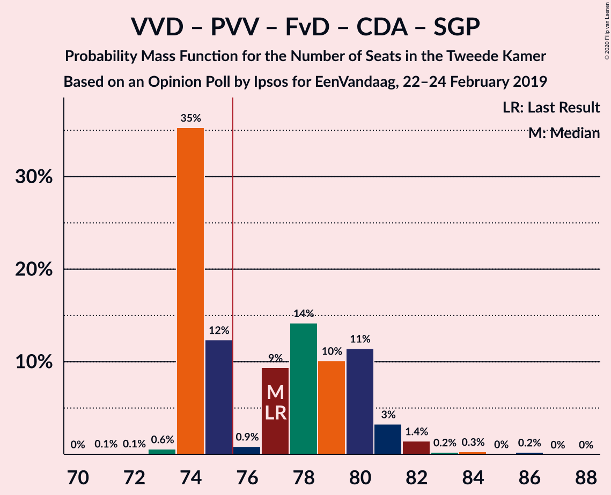

| Number of Seats | Probability | Accumulated | Special Marks |
|:---------------:|:-----------:|:-----------:|:-------------:|
| 71 | 0.1% | 100% |  |
| 72 | 0.1% | 99.9% |  |
| 73 | 0.6% | 99.7% |  |
| 74 | 35% | 99.2% |  |
| 75 | 12% | 64% |  |
| 76 | 0.9% | 51% | Majority |
| 77 | 9% | 51% | Last Result, Median |
| 78 | 14% | 41% |  |
| 79 | 10% | 27% |  |
| 80 | 11% | 17% |  |
| 81 | 3% | 5% |  |
| 82 | 1.4% | 2% |  |
| 83 | 0.2% | 0.8% |  |
| 84 | 0.3% | 0.6% |  |
| 85 | 0% | 0.3% |  |
| 86 | 0.2% | 0.2% |  |
| 87 | 0% | 0% |  |

### Volkspartij voor Vrijheid en Democratie – Partij voor de Vrijheid – Forum voor Democratie – Christen-Democratisch Appèl

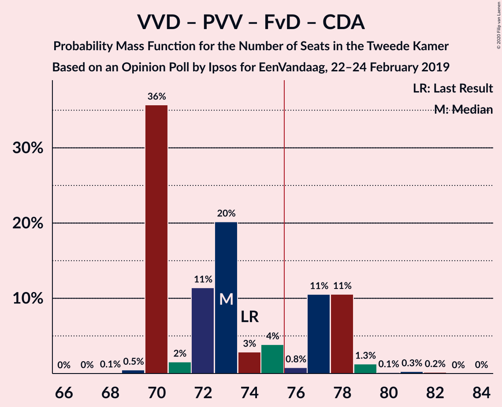

| Number of Seats | Probability | Accumulated | Special Marks |
|:---------------:|:-----------:|:-----------:|:-------------:|
| 68 | 0.1% | 100% |  |
| 69 | 0.5% | 99.8% |  |
| 70 | 36% | 99.4% |  |
| 71 | 2% | 64% |  |
| 72 | 11% | 62% |  |
| 73 | 20% | 51% | Median |
| 74 | 3% | 31% | Last Result |
| 75 | 4% | 28% |  |
| 76 | 0.8% | 24% | Majority |
| 77 | 11% | 23% |  |
| 78 | 11% | 12% |  |
| 79 | 1.3% | 2% |  |
| 80 | 0.1% | 0.6% |  |
| 81 | 0.3% | 0.5% |  |
| 82 | 0.2% | 0.2% |  |
| 83 | 0% | 0.1% |  |
| 84 | 0% | 0% |  |

### Volkspartij voor Vrijheid en Democratie – Democraten 66 – Christen-Democratisch Appèl – Partij van de Arbeid – ChristenUnie

| Number of Seats | Probability | Accumulated | Special Marks |
|:---------------:|:-----------:|:-----------:|:-------------:|
| 62 | 0.1% | 100% |  |
| 63 | 0.1% | 99.9% |  |
| 64 | 0.1% | 99.8% |  |
| 65 | 0.4% | 99.7% |  |
| 66 | 5% | 99.3% |  |
| 67 | 13% | 94% |  |
| 68 | 43% | 81% |  |
| 69 | 1.0% | 38% |  |
| 70 | 11% | 37% | Median |
| 71 | 2% | 26% |  |
| 72 | 3% | 24% |  |
| 73 | 11% | 22% |  |
| 74 | 0.4% | 11% |  |
| 75 | 6% | 10% |  |
| 76 | 4% | 4% | Majority |
| 77 | 0.2% | 0.2% |  |
| 78 | 0% | 0% |  |
| 79 | 0% | 0% |  |
| 80 | 0% | 0% |  |
| 81 | 0% | 0% |  |
| 82 | 0% | 0% |  |
| 83 | 0% | 0% |  |
| 84 | 0% | 0% |  |
| 85 | 0% | 0% | Last Result |

### GroenLinks – Democraten 66 – Christen-Democratisch Appèl – Socialistische Partij – Partij van de Arbeid – ChristenUnie

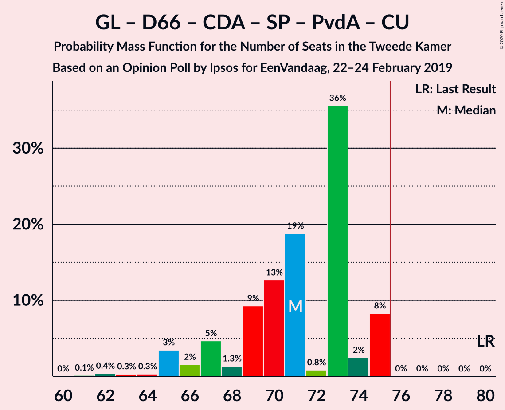

| Number of Seats | Probability | Accumulated | Special Marks |
|:---------------:|:-----------:|:-----------:|:-------------:|
| 61 | 0.1% | 100% |  |
| 62 | 0.4% | 99.9% |  |
| 63 | 0.3% | 99.5% |  |
| 64 | 0.3% | 99.2% |  |
| 65 | 3% | 98.9% |  |
| 66 | 2% | 95% |  |
| 67 | 5% | 94% |  |
| 68 | 1.3% | 89% |  |
| 69 | 9% | 88% |  |
| 70 | 13% | 79% |  |
| 71 | 19% | 66% |  |
| 72 | 0.8% | 47% | Median |
| 73 | 36% | 46% |  |
| 74 | 2% | 11% |  |
| 75 | 8% | 8% |  |
| 76 | 0% | 0% | Majority |
| 77 | 0% | 0% |  |
| 78 | 0% | 0% |  |
| 79 | 0% | 0% |  |
| 80 | 0% | 0% | Last Result |

### Volkspartij voor Vrijheid en Democratie – Forum voor Democratie – Christen-Democratisch Appèl – 50Plus – Staatkundig Gereformeerde Partij

| Number of Seats | Probability | Accumulated | Special Marks |
|:---------------:|:-----------:|:-----------:|:-------------:|
| 58 | 0% | 100% |  |
| 59 | 0.2% | 99.9% |  |
| 60 | 0.3% | 99.8% |  |
| 61 | 0.3% | 99.5% | Last Result |
| 62 | 35% | 99.2% |  |
| 63 | 10% | 64% |  |
| 64 | 12% | 54% |  |
| 65 | 12% | 42% | Median |
| 66 | 18% | 30% |  |
| 67 | 6% | 11% |  |
| 68 | 4% | 6% |  |
| 69 | 0.7% | 2% |  |
| 70 | 1.0% | 1.4% |  |
| 71 | 0.1% | 0.4% |  |
| 72 | 0.3% | 0.3% |  |
| 73 | 0% | 0% |  |

### Volkspartij voor Vrijheid en Democratie – Democraten 66 – Christen-Democratisch Appèl – ChristenUnie

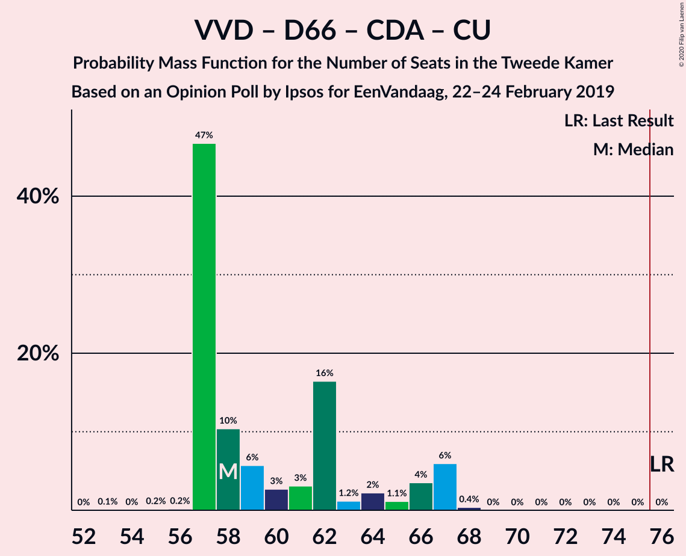

| Number of Seats | Probability | Accumulated | Special Marks |
|:---------------:|:-----------:|:-----------:|:-------------:|
| 53 | 0.1% | 100% |  |
| 54 | 0% | 99.9% |  |
| 55 | 0.2% | 99.9% |  |
| 56 | 0.2% | 99.7% |  |
| 57 | 47% | 99.5% |  |
| 58 | 10% | 53% |  |
| 59 | 6% | 42% |  |
| 60 | 3% | 37% | Median |
| 61 | 3% | 34% |  |
| 62 | 16% | 31% |  |
| 63 | 1.2% | 14% |  |
| 64 | 2% | 13% |  |
| 65 | 1.1% | 11% |  |
| 66 | 4% | 10% |  |
| 67 | 6% | 6% |  |
| 68 | 0.4% | 0.4% |  |
| 69 | 0% | 0% |  |
| 70 | 0% | 0% |  |
| 71 | 0% | 0% |  |
| 72 | 0% | 0% |  |
| 73 | 0% | 0% |  |
| 74 | 0% | 0% |  |
| 75 | 0% | 0% |  |
| 76 | 0% | 0% | Last Result, Majority |

### Volkspartij voor Vrijheid en Democratie – Forum voor Democratie – Christen-Democratisch Appèl – 50Plus

| Number of Seats | Probability | Accumulated | Special Marks |
|:---------------:|:-----------:|:-----------:|:-------------:|
| 55 | 0.1% | 100% |  |
| 56 | 0.2% | 99.8% |  |
| 57 | 0.2% | 99.6% |  |
| 58 | 36% | 99.4% | Last Result |
| 59 | 5% | 63% |  |
| 60 | 12% | 58% |  |
| 61 | 14% | 46% | Median |
| 62 | 5% | 32% |  |
| 63 | 10% | 27% |  |
| 64 | 15% | 17% |  |
| 65 | 0.4% | 1.4% |  |
| 66 | 0.3% | 1.0% |  |
| 67 | 0.3% | 0.7% |  |
| 68 | 0.2% | 0.3% |  |
| 69 | 0% | 0.1% |  |
| 70 | 0% | 0.1% |  |
| 71 | 0% | 0% |  |

### GroenLinks – Democraten 66 – Christen-Democratisch Appèl – Partij van de Arbeid – ChristenUnie

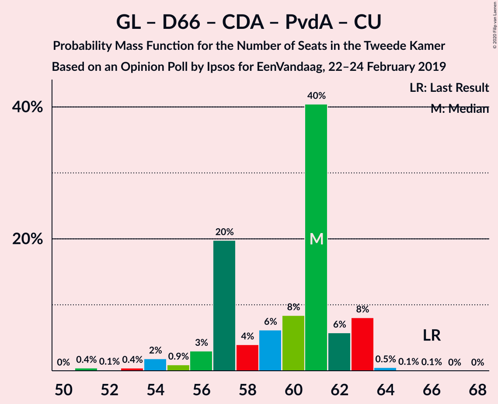

| Number of Seats | Probability | Accumulated | Special Marks |
|:---------------:|:-----------:|:-----------:|:-------------:|
| 51 | 0.4% | 100% |  |
| 52 | 0.1% | 99.6% |  |
| 53 | 0.4% | 99.4% |  |
| 54 | 2% | 99.0% |  |
| 55 | 0.9% | 97% |  |
| 56 | 3% | 96% |  |
| 57 | 20% | 93% |  |
| 58 | 4% | 73% |  |
| 59 | 6% | 70% |  |
| 60 | 8% | 63% | Median |
| 61 | 40% | 55% |  |
| 62 | 6% | 14% |  |
| 63 | 8% | 9% |  |
| 64 | 0.5% | 0.7% |  |
| 65 | 0.1% | 0.2% |  |
| 66 | 0.1% | 0.1% | Last Result |
| 67 | 0% | 0% |  |

### Volkspartij voor Vrijheid en Democratie – Partij voor de Vrijheid – Christen-Democratisch Appèl

| Number of Seats | Probability | Accumulated | Special Marks |
|:---------------:|:-----------:|:-----------:|:-------------:|
| 53 | 0% | 100% |  |
| 54 | 36% | 99.9% |  |
| 55 | 1.2% | 64% |  |
| 56 | 12% | 63% |  |
| 57 | 2% | 51% | Median |
| 58 | 12% | 50% |  |
| 59 | 1.2% | 38% |  |
| 60 | 17% | 37% |  |
| 61 | 2% | 20% |  |
| 62 | 9% | 18% |  |
| 63 | 6% | 9% |  |
| 64 | 0.9% | 2% |  |
| 65 | 0.2% | 1.4% |  |
| 66 | 1.0% | 1.2% |  |
| 67 | 0% | 0.2% |  |
| 68 | 0.2% | 0.2% |  |
| 69 | 0% | 0% |  |
| 70 | 0% | 0% |  |
| 71 | 0% | 0% |  |
| 72 | 0% | 0% | Last Result |

### Volkspartij voor Vrijheid en Democratie – Forum voor Democratie – Christen-Democratisch Appèl – Staatkundig Gereformeerde Partij

| Number of Seats | Probability | Accumulated | Special Marks |
|:---------------:|:-----------:|:-----------:|:-------------:|
| 52 | 0% | 100% |  |
| 53 | 0.2% | 99.9% |  |
| 54 | 0.2% | 99.7% |  |
| 55 | 0.7% | 99.5% |  |
| 56 | 36% | 98.8% |  |
| 57 | 4% | 63% | Last Result |
| 58 | 2% | 59% |  |
| 59 | 23% | 57% | Median |
| 60 | 23% | 34% |  |
| 61 | 3% | 11% |  |
| 62 | 5% | 8% |  |
| 63 | 1.0% | 2% |  |
| 64 | 1.0% | 1.4% |  |
| 65 | 0.1% | 0.3% |  |
| 66 | 0.1% | 0.3% |  |
| 67 | 0.2% | 0.2% |  |
| 68 | 0% | 0% |  |

### Volkspartij voor Vrijheid en Democratie – Democraten 66 – Christen-Democratisch Appèl

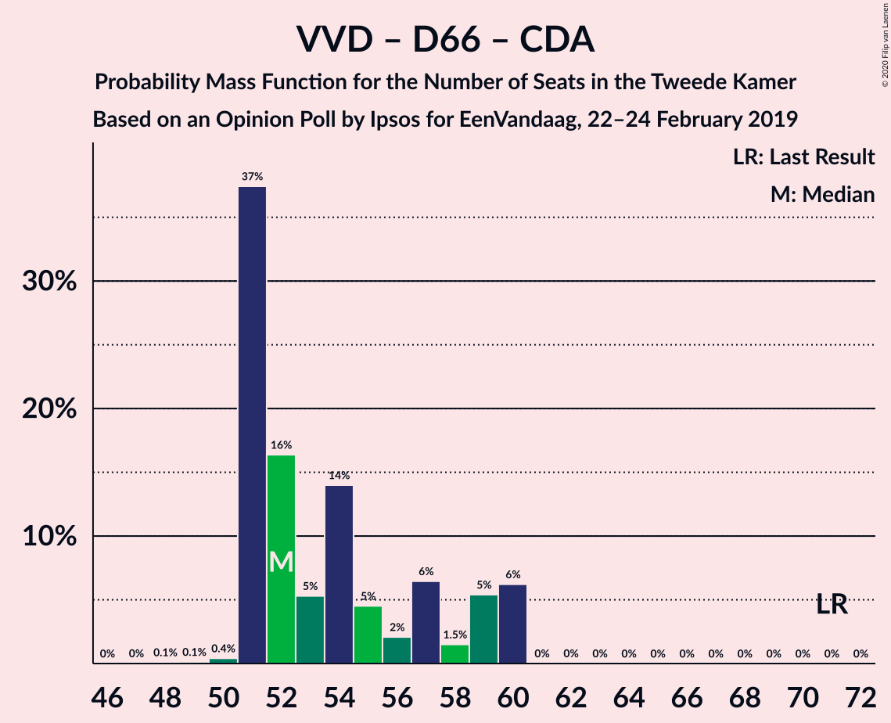

| Number of Seats | Probability | Accumulated | Special Marks |
|:---------------:|:-----------:|:-----------:|:-------------:|
| 48 | 0.1% | 100% |  |
| 49 | 0.1% | 99.9% |  |
| 50 | 0.4% | 99.7% |  |
| 51 | 37% | 99.3% |  |
| 52 | 16% | 62% |  |
| 53 | 5% | 46% |  |
| 54 | 14% | 40% | Median |
| 55 | 5% | 26% |  |
| 56 | 2% | 22% |  |
| 57 | 6% | 20% |  |
| 58 | 1.5% | 13% |  |
| 59 | 5% | 12% |  |
| 60 | 6% | 6% |  |
| 61 | 0% | 0% |  |
| 62 | 0% | 0% |  |
| 63 | 0% | 0% |  |
| 64 | 0% | 0% |  |
| 65 | 0% | 0% |  |
| 66 | 0% | 0% |  |
| 67 | 0% | 0% |  |
| 68 | 0% | 0% |  |
| 69 | 0% | 0% |  |
| 70 | 0% | 0% |  |
| 71 | 0% | 0% | Last Result |

### Volkspartij voor Vrijheid en Democratie – Forum voor Democratie – Christen-Democratisch Appèl

| Number of Seats | Probability | Accumulated | Special Marks |
|:---------------:|:-----------:|:-----------:|:-------------:|
| 49 | 0% | 100% |  |
| 50 | 0.5% | 99.9% |  |
| 51 | 1.4% | 99.5% |  |
| 52 | 35% | 98% |  |
| 53 | 4% | 63% |  |
| 54 | 0.9% | 59% | Last Result |
| 55 | 15% | 58% | Median |
| 56 | 11% | 43% |  |
| 57 | 18% | 32% |  |
| 58 | 13% | 15% |  |
| 59 | 0.4% | 2% |  |
| 60 | 0.5% | 1.1% |  |
| 61 | 0.4% | 0.6% |  |
| 62 | 0% | 0.3% |  |
| 63 | 0.2% | 0.2% |  |
| 64 | 0% | 0.1% |  |
| 65 | 0% | 0% |  |

### Volkspartij voor Vrijheid en Democratie – Democraten 66 – Partij van de Arbeid

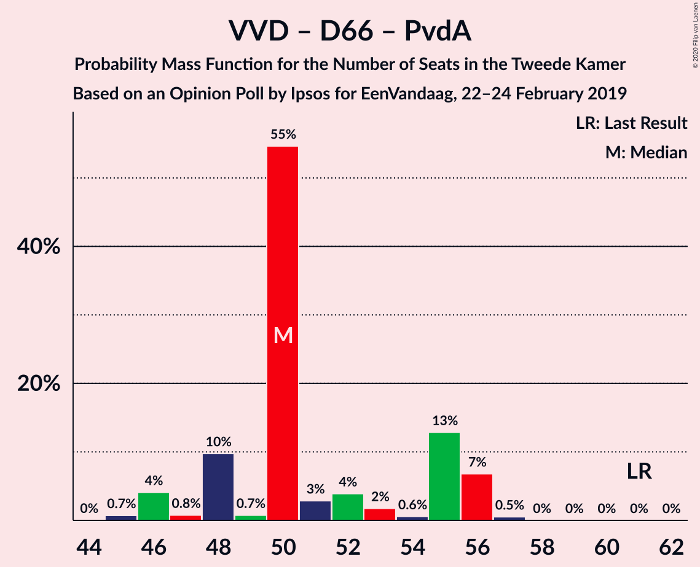

| Number of Seats | Probability | Accumulated | Special Marks |
|:---------------:|:-----------:|:-----------:|:-------------:|
| 45 | 0.7% | 100% |  |
| 46 | 4% | 99.2% |  |
| 47 | 0.8% | 95% |  |
| 48 | 10% | 94% |  |
| 49 | 0.7% | 85% |  |
| 50 | 55% | 84% |  |
| 51 | 3% | 29% |  |
| 52 | 4% | 26% | Median |
| 53 | 2% | 22% |  |
| 54 | 0.6% | 21% |  |
| 55 | 13% | 20% |  |
| 56 | 7% | 7% |  |
| 57 | 0.5% | 0.5% |  |
| 58 | 0% | 0% |  |
| 59 | 0% | 0% |  |
| 60 | 0% | 0% |  |
| 61 | 0% | 0% | Last Result |

### Volkspartij voor Vrijheid en Democratie – Christen-Democratisch Appèl – Partij van de Arbeid

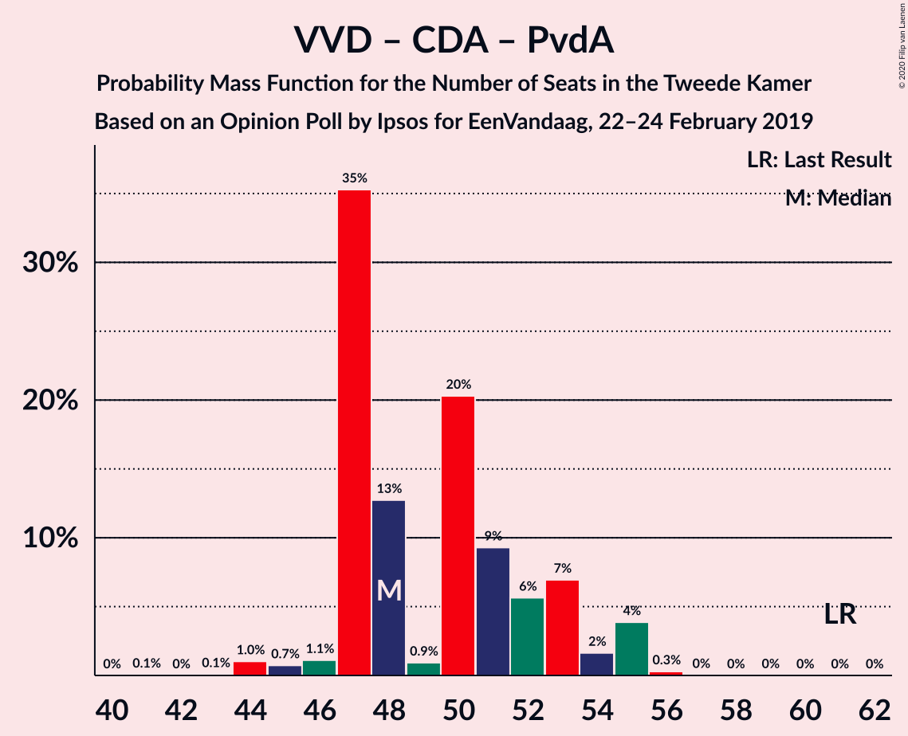

| Number of Seats | Probability | Accumulated | Special Marks |
|:---------------:|:-----------:|:-----------:|:-------------:|
| 41 | 0.1% | 100% |  |
| 42 | 0% | 99.9% |  |
| 43 | 0.1% | 99.9% |  |
| 44 | 1.0% | 99.9% |  |
| 45 | 0.7% | 98.8% |  |
| 46 | 1.1% | 98% |  |
| 47 | 35% | 97% |  |
| 48 | 13% | 62% |  |
| 49 | 0.9% | 49% | Median |
| 50 | 20% | 48% |  |
| 51 | 9% | 28% |  |
| 52 | 6% | 18% |  |
| 53 | 7% | 13% |  |
| 54 | 2% | 6% |  |
| 55 | 4% | 4% |  |
| 56 | 0.3% | 0.3% |  |
| 57 | 0% | 0.1% |  |
| 58 | 0% | 0% |  |
| 59 | 0% | 0% |  |
| 60 | 0% | 0% |  |
| 61 | 0% | 0% | Last Result |

### Volkspartij voor Vrijheid en Democratie – Christen-Democratisch Appèl

| Number of Seats | Probability | Accumulated | Special Marks |
|:---------------:|:-----------:|:-----------:|:-------------:|
| 35 | 1.0% | 100% |  |
| 36 | 35% | 98.9% |  |
| 37 | 1.3% | 64% |  |
| 38 | 0.6% | 63% |  |
| 39 | 2% | 62% | Median |
| 40 | 26% | 60% |  |
| 41 | 14% | 34% |  |
| 42 | 7% | 21% |  |
| 43 | 7% | 14% |  |
| 44 | 0.6% | 6% |  |
| 45 | 5% | 6% |  |
| 46 | 0.7% | 0.9% |  |
| 47 | 0.2% | 0.2% |  |
| 48 | 0% | 0% |  |
| 49 | 0% | 0% |  |
| 50 | 0% | 0% |  |
| 51 | 0% | 0% |  |
| 52 | 0% | 0% | Last Result |

### Volkspartij voor Vrijheid en Democratie – Partij van de Arbeid

| Number of Seats | Probability | Accumulated | Special Marks |
|:---------------:|:-----------:|:-----------:|:-------------:|
| 30 | 0.5% | 100% |  |
| 31 | 0% | 99.5% |  |
| 32 | 0.6% | 99.5% |  |
| 33 | 0.6% | 98.9% |  |
| 34 | 12% | 98% |  |
| 35 | 37% | 86% |  |
| 36 | 5% | 49% |  |
| 37 | 3% | 44% | Median |
| 38 | 24% | 41% |  |
| 39 | 0.5% | 17% |  |
| 40 | 8% | 17% |  |
| 41 | 2% | 9% |  |
| 42 | 7% | 7% | Last Result |
| 43 | 0.1% | 0.3% |  |
| 44 | 0.3% | 0.3% |  |
| 45 | 0% | 0% |  |

### Democraten 66 – Christen-Democratisch Appèl – Partij van de Arbeid

| Number of Seats | Probability | Accumulated | Special Marks |
|:---------------:|:-----------:|:-----------:|:-------------:|
| 29 | 0.1% | 100% |  |
| 30 | 0.1% | 99.9% |  |
| 31 | 1.4% | 99.9% |  |
| 32 | 0.4% | 98% |  |
| 33 | 4% | 98% |  |
| 34 | 17% | 94% |  |
| 35 | 7% | 77% |  |
| 36 | 11% | 70% |  |
| 37 | 6% | 59% | Median |
| 38 | 45% | 53% |  |
| 39 | 5% | 9% |  |
| 40 | 2% | 3% |  |
| 41 | 1.5% | 2% |  |
| 42 | 0.3% | 0.3% |  |
| 43 | 0.1% | 0.1% |  |
| 44 | 0% | 0% |  |
| 45 | 0% | 0% |  |
| 46 | 0% | 0% |  |
| 47 | 0% | 0% | Last Result |

### Christen-Democratisch Appèl – Partij van de Arbeid – ChristenUnie

| Number of Seats | Probability | Accumulated | Special Marks |
|:---------------:|:-----------:|:-----------:|:-------------:|
| 22 | 0.1% | 100% |  |
| 23 | 0.7% | 99.9% |  |
| 24 | 0.6% | 99.2% |  |
| 25 | 2% | 98.6% |  |
| 26 | 2% | 97% |  |
| 27 | 16% | 95% |  |
| 28 | 17% | 79% | Median |
| 29 | 43% | 62% |  |
| 30 | 16% | 19% |  |
| 31 | 1.1% | 2% |  |
| 32 | 0.8% | 1.2% |  |
| 33 | 0.3% | 0.4% | Last Result |
| 34 | 0.1% | 0.2% |  |
| 35 | 0% | 0% |  |

### Democraten 66 – Christen-Democratisch Appèl

| Number of Seats | Probability | Accumulated | Special Marks |
|:---------------:|:-----------:|:-----------:|:-------------:|
| 21 | 0.1% | 100% |  |
| 22 | 1.0% | 99.9% |  |
| 23 | 2% | 98.9% |  |
| 24 | 19% | 97% |  |
| 25 | 2% | 78% |  |
| 26 | 8% | 77% |  |
| 27 | 40% | 68% | Median |
| 28 | 16% | 28% |  |
| 29 | 3% | 12% |  |
| 30 | 7% | 9% |  |
| 31 | 1.4% | 2% |  |
| 32 | 0.3% | 0.3% |  |
| 33 | 0% | 0% |  |
| 34 | 0% | 0% |  |
| 35 | 0% | 0% |  |
| 36 | 0% | 0% |  |
| 37 | 0% | 0% |  |
| 38 | 0% | 0% | Last Result |

### Christen-Democratisch Appèl – Partij van de Arbeid

| Number of Seats | Probability | Accumulated | Special Marks |
|:---------------:|:-----------:|:-----------:|:-------------:|
| 15 | 0.1% | 100% |  |
| 16 | 0% | 99.9% |  |
| 17 | 0.4% | 99.9% |  |
| 18 | 0.7% | 99.5% |  |
| 19 | 2% | 98.8% |  |
| 20 | 2% | 97% |  |
| 21 | 14% | 95% |  |
| 22 | 23% | 80% | Median |
| 23 | 42% | 57% |  |
| 24 | 12% | 15% |  |
| 25 | 0.8% | 3% |  |
| 26 | 2% | 2% |  |
| 27 | 0.2% | 0.2% |  |
| 28 | 0% | 0% | Last Result |

## Technical Information

### Opinion Poll

+ **Polling firm:** Ipsos
+ **Commissioner(s):** EenVandaag
+ **Fieldwork period:** 22–24 February 2019

### Calculations

+ **Sample size:** 1026
+ **Simulations done:** 1,048,576
+ **Error estimate:** 2.58%

