# Opinion Poll by Peil.nl, 18–24 February 2019

<a href="#voting-intentions">Voting Intentions</a> | <a href="#seats">Seats</a> | <a href="#coalitions">Coalitions</a> | <a href="#technical-information">Technical Information</a>

## Voting Intentions

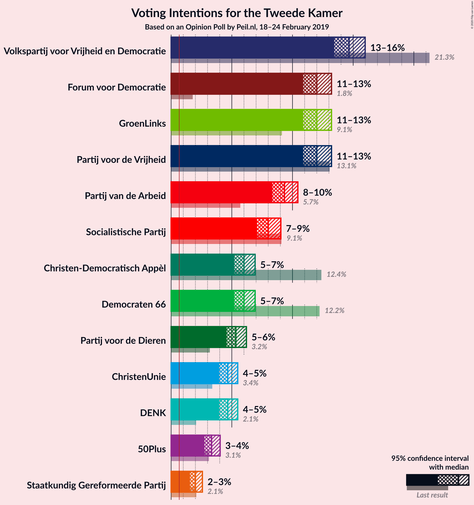

### Confidence Intervals

| Party | Last Result | Poll Result | 80% Confidence Interval | 90% Confidence Interval | 95% Confidence Interval | 99% Confidence Interval |
|:-----:|:-----------:|:-----------:|:-----------------------:|:-----------------------:|:-----------------------:|:-----------------------:|
| Volkspartij voor Vrijheid en Democratie | 21.3% | 14.7% | 13.9–15.5% |13.6–15.8% |13.4–16.0% |13.1–16.4% |
| Partij voor de Vrijheid | 13.1% | 12.0% | 11.3–12.8% |11.1–13.0% |10.9–13.2% |10.5–13.6% |
| GroenLinks | 9.1% | 12.0% | 11.3–12.8% |11.1–13.0% |10.9–13.2% |10.5–13.6% |
| Forum voor Democratie | 1.8% | 12.0% | 11.3–12.8% |11.1–13.0% |10.9–13.2% |10.5–13.6% |
| Partij van de Arbeid | 5.7% | 9.3% | 8.7–10.1% |8.5–10.3% |8.3–10.4% |8.0–10.8% |
| Socialistische Partij | 9.1% | 8.0% | 7.4–8.7% |7.2–8.9% |7.1–9.0% |6.8–9.4% |
| Christen-Democratisch Appèl | 12.4% | 6.0% | 5.5–6.6% |5.3–6.8% |5.2–6.9% |5.0–7.2% |
| Democraten 66 | 12.2% | 6.0% | 5.5–6.6% |5.3–6.8% |5.2–6.9% |5.0–7.2% |
| Partij voor de Dieren | 3.2% | 5.3% | 4.8–5.9% |4.7–6.1% |4.6–6.2% |4.4–6.5% |
| ChristenUnie | 3.4% | 4.7% | 4.2–5.2% |4.1–5.3% |4.0–5.5% |3.7–5.8% |
| DENK | 2.1% | 4.7% | 4.2–5.2% |4.1–5.3% |4.0–5.5% |3.7–5.8% |
| 50Plus | 3.1% | 3.3% | 2.9–3.8% |2.8–3.9% |2.7–4.0% |2.6–4.3% |
| Staatkundig Gereformeerde Partij | 2.1% | 2.0% | 1.7–2.4% |1.6–2.5% |1.6–2.6% |1.4–2.8% |

*Note:* The poll result column reflects the actual value used in the calculations. Published results may vary slightly, and in addition be rounded to fewer digits.

## Seats

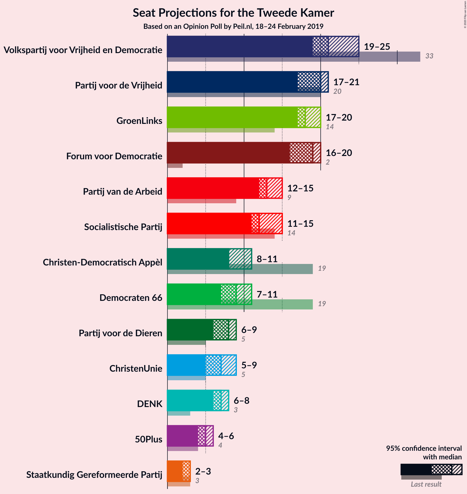

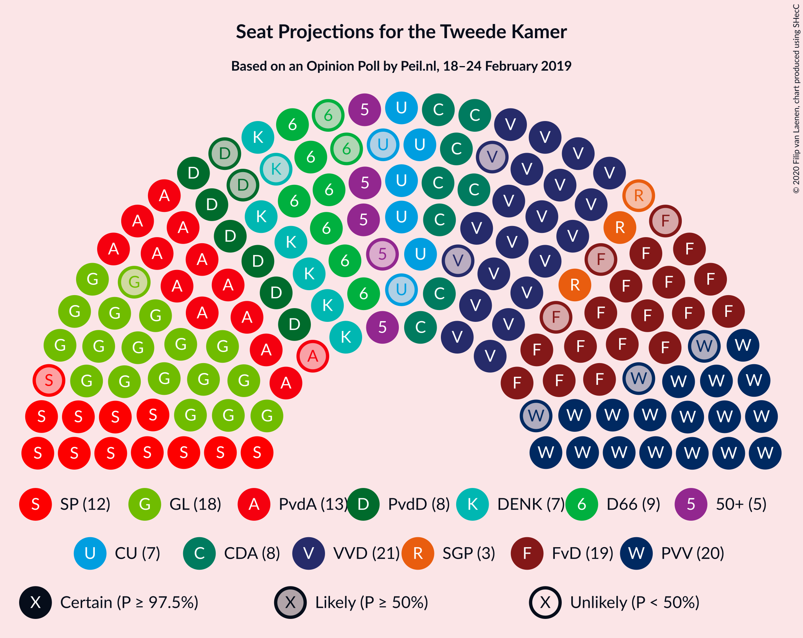

### Confidence Intervals

| Party | Last Result | Median | 80% Confidence Interval | 90% Confidence Interval | 95% Confidence Interval | 99% Confidence Interval |
|:-----:|:-----------:|:------:|:-----------------------:|:-----------------------:|:-----------------------:|:-----------------------:|
| <a href="#volkspartij-voor-vrijheid-en-democratie">Volkspartij voor Vrijheid en Democratie</a> | 33 | 21 | 20–25 |20–25 |19–25 |19–25 |
| <a href="#partij-voor-de-vrijheid">Partij voor de Vrijheid</a> | 20 | 20 | 18–21 |17–21 |17–21 |16–21 |
| <a href="#groenlinks">GroenLinks</a> | 14 | 18 | 17–20 |17–20 |17–20 |16–20 |
| <a href="#forum-voor-democratie">Forum voor Democratie</a> | 2 | 19 | 16–19 |16–19 |16–20 |16–21 |
| <a href="#partij-van-de-arbeid">Partij van de Arbeid</a> | 9 | 13 | 12–14 |12–15 |12–15 |11–16 |
| <a href="#socialistische-partij">Socialistische Partij</a> | 14 | 12 | 12–13 |11–13 |11–15 |10–15 |
| <a href="#christen-democratisch-appèl">Christen-Democratisch Appèl</a> | 19 | 8 | 8–10 |8–10 |8–11 |7–11 |
| <a href="#democraten-66">Democraten 66</a> | 19 | 9 | 7–10 |7–10 |7–11 |6–11 |
| <a href="#partij-voor-de-dieren">Partij voor de Dieren</a> | 5 | 8 | 7–9 |7–9 |6–9 |6–10 |
| <a href="#christenunie">ChristenUnie</a> | 5 | 7 | 5–8 |5–8 |5–9 |5–9 |
| <a href="#denk">DENK</a> | 3 | 7 | 6–8 |6–8 |6–8 |5–8 |
| <a href="#50plus">50Plus</a> | 4 | 5 | 4–6 |4–6 |4–6 |3–7 |
| <a href="#staatkundig-gereformeerde-partij">Staatkundig Gereformeerde Partij</a> | 3 | 3 | 2–3 |2–3 |2–3 |1–4 |

### Volkspartij voor Vrijheid en Democratie

*For a full overview of the results for this party, see the [Volkspartij voor Vrijheid en Democratie](party-volkspartijvoorvrijheidendemocratie.html) page.*

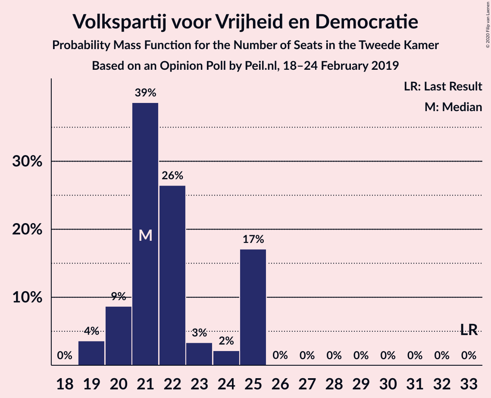

| Number of Seats | Probability | Accumulated | Special Marks |
|:---------------:|:-----------:|:-----------:|:-------------:|
| 19 | 4% | 100% |  |
| 20 | 9% | 96% |  |
| 21 | 39% | 88% | Median |
| 22 | 26% | 49% |  |
| 23 | 3% | 23% |  |
| 24 | 2% | 19% |  |
| 25 | 17% | 17% |  |
| 26 | 0% | 0% |  |
| 27 | 0% | 0% |  |
| 28 | 0% | 0% |  |
| 29 | 0% | 0% |  |
| 30 | 0% | 0% |  |
| 31 | 0% | 0% |  |
| 32 | 0% | 0% |  |
| 33 | 0% | 0% | Last Result |

### Partij voor de Vrijheid

*For a full overview of the results for this party, see the [Partij voor de Vrijheid](party-partijvoordevrijheid.html) page.*

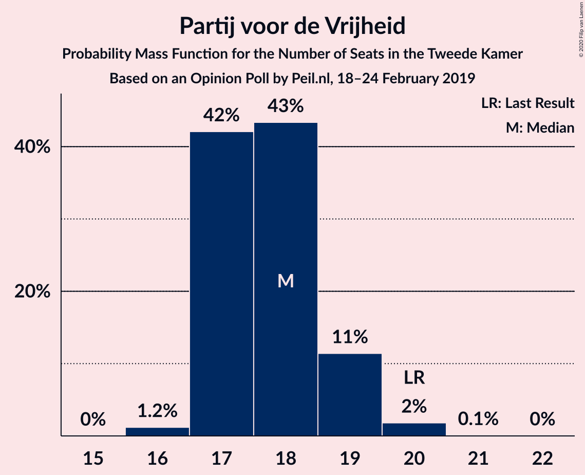

| Number of Seats | Probability | Accumulated | Special Marks |
|:---------------:|:-----------:|:-----------:|:-------------:|
| 15 | 0.1% | 100% |  |
| 16 | 2% | 99.9% |  |
| 17 | 6% | 98% |  |
| 18 | 3% | 92% |  |
| 19 | 21% | 89% |  |
| 20 | 57% | 68% | Last Result, Median |
| 21 | 11% | 11% |  |
| 22 | 0.2% | 0.2% |  |
| 23 | 0% | 0% |  |

### GroenLinks

*For a full overview of the results for this party, see the [GroenLinks](party-groenlinks.html) page.*

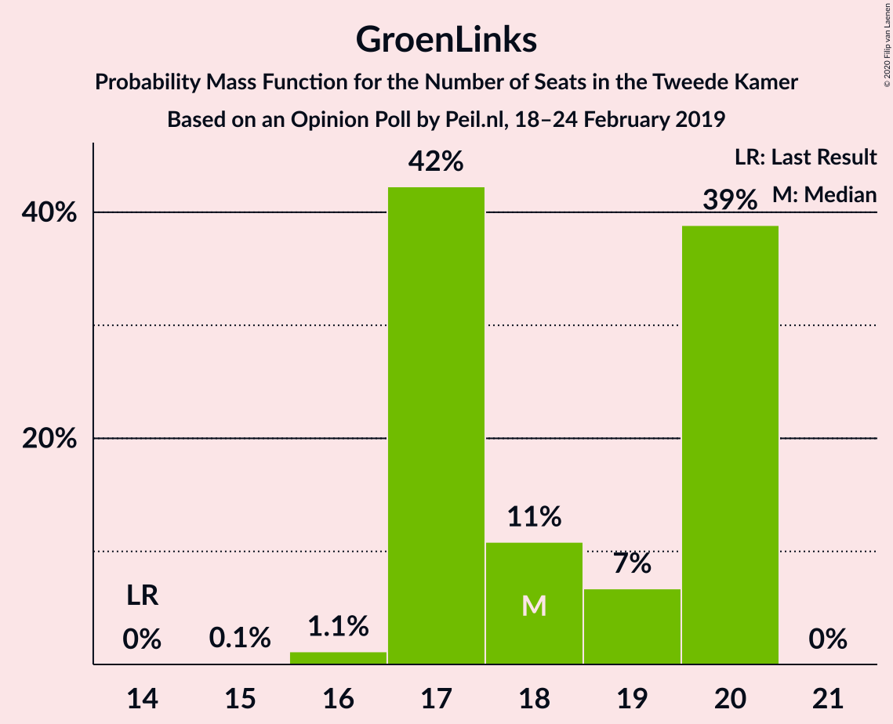

| Number of Seats | Probability | Accumulated | Special Marks |
|:---------------:|:-----------:|:-----------:|:-------------:|
| 14 | 0% | 100% | Last Result |
| 15 | 0.1% | 100% |  |
| 16 | 1.1% | 99.9% |  |
| 17 | 42% | 98.7% |  |
| 18 | 11% | 56% | Median |
| 19 | 7% | 46% |  |
| 20 | 39% | 39% |  |
| 21 | 0% | 0% |  |

### Forum voor Democratie

*For a full overview of the results for this party, see the [Forum voor Democratie](party-forumvoordemocratie.html) page.*

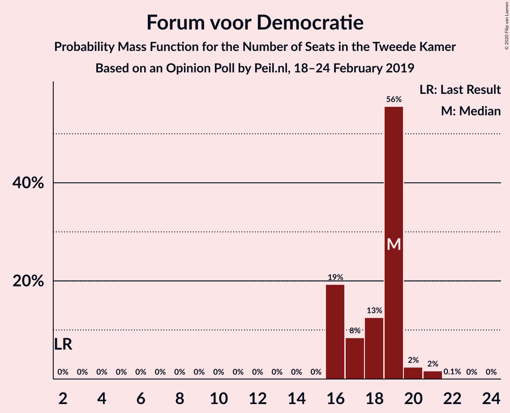

| Number of Seats | Probability | Accumulated | Special Marks |
|:---------------:|:-----------:|:-----------:|:-------------:|
| 2 | 0% | 100% | Last Result |
| 3 | 0% | 100% |  |
| 4 | 0% | 100% |  |
| 5 | 0% | 100% |  |
| 6 | 0% | 100% |  |
| 7 | 0% | 100% |  |
| 8 | 0% | 100% |  |
| 9 | 0% | 100% |  |
| 10 | 0% | 100% |  |
| 11 | 0% | 100% |  |
| 12 | 0% | 100% |  |
| 13 | 0% | 100% |  |
| 14 | 0% | 100% |  |
| 15 | 0% | 100% |  |
| 16 | 19% | 100% |  |
| 17 | 8% | 81% |  |
| 18 | 13% | 72% |  |
| 19 | 56% | 60% | Median |
| 20 | 2% | 4% |  |
| 21 | 2% | 2% |  |
| 22 | 0.1% | 0.1% |  |
| 23 | 0% | 0% |  |

### Partij van de Arbeid

*For a full overview of the results for this party, see the [Partij van de Arbeid](party-partijvandearbeid.html) page.*

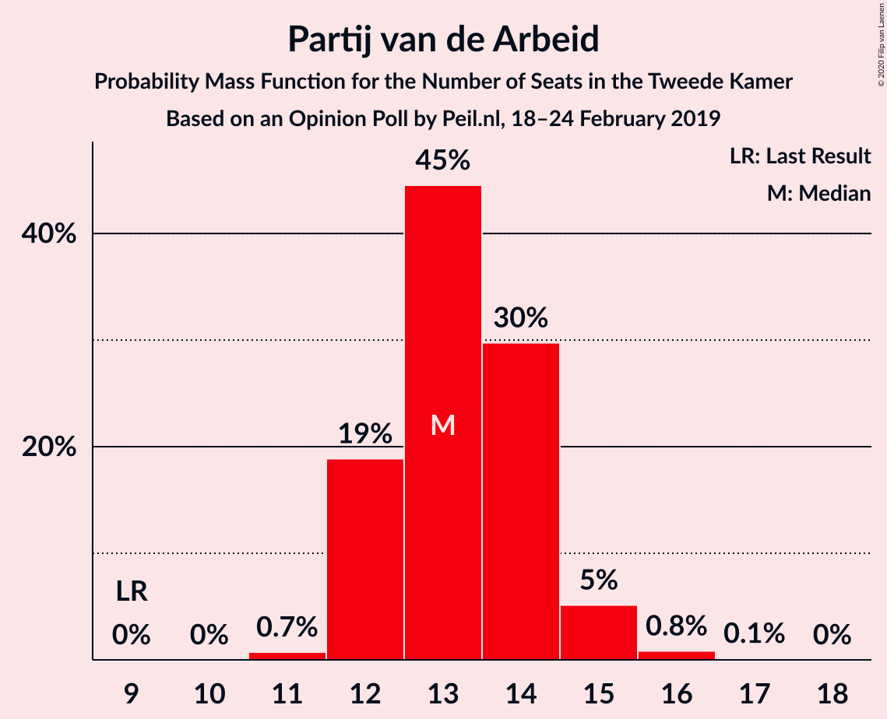

| Number of Seats | Probability | Accumulated | Special Marks |
|:---------------:|:-----------:|:-----------:|:-------------:|
| 9 | 0% | 100% | Last Result |
| 10 | 0% | 100% |  |
| 11 | 0.7% | 100% |  |
| 12 | 19% | 99.3% |  |
| 13 | 45% | 80% | Median |
| 14 | 30% | 36% |  |
| 15 | 5% | 6% |  |
| 16 | 0.8% | 1.0% |  |
| 17 | 0.1% | 0.1% |  |
| 18 | 0% | 0% |  |

### Socialistische Partij

*For a full overview of the results for this party, see the [Socialistische Partij](party-socialistischepartij.html) page.*

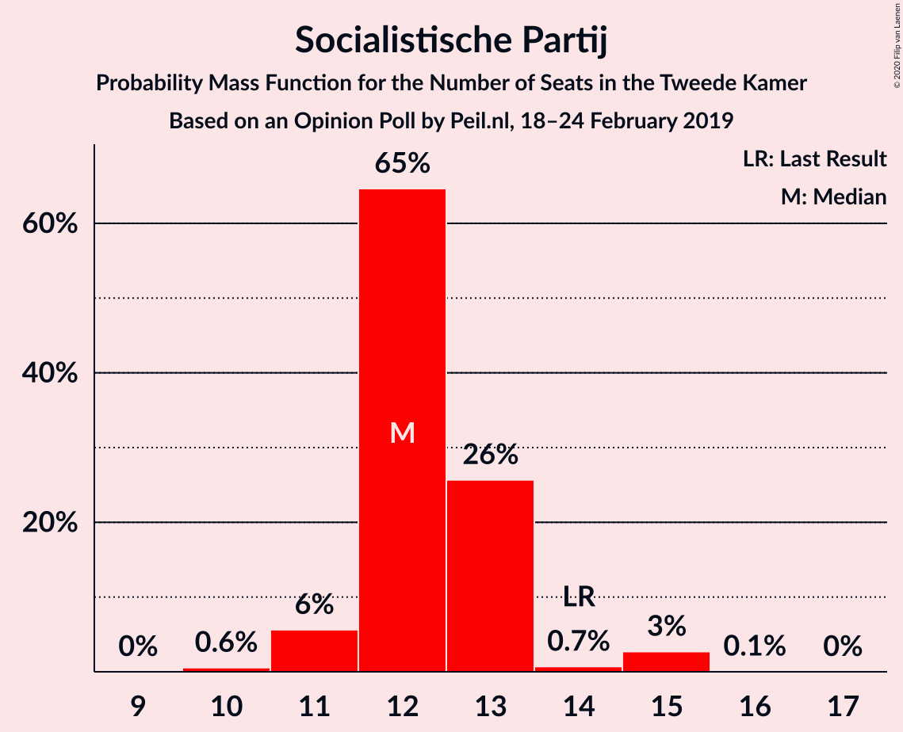

| Number of Seats | Probability | Accumulated | Special Marks |
|:---------------:|:-----------:|:-----------:|:-------------:|
| 10 | 0.6% | 100% |  |
| 11 | 6% | 99.4% |  |
| 12 | 65% | 94% | Median |
| 13 | 26% | 29% |  |
| 14 | 0.7% | 3% | Last Result |
| 15 | 3% | 3% |  |
| 16 | 0.1% | 0.1% |  |
| 17 | 0% | 0% |  |

### Christen-Democratisch Appèl

*For a full overview of the results for this party, see the [Christen-Democratisch Appèl](party-christen-democratischappèl.html) page.*

| Number of Seats | Probability | Accumulated | Special Marks |
|:---------------:|:-----------:|:-----------:|:-------------:|
| 7 | 2% | 100% |  |
| 8 | 54% | 98% | Median |
| 9 | 5% | 44% |  |
| 10 | 36% | 39% |  |
| 11 | 3% | 3% |  |
| 12 | 0.1% | 0.1% |  |
| 13 | 0% | 0% |  |
| 14 | 0% | 0% |  |
| 15 | 0% | 0% |  |
| 16 | 0% | 0% |  |
| 17 | 0% | 0% |  |
| 18 | 0% | 0% |  |
| 19 | 0% | 0% | Last Result |

### Democraten 66

*For a full overview of the results for this party, see the [Democraten 66](party-democraten66.html) page.*

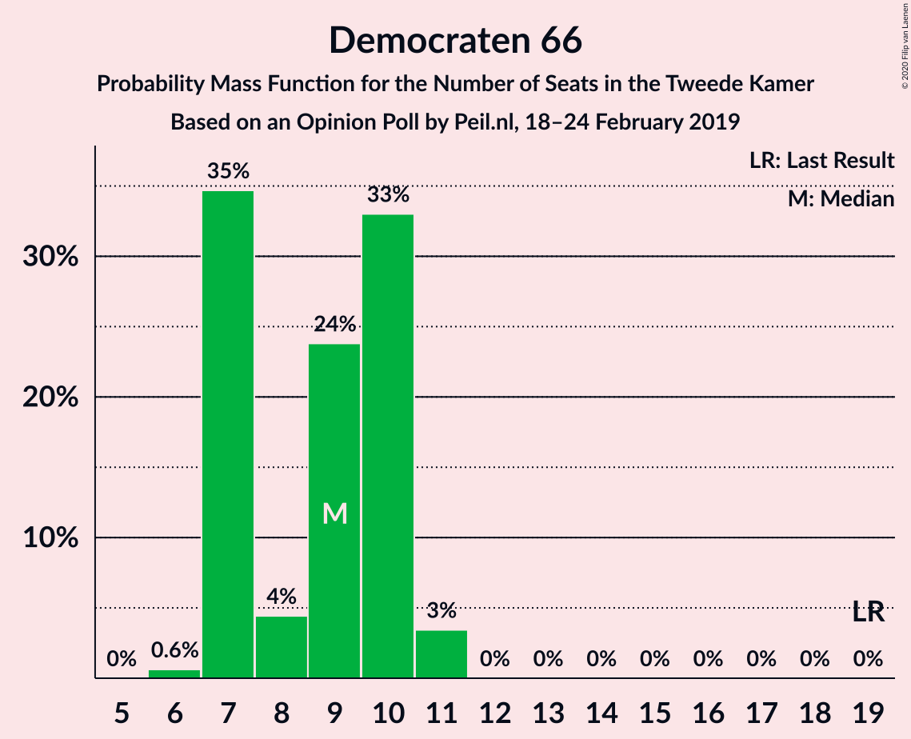

| Number of Seats | Probability | Accumulated | Special Marks |
|:---------------:|:-----------:|:-----------:|:-------------:|
| 6 | 0.6% | 100% |  |
| 7 | 35% | 99.4% |  |
| 8 | 4% | 65% |  |
| 9 | 24% | 60% | Median |
| 10 | 33% | 36% |  |
| 11 | 3% | 3% |  |
| 12 | 0% | 0% |  |
| 13 | 0% | 0% |  |
| 14 | 0% | 0% |  |
| 15 | 0% | 0% |  |
| 16 | 0% | 0% |  |
| 17 | 0% | 0% |  |
| 18 | 0% | 0% |  |
| 19 | 0% | 0% | Last Result |

### Partij voor de Dieren

*For a full overview of the results for this party, see the [Partij voor de Dieren](party-partijvoordedieren.html) page.*

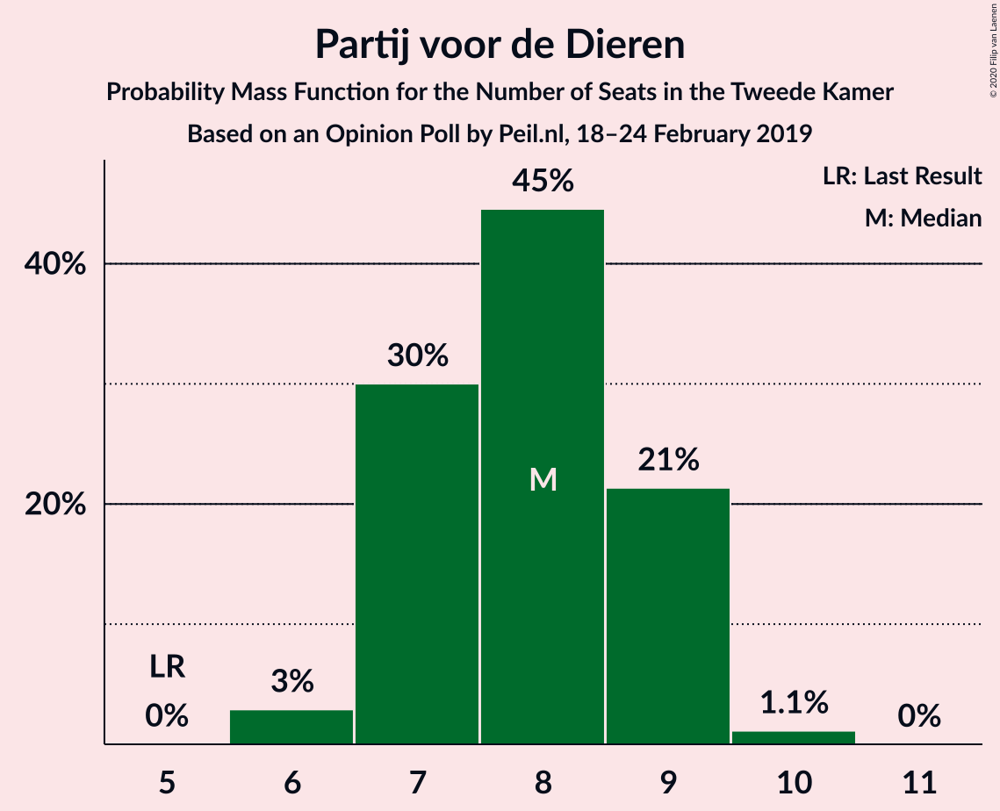

| Number of Seats | Probability | Accumulated | Special Marks |
|:---------------:|:-----------:|:-----------:|:-------------:|
| 5 | 0% | 100% | Last Result |
| 6 | 3% | 100% |  |
| 7 | 30% | 97% |  |
| 8 | 45% | 67% | Median |
| 9 | 21% | 22% |  |
| 10 | 1.1% | 1.1% |  |
| 11 | 0% | 0% |  |

### ChristenUnie

*For a full overview of the results for this party, see the [ChristenUnie](party-christenunie.html) page.*

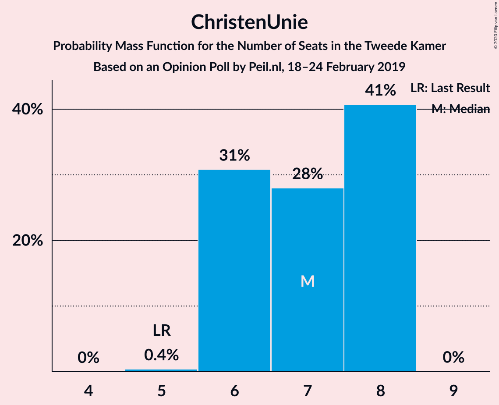

| Number of Seats | Probability | Accumulated | Special Marks |
|:---------------:|:-----------:|:-----------:|:-------------:|
| 5 | 19% | 100% | Last Result |
| 6 | 8% | 81% |  |
| 7 | 48% | 73% | Median |
| 8 | 21% | 25% |  |
| 9 | 4% | 4% |  |
| 10 | 0% | 0% |  |

### DENK

*For a full overview of the results for this party, see the [DENK](party-denk.html) page.*

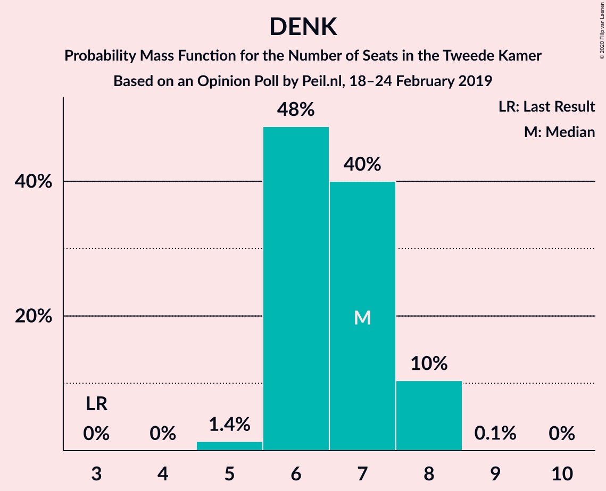

| Number of Seats | Probability | Accumulated | Special Marks |
|:---------------:|:-----------:|:-----------:|:-------------:|
| 3 | 0% | 100% | Last Result |
| 4 | 0% | 100% |  |
| 5 | 1.4% | 100% |  |
| 6 | 48% | 98.6% |  |
| 7 | 40% | 50% | Median |
| 8 | 10% | 10% |  |
| 9 | 0.1% | 0.1% |  |
| 10 | 0% | 0% |  |

### 50Plus

*For a full overview of the results for this party, see the [50Plus](party-50plus.html) page.*

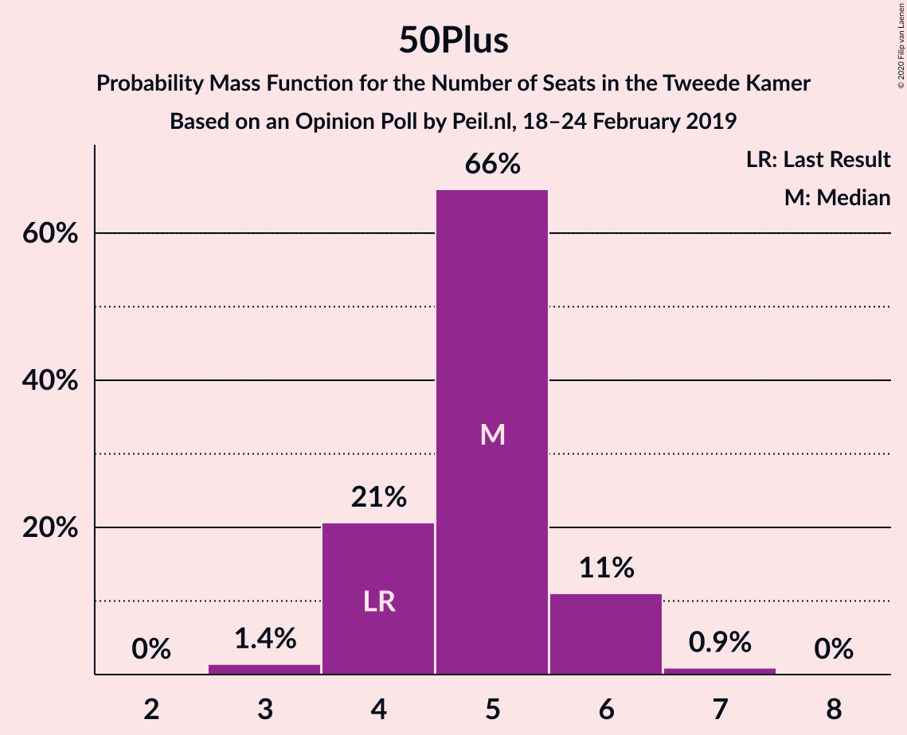

| Number of Seats | Probability | Accumulated | Special Marks |
|:---------------:|:-----------:|:-----------:|:-------------:|
| 3 | 1.4% | 100% |  |
| 4 | 21% | 98.6% | Last Result |
| 5 | 66% | 78% | Median |
| 6 | 11% | 12% |  |
| 7 | 0.9% | 0.9% |  |
| 8 | 0% | 0% |  |

### Staatkundig Gereformeerde Partij

*For a full overview of the results for this party, see the [Staatkundig Gereformeerde Partij](party-staatkundiggereformeerdepartij.html) page.*

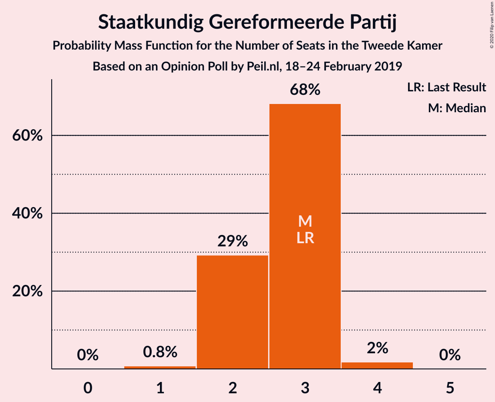

| Number of Seats | Probability | Accumulated | Special Marks |
|:---------------:|:-----------:|:-----------:|:-------------:|
| 1 | 0.8% | 100% |  |
| 2 | 29% | 99.2% |  |
| 3 | 68% | 70% | Last Result, Median |
| 4 | 2% | 2% |  |
| 5 | 0% | 0% |  |

## Coalitions

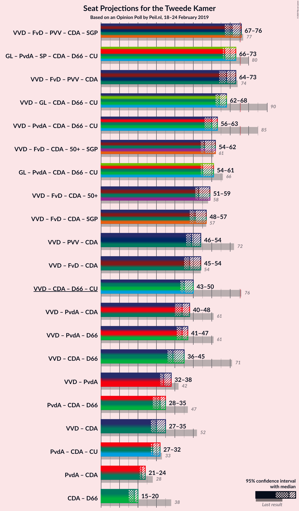

### Confidence Intervals

| Coalition | Last Result | Median | Majority? | 80% Confidence Interval | 90% Confidence Interval | 95% Confidence Interval | 99% Confidence Interval |
|:---------:|:-----------:|:------:|:---------:|:-----------------------:|:-----------------------:|:-----------------------:|:-----------------------:|
| Volkspartij voor Vrijheid en Democratie – Forum voor Democratie – Partij voor de Vrijheid – Christen-Democratisch Appèl – Staatkundig Gereformeerde Partij | 77 | 71 | 17% | 69–76 | 67–76 | 67–76 | 67–76 |
| GroenLinks – Partij van de Arbeid – Socialistische Partij – Christen-Democratisch Appèl – Democraten 66 – ChristenUnie | 80 | 67 | 0% | 66–71 | 66–71 | 66–73 | 65–73 |
| Volkspartij voor Vrijheid en Democratie – Forum voor Democratie – Partij voor de Vrijheid – Christen-Democratisch Appèl | 74 | 68 | 0% | 66–73 | 64–73 | 64–73 | 64–73 |
| Volkspartij voor Vrijheid en Democratie – GroenLinks – Christen-Democratisch Appèl – Democraten 66 – ChristenUnie | 90 | 64 | 0% | 63–67 | 63–67 | 62–68 | 62–69 |
| Volkspartij voor Vrijheid en Democratie – Partij van de Arbeid – Christen-Democratisch Appèl – Democraten 66 – ChristenUnie | 85 | 60 | 0% | 56–63 | 56–63 | 56–63 | 56–66 |
| Volkspartij voor Vrijheid en Democratie – Forum voor Democratie – Christen-Democratisch Appèl – 50Plus – Staatkundig Gereformeerde Partij | 61 | 56 | 0% | 54–62 | 54–62 | 54–62 | 53–62 |
| GroenLinks – Partij van de Arbeid – Christen-Democratisch Appèl – Democraten 66 – ChristenUnie | 66 | 55 | 0% | 54–58 | 54–59 | 54–61 | 53–62 |
| Volkspartij voor Vrijheid en Democratie – Forum voor Democratie – Christen-Democratisch Appèl – 50Plus | 58 | 53 | 0% | 52–59 | 51–59 | 51–59 | 50–59 |
| Volkspartij voor Vrijheid en Democratie – Forum voor Democratie – Christen-Democratisch Appèl – Staatkundig Gereformeerde Partij | 57 | 51 | 0% | 48–57 | 48–57 | 48–57 | 48–57 |
| Volkspartij voor Vrijheid en Democratie – Partij voor de Vrijheid – Christen-Democratisch Appèl | 72 | 49 | 0% | 49–54 | 47–54 | 46–54 | 46–54 |
| Volkspartij voor Vrijheid en Democratie – Forum voor Democratie – Christen-Democratisch Appèl | 54 | 48 | 0% | 46–54 | 46–54 | 45–54 | 45–54 |
| Volkspartij voor Vrijheid en Democratie – Christen-Democratisch Appèl – Democraten 66 – ChristenUnie | 76 | 45 | 0% | 43–50 | 43–50 | 43–50 | 43–51 |
| Volkspartij voor Vrijheid en Democratie – Partij van de Arbeid – Christen-Democratisch Appèl | 61 | 44 | 0% | 42–47 | 42–47 | 40–48 | 40–48 |
| Volkspartij voor Vrijheid en Democratie – Partij van de Arbeid – Democraten 66 | 61 | 44 | 0% | 41–47 | 41–47 | 41–47 | 40–50 |
| Volkspartij voor Vrijheid en Democratie – Christen-Democratisch Appèl – Democraten 66 | 71 | 39 | 0% | 36–45 | 36–45 | 36–45 | 36–45 |
| Volkspartij voor Vrijheid en Democratie – Partij van de Arbeid | 42 | 34 | 0% | 34–37 | 34–37 | 32–38 | 32–39 |
| Partij van de Arbeid – Christen-Democratisch Appèl – Democraten 66 | 47 | 32 | 0% | 28–33 | 28–35 | 28–35 | 27–35 |
| Volkspartij voor Vrijheid en Democratie – Christen-Democratisch Appèl | 52 | 30 | 0% | 28–35 | 28–35 | 27–35 | 27–35 |
| Partij van de Arbeid – Christen-Democratisch Appèl – ChristenUnie | 33 | 28 | 0% | 27–32 | 27–32 | 27–32 | 27–32 |
| Partij van de Arbeid – Christen-Democratisch Appèl | 28 | 22 | 0% | 21–24 | 21–24 | 21–24 | 19–26 |
| Christen-Democratisch Appèl – Democraten 66 | 38 | 18 | 0% | 15–20 | 15–20 | 15–20 | 15–22 |

### Volkspartij voor Vrijheid en Democratie – Forum voor Democratie – Partij voor de Vrijheid – Christen-Democratisch Appèl – Staatkundig Gereformeerde Partij

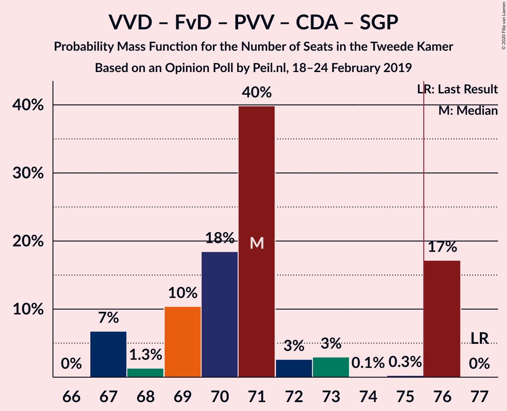

| Number of Seats | Probability | Accumulated | Special Marks |
|:---------------:|:-----------:|:-----------:|:-------------:|
| 66 | 0% | 100% |  |
| 67 | 7% | 99.9% |  |
| 68 | 1.3% | 93% |  |
| 69 | 10% | 92% |  |
| 70 | 18% | 81% |  |
| 71 | 40% | 63% | Median |
| 72 | 3% | 23% |  |
| 73 | 3% | 21% |  |
| 74 | 0.1% | 18% |  |
| 75 | 0.3% | 17% |  |
| 76 | 17% | 17% | Majority |
| 77 | 0% | 0% | Last Result |

### GroenLinks – Partij van de Arbeid – Socialistische Partij – Christen-Democratisch Appèl – Democraten 66 – ChristenUnie

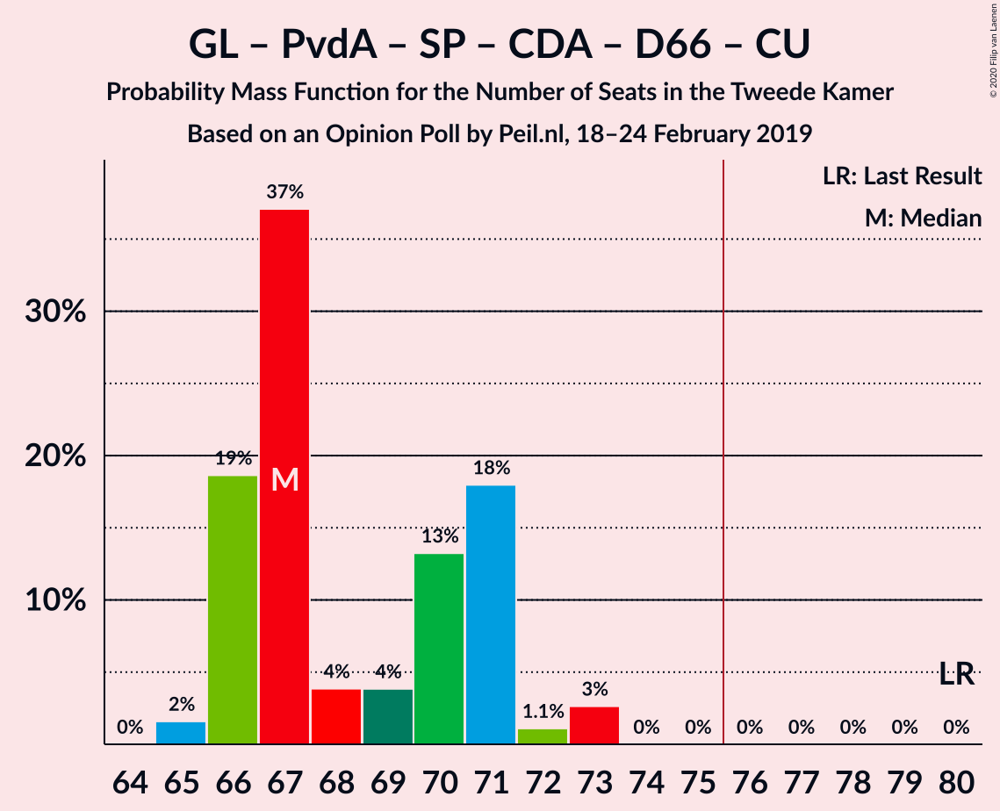

| Number of Seats | Probability | Accumulated | Special Marks |
|:---------------:|:-----------:|:-----------:|:-------------:|
| 65 | 2% | 100% |  |
| 66 | 19% | 98% |  |
| 67 | 37% | 80% | Median |
| 68 | 4% | 43% |  |
| 69 | 4% | 39% |  |
| 70 | 13% | 35% |  |
| 71 | 18% | 22% |  |
| 72 | 1.1% | 4% |  |
| 73 | 3% | 3% |  |
| 74 | 0% | 0% |  |
| 75 | 0% | 0% |  |
| 76 | 0% | 0% | Majority |
| 77 | 0% | 0% |  |
| 78 | 0% | 0% |  |
| 79 | 0% | 0% |  |
| 80 | 0% | 0% | Last Result |

### Volkspartij voor Vrijheid en Democratie – Forum voor Democratie – Partij voor de Vrijheid – Christen-Democratisch Appèl

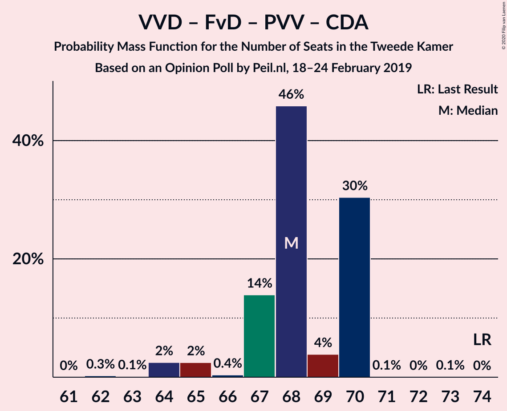

| Number of Seats | Probability | Accumulated | Special Marks |
|:---------------:|:-----------:|:-----------:|:-------------:|
| 63 | 0% | 100% |  |
| 64 | 7% | 99.9% |  |
| 65 | 0.7% | 93% |  |
| 66 | 3% | 93% |  |
| 67 | 12% | 90% |  |
| 68 | 54% | 78% | Median |
| 69 | 2% | 24% |  |
| 70 | 3% | 22% |  |
| 71 | 2% | 19% |  |
| 72 | 0.3% | 18% |  |
| 73 | 17% | 17% |  |
| 74 | 0% | 0% | Last Result |

### Volkspartij voor Vrijheid en Democratie – GroenLinks – Christen-Democratisch Appèl – Democraten 66 – ChristenUnie

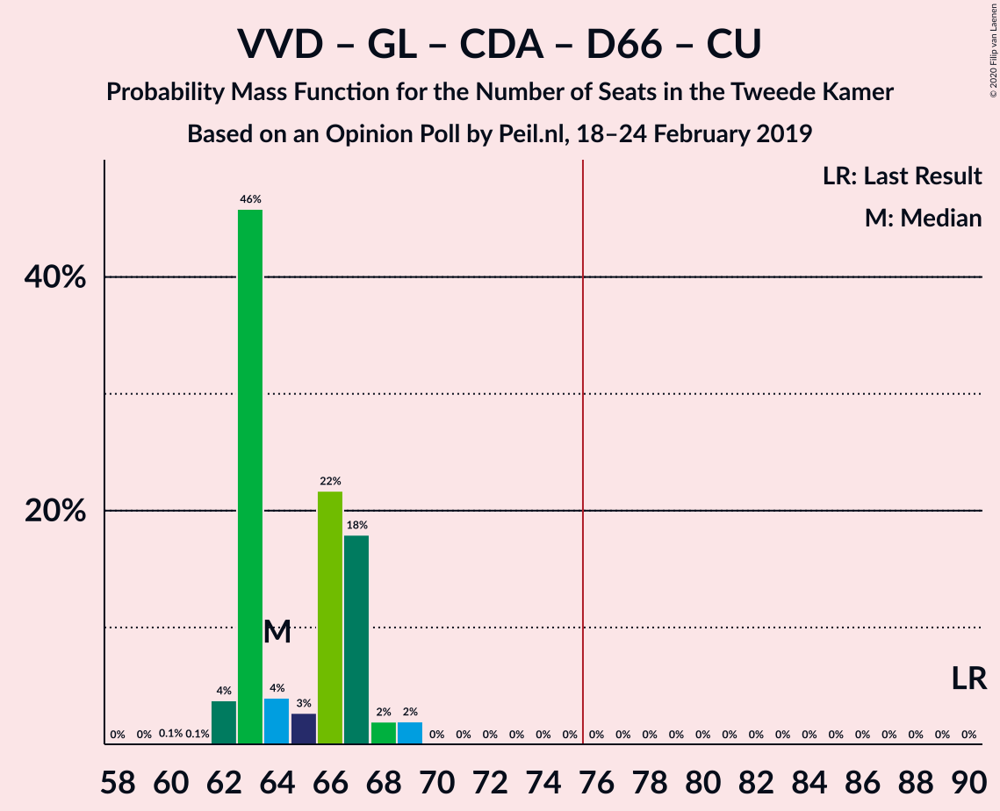

| Number of Seats | Probability | Accumulated | Special Marks |
|:---------------:|:-----------:|:-----------:|:-------------:|
| 60 | 0.1% | 100% |  |
| 61 | 0.1% | 99.9% |  |
| 62 | 4% | 99.8% |  |
| 63 | 46% | 96% | Median |
| 64 | 4% | 50% |  |
| 65 | 3% | 46% |  |
| 66 | 22% | 44% |  |
| 67 | 18% | 22% |  |
| 68 | 2% | 4% |  |
| 69 | 2% | 2% |  |
| 70 | 0% | 0% |  |
| 71 | 0% | 0% |  |
| 72 | 0% | 0% |  |
| 73 | 0% | 0% |  |
| 74 | 0% | 0% |  |
| 75 | 0% | 0% |  |
| 76 | 0% | 0% | Majority |
| 77 | 0% | 0% |  |
| 78 | 0% | 0% |  |
| 79 | 0% | 0% |  |
| 80 | 0% | 0% |  |
| 81 | 0% | 0% |  |
| 82 | 0% | 0% |  |
| 83 | 0% | 0% |  |
| 84 | 0% | 0% |  |
| 85 | 0% | 0% |  |
| 86 | 0% | 0% |  |
| 87 | 0% | 0% |  |
| 88 | 0% | 0% |  |
| 89 | 0% | 0% |  |
| 90 | 0% | 0% | Last Result |

### Volkspartij voor Vrijheid en Democratie – Partij van de Arbeid – Christen-Democratisch Appèl – Democraten 66 – ChristenUnie

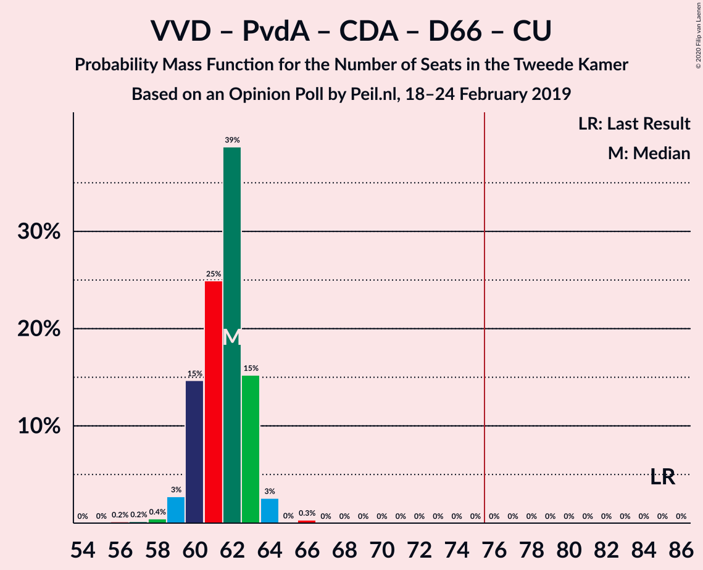

| Number of Seats | Probability | Accumulated | Special Marks |
|:---------------:|:-----------:|:-----------:|:-------------:|
| 56 | 37% | 100% |  |
| 57 | 2% | 63% |  |
| 58 | 2% | 61% | Median |
| 59 | 8% | 58% |  |
| 60 | 6% | 51% |  |
| 61 | 2% | 45% |  |
| 62 | 20% | 42% |  |
| 63 | 20% | 22% |  |
| 64 | 0.3% | 2% |  |
| 65 | 0.3% | 2% |  |
| 66 | 2% | 2% |  |
| 67 | 0% | 0% |  |
| 68 | 0% | 0% |  |
| 69 | 0% | 0% |  |
| 70 | 0% | 0% |  |
| 71 | 0% | 0% |  |
| 72 | 0% | 0% |  |
| 73 | 0% | 0% |  |
| 74 | 0% | 0% |  |
| 75 | 0% | 0% |  |
| 76 | 0% | 0% | Majority |
| 77 | 0% | 0% |  |
| 78 | 0% | 0% |  |
| 79 | 0% | 0% |  |
| 80 | 0% | 0% |  |
| 81 | 0% | 0% |  |
| 82 | 0% | 0% |  |
| 83 | 0% | 0% |  |
| 84 | 0% | 0% |  |
| 85 | 0% | 0% | Last Result |

### Volkspartij voor Vrijheid en Democratie – Forum voor Democratie – Christen-Democratisch Appèl – 50Plus – Staatkundig Gereformeerde Partij

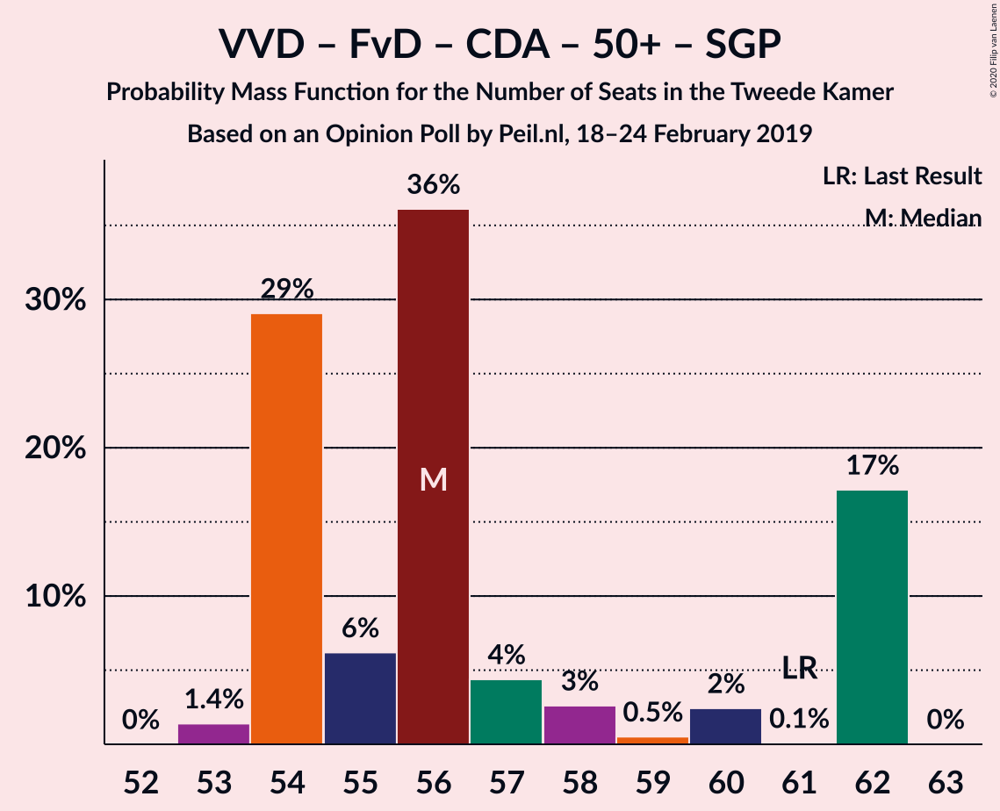

| Number of Seats | Probability | Accumulated | Special Marks |
|:---------------:|:-----------:|:-----------:|:-------------:|
| 53 | 1.4% | 100% |  |
| 54 | 29% | 98.6% |  |
| 55 | 6% | 70% |  |
| 56 | 36% | 63% | Median |
| 57 | 4% | 27% |  |
| 58 | 3% | 23% |  |
| 59 | 0.5% | 20% |  |
| 60 | 2% | 20% |  |
| 61 | 0.1% | 17% | Last Result |
| 62 | 17% | 17% |  |
| 63 | 0% | 0% |  |

### GroenLinks – Partij van de Arbeid – Christen-Democratisch Appèl – Democraten 66 – ChristenUnie

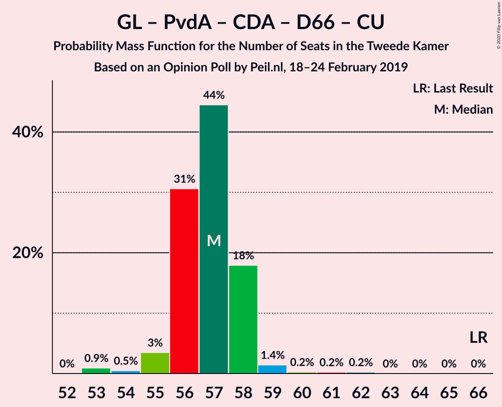

| Number of Seats | Probability | Accumulated | Special Marks |
|:---------------:|:-----------:|:-----------:|:-------------:|
| 52 | 0.1% | 100% |  |
| 53 | 2% | 99.9% |  |
| 54 | 19% | 98% |  |
| 55 | 38% | 79% | Median |
| 56 | 4% | 40% |  |
| 57 | 9% | 36% |  |
| 58 | 21% | 28% |  |
| 59 | 3% | 6% |  |
| 60 | 0.8% | 3% |  |
| 61 | 2% | 3% |  |
| 62 | 0.7% | 0.7% |  |
| 63 | 0% | 0% |  |
| 64 | 0% | 0% |  |
| 65 | 0% | 0% |  |
| 66 | 0% | 0% | Last Result |

### Volkspartij voor Vrijheid en Democratie – Forum voor Democratie – Christen-Democratisch Appèl – 50Plus

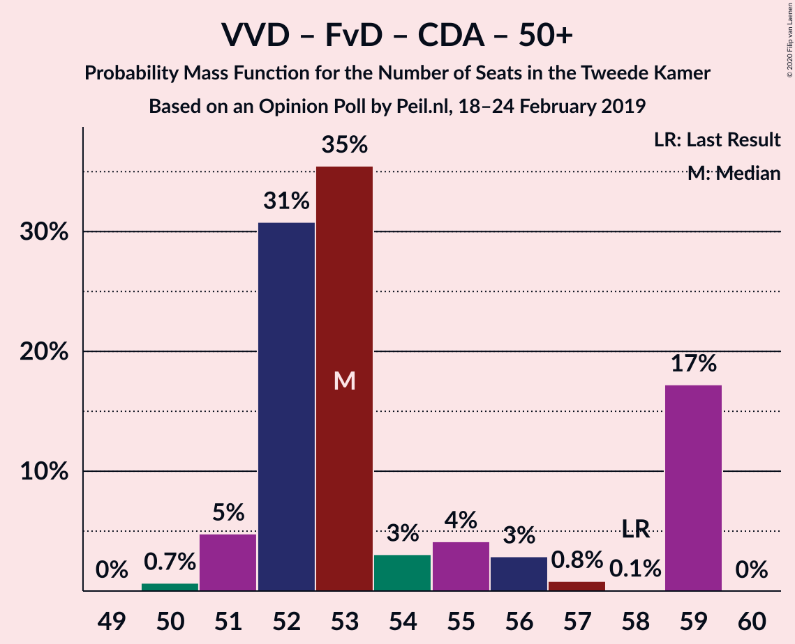

| Number of Seats | Probability | Accumulated | Special Marks |
|:---------------:|:-----------:|:-----------:|:-------------:|
| 50 | 0.7% | 100% |  |
| 51 | 5% | 99.3% |  |
| 52 | 31% | 95% |  |
| 53 | 35% | 64% | Median |
| 54 | 3% | 28% |  |
| 55 | 4% | 25% |  |
| 56 | 3% | 21% |  |
| 57 | 0.8% | 18% |  |
| 58 | 0.1% | 17% | Last Result |
| 59 | 17% | 17% |  |
| 60 | 0% | 0% |  |

### Volkspartij voor Vrijheid en Democratie – Forum voor Democratie – Christen-Democratisch Appèl – Staatkundig Gereformeerde Partij

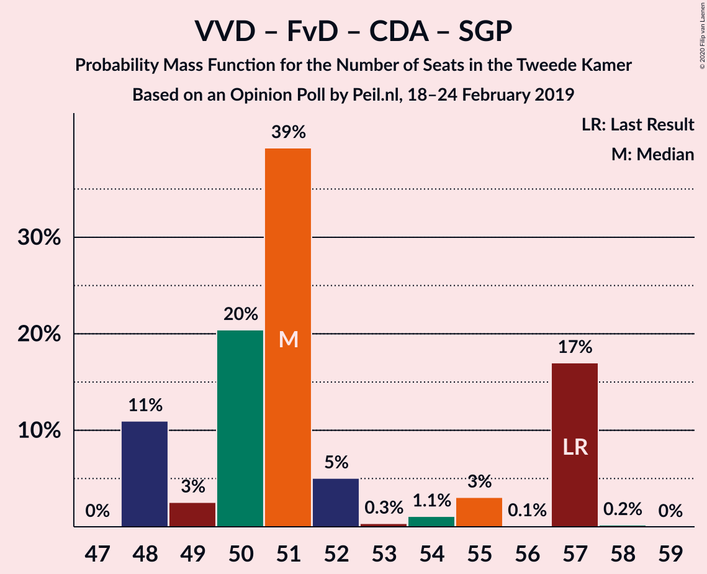

| Number of Seats | Probability | Accumulated | Special Marks |
|:---------------:|:-----------:|:-----------:|:-------------:|
| 48 | 11% | 100% |  |
| 49 | 3% | 89% |  |
| 50 | 20% | 86% |  |
| 51 | 39% | 66% | Median |
| 52 | 5% | 27% |  |
| 53 | 0.3% | 22% |  |
| 54 | 1.1% | 21% |  |
| 55 | 3% | 20% |  |
| 56 | 0.1% | 17% |  |
| 57 | 17% | 17% | Last Result |
| 58 | 0.2% | 0.2% |  |
| 59 | 0% | 0% |  |

### Volkspartij voor Vrijheid en Democratie – Partij voor de Vrijheid – Christen-Democratisch Appèl

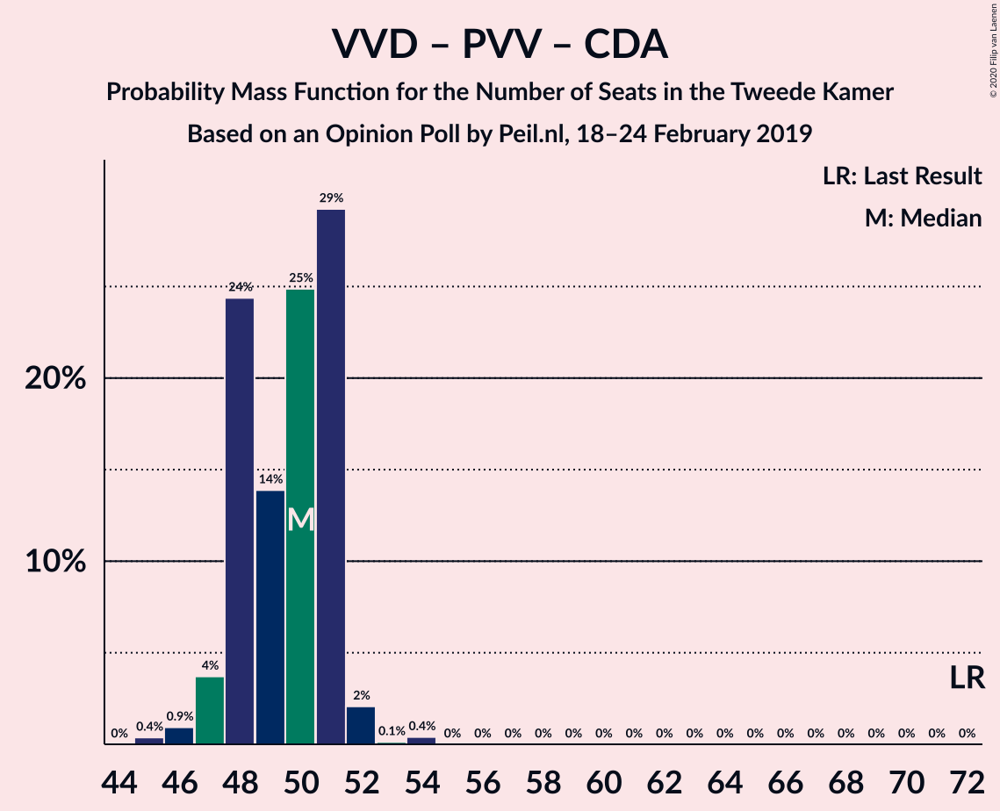

| Number of Seats | Probability | Accumulated | Special Marks |
|:---------------:|:-----------:|:-----------:|:-------------:|
| 45 | 0% | 100% |  |
| 46 | 3% | 99.9% |  |
| 47 | 4% | 97% |  |
| 48 | 2% | 93% |  |
| 49 | 45% | 91% | Median |
| 50 | 6% | 46% |  |
| 51 | 5% | 40% |  |
| 52 | 17% | 35% |  |
| 53 | 0.4% | 18% |  |
| 54 | 17% | 17% |  |
| 55 | 0% | 0% |  |
| 56 | 0% | 0% |  |
| 57 | 0% | 0% |  |
| 58 | 0% | 0% |  |
| 59 | 0% | 0% |  |
| 60 | 0% | 0% |  |
| 61 | 0% | 0% |  |
| 62 | 0% | 0% |  |
| 63 | 0% | 0% |  |
| 64 | 0% | 0% |  |
| 65 | 0% | 0% |  |
| 66 | 0% | 0% |  |
| 67 | 0% | 0% |  |
| 68 | 0% | 0% |  |
| 69 | 0% | 0% |  |
| 70 | 0% | 0% |  |
| 71 | 0% | 0% |  |
| 72 | 0% | 0% | Last Result |

### Volkspartij voor Vrijheid en Democratie – Forum voor Democratie – Christen-Democratisch Appèl

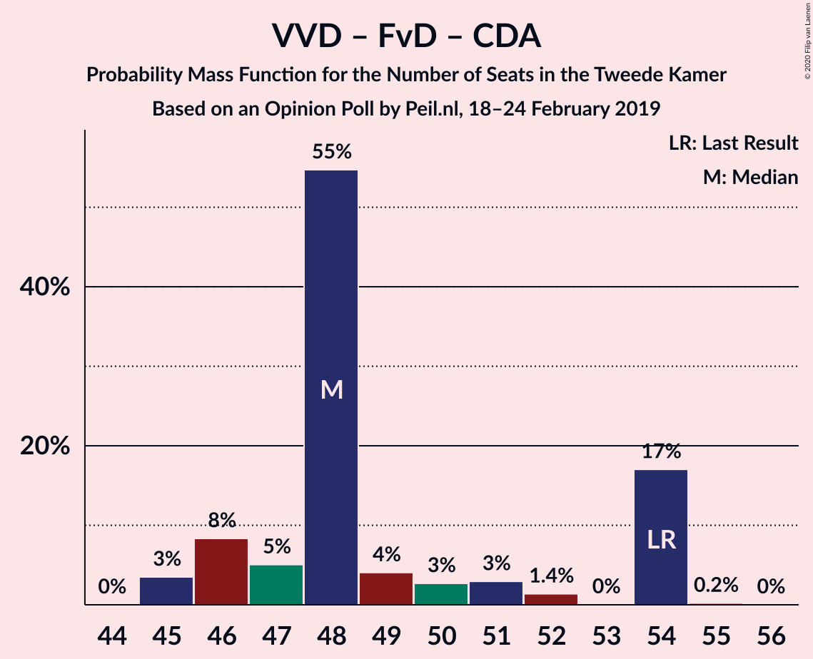

| Number of Seats | Probability | Accumulated | Special Marks |
|:---------------:|:-----------:|:-----------:|:-------------:|
| 45 | 3% | 100% |  |
| 46 | 8% | 96% |  |
| 47 | 5% | 88% |  |
| 48 | 55% | 83% | Median |
| 49 | 4% | 28% |  |
| 50 | 3% | 24% |  |
| 51 | 3% | 22% |  |
| 52 | 1.4% | 19% |  |
| 53 | 0% | 17% |  |
| 54 | 17% | 17% | Last Result |
| 55 | 0.2% | 0.2% |  |
| 56 | 0% | 0% |  |

### Volkspartij voor Vrijheid en Democratie – Christen-Democratisch Appèl – Democraten 66 – ChristenUnie

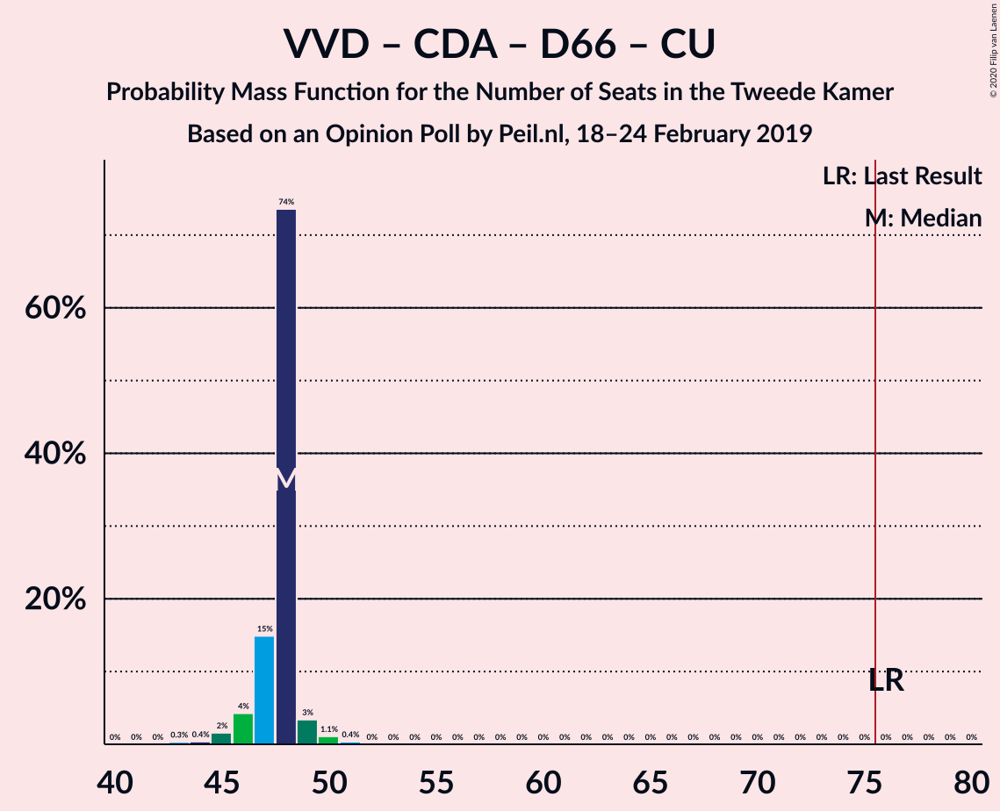

| Number of Seats | Probability | Accumulated | Special Marks |
|:---------------:|:-----------:|:-----------:|:-------------:|
| 42 | 0.1% | 100% |  |
| 43 | 38% | 99.9% |  |
| 44 | 2% | 62% |  |
| 45 | 11% | 61% | Median |
| 46 | 3% | 50% |  |
| 47 | 4% | 47% |  |
| 48 | 1.2% | 42% |  |
| 49 | 22% | 41% |  |
| 50 | 17% | 19% |  |
| 51 | 2% | 2% |  |
| 52 | 0% | 0% |  |
| 53 | 0% | 0% |  |
| 54 | 0% | 0% |  |
| 55 | 0% | 0% |  |
| 56 | 0% | 0% |  |
| 57 | 0% | 0% |  |
| 58 | 0% | 0% |  |
| 59 | 0% | 0% |  |
| 60 | 0% | 0% |  |
| 61 | 0% | 0% |  |
| 62 | 0% | 0% |  |
| 63 | 0% | 0% |  |
| 64 | 0% | 0% |  |
| 65 | 0% | 0% |  |
| 66 | 0% | 0% |  |
| 67 | 0% | 0% |  |
| 68 | 0% | 0% |  |
| 69 | 0% | 0% |  |
| 70 | 0% | 0% |  |
| 71 | 0% | 0% |  |
| 72 | 0% | 0% |  |
| 73 | 0% | 0% |  |
| 74 | 0% | 0% |  |
| 75 | 0% | 0% |  |
| 76 | 0% | 0% | Last Result, Majority |

### Volkspartij voor Vrijheid en Democratie – Partij van de Arbeid – Christen-Democratisch Appèl

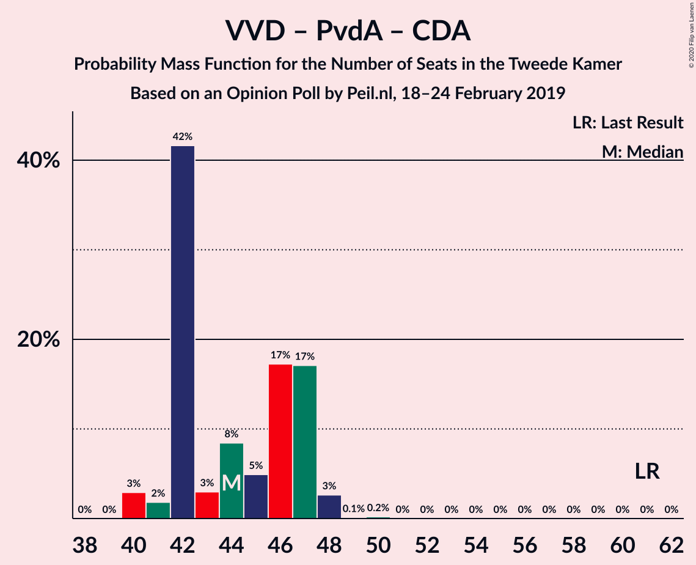

| Number of Seats | Probability | Accumulated | Special Marks |
|:---------------:|:-----------:|:-----------:|:-------------:|
| 40 | 3% | 100% |  |
| 41 | 2% | 97% |  |
| 42 | 42% | 95% | Median |
| 43 | 3% | 54% |  |
| 44 | 8% | 51% |  |
| 45 | 5% | 42% |  |
| 46 | 17% | 37% |  |
| 47 | 17% | 20% |  |
| 48 | 3% | 3% |  |
| 49 | 0.1% | 0.3% |  |
| 50 | 0.2% | 0.2% |  |
| 51 | 0% | 0% |  |
| 52 | 0% | 0% |  |
| 53 | 0% | 0% |  |
| 54 | 0% | 0% |  |
| 55 | 0% | 0% |  |
| 56 | 0% | 0% |  |
| 57 | 0% | 0% |  |
| 58 | 0% | 0% |  |
| 59 | 0% | 0% |  |
| 60 | 0% | 0% |  |
| 61 | 0% | 0% | Last Result |

### Volkspartij voor Vrijheid en Democratie – Partij van de Arbeid – Democraten 66

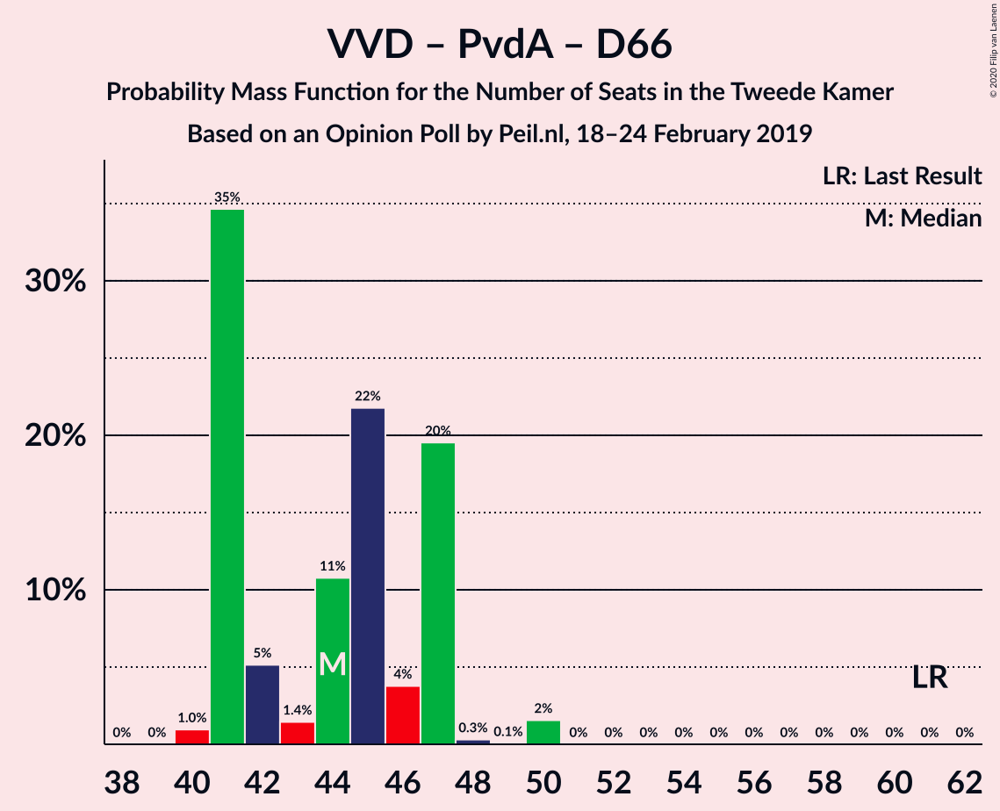

| Number of Seats | Probability | Accumulated | Special Marks |
|:---------------:|:-----------:|:-----------:|:-------------:|
| 40 | 1.0% | 100% |  |
| 41 | 35% | 99.0% |  |
| 42 | 5% | 64% |  |
| 43 | 1.4% | 59% | Median |
| 44 | 11% | 58% |  |
| 45 | 22% | 47% |  |
| 46 | 4% | 25% |  |
| 47 | 20% | 21% |  |
| 48 | 0.3% | 2% |  |
| 49 | 0.1% | 2% |  |
| 50 | 2% | 2% |  |
| 51 | 0% | 0% |  |
| 52 | 0% | 0% |  |
| 53 | 0% | 0% |  |
| 54 | 0% | 0% |  |
| 55 | 0% | 0% |  |
| 56 | 0% | 0% |  |
| 57 | 0% | 0% |  |
| 58 | 0% | 0% |  |
| 59 | 0% | 0% |  |
| 60 | 0% | 0% |  |
| 61 | 0% | 0% | Last Result |

### Volkspartij voor Vrijheid en Democratie – Christen-Democratisch Appèl – Democraten 66

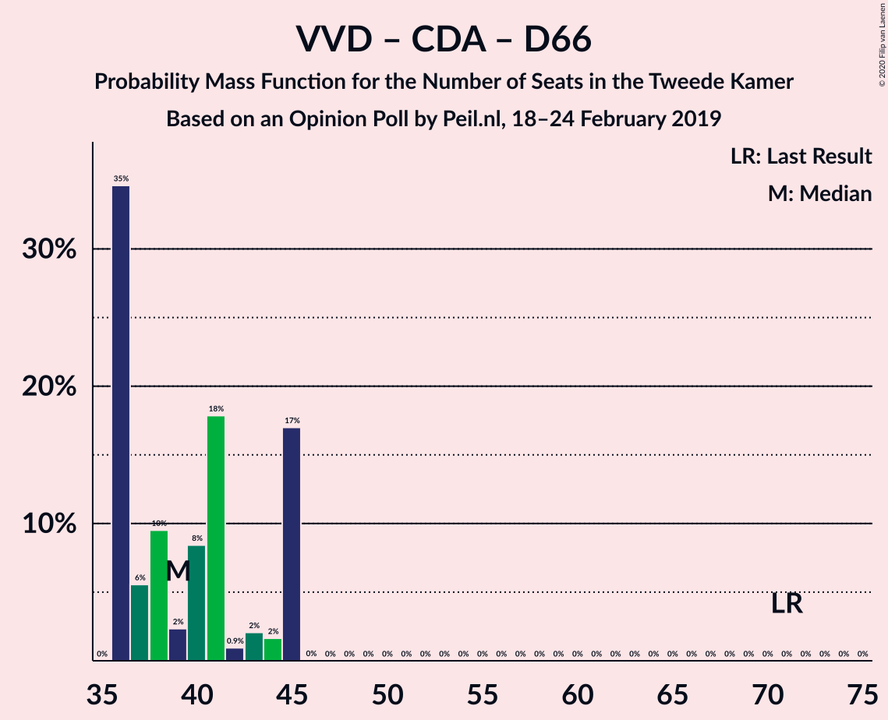

| Number of Seats | Probability | Accumulated | Special Marks |
|:---------------:|:-----------:|:-----------:|:-------------:|
| 36 | 35% | 100% |  |
| 37 | 6% | 65% |  |
| 38 | 10% | 60% | Median |
| 39 | 2% | 50% |  |
| 40 | 8% | 48% |  |
| 41 | 18% | 40% |  |
| 42 | 0.9% | 22% |  |
| 43 | 2% | 21% |  |
| 44 | 2% | 19% |  |
| 45 | 17% | 17% |  |
| 46 | 0% | 0% |  |
| 47 | 0% | 0% |  |
| 48 | 0% | 0% |  |
| 49 | 0% | 0% |  |
| 50 | 0% | 0% |  |
| 51 | 0% | 0% |  |
| 52 | 0% | 0% |  |
| 53 | 0% | 0% |  |
| 54 | 0% | 0% |  |
| 55 | 0% | 0% |  |
| 56 | 0% | 0% |  |
| 57 | 0% | 0% |  |
| 58 | 0% | 0% |  |
| 59 | 0% | 0% |  |
| 60 | 0% | 0% |  |
| 61 | 0% | 0% |  |
| 62 | 0% | 0% |  |
| 63 | 0% | 0% |  |
| 64 | 0% | 0% |  |
| 65 | 0% | 0% |  |
| 66 | 0% | 0% |  |
| 67 | 0% | 0% |  |
| 68 | 0% | 0% |  |
| 69 | 0% | 0% |  |
| 70 | 0% | 0% |  |
| 71 | 0% | 0% | Last Result |

### Volkspartij voor Vrijheid en Democratie – Partij van de Arbeid

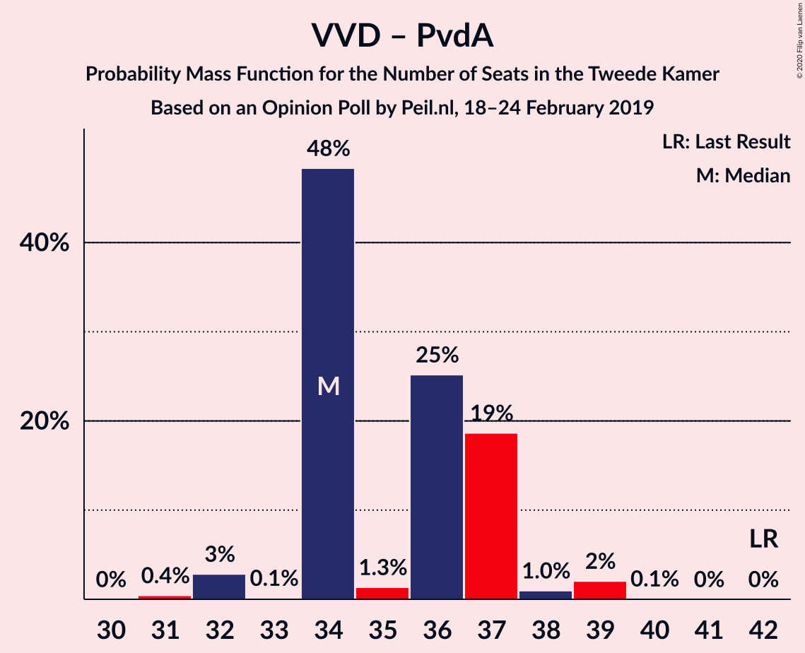

| Number of Seats | Probability | Accumulated | Special Marks |
|:---------------:|:-----------:|:-----------:|:-------------:|
| 31 | 0.4% | 100% |  |
| 32 | 3% | 99.6% |  |
| 33 | 0.1% | 97% |  |
| 34 | 48% | 97% | Median |
| 35 | 1.3% | 48% |  |
| 36 | 25% | 47% |  |
| 37 | 19% | 22% |  |
| 38 | 1.0% | 3% |  |
| 39 | 2% | 2% |  |
| 40 | 0.1% | 0.1% |  |
| 41 | 0% | 0% |  |
| 42 | 0% | 0% | Last Result |

### Partij van de Arbeid – Christen-Democratisch Appèl – Democraten 66

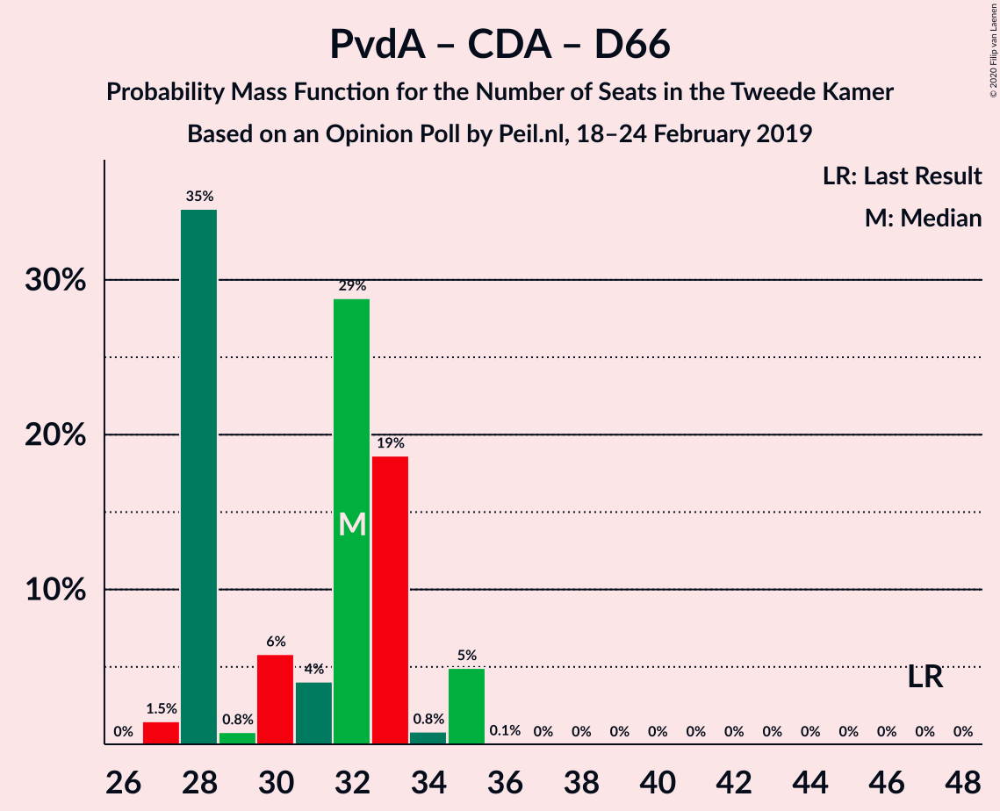

| Number of Seats | Probability | Accumulated | Special Marks |
|:---------------:|:-----------:|:-----------:|:-------------:|
| 27 | 1.5% | 100% |  |
| 28 | 35% | 98.5% |  |
| 29 | 0.8% | 64% |  |
| 30 | 6% | 63% | Median |
| 31 | 4% | 57% |  |
| 32 | 29% | 53% |  |
| 33 | 19% | 24% |  |
| 34 | 0.8% | 6% |  |
| 35 | 5% | 5% |  |
| 36 | 0.1% | 0.1% |  |
| 37 | 0% | 0% |  |
| 38 | 0% | 0% |  |
| 39 | 0% | 0% |  |
| 40 | 0% | 0% |  |
| 41 | 0% | 0% |  |
| 42 | 0% | 0% |  |
| 43 | 0% | 0% |  |
| 44 | 0% | 0% |  |
| 45 | 0% | 0% |  |
| 46 | 0% | 0% |  |
| 47 | 0% | 0% | Last Result |

### Volkspartij voor Vrijheid en Democratie – Christen-Democratisch Appèl

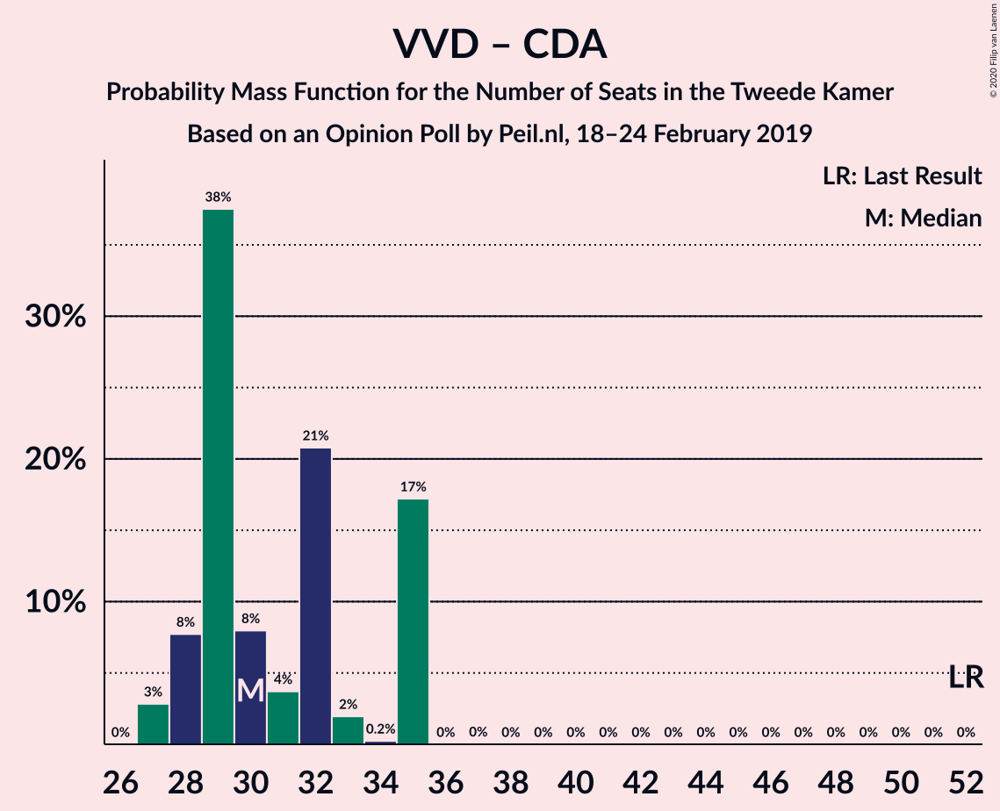

| Number of Seats | Probability | Accumulated | Special Marks |
|:---------------:|:-----------:|:-----------:|:-------------:|
| 27 | 3% | 100% |  |
| 28 | 8% | 97% |  |
| 29 | 38% | 89% | Median |
| 30 | 8% | 52% |  |
| 31 | 4% | 44% |  |
| 32 | 21% | 40% |  |
| 33 | 2% | 19% |  |
| 34 | 0.2% | 17% |  |
| 35 | 17% | 17% |  |
| 36 | 0% | 0% |  |
| 37 | 0% | 0% |  |
| 38 | 0% | 0% |  |
| 39 | 0% | 0% |  |
| 40 | 0% | 0% |  |
| 41 | 0% | 0% |  |
| 42 | 0% | 0% |  |
| 43 | 0% | 0% |  |
| 44 | 0% | 0% |  |
| 45 | 0% | 0% |  |
| 46 | 0% | 0% |  |
| 47 | 0% | 0% |  |
| 48 | 0% | 0% |  |
| 49 | 0% | 0% |  |
| 50 | 0% | 0% |  |
| 51 | 0% | 0% |  |
| 52 | 0% | 0% | Last Result |

### Partij van de Arbeid – Christen-Democratisch Appèl – ChristenUnie

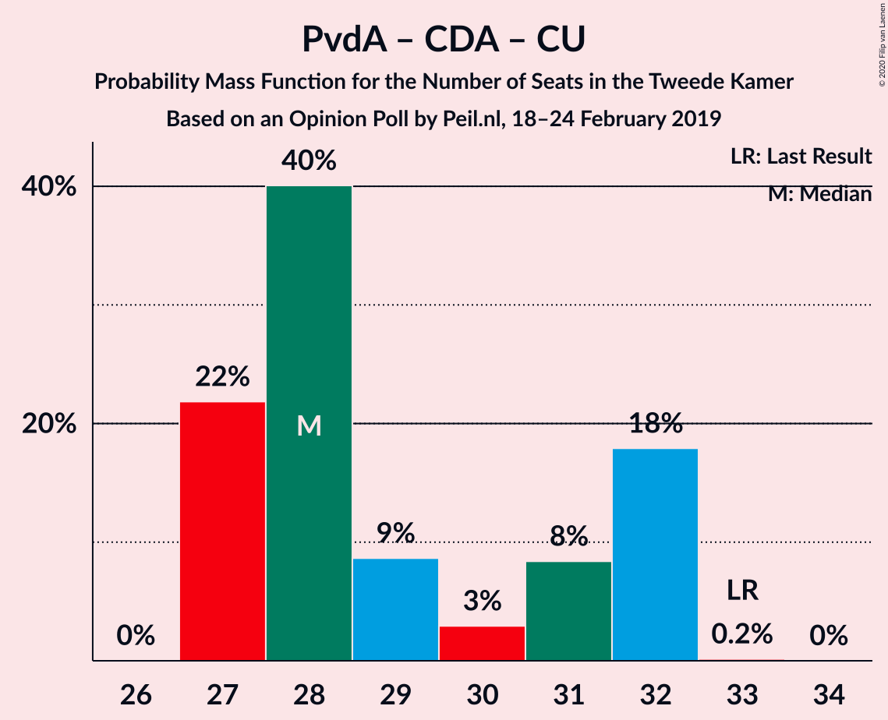

| Number of Seats | Probability | Accumulated | Special Marks |
|:---------------:|:-----------:|:-----------:|:-------------:|
| 27 | 22% | 100% |  |
| 28 | 40% | 78% | Median |
| 29 | 9% | 38% |  |
| 30 | 3% | 29% |  |
| 31 | 8% | 26% |  |
| 32 | 18% | 18% |  |
| 33 | 0.2% | 0.2% | Last Result |
| 34 | 0% | 0% |  |

### Partij van de Arbeid – Christen-Democratisch Appèl

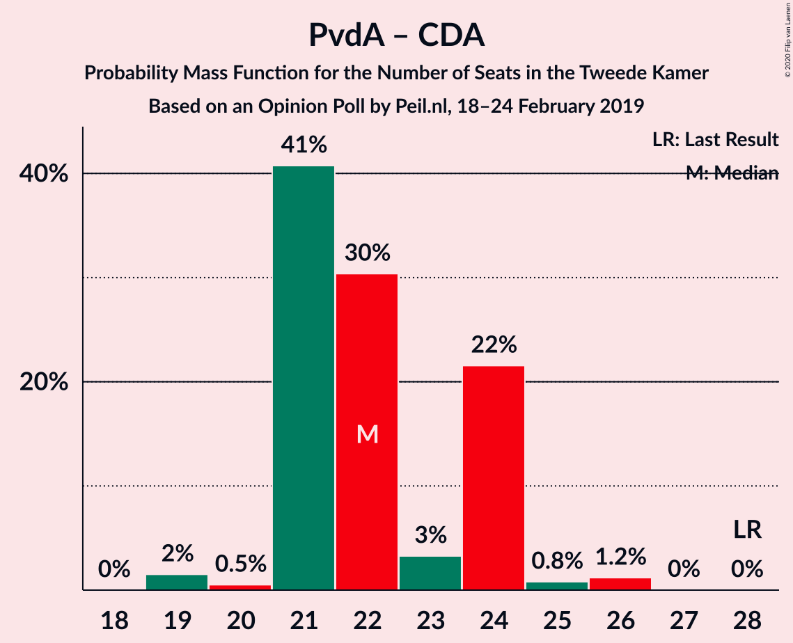

| Number of Seats | Probability | Accumulated | Special Marks |
|:---------------:|:-----------:|:-----------:|:-------------:|
| 19 | 2% | 100% |  |
| 20 | 0.5% | 98% |  |
| 21 | 41% | 98% | Median |
| 22 | 30% | 57% |  |
| 23 | 3% | 27% |  |
| 24 | 22% | 24% |  |
| 25 | 0.8% | 2% |  |
| 26 | 1.2% | 1.2% |  |
| 27 | 0% | 0% |  |
| 28 | 0% | 0% | Last Result |

### Christen-Democratisch Appèl – Democraten 66

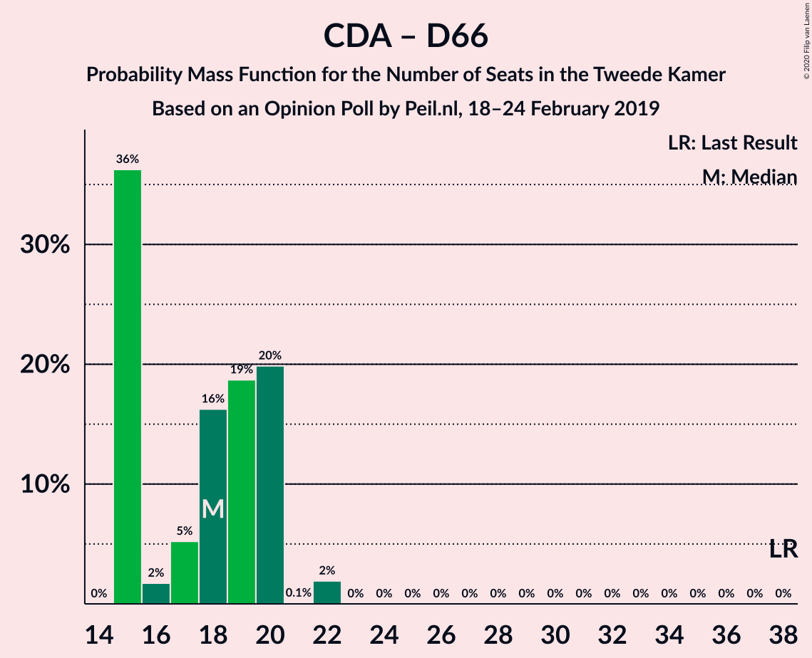

| Number of Seats | Probability | Accumulated | Special Marks |
|:---------------:|:-----------:|:-----------:|:-------------:|
| 15 | 36% | 100% |  |
| 16 | 2% | 64% |  |
| 17 | 5% | 62% | Median |
| 18 | 16% | 57% |  |
| 19 | 19% | 41% |  |
| 20 | 20% | 22% |  |
| 21 | 0.1% | 2% |  |
| 22 | 2% | 2% |  |
| 23 | 0% | 0% |  |
| 24 | 0% | 0% |  |
| 25 | 0% | 0% |  |
| 26 | 0% | 0% |  |
| 27 | 0% | 0% |  |
| 28 | 0% | 0% |  |
| 29 | 0% | 0% |  |
| 30 | 0% | 0% |  |
| 31 | 0% | 0% |  |
| 32 | 0% | 0% |  |
| 33 | 0% | 0% |  |
| 34 | 0% | 0% |  |
| 35 | 0% | 0% |  |
| 36 | 0% | 0% |  |
| 37 | 0% | 0% |  |
| 38 | 0% | 0% | Last Result |

## Technical Information

### Opinion Poll

+ **Polling firm:** Peil.nl
+ **Commissioner(s):** —
+ **Fieldwork period:** 18–24 February 2019

### Calculations

+ **Sample size:** 3000
+ **Simulations done:** 131,072
+ **Error estimate:** 1.97%

