# Opinion Poll by I&O Research, 22–26 February 2019

<a href="#voting-intentions">Voting Intentions</a> | <a href="#seats">Seats</a> | <a href="#coalitions">Coalitions</a> | <a href="#technical-information">Technical Information</a>

## Voting Intentions

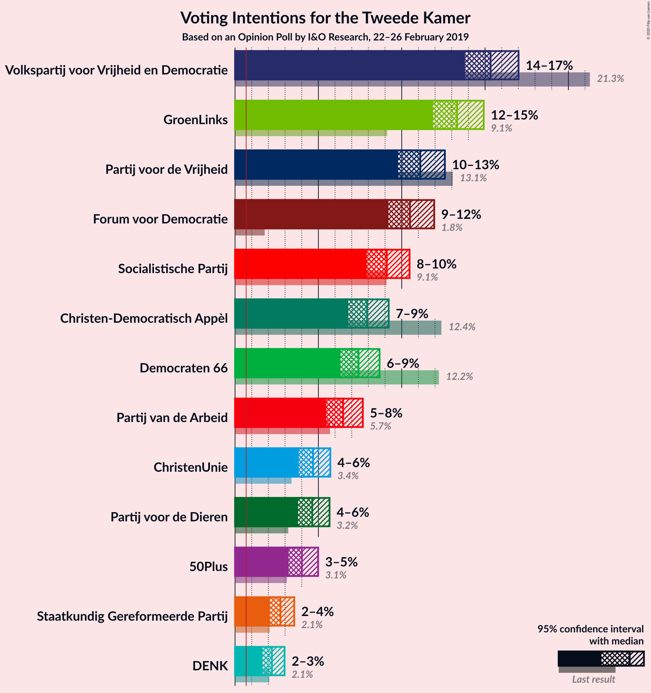

### Confidence Intervals

| Party | Last Result | Poll Result | 80% Confidence Interval | 90% Confidence Interval | 95% Confidence Interval | 99% Confidence Interval |
|:-----:|:-----------:|:-----------:|:-----------------------:|:-----------------------:|:-----------------------:|:-----------------------:|
| Volkspartij voor Vrijheid en Democratie | 21.3% | 15.3% | 14.3–16.4% |14.0–16.7% |13.8–17.0% |13.3–17.5% |
| GroenLinks | 9.1% | 13.3% | 12.4–14.4% |12.1–14.7% |11.9–14.9% |11.4–15.4% |
| Partij voor de Vrijheid | 13.1% | 11.1% | 10.2–12.1% |10.0–12.4% |9.8–12.6% |9.4–13.1% |
| Forum voor Democratie | 1.8% | 10.5% | 9.6–11.4% |9.4–11.7% |9.2–11.9% |8.8–12.4% |
| Socialistische Partij | 9.1% | 9.1% | 8.3–10.0% |8.1–10.3% |7.9–10.5% |7.5–10.9% |
| Christen-Democratisch Appèl | 12.4% | 7.9% | 7.2–8.8% |7.0–9.0% |6.8–9.2% |6.5–9.6% |
| Democraten 66 | 12.2% | 7.4% | 6.7–8.2% |6.5–8.5% |6.3–8.7% |6.0–9.1% |
| Partij van de Arbeid | 5.7% | 6.5% | 5.8–7.3% |5.6–7.5% |5.5–7.7% |5.2–8.1% |
| ChristenUnie | 3.4% | 4.7% | 4.1–5.4% |4.0–5.5% |3.8–5.7% |3.6–6.1% |
| Partij voor de Dieren | 3.2% | 4.6% | 4.1–5.3% |3.9–5.5% |3.8–5.7% |3.5–6.0% |
| 50Plus | 3.1% | 4.0% | 3.5–4.6% |3.3–4.8% |3.2–5.0% |3.0–5.3% |
| Staatkundig Gereformeerde Partij | 2.1% | 2.7% | 2.3–3.3% |2.2–3.4% |2.1–3.6% |1.9–3.8% |
| DENK | 2.1% | 2.2% | 1.8–2.7% |1.7–2.9% |1.6–3.0% |1.5–3.2% |

*Note:* The poll result column reflects the actual value used in the calculations. Published results may vary slightly, and in addition be rounded to fewer digits.

## Seats

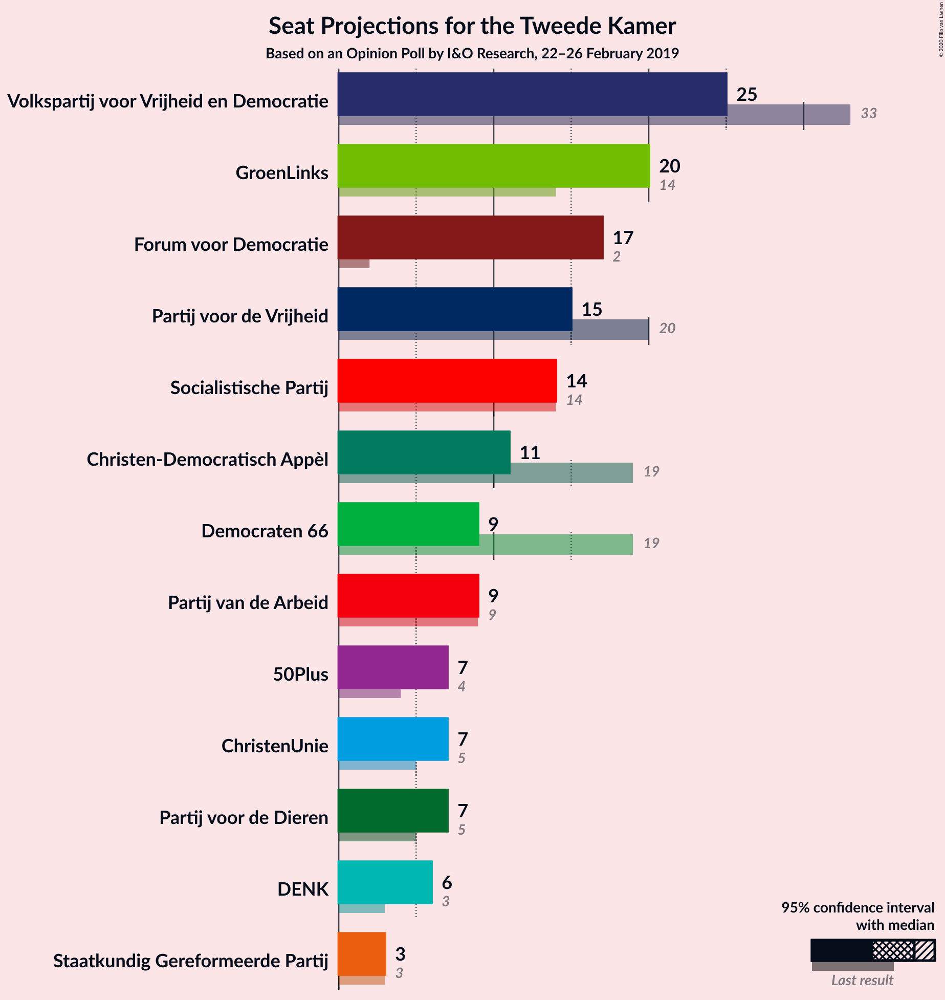

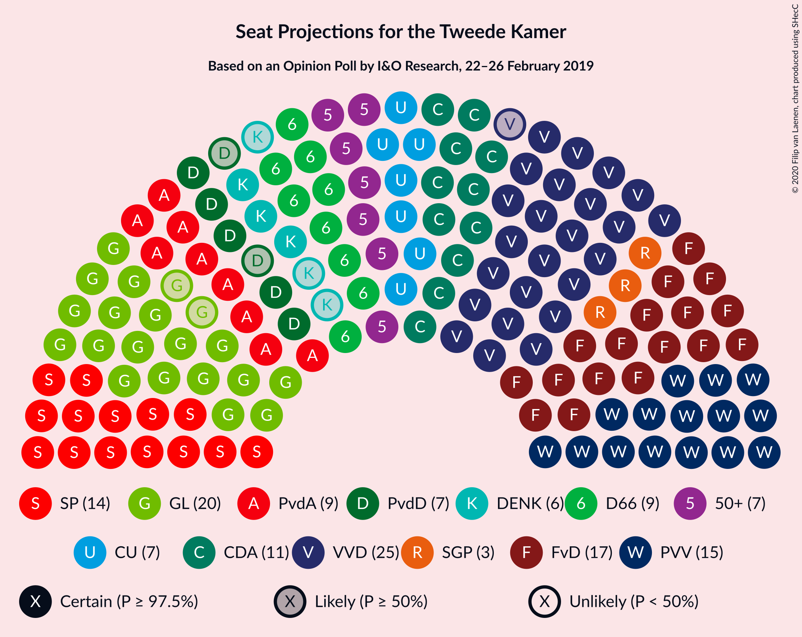

### Confidence Intervals

| Party | Last Result | Median | 80% Confidence Interval | 90% Confidence Interval | 95% Confidence Interval | 99% Confidence Interval |
|:-----:|:-----------:|:------:|:-----------------------:|:-----------------------:|:-----------------------:|:-----------------------:|
| <a href="#volkspartij-voor-vrijheid-en-democratie">Volkspartij voor Vrijheid en Democratie</a> | 33 | 24 | 22–24 |22–25 |22–26 |20–26 |
| <a href="#groenlinks">GroenLinks</a> | 14 | 19 | 19–21 |19–22 |19–22 |19–23 |
| <a href="#partij-voor-de-vrijheid">Partij voor de Vrijheid</a> | 20 | 17 | 16–18 |16–18 |16–18 |15–19 |
| <a href="#forum-voor-democratie">Forum voor Democratie</a> | 2 | 17 | 15–18 |14–18 |14–18 |14–18 |
| <a href="#socialistische-partij">Socialistische Partij</a> | 14 | 13 | 11–13 |11–13 |11–14 |11–15 |
| <a href="#christen-democratisch-appèl">Christen-Democratisch Appèl</a> | 19 | 12 | 11–12 |11–13 |10–13 |10–14 |
| <a href="#democraten-66">Democraten 66</a> | 19 | 11 | 11 |9–11 |9–12 |9–13 |
| <a href="#partij-van-de-arbeid">Partij van de Arbeid</a> | 9 | 9 | 9–11 |9–11 |9–11 |8–12 |
| <a href="#christenunie">ChristenUnie</a> | 5 | 7 | 7 |6–8 |6–9 |6–9 |
| <a href="#partij-voor-de-dieren">Partij voor de Dieren</a> | 5 | 7 | 7–8 |6–8 |6–8 |5–9 |
| <a href="#50plus">50Plus</a> | 4 | 6 | 6–7 |5–7 |5–7 |4–7 |
| <a href="#staatkundig-gereformeerde-partij">Staatkundig Gereformeerde Partij</a> | 3 | 4 | 4–5 |3–5 |3–5 |3–5 |
| <a href="#denk">DENK</a> | 3 | 3 | 3 |3–4 |3–4 |2–4 |

### Volkspartij voor Vrijheid en Democratie

*For a full overview of the results for this party, see the [Volkspartij voor Vrijheid en Democratie](party-volkspartijvoorvrijheidendemocratie.html) page.*

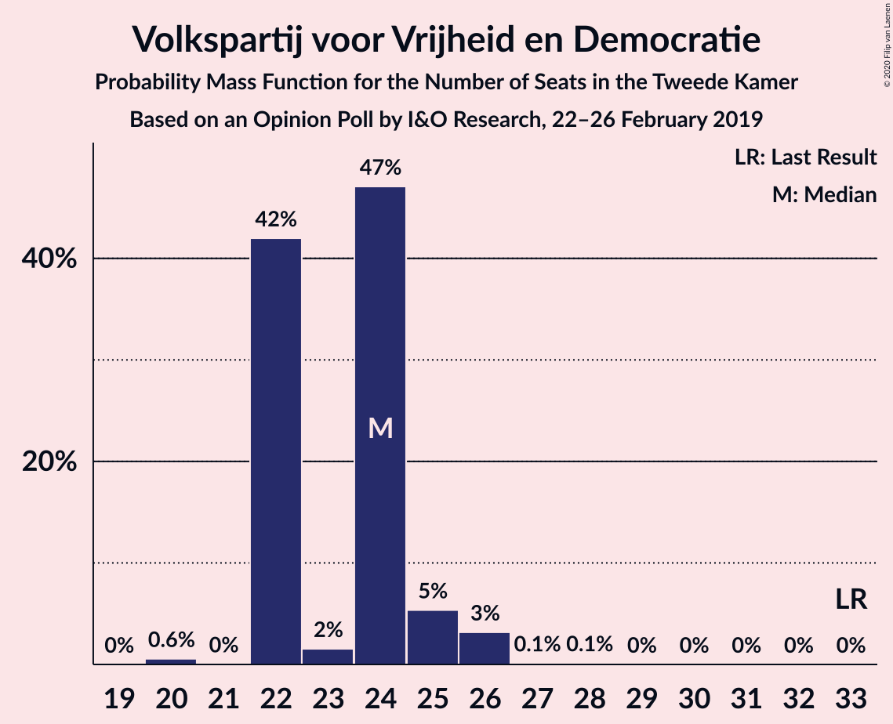

| Number of Seats | Probability | Accumulated | Special Marks |
|:---------------:|:-----------:|:-----------:|:-------------:|
| 20 | 0.6% | 100% |  |
| 21 | 0% | 99.4% |  |
| 22 | 42% | 99.4% |  |
| 23 | 2% | 57% |  |
| 24 | 47% | 56% | Median |
| 25 | 5% | 9% |  |
| 26 | 3% | 3% |  |
| 27 | 0.1% | 0.3% |  |
| 28 | 0.1% | 0.1% |  |
| 29 | 0% | 0% |  |
| 30 | 0% | 0% |  |
| 31 | 0% | 0% |  |
| 32 | 0% | 0% |  |
| 33 | 0% | 0% | Last Result |

### GroenLinks

*For a full overview of the results for this party, see the [GroenLinks](party-groenlinks.html) page.*

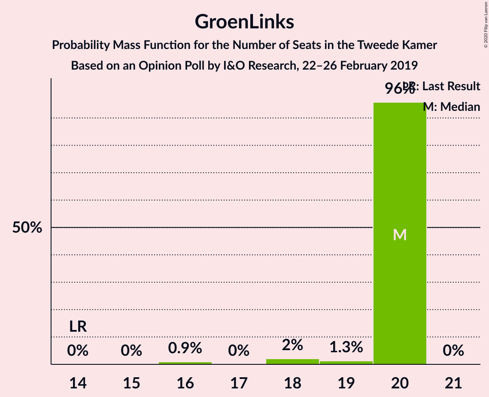

| Number of Seats | Probability | Accumulated | Special Marks |
|:---------------:|:-----------:|:-----------:|:-------------:|
| 14 | 0% | 100% | Last Result |
| 15 | 0% | 100% |  |
| 16 | 0% | 100% |  |
| 17 | 0% | 100% |  |
| 18 | 0.2% | 99.9% |  |
| 19 | 85% | 99.7% | Median |
| 20 | 0.7% | 14% |  |
| 21 | 4% | 14% |  |
| 22 | 8% | 10% |  |
| 23 | 0.9% | 1.1% |  |
| 24 | 0.2% | 0.2% |  |
| 25 | 0% | 0% |  |

### Partij voor de Vrijheid

*For a full overview of the results for this party, see the [Partij voor de Vrijheid](party-partijvoordevrijheid.html) page.*

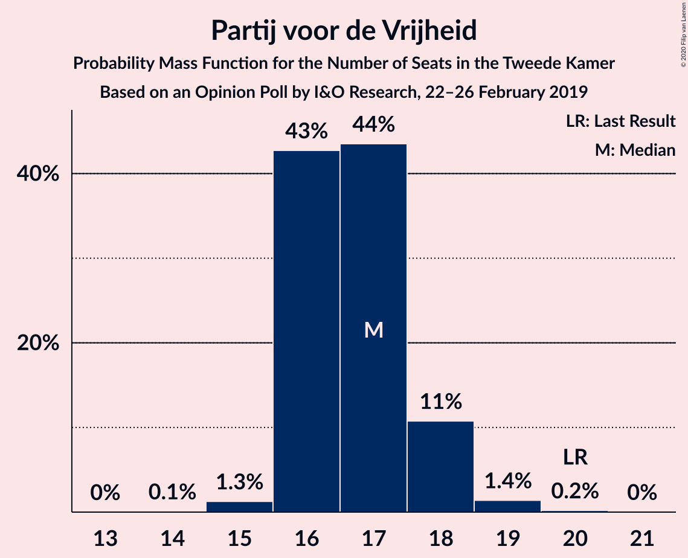

| Number of Seats | Probability | Accumulated | Special Marks |
|:---------------:|:-----------:|:-----------:|:-------------:|
| 14 | 0.1% | 100% |  |
| 15 | 1.3% | 99.9% |  |
| 16 | 43% | 98.6% |  |
| 17 | 44% | 56% | Median |
| 18 | 11% | 12% |  |
| 19 | 1.4% | 2% |  |
| 20 | 0.2% | 0.2% | Last Result |
| 21 | 0% | 0% |  |

### Forum voor Democratie

*For a full overview of the results for this party, see the [Forum voor Democratie](party-forumvoordemocratie.html) page.*

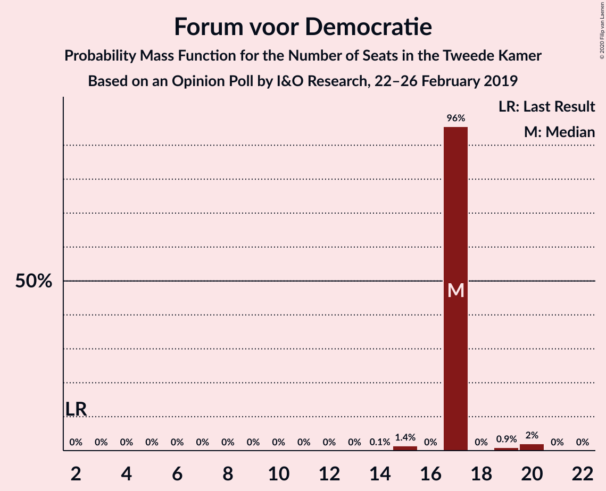

| Number of Seats | Probability | Accumulated | Special Marks |
|:---------------:|:-----------:|:-----------:|:-------------:|
| 2 | 0% | 100% | Last Result |
| 3 | 0% | 100% |  |
| 4 | 0% | 100% |  |
| 5 | 0% | 100% |  |
| 6 | 0% | 100% |  |
| 7 | 0% | 100% |  |
| 8 | 0% | 100% |  |
| 9 | 0% | 100% |  |
| 10 | 0% | 100% |  |
| 11 | 0% | 100% |  |
| 12 | 0% | 100% |  |
| 13 | 0.3% | 100% |  |
| 14 | 5% | 99.7% |  |
| 15 | 6% | 94% |  |
| 16 | 2% | 89% |  |
| 17 | 45% | 87% | Median |
| 18 | 42% | 42% |  |
| 19 | 0% | 0% |  |

### Socialistische Partij

*For a full overview of the results for this party, see the [Socialistische Partij](party-socialistischepartij.html) page.*

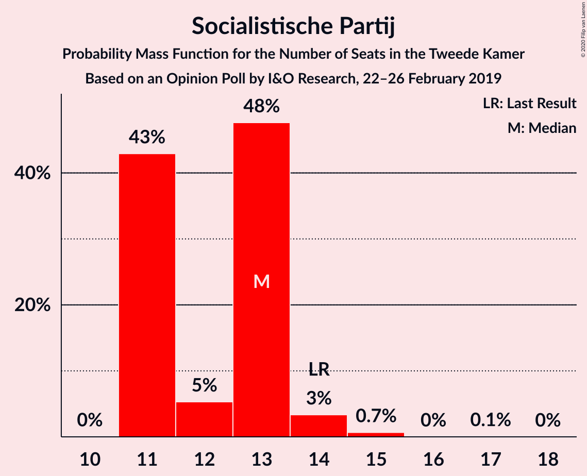

| Number of Seats | Probability | Accumulated | Special Marks |
|:---------------:|:-----------:|:-----------:|:-------------:|
| 11 | 43% | 100% |  |
| 12 | 5% | 57% |  |
| 13 | 48% | 52% | Median |
| 14 | 3% | 4% | Last Result |
| 15 | 0.7% | 0.8% |  |
| 16 | 0% | 0.1% |  |
| 17 | 0.1% | 0.1% |  |
| 18 | 0% | 0% |  |

### Christen-Democratisch Appèl

*For a full overview of the results for this party, see the [Christen-Democratisch Appèl](party-christen-democratischappèl.html) page.*

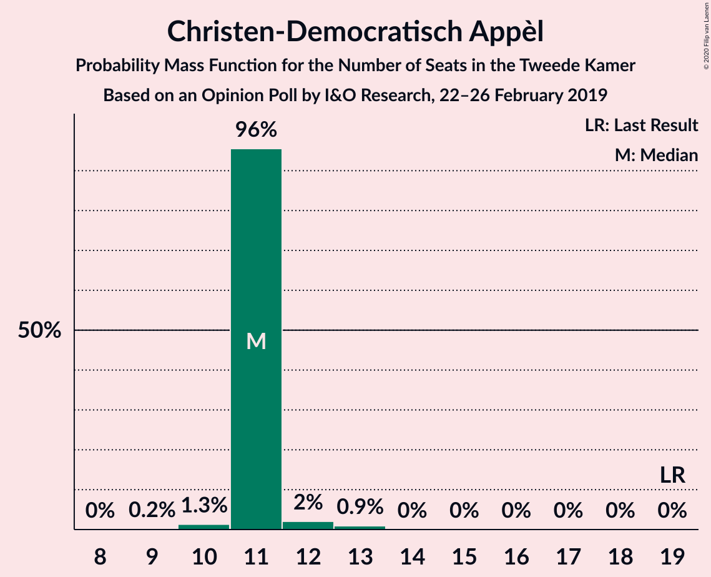

| Number of Seats | Probability | Accumulated | Special Marks |
|:---------------:|:-----------:|:-----------:|:-------------:|
| 10 | 3% | 100% |  |
| 11 | 43% | 96% |  |
| 12 | 45% | 53% | Median |
| 13 | 7% | 9% |  |
| 14 | 2% | 2% |  |
| 15 | 0.1% | 0.1% |  |
| 16 | 0% | 0% |  |
| 17 | 0% | 0% |  |
| 18 | 0% | 0% |  |
| 19 | 0% | 0% | Last Result |

### Democraten 66

*For a full overview of the results for this party, see the [Democraten 66](party-democraten66.html) page.*

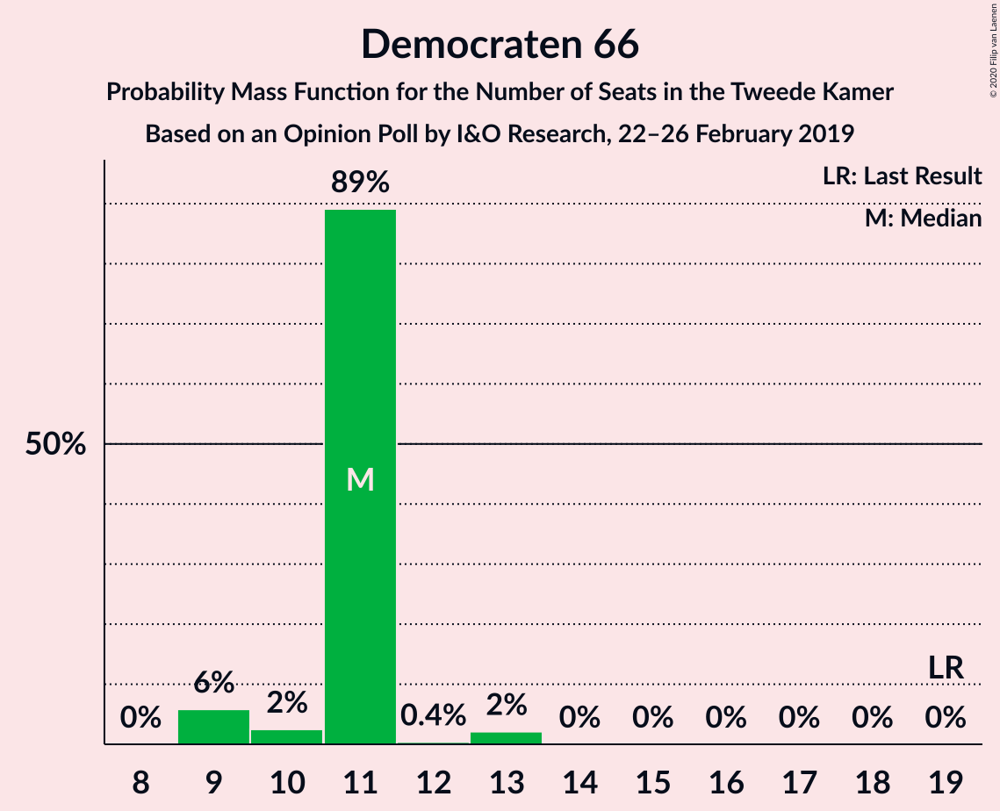

| Number of Seats | Probability | Accumulated | Special Marks |
|:---------------:|:-----------:|:-----------:|:-------------:|
| 9 | 6% | 100% |  |
| 10 | 2% | 94% |  |
| 11 | 89% | 92% | Median |
| 12 | 0.4% | 3% |  |
| 13 | 2% | 2% |  |
| 14 | 0% | 0.1% |  |
| 15 | 0% | 0% |  |
| 16 | 0% | 0% |  |
| 17 | 0% | 0% |  |
| 18 | 0% | 0% |  |
| 19 | 0% | 0% | Last Result |

### Partij van de Arbeid

*For a full overview of the results for this party, see the [Partij van de Arbeid](party-partijvandearbeid.html) page.*

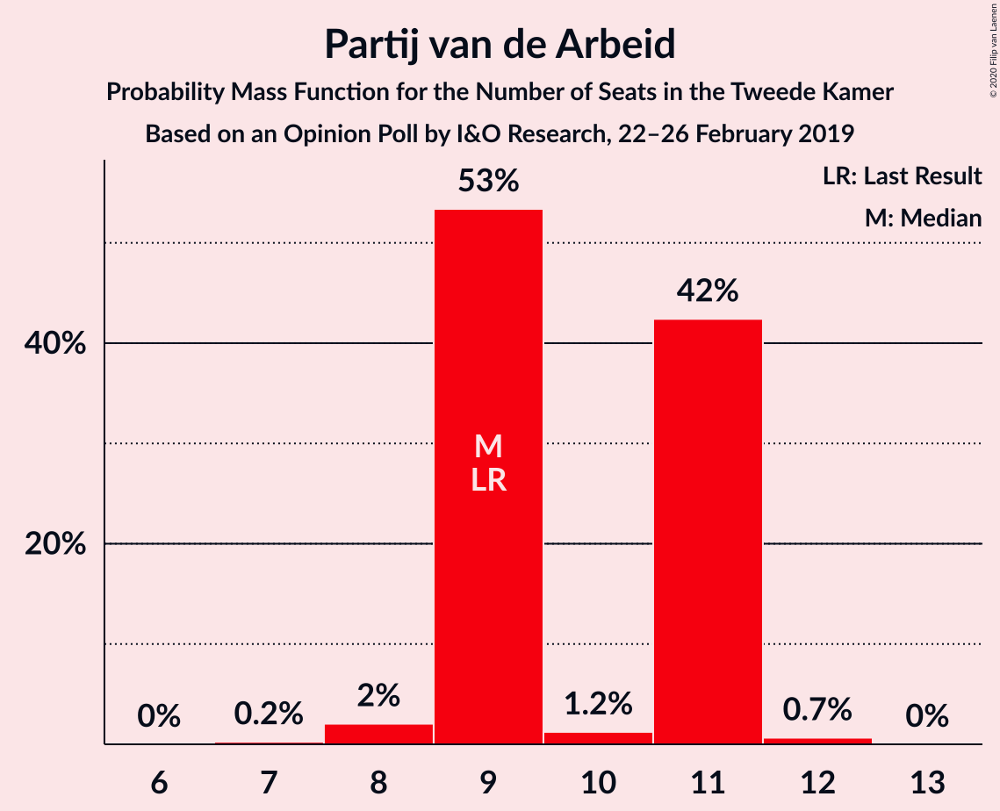

| Number of Seats | Probability | Accumulated | Special Marks |
|:---------------:|:-----------:|:-----------:|:-------------:|
| 7 | 0.2% | 100% |  |
| 8 | 2% | 99.8% |  |
| 9 | 53% | 98% | Last Result, Median |
| 10 | 1.2% | 44% |  |
| 11 | 42% | 43% |  |
| 12 | 0.7% | 0.7% |  |
| 13 | 0% | 0% |  |

### ChristenUnie

*For a full overview of the results for this party, see the [ChristenUnie](party-christenunie.html) page.*

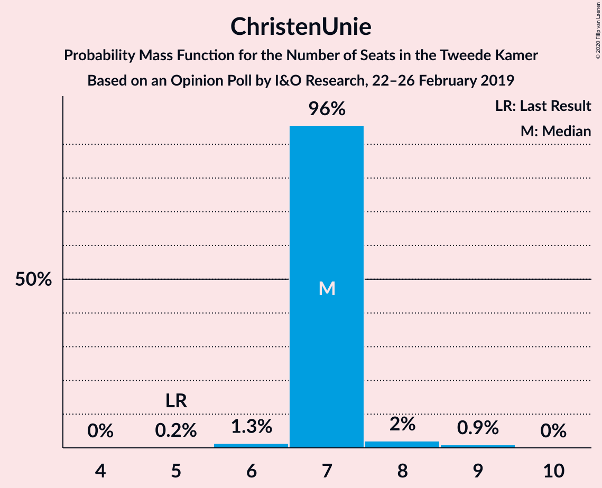

| Number of Seats | Probability | Accumulated | Special Marks |
|:---------------:|:-----------:|:-----------:|:-------------:|
| 5 | 0.1% | 100% | Last Result |
| 6 | 6% | 99.9% |  |
| 7 | 88% | 94% | Median |
| 8 | 0.9% | 6% |  |
| 9 | 5% | 5% |  |
| 10 | 0% | 0% |  |

### Partij voor de Dieren

*For a full overview of the results for this party, see the [Partij voor de Dieren](party-partijvoordedieren.html) page.*

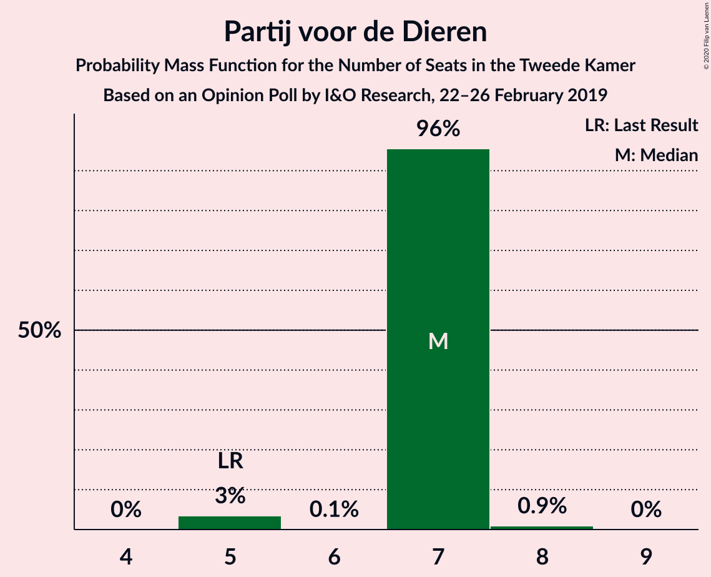

| Number of Seats | Probability | Accumulated | Special Marks |
|:---------------:|:-----------:|:-----------:|:-------------:|
| 5 | 1.2% | 100% | Last Result |
| 6 | 9% | 98.8% |  |
| 7 | 47% | 90% | Median |
| 8 | 42% | 43% |  |
| 9 | 0.6% | 0.9% |  |
| 10 | 0.4% | 0.4% |  |
| 11 | 0% | 0% |  |

### 50Plus

*For a full overview of the results for this party, see the [50Plus](party-50plus.html) page.*

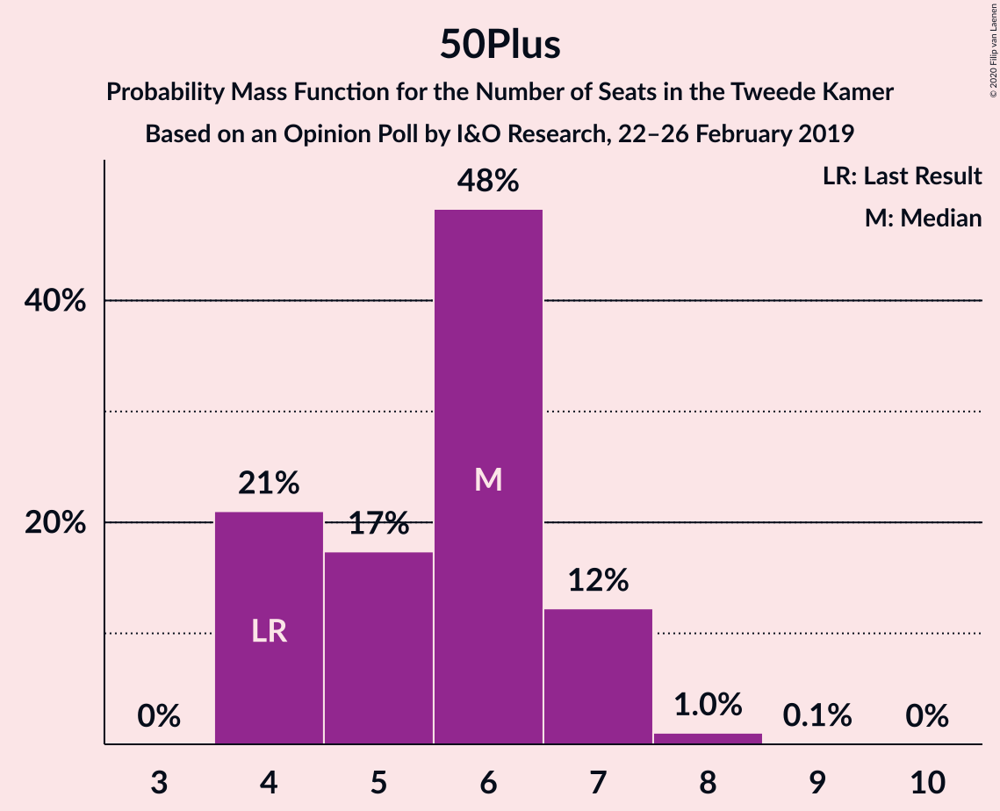

| Number of Seats | Probability | Accumulated | Special Marks |
|:---------------:|:-----------:|:-----------:|:-------------:|
| 4 | 2% | 100% | Last Result |
| 5 | 7% | 98% |  |
| 6 | 48% | 91% | Median |
| 7 | 43% | 43% |  |
| 8 | 0.1% | 0.1% |  |
| 9 | 0% | 0% |  |

### Staatkundig Gereformeerde Partij

*For a full overview of the results for this party, see the [Staatkundig Gereformeerde Partij](party-staatkundiggereformeerdepartij.html) page.*

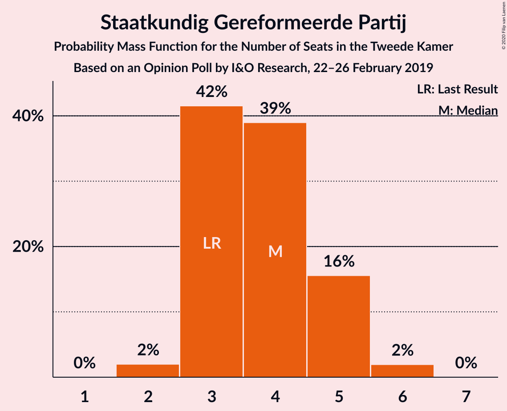

| Number of Seats | Probability | Accumulated | Special Marks |
|:---------------:|:-----------:|:-----------:|:-------------:|
| 3 | 7% | 100% | Last Result |
| 4 | 45% | 93% | Median |
| 5 | 47% | 47% |  |
| 6 | 0.5% | 0.5% |  |
| 7 | 0% | 0% |  |

### DENK

*For a full overview of the results for this party, see the [DENK](party-denk.html) page.*

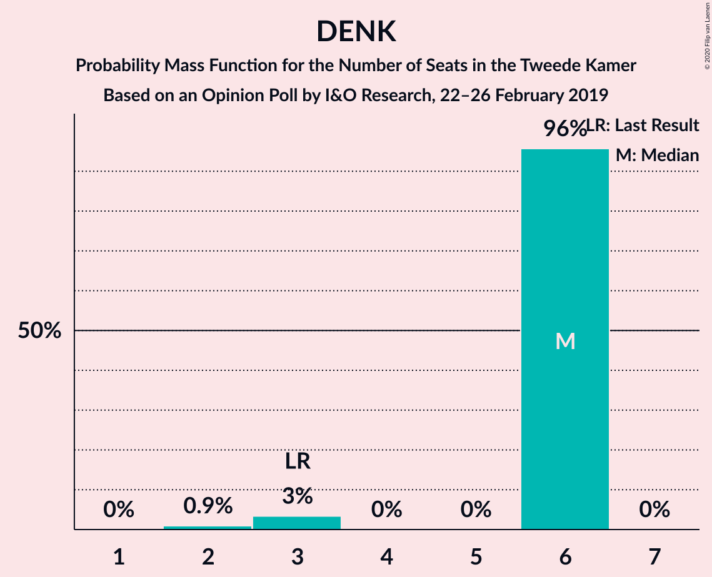

| Number of Seats | Probability | Accumulated | Special Marks |
|:---------------:|:-----------:|:-----------:|:-------------:|
| 2 | 1.0% | 100% |  |
| 3 | 93% | 99.0% | Last Result, Median |
| 4 | 6% | 6% |  |
| 5 | 0.1% | 0.2% |  |
| 6 | 0.1% | 0.1% |  |
| 7 | 0% | 0% |  |

## Coalitions

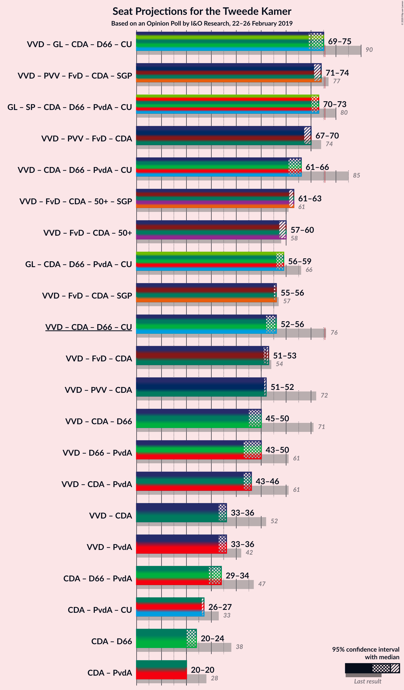

### Confidence Intervals

| Coalition | Last Result | Median | Majority? | 80% Confidence Interval | 90% Confidence Interval | 95% Confidence Interval | 99% Confidence Interval |
|:---------:|:-----------:|:------:|:---------:|:-----------------------:|:-----------------------:|:-----------------------:|:-----------------------:|
| Volkspartij voor Vrijheid en Democratie – GroenLinks – Christen-Democratisch Appèl – Democraten 66 – ChristenUnie | 90 | 73 | 8% | 70–75 | 70–78 | 70–78 | 70–78 |
| Volkspartij voor Vrijheid en Democratie – Partij voor de Vrijheid – Forum voor Democratie – Christen-Democratisch Appèl – Staatkundig Gereformeerde Partij | 77 | 73 | 2% | 71–75 | 71–75 | 71–75 | 69–76 |
| GroenLinks – Socialistische Partij – Christen-Democratisch Appèl – Democraten 66 – Partij van de Arbeid – ChristenUnie | 80 | 72 | 0.7% | 69–73 | 69–75 | 69–75 | 69–77 |
| Volkspartij voor Vrijheid en Democratie – Partij voor de Vrijheid – Forum voor Democratie – Christen-Democratisch Appèl | 74 | 70 | 0% | 67–70 | 67–70 | 67–70 | 66–73 |
| Volkspartij voor Vrijheid en Democratie – Christen-Democratisch Appèl – Democraten 66 – Partij van de Arbeid – ChristenUnie | 85 | 63 | 0% | 62–63 | 62–65 | 61–66 | 60–66 |
| Volkspartij voor Vrijheid en Democratie – Forum voor Democratie – Christen-Democratisch Appèl – 50Plus – Staatkundig Gereformeerde Partij | 61 | 61 | 0% | 61–65 | 61–65 | 60–65 | 59–65 |
| GroenLinks – Christen-Democratisch Appèl – Democraten 66 – Partij van de Arbeid – ChristenUnie | 66 | 59 | 0% | 58–59 | 58–62 | 58–62 | 57–63 |
| Volkspartij voor Vrijheid en Democratie – Forum voor Democratie – Christen-Democratisch Appèl – 50Plus | 58 | 58 | 0% | 57–60 | 56–60 | 56–60 | 55–60 |
| Volkspartij voor Vrijheid en Democratie – Forum voor Democratie – Christen-Democratisch Appèl – Staatkundig Gereformeerde Partij | 57 | 56 | 0% | 55–58 | 55–58 | 55–58 | 54–58 |
| Volkspartij voor Vrijheid en Democratie – Christen-Democratisch Appèl – Democraten 66 – ChristenUnie | 76 | 54 | 0% | 51–54 | 51–56 | 51–56 | 50–57 |
| Volkspartij voor Vrijheid en Democratie – Partij voor de Vrijheid – Christen-Democratisch Appèl | 72 | 53 | 0% | 49–54 | 49–56 | 49–56 | 49–56 |
| Volkspartij voor Vrijheid en Democratie – Forum voor Democratie – Christen-Democratisch Appèl | 54 | 52 | 0% | 51–53 | 51–53 | 51–53 | 50–54 |
| Volkspartij voor Vrijheid en Democratie – Christen-Democratisch Appèl – Democraten 66 | 71 | 47 | 0% | 44–47 | 44–47 | 44–48 | 44–50 |
| Volkspartij voor Vrijheid en Democratie – Christen-Democratisch Appèl – Partij van de Arbeid | 61 | 45 | 0% | 44–45 | 44–47 | 44–47 | 43–48 |
| Volkspartij voor Vrijheid en Democratie – Democraten 66 – Partij van de Arbeid | 61 | 44 | 0% | 44 | 43–46 | 42–46 | 41–47 |
| Volkspartij voor Vrijheid en Democratie – Christen-Democratisch Appèl | 52 | 36 | 0% | 33–36 | 33–38 | 33–38 | 33–38 |
| Volkspartij voor Vrijheid en Democratie – Partij van de Arbeid | 42 | 33 | 0% | 33–34 | 33–34 | 32–35 | 30–36 |
| Christen-Democratisch Appèl – Democraten 66 – Partij van de Arbeid | 47 | 32 | 0% | 31–33 | 31–33 | 30–35 | 30–35 |
| Christen-Democratisch Appèl – Partij van de Arbeid – ChristenUnie | 33 | 29 | 0% | 28–29 | 28–31 | 25–31 | 25–31 |
| Christen-Democratisch Appèl – Democraten 66 | 38 | 22 | 0% | 22–23 | 22–23 | 21–25 | 20–26 |
| Christen-Democratisch Appèl – Partij van de Arbeid | 28 | 22 | 0% | 21–22 | 21–22 | 19–22 | 19–24 |

### Volkspartij voor Vrijheid en Democratie – GroenLinks – Christen-Democratisch Appèl – Democraten 66 – ChristenUnie

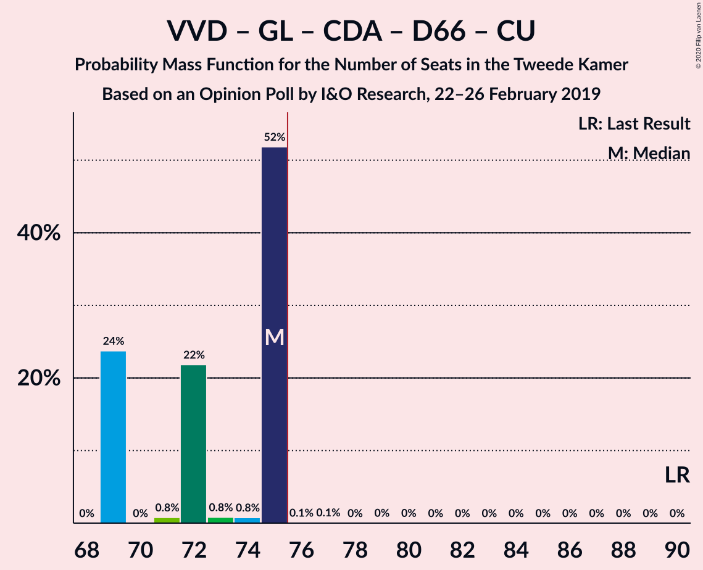

| Number of Seats | Probability | Accumulated | Special Marks |
|:---------------:|:-----------:|:-----------:|:-------------:|
| 70 | 42% | 100% |  |
| 71 | 0.2% | 58% |  |
| 72 | 0.7% | 57% |  |
| 73 | 44% | 57% | Median |
| 74 | 1.2% | 13% |  |
| 75 | 3% | 12% |  |
| 76 | 0.6% | 8% | Majority |
| 77 | 0.9% | 8% |  |
| 78 | 7% | 7% |  |
| 79 | 0% | 0% |  |
| 80 | 0% | 0% |  |
| 81 | 0% | 0% |  |
| 82 | 0% | 0% |  |
| 83 | 0% | 0% |  |
| 84 | 0% | 0% |  |
| 85 | 0% | 0% |  |
| 86 | 0% | 0% |  |
| 87 | 0% | 0% |  |
| 88 | 0% | 0% |  |
| 89 | 0% | 0% |  |
| 90 | 0% | 0% | Last Result |

### Volkspartij voor Vrijheid en Democratie – Partij voor de Vrijheid – Forum voor Democratie – Christen-Democratisch Appèl – Staatkundig Gereformeerde Partij

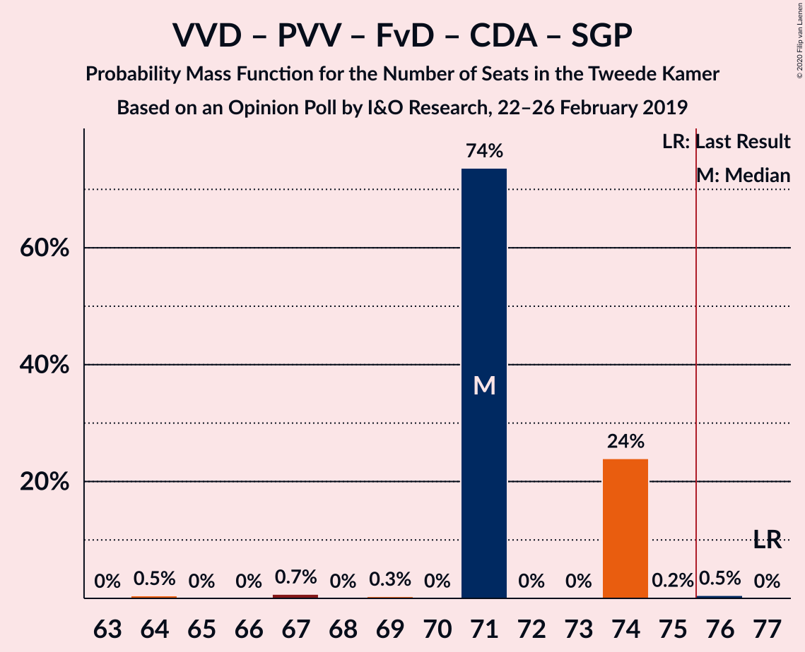

| Number of Seats | Probability | Accumulated | Special Marks |
|:---------------:|:-----------:|:-----------:|:-------------:|
| 68 | 0.1% | 100% |  |
| 69 | 0.5% | 99.8% |  |
| 70 | 0.1% | 99.3% |  |
| 71 | 43% | 99.3% |  |
| 72 | 1.3% | 57% |  |
| 73 | 5% | 55% |  |
| 74 | 5% | 50% | Median |
| 75 | 43% | 45% |  |
| 76 | 1.4% | 2% | Majority |
| 77 | 0.1% | 0.1% | Last Result |
| 78 | 0% | 0% |  |

### GroenLinks – Socialistische Partij – Christen-Democratisch Appèl – Democraten 66 – Partij van de Arbeid – ChristenUnie

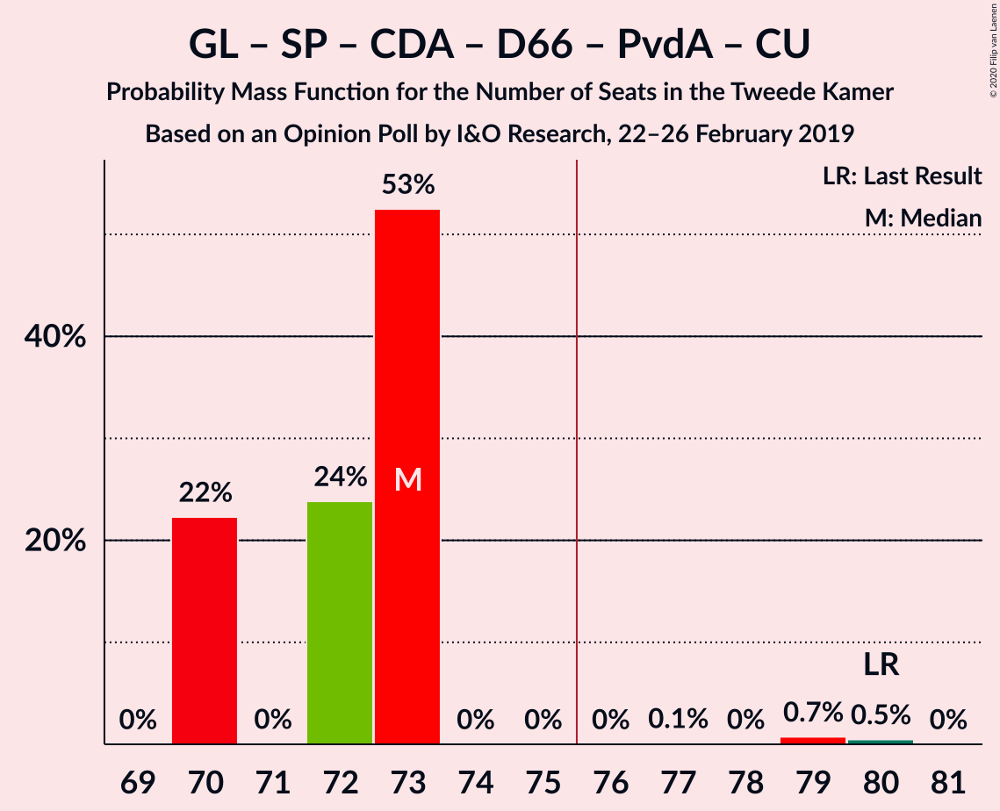

| Number of Seats | Probability | Accumulated | Special Marks |
|:---------------:|:-----------:|:-----------:|:-------------:|
| 68 | 0% | 100% |  |
| 69 | 43% | 99.9% |  |
| 70 | 3% | 57% |  |
| 71 | 0.3% | 54% | Median |
| 72 | 42% | 53% |  |
| 73 | 2% | 11% |  |
| 74 | 0.2% | 9% |  |
| 75 | 8% | 9% |  |
| 76 | 0% | 0.7% | Majority |
| 77 | 0.3% | 0.6% |  |
| 78 | 0.3% | 0.3% |  |
| 79 | 0% | 0% |  |
| 80 | 0% | 0% | Last Result |

### Volkspartij voor Vrijheid en Democratie – Partij voor de Vrijheid – Forum voor Democratie – Christen-Democratisch Appèl

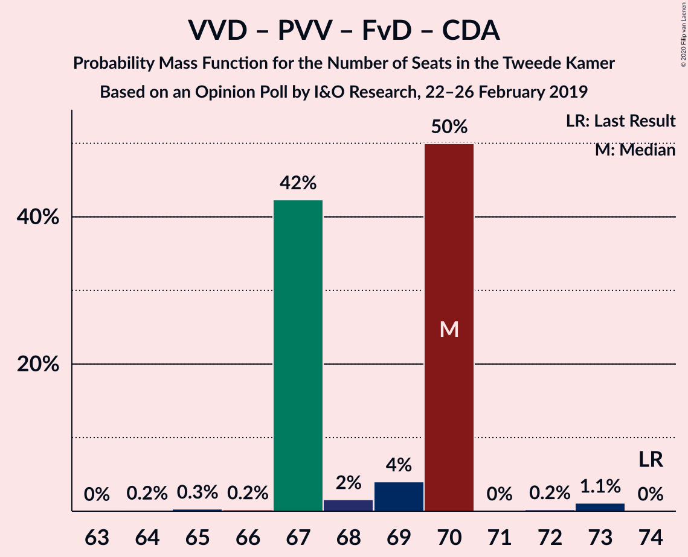

| Number of Seats | Probability | Accumulated | Special Marks |
|:---------------:|:-----------:|:-----------:|:-------------:|
| 64 | 0.2% | 100% |  |
| 65 | 0.3% | 99.8% |  |
| 66 | 0.2% | 99.5% |  |
| 67 | 42% | 99.3% |  |
| 68 | 2% | 57% |  |
| 69 | 4% | 55% |  |
| 70 | 50% | 51% | Median |
| 71 | 0% | 1.4% |  |
| 72 | 0.2% | 1.4% |  |
| 73 | 1.1% | 1.1% |  |
| 74 | 0% | 0% | Last Result |

### Volkspartij voor Vrijheid en Democratie – Christen-Democratisch Appèl – Democraten 66 – Partij van de Arbeid – ChristenUnie

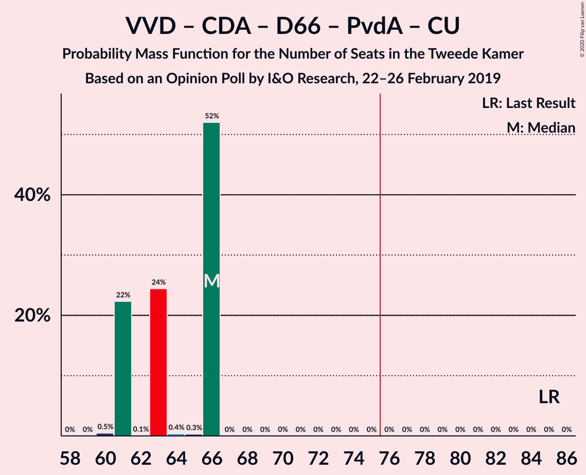

| Number of Seats | Probability | Accumulated | Special Marks |
|:---------------:|:-----------:|:-----------:|:-------------:|
| 59 | 0.2% | 100% |  |
| 60 | 1.0% | 99.8% |  |
| 61 | 1.4% | 98.8% |  |
| 62 | 46% | 97% |  |
| 63 | 43% | 51% | Median |
| 64 | 0.4% | 8% |  |
| 65 | 5% | 8% |  |
| 66 | 3% | 3% |  |
| 67 | 0.1% | 0.2% |  |
| 68 | 0% | 0.2% |  |
| 69 | 0.1% | 0.1% |  |
| 70 | 0% | 0% |  |
| 71 | 0% | 0% |  |
| 72 | 0% | 0% |  |
| 73 | 0% | 0% |  |
| 74 | 0% | 0% |  |
| 75 | 0% | 0% |  |
| 76 | 0% | 0% | Majority |
| 77 | 0% | 0% |  |
| 78 | 0% | 0% |  |
| 79 | 0% | 0% |  |
| 80 | 0% | 0% |  |
| 81 | 0% | 0% |  |
| 82 | 0% | 0% |  |
| 83 | 0% | 0% |  |
| 84 | 0% | 0% |  |
| 85 | 0% | 0% | Last Result |

### Volkspartij voor Vrijheid en Democratie – Forum voor Democratie – Christen-Democratisch Appèl – 50Plus – Staatkundig Gereformeerde Partij

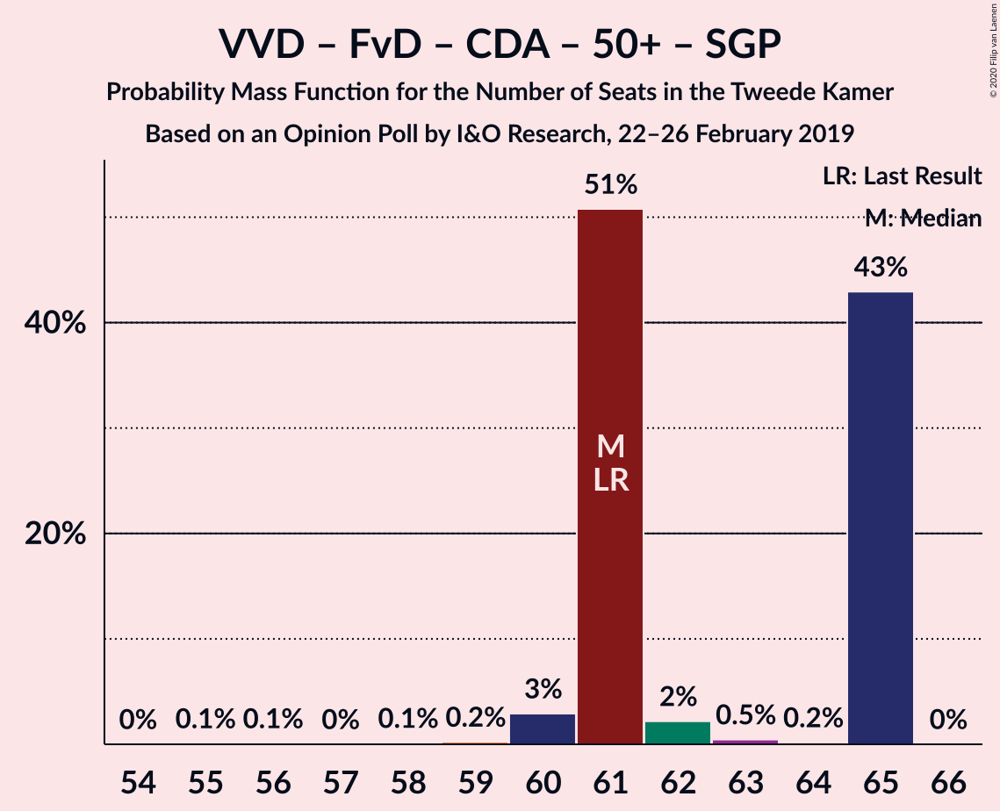

| Number of Seats | Probability | Accumulated | Special Marks |
|:---------------:|:-----------:|:-----------:|:-------------:|
| 55 | 0.1% | 100% |  |
| 56 | 0.1% | 99.9% |  |
| 57 | 0% | 99.8% |  |
| 58 | 0.1% | 99.8% |  |
| 59 | 0.2% | 99.7% |  |
| 60 | 3% | 99.5% |  |
| 61 | 51% | 97% | Last Result |
| 62 | 2% | 46% |  |
| 63 | 0.5% | 44% | Median |
| 64 | 0.2% | 43% |  |
| 65 | 43% | 43% |  |
| 66 | 0% | 0% |  |

### GroenLinks – Christen-Democratisch Appèl – Democraten 66 – Partij van de Arbeid – ChristenUnie

| Number of Seats | Probability | Accumulated | Special Marks |
|:---------------:|:-----------:|:-----------:|:-------------:|
| 56 | 0.4% | 100% |  |
| 57 | 0.3% | 99.6% |  |
| 58 | 46% | 99.3% | Median |
| 59 | 44% | 53% |  |
| 60 | 0.6% | 9% |  |
| 61 | 1.4% | 9% |  |
| 62 | 5% | 7% |  |
| 63 | 2% | 2% |  |
| 64 | 0.1% | 0.3% |  |
| 65 | 0.1% | 0.1% |  |
| 66 | 0% | 0% | Last Result |

### Volkspartij voor Vrijheid en Democratie – Forum voor Democratie – Christen-Democratisch Appèl – 50Plus

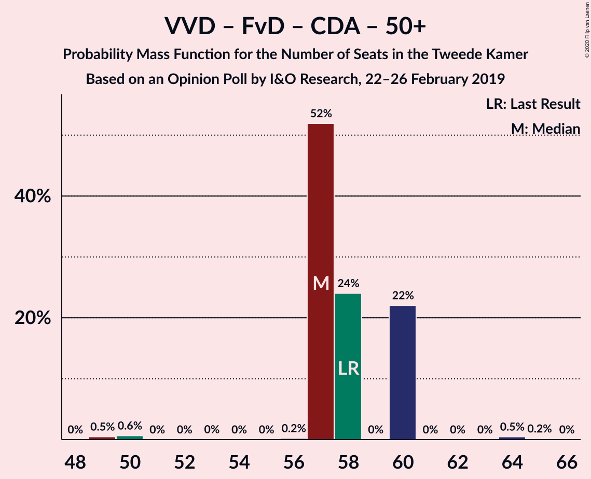

| Number of Seats | Probability | Accumulated | Special Marks |
|:---------------:|:-----------:|:-----------:|:-------------:|
| 51 | 0.1% | 100% |  |
| 52 | 0% | 99.9% |  |
| 53 | 0.1% | 99.9% |  |
| 54 | 0.2% | 99.8% |  |
| 55 | 0.2% | 99.6% |  |
| 56 | 6% | 99.4% |  |
| 57 | 43% | 93% |  |
| 58 | 6% | 51% | Last Result |
| 59 | 1.4% | 44% | Median |
| 60 | 43% | 43% |  |
| 61 | 0% | 0% |  |

### Volkspartij voor Vrijheid en Democratie – Forum voor Democratie – Christen-Democratisch Appèl – Staatkundig Gereformeerde Partij

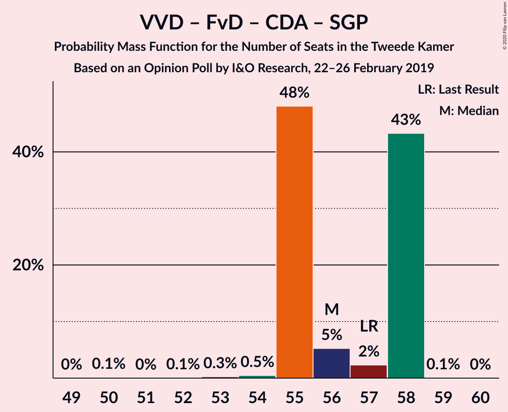

| Number of Seats | Probability | Accumulated | Special Marks |
|:---------------:|:-----------:|:-----------:|:-------------:|
| 50 | 0.1% | 100% |  |
| 51 | 0% | 99.8% |  |
| 52 | 0.1% | 99.8% |  |
| 53 | 0.3% | 99.8% |  |
| 54 | 0.5% | 99.5% |  |
| 55 | 48% | 99.0% |  |
| 56 | 5% | 51% |  |
| 57 | 2% | 46% | Last Result, Median |
| 58 | 43% | 43% |  |
| 59 | 0.1% | 0.1% |  |
| 60 | 0% | 0% |  |

### Volkspartij voor Vrijheid en Democratie – Christen-Democratisch Appèl – Democraten 66 – ChristenUnie

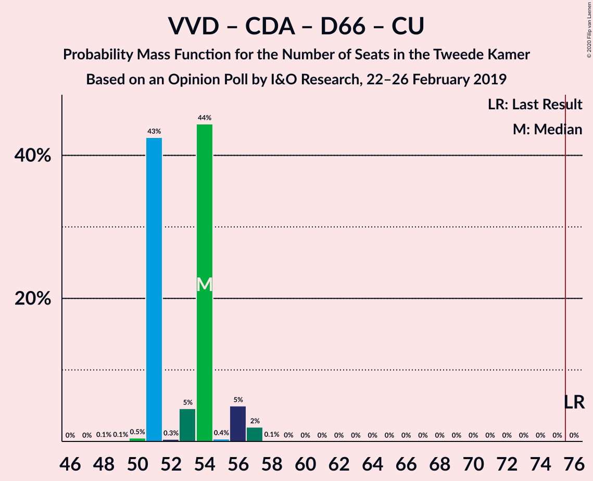

| Number of Seats | Probability | Accumulated | Special Marks |
|:---------------:|:-----------:|:-----------:|:-------------:|
| 48 | 0.1% | 100% |  |
| 49 | 0.1% | 99.9% |  |
| 50 | 0.5% | 99.8% |  |
| 51 | 43% | 99.3% |  |
| 52 | 0.3% | 57% |  |
| 53 | 5% | 56% |  |
| 54 | 44% | 52% | Median |
| 55 | 0.4% | 7% |  |
| 56 | 5% | 7% |  |
| 57 | 2% | 2% |  |
| 58 | 0.1% | 0.2% |  |
| 59 | 0% | 0% |  |
| 60 | 0% | 0% |  |
| 61 | 0% | 0% |  |
| 62 | 0% | 0% |  |
| 63 | 0% | 0% |  |
| 64 | 0% | 0% |  |
| 65 | 0% | 0% |  |
| 66 | 0% | 0% |  |
| 67 | 0% | 0% |  |
| 68 | 0% | 0% |  |
| 69 | 0% | 0% |  |
| 70 | 0% | 0% |  |
| 71 | 0% | 0% |  |
| 72 | 0% | 0% |  |
| 73 | 0% | 0% |  |
| 74 | 0% | 0% |  |
| 75 | 0% | 0% |  |
| 76 | 0% | 0% | Last Result, Majority |

### Volkspartij voor Vrijheid en Democratie – Partij voor de Vrijheid – Christen-Democratisch Appèl

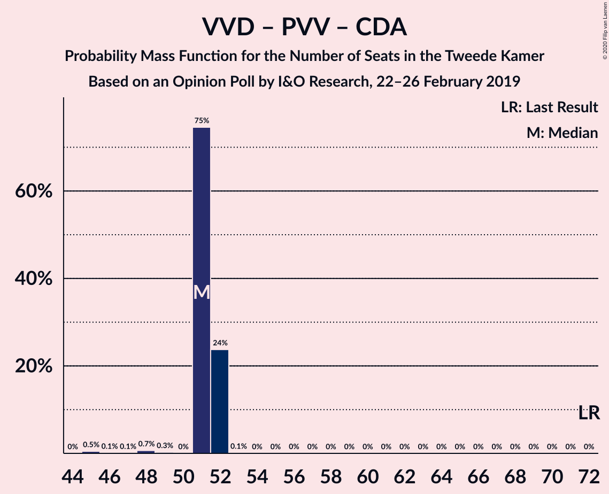

| Number of Seats | Probability | Accumulated | Special Marks |
|:---------------:|:-----------:|:-----------:|:-------------:|
| 49 | 42% | 100% |  |
| 50 | 0.7% | 58% |  |
| 51 | 0.9% | 57% |  |
| 52 | 1.1% | 56% |  |
| 53 | 43% | 55% | Median |
| 54 | 3% | 12% |  |
| 55 | 3% | 9% |  |
| 56 | 6% | 6% |  |
| 57 | 0.2% | 0.2% |  |
| 58 | 0% | 0% |  |
| 59 | 0% | 0% |  |
| 60 | 0% | 0% |  |
| 61 | 0% | 0% |  |
| 62 | 0% | 0% |  |
| 63 | 0% | 0% |  |
| 64 | 0% | 0% |  |
| 65 | 0% | 0% |  |
| 66 | 0% | 0% |  |
| 67 | 0% | 0% |  |
| 68 | 0% | 0% |  |
| 69 | 0% | 0% |  |
| 70 | 0% | 0% |  |
| 71 | 0% | 0% |  |
| 72 | 0% | 0% | Last Result |

### Volkspartij voor Vrijheid en Democratie – Forum voor Democratie – Christen-Democratisch Appèl

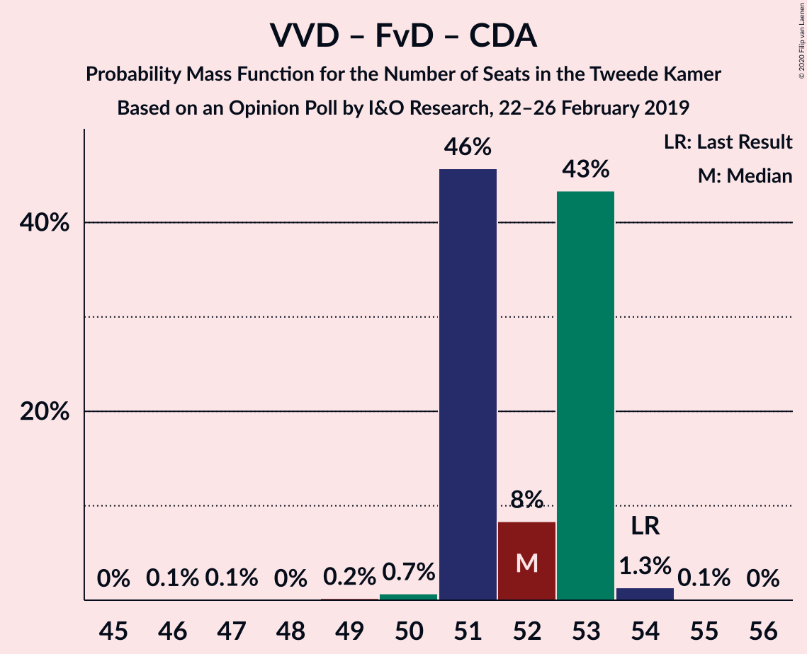

| Number of Seats | Probability | Accumulated | Special Marks |
|:---------------:|:-----------:|:-----------:|:-------------:|
| 46 | 0.1% | 100% |  |
| 47 | 0.1% | 99.9% |  |
| 48 | 0% | 99.8% |  |
| 49 | 0.2% | 99.8% |  |
| 50 | 0.7% | 99.6% |  |
| 51 | 46% | 98.9% |  |
| 52 | 8% | 53% |  |
| 53 | 43% | 45% | Median |
| 54 | 1.3% | 1.5% | Last Result |
| 55 | 0.1% | 0.1% |  |
| 56 | 0% | 0% |  |

### Volkspartij voor Vrijheid en Democratie – Christen-Democratisch Appèl – Democraten 66

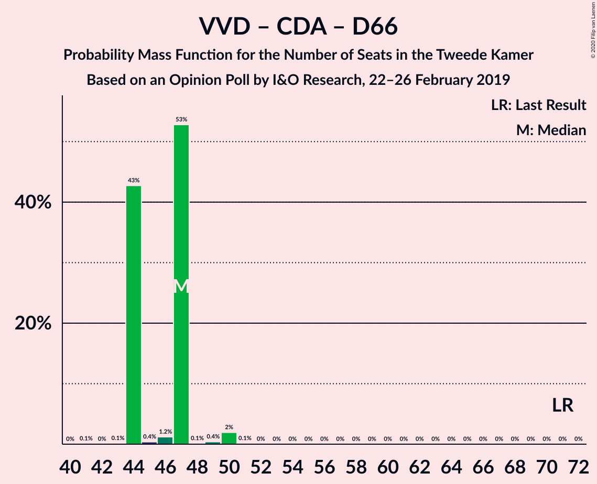

| Number of Seats | Probability | Accumulated | Special Marks |
|:---------------:|:-----------:|:-----------:|:-------------:|
| 41 | 0.1% | 100% |  |
| 42 | 0% | 99.9% |  |
| 43 | 0.1% | 99.9% |  |
| 44 | 43% | 99.7% |  |
| 45 | 0.4% | 57% |  |
| 46 | 1.2% | 57% |  |
| 47 | 53% | 55% | Median |
| 48 | 0.1% | 3% |  |
| 49 | 0.4% | 2% |  |
| 50 | 2% | 2% |  |
| 51 | 0.1% | 0.2% |  |
| 52 | 0% | 0% |  |
| 53 | 0% | 0% |  |
| 54 | 0% | 0% |  |
| 55 | 0% | 0% |  |
| 56 | 0% | 0% |  |
| 57 | 0% | 0% |  |
| 58 | 0% | 0% |  |
| 59 | 0% | 0% |  |
| 60 | 0% | 0% |  |
| 61 | 0% | 0% |  |
| 62 | 0% | 0% |  |
| 63 | 0% | 0% |  |
| 64 | 0% | 0% |  |
| 65 | 0% | 0% |  |
| 66 | 0% | 0% |  |
| 67 | 0% | 0% |  |
| 68 | 0% | 0% |  |
| 69 | 0% | 0% |  |
| 70 | 0% | 0% |  |
| 71 | 0% | 0% | Last Result |

### Volkspartij voor Vrijheid en Democratie – Christen-Democratisch Appèl – Partij van de Arbeid

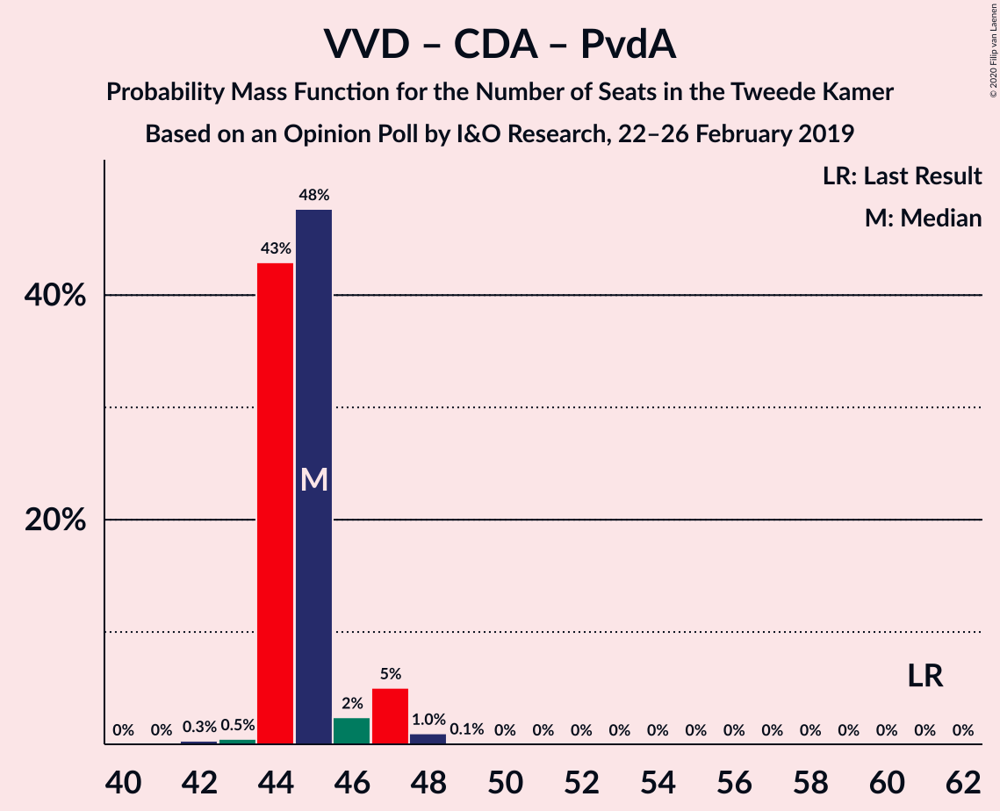

| Number of Seats | Probability | Accumulated | Special Marks |
|:---------------:|:-----------:|:-----------:|:-------------:|
| 41 | 0% | 100% |  |
| 42 | 0.3% | 99.9% |  |
| 43 | 0.5% | 99.6% |  |
| 44 | 43% | 99.1% |  |
| 45 | 48% | 56% | Median |
| 46 | 2% | 9% |  |
| 47 | 5% | 6% |  |
| 48 | 1.0% | 1.1% |  |
| 49 | 0.1% | 0.1% |  |
| 50 | 0% | 0% |  |
| 51 | 0% | 0% |  |
| 52 | 0% | 0% |  |
| 53 | 0% | 0% |  |
| 54 | 0% | 0% |  |
| 55 | 0% | 0% |  |
| 56 | 0% | 0% |  |
| 57 | 0% | 0% |  |
| 58 | 0% | 0% |  |
| 59 | 0% | 0% |  |
| 60 | 0% | 0% |  |
| 61 | 0% | 0% | Last Result |

### Volkspartij voor Vrijheid en Democratie – Democraten 66 – Partij van de Arbeid

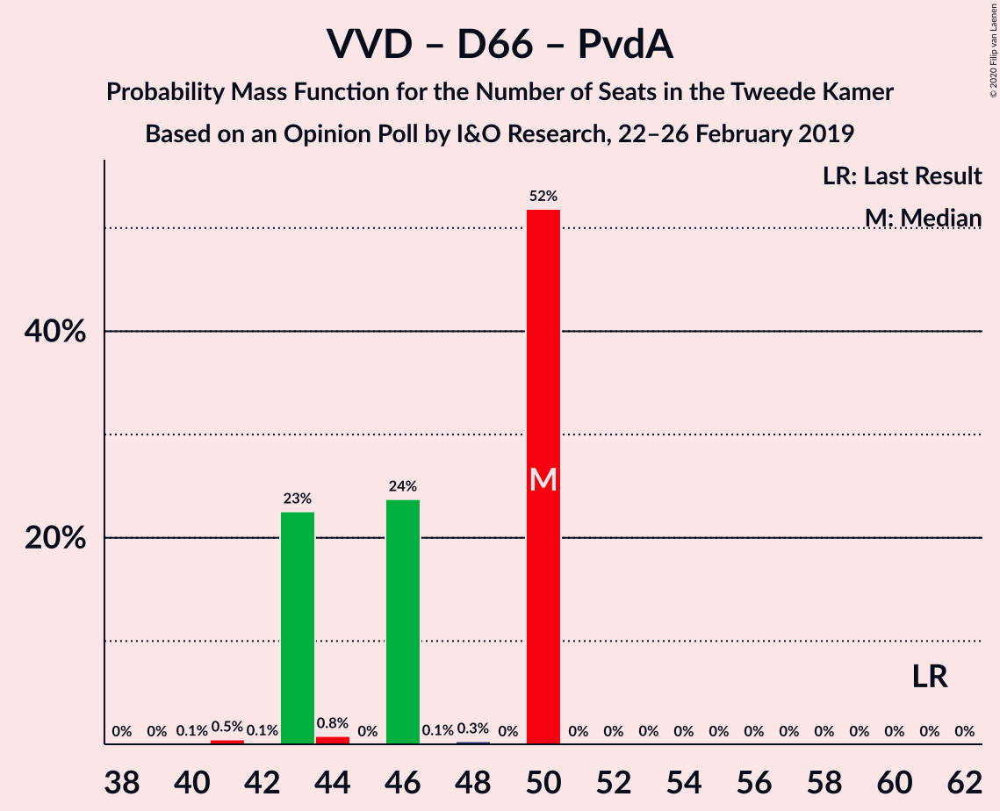

| Number of Seats | Probability | Accumulated | Special Marks |
|:---------------:|:-----------:|:-----------:|:-------------:|
| 40 | 0.4% | 100% |  |
| 41 | 1.4% | 99.6% |  |
| 42 | 1.0% | 98% |  |
| 43 | 5% | 97% |  |
| 44 | 85% | 92% | Median |
| 45 | 0.1% | 6% |  |
| 46 | 5% | 6% |  |
| 47 | 0.7% | 1.0% |  |
| 48 | 0.1% | 0.3% |  |
| 49 | 0.1% | 0.2% |  |
| 50 | 0% | 0.1% |  |
| 51 | 0.1% | 0.1% |  |
| 52 | 0% | 0% |  |
| 53 | 0% | 0% |  |
| 54 | 0% | 0% |  |
| 55 | 0% | 0% |  |
| 56 | 0% | 0% |  |
| 57 | 0% | 0% |  |
| 58 | 0% | 0% |  |
| 59 | 0% | 0% |  |
| 60 | 0% | 0% |  |
| 61 | 0% | 0% | Last Result |

### Volkspartij voor Vrijheid en Democratie – Christen-Democratisch Appèl

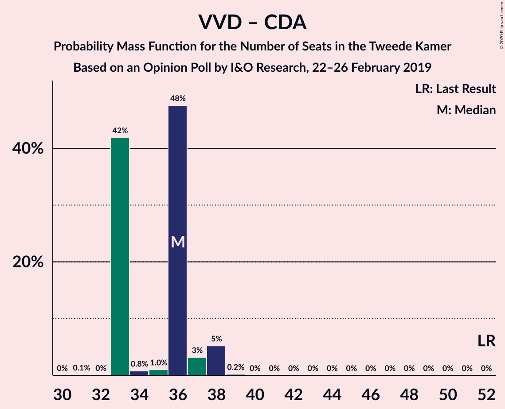

| Number of Seats | Probability | Accumulated | Special Marks |
|:---------------:|:-----------:|:-----------:|:-------------:|
| 31 | 0.1% | 100% |  |
| 32 | 0% | 99.9% |  |
| 33 | 42% | 99.9% |  |
| 34 | 0.8% | 58% |  |
| 35 | 1.0% | 57% |  |
| 36 | 48% | 56% | Median |
| 37 | 3% | 9% |  |
| 38 | 5% | 5% |  |
| 39 | 0.2% | 0.2% |  |
| 40 | 0% | 0% |  |
| 41 | 0% | 0% |  |
| 42 | 0% | 0% |  |
| 43 | 0% | 0% |  |
| 44 | 0% | 0% |  |
| 45 | 0% | 0% |  |
| 46 | 0% | 0% |  |
| 47 | 0% | 0% |  |
| 48 | 0% | 0% |  |
| 49 | 0% | 0% |  |
| 50 | 0% | 0% |  |
| 51 | 0% | 0% |  |
| 52 | 0% | 0% | Last Result |

### Volkspartij voor Vrijheid en Democratie – Partij van de Arbeid

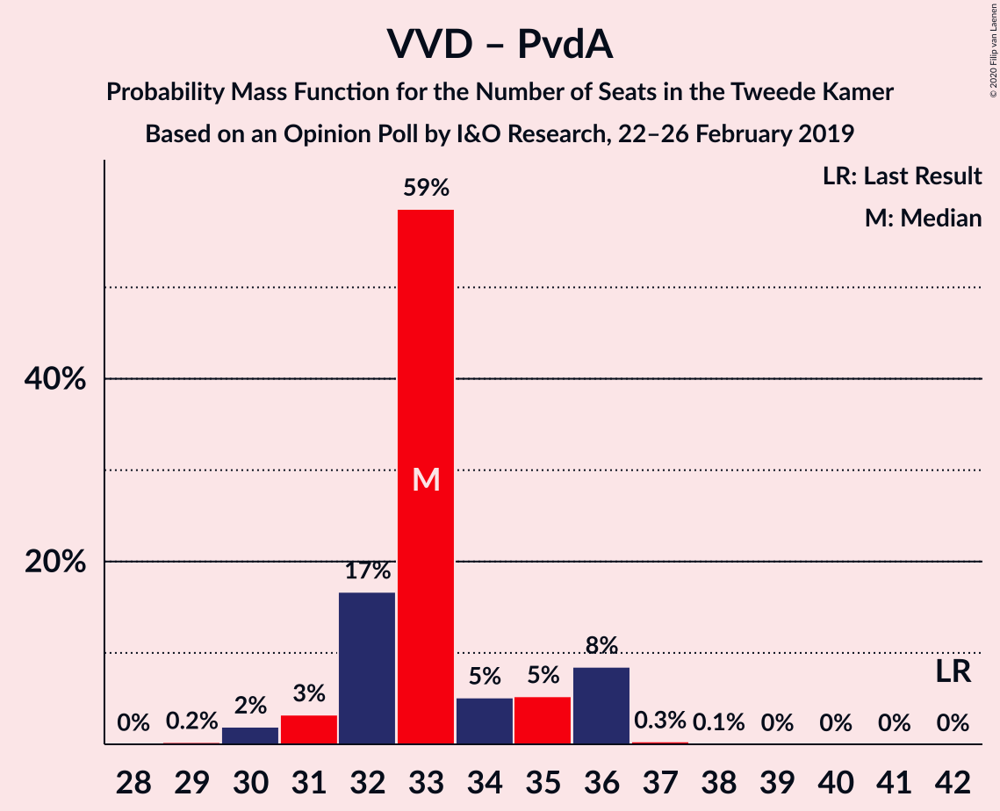

| Number of Seats | Probability | Accumulated | Special Marks |
|:---------------:|:-----------:|:-----------:|:-------------:|
| 28 | 0.2% | 100% |  |
| 29 | 0.2% | 99.8% |  |
| 30 | 0.1% | 99.6% |  |
| 31 | 1.4% | 99.5% |  |
| 32 | 1.1% | 98% |  |
| 33 | 87% | 97% | Median |
| 34 | 6% | 10% |  |
| 35 | 4% | 5% |  |
| 36 | 0.6% | 0.9% |  |
| 37 | 0.1% | 0.3% |  |
| 38 | 0.2% | 0.2% |  |
| 39 | 0% | 0% |  |
| 40 | 0% | 0% |  |
| 41 | 0% | 0% |  |
| 42 | 0% | 0% | Last Result |

### Christen-Democratisch Appèl – Democraten 66 – Partij van de Arbeid

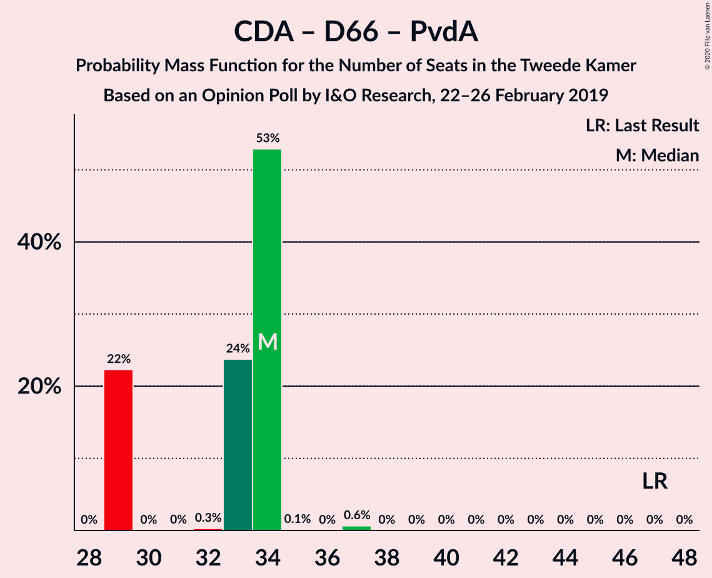

| Number of Seats | Probability | Accumulated | Special Marks |
|:---------------:|:-----------:|:-----------:|:-------------:|
| 28 | 0.1% | 100% |  |
| 29 | 0.1% | 99.9% |  |
| 30 | 4% | 99.8% |  |
| 31 | 6% | 95% |  |
| 32 | 44% | 90% | Median |
| 33 | 42% | 45% |  |
| 34 | 0.6% | 3% |  |
| 35 | 3% | 3% |  |
| 36 | 0.1% | 0.2% |  |
| 37 | 0% | 0.1% |  |
| 38 | 0% | 0% |  |
| 39 | 0% | 0% |  |
| 40 | 0% | 0% |  |
| 41 | 0% | 0% |  |
| 42 | 0% | 0% |  |
| 43 | 0% | 0% |  |
| 44 | 0% | 0% |  |
| 45 | 0% | 0% |  |
| 46 | 0% | 0% |  |
| 47 | 0% | 0% | Last Result |

### Christen-Democratisch Appèl – Partij van de Arbeid – ChristenUnie

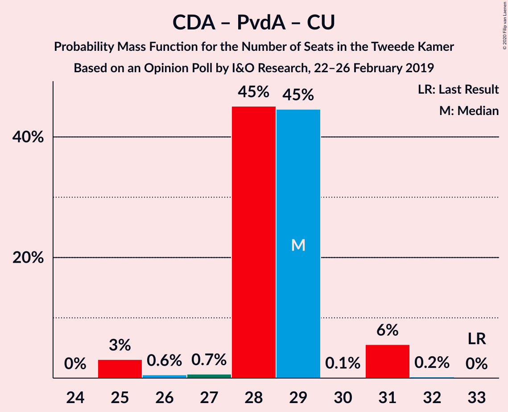

| Number of Seats | Probability | Accumulated | Special Marks |
|:---------------:|:-----------:|:-----------:|:-------------:|
| 25 | 3% | 100% |  |
| 26 | 0.6% | 97% |  |
| 27 | 0.7% | 96% |  |
| 28 | 45% | 96% | Median |
| 29 | 45% | 51% |  |
| 30 | 0.1% | 6% |  |
| 31 | 6% | 6% |  |
| 32 | 0.2% | 0.2% |  |
| 33 | 0% | 0% | Last Result |

### Christen-Democratisch Appèl – Democraten 66

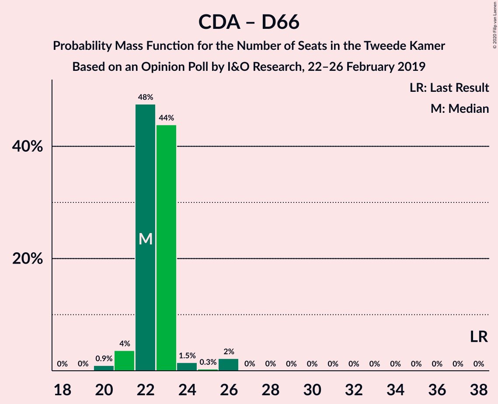

| Number of Seats | Probability | Accumulated | Special Marks |
|:---------------:|:-----------:|:-----------:|:-------------:|
| 20 | 0.9% | 100% |  |
| 21 | 4% | 99.0% |  |
| 22 | 48% | 95% |  |
| 23 | 44% | 48% | Median |
| 24 | 1.5% | 4% |  |
| 25 | 0.3% | 3% |  |
| 26 | 2% | 2% |  |
| 27 | 0% | 0.1% |  |
| 28 | 0% | 0% |  |
| 29 | 0% | 0% |  |
| 30 | 0% | 0% |  |
| 31 | 0% | 0% |  |
| 32 | 0% | 0% |  |
| 33 | 0% | 0% |  |
| 34 | 0% | 0% |  |
| 35 | 0% | 0% |  |
| 36 | 0% | 0% |  |
| 37 | 0% | 0% |  |
| 38 | 0% | 0% | Last Result |

### Christen-Democratisch Appèl – Partij van de Arbeid

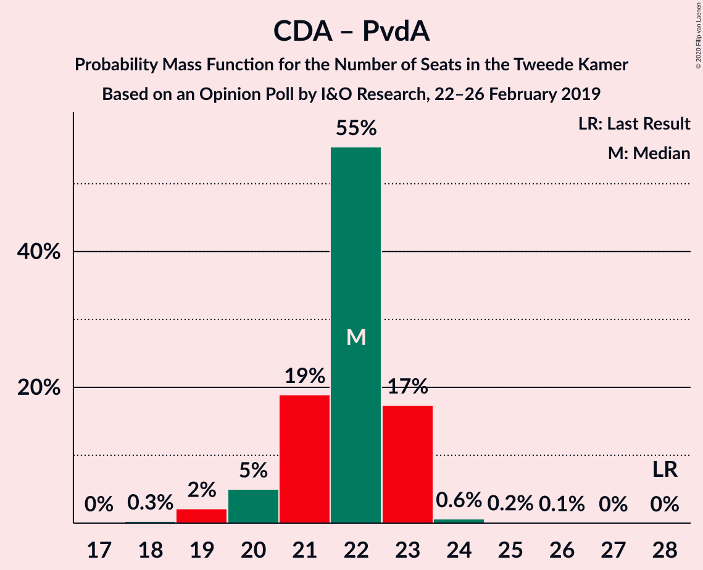

| Number of Seats | Probability | Accumulated | Special Marks |
|:---------------:|:-----------:|:-----------:|:-------------:|
| 19 | 3% | 100% |  |
| 20 | 1.1% | 97% |  |
| 21 | 44% | 95% | Median |
| 22 | 50% | 52% |  |
| 23 | 0.7% | 1.4% |  |
| 24 | 0.7% | 0.8% |  |
| 25 | 0.1% | 0.1% |  |
| 26 | 0% | 0% |  |
| 27 | 0% | 0% |  |
| 28 | 0% | 0% | Last Result |

## Technical Information

### Opinion Poll

+ **Polling firm:** I&O Research
+ **Commissioner(s):** —
+ **Fieldwork period:** 22–26 February 2019

### Calculations

+ **Sample size:** 1944
+ **Simulations done:** 131,072
+ **Error estimate:** 1.28%

