# Opinion Poll by Peil.nl, 25 February–3 March 2019

<a href="#voting-intentions">Voting Intentions</a> | <a href="#seats">Seats</a> | <a href="#coalitions">Coalitions</a> | <a href="#technical-information">Technical Information</a>

## Voting Intentions

### Confidence Intervals

| Party | Last Result | Poll Result | 80% Confidence Interval | 90% Confidence Interval | 95% Confidence Interval | 99% Confidence Interval |
|:-----:|:-----------:|:-----------:|:-----------------------:|:-----------------------:|:-----------------------:|:-----------------------:|
| Volkspartij voor Vrijheid en Democratie | 21.3% | 15.3% | 14.5–16.2% |14.3–16.5% |14.1–16.7% |13.7–17.1% |
| GroenLinks | 9.1% | 12.0% | 11.3–12.8% |11.1–13.0% |10.9–13.2% |10.5–13.6% |
| Partij voor de Vrijheid | 13.1% | 11.3% | 10.6–12.1% |10.4–12.3% |10.2–12.5% |9.9–12.9% |
| Forum voor Democratie | 1.8% | 11.3% | 10.6–12.1% |10.4–12.3% |10.2–12.5% |9.9–12.9% |
| Partij van de Arbeid | 5.7% | 9.3% | 8.7–10.1% |8.5–10.3% |8.3–10.4% |8.0–10.8% |
| Socialistische Partij | 9.1% | 8.0% | 7.4–8.7% |7.2–8.9% |7.1–9.0% |6.8–9.4% |
| Christen-Democratisch Appèl | 12.4% | 6.7% | 6.1–7.3% |6.0–7.5% |5.8–7.6% |5.6–7.9% |
| Democraten 66 | 12.2% | 6.0% | 5.5–6.6% |5.3–6.8% |5.2–6.9% |5.0–7.2% |
| Partij voor de Dieren | 3.2% | 5.3% | 4.8–5.9% |4.7–6.1% |4.6–6.2% |4.4–6.5% |
| ChristenUnie | 3.4% | 4.7% | 4.2–5.2% |4.1–5.3% |4.0–5.5% |3.7–5.8% |
| DENK | 2.1% | 4.7% | 4.2–5.2% |4.1–5.3% |4.0–5.5% |3.7–5.8% |
| 50Plus | 3.1% | 3.3% | 2.9–3.8% |2.8–3.9% |2.7–4.0% |2.6–4.3% |
| Staatkundig Gereformeerde Partij | 2.1% | 2.0% | 1.7–2.4% |1.6–2.5% |1.6–2.6% |1.4–2.8% |

*Note:* The poll result column reflects the actual value used in the calculations. Published results may vary slightly, and in addition be rounded to fewer digits.

## Seats

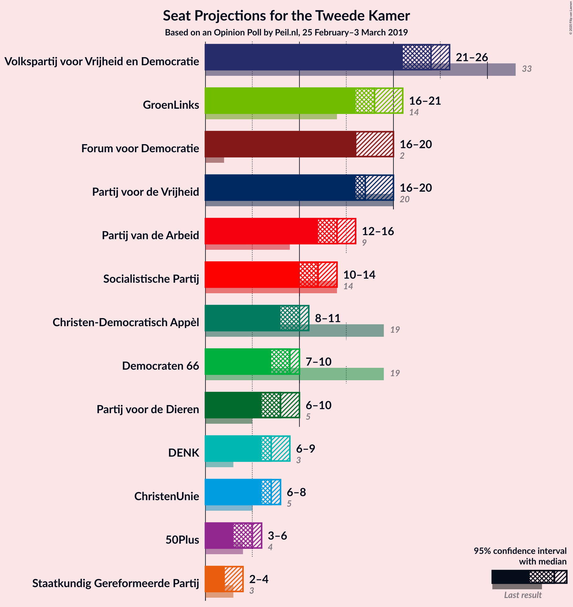

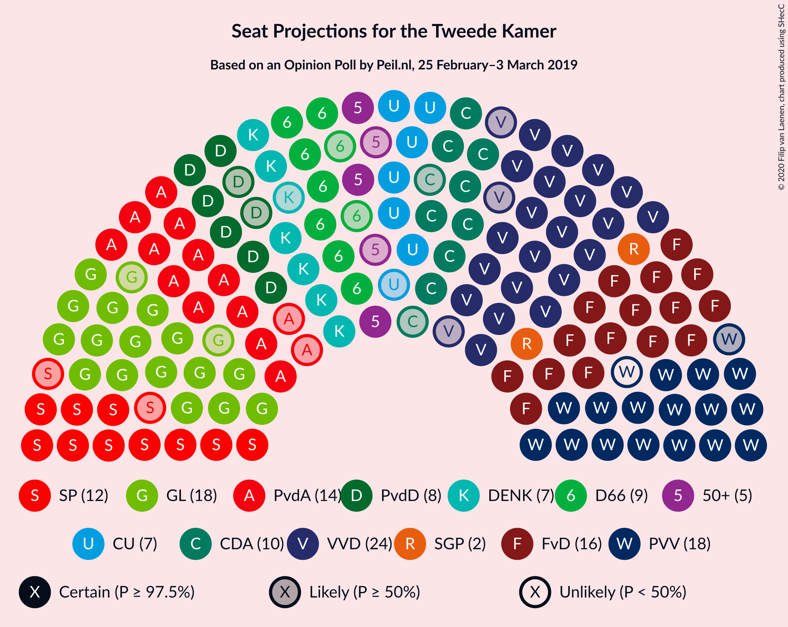

### Confidence Intervals

| Party | Last Result | Median | 80% Confidence Interval | 90% Confidence Interval | 95% Confidence Interval | 99% Confidence Interval |
|:-----:|:-----------:|:------:|:-----------------------:|:-----------------------:|:-----------------------:|:-----------------------:|
| <a href="#volkspartij-voor-vrijheid-en-democratie">Volkspartij voor Vrijheid en Democratie</a> | 33 | 24 | 23–26 |22–26 |21–26 |20–27 |
| <a href="#groenlinks">GroenLinks</a> | 14 | 18 | 17–20 |16–21 |16–21 |16–21 |
| <a href="#partij-voor-de-vrijheid">Partij voor de Vrijheid</a> | 20 | 17 | 16–18 |16–18 |16–20 |15–20 |
| <a href="#forum-voor-democratie">Forum voor Democratie</a> | 2 | 16 | 16–18 |16–20 |16–20 |15–20 |
| <a href="#partij-van-de-arbeid">Partij van de Arbeid</a> | 9 | 14 | 12–15 |12–16 |12–16 |12–16 |
| <a href="#socialistische-partij">Socialistische Partij</a> | 14 | 12 | 11–13 |10–13 |10–14 |10–15 |
| <a href="#christen-democratisch-appèl">Christen-Democratisch Appèl</a> | 19 | 10 | 9–11 |8–11 |8–11 |8–12 |
| <a href="#democraten-66">Democraten 66</a> | 19 | 9 | 8–10 |8–10 |7–10 |7–11 |
| <a href="#partij-voor-de-dieren">Partij voor de Dieren</a> | 5 | 8 | 7–9 |7–10 |6–10 |6–10 |
| <a href="#christenunie">ChristenUnie</a> | 5 | 7 | 6–7 |6–8 |6–8 |5–9 |
| <a href="#denk">DENK</a> | 3 | 7 | 6–8 |6–8 |6–9 |5–9 |
| <a href="#50plus">50Plus</a> | 4 | 5 | 4–6 |4–6 |3–6 |3–7 |
| <a href="#staatkundig-gereformeerde-partij">Staatkundig Gereformeerde Partij</a> | 3 | 2 | 2–4 |2–4 |2–4 |2–4 |

### Volkspartij voor Vrijheid en Democratie

*For a full overview of the results for this party, see the [Volkspartij voor Vrijheid en Democratie](party-volkspartijvoorvrijheidendemocratie.html) page.*

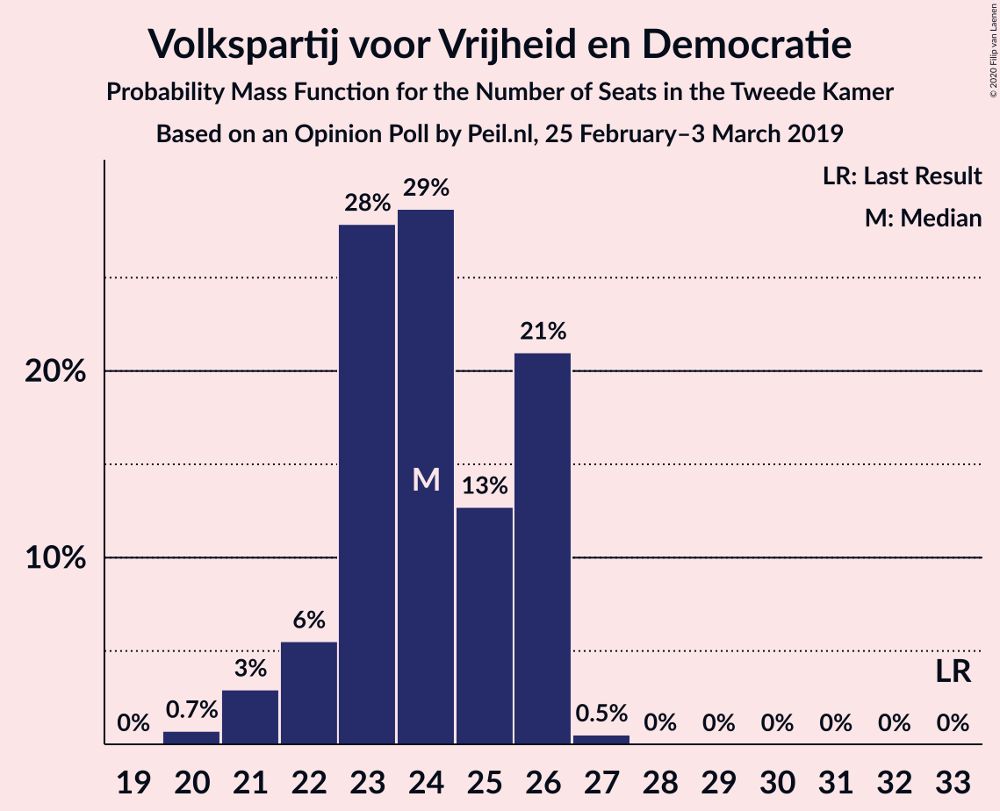

| Number of Seats | Probability | Accumulated | Special Marks |
|:---------------:|:-----------:|:-----------:|:-------------:|
| 20 | 0.7% | 100% |  |
| 21 | 3% | 99.3% |  |
| 22 | 6% | 96% |  |
| 23 | 28% | 91% |  |
| 24 | 29% | 63% | Median |
| 25 | 13% | 34% |  |
| 26 | 21% | 22% |  |
| 27 | 0.5% | 0.5% |  |
| 28 | 0% | 0% |  |
| 29 | 0% | 0% |  |
| 30 | 0% | 0% |  |
| 31 | 0% | 0% |  |
| 32 | 0% | 0% |  |
| 33 | 0% | 0% | Last Result |

### GroenLinks

*For a full overview of the results for this party, see the [GroenLinks](party-groenlinks.html) page.*

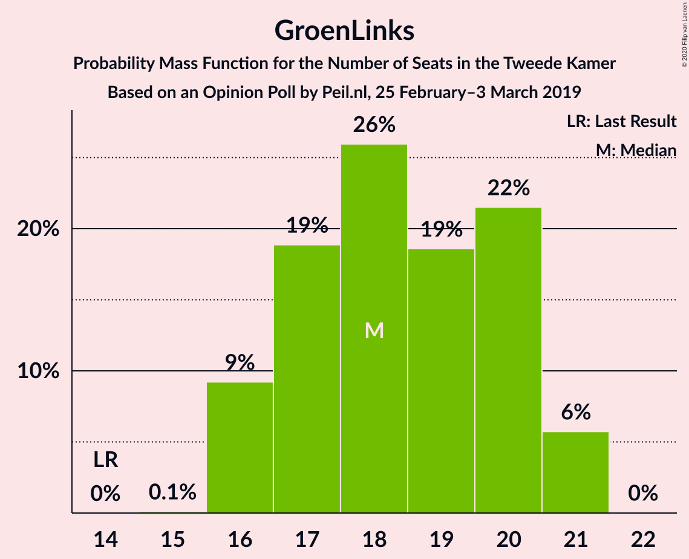

| Number of Seats | Probability | Accumulated | Special Marks |
|:---------------:|:-----------:|:-----------:|:-------------:|
| 14 | 0% | 100% | Last Result |
| 15 | 0.1% | 100% |  |
| 16 | 9% | 99.9% |  |
| 17 | 19% | 91% |  |
| 18 | 26% | 72% | Median |
| 19 | 19% | 46% |  |
| 20 | 22% | 27% |  |
| 21 | 6% | 6% |  |
| 22 | 0% | 0% |  |

### Partij voor de Vrijheid

*For a full overview of the results for this party, see the [Partij voor de Vrijheid](party-partijvoordevrijheid.html) page.*

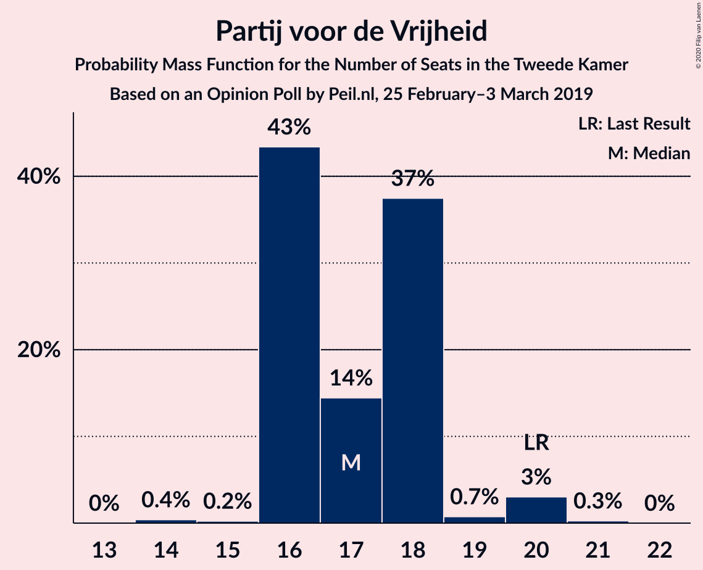

| Number of Seats | Probability | Accumulated | Special Marks |
|:---------------:|:-----------:|:-----------:|:-------------:|
| 14 | 0.4% | 100% |  |
| 15 | 0.2% | 99.6% |  |
| 16 | 43% | 99.4% |  |
| 17 | 14% | 56% | Median |
| 18 | 37% | 42% |  |
| 19 | 0.7% | 4% |  |
| 20 | 3% | 3% | Last Result |
| 21 | 0.3% | 0.3% |  |
| 22 | 0% | 0% |  |

### Forum voor Democratie

*For a full overview of the results for this party, see the [Forum voor Democratie](party-forumvoordemocratie.html) page.*

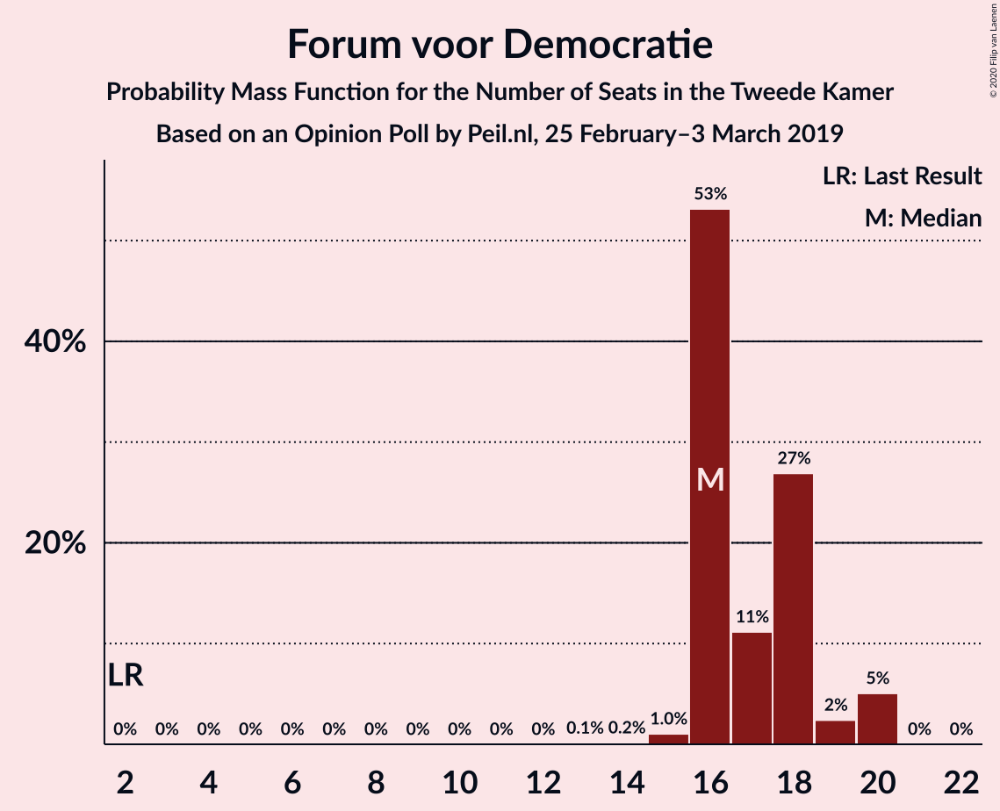

| Number of Seats | Probability | Accumulated | Special Marks |
|:---------------:|:-----------:|:-----------:|:-------------:|
| 2 | 0% | 100% | Last Result |
| 3 | 0% | 100% |  |
| 4 | 0% | 100% |  |
| 5 | 0% | 100% |  |
| 6 | 0% | 100% |  |
| 7 | 0% | 100% |  |
| 8 | 0% | 100% |  |
| 9 | 0% | 100% |  |
| 10 | 0% | 100% |  |
| 11 | 0% | 100% |  |
| 12 | 0% | 100% |  |
| 13 | 0.1% | 100% |  |
| 14 | 0.2% | 99.9% |  |
| 15 | 1.0% | 99.7% |  |
| 16 | 53% | 98.7% | Median |
| 17 | 11% | 46% |  |
| 18 | 27% | 34% |  |
| 19 | 2% | 7% |  |
| 20 | 5% | 5% |  |
| 21 | 0% | 0% |  |

### Partij van de Arbeid

*For a full overview of the results for this party, see the [Partij van de Arbeid](party-partijvandearbeid.html) page.*

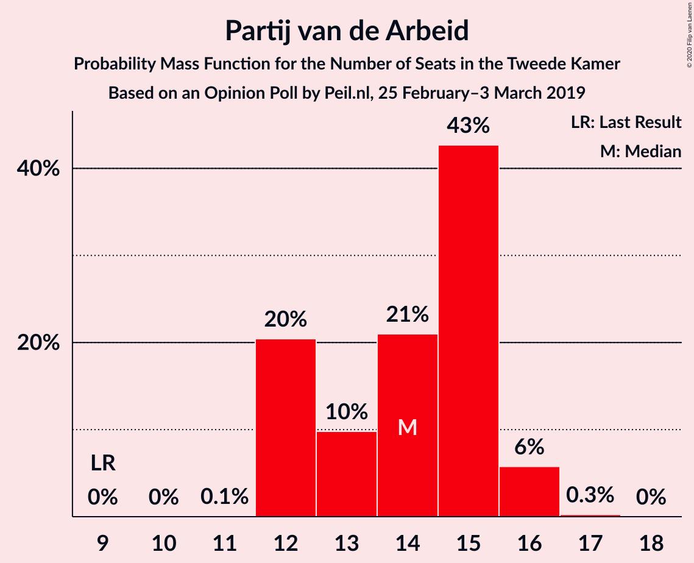

| Number of Seats | Probability | Accumulated | Special Marks |
|:---------------:|:-----------:|:-----------:|:-------------:|
| 9 | 0% | 100% | Last Result |
| 10 | 0% | 100% |  |
| 11 | 0.1% | 100% |  |
| 12 | 20% | 99.9% |  |
| 13 | 10% | 79% |  |
| 14 | 21% | 70% | Median |
| 15 | 43% | 49% |  |
| 16 | 6% | 6% |  |
| 17 | 0.3% | 0.3% |  |
| 18 | 0% | 0% |  |

### Socialistische Partij

*For a full overview of the results for this party, see the [Socialistische Partij](party-socialistischepartij.html) page.*

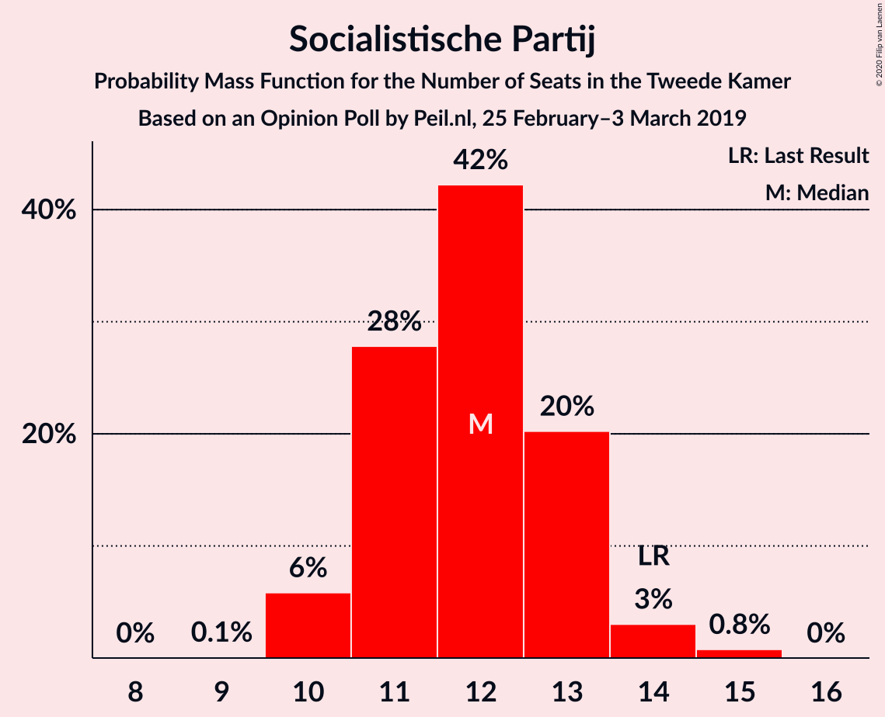

| Number of Seats | Probability | Accumulated | Special Marks |
|:---------------:|:-----------:|:-----------:|:-------------:|
| 9 | 0.1% | 100% |  |
| 10 | 6% | 99.9% |  |
| 11 | 28% | 94% |  |
| 12 | 42% | 66% | Median |
| 13 | 20% | 24% |  |
| 14 | 3% | 4% | Last Result |
| 15 | 0.8% | 0.8% |  |
| 16 | 0% | 0% |  |

### Christen-Democratisch Appèl

*For a full overview of the results for this party, see the [Christen-Democratisch Appèl](party-christen-democratischappèl.html) page.*

| Number of Seats | Probability | Accumulated | Special Marks |
|:---------------:|:-----------:|:-----------:|:-------------:|
| 8 | 8% | 100% |  |
| 9 | 24% | 92% |  |
| 10 | 43% | 68% | Median |
| 11 | 24% | 25% |  |
| 12 | 0.6% | 0.8% |  |
| 13 | 0.2% | 0.2% |  |
| 14 | 0% | 0% |  |
| 15 | 0% | 0% |  |
| 16 | 0% | 0% |  |
| 17 | 0% | 0% |  |
| 18 | 0% | 0% |  |
| 19 | 0% | 0% | Last Result |

### Democraten 66

*For a full overview of the results for this party, see the [Democraten 66](party-democraten66.html) page.*

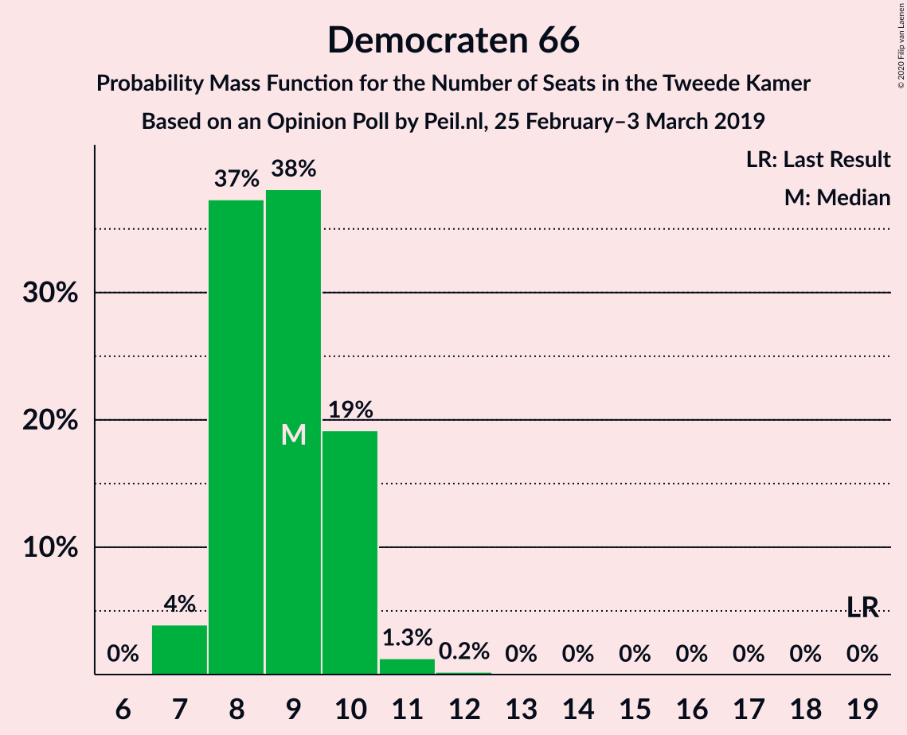

| Number of Seats | Probability | Accumulated | Special Marks |
|:---------------:|:-----------:|:-----------:|:-------------:|
| 7 | 4% | 100% |  |
| 8 | 37% | 96% |  |
| 9 | 38% | 59% | Median |
| 10 | 19% | 21% |  |
| 11 | 1.3% | 1.5% |  |
| 12 | 0.2% | 0.2% |  |
| 13 | 0% | 0% |  |
| 14 | 0% | 0% |  |
| 15 | 0% | 0% |  |
| 16 | 0% | 0% |  |
| 17 | 0% | 0% |  |
| 18 | 0% | 0% |  |
| 19 | 0% | 0% | Last Result |

### Partij voor de Dieren

*For a full overview of the results for this party, see the [Partij voor de Dieren](party-partijvoordedieren.html) page.*

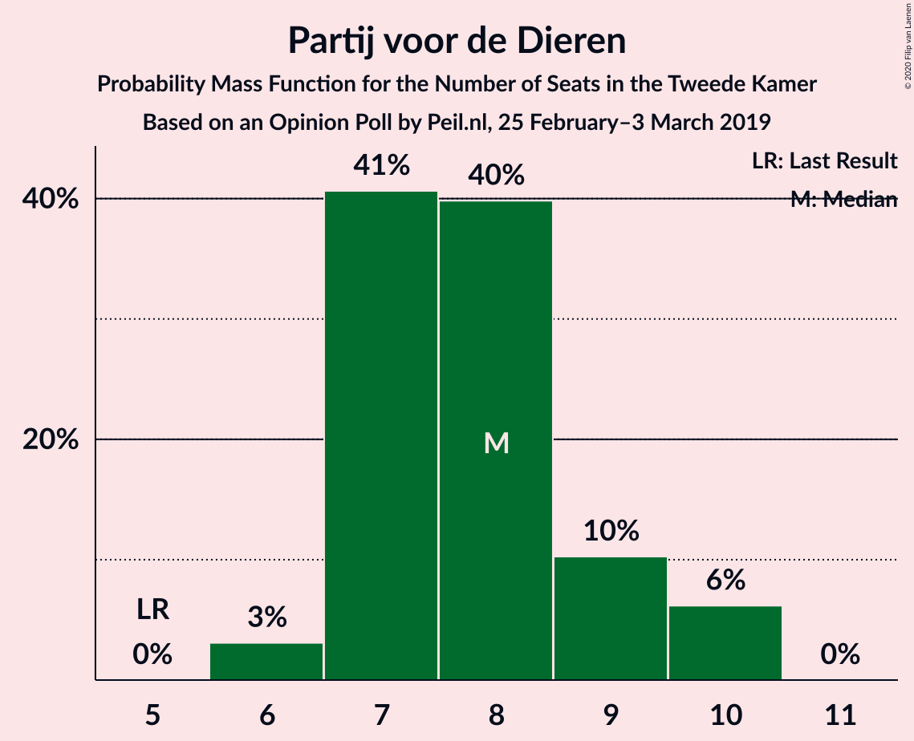

| Number of Seats | Probability | Accumulated | Special Marks |
|:---------------:|:-----------:|:-----------:|:-------------:|
| 5 | 0% | 100% | Last Result |
| 6 | 3% | 100% |  |
| 7 | 41% | 97% |  |
| 8 | 40% | 56% | Median |
| 9 | 10% | 16% |  |
| 10 | 6% | 6% |  |
| 11 | 0% | 0% |  |

### ChristenUnie

*For a full overview of the results for this party, see the [ChristenUnie](party-christenunie.html) page.*

| Number of Seats | Probability | Accumulated | Special Marks |
|:---------------:|:-----------:|:-----------:|:-------------:|
| 5 | 1.2% | 100% | Last Result |
| 6 | 35% | 98.8% |  |
| 7 | 55% | 64% | Median |
| 8 | 9% | 10% |  |
| 9 | 0.6% | 0.6% |  |
| 10 | 0% | 0% |  |

### DENK

*For a full overview of the results for this party, see the [DENK](party-denk.html) page.*

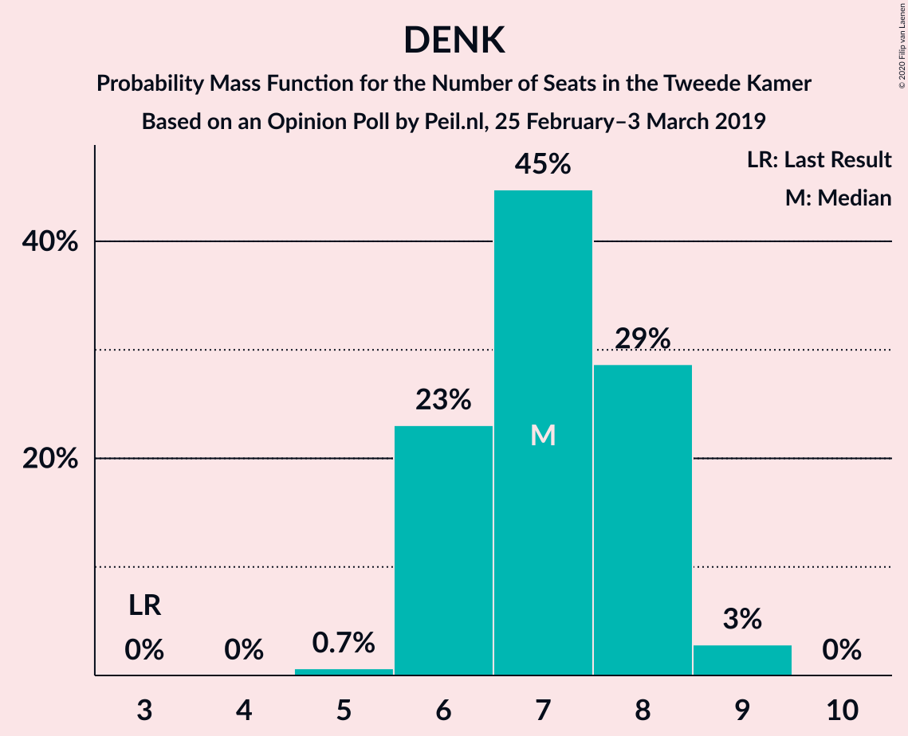

| Number of Seats | Probability | Accumulated | Special Marks |
|:---------------:|:-----------:|:-----------:|:-------------:|
| 3 | 0% | 100% | Last Result |
| 4 | 0% | 100% |  |
| 5 | 0.7% | 100% |  |
| 6 | 23% | 99.3% |  |
| 7 | 45% | 76% | Median |
| 8 | 29% | 32% |  |
| 9 | 3% | 3% |  |
| 10 | 0% | 0% |  |

### 50Plus

*For a full overview of the results for this party, see the [50Plus](party-50plus.html) page.*

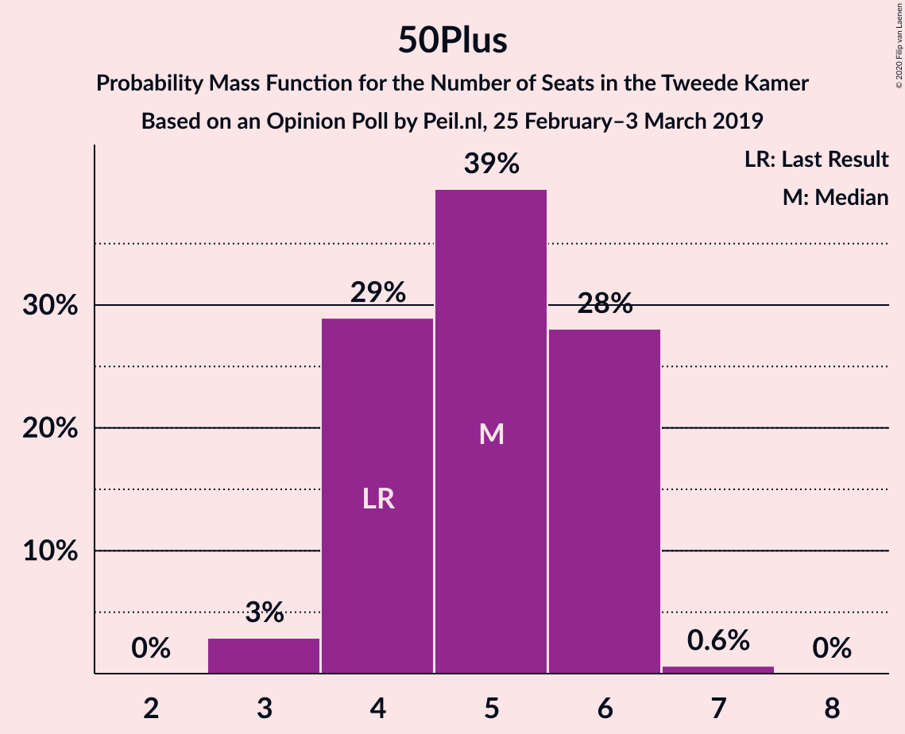

| Number of Seats | Probability | Accumulated | Special Marks |
|:---------------:|:-----------:|:-----------:|:-------------:|
| 3 | 3% | 100% |  |
| 4 | 29% | 97% | Last Result |
| 5 | 39% | 68% | Median |
| 6 | 28% | 29% |  |
| 7 | 0.6% | 0.6% |  |
| 8 | 0% | 0% |  |

### Staatkundig Gereformeerde Partij

*For a full overview of the results for this party, see the [Staatkundig Gereformeerde Partij](party-staatkundiggereformeerdepartij.html) page.*

| Number of Seats | Probability | Accumulated | Special Marks |
|:---------------:|:-----------:|:-----------:|:-------------:|
| 1 | 0.3% | 100% |  |
| 2 | 64% | 99.7% | Median |
| 3 | 23% | 36% | Last Result |
| 4 | 13% | 13% |  |
| 5 | 0% | 0% |  |

## Coalitions

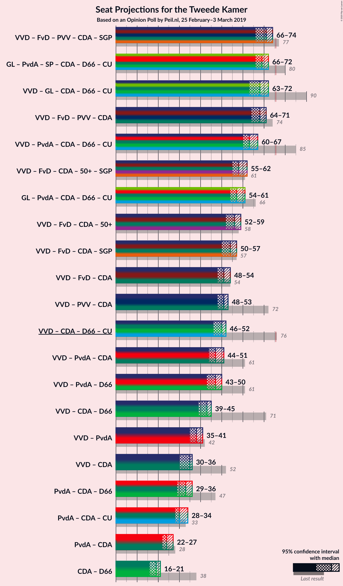

### Confidence Intervals

| Coalition | Last Result | Median | Majority? | 80% Confidence Interval | 90% Confidence Interval | 95% Confidence Interval | 99% Confidence Interval |
|:---------:|:-----------:|:------:|:---------:|:-----------------------:|:-----------------------:|:-----------------------:|:-----------------------:|
| Volkspartij voor Vrijheid en Democratie – Forum voor Democratie – Partij voor de Vrijheid – Christen-Democratisch Appèl – Staatkundig Gereformeerde Partij | 77 | 71 | 0.1% | 68–72 | 66–73 | 66–74 | 66–74 |
| GroenLinks – Partij van de Arbeid – Socialistische Partij – Christen-Democratisch Appèl – Democraten 66 – ChristenUnie | 80 | 69 | 0% | 68–72 | 67–72 | 66–72 | 66–75 |
| Volkspartij voor Vrijheid en Democratie – GroenLinks – Christen-Democratisch Appèl – Democraten 66 – ChristenUnie | 90 | 68 | 0% | 65–72 | 64–72 | 63–72 | 63–72 |
| Volkspartij voor Vrijheid en Democratie – Forum voor Democratie – Partij voor de Vrijheid – Christen-Democratisch Appèl | 74 | 68 | 0% | 66–69 | 64–70 | 64–71 | 63–71 |
| Volkspartij voor Vrijheid en Democratie – Partij van de Arbeid – Christen-Democratisch Appèl – Democraten 66 – ChristenUnie | 85 | 63 | 0% | 60–67 | 60–67 | 60–67 | 59–67 |
| Volkspartij voor Vrijheid en Democratie – Forum voor Democratie – Christen-Democratisch Appèl – 50Plus – Staatkundig Gereformeerde Partij | 61 | 58 | 0% | 56–60 | 55–60 | 55–62 | 54–62 |
| GroenLinks – Partij van de Arbeid – Christen-Democratisch Appèl – Democraten 66 – ChristenUnie | 66 | 57 | 0% | 56–61 | 56–61 | 54–61 | 54–62 |
| Volkspartij voor Vrijheid en Democratie – Forum voor Democratie – Christen-Democratisch Appèl – 50Plus | 58 | 56 | 0% | 54–57 | 53–58 | 52–59 | 50–59 |
| Volkspartij voor Vrijheid en Democratie – Forum voor Democratie – Christen-Democratisch Appèl – Staatkundig Gereformeerde Partij | 57 | 54 | 0% | 50–55 | 50–55 | 50–57 | 49–57 |
| Volkspartij voor Vrijheid en Democratie – Forum voor Democratie – Christen-Democratisch Appèl | 54 | 51 | 0% | 48–52 | 48–53 | 48–54 | 45–54 |
| Volkspartij voor Vrijheid en Democratie – Partij voor de Vrijheid – Christen-Democratisch Appèl | 72 | 51 | 0% | 48–53 | 48–53 | 48–53 | 47–54 |
| Volkspartij voor Vrijheid en Democratie – Christen-Democratisch Appèl – Democraten 66 – ChristenUnie | 76 | 50 | 0% | 46–52 | 46–52 | 46–52 | 46–53 |
| Volkspartij voor Vrijheid en Democratie – Partij van de Arbeid – Christen-Democratisch Appèl | 61 | 47 | 0% | 46–51 | 45–51 | 44–51 | 44–51 |
| Volkspartij voor Vrijheid en Democratie – Partij van de Arbeid – Democraten 66 | 61 | 47 | 0% | 44–50 | 44–50 | 43–50 | 43–50 |
| Volkspartij voor Vrijheid en Democratie – Christen-Democratisch Appèl – Democraten 66 | 71 | 43 | 0% | 40–45 | 40–45 | 39–45 | 38–46 |
| Volkspartij voor Vrijheid en Democratie – Partij van de Arbeid | 42 | 38 | 0% | 36–41 | 36–41 | 35–41 | 34–41 |
| Volkspartij voor Vrijheid en Democratie – Christen-Democratisch Appèl | 52 | 35 | 0% | 32–36 | 31–36 | 30–36 | 30–37 |
| Partij van de Arbeid – Christen-Democratisch Appèl – Democraten 66 | 47 | 33 | 0% | 31–35 | 31–35 | 29–36 | 29–37 |
| Partij van de Arbeid – Christen-Democratisch Appèl – ChristenUnie | 33 | 30 | 0% | 29–32 | 29–32 | 28–34 | 28–34 |
| Partij van de Arbeid – Christen-Democratisch Appèl | 28 | 24 | 0% | 23–25 | 22–26 | 22–27 | 22–27 |
| Christen-Democratisch Appèl – Democraten 66 | 38 | 19 | 0% | 17–20 | 17–21 | 16–21 | 16–22 |

### Volkspartij voor Vrijheid en Democratie – Forum voor Democratie – Partij voor de Vrijheid – Christen-Democratisch Appèl – Staatkundig Gereformeerde Partij

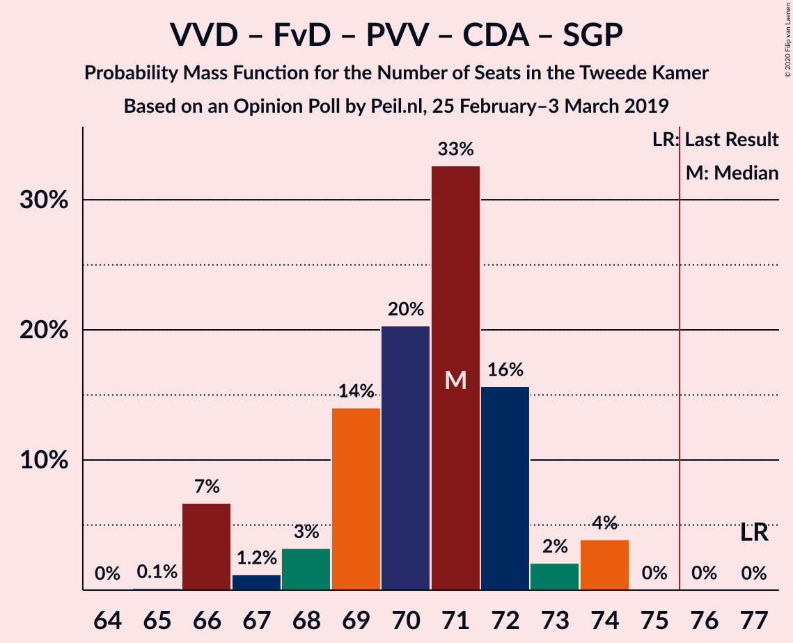

| Number of Seats | Probability | Accumulated | Special Marks |
|:---------------:|:-----------:|:-----------:|:-------------:|
| 65 | 0.1% | 100% |  |
| 66 | 7% | 99.9% |  |
| 67 | 1.2% | 93% |  |
| 68 | 3% | 92% |  |
| 69 | 14% | 89% | Median |
| 70 | 20% | 75% |  |
| 71 | 33% | 54% |  |
| 72 | 16% | 22% |  |
| 73 | 2% | 6% |  |
| 74 | 4% | 4% |  |
| 75 | 0% | 0.1% |  |
| 76 | 0% | 0.1% | Majority |
| 77 | 0% | 0% | Last Result |

### GroenLinks – Partij van de Arbeid – Socialistische Partij – Christen-Democratisch Appèl – Democraten 66 – ChristenUnie

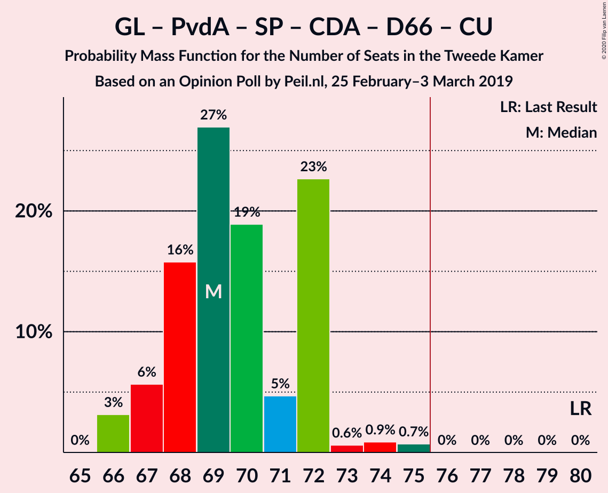

| Number of Seats | Probability | Accumulated | Special Marks |
|:---------------:|:-----------:|:-----------:|:-------------:|
| 66 | 3% | 100% |  |
| 67 | 6% | 97% |  |
| 68 | 16% | 91% |  |
| 69 | 27% | 75% |  |
| 70 | 19% | 48% | Median |
| 71 | 5% | 30% |  |
| 72 | 23% | 25% |  |
| 73 | 0.6% | 2% |  |
| 74 | 0.9% | 2% |  |
| 75 | 0.7% | 0.7% |  |
| 76 | 0% | 0% | Majority |
| 77 | 0% | 0% |  |
| 78 | 0% | 0% |  |
| 79 | 0% | 0% |  |
| 80 | 0% | 0% | Last Result |

### Volkspartij voor Vrijheid en Democratie – GroenLinks – Christen-Democratisch Appèl – Democraten 66 – ChristenUnie

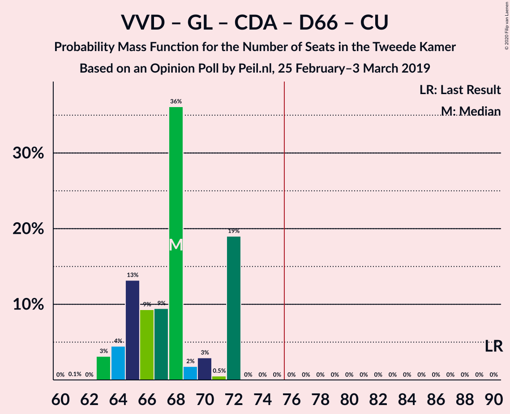

| Number of Seats | Probability | Accumulated | Special Marks |
|:---------------:|:-----------:|:-----------:|:-------------:|
| 61 | 0.1% | 100% |  |
| 62 | 0% | 99.9% |  |
| 63 | 3% | 99.9% |  |
| 64 | 4% | 97% |  |
| 65 | 13% | 92% |  |
| 66 | 9% | 79% |  |
| 67 | 9% | 70% |  |
| 68 | 36% | 60% | Median |
| 69 | 2% | 24% |  |
| 70 | 3% | 22% |  |
| 71 | 0.5% | 20% |  |
| 72 | 19% | 19% |  |
| 73 | 0% | 0% |  |
| 74 | 0% | 0% |  |
| 75 | 0% | 0% |  |
| 76 | 0% | 0% | Majority |
| 77 | 0% | 0% |  |
| 78 | 0% | 0% |  |
| 79 | 0% | 0% |  |
| 80 | 0% | 0% |  |
| 81 | 0% | 0% |  |
| 82 | 0% | 0% |  |
| 83 | 0% | 0% |  |
| 84 | 0% | 0% |  |
| 85 | 0% | 0% |  |
| 86 | 0% | 0% |  |
| 87 | 0% | 0% |  |
| 88 | 0% | 0% |  |
| 89 | 0% | 0% |  |
| 90 | 0% | 0% | Last Result |

### Volkspartij voor Vrijheid en Democratie – Forum voor Democratie – Partij voor de Vrijheid – Christen-Democratisch Appèl

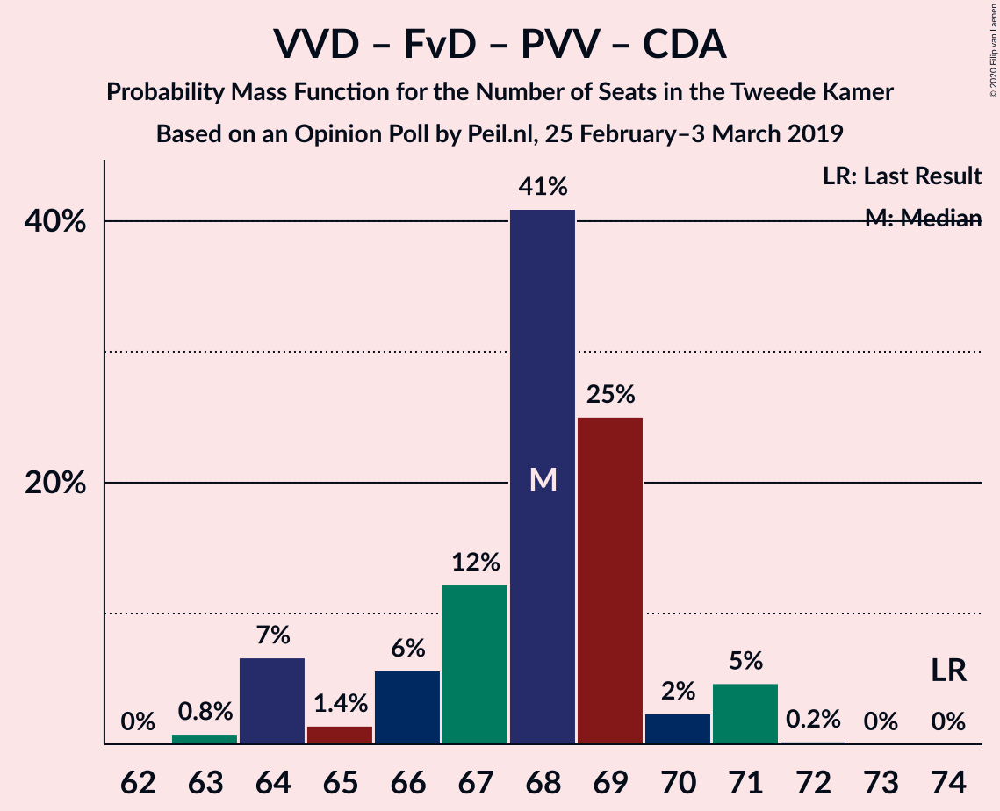

| Number of Seats | Probability | Accumulated | Special Marks |
|:---------------:|:-----------:|:-----------:|:-------------:|
| 63 | 0.8% | 100% |  |
| 64 | 7% | 99.2% |  |
| 65 | 1.4% | 93% |  |
| 66 | 6% | 91% |  |
| 67 | 12% | 85% | Median |
| 68 | 41% | 73% |  |
| 69 | 25% | 32% |  |
| 70 | 2% | 7% |  |
| 71 | 5% | 5% |  |
| 72 | 0.2% | 0.3% |  |
| 73 | 0% | 0% |  |
| 74 | 0% | 0% | Last Result |

### Volkspartij voor Vrijheid en Democratie – Partij van de Arbeid – Christen-Democratisch Appèl – Democraten 66 – ChristenUnie

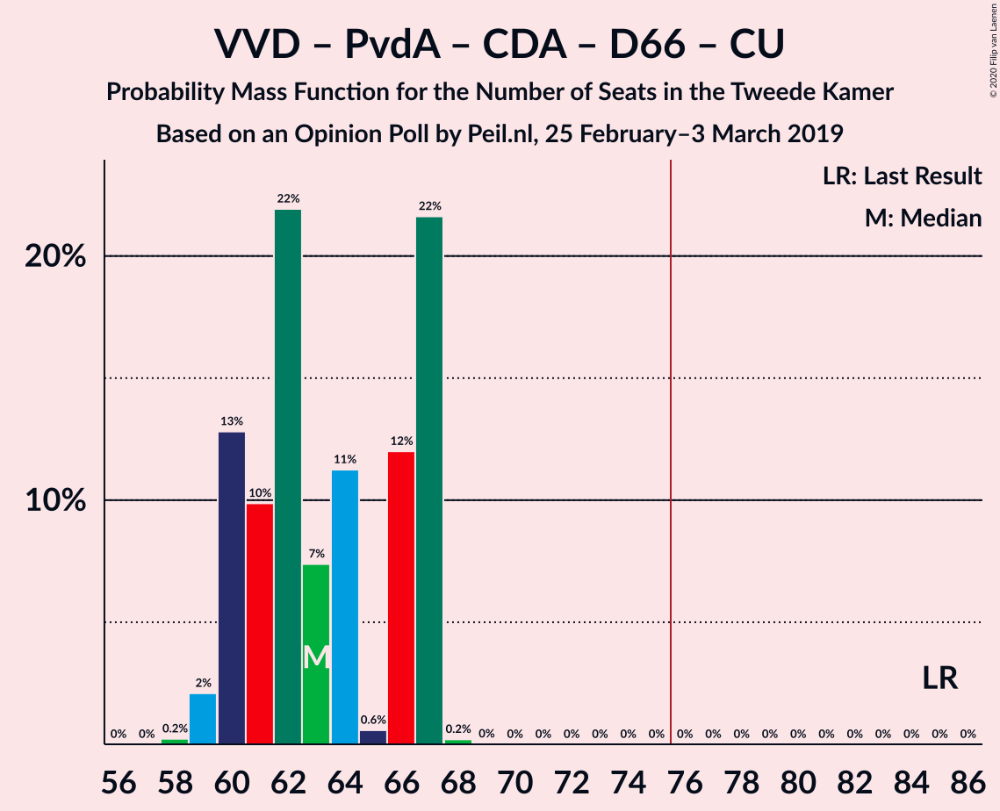

| Number of Seats | Probability | Accumulated | Special Marks |
|:---------------:|:-----------:|:-----------:|:-------------:|
| 58 | 0.2% | 100% |  |
| 59 | 2% | 99.8% |  |
| 60 | 13% | 98% |  |
| 61 | 10% | 85% |  |
| 62 | 22% | 75% |  |
| 63 | 7% | 53% |  |
| 64 | 11% | 46% | Median |
| 65 | 0.6% | 34% |  |
| 66 | 12% | 34% |  |
| 67 | 22% | 22% |  |
| 68 | 0.2% | 0.2% |  |
| 69 | 0% | 0% |  |
| 70 | 0% | 0% |  |
| 71 | 0% | 0% |  |
| 72 | 0% | 0% |  |
| 73 | 0% | 0% |  |
| 74 | 0% | 0% |  |
| 75 | 0% | 0% |  |
| 76 | 0% | 0% | Majority |
| 77 | 0% | 0% |  |
| 78 | 0% | 0% |  |
| 79 | 0% | 0% |  |
| 80 | 0% | 0% |  |
| 81 | 0% | 0% |  |
| 82 | 0% | 0% |  |
| 83 | 0% | 0% |  |
| 84 | 0% | 0% |  |
| 85 | 0% | 0% | Last Result |

### Volkspartij voor Vrijheid en Democratie – Forum voor Democratie – Christen-Democratisch Appèl – 50Plus – Staatkundig Gereformeerde Partij

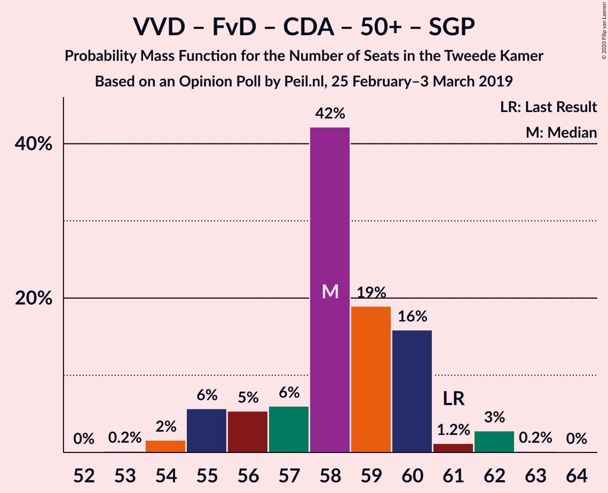

| Number of Seats | Probability | Accumulated | Special Marks |
|:---------------:|:-----------:|:-----------:|:-------------:|
| 53 | 0.2% | 100% |  |
| 54 | 2% | 99.8% |  |
| 55 | 6% | 98% |  |
| 56 | 5% | 93% |  |
| 57 | 6% | 87% | Median |
| 58 | 42% | 81% |  |
| 59 | 19% | 39% |  |
| 60 | 16% | 20% |  |
| 61 | 1.2% | 4% | Last Result |
| 62 | 3% | 3% |  |
| 63 | 0.2% | 0.2% |  |
| 64 | 0% | 0% |  |

### GroenLinks – Partij van de Arbeid – Christen-Democratisch Appèl – Democraten 66 – ChristenUnie

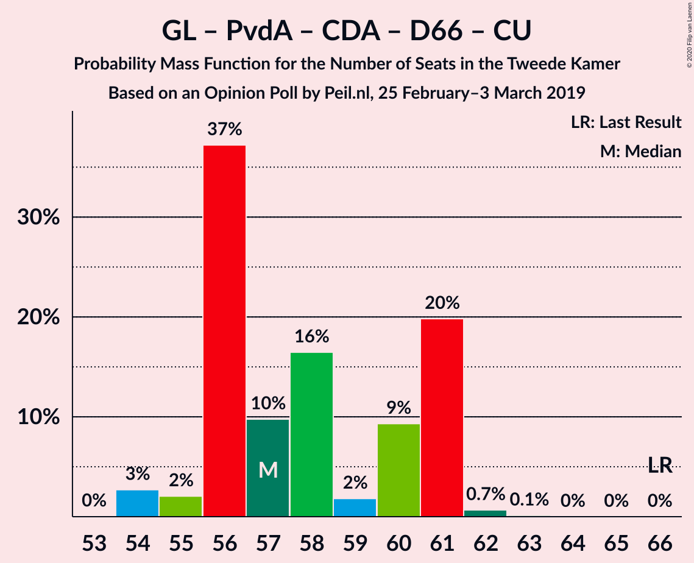

| Number of Seats | Probability | Accumulated | Special Marks |
|:---------------:|:-----------:|:-----------:|:-------------:|
| 54 | 3% | 100% |  |
| 55 | 2% | 97% |  |
| 56 | 37% | 95% |  |
| 57 | 10% | 58% |  |
| 58 | 16% | 48% | Median |
| 59 | 2% | 32% |  |
| 60 | 9% | 30% |  |
| 61 | 20% | 21% |  |
| 62 | 0.7% | 0.8% |  |
| 63 | 0.1% | 0.1% |  |
| 64 | 0% | 0% |  |
| 65 | 0% | 0% |  |
| 66 | 0% | 0% | Last Result |

### Volkspartij voor Vrijheid en Democratie – Forum voor Democratie – Christen-Democratisch Appèl – 50Plus

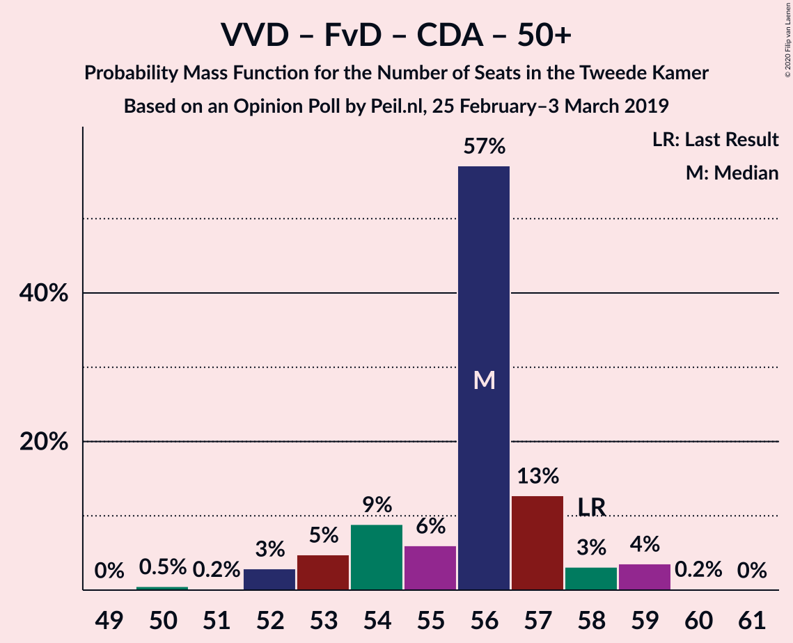

| Number of Seats | Probability | Accumulated | Special Marks |
|:---------------:|:-----------:|:-----------:|:-------------:|
| 50 | 0.5% | 100% |  |
| 51 | 0.2% | 99.5% |  |
| 52 | 3% | 99.3% |  |
| 53 | 5% | 96% |  |
| 54 | 9% | 92% |  |
| 55 | 6% | 83% | Median |
| 56 | 57% | 77% |  |
| 57 | 13% | 20% |  |
| 58 | 3% | 7% | Last Result |
| 59 | 4% | 4% |  |
| 60 | 0.2% | 0.2% |  |
| 61 | 0% | 0% |  |

### Volkspartij voor Vrijheid en Democratie – Forum voor Democratie – Christen-Democratisch Appèl – Staatkundig Gereformeerde Partij

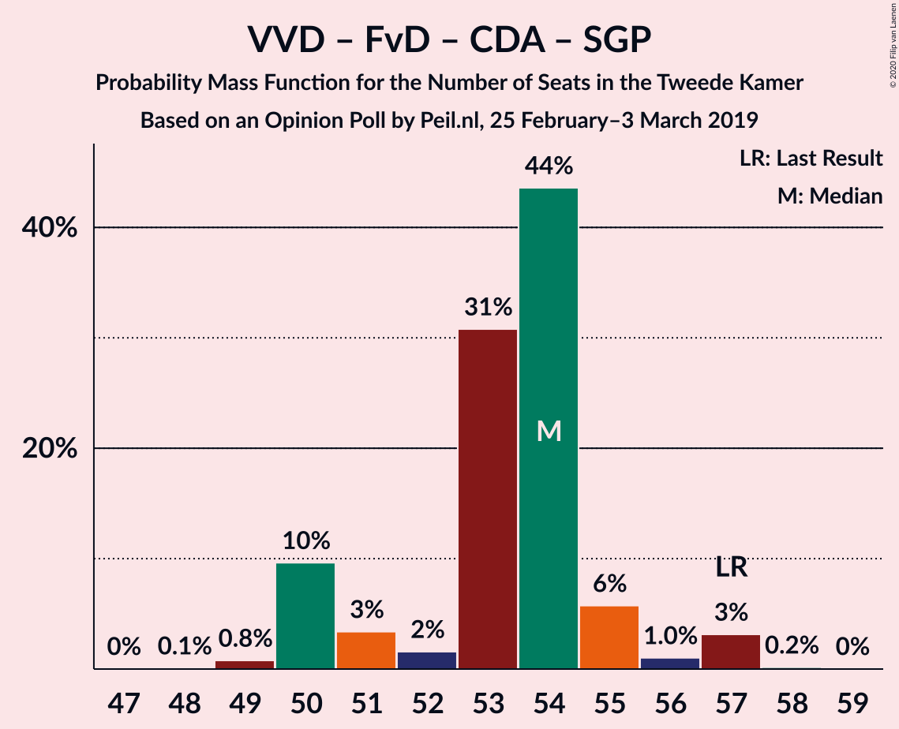

| Number of Seats | Probability | Accumulated | Special Marks |
|:---------------:|:-----------:|:-----------:|:-------------:|
| 48 | 0.1% | 100% |  |
| 49 | 0.8% | 99.9% |  |
| 50 | 10% | 99.1% |  |
| 51 | 3% | 89% |  |
| 52 | 2% | 86% | Median |
| 53 | 31% | 84% |  |
| 54 | 44% | 54% |  |
| 55 | 6% | 10% |  |
| 56 | 1.0% | 4% |  |
| 57 | 3% | 3% | Last Result |
| 58 | 0.2% | 0.2% |  |
| 59 | 0% | 0% |  |

### Volkspartij voor Vrijheid en Democratie – Forum voor Democratie – Christen-Democratisch Appèl

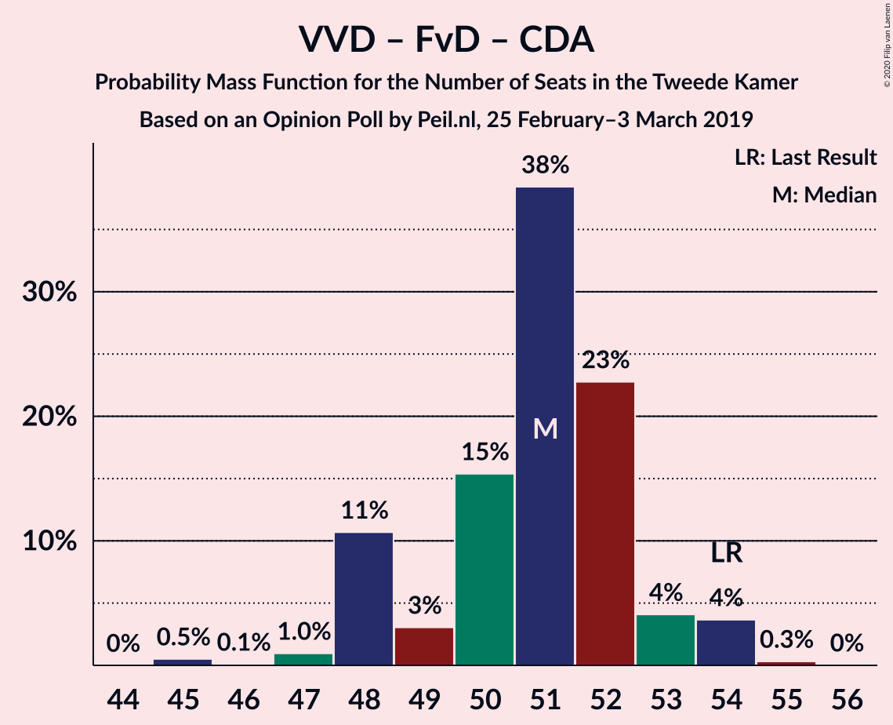

| Number of Seats | Probability | Accumulated | Special Marks |
|:---------------:|:-----------:|:-----------:|:-------------:|
| 45 | 0.5% | 100% |  |
| 46 | 0.1% | 99.5% |  |
| 47 | 1.0% | 99.4% |  |
| 48 | 11% | 98% |  |
| 49 | 3% | 88% |  |
| 50 | 15% | 85% | Median |
| 51 | 38% | 69% |  |
| 52 | 23% | 31% |  |
| 53 | 4% | 8% |  |
| 54 | 4% | 4% | Last Result |
| 55 | 0.3% | 0.3% |  |
| 56 | 0% | 0% |  |

### Volkspartij voor Vrijheid en Democratie – Partij voor de Vrijheid – Christen-Democratisch Appèl

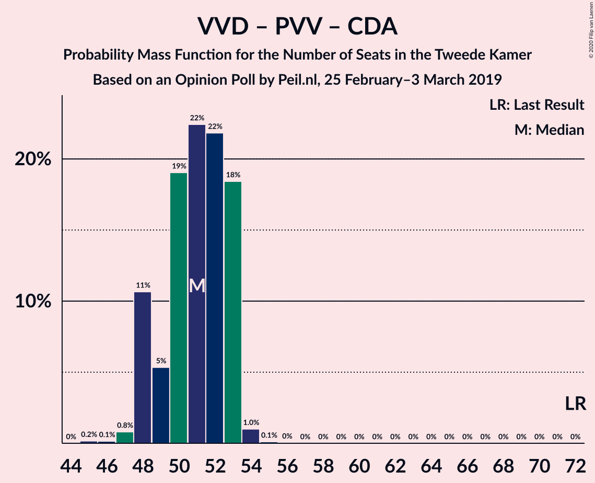

| Number of Seats | Probability | Accumulated | Special Marks |
|:---------------:|:-----------:|:-----------:|:-------------:|
| 45 | 0.2% | 100% |  |
| 46 | 0.1% | 99.8% |  |
| 47 | 0.8% | 99.7% |  |
| 48 | 11% | 98.9% |  |
| 49 | 5% | 88% |  |
| 50 | 19% | 83% |  |
| 51 | 22% | 64% | Median |
| 52 | 22% | 41% |  |
| 53 | 18% | 20% |  |
| 54 | 1.0% | 1.2% |  |
| 55 | 0.1% | 0.2% |  |
| 56 | 0% | 0% |  |
| 57 | 0% | 0% |  |
| 58 | 0% | 0% |  |
| 59 | 0% | 0% |  |
| 60 | 0% | 0% |  |
| 61 | 0% | 0% |  |
| 62 | 0% | 0% |  |
| 63 | 0% | 0% |  |
| 64 | 0% | 0% |  |
| 65 | 0% | 0% |  |
| 66 | 0% | 0% |  |
| 67 | 0% | 0% |  |
| 68 | 0% | 0% |  |
| 69 | 0% | 0% |  |
| 70 | 0% | 0% |  |
| 71 | 0% | 0% |  |
| 72 | 0% | 0% | Last Result |

### Volkspartij voor Vrijheid en Democratie – Christen-Democratisch Appèl – Democraten 66 – ChristenUnie

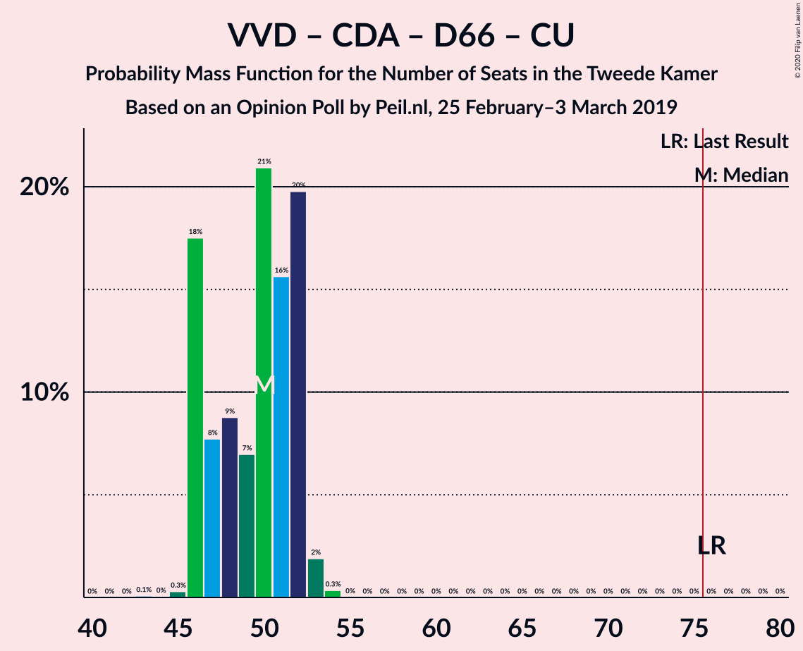

| Number of Seats | Probability | Accumulated | Special Marks |
|:---------------:|:-----------:|:-----------:|:-------------:|
| 43 | 0.1% | 100% |  |
| 44 | 0% | 99.9% |  |
| 45 | 0.3% | 99.9% |  |
| 46 | 18% | 99.6% |  |
| 47 | 8% | 82% |  |
| 48 | 9% | 74% |  |
| 49 | 7% | 66% |  |
| 50 | 21% | 59% | Median |
| 51 | 16% | 38% |  |
| 52 | 20% | 22% |  |
| 53 | 2% | 2% |  |
| 54 | 0.3% | 0.4% |  |
| 55 | 0% | 0% |  |
| 56 | 0% | 0% |  |
| 57 | 0% | 0% |  |
| 58 | 0% | 0% |  |
| 59 | 0% | 0% |  |
| 60 | 0% | 0% |  |
| 61 | 0% | 0% |  |
| 62 | 0% | 0% |  |
| 63 | 0% | 0% |  |
| 64 | 0% | 0% |  |
| 65 | 0% | 0% |  |
| 66 | 0% | 0% |  |
| 67 | 0% | 0% |  |
| 68 | 0% | 0% |  |
| 69 | 0% | 0% |  |
| 70 | 0% | 0% |  |
| 71 | 0% | 0% |  |
| 72 | 0% | 0% |  |
| 73 | 0% | 0% |  |
| 74 | 0% | 0% |  |
| 75 | 0% | 0% |  |
| 76 | 0% | 0% | Last Result, Majority |

### Volkspartij voor Vrijheid en Democratie – Partij van de Arbeid – Christen-Democratisch Appèl

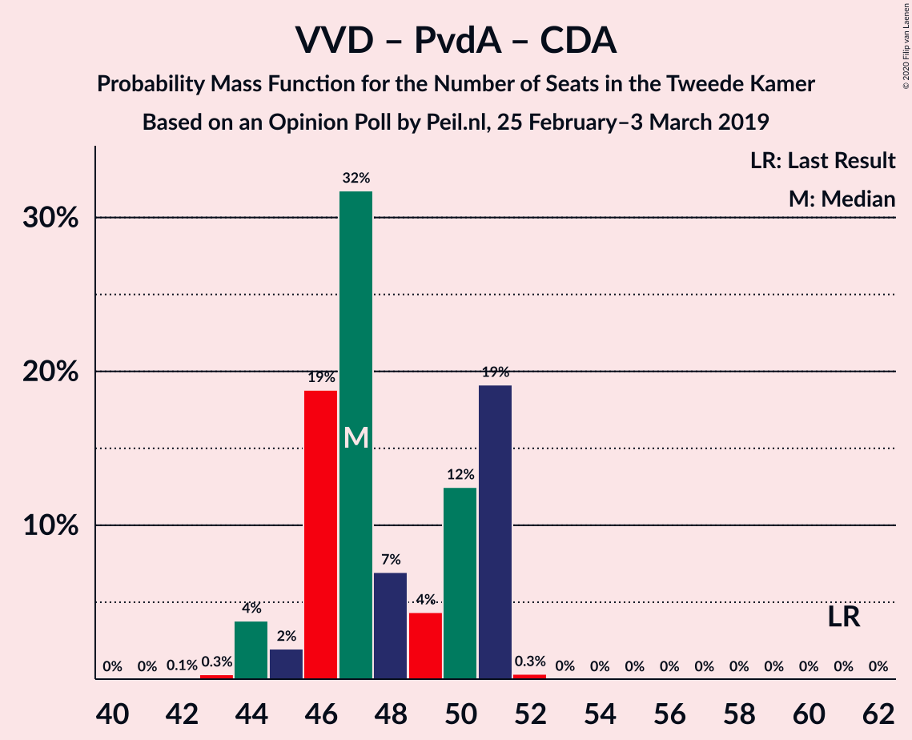

| Number of Seats | Probability | Accumulated | Special Marks |
|:---------------:|:-----------:|:-----------:|:-------------:|
| 42 | 0.1% | 100% |  |
| 43 | 0.3% | 99.9% |  |
| 44 | 4% | 99.6% |  |
| 45 | 2% | 96% |  |
| 46 | 19% | 94% |  |
| 47 | 32% | 75% |  |
| 48 | 7% | 43% | Median |
| 49 | 4% | 36% |  |
| 50 | 12% | 32% |  |
| 51 | 19% | 20% |  |
| 52 | 0.3% | 0.4% |  |
| 53 | 0% | 0% |  |
| 54 | 0% | 0% |  |
| 55 | 0% | 0% |  |
| 56 | 0% | 0% |  |
| 57 | 0% | 0% |  |
| 58 | 0% | 0% |  |
| 59 | 0% | 0% |  |
| 60 | 0% | 0% |  |
| 61 | 0% | 0% | Last Result |

### Volkspartij voor Vrijheid en Democratie – Partij van de Arbeid – Democraten 66

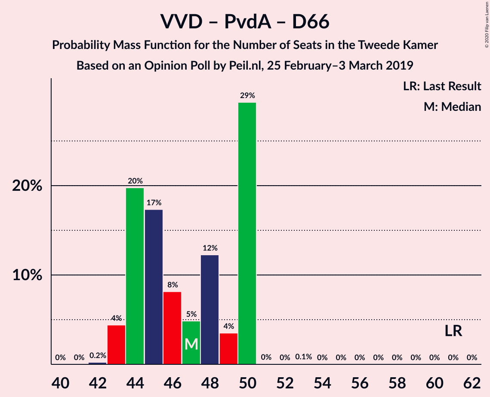

| Number of Seats | Probability | Accumulated | Special Marks |
|:---------------:|:-----------:|:-----------:|:-------------:|
| 42 | 0.2% | 100% |  |
| 43 | 4% | 99.8% |  |
| 44 | 20% | 95% |  |
| 45 | 17% | 76% |  |
| 46 | 8% | 58% |  |
| 47 | 5% | 50% | Median |
| 48 | 12% | 45% |  |
| 49 | 4% | 33% |  |
| 50 | 29% | 29% |  |
| 51 | 0% | 0.1% |  |
| 52 | 0% | 0.1% |  |
| 53 | 0.1% | 0.1% |  |
| 54 | 0% | 0% |  |
| 55 | 0% | 0% |  |
| 56 | 0% | 0% |  |
| 57 | 0% | 0% |  |
| 58 | 0% | 0% |  |
| 59 | 0% | 0% |  |
| 60 | 0% | 0% |  |
| 61 | 0% | 0% | Last Result |

### Volkspartij voor Vrijheid en Democratie – Christen-Democratisch Appèl – Democraten 66

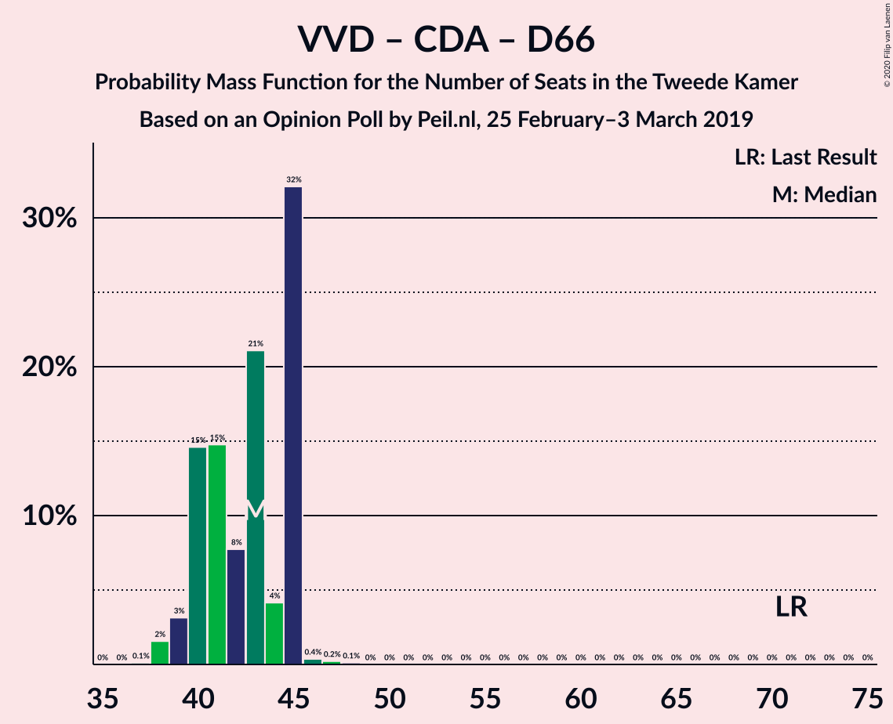

| Number of Seats | Probability | Accumulated | Special Marks |
|:---------------:|:-----------:|:-----------:|:-------------:|
| 37 | 0.1% | 100% |  |
| 38 | 2% | 99.9% |  |
| 39 | 3% | 98% |  |
| 40 | 15% | 95% |  |
| 41 | 15% | 81% |  |
| 42 | 8% | 66% |  |
| 43 | 21% | 58% | Median |
| 44 | 4% | 37% |  |
| 45 | 32% | 33% |  |
| 46 | 0.4% | 0.7% |  |
| 47 | 0.2% | 0.3% |  |
| 48 | 0.1% | 0.1% |  |
| 49 | 0% | 0% |  |
| 50 | 0% | 0% |  |
| 51 | 0% | 0% |  |
| 52 | 0% | 0% |  |
| 53 | 0% | 0% |  |
| 54 | 0% | 0% |  |
| 55 | 0% | 0% |  |
| 56 | 0% | 0% |  |
| 57 | 0% | 0% |  |
| 58 | 0% | 0% |  |
| 59 | 0% | 0% |  |
| 60 | 0% | 0% |  |
| 61 | 0% | 0% |  |
| 62 | 0% | 0% |  |
| 63 | 0% | 0% |  |
| 64 | 0% | 0% |  |
| 65 | 0% | 0% |  |
| 66 | 0% | 0% |  |
| 67 | 0% | 0% |  |
| 68 | 0% | 0% |  |
| 69 | 0% | 0% |  |
| 70 | 0% | 0% |  |
| 71 | 0% | 0% | Last Result |

### Volkspartij voor Vrijheid en Democratie – Partij van de Arbeid

| Number of Seats | Probability | Accumulated | Special Marks |
|:---------------:|:-----------:|:-----------:|:-------------:|
| 32 | 0.1% | 100% |  |
| 33 | 0% | 99.9% |  |
| 34 | 0.8% | 99.9% |  |
| 35 | 4% | 99.1% |  |
| 36 | 25% | 95% |  |
| 37 | 17% | 70% |  |
| 38 | 10% | 53% | Median |
| 39 | 13% | 43% |  |
| 40 | 10% | 30% |  |
| 41 | 20% | 20% |  |
| 42 | 0.1% | 0.1% | Last Result |
| 43 | 0% | 0% |  |

### Volkspartij voor Vrijheid en Democratie – Christen-Democratisch Appèl

| Number of Seats | Probability | Accumulated | Special Marks |
|:---------------:|:-----------:|:-----------:|:-------------:|
| 28 | 0.1% | 100% |  |
| 29 | 0.2% | 99.9% |  |
| 30 | 2% | 99.7% |  |
| 31 | 6% | 97% |  |
| 32 | 20% | 91% |  |
| 33 | 12% | 71% |  |
| 34 | 8% | 59% | Median |
| 35 | 31% | 51% |  |
| 36 | 20% | 20% |  |
| 37 | 0.5% | 0.7% |  |
| 38 | 0.2% | 0.2% |  |
| 39 | 0% | 0% |  |
| 40 | 0% | 0% |  |
| 41 | 0% | 0% |  |
| 42 | 0% | 0% |  |
| 43 | 0% | 0% |  |
| 44 | 0% | 0% |  |
| 45 | 0% | 0% |  |
| 46 | 0% | 0% |  |
| 47 | 0% | 0% |  |
| 48 | 0% | 0% |  |
| 49 | 0% | 0% |  |
| 50 | 0% | 0% |  |
| 51 | 0% | 0% |  |
| 52 | 0% | 0% | Last Result |

### Partij van de Arbeid – Christen-Democratisch Appèl – Democraten 66

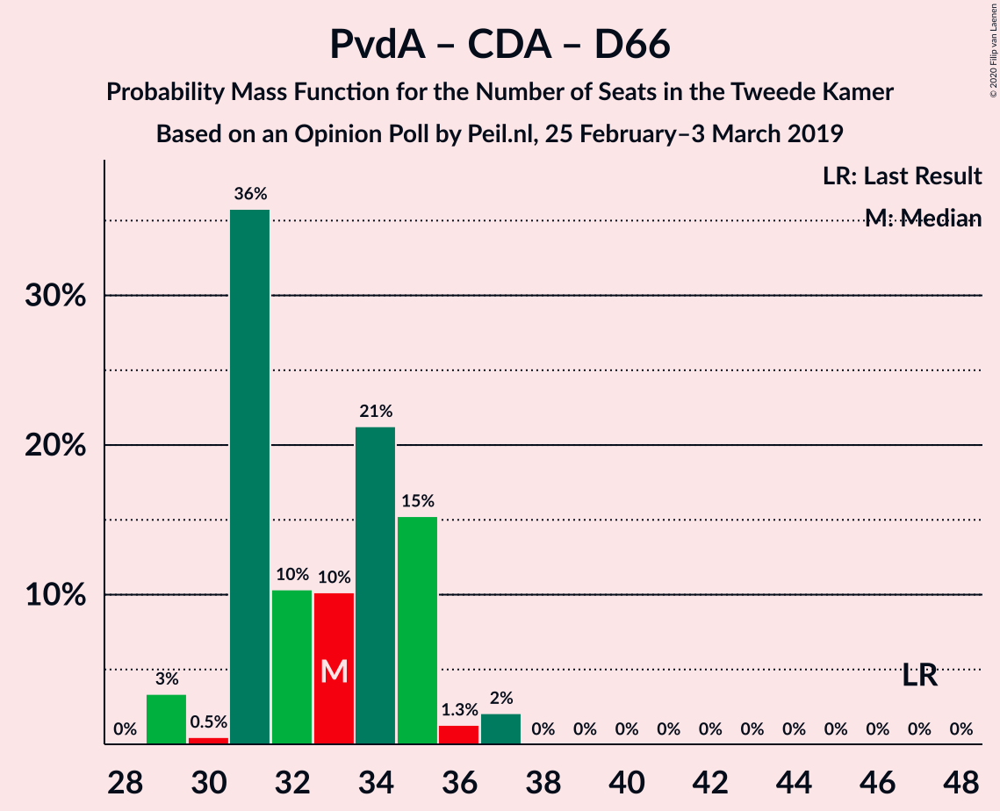

| Number of Seats | Probability | Accumulated | Special Marks |
|:---------------:|:-----------:|:-----------:|:-------------:|
| 29 | 3% | 100% |  |
| 30 | 0.5% | 97% |  |
| 31 | 36% | 96% |  |
| 32 | 10% | 60% |  |
| 33 | 10% | 50% | Median |
| 34 | 21% | 40% |  |
| 35 | 15% | 19% |  |
| 36 | 1.3% | 3% |  |
| 37 | 2% | 2% |  |
| 38 | 0% | 0% |  |
| 39 | 0% | 0% |  |
| 40 | 0% | 0% |  |
| 41 | 0% | 0% |  |
| 42 | 0% | 0% |  |
| 43 | 0% | 0% |  |
| 44 | 0% | 0% |  |
| 45 | 0% | 0% |  |
| 46 | 0% | 0% |  |
| 47 | 0% | 0% | Last Result |

### Partij van de Arbeid – Christen-Democratisch Appèl – ChristenUnie

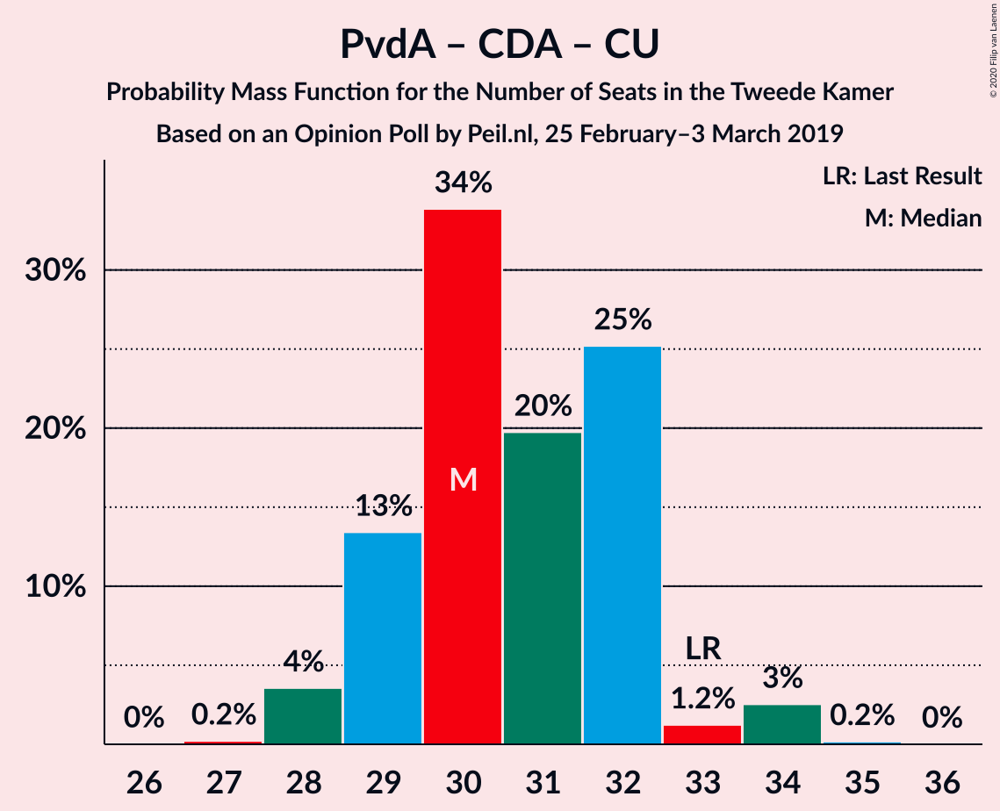

| Number of Seats | Probability | Accumulated | Special Marks |
|:---------------:|:-----------:|:-----------:|:-------------:|
| 26 | 0% | 100% |  |
| 27 | 0.2% | 99.9% |  |
| 28 | 4% | 99.7% |  |
| 29 | 13% | 96% |  |
| 30 | 34% | 83% |  |
| 31 | 20% | 49% | Median |
| 32 | 25% | 29% |  |
| 33 | 1.2% | 4% | Last Result |
| 34 | 3% | 3% |  |
| 35 | 0.2% | 0.2% |  |
| 36 | 0% | 0% |  |

### Partij van de Arbeid – Christen-Democratisch Appèl

| Number of Seats | Probability | Accumulated | Special Marks |
|:---------------:|:-----------:|:-----------:|:-------------:|
| 20 | 0% | 100% |  |
| 21 | 0.4% | 99.9% |  |
| 22 | 8% | 99.5% |  |
| 23 | 41% | 92% |  |
| 24 | 12% | 51% | Median |
| 25 | 32% | 38% |  |
| 26 | 4% | 7% |  |
| 27 | 2% | 3% |  |
| 28 | 0.3% | 0.3% | Last Result |
| 29 | 0% | 0% |  |

### Christen-Democratisch Appèl – Democraten 66

| Number of Seats | Probability | Accumulated | Special Marks |
|:---------------:|:-----------:|:-----------:|:-------------:|
| 16 | 3% | 100% |  |
| 17 | 20% | 97% |  |
| 18 | 13% | 76% |  |
| 19 | 43% | 63% | Median |
| 20 | 13% | 20% |  |
| 21 | 6% | 7% |  |
| 22 | 0.4% | 0.6% |  |
| 23 | 0.1% | 0.1% |  |
| 24 | 0% | 0% |  |
| 25 | 0% | 0% |  |
| 26 | 0% | 0% |  |
| 27 | 0% | 0% |  |
| 28 | 0% | 0% |  |
| 29 | 0% | 0% |  |
| 30 | 0% | 0% |  |
| 31 | 0% | 0% |  |
| 32 | 0% | 0% |  |
| 33 | 0% | 0% |  |
| 34 | 0% | 0% |  |
| 35 | 0% | 0% |  |
| 36 | 0% | 0% |  |
| 37 | 0% | 0% |  |
| 38 | 0% | 0% | Last Result |

## Technical Information

### Opinion Poll

+ **Polling firm:** Peil.nl
+ **Commissioner(s):** —
+ **Fieldwork period:** 25 February–3 March 2019

### Calculations

+ **Sample size:** 3000
+ **Simulations done:** 1,048,576
+ **Error estimate:** 1.86%

