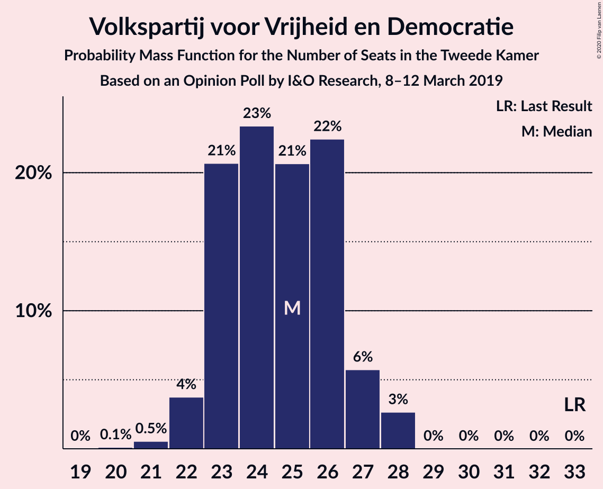
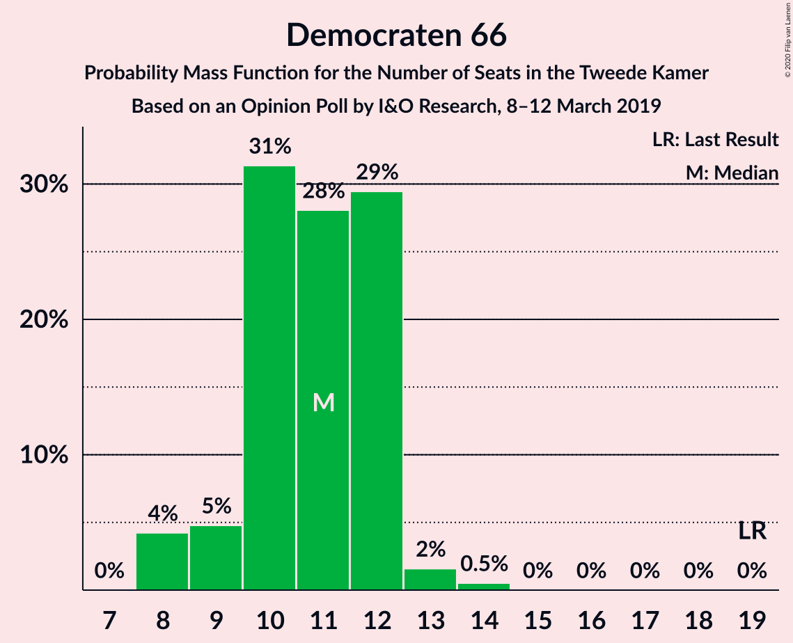
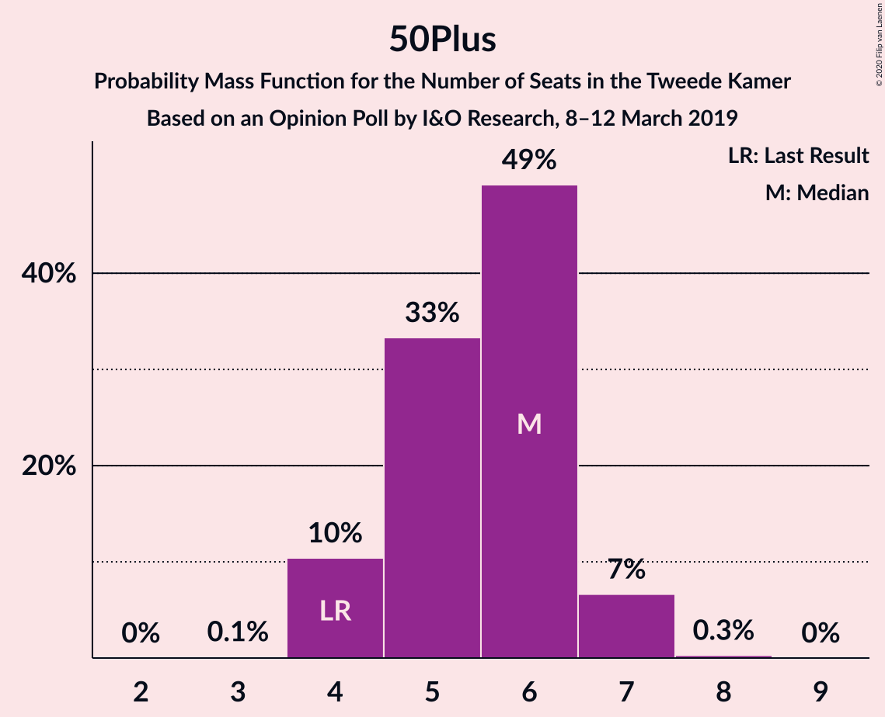
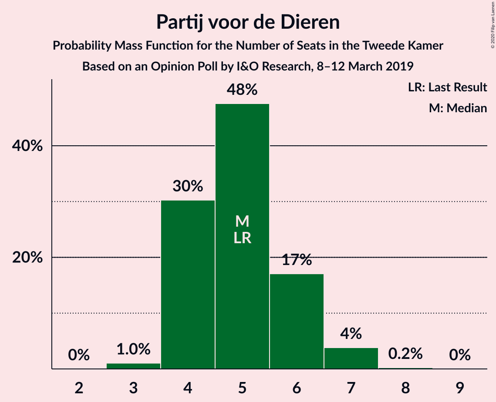
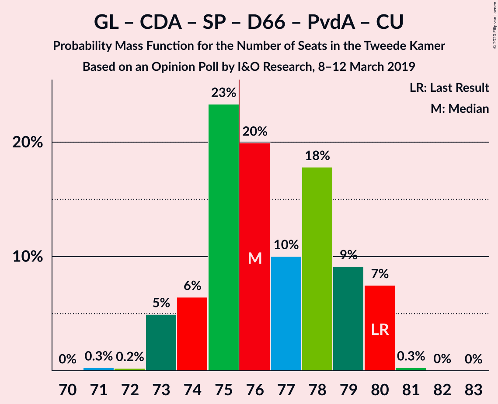
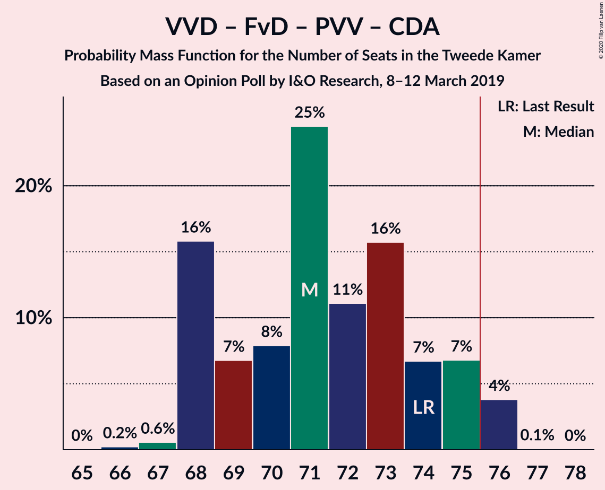
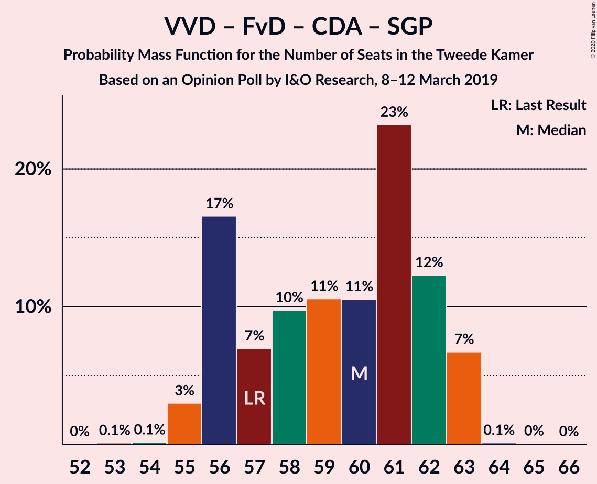
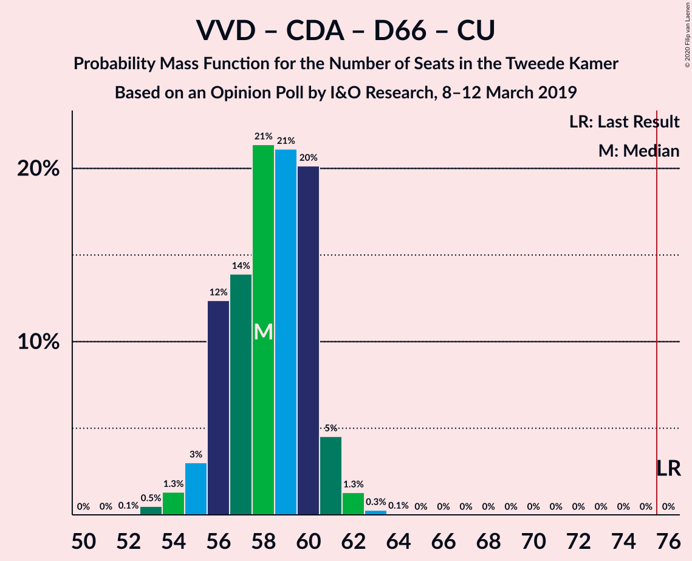
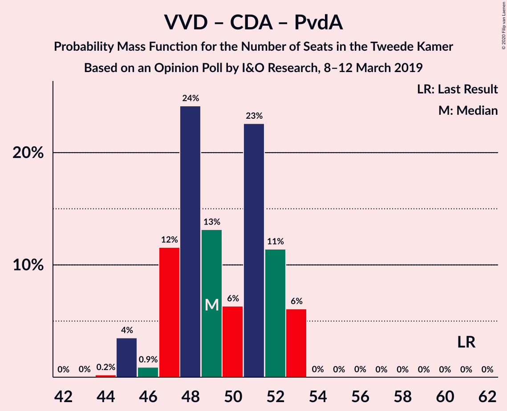
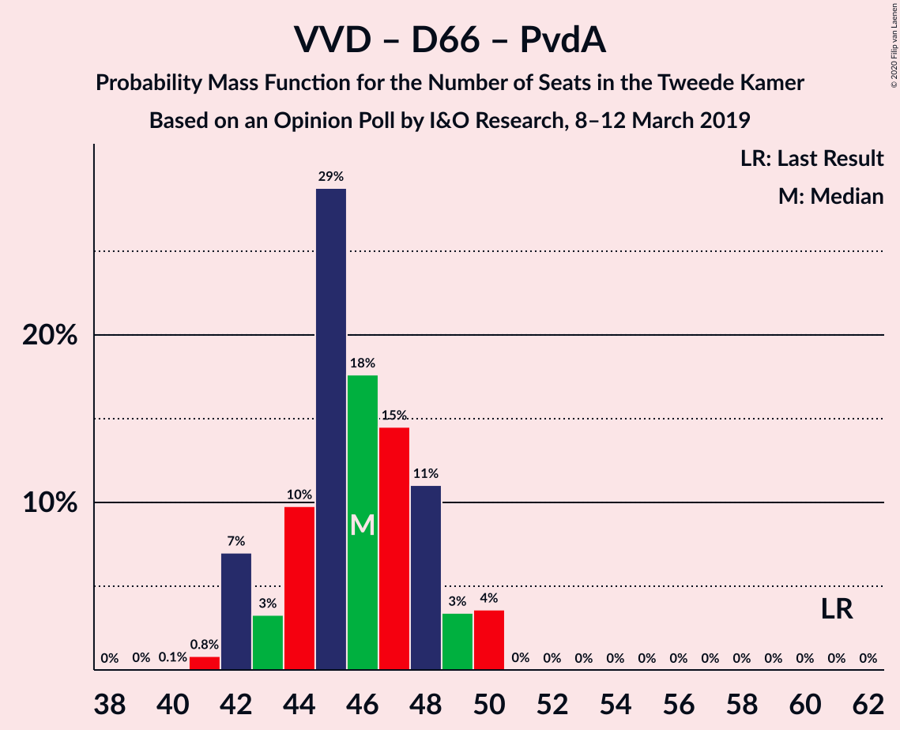

# Opinion Poll by I&O Research, 8–12 March 2019

<a href="#voting-intentions">Voting Intentions</a> | <a href="#seats">Seats</a> | <a href="#coalitions">Coalitions</a> | <a href="#technical-information">Technical Information</a>

## Voting Intentions

### Confidence Intervals

| Party | Last Result | Poll Result | 80% Confidence Interval | 90% Confidence Interval | 95% Confidence Interval | 99% Confidence Interval |
|:-----:|:-----------:|:-----------:|:-----------------------:|:-----------------------:|:-----------------------:|:-----------------------:|
| Volkspartij voor Vrijheid en Democratie | 21.3% | 15.8% | 14.8–16.9% |14.5–17.2% |14.3–17.4% |13.8–17.9% |
| GroenLinks | 9.1% | 12.0% | 11.1–13.0% |10.9–13.2% |10.7–13.5% |10.3–13.9% |
| Forum voor Democratie | 1.8% | 11.5% | 10.6–12.4% |10.4–12.7% |10.2–12.9% |9.8–13.4% |
| Partij voor de Vrijheid | 13.1% | 10.0% | 9.2–10.9% |8.9–11.1% |8.8–11.4% |8.4–11.8% |
| Christen-Democratisch Appèl | 12.4% | 9.6% | 8.8–10.5% |8.6–10.7% |8.4–10.9% |8.0–11.4% |
| Socialistische Partij | 9.1% | 9.6% | 8.8–10.5% |8.6–10.7% |8.4–10.9% |8.0–11.4% |
| Democraten 66 | 12.2% | 7.1% | 6.4–7.9% |6.2–8.1% |6.1–8.3% |5.8–8.7% |
| Partij van de Arbeid | 5.7% | 6.8% | 6.1–7.6% |6.0–7.8% |5.8–8.0% |5.5–8.4% |
| ChristenUnie | 3.4% | 5.5% | 4.9–6.2% |4.8–6.4% |4.6–6.6% |4.3–6.9% |
| 50Plus | 3.1% | 3.8% | 3.3–4.4% |3.2–4.6% |3.0–4.7% |2.8–5.0% |
| Partij voor de Dieren | 3.2% | 3.6% | 3.1–4.2% |3.0–4.3% |2.9–4.5% |2.7–4.8% |
| DENK | 2.1% | 2.3% | 1.9–2.8% |1.8–2.9% |1.7–3.0% |1.6–3.3% |
| Staatkundig Gereformeerde Partij | 2.1% | 2.1% | 1.8–2.6% |1.7–2.7% |1.6–2.8% |1.4–3.1% |

*Note:* The poll result column reflects the actual value used in the calculations. Published results may vary slightly, and in addition be rounded to fewer digits.

## Seats

### Confidence Intervals

| Party | Last Result | Median | 80% Confidence Interval | 90% Confidence Interval | 95% Confidence Interval | 99% Confidence Interval |
|:-----:|:-----------:|:------:|:-----------------------:|:-----------------------:|:-----------------------:|:-----------------------:|
| <a href="#volkspartij-voor-vrijheid-en-democratie">Volkspartij voor Vrijheid en Democratie</a> | 33 | 24 | 23–25 |23–25 |23–26 |21–27 |
| <a href="#groenlinks">GroenLinks</a> | 14 | 17 | 16–18 |16–18 |16–19 |16–21 |
| <a href="#forum-voor-democratie">Forum voor Democratie</a> | 2 | 17 | 17–19 |17–19 |17–19 |14–20 |
| <a href="#partij-voor-de-vrijheid">Partij voor de Vrijheid</a> | 20 | 15 | 14–15 |14–16 |13–17 |12–17 |
| <a href="#christen-democratisch-appèl">Christen-Democratisch Appèl</a> | 19 | 14 | 13–15 |13–16 |13–16 |13–18 |
| <a href="#socialistische-partij">Socialistische Partij</a> | 14 | 14 | 13–18 |13–18 |13–18 |13–18 |
| <a href="#democraten-66">Democraten 66</a> | 19 | 12 | 10–12 |9–12 |9–12 |8–12 |
| <a href="#partij-van-de-arbeid">Partij van de Arbeid</a> | 9 | 11 | 10–12 |10–12 |9–12 |8–12 |
| <a href="#christenunie">ChristenUnie</a> | 5 | 10 | 8–10 |8–10 |7–10 |7–10 |
| <a href="#50plus">50Plus</a> | 4 | 6 | 5–6 |5–7 |5–7 |4–7 |
| <a href="#partij-voor-de-dieren">Partij voor de Dieren</a> | 5 | 5 | 4–5 |4–6 |4–7 |4–7 |
| <a href="#denk">DENK</a> | 3 | 3 | 3 |2–3 |2–4 |2–4 |
| <a href="#staatkundig-gereformeerde-partij">Staatkundig Gereformeerde Partij</a> | 3 | 3 | 2–3 |2–3 |2–4 |2–4 |

### Volkspartij voor Vrijheid en Democratie

*For a full overview of the results for this party, see the [Volkspartij voor Vrijheid en Democratie](party-volkspartijvoorvrijheidendemocratie.html) page.*

| Number of Seats | Probability | Accumulated | Special Marks |
|:---------------:|:-----------:|:-----------:|:-------------:|
| 20 | 0.1% | 100% |  |
| 21 | 0.7% | 99.9% |  |
| 22 | 2% | 99.2% |  |
| 23 | 32% | 98% |  |
| 24 | 40% | 65% | Median |
| 25 | 20% | 25% |  |
| 26 | 4% | 5% |  |
| 27 | 1.1% | 1.2% |  |
| 28 | 0% | 0.1% |  |
| 29 | 0% | 0% |  |
| 30 | 0% | 0% |  |
| 31 | 0% | 0% |  |
| 32 | 0% | 0% |  |
| 33 | 0% | 0% | Last Result |

### GroenLinks

*For a full overview of the results for this party, see the [GroenLinks](party-groenlinks.html) page.*

| Number of Seats | Probability | Accumulated | Special Marks |
|:---------------:|:-----------:|:-----------:|:-------------:|
| 14 | 0.2% | 100% | Last Result |
| 15 | 0.3% | 99.8% |  |
| 16 | 16% | 99.5% |  |
| 17 | 46% | 84% | Median |
| 18 | 34% | 38% |  |
| 19 | 2% | 4% |  |
| 20 | 1.3% | 2% |  |
| 21 | 0.5% | 0.6% |  |
| 22 | 0% | 0.1% |  |
| 23 | 0% | 0% |  |

### Forum voor Democratie

*For a full overview of the results for this party, see the [Forum voor Democratie](party-forumvoordemocratie.html) page.*

| Number of Seats | Probability | Accumulated | Special Marks |
|:---------------:|:-----------:|:-----------:|:-------------:|
| 2 | 0% | 100% | Last Result |
| 3 | 0% | 100% |  |
| 4 | 0% | 100% |  |
| 5 | 0% | 100% |  |
| 6 | 0% | 100% |  |
| 7 | 0% | 100% |  |
| 8 | 0% | 100% |  |
| 9 | 0% | 100% |  |
| 10 | 0% | 100% |  |
| 11 | 0% | 100% |  |
| 12 | 0% | 100% |  |
| 13 | 0% | 100% |  |
| 14 | 1.1% | 100% |  |
| 15 | 0.2% | 98.9% |  |
| 16 | 0.8% | 98.7% |  |
| 17 | 75% | 98% | Median |
| 18 | 2% | 23% |  |
| 19 | 20% | 22% |  |
| 20 | 1.1% | 1.3% |  |
| 21 | 0.1% | 0.2% |  |
| 22 | 0% | 0% |  |

### Partij voor de Vrijheid

*For a full overview of the results for this party, see the [Partij voor de Vrijheid](party-partijvoordevrijheid.html) page.*

| Number of Seats | Probability | Accumulated | Special Marks |
|:---------------:|:-----------:|:-----------:|:-------------:|
| 12 | 0.9% | 100% |  |
| 13 | 2% | 99.1% |  |
| 14 | 35% | 97% |  |
| 15 | 54% | 62% | Median |
| 16 | 5% | 8% |  |
| 17 | 3% | 3% |  |
| 18 | 0.1% | 0.1% |  |
| 19 | 0% | 0% |  |
| 20 | 0% | 0% | Last Result |

### Christen-Democratisch Appèl

*For a full overview of the results for this party, see the [Christen-Democratisch Appèl](party-christen-democratischappèl.html) page.*

| Number of Seats | Probability | Accumulated | Special Marks |
|:---------------:|:-----------:|:-----------:|:-------------:|
| 12 | 0.1% | 100% |  |
| 13 | 16% | 99.9% |  |
| 14 | 52% | 84% | Median |
| 15 | 25% | 31% |  |
| 16 | 5% | 7% |  |
| 17 | 0.4% | 1.1% |  |
| 18 | 0.7% | 0.8% |  |
| 19 | 0% | 0% | Last Result |

### Socialistische Partij

*For a full overview of the results for this party, see the [Socialistische Partij](party-socialistischepartij.html) page.*

| Number of Seats | Probability | Accumulated | Special Marks |
|:---------------:|:-----------:|:-----------:|:-------------:|
| 12 | 0.3% | 100% |  |
| 13 | 36% | 99.7% |  |
| 14 | 27% | 64% | Last Result, Median |
| 15 | 3% | 37% |  |
| 16 | 1.5% | 34% |  |
| 17 | 0.2% | 32% |  |
| 18 | 32% | 32% |  |
| 19 | 0% | 0% |  |

### Democraten 66

*For a full overview of the results for this party, see the [Democraten 66](party-democraten66.html) page.*

| Number of Seats | Probability | Accumulated | Special Marks |
|:---------------:|:-----------:|:-----------:|:-------------:|
| 8 | 0.6% | 100% |  |
| 9 | 6% | 99.4% |  |
| 10 | 23% | 94% |  |
| 11 | 17% | 71% |  |
| 12 | 53% | 54% | Median |
| 13 | 0.2% | 0.2% |  |
| 14 | 0% | 0% |  |
| 15 | 0% | 0% |  |
| 16 | 0% | 0% |  |
| 17 | 0% | 0% |  |
| 18 | 0% | 0% |  |
| 19 | 0% | 0% | Last Result |

### Partij van de Arbeid

*For a full overview of the results for this party, see the [Partij van de Arbeid](party-partijvandearbeid.html) page.*

| Number of Seats | Probability | Accumulated | Special Marks |
|:---------------:|:-----------:|:-----------:|:-------------:|
| 8 | 1.1% | 100% |  |
| 9 | 3% | 98.9% | Last Result |
| 10 | 36% | 96% |  |
| 11 | 21% | 60% | Median |
| 12 | 38% | 39% |  |
| 13 | 0.2% | 0.2% |  |
| 14 | 0% | 0% |  |

### ChristenUnie

*For a full overview of the results for this party, see the [ChristenUnie](party-christenunie.html) page.*

| Number of Seats | Probability | Accumulated | Special Marks |
|:---------------:|:-----------:|:-----------:|:-------------:|
| 5 | 0% | 100% | Last Result |
| 6 | 0.4% | 100% |  |
| 7 | 4% | 99.6% |  |
| 8 | 35% | 96% |  |
| 9 | 6% | 61% |  |
| 10 | 55% | 55% | Median |
| 11 | 0.1% | 0.1% |  |
| 12 | 0% | 0% |  |

### 50Plus

*For a full overview of the results for this party, see the [50Plus](party-50plus.html) page.*

| Number of Seats | Probability | Accumulated | Special Marks |
|:---------------:|:-----------:|:-----------:|:-------------:|
| 3 | 0.2% | 100% |  |
| 4 | 0.5% | 99.8% | Last Result |
| 5 | 24% | 99.3% |  |
| 6 | 69% | 75% | Median |
| 7 | 6% | 6% |  |
| 8 | 0% | 0% |  |

### Partij voor de Dieren

*For a full overview of the results for this party, see the [Partij voor de Dieren](party-partijvoordedieren.html) page.*

| Number of Seats | Probability | Accumulated | Special Marks |
|:---------------:|:-----------:|:-----------:|:-------------:|
| 3 | 0.3% | 100% |  |
| 4 | 24% | 99.7% |  |
| 5 | 70% | 76% | Last Result, Median |
| 6 | 3% | 5% |  |
| 7 | 3% | 3% |  |
| 8 | 0% | 0% |  |

### DENK

*For a full overview of the results for this party, see the [DENK](party-denk.html) page.*

| Number of Seats | Probability | Accumulated | Special Marks |
|:---------------:|:-----------:|:-----------:|:-------------:|
| 2 | 6% | 100% |  |
| 3 | 91% | 94% | Last Result, Median |
| 4 | 3% | 3% |  |
| 5 | 0.3% | 0.3% |  |
| 6 | 0% | 0% |  |

### Staatkundig Gereformeerde Partij

*For a full overview of the results for this party, see the [Staatkundig Gereformeerde Partij](party-staatkundiggereformeerdepartij.html) page.*

| Number of Seats | Probability | Accumulated | Special Marks |
|:---------------:|:-----------:|:-----------:|:-------------:|
| 2 | 40% | 100% |  |
| 3 | 57% | 60% | Last Result, Median |
| 4 | 3% | 3% |  |
| 5 | 0% | 0% |  |

## Coalitions

### Confidence Intervals

| Coalition | Last Result | Median | Majority? | 80% Confidence Interval | 90% Confidence Interval | 95% Confidence Interval | 99% Confidence Interval |
|:---------:|:-----------:|:------:|:---------:|:-----------------------:|:-----------------------:|:-----------------------:|:-----------------------:|
| GroenLinks – Christen-Democratisch Appèl – Socialistische Partij – Democraten 66 – Partij van de Arbeid – ChristenUnie | 80 | 78 | 76% | 74–80 | 74–80 | 73–80 | 73–81 |
| Volkspartij voor Vrijheid en Democratie – GroenLinks – Christen-Democratisch Appèl – Democraten 66 – ChristenUnie | 90 | 75 | 46% | 75–77 | 75–77 | 75–78 | 73–80 |
| Volkspartij voor Vrijheid en Democratie – Forum voor Democratie – Partij voor de Vrijheid – Christen-Democratisch Appèl – Staatkundig Gereformeerde Partij | 77 | 73 | 8% | 70–75 | 70–77 | 70–78 | 70–78 |
| Volkspartij voor Vrijheid en Democratie – Forum voor Democratie – Partij voor de Vrijheid – Christen-Democratisch Appèl | 74 | 70 | 3% | 68–72 | 68–75 | 68–76 | 68–76 |
| Volkspartij voor Vrijheid en Democratie – Christen-Democratisch Appèl – Democraten 66 – Partij van de Arbeid – ChristenUnie | 85 | 70 | 0% | 67–72 | 67–72 | 67–72 | 63–72 |
| Volkspartij voor Vrijheid en Democratie – Forum voor Democratie – Christen-Democratisch Appèl – 50Plus – Staatkundig Gereformeerde Partij | 61 | 63 | 0% | 62–66 | 62–68 | 62–68 | 62–69 |
| Volkspartij voor Vrijheid en Democratie – Forum voor Democratie – Christen-Democratisch Appèl – 50Plus | 58 | 60 | 0% | 60–63 | 60–66 | 60–66 | 59–66 |
| GroenLinks – Christen-Democratisch Appèl – Democraten 66 – Partij van de Arbeid – ChristenUnie | 66 | 62 | 0% | 61–65 | 61–65 | 59–65 | 59–66 |
| Volkspartij voor Vrijheid en Democratie – Forum voor Democratie – Christen-Democratisch Appèl – Staatkundig Gereformeerde Partij | 57 | 58 | 0% | 56–60 | 56–61 | 56–61 | 56–63 |
| Volkspartij voor Vrijheid en Democratie – Christen-Democratisch Appèl – Democraten 66 – ChristenUnie | 76 | 59 | 0% | 57–60 | 57–60 | 57–60 | 54–62 |
| Volkspartij voor Vrijheid en Democratie – Forum voor Democratie – Christen-Democratisch Appèl | 54 | 55 | 0% | 54–57 | 54–59 | 54–59 | 53–61 |
| Volkspartij voor Vrijheid en Democratie – Partij voor de Vrijheid – Christen-Democratisch Appèl | 72 | 53 | 0% | 51–54 | 51–56 | 51–58 | 49–59 |
| Volkspartij voor Vrijheid en Democratie – Christen-Democratisch Appèl – Democraten 66 | 71 | 49 | 0% | 49–50 | 49–52 | 49–52 | 46–52 |
| Volkspartij voor Vrijheid en Democratie – Christen-Democratisch Appèl – Partij van de Arbeid | 61 | 49 | 0% | 47–51 | 47–51 | 47–52 | 45–52 |
| Volkspartij voor Vrijheid en Democratie – Democraten 66 – Partij van de Arbeid | 61 | 46 | 0% | 45–48 | 45–48 | 44–48 | 41–48 |
| Volkspartij voor Vrijheid en Democratie – Christen-Democratisch Appèl | 52 | 38 | 0% | 37–40 | 37–40 | 37–42 | 35–42 |
| Christen-Democratisch Appèl – Democraten 66 – Partij van de Arbeid | 47 | 36 | 0% | 35–38 | 35–38 | 35–38 | 33–38 |
| Christen-Democratisch Appèl – Partij van de Arbeid – ChristenUnie | 33 | 34 | 0% | 32–37 | 32–37 | 32–37 | 31–37 |
| Volkspartij voor Vrijheid en Democratie – Partij van de Arbeid | 42 | 36 | 0% | 33–36 | 33–36 | 32–36 | 31–37 |
| Christen-Democratisch Appèl – Democraten 66 | 38 | 26 | 0% | 24–26 | 24–26 | 24–27 | 23–28 |
| Christen-Democratisch Appèl – Partij van de Arbeid | 28 | 24 | 0% | 24–27 | 24–27 | 24–27 | 23–28 |

### GroenLinks – Christen-Democratisch Appèl – Socialistische Partij – Democraten 66 – Partij van de Arbeid – ChristenUnie

| Number of Seats | Probability | Accumulated | Special Marks |
|:---------------:|:-----------:|:-----------:|:-------------:|
| 73 | 2% | 100% |  |
| 74 | 16% | 97% |  |
| 75 | 6% | 82% |  |
| 76 | 2% | 76% | Majority |
| 77 | 0.6% | 74% |  |
| 78 | 39% | 74% | Median |
| 79 | 1.3% | 35% |  |
| 80 | 33% | 33% | Last Result |
| 81 | 0.5% | 0.5% |  |
| 82 | 0% | 0% |  |

### Volkspartij voor Vrijheid en Democratie – GroenLinks – Christen-Democratisch Appèl – Democraten 66 – ChristenUnie

| Number of Seats | Probability | Accumulated | Special Marks |
|:---------------:|:-----------:|:-----------:|:-------------:|
| 71 | 0.2% | 100% |  |
| 72 | 0.3% | 99.8% |  |
| 73 | 1.1% | 99.5% |  |
| 74 | 0.3% | 98% |  |
| 75 | 52% | 98% |  |
| 76 | 22% | 46% | Majority |
| 77 | 21% | 24% | Median |
| 78 | 0.9% | 3% |  |
| 79 | 0.9% | 2% |  |
| 80 | 1.2% | 1.2% |  |
| 81 | 0% | 0.1% |  |
| 82 | 0.1% | 0.1% |  |
| 83 | 0% | 0% |  |
| 84 | 0% | 0% |  |
| 85 | 0% | 0% |  |
| 86 | 0% | 0% |  |
| 87 | 0% | 0% |  |
| 88 | 0% | 0% |  |
| 89 | 0% | 0% |  |
| 90 | 0% | 0% | Last Result |

### Volkspartij voor Vrijheid en Democratie – Forum voor Democratie – Partij voor de Vrijheid – Christen-Democratisch Appèl – Staatkundig Gereformeerde Partij

| Number of Seats | Probability | Accumulated | Special Marks |
|:---------------:|:-----------:|:-----------:|:-------------:|
| 69 | 0.2% | 100% |  |
| 70 | 32% | 99.7% |  |
| 71 | 0% | 68% |  |
| 72 | 1.1% | 68% |  |
| 73 | 22% | 67% | Median |
| 74 | 20% | 45% |  |
| 75 | 16% | 25% |  |
| 76 | 0.4% | 8% | Majority |
| 77 | 5% | 8% | Last Result |
| 78 | 3% | 3% |  |
| 79 | 0.2% | 0.3% |  |
| 80 | 0.1% | 0.2% |  |
| 81 | 0.1% | 0.1% |  |
| 82 | 0% | 0% |  |

### Volkspartij voor Vrijheid en Democratie – Forum voor Democratie – Partij voor de Vrijheid – Christen-Democratisch Appèl

| Number of Seats | Probability | Accumulated | Special Marks |
|:---------------:|:-----------:|:-----------:|:-------------:|
| 66 | 0.3% | 100% |  |
| 67 | 0.1% | 99.7% |  |
| 68 | 33% | 99.6% |  |
| 69 | 1.1% | 67% |  |
| 70 | 21% | 66% | Median |
| 71 | 20% | 45% |  |
| 72 | 16% | 25% |  |
| 73 | 0.6% | 8% |  |
| 74 | 0.4% | 8% | Last Result |
| 75 | 5% | 7% |  |
| 76 | 2% | 3% | Majority |
| 77 | 0.2% | 0.2% |  |
| 78 | 0% | 0% |  |

### Volkspartij voor Vrijheid en Democratie – Christen-Democratisch Appèl – Democraten 66 – Partij van de Arbeid – ChristenUnie

| Number of Seats | Probability | Accumulated | Special Marks |
|:---------------:|:-----------:|:-----------:|:-------------:|
| 63 | 0.6% | 100% |  |
| 64 | 0.1% | 99.4% |  |
| 65 | 0.2% | 99.3% |  |
| 66 | 0.8% | 99.2% |  |
| 67 | 33% | 98% |  |
| 68 | 3% | 66% |  |
| 69 | 6% | 62% |  |
| 70 | 17% | 56% |  |
| 71 | 19% | 39% | Median |
| 72 | 20% | 20% |  |
| 73 | 0.1% | 0.1% |  |
| 74 | 0% | 0% |  |
| 75 | 0% | 0% |  |
| 76 | 0% | 0% | Majority |
| 77 | 0% | 0% |  |
| 78 | 0% | 0% |  |
| 79 | 0% | 0% |  |
| 80 | 0% | 0% |  |
| 81 | 0% | 0% |  |
| 82 | 0% | 0% |  |
| 83 | 0% | 0% |  |
| 84 | 0% | 0% |  |
| 85 | 0% | 0% | Last Result |

### Volkspartij voor Vrijheid en Democratie – Forum voor Democratie – Christen-Democratisch Appèl – 50Plus – Staatkundig Gereformeerde Partij

| Number of Seats | Probability | Accumulated | Special Marks |
|:---------------:|:-----------:|:-----------:|:-------------:|
| 60 | 0.3% | 100% |  |
| 61 | 0.2% | 99.7% | Last Result |
| 62 | 32% | 99.5% |  |
| 63 | 20% | 67% |  |
| 64 | 1.1% | 48% | Median |
| 65 | 21% | 47% |  |
| 66 | 19% | 26% |  |
| 67 | 0.9% | 7% |  |
| 68 | 5% | 6% |  |
| 69 | 1.0% | 1.1% |  |
| 70 | 0.1% | 0.1% |  |
| 71 | 0% | 0% |  |

### Volkspartij voor Vrijheid en Democratie – Forum voor Democratie – Christen-Democratisch Appèl – 50Plus

| Number of Seats | Probability | Accumulated | Special Marks |
|:---------------:|:-----------:|:-----------:|:-------------:|
| 57 | 0.3% | 100% |  |
| 58 | 0.1% | 99.7% | Last Result |
| 59 | 0.4% | 99.5% |  |
| 60 | 52% | 99.2% |  |
| 61 | 1.0% | 47% | Median |
| 62 | 20% | 46% |  |
| 63 | 17% | 26% |  |
| 64 | 3% | 9% |  |
| 65 | 0.3% | 6% |  |
| 66 | 6% | 6% |  |
| 67 | 0% | 0.1% |  |
| 68 | 0.1% | 0.1% |  |
| 69 | 0% | 0% |  |

### GroenLinks – Christen-Democratisch Appèl – Democraten 66 – Partij van de Arbeid – ChristenUnie

| Number of Seats | Probability | Accumulated | Special Marks |
|:---------------:|:-----------:|:-----------:|:-------------:|
| 57 | 0.2% | 100% |  |
| 58 | 0.1% | 99.8% |  |
| 59 | 2% | 99.8% |  |
| 60 | 0.7% | 97% |  |
| 61 | 21% | 97% |  |
| 62 | 34% | 75% |  |
| 63 | 0.2% | 41% |  |
| 64 | 20% | 41% | Median |
| 65 | 20% | 21% |  |
| 66 | 1.3% | 1.3% | Last Result |
| 67 | 0% | 0% |  |

### Volkspartij voor Vrijheid en Democratie – Forum voor Democratie – Christen-Democratisch Appèl – Staatkundig Gereformeerde Partij

| Number of Seats | Probability | Accumulated | Special Marks |
|:---------------:|:-----------:|:-----------:|:-------------:|
| 54 | 0.2% | 100% |  |
| 55 | 0.2% | 99.8% |  |
| 56 | 32% | 99.6% |  |
| 57 | 0.2% | 67% | Last Result |
| 58 | 20% | 67% | Median |
| 59 | 21% | 48% |  |
| 60 | 17% | 27% |  |
| 61 | 7% | 10% |  |
| 62 | 1.2% | 2% |  |
| 63 | 0.5% | 0.8% |  |
| 64 | 0.2% | 0.4% |  |
| 65 | 0.1% | 0.1% |  |
| 66 | 0% | 0% |  |

### Volkspartij voor Vrijheid en Democratie – Christen-Democratisch Appèl – Democraten 66 – ChristenUnie

| Number of Seats | Probability | Accumulated | Special Marks |
|:---------------:|:-----------:|:-----------:|:-------------:|
| 52 | 0.3% | 100% |  |
| 53 | 0% | 99.7% |  |
| 54 | 0.6% | 99.7% |  |
| 55 | 0.3% | 99.2% |  |
| 56 | 0.8% | 98.9% |  |
| 57 | 33% | 98% |  |
| 58 | 5% | 65% |  |
| 59 | 38% | 60% |  |
| 60 | 20% | 22% | Median |
| 61 | 0.5% | 2% |  |
| 62 | 1.1% | 1.2% |  |
| 63 | 0.1% | 0.2% |  |
| 64 | 0% | 0% |  |
| 65 | 0% | 0% |  |
| 66 | 0% | 0% |  |
| 67 | 0% | 0% |  |
| 68 | 0% | 0% |  |
| 69 | 0% | 0% |  |
| 70 | 0% | 0% |  |
| 71 | 0% | 0% |  |
| 72 | 0% | 0% |  |
| 73 | 0% | 0% |  |
| 74 | 0% | 0% |  |
| 75 | 0% | 0% |  |
| 76 | 0% | 0% | Last Result, Majority |

### Volkspartij voor Vrijheid en Democratie – Forum voor Democratie – Christen-Democratisch Appèl

| Number of Seats | Probability | Accumulated | Special Marks |
|:---------------:|:-----------:|:-----------:|:-------------:|
| 51 | 0.2% | 100% |  |
| 52 | 0.1% | 99.8% |  |
| 53 | 0.4% | 99.6% |  |
| 54 | 32% | 99.2% | Last Result |
| 55 | 20% | 67% | Median |
| 56 | 21% | 47% |  |
| 57 | 17% | 26% |  |
| 58 | 0.6% | 9% |  |
| 59 | 8% | 9% |  |
| 60 | 0.3% | 0.8% |  |
| 61 | 0.4% | 0.5% |  |
| 62 | 0.1% | 0.1% |  |
| 63 | 0% | 0% |  |

### Volkspartij voor Vrijheid en Democratie – Partij voor de Vrijheid – Christen-Democratisch Appèl

| Number of Seats | Probability | Accumulated | Special Marks |
|:---------------:|:-----------:|:-----------:|:-------------:|
| 49 | 0.7% | 100% |  |
| 50 | 1.1% | 99.2% |  |
| 51 | 32% | 98% |  |
| 52 | 0.2% | 66% |  |
| 53 | 35% | 66% | Median |
| 54 | 20% | 30% |  |
| 55 | 1.4% | 10% |  |
| 56 | 6% | 9% |  |
| 57 | 0.5% | 3% |  |
| 58 | 0.1% | 3% |  |
| 59 | 2% | 2% |  |
| 60 | 0% | 0.1% |  |
| 61 | 0.1% | 0.1% |  |
| 62 | 0% | 0% |  |
| 63 | 0% | 0% |  |
| 64 | 0% | 0% |  |
| 65 | 0% | 0% |  |
| 66 | 0% | 0% |  |
| 67 | 0% | 0% |  |
| 68 | 0% | 0% |  |
| 69 | 0% | 0% |  |
| 70 | 0% | 0% |  |
| 71 | 0% | 0% |  |
| 72 | 0% | 0% | Last Result |

### Volkspartij voor Vrijheid en Democratie – Christen-Democratisch Appèl – Democraten 66

| Number of Seats | Probability | Accumulated | Special Marks |
|:---------------:|:-----------:|:-----------:|:-------------:|
| 45 | 0.2% | 100% |  |
| 46 | 0.5% | 99.8% |  |
| 47 | 0.9% | 99.3% |  |
| 48 | 0.3% | 98% |  |
| 49 | 72% | 98% |  |
| 50 | 20% | 26% | Median |
| 51 | 0.9% | 6% |  |
| 52 | 5% | 5% |  |
| 53 | 0% | 0.4% |  |
| 54 | 0.2% | 0.3% |  |
| 55 | 0.1% | 0.1% |  |
| 56 | 0% | 0% |  |
| 57 | 0% | 0% |  |
| 58 | 0% | 0% |  |
| 59 | 0% | 0% |  |
| 60 | 0% | 0% |  |
| 61 | 0% | 0% |  |
| 62 | 0% | 0% |  |
| 63 | 0% | 0% |  |
| 64 | 0% | 0% |  |
| 65 | 0% | 0% |  |
| 66 | 0% | 0% |  |
| 67 | 0% | 0% |  |
| 68 | 0% | 0% |  |
| 69 | 0% | 0% |  |
| 70 | 0% | 0% |  |
| 71 | 0% | 0% | Last Result |

### Volkspartij voor Vrijheid en Democratie – Christen-Democratisch Appèl – Partij van de Arbeid

| Number of Seats | Probability | Accumulated | Special Marks |
|:---------------:|:-----------:|:-----------:|:-------------:|
| 44 | 0.3% | 100% |  |
| 45 | 0.7% | 99.7% |  |
| 46 | 0.1% | 99.0% |  |
| 47 | 32% | 98.9% |  |
| 48 | 1.3% | 67% |  |
| 49 | 16% | 65% | Median |
| 50 | 21% | 49% |  |
| 51 | 26% | 28% |  |
| 52 | 2% | 3% |  |
| 53 | 0.3% | 0.4% |  |
| 54 | 0.1% | 0.1% |  |
| 55 | 0% | 0.1% |  |
| 56 | 0.1% | 0.1% |  |
| 57 | 0% | 0% |  |
| 58 | 0% | 0% |  |
| 59 | 0% | 0% |  |
| 60 | 0% | 0% |  |
| 61 | 0% | 0% | Last Result |

### Volkspartij voor Vrijheid en Democratie – Democraten 66 – Partij van de Arbeid

| Number of Seats | Probability | Accumulated | Special Marks |
|:---------------:|:-----------:|:-----------:|:-------------:|
| 40 | 0.1% | 100% |  |
| 41 | 0.6% | 99.9% |  |
| 42 | 0.4% | 99.2% |  |
| 43 | 0.9% | 98.8% |  |
| 44 | 2% | 98% |  |
| 45 | 39% | 96% |  |
| 46 | 20% | 56% |  |
| 47 | 16% | 36% | Median |
| 48 | 20% | 20% |  |
| 49 | 0.1% | 0.2% |  |
| 50 | 0.1% | 0.1% |  |
| 51 | 0% | 0% |  |
| 52 | 0% | 0% |  |
| 53 | 0% | 0% |  |
| 54 | 0% | 0% |  |
| 55 | 0% | 0% |  |
| 56 | 0% | 0% |  |
| 57 | 0% | 0% |  |
| 58 | 0% | 0% |  |
| 59 | 0% | 0% |  |
| 60 | 0% | 0% |  |
| 61 | 0% | 0% | Last Result |

### Volkspartij voor Vrijheid en Democratie – Christen-Democratisch Appèl

| Number of Seats | Probability | Accumulated | Special Marks |
|:---------------:|:-----------:|:-----------:|:-------------:|
| 33 | 0.1% | 100% |  |
| 34 | 0% | 99.9% |  |
| 35 | 0.9% | 99.9% |  |
| 36 | 0.2% | 99.0% |  |
| 37 | 32% | 98.8% |  |
| 38 | 36% | 67% | Median |
| 39 | 19% | 31% |  |
| 40 | 7% | 11% |  |
| 41 | 0.3% | 5% |  |
| 42 | 4% | 5% |  |
| 43 | 0.1% | 0.3% |  |
| 44 | 0% | 0.1% |  |
| 45 | 0.1% | 0.1% |  |
| 46 | 0% | 0% |  |
| 47 | 0% | 0% |  |
| 48 | 0% | 0% |  |
| 49 | 0% | 0% |  |
| 50 | 0% | 0% |  |
| 51 | 0% | 0% |  |
| 52 | 0% | 0% | Last Result |

### Christen-Democratisch Appèl – Democraten 66 – Partij van de Arbeid

| Number of Seats | Probability | Accumulated | Special Marks |
|:---------------:|:-----------:|:-----------:|:-------------:|
| 32 | 0.2% | 100% |  |
| 33 | 0.4% | 99.8% |  |
| 34 | 0.7% | 99.5% |  |
| 35 | 23% | 98.8% |  |
| 36 | 35% | 76% |  |
| 37 | 20% | 40% | Median |
| 38 | 20% | 21% |  |
| 39 | 0.2% | 0.2% |  |
| 40 | 0% | 0% |  |
| 41 | 0% | 0% |  |
| 42 | 0% | 0% |  |
| 43 | 0% | 0% |  |
| 44 | 0% | 0% |  |
| 45 | 0% | 0% |  |
| 46 | 0% | 0% |  |
| 47 | 0% | 0% | Last Result |

### Christen-Democratisch Appèl – Partij van de Arbeid – ChristenUnie

| Number of Seats | Probability | Accumulated | Special Marks |
|:---------------:|:-----------:|:-----------:|:-------------:|
| 30 | 0.3% | 100% |  |
| 31 | 0.5% | 99.7% |  |
| 32 | 35% | 99.2% |  |
| 33 | 3% | 64% | Last Result |
| 34 | 17% | 62% |  |
| 35 | 6% | 45% | Median |
| 36 | 20% | 39% |  |
| 37 | 19% | 19% |  |
| 38 | 0% | 0% |  |

### Volkspartij voor Vrijheid en Democratie – Partij van de Arbeid

| Number of Seats | Probability | Accumulated | Special Marks |
|:---------------:|:-----------:|:-----------:|:-------------:|
| 31 | 0.9% | 100% |  |
| 32 | 2% | 99.0% |  |
| 33 | 33% | 97% |  |
| 34 | 0.8% | 64% |  |
| 35 | 3% | 63% | Median |
| 36 | 59% | 61% |  |
| 37 | 1.1% | 2% |  |
| 38 | 0.4% | 0.5% |  |
| 39 | 0% | 0.1% |  |
| 40 | 0% | 0% |  |
| 41 | 0% | 0% |  |
| 42 | 0% | 0% | Last Result |

### Christen-Democratisch Appèl – Democraten 66

| Number of Seats | Probability | Accumulated | Special Marks |
|:---------------:|:-----------:|:-----------:|:-------------:|
| 22 | 0.1% | 100% |  |
| 23 | 0.8% | 99.9% |  |
| 24 | 20% | 99.1% |  |
| 25 | 20% | 79% |  |
| 26 | 56% | 59% | Median |
| 27 | 2% | 3% |  |
| 28 | 1.3% | 1.4% |  |
| 29 | 0.1% | 0.2% |  |
| 30 | 0% | 0% |  |
| 31 | 0% | 0% |  |
| 32 | 0% | 0% |  |
| 33 | 0% | 0% |  |
| 34 | 0% | 0% |  |
| 35 | 0% | 0% |  |
| 36 | 0% | 0% |  |
| 37 | 0% | 0% |  |
| 38 | 0% | 0% | Last Result |

### Christen-Democratisch Appèl – Partij van de Arbeid

| Number of Seats | Probability | Accumulated | Special Marks |
|:---------------:|:-----------:|:-----------:|:-------------:|
| 22 | 0.3% | 100% |  |
| 23 | 0.5% | 99.7% |  |
| 24 | 49% | 99.3% |  |
| 25 | 4% | 50% | Median |
| 26 | 26% | 46% |  |
| 27 | 20% | 21% |  |
| 28 | 0.6% | 0.8% | Last Result |
| 29 | 0.2% | 0.2% |  |
| 30 | 0% | 0% |  |

## Technical Information

### Opinion Poll

+ **Polling firm:** I&O Research
+ **Commissioner(s):** —
+ **Fieldwork period:** 8–12 March 2019

### Calculations

+ **Sample size:** 2084
+ **Simulations done:** 131,072
+ **Error estimate:** 3.28%

