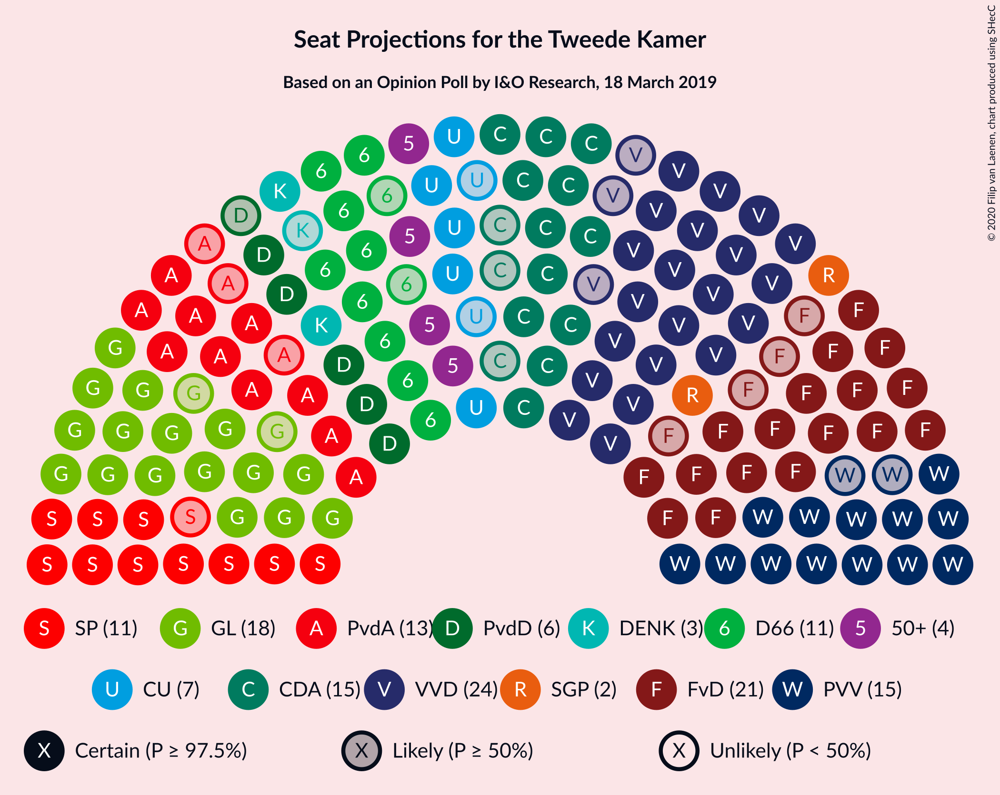
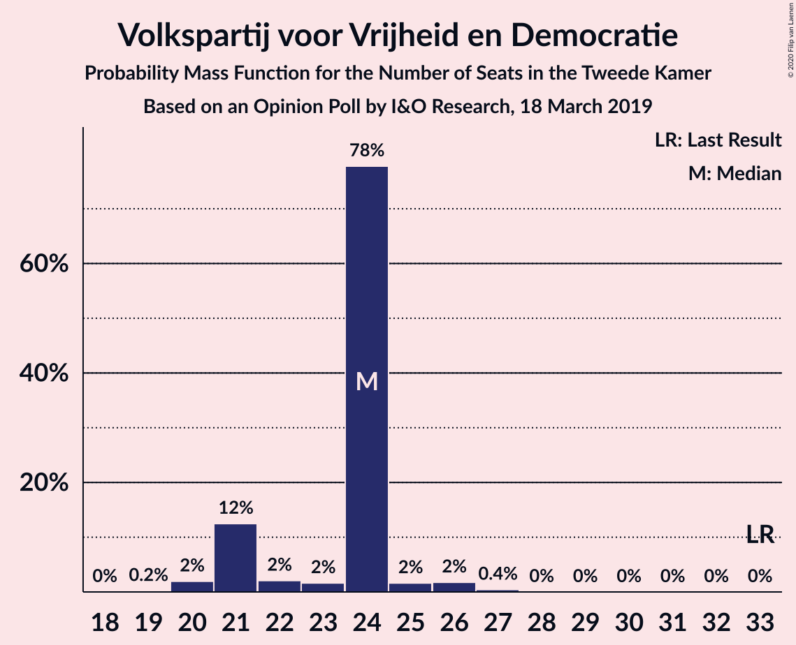
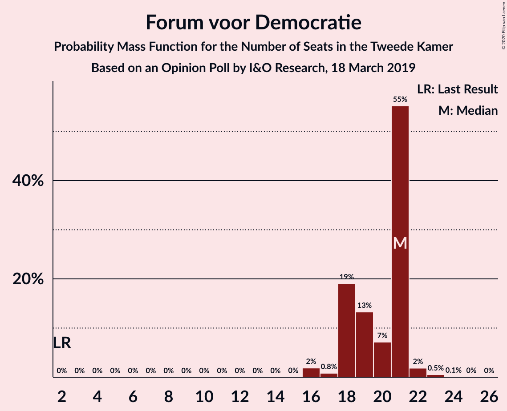
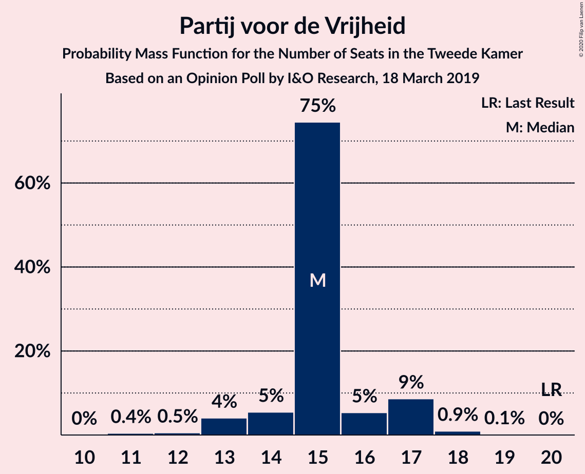
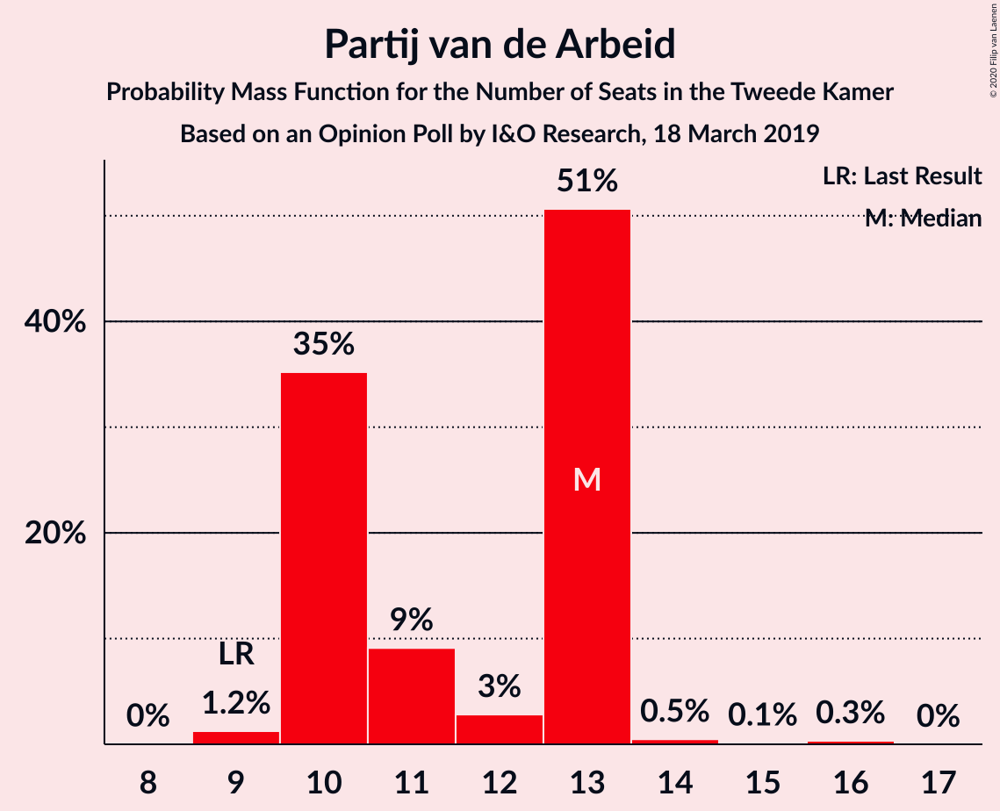
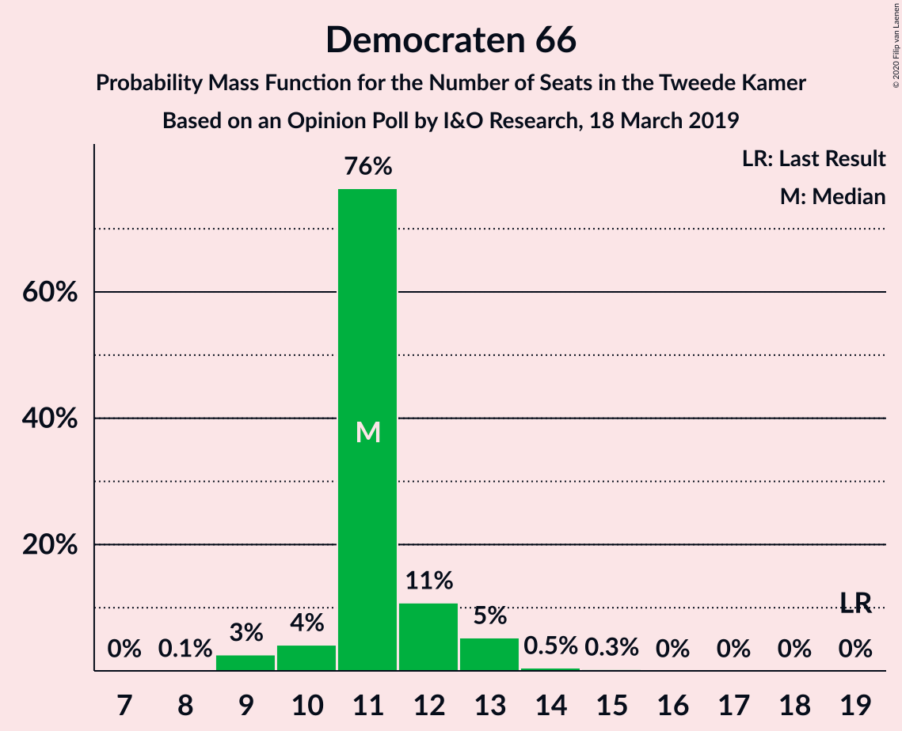
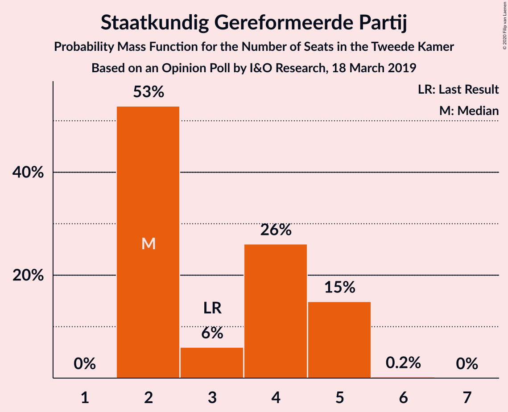
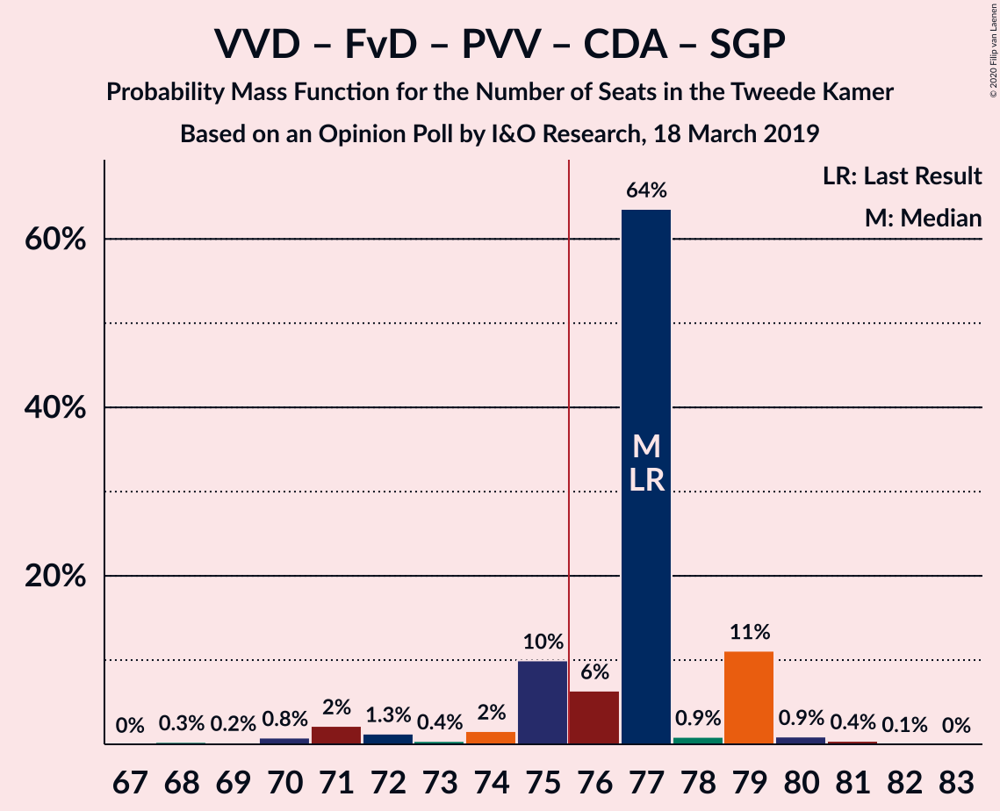
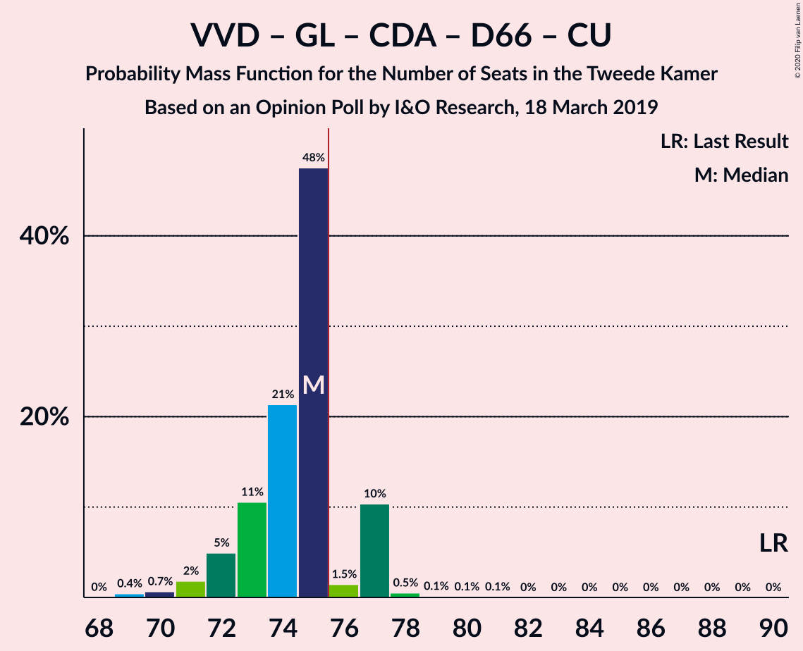
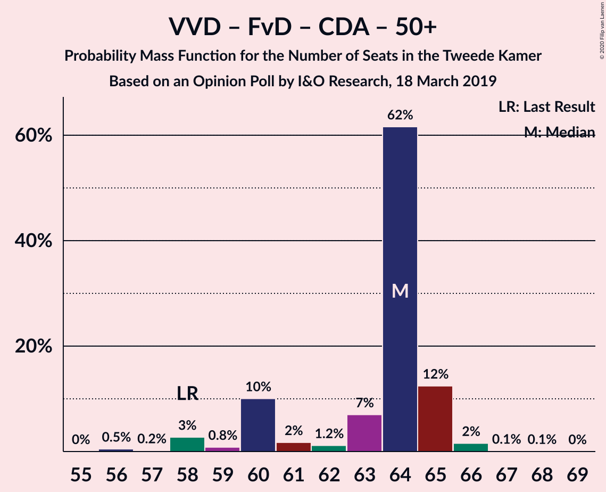

# Opinion Poll by I&O Research, 18 March 2019

<a href="#voting-intentions">Voting Intentions</a> | <a href="#seats">Seats</a> | <a href="#coalitions">Coalitions</a> | <a href="#technical-information">Technical Information</a>

## Voting Intentions

### Confidence Intervals

| Party | Last Result | Poll Result | 80% Confidence Interval | 90% Confidence Interval | 95% Confidence Interval | 99% Confidence Interval |
|:-----:|:-----------:|:-----------:|:-----------------------:|:-----------------------:|:-----------------------:|:-----------------------:|
| Volkspartij voor Vrijheid en Democratie | 21.3% | 15.2% | 14.0–16.5% |13.6–16.9% |13.3–17.2% |12.8–17.8% |
| Forum voor Democratie | 1.8% | 13.0% | 11.9–14.3% |11.6–14.6% |11.3–14.9% |10.8–15.5% |
| GroenLinks | 9.1% | 12.1% | 11.0–13.3% |10.7–13.7% |10.5–14.0% |10.0–14.6% |
| Partij voor de Vrijheid | 13.1% | 9.7% | 8.7–10.8% |8.5–11.1% |8.2–11.4% |7.8–12.0% |
| Christen-Democratisch Appèl | 12.4% | 9.5% | 8.5–10.6% |8.3–10.9% |8.0–11.2% |7.6–11.7% |
| Socialistische Partij | 9.1% | 7.8% | 6.9–8.8% |6.7–9.1% |6.4–9.3% |6.1–9.8% |
| Partij van de Arbeid | 5.7% | 7.6% | 6.8–8.6% |6.5–8.9% |6.3–9.2% |5.9–9.7% |
| Democraten 66 | 12.2% | 7.4% | 6.5–8.4% |6.3–8.7% |6.1–8.9% |5.7–9.4% |
| ChristenUnie | 3.4% | 4.8% | 4.1–5.6% |3.9–5.9% |3.7–6.1% |3.5–6.5% |
| Partij voor de Dieren | 3.2% | 4.6% | 3.9–5.4% |3.7–5.6% |3.6–5.8% |3.3–6.2% |
| 50Plus | 3.1% | 3.5% | 2.9–4.3% |2.8–4.5% |2.7–4.6% |2.4–5.0% |
| Staatkundig Gereformeerde Partij | 2.1% | 2.4% | 1.9–3.0% |1.8–3.2% |1.7–3.4% |1.5–3.7% |
| DENK | 2.1% | 2.0% | 1.6–2.6% |1.5–2.8% |1.4–2.9% |1.2–3.2% |

*Note:* The poll result column reflects the actual value used in the calculations. Published results may vary slightly, and in addition be rounded to fewer digits.

## Seats

### Confidence Intervals

| Party | Last Result | Median | 80% Confidence Interval | 90% Confidence Interval | 95% Confidence Interval | 99% Confidence Interval |
|:-----:|:-----------:|:------:|:-----------------------:|:-----------------------:|:-----------------------:|:-----------------------:|
| <a href="#volkspartij-voor-vrijheid-en-democratie">Volkspartij voor Vrijheid en Democratie</a> | 33 | 21 | 21–23 |20–26 |20–27 |20–27 |
| <a href="#forum-voor-democratie">Forum voor Democratie</a> | 2 | 20 | 19–21 |18–22 |17–23 |17–23 |
| <a href="#groenlinks">GroenLinks</a> | 14 | 18 | 18–20 |17–21 |16–21 |15–21 |
| <a href="#partij-voor-de-vrijheid">Partij voor de Vrijheid</a> | 20 | 16 | 15–17 |12–17 |12–17 |12–19 |
| <a href="#christen-democratisch-appèl">Christen-Democratisch Appèl</a> | 19 | 15 | 14–16 |13–17 |12–17 |12–18 |
| <a href="#socialistische-partij">Socialistische Partij</a> | 14 | 12 | 10–12 |10–14 |10–15 |9–15 |
| <a href="#partij-van-de-arbeid">Partij van de Arbeid</a> | 9 | 13 | 10–13 |9–13 |9–13 |9–14 |
| <a href="#democraten-66">Democraten 66</a> | 19 | 13 | 10–13 |10–13 |10–13 |10–13 |
| <a href="#christenunie">ChristenUnie</a> | 5 | 5 | 5–8 |5–8 |4–10 |4–10 |
| <a href="#partij-voor-de-dieren">Partij voor de Dieren</a> | 5 | 6 | 5–7 |5–7 |5–7 |4–9 |
| <a href="#50plus">50Plus</a> | 4 | 4 | 4–6 |4–6 |4–6 |4–6 |
| <a href="#staatkundig-gereformeerde-partij">Staatkundig Gereformeerde Partij</a> | 3 | 4 | 3–4 |3–4 |3–4 |2–5 |
| <a href="#denk">DENK</a> | 3 | 3 | 3 |2–4 |2–4 |2–4 |

### Volkspartij voor Vrijheid en Democratie

*For a full overview of the results for this party, see the [Volkspartij voor Vrijheid en Democratie](party-volkspartijvoorvrijheidendemocratie.html) page.*

| Number of Seats | Probability | Accumulated | Special Marks |
|:---------------:|:-----------:|:-----------:|:-------------:|
| 19 | 0.1% | 100% |  |
| 20 | 9% | 99.8% |  |
| 21 | 76% | 91% | Median |
| 22 | 1.1% | 14% |  |
| 23 | 4% | 13% |  |
| 24 | 0.6% | 9% |  |
| 25 | 1.3% | 8% |  |
| 26 | 4% | 7% |  |
| 27 | 3% | 3% |  |
| 28 | 0.3% | 0.4% |  |
| 29 | 0.1% | 0.1% |  |
| 30 | 0% | 0% |  |
| 31 | 0% | 0% |  |
| 32 | 0% | 0% |  |
| 33 | 0% | 0% | Last Result |

### Forum voor Democratie

*For a full overview of the results for this party, see the [Forum voor Democratie](party-forumvoordemocratie.html) page.*

| Number of Seats | Probability | Accumulated | Special Marks |
|:---------------:|:-----------:|:-----------:|:-------------:|
| 2 | 0% | 100% | Last Result |
| 3 | 0% | 100% |  |
| 4 | 0% | 100% |  |
| 5 | 0% | 100% |  |
| 6 | 0% | 100% |  |
| 7 | 0% | 100% |  |
| 8 | 0% | 100% |  |
| 9 | 0% | 100% |  |
| 10 | 0% | 100% |  |
| 11 | 0% | 100% |  |
| 12 | 0% | 100% |  |
| 13 | 0% | 100% |  |
| 14 | 0% | 100% |  |
| 15 | 0% | 100% |  |
| 16 | 0.2% | 100% |  |
| 17 | 4% | 99.7% |  |
| 18 | 4% | 96% |  |
| 19 | 4% | 92% |  |
| 20 | 71% | 88% | Median |
| 21 | 8% | 17% |  |
| 22 | 6% | 9% |  |
| 23 | 3% | 3% |  |
| 24 | 0% | 0.1% |  |
| 25 | 0% | 0% |  |

### GroenLinks

*For a full overview of the results for this party, see the [GroenLinks](party-groenlinks.html) page.*

| Number of Seats | Probability | Accumulated | Special Marks |
|:---------------:|:-----------:|:-----------:|:-------------:|
| 14 | 0% | 100% | Last Result |
| 15 | 1.0% | 100% |  |
| 16 | 4% | 99.0% |  |
| 17 | 3% | 95% |  |
| 18 | 67% | 92% | Median |
| 19 | 4% | 25% |  |
| 20 | 12% | 21% |  |
| 21 | 9% | 9% |  |
| 22 | 0.2% | 0.3% |  |
| 23 | 0.2% | 0.2% |  |
| 24 | 0% | 0% |  |

### Partij voor de Vrijheid

*For a full overview of the results for this party, see the [Partij voor de Vrijheid](party-partijvoordevrijheid.html) page.*

| Number of Seats | Probability | Accumulated | Special Marks |
|:---------------:|:-----------:|:-----------:|:-------------:|
| 11 | 0.1% | 100% |  |
| 12 | 5% | 99.9% |  |
| 13 | 0.2% | 94% |  |
| 14 | 4% | 94% |  |
| 15 | 9% | 90% |  |
| 16 | 68% | 81% | Median |
| 17 | 11% | 14% |  |
| 18 | 0.3% | 2% |  |
| 19 | 2% | 2% |  |
| 20 | 0% | 0% | Last Result |

### Christen-Democratisch Appèl

*For a full overview of the results for this party, see the [Christen-Democratisch Appèl](party-christen-democratischappèl.html) page.*

| Number of Seats | Probability | Accumulated | Special Marks |
|:---------------:|:-----------:|:-----------:|:-------------:|
| 11 | 0.2% | 100% |  |
| 12 | 2% | 99.8% |  |
| 13 | 6% | 97% |  |
| 14 | 4% | 91% |  |
| 15 | 73% | 87% | Median |
| 16 | 8% | 13% |  |
| 17 | 5% | 5% |  |
| 18 | 0.8% | 0.8% |  |
| 19 | 0% | 0% | Last Result |

### Socialistische Partij

*For a full overview of the results for this party, see the [Socialistische Partij](party-socialistischepartij.html) page.*

| Number of Seats | Probability | Accumulated | Special Marks |
|:---------------:|:-----------:|:-----------:|:-------------:|
| 8 | 0.5% | 100% |  |
| 9 | 1.1% | 99.5% |  |
| 10 | 16% | 98% |  |
| 11 | 0.7% | 83% |  |
| 12 | 75% | 82% | Median |
| 13 | 1.3% | 7% |  |
| 14 | 3% | 6% | Last Result |
| 15 | 3% | 3% |  |
| 16 | 0% | 0% |  |

### Partij van de Arbeid

*For a full overview of the results for this party, see the [Partij van de Arbeid](party-partijvandearbeid.html) page.*

| Number of Seats | Probability | Accumulated | Special Marks |
|:---------------:|:-----------:|:-----------:|:-------------:|
| 8 | 0.1% | 100% |  |
| 9 | 8% | 99.9% | Last Result |
| 10 | 14% | 92% |  |
| 11 | 6% | 79% |  |
| 12 | 0.6% | 73% |  |
| 13 | 71% | 72% | Median |
| 14 | 1.1% | 1.1% |  |
| 15 | 0% | 0% |  |

### Democraten 66

*For a full overview of the results for this party, see the [Democraten 66](party-democraten66.html) page.*

| Number of Seats | Probability | Accumulated | Special Marks |
|:---------------:|:-----------:|:-----------:|:-------------:|
| 8 | 0.1% | 100% |  |
| 9 | 0.3% | 99.9% |  |
| 10 | 11% | 99.6% |  |
| 11 | 15% | 89% |  |
| 12 | 5% | 73% |  |
| 13 | 68% | 68% | Median |
| 14 | 0.1% | 0.1% |  |
| 15 | 0% | 0% |  |
| 16 | 0% | 0% |  |
| 17 | 0% | 0% |  |
| 18 | 0% | 0% |  |
| 19 | 0% | 0% | Last Result |

### ChristenUnie

*For a full overview of the results for this party, see the [ChristenUnie](party-christenunie.html) page.*

| Number of Seats | Probability | Accumulated | Special Marks |
|:---------------:|:-----------:|:-----------:|:-------------:|
| 4 | 4% | 100% |  |
| 5 | 66% | 96% | Last Result, Median |
| 6 | 5% | 30% |  |
| 7 | 12% | 25% |  |
| 8 | 10% | 14% |  |
| 9 | 1.0% | 4% |  |
| 10 | 3% | 3% |  |
| 11 | 0% | 0% |  |

### Partij voor de Dieren

*For a full overview of the results for this party, see the [Partij voor de Dieren](party-partijvoordedieren.html) page.*

| Number of Seats | Probability | Accumulated | Special Marks |
|:---------------:|:-----------:|:-----------:|:-------------:|
| 4 | 0.8% | 100% |  |
| 5 | 14% | 99.2% | Last Result |
| 6 | 68% | 86% | Median |
| 7 | 15% | 17% |  |
| 8 | 1.2% | 2% |  |
| 9 | 0.1% | 0.6% |  |
| 10 | 0.5% | 0.5% |  |
| 11 | 0% | 0% |  |

### 50Plus

*For a full overview of the results for this party, see the [50Plus](party-50plus.html) page.*

| Number of Seats | Probability | Accumulated | Special Marks |
|:---------------:|:-----------:|:-----------:|:-------------:|
| 3 | 0.2% | 100% |  |
| 4 | 70% | 99.8% | Last Result, Median |
| 5 | 19% | 30% |  |
| 6 | 11% | 11% |  |
| 7 | 0.1% | 0.1% |  |
| 8 | 0% | 0% |  |

### Staatkundig Gereformeerde Partij

*For a full overview of the results for this party, see the [Staatkundig Gereformeerde Partij](party-staatkundiggereformeerdepartij.html) page.*

| Number of Seats | Probability | Accumulated | Special Marks |
|:---------------:|:-----------:|:-----------:|:-------------:|
| 2 | 1.1% | 100% |  |
| 3 | 17% | 98.8% | Last Result |
| 4 | 81% | 82% | Median |
| 5 | 1.2% | 1.5% |  |
| 6 | 0.2% | 0.2% |  |
| 7 | 0% | 0% |  |

### DENK

*For a full overview of the results for this party, see the [DENK](party-denk.html) page.*

| Number of Seats | Probability | Accumulated | Special Marks |
|:---------------:|:-----------:|:-----------:|:-------------:|
| 1 | 0.1% | 100% |  |
| 2 | 7% | 99.9% |  |
| 3 | 85% | 92% | Last Result, Median |
| 4 | 8% | 8% |  |
| 5 | 0% | 0% |  |

## Coalitions

### Confidence Intervals

| Coalition | Last Result | Median | Majority? | 80% Confidence Interval | 90% Confidence Interval | 95% Confidence Interval | 99% Confidence Interval |
|:---------:|:-----------:|:------:|:---------:|:-----------------------:|:-----------------------:|:-----------------------:|:-----------------------:|
| GroenLinks – Christen-Democratisch Appèl – Socialistische Partij – Partij van de Arbeid – Democraten 66 – ChristenUnie | 80 | 76 | 72% | 73–76 | 72–78 | 71–79 | 69–79 |
| Volkspartij voor Vrijheid en Democratie – Forum voor Democratie – Partij voor de Vrijheid – Christen-Democratisch Appèl – Staatkundig Gereformeerde Partij | 77 | 76 | 88% | 75–78 | 74–78 | 69–79 | 69–82 |
| Volkspartij voor Vrijheid en Democratie – GroenLinks – Christen-Democratisch Appèl – Democraten 66 – ChristenUnie | 90 | 72 | 14% | 72–76 | 72–76 | 70–76 | 69–79 |
| Volkspartij voor Vrijheid en Democratie – Forum voor Democratie – Partij voor de Vrijheid – Christen-Democratisch Appèl | 74 | 72 | 3% | 71–74 | 69–74 | 66–76 | 66–78 |
| Volkspartij voor Vrijheid en Democratie – Forum voor Democratie – Christen-Democratisch Appèl – 50Plus – Staatkundig Gereformeerde Partij | 61 | 64 | 0% | 64–67 | 64–68 | 63–69 | 62–71 |
| Volkspartij voor Vrijheid en Democratie – Christen-Democratisch Appèl – Partij van de Arbeid – Democraten 66 – ChristenUnie | 85 | 67 | 0% | 64–68 | 64–69 | 62–69 | 62–72 |
| GroenLinks – Christen-Democratisch Appèl – Partij van de Arbeid – Democraten 66 – ChristenUnie | 66 | 64 | 0% | 60–64 | 60–65 | 59–67 | 59–68 |
| Volkspartij voor Vrijheid en Democratie – Forum voor Democratie – Christen-Democratisch Appèl – 50Plus | 58 | 60 | 0% | 60–64 | 60–64 | 60–66 | 60–67 |
| Volkspartij voor Vrijheid en Democratie – Forum voor Democratie – Christen-Democratisch Appèl – Staatkundig Gereformeerde Partij | 57 | 60 | 0% | 60–62 | 58–63 | 57–65 | 57–67 |
| Volkspartij voor Vrijheid en Democratie – Forum voor Democratie – Christen-Democratisch Appèl | 54 | 56 | 0% | 56–59 | 54–59 | 54–62 | 54–63 |
| Volkspartij voor Vrijheid en Democratie – Christen-Democratisch Appèl – Democraten 66 – ChristenUnie | 76 | 54 | 0% | 54–56 | 53–58 | 52–59 | 52–61 |
| Volkspartij voor Vrijheid en Democratie – Partij voor de Vrijheid – Christen-Democratisch Appèl | 72 | 52 | 0% | 51–54 | 50–54 | 48–56 | 48–59 |
| Volkspartij voor Vrijheid en Democratie – Christen-Democratisch Appèl – Democraten 66 | 71 | 49 | 0% | 47–49 | 47–50 | 46–51 | 45–52 |
| Volkspartij voor Vrijheid en Democratie – Christen-Democratisch Appèl – Partij van de Arbeid | 61 | 49 | 0% | 47–49 | 45–50 | 45–50 | 45–54 |
| Volkspartij voor Vrijheid en Democratie – Partij van de Arbeid – Democraten 66 | 61 | 47 | 0% | 41–47 | 41–49 | 40–49 | 40–50 |
| Christen-Democratisch Appèl – Partij van de Arbeid – Democraten 66 | 47 | 41 | 0% | 35–41 | 34–41 | 33–41 | 33–41 |
| Volkspartij voor Vrijheid en Democratie – Christen-Democratisch Appèl | 52 | 36 | 0% | 36–38 | 36–39 | 35–40 | 34–41 |
| Volkspartij voor Vrijheid en Democratie – Partij van de Arbeid | 42 | 34 | 0% | 30–36 | 30–36 | 30–38 | 30–40 |
| Christen-Democratisch Appèl – Partij van de Arbeid – ChristenUnie | 33 | 33 | 0% | 32–33 | 30–34 | 30–36 | 30–37 |
| Christen-Democratisch Appèl – Partij van de Arbeid | 28 | 28 | 0% | 24–28 | 23–28 | 23–29 | 23–29 |
| Christen-Democratisch Appèl – Democraten 66 | 38 | 28 | 0% | 26–28 | 23–28 | 23–28 | 23–29 |

### GroenLinks – Christen-Democratisch Appèl – Socialistische Partij – Partij van de Arbeid – Democraten 66 – ChristenUnie

| Number of Seats | Probability | Accumulated | Special Marks |
|:---------------:|:-----------:|:-----------:|:-------------:|
| 68 | 0% | 100% |  |
| 69 | 2% | 99.9% |  |
| 70 | 0.2% | 98% |  |
| 71 | 0.7% | 98% |  |
| 72 | 6% | 97% |  |
| 73 | 4% | 91% |  |
| 74 | 12% | 87% |  |
| 75 | 3% | 75% |  |
| 76 | 65% | 72% | Median, Majority |
| 77 | 2% | 7% |  |
| 78 | 1.5% | 5% |  |
| 79 | 4% | 4% |  |
| 80 | 0% | 0% | Last Result |

### Volkspartij voor Vrijheid en Democratie – Forum voor Democratie – Partij voor de Vrijheid – Christen-Democratisch Appèl – Staatkundig Gereformeerde Partij

| Number of Seats | Probability | Accumulated | Special Marks |
|:---------------:|:-----------:|:-----------:|:-------------:|
| 69 | 3% | 100% |  |
| 70 | 0% | 97% |  |
| 71 | 0.7% | 97% |  |
| 72 | 0.1% | 96% |  |
| 73 | 0.7% | 96% |  |
| 74 | 4% | 95% |  |
| 75 | 3% | 92% |  |
| 76 | 66% | 88% | Median, Majority |
| 77 | 11% | 22% | Last Result |
| 78 | 9% | 11% |  |
| 79 | 0.3% | 3% |  |
| 80 | 0.4% | 2% |  |
| 81 | 0.1% | 2% |  |
| 82 | 2% | 2% |  |
| 83 | 0% | 0% |  |

### Volkspartij voor Vrijheid en Democratie – GroenLinks – Christen-Democratisch Appèl – Democraten 66 – ChristenUnie

| Number of Seats | Probability | Accumulated | Special Marks |
|:---------------:|:-----------:|:-----------:|:-------------:|
| 67 | 0.1% | 100% |  |
| 68 | 0% | 99.9% |  |
| 69 | 2% | 99.9% |  |
| 70 | 0.6% | 98% |  |
| 71 | 0.5% | 97% |  |
| 72 | 68% | 97% | Median |
| 73 | 1.0% | 28% |  |
| 74 | 9% | 27% |  |
| 75 | 4% | 18% |  |
| 76 | 12% | 14% | Majority |
| 77 | 0.1% | 1.2% |  |
| 78 | 0.6% | 1.1% |  |
| 79 | 0% | 0.5% |  |
| 80 | 0.4% | 0.5% |  |
| 81 | 0.1% | 0.1% |  |
| 82 | 0% | 0% |  |
| 83 | 0% | 0% |  |
| 84 | 0% | 0% |  |
| 85 | 0% | 0% |  |
| 86 | 0% | 0% |  |
| 87 | 0% | 0% |  |
| 88 | 0% | 0% |  |
| 89 | 0% | 0% |  |
| 90 | 0% | 0% | Last Result |

### Volkspartij voor Vrijheid en Democratie – Forum voor Democratie – Partij voor de Vrijheid – Christen-Democratisch Appèl

| Number of Seats | Probability | Accumulated | Special Marks |
|:---------------:|:-----------:|:-----------:|:-------------:|
| 66 | 3% | 100% |  |
| 67 | 0.2% | 97% |  |
| 68 | 0.6% | 97% |  |
| 69 | 1.2% | 96% |  |
| 70 | 2% | 95% |  |
| 71 | 3% | 92% |  |
| 72 | 66% | 89% | Median |
| 73 | 0.7% | 23% |  |
| 74 | 18% | 22% | Last Result |
| 75 | 1.2% | 4% |  |
| 76 | 0.7% | 3% | Majority |
| 77 | 0.1% | 2% |  |
| 78 | 2% | 2% |  |
| 79 | 0% | 0% |  |

### Volkspartij voor Vrijheid en Democratie – Forum voor Democratie – Christen-Democratisch Appèl – 50Plus – Staatkundig Gereformeerde Partij

| Number of Seats | Probability | Accumulated | Special Marks |
|:---------------:|:-----------:|:-----------:|:-------------:|
| 58 | 0.1% | 100% |  |
| 59 | 0% | 99.9% |  |
| 60 | 0% | 99.9% |  |
| 61 | 0.1% | 99.9% | Last Result |
| 62 | 0.4% | 99.8% |  |
| 63 | 4% | 99.4% |  |
| 64 | 67% | 95% | Median |
| 65 | 5% | 28% |  |
| 66 | 12% | 23% |  |
| 67 | 6% | 11% |  |
| 68 | 1.5% | 5% |  |
| 69 | 3% | 4% |  |
| 70 | 0.1% | 0.8% |  |
| 71 | 0.7% | 0.8% |  |
| 72 | 0% | 0.1% |  |
| 73 | 0% | 0% |  |

### Volkspartij voor Vrijheid en Democratie – Christen-Democratisch Appèl – Partij van de Arbeid – Democraten 66 – ChristenUnie

| Number of Seats | Probability | Accumulated | Special Marks |
|:---------------:|:-----------:|:-----------:|:-------------:|
| 61 | 0.1% | 100% |  |
| 62 | 4% | 99.9% |  |
| 63 | 0.2% | 96% |  |
| 64 | 13% | 95% |  |
| 65 | 0.3% | 82% |  |
| 66 | 0.5% | 82% |  |
| 67 | 67% | 81% | Median |
| 68 | 8% | 14% |  |
| 69 | 3% | 5% |  |
| 70 | 1.1% | 2% |  |
| 71 | 0.1% | 0.7% |  |
| 72 | 0.3% | 0.6% |  |
| 73 | 0.2% | 0.3% |  |
| 74 | 0% | 0% |  |
| 75 | 0% | 0% |  |
| 76 | 0% | 0% | Majority |
| 77 | 0% | 0% |  |
| 78 | 0% | 0% |  |
| 79 | 0% | 0% |  |
| 80 | 0% | 0% |  |
| 81 | 0% | 0% |  |
| 82 | 0% | 0% |  |
| 83 | 0% | 0% |  |
| 84 | 0% | 0% |  |
| 85 | 0% | 0% | Last Result |

### GroenLinks – Christen-Democratisch Appèl – Partij van de Arbeid – Democraten 66 – ChristenUnie

| Number of Seats | Probability | Accumulated | Special Marks |
|:---------------:|:-----------:|:-----------:|:-------------:|
| 57 | 0% | 100% |  |
| 58 | 0.4% | 99.9% |  |
| 59 | 2% | 99.5% |  |
| 60 | 7% | 97% |  |
| 61 | 5% | 90% |  |
| 62 | 0.8% | 85% |  |
| 63 | 0.8% | 84% |  |
| 64 | 77% | 84% | Median |
| 65 | 3% | 7% |  |
| 66 | 0.5% | 3% | Last Result |
| 67 | 2% | 3% |  |
| 68 | 1.2% | 1.3% |  |
| 69 | 0% | 0.1% |  |
| 70 | 0.1% | 0.1% |  |
| 71 | 0% | 0% |  |

### Volkspartij voor Vrijheid en Democratie – Forum voor Democratie – Christen-Democratisch Appèl – 50Plus

| Number of Seats | Probability | Accumulated | Special Marks |
|:---------------:|:-----------:|:-----------:|:-------------:|
| 54 | 0.1% | 100% |  |
| 55 | 0% | 99.9% |  |
| 56 | 0% | 99.9% |  |
| 57 | 0% | 99.9% |  |
| 58 | 0% | 99.8% | Last Result |
| 59 | 0.1% | 99.8% |  |
| 60 | 71% | 99.7% | Median |
| 61 | 2% | 29% |  |
| 62 | 15% | 27% |  |
| 63 | 0.6% | 11% |  |
| 64 | 7% | 11% |  |
| 65 | 0.6% | 4% |  |
| 66 | 2% | 3% |  |
| 67 | 0.7% | 0.8% |  |
| 68 | 0% | 0.1% |  |
| 69 | 0% | 0.1% |  |
| 70 | 0% | 0% |  |

### Volkspartij voor Vrijheid en Democratie – Forum voor Democratie – Christen-Democratisch Appèl – Staatkundig Gereformeerde Partij

| Number of Seats | Probability | Accumulated | Special Marks |
|:---------------:|:-----------:|:-----------:|:-------------:|
| 53 | 0.1% | 100% |  |
| 54 | 0% | 99.9% |  |
| 55 | 0% | 99.9% |  |
| 56 | 0% | 99.9% |  |
| 57 | 4% | 99.8% | Last Result |
| 58 | 2% | 96% |  |
| 59 | 1.0% | 93% |  |
| 60 | 73% | 92% | Median |
| 61 | 7% | 20% |  |
| 62 | 6% | 12% |  |
| 63 | 2% | 6% |  |
| 64 | 0.5% | 4% |  |
| 65 | 2% | 3% |  |
| 66 | 0.1% | 0.8% |  |
| 67 | 0.7% | 0.7% |  |
| 68 | 0% | 0% |  |

### Volkspartij voor Vrijheid en Democratie – Forum voor Democratie – Christen-Democratisch Appèl

| Number of Seats | Probability | Accumulated | Special Marks |
|:---------------:|:-----------:|:-----------:|:-------------:|
| 49 | 0.1% | 100% |  |
| 50 | 0% | 99.9% |  |
| 51 | 0% | 99.9% |  |
| 52 | 0.1% | 99.9% |  |
| 53 | 0% | 99.8% |  |
| 54 | 6% | 99.8% | Last Result |
| 55 | 2% | 94% |  |
| 56 | 68% | 92% | Median |
| 57 | 11% | 23% |  |
| 58 | 2% | 13% |  |
| 59 | 7% | 11% |  |
| 60 | 1.2% | 4% |  |
| 61 | 0.1% | 3% |  |
| 62 | 2% | 3% |  |
| 63 | 0.7% | 0.8% |  |
| 64 | 0% | 0% |  |

### Volkspartij voor Vrijheid en Democratie – Christen-Democratisch Appèl – Democraten 66 – ChristenUnie

| Number of Seats | Probability | Accumulated | Special Marks |
|:---------------:|:-----------:|:-----------:|:-------------:|
| 50 | 0.1% | 100% |  |
| 51 | 0.3% | 99.9% |  |
| 52 | 4% | 99.6% |  |
| 53 | 3% | 95% |  |
| 54 | 71% | 93% | Median |
| 55 | 12% | 22% |  |
| 56 | 2% | 10% |  |
| 57 | 2% | 8% |  |
| 58 | 1.3% | 6% |  |
| 59 | 3% | 5% |  |
| 60 | 0.9% | 2% |  |
| 61 | 0.5% | 0.6% |  |
| 62 | 0.1% | 0.1% |  |
| 63 | 0% | 0% |  |
| 64 | 0% | 0% |  |
| 65 | 0% | 0% |  |
| 66 | 0% | 0% |  |
| 67 | 0% | 0% |  |
| 68 | 0% | 0% |  |
| 69 | 0% | 0% |  |
| 70 | 0% | 0% |  |
| 71 | 0% | 0% |  |
| 72 | 0% | 0% |  |
| 73 | 0% | 0% |  |
| 74 | 0% | 0% |  |
| 75 | 0% | 0% |  |
| 76 | 0% | 0% | Last Result, Majority |

### Volkspartij voor Vrijheid en Democratie – Partij voor de Vrijheid – Christen-Democratisch Appèl

| Number of Seats | Probability | Accumulated | Special Marks |
|:---------------:|:-----------:|:-----------:|:-------------:|
| 48 | 3% | 100% |  |
| 49 | 0.2% | 97% |  |
| 50 | 5% | 97% |  |
| 51 | 3% | 92% |  |
| 52 | 70% | 89% | Median |
| 53 | 7% | 19% |  |
| 54 | 7% | 12% |  |
| 55 | 2% | 5% |  |
| 56 | 0.6% | 3% |  |
| 57 | 0.8% | 2% |  |
| 58 | 0% | 1.2% |  |
| 59 | 1.2% | 1.2% |  |
| 60 | 0% | 0% |  |
| 61 | 0% | 0% |  |
| 62 | 0% | 0% |  |
| 63 | 0% | 0% |  |
| 64 | 0% | 0% |  |
| 65 | 0% | 0% |  |
| 66 | 0% | 0% |  |
| 67 | 0% | 0% |  |
| 68 | 0% | 0% |  |
| 69 | 0% | 0% |  |
| 70 | 0% | 0% |  |
| 71 | 0% | 0% |  |
| 72 | 0% | 0% | Last Result |

### Volkspartij voor Vrijheid en Democratie – Christen-Democratisch Appèl – Democraten 66

| Number of Seats | Probability | Accumulated | Special Marks |
|:---------------:|:-----------:|:-----------:|:-------------:|
| 44 | 0.2% | 100% |  |
| 45 | 0.4% | 99.8% |  |
| 46 | 3% | 99.4% |  |
| 47 | 12% | 96% |  |
| 48 | 6% | 84% |  |
| 49 | 72% | 78% | Median |
| 50 | 4% | 7% |  |
| 51 | 1.3% | 3% |  |
| 52 | 1.0% | 2% |  |
| 53 | 0.4% | 0.5% |  |
| 54 | 0% | 0.1% |  |
| 55 | 0% | 0% |  |
| 56 | 0% | 0% |  |
| 57 | 0% | 0% |  |
| 58 | 0% | 0% |  |
| 59 | 0% | 0% |  |
| 60 | 0% | 0% |  |
| 61 | 0% | 0% |  |
| 62 | 0% | 0% |  |
| 63 | 0% | 0% |  |
| 64 | 0% | 0% |  |
| 65 | 0% | 0% |  |
| 66 | 0% | 0% |  |
| 67 | 0% | 0% |  |
| 68 | 0% | 0% |  |
| 69 | 0% | 0% |  |
| 70 | 0% | 0% |  |
| 71 | 0% | 0% | Last Result |

### Volkspartij voor Vrijheid en Democratie – Christen-Democratisch Appèl – Partij van de Arbeid

| Number of Seats | Probability | Accumulated | Special Marks |
|:---------------:|:-----------:|:-----------:|:-------------:|
| 42 | 0.1% | 100% |  |
| 43 | 0% | 99.9% |  |
| 44 | 0% | 99.9% |  |
| 45 | 9% | 99.9% |  |
| 46 | 0.2% | 91% |  |
| 47 | 9% | 91% |  |
| 48 | 0.6% | 82% |  |
| 49 | 74% | 81% | Median |
| 50 | 6% | 8% |  |
| 51 | 1.4% | 2% |  |
| 52 | 0.2% | 0.8% |  |
| 53 | 0.1% | 0.6% |  |
| 54 | 0.5% | 0.5% |  |
| 55 | 0% | 0.1% |  |
| 56 | 0% | 0% |  |
| 57 | 0% | 0% |  |
| 58 | 0% | 0% |  |
| 59 | 0% | 0% |  |
| 60 | 0% | 0% |  |
| 61 | 0% | 0% | Last Result |

### Volkspartij voor Vrijheid en Democratie – Partij van de Arbeid – Democraten 66

| Number of Seats | Probability | Accumulated | Special Marks |
|:---------------:|:-----------:|:-----------:|:-------------:|
| 39 | 0% | 100% |  |
| 40 | 5% | 99.9% |  |
| 41 | 7% | 95% |  |
| 42 | 4% | 88% |  |
| 43 | 3% | 84% |  |
| 44 | 1.0% | 81% |  |
| 45 | 3% | 80% |  |
| 46 | 3% | 76% |  |
| 47 | 66% | 73% | Median |
| 48 | 0.9% | 7% |  |
| 49 | 5% | 6% |  |
| 50 | 0.7% | 0.9% |  |
| 51 | 0% | 0.2% |  |
| 52 | 0% | 0.2% |  |
| 53 | 0.2% | 0.2% |  |
| 54 | 0% | 0% |  |
| 55 | 0% | 0% |  |
| 56 | 0% | 0% |  |
| 57 | 0% | 0% |  |
| 58 | 0% | 0% |  |
| 59 | 0% | 0% |  |
| 60 | 0% | 0% |  |
| 61 | 0% | 0% | Last Result |

### Christen-Democratisch Appèl – Partij van de Arbeid – Democraten 66

| Number of Seats | Probability | Accumulated | Special Marks |
|:---------------:|:-----------:|:-----------:|:-------------:|
| 32 | 0.1% | 100% |  |
| 33 | 3% | 99.9% |  |
| 34 | 2% | 97% |  |
| 35 | 10% | 95% |  |
| 36 | 1.3% | 85% |  |
| 37 | 10% | 84% |  |
| 38 | 0.6% | 73% |  |
| 39 | 5% | 73% |  |
| 40 | 1.2% | 68% |  |
| 41 | 67% | 67% | Median |
| 42 | 0% | 0% |  |
| 43 | 0% | 0% |  |
| 44 | 0% | 0% |  |
| 45 | 0% | 0% |  |
| 46 | 0% | 0% |  |
| 47 | 0% | 0% | Last Result |

### Volkspartij voor Vrijheid en Democratie – Christen-Democratisch Appèl

| Number of Seats | Probability | Accumulated | Special Marks |
|:---------------:|:-----------:|:-----------:|:-------------:|
| 31 | 0.1% | 100% |  |
| 32 | 0% | 99.9% |  |
| 33 | 0% | 99.9% |  |
| 34 | 2% | 99.9% |  |
| 35 | 0.4% | 98% |  |
| 36 | 78% | 97% | Median |
| 37 | 10% | 20% |  |
| 38 | 0.7% | 10% |  |
| 39 | 6% | 9% |  |
| 40 | 3% | 4% |  |
| 41 | 0.1% | 0.6% |  |
| 42 | 0.4% | 0.5% |  |
| 43 | 0% | 0.1% |  |
| 44 | 0% | 0% |  |
| 45 | 0% | 0% |  |
| 46 | 0% | 0% |  |
| 47 | 0% | 0% |  |
| 48 | 0% | 0% |  |
| 49 | 0% | 0% |  |
| 50 | 0% | 0% |  |
| 51 | 0% | 0% |  |
| 52 | 0% | 0% | Last Result |

### Volkspartij voor Vrijheid en Democratie – Partij van de Arbeid

| Number of Seats | Probability | Accumulated | Special Marks |
|:---------------:|:-----------:|:-----------:|:-------------:|
| 30 | 12% | 100% |  |
| 31 | 6% | 88% |  |
| 32 | 0.2% | 82% |  |
| 33 | 3% | 82% |  |
| 34 | 66% | 79% | Median |
| 35 | 3% | 13% |  |
| 36 | 7% | 10% |  |
| 37 | 0.3% | 4% |  |
| 38 | 3% | 3% |  |
| 39 | 0.2% | 0.7% |  |
| 40 | 0.3% | 0.5% |  |
| 41 | 0.2% | 0.2% |  |
| 42 | 0% | 0% | Last Result |

### Christen-Democratisch Appèl – Partij van de Arbeid – ChristenUnie

| Number of Seats | Probability | Accumulated | Special Marks |
|:---------------:|:-----------:|:-----------:|:-------------:|
| 29 | 0.2% | 100% |  |
| 30 | 6% | 99.8% |  |
| 31 | 1.3% | 94% |  |
| 32 | 13% | 92% |  |
| 33 | 70% | 80% | Last Result, Median |
| 34 | 7% | 10% |  |
| 35 | 0.4% | 3% |  |
| 36 | 2% | 3% |  |
| 37 | 1.3% | 1.4% |  |
| 38 | 0% | 0% |  |

### Christen-Democratisch Appèl – Partij van de Arbeid

| Number of Seats | Probability | Accumulated | Special Marks |
|:---------------:|:-----------:|:-----------:|:-------------:|
| 21 | 0.1% | 100% |  |
| 22 | 0.1% | 99.9% |  |
| 23 | 6% | 99.8% |  |
| 24 | 8% | 94% |  |
| 25 | 4% | 86% |  |
| 26 | 8% | 83% |  |
| 27 | 6% | 75% |  |
| 28 | 65% | 69% | Last Result, Median |
| 29 | 4% | 4% |  |
| 30 | 0.3% | 0.3% |  |
| 31 | 0% | 0% |  |

### Christen-Democratisch Appèl – Democraten 66

| Number of Seats | Probability | Accumulated | Special Marks |
|:---------------:|:-----------:|:-----------:|:-------------:|
| 21 | 0.2% | 100% |  |
| 22 | 0.1% | 99.8% |  |
| 23 | 5% | 99.7% |  |
| 24 | 0.6% | 95% |  |
| 25 | 2% | 94% |  |
| 26 | 15% | 92% |  |
| 27 | 10% | 77% |  |
| 28 | 66% | 67% | Median |
| 29 | 0.7% | 0.9% |  |
| 30 | 0.1% | 0.1% |  |
| 31 | 0% | 0% |  |
| 32 | 0% | 0% |  |
| 33 | 0% | 0% |  |
| 34 | 0% | 0% |  |
| 35 | 0% | 0% |  |
| 36 | 0% | 0% |  |
| 37 | 0% | 0% |  |
| 38 | 0% | 0% | Last Result |

## Technical Information

### Opinion Poll

+ **Polling firm:** I&O Research
+ **Commissioner(s):** —
+ **Fieldwork period:** 18 March 2019

### Calculations

+ **Sample size:** 1339
+ **Simulations done:** 131,072
+ **Error estimate:** 2.01%

