# Opinion Poll by I&O Research, 18 March 2019

<a href="#voting-intentions">Voting Intentions</a> | <a href="#seats">Seats</a> | <a href="#coalitions">Coalitions</a> | <a href="#technical-information">Technical Information</a>

## Voting Intentions

### Confidence Intervals

| Party | Last Result | Poll Result | 80% Confidence Interval | 90% Confidence Interval | 95% Confidence Interval | 99% Confidence Interval |
|:-----:|:-----------:|:-----------:|:-----------------------:|:-----------------------:|:-----------------------:|:-----------------------:|
| Volkspartij voor Vrijheid en Democratie | 21.3% | 15.2% | 14.0–16.5% |13.6–16.9% |13.3–17.2% |12.8–17.8% |
| Forum voor Democratie | 1.8% | 13.0% | 11.9–14.3% |11.6–14.6% |11.3–14.9% |10.8–15.5% |
| GroenLinks | 9.1% | 12.1% | 11.0–13.3% |10.7–13.7% |10.5–14.0% |10.0–14.6% |
| Partij voor de Vrijheid | 13.1% | 9.7% | 8.7–10.8% |8.5–11.1% |8.2–11.4% |7.8–12.0% |
| Christen-Democratisch Appèl | 12.4% | 9.5% | 8.5–10.6% |8.3–10.9% |8.0–11.2% |7.6–11.7% |
| Socialistische Partij | 9.1% | 7.8% | 6.9–8.8% |6.7–9.1% |6.4–9.3% |6.1–9.8% |
| Partij van de Arbeid | 5.7% | 7.6% | 6.8–8.6% |6.5–8.9% |6.3–9.2% |5.9–9.7% |
| Democraten 66 | 12.2% | 7.4% | 6.5–8.4% |6.3–8.7% |6.1–8.9% |5.7–9.4% |
| ChristenUnie | 3.4% | 4.8% | 4.1–5.6% |3.9–5.9% |3.7–6.1% |3.5–6.5% |
| Partij voor de Dieren | 3.2% | 4.6% | 3.9–5.4% |3.7–5.6% |3.6–5.8% |3.3–6.2% |
| 50Plus | 3.1% | 3.5% | 2.9–4.3% |2.8–4.5% |2.7–4.6% |2.4–5.0% |
| Staatkundig Gereformeerde Partij | 2.1% | 2.4% | 1.9–3.0% |1.8–3.2% |1.7–3.4% |1.5–3.7% |
| DENK | 2.1% | 2.0% | 1.6–2.6% |1.5–2.8% |1.4–2.9% |1.2–3.2% |

*Note:* The poll result column reflects the actual value used in the calculations. Published results may vary slightly, and in addition be rounded to fewer digits.

## Seats

### Confidence Intervals

| Party | Last Result | Median | 80% Confidence Interval | 90% Confidence Interval | 95% Confidence Interval | 99% Confidence Interval |
|:-----:|:-----------:|:------:|:-----------------------:|:-----------------------:|:-----------------------:|:-----------------------:|
| <a href="#volkspartij-voor-vrijheid-en-democratie">Volkspartij voor Vrijheid en Democratie</a> | 33 | 24 | 21–24 |21–24 |21–25 |20–26 |
| <a href="#forum-voor-democratie">Forum voor Democratie</a> | 2 | 21 | 18–21 |18–21 |17–22 |16–23 |
| <a href="#groenlinks">GroenLinks</a> | 14 | 18 | 16–19 |16–19 |16–20 |16–22 |
| <a href="#partij-voor-de-vrijheid">Partij voor de Vrijheid</a> | 20 | 15 | 14–16 |13–17 |13–17 |12–18 |
| <a href="#christen-democratisch-appèl">Christen-Democratisch Appèl</a> | 19 | 15 | 14–16 |13–16 |12–16 |12–17 |
| <a href="#socialistische-partij">Socialistische Partij</a> | 14 | 11 | 10–14 |10–14 |10–14 |9–14 |
| <a href="#partij-van-de-arbeid">Partij van de Arbeid</a> | 9 | 13 | 10–13 |10–13 |10–13 |9–14 |
| <a href="#democraten-66">Democraten 66</a> | 19 | 11 | 11–12 |10–13 |9–13 |9–14 |
| <a href="#christenunie">ChristenUnie</a> | 5 | 7 | 7 |6–8 |5–8 |5–9 |
| <a href="#partij-voor-de-dieren">Partij voor de Dieren</a> | 5 | 6 | 6–7 |6–7 |5–8 |5–9 |
| <a href="#50plus">50Plus</a> | 4 | 4 | 4–6 |4–6 |4–6 |4–7 |
| <a href="#staatkundig-gereformeerde-partij">Staatkundig Gereformeerde Partij</a> | 3 | 2 | 2–5 |2–5 |2–5 |2–5 |
| <a href="#denk">DENK</a> | 3 | 3 | 2–4 |2–4 |2–4 |2–4 |

### Volkspartij voor Vrijheid en Democratie

*For a full overview of the results for this party, see the [Volkspartij voor Vrijheid en Democratie](party-volkspartijvoorvrijheidendemocratie.html) page.*

| Number of Seats | Probability | Accumulated | Special Marks |
|:---------------:|:-----------:|:-----------:|:-------------:|
| 19 | 0.2% | 100% |  |
| 20 | 2% | 99.8% |  |
| 21 | 12% | 98% |  |
| 22 | 2% | 85% |  |
| 23 | 2% | 83% |  |
| 24 | 78% | 82% | Median |
| 25 | 2% | 4% |  |
| 26 | 2% | 2% |  |
| 27 | 0.4% | 0.5% |  |
| 28 | 0% | 0% |  |
| 29 | 0% | 0% |  |
| 30 | 0% | 0% |  |
| 31 | 0% | 0% |  |
| 32 | 0% | 0% |  |
| 33 | 0% | 0% | Last Result |

### Forum voor Democratie

*For a full overview of the results for this party, see the [Forum voor Democratie](party-forumvoordemocratie.html) page.*

| Number of Seats | Probability | Accumulated | Special Marks |
|:---------------:|:-----------:|:-----------:|:-------------:|
| 2 | 0% | 100% | Last Result |
| 3 | 0% | 100% |  |
| 4 | 0% | 100% |  |
| 5 | 0% | 100% |  |
| 6 | 0% | 100% |  |
| 7 | 0% | 100% |  |
| 8 | 0% | 100% |  |
| 9 | 0% | 100% |  |
| 10 | 0% | 100% |  |
| 11 | 0% | 100% |  |
| 12 | 0% | 100% |  |
| 13 | 0% | 100% |  |
| 14 | 0% | 100% |  |
| 15 | 0% | 100% |  |
| 16 | 2% | 100% |  |
| 17 | 0.8% | 98% |  |
| 18 | 19% | 97% |  |
| 19 | 13% | 78% |  |
| 20 | 7% | 65% |  |
| 21 | 55% | 58% | Median |
| 22 | 2% | 3% |  |
| 23 | 0.5% | 0.7% |  |
| 24 | 0.1% | 0.1% |  |
| 25 | 0% | 0.1% |  |
| 26 | 0% | 0% |  |

### GroenLinks

*For a full overview of the results for this party, see the [GroenLinks](party-groenlinks.html) page.*

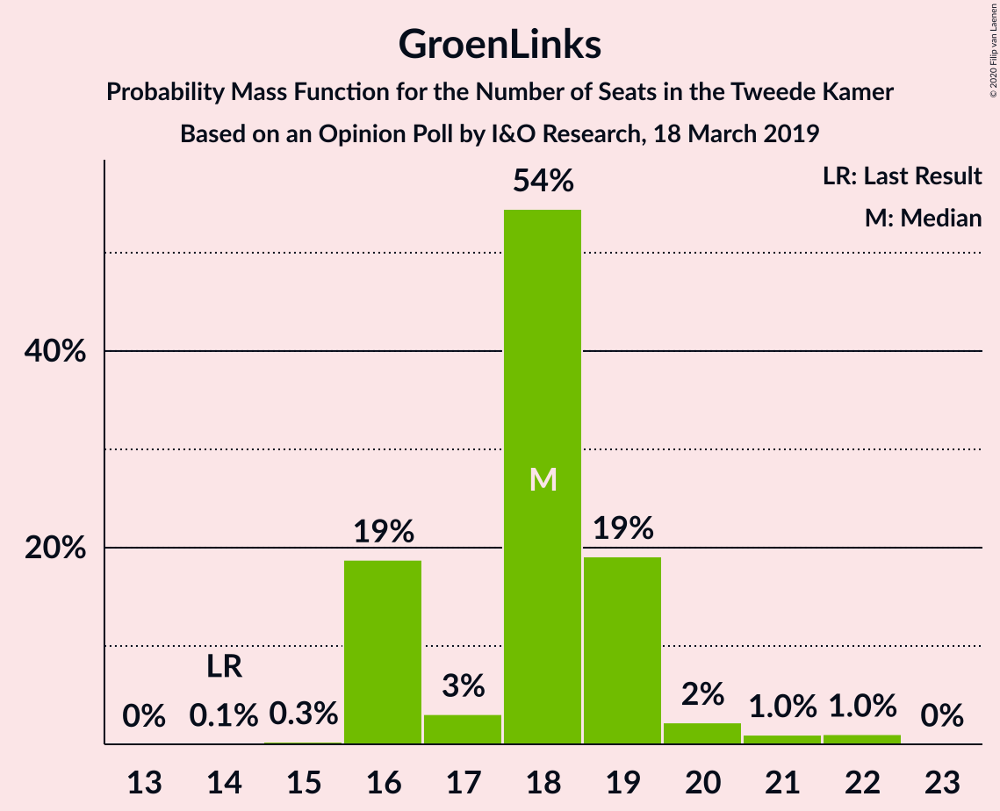

| Number of Seats | Probability | Accumulated | Special Marks |
|:---------------:|:-----------:|:-----------:|:-------------:|
| 14 | 0.1% | 100% | Last Result |
| 15 | 0.3% | 99.9% |  |
| 16 | 19% | 99.7% |  |
| 17 | 3% | 81% |  |
| 18 | 54% | 78% | Median |
| 19 | 19% | 23% |  |
| 20 | 2% | 4% |  |
| 21 | 1.0% | 2% |  |
| 22 | 1.0% | 1.1% |  |
| 23 | 0% | 0% |  |

### Partij voor de Vrijheid

*For a full overview of the results for this party, see the [Partij voor de Vrijheid](party-partijvoordevrijheid.html) page.*

| Number of Seats | Probability | Accumulated | Special Marks |
|:---------------:|:-----------:|:-----------:|:-------------:|
| 11 | 0.4% | 100% |  |
| 12 | 0.5% | 99.6% |  |
| 13 | 4% | 99.0% |  |
| 14 | 5% | 95% |  |
| 15 | 75% | 90% | Median |
| 16 | 5% | 15% |  |
| 17 | 9% | 10% |  |
| 18 | 0.9% | 1.1% |  |
| 19 | 0.1% | 0.1% |  |
| 20 | 0% | 0% | Last Result |

### Christen-Democratisch Appèl

*For a full overview of the results for this party, see the [Christen-Democratisch Appèl](party-christen-democratischappèl.html) page.*

| Number of Seats | Probability | Accumulated | Special Marks |
|:---------------:|:-----------:|:-----------:|:-------------:|
| 11 | 0.2% | 100% |  |
| 12 | 4% | 99.8% |  |
| 13 | 4% | 96% |  |
| 14 | 10% | 92% |  |
| 15 | 53% | 82% | Median |
| 16 | 28% | 29% |  |
| 17 | 0.6% | 1.0% |  |
| 18 | 0.3% | 0.4% |  |
| 19 | 0% | 0.1% | Last Result |
| 20 | 0% | 0% |  |

### Socialistische Partij

*For a full overview of the results for this party, see the [Socialistische Partij](party-socialistischepartij.html) page.*

| Number of Seats | Probability | Accumulated | Special Marks |
|:---------------:|:-----------:|:-----------:|:-------------:|
| 9 | 0.9% | 100% |  |
| 10 | 12% | 99.1% |  |
| 11 | 57% | 87% | Median |
| 12 | 8% | 31% |  |
| 13 | 6% | 23% |  |
| 14 | 17% | 17% | Last Result |
| 15 | 0.2% | 0.2% |  |
| 16 | 0% | 0% |  |

### Partij van de Arbeid

*For a full overview of the results for this party, see the [Partij van de Arbeid](party-partijvandearbeid.html) page.*

| Number of Seats | Probability | Accumulated | Special Marks |
|:---------------:|:-----------:|:-----------:|:-------------:|
| 9 | 1.2% | 100% | Last Result |
| 10 | 35% | 98.7% |  |
| 11 | 9% | 64% |  |
| 12 | 3% | 54% |  |
| 13 | 51% | 52% | Median |
| 14 | 0.5% | 0.9% |  |
| 15 | 0.1% | 0.5% |  |
| 16 | 0.3% | 0.3% |  |
| 17 | 0% | 0% |  |

### Democraten 66

*For a full overview of the results for this party, see the [Democraten 66](party-democraten66.html) page.*

| Number of Seats | Probability | Accumulated | Special Marks |
|:---------------:|:-----------:|:-----------:|:-------------:|
| 8 | 0.1% | 100% |  |
| 9 | 3% | 99.9% |  |
| 10 | 4% | 97% |  |
| 11 | 76% | 93% | Median |
| 12 | 11% | 17% |  |
| 13 | 5% | 6% |  |
| 14 | 0.5% | 0.8% |  |
| 15 | 0.3% | 0.3% |  |
| 16 | 0% | 0% |  |
| 17 | 0% | 0% |  |
| 18 | 0% | 0% |  |
| 19 | 0% | 0% | Last Result |

### ChristenUnie

*For a full overview of the results for this party, see the [ChristenUnie](party-christenunie.html) page.*

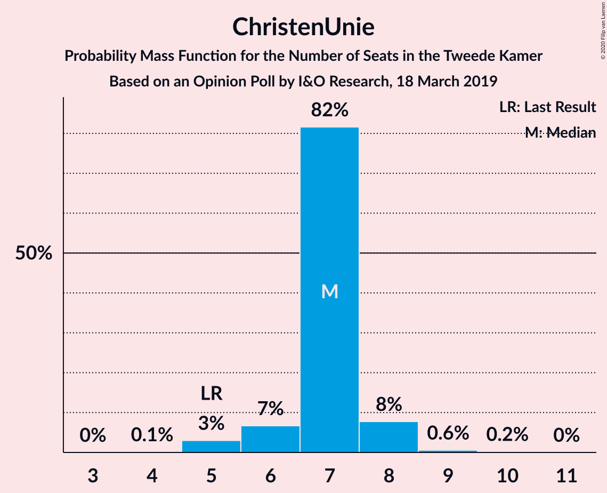

| Number of Seats | Probability | Accumulated | Special Marks |
|:---------------:|:-----------:|:-----------:|:-------------:|
| 4 | 0.1% | 100% |  |
| 5 | 3% | 99.9% | Last Result |
| 6 | 7% | 97% |  |
| 7 | 82% | 90% | Median |
| 8 | 8% | 9% |  |
| 9 | 0.6% | 0.8% |  |
| 10 | 0.2% | 0.2% |  |
| 11 | 0% | 0% |  |

### Partij voor de Dieren

*For a full overview of the results for this party, see the [Partij voor de Dieren](party-partijvoordedieren.html) page.*

| Number of Seats | Probability | Accumulated | Special Marks |
|:---------------:|:-----------:|:-----------:|:-------------:|
| 4 | 0.1% | 100% |  |
| 5 | 3% | 99.9% | Last Result |
| 6 | 83% | 97% | Median |
| 7 | 11% | 15% |  |
| 8 | 2% | 4% |  |
| 9 | 2% | 2% |  |
| 10 | 0% | 0% |  |

### 50Plus

*For a full overview of the results for this party, see the [50Plus](party-50plus.html) page.*

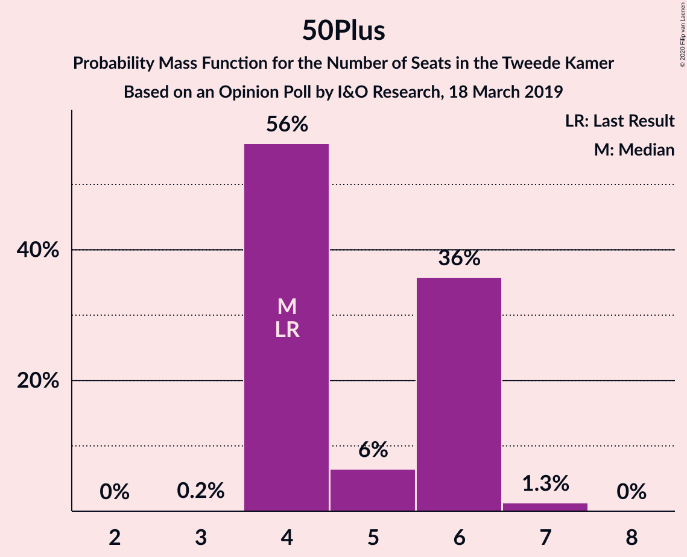

| Number of Seats | Probability | Accumulated | Special Marks |
|:---------------:|:-----------:|:-----------:|:-------------:|
| 3 | 0.2% | 100% |  |
| 4 | 56% | 99.8% | Last Result, Median |
| 5 | 6% | 44% |  |
| 6 | 36% | 37% |  |
| 7 | 1.3% | 1.3% |  |
| 8 | 0% | 0% |  |

### Staatkundig Gereformeerde Partij

*For a full overview of the results for this party, see the [Staatkundig Gereformeerde Partij](party-staatkundiggereformeerdepartij.html) page.*

| Number of Seats | Probability | Accumulated | Special Marks |
|:---------------:|:-----------:|:-----------:|:-------------:|
| 2 | 53% | 100% | Median |
| 3 | 6% | 47% | Last Result |
| 4 | 26% | 41% |  |
| 5 | 15% | 15% |  |
| 6 | 0.2% | 0.2% |  |
| 7 | 0% | 0% |  |

### DENK

*For a full overview of the results for this party, see the [DENK](party-denk.html) page.*

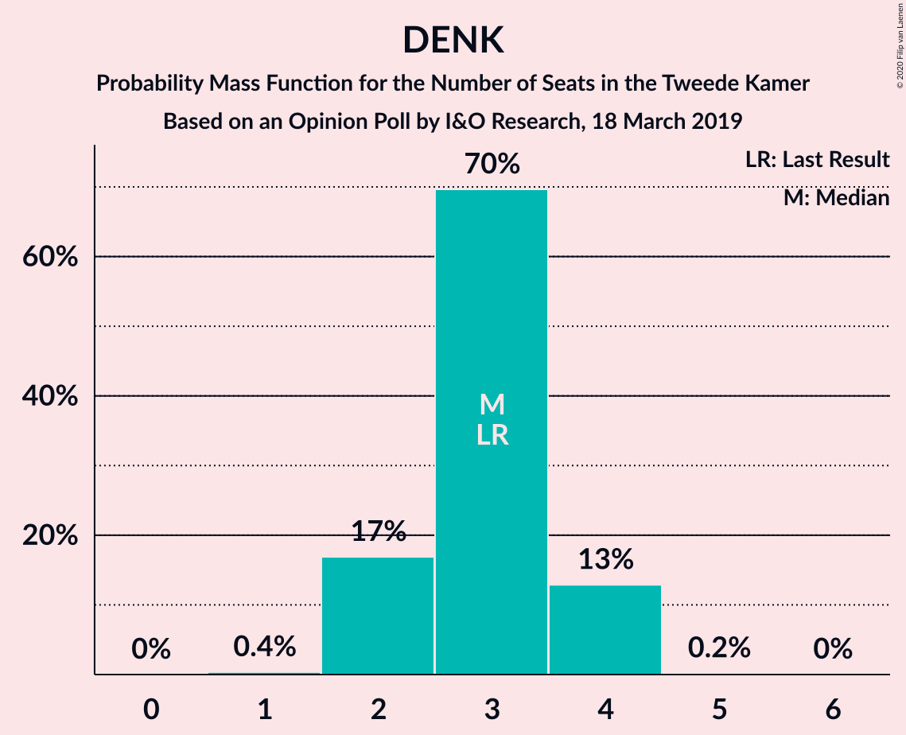

| Number of Seats | Probability | Accumulated | Special Marks |
|:---------------:|:-----------:|:-----------:|:-------------:|
| 1 | 0.4% | 100% |  |
| 2 | 17% | 99.6% |  |
| 3 | 70% | 83% | Last Result, Median |
| 4 | 13% | 13% |  |
| 5 | 0.2% | 0.2% |  |
| 6 | 0% | 0% |  |

## Coalitions

### Confidence Intervals

| Coalition | Last Result | Median | Majority? | 80% Confidence Interval | 90% Confidence Interval | 95% Confidence Interval | 99% Confidence Interval |
|:---------:|:-----------:|:------:|:---------:|:-----------------------:|:-----------------------:|:-----------------------:|:-----------------------:|
| Volkspartij voor Vrijheid en Democratie – Forum voor Democratie – Partij voor de Vrijheid – Christen-Democratisch Appèl – Staatkundig Gereformeerde Partij | 77 | 77 | 83% | 75–79 | 73–79 | 71–79 | 69–80 |
| GroenLinks – Christen-Democratisch Appèl – Socialistische Partij – Partij van de Arbeid – Democraten 66 – ChristenUnie | 80 | 75 | 8% | 73–75 | 70–76 | 70–79 | 69–79 |
| Volkspartij voor Vrijheid en Democratie – GroenLinks – Christen-Democratisch Appèl – Democraten 66 – ChristenUnie | 90 | 75 | 13% | 73–77 | 72–77 | 71–77 | 69–78 |
| Volkspartij voor Vrijheid en Democratie – Forum voor Democratie – Partij voor de Vrijheid – Christen-Democratisch Appèl | 74 | 74 | 1.4% | 71–75 | 69–75 | 68–75 | 66–77 |
| Volkspartij voor Vrijheid en Democratie – Christen-Democratisch Appèl – Partij van de Arbeid – Democraten 66 – ChristenUnie | 85 | 68 | 0% | 65–70 | 65–70 | 64–70 | 62–71 |
| Volkspartij voor Vrijheid en Democratie – Forum voor Democratie – Christen-Democratisch Appèl – 50Plus – Staatkundig Gereformeerde Partij | 61 | 66 | 0% | 62–70 | 62–70 | 62–70 | 61–70 |
| GroenLinks – Christen-Democratisch Appèl – Partij van de Arbeid – Democraten 66 – ChristenUnie | 66 | 64 | 0% | 60–64 | 59–64 | 59–66 | 57–68 |
| Volkspartij voor Vrijheid en Democratie – Forum voor Democratie – Christen-Democratisch Appèl – 50Plus | 58 | 64 | 0% | 60–65 | 60–65 | 58–65 | 56–66 |
| Volkspartij voor Vrijheid en Democratie – Forum voor Democratie – Christen-Democratisch Appèl – Staatkundig Gereformeerde Partij | 57 | 62 | 0% | 58–64 | 58–64 | 56–64 | 55–65 |
| Volkspartij voor Vrijheid en Democratie – Forum voor Democratie – Christen-Democratisch Appèl | 54 | 59 | 0% | 56–60 | 54–60 | 53–60 | 52–62 |
| Volkspartij voor Vrijheid en Democratie – Christen-Democratisch Appèl – Democraten 66 – ChristenUnie | 76 | 57 | 0% | 54–58 | 54–58 | 52–58 | 51–60 |
| Volkspartij voor Vrijheid en Democratie – Partij voor de Vrijheid – Christen-Democratisch Appèl | 72 | 54 | 0% | 52–55 | 50–55 | 49–55 | 48–57 |
| Volkspartij voor Vrijheid en Democratie – Christen-Democratisch Appèl – Partij van de Arbeid | 61 | 50 | 0% | 46–52 | 46–52 | 46–52 | 45–52 |
| Volkspartij voor Vrijheid en Democratie – Christen-Democratisch Appèl – Democraten 66 | 71 | 50 | 0% | 47–51 | 47–51 | 46–51 | 45–53 |
| Volkspartij voor Vrijheid en Democratie – Partij van de Arbeid – Democraten 66 | 61 | 47 | 0% | 44–48 | 44–48 | 42–48 | 41–50 |
| Christen-Democratisch Appèl – Partij van de Arbeid – Democraten 66 | 47 | 39 | 0% | 36–39 | 34–40 | 33–41 | 33–41 |
| Volkspartij voor Vrijheid en Democratie – Christen-Democratisch Appèl | 52 | 39 | 0% | 35–40 | 35–40 | 35–40 | 33–41 |
| Volkspartij voor Vrijheid en Democratie – Partij van de Arbeid | 42 | 35 | 0% | 32–37 | 32–37 | 32–37 | 30–39 |
| Christen-Democratisch Appèl – Partij van de Arbeid – ChristenUnie | 33 | 33 | 0% | 32–35 | 31–35 | 30–36 | 29–37 |
| Christen-Democratisch Appèl – Democraten 66 | 38 | 26 | 0% | 25–27 | 24–28 | 23–28 | 23–29 |
| Christen-Democratisch Appèl – Partij van de Arbeid | 28 | 27 | 0% | 25–28 | 23–28 | 22–28 | 22–30 |

### Volkspartij voor Vrijheid en Democratie – Forum voor Democratie – Partij voor de Vrijheid – Christen-Democratisch Appèl – Staatkundig Gereformeerde Partij

| Number of Seats | Probability | Accumulated | Special Marks |
|:---------------:|:-----------:|:-----------:|:-------------:|
| 68 | 0.3% | 100% |  |
| 69 | 0.2% | 99.7% |  |
| 70 | 0.8% | 99.5% |  |
| 71 | 2% | 98.7% |  |
| 72 | 1.3% | 97% |  |
| 73 | 0.4% | 95% |  |
| 74 | 2% | 95% |  |
| 75 | 10% | 93% |  |
| 76 | 6% | 83% | Majority |
| 77 | 64% | 77% | Last Result, Median |
| 78 | 0.9% | 13% |  |
| 79 | 11% | 13% |  |
| 80 | 0.9% | 1.4% |  |
| 81 | 0.4% | 0.5% |  |
| 82 | 0.1% | 0.1% |  |
| 83 | 0% | 0% |  |

### GroenLinks – Christen-Democratisch Appèl – Socialistische Partij – Partij van de Arbeid – Democraten 66 – ChristenUnie

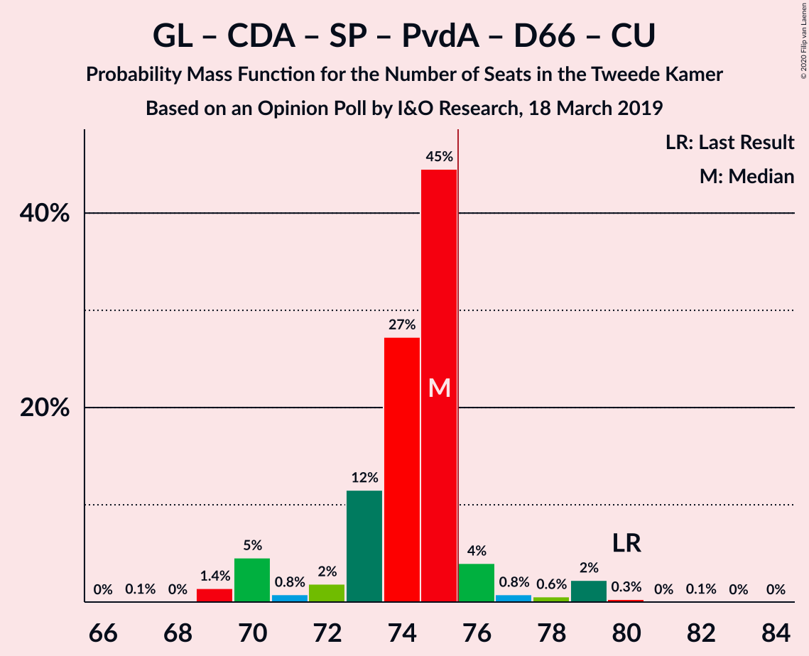

| Number of Seats | Probability | Accumulated | Special Marks |
|:---------------:|:-----------:|:-----------:|:-------------:|
| 67 | 0.1% | 100% |  |
| 68 | 0% | 99.9% |  |
| 69 | 1.4% | 99.9% |  |
| 70 | 5% | 98% |  |
| 71 | 0.8% | 94% |  |
| 72 | 2% | 93% |  |
| 73 | 12% | 91% |  |
| 74 | 27% | 80% |  |
| 75 | 45% | 53% | Median |
| 76 | 4% | 8% | Majority |
| 77 | 0.8% | 4% |  |
| 78 | 0.6% | 3% |  |
| 79 | 2% | 3% |  |
| 80 | 0.3% | 0.4% | Last Result |
| 81 | 0% | 0.1% |  |
| 82 | 0.1% | 0.1% |  |
| 83 | 0% | 0% |  |

### Volkspartij voor Vrijheid en Democratie – GroenLinks – Christen-Democratisch Appèl – Democraten 66 – ChristenUnie

| Number of Seats | Probability | Accumulated | Special Marks |
|:---------------:|:-----------:|:-----------:|:-------------:|
| 68 | 0% | 100% |  |
| 69 | 0.4% | 99.9% |  |
| 70 | 0.7% | 99.5% |  |
| 71 | 2% | 98.8% |  |
| 72 | 5% | 97% |  |
| 73 | 11% | 92% |  |
| 74 | 21% | 82% |  |
| 75 | 48% | 60% | Median |
| 76 | 1.5% | 13% | Majority |
| 77 | 10% | 11% |  |
| 78 | 0.5% | 0.8% |  |
| 79 | 0.1% | 0.3% |  |
| 80 | 0.1% | 0.2% |  |
| 81 | 0.1% | 0.1% |  |
| 82 | 0% | 0% |  |
| 83 | 0% | 0% |  |
| 84 | 0% | 0% |  |
| 85 | 0% | 0% |  |
| 86 | 0% | 0% |  |
| 87 | 0% | 0% |  |
| 88 | 0% | 0% |  |
| 89 | 0% | 0% |  |
| 90 | 0% | 0% | Last Result |

### Volkspartij voor Vrijheid en Democratie – Forum voor Democratie – Partij voor de Vrijheid – Christen-Democratisch Appèl

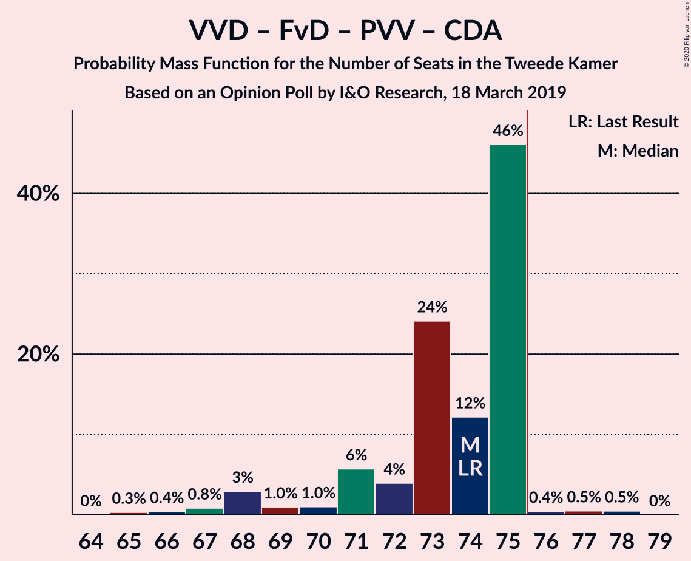

| Number of Seats | Probability | Accumulated | Special Marks |
|:---------------:|:-----------:|:-----------:|:-------------:|
| 65 | 0.3% | 100% |  |
| 66 | 0.4% | 99.7% |  |
| 67 | 0.8% | 99.3% |  |
| 68 | 3% | 98% |  |
| 69 | 1.0% | 95% |  |
| 70 | 1.0% | 95% |  |
| 71 | 6% | 93% |  |
| 72 | 4% | 88% |  |
| 73 | 24% | 84% |  |
| 74 | 12% | 60% | Last Result |
| 75 | 46% | 48% | Median |
| 76 | 0.4% | 1.4% | Majority |
| 77 | 0.5% | 1.0% |  |
| 78 | 0.5% | 0.5% |  |
| 79 | 0% | 0% |  |

### Volkspartij voor Vrijheid en Democratie – Christen-Democratisch Appèl – Partij van de Arbeid – Democraten 66 – ChristenUnie

| Number of Seats | Probability | Accumulated | Special Marks |
|:---------------:|:-----------:|:-----------:|:-------------:|
| 61 | 0.5% | 100% |  |
| 62 | 1.3% | 99.5% |  |
| 63 | 0.7% | 98% |  |
| 64 | 1.1% | 98% |  |
| 65 | 11% | 96% |  |
| 66 | 2% | 85% |  |
| 67 | 6% | 84% |  |
| 68 | 28% | 77% |  |
| 69 | 2% | 49% |  |
| 70 | 46% | 47% | Median |
| 71 | 0.3% | 0.6% |  |
| 72 | 0.2% | 0.3% |  |
| 73 | 0.1% | 0.1% |  |
| 74 | 0% | 0% |  |
| 75 | 0% | 0% |  |
| 76 | 0% | 0% | Majority |
| 77 | 0% | 0% |  |
| 78 | 0% | 0% |  |
| 79 | 0% | 0% |  |
| 80 | 0% | 0% |  |
| 81 | 0% | 0% |  |
| 82 | 0% | 0% |  |
| 83 | 0% | 0% |  |
| 84 | 0% | 0% |  |
| 85 | 0% | 0% | Last Result |

### Volkspartij voor Vrijheid en Democratie – Forum voor Democratie – Christen-Democratisch Appèl – 50Plus – Staatkundig Gereformeerde Partij

| Number of Seats | Probability | Accumulated | Special Marks |
|:---------------:|:-----------:|:-----------:|:-------------:|
| 59 | 0.3% | 100% |  |
| 60 | 0.1% | 99.6% |  |
| 61 | 2% | 99.6% | Last Result |
| 62 | 8% | 98% |  |
| 63 | 1.0% | 89% |  |
| 64 | 3% | 88% |  |
| 65 | 2% | 85% |  |
| 66 | 46% | 84% | Median |
| 67 | 4% | 37% |  |
| 68 | 20% | 34% |  |
| 69 | 2% | 13% |  |
| 70 | 11% | 11% |  |
| 71 | 0.1% | 0.1% |  |
| 72 | 0% | 0% |  |

### GroenLinks – Christen-Democratisch Appèl – Partij van de Arbeid – Democraten 66 – ChristenUnie

| Number of Seats | Probability | Accumulated | Special Marks |
|:---------------:|:-----------:|:-----------:|:-------------:|
| 56 | 0.2% | 100% |  |
| 57 | 0.8% | 99.8% |  |
| 58 | 0.5% | 99.0% |  |
| 59 | 4% | 98% |  |
| 60 | 18% | 94% |  |
| 61 | 4% | 77% |  |
| 62 | 2% | 72% |  |
| 63 | 19% | 70% |  |
| 64 | 47% | 51% | Median |
| 65 | 0.5% | 4% |  |
| 66 | 2% | 3% | Last Result |
| 67 | 0.2% | 1.0% |  |
| 68 | 0.7% | 0.8% |  |
| 69 | 0.1% | 0.1% |  |
| 70 | 0% | 0% |  |

### Volkspartij voor Vrijheid en Democratie – Forum voor Democratie – Christen-Democratisch Appèl – 50Plus

| Number of Seats | Probability | Accumulated | Special Marks |
|:---------------:|:-----------:|:-----------:|:-------------:|
| 56 | 0.5% | 100% |  |
| 57 | 0.2% | 99.5% |  |
| 58 | 3% | 99.3% | Last Result |
| 59 | 0.8% | 97% |  |
| 60 | 10% | 96% |  |
| 61 | 2% | 86% |  |
| 62 | 1.2% | 84% |  |
| 63 | 7% | 83% |  |
| 64 | 62% | 76% | Median |
| 65 | 12% | 14% |  |
| 66 | 2% | 2% |  |
| 67 | 0.1% | 0.2% |  |
| 68 | 0.1% | 0.1% |  |
| 69 | 0% | 0% |  |

### Volkspartij voor Vrijheid en Democratie – Forum voor Democratie – Christen-Democratisch Appèl – Staatkundig Gereformeerde Partij

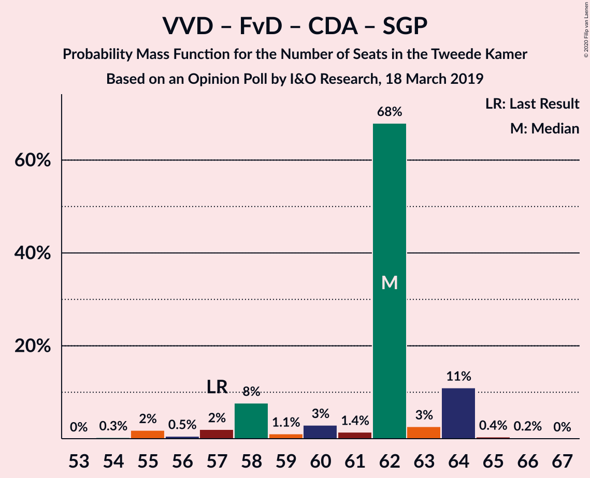

| Number of Seats | Probability | Accumulated | Special Marks |
|:---------------:|:-----------:|:-----------:|:-------------:|
| 54 | 0.3% | 100% |  |
| 55 | 2% | 99.7% |  |
| 56 | 0.5% | 98% |  |
| 57 | 2% | 97% | Last Result |
| 58 | 8% | 95% |  |
| 59 | 1.1% | 88% |  |
| 60 | 3% | 87% |  |
| 61 | 1.4% | 84% |  |
| 62 | 68% | 82% | Median |
| 63 | 3% | 14% |  |
| 64 | 11% | 12% |  |
| 65 | 0.4% | 0.7% |  |
| 66 | 0.2% | 0.3% |  |
| 67 | 0% | 0% |  |

### Volkspartij voor Vrijheid en Democratie – Forum voor Democratie – Christen-Democratisch Appèl

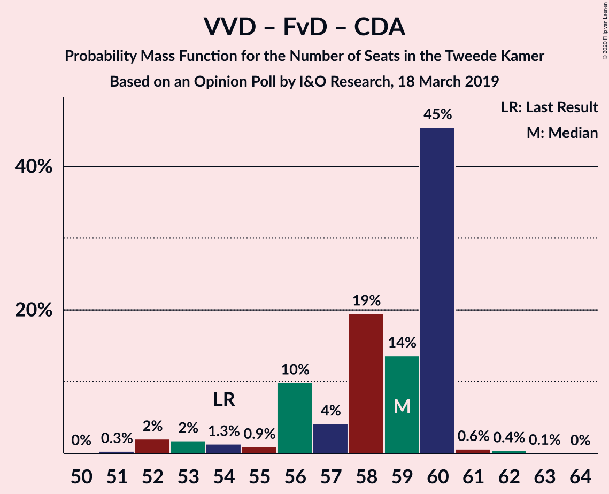

| Number of Seats | Probability | Accumulated | Special Marks |
|:---------------:|:-----------:|:-----------:|:-------------:|
| 51 | 0.3% | 100% |  |
| 52 | 2% | 99.7% |  |
| 53 | 2% | 98% |  |
| 54 | 1.3% | 96% | Last Result |
| 55 | 0.9% | 95% |  |
| 56 | 10% | 94% |  |
| 57 | 4% | 84% |  |
| 58 | 19% | 80% |  |
| 59 | 14% | 60% |  |
| 60 | 45% | 47% | Median |
| 61 | 0.6% | 1.1% |  |
| 62 | 0.4% | 0.5% |  |
| 63 | 0.1% | 0.1% |  |
| 64 | 0% | 0% |  |

### Volkspartij voor Vrijheid en Democratie – Christen-Democratisch Appèl – Democraten 66 – ChristenUnie

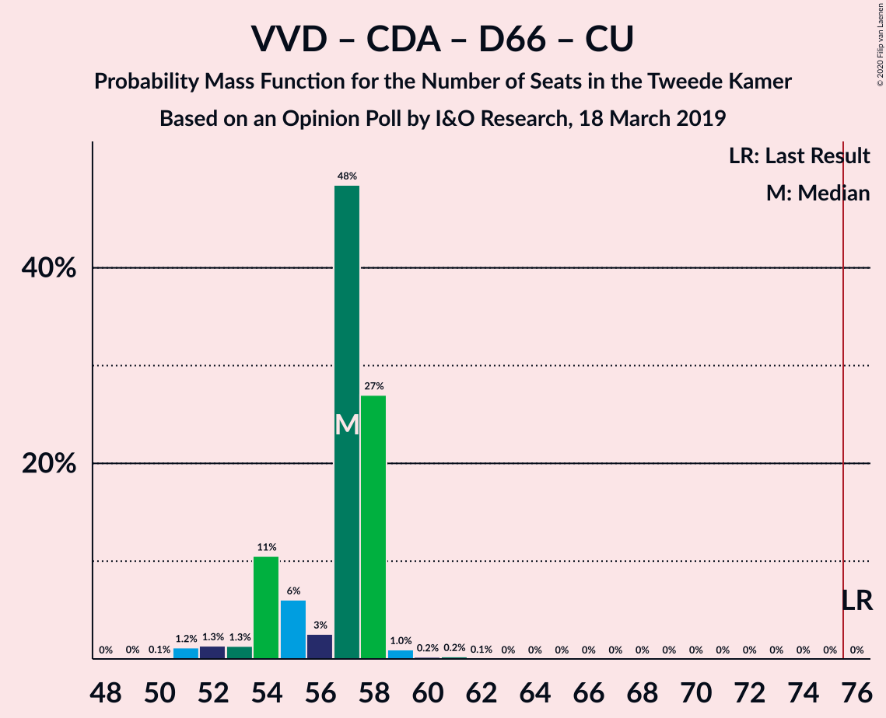

| Number of Seats | Probability | Accumulated | Special Marks |
|:---------------:|:-----------:|:-----------:|:-------------:|
| 50 | 0.1% | 100% |  |
| 51 | 1.2% | 99.9% |  |
| 52 | 1.3% | 98.7% |  |
| 53 | 1.3% | 97% |  |
| 54 | 11% | 96% |  |
| 55 | 6% | 86% |  |
| 56 | 3% | 80% |  |
| 57 | 48% | 77% | Median |
| 58 | 27% | 28% |  |
| 59 | 1.0% | 1.5% |  |
| 60 | 0.2% | 0.5% |  |
| 61 | 0.2% | 0.3% |  |
| 62 | 0.1% | 0.1% |  |
| 63 | 0% | 0% |  |
| 64 | 0% | 0% |  |
| 65 | 0% | 0% |  |
| 66 | 0% | 0% |  |
| 67 | 0% | 0% |  |
| 68 | 0% | 0% |  |
| 69 | 0% | 0% |  |
| 70 | 0% | 0% |  |
| 71 | 0% | 0% |  |
| 72 | 0% | 0% |  |
| 73 | 0% | 0% |  |
| 74 | 0% | 0% |  |
| 75 | 0% | 0% |  |
| 76 | 0% | 0% | Last Result, Majority |

### Volkspartij voor Vrijheid en Democratie – Partij voor de Vrijheid – Christen-Democratisch Appèl

| Number of Seats | Probability | Accumulated | Special Marks |
|:---------------:|:-----------:|:-----------:|:-------------:|
| 46 | 0% | 100% |  |
| 47 | 0.3% | 99.9% |  |
| 48 | 0.7% | 99.6% |  |
| 49 | 1.5% | 98.9% |  |
| 50 | 5% | 97% |  |
| 51 | 1.0% | 92% |  |
| 52 | 14% | 91% |  |
| 53 | 2% | 77% |  |
| 54 | 47% | 75% | Median |
| 55 | 28% | 29% |  |
| 56 | 0.1% | 1.0% |  |
| 57 | 0.6% | 0.9% |  |
| 58 | 0.2% | 0.3% |  |
| 59 | 0.1% | 0.1% |  |
| 60 | 0% | 0% |  |
| 61 | 0% | 0% |  |
| 62 | 0% | 0% |  |
| 63 | 0% | 0% |  |
| 64 | 0% | 0% |  |
| 65 | 0% | 0% |  |
| 66 | 0% | 0% |  |
| 67 | 0% | 0% |  |
| 68 | 0% | 0% |  |
| 69 | 0% | 0% |  |
| 70 | 0% | 0% |  |
| 71 | 0% | 0% |  |
| 72 | 0% | 0% | Last Result |

### Volkspartij voor Vrijheid en Democratie – Christen-Democratisch Appèl – Partij van de Arbeid

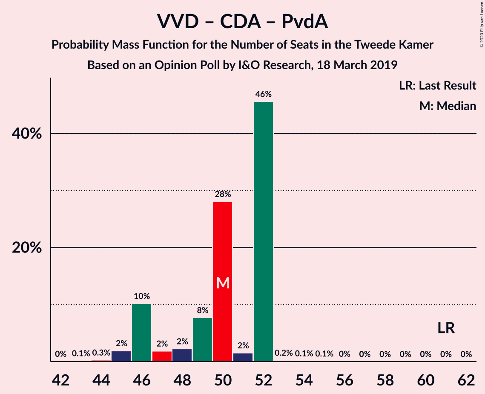

| Number of Seats | Probability | Accumulated | Special Marks |
|:---------------:|:-----------:|:-----------:|:-------------:|
| 43 | 0.1% | 100% |  |
| 44 | 0.3% | 99.8% |  |
| 45 | 2% | 99.6% |  |
| 46 | 10% | 98% |  |
| 47 | 2% | 87% |  |
| 48 | 2% | 86% |  |
| 49 | 8% | 83% |  |
| 50 | 28% | 76% |  |
| 51 | 2% | 48% |  |
| 52 | 46% | 46% | Median |
| 53 | 0.2% | 0.5% |  |
| 54 | 0.1% | 0.3% |  |
| 55 | 0.1% | 0.1% |  |
| 56 | 0% | 0% |  |
| 57 | 0% | 0% |  |
| 58 | 0% | 0% |  |
| 59 | 0% | 0% |  |
| 60 | 0% | 0% |  |
| 61 | 0% | 0% | Last Result |

### Volkspartij voor Vrijheid en Democratie – Christen-Democratisch Appèl – Democraten 66

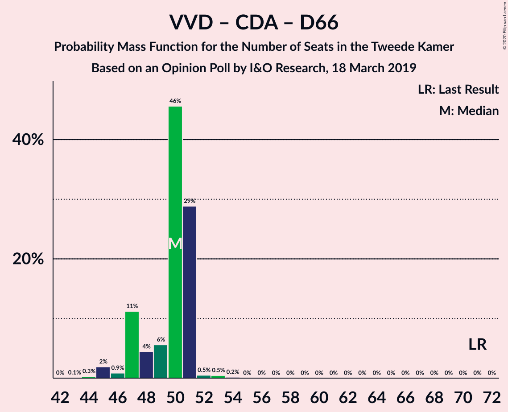

| Number of Seats | Probability | Accumulated | Special Marks |
|:---------------:|:-----------:|:-----------:|:-------------:|
| 43 | 0.1% | 100% |  |
| 44 | 0.3% | 99.9% |  |
| 45 | 2% | 99.6% |  |
| 46 | 0.9% | 98% |  |
| 47 | 11% | 97% |  |
| 48 | 4% | 86% |  |
| 49 | 6% | 81% |  |
| 50 | 46% | 76% | Median |
| 51 | 29% | 30% |  |
| 52 | 0.5% | 1.1% |  |
| 53 | 0.5% | 0.7% |  |
| 54 | 0.2% | 0.2% |  |
| 55 | 0% | 0% |  |
| 56 | 0% | 0% |  |
| 57 | 0% | 0% |  |
| 58 | 0% | 0% |  |
| 59 | 0% | 0% |  |
| 60 | 0% | 0% |  |
| 61 | 0% | 0% |  |
| 62 | 0% | 0% |  |
| 63 | 0% | 0% |  |
| 64 | 0% | 0% |  |
| 65 | 0% | 0% |  |
| 66 | 0% | 0% |  |
| 67 | 0% | 0% |  |
| 68 | 0% | 0% |  |
| 69 | 0% | 0% |  |
| 70 | 0% | 0% |  |
| 71 | 0% | 0% | Last Result |

### Volkspartij voor Vrijheid en Democratie – Partij van de Arbeid – Democraten 66

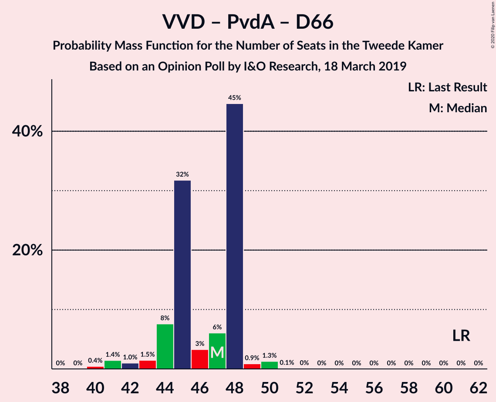

| Number of Seats | Probability | Accumulated | Special Marks |
|:---------------:|:-----------:|:-----------:|:-------------:|
| 40 | 0.4% | 100% |  |
| 41 | 1.4% | 99.5% |  |
| 42 | 1.0% | 98% |  |
| 43 | 1.5% | 97% |  |
| 44 | 8% | 96% |  |
| 45 | 32% | 88% |  |
| 46 | 3% | 56% |  |
| 47 | 6% | 53% |  |
| 48 | 45% | 47% | Median |
| 49 | 0.9% | 2% |  |
| 50 | 1.3% | 1.4% |  |
| 51 | 0.1% | 0.2% |  |
| 52 | 0% | 0.1% |  |
| 53 | 0% | 0% |  |
| 54 | 0% | 0% |  |
| 55 | 0% | 0% |  |
| 56 | 0% | 0% |  |
| 57 | 0% | 0% |  |
| 58 | 0% | 0% |  |
| 59 | 0% | 0% |  |
| 60 | 0% | 0% |  |
| 61 | 0% | 0% | Last Result |

### Christen-Democratisch Appèl – Partij van de Arbeid – Democraten 66

| Number of Seats | Probability | Accumulated | Special Marks |
|:---------------:|:-----------:|:-----------:|:-------------:|
| 32 | 0% | 100% |  |
| 33 | 4% | 99.9% |  |
| 34 | 2% | 96% |  |
| 35 | 1.2% | 93% |  |
| 36 | 3% | 92% |  |
| 37 | 38% | 89% |  |
| 38 | 1.4% | 52% |  |
| 39 | 45% | 50% | Median |
| 40 | 0.8% | 6% |  |
| 41 | 5% | 5% |  |
| 42 | 0.4% | 0.4% |  |
| 43 | 0.1% | 0.1% |  |
| 44 | 0% | 0% |  |
| 45 | 0% | 0% |  |
| 46 | 0% | 0% |  |
| 47 | 0% | 0% | Last Result |

### Volkspartij voor Vrijheid en Democratie – Christen-Democratisch Appèl

| Number of Seats | Probability | Accumulated | Special Marks |
|:---------------:|:-----------:|:-----------:|:-------------:|
| 32 | 0.1% | 100% |  |
| 33 | 0.5% | 99.9% |  |
| 34 | 0.6% | 99.5% |  |
| 35 | 10% | 98.9% |  |
| 36 | 8% | 89% |  |
| 37 | 1.1% | 81% |  |
| 38 | 2% | 80% |  |
| 39 | 50% | 78% | Median |
| 40 | 27% | 28% |  |
| 41 | 0.3% | 0.6% |  |
| 42 | 0.2% | 0.3% |  |
| 43 | 0.1% | 0.1% |  |
| 44 | 0% | 0% |  |
| 45 | 0% | 0% |  |
| 46 | 0% | 0% |  |
| 47 | 0% | 0% |  |
| 48 | 0% | 0% |  |
| 49 | 0% | 0% |  |
| 50 | 0% | 0% |  |
| 51 | 0% | 0% |  |
| 52 | 0% | 0% | Last Result |

### Volkspartij voor Vrijheid en Democratie – Partij van de Arbeid

| Number of Seats | Probability | Accumulated | Special Marks |
|:---------------:|:-----------:|:-----------:|:-------------:|
| 29 | 0.1% | 100% |  |
| 30 | 0.5% | 99.8% |  |
| 31 | 2% | 99.3% |  |
| 32 | 8% | 98% |  |
| 33 | 1.2% | 89% |  |
| 34 | 37% | 88% |  |
| 35 | 2% | 51% |  |
| 36 | 3% | 49% |  |
| 37 | 44% | 46% | Median |
| 38 | 0.6% | 2% |  |
| 39 | 1.2% | 1.3% |  |
| 40 | 0.1% | 0.1% |  |
| 41 | 0% | 0% |  |
| 42 | 0% | 0% | Last Result |

### Christen-Democratisch Appèl – Partij van de Arbeid – ChristenUnie

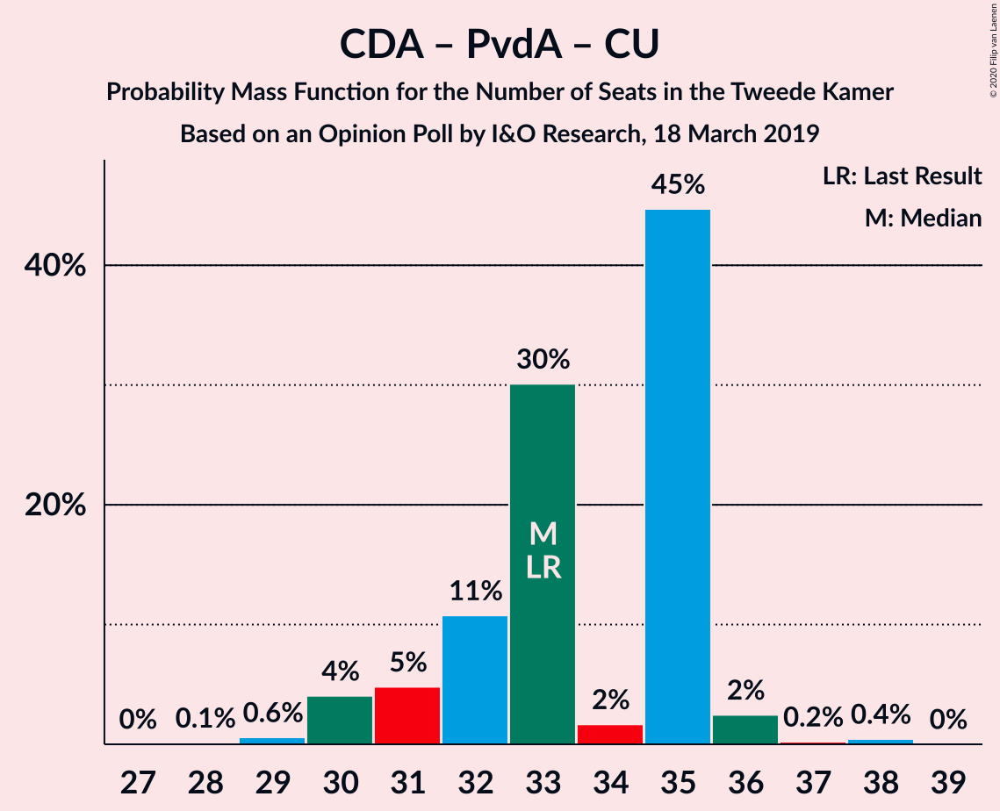

| Number of Seats | Probability | Accumulated | Special Marks |
|:---------------:|:-----------:|:-----------:|:-------------:|
| 28 | 0.1% | 100% |  |
| 29 | 0.6% | 99.8% |  |
| 30 | 4% | 99.3% |  |
| 31 | 5% | 95% |  |
| 32 | 11% | 90% |  |
| 33 | 30% | 80% | Last Result |
| 34 | 2% | 50% |  |
| 35 | 45% | 48% | Median |
| 36 | 2% | 3% |  |
| 37 | 0.2% | 0.7% |  |
| 38 | 0.4% | 0.5% |  |
| 39 | 0% | 0% |  |

### Christen-Democratisch Appèl – Democraten 66

| Number of Seats | Probability | Accumulated | Special Marks |
|:---------------:|:-----------:|:-----------:|:-------------:|
| 21 | 0.1% | 100% |  |
| 22 | 0.2% | 99.9% |  |
| 23 | 4% | 99.8% |  |
| 24 | 5% | 95% |  |
| 25 | 4% | 90% |  |
| 26 | 52% | 87% | Median |
| 27 | 29% | 35% |  |
| 28 | 5% | 6% |  |
| 29 | 0.4% | 0.7% |  |
| 30 | 0.2% | 0.3% |  |
| 31 | 0.1% | 0.1% |  |
| 32 | 0% | 0% |  |
| 33 | 0% | 0% |  |
| 34 | 0% | 0% |  |
| 35 | 0% | 0% |  |
| 36 | 0% | 0% |  |
| 37 | 0% | 0% |  |
| 38 | 0% | 0% | Last Result |

### Christen-Democratisch Appèl – Partij van de Arbeid

| Number of Seats | Probability | Accumulated | Special Marks |
|:---------------:|:-----------:|:-----------:|:-------------:|
| 22 | 3% | 100% |  |
| 23 | 2% | 97% |  |
| 24 | 3% | 95% |  |
| 25 | 11% | 92% |  |
| 26 | 29% | 81% |  |
| 27 | 2% | 52% |  |
| 28 | 48% | 50% | Last Result, Median |
| 29 | 0.9% | 2% |  |
| 30 | 0.2% | 0.6% |  |
| 31 | 0.4% | 0.4% |  |
| 32 | 0.1% | 0.1% |  |
| 33 | 0% | 0% |  |

## Technical Information

### Opinion Poll

+ **Polling firm:** I&O Research
+ **Commissioner(s):** —
+ **Fieldwork period:** 18 March 2019

### Calculations

+ **Sample size:** 1339
+ **Simulations done:** 1,048,576
+ **Error estimate:** 1.77%

