# Opinion Poll by Ipsos, 21 March 2019

<a href="#voting-intentions">Voting Intentions</a> | <a href="#seats">Seats</a> | <a href="#coalitions">Coalitions</a> | <a href="#technical-information">Technical Information</a>

## Voting Intentions

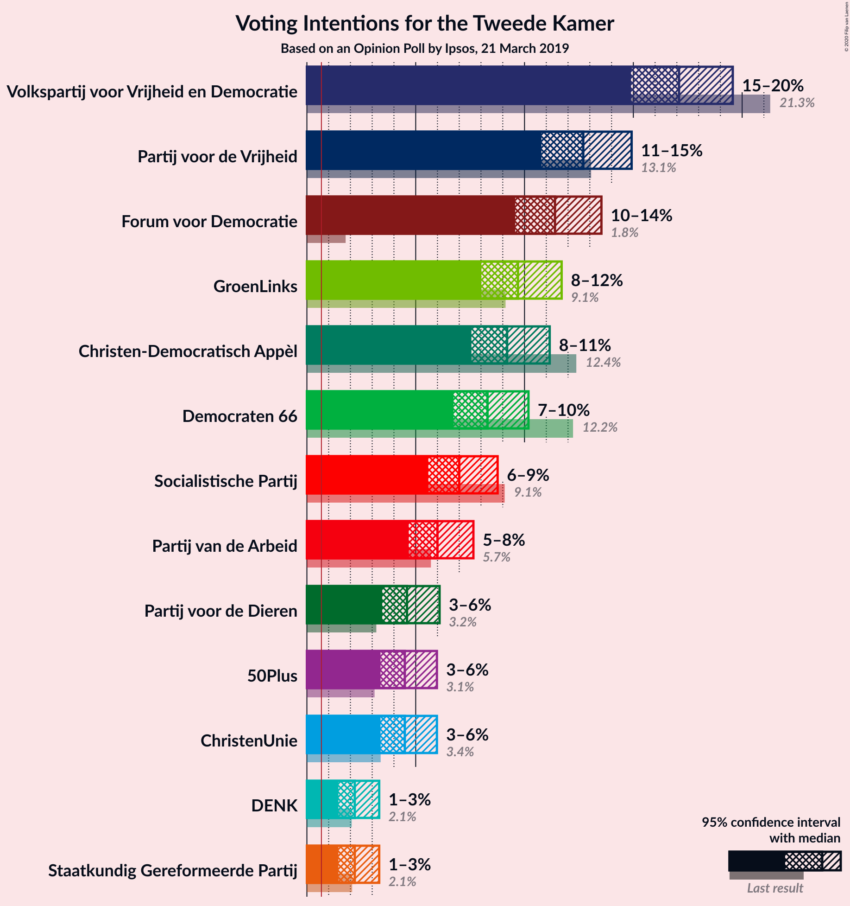

### Confidence Intervals

| Party | Last Result | Poll Result | 80% Confidence Interval | 90% Confidence Interval | 95% Confidence Interval | 99% Confidence Interval |
|:-----:|:-----------:|:-----------:|:-----------------------:|:-----------------------:|:-----------------------:|:-----------------------:|
| Volkspartij voor Vrijheid en Democratie | 21.3% | 17.1% | 15.7–18.7% |15.2–19.2% |14.9–19.6% |14.2–20.4% |
| Partij voor de Vrijheid | 13.1% | 12.7% | 11.4–14.1% |11.1–14.6% |10.8–14.9% |10.2–15.6% |
| Forum voor Democratie | 1.8% | 11.4% | 10.2–12.8% |9.9–13.2% |9.6–13.5% |9.0–14.2% |
| GroenLinks | 9.1% | 9.7% | 8.6–11.0% |8.3–11.4% |8.0–11.7% |7.5–12.3% |
| Christen-Democratisch Appèl | 12.4% | 9.2% | 8.1–10.5% |7.8–10.8% |7.6–11.2% |7.1–11.8% |
| Democraten 66 | 12.2% | 8.3% | 7.3–9.5% |7.0–9.9% |6.7–10.2% |6.3–10.8% |
| Socialistische Partij | 9.1% | 7.0% | 6.1–8.2% |5.8–8.5% |5.6–8.8% |5.2–9.3% |
| Partij van de Arbeid | 5.7% | 6.0% | 5.1–7.1% |4.9–7.4% |4.7–7.7% |4.3–8.2% |
| Partij voor de Dieren | 3.2% | 4.6% | 3.9–5.6% |3.6–5.9% |3.5–6.1% |3.1–6.6% |
| ChristenUnie | 3.4% | 4.5% | 3.8–5.5% |3.6–5.7% |3.4–6.0% |3.0–6.5% |
| 50Plus | 3.1% | 4.5% | 3.8–5.5% |3.6–5.7% |3.4–6.0% |3.0–6.5% |
| Staatkundig Gereformeerde Partij | 2.1% | 2.2% | 1.7–2.9% |1.6–3.1% |1.4–3.3% |1.2–3.7% |
| DENK | 2.1% | 2.2% | 1.7–2.9% |1.6–3.1% |1.4–3.3% |1.2–3.7% |

*Note:* The poll result column reflects the actual value used in the calculations. Published results may vary slightly, and in addition be rounded to fewer digits.

## Seats

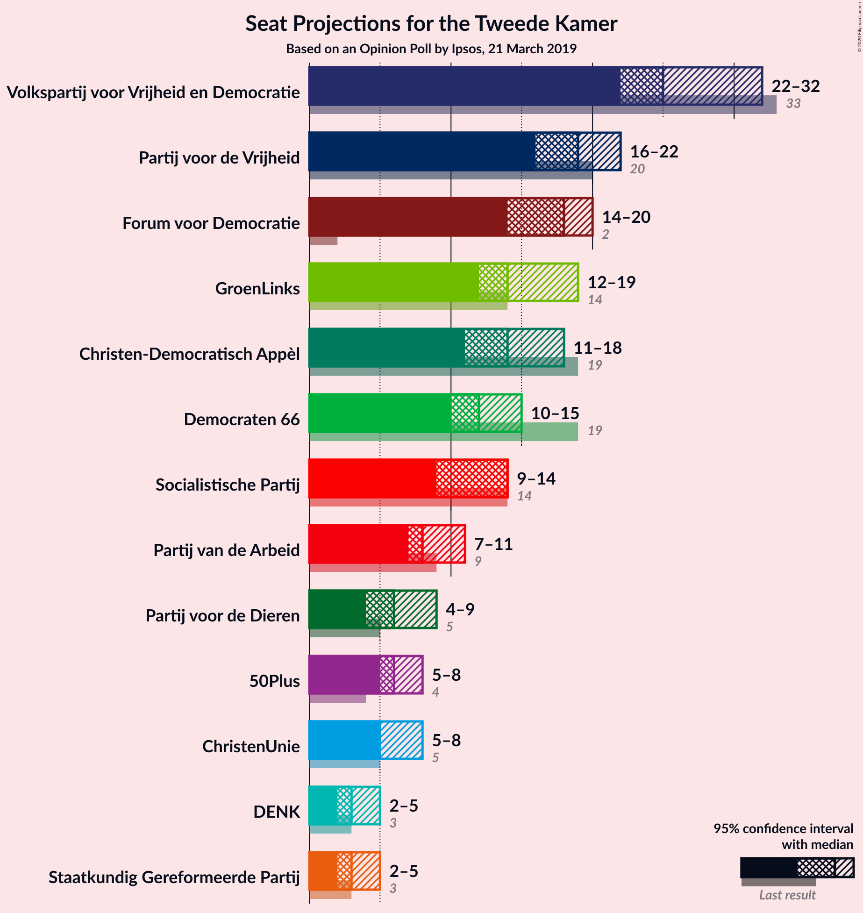

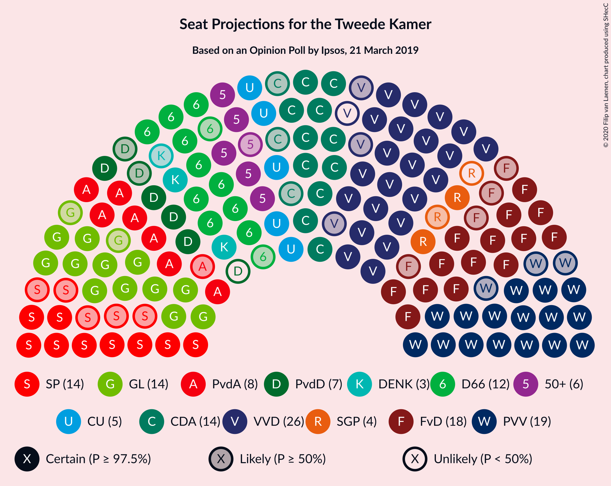

### Confidence Intervals

| Party | Last Result | Median | 80% Confidence Interval | 90% Confidence Interval | 95% Confidence Interval | 99% Confidence Interval |
|:-----:|:-----------:|:------:|:-----------------------:|:-----------------------:|:-----------------------:|:-----------------------:|
| <a href="#volkspartij-voor-vrijheid-en-democratie">Volkspartij voor Vrijheid en Democratie</a> | 33 | 25 | 22–27 |22–31 |22–32 |21–32 |
| <a href="#partij-voor-de-vrijheid">Partij voor de Vrijheid</a> | 20 | 19 | 17–22 |16–22 |16–22 |15–24 |
| <a href="#forum-voor-democratie">Forum voor Democratie</a> | 2 | 18 | 17–20 |16–20 |14–20 |14–21 |
| <a href="#groenlinks">GroenLinks</a> | 14 | 14 | 13–17 |13–18 |12–19 |11–19 |
| <a href="#christen-democratisch-appèl">Christen-Democratisch Appèl</a> | 19 | 14 | 13–16 |12–16 |11–18 |10–18 |
| <a href="#democraten-66">Democraten 66</a> | 19 | 12 | 11–14 |10–14 |10–15 |9–15 |
| <a href="#socialistische-partij">Socialistische Partij</a> | 14 | 14 | 9–14 |9–14 |9–14 |7–14 |
| <a href="#partij-van-de-arbeid">Partij van de Arbeid</a> | 9 | 8 | 8–11 |7–11 |7–11 |6–12 |
| <a href="#partij-voor-de-dieren">Partij voor de Dieren</a> | 5 | 6 | 5–7 |4–8 |4–9 |4–10 |
| <a href="#christenunie">ChristenUnie</a> | 5 | 5 | 5–8 |5–8 |5–8 |4–9 |
| <a href="#50plus">50Plus</a> | 4 | 6 | 5–8 |5–8 |5–8 |5–10 |
| <a href="#staatkundig-gereformeerde-partij">Staatkundig Gereformeerde Partij</a> | 3 | 3 | 2–4 |2–4 |2–5 |1–5 |
| <a href="#denk">DENK</a> | 3 | 3 | 3–4 |2–4 |2–5 |1–5 |

### Volkspartij voor Vrijheid en Democratie

*For a full overview of the results for this party, see the [Volkspartij voor Vrijheid en Democratie](party-volkspartijvoorvrijheidendemocratie.html) page.*

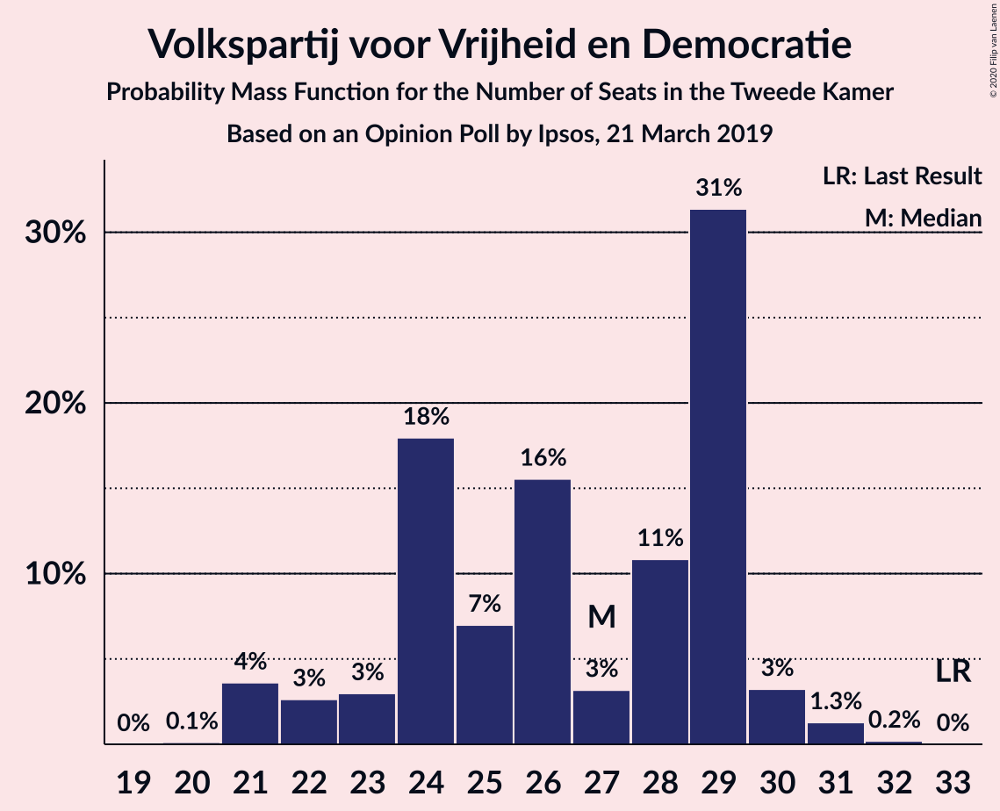

| Number of Seats | Probability | Accumulated | Special Marks |
|:---------------:|:-----------:|:-----------:|:-------------:|
| 21 | 1.5% | 100% |  |
| 22 | 29% | 98.5% |  |
| 23 | 2% | 70% |  |
| 24 | 0.8% | 68% |  |
| 25 | 24% | 67% | Median |
| 26 | 27% | 43% |  |
| 27 | 7% | 17% |  |
| 28 | 0.5% | 10% |  |
| 29 | 0.5% | 9% |  |
| 30 | 2% | 9% |  |
| 31 | 4% | 7% |  |
| 32 | 3% | 3% |  |
| 33 | 0% | 0% | Last Result |

### Partij voor de Vrijheid

*For a full overview of the results for this party, see the [Partij voor de Vrijheid](party-partijvoordevrijheid.html) page.*

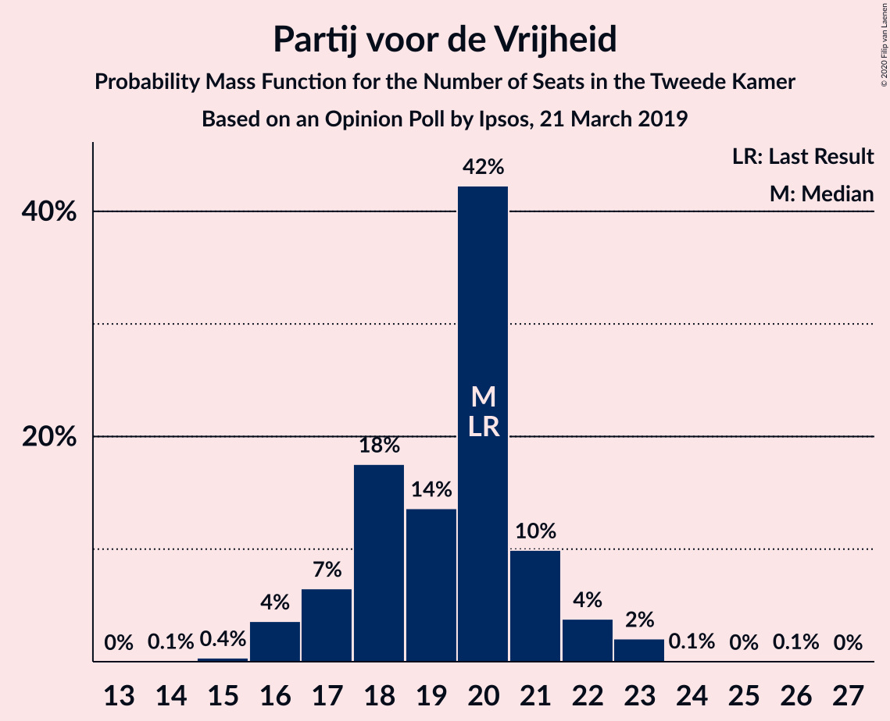

| Number of Seats | Probability | Accumulated | Special Marks |
|:---------------:|:-----------:|:-----------:|:-------------:|
| 14 | 0.1% | 100% |  |
| 15 | 1.4% | 99.8% |  |
| 16 | 7% | 98% |  |
| 17 | 3% | 92% |  |
| 18 | 5% | 88% |  |
| 19 | 55% | 83% | Median |
| 20 | 5% | 28% | Last Result |
| 21 | 2% | 23% |  |
| 22 | 19% | 21% |  |
| 23 | 1.0% | 2% |  |
| 24 | 1.0% | 1.1% |  |
| 25 | 0% | 0% |  |

### Forum voor Democratie

*For a full overview of the results for this party, see the [Forum voor Democratie](party-forumvoordemocratie.html) page.*

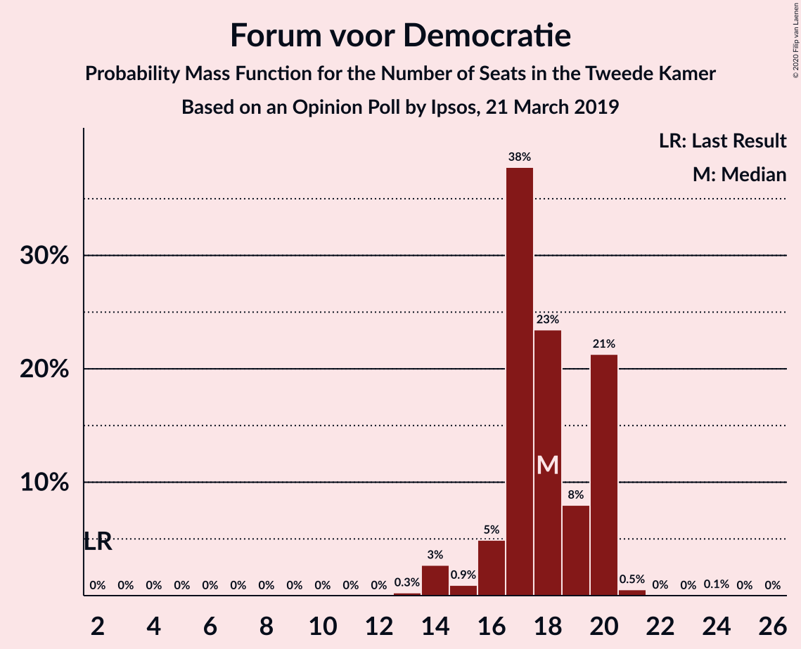

| Number of Seats | Probability | Accumulated | Special Marks |
|:---------------:|:-----------:|:-----------:|:-------------:|
| 2 | 0% | 100% | Last Result |
| 3 | 0% | 100% |  |
| 4 | 0% | 100% |  |
| 5 | 0% | 100% |  |
| 6 | 0% | 100% |  |
| 7 | 0% | 100% |  |
| 8 | 0% | 100% |  |
| 9 | 0% | 100% |  |
| 10 | 0% | 100% |  |
| 11 | 0% | 100% |  |
| 12 | 0% | 100% |  |
| 13 | 0.3% | 100% |  |
| 14 | 3% | 99.7% |  |
| 15 | 0.9% | 97% |  |
| 16 | 5% | 96% |  |
| 17 | 38% | 91% |  |
| 18 | 23% | 53% | Median |
| 19 | 8% | 30% |  |
| 20 | 21% | 22% |  |
| 21 | 0.5% | 0.7% |  |
| 22 | 0% | 0.2% |  |
| 23 | 0% | 0.1% |  |
| 24 | 0.1% | 0.1% |  |
| 25 | 0% | 0% |  |

### GroenLinks

*For a full overview of the results for this party, see the [GroenLinks](party-groenlinks.html) page.*

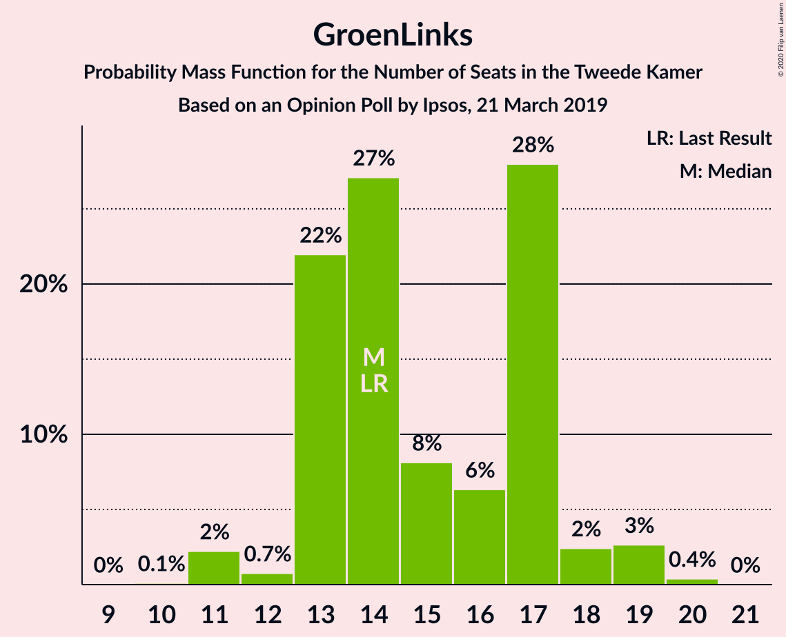

| Number of Seats | Probability | Accumulated | Special Marks |
|:---------------:|:-----------:|:-----------:|:-------------:|
| 10 | 0.1% | 100% |  |
| 11 | 2% | 99.9% |  |
| 12 | 0.7% | 98% |  |
| 13 | 22% | 97% |  |
| 14 | 27% | 75% | Last Result, Median |
| 15 | 8% | 48% |  |
| 16 | 6% | 40% |  |
| 17 | 28% | 33% |  |
| 18 | 2% | 5% |  |
| 19 | 3% | 3% |  |
| 20 | 0.4% | 0.4% |  |
| 21 | 0% | 0% |  |

### Christen-Democratisch Appèl

*For a full overview of the results for this party, see the [Christen-Democratisch Appèl](party-christen-democratischappèl.html) page.*

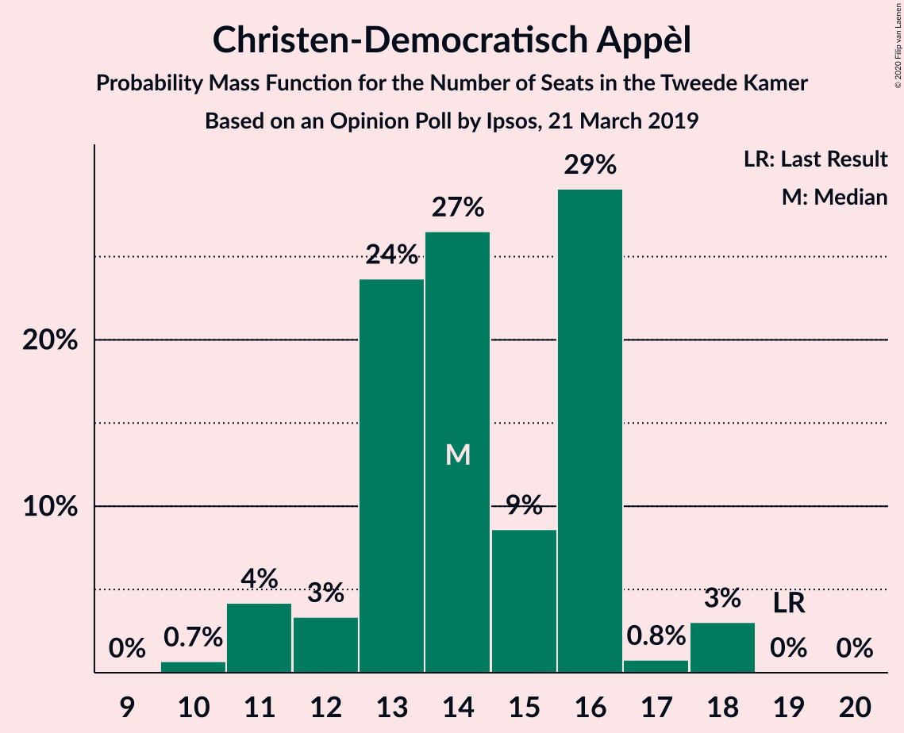

| Number of Seats | Probability | Accumulated | Special Marks |
|:---------------:|:-----------:|:-----------:|:-------------:|
| 10 | 0.7% | 100% |  |
| 11 | 4% | 99.3% |  |
| 12 | 3% | 95% |  |
| 13 | 24% | 92% |  |
| 14 | 27% | 68% | Median |
| 15 | 9% | 42% |  |
| 16 | 29% | 33% |  |
| 17 | 0.8% | 4% |  |
| 18 | 3% | 3% |  |
| 19 | 0% | 0.1% | Last Result |
| 20 | 0% | 0% |  |

### Democraten 66

*For a full overview of the results for this party, see the [Democraten 66](party-democraten66.html) page.*

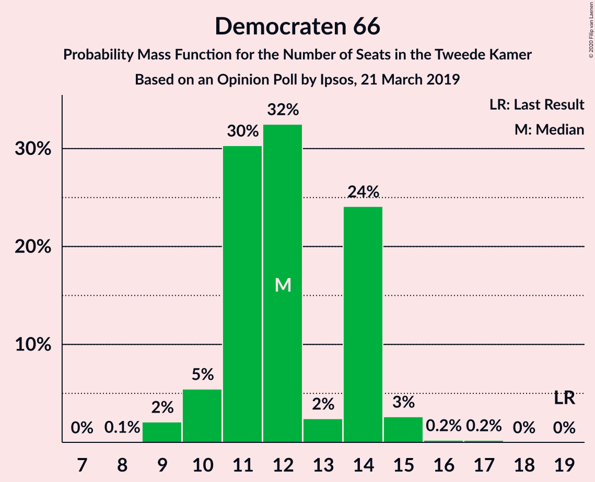

| Number of Seats | Probability | Accumulated | Special Marks |
|:---------------:|:-----------:|:-----------:|:-------------:|
| 8 | 0.1% | 100% |  |
| 9 | 2% | 99.9% |  |
| 10 | 5% | 98% |  |
| 11 | 30% | 92% |  |
| 12 | 32% | 62% | Median |
| 13 | 2% | 30% |  |
| 14 | 24% | 27% |  |
| 15 | 3% | 3% |  |
| 16 | 0.2% | 0.5% |  |
| 17 | 0.2% | 0.2% |  |
| 18 | 0% | 0% |  |
| 19 | 0% | 0% | Last Result |

### Socialistische Partij

*For a full overview of the results for this party, see the [Socialistische Partij](party-socialistischepartij.html) page.*

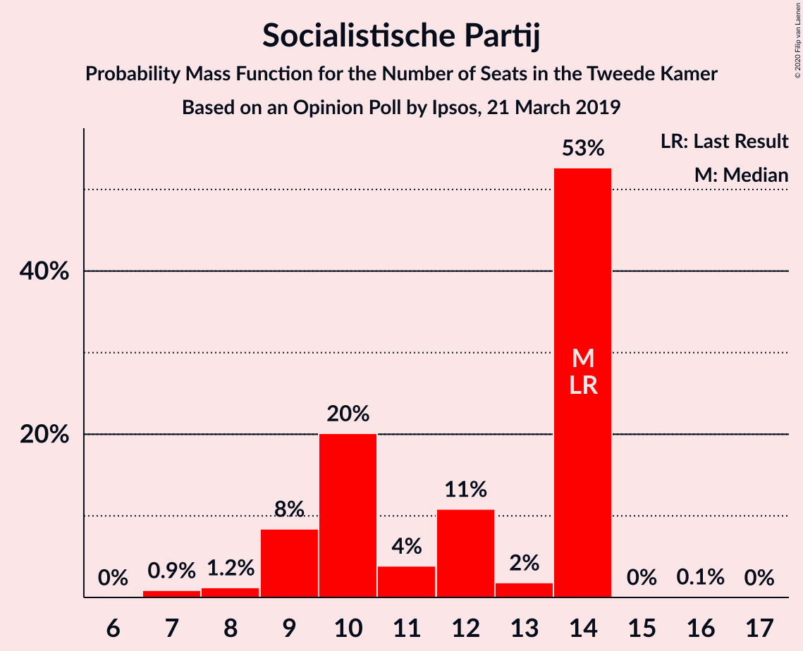

| Number of Seats | Probability | Accumulated | Special Marks |
|:---------------:|:-----------:|:-----------:|:-------------:|
| 7 | 0.9% | 100% |  |
| 8 | 1.2% | 99.1% |  |
| 9 | 8% | 98% |  |
| 10 | 20% | 89% |  |
| 11 | 4% | 69% |  |
| 12 | 11% | 65% |  |
| 13 | 2% | 55% |  |
| 14 | 53% | 53% | Last Result, Median |
| 15 | 0% | 0.2% |  |
| 16 | 0.1% | 0.1% |  |
| 17 | 0% | 0% |  |

### Partij van de Arbeid

*For a full overview of the results for this party, see the [Partij van de Arbeid](party-partijvandearbeid.html) page.*

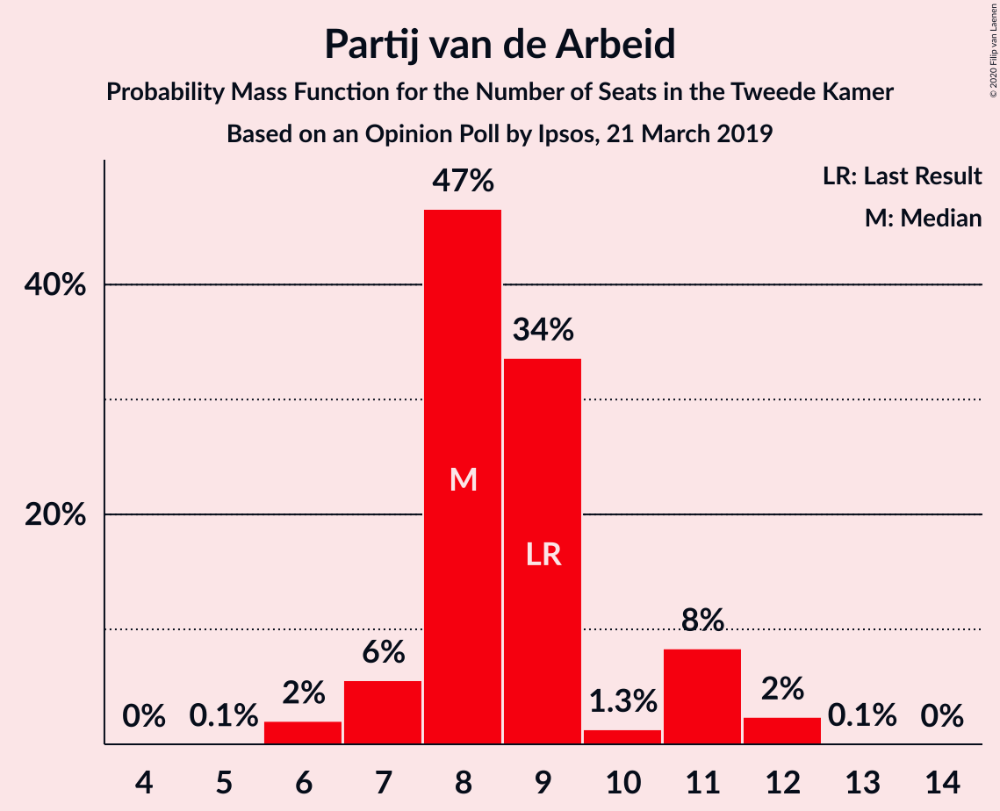

| Number of Seats | Probability | Accumulated | Special Marks |
|:---------------:|:-----------:|:-----------:|:-------------:|
| 5 | 0.1% | 100% |  |
| 6 | 2% | 99.9% |  |
| 7 | 6% | 98% |  |
| 8 | 47% | 92% | Median |
| 9 | 34% | 46% | Last Result |
| 10 | 1.3% | 12% |  |
| 11 | 8% | 11% |  |
| 12 | 2% | 2% |  |
| 13 | 0.1% | 0.1% |  |
| 14 | 0% | 0% |  |

### Partij voor de Dieren

*For a full overview of the results for this party, see the [Partij voor de Dieren](party-partijvoordedieren.html) page.*

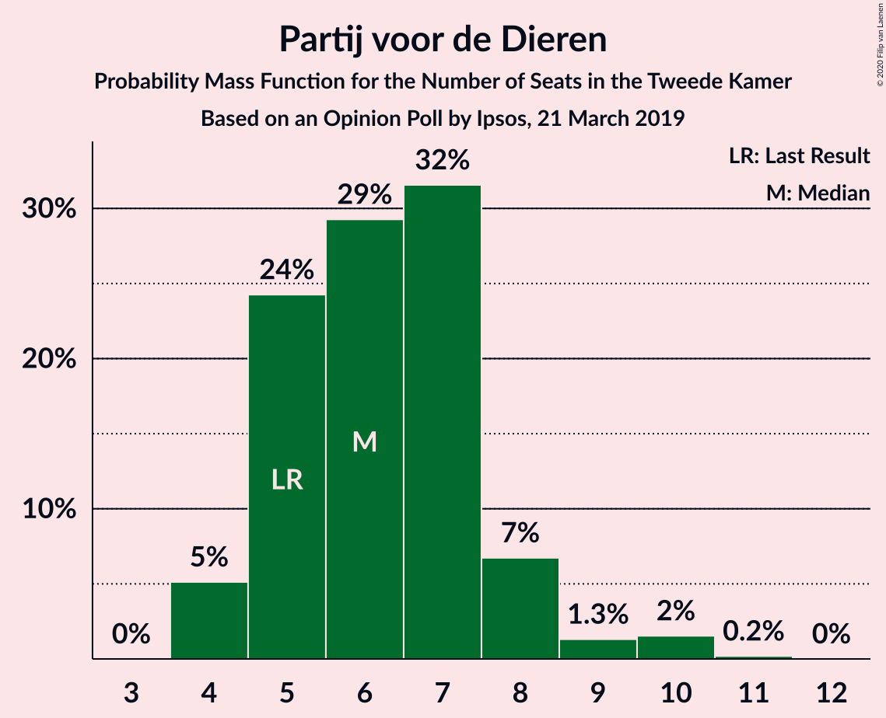

| Number of Seats | Probability | Accumulated | Special Marks |
|:---------------:|:-----------:|:-----------:|:-------------:|
| 4 | 5% | 100% |  |
| 5 | 24% | 95% | Last Result |
| 6 | 29% | 71% | Median |
| 7 | 32% | 41% |  |
| 8 | 7% | 10% |  |
| 9 | 1.3% | 3% |  |
| 10 | 2% | 2% |  |
| 11 | 0.2% | 0.2% |  |
| 12 | 0% | 0% |  |

### ChristenUnie

*For a full overview of the results for this party, see the [ChristenUnie](party-christenunie.html) page.*

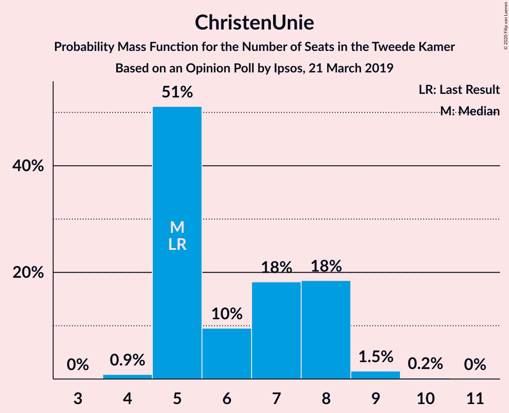

| Number of Seats | Probability | Accumulated | Special Marks |
|:---------------:|:-----------:|:-----------:|:-------------:|
| 4 | 0.9% | 100% |  |
| 5 | 51% | 99.1% | Last Result, Median |
| 6 | 10% | 48% |  |
| 7 | 18% | 38% |  |
| 8 | 18% | 20% |  |
| 9 | 1.5% | 2% |  |
| 10 | 0.2% | 0.2% |  |
| 11 | 0% | 0% |  |

### 50Plus

*For a full overview of the results for this party, see the [50Plus](party-50plus.html) page.*

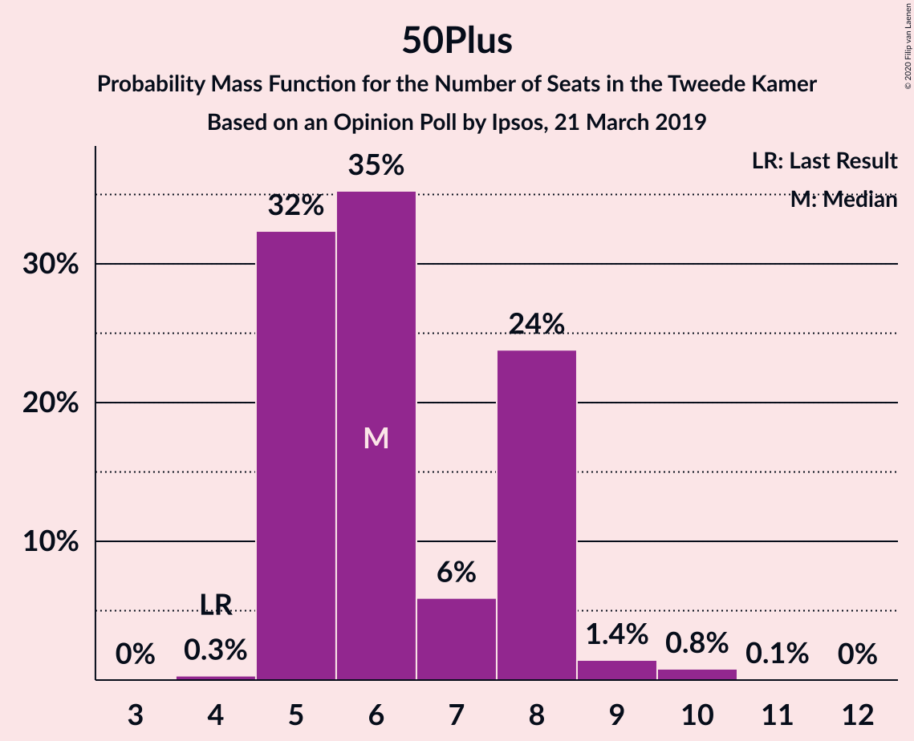

| Number of Seats | Probability | Accumulated | Special Marks |
|:---------------:|:-----------:|:-----------:|:-------------:|
| 4 | 0.3% | 100% | Last Result |
| 5 | 32% | 99.7% |  |
| 6 | 35% | 67% | Median |
| 7 | 6% | 32% |  |
| 8 | 24% | 26% |  |
| 9 | 1.4% | 2% |  |
| 10 | 0.8% | 0.9% |  |
| 11 | 0.1% | 0.1% |  |
| 12 | 0% | 0% |  |

### Staatkundig Gereformeerde Partij

*For a full overview of the results for this party, see the [Staatkundig Gereformeerde Partij](party-staatkundiggereformeerdepartij.html) page.*

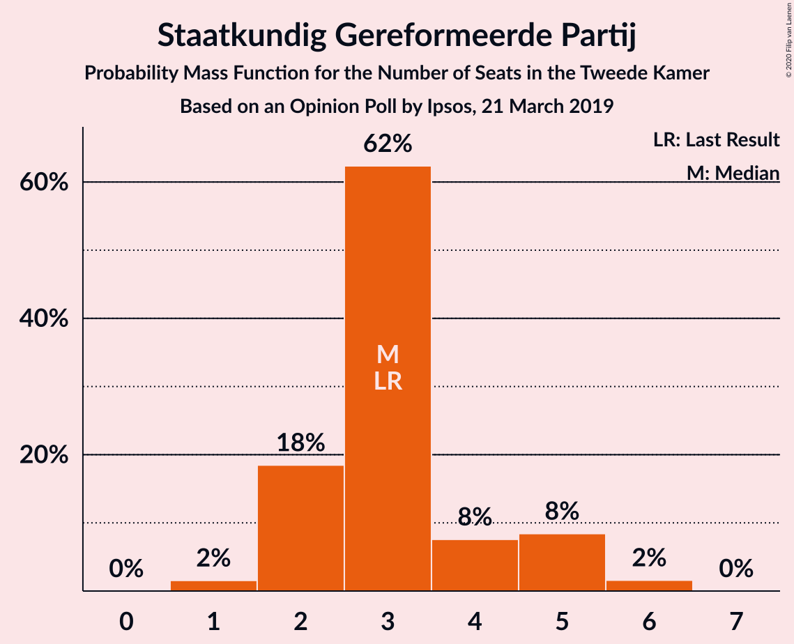

| Number of Seats | Probability | Accumulated | Special Marks |
|:---------------:|:-----------:|:-----------:|:-------------:|
| 1 | 2% | 100% |  |
| 2 | 39% | 98% |  |
| 3 | 26% | 60% | Last Result, Median |
| 4 | 29% | 34% |  |
| 5 | 5% | 5% |  |
| 6 | 0% | 0% |  |

### DENK

*For a full overview of the results for this party, see the [DENK](party-denk.html) page.*

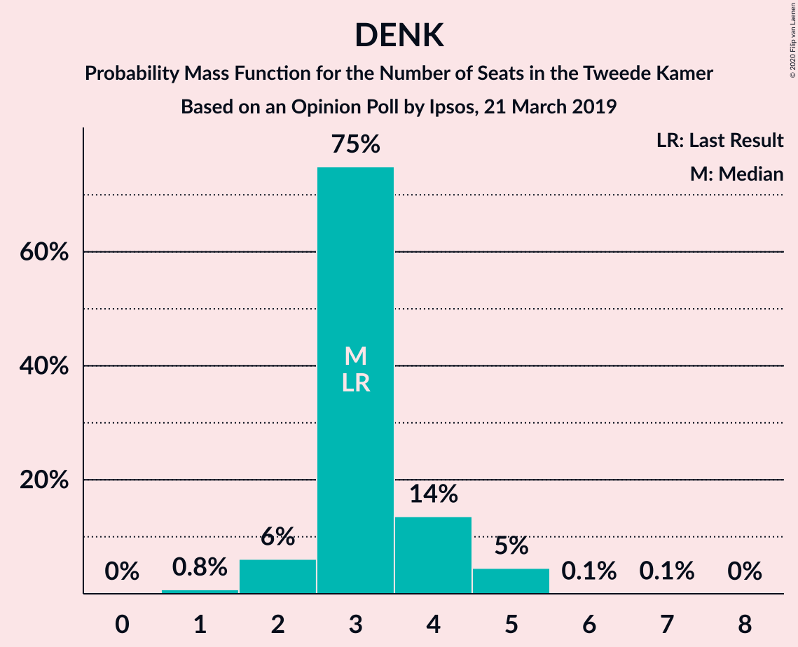

| Number of Seats | Probability | Accumulated | Special Marks |
|:---------------:|:-----------:|:-----------:|:-------------:|
| 1 | 0.8% | 100% |  |
| 2 | 6% | 99.2% |  |
| 3 | 75% | 93% | Last Result, Median |
| 4 | 14% | 18% |  |
| 5 | 5% | 5% |  |
| 6 | 0.1% | 0.1% |  |
| 7 | 0.1% | 0.1% |  |
| 8 | 0% | 0% |  |

## Coalitions

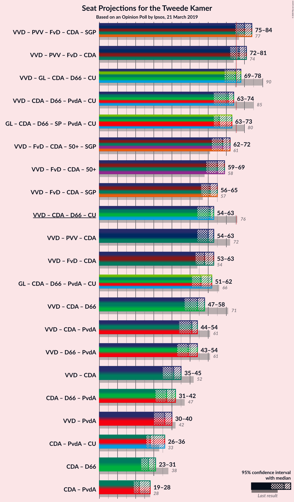

### Confidence Intervals

| Coalition | Last Result | Median | Majority? | 80% Confidence Interval | 90% Confidence Interval | 95% Confidence Interval | 99% Confidence Interval |
|:---------:|:-----------:|:------:|:---------:|:-----------------------:|:-----------------------:|:-----------------------:|:-----------------------:|
| Volkspartij voor Vrijheid en Democratie – Partij voor de Vrijheid – Forum voor Democratie – Christen-Democratisch Appèl – Staatkundig Gereformeerde Partij | 77 | 80 | 96% | 76–84 | 76–84 | 74–88 | 73–88 |
| Volkspartij voor Vrijheid en Democratie – Partij voor de Vrijheid – Forum voor Democratie – Christen-Democratisch Appèl | 74 | 76 | 58% | 74–81 | 74–81 | 72–84 | 69–84 |
| Volkspartij voor Vrijheid en Democratie – GroenLinks – Christen-Democratisch Appèl – Democraten 66 – ChristenUnie | 90 | 72 | 13% | 69–77 | 69–80 | 68–80 | 66–80 |
| Volkspartij voor Vrijheid en Democratie – Forum voor Democratie – Christen-Democratisch Appèl – 50Plus – Staatkundig Gereformeerde Partij | 61 | 67 | 3% | 63–70 | 63–70 | 62–76 | 60–76 |
| Volkspartij voor Vrijheid en Democratie – Christen-Democratisch Appèl – Democraten 66 – Partij van de Arbeid – ChristenUnie | 85 | 64 | 0.1% | 63–70 | 63–71 | 63–75 | 61–75 |
| GroenLinks – Christen-Democratisch Appèl – Democraten 66 – Socialistische Partij – Partij van de Arbeid – ChristenUnie | 80 | 67 | 0.1% | 65–73 | 65–73 | 64–73 | 62–73 |
| Volkspartij voor Vrijheid en Democratie – Forum voor Democratie – Christen-Democratisch Appèl – 50Plus | 58 | 64 | 0% | 61–65 | 61–67 | 59–72 | 58–72 |
| Volkspartij voor Vrijheid en Democratie – Forum voor Democratie – Christen-Democratisch Appèl – Staatkundig Gereformeerde Partij | 57 | 61 | 0% | 57–63 | 57–65 | 56–70 | 52–70 |
| Volkspartij voor Vrijheid en Democratie – Partij voor de Vrijheid – Christen-Democratisch Appèl | 72 | 58 | 0% | 57–62 | 56–62 | 55–68 | 52–68 |
| Volkspartij voor Vrijheid en Democratie – Christen-Democratisch Appèl – Democraten 66 – ChristenUnie | 76 | 55 | 0% | 55–61 | 54–63 | 54–67 | 53–67 |
| Volkspartij voor Vrijheid en Democratie – Forum voor Democratie – Christen-Democratisch Appèl | 54 | 57 | 0% | 55–59 | 54–60 | 53–66 | 51–66 |
| Volkspartij voor Vrijheid en Democratie – Christen-Democratisch Appèl – Democraten 66 | 71 | 50 | 0% | 50–54 | 48–56 | 48–61 | 46–61 |
| GroenLinks – Christen-Democratisch Appèl – Democraten 66 – Partij van de Arbeid – ChristenUnie | 66 | 57 | 0% | 51–59 | 51–60 | 51–60 | 51–64 |
| Volkspartij voor Vrijheid en Democratie – Christen-Democratisch Appèl – Partij van de Arbeid | 61 | 47 | 0% | 47–52 | 46–52 | 45–58 | 43–58 |
| Volkspartij voor Vrijheid en Democratie – Democraten 66 – Partij van de Arbeid | 61 | 45 | 0% | 43–50 | 43–51 | 43–53 | 41–53 |
| Volkspartij voor Vrijheid en Democratie – Christen-Democratisch Appèl | 52 | 39 | 0% | 38–42 | 37–42 | 35–50 | 34–50 |
| Volkspartij voor Vrijheid en Democratie – Partij van de Arbeid | 42 | 33 | 0% | 31–38 | 31–39 | 31–40 | 30–41 |
| Christen-Democratisch Appèl – Democraten 66 – Partij van de Arbeid | 47 | 36 | 0% | 32–37 | 32–37 | 32–39 | 31–41 |
| Christen-Democratisch Appèl – Partij van de Arbeid – ChristenUnie | 33 | 30 | 0% | 26–31 | 26–33 | 26–33 | 25–34 |
| Christen-Democratisch Appèl – Democraten 66 | 38 | 28 | 0% | 24–28 | 24–29 | 23–29 | 22–31 |
| Christen-Democratisch Appèl – Partij van de Arbeid | 28 | 22 | 0% | 21–25 | 20–26 | 19–26 | 19–26 |

### Volkspartij voor Vrijheid en Democratie – Partij voor de Vrijheid – Forum voor Democratie – Christen-Democratisch Appèl – Staatkundig Gereformeerde Partij

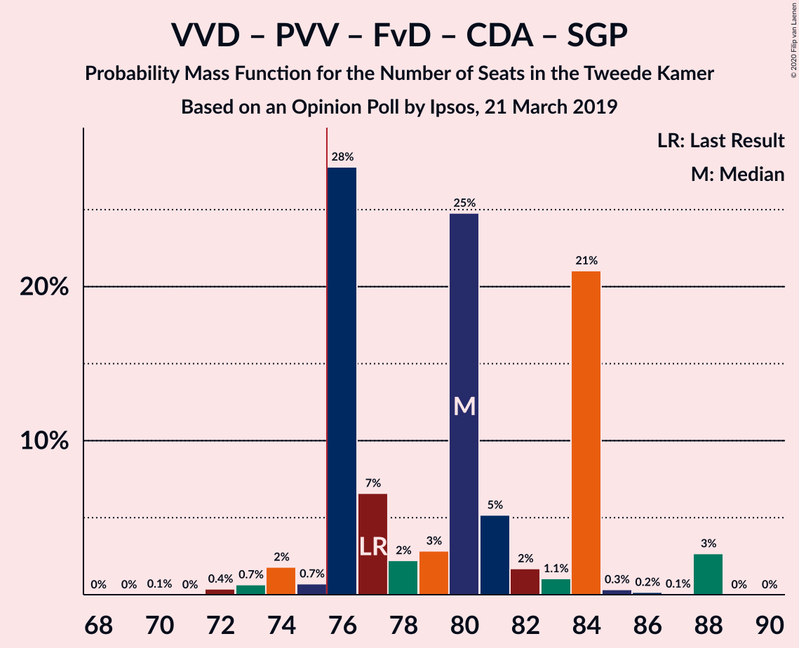

| Number of Seats | Probability | Accumulated | Special Marks |
|:---------------:|:-----------:|:-----------:|:-------------:|
| 70 | 0.1% | 100% |  |
| 71 | 0% | 99.9% |  |
| 72 | 0.4% | 99.9% |  |
| 73 | 0.7% | 99.6% |  |
| 74 | 2% | 98.9% |  |
| 75 | 0.7% | 97% |  |
| 76 | 28% | 96% | Majority |
| 77 | 7% | 69% | Last Result |
| 78 | 2% | 62% |  |
| 79 | 3% | 60% | Median |
| 80 | 25% | 57% |  |
| 81 | 5% | 32% |  |
| 82 | 2% | 27% |  |
| 83 | 1.1% | 25% |  |
| 84 | 21% | 24% |  |
| 85 | 0.3% | 3% |  |
| 86 | 0.2% | 3% |  |
| 87 | 0.1% | 3% |  |
| 88 | 3% | 3% |  |
| 89 | 0% | 0% |  |

### Volkspartij voor Vrijheid en Democratie – Partij voor de Vrijheid – Forum voor Democratie – Christen-Democratisch Appèl

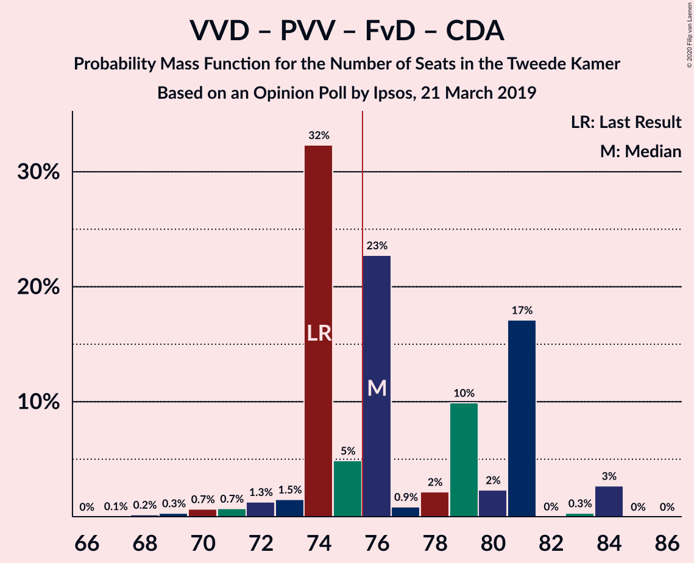

| Number of Seats | Probability | Accumulated | Special Marks |
|:---------------:|:-----------:|:-----------:|:-------------:|
| 67 | 0.1% | 100% |  |
| 68 | 0.2% | 99.9% |  |
| 69 | 0.3% | 99.8% |  |
| 70 | 0.7% | 99.5% |  |
| 71 | 0.7% | 98.8% |  |
| 72 | 1.3% | 98% |  |
| 73 | 1.5% | 97% |  |
| 74 | 32% | 95% | Last Result |
| 75 | 5% | 63% |  |
| 76 | 23% | 58% | Median, Majority |
| 77 | 0.9% | 35% |  |
| 78 | 2% | 35% |  |
| 79 | 10% | 32% |  |
| 80 | 2% | 22% |  |
| 81 | 17% | 20% |  |
| 82 | 0% | 3% |  |
| 83 | 0.3% | 3% |  |
| 84 | 3% | 3% |  |
| 85 | 0% | 0% |  |

### Volkspartij voor Vrijheid en Democratie – GroenLinks – Christen-Democratisch Appèl – Democraten 66 – ChristenUnie

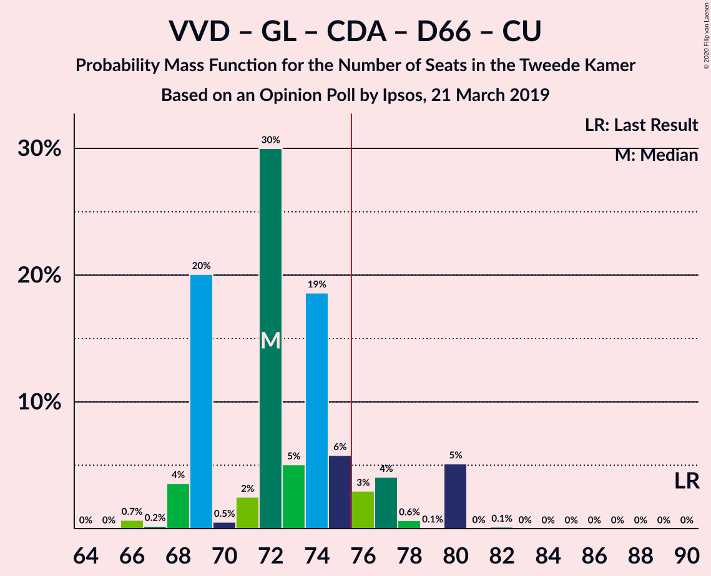

| Number of Seats | Probability | Accumulated | Special Marks |
|:---------------:|:-----------:|:-----------:|:-------------:|
| 66 | 0.7% | 100% |  |
| 67 | 0.2% | 99.3% |  |
| 68 | 4% | 99.1% |  |
| 69 | 20% | 96% |  |
| 70 | 0.5% | 75% | Median |
| 71 | 2% | 75% |  |
| 72 | 30% | 72% |  |
| 73 | 5% | 42% |  |
| 74 | 19% | 37% |  |
| 75 | 6% | 19% |  |
| 76 | 3% | 13% | Majority |
| 77 | 4% | 10% |  |
| 78 | 0.6% | 6% |  |
| 79 | 0.1% | 5% |  |
| 80 | 5% | 5% |  |
| 81 | 0% | 0.2% |  |
| 82 | 0.1% | 0.1% |  |
| 83 | 0% | 0% |  |
| 84 | 0% | 0% |  |
| 85 | 0% | 0% |  |
| 86 | 0% | 0% |  |
| 87 | 0% | 0% |  |
| 88 | 0% | 0% |  |
| 89 | 0% | 0% |  |
| 90 | 0% | 0% | Last Result |

### Volkspartij voor Vrijheid en Democratie – Forum voor Democratie – Christen-Democratisch Appèl – 50Plus – Staatkundig Gereformeerde Partij

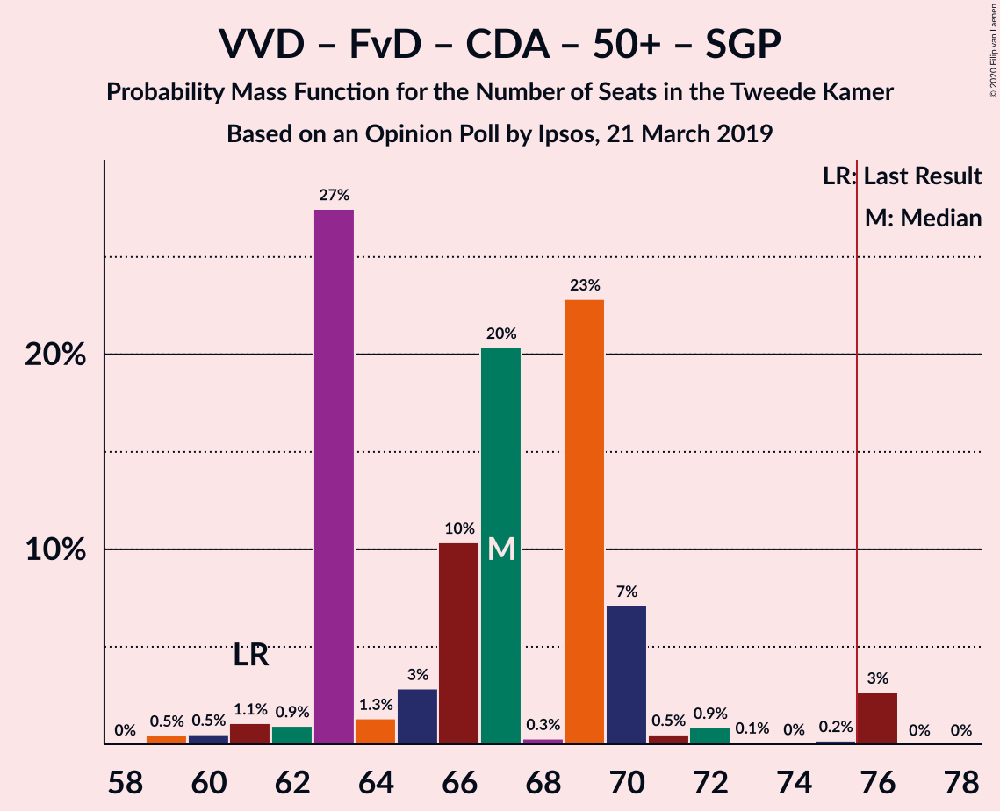

| Number of Seats | Probability | Accumulated | Special Marks |
|:---------------:|:-----------:|:-----------:|:-------------:|
| 59 | 0.5% | 100% |  |
| 60 | 0.5% | 99.5% |  |
| 61 | 1.1% | 99.0% | Last Result |
| 62 | 0.9% | 98% |  |
| 63 | 27% | 97% |  |
| 64 | 1.3% | 70% |  |
| 65 | 3% | 68% |  |
| 66 | 10% | 65% | Median |
| 67 | 20% | 55% |  |
| 68 | 0.3% | 35% |  |
| 69 | 23% | 34% |  |
| 70 | 7% | 11% |  |
| 71 | 0.5% | 4% |  |
| 72 | 0.9% | 4% |  |
| 73 | 0.1% | 3% |  |
| 74 | 0% | 3% |  |
| 75 | 0.2% | 3% |  |
| 76 | 3% | 3% | Majority |
| 77 | 0% | 0% |  |

### Volkspartij voor Vrijheid en Democratie – Christen-Democratisch Appèl – Democraten 66 – Partij van de Arbeid – ChristenUnie

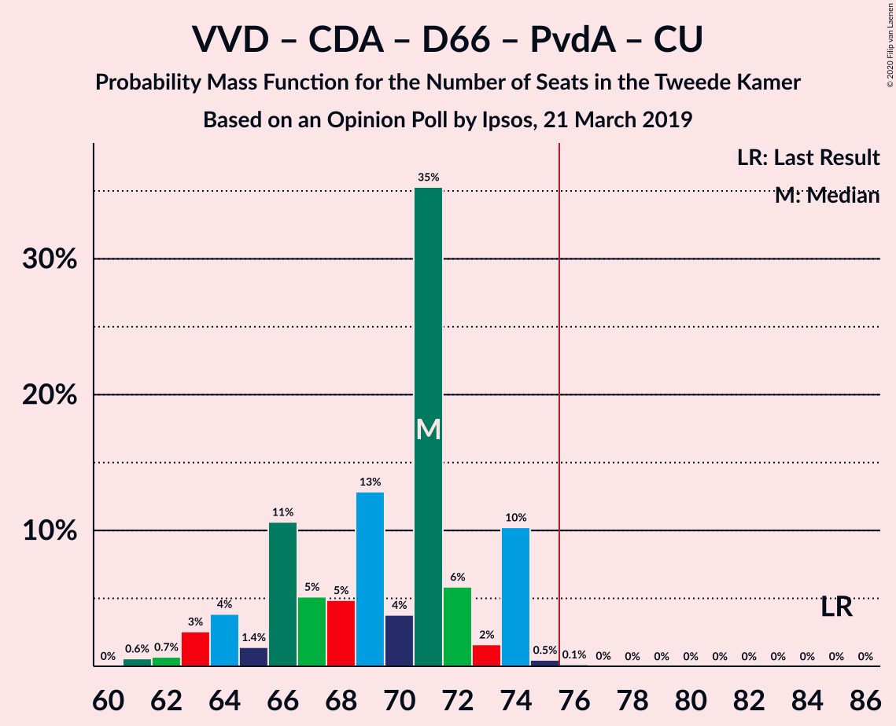

| Number of Seats | Probability | Accumulated | Special Marks |
|:---------------:|:-----------:|:-----------:|:-------------:|
| 61 | 0.5% | 100% |  |
| 62 | 0.1% | 99.5% |  |
| 63 | 22% | 99.4% |  |
| 64 | 29% | 78% | Median |
| 65 | 3% | 49% |  |
| 66 | 7% | 46% |  |
| 67 | 3% | 39% |  |
| 68 | 0.7% | 36% |  |
| 69 | 23% | 36% |  |
| 70 | 4% | 12% |  |
| 71 | 4% | 8% |  |
| 72 | 0.4% | 4% |  |
| 73 | 0.7% | 4% |  |
| 74 | 0.2% | 3% |  |
| 75 | 3% | 3% |  |
| 76 | 0% | 0.1% | Majority |
| 77 | 0% | 0% |  |
| 78 | 0% | 0% |  |
| 79 | 0% | 0% |  |
| 80 | 0% | 0% |  |
| 81 | 0% | 0% |  |
| 82 | 0% | 0% |  |
| 83 | 0% | 0% |  |
| 84 | 0% | 0% |  |
| 85 | 0% | 0% | Last Result |

### GroenLinks – Christen-Democratisch Appèl – Democraten 66 – Socialistische Partij – Partij van de Arbeid – ChristenUnie

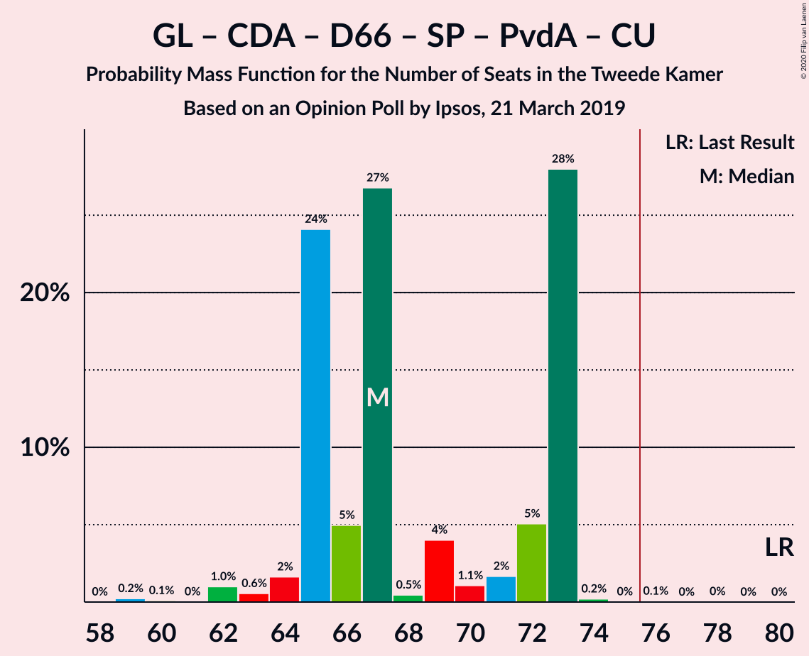

| Number of Seats | Probability | Accumulated | Special Marks |
|:---------------:|:-----------:|:-----------:|:-------------:|
| 59 | 0.2% | 100% |  |
| 60 | 0.1% | 99.8% |  |
| 61 | 0% | 99.7% |  |
| 62 | 1.0% | 99.6% |  |
| 63 | 0.6% | 98.6% |  |
| 64 | 2% | 98% |  |
| 65 | 24% | 96% |  |
| 66 | 5% | 72% |  |
| 67 | 27% | 67% | Median |
| 68 | 0.5% | 41% |  |
| 69 | 4% | 40% |  |
| 70 | 1.1% | 36% |  |
| 71 | 2% | 35% |  |
| 72 | 5% | 33% |  |
| 73 | 28% | 28% |  |
| 74 | 0.2% | 0.3% |  |
| 75 | 0% | 0.1% |  |
| 76 | 0.1% | 0.1% | Majority |
| 77 | 0% | 0% |  |
| 78 | 0% | 0% |  |
| 79 | 0% | 0% |  |
| 80 | 0% | 0% | Last Result |

### Volkspartij voor Vrijheid en Democratie – Forum voor Democratie – Christen-Democratisch Appèl – 50Plus

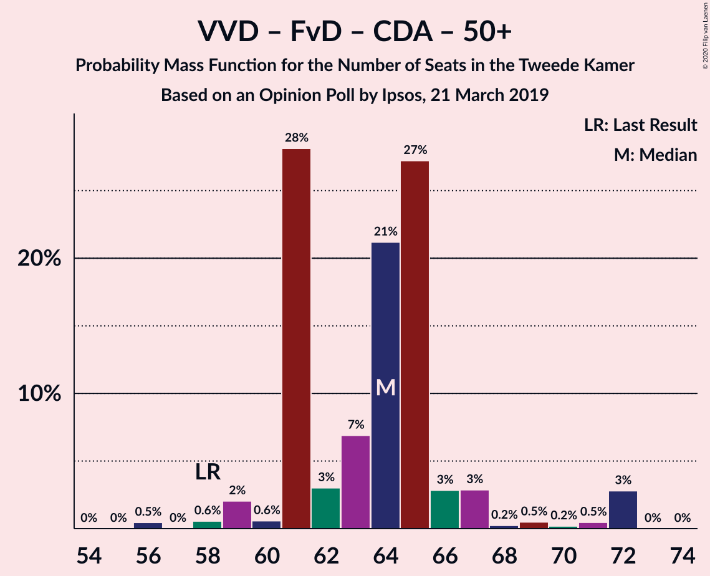

| Number of Seats | Probability | Accumulated | Special Marks |
|:---------------:|:-----------:|:-----------:|:-------------:|
| 56 | 0.5% | 100% |  |
| 57 | 0% | 99.5% |  |
| 58 | 0.6% | 99.5% | Last Result |
| 59 | 2% | 99.0% |  |
| 60 | 0.6% | 97% |  |
| 61 | 28% | 96% |  |
| 62 | 3% | 68% |  |
| 63 | 7% | 65% | Median |
| 64 | 21% | 58% |  |
| 65 | 27% | 37% |  |
| 66 | 3% | 10% |  |
| 67 | 3% | 7% |  |
| 68 | 0.2% | 4% |  |
| 69 | 0.5% | 4% |  |
| 70 | 0.2% | 3% |  |
| 71 | 0.5% | 3% |  |
| 72 | 3% | 3% |  |
| 73 | 0% | 0% |  |

### Volkspartij voor Vrijheid en Democratie – Forum voor Democratie – Christen-Democratisch Appèl – Staatkundig Gereformeerde Partij

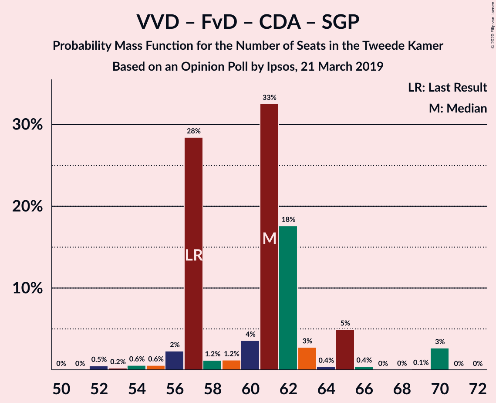

| Number of Seats | Probability | Accumulated | Special Marks |
|:---------------:|:-----------:|:-----------:|:-------------:|
| 52 | 0.5% | 100% |  |
| 53 | 0.2% | 99.5% |  |
| 54 | 0.6% | 99.3% |  |
| 55 | 0.6% | 98.7% |  |
| 56 | 2% | 98% |  |
| 57 | 28% | 96% | Last Result |
| 58 | 1.2% | 67% |  |
| 59 | 1.2% | 66% |  |
| 60 | 4% | 65% | Median |
| 61 | 33% | 61% |  |
| 62 | 18% | 29% |  |
| 63 | 3% | 11% |  |
| 64 | 0.4% | 9% |  |
| 65 | 5% | 8% |  |
| 66 | 0.4% | 3% |  |
| 67 | 0% | 3% |  |
| 68 | 0% | 3% |  |
| 69 | 0.1% | 3% |  |
| 70 | 3% | 3% |  |
| 71 | 0% | 0% |  |

### Volkspartij voor Vrijheid en Democratie – Partij voor de Vrijheid – Christen-Democratisch Appèl

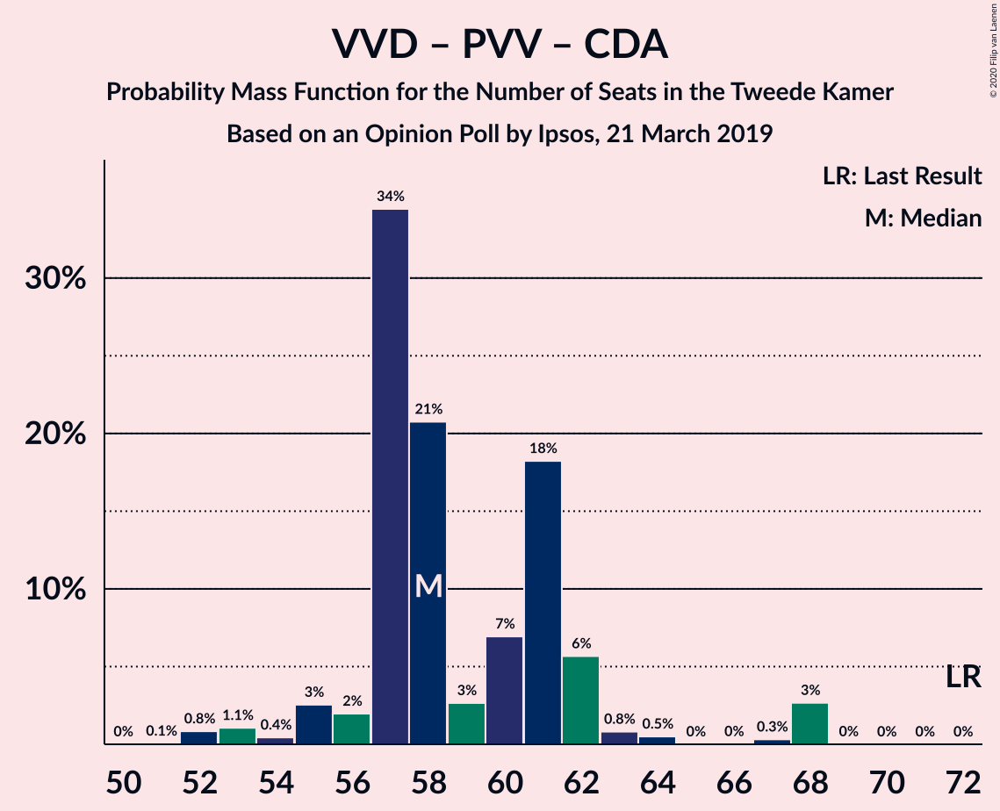

| Number of Seats | Probability | Accumulated | Special Marks |
|:---------------:|:-----------:|:-----------:|:-------------:|
| 51 | 0.1% | 100% |  |
| 52 | 0.8% | 99.9% |  |
| 53 | 1.1% | 99.1% |  |
| 54 | 0.4% | 98% |  |
| 55 | 3% | 98% |  |
| 56 | 2% | 95% |  |
| 57 | 34% | 93% |  |
| 58 | 21% | 59% | Median |
| 59 | 3% | 38% |  |
| 60 | 7% | 35% |  |
| 61 | 18% | 28% |  |
| 62 | 6% | 10% |  |
| 63 | 0.8% | 4% |  |
| 64 | 0.5% | 4% |  |
| 65 | 0% | 3% |  |
| 66 | 0% | 3% |  |
| 67 | 0.3% | 3% |  |
| 68 | 3% | 3% |  |
| 69 | 0% | 0% |  |
| 70 | 0% | 0% |  |
| 71 | 0% | 0% |  |
| 72 | 0% | 0% | Last Result |

### Volkspartij voor Vrijheid en Democratie – Christen-Democratisch Appèl – Democraten 66 – ChristenUnie

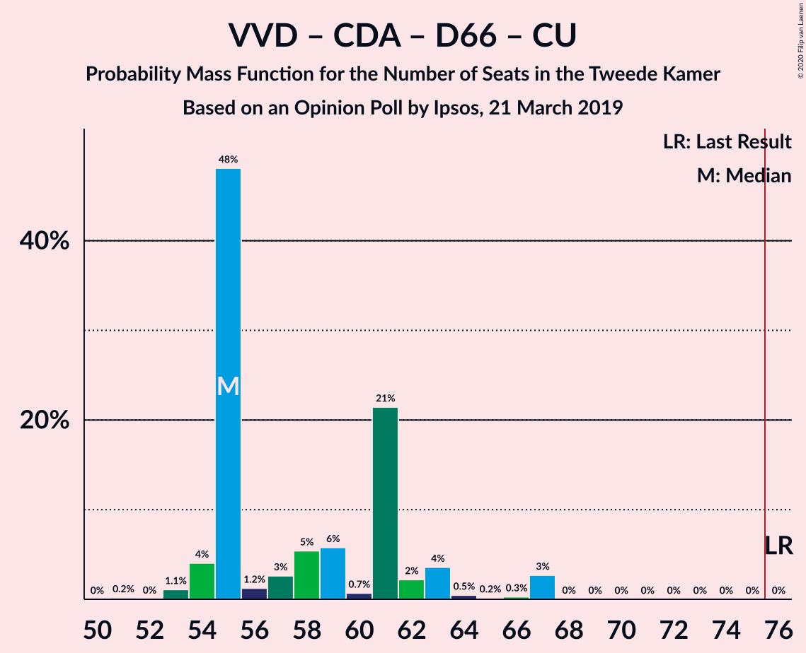

| Number of Seats | Probability | Accumulated | Special Marks |
|:---------------:|:-----------:|:-----------:|:-------------:|
| 51 | 0.2% | 100% |  |
| 52 | 0% | 99.8% |  |
| 53 | 1.1% | 99.8% |  |
| 54 | 4% | 98.7% |  |
| 55 | 48% | 95% |  |
| 56 | 1.2% | 47% | Median |
| 57 | 3% | 45% |  |
| 58 | 5% | 43% |  |
| 59 | 6% | 37% |  |
| 60 | 0.7% | 32% |  |
| 61 | 21% | 31% |  |
| 62 | 2% | 9% |  |
| 63 | 4% | 7% |  |
| 64 | 0.5% | 4% |  |
| 65 | 0.2% | 3% |  |
| 66 | 0.3% | 3% |  |
| 67 | 3% | 3% |  |
| 68 | 0% | 0% |  |
| 69 | 0% | 0% |  |
| 70 | 0% | 0% |  |
| 71 | 0% | 0% |  |
| 72 | 0% | 0% |  |
| 73 | 0% | 0% |  |
| 74 | 0% | 0% |  |
| 75 | 0% | 0% |  |
| 76 | 0% | 0% | Last Result, Majority |

### Volkspartij voor Vrijheid en Democratie – Forum voor Democratie – Christen-Democratisch Appèl

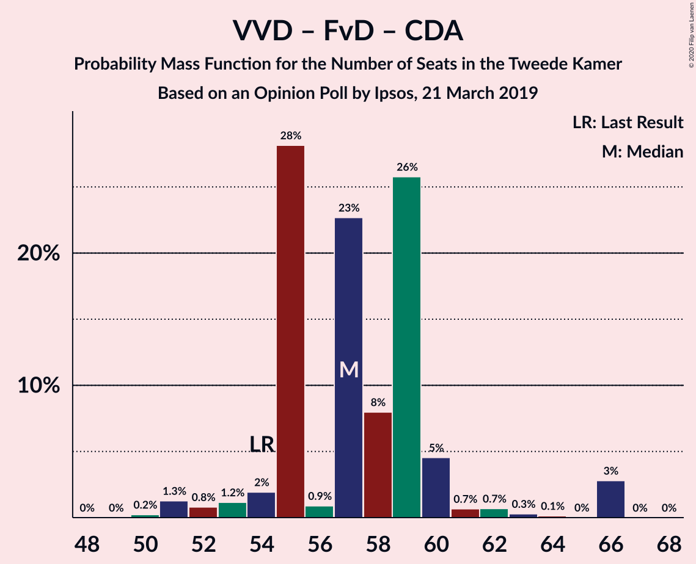

| Number of Seats | Probability | Accumulated | Special Marks |
|:---------------:|:-----------:|:-----------:|:-------------:|
| 50 | 0.2% | 100% |  |
| 51 | 1.3% | 99.8% |  |
| 52 | 0.8% | 98% |  |
| 53 | 1.2% | 98% |  |
| 54 | 2% | 97% | Last Result |
| 55 | 28% | 95% |  |
| 56 | 0.9% | 66% |  |
| 57 | 23% | 66% | Median |
| 58 | 8% | 43% |  |
| 59 | 26% | 35% |  |
| 60 | 5% | 9% |  |
| 61 | 0.7% | 5% |  |
| 62 | 0.7% | 4% |  |
| 63 | 0.3% | 3% |  |
| 64 | 0.1% | 3% |  |
| 65 | 0% | 3% |  |
| 66 | 3% | 3% |  |
| 67 | 0% | 0% |  |

### Volkspartij voor Vrijheid en Democratie – Christen-Democratisch Appèl – Democraten 66

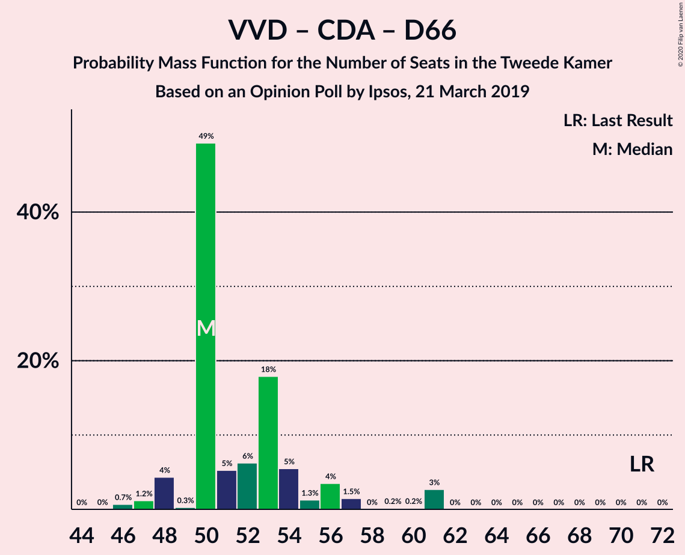

| Number of Seats | Probability | Accumulated | Special Marks |
|:---------------:|:-----------:|:-----------:|:-------------:|
| 46 | 0.7% | 100% |  |
| 47 | 1.2% | 99.3% |  |
| 48 | 4% | 98% |  |
| 49 | 0.3% | 94% |  |
| 50 | 49% | 93% |  |
| 51 | 5% | 44% | Median |
| 52 | 6% | 39% |  |
| 53 | 18% | 33% |  |
| 54 | 5% | 15% |  |
| 55 | 1.3% | 9% |  |
| 56 | 4% | 8% |  |
| 57 | 1.5% | 5% |  |
| 58 | 0% | 3% |  |
| 59 | 0.2% | 3% |  |
| 60 | 0.2% | 3% |  |
| 61 | 3% | 3% |  |
| 62 | 0% | 0% |  |
| 63 | 0% | 0% |  |
| 64 | 0% | 0% |  |
| 65 | 0% | 0% |  |
| 66 | 0% | 0% |  |
| 67 | 0% | 0% |  |
| 68 | 0% | 0% |  |
| 69 | 0% | 0% |  |
| 70 | 0% | 0% |  |
| 71 | 0% | 0% | Last Result |

### GroenLinks – Christen-Democratisch Appèl – Democraten 66 – Partij van de Arbeid – ChristenUnie

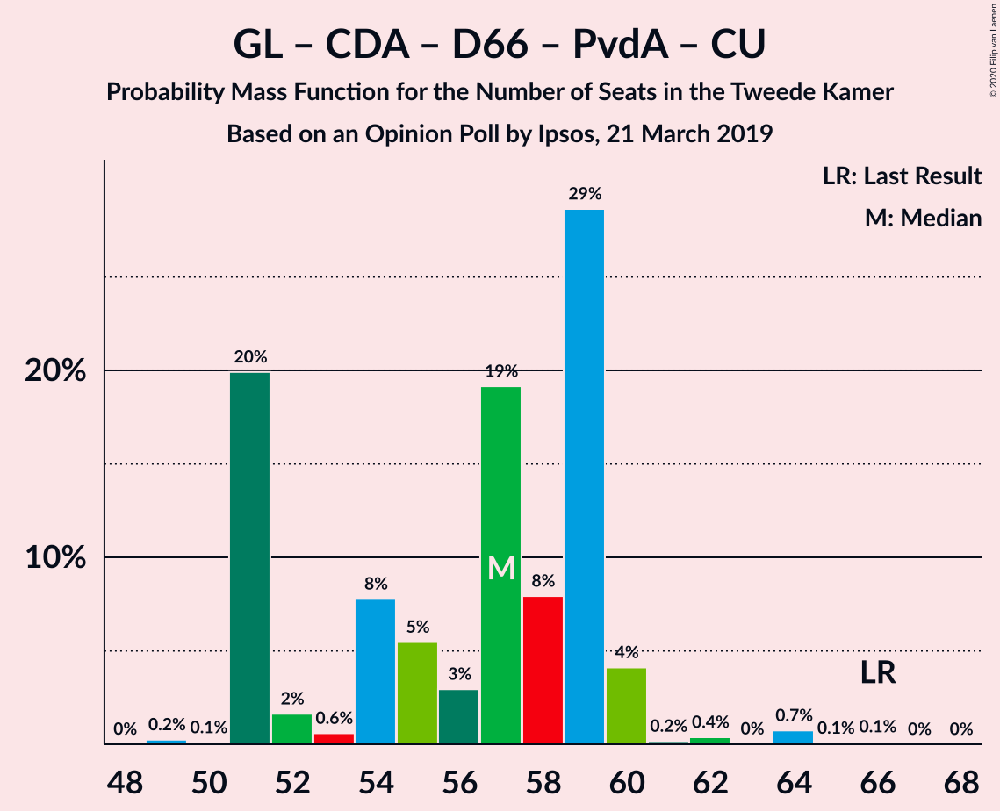

| Number of Seats | Probability | Accumulated | Special Marks |
|:---------------:|:-----------:|:-----------:|:-------------:|
| 49 | 0.2% | 100% |  |
| 50 | 0.1% | 99.7% |  |
| 51 | 20% | 99.7% |  |
| 52 | 2% | 80% |  |
| 53 | 0.6% | 78% | Median |
| 54 | 8% | 78% |  |
| 55 | 5% | 70% |  |
| 56 | 3% | 64% |  |
| 57 | 19% | 61% |  |
| 58 | 8% | 42% |  |
| 59 | 29% | 34% |  |
| 60 | 4% | 6% |  |
| 61 | 0.2% | 2% |  |
| 62 | 0.4% | 1.3% |  |
| 63 | 0% | 1.0% |  |
| 64 | 0.7% | 0.9% |  |
| 65 | 0.1% | 0.2% |  |
| 66 | 0.1% | 0.1% | Last Result |
| 67 | 0% | 0% |  |

### Volkspartij voor Vrijheid en Democratie – Christen-Democratisch Appèl – Partij van de Arbeid

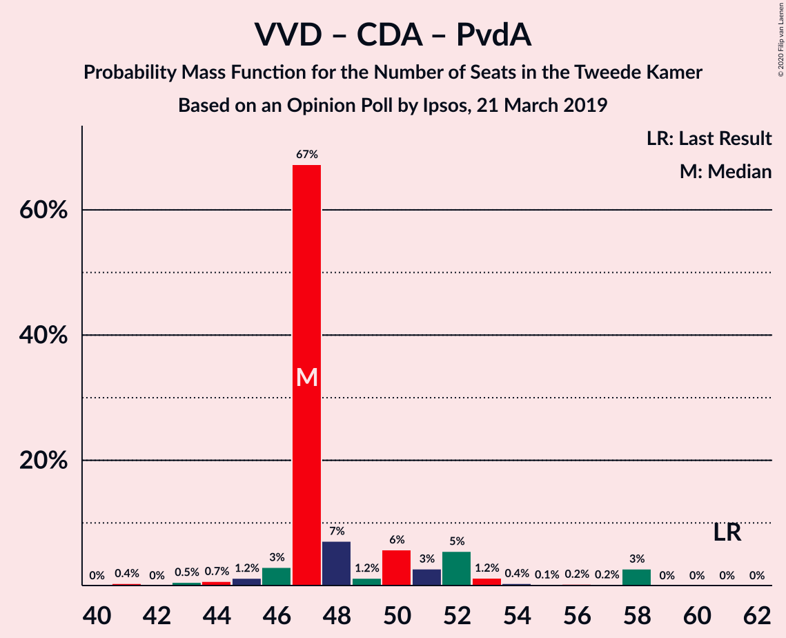

| Number of Seats | Probability | Accumulated | Special Marks |
|:---------------:|:-----------:|:-----------:|:-------------:|
| 41 | 0.4% | 100% |  |
| 42 | 0% | 99.6% |  |
| 43 | 0.5% | 99.6% |  |
| 44 | 0.7% | 99.1% |  |
| 45 | 1.2% | 98% |  |
| 46 | 3% | 97% |  |
| 47 | 67% | 94% | Median |
| 48 | 7% | 27% |  |
| 49 | 1.2% | 20% |  |
| 50 | 6% | 19% |  |
| 51 | 3% | 13% |  |
| 52 | 5% | 10% |  |
| 53 | 1.2% | 5% |  |
| 54 | 0.4% | 4% |  |
| 55 | 0.1% | 3% |  |
| 56 | 0.2% | 3% |  |
| 57 | 0.2% | 3% |  |
| 58 | 3% | 3% |  |
| 59 | 0% | 0% |  |
| 60 | 0% | 0% |  |
| 61 | 0% | 0% | Last Result |

### Volkspartij voor Vrijheid en Democratie – Democraten 66 – Partij van de Arbeid

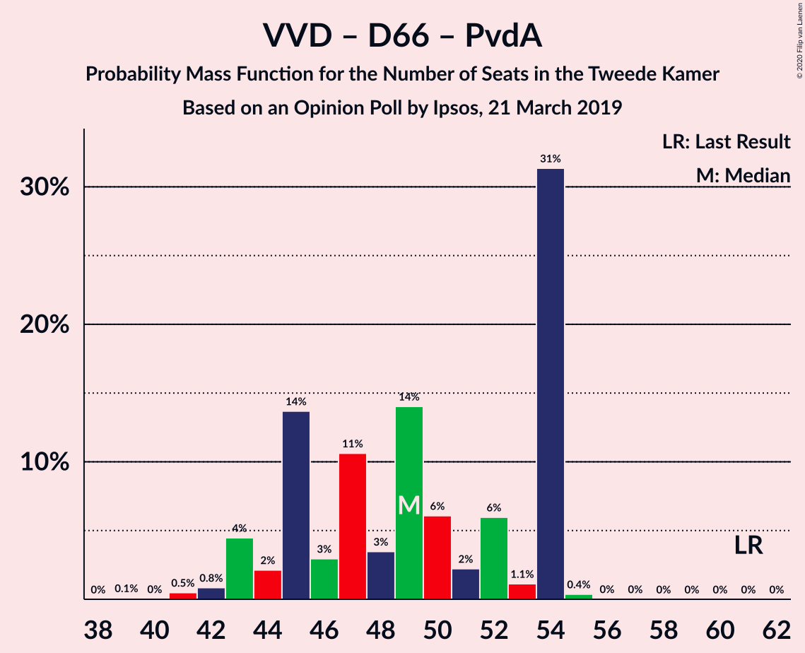

| Number of Seats | Probability | Accumulated | Special Marks |
|:---------------:|:-----------:|:-----------:|:-------------:|
| 40 | 0.1% | 100% |  |
| 41 | 1.1% | 99.9% |  |
| 42 | 0.6% | 98.8% |  |
| 43 | 28% | 98% |  |
| 44 | 0.8% | 70% |  |
| 45 | 27% | 69% | Median |
| 46 | 3% | 42% |  |
| 47 | 23% | 39% |  |
| 48 | 5% | 16% |  |
| 49 | 0.5% | 11% |  |
| 50 | 2% | 11% |  |
| 51 | 3% | 8% |  |
| 52 | 1.2% | 5% |  |
| 53 | 3% | 4% |  |
| 54 | 0.1% | 0.4% |  |
| 55 | 0% | 0.4% |  |
| 56 | 0.2% | 0.4% |  |
| 57 | 0.1% | 0.1% |  |
| 58 | 0% | 0% |  |
| 59 | 0% | 0% |  |
| 60 | 0% | 0% |  |
| 61 | 0% | 0% | Last Result |

### Volkspartij voor Vrijheid en Democratie – Christen-Democratisch Appèl

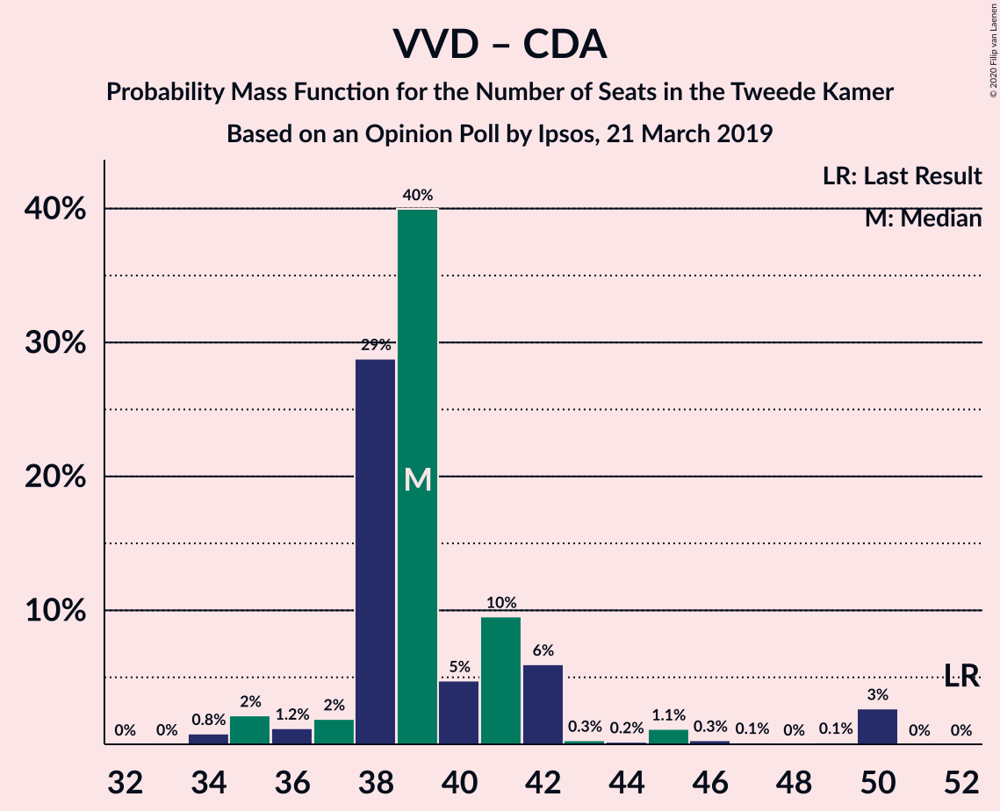

| Number of Seats | Probability | Accumulated | Special Marks |
|:---------------:|:-----------:|:-----------:|:-------------:|
| 34 | 0.8% | 100% |  |
| 35 | 2% | 99.2% |  |
| 36 | 1.2% | 97% |  |
| 37 | 2% | 96% |  |
| 38 | 29% | 94% |  |
| 39 | 40% | 65% | Median |
| 40 | 5% | 25% |  |
| 41 | 10% | 20% |  |
| 42 | 6% | 11% |  |
| 43 | 0.3% | 5% |  |
| 44 | 0.2% | 5% |  |
| 45 | 1.1% | 4% |  |
| 46 | 0.3% | 3% |  |
| 47 | 0.1% | 3% |  |
| 48 | 0% | 3% |  |
| 49 | 0.1% | 3% |  |
| 50 | 3% | 3% |  |
| 51 | 0% | 0% |  |
| 52 | 0% | 0% | Last Result |

### Volkspartij voor Vrijheid en Democratie – Partij van de Arbeid

| Number of Seats | Probability | Accumulated | Special Marks |
|:---------------:|:-----------:|:-----------:|:-------------:|
| 29 | 0.1% | 100% |  |
| 30 | 2% | 99.9% |  |
| 31 | 28% | 98% |  |
| 32 | 2% | 70% |  |
| 33 | 20% | 68% | Median |
| 34 | 27% | 48% |  |
| 35 | 1.5% | 21% |  |
| 36 | 5% | 19% |  |
| 37 | 5% | 15% |  |
| 38 | 2% | 10% |  |
| 39 | 5% | 9% |  |
| 40 | 3% | 3% |  |
| 41 | 0.2% | 0.6% |  |
| 42 | 0.4% | 0.4% | Last Result |
| 43 | 0.1% | 0.1% |  |
| 44 | 0% | 0% |  |

### Christen-Democratisch Appèl – Democraten 66 – Partij van de Arbeid

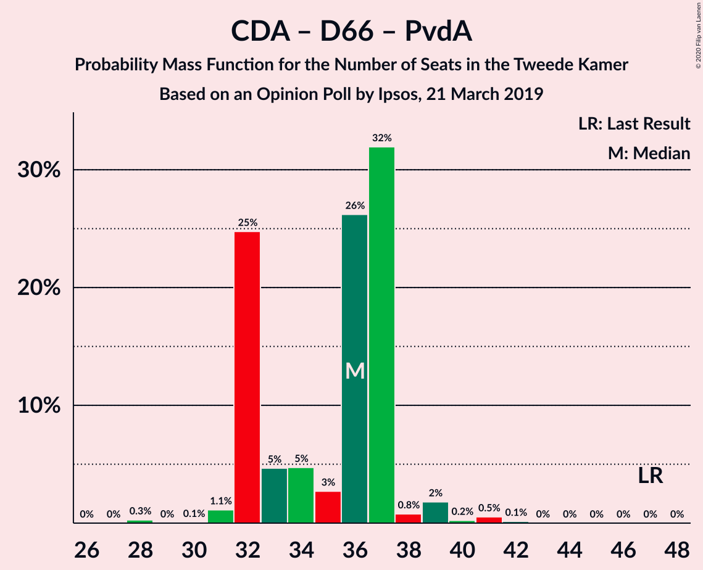

| Number of Seats | Probability | Accumulated | Special Marks |
|:---------------:|:-----------:|:-----------:|:-------------:|
| 28 | 0.3% | 100% |  |
| 29 | 0% | 99.7% |  |
| 30 | 0.1% | 99.7% |  |
| 31 | 1.1% | 99.7% |  |
| 32 | 25% | 98.5% |  |
| 33 | 5% | 74% |  |
| 34 | 5% | 69% | Median |
| 35 | 3% | 64% |  |
| 36 | 26% | 62% |  |
| 37 | 32% | 35% |  |
| 38 | 0.8% | 4% |  |
| 39 | 2% | 3% |  |
| 40 | 0.2% | 0.9% |  |
| 41 | 0.5% | 0.7% |  |
| 42 | 0.1% | 0.2% |  |
| 43 | 0% | 0% |  |
| 44 | 0% | 0% |  |
| 45 | 0% | 0% |  |
| 46 | 0% | 0% |  |
| 47 | 0% | 0% | Last Result |

### Christen-Democratisch Appèl – Partij van de Arbeid – ChristenUnie

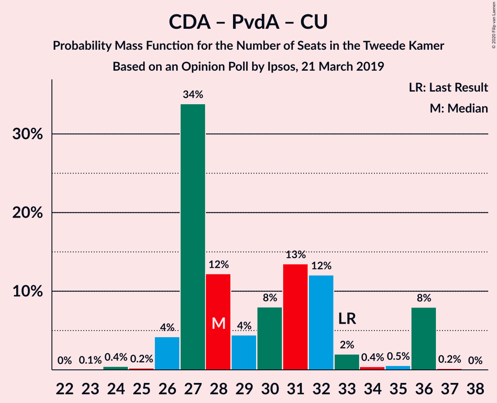

| Number of Seats | Probability | Accumulated | Special Marks |
|:---------------:|:-----------:|:-----------:|:-------------:|
| 23 | 0.1% | 100% |  |
| 24 | 0.2% | 99.9% |  |
| 25 | 0.4% | 99.7% |  |
| 26 | 24% | 99.4% |  |
| 27 | 5% | 76% | Median |
| 28 | 6% | 71% |  |
| 29 | 2% | 65% |  |
| 30 | 46% | 62% |  |
| 31 | 7% | 16% |  |
| 32 | 4% | 9% |  |
| 33 | 5% | 6% | Last Result |
| 34 | 0.4% | 0.7% |  |
| 35 | 0% | 0.4% |  |
| 36 | 0.3% | 0.3% |  |
| 37 | 0.1% | 0.1% |  |
| 38 | 0% | 0% |  |

### Christen-Democratisch Appèl – Democraten 66

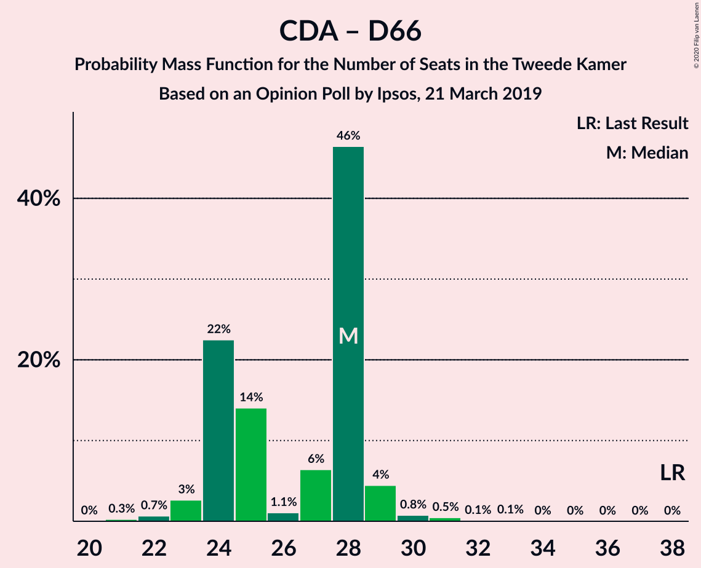

| Number of Seats | Probability | Accumulated | Special Marks |
|:---------------:|:-----------:|:-----------:|:-------------:|
| 21 | 0.3% | 100% |  |
| 22 | 0.7% | 99.7% |  |
| 23 | 3% | 99.0% |  |
| 24 | 22% | 96% |  |
| 25 | 14% | 74% |  |
| 26 | 1.1% | 60% | Median |
| 27 | 6% | 59% |  |
| 28 | 46% | 52% |  |
| 29 | 4% | 6% |  |
| 30 | 0.8% | 1.5% |  |
| 31 | 0.5% | 0.7% |  |
| 32 | 0.1% | 0.2% |  |
| 33 | 0.1% | 0.2% |  |
| 34 | 0% | 0% |  |
| 35 | 0% | 0% |  |
| 36 | 0% | 0% |  |
| 37 | 0% | 0% |  |
| 38 | 0% | 0% | Last Result |

### Christen-Democratisch Appèl – Partij van de Arbeid

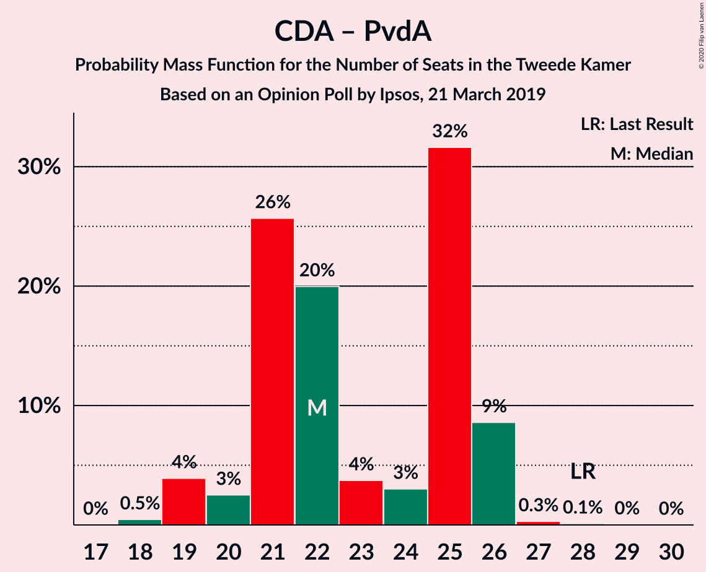

| Number of Seats | Probability | Accumulated | Special Marks |
|:---------------:|:-----------:|:-----------:|:-------------:|
| 18 | 0.5% | 100% |  |
| 19 | 4% | 99.5% |  |
| 20 | 3% | 96% |  |
| 21 | 26% | 93% |  |
| 22 | 20% | 67% | Median |
| 23 | 4% | 47% |  |
| 24 | 3% | 44% |  |
| 25 | 32% | 41% |  |
| 26 | 9% | 9% |  |
| 27 | 0.3% | 0.5% |  |
| 28 | 0.1% | 0.2% | Last Result |
| 29 | 0% | 0.1% |  |
| 30 | 0% | 0% |  |

## Technical Information

### Opinion Poll

+ **Polling firm:** Ipsos
+ **Commissioner(s):** —
+ **Fieldwork period:** 21 March 2019

### Calculations

+ **Sample size:** 1000
+ **Simulations done:** 131,072
+ **Error estimate:** 2.76%

