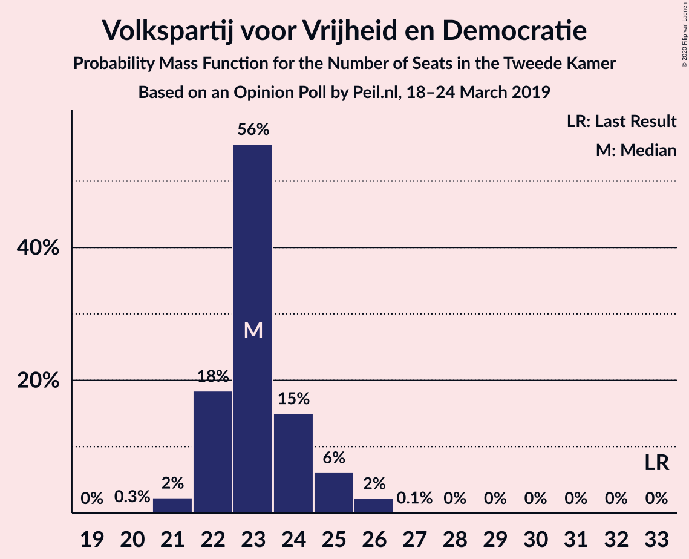
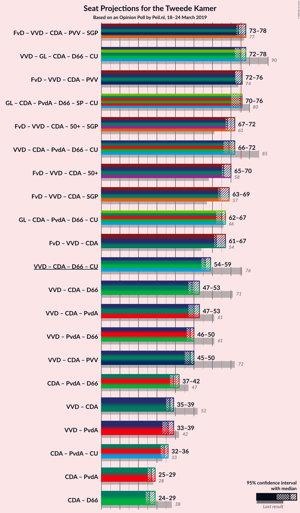
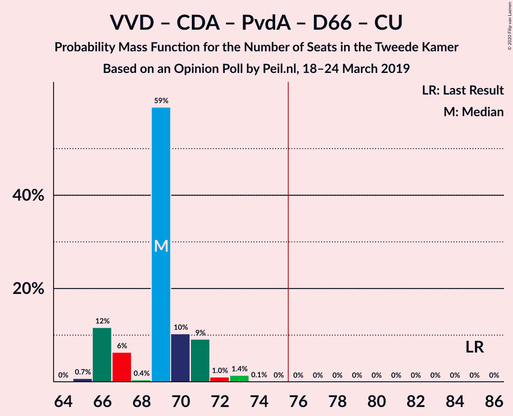
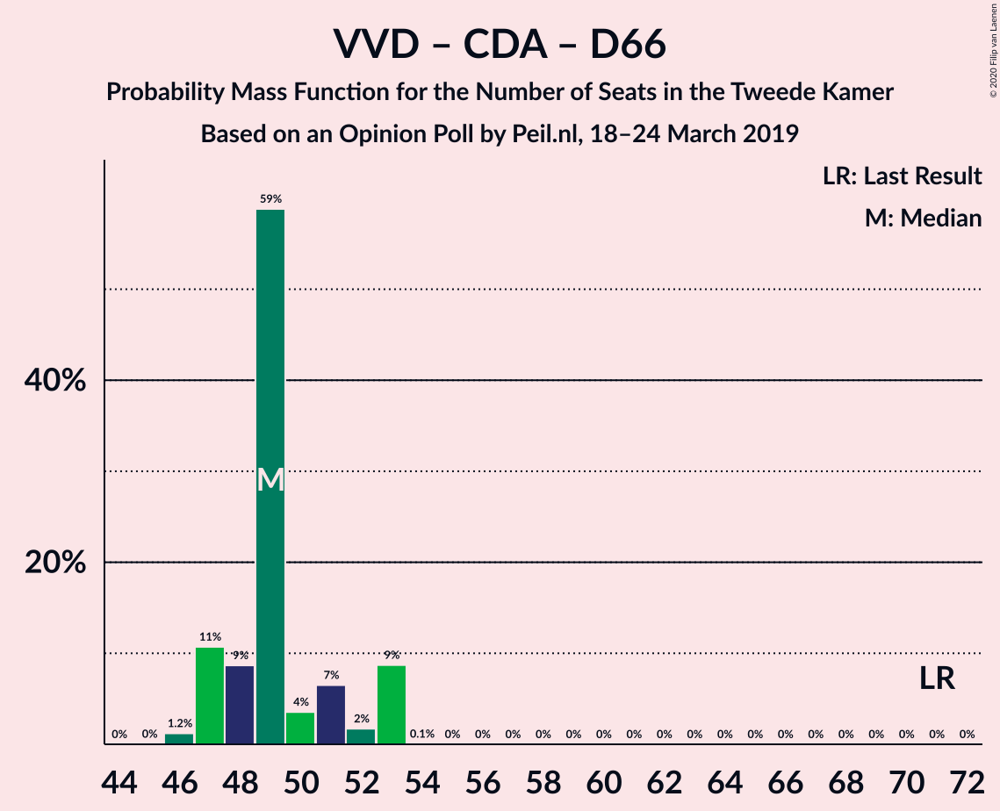
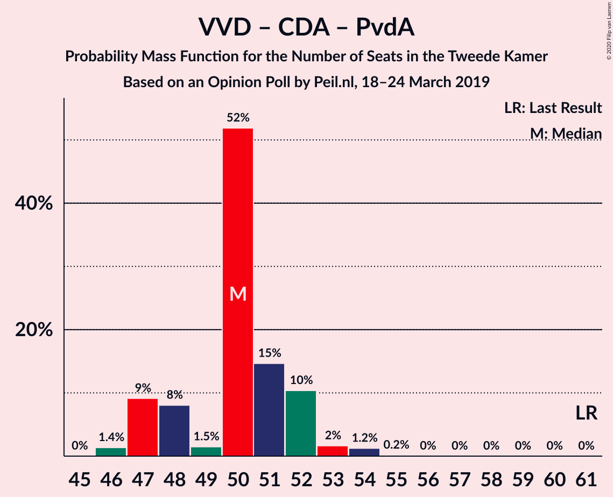
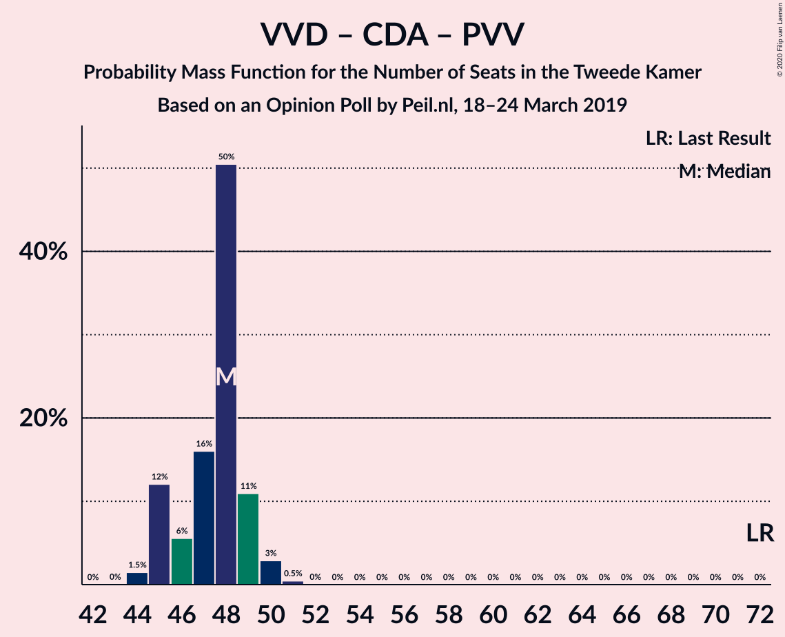
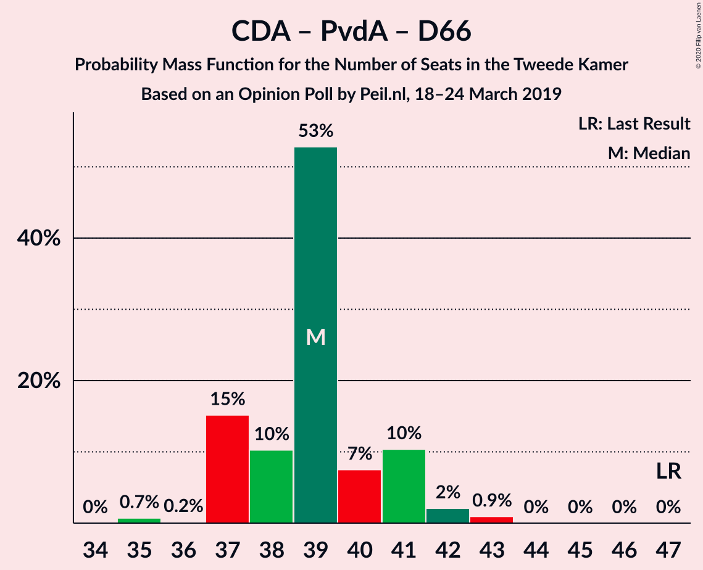

# Opinion Poll by Peil.nl, 18–24 March 2019

<a href="#voting-intentions">Voting Intentions</a> | <a href="#seats">Seats</a> | <a href="#coalitions">Coalitions</a> | <a href="#technical-information">Technical Information</a>

## Voting Intentions

### Confidence Intervals

| Party | Last Result | Poll Result | 80% Confidence Interval | 90% Confidence Interval | 95% Confidence Interval | 99% Confidence Interval |
|:-----:|:-----------:|:-----------:|:-----------------------:|:-----------------------:|:-----------------------:|:-----------------------:|
| Forum voor Democratie | 1.8% | 17.3% | 16.5–18.3% |16.2–18.5% |16.0–18.7% |15.6–19.2% |
| Volkspartij voor Vrijheid en Democratie | 21.3% | 15.3% | 14.5–16.2% |14.3–16.5% |14.1–16.7% |13.7–17.1% |
| GroenLinks | 9.1% | 12.0% | 11.3–12.8% |11.1–13.0% |10.9–13.2% |10.5–13.6% |
| Christen-Democratisch Appèl | 12.4% | 9.3% | 8.7–10.1% |8.5–10.3% |8.3–10.4% |8.0–10.8% |
| Partij van de Arbeid | 5.7% | 8.7% | 8.0–9.4% |7.8–9.6% |7.7–9.7% |7.4–10.1% |
| Democraten 66 | 12.2% | 8.0% | 7.4–8.7% |7.2–8.9% |7.1–9.0% |6.8–9.4% |
| Partij voor de Vrijheid | 13.1% | 6.7% | 6.1–7.3% |6.0–7.5% |5.8–7.6% |5.6–7.9% |
| Socialistische Partij | 9.1% | 6.0% | 5.5–6.6% |5.3–6.8% |5.2–6.9% |5.0–7.2% |
| ChristenUnie | 3.4% | 4.7% | 4.2–5.2% |4.1–5.3% |4.0–5.5% |3.7–5.8% |
| Partij voor de Dieren | 3.2% | 4.7% | 4.2–5.2% |4.1–5.3% |4.0–5.5% |3.7–5.8% |
| 50Plus | 3.1% | 2.7% | 2.3–3.1% |2.2–3.2% |2.1–3.3% |2.0–3.5% |
| DENK | 2.1% | 2.7% | 2.3–3.1% |2.2–3.2% |2.1–3.3% |2.0–3.5% |
| Staatkundig Gereformeerde Partij | 2.1% | 1.3% | 1.1–1.6% |1.0–1.7% |1.0–1.8% |0.9–2.0% |

*Note:* The poll result column reflects the actual value used in the calculations. Published results may vary slightly, and in addition be rounded to fewer digits.

## Seats

### Confidence Intervals

| Party | Last Result | Median | 80% Confidence Interval | 90% Confidence Interval | 95% Confidence Interval | 99% Confidence Interval |
|:-----:|:-----------:|:------:|:-----------------------:|:-----------------------:|:-----------------------:|:-----------------------:|
| <a href="#forum-voor-democratie">Forum voor Democratie</a> | 2 | 25 | N/A |N/A |N/A |N/A |
| <a href="#volkspartij-voor-vrijheid-en-democratie">Volkspartij voor Vrijheid en Democratie</a> | 33 | 23 | 23–24 |22–25 |22–25 |20–25 |
| <a href="#groenlinks">GroenLinks</a> | 14 | 18 | N/A |N/A |N/A |N/A |
| <a href="#christen-democratisch-appèl">Christen-Democratisch Appèl</a> | 19 | 14 | N/A |N/A |N/A |N/A |
| <a href="#partij-van-de-arbeid">Partij van de Arbeid</a> | 9 | 11 | N/A |N/A |N/A |N/A |
| <a href="#democraten-66">Democraten 66</a> | 19 | 12 | N/A |N/A |N/A |N/A |
| <a href="#partij-voor-de-vrijheid">Partij voor de Vrijheid</a> | 20 | 11 | 10–11 |10–11 |10–11 |9–12 |
| <a href="#socialistische-partij">Socialistische Partij</a> | 14 | 10 | N/A |N/A |N/A |N/A |
| <a href="#christenunie">ChristenUnie</a> | 5 | 8 | N/A |N/A |N/A |N/A |
| <a href="#partij-voor-de-dieren">Partij voor de Dieren</a> | 5 | 10 | N/A |N/A |N/A |N/A |
| <a href="#50plus">50Plus</a> | 4 | 4 | N/A |N/A |N/A |N/A |
| <a href="#denk">DENK</a> | 3 | 3 | N/A |N/A |N/A |N/A |
| <a href="#staatkundig-gereformeerde-partij">Staatkundig Gereformeerde Partij</a> | 3 | 1 | N/A |N/A |N/A |N/A |

### Forum voor Democratie

*For a full overview of the results for this party, see the [Forum voor Democratie](party-forumvoordemocratie.html) page.*

| Number of Seats | Probability | Accumulated | Special Marks |
|:---------------:|:-----------:|:-----------:|:-------------:|
| 2 | 0% | 100% | Last Result |
| 3 | 0% | 100% |  |
| 4 | 0% | 100% |  |
| 5 | 0% | 100% |  |
| 6 | 0% | 100% |  |
| 7 | 0% | 100% |  |
| 8 | 0% | 100% |  |
| 9 | 0% | 100% |  |
| 10 | 0% | 100% |  |
| 11 | 0% | 100% |  |
| 12 | 0% | 100% |  |
| 13 | 0% | 100% |  |
| 14 | 0% | 100% |  |
| 15 | 0% | 100% |  |
| 16 | 0% | 100% |  |
| 17 | 0% | 100% |  |
| 18 | 0% | 100% |  |
| 19 | 0% | 100% |  |
| 20 | 0% | 100% |  |
| 21 | 0% | 100% |  |
| 22 | 0% | 100% |  |
| 23 | 0% | 100% |  |
| 24 | 9% | 100% |  |
| 25 | 82% | 91% | Median |
| 26 | 6% | 10% |  |
| 27 | 2% | 3% |  |
| 28 | 0.1% | 1.0% |  |
| 29 | 0.9% | 0.9% |  |
| 30 | 0% | 0% |  |

### Volkspartij voor Vrijheid en Democratie

*For a full overview of the results for this party, see the [Volkspartij voor Vrijheid en Democratie](party-volkspartijvoorvrijheidendemocratie.html) page.*

| Number of Seats | Probability | Accumulated | Special Marks |
|:---------------:|:-----------:|:-----------:|:-------------:|
| 20 | 0.9% | 100% |  |
| 21 | 0% | 99.1% |  |
| 22 | 10% | 99.1% |  |
| 23 | 88% | 89% | Median |
| 24 | 0.9% | 1.0% |  |
| 25 | 0% | 0.1% |  |
| 26 | 0% | 0.1% |  |
| 27 | 0% | 0.1% |  |
| 28 | 0% | 0% |  |
| 29 | 0% | 0% |  |
| 30 | 0% | 0% |  |
| 31 | 0% | 0% |  |
| 32 | 0% | 0% |  |
| 33 | 0% | 0% | Last Result |

### GroenLinks

*For a full overview of the results for this party, see the [GroenLinks](party-groenlinks.html) page.*

| Number of Seats | Probability | Accumulated | Special Marks |
|:---------------:|:-----------:|:-----------:|:-------------:|
| 14 | 0% | 100% | Last Result |
| 15 | 0% | 100% |  |
| 16 | 0.1% | 100% |  |
| 17 | 6% | 99.9% |  |
| 18 | 82% | 94% | Median |
| 19 | 11% | 12% |  |
| 20 | 0% | 1.1% |  |
| 21 | 1.0% | 1.1% |  |
| 22 | 0% | 0.2% |  |
| 23 | 0.2% | 0.2% |  |
| 24 | 0% | 0% |  |

### Christen-Democratisch Appèl

*For a full overview of the results for this party, see the [Christen-Democratisch Appèl](party-christen-democratischappèl.html) page.*

| Number of Seats | Probability | Accumulated | Special Marks |
|:---------------:|:-----------:|:-----------:|:-------------:|
| 14 | 82% | 100% | Median |
| 15 | 18% | 18% |  |
| 16 | 0% | 0% |  |
| 17 | 0% | 0% |  |
| 18 | 0% | 0% |  |
| 19 | 0% | 0% | Last Result |

### Partij van de Arbeid

*For a full overview of the results for this party, see the [Partij van de Arbeid](party-partijvandearbeid.html) page.*

| Number of Seats | Probability | Accumulated | Special Marks |
|:---------------:|:-----------:|:-----------:|:-------------:|
| 9 | 0% | 100% | Last Result |
| 10 | 0% | 100% |  |
| 11 | 83% | 100% | Median |
| 12 | 2% | 17% |  |
| 13 | 15% | 16% |  |
| 14 | 0.9% | 0.9% |  |
| 15 | 0% | 0% |  |

### Democraten 66

*For a full overview of the results for this party, see the [Democraten 66](party-democraten66.html) page.*

| Number of Seats | Probability | Accumulated | Special Marks |
|:---------------:|:-----------:|:-----------:|:-------------:|
| 10 | 0.2% | 100% |  |
| 11 | 2% | 99.8% |  |
| 12 | 84% | 98% | Median |
| 13 | 9% | 15% |  |
| 14 | 6% | 6% |  |
| 15 | 0% | 0% |  |
| 16 | 0% | 0% |  |
| 17 | 0% | 0% |  |
| 18 | 0% | 0% |  |
| 19 | 0% | 0% | Last Result |

### Partij voor de Vrijheid

*For a full overview of the results for this party, see the [Partij voor de Vrijheid](party-partijvoordevrijheid.html) page.*

| Number of Seats | Probability | Accumulated | Special Marks |
|:---------------:|:-----------:|:-----------:|:-------------:|
| 9 | 0.1% | 100% |  |
| 10 | 17% | 99.9% |  |
| 11 | 82% | 83% | Median |
| 12 | 1.5% | 2% |  |
| 13 | 0% | 0% |  |
| 14 | 0% | 0% |  |
| 15 | 0% | 0% |  |
| 16 | 0% | 0% |  |
| 17 | 0% | 0% |  |
| 18 | 0% | 0% |  |
| 19 | 0% | 0% |  |
| 20 | 0% | 0% | Last Result |

### Socialistische Partij

*For a full overview of the results for this party, see the [Socialistische Partij](party-socialistischepartij.html) page.*

| Number of Seats | Probability | Accumulated | Special Marks |
|:---------------:|:-----------:|:-----------:|:-------------:|
| 7 | 2% | 100% |  |
| 8 | 16% | 98% |  |
| 9 | 0.9% | 83% |  |
| 10 | 82% | 82% | Median |
| 11 | 0.2% | 0.2% |  |
| 12 | 0% | 0% |  |
| 13 | 0% | 0% |  |
| 14 | 0% | 0% | Last Result |

### ChristenUnie

*For a full overview of the results for this party, see the [ChristenUnie](party-christenunie.html) page.*

| Number of Seats | Probability | Accumulated | Special Marks |
|:---------------:|:-----------:|:-----------:|:-------------:|
| 5 | 0% | 100% | Last Result |
| 6 | 6% | 100% |  |
| 7 | 2% | 94% |  |
| 8 | 90% | 92% | Median |
| 9 | 2% | 2% |  |
| 10 | 0% | 0% |  |

### Partij voor de Dieren

*For a full overview of the results for this party, see the [Partij voor de Dieren](party-partijvoordedieren.html) page.*

| Number of Seats | Probability | Accumulated | Special Marks |
|:---------------:|:-----------:|:-----------:|:-------------:|
| 5 | 0% | 100% | Last Result |
| 6 | 10% | 100% |  |
| 7 | 2% | 90% |  |
| 8 | 0.1% | 88% |  |
| 9 | 6% | 88% |  |
| 10 | 82% | 82% | Median |
| 11 | 0% | 0% |  |

### 50Plus

*For a full overview of the results for this party, see the [50Plus](party-50plus.html) page.*

| Number of Seats | Probability | Accumulated | Special Marks |
|:---------------:|:-----------:|:-----------:|:-------------:|
| 3 | 1.1% | 100% |  |
| 4 | 91% | 98.9% | Last Result, Median |
| 5 | 8% | 8% |  |
| 6 | 0% | 0% |  |

### DENK

*For a full overview of the results for this party, see the [DENK](party-denk.html) page.*

| Number of Seats | Probability | Accumulated | Special Marks |
|:---------------:|:-----------:|:-----------:|:-------------:|
| 2 | 6% | 100% |  |
| 3 | 85% | 94% | Last Result, Median |
| 4 | 0% | 9% |  |
| 5 | 9% | 9% |  |
| 6 | 0% | 0% |  |

### Staatkundig Gereformeerde Partij

*For a full overview of the results for this party, see the [Staatkundig Gereformeerde Partij](party-staatkundiggereformeerdepartij.html) page.*

| Number of Seats | Probability | Accumulated | Special Marks |
|:---------------:|:-----------:|:-----------:|:-------------:|
| 0 | 0.9% | 100% |  |
| 1 | 83% | 99.1% | Median |
| 2 | 6% | 16% |  |
| 3 | 10% | 10% | Last Result |
| 4 | 0% | 0% |  |

## Coalitions

### Confidence Intervals

| Coalition | Last Result | Median | Majority? | 80% Confidence Interval | 90% Confidence Interval | 95% Confidence Interval | 99% Confidence Interval |
|:---------:|:-----------:|:------:|:---------:|:-----------------------:|:-----------------------:|:-----------------------:|:-----------------------:|
| Volkspartij voor Vrijheid en Democratie – GroenLinks – Christen-Democratisch Appèl – Democraten 66 – ChristenUnie | 90 | 75 | 11% | 75–76 | 75–77 | 75–77 | 75–77 |
| Forum voor Democratie – Volkspartij voor Vrijheid en Democratie – Christen-Democratisch Appèl – Partij voor de Vrijheid – Staatkundig Gereformeerde Partij | 77 | 74 | 10% | 74 | 74–76 | 74–77 | 74–77 |
| GroenLinks – Christen-Democratisch Appèl – Partij van de Arbeid – Democraten 66 – Socialistische Partij – ChristenUnie | 80 | 73 | 10% | 73–74 | 73–76 | 73–76 | 73–76 |
| Forum voor Democratie – Volkspartij voor Vrijheid en Democratie – Christen-Democratisch Appèl – Partij voor de Vrijheid | 74 | 73 | 2% | 73 | 71–74 | 71–74 | 71–76 |
| Volkspartij voor Vrijheid en Democratie – Christen-Democratisch Appèl – Partij van de Arbeid – Democraten 66 – ChristenUnie | 85 | 68 | 0% | 68–71 | 68–71 | 68–71 | 65–72 |
| Forum voor Democratie – Volkspartij voor Vrijheid en Democratie – Christen-Democratisch Appèl – 50Plus – Staatkundig Gereformeerde Partij | 61 | 67 | 0% | 67–68 | 67–71 | 67–71 | 67–71 |
| Forum voor Democratie – Volkspartij voor Vrijheid en Democratie – Christen-Democratisch Appèl – 50Plus | 58 | 66 | 0% | 66 | 65–69 | 65–69 | 65–69 |
| GroenLinks – Christen-Democratisch Appèl – Partij van de Arbeid – Democraten 66 – ChristenUnie | 66 | 63 | 0% | 63–66 | 63–68 | 63–68 | 63–68 |
| Forum voor Democratie – Volkspartij voor Vrijheid en Democratie – Christen-Democratisch Appèl – Staatkundig Gereformeerde Partij | 57 | 63 | 0% | 63–64 | 63–66 | 63–66 | 63–67 |
| Forum voor Democratie – Volkspartij voor Vrijheid en Democratie – Christen-Democratisch Appèl | 54 | 62 | 0% | 62 | 61–64 | 61–64 | 61–66 |
| Volkspartij voor Vrijheid en Democratie – Christen-Democratisch Appèl – Democraten 66 – ChristenUnie | 76 | 57 | 0% | 57–58 | 57–58 | 57–58 | 54–58 |
| Volkspartij voor Vrijheid en Democratie – Christen-Democratisch Appèl – Democraten 66 | 71 | 49 | 0% | 49–50 | 49–52 | 48–52 | 47–52 |
| Volkspartij voor Vrijheid en Democratie – Christen-Democratisch Appèl – Partij van de Arbeid | 61 | 48 | 0% | 48–50 | 48–51 | 48–51 | 46–53 |
| Volkspartij voor Vrijheid en Democratie – Partij van de Arbeid – Democraten 66 | 61 | 46 | 0% | 46–48 | 46–50 | 45–50 | 43–50 |
| Volkspartij voor Vrijheid en Democratie – Christen-Democratisch Appèl – Partij voor de Vrijheid | 72 | 48 | 0% | 48 | 47–48 | 47–48 | 45–49 |
| Christen-Democratisch Appèl – Partij van de Arbeid – Democraten 66 | 47 | 37 | 0% | 37–41 | 37–42 | 37–42 | 37–42 |
| Volkspartij voor Vrijheid en Democratie – Christen-Democratisch Appèl | 52 | 37 | 0% | 37 | 37–38 | 37–38 | 35–39 |
| Volkspartij voor Vrijheid en Democratie – Partij van de Arbeid | 42 | 34 | 0% | 34–35 | 34–36 | 34–36 | 31–38 |
| Christen-Democratisch Appèl – Partij van de Arbeid – ChristenUnie | 33 | 33 | 0% | 33–36 | 33–36 | 33–36 | 33–36 |
| Christen-Democratisch Appèl – Democraten 66 | 38 | 26 | 0% | 26–28 | 26–29 | 26–29 | 26–29 |
| Christen-Democratisch Appèl – Partij van de Arbeid | 28 | 25 | 0% | 25–28 | 25–28 | 25–28 | 25–29 |

### Volkspartij voor Vrijheid en Democratie – GroenLinks – Christen-Democratisch Appèl – Democraten 66 – ChristenUnie

| Number of Seats | Probability | Accumulated | Special Marks |
|:---------------:|:-----------:|:-----------:|:-------------:|
| 74 | 0.1% | 100% |  |
| 75 | 89% | 99.9% | Median |
| 76 | 2% | 11% | Majority |
| 77 | 10% | 10% |  |
| 78 | 0.2% | 0.2% |  |
| 79 | 0% | 0.1% |  |
| 80 | 0% | 0% |  |
| 81 | 0% | 0% |  |
| 82 | 0% | 0% |  |
| 83 | 0% | 0% |  |
| 84 | 0% | 0% |  |
| 85 | 0% | 0% |  |
| 86 | 0% | 0% |  |
| 87 | 0% | 0% |  |
| 88 | 0% | 0% |  |
| 89 | 0% | 0% |  |
| 90 | 0% | 0% | Last Result |

### Forum voor Democratie – Volkspartij voor Vrijheid en Democratie – Christen-Democratisch Appèl – Partij voor de Vrijheid – Staatkundig Gereformeerde Partij

| Number of Seats | Probability | Accumulated | Special Marks |
|:---------------:|:-----------:|:-----------:|:-------------:|
| 72 | 0.2% | 100% |  |
| 73 | 0% | 99.8% |  |
| 74 | 90% | 99.8% | Median |
| 75 | 0% | 10% |  |
| 76 | 7% | 10% | Majority |
| 77 | 2% | 3% | Last Result |
| 78 | 0% | 0.1% |  |
| 79 | 0% | 0.1% |  |
| 80 | 0% | 0.1% |  |
| 81 | 0% | 0% |  |

### GroenLinks – Christen-Democratisch Appèl – Partij van de Arbeid – Democraten 66 – Socialistische Partij – ChristenUnie

| Number of Seats | Probability | Accumulated | Special Marks |
|:---------------:|:-----------:|:-----------:|:-------------:|
| 70 | 0.1% | 100% |  |
| 71 | 0.1% | 99.9% |  |
| 72 | 0% | 99.8% |  |
| 73 | 89% | 99.8% | Median |
| 74 | 0.9% | 11% |  |
| 75 | 0% | 10% |  |
| 76 | 10% | 10% | Majority |
| 77 | 0% | 0.2% |  |
| 78 | 0.2% | 0.2% |  |
| 79 | 0% | 0% |  |
| 80 | 0% | 0% | Last Result |

### Forum voor Democratie – Volkspartij voor Vrijheid en Democratie – Christen-Democratisch Appèl – Partij voor de Vrijheid

| Number of Seats | Probability | Accumulated | Special Marks |
|:---------------:|:-----------:|:-----------:|:-------------:|
| 71 | 9% | 100% |  |
| 72 | 0% | 91% |  |
| 73 | 82% | 91% | Median |
| 74 | 7% | 10% | Last Result |
| 75 | 0% | 2% |  |
| 76 | 2% | 2% | Majority |
| 77 | 0% | 0.1% |  |
| 78 | 0% | 0.1% |  |
| 79 | 0% | 0% |  |

### Volkspartij voor Vrijheid en Democratie – Christen-Democratisch Appèl – Partij van de Arbeid – Democraten 66 – ChristenUnie

| Number of Seats | Probability | Accumulated | Special Marks |
|:---------------:|:-----------:|:-----------:|:-------------:|
| 65 | 0.9% | 100% |  |
| 66 | 0% | 99.1% |  |
| 67 | 0.2% | 99.0% |  |
| 68 | 82% | 98.9% | Median |
| 69 | 1.5% | 17% |  |
| 70 | 0% | 16% |  |
| 71 | 15% | 16% |  |
| 72 | 0.9% | 0.9% |  |
| 73 | 0% | 0.1% |  |
| 74 | 0.1% | 0.1% |  |
| 75 | 0% | 0% |  |
| 76 | 0% | 0% | Majority |
| 77 | 0% | 0% |  |
| 78 | 0% | 0% |  |
| 79 | 0% | 0% |  |
| 80 | 0% | 0% |  |
| 81 | 0% | 0% |  |
| 82 | 0% | 0% |  |
| 83 | 0% | 0% |  |
| 84 | 0% | 0% |  |
| 85 | 0% | 0% | Last Result |

### Forum voor Democratie – Volkspartij voor Vrijheid en Democratie – Christen-Democratisch Appèl – 50Plus – Staatkundig Gereformeerde Partij

| Number of Seats | Probability | Accumulated | Special Marks |
|:---------------:|:-----------:|:-----------:|:-------------:|
| 61 | 0% | 100% | Last Result |
| 62 | 0% | 100% |  |
| 63 | 0% | 100% |  |
| 64 | 0% | 100% |  |
| 65 | 0.2% | 100% |  |
| 66 | 0% | 99.8% |  |
| 67 | 82% | 99.8% | Median |
| 68 | 9% | 18% |  |
| 69 | 0.9% | 10% |  |
| 70 | 2% | 9% |  |
| 71 | 7% | 7% |  |
| 72 | 0.1% | 0.1% |  |
| 73 | 0% | 0.1% |  |
| 74 | 0% | 0% |  |

### Forum voor Democratie – Volkspartij voor Vrijheid en Democratie – Christen-Democratisch Appèl – 50Plus

| Number of Seats | Probability | Accumulated | Special Marks |
|:---------------:|:-----------:|:-----------:|:-------------:|
| 58 | 0% | 100% | Last Result |
| 59 | 0% | 100% |  |
| 60 | 0% | 100% |  |
| 61 | 0% | 100% |  |
| 62 | 0% | 100% |  |
| 63 | 0% | 100% |  |
| 64 | 0.2% | 100% |  |
| 65 | 9% | 99.8% |  |
| 66 | 82% | 91% | Median |
| 67 | 0% | 10% |  |
| 68 | 0.9% | 10% |  |
| 69 | 8% | 9% |  |
| 70 | 0.1% | 0.1% |  |
| 71 | 0% | 0.1% |  |
| 72 | 0% | 0% |  |

### GroenLinks – Christen-Democratisch Appèl – Partij van de Arbeid – Democraten 66 – ChristenUnie

| Number of Seats | Probability | Accumulated | Special Marks |
|:---------------:|:-----------:|:-----------:|:-------------:|
| 63 | 82% | 100% | Median |
| 64 | 0.1% | 18% |  |
| 65 | 6% | 18% |  |
| 66 | 2% | 12% | Last Result |
| 67 | 1.0% | 10% |  |
| 68 | 9% | 9% |  |
| 69 | 0% | 0% |  |

### Forum voor Democratie – Volkspartij voor Vrijheid en Democratie – Christen-Democratisch Appèl – Staatkundig Gereformeerde Partij

| Number of Seats | Probability | Accumulated | Special Marks |
|:---------------:|:-----------:|:-----------:|:-------------:|
| 57 | 0% | 100% | Last Result |
| 58 | 0% | 100% |  |
| 59 | 0% | 100% |  |
| 60 | 0% | 100% |  |
| 61 | 0% | 100% |  |
| 62 | 0.2% | 100% |  |
| 63 | 82% | 99.8% | Median |
| 64 | 9% | 18% |  |
| 65 | 1.5% | 10% |  |
| 66 | 7% | 8% |  |
| 67 | 1.0% | 1.1% |  |
| 68 | 0% | 0.1% |  |
| 69 | 0% | 0% |  |

### Forum voor Democratie – Volkspartij voor Vrijheid en Democratie – Christen-Democratisch Appèl

| Number of Seats | Probability | Accumulated | Special Marks |
|:---------------:|:-----------:|:-----------:|:-------------:|
| 54 | 0% | 100% | Last Result |
| 55 | 0% | 100% |  |
| 56 | 0% | 100% |  |
| 57 | 0% | 100% |  |
| 58 | 0% | 100% |  |
| 59 | 0% | 100% |  |
| 60 | 0% | 100% |  |
| 61 | 9% | 100% |  |
| 62 | 82% | 91% | Median |
| 63 | 0% | 10% |  |
| 64 | 8% | 10% |  |
| 65 | 0.1% | 1.0% |  |
| 66 | 0.9% | 0.9% |  |
| 67 | 0% | 0.1% |  |
| 68 | 0% | 0% |  |

### Volkspartij voor Vrijheid en Democratie – Christen-Democratisch Appèl – Democraten 66 – ChristenUnie

| Number of Seats | Probability | Accumulated | Special Marks |
|:---------------:|:-----------:|:-----------:|:-------------:|
| 54 | 0.9% | 100% |  |
| 55 | 0.2% | 99.1% |  |
| 56 | 0% | 98.9% |  |
| 57 | 83% | 98.9% | Median |
| 58 | 16% | 16% |  |
| 59 | 0% | 0.1% |  |
| 60 | 0% | 0.1% |  |
| 61 | 0% | 0.1% |  |
| 62 | 0% | 0.1% |  |
| 63 | 0% | 0% |  |
| 64 | 0% | 0% |  |
| 65 | 0% | 0% |  |
| 66 | 0% | 0% |  |
| 67 | 0% | 0% |  |
| 68 | 0% | 0% |  |
| 69 | 0% | 0% |  |
| 70 | 0% | 0% |  |
| 71 | 0% | 0% |  |
| 72 | 0% | 0% |  |
| 73 | 0% | 0% |  |
| 74 | 0% | 0% |  |
| 75 | 0% | 0% |  |
| 76 | 0% | 0% | Last Result, Majority |

### Volkspartij voor Vrijheid en Democratie – Christen-Democratisch Appèl – Democraten 66

| Number of Seats | Probability | Accumulated | Special Marks |
|:---------------:|:-----------:|:-----------:|:-------------:|
| 47 | 1.1% | 100% |  |
| 48 | 1.5% | 98.9% |  |
| 49 | 82% | 97% | Median |
| 50 | 9% | 16% |  |
| 51 | 0.9% | 7% |  |
| 52 | 6% | 6% |  |
| 53 | 0% | 0.1% |  |
| 54 | 0% | 0.1% |  |
| 55 | 0% | 0% |  |
| 56 | 0% | 0% |  |
| 57 | 0% | 0% |  |
| 58 | 0% | 0% |  |
| 59 | 0% | 0% |  |
| 60 | 0% | 0% |  |
| 61 | 0% | 0% |  |
| 62 | 0% | 0% |  |
| 63 | 0% | 0% |  |
| 64 | 0% | 0% |  |
| 65 | 0% | 0% |  |
| 66 | 0% | 0% |  |
| 67 | 0% | 0% |  |
| 68 | 0% | 0% |  |
| 69 | 0% | 0% |  |
| 70 | 0% | 0% |  |
| 71 | 0% | 0% | Last Result |

### Volkspartij voor Vrijheid en Democratie – Christen-Democratisch Appèl – Partij van de Arbeid

| Number of Seats | Probability | Accumulated | Special Marks |
|:---------------:|:-----------:|:-----------:|:-------------:|
| 46 | 0.9% | 100% |  |
| 47 | 0% | 99.1% |  |
| 48 | 82% | 99.0% | Median |
| 49 | 2% | 17% |  |
| 50 | 9% | 16% |  |
| 51 | 6% | 7% |  |
| 52 | 0% | 1.0% |  |
| 53 | 0.9% | 0.9% |  |
| 54 | 0% | 0% |  |
| 55 | 0% | 0% |  |
| 56 | 0% | 0% |  |
| 57 | 0% | 0% |  |
| 58 | 0% | 0% |  |
| 59 | 0% | 0% |  |
| 60 | 0% | 0% |  |
| 61 | 0% | 0% | Last Result |

### Volkspartij voor Vrijheid en Democratie – Partij van de Arbeid – Democraten 66

| Number of Seats | Probability | Accumulated | Special Marks |
|:---------------:|:-----------:|:-----------:|:-------------:|
| 43 | 0.9% | 100% |  |
| 44 | 0% | 99.1% |  |
| 45 | 2% | 99.0% |  |
| 46 | 82% | 97% | Median |
| 47 | 0% | 16% |  |
| 48 | 9% | 16% |  |
| 49 | 0% | 7% |  |
| 50 | 7% | 7% |  |
| 51 | 0% | 0.1% |  |
| 52 | 0% | 0% |  |
| 53 | 0% | 0% |  |
| 54 | 0% | 0% |  |
| 55 | 0% | 0% |  |
| 56 | 0% | 0% |  |
| 57 | 0% | 0% |  |
| 58 | 0% | 0% |  |
| 59 | 0% | 0% |  |
| 60 | 0% | 0% |  |
| 61 | 0% | 0% | Last Result |

### Volkspartij voor Vrijheid en Democratie – Christen-Democratisch Appèl – Partij voor de Vrijheid

| Number of Seats | Probability | Accumulated | Special Marks |
|:---------------:|:-----------:|:-----------:|:-------------:|
| 45 | 0.9% | 100% |  |
| 46 | 0.1% | 99.1% |  |
| 47 | 9% | 98.9% |  |
| 48 | 88% | 90% | Median |
| 49 | 2% | 2% |  |
| 50 | 0% | 0.1% |  |
| 51 | 0% | 0.1% |  |
| 52 | 0% | 0.1% |  |
| 53 | 0% | 0% |  |
| 54 | 0% | 0% |  |
| 55 | 0% | 0% |  |
| 56 | 0% | 0% |  |
| 57 | 0% | 0% |  |
| 58 | 0% | 0% |  |
| 59 | 0% | 0% |  |
| 60 | 0% | 0% |  |
| 61 | 0% | 0% |  |
| 62 | 0% | 0% |  |
| 63 | 0% | 0% |  |
| 64 | 0% | 0% |  |
| 65 | 0% | 0% |  |
| 66 | 0% | 0% |  |
| 67 | 0% | 0% |  |
| 68 | 0% | 0% |  |
| 69 | 0% | 0% |  |
| 70 | 0% | 0% |  |
| 71 | 0% | 0% |  |
| 72 | 0% | 0% | Last Result |

### Christen-Democratisch Appèl – Partij van de Arbeid – Democraten 66

| Number of Seats | Probability | Accumulated | Special Marks |
|:---------------:|:-----------:|:-----------:|:-------------:|
| 36 | 0.2% | 100% |  |
| 37 | 82% | 99.8% | Median |
| 38 | 2% | 18% |  |
| 39 | 0.2% | 16% |  |
| 40 | 0% | 16% |  |
| 41 | 10% | 16% |  |
| 42 | 6% | 6% |  |
| 43 | 0% | 0% |  |
| 44 | 0% | 0% |  |
| 45 | 0% | 0% |  |
| 46 | 0% | 0% |  |
| 47 | 0% | 0% | Last Result |

### Volkspartij voor Vrijheid en Democratie – Christen-Democratisch Appèl

| Number of Seats | Probability | Accumulated | Special Marks |
|:---------------:|:-----------:|:-----------:|:-------------:|
| 35 | 0.9% | 100% |  |
| 36 | 0% | 99.1% |  |
| 37 | 92% | 99.0% | Median |
| 38 | 6% | 7% |  |
| 39 | 0.9% | 1.0% |  |
| 40 | 0% | 0.1% |  |
| 41 | 0% | 0.1% |  |
| 42 | 0.1% | 0.1% |  |
| 43 | 0% | 0% |  |
| 44 | 0% | 0% |  |
| 45 | 0% | 0% |  |
| 46 | 0% | 0% |  |
| 47 | 0% | 0% |  |
| 48 | 0% | 0% |  |
| 49 | 0% | 0% |  |
| 50 | 0% | 0% |  |
| 51 | 0% | 0% |  |
| 52 | 0% | 0% | Last Result |

### Volkspartij voor Vrijheid en Democratie – Partij van de Arbeid

| Number of Seats | Probability | Accumulated | Special Marks |
|:---------------:|:-----------:|:-----------:|:-------------:|
| 31 | 0.9% | 100% |  |
| 32 | 0% | 99.1% |  |
| 33 | 0% | 99.1% |  |
| 34 | 83% | 99.0% | Median |
| 35 | 9% | 16% |  |
| 36 | 6% | 7% |  |
| 37 | 0% | 1.0% |  |
| 38 | 0.9% | 1.0% |  |
| 39 | 0.1% | 0.1% |  |
| 40 | 0% | 0% |  |
| 41 | 0% | 0% |  |
| 42 | 0% | 0% | Last Result |

### Christen-Democratisch Appèl – Partij van de Arbeid – ChristenUnie

| Number of Seats | Probability | Accumulated | Special Marks |
|:---------------:|:-----------:|:-----------:|:-------------:|
| 32 | 0.1% | 100% |  |
| 33 | 83% | 99.9% | Last Result, Median |
| 34 | 6% | 17% |  |
| 35 | 0% | 11% |  |
| 36 | 11% | 11% |  |
| 37 | 0% | 0% |  |

### Christen-Democratisch Appèl – Democraten 66

| Number of Seats | Probability | Accumulated | Special Marks |
|:---------------:|:-----------:|:-----------:|:-------------:|
| 24 | 0.2% | 100% |  |
| 25 | 0% | 99.8% |  |
| 26 | 83% | 99.8% | Median |
| 27 | 2% | 17% |  |
| 28 | 9% | 15% |  |
| 29 | 6% | 6% |  |
| 30 | 0% | 0% |  |
| 31 | 0% | 0% |  |
| 32 | 0% | 0% |  |
| 33 | 0% | 0% |  |
| 34 | 0% | 0% |  |
| 35 | 0% | 0% |  |
| 36 | 0% | 0% |  |
| 37 | 0% | 0% |  |
| 38 | 0% | 0% | Last Result |

### Christen-Democratisch Appèl – Partij van de Arbeid

| Number of Seats | Probability | Accumulated | Special Marks |
|:---------------:|:-----------:|:-----------:|:-------------:|
| 25 | 82% | 100% | Median |
| 26 | 1.1% | 18% |  |
| 27 | 2% | 17% |  |
| 28 | 15% | 16% | Last Result |
| 29 | 0.9% | 0.9% |  |
| 30 | 0% | 0% |  |

## Technical Information

### Opinion Poll

+ **Polling firm:** Peil.nl
+ **Commissioner(s):** —
+ **Fieldwork period:** 18–24 March 2019

### Calculations

+ **Sample size:** 3000
+ **Simulations done:** 1,024
+ **Error estimate:** 2.04%

