# Opinion Poll by Peil.nl, 18–24 March 2019

<a href="#voting-intentions">Voting Intentions</a> | <a href="#seats">Seats</a> | <a href="#coalitions">Coalitions</a> | <a href="#technical-information">Technical Information</a>

## Voting Intentions

### Confidence Intervals

| Party | Last Result | Poll Result | 80% Confidence Interval | 90% Confidence Interval | 95% Confidence Interval | 99% Confidence Interval |
|:-----:|:-----------:|:-----------:|:-----------------------:|:-----------------------:|:-----------------------:|:-----------------------:|
| Forum voor Democratie | 1.8% | 17.3% | 16.5–18.3% |16.2–18.5% |16.0–18.7% |15.6–19.2% |
| Volkspartij voor Vrijheid en Democratie | 21.3% | 15.3% | 14.5–16.2% |14.3–16.5% |14.1–16.7% |13.7–17.1% |
| GroenLinks | 9.1% | 12.0% | 11.3–12.8% |11.1–13.0% |10.9–13.2% |10.5–13.6% |
| Christen-Democratisch Appèl | 12.4% | 9.3% | 8.7–10.1% |8.5–10.3% |8.3–10.4% |8.0–10.8% |
| Partij van de Arbeid | 5.7% | 8.7% | 8.0–9.4% |7.8–9.6% |7.7–9.7% |7.4–10.1% |
| Democraten 66 | 12.2% | 8.0% | 7.4–8.7% |7.2–8.9% |7.1–9.0% |6.8–9.4% |
| Partij voor de Vrijheid | 13.1% | 6.7% | 6.1–7.3% |6.0–7.5% |5.8–7.6% |5.6–7.9% |
| Socialistische Partij | 9.1% | 6.0% | 5.5–6.6% |5.3–6.8% |5.2–6.9% |5.0–7.2% |
| ChristenUnie | 3.4% | 4.7% | 4.2–5.2% |4.1–5.3% |4.0–5.5% |3.7–5.8% |
| Partij voor de Dieren | 3.2% | 4.7% | 4.2–5.2% |4.1–5.3% |4.0–5.5% |3.7–5.8% |
| 50Plus | 3.1% | 2.7% | 2.3–3.1% |2.2–3.2% |2.1–3.3% |2.0–3.5% |
| DENK | 2.1% | 2.7% | 2.3–3.1% |2.2–3.2% |2.1–3.3% |2.0–3.5% |
| Staatkundig Gereformeerde Partij | 2.1% | 1.3% | 1.1–1.6% |1.0–1.7% |1.0–1.8% |0.9–2.0% |

*Note:* The poll result column reflects the actual value used in the calculations. Published results may vary slightly, and in addition be rounded to fewer digits.

## Seats

### Confidence Intervals

| Party | Last Result | Median | 80% Confidence Interval | 90% Confidence Interval | 95% Confidence Interval | 99% Confidence Interval |
|:-----:|:-----------:|:------:|:-----------------------:|:-----------------------:|:-----------------------:|:-----------------------:|
| <a href="#forum-voor-democratie">Forum voor Democratie</a> | 2 | 28 | 25–28 |25–28 |25–29 |24–31 |
| <a href="#volkspartij-voor-vrijheid-en-democratie">Volkspartij voor Vrijheid en Democratie</a> | 33 | 22 | 22–26 |22–26 |22–26 |22–26 |
| <a href="#groenlinks">GroenLinks</a> | 14 | 21 | 18–21 |17–21 |17–21 |16–21 |
| <a href="#christen-democratisch-appèl">Christen-Democratisch Appèl</a> | 19 | 14 | 13–15 |13–16 |12–16 |12–16 |
| <a href="#partij-van-de-arbeid">Partij van de Arbeid</a> | 9 | 12 | 12–14 |12–14 |11–15 |11–15 |
| <a href="#democraten-66">Democraten 66</a> | 19 | 12 | 11–13 |11–13 |11–14 |10–14 |
| <a href="#partij-voor-de-vrijheid">Partij voor de Vrijheid</a> | 20 | 9 | 9–11 |9–11 |9–11 |9–11 |
| <a href="#socialistische-partij">Socialistische Partij</a> | 14 | 9 | 8–9 |8–10 |8–10 |8–10 |
| <a href="#christenunie">ChristenUnie</a> | 5 | 6 | 6–7 |6–7 |6–7 |6–8 |
| <a href="#partij-voor-de-dieren">Partij voor de Dieren</a> | 5 | 6 | 6–8 |6–8 |6–8 |5–8 |
| <a href="#50plus">50Plus</a> | 4 | 4 | 4 |3–5 |3–5 |3–5 |
| <a href="#denk">DENK</a> | 3 | 4 | 3–5 |3–5 |3–5 |3–5 |
| <a href="#staatkundig-gereformeerde-partij">Staatkundig Gereformeerde Partij</a> | 3 | 2 | 2 |1–2 |1–2 |1–2 |

### Forum voor Democratie

*For a full overview of the results for this party, see the [Forum voor Democratie](party-forumvoordemocratie.html) page.*

| Number of Seats | Probability | Accumulated | Special Marks |
|:---------------:|:-----------:|:-----------:|:-------------:|
| 2 | 0% | 100% | Last Result |
| 3 | 0% | 100% |  |
| 4 | 0% | 100% |  |
| 5 | 0% | 100% |  |
| 6 | 0% | 100% |  |
| 7 | 0% | 100% |  |
| 8 | 0% | 100% |  |
| 9 | 0% | 100% |  |
| 10 | 0% | 100% |  |
| 11 | 0% | 100% |  |
| 12 | 0% | 100% |  |
| 13 | 0% | 100% |  |
| 14 | 0% | 100% |  |
| 15 | 0% | 100% |  |
| 16 | 0% | 100% |  |
| 17 | 0% | 100% |  |
| 18 | 0% | 100% |  |
| 19 | 0% | 100% |  |
| 20 | 0% | 100% |  |
| 21 | 0% | 100% |  |
| 22 | 0% | 100% |  |
| 23 | 0.3% | 100% |  |
| 24 | 0.6% | 99.7% |  |
| 25 | 12% | 99.2% |  |
| 26 | 9% | 87% |  |
| 27 | 14% | 78% |  |
| 28 | 61% | 64% | Median |
| 29 | 0.4% | 3% |  |
| 30 | 0% | 2% |  |
| 31 | 2% | 2% |  |
| 32 | 0% | 0% |  |

### Volkspartij voor Vrijheid en Democratie

*For a full overview of the results for this party, see the [Volkspartij voor Vrijheid en Democratie](party-volkspartijvoorvrijheidendemocratie.html) page.*

| Number of Seats | Probability | Accumulated | Special Marks |
|:---------------:|:-----------:|:-----------:|:-------------:|
| 20 | 0.1% | 100% |  |
| 21 | 0.2% | 99.9% |  |
| 22 | 67% | 99.8% | Median |
| 23 | 3% | 33% |  |
| 24 | 10% | 30% |  |
| 25 | 8% | 20% |  |
| 26 | 12% | 12% |  |
| 27 | 0.1% | 0.1% |  |
| 28 | 0% | 0% |  |
| 29 | 0% | 0% |  |
| 30 | 0% | 0% |  |
| 31 | 0% | 0% |  |
| 32 | 0% | 0% |  |
| 33 | 0% | 0% | Last Result |

### GroenLinks

*For a full overview of the results for this party, see the [GroenLinks](party-groenlinks.html) page.*

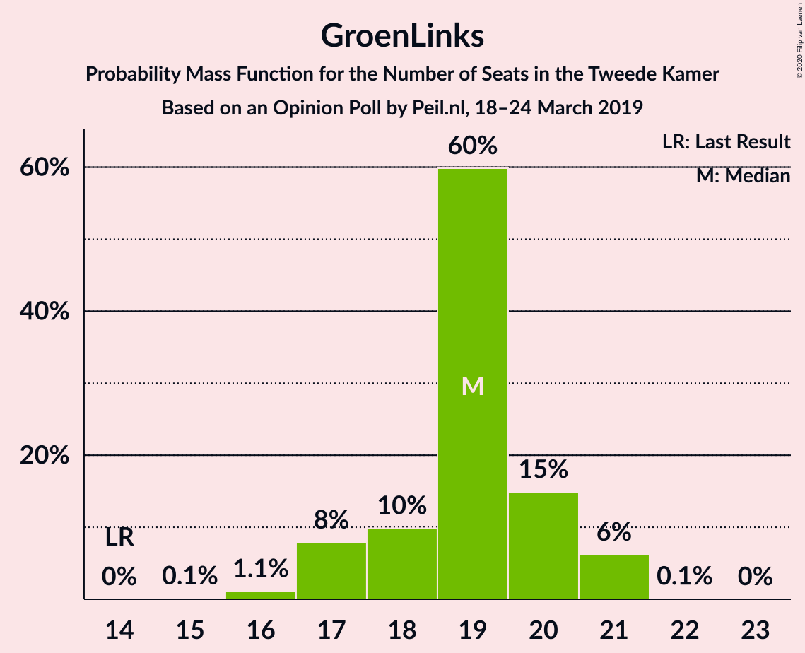

| Number of Seats | Probability | Accumulated | Special Marks |
|:---------------:|:-----------:|:-----------:|:-------------:|
| 14 | 0% | 100% | Last Result |
| 15 | 0.2% | 100% |  |
| 16 | 1.1% | 99.8% |  |
| 17 | 4% | 98.7% |  |
| 18 | 26% | 95% |  |
| 19 | 9% | 69% |  |
| 20 | 0.2% | 60% |  |
| 21 | 60% | 60% | Median |
| 22 | 0% | 0% |  |

### Christen-Democratisch Appèl

*For a full overview of the results for this party, see the [Christen-Democratisch Appèl](party-christen-democratischappèl.html) page.*

| Number of Seats | Probability | Accumulated | Special Marks |
|:---------------:|:-----------:|:-----------:|:-------------:|
| 12 | 3% | 100% |  |
| 13 | 13% | 97% |  |
| 14 | 69% | 84% | Median |
| 15 | 9% | 15% |  |
| 16 | 7% | 7% |  |
| 17 | 0% | 0% |  |
| 18 | 0% | 0% |  |
| 19 | 0% | 0% | Last Result |

### Partij van de Arbeid

*For a full overview of the results for this party, see the [Partij van de Arbeid](party-partijvandearbeid.html) page.*

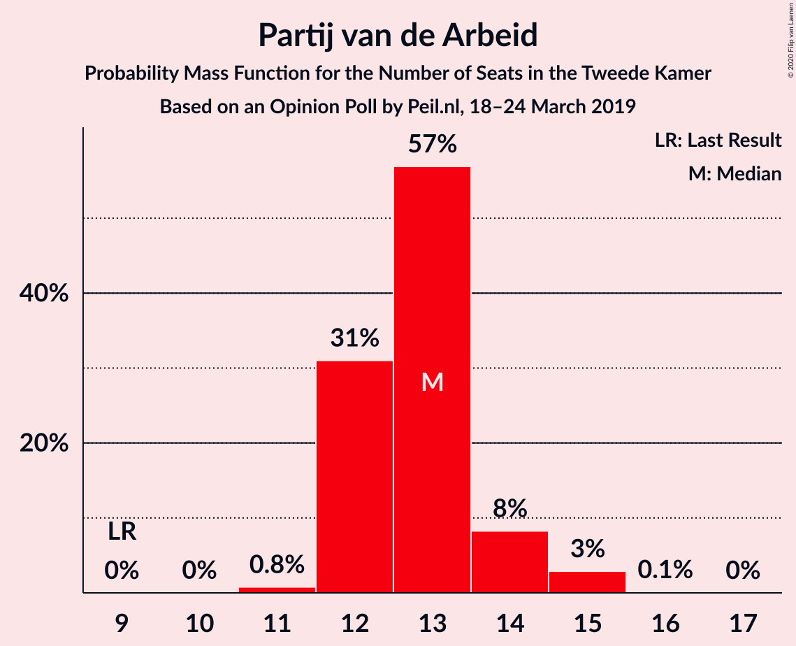

| Number of Seats | Probability | Accumulated | Special Marks |
|:---------------:|:-----------:|:-----------:|:-------------:|
| 9 | 0% | 100% | Last Result |
| 10 | 0% | 100% |  |
| 11 | 5% | 100% |  |
| 12 | 66% | 95% | Median |
| 13 | 18% | 30% |  |
| 14 | 8% | 11% |  |
| 15 | 4% | 4% |  |
| 16 | 0.1% | 0.1% |  |
| 17 | 0% | 0% |  |

### Democraten 66

*For a full overview of the results for this party, see the [Democraten 66](party-democraten66.html) page.*

| Number of Seats | Probability | Accumulated | Special Marks |
|:---------------:|:-----------:|:-----------:|:-------------:|
| 10 | 1.5% | 100% |  |
| 11 | 25% | 98.5% |  |
| 12 | 63% | 73% | Median |
| 13 | 6% | 11% |  |
| 14 | 5% | 5% |  |
| 15 | 0.3% | 0.3% |  |
| 16 | 0% | 0% |  |
| 17 | 0% | 0% |  |
| 18 | 0% | 0% |  |
| 19 | 0% | 0% | Last Result |

### Partij voor de Vrijheid

*For a full overview of the results for this party, see the [Partij voor de Vrijheid](party-partijvoordevrijheid.html) page.*

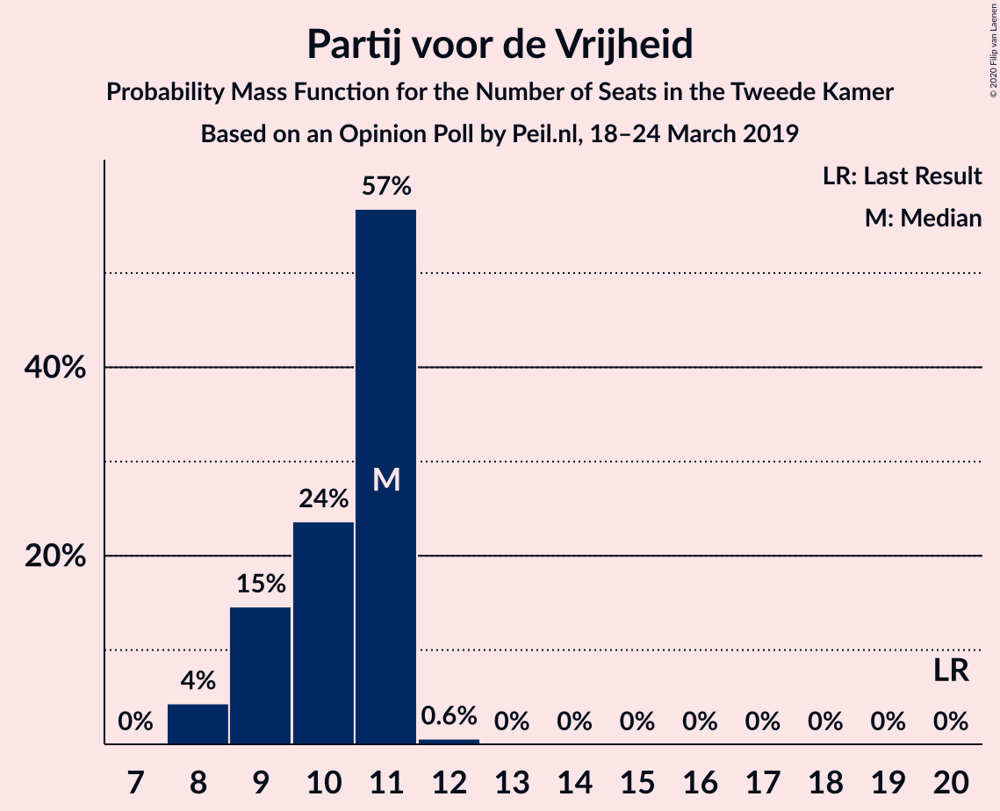

| Number of Seats | Probability | Accumulated | Special Marks |
|:---------------:|:-----------:|:-----------:|:-------------:|
| 8 | 0.1% | 100% |  |
| 9 | 69% | 99.9% | Median |
| 10 | 18% | 30% |  |
| 11 | 12% | 12% |  |
| 12 | 0% | 0% |  |
| 13 | 0% | 0% |  |
| 14 | 0% | 0% |  |
| 15 | 0% | 0% |  |
| 16 | 0% | 0% |  |
| 17 | 0% | 0% |  |
| 18 | 0% | 0% |  |
| 19 | 0% | 0% |  |
| 20 | 0% | 0% | Last Result |

### Socialistische Partij

*For a full overview of the results for this party, see the [Socialistische Partij](party-socialistischepartij.html) page.*

| Number of Seats | Probability | Accumulated | Special Marks |
|:---------------:|:-----------:|:-----------:|:-------------:|
| 7 | 0.3% | 100% |  |
| 8 | 27% | 99.7% |  |
| 9 | 67% | 73% | Median |
| 10 | 5% | 5% |  |
| 11 | 0.2% | 0.2% |  |
| 12 | 0% | 0% |  |
| 13 | 0% | 0% |  |
| 14 | 0% | 0% | Last Result |

### ChristenUnie

*For a full overview of the results for this party, see the [ChristenUnie](party-christenunie.html) page.*

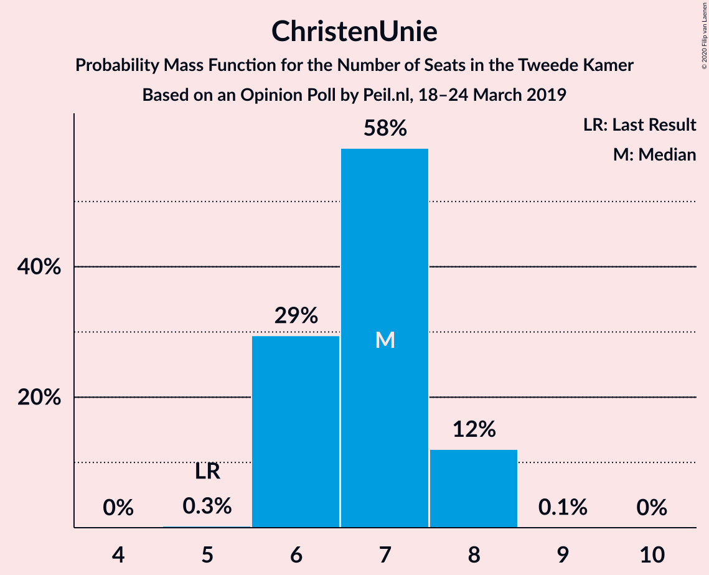

| Number of Seats | Probability | Accumulated | Special Marks |
|:---------------:|:-----------:|:-----------:|:-------------:|
| 5 | 0.2% | 100% | Last Result |
| 6 | 85% | 99.8% | Median |
| 7 | 14% | 15% |  |
| 8 | 1.0% | 1.0% |  |
| 9 | 0% | 0% |  |

### Partij voor de Dieren

*For a full overview of the results for this party, see the [Partij voor de Dieren](party-partijvoordedieren.html) page.*

| Number of Seats | Probability | Accumulated | Special Marks |
|:---------------:|:-----------:|:-----------:|:-------------:|
| 5 | 2% | 100% | Last Result |
| 6 | 61% | 98% | Median |
| 7 | 16% | 36% |  |
| 8 | 20% | 21% |  |
| 9 | 0.3% | 0.3% |  |
| 10 | 0% | 0% |  |

### 50Plus

*For a full overview of the results for this party, see the [50Plus](party-50plus.html) page.*

| Number of Seats | Probability | Accumulated | Special Marks |
|:---------------:|:-----------:|:-----------:|:-------------:|
| 3 | 9% | 100% |  |
| 4 | 84% | 91% | Last Result, Median |
| 5 | 7% | 7% |  |
| 6 | 0% | 0% |  |

### DENK

*For a full overview of the results for this party, see the [DENK](party-denk.html) page.*

| Number of Seats | Probability | Accumulated | Special Marks |
|:---------------:|:-----------:|:-----------:|:-------------:|
| 3 | 19% | 100% | Last Result |
| 4 | 67% | 81% | Median |
| 5 | 13% | 13% |  |
| 6 | 0% | 0% |  |

### Staatkundig Gereformeerde Partij

*For a full overview of the results for this party, see the [Staatkundig Gereformeerde Partij](party-staatkundiggereformeerdepartij.html) page.*

| Number of Seats | Probability | Accumulated | Special Marks |
|:---------------:|:-----------:|:-----------:|:-------------:|
| 1 | 7% | 100% |  |
| 2 | 93% | 93% | Median |
| 3 | 0.4% | 0.4% | Last Result |
| 4 | 0% | 0% |  |

## Coalitions

### Confidence Intervals

| Coalition | Last Result | Median | Majority? | 80% Confidence Interval | 90% Confidence Interval | 95% Confidence Interval | 99% Confidence Interval |
|:---------:|:-----------:|:------:|:---------:|:-----------------------:|:-----------------------:|:-----------------------:|:-----------------------:|
| Forum voor Democratie – Volkspartij voor Vrijheid en Democratie – Christen-Democratisch Appèl – Partij voor de Vrijheid – Staatkundig Gereformeerde Partij | 77 | 75 | 29% | 74–78 | 74–78 | 74–79 | 73–81 |
| Volkspartij voor Vrijheid en Democratie – GroenLinks – Christen-Democratisch Appèl – Democraten 66 – ChristenUnie | 90 | 75 | 10% | 74–76 | 74–78 | 73–78 | 71–78 |
| Forum voor Democratie – Volkspartij voor Vrijheid en Democratie – Christen-Democratisch Appèl – Partij voor de Vrijheid | 74 | 73 | 20% | 72–76 | 72–76 | 72–78 | 72–79 |
| GroenLinks – Christen-Democratisch Appèl – Partij van de Arbeid – Democraten 66 – Socialistische Partij – ChristenUnie | 80 | 74 | 6% | 69–74 | 69–76 | 69–76 | 69–76 |
| Forum voor Democratie – Volkspartij voor Vrijheid en Democratie – Christen-Democratisch Appèl – 50Plus – Staatkundig Gereformeerde Partij | 61 | 70 | 0% | 69–72 | 68–72 | 68–73 | 68–75 |
| Forum voor Democratie – Volkspartij voor Vrijheid en Democratie – Christen-Democratisch Appèl – 50Plus | 58 | 68 | 0% | 67–70 | 66–70 | 66–71 | 66–73 |
| Volkspartij voor Vrijheid en Democratie – Christen-Democratisch Appèl – Partij van de Arbeid – Democraten 66 – ChristenUnie | 85 | 66 | 0% | 66–70 | 66–70 | 66–71 | 66–73 |
| Forum voor Democratie – Volkspartij voor Vrijheid en Democratie – Christen-Democratisch Appèl – Staatkundig Gereformeerde Partij | 57 | 66 | 0% | 65–68 | 65–68 | 65–70 | 63–71 |
| Forum voor Democratie – Volkspartij voor Vrijheid en Democratie – Christen-Democratisch Appèl | 54 | 64 | 0% | 63–66 | 63–66 | 63–68 | 62–69 |
| GroenLinks – Christen-Democratisch Appèl – Partij van de Arbeid – Democraten 66 – ChristenUnie | 66 | 65 | 0% | 61–65 | 61–67 | 61–67 | 61–67 |
| Volkspartij voor Vrijheid en Democratie – Christen-Democratisch Appèl – Democraten 66 – ChristenUnie | 76 | 54 | 0% | 54–58 | 54–59 | 54–59 | 53–60 |
| Volkspartij voor Vrijheid en Democratie – Christen-Democratisch Appèl – Partij van de Arbeid | 61 | 48 | 0% | 48–52 | 48–53 | 48–53 | 48–53 |
| Volkspartij voor Vrijheid en Democratie – Christen-Democratisch Appèl – Democraten 66 | 71 | 48 | 0% | 48–52 | 48–52 | 48–52 | 46–52 |
| Volkspartij voor Vrijheid en Democratie – Partij van de Arbeid – Democraten 66 | 61 | 46 | 0% | 46–50 | 46–50 | 46–51 | 45–51 |
| Volkspartij voor Vrijheid en Democratie – Christen-Democratisch Appèl – Partij voor de Vrijheid | 72 | 45 | 0% | 45–50 | 45–50 | 45–50 | 45–50 |
| Christen-Democratisch Appèl – Partij van de Arbeid – Democraten 66 | 47 | 38 | 0% | 37–40 | 37–41 | 37–41 | 37–42 |
| Volkspartij voor Vrijheid en Democratie – Partij van de Arbeid | 42 | 34 | 0% | 34–39 | 34–39 | 33–40 | 33–40 |
| Volkspartij voor Vrijheid en Democratie – Christen-Democratisch Appèl | 52 | 36 | 0% | 36–39 | 36–39 | 36–39 | 35–40 |
| Christen-Democratisch Appèl – Partij van de Arbeid – ChristenUnie | 33 | 32 | 0% | 32–35 | 32–35 | 32–35 | 32–36 |
| Christen-Democratisch Appèl – Democraten 66 | 38 | 26 | 0% | 24–27 | 24–28 | 23–30 | 23–30 |
| Christen-Democratisch Appèl – Partij van de Arbeid | 28 | 26 | 0% | 26–28 | 26–29 | 26–29 | 26–29 |

### Forum voor Democratie – Volkspartij voor Vrijheid en Democratie – Christen-Democratisch Appèl – Partij voor de Vrijheid – Staatkundig Gereformeerde Partij

| Number of Seats | Probability | Accumulated | Special Marks |
|:---------------:|:-----------:|:-----------:|:-------------:|
| 72 | 0.4% | 100% |  |
| 73 | 0.2% | 99.6% |  |
| 74 | 10% | 99.3% |  |
| 75 | 61% | 90% | Median |
| 76 | 1.5% | 29% | Majority |
| 77 | 12% | 28% | Last Result |
| 78 | 13% | 16% |  |
| 79 | 0.7% | 3% |  |
| 80 | 0.2% | 2% |  |
| 81 | 2% | 2% |  |
| 82 | 0% | 0% |  |

### Volkspartij voor Vrijheid en Democratie – GroenLinks – Christen-Democratisch Appèl – Democraten 66 – ChristenUnie

| Number of Seats | Probability | Accumulated | Special Marks |
|:---------------:|:-----------:|:-----------:|:-------------:|
| 71 | 2% | 100% |  |
| 72 | 0.4% | 98% |  |
| 73 | 2% | 98% |  |
| 74 | 23% | 95% |  |
| 75 | 62% | 72% | Median |
| 76 | 5% | 10% | Majority |
| 77 | 0.1% | 6% |  |
| 78 | 5% | 5% |  |
| 79 | 0.1% | 0.2% |  |
| 80 | 0% | 0% |  |
| 81 | 0% | 0% |  |
| 82 | 0% | 0% |  |
| 83 | 0% | 0% |  |
| 84 | 0% | 0% |  |
| 85 | 0% | 0% |  |
| 86 | 0% | 0% |  |
| 87 | 0% | 0% |  |
| 88 | 0% | 0% |  |
| 89 | 0% | 0% |  |
| 90 | 0% | 0% | Last Result |

### Forum voor Democratie – Volkspartij voor Vrijheid en Democratie – Christen-Democratisch Appèl – Partij voor de Vrijheid

| Number of Seats | Probability | Accumulated | Special Marks |
|:---------------:|:-----------:|:-----------:|:-------------:|
| 70 | 0.3% | 100% |  |
| 71 | 0.2% | 99.7% |  |
| 72 | 10% | 99.5% |  |
| 73 | 61% | 90% | Median |
| 74 | 0.1% | 29% | Last Result |
| 75 | 9% | 29% |  |
| 76 | 17% | 20% | Majority |
| 77 | 0.1% | 3% |  |
| 78 | 0.6% | 3% |  |
| 79 | 2% | 2% |  |
| 80 | 0% | 0% |  |

### GroenLinks – Christen-Democratisch Appèl – Partij van de Arbeid – Democraten 66 – Socialistische Partij – ChristenUnie

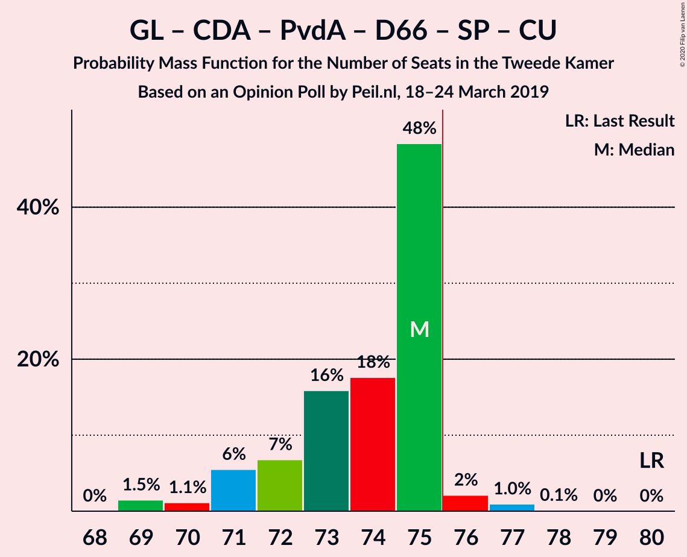

| Number of Seats | Probability | Accumulated | Special Marks |
|:---------------:|:-----------:|:-----------:|:-------------:|
| 68 | 0.1% | 100% |  |
| 69 | 12% | 99.9% |  |
| 70 | 3% | 88% |  |
| 71 | 5% | 85% |  |
| 72 | 9% | 80% |  |
| 73 | 0.8% | 71% |  |
| 74 | 64% | 70% | Median |
| 75 | 0.3% | 6% |  |
| 76 | 5% | 6% | Majority |
| 77 | 0.3% | 0.4% |  |
| 78 | 0% | 0.1% |  |
| 79 | 0.1% | 0.1% |  |
| 80 | 0% | 0% | Last Result |

### Forum voor Democratie – Volkspartij voor Vrijheid en Democratie – Christen-Democratisch Appèl – 50Plus – Staatkundig Gereformeerde Partij

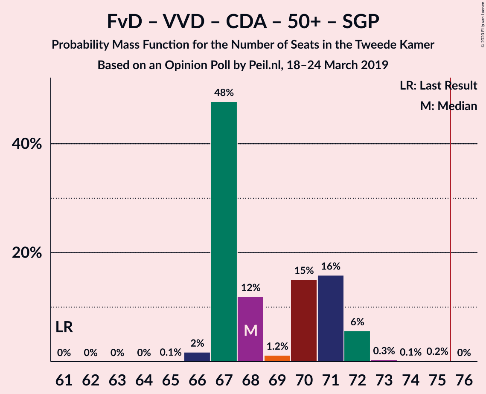

| Number of Seats | Probability | Accumulated | Special Marks |
|:---------------:|:-----------:|:-----------:|:-------------:|
| 61 | 0% | 100% | Last Result |
| 62 | 0% | 100% |  |
| 63 | 0% | 100% |  |
| 64 | 0% | 100% |  |
| 65 | 0% | 100% |  |
| 66 | 0.2% | 100% |  |
| 67 | 0.3% | 99.8% |  |
| 68 | 8% | 99.5% |  |
| 69 | 2% | 92% |  |
| 70 | 67% | 89% | Median |
| 71 | 6% | 22% |  |
| 72 | 13% | 16% |  |
| 73 | 0.4% | 3% |  |
| 74 | 0.2% | 2% |  |
| 75 | 2% | 2% |  |
| 76 | 0% | 0% | Majority |

### Forum voor Democratie – Volkspartij voor Vrijheid en Democratie – Christen-Democratisch Appèl – 50Plus

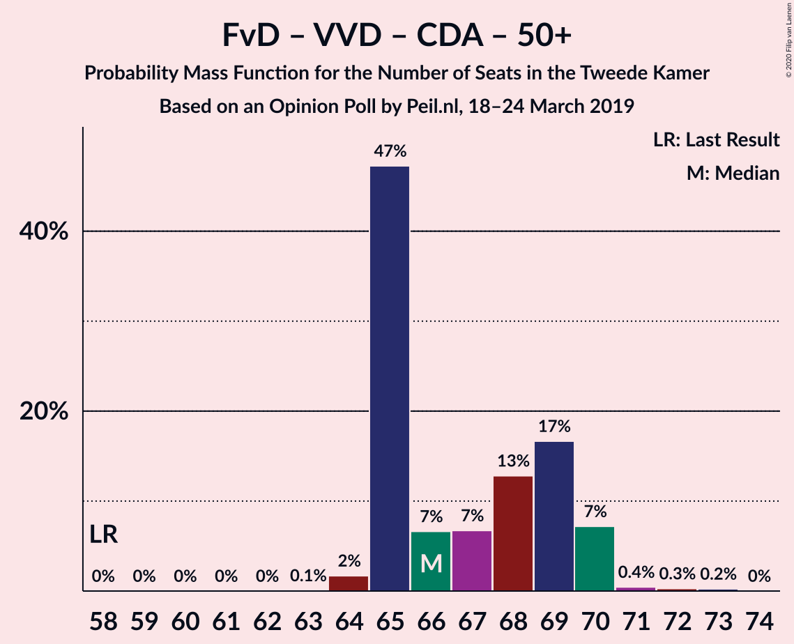

| Number of Seats | Probability | Accumulated | Special Marks |
|:---------------:|:-----------:|:-----------:|:-------------:|
| 58 | 0% | 100% | Last Result |
| 59 | 0% | 100% |  |
| 60 | 0% | 100% |  |
| 61 | 0% | 100% |  |
| 62 | 0% | 100% |  |
| 63 | 0% | 100% |  |
| 64 | 0.1% | 100% |  |
| 65 | 0.4% | 99.9% |  |
| 66 | 8% | 99.5% |  |
| 67 | 3% | 92% |  |
| 68 | 67% | 89% | Median |
| 69 | 0.3% | 22% |  |
| 70 | 18% | 22% |  |
| 71 | 0.7% | 3% |  |
| 72 | 0.2% | 2% |  |
| 73 | 2% | 2% |  |
| 74 | 0% | 0% |  |

### Volkspartij voor Vrijheid en Democratie – Christen-Democratisch Appèl – Partij van de Arbeid – Democraten 66 – ChristenUnie

| Number of Seats | Probability | Accumulated | Special Marks |
|:---------------:|:-----------:|:-----------:|:-------------:|
| 64 | 0.1% | 100% |  |
| 65 | 0% | 99.9% |  |
| 66 | 61% | 99.9% | Median |
| 67 | 0.4% | 38% |  |
| 68 | 0.2% | 38% |  |
| 69 | 15% | 38% |  |
| 70 | 19% | 23% |  |
| 71 | 2% | 4% |  |
| 72 | 0.6% | 1.2% |  |
| 73 | 0.5% | 0.5% |  |
| 74 | 0% | 0.1% |  |
| 75 | 0% | 0.1% |  |
| 76 | 0% | 0% | Majority |
| 77 | 0% | 0% |  |
| 78 | 0% | 0% |  |
| 79 | 0% | 0% |  |
| 80 | 0% | 0% |  |
| 81 | 0% | 0% |  |
| 82 | 0% | 0% |  |
| 83 | 0% | 0% |  |
| 84 | 0% | 0% |  |
| 85 | 0% | 0% | Last Result |

### Forum voor Democratie – Volkspartij voor Vrijheid en Democratie – Christen-Democratisch Appèl – Staatkundig Gereformeerde Partij

| Number of Seats | Probability | Accumulated | Special Marks |
|:---------------:|:-----------:|:-----------:|:-------------:|
| 57 | 0% | 100% | Last Result |
| 58 | 0% | 100% |  |
| 59 | 0% | 100% |  |
| 60 | 0% | 100% |  |
| 61 | 0% | 100% |  |
| 62 | 0% | 100% |  |
| 63 | 0.6% | 100% |  |
| 64 | 1.0% | 99.4% |  |
| 65 | 9% | 98% |  |
| 66 | 73% | 89% | Median |
| 67 | 0.2% | 16% |  |
| 68 | 13% | 16% |  |
| 69 | 0.7% | 3% |  |
| 70 | 0.3% | 3% |  |
| 71 | 2% | 2% |  |
| 72 | 0% | 0% |  |

### Forum voor Democratie – Volkspartij voor Vrijheid en Democratie – Christen-Democratisch Appèl

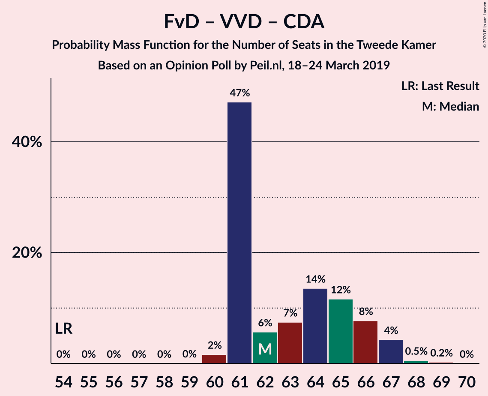

| Number of Seats | Probability | Accumulated | Special Marks |
|:---------------:|:-----------:|:-----------:|:-------------:|
| 54 | 0% | 100% | Last Result |
| 55 | 0% | 100% |  |
| 56 | 0% | 100% |  |
| 57 | 0% | 100% |  |
| 58 | 0% | 100% |  |
| 59 | 0% | 100% |  |
| 60 | 0% | 100% |  |
| 61 | 0.3% | 100% |  |
| 62 | 1.3% | 99.7% |  |
| 63 | 9% | 98% |  |
| 64 | 67% | 89% | Median |
| 65 | 6% | 22% |  |
| 66 | 13% | 16% |  |
| 67 | 0.1% | 3% |  |
| 68 | 0.6% | 3% |  |
| 69 | 2% | 2% |  |
| 70 | 0% | 0% |  |

### GroenLinks – Christen-Democratisch Appèl – Partij van de Arbeid – Democraten 66 – ChristenUnie

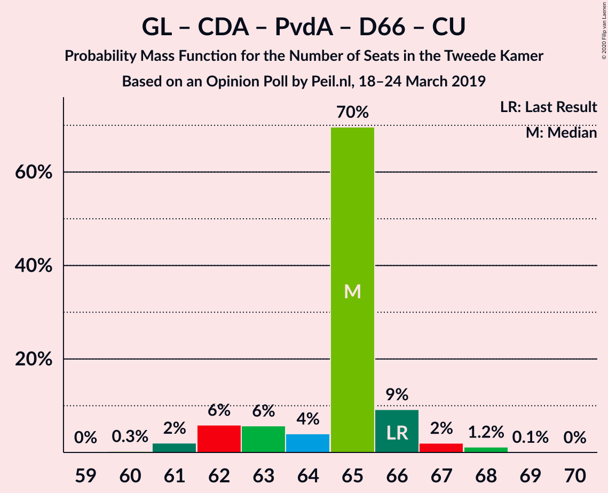

| Number of Seats | Probability | Accumulated | Special Marks |
|:---------------:|:-----------:|:-----------:|:-------------:|
| 59 | 0.1% | 100% |  |
| 60 | 0% | 99.9% |  |
| 61 | 12% | 99.9% |  |
| 62 | 4% | 88% |  |
| 63 | 5% | 83% |  |
| 64 | 10% | 78% |  |
| 65 | 62% | 68% | Median |
| 66 | 0.1% | 6% | Last Result |
| 67 | 5% | 6% |  |
| 68 | 0.3% | 0.4% |  |
| 69 | 0.1% | 0.1% |  |
| 70 | 0% | 0% |  |

### Volkspartij voor Vrijheid en Democratie – Christen-Democratisch Appèl – Democraten 66 – ChristenUnie

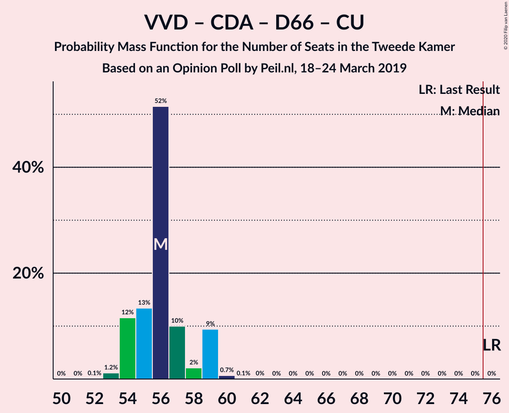

| Number of Seats | Probability | Accumulated | Special Marks |
|:---------------:|:-----------:|:-----------:|:-------------:|
| 52 | 0.4% | 100% |  |
| 53 | 2% | 99.6% |  |
| 54 | 60% | 98% | Median |
| 55 | 3% | 38% |  |
| 56 | 22% | 35% |  |
| 57 | 0.3% | 13% |  |
| 58 | 7% | 12% |  |
| 59 | 5% | 6% |  |
| 60 | 0.6% | 0.6% |  |
| 61 | 0% | 0.1% |  |
| 62 | 0% | 0% |  |
| 63 | 0% | 0% |  |
| 64 | 0% | 0% |  |
| 65 | 0% | 0% |  |
| 66 | 0% | 0% |  |
| 67 | 0% | 0% |  |
| 68 | 0% | 0% |  |
| 69 | 0% | 0% |  |
| 70 | 0% | 0% |  |
| 71 | 0% | 0% |  |
| 72 | 0% | 0% |  |
| 73 | 0% | 0% |  |
| 74 | 0% | 0% |  |
| 75 | 0% | 0% |  |
| 76 | 0% | 0% | Last Result, Majority |

### Volkspartij voor Vrijheid en Democratie – Christen-Democratisch Appèl – Partij van de Arbeid

| Number of Seats | Probability | Accumulated | Special Marks |
|:---------------:|:-----------:|:-----------:|:-------------:|
| 47 | 0.1% | 100% |  |
| 48 | 60% | 99.9% | Median |
| 49 | 6% | 40% |  |
| 50 | 1.2% | 33% |  |
| 51 | 7% | 32% |  |
| 52 | 17% | 25% |  |
| 53 | 8% | 8% |  |
| 54 | 0.1% | 0.2% |  |
| 55 | 0% | 0% |  |
| 56 | 0% | 0% |  |
| 57 | 0% | 0% |  |
| 58 | 0% | 0% |  |
| 59 | 0% | 0% |  |
| 60 | 0% | 0% |  |
| 61 | 0% | 0% | Last Result |

### Volkspartij voor Vrijheid en Democratie – Christen-Democratisch Appèl – Democraten 66

| Number of Seats | Probability | Accumulated | Special Marks |
|:---------------:|:-----------:|:-----------:|:-------------:|
| 45 | 0.3% | 100% |  |
| 46 | 1.5% | 99.7% |  |
| 47 | 0.3% | 98% |  |
| 48 | 63% | 98% | Median |
| 49 | 3% | 35% |  |
| 50 | 20% | 32% |  |
| 51 | 2% | 12% |  |
| 52 | 10% | 10% |  |
| 53 | 0.4% | 0.4% |  |
| 54 | 0% | 0% |  |
| 55 | 0% | 0% |  |
| 56 | 0% | 0% |  |
| 57 | 0% | 0% |  |
| 58 | 0% | 0% |  |
| 59 | 0% | 0% |  |
| 60 | 0% | 0% |  |
| 61 | 0% | 0% |  |
| 62 | 0% | 0% |  |
| 63 | 0% | 0% |  |
| 64 | 0% | 0% |  |
| 65 | 0% | 0% |  |
| 66 | 0% | 0% |  |
| 67 | 0% | 0% |  |
| 68 | 0% | 0% |  |
| 69 | 0% | 0% |  |
| 70 | 0% | 0% |  |
| 71 | 0% | 0% | Last Result |

### Volkspartij voor Vrijheid en Democratie – Partij van de Arbeid – Democraten 66

| Number of Seats | Probability | Accumulated | Special Marks |
|:---------------:|:-----------:|:-----------:|:-------------:|
| 45 | 2% | 100% |  |
| 46 | 60% | 98% | Median |
| 47 | 5% | 38% |  |
| 48 | 5% | 34% |  |
| 49 | 8% | 29% |  |
| 50 | 17% | 20% |  |
| 51 | 3% | 3% |  |
| 52 | 0.1% | 0.2% |  |
| 53 | 0.1% | 0.1% |  |
| 54 | 0% | 0% |  |
| 55 | 0% | 0% |  |
| 56 | 0% | 0% |  |
| 57 | 0% | 0% |  |
| 58 | 0% | 0% |  |
| 59 | 0% | 0% |  |
| 60 | 0% | 0% |  |
| 61 | 0% | 0% | Last Result |

### Volkspartij voor Vrijheid en Democratie – Christen-Democratisch Appèl – Partij voor de Vrijheid

| Number of Seats | Probability | Accumulated | Special Marks |
|:---------------:|:-----------:|:-----------:|:-------------:|
| 43 | 0.1% | 100% |  |
| 44 | 0.1% | 99.9% |  |
| 45 | 62% | 99.9% | Median |
| 46 | 3% | 38% |  |
| 47 | 5% | 35% |  |
| 48 | 3% | 29% |  |
| 49 | 14% | 26% |  |
| 50 | 12% | 13% |  |
| 51 | 0.2% | 0.2% |  |
| 52 | 0% | 0% |  |
| 53 | 0% | 0% |  |
| 54 | 0% | 0% |  |
| 55 | 0% | 0% |  |
| 56 | 0% | 0% |  |
| 57 | 0% | 0% |  |
| 58 | 0% | 0% |  |
| 59 | 0% | 0% |  |
| 60 | 0% | 0% |  |
| 61 | 0% | 0% |  |
| 62 | 0% | 0% |  |
| 63 | 0% | 0% |  |
| 64 | 0% | 0% |  |
| 65 | 0% | 0% |  |
| 66 | 0% | 0% |  |
| 67 | 0% | 0% |  |
| 68 | 0% | 0% |  |
| 69 | 0% | 0% |  |
| 70 | 0% | 0% |  |
| 71 | 0% | 0% |  |
| 72 | 0% | 0% | Last Result |

### Christen-Democratisch Appèl – Partij van de Arbeid – Democraten 66

| Number of Seats | Probability | Accumulated | Special Marks |
|:---------------:|:-----------:|:-----------:|:-------------:|
| 35 | 0.1% | 100% |  |
| 36 | 0.1% | 99.9% |  |
| 37 | 14% | 99.8% |  |
| 38 | 65% | 86% | Median |
| 39 | 5% | 21% |  |
| 40 | 8% | 16% |  |
| 41 | 7% | 7% |  |
| 42 | 0.3% | 0.7% |  |
| 43 | 0.4% | 0.4% |  |
| 44 | 0% | 0% |  |
| 45 | 0% | 0% |  |
| 46 | 0% | 0% |  |
| 47 | 0% | 0% | Last Result |

### Volkspartij voor Vrijheid en Democratie – Partij van de Arbeid

| Number of Seats | Probability | Accumulated | Special Marks |
|:---------------:|:-----------:|:-----------:|:-------------:|
| 33 | 5% | 100% |  |
| 34 | 60% | 95% | Median |
| 35 | 2% | 35% |  |
| 36 | 2% | 33% |  |
| 37 | 8% | 31% |  |
| 38 | 8% | 23% |  |
| 39 | 12% | 15% |  |
| 40 | 3% | 3% |  |
| 41 | 0% | 0% |  |
| 42 | 0% | 0% | Last Result |

### Volkspartij voor Vrijheid en Democratie – Christen-Democratisch Appèl

| Number of Seats | Probability | Accumulated | Special Marks |
|:---------------:|:-----------:|:-----------:|:-------------:|
| 34 | 0.3% | 100% |  |
| 35 | 0.3% | 99.7% |  |
| 36 | 62% | 99.5% | Median |
| 37 | 4% | 38% |  |
| 38 | 8% | 34% |  |
| 39 | 25% | 26% |  |
| 40 | 0.7% | 0.9% |  |
| 41 | 0.2% | 0.2% |  |
| 42 | 0% | 0% |  |
| 43 | 0% | 0% |  |
| 44 | 0% | 0% |  |
| 45 | 0% | 0% |  |
| 46 | 0% | 0% |  |
| 47 | 0% | 0% |  |
| 48 | 0% | 0% |  |
| 49 | 0% | 0% |  |
| 50 | 0% | 0% |  |
| 51 | 0% | 0% |  |
| 52 | 0% | 0% | Last Result |

### Christen-Democratisch Appèl – Partij van de Arbeid – ChristenUnie

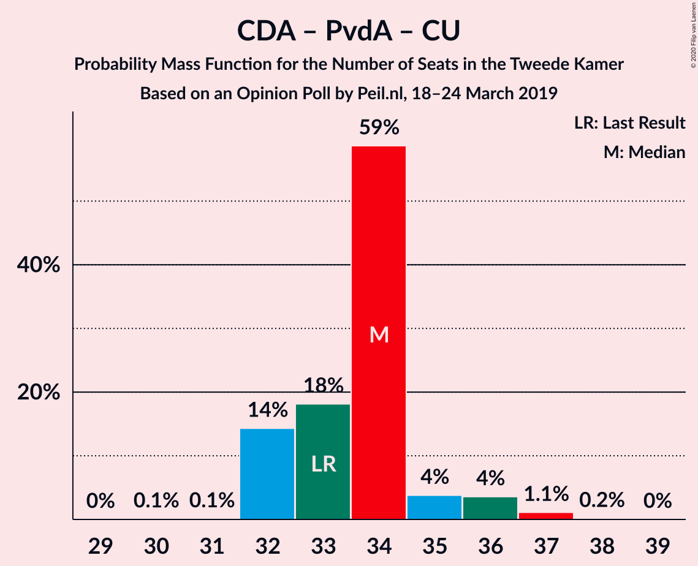

| Number of Seats | Probability | Accumulated | Special Marks |
|:---------------:|:-----------:|:-----------:|:-------------:|
| 30 | 0.1% | 100% |  |
| 31 | 0% | 99.9% |  |
| 32 | 77% | 99.9% | Median |
| 33 | 0.6% | 23% | Last Result |
| 34 | 12% | 22% |  |
| 35 | 9% | 11% |  |
| 36 | 2% | 2% |  |
| 37 | 0.1% | 0.3% |  |
| 38 | 0.2% | 0.2% |  |
| 39 | 0% | 0% |  |

### Christen-Democratisch Appèl – Democraten 66

| Number of Seats | Probability | Accumulated | Special Marks |
|:---------------:|:-----------:|:-----------:|:-------------:|
| 23 | 3% | 100% |  |
| 24 | 14% | 97% |  |
| 25 | 3% | 83% |  |
| 26 | 67% | 80% | Median |
| 27 | 5% | 13% |  |
| 28 | 3% | 8% |  |
| 29 | 0% | 5% |  |
| 30 | 5% | 5% |  |
| 31 | 0% | 0% |  |
| 32 | 0% | 0% |  |
| 33 | 0% | 0% |  |
| 34 | 0% | 0% |  |
| 35 | 0% | 0% |  |
| 36 | 0% | 0% |  |
| 37 | 0% | 0% |  |
| 38 | 0% | 0% | Last Result |

### Christen-Democratisch Appèl – Partij van de Arbeid

| Number of Seats | Probability | Accumulated | Special Marks |
|:---------------:|:-----------:|:-----------:|:-------------:|
| 24 | 0.1% | 100% |  |
| 25 | 0.2% | 99.9% |  |
| 26 | 77% | 99.7% | Median |
| 27 | 13% | 23% |  |
| 28 | 1.0% | 10% | Last Result |
| 29 | 9% | 9% |  |
| 30 | 0.1% | 0.3% |  |
| 31 | 0.2% | 0.2% |  |
| 32 | 0% | 0% |  |

## Technical Information

### Opinion Poll

+ **Polling firm:** Peil.nl
+ **Commissioner(s):** —
+ **Fieldwork period:** 18–24 March 2019

### Calculations

+ **Sample size:** 3000
+ **Simulations done:** 131,072
+ **Error estimate:** 1.95%

