# Opinion Poll by Peil.nl, 1–7 April 2019

<a href="#voting-intentions">Voting Intentions</a> | <a href="#seats">Seats</a> | <a href="#coalitions">Coalitions</a> | <a href="#technical-information">Technical Information</a>

## Voting Intentions

### Confidence Intervals

| Party | Last Result | Poll Result | 80% Confidence Interval | 90% Confidence Interval | 95% Confidence Interval | 99% Confidence Interval |
|:-----:|:-----------:|:-----------:|:-----------------------:|:-----------------------:|:-----------------------:|:-----------------------:|
| Forum voor Democratie | 1.8% | 18.7% | 17.8–19.6% |17.5–19.9% |17.3–20.1% |16.9–20.6% |
| Volkspartij voor Vrijheid en Democratie | 21.3% | 14.7% | 13.9–15.5% |13.6–15.8% |13.4–16.0% |13.1–16.4% |
| GroenLinks | 9.1% | 12.0% | 11.3–12.8% |11.1–13.0% |10.9–13.2% |10.5–13.6% |
| Christen-Democratisch Appèl | 12.4% | 10.0% | 9.3–10.7% |9.1–10.9% |9.0–11.1% |8.7–11.5% |
| Partij van de Arbeid | 5.7% | 8.7% | 8.0–9.4% |7.8–9.6% |7.7–9.7% |7.4–10.1% |
| Democraten 66 | 12.2% | 7.3% | 6.8–8.0% |6.6–8.2% |6.4–8.3% |6.2–8.6% |
| Socialistische Partij | 9.1% | 6.0% | 5.5–6.6% |5.3–6.8% |5.2–6.9% |5.0–7.2% |
| Partij voor de Vrijheid | 13.1% | 5.3% | 4.8–5.9% |4.7–6.1% |4.6–6.2% |4.4–6.5% |
| Partij voor de Dieren | 3.2% | 5.3% | 4.8–5.9% |4.7–6.1% |4.6–6.2% |4.4–6.5% |
| ChristenUnie | 3.4% | 4.7% | 4.2–5.2% |4.1–5.3% |4.0–5.5% |3.7–5.8% |
| 50Plus | 3.1% | 2.7% | 2.3–3.1% |2.2–3.2% |2.1–3.3% |2.0–3.5% |
| DENK | 2.1% | 2.7% | 2.3–3.1% |2.2–3.2% |2.1–3.3% |2.0–3.5% |
| Staatkundig Gereformeerde Partij | 2.1% | 1.3% | 1.1–1.6% |1.0–1.7% |1.0–1.8% |0.9–2.0% |

*Note:* The poll result column reflects the actual value used in the calculations. Published results may vary slightly, and in addition be rounded to fewer digits.

## Seats

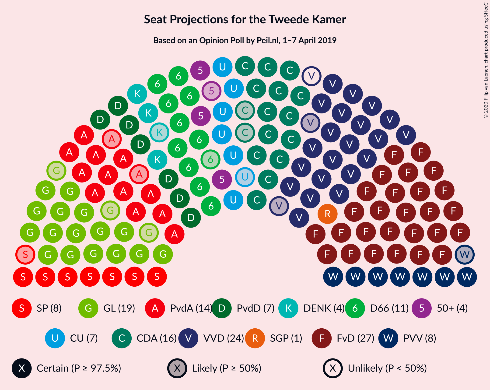

### Confidence Intervals

| Party | Last Result | Median | 80% Confidence Interval | 90% Confidence Interval | 95% Confidence Interval | 99% Confidence Interval |
|:-----:|:-----------:|:------:|:-----------------------:|:-----------------------:|:-----------------------:|:-----------------------:|
| <a href="#forum-voor-democratie">Forum voor Democratie</a> | 2 | 28 | 27–30 |27–31 |26–31 |26–32 |
| <a href="#volkspartij-voor-vrijheid-en-democratie">Volkspartij voor Vrijheid en Democratie</a> | 33 | 22 | 21–24 |21–25 |20–26 |20–26 |
| <a href="#groenlinks">GroenLinks</a> | 14 | 18 | 17–19 |16–19 |16–20 |16–22 |
| <a href="#christen-democratisch-appèl">Christen-Democratisch Appèl</a> | 19 | 15 | 13–16 |13–17 |13–17 |13–18 |
| <a href="#partij-van-de-arbeid">Partij van de Arbeid</a> | 9 | 13 | 12–15 |11–15 |11–15 |11–15 |
| <a href="#democraten-66">Democraten 66</a> | 19 | 11 | 10–12 |10–13 |9–13 |9–13 |
| <a href="#socialistische-partij">Socialistische Partij</a> | 14 | 9 | 8–11 |8–11 |7–11 |7–11 |
| <a href="#partij-voor-de-vrijheid">Partij voor de Vrijheid</a> | 20 | 8 | 7–9 |6–9 |6–10 |6–10 |
| <a href="#partij-voor-de-dieren">Partij voor de Dieren</a> | 5 | 8 | 7–9 |7–9 |7–10 |6–10 |
| <a href="#christenunie">ChristenUnie</a> | 5 | 7 | 6–8 |6–8 |6–8 |5–8 |
| <a href="#50plus">50Plus</a> | 4 | 4 | 3–4 |3–4 |3–4 |3–5 |
| <a href="#denk">DENK</a> | 3 | 4 | 3–4 |3–4 |3–4 |2–5 |
| <a href="#staatkundig-gereformeerde-partij">Staatkundig Gereformeerde Partij</a> | 3 | 2 | 1–2 |1–3 |1–3 |1–3 |

### Forum voor Democratie

*For a full overview of the results for this party, see the [Forum voor Democratie](party-forumvoordemocratie.html) page.*

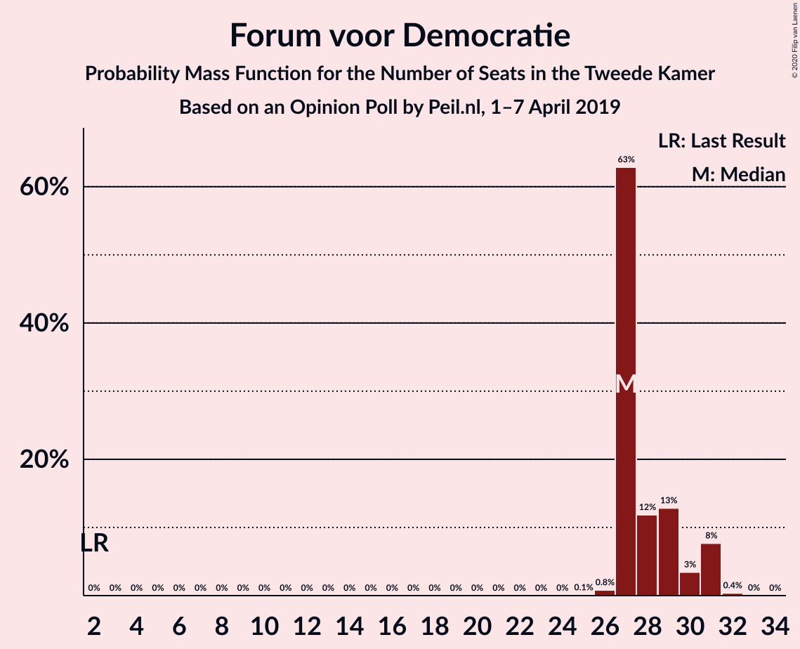

| Number of Seats | Probability | Accumulated | Special Marks |
|:---------------:|:-----------:|:-----------:|:-------------:|
| 2 | 0% | 100% | Last Result |
| 3 | 0% | 100% |  |
| 4 | 0% | 100% |  |
| 5 | 0% | 100% |  |
| 6 | 0% | 100% |  |
| 7 | 0% | 100% |  |
| 8 | 0% | 100% |  |
| 9 | 0% | 100% |  |
| 10 | 0% | 100% |  |
| 11 | 0% | 100% |  |
| 12 | 0% | 100% |  |
| 13 | 0% | 100% |  |
| 14 | 0% | 100% |  |
| 15 | 0% | 100% |  |
| 16 | 0% | 100% |  |
| 17 | 0% | 100% |  |
| 18 | 0% | 100% |  |
| 19 | 0% | 100% |  |
| 20 | 0% | 100% |  |
| 21 | 0% | 100% |  |
| 22 | 0% | 100% |  |
| 23 | 0% | 100% |  |
| 24 | 0% | 100% |  |
| 25 | 0.3% | 100% |  |
| 26 | 3% | 99.7% |  |
| 27 | 22% | 97% |  |
| 28 | 32% | 75% | Median |
| 29 | 26% | 43% |  |
| 30 | 12% | 18% |  |
| 31 | 3% | 6% |  |
| 32 | 2% | 2% |  |
| 33 | 0.2% | 0.2% |  |
| 34 | 0% | 0% |  |

### Volkspartij voor Vrijheid en Democratie

*For a full overview of the results for this party, see the [Volkspartij voor Vrijheid en Democratie](party-volkspartijvoorvrijheidendemocratie.html) page.*

| Number of Seats | Probability | Accumulated | Special Marks |
|:---------------:|:-----------:|:-----------:|:-------------:|
| 19 | 0.1% | 100% |  |
| 20 | 3% | 99.9% |  |
| 21 | 25% | 97% |  |
| 22 | 26% | 72% | Median |
| 23 | 30% | 47% |  |
| 24 | 8% | 16% |  |
| 25 | 4% | 9% |  |
| 26 | 5% | 5% |  |
| 27 | 0% | 0% |  |
| 28 | 0% | 0% |  |
| 29 | 0% | 0% |  |
| 30 | 0% | 0% |  |
| 31 | 0% | 0% |  |
| 32 | 0% | 0% |  |
| 33 | 0% | 0% | Last Result |

### GroenLinks

*For a full overview of the results for this party, see the [GroenLinks](party-groenlinks.html) page.*

| Number of Seats | Probability | Accumulated | Special Marks |
|:---------------:|:-----------:|:-----------:|:-------------:|
| 14 | 0% | 100% | Last Result |
| 15 | 0.2% | 100% |  |
| 16 | 6% | 99.8% |  |
| 17 | 20% | 94% |  |
| 18 | 46% | 74% | Median |
| 19 | 24% | 28% |  |
| 20 | 3% | 5% |  |
| 21 | 0.7% | 1.3% |  |
| 22 | 0.6% | 0.6% |  |
| 23 | 0% | 0% |  |

### Christen-Democratisch Appèl

*For a full overview of the results for this party, see the [Christen-Democratisch Appèl](party-christen-democratischappèl.html) page.*

| Number of Seats | Probability | Accumulated | Special Marks |
|:---------------:|:-----------:|:-----------:|:-------------:|
| 12 | 0.1% | 100% |  |
| 13 | 10% | 99.9% |  |
| 14 | 15% | 90% |  |
| 15 | 36% | 75% | Median |
| 16 | 31% | 39% |  |
| 17 | 7% | 8% |  |
| 18 | 0.4% | 0.5% |  |
| 19 | 0.2% | 0.2% | Last Result |
| 20 | 0% | 0% |  |

### Partij van de Arbeid

*For a full overview of the results for this party, see the [Partij van de Arbeid](party-partijvandearbeid.html) page.*

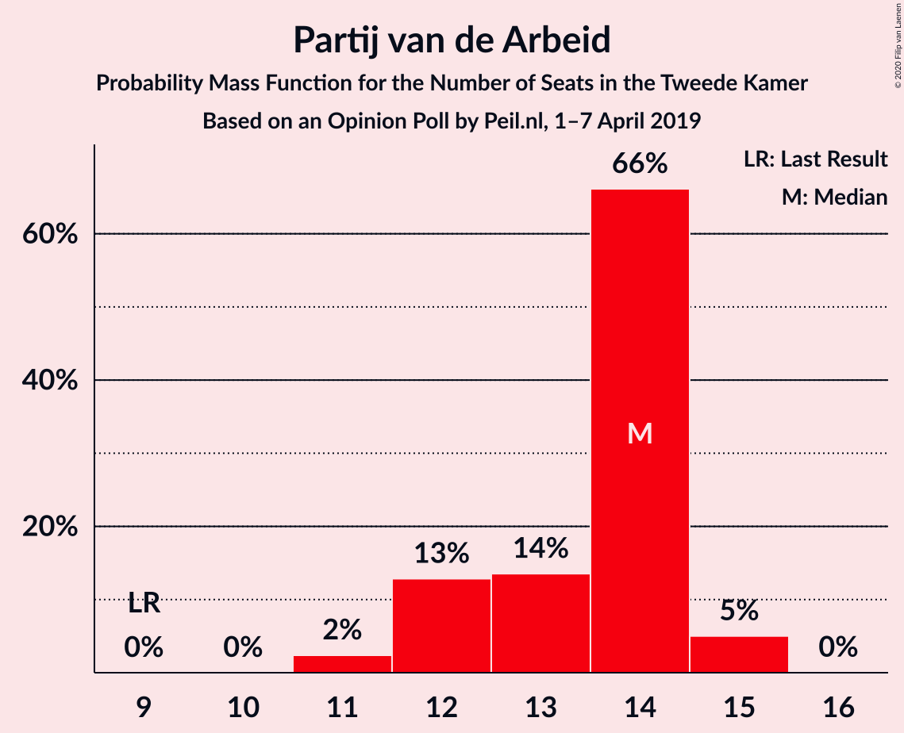

| Number of Seats | Probability | Accumulated | Special Marks |
|:---------------:|:-----------:|:-----------:|:-------------:|
| 9 | 0% | 100% | Last Result |
| 10 | 0% | 100% |  |
| 11 | 7% | 100% |  |
| 12 | 17% | 93% |  |
| 13 | 51% | 76% | Median |
| 14 | 13% | 25% |  |
| 15 | 13% | 13% |  |
| 16 | 0.1% | 0.2% |  |
| 17 | 0.1% | 0.1% |  |
| 18 | 0% | 0% |  |

### Democraten 66

*For a full overview of the results for this party, see the [Democraten 66](party-democraten66.html) page.*

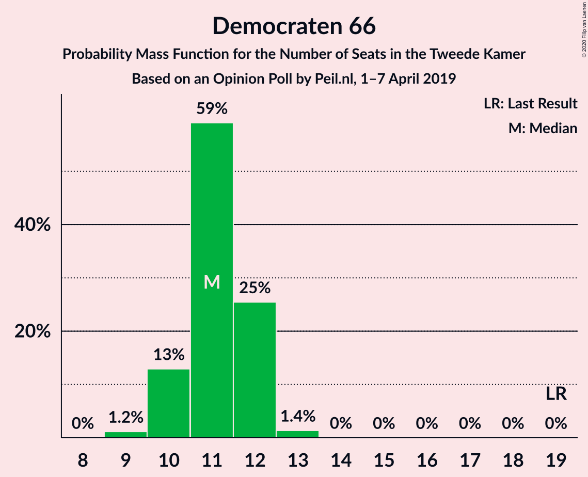

| Number of Seats | Probability | Accumulated | Special Marks |
|:---------------:|:-----------:|:-----------:|:-------------:|
| 9 | 4% | 100% |  |
| 10 | 13% | 96% |  |
| 11 | 52% | 83% | Median |
| 12 | 26% | 31% |  |
| 13 | 5% | 5% |  |
| 14 | 0.1% | 0.1% |  |
| 15 | 0% | 0% |  |
| 16 | 0% | 0% |  |
| 17 | 0% | 0% |  |
| 18 | 0% | 0% |  |
| 19 | 0% | 0% | Last Result |

### Socialistische Partij

*For a full overview of the results for this party, see the [Socialistische Partij](party-socialistischepartij.html) page.*

| Number of Seats | Probability | Accumulated | Special Marks |
|:---------------:|:-----------:|:-----------:|:-------------:|
| 7 | 3% | 100% |  |
| 8 | 11% | 97% |  |
| 9 | 46% | 86% | Median |
| 10 | 28% | 40% |  |
| 11 | 12% | 12% |  |
| 12 | 0% | 0% |  |
| 13 | 0% | 0% |  |
| 14 | 0% | 0% | Last Result |

### Partij voor de Vrijheid

*For a full overview of the results for this party, see the [Partij voor de Vrijheid](party-partijvoordevrijheid.html) page.*

| Number of Seats | Probability | Accumulated | Special Marks |
|:---------------:|:-----------:|:-----------:|:-------------:|
| 6 | 10% | 100% |  |
| 7 | 30% | 90% |  |
| 8 | 26% | 60% | Median |
| 9 | 31% | 34% |  |
| 10 | 3% | 3% |  |
| 11 | 0% | 0% |  |
| 12 | 0% | 0% |  |
| 13 | 0% | 0% |  |
| 14 | 0% | 0% |  |
| 15 | 0% | 0% |  |
| 16 | 0% | 0% |  |
| 17 | 0% | 0% |  |
| 18 | 0% | 0% |  |
| 19 | 0% | 0% |  |
| 20 | 0% | 0% | Last Result |

### Partij voor de Dieren

*For a full overview of the results for this party, see the [Partij voor de Dieren](party-partijvoordedieren.html) page.*

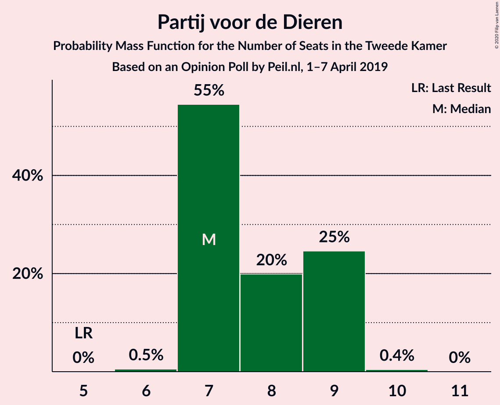

| Number of Seats | Probability | Accumulated | Special Marks |
|:---------------:|:-----------:|:-----------:|:-------------:|
| 5 | 0% | 100% | Last Result |
| 6 | 2% | 100% |  |
| 7 | 35% | 98% |  |
| 8 | 24% | 63% | Median |
| 9 | 37% | 40% |  |
| 10 | 3% | 3% |  |
| 11 | 0% | 0% |  |

### ChristenUnie

*For a full overview of the results for this party, see the [ChristenUnie](party-christenunie.html) page.*

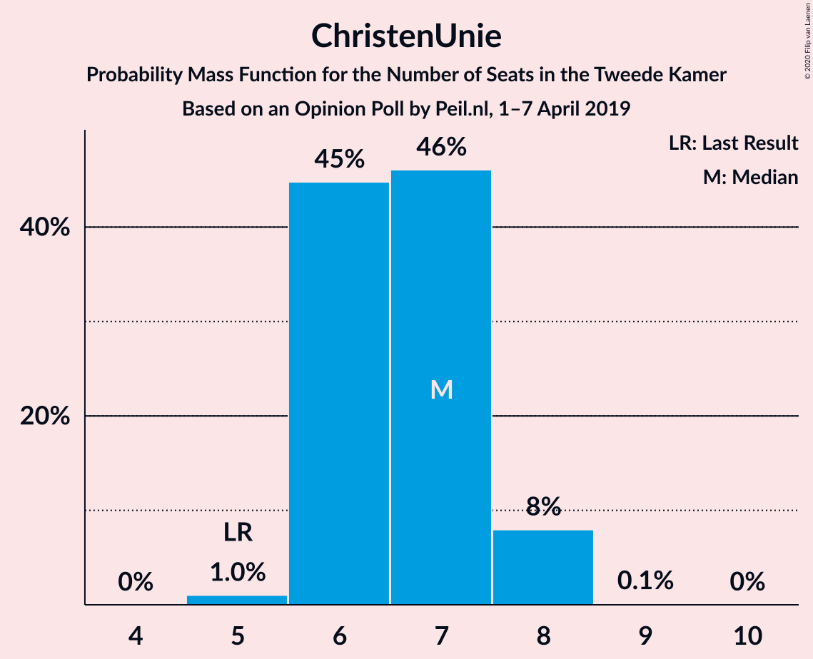

| Number of Seats | Probability | Accumulated | Special Marks |
|:---------------:|:-----------:|:-----------:|:-------------:|
| 5 | 2% | 100% | Last Result |
| 6 | 22% | 98% |  |
| 7 | 58% | 76% | Median |
| 8 | 17% | 18% |  |
| 9 | 0.4% | 0.4% |  |
| 10 | 0% | 0% |  |

### 50Plus

*For a full overview of the results for this party, see the [50Plus](party-50plus.html) page.*

| Number of Seats | Probability | Accumulated | Special Marks |
|:---------------:|:-----------:|:-----------:|:-------------:|
| 2 | 0.1% | 100% |  |
| 3 | 13% | 99.9% |  |
| 4 | 85% | 87% | Last Result, Median |
| 5 | 2% | 2% |  |
| 6 | 0% | 0% |  |

### DENK

*For a full overview of the results for this party, see the [DENK](party-denk.html) page.*

| Number of Seats | Probability | Accumulated | Special Marks |
|:---------------:|:-----------:|:-----------:|:-------------:|
| 2 | 0.8% | 100% |  |
| 3 | 35% | 99.2% | Last Result |
| 4 | 63% | 64% | Median |
| 5 | 1.1% | 1.1% |  |
| 6 | 0% | 0% |  |

### Staatkundig Gereformeerde Partij

*For a full overview of the results for this party, see the [Staatkundig Gereformeerde Partij](party-staatkundiggereformeerdepartij.html) page.*

| Number of Seats | Probability | Accumulated | Special Marks |
|:---------------:|:-----------:|:-----------:|:-------------:|
| 1 | 40% | 100% |  |
| 2 | 55% | 60% | Median |
| 3 | 6% | 6% | Last Result |
| 4 | 0% | 0% |  |

## Coalitions

### Confidence Intervals

| Coalition | Last Result | Median | Majority? | 80% Confidence Interval | 90% Confidence Interval | 95% Confidence Interval | 99% Confidence Interval |
|:---------:|:-----------:|:------:|:---------:|:-----------------------:|:-----------------------:|:-----------------------:|:-----------------------:|
| Forum voor Democratie – Volkspartij voor Vrijheid en Democratie – Christen-Democratisch Appèl – Partij voor de Vrijheid – Staatkundig Gereformeerde Partij | 77 | 75 | 40% | 74–78 | 73–79 | 73–79 | 72–79 |
| Forum voor Democratie – Volkspartij voor Vrijheid en Democratie – Christen-Democratisch Appèl – Partij voor de Vrijheid | 74 | 74 | 20% | 72–76 | 71–77 | 71–77 | 70–78 |
| GroenLinks – Christen-Democratisch Appèl – Partij van de Arbeid – Democraten 66 – Socialistische Partij – ChristenUnie | 80 | 74 | 16% | 71–76 | 71–76 | 71–76 | 69–78 |
| Volkspartij voor Vrijheid en Democratie – GroenLinks – Christen-Democratisch Appèl – Democraten 66 – ChristenUnie | 90 | 73 | 5% | 73–75 | 72–76 | 71–76 | 69–78 |
| Forum voor Democratie – Volkspartij voor Vrijheid en Democratie – Christen-Democratisch Appèl – 50Plus – Staatkundig Gereformeerde Partij | 61 | 72 | 0.2% | 70–74 | 70–74 | 70–74 | 68–75 |
| Forum voor Democratie – Volkspartij voor Vrijheid en Democratie – Christen-Democratisch Appèl – 50Plus | 58 | 69 | 0% | 68–72 | 68–73 | 68–73 | 67–73 |
| Volkspartij voor Vrijheid en Democratie – Christen-Democratisch Appèl – Partij van de Arbeid – Democraten 66 – ChristenUnie | 85 | 69 | 0% | 67–71 | 66–72 | 65–72 | 64–72 |
| Forum voor Democratie – Volkspartij voor Vrijheid en Democratie – Christen-Democratisch Appèl – Staatkundig Gereformeerde Partij | 57 | 68 | 0% | 66–70 | 66–71 | 66–71 | 65–72 |
| Forum voor Democratie – Volkspartij voor Vrijheid en Democratie – Christen-Democratisch Appèl | 54 | 65 | 0% | 64–69 | 64–69 | 64–69 | 63–70 |
| GroenLinks – Christen-Democratisch Appèl – Partij van de Arbeid – Democraten 66 – ChristenUnie | 66 | 65 | 0% | 62–66 | 62–67 | 62–68 | 60–68 |
| Volkspartij voor Vrijheid en Democratie – Christen-Democratisch Appèl – Democraten 66 – ChristenUnie | 76 | 55 | 0% | 54–58 | 54–58 | 53–58 | 51–59 |
| Volkspartij voor Vrijheid en Democratie – Christen-Democratisch Appèl – Partij van de Arbeid | 61 | 51 | 0% | 49–53 | 49–54 | 48–54 | 46–54 |
| Volkspartij voor Vrijheid en Democratie – Christen-Democratisch Appèl – Democraten 66 | 71 | 49 | 0% | 46–51 | 46–52 | 46–52 | 45–52 |
| Volkspartij voor Vrijheid en Democratie – Partij van de Arbeid – Democraten 66 | 61 | 46 | 0% | 45–48 | 44–51 | 44–52 | 43–52 |
| Volkspartij voor Vrijheid en Democratie – Christen-Democratisch Appèl – Partij voor de Vrijheid | 72 | 45 | 0% | 43–47 | 43–48 | 43–49 | 43–49 |
| Christen-Democratisch Appèl – Partij van de Arbeid – Democraten 66 | 47 | 40 | 0% | 38–41 | 37–42 | 36–42 | 36–43 |
| Volkspartij voor Vrijheid en Democratie – Christen-Democratisch Appèl | 52 | 38 | 0% | 36–40 | 36–40 | 35–40 | 35–41 |
| Volkspartij voor Vrijheid en Democratie – Partij van de Arbeid | 42 | 35 | 0% | 34–38 | 33–40 | 32–40 | 32–40 |
| Christen-Democratisch Appèl – Partij van de Arbeid – ChristenUnie | 33 | 35 | 0% | 33–37 | 33–37 | 33–38 | 32–39 |
| Christen-Democratisch Appèl – Partij van de Arbeid | 28 | 28 | 0% | 27–29 | 27–30 | 26–31 | 25–31 |
| Christen-Democratisch Appèl – Democraten 66 | 38 | 27 | 0% | 24–28 | 23–29 | 23–30 | 23–30 |

### Forum voor Democratie – Volkspartij voor Vrijheid en Democratie – Christen-Democratisch Appèl – Partij voor de Vrijheid – Staatkundig Gereformeerde Partij

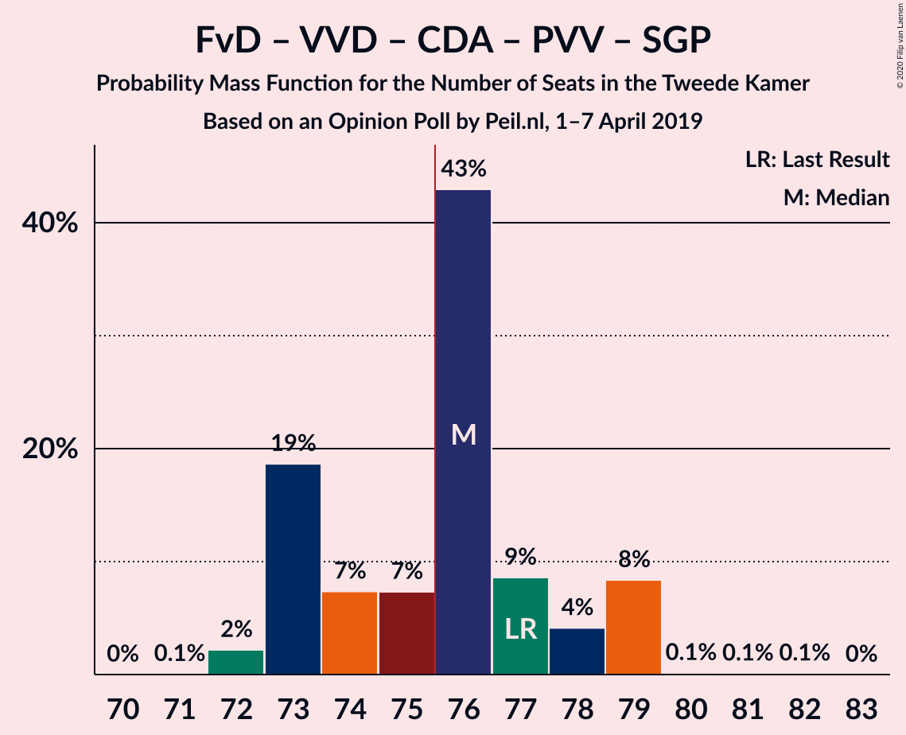

| Number of Seats | Probability | Accumulated | Special Marks |
|:---------------:|:-----------:|:-----------:|:-------------:|
| 70 | 0.1% | 100% |  |
| 71 | 0.3% | 99.9% |  |
| 72 | 0.3% | 99.6% |  |
| 73 | 9% | 99.4% |  |
| 74 | 15% | 91% |  |
| 75 | 35% | 75% | Median |
| 76 | 18% | 40% | Majority |
| 77 | 4% | 22% | Last Result |
| 78 | 12% | 19% |  |
| 79 | 6% | 6% |  |
| 80 | 0.1% | 0.3% |  |
| 81 | 0.2% | 0.2% |  |
| 82 | 0% | 0% |  |

### Forum voor Democratie – Volkspartij voor Vrijheid en Democratie – Christen-Democratisch Appèl – Partij voor de Vrijheid

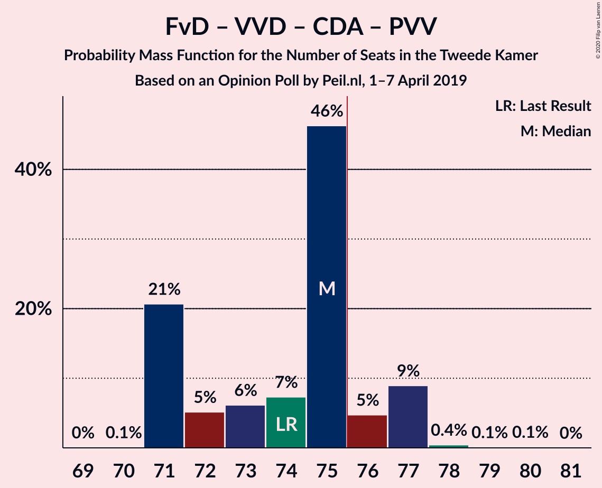

| Number of Seats | Probability | Accumulated | Special Marks |
|:---------------:|:-----------:|:-----------:|:-------------:|
| 69 | 0.3% | 100% |  |
| 70 | 0.2% | 99.7% |  |
| 71 | 9% | 99.5% |  |
| 72 | 15% | 91% |  |
| 73 | 14% | 76% | Median |
| 74 | 37% | 63% | Last Result |
| 75 | 6% | 25% |  |
| 76 | 10% | 20% | Majority |
| 77 | 8% | 10% |  |
| 78 | 2% | 2% |  |
| 79 | 0% | 0.2% |  |
| 80 | 0.2% | 0.2% |  |
| 81 | 0% | 0% |  |

### GroenLinks – Christen-Democratisch Appèl – Partij van de Arbeid – Democraten 66 – Socialistische Partij – ChristenUnie

| Number of Seats | Probability | Accumulated | Special Marks |
|:---------------:|:-----------:|:-----------:|:-------------:|
| 68 | 0.2% | 100% |  |
| 69 | 1.1% | 99.8% |  |
| 70 | 0.3% | 98.7% |  |
| 71 | 13% | 98% |  |
| 72 | 8% | 85% |  |
| 73 | 8% | 77% | Median |
| 74 | 51% | 69% |  |
| 75 | 3% | 18% |  |
| 76 | 14% | 16% | Majority |
| 77 | 0.6% | 1.2% |  |
| 78 | 0.4% | 0.6% |  |
| 79 | 0.2% | 0.2% |  |
| 80 | 0% | 0% | Last Result |

### Volkspartij voor Vrijheid en Democratie – GroenLinks – Christen-Democratisch Appèl – Democraten 66 – ChristenUnie

| Number of Seats | Probability | Accumulated | Special Marks |
|:---------------:|:-----------:|:-----------:|:-------------:|
| 68 | 0.1% | 100% |  |
| 69 | 0.5% | 99.9% |  |
| 70 | 0.5% | 99.5% |  |
| 71 | 2% | 99.0% |  |
| 72 | 4% | 97% |  |
| 73 | 46% | 93% | Median |
| 74 | 23% | 47% |  |
| 75 | 19% | 24% |  |
| 76 | 4% | 5% | Majority |
| 77 | 0.4% | 1.2% |  |
| 78 | 0.7% | 0.8% |  |
| 79 | 0% | 0% |  |
| 80 | 0% | 0% |  |
| 81 | 0% | 0% |  |
| 82 | 0% | 0% |  |
| 83 | 0% | 0% |  |
| 84 | 0% | 0% |  |
| 85 | 0% | 0% |  |
| 86 | 0% | 0% |  |
| 87 | 0% | 0% |  |
| 88 | 0% | 0% |  |
| 89 | 0% | 0% |  |
| 90 | 0% | 0% | Last Result |

### Forum voor Democratie – Volkspartij voor Vrijheid en Democratie – Christen-Democratisch Appèl – 50Plus – Staatkundig Gereformeerde Partij

| Number of Seats | Probability | Accumulated | Special Marks |
|:---------------:|:-----------:|:-----------:|:-------------:|
| 61 | 0% | 100% | Last Result |
| 62 | 0% | 100% |  |
| 63 | 0% | 100% |  |
| 64 | 0% | 100% |  |
| 65 | 0% | 100% |  |
| 66 | 0.1% | 100% |  |
| 67 | 0.1% | 99.9% |  |
| 68 | 0.5% | 99.8% |  |
| 69 | 0.9% | 99.3% |  |
| 70 | 44% | 98% |  |
| 71 | 4% | 54% | Median |
| 72 | 21% | 50% |  |
| 73 | 11% | 29% |  |
| 74 | 16% | 19% |  |
| 75 | 2% | 2% |  |
| 76 | 0.2% | 0.2% | Majority |
| 77 | 0% | 0% |  |

### Forum voor Democratie – Volkspartij voor Vrijheid en Democratie – Christen-Democratisch Appèl – 50Plus

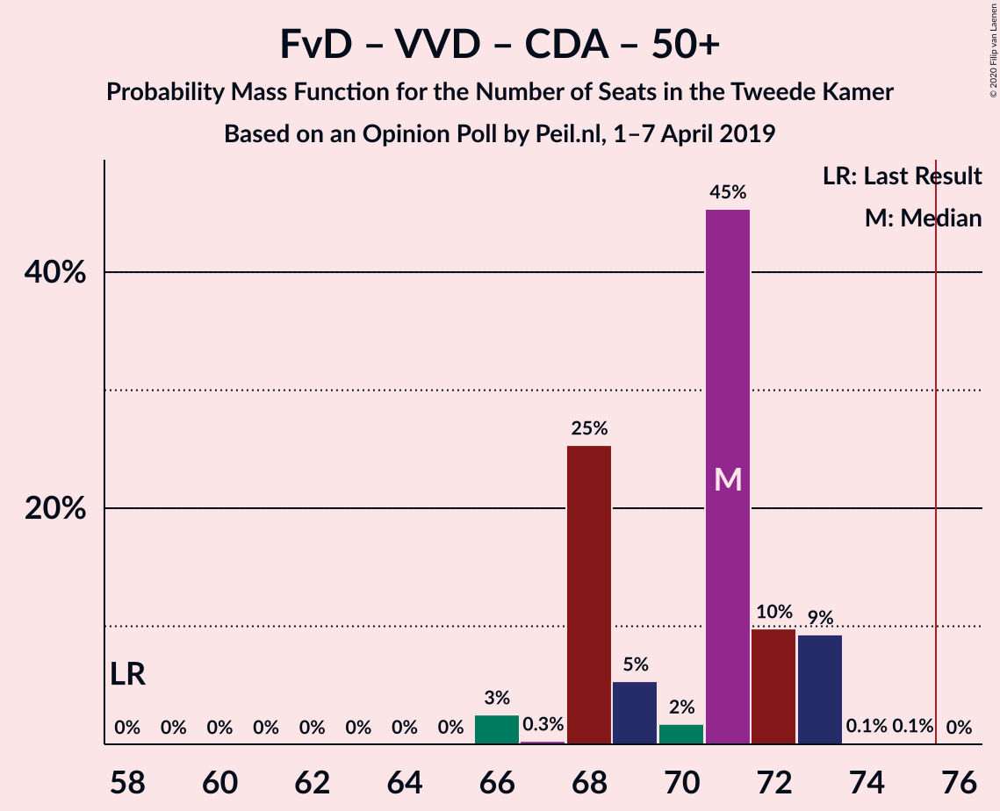

| Number of Seats | Probability | Accumulated | Special Marks |
|:---------------:|:-----------:|:-----------:|:-------------:|
| 58 | 0% | 100% | Last Result |
| 59 | 0% | 100% |  |
| 60 | 0% | 100% |  |
| 61 | 0% | 100% |  |
| 62 | 0% | 100% |  |
| 63 | 0% | 100% |  |
| 64 | 0.1% | 100% |  |
| 65 | 0% | 99.9% |  |
| 66 | 0.2% | 99.9% |  |
| 67 | 0.9% | 99.7% |  |
| 68 | 28% | 98.8% |  |
| 69 | 24% | 71% | Median |
| 70 | 5% | 46% |  |
| 71 | 17% | 42% |  |
| 72 | 19% | 24% |  |
| 73 | 5% | 5% |  |
| 74 | 0.1% | 0.3% |  |
| 75 | 0.2% | 0.2% |  |
| 76 | 0% | 0% | Majority |

### Volkspartij voor Vrijheid en Democratie – Christen-Democratisch Appèl – Partij van de Arbeid – Democraten 66 – ChristenUnie

| Number of Seats | Probability | Accumulated | Special Marks |
|:---------------:|:-----------:|:-----------:|:-------------:|
| 63 | 0.4% | 100% |  |
| 64 | 0.7% | 99.6% |  |
| 65 | 2% | 98.9% |  |
| 66 | 3% | 97% |  |
| 67 | 13% | 95% |  |
| 68 | 26% | 82% | Median |
| 69 | 30% | 56% |  |
| 70 | 14% | 26% |  |
| 71 | 6% | 12% |  |
| 72 | 6% | 6% |  |
| 73 | 0.1% | 0.1% |  |
| 74 | 0% | 0% |  |
| 75 | 0% | 0% |  |
| 76 | 0% | 0% | Majority |
| 77 | 0% | 0% |  |
| 78 | 0% | 0% |  |
| 79 | 0% | 0% |  |
| 80 | 0% | 0% |  |
| 81 | 0% | 0% |  |
| 82 | 0% | 0% |  |
| 83 | 0% | 0% |  |
| 84 | 0% | 0% |  |
| 85 | 0% | 0% | Last Result |

### Forum voor Democratie – Volkspartij voor Vrijheid en Democratie – Christen-Democratisch Appèl – Staatkundig Gereformeerde Partij

| Number of Seats | Probability | Accumulated | Special Marks |
|:---------------:|:-----------:|:-----------:|:-------------:|
| 57 | 0% | 100% | Last Result |
| 58 | 0% | 100% |  |
| 59 | 0% | 100% |  |
| 60 | 0% | 100% |  |
| 61 | 0% | 100% |  |
| 62 | 0% | 100% |  |
| 63 | 0.2% | 100% |  |
| 64 | 0.2% | 99.8% |  |
| 65 | 1.1% | 99.6% |  |
| 66 | 45% | 98.6% |  |
| 67 | 2% | 54% | Median |
| 68 | 21% | 51% |  |
| 69 | 8% | 30% |  |
| 70 | 15% | 22% |  |
| 71 | 5% | 7% |  |
| 72 | 2% | 2% |  |
| 73 | 0.2% | 0.2% |  |
| 74 | 0% | 0% |  |

### Forum voor Democratie – Volkspartij voor Vrijheid en Democratie – Christen-Democratisch Appèl

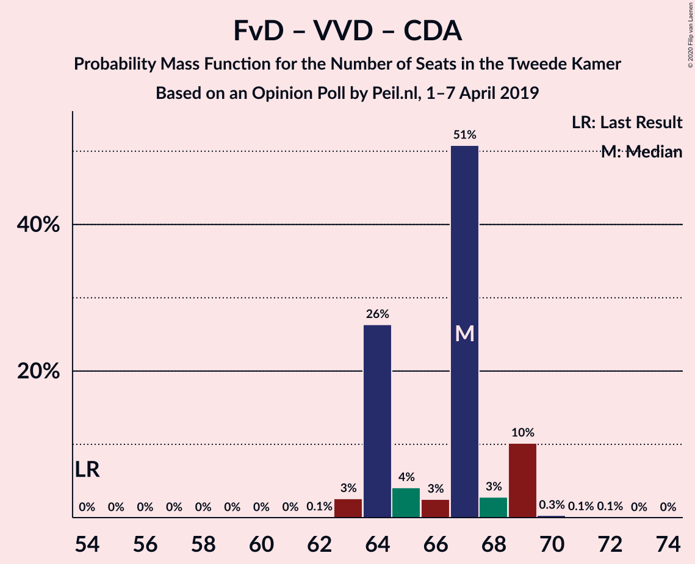

| Number of Seats | Probability | Accumulated | Special Marks |
|:---------------:|:-----------:|:-----------:|:-------------:|
| 54 | 0% | 100% | Last Result |
| 55 | 0% | 100% |  |
| 56 | 0% | 100% |  |
| 57 | 0% | 100% |  |
| 58 | 0% | 100% |  |
| 59 | 0% | 100% |  |
| 60 | 0% | 100% |  |
| 61 | 0.1% | 100% |  |
| 62 | 0.3% | 99.9% |  |
| 63 | 0.4% | 99.7% |  |
| 64 | 29% | 99.2% |  |
| 65 | 23% | 70% | Median |
| 66 | 4% | 47% |  |
| 67 | 18% | 43% |  |
| 68 | 12% | 25% |  |
| 69 | 11% | 13% |  |
| 70 | 2% | 2% |  |
| 71 | 0.1% | 0.2% |  |
| 72 | 0.1% | 0.1% |  |
| 73 | 0% | 0% |  |

### GroenLinks – Christen-Democratisch Appèl – Partij van de Arbeid – Democraten 66 – ChristenUnie

| Number of Seats | Probability | Accumulated | Special Marks |
|:---------------:|:-----------:|:-----------:|:-------------:|
| 58 | 0.1% | 100% |  |
| 59 | 0% | 99.9% |  |
| 60 | 0.5% | 99.9% |  |
| 61 | 1.3% | 99.4% |  |
| 62 | 17% | 98% |  |
| 63 | 2% | 81% |  |
| 64 | 28% | 79% | Median |
| 65 | 39% | 51% |  |
| 66 | 7% | 12% | Last Result |
| 67 | 2% | 5% |  |
| 68 | 3% | 3% |  |
| 69 | 0.1% | 0.2% |  |
| 70 | 0.1% | 0.1% |  |
| 71 | 0% | 0% |  |

### Volkspartij voor Vrijheid en Democratie – Christen-Democratisch Appèl – Democraten 66 – ChristenUnie

| Number of Seats | Probability | Accumulated | Special Marks |
|:---------------:|:-----------:|:-----------:|:-------------:|
| 50 | 0.4% | 100% |  |
| 51 | 0.1% | 99.6% |  |
| 52 | 1.1% | 99.5% |  |
| 53 | 2% | 98% |  |
| 54 | 14% | 97% |  |
| 55 | 37% | 83% | Median |
| 56 | 17% | 46% |  |
| 57 | 17% | 29% |  |
| 58 | 12% | 12% |  |
| 59 | 0.4% | 0.5% |  |
| 60 | 0.1% | 0.2% |  |
| 61 | 0% | 0% |  |
| 62 | 0% | 0% |  |
| 63 | 0% | 0% |  |
| 64 | 0% | 0% |  |
| 65 | 0% | 0% |  |
| 66 | 0% | 0% |  |
| 67 | 0% | 0% |  |
| 68 | 0% | 0% |  |
| 69 | 0% | 0% |  |
| 70 | 0% | 0% |  |
| 71 | 0% | 0% |  |
| 72 | 0% | 0% |  |
| 73 | 0% | 0% |  |
| 74 | 0% | 0% |  |
| 75 | 0% | 0% |  |
| 76 | 0% | 0% | Last Result, Majority |

### Volkspartij voor Vrijheid en Democratie – Christen-Democratisch Appèl – Partij van de Arbeid

| Number of Seats | Probability | Accumulated | Special Marks |
|:---------------:|:-----------:|:-----------:|:-------------:|
| 46 | 1.2% | 100% |  |
| 47 | 0.8% | 98.8% |  |
| 48 | 0.8% | 98% |  |
| 49 | 15% | 97% |  |
| 50 | 29% | 82% | Median |
| 51 | 36% | 53% |  |
| 52 | 3% | 17% |  |
| 53 | 8% | 14% |  |
| 54 | 6% | 6% |  |
| 55 | 0.2% | 0.2% |  |
| 56 | 0% | 0% |  |
| 57 | 0% | 0% |  |
| 58 | 0% | 0% |  |
| 59 | 0% | 0% |  |
| 60 | 0% | 0% |  |
| 61 | 0% | 0% | Last Result |

### Volkspartij voor Vrijheid en Democratie – Christen-Democratisch Appèl – Democraten 66

| Number of Seats | Probability | Accumulated | Special Marks |
|:---------------:|:-----------:|:-----------:|:-------------:|
| 44 | 0.1% | 100% |  |
| 45 | 0.7% | 99.9% |  |
| 46 | 10% | 99.2% |  |
| 47 | 8% | 89% |  |
| 48 | 31% | 81% | Median |
| 49 | 21% | 50% |  |
| 50 | 14% | 30% |  |
| 51 | 6% | 15% |  |
| 52 | 9% | 9% |  |
| 53 | 0% | 0% |  |
| 54 | 0% | 0% |  |
| 55 | 0% | 0% |  |
| 56 | 0% | 0% |  |
| 57 | 0% | 0% |  |
| 58 | 0% | 0% |  |
| 59 | 0% | 0% |  |
| 60 | 0% | 0% |  |
| 61 | 0% | 0% |  |
| 62 | 0% | 0% |  |
| 63 | 0% | 0% |  |
| 64 | 0% | 0% |  |
| 65 | 0% | 0% |  |
| 66 | 0% | 0% |  |
| 67 | 0% | 0% |  |
| 68 | 0% | 0% |  |
| 69 | 0% | 0% |  |
| 70 | 0% | 0% |  |
| 71 | 0% | 0% | Last Result |

### Volkspartij voor Vrijheid en Democratie – Partij van de Arbeid – Democraten 66

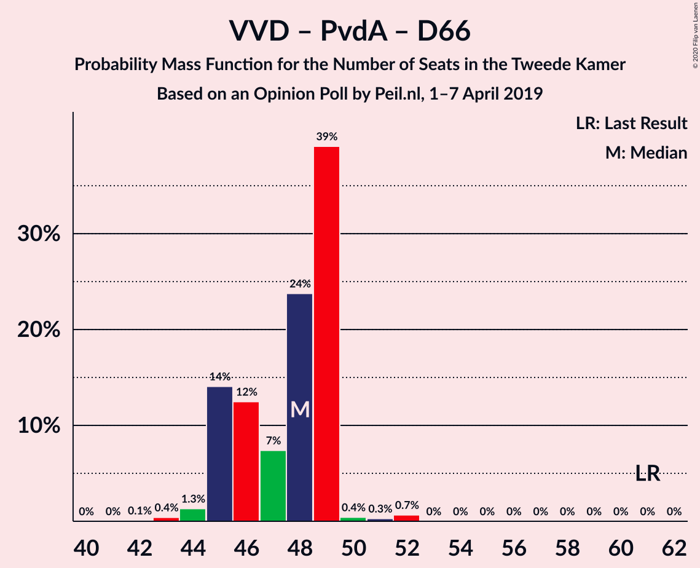

| Number of Seats | Probability | Accumulated | Special Marks |
|:---------------:|:-----------:|:-----------:|:-------------:|
| 42 | 0.2% | 100% |  |
| 43 | 2% | 99.7% |  |
| 44 | 4% | 98% |  |
| 45 | 31% | 94% |  |
| 46 | 17% | 63% | Median |
| 47 | 3% | 46% |  |
| 48 | 33% | 43% |  |
| 49 | 2% | 10% |  |
| 50 | 3% | 8% |  |
| 51 | 0.3% | 5% |  |
| 52 | 5% | 5% |  |
| 53 | 0% | 0% |  |
| 54 | 0% | 0% |  |
| 55 | 0% | 0% |  |
| 56 | 0% | 0% |  |
| 57 | 0% | 0% |  |
| 58 | 0% | 0% |  |
| 59 | 0% | 0% |  |
| 60 | 0% | 0% |  |
| 61 | 0% | 0% | Last Result |

### Volkspartij voor Vrijheid en Democratie – Christen-Democratisch Appèl – Partij voor de Vrijheid

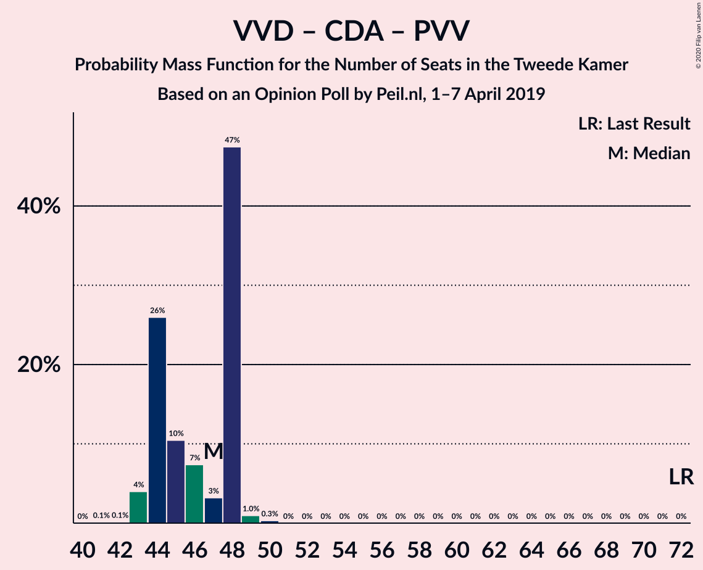

| Number of Seats | Probability | Accumulated | Special Marks |
|:---------------:|:-----------:|:-----------:|:-------------:|
| 41 | 0.1% | 100% |  |
| 42 | 0.3% | 99.9% |  |
| 43 | 11% | 99.5% |  |
| 44 | 10% | 89% |  |
| 45 | 29% | 78% | Median |
| 46 | 31% | 50% |  |
| 47 | 13% | 19% |  |
| 48 | 1.4% | 6% |  |
| 49 | 4% | 5% |  |
| 50 | 0.2% | 0.3% |  |
| 51 | 0% | 0% |  |
| 52 | 0% | 0% |  |
| 53 | 0% | 0% |  |
| 54 | 0% | 0% |  |
| 55 | 0% | 0% |  |
| 56 | 0% | 0% |  |
| 57 | 0% | 0% |  |
| 58 | 0% | 0% |  |
| 59 | 0% | 0% |  |
| 60 | 0% | 0% |  |
| 61 | 0% | 0% |  |
| 62 | 0% | 0% |  |
| 63 | 0% | 0% |  |
| 64 | 0% | 0% |  |
| 65 | 0% | 0% |  |
| 66 | 0% | 0% |  |
| 67 | 0% | 0% |  |
| 68 | 0% | 0% |  |
| 69 | 0% | 0% |  |
| 70 | 0% | 0% |  |
| 71 | 0% | 0% |  |
| 72 | 0% | 0% | Last Result |

### Christen-Democratisch Appèl – Partij van de Arbeid – Democraten 66

| Number of Seats | Probability | Accumulated | Special Marks |
|:---------------:|:-----------:|:-----------:|:-------------:|
| 35 | 0.4% | 100% |  |
| 36 | 3% | 99.6% |  |
| 37 | 3% | 96% |  |
| 38 | 24% | 93% |  |
| 39 | 11% | 69% | Median |
| 40 | 47% | 59% |  |
| 41 | 6% | 12% |  |
| 42 | 5% | 6% |  |
| 43 | 0.8% | 0.9% |  |
| 44 | 0.1% | 0.1% |  |
| 45 | 0% | 0% |  |
| 46 | 0% | 0% |  |
| 47 | 0% | 0% | Last Result |

### Volkspartij voor Vrijheid en Democratie – Christen-Democratisch Appèl

| Number of Seats | Probability | Accumulated | Special Marks |
|:---------------:|:-----------:|:-----------:|:-------------:|
| 34 | 0.2% | 100% |  |
| 35 | 3% | 99.8% |  |
| 36 | 16% | 97% |  |
| 37 | 31% | 82% | Median |
| 38 | 33% | 51% |  |
| 39 | 7% | 18% |  |
| 40 | 10% | 11% |  |
| 41 | 0.5% | 0.5% |  |
| 42 | 0% | 0.1% |  |
| 43 | 0% | 0% |  |
| 44 | 0% | 0% |  |
| 45 | 0% | 0% |  |
| 46 | 0% | 0% |  |
| 47 | 0% | 0% |  |
| 48 | 0% | 0% |  |
| 49 | 0% | 0% |  |
| 50 | 0% | 0% |  |
| 51 | 0% | 0% |  |
| 52 | 0% | 0% | Last Result |

### Volkspartij voor Vrijheid en Democratie – Partij van de Arbeid

| Number of Seats | Probability | Accumulated | Special Marks |
|:---------------:|:-----------:|:-----------:|:-------------:|
| 31 | 0.1% | 100% |  |
| 32 | 4% | 99.9% |  |
| 33 | 3% | 96% |  |
| 34 | 30% | 93% |  |
| 35 | 18% | 63% | Median |
| 36 | 17% | 45% |  |
| 37 | 11% | 28% |  |
| 38 | 12% | 17% |  |
| 39 | 0.2% | 5% |  |
| 40 | 5% | 5% |  |
| 41 | 0% | 0% |  |
| 42 | 0% | 0% | Last Result |

### Christen-Democratisch Appèl – Partij van de Arbeid – ChristenUnie

| Number of Seats | Probability | Accumulated | Special Marks |
|:---------------:|:-----------:|:-----------:|:-------------:|
| 30 | 0.1% | 100% |  |
| 31 | 0.2% | 99.9% |  |
| 32 | 2% | 99.7% |  |
| 33 | 11% | 98% | Last Result |
| 34 | 20% | 87% |  |
| 35 | 20% | 66% | Median |
| 36 | 36% | 46% |  |
| 37 | 7% | 10% |  |
| 38 | 3% | 3% |  |
| 39 | 0.8% | 0.8% |  |
| 40 | 0% | 0% |  |

### Christen-Democratisch Appèl – Partij van de Arbeid

| Number of Seats | Probability | Accumulated | Special Marks |
|:---------------:|:-----------:|:-----------:|:-------------:|
| 24 | 0.1% | 100% |  |
| 25 | 2% | 99.9% |  |
| 26 | 2% | 98% |  |
| 27 | 21% | 96% |  |
| 28 | 38% | 76% | Last Result, Median |
| 29 | 28% | 37% |  |
| 30 | 5% | 9% |  |
| 31 | 3% | 4% |  |
| 32 | 0.4% | 0.4% |  |
| 33 | 0% | 0% |  |

### Christen-Democratisch Appèl – Democraten 66

| Number of Seats | Probability | Accumulated | Special Marks |
|:---------------:|:-----------:|:-----------:|:-------------:|
| 22 | 0.1% | 100% |  |
| 23 | 9% | 99.9% |  |
| 24 | 2% | 91% |  |
| 25 | 11% | 88% |  |
| 26 | 26% | 77% | Median |
| 27 | 40% | 52% |  |
| 28 | 6% | 11% |  |
| 29 | 2% | 5% |  |
| 30 | 3% | 3% |  |
| 31 | 0% | 0% |  |
| 32 | 0% | 0% |  |
| 33 | 0% | 0% |  |
| 34 | 0% | 0% |  |
| 35 | 0% | 0% |  |
| 36 | 0% | 0% |  |
| 37 | 0% | 0% |  |
| 38 | 0% | 0% | Last Result |

## Technical Information

### Opinion Poll

+ **Polling firm:** Peil.nl
+ **Commissioner(s):** —
+ **Fieldwork period:** 1–7 April 2019

### Calculations

+ **Sample size:** 3000
+ **Simulations done:** 524,288
+ **Error estimate:** 1.52%

