# Opinion Poll by I&O Research, 19–24 April 2019

<a href="#voting-intentions">Voting Intentions</a> | <a href="#seats">Seats</a> | <a href="#coalitions">Coalitions</a> | <a href="#technical-information">Technical Information</a>

## Voting Intentions

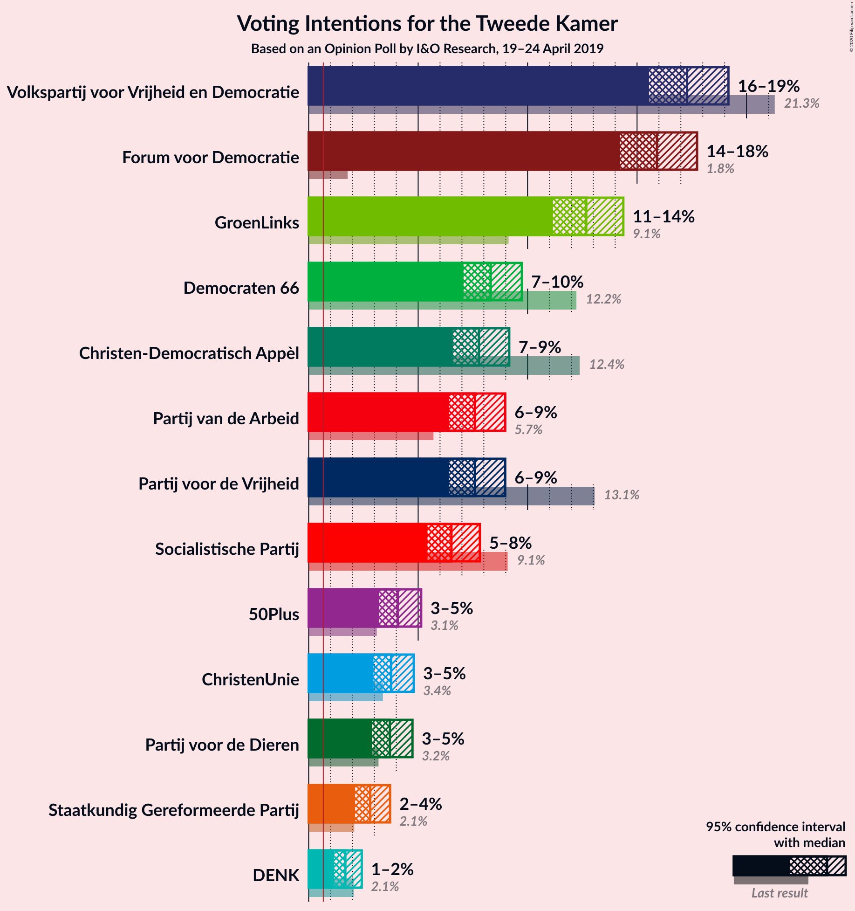

### Confidence Intervals

| Party | Last Result | Poll Result | 80% Confidence Interval | 90% Confidence Interval | 95% Confidence Interval | 99% Confidence Interval |
|:-----:|:-----------:|:-----------:|:-----------------------:|:-----------------------:|:-----------------------:|:-----------------------:|
| Volkspartij voor Vrijheid en Democratie | 21.3% | 17.3% | 16.1–18.5% |15.8–18.9% |15.5–19.2% |15.0–19.8% |
| Forum voor Democratie | 1.8% | 15.9% | 14.8–17.1% |14.5–17.5% |14.2–17.7% |13.7–18.3% |
| GroenLinks | 9.1% | 12.7% | 11.7–13.8% |11.4–14.1% |11.2–14.4% |10.7–14.9% |
| Democraten 66 | 12.2% | 8.3% | 7.5–9.3% |7.3–9.5% |7.1–9.7% |6.7–10.2% |
| Christen-Democratisch Appèl | 12.4% | 7.8% | 7.0–8.7% |6.8–8.9% |6.6–9.2% |6.2–9.6% |
| Partij voor de Vrijheid | 13.1% | 7.6% | 6.8–8.5% |6.6–8.7% |6.4–9.0% |6.1–9.4% |
| Partij van de Arbeid | 5.7% | 7.6% | 6.8–8.5% |6.6–8.7% |6.4–9.0% |6.1–9.4% |
| Socialistische Partij | 9.1% | 6.5% | 5.8–7.4% |5.6–7.6% |5.4–7.8% |5.1–8.2% |
| 50Plus | 3.1% | 4.1% | 3.5–4.8% |3.4–5.0% |3.2–5.1% |3.0–5.5% |
| ChristenUnie | 3.4% | 3.8% | 3.2–4.4% |3.1–4.6% |3.0–4.8% |2.7–5.1% |
| Partij voor de Dieren | 3.2% | 3.7% | 3.2–4.4% |3.0–4.6% |2.9–4.7% |2.7–5.1% |
| Staatkundig Gereformeerde Partij | 2.1% | 2.8% | 2.3–3.4% |2.2–3.6% |2.1–3.7% |1.9–4.0% |
| DENK | 2.1% | 1.7% | 1.3–2.2% |1.2–2.3% |1.2–2.4% |1.0–2.7% |

*Note:* The poll result column reflects the actual value used in the calculations. Published results may vary slightly, and in addition be rounded to fewer digits.

## Seats

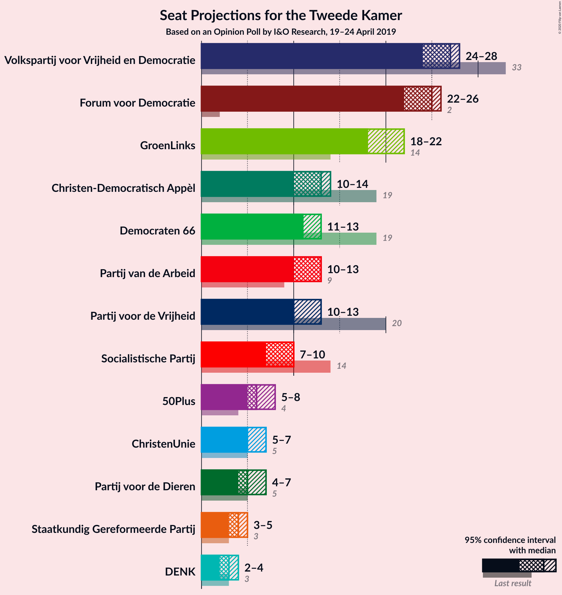

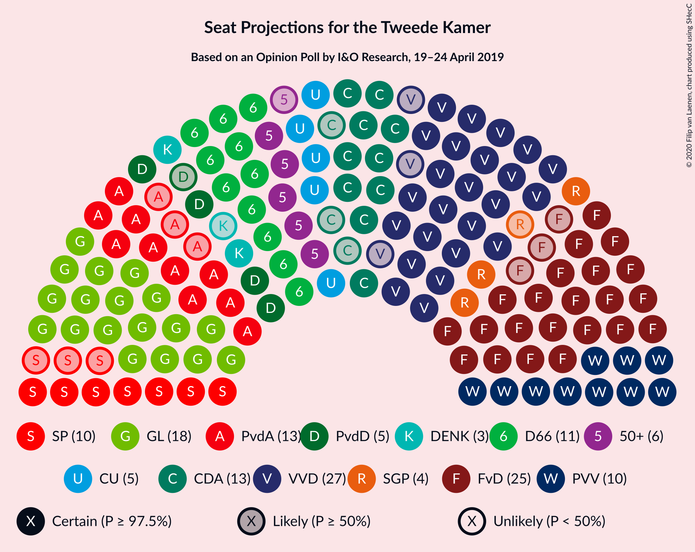

### Confidence Intervals

| Party | Last Result | Median | 80% Confidence Interval | 90% Confidence Interval | 95% Confidence Interval | 99% Confidence Interval |
|:-----:|:-----------:|:------:|:-----------------------:|:-----------------------:|:-----------------------:|:-----------------------:|
| <a href="#volkspartij-voor-vrijheid-en-democratie">Volkspartij voor Vrijheid en Democratie</a> | 33 | 27 | 26–28 |24–28 |24–28 |24–28 |
| <a href="#forum-voor-democratie">Forum voor Democratie</a> | 2 | 25 | 23–26 |23–26 |22–26 |22–27 |
| <a href="#groenlinks">GroenLinks</a> | 14 | 18 | 18–21 |18–22 |18–22 |17–22 |
| <a href="#democraten-66">Democraten 66</a> | 19 | 11 | 11–12 |11–13 |11–13 |9–14 |
| <a href="#christen-democratisch-appèl">Christen-Democratisch Appèl</a> | 19 | 13 | 10–13 |10–13 |10–14 |10–14 |
| <a href="#partij-voor-de-vrijheid">Partij voor de Vrijheid</a> | 20 | 10 | 10–12 |10–13 |10–13 |10–13 |
| <a href="#partij-van-de-arbeid">Partij van de Arbeid</a> | 9 | 13 | 11–13 |10–13 |10–13 |9–14 |
| <a href="#socialistische-partij">Socialistische Partij</a> | 14 | 10 | 9–10 |8–10 |7–10 |7–11 |
| <a href="#50plus">50Plus</a> | 4 | 6 | 5–6 |5–6 |5–8 |5–8 |
| <a href="#christenunie">ChristenUnie</a> | 5 | 5 | 5–7 |5–7 |5–7 |5–8 |
| <a href="#partij-voor-de-dieren">Partij voor de Dieren</a> | 5 | 5 | 5–7 |5–7 |4–7 |4–7 |
| <a href="#staatkundig-gereformeerde-partij">Staatkundig Gereformeerde Partij</a> | 3 | 4 | 3–5 |3–5 |3–5 |3–5 |
| <a href="#denk">DENK</a> | 3 | 3 | 2–3 |2–3 |2–4 |1–4 |

### Volkspartij voor Vrijheid en Democratie

*For a full overview of the results for this party, see the [Volkspartij voor Vrijheid en Democratie](party-volkspartijvoorvrijheidendemocratie.html) page.*

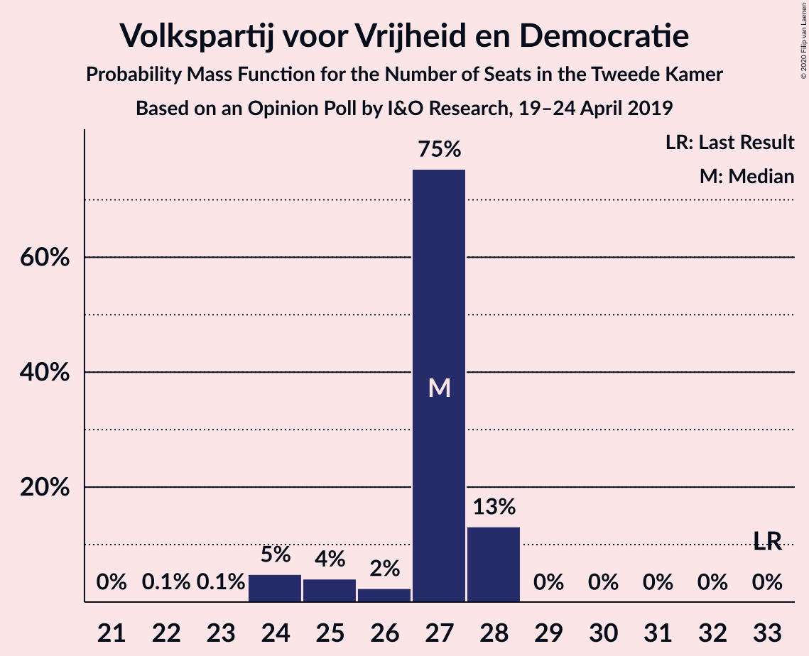

| Number of Seats | Probability | Accumulated | Special Marks |
|:---------------:|:-----------:|:-----------:|:-------------:|
| 22 | 0.1% | 100% |  |
| 23 | 0.1% | 99.9% |  |
| 24 | 5% | 99.8% |  |
| 25 | 4% | 95% |  |
| 26 | 2% | 91% |  |
| 27 | 75% | 89% | Median |
| 28 | 13% | 13% |  |
| 29 | 0% | 0% |  |
| 30 | 0% | 0% |  |
| 31 | 0% | 0% |  |
| 32 | 0% | 0% |  |
| 33 | 0% | 0% | Last Result |

### Forum voor Democratie

*For a full overview of the results for this party, see the [Forum voor Democratie](party-forumvoordemocratie.html) page.*

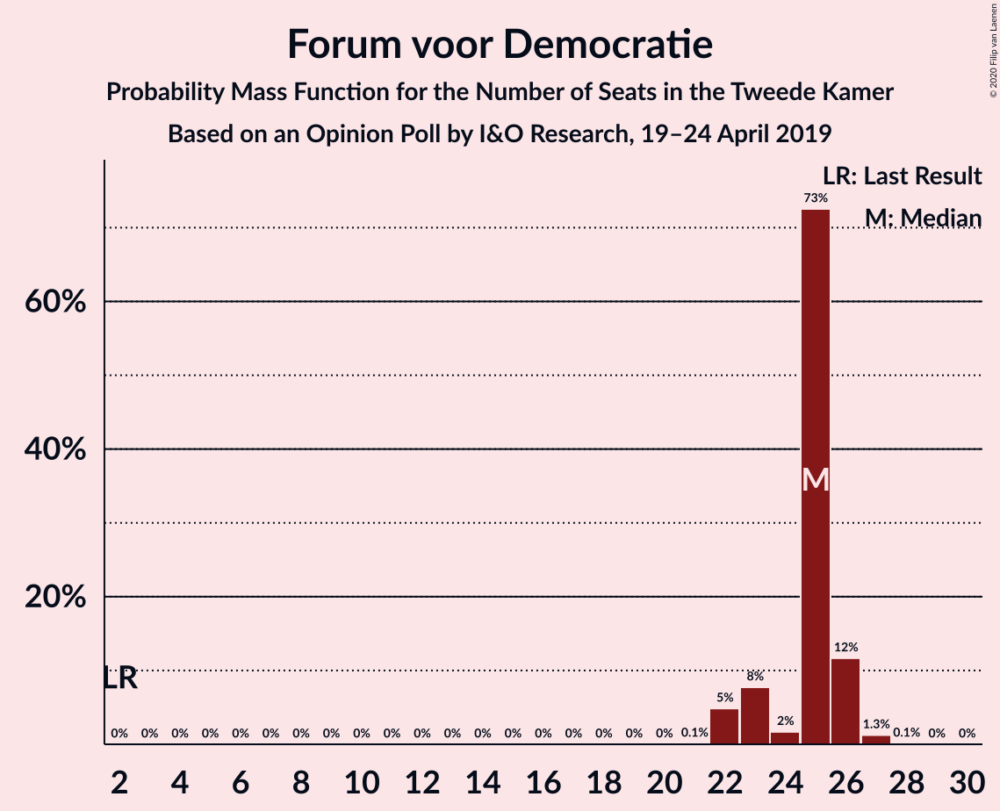

| Number of Seats | Probability | Accumulated | Special Marks |
|:---------------:|:-----------:|:-----------:|:-------------:|
| 2 | 0% | 100% | Last Result |
| 3 | 0% | 100% |  |
| 4 | 0% | 100% |  |
| 5 | 0% | 100% |  |
| 6 | 0% | 100% |  |
| 7 | 0% | 100% |  |
| 8 | 0% | 100% |  |
| 9 | 0% | 100% |  |
| 10 | 0% | 100% |  |
| 11 | 0% | 100% |  |
| 12 | 0% | 100% |  |
| 13 | 0% | 100% |  |
| 14 | 0% | 100% |  |
| 15 | 0% | 100% |  |
| 16 | 0% | 100% |  |
| 17 | 0% | 100% |  |
| 18 | 0% | 100% |  |
| 19 | 0% | 100% |  |
| 20 | 0% | 100% |  |
| 21 | 0.1% | 100% |  |
| 22 | 5% | 99.9% |  |
| 23 | 8% | 95% |  |
| 24 | 2% | 87% |  |
| 25 | 73% | 86% | Median |
| 26 | 12% | 13% |  |
| 27 | 1.3% | 1.4% |  |
| 28 | 0.1% | 0.1% |  |
| 29 | 0% | 0% |  |

### GroenLinks

*For a full overview of the results for this party, see the [GroenLinks](party-groenlinks.html) page.*

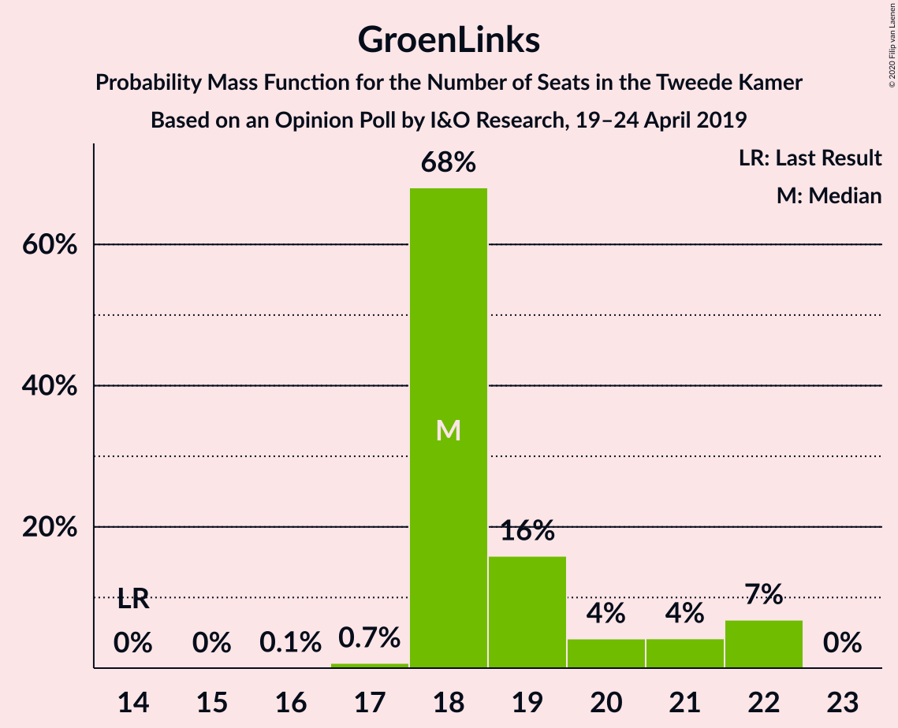

| Number of Seats | Probability | Accumulated | Special Marks |
|:---------------:|:-----------:|:-----------:|:-------------:|
| 14 | 0% | 100% | Last Result |
| 15 | 0% | 100% |  |
| 16 | 0.1% | 100% |  |
| 17 | 0.7% | 99.9% |  |
| 18 | 68% | 99.2% | Median |
| 19 | 16% | 31% |  |
| 20 | 4% | 15% |  |
| 21 | 4% | 11% |  |
| 22 | 7% | 7% |  |
| 23 | 0% | 0% |  |

### Democraten 66

*For a full overview of the results for this party, see the [Democraten 66](party-democraten66.html) page.*

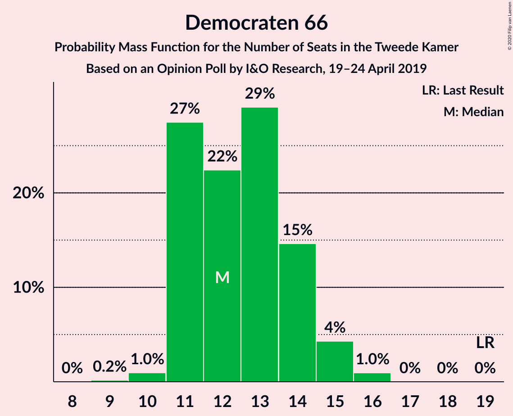

| Number of Seats | Probability | Accumulated | Special Marks |
|:---------------:|:-----------:|:-----------:|:-------------:|
| 9 | 0.5% | 100% |  |
| 10 | 0.9% | 99.5% |  |
| 11 | 71% | 98.6% | Median |
| 12 | 20% | 28% |  |
| 13 | 6% | 8% |  |
| 14 | 2% | 2% |  |
| 15 | 0.1% | 0.1% |  |
| 16 | 0% | 0% |  |
| 17 | 0% | 0% |  |
| 18 | 0% | 0% |  |
| 19 | 0% | 0% | Last Result |

### Christen-Democratisch Appèl

*For a full overview of the results for this party, see the [Christen-Democratisch Appèl](party-christen-democratischappèl.html) page.*

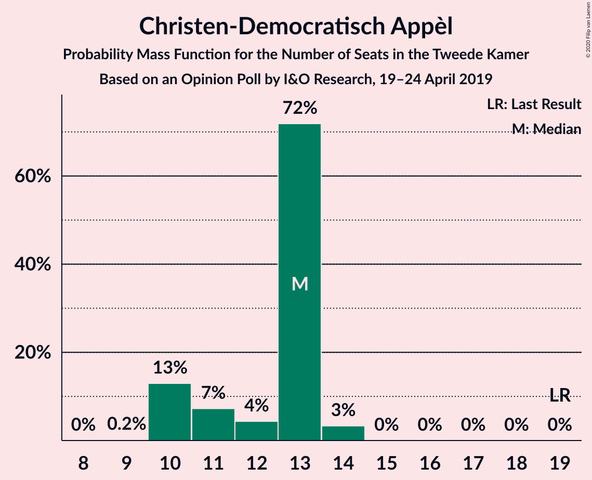

| Number of Seats | Probability | Accumulated | Special Marks |
|:---------------:|:-----------:|:-----------:|:-------------:|
| 9 | 0.2% | 100% |  |
| 10 | 13% | 99.8% |  |
| 11 | 7% | 87% |  |
| 12 | 4% | 80% |  |
| 13 | 72% | 75% | Median |
| 14 | 3% | 3% |  |
| 15 | 0% | 0% |  |
| 16 | 0% | 0% |  |
| 17 | 0% | 0% |  |
| 18 | 0% | 0% |  |
| 19 | 0% | 0% | Last Result |

### Partij voor de Vrijheid

*For a full overview of the results for this party, see the [Partij voor de Vrijheid](party-partijvoordevrijheid.html) page.*

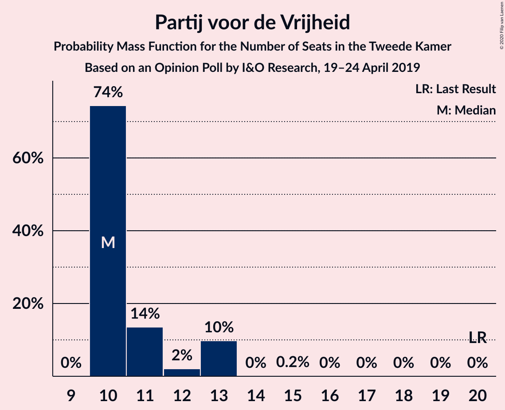

| Number of Seats | Probability | Accumulated | Special Marks |
|:---------------:|:-----------:|:-----------:|:-------------:|
| 10 | 74% | 100% | Median |
| 11 | 14% | 26% |  |
| 12 | 2% | 12% |  |
| 13 | 10% | 10% |  |
| 14 | 0% | 0.2% |  |
| 15 | 0.2% | 0.2% |  |
| 16 | 0% | 0% |  |
| 17 | 0% | 0% |  |
| 18 | 0% | 0% |  |
| 19 | 0% | 0% |  |
| 20 | 0% | 0% | Last Result |

### Partij van de Arbeid

*For a full overview of the results for this party, see the [Partij van de Arbeid](party-partijvandearbeid.html) page.*

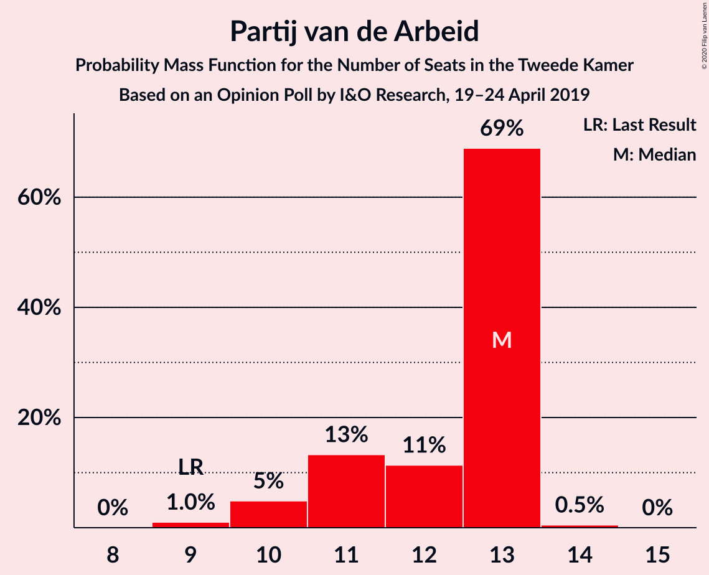

| Number of Seats | Probability | Accumulated | Special Marks |
|:---------------:|:-----------:|:-----------:|:-------------:|
| 9 | 1.0% | 100% | Last Result |
| 10 | 5% | 99.0% |  |
| 11 | 13% | 94% |  |
| 12 | 11% | 81% |  |
| 13 | 69% | 69% | Median |
| 14 | 0.5% | 0.5% |  |
| 15 | 0% | 0% |  |

### Socialistische Partij

*For a full overview of the results for this party, see the [Socialistische Partij](party-socialistischepartij.html) page.*

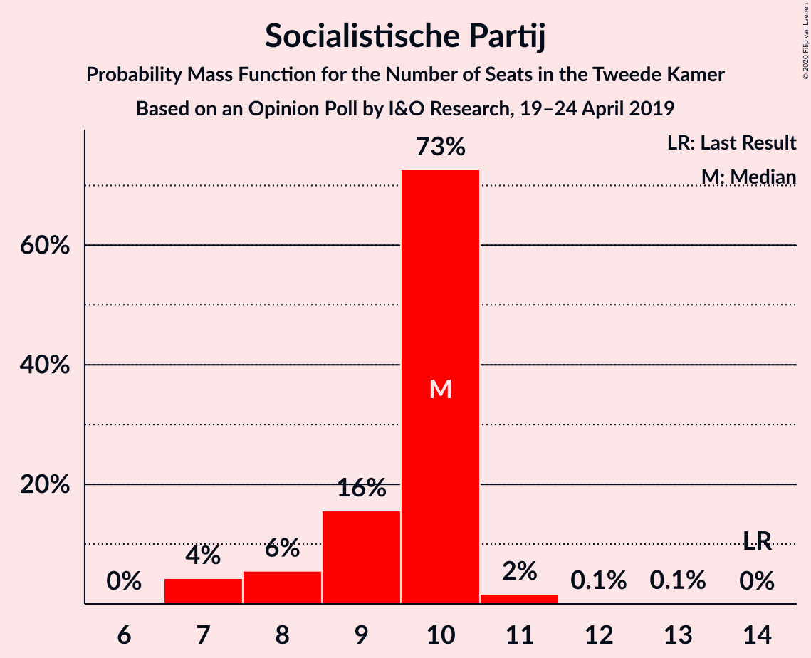

| Number of Seats | Probability | Accumulated | Special Marks |
|:---------------:|:-----------:|:-----------:|:-------------:|
| 7 | 4% | 100% |  |
| 8 | 6% | 96% |  |
| 9 | 16% | 90% |  |
| 10 | 73% | 75% | Median |
| 11 | 2% | 2% |  |
| 12 | 0.1% | 0.3% |  |
| 13 | 0.1% | 0.1% |  |
| 14 | 0% | 0% | Last Result |

### 50Plus

*For a full overview of the results for this party, see the [50Plus](party-50plus.html) page.*

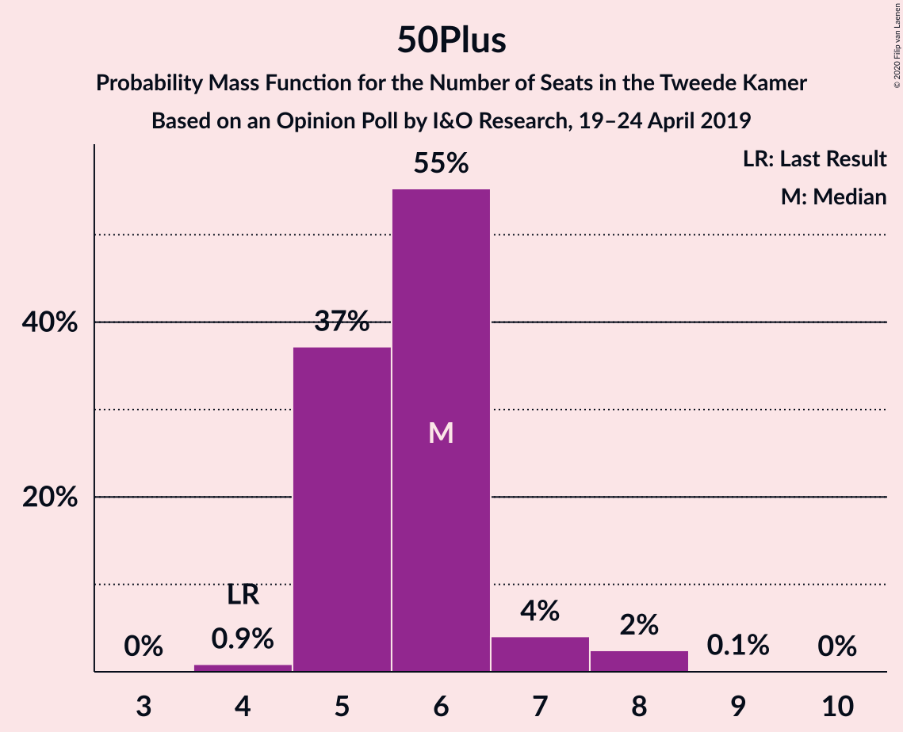

| Number of Seats | Probability | Accumulated | Special Marks |
|:---------------:|:-----------:|:-----------:|:-------------:|
| 4 | 0.2% | 100% | Last Result |
| 5 | 18% | 99.8% |  |
| 6 | 78% | 82% | Median |
| 7 | 1.2% | 4% |  |
| 8 | 3% | 3% |  |
| 9 | 0% | 0% |  |

### ChristenUnie

*For a full overview of the results for this party, see the [ChristenUnie](party-christenunie.html) page.*

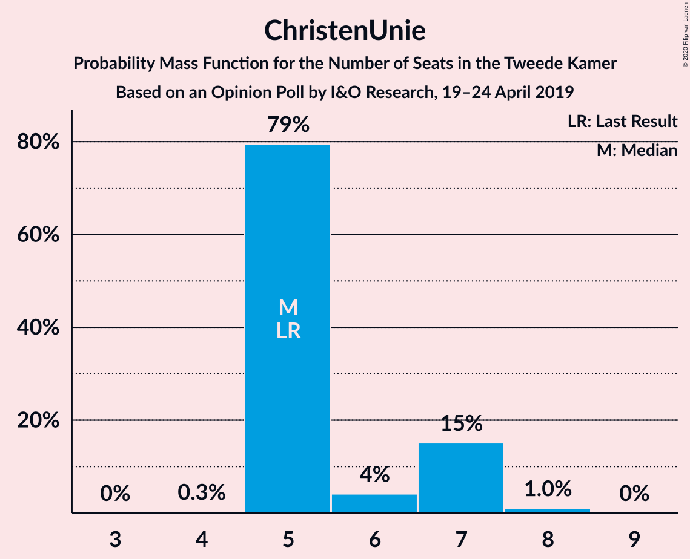

| Number of Seats | Probability | Accumulated | Special Marks |
|:---------------:|:-----------:|:-----------:|:-------------:|
| 4 | 0.3% | 100% |  |
| 5 | 79% | 99.7% | Last Result, Median |
| 6 | 4% | 20% |  |
| 7 | 15% | 16% |  |
| 8 | 1.0% | 1.0% |  |
| 9 | 0% | 0% |  |

### Partij voor de Dieren

*For a full overview of the results for this party, see the [Partij voor de Dieren](party-partijvoordedieren.html) page.*

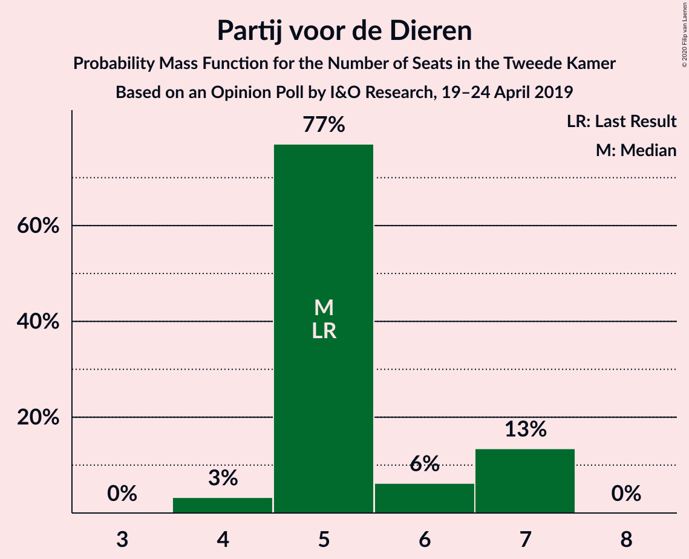

| Number of Seats | Probability | Accumulated | Special Marks |
|:---------------:|:-----------:|:-----------:|:-------------:|
| 4 | 3% | 100% |  |
| 5 | 77% | 97% | Last Result, Median |
| 6 | 6% | 20% |  |
| 7 | 13% | 13% |  |
| 8 | 0% | 0% |  |

### Staatkundig Gereformeerde Partij

*For a full overview of the results for this party, see the [Staatkundig Gereformeerde Partij](party-staatkundiggereformeerdepartij.html) page.*

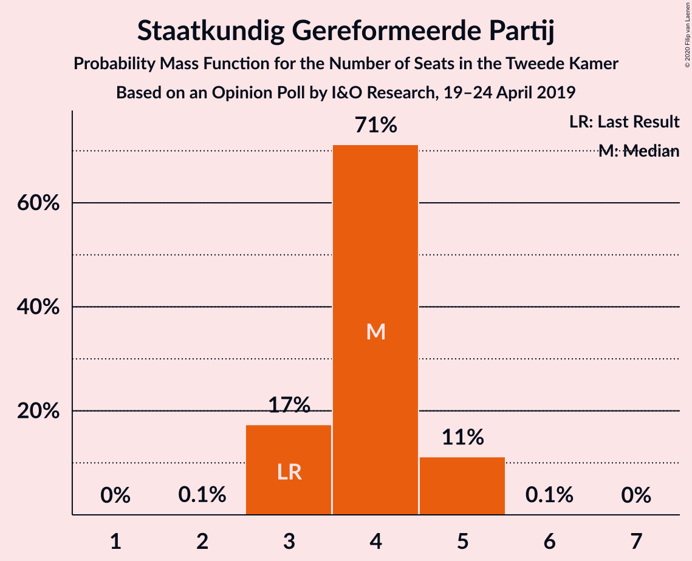

| Number of Seats | Probability | Accumulated | Special Marks |
|:---------------:|:-----------:|:-----------:|:-------------:|
| 2 | 0.1% | 100% |  |
| 3 | 17% | 99.9% | Last Result |
| 4 | 71% | 83% | Median |
| 5 | 11% | 11% |  |
| 6 | 0.1% | 0.1% |  |
| 7 | 0% | 0% |  |

### DENK

*For a full overview of the results for this party, see the [DENK](party-denk.html) page.*

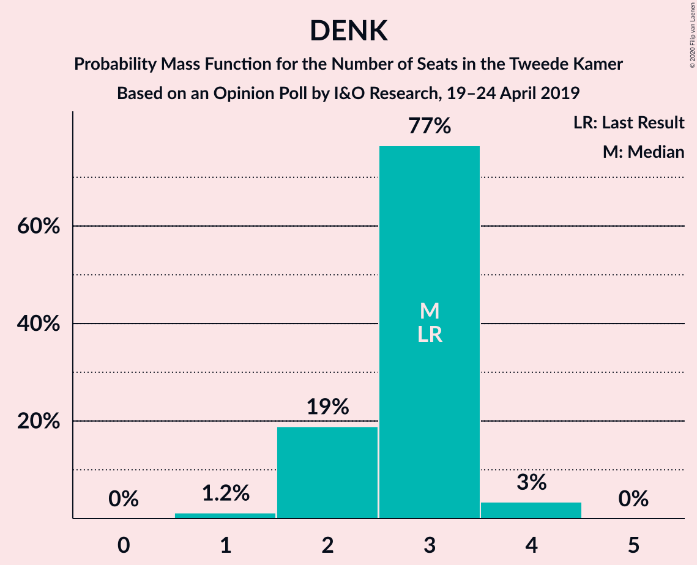

| Number of Seats | Probability | Accumulated | Special Marks |
|:---------------:|:-----------:|:-----------:|:-------------:|
| 1 | 1.2% | 100% |  |
| 2 | 19% | 98.8% |  |
| 3 | 77% | 80% | Last Result, Median |
| 4 | 3% | 3% |  |
| 5 | 0% | 0% |  |

## Coalitions

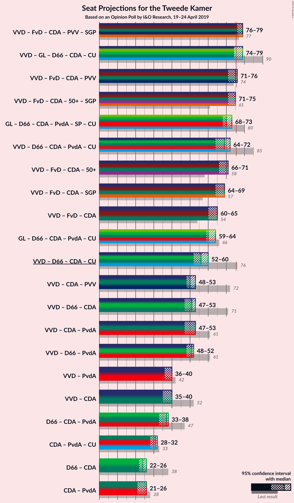

### Confidence Intervals

| Coalition | Last Result | Median | Majority? | 80% Confidence Interval | 90% Confidence Interval | 95% Confidence Interval | 99% Confidence Interval |
|:---------:|:-----------:|:------:|:---------:|:-----------------------:|:-----------------------:|:-----------------------:|:-----------------------:|
| Volkspartij voor Vrijheid en Democratie – Forum voor Democratie – Christen-Democratisch Appèl – Partij voor de Vrijheid – Staatkundig Gereformeerde Partij | 77 | 79 | 98% | 77–79 | 76–79 | 76–79 | 74–81 |
| Volkspartij voor Vrijheid en Democratie – GroenLinks – Democraten 66 – Christen-Democratisch Appèl – ChristenUnie | 90 | 74 | 25% | 74–77 | 74–78 | 74–79 | 70–79 |
| Volkspartij voor Vrijheid en Democratie – Forum voor Democratie – Christen-Democratisch Appèl – Partij voor de Vrijheid | 74 | 75 | 6% | 72–75 | 72–76 | 71–76 | 71–77 |
| Volkspartij voor Vrijheid en Democratie – Forum voor Democratie – Christen-Democratisch Appèl – 50Plus – Staatkundig Gereformeerde Partij | 61 | 75 | 0.1% | 72–75 | 71–75 | 71–75 | 69–75 |
| GroenLinks – Democraten 66 – Christen-Democratisch Appèl – Partij van de Arbeid – Socialistische Partij – ChristenUnie | 80 | 70 | 0% | 68–71 | 68–71 | 68–73 | 67–73 |
| Volkspartij voor Vrijheid en Democratie – Democraten 66 – Christen-Democratisch Appèl – Partij van de Arbeid – ChristenUnie | 85 | 69 | 0% | 66–69 | 65–69 | 64–72 | 64–72 |
| Volkspartij voor Vrijheid en Democratie – Forum voor Democratie – Christen-Democratisch Appèl – 50Plus | 58 | 71 | 0% | 67–71 | 66–71 | 66–71 | 65–71 |
| Volkspartij voor Vrijheid en Democratie – Forum voor Democratie – Christen-Democratisch Appèl – Staatkundig Gereformeerde Partij | 57 | 69 | 0% | 66–69 | 65–69 | 64–69 | 63–69 |
| Volkspartij voor Vrijheid en Democratie – Forum voor Democratie – Christen-Democratisch Appèl | 54 | 65 | 0% | 61–65 | 60–65 | 60–65 | 60–65 |
| GroenLinks – Democraten 66 – Christen-Democratisch Appèl – Partij van de Arbeid – ChristenUnie | 66 | 60 | 0% | 59–62 | 59–64 | 59–64 | 57–64 |
| Volkspartij voor Vrijheid en Democratie – Democraten 66 – Christen-Democratisch Appèl – ChristenUnie | 76 | 56 | 0% | 56–57 | 54–57 | 52–60 | 51–60 |
| Volkspartij voor Vrijheid en Democratie – Christen-Democratisch Appèl – Partij voor de Vrijheid | 72 | 50 | 0% | 49–50 | 48–50 | 48–53 | 47–53 |
| Volkspartij voor Vrijheid en Democratie – Democraten 66 – Christen-Democratisch Appèl | 71 | 51 | 0% | 50–51 | 48–51 | 47–53 | 46–53 |
| Volkspartij voor Vrijheid en Democratie – Christen-Democratisch Appèl – Partij van de Arbeid | 61 | 53 | 0% | 49–53 | 47–53 | 47–53 | 47–53 |
| Volkspartij voor Vrijheid en Democratie – Democraten 66 – Partij van de Arbeid | 61 | 51 | 0% | 49–51 | 48–51 | 48–52 | 47–53 |
| Volkspartij voor Vrijheid en Democratie – Partij van de Arbeid | 42 | 40 | 0% | 37–40 | 36–40 | 36–40 | 34–40 |
| Volkspartij voor Vrijheid en Democratie – Christen-Democratisch Appèl | 52 | 40 | 0% | 38–40 | 36–40 | 35–40 | 35–40 |
| Democraten 66 – Christen-Democratisch Appèl – Partij van de Arbeid | 47 | 37 | 0% | 33–37 | 33–38 | 33–38 | 32–38 |
| Christen-Democratisch Appèl – Partij van de Arbeid – ChristenUnie | 33 | 31 | 0% | 28–31 | 28–31 | 28–32 | 27–32 |
| Democraten 66 – Christen-Democratisch Appèl | 38 | 24 | 0% | 22–24 | 22–26 | 22–26 | 20–26 |
| Christen-Democratisch Appèl – Partij van de Arbeid | 28 | 26 | 0% | 21–26 | 21–26 | 21–26 | 20–26 |

### Volkspartij voor Vrijheid en Democratie – Forum voor Democratie – Christen-Democratisch Appèl – Partij voor de Vrijheid – Staatkundig Gereformeerde Partij

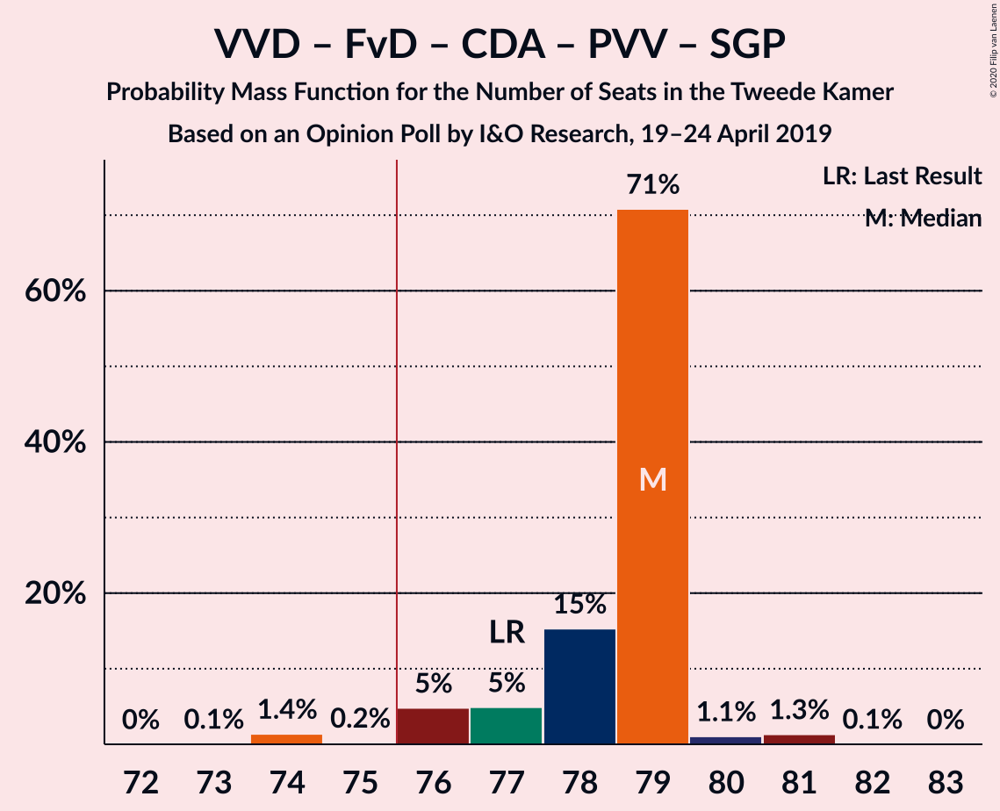

| Number of Seats | Probability | Accumulated | Special Marks |
|:---------------:|:-----------:|:-----------:|:-------------:|
| 73 | 0.1% | 100% |  |
| 74 | 1.4% | 99.9% |  |
| 75 | 0.2% | 98.5% |  |
| 76 | 5% | 98% | Majority |
| 77 | 5% | 94% | Last Result |
| 78 | 15% | 89% |  |
| 79 | 71% | 73% | Median |
| 80 | 1.1% | 2% |  |
| 81 | 1.3% | 1.4% |  |
| 82 | 0.1% | 0.1% |  |
| 83 | 0% | 0% |  |

### Volkspartij voor Vrijheid en Democratie – GroenLinks – Democraten 66 – Christen-Democratisch Appèl – ChristenUnie

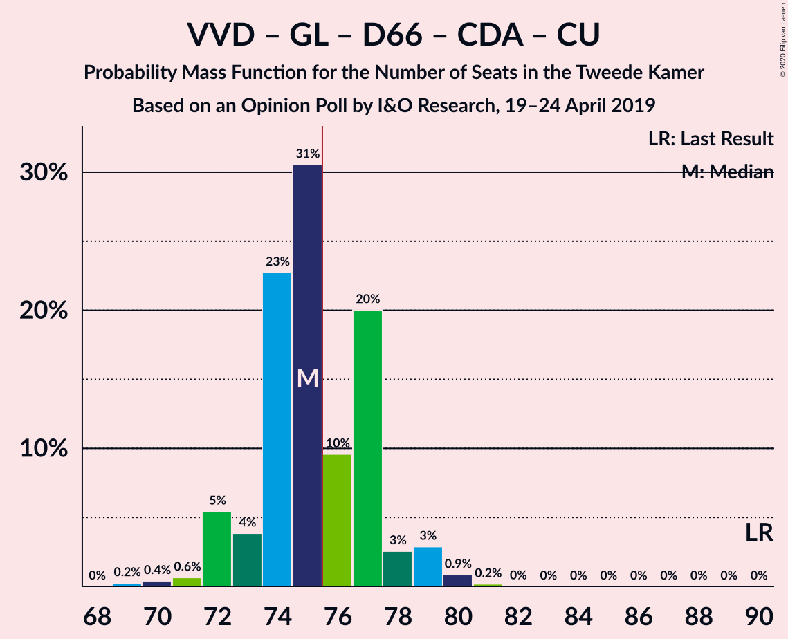

| Number of Seats | Probability | Accumulated | Special Marks |
|:---------------:|:-----------:|:-----------:|:-------------:|
| 70 | 0.8% | 100% |  |
| 71 | 0.6% | 99.1% |  |
| 72 | 0.3% | 98.6% |  |
| 73 | 0.4% | 98% |  |
| 74 | 71% | 98% | Median |
| 75 | 2% | 27% |  |
| 76 | 13% | 25% | Majority |
| 77 | 4% | 11% |  |
| 78 | 3% | 7% |  |
| 79 | 4% | 4% |  |
| 80 | 0.1% | 0.1% |  |
| 81 | 0% | 0% |  |
| 82 | 0% | 0% |  |
| 83 | 0% | 0% |  |
| 84 | 0% | 0% |  |
| 85 | 0% | 0% |  |
| 86 | 0% | 0% |  |
| 87 | 0% | 0% |  |
| 88 | 0% | 0% |  |
| 89 | 0% | 0% |  |
| 90 | 0% | 0% | Last Result |

### Volkspartij voor Vrijheid en Democratie – Forum voor Democratie – Christen-Democratisch Appèl – Partij voor de Vrijheid

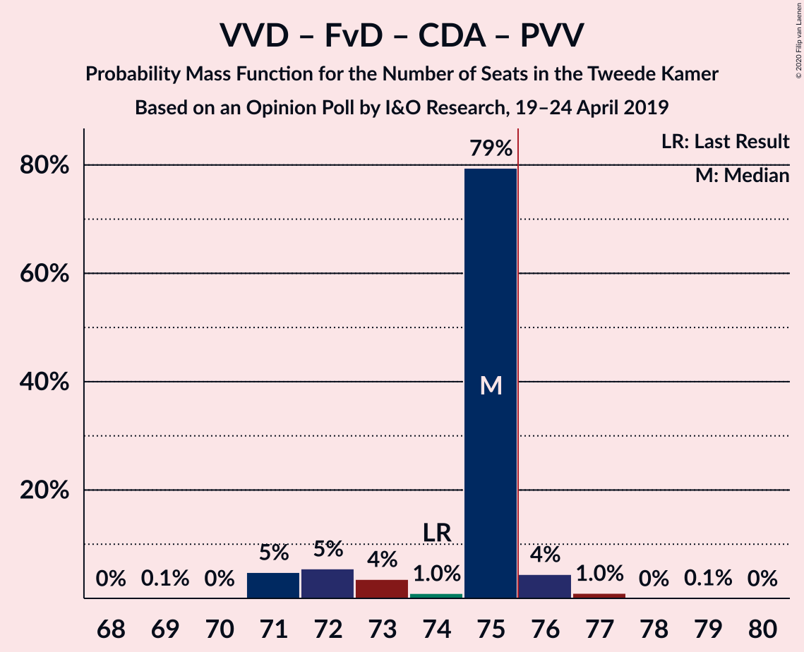

| Number of Seats | Probability | Accumulated | Special Marks |
|:---------------:|:-----------:|:-----------:|:-------------:|
| 69 | 0.1% | 100% |  |
| 70 | 0% | 99.9% |  |
| 71 | 5% | 99.9% |  |
| 72 | 5% | 95% |  |
| 73 | 4% | 90% |  |
| 74 | 1.0% | 86% | Last Result |
| 75 | 79% | 85% | Median |
| 76 | 4% | 6% | Majority |
| 77 | 1.0% | 1.1% |  |
| 78 | 0% | 0.2% |  |
| 79 | 0.1% | 0.2% |  |
| 80 | 0% | 0% |  |

### Volkspartij voor Vrijheid en Democratie – Forum voor Democratie – Christen-Democratisch Appèl – 50Plus – Staatkundig Gereformeerde Partij

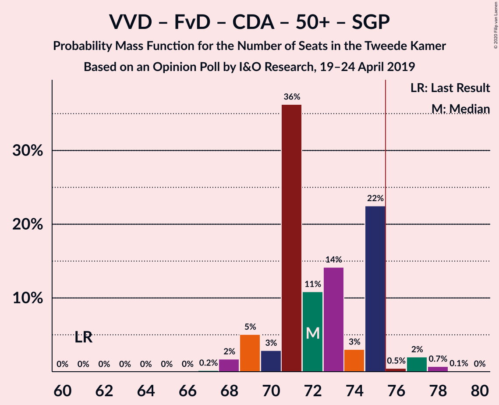

| Number of Seats | Probability | Accumulated | Special Marks |
|:---------------:|:-----------:|:-----------:|:-------------:|
| 61 | 0% | 100% | Last Result |
| 62 | 0% | 100% |  |
| 63 | 0% | 100% |  |
| 64 | 0% | 100% |  |
| 65 | 0% | 100% |  |
| 66 | 0% | 100% |  |
| 67 | 0.1% | 100% |  |
| 68 | 0.1% | 99.9% |  |
| 69 | 1.0% | 99.8% |  |
| 70 | 0.6% | 98.8% |  |
| 71 | 5% | 98% |  |
| 72 | 23% | 93% |  |
| 73 | 1.2% | 70% |  |
| 74 | 0.8% | 69% |  |
| 75 | 68% | 68% | Median |
| 76 | 0.1% | 0.1% | Majority |
| 77 | 0% | 0% |  |

### GroenLinks – Democraten 66 – Christen-Democratisch Appèl – Partij van de Arbeid – Socialistische Partij – ChristenUnie

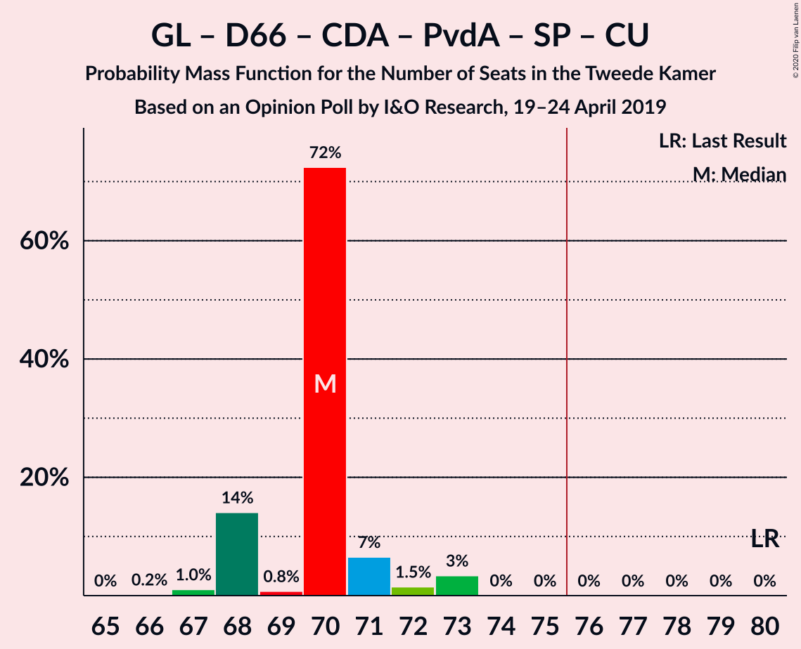

| Number of Seats | Probability | Accumulated | Special Marks |
|:---------------:|:-----------:|:-----------:|:-------------:|
| 66 | 0.2% | 100% |  |
| 67 | 1.0% | 99.8% |  |
| 68 | 14% | 98.7% |  |
| 69 | 0.8% | 85% |  |
| 70 | 72% | 84% | Median |
| 71 | 7% | 11% |  |
| 72 | 1.5% | 5% |  |
| 73 | 3% | 3% |  |
| 74 | 0% | 0.1% |  |
| 75 | 0% | 0% |  |
| 76 | 0% | 0% | Majority |
| 77 | 0% | 0% |  |
| 78 | 0% | 0% |  |
| 79 | 0% | 0% |  |
| 80 | 0% | 0% | Last Result |

### Volkspartij voor Vrijheid en Democratie – Democraten 66 – Christen-Democratisch Appèl – Partij van de Arbeid – ChristenUnie

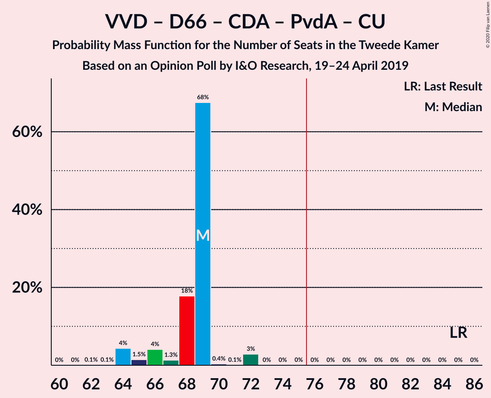

| Number of Seats | Probability | Accumulated | Special Marks |
|:---------------:|:-----------:|:-----------:|:-------------:|
| 62 | 0.1% | 100% |  |
| 63 | 0.1% | 99.9% |  |
| 64 | 4% | 99.8% |  |
| 65 | 1.5% | 95% |  |
| 66 | 4% | 94% |  |
| 67 | 1.3% | 90% |  |
| 68 | 18% | 89% |  |
| 69 | 68% | 71% | Median |
| 70 | 0.4% | 3% |  |
| 71 | 0.1% | 3% |  |
| 72 | 3% | 3% |  |
| 73 | 0% | 0.1% |  |
| 74 | 0% | 0% |  |
| 75 | 0% | 0% |  |
| 76 | 0% | 0% | Majority |
| 77 | 0% | 0% |  |
| 78 | 0% | 0% |  |
| 79 | 0% | 0% |  |
| 80 | 0% | 0% |  |
| 81 | 0% | 0% |  |
| 82 | 0% | 0% |  |
| 83 | 0% | 0% |  |
| 84 | 0% | 0% |  |
| 85 | 0% | 0% | Last Result |

### Volkspartij voor Vrijheid en Democratie – Forum voor Democratie – Christen-Democratisch Appèl – 50Plus

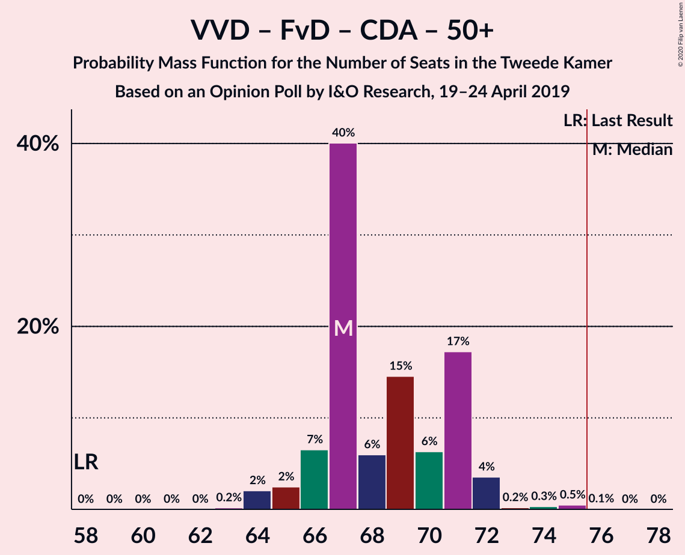

| Number of Seats | Probability | Accumulated | Special Marks |
|:---------------:|:-----------:|:-----------:|:-------------:|
| 58 | 0% | 100% | Last Result |
| 59 | 0% | 100% |  |
| 60 | 0% | 100% |  |
| 61 | 0% | 100% |  |
| 62 | 0% | 100% |  |
| 63 | 0.1% | 100% |  |
| 64 | 0.1% | 99.9% |  |
| 65 | 0.6% | 99.8% |  |
| 66 | 5% | 99.2% |  |
| 67 | 7% | 95% |  |
| 68 | 3% | 88% |  |
| 69 | 15% | 84% |  |
| 70 | 0.9% | 69% |  |
| 71 | 68% | 68% | Median |
| 72 | 0% | 0% |  |

### Volkspartij voor Vrijheid en Democratie – Forum voor Democratie – Christen-Democratisch Appèl – Staatkundig Gereformeerde Partij

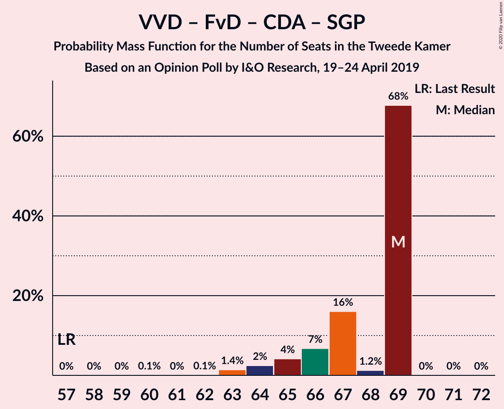

| Number of Seats | Probability | Accumulated | Special Marks |
|:---------------:|:-----------:|:-----------:|:-------------:|
| 57 | 0% | 100% | Last Result |
| 58 | 0% | 100% |  |
| 59 | 0% | 100% |  |
| 60 | 0.1% | 100% |  |
| 61 | 0% | 99.9% |  |
| 62 | 0.1% | 99.9% |  |
| 63 | 1.4% | 99.8% |  |
| 64 | 2% | 98% |  |
| 65 | 4% | 96% |  |
| 66 | 7% | 92% |  |
| 67 | 16% | 85% |  |
| 68 | 1.2% | 69% |  |
| 69 | 68% | 68% | Median |
| 70 | 0% | 0.1% |  |
| 71 | 0% | 0.1% |  |
| 72 | 0% | 0% |  |

### Volkspartij voor Vrijheid en Democratie – Forum voor Democratie – Christen-Democratisch Appèl

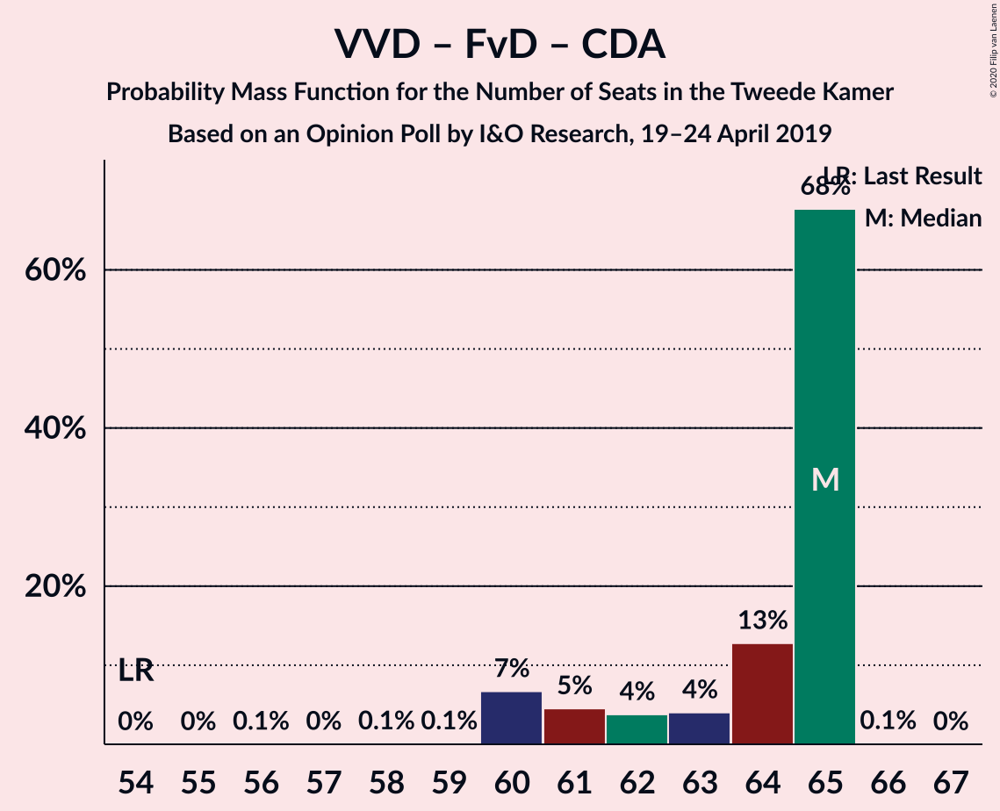

| Number of Seats | Probability | Accumulated | Special Marks |
|:---------------:|:-----------:|:-----------:|:-------------:|
| 54 | 0% | 100% | Last Result |
| 55 | 0% | 100% |  |
| 56 | 0.1% | 100% |  |
| 57 | 0% | 99.9% |  |
| 58 | 0.1% | 99.9% |  |
| 59 | 0.1% | 99.8% |  |
| 60 | 7% | 99.7% |  |
| 61 | 5% | 93% |  |
| 62 | 4% | 88% |  |
| 63 | 4% | 85% |  |
| 64 | 13% | 81% |  |
| 65 | 68% | 68% | Median |
| 66 | 0.1% | 0.2% |  |
| 67 | 0% | 0% |  |

### GroenLinks – Democraten 66 – Christen-Democratisch Appèl – Partij van de Arbeid – ChristenUnie

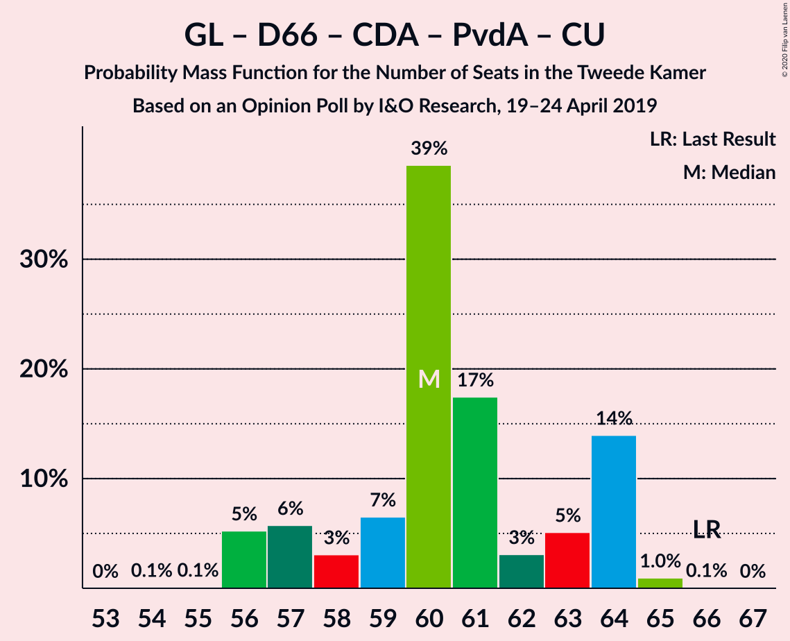

| Number of Seats | Probability | Accumulated | Special Marks |
|:---------------:|:-----------:|:-----------:|:-------------:|
| 56 | 0.1% | 100% |  |
| 57 | 1.0% | 99.9% |  |
| 58 | 0.5% | 98.9% |  |
| 59 | 12% | 98% |  |
| 60 | 69% | 86% | Median |
| 61 | 6% | 17% |  |
| 62 | 5% | 11% |  |
| 63 | 0% | 6% |  |
| 64 | 6% | 6% |  |
| 65 | 0.1% | 0.1% |  |
| 66 | 0% | 0% | Last Result |

### Volkspartij voor Vrijheid en Democratie – Democraten 66 – Christen-Democratisch Appèl – ChristenUnie

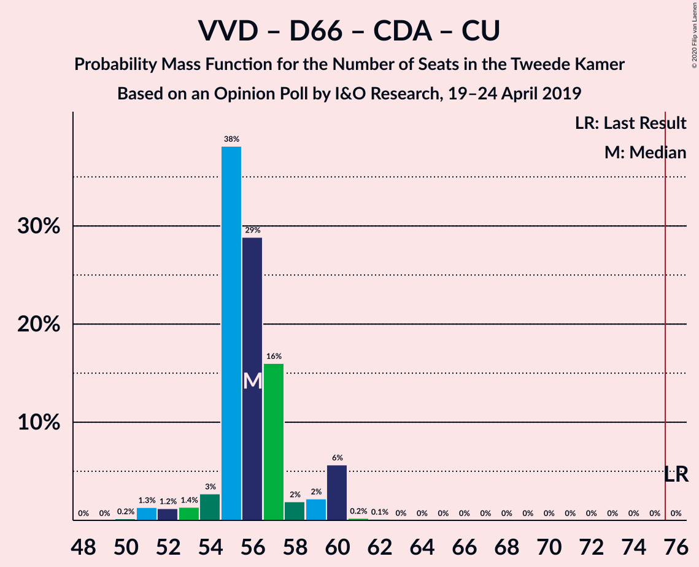

| Number of Seats | Probability | Accumulated | Special Marks |
|:---------------:|:-----------:|:-----------:|:-------------:|
| 51 | 0.9% | 100% |  |
| 52 | 4% | 99.1% |  |
| 53 | 0.1% | 96% |  |
| 54 | 1.0% | 95% |  |
| 55 | 2% | 94% |  |
| 56 | 77% | 93% | Median |
| 57 | 12% | 16% |  |
| 58 | 0.1% | 4% |  |
| 59 | 1.0% | 4% |  |
| 60 | 3% | 3% |  |
| 61 | 0% | 0.1% |  |
| 62 | 0% | 0% |  |
| 63 | 0% | 0% |  |
| 64 | 0% | 0% |  |
| 65 | 0% | 0% |  |
| 66 | 0% | 0% |  |
| 67 | 0% | 0% |  |
| 68 | 0% | 0% |  |
| 69 | 0% | 0% |  |
| 70 | 0% | 0% |  |
| 71 | 0% | 0% |  |
| 72 | 0% | 0% |  |
| 73 | 0% | 0% |  |
| 74 | 0% | 0% |  |
| 75 | 0% | 0% |  |
| 76 | 0% | 0% | Last Result, Majority |

### Volkspartij voor Vrijheid en Democratie – Christen-Democratisch Appèl – Partij voor de Vrijheid

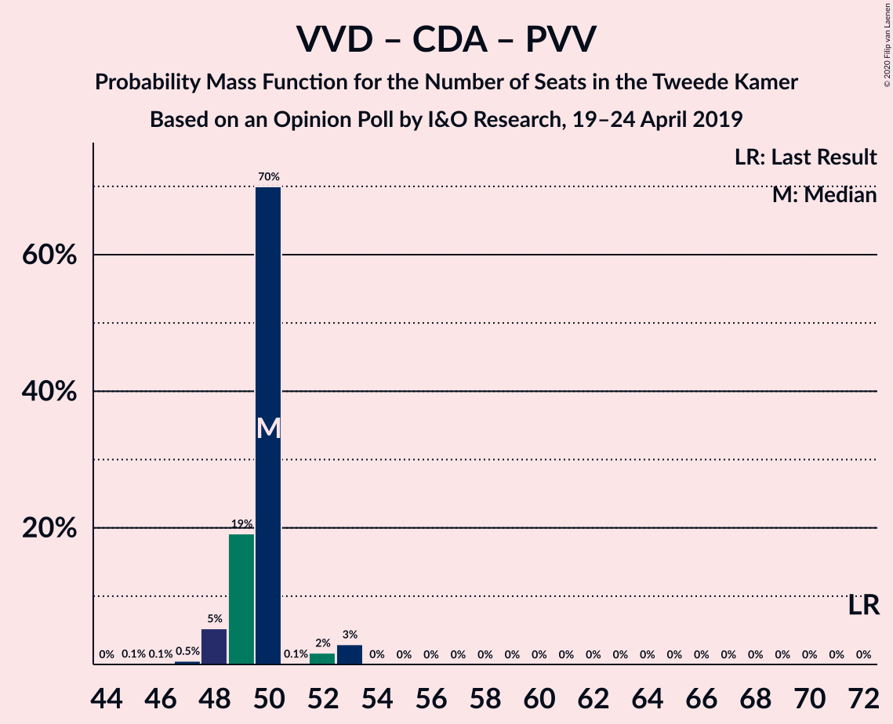

| Number of Seats | Probability | Accumulated | Special Marks |
|:---------------:|:-----------:|:-----------:|:-------------:|
| 45 | 0.1% | 100% |  |
| 46 | 0.1% | 99.8% |  |
| 47 | 0.5% | 99.7% |  |
| 48 | 5% | 99.2% |  |
| 49 | 19% | 94% |  |
| 50 | 70% | 75% | Median |
| 51 | 0.1% | 5% |  |
| 52 | 2% | 5% |  |
| 53 | 3% | 3% |  |
| 54 | 0% | 0% |  |
| 55 | 0% | 0% |  |
| 56 | 0% | 0% |  |
| 57 | 0% | 0% |  |
| 58 | 0% | 0% |  |
| 59 | 0% | 0% |  |
| 60 | 0% | 0% |  |
| 61 | 0% | 0% |  |
| 62 | 0% | 0% |  |
| 63 | 0% | 0% |  |
| 64 | 0% | 0% |  |
| 65 | 0% | 0% |  |
| 66 | 0% | 0% |  |
| 67 | 0% | 0% |  |
| 68 | 0% | 0% |  |
| 69 | 0% | 0% |  |
| 70 | 0% | 0% |  |
| 71 | 0% | 0% |  |
| 72 | 0% | 0% | Last Result |

### Volkspartij voor Vrijheid en Democratie – Democraten 66 – Christen-Democratisch Appèl

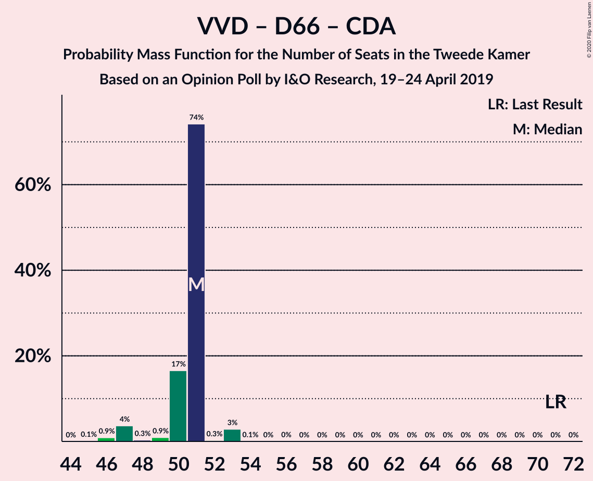

| Number of Seats | Probability | Accumulated | Special Marks |
|:---------------:|:-----------:|:-----------:|:-------------:|
| 45 | 0.1% | 100% |  |
| 46 | 0.9% | 99.9% |  |
| 47 | 4% | 99.0% |  |
| 48 | 0.3% | 95% |  |
| 49 | 0.9% | 95% |  |
| 50 | 17% | 94% |  |
| 51 | 74% | 77% | Median |
| 52 | 0.3% | 3% |  |
| 53 | 3% | 3% |  |
| 54 | 0.1% | 0.1% |  |
| 55 | 0% | 0.1% |  |
| 56 | 0% | 0% |  |
| 57 | 0% | 0% |  |
| 58 | 0% | 0% |  |
| 59 | 0% | 0% |  |
| 60 | 0% | 0% |  |
| 61 | 0% | 0% |  |
| 62 | 0% | 0% |  |
| 63 | 0% | 0% |  |
| 64 | 0% | 0% |  |
| 65 | 0% | 0% |  |
| 66 | 0% | 0% |  |
| 67 | 0% | 0% |  |
| 68 | 0% | 0% |  |
| 69 | 0% | 0% |  |
| 70 | 0% | 0% |  |
| 71 | 0% | 0% | Last Result |

### Volkspartij voor Vrijheid en Democratie – Christen-Democratisch Appèl – Partij van de Arbeid

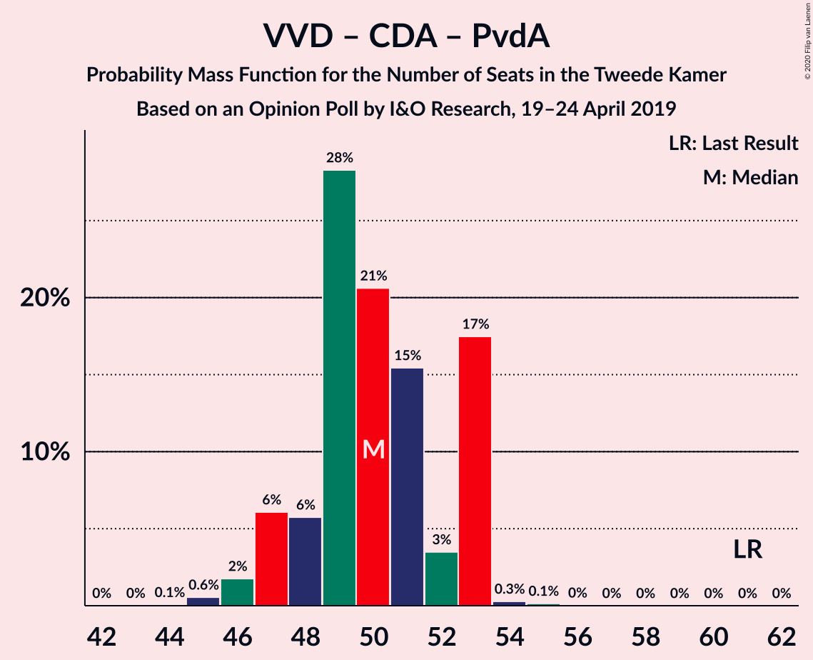

| Number of Seats | Probability | Accumulated | Special Marks |
|:---------------:|:-----------:|:-----------:|:-------------:|
| 44 | 0.1% | 100% |  |
| 45 | 0.1% | 99.9% |  |
| 46 | 0.1% | 99.8% |  |
| 47 | 5% | 99.7% |  |
| 48 | 2% | 95% |  |
| 49 | 16% | 93% |  |
| 50 | 2% | 76% |  |
| 51 | 4% | 74% |  |
| 52 | 3% | 71% |  |
| 53 | 68% | 68% | Median |
| 54 | 0% | 0.1% |  |
| 55 | 0% | 0% |  |
| 56 | 0% | 0% |  |
| 57 | 0% | 0% |  |
| 58 | 0% | 0% |  |
| 59 | 0% | 0% |  |
| 60 | 0% | 0% |  |
| 61 | 0% | 0% | Last Result |

### Volkspartij voor Vrijheid en Democratie – Democraten 66 – Partij van de Arbeid

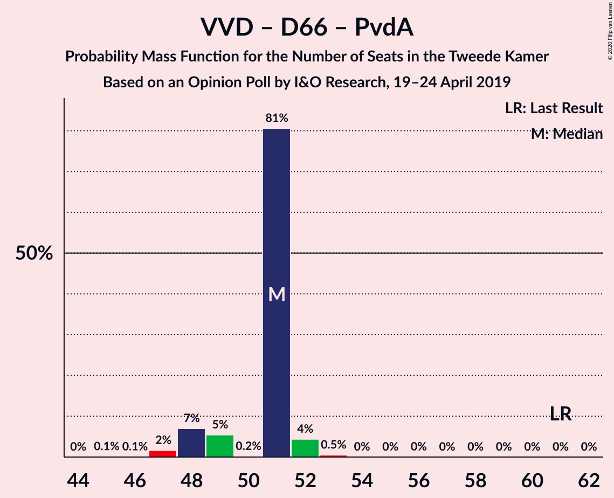

| Number of Seats | Probability | Accumulated | Special Marks |
|:---------------:|:-----------:|:-----------:|:-------------:|
| 45 | 0.1% | 100% |  |
| 46 | 0.1% | 99.9% |  |
| 47 | 2% | 99.8% |  |
| 48 | 7% | 98% |  |
| 49 | 5% | 91% |  |
| 50 | 0.2% | 86% |  |
| 51 | 81% | 86% | Median |
| 52 | 4% | 5% |  |
| 53 | 0.5% | 0.6% |  |
| 54 | 0% | 0.1% |  |
| 55 | 0% | 0% |  |
| 56 | 0% | 0% |  |
| 57 | 0% | 0% |  |
| 58 | 0% | 0% |  |
| 59 | 0% | 0% |  |
| 60 | 0% | 0% |  |
| 61 | 0% | 0% | Last Result |

### Volkspartij voor Vrijheid en Democratie – Partij van de Arbeid

| Number of Seats | Probability | Accumulated | Special Marks |
|:---------------:|:-----------:|:-----------:|:-------------:|
| 33 | 0.1% | 100% |  |
| 34 | 1.4% | 99.9% |  |
| 35 | 0.1% | 98% |  |
| 36 | 4% | 98% |  |
| 37 | 9% | 95% |  |
| 38 | 0.3% | 86% |  |
| 39 | 18% | 86% |  |
| 40 | 68% | 68% | Median |
| 41 | 0% | 0.1% |  |
| 42 | 0% | 0% | Last Result |

### Volkspartij voor Vrijheid en Democratie – Christen-Democratisch Appèl

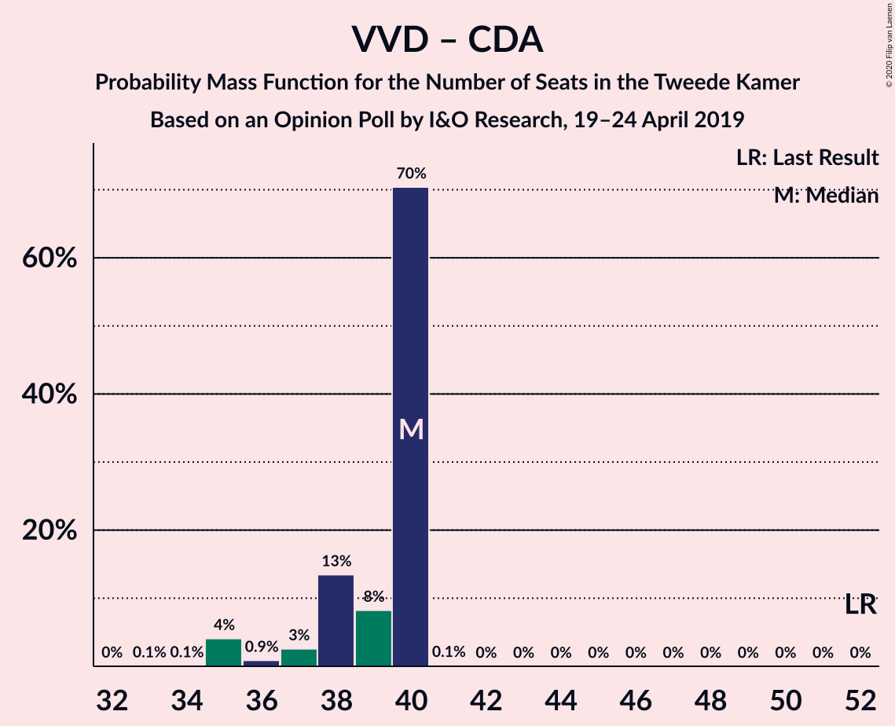

| Number of Seats | Probability | Accumulated | Special Marks |
|:---------------:|:-----------:|:-----------:|:-------------:|
| 33 | 0.1% | 100% |  |
| 34 | 0.1% | 99.9% |  |
| 35 | 4% | 99.8% |  |
| 36 | 0.9% | 96% |  |
| 37 | 3% | 95% |  |
| 38 | 13% | 92% |  |
| 39 | 8% | 79% |  |
| 40 | 70% | 71% | Median |
| 41 | 0.1% | 0.1% |  |
| 42 | 0% | 0% |  |
| 43 | 0% | 0% |  |
| 44 | 0% | 0% |  |
| 45 | 0% | 0% |  |
| 46 | 0% | 0% |  |
| 47 | 0% | 0% |  |
| 48 | 0% | 0% |  |
| 49 | 0% | 0% |  |
| 50 | 0% | 0% |  |
| 51 | 0% | 0% |  |
| 52 | 0% | 0% | Last Result |

### Democraten 66 – Christen-Democratisch Appèl – Partij van de Arbeid

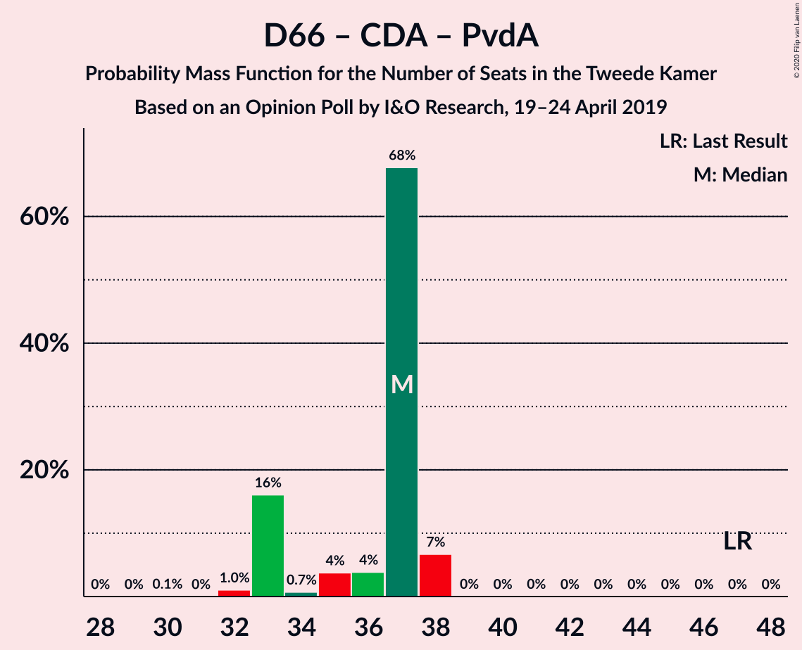

| Number of Seats | Probability | Accumulated | Special Marks |
|:---------------:|:-----------:|:-----------:|:-------------:|
| 30 | 0.1% | 100% |  |
| 31 | 0% | 99.9% |  |
| 32 | 1.0% | 99.9% |  |
| 33 | 16% | 98.9% |  |
| 34 | 0.7% | 83% |  |
| 35 | 4% | 82% |  |
| 36 | 4% | 78% |  |
| 37 | 68% | 75% | Median |
| 38 | 7% | 7% |  |
| 39 | 0% | 0.1% |  |
| 40 | 0% | 0.1% |  |
| 41 | 0% | 0% |  |
| 42 | 0% | 0% |  |
| 43 | 0% | 0% |  |
| 44 | 0% | 0% |  |
| 45 | 0% | 0% |  |
| 46 | 0% | 0% |  |
| 47 | 0% | 0% | Last Result |

### Christen-Democratisch Appèl – Partij van de Arbeid – ChristenUnie

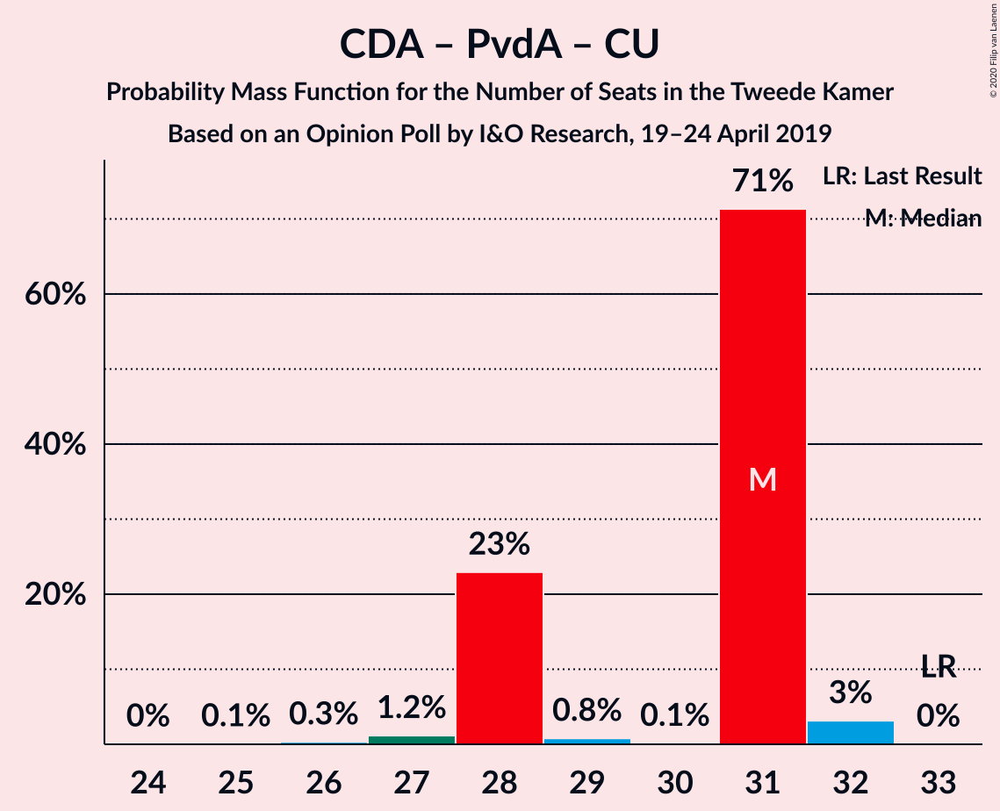

| Number of Seats | Probability | Accumulated | Special Marks |
|:---------------:|:-----------:|:-----------:|:-------------:|
| 24 | 0% | 100% |  |
| 25 | 0.1% | 99.9% |  |
| 26 | 0.3% | 99.9% |  |
| 27 | 1.2% | 99.6% |  |
| 28 | 23% | 98% |  |
| 29 | 0.8% | 75% |  |
| 30 | 0.1% | 75% |  |
| 31 | 71% | 75% | Median |
| 32 | 3% | 3% |  |
| 33 | 0% | 0% | Last Result |

### Democraten 66 – Christen-Democratisch Appèl

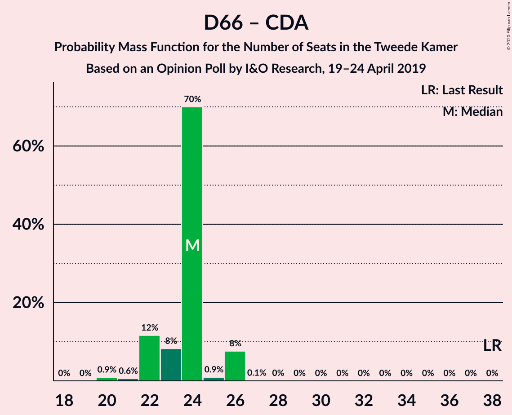

| Number of Seats | Probability | Accumulated | Special Marks |
|:---------------:|:-----------:|:-----------:|:-------------:|
| 20 | 0.9% | 100% |  |
| 21 | 0.6% | 99.1% |  |
| 22 | 12% | 98.5% |  |
| 23 | 8% | 87% |  |
| 24 | 70% | 79% | Median |
| 25 | 0.9% | 9% |  |
| 26 | 8% | 8% |  |
| 27 | 0.1% | 0.1% |  |
| 28 | 0% | 0.1% |  |
| 29 | 0% | 0% |  |
| 30 | 0% | 0% |  |
| 31 | 0% | 0% |  |
| 32 | 0% | 0% |  |
| 33 | 0% | 0% |  |
| 34 | 0% | 0% |  |
| 35 | 0% | 0% |  |
| 36 | 0% | 0% |  |
| 37 | 0% | 0% |  |
| 38 | 0% | 0% | Last Result |

### Christen-Democratisch Appèl – Partij van de Arbeid

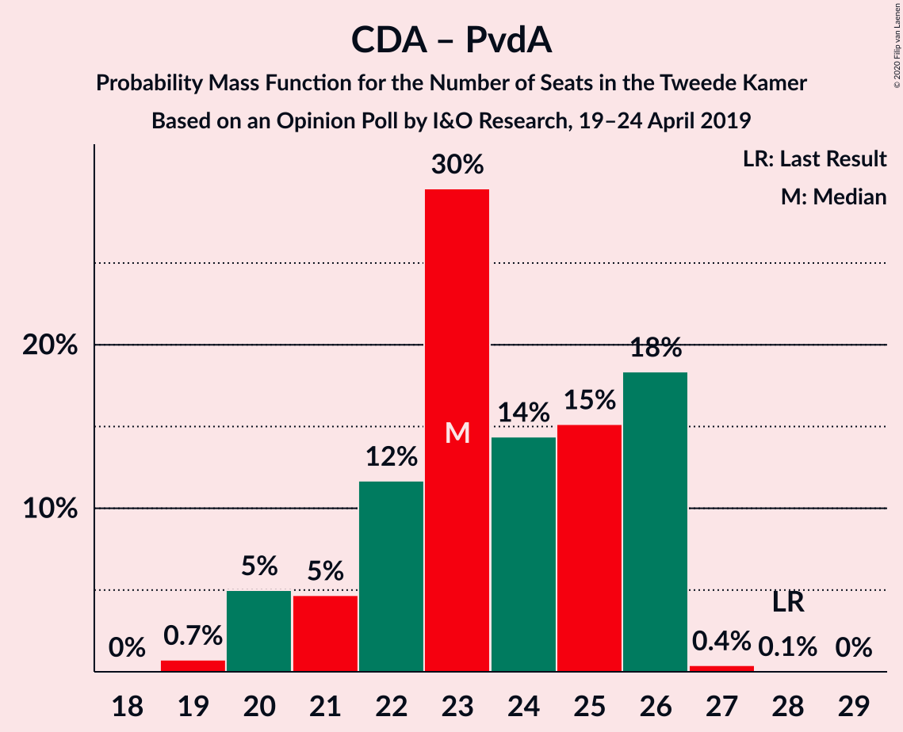

| Number of Seats | Probability | Accumulated | Special Marks |
|:---------------:|:-----------:|:-----------:|:-------------:|
| 19 | 0.1% | 100% |  |
| 20 | 1.1% | 99.9% |  |
| 21 | 12% | 98.8% |  |
| 22 | 5% | 87% |  |
| 23 | 7% | 82% |  |
| 24 | 0.8% | 75% |  |
| 25 | 4% | 74% |  |
| 26 | 71% | 71% | Median |
| 27 | 0% | 0% |  |
| 28 | 0% | 0% | Last Result |

## Technical Information

### Opinion Poll

+ **Polling firm:** I&O Research
+ **Commissioner(s):** —
+ **Fieldwork period:** 19–24 April 2019

### Calculations

+ **Sample size:** 1672
+ **Simulations done:** 131,072
+ **Error estimate:** 2.64%

