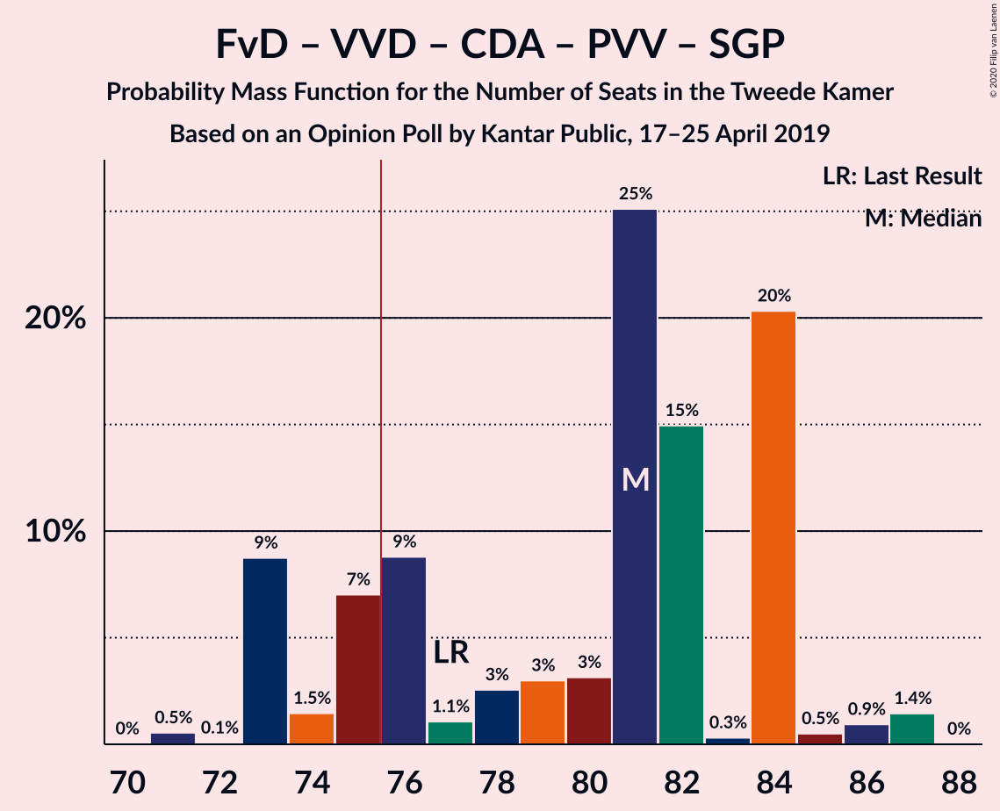
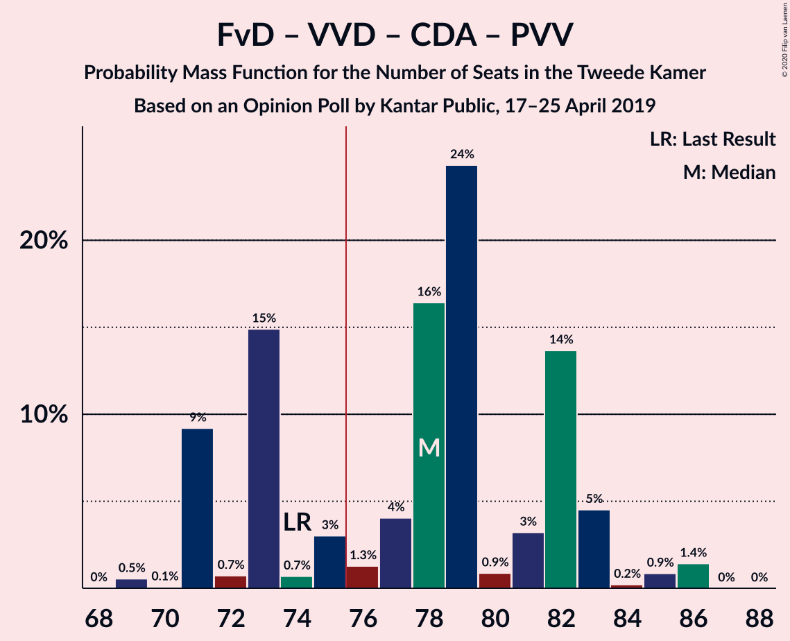
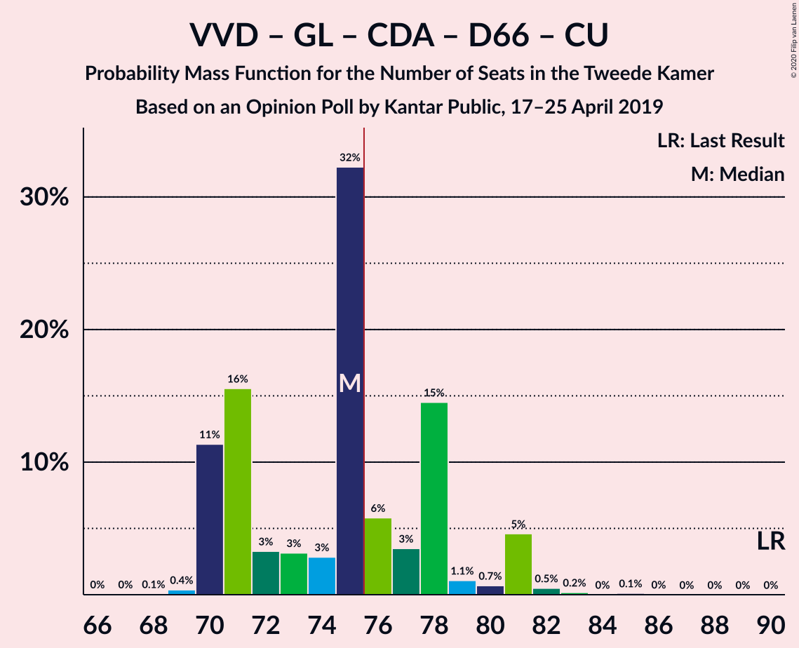
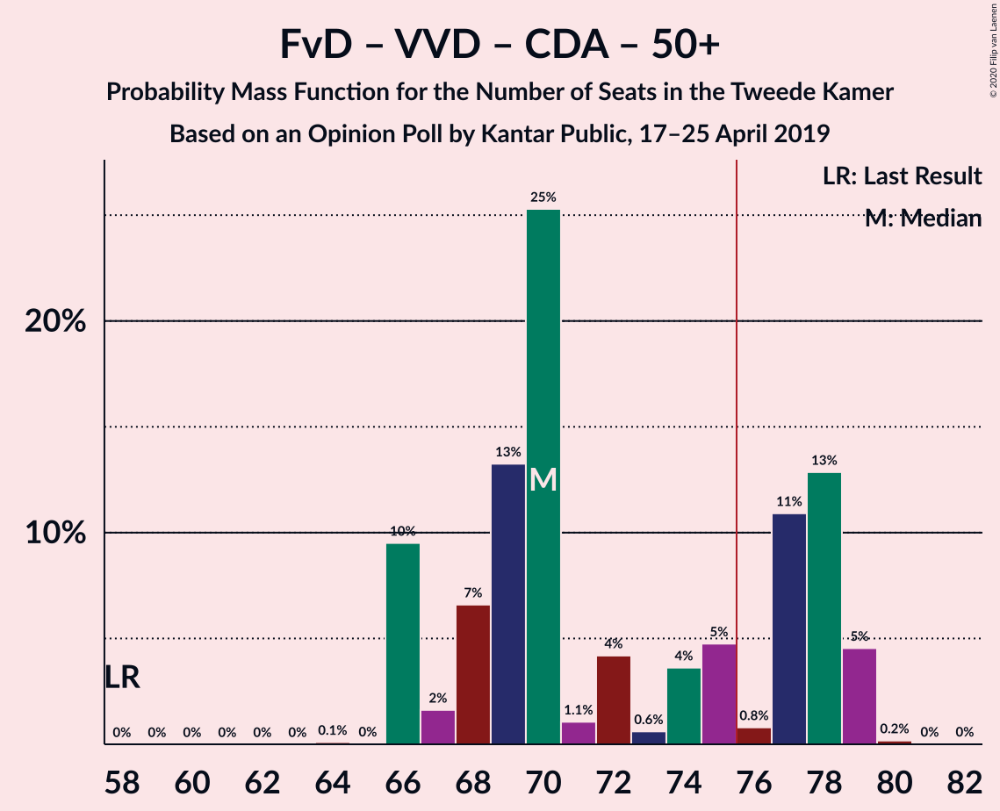
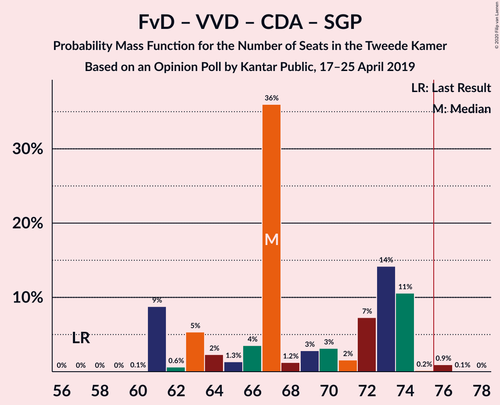
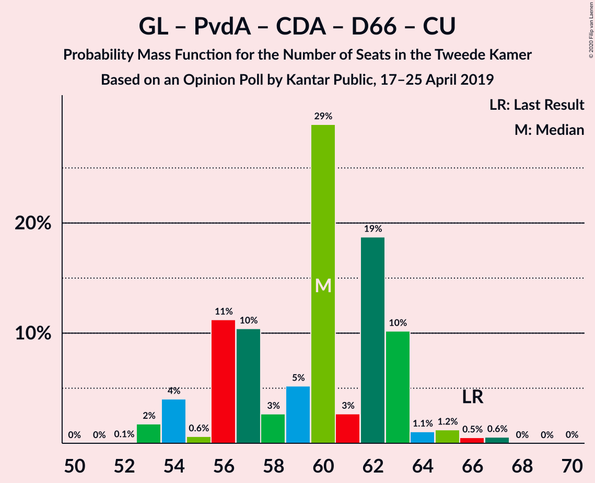
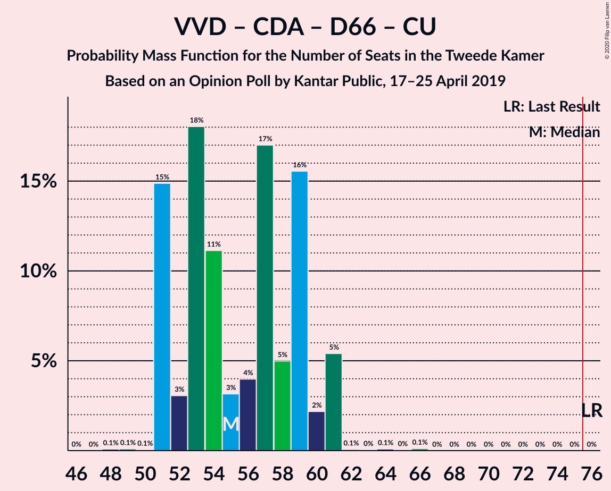
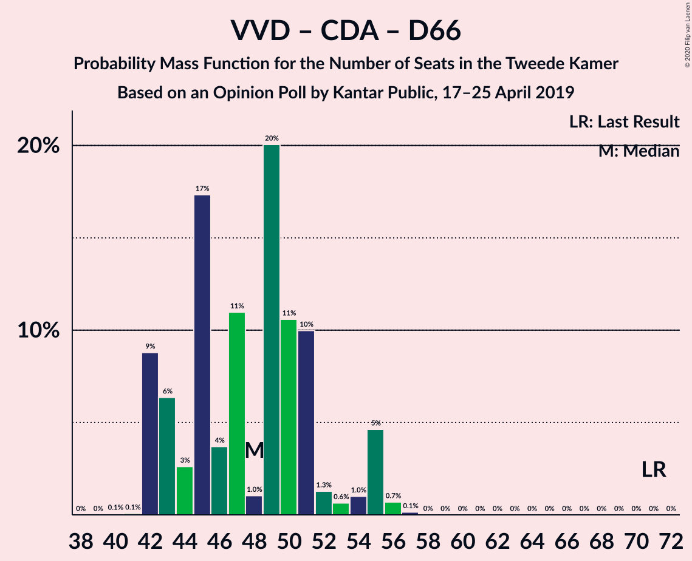
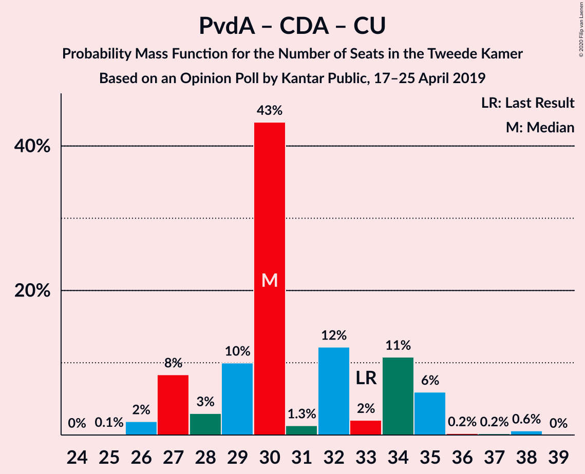

# Opinion Poll by Kantar Public, 17–25 April 2019

<a href="#voting-intentions">Voting Intentions</a> | <a href="#seats">Seats</a> | <a href="#coalitions">Coalitions</a> | <a href="#technical-information">Technical Information</a>

## Voting Intentions

### Confidence Intervals

| Party | Last Result | Poll Result | 80% Confidence Interval | 90% Confidence Interval | 95% Confidence Interval | 99% Confidence Interval |
|:-----:|:-----------:|:-----------:|:-----------------------:|:-----------------------:|:-----------------------:|:-----------------------:|
| Forum voor Democratie | 1.8% | 18.6% | 17.1–20.3% |16.7–20.8% |16.3–21.2% |15.6–22.0% |
| Volkspartij voor Vrijheid en Democratie | 21.3% | 18.0% | 16.5–19.7% |16.1–20.1% |15.7–20.6% |15.0–21.4% |
| GroenLinks | 9.1% | 12.7% | 11.4–14.1% |11.0–14.5% |10.7–14.9% |10.1–15.6% |
| Partij van de Arbeid | 5.7% | 8.0% | 7.0–9.3% |6.7–9.6% |6.5–9.9% |6.0–10.5% |
| Partij voor de Vrijheid | 13.1% | 7.3% | 6.3–8.5% |6.1–8.8% |5.8–9.1% |5.4–9.7% |
| Christen-Democratisch Appèl | 12.4% | 7.3% | 6.3–8.5% |6.1–8.8% |5.8–9.1% |5.4–9.7% |
| Democraten 66 | 12.2% | 6.7% | 5.8–7.8% |5.5–8.2% |5.3–8.4% |4.9–9.0% |
| Socialistische Partij | 9.1% | 5.3% | 4.5–6.4% |4.3–6.7% |4.1–7.0% |3.7–7.5% |
| ChristenUnie | 3.4% | 5.3% | 4.5–6.4% |4.3–6.7% |4.1–7.0% |3.7–7.5% |
| Partij voor de Dieren | 3.2% | 4.0% | 3.3–5.0% |3.1–5.2% |2.9–5.4% |2.6–5.9% |
| 50Plus | 3.1% | 4.0% | 3.3–5.0% |3.1–5.2% |2.9–5.4% |2.6–5.9% |
| Staatkundig Gereformeerde Partij | 2.1% | 1.3% | 1.0–2.0% |0.9–2.1% |0.8–2.3% |0.6–2.6% |
| DENK | 2.1% | 1.3% | 1.0–2.0% |0.9–2.1% |0.8–2.3% |0.6–2.6% |

*Note:* The poll result column reflects the actual value used in the calculations. Published results may vary slightly, and in addition be rounded to fewer digits.

## Seats

### Confidence Intervals

| Party | Last Result | Median | 80% Confidence Interval | 90% Confidence Interval | 95% Confidence Interval | 99% Confidence Interval |
|:-----:|:-----------:|:------:|:-----------------------:|:-----------------------:|:-----------------------:|:-----------------------:|
| <a href="#forum-voor-democratie">Forum voor Democratie</a> | 2 | 31 | 26–31 |25–31 |25–31 |23–33 |
| <a href="#volkspartij-voor-vrijheid-en-democratie">Volkspartij voor Vrijheid en Democratie</a> | 33 | 28 | 24–31 |24–32 |23–32 |22–36 |
| <a href="#groenlinks">GroenLinks</a> | 14 | 20 | 17–20 |17–22 |17–23 |15–23 |
| <a href="#partij-van-de-arbeid">Partij van de Arbeid</a> | 9 | 10 | 9–14 |9–16 |9–16 |9–16 |
| <a href="#partij-voor-de-vrijheid">Partij voor de Vrijheid</a> | 20 | 10 | 9–12 |8–12 |8–12 |8–15 |
| <a href="#christen-democratisch-appèl">Christen-Democratisch Appèl</a> | 19 | 12 | 10–14 |10–14 |10–14 |8–14 |
| <a href="#democraten-66">Democraten 66</a> | 19 | 12 | 9–13 |9–13 |9–13 |9–13 |
| <a href="#socialistische-partij">Socialistische Partij</a> | 14 | 7 | 6–10 |6–10 |6–10 |6–10 |
| <a href="#christenunie">ChristenUnie</a> | 5 | 6 | 6–9 |5–9 |5–9 |5–10 |
| <a href="#partij-voor-de-dieren">Partij voor de Dieren</a> | 5 | 4 | 4–7 |4–7 |4–7 |4–8 |
| <a href="#50plus">50Plus</a> | 4 | 6 | 5–8 |4–8 |4–8 |4–8 |
| <a href="#staatkundig-gereformeerde-partij">Staatkundig Gereformeerde Partij</a> | 3 | 1 | 1–3 |1–3 |1–4 |1–4 |
| <a href="#denk">DENK</a> | 3 | 1 | 1–2 |1–2 |1–3 |1–4 |

### Forum voor Democratie

*For a full overview of the results for this party, see the [Forum voor Democratie](party-forumvoordemocratie.html) page.*

| Number of Seats | Probability | Accumulated | Special Marks |
|:---------------:|:-----------:|:-----------:|:-------------:|
| 2 | 0% | 100% | Last Result |
| 3 | 0% | 100% |  |
| 4 | 0% | 100% |  |
| 5 | 0% | 100% |  |
| 6 | 0% | 100% |  |
| 7 | 0% | 100% |  |
| 8 | 0% | 100% |  |
| 9 | 0% | 100% |  |
| 10 | 0% | 100% |  |
| 11 | 0% | 100% |  |
| 12 | 0% | 100% |  |
| 13 | 0% | 100% |  |
| 14 | 0% | 100% |  |
| 15 | 0% | 100% |  |
| 16 | 0% | 100% |  |
| 17 | 0% | 100% |  |
| 18 | 0% | 100% |  |
| 19 | 0% | 100% |  |
| 20 | 0% | 100% |  |
| 21 | 0% | 100% |  |
| 22 | 0.1% | 100% |  |
| 23 | 2% | 99.9% |  |
| 24 | 0.1% | 98% |  |
| 25 | 4% | 98% |  |
| 26 | 4% | 93% |  |
| 27 | 1.4% | 90% |  |
| 28 | 0.4% | 88% |  |
| 29 | 22% | 88% |  |
| 30 | 3% | 66% |  |
| 31 | 62% | 63% | Median |
| 32 | 0.1% | 1.2% |  |
| 33 | 1.0% | 1.1% |  |
| 34 | 0% | 0.1% |  |
| 35 | 0% | 0.1% |  |
| 36 | 0% | 0% |  |

### Volkspartij voor Vrijheid en Democratie

*For a full overview of the results for this party, see the [Volkspartij voor Vrijheid en Democratie](party-volkspartijvoorvrijheidendemocratie.html) page.*

| Number of Seats | Probability | Accumulated | Special Marks |
|:---------------:|:-----------:|:-----------:|:-------------:|
| 22 | 2% | 100% |  |
| 23 | 2% | 98% |  |
| 24 | 8% | 96% |  |
| 25 | 2% | 88% |  |
| 26 | 19% | 86% |  |
| 27 | 2% | 67% |  |
| 28 | 40% | 65% | Median |
| 29 | 9% | 25% |  |
| 30 | 0.1% | 16% |  |
| 31 | 6% | 16% |  |
| 32 | 9% | 10% |  |
| 33 | 0% | 1.1% | Last Result |
| 34 | 0.1% | 1.0% |  |
| 35 | 0% | 1.0% |  |
| 36 | 1.0% | 1.0% |  |
| 37 | 0% | 0% |  |

### GroenLinks

*For a full overview of the results for this party, see the [GroenLinks](party-groenlinks.html) page.*

| Number of Seats | Probability | Accumulated | Special Marks |
|:---------------:|:-----------:|:-----------:|:-------------:|
| 14 | 0% | 100% | Last Result |
| 15 | 1.3% | 100% |  |
| 16 | 0.2% | 98.7% |  |
| 17 | 15% | 98% |  |
| 18 | 0.1% | 84% |  |
| 19 | 5% | 84% |  |
| 20 | 72% | 79% | Median |
| 21 | 0.2% | 7% |  |
| 22 | 2% | 6% |  |
| 23 | 4% | 4% |  |
| 24 | 0% | 0.1% |  |
| 25 | 0.1% | 0.1% |  |
| 26 | 0% | 0% |  |

### Partij van de Arbeid

*For a full overview of the results for this party, see the [Partij van de Arbeid](party-partijvandearbeid.html) page.*

| Number of Seats | Probability | Accumulated | Special Marks |
|:---------------:|:-----------:|:-----------:|:-------------:|
| 9 | 44% | 100% | Last Result |
| 10 | 7% | 56% | Median |
| 11 | 24% | 49% |  |
| 12 | 4% | 25% |  |
| 13 | 8% | 21% |  |
| 14 | 5% | 13% |  |
| 15 | 0.3% | 8% |  |
| 16 | 8% | 8% |  |
| 17 | 0% | 0.1% |  |
| 18 | 0% | 0% |  |

### Partij voor de Vrijheid

*For a full overview of the results for this party, see the [Partij voor de Vrijheid](party-partijvoordevrijheid.html) page.*

| Number of Seats | Probability | Accumulated | Special Marks |
|:---------------:|:-----------:|:-----------:|:-------------:|
| 7 | 0.1% | 100% |  |
| 8 | 7% | 99.9% |  |
| 9 | 10% | 93% |  |
| 10 | 42% | 83% | Median |
| 11 | 5% | 41% |  |
| 12 | 35% | 36% |  |
| 13 | 0% | 1.2% |  |
| 14 | 0% | 1.2% |  |
| 15 | 1.2% | 1.2% |  |
| 16 | 0% | 0% |  |
| 17 | 0% | 0% |  |
| 18 | 0% | 0% |  |
| 19 | 0% | 0% |  |
| 20 | 0% | 0% | Last Result |

### Christen-Democratisch Appèl

*For a full overview of the results for this party, see the [Christen-Democratisch Appèl](party-christen-democratischappèl.html) page.*

| Number of Seats | Probability | Accumulated | Special Marks |
|:---------------:|:-----------:|:-----------:|:-------------:|
| 7 | 0.1% | 100% |  |
| 8 | 1.3% | 99.9% |  |
| 9 | 0.5% | 98.6% |  |
| 10 | 34% | 98% |  |
| 11 | 12% | 64% |  |
| 12 | 6% | 52% | Median |
| 13 | 6% | 46% |  |
| 14 | 40% | 40% |  |
| 15 | 0.1% | 0.1% |  |
| 16 | 0% | 0.1% |  |
| 17 | 0% | 0% |  |
| 18 | 0% | 0% |  |
| 19 | 0% | 0% | Last Result |

### Democraten 66

*For a full overview of the results for this party, see the [Democraten 66](party-democraten66.html) page.*

| Number of Seats | Probability | Accumulated | Special Marks |
|:---------------:|:-----------:|:-----------:|:-------------:|
| 5 | 0.1% | 100% |  |
| 6 | 0% | 99.9% |  |
| 7 | 0.1% | 99.9% |  |
| 8 | 0.1% | 99.7% |  |
| 9 | 20% | 99.6% |  |
| 10 | 17% | 80% |  |
| 11 | 3% | 63% |  |
| 12 | 17% | 61% | Median |
| 13 | 44% | 44% |  |
| 14 | 0.2% | 0.3% |  |
| 15 | 0% | 0.1% |  |
| 16 | 0.1% | 0.1% |  |
| 17 | 0% | 0% |  |
| 18 | 0% | 0% |  |
| 19 | 0% | 0% | Last Result |

### Socialistische Partij

*For a full overview of the results for this party, see the [Socialistische Partij](party-socialistischepartij.html) page.*

| Number of Seats | Probability | Accumulated | Special Marks |
|:---------------:|:-----------:|:-----------:|:-------------:|
| 5 | 0.4% | 100% |  |
| 6 | 25% | 99.6% |  |
| 7 | 42% | 75% | Median |
| 8 | 14% | 33% |  |
| 9 | 3% | 19% |  |
| 10 | 15% | 16% |  |
| 11 | 0% | 0.3% |  |
| 12 | 0.3% | 0.3% |  |
| 13 | 0% | 0% |  |
| 14 | 0% | 0% | Last Result |

### ChristenUnie

*For a full overview of the results for this party, see the [ChristenUnie](party-christenunie.html) page.*

| Number of Seats | Probability | Accumulated | Special Marks |
|:---------------:|:-----------:|:-----------:|:-------------:|
| 5 | 7% | 100% | Last Result |
| 6 | 56% | 93% | Median |
| 7 | 9% | 37% |  |
| 8 | 17% | 28% |  |
| 9 | 9% | 11% |  |
| 10 | 1.4% | 2% |  |
| 11 | 0.1% | 0.2% |  |
| 12 | 0% | 0% |  |

### Partij voor de Dieren

*For a full overview of the results for this party, see the [Partij voor de Dieren](party-partijvoordedieren.html) page.*

| Number of Seats | Probability | Accumulated | Special Marks |
|:---------------:|:-----------:|:-----------:|:-------------:|
| 3 | 0.3% | 100% |  |
| 4 | 56% | 99.7% | Median |
| 5 | 9% | 44% | Last Result |
| 6 | 17% | 34% |  |
| 7 | 16% | 17% |  |
| 8 | 1.0% | 1.1% |  |
| 9 | 0.1% | 0.2% |  |
| 10 | 0% | 0% |  |

### 50Plus

*For a full overview of the results for this party, see the [50Plus](party-50plus.html) page.*

| Number of Seats | Probability | Accumulated | Special Marks |
|:---------------:|:-----------:|:-----------:|:-------------:|
| 3 | 0.1% | 100% |  |
| 4 | 6% | 99.9% | Last Result |
| 5 | 38% | 94% |  |
| 6 | 44% | 56% | Median |
| 7 | 2% | 12% |  |
| 8 | 10% | 10% |  |
| 9 | 0% | 0% |  |

### Staatkundig Gereformeerde Partij

*For a full overview of the results for this party, see the [Staatkundig Gereformeerde Partij](party-staatkundiggereformeerdepartij.html) page.*

| Number of Seats | Probability | Accumulated | Special Marks |
|:---------------:|:-----------:|:-----------:|:-------------:|
| 0 | 0.4% | 100% |  |
| 1 | 61% | 99.6% | Median |
| 2 | 2% | 39% |  |
| 3 | 34% | 37% | Last Result |
| 4 | 3% | 3% |  |
| 5 | 0% | 0% |  |

### DENK

*For a full overview of the results for this party, see the [DENK](party-denk.html) page.*

| Number of Seats | Probability | Accumulated | Special Marks |
|:---------------:|:-----------:|:-----------:|:-------------:|
| 0 | 0.1% | 100% |  |
| 1 | 66% | 99.9% | Median |
| 2 | 29% | 34% |  |
| 3 | 3% | 4% | Last Result |
| 4 | 1.3% | 1.4% |  |
| 5 | 0% | 0% |  |

## Coalitions

### Confidence Intervals

| Coalition | Last Result | Median | Majority? | 80% Confidence Interval | 90% Confidence Interval | 95% Confidence Interval | 99% Confidence Interval |
|:---------:|:-----------:|:------:|:---------:|:-----------------------:|:-----------------------:|:-----------------------:|:-----------------------:|
| Forum voor Democratie – Volkspartij voor Vrijheid en Democratie – Christen-Democratisch Appèl – Partij voor de Vrijheid – Staatkundig Gereformeerde Partij | 77 | 84 | 93% | 76–84 | 75–86 | 75–86 | 74–86 |
| Forum voor Democratie – Volkspartij voor Vrijheid en Democratie – Christen-Democratisch Appèl – Partij voor de Vrijheid | 74 | 81 | 81% | 75–83 | 73–85 | 71–85 | 71–85 |
| Volkspartij voor Vrijheid en Democratie – GroenLinks – Christen-Democratisch Appèl – Democraten 66 – ChristenUnie | 90 | 79 | 69% | 71–81 | 71–81 | 70–82 | 70–85 |
| Forum voor Democratie – Volkspartij voor Vrijheid en Democratie – Christen-Democratisch Appèl – 50Plus – Staatkundig Gereformeerde Partij | 61 | 79 | 64% | 71–80 | 69–81 | 68–81 | 68–81 |
| Forum voor Democratie – Volkspartij voor Vrijheid en Democratie – Christen-Democratisch Appèl – 50Plus | 58 | 78 | 63% | 68–79 | 67–79 | 67–79 | 66–80 |
| Forum voor Democratie – Volkspartij voor Vrijheid en Democratie – Christen-Democratisch Appèl – Staatkundig Gereformeerde Partij | 57 | 74 | 8% | 65–74 | 64–76 | 64–76 | 63–76 |
| GroenLinks – Partij van de Arbeid – Christen-Democratisch Appèl – Democraten 66 – ChristenUnie – Socialistische Partij | 80 | 69 | 0.1% | 65–69 | 64–72 | 64–73 | 64–73 |
| Volkspartij voor Vrijheid en Democratie – Partij van de Arbeid – Christen-Democratisch Appèl – Democraten 66 – ChristenUnie | 85 | 70 | 1.0% | 63–71 | 63–73 | 63–73 | 63–76 |
| Forum voor Democratie – Volkspartij voor Vrijheid en Democratie – Christen-Democratisch Appèl | 54 | 73 | 0% | 63–73 | 62–73 | 61–73 | 60–75 |
| GroenLinks – Partij van de Arbeid – Christen-Democratisch Appèl – Democraten 66 – ChristenUnie | 66 | 62 | 0% | 57–63 | 57–64 | 57–65 | 57–65 |
| Volkspartij voor Vrijheid en Democratie – Christen-Democratisch Appèl – Democraten 66 – ChristenUnie | 76 | 60 | 0% | 51–61 | 51–61 | 51–61 | 51–66 |
| Volkspartij voor Vrijheid en Democratie – Christen-Democratisch Appèl – Partij voor de Vrijheid | 72 | 50 | 0% | 46–52 | 45–56 | 44–56 | 41–58 |
| Volkspartij voor Vrijheid en Democratie – Christen-Democratisch Appèl – Democraten 66 | 71 | 52 | 0% | 43–55 | 43–56 | 43–56 | 43–57 |
| Volkspartij voor Vrijheid en Democratie – Partij van de Arbeid – Christen-Democratisch Appèl | 61 | 51 | 0% | 47–54 | 47–55 | 47–55 | 44–58 |
| Volkspartij voor Vrijheid en Democratie – Partij van de Arbeid – Democraten 66 | 61 | 50 | 0% | 47–53 | 47–54 | 46–54 | 46–55 |
| Volkspartij voor Vrijheid en Democratie – Partij van de Arbeid | 42 | 37 | 0% | 37–43 | 35–45 | 35–45 | 34–46 |
| Volkspartij voor Vrijheid en Democratie – Christen-Democratisch Appèl | 52 | 42 | 0% | 34–42 | 34–44 | 33–44 | 32–48 |
| Partij van de Arbeid – Christen-Democratisch Appèl – Democraten 66 | 47 | 35 | 0% | 31–36 | 31–36 | 31–36 | 31–37 |
| Partij van de Arbeid – Christen-Democratisch Appèl – ChristenUnie | 33 | 29 | 0% | 27–33 | 27–34 | 27–34 | 27–34 |
| Christen-Democratisch Appèl – Democraten 66 | 38 | 23 | 0% | 19–27 | 19–27 | 19–27 | 19–27 |
| Partij van de Arbeid – Christen-Democratisch Appèl | 28 | 23 | 0% | 21–25 | 21–26 | 21–26 | 21–26 |

### Forum voor Democratie – Volkspartij voor Vrijheid en Democratie – Christen-Democratisch Appèl – Partij voor de Vrijheid – Staatkundig Gereformeerde Partij

| Number of Seats | Probability | Accumulated | Special Marks |
|:---------------:|:-----------:|:-----------:|:-------------:|
| 70 | 0% | 100% |  |
| 71 | 0% | 99.9% |  |
| 72 | 0.2% | 99.9% |  |
| 73 | 0% | 99.7% |  |
| 74 | 2% | 99.7% |  |
| 75 | 5% | 98% |  |
| 76 | 4% | 93% | Majority |
| 77 | 0.4% | 89% | Last Result |
| 78 | 8% | 89% |  |
| 79 | 8% | 81% |  |
| 80 | 0.5% | 72% |  |
| 81 | 0.3% | 72% |  |
| 82 | 16% | 72% | Median |
| 83 | 1.2% | 56% |  |
| 84 | 46% | 54% |  |
| 85 | 0.8% | 8% |  |
| 86 | 7% | 7% |  |
| 87 | 0% | 0% |  |

### Forum voor Democratie – Volkspartij voor Vrijheid en Democratie – Christen-Democratisch Appèl – Partij voor de Vrijheid

| Number of Seats | Probability | Accumulated | Special Marks |
|:---------------:|:-----------:|:-----------:|:-------------:|
| 68 | 0.1% | 100% |  |
| 69 | 0% | 99.9% |  |
| 70 | 0.1% | 99.9% |  |
| 71 | 4% | 99.8% |  |
| 72 | 0.1% | 96% |  |
| 73 | 1.1% | 95% |  |
| 74 | 1.5% | 94% | Last Result |
| 75 | 12% | 93% |  |
| 76 | 0.2% | 81% | Majority |
| 77 | 0.6% | 80% |  |
| 78 | 8% | 80% |  |
| 79 | 15% | 72% |  |
| 80 | 1.2% | 57% |  |
| 81 | 8% | 55% | Median |
| 82 | 1.1% | 48% |  |
| 83 | 39% | 47% |  |
| 84 | 0% | 7% |  |
| 85 | 7% | 7% |  |
| 86 | 0% | 0% |  |

### Volkspartij voor Vrijheid en Democratie – GroenLinks – Christen-Democratisch Appèl – Democraten 66 – ChristenUnie

| Number of Seats | Probability | Accumulated | Special Marks |
|:---------------:|:-----------:|:-----------:|:-------------:|
| 67 | 0% | 100% |  |
| 68 | 0% | 99.9% |  |
| 69 | 0.1% | 99.9% |  |
| 70 | 3% | 99.8% |  |
| 71 | 8% | 96% |  |
| 72 | 17% | 89% |  |
| 73 | 0.4% | 72% |  |
| 74 | 2% | 71% |  |
| 75 | 0.1% | 69% |  |
| 76 | 1.1% | 69% | Majority |
| 77 | 7% | 68% |  |
| 78 | 8% | 61% | Median |
| 79 | 8% | 53% |  |
| 80 | 0.2% | 45% |  |
| 81 | 40% | 45% |  |
| 82 | 4% | 5% |  |
| 83 | 0.1% | 1.1% |  |
| 84 | 0% | 1.0% |  |
| 85 | 1.0% | 1.0% |  |
| 86 | 0% | 0% |  |
| 87 | 0% | 0% |  |
| 88 | 0% | 0% |  |
| 89 | 0% | 0% |  |
| 90 | 0% | 0% | Last Result |

### Forum voor Democratie – Volkspartij voor Vrijheid en Democratie – Christen-Democratisch Appèl – 50Plus – Staatkundig Gereformeerde Partij

| Number of Seats | Probability | Accumulated | Special Marks |
|:---------------:|:-----------:|:-----------:|:-------------:|
| 61 | 0% | 100% | Last Result |
| 62 | 0% | 100% |  |
| 63 | 0% | 100% |  |
| 64 | 0% | 100% |  |
| 65 | 0% | 100% |  |
| 66 | 0.1% | 100% |  |
| 67 | 0% | 99.9% |  |
| 68 | 4% | 99.9% |  |
| 69 | 2% | 96% |  |
| 70 | 1.4% | 94% |  |
| 71 | 9% | 92% |  |
| 72 | 3% | 83% |  |
| 73 | 0.1% | 81% |  |
| 74 | 1.1% | 80% |  |
| 75 | 15% | 79% |  |
| 76 | 1.1% | 64% | Majority |
| 77 | 0.1% | 63% |  |
| 78 | 8% | 63% | Median |
| 79 | 6% | 55% |  |
| 80 | 41% | 48% |  |
| 81 | 8% | 8% |  |
| 82 | 0% | 0% |  |

### Forum voor Democratie – Volkspartij voor Vrijheid en Democratie – Christen-Democratisch Appèl – 50Plus

| Number of Seats | Probability | Accumulated | Special Marks |
|:---------------:|:-----------:|:-----------:|:-------------:|
| 58 | 0% | 100% | Last Result |
| 59 | 0% | 100% |  |
| 60 | 0% | 100% |  |
| 61 | 0% | 100% |  |
| 62 | 0% | 100% |  |
| 63 | 0% | 100% |  |
| 64 | 0% | 100% |  |
| 65 | 0% | 100% |  |
| 66 | 2% | 99.9% |  |
| 67 | 4% | 98% |  |
| 68 | 10% | 94% |  |
| 69 | 3% | 84% |  |
| 70 | 0.1% | 81% |  |
| 71 | 1.2% | 81% |  |
| 72 | 16% | 79% |  |
| 73 | 0.2% | 64% |  |
| 74 | 0.2% | 64% |  |
| 75 | 0.8% | 63% |  |
| 76 | 0.1% | 63% | Majority |
| 77 | 9% | 62% | Median |
| 78 | 13% | 54% |  |
| 79 | 40% | 41% |  |
| 80 | 1.0% | 1.0% |  |
| 81 | 0% | 0% |  |

### Forum voor Democratie – Volkspartij voor Vrijheid en Democratie – Christen-Democratisch Appèl – Staatkundig Gereformeerde Partij

| Number of Seats | Probability | Accumulated | Special Marks |
|:---------------:|:-----------:|:-----------:|:-------------:|
| 57 | 0% | 100% | Last Result |
| 58 | 0% | 100% |  |
| 59 | 0% | 100% |  |
| 60 | 0% | 100% |  |
| 61 | 0% | 100% |  |
| 62 | 0.1% | 100% |  |
| 63 | 0.5% | 99.9% |  |
| 64 | 8% | 99.4% |  |
| 65 | 2% | 91% |  |
| 66 | 8% | 89% |  |
| 67 | 0.2% | 81% |  |
| 68 | 1.5% | 81% |  |
| 69 | 0.2% | 79% |  |
| 70 | 24% | 79% |  |
| 71 | 0.1% | 55% |  |
| 72 | 0.2% | 55% | Median |
| 73 | 0.1% | 55% |  |
| 74 | 46% | 55% |  |
| 75 | 0.8% | 9% |  |
| 76 | 8% | 8% | Majority |
| 77 | 0% | 0% |  |

### GroenLinks – Partij van de Arbeid – Christen-Democratisch Appèl – Democraten 66 – ChristenUnie – Socialistische Partij

| Number of Seats | Probability | Accumulated | Special Marks |
|:---------------:|:-----------:|:-----------:|:-------------:|
| 61 | 0.1% | 100% |  |
| 62 | 0% | 99.9% |  |
| 63 | 0.1% | 99.9% |  |
| 64 | 10% | 99.8% |  |
| 65 | 8% | 90% |  |
| 66 | 0.1% | 83% |  |
| 67 | 23% | 83% | Median |
| 68 | 0.2% | 60% |  |
| 69 | 50% | 59% |  |
| 70 | 2% | 9% |  |
| 71 | 0.4% | 7% |  |
| 72 | 2% | 6% |  |
| 73 | 4% | 4% |  |
| 74 | 0.1% | 0.3% |  |
| 75 | 0% | 0.1% |  |
| 76 | 0% | 0.1% | Majority |
| 77 | 0.1% | 0.1% |  |
| 78 | 0% | 0.1% |  |
| 79 | 0.1% | 0.1% |  |
| 80 | 0% | 0% | Last Result |

### Volkspartij voor Vrijheid en Democratie – Partij van de Arbeid – Christen-Democratisch Appèl – Democraten 66 – ChristenUnie

| Number of Seats | Probability | Accumulated | Special Marks |
|:---------------:|:-----------:|:-----------:|:-------------:|
| 61 | 0.1% | 100% |  |
| 62 | 0% | 99.9% |  |
| 63 | 15% | 99.9% |  |
| 64 | 2% | 85% |  |
| 65 | 2% | 83% |  |
| 66 | 0.4% | 80% |  |
| 67 | 9% | 80% |  |
| 68 | 4% | 70% | Median |
| 69 | 1.0% | 66% |  |
| 70 | 49% | 65% |  |
| 71 | 6% | 16% |  |
| 72 | 2% | 10% |  |
| 73 | 7% | 8% |  |
| 74 | 0.1% | 1.2% |  |
| 75 | 0.1% | 1.1% |  |
| 76 | 1.0% | 1.0% | Majority |
| 77 | 0% | 0% |  |
| 78 | 0% | 0% |  |
| 79 | 0% | 0% |  |
| 80 | 0% | 0% |  |
| 81 | 0% | 0% |  |
| 82 | 0% | 0% |  |
| 83 | 0% | 0% |  |
| 84 | 0% | 0% |  |
| 85 | 0% | 0% | Last Result |

### Forum voor Democratie – Volkspartij voor Vrijheid en Democratie – Christen-Democratisch Appèl

| Number of Seats | Probability | Accumulated | Special Marks |
|:---------------:|:-----------:|:-----------:|:-------------:|
| 54 | 0% | 100% | Last Result |
| 55 | 0% | 100% |  |
| 56 | 0% | 100% |  |
| 57 | 0% | 100% |  |
| 58 | 0% | 100% |  |
| 59 | 0% | 100% |  |
| 60 | 2% | 100% |  |
| 61 | 0.1% | 98% |  |
| 62 | 3% | 97% |  |
| 63 | 14% | 94% |  |
| 64 | 0.1% | 81% |  |
| 65 | 2% | 81% |  |
| 66 | 0.2% | 79% |  |
| 67 | 15% | 79% |  |
| 68 | 0.1% | 63% |  |
| 69 | 9% | 63% |  |
| 70 | 0.2% | 55% |  |
| 71 | 0.1% | 55% | Median |
| 72 | 1.0% | 55% |  |
| 73 | 53% | 54% |  |
| 74 | 0% | 1.0% |  |
| 75 | 1.0% | 1.0% |  |
| 76 | 0% | 0% | Majority |

### GroenLinks – Partij van de Arbeid – Christen-Democratisch Appèl – Democraten 66 – ChristenUnie

| Number of Seats | Probability | Accumulated | Special Marks |
|:---------------:|:-----------:|:-----------:|:-------------:|
| 54 | 0.1% | 100% |  |
| 55 | 0.1% | 99.9% |  |
| 56 | 0.2% | 99.8% |  |
| 57 | 23% | 99.5% |  |
| 58 | 8% | 76% |  |
| 59 | 1.4% | 68% |  |
| 60 | 1.2% | 67% | Median |
| 61 | 12% | 66% |  |
| 62 | 40% | 54% |  |
| 63 | 8% | 14% |  |
| 64 | 2% | 6% |  |
| 65 | 4% | 4% |  |
| 66 | 0.1% | 0.3% | Last Result |
| 67 | 0% | 0.2% |  |
| 68 | 0.1% | 0.2% |  |
| 69 | 0% | 0.1% |  |
| 70 | 0% | 0.1% |  |
| 71 | 0.1% | 0.1% |  |
| 72 | 0% | 0% |  |

### Volkspartij voor Vrijheid en Democratie – Christen-Democratisch Appèl – Democraten 66 – ChristenUnie

| Number of Seats | Probability | Accumulated | Special Marks |
|:---------------:|:-----------:|:-----------:|:-------------:|
| 50 | 0.1% | 100% |  |
| 51 | 10% | 99.9% |  |
| 52 | 17% | 89% |  |
| 53 | 1.3% | 72% |  |
| 54 | 0.6% | 71% |  |
| 55 | 1.0% | 70% |  |
| 56 | 0.3% | 70% |  |
| 57 | 0% | 69% |  |
| 58 | 2% | 69% | Median |
| 59 | 13% | 68% |  |
| 60 | 7% | 55% |  |
| 61 | 46% | 48% |  |
| 62 | 0.1% | 1.1% |  |
| 63 | 0% | 1.0% |  |
| 64 | 0% | 1.0% |  |
| 65 | 0% | 1.0% |  |
| 66 | 1.0% | 1.0% |  |
| 67 | 0% | 0% |  |
| 68 | 0% | 0% |  |
| 69 | 0% | 0% |  |
| 70 | 0% | 0% |  |
| 71 | 0% | 0% |  |
| 72 | 0% | 0% |  |
| 73 | 0% | 0% |  |
| 74 | 0% | 0% |  |
| 75 | 0% | 0% |  |
| 76 | 0% | 0% | Last Result, Majority |

### Volkspartij voor Vrijheid en Democratie – Christen-Democratisch Appèl – Partij voor de Vrijheid

| Number of Seats | Probability | Accumulated | Special Marks |
|:---------------:|:-----------:|:-----------:|:-------------:|
| 41 | 2% | 100% |  |
| 42 | 0.1% | 98% |  |
| 43 | 0% | 98% |  |
| 44 | 1.4% | 98% |  |
| 45 | 2% | 97% |  |
| 46 | 8% | 94% |  |
| 47 | 0.3% | 86% |  |
| 48 | 16% | 86% |  |
| 49 | 9% | 70% |  |
| 50 | 12% | 61% | Median |
| 51 | 0.1% | 49% |  |
| 52 | 40% | 49% |  |
| 53 | 0% | 9% |  |
| 54 | 0% | 9% |  |
| 55 | 0.8% | 9% |  |
| 56 | 6% | 8% |  |
| 57 | 1.0% | 2% |  |
| 58 | 1.0% | 1.0% |  |
| 59 | 0% | 0% |  |
| 60 | 0% | 0% |  |
| 61 | 0% | 0% |  |
| 62 | 0% | 0% |  |
| 63 | 0% | 0% |  |
| 64 | 0% | 0% |  |
| 65 | 0% | 0% |  |
| 66 | 0% | 0% |  |
| 67 | 0% | 0% |  |
| 68 | 0% | 0% |  |
| 69 | 0% | 0% |  |
| 70 | 0% | 0% |  |
| 71 | 0% | 0% |  |
| 72 | 0% | 0% | Last Result |

### Volkspartij voor Vrijheid en Democratie – Christen-Democratisch Appèl – Democraten 66

| Number of Seats | Probability | Accumulated | Special Marks |
|:---------------:|:-----------:|:-----------:|:-------------:|
| 41 | 0.1% | 100% |  |
| 42 | 0% | 99.9% |  |
| 43 | 10% | 99.9% |  |
| 44 | 3% | 90% |  |
| 45 | 0.1% | 86% |  |
| 46 | 16% | 86% |  |
| 47 | 0.2% | 71% |  |
| 48 | 0.6% | 71% |  |
| 49 | 1.1% | 70% |  |
| 50 | 1.3% | 69% |  |
| 51 | 12% | 68% |  |
| 52 | 8% | 55% | Median |
| 53 | 0.1% | 48% |  |
| 54 | 0% | 47% |  |
| 55 | 40% | 47% |  |
| 56 | 6% | 7% |  |
| 57 | 1.0% | 1.0% |  |
| 58 | 0% | 0% |  |
| 59 | 0% | 0% |  |
| 60 | 0% | 0% |  |
| 61 | 0% | 0% |  |
| 62 | 0% | 0% |  |
| 63 | 0% | 0% |  |
| 64 | 0% | 0% |  |
| 65 | 0% | 0% |  |
| 66 | 0% | 0% |  |
| 67 | 0% | 0% |  |
| 68 | 0% | 0% |  |
| 69 | 0% | 0% |  |
| 70 | 0% | 0% |  |
| 71 | 0% | 0% | Last Result |

### Volkspartij voor Vrijheid en Democratie – Partij van de Arbeid – Christen-Democratisch Appèl

| Number of Seats | Probability | Accumulated | Special Marks |
|:---------------:|:-----------:|:-----------:|:-------------:|
| 44 | 2% | 100% |  |
| 45 | 0% | 98% |  |
| 46 | 0.2% | 98% |  |
| 47 | 21% | 98% |  |
| 48 | 3% | 77% |  |
| 49 | 0.4% | 75% |  |
| 50 | 8% | 74% | Median |
| 51 | 47% | 66% |  |
| 52 | 2% | 19% |  |
| 53 | 0.9% | 17% |  |
| 54 | 8% | 16% |  |
| 55 | 7% | 8% |  |
| 56 | 0% | 1.1% |  |
| 57 | 0% | 1.0% |  |
| 58 | 1.0% | 1.0% |  |
| 59 | 0% | 0% |  |
| 60 | 0% | 0% |  |
| 61 | 0% | 0% | Last Result |

### Volkspartij voor Vrijheid en Democratie – Partij van de Arbeid – Democraten 66

| Number of Seats | Probability | Accumulated | Special Marks |
|:---------------:|:-----------:|:-----------:|:-------------:|
| 42 | 0.1% | 100% |  |
| 43 | 0.2% | 99.9% |  |
| 44 | 0% | 99.7% |  |
| 45 | 0% | 99.6% |  |
| 46 | 4% | 99.6% |  |
| 47 | 15% | 95% |  |
| 48 | 4% | 80% |  |
| 49 | 8% | 76% |  |
| 50 | 41% | 68% | Median |
| 51 | 0.7% | 27% |  |
| 52 | 10% | 26% |  |
| 53 | 7% | 16% |  |
| 54 | 7% | 9% |  |
| 55 | 2% | 2% |  |
| 56 | 0.1% | 0.1% |  |
| 57 | 0% | 0% |  |
| 58 | 0% | 0% |  |
| 59 | 0% | 0% |  |
| 60 | 0% | 0% |  |
| 61 | 0% | 0% | Last Result |

### Volkspartij voor Vrijheid en Democratie – Partij van de Arbeid

| Number of Seats | Probability | Accumulated | Special Marks |
|:---------------:|:-----------:|:-----------:|:-------------:|
| 34 | 2% | 100% |  |
| 35 | 4% | 98% |  |
| 36 | 0.2% | 94% |  |
| 37 | 57% | 94% |  |
| 38 | 0.4% | 37% | Median |
| 39 | 2% | 36% |  |
| 40 | 16% | 34% |  |
| 41 | 7% | 18% |  |
| 42 | 1.1% | 11% | Last Result |
| 43 | 1.0% | 10% |  |
| 44 | 1.1% | 9% |  |
| 45 | 7% | 8% |  |
| 46 | 1.0% | 1.1% |  |
| 47 | 0% | 0.1% |  |
| 48 | 0% | 0% |  |

### Volkspartij voor Vrijheid en Democratie – Christen-Democratisch Appèl

| Number of Seats | Probability | Accumulated | Special Marks |
|:---------------:|:-----------:|:-----------:|:-------------:|
| 32 | 2% | 100% |  |
| 33 | 1.5% | 98% |  |
| 34 | 10% | 97% |  |
| 35 | 0.1% | 86% |  |
| 36 | 15% | 86% |  |
| 37 | 0.7% | 71% |  |
| 38 | 4% | 70% |  |
| 39 | 2% | 66% |  |
| 40 | 8% | 64% | Median |
| 41 | 0.2% | 56% |  |
| 42 | 47% | 55% |  |
| 43 | 0.8% | 8% |  |
| 44 | 6% | 7% |  |
| 45 | 0% | 1.0% |  |
| 46 | 0% | 1.0% |  |
| 47 | 0% | 1.0% |  |
| 48 | 1.0% | 1.0% |  |
| 49 | 0% | 0% |  |
| 50 | 0% | 0% |  |
| 51 | 0% | 0% |  |
| 52 | 0% | 0% | Last Result |

### Partij van de Arbeid – Christen-Democratisch Appèl – Democraten 66

| Number of Seats | Probability | Accumulated | Special Marks |
|:---------------:|:-----------:|:-----------:|:-------------:|
| 28 | 0.1% | 100% |  |
| 29 | 0.1% | 99.9% |  |
| 30 | 0.1% | 99.7% |  |
| 31 | 17% | 99.6% |  |
| 32 | 7% | 82% |  |
| 33 | 3% | 75% |  |
| 34 | 17% | 72% | Median |
| 35 | 14% | 55% |  |
| 36 | 40% | 41% |  |
| 37 | 0.9% | 1.2% |  |
| 38 | 0.1% | 0.3% |  |
| 39 | 0% | 0.1% |  |
| 40 | 0.1% | 0.1% |  |
| 41 | 0% | 0.1% |  |
| 42 | 0% | 0% |  |
| 43 | 0% | 0% |  |
| 44 | 0% | 0% |  |
| 45 | 0% | 0% |  |
| 46 | 0% | 0% |  |
| 47 | 0% | 0% | Last Result |

### Partij van de Arbeid – Christen-Democratisch Appèl – ChristenUnie

| Number of Seats | Probability | Accumulated | Special Marks |
|:---------------:|:-----------:|:-----------:|:-------------:|
| 25 | 0% | 100% |  |
| 26 | 0.2% | 99.9% |  |
| 27 | 15% | 99.8% |  |
| 28 | 7% | 85% | Median |
| 29 | 52% | 77% |  |
| 30 | 2% | 25% |  |
| 31 | 4% | 23% |  |
| 32 | 7% | 19% |  |
| 33 | 4% | 12% | Last Result |
| 34 | 8% | 8% |  |
| 35 | 0.1% | 0.2% |  |
| 36 | 0% | 0.2% |  |
| 37 | 0.1% | 0.2% |  |
| 38 | 0% | 0.1% |  |
| 39 | 0% | 0.1% |  |
| 40 | 0.1% | 0.1% |  |
| 41 | 0% | 0% |  |

### Christen-Democratisch Appèl – Democraten 66

| Number of Seats | Probability | Accumulated | Special Marks |
|:---------------:|:-----------:|:-----------:|:-------------:|
| 16 | 0.1% | 100% |  |
| 17 | 0.1% | 99.9% |  |
| 18 | 0.2% | 99.8% |  |
| 19 | 17% | 99.6% |  |
| 20 | 19% | 82% |  |
| 21 | 2% | 64% |  |
| 22 | 2% | 62% |  |
| 23 | 10% | 60% |  |
| 24 | 0.1% | 50% | Median |
| 25 | 10% | 50% |  |
| 26 | 0.1% | 40% |  |
| 27 | 40% | 40% |  |
| 28 | 0% | 0% |  |
| 29 | 0% | 0% |  |
| 30 | 0% | 0% |  |
| 31 | 0% | 0% |  |
| 32 | 0% | 0% |  |
| 33 | 0% | 0% |  |
| 34 | 0% | 0% |  |
| 35 | 0% | 0% |  |
| 36 | 0% | 0% |  |
| 37 | 0% | 0% |  |
| 38 | 0% | 0% | Last Result |

### Partij van de Arbeid – Christen-Democratisch Appèl

| Number of Seats | Probability | Accumulated | Special Marks |
|:---------------:|:-----------:|:-----------:|:-------------:|
| 19 | 0.1% | 100% |  |
| 20 | 0.2% | 99.8% |  |
| 21 | 19% | 99.6% |  |
| 22 | 14% | 80% | Median |
| 23 | 54% | 66% |  |
| 24 | 0.4% | 12% |  |
| 25 | 2% | 12% |  |
| 26 | 9% | 9% |  |
| 27 | 0.1% | 0.2% |  |
| 28 | 0.1% | 0.2% | Last Result |
| 29 | 0% | 0.1% |  |
| 30 | 0.1% | 0.1% |  |
| 31 | 0% | 0% |  |

## Technical Information

### Opinion Poll

+ **Polling firm:** Kantar Public
+ **Commissioner(s):** —
+ **Fieldwork period:** 17–25 April 2019

### Calculations

+ **Sample size:** 972
+ **Simulations done:** 131,072
+ **Error estimate:** 2.39%

