# Opinion Poll by Ipsos for EenVandaag, 26–29 April 2019

<a href="#voting-intentions">Voting Intentions</a> | <a href="#seats">Seats</a> | <a href="#coalitions">Coalitions</a> | <a href="#technical-information">Technical Information</a>

## Voting Intentions

### Confidence Intervals

| Party | Last Result | Poll Result | 80% Confidence Interval | 90% Confidence Interval | 95% Confidence Interval | 99% Confidence Interval |
|:-----:|:-----------:|:-----------:|:-----------------------:|:-----------------------:|:-----------------------:|:-----------------------:|
| Volkspartij voor Vrijheid en Democratie | 21.3% | 17.3% | 15.8–18.9% |15.4–19.3% |15.1–19.7% |14.4–20.5% |
| Forum voor Democratie | 1.8% | 16.5% | 15.1–18.1% |14.7–18.5% |14.4–18.9% |13.7–19.6% |
| Partij voor de Vrijheid | 13.1% | 9.4% | 8.4–10.7% |8.1–11.1% |7.8–11.4% |7.3–12.0% |
| Christen-Democratisch Appèl | 12.4% | 9.0% | 7.9–10.2% |7.6–10.5% |7.4–10.9% |6.9–11.5% |
| GroenLinks | 9.1% | 9.0% | 7.9–10.2% |7.6–10.5% |7.4–10.9% |6.9–11.5% |
| Democraten 66 | 12.2% | 7.3% | 6.4–8.5% |6.1–8.8% |5.9–9.1% |5.5–9.7% |
| Partij van de Arbeid | 5.7% | 6.7% | 5.8–7.8% |5.5–8.1% |5.3–8.4% |4.9–8.9% |
| Socialistische Partij | 9.1% | 6.4% | 5.5–7.5% |5.3–7.8% |5.1–8.0% |4.7–8.6% |
| Partij voor de Dieren | 3.2% | 5.1% | 4.3–6.0% |4.1–6.3% |3.9–6.6% |3.5–7.1% |
| ChristenUnie | 3.4% | 4.3% | 3.6–5.2% |3.4–5.5% |3.2–5.7% |2.9–6.2% |
| 50Plus | 3.1% | 3.8% | 3.2–4.7% |3.0–4.9% |2.8–5.2% |2.5–5.6% |
| Staatkundig Gereformeerde Partij | 2.1% | 2.5% | 2.0–3.2% |1.8–3.4% |1.7–3.6% |1.5–4.0% |
| DENK | 2.1% | 2.4% | 1.9–3.1% |1.7–3.3% |1.6–3.5% |1.4–3.9% |

*Note:* The poll result column reflects the actual value used in the calculations. Published results may vary slightly, and in addition be rounded to fewer digits.

## Seats

### Confidence Intervals

| Party | Last Result | Median | 80% Confidence Interval | 90% Confidence Interval | 95% Confidence Interval | 99% Confidence Interval |
|:-----:|:-----------:|:------:|:-----------------------:|:-----------------------:|:-----------------------:|:-----------------------:|
| <a href="#volkspartij-voor-vrijheid-en-democratie">Volkspartij voor Vrijheid en Democratie</a> | 33 | 25 | 24–28 |23–30 |23–31 |23–31 |
| <a href="#forum-voor-democratie">Forum voor Democratie</a> | 2 | 24 | 24–25 |23–26 |23–26 |21–28 |
| <a href="#partij-voor-de-vrijheid">Partij voor de Vrijheid</a> | 20 | 14 | 13–14 |12–14 |12–14 |12–15 |
| <a href="#christen-democratisch-appèl">Christen-Democratisch Appèl</a> | 19 | 14 | 13–14 |13–14 |12–16 |12–18 |
| <a href="#groenlinks">GroenLinks</a> | 14 | 16 | 14–16 |14–16 |13–16 |13–17 |
| <a href="#democraten-66">Democraten 66</a> | 19 | 12 | 11–12 |10–12 |9–13 |9–13 |
| <a href="#partij-van-de-arbeid">Partij van de Arbeid</a> | 9 | 9 | 9–11 |9–11 |9–11 |9–11 |
| <a href="#socialistische-partij">Socialistische Partij</a> | 14 | 10 | 9–10 |8–10 |8–10 |8–13 |
| <a href="#partij-voor-de-dieren">Partij voor de Dieren</a> | 5 | 9 | 7–9 |7–9 |7–9 |6–9 |
| <a href="#christenunie">ChristenUnie</a> | 5 | 7 | 7 |6–7 |6–7 |4–7 |
| <a href="#50plus">50Plus</a> | 4 | 4 | 4–6 |4–8 |4–8 |3–8 |
| <a href="#staatkundig-gereformeerde-partij">Staatkundig Gereformeerde Partij</a> | 3 | 3 | 3 |3–4 |2–4 |2–4 |
| <a href="#denk">DENK</a> | 3 | 3 | 3 |3–4 |2–5 |2–5 |

### Volkspartij voor Vrijheid en Democratie

*For a full overview of the results for this party, see the [Volkspartij voor Vrijheid en Democratie](party-volkspartijvoorvrijheidendemocratie.html) page.*

| Number of Seats | Probability | Accumulated | Special Marks |
|:---------------:|:-----------:|:-----------:|:-------------:|
| 22 | 0.1% | 100% |  |
| 23 | 8% | 99.9% |  |
| 24 | 3% | 92% |  |
| 25 | 77% | 88% | Median |
| 26 | 0.1% | 11% |  |
| 27 | 0.1% | 11% |  |
| 28 | 1.2% | 11% |  |
| 29 | 4% | 10% |  |
| 30 | 0.9% | 6% |  |
| 31 | 5% | 5% |  |
| 32 | 0% | 0% |  |
| 33 | 0% | 0% | Last Result |

### Forum voor Democratie

*For a full overview of the results for this party, see the [Forum voor Democratie](party-forumvoordemocratie.html) page.*

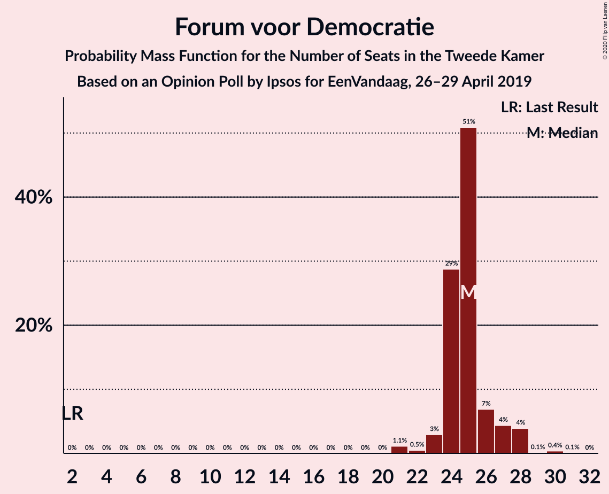

| Number of Seats | Probability | Accumulated | Special Marks |
|:---------------:|:-----------:|:-----------:|:-------------:|
| 2 | 0% | 100% | Last Result |
| 3 | 0% | 100% |  |
| 4 | 0% | 100% |  |
| 5 | 0% | 100% |  |
| 6 | 0% | 100% |  |
| 7 | 0% | 100% |  |
| 8 | 0% | 100% |  |
| 9 | 0% | 100% |  |
| 10 | 0% | 100% |  |
| 11 | 0% | 100% |  |
| 12 | 0% | 100% |  |
| 13 | 0% | 100% |  |
| 14 | 0% | 100% |  |
| 15 | 0% | 100% |  |
| 16 | 0% | 100% |  |
| 17 | 0% | 100% |  |
| 18 | 0% | 100% |  |
| 19 | 0% | 100% |  |
| 20 | 0% | 100% |  |
| 21 | 0.7% | 100% |  |
| 22 | 1.0% | 99.3% |  |
| 23 | 8% | 98% |  |
| 24 | 78% | 90% | Median |
| 25 | 3% | 12% |  |
| 26 | 8% | 9% |  |
| 27 | 0.3% | 0.8% |  |
| 28 | 0.2% | 0.6% |  |
| 29 | 0% | 0.3% |  |
| 30 | 0.2% | 0.3% |  |
| 31 | 0% | 0.1% |  |
| 32 | 0.1% | 0.1% |  |
| 33 | 0% | 0% |  |

### Partij voor de Vrijheid

*For a full overview of the results for this party, see the [Partij voor de Vrijheid](party-partijvoordevrijheid.html) page.*

| Number of Seats | Probability | Accumulated | Special Marks |
|:---------------:|:-----------:|:-----------:|:-------------:|
| 11 | 0.2% | 100% |  |
| 12 | 8% | 99.8% |  |
| 13 | 9% | 91% |  |
| 14 | 80% | 83% | Median |
| 15 | 2% | 2% |  |
| 16 | 0.4% | 0.5% |  |
| 17 | 0.1% | 0.1% |  |
| 18 | 0% | 0.1% |  |
| 19 | 0% | 0.1% |  |
| 20 | 0% | 0% | Last Result |

### Christen-Democratisch Appèl

*For a full overview of the results for this party, see the [Christen-Democratisch Appèl](party-christen-democratischappèl.html) page.*

| Number of Seats | Probability | Accumulated | Special Marks |
|:---------------:|:-----------:|:-----------:|:-------------:|
| 10 | 0% | 100% |  |
| 11 | 0.2% | 99.9% |  |
| 12 | 4% | 99.8% |  |
| 13 | 14% | 95% |  |
| 14 | 77% | 82% | Median |
| 15 | 1.0% | 5% |  |
| 16 | 3% | 4% |  |
| 17 | 0% | 0.8% |  |
| 18 | 0.8% | 0.8% |  |
| 19 | 0% | 0% | Last Result |

### GroenLinks

*For a full overview of the results for this party, see the [GroenLinks](party-groenlinks.html) page.*

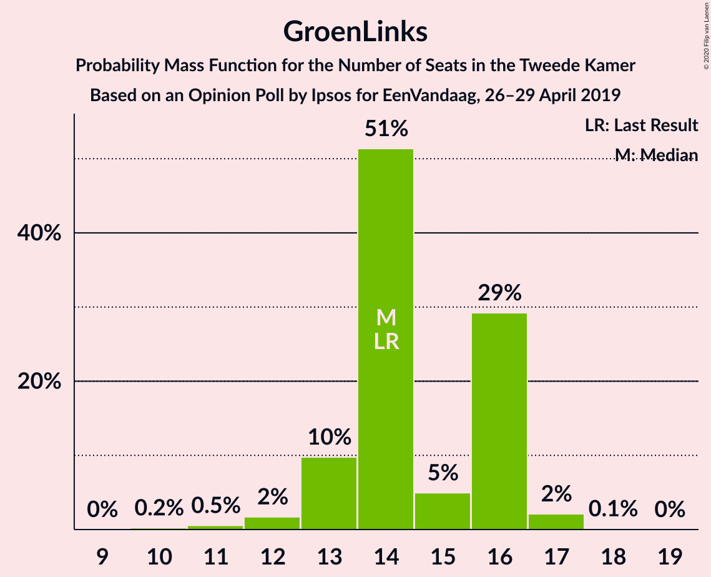

| Number of Seats | Probability | Accumulated | Special Marks |
|:---------------:|:-----------:|:-----------:|:-------------:|
| 11 | 0.1% | 100% |  |
| 12 | 0.1% | 99.9% |  |
| 13 | 3% | 99.8% |  |
| 14 | 12% | 97% | Last Result |
| 15 | 3% | 85% |  |
| 16 | 80% | 81% | Median |
| 17 | 0.9% | 0.9% |  |
| 18 | 0% | 0% |  |

### Democraten 66

*For a full overview of the results for this party, see the [Democraten 66](party-democraten66.html) page.*

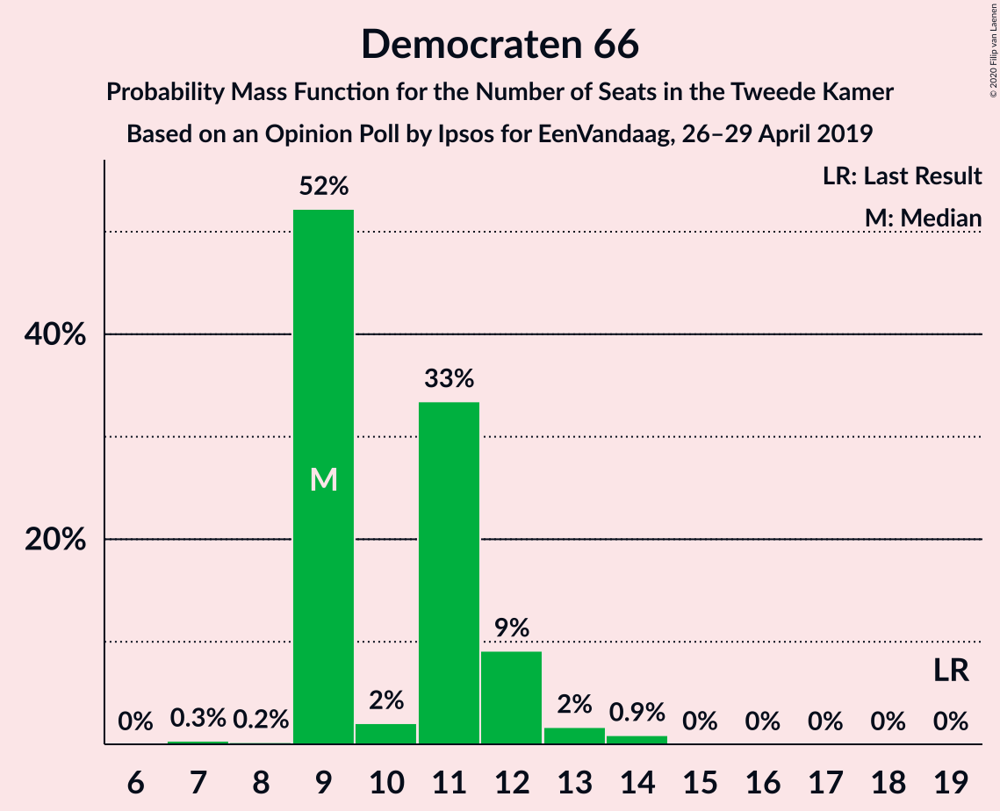

| Number of Seats | Probability | Accumulated | Special Marks |
|:---------------:|:-----------:|:-----------:|:-------------:|
| 8 | 0.3% | 100% |  |
| 9 | 5% | 99.7% |  |
| 10 | 1.0% | 95% |  |
| 11 | 5% | 94% |  |
| 12 | 85% | 90% | Median |
| 13 | 4% | 4% |  |
| 14 | 0% | 0.1% |  |
| 15 | 0% | 0% |  |
| 16 | 0% | 0% |  |
| 17 | 0% | 0% |  |
| 18 | 0% | 0% |  |
| 19 | 0% | 0% | Last Result |

### Partij van de Arbeid

*For a full overview of the results for this party, see the [Partij van de Arbeid](party-partijvandearbeid.html) page.*

| Number of Seats | Probability | Accumulated | Special Marks |
|:---------------:|:-----------:|:-----------:|:-------------:|
| 7 | 0.2% | 100% |  |
| 8 | 0.3% | 99.8% |  |
| 9 | 80% | 99.6% | Last Result, Median |
| 10 | 9% | 19% |  |
| 11 | 10% | 11% |  |
| 12 | 0.4% | 0.4% |  |
| 13 | 0.1% | 0.1% |  |
| 14 | 0% | 0% |  |

### Socialistische Partij

*For a full overview of the results for this party, see the [Socialistische Partij](party-socialistischepartij.html) page.*

| Number of Seats | Probability | Accumulated | Special Marks |
|:---------------:|:-----------:|:-----------:|:-------------:|
| 7 | 0.4% | 100% |  |
| 8 | 7% | 99.5% |  |
| 9 | 6% | 92% |  |
| 10 | 85% | 86% | Median |
| 11 | 0.1% | 2% |  |
| 12 | 0.8% | 2% |  |
| 13 | 0.8% | 0.8% |  |
| 14 | 0% | 0% | Last Result |

### Partij voor de Dieren

*For a full overview of the results for this party, see the [Partij voor de Dieren](party-partijvoordedieren.html) page.*

| Number of Seats | Probability | Accumulated | Special Marks |
|:---------------:|:-----------:|:-----------:|:-------------:|
| 5 | 0% | 100% | Last Result |
| 6 | 1.2% | 100% |  |
| 7 | 11% | 98.7% |  |
| 8 | 4% | 88% |  |
| 9 | 84% | 84% | Median |
| 10 | 0.1% | 0.1% |  |
| 11 | 0% | 0% |  |

### ChristenUnie

*For a full overview of the results for this party, see the [ChristenUnie](party-christenunie.html) page.*

| Number of Seats | Probability | Accumulated | Special Marks |
|:---------------:|:-----------:|:-----------:|:-------------:|
| 4 | 2% | 100% |  |
| 5 | 0.2% | 98% | Last Result |
| 6 | 5% | 98% |  |
| 7 | 92% | 93% | Median |
| 8 | 0.3% | 0.4% |  |
| 9 | 0.1% | 0.1% |  |
| 10 | 0% | 0% |  |

### 50Plus

*For a full overview of the results for this party, see the [50Plus](party-50plus.html) page.*

| Number of Seats | Probability | Accumulated | Special Marks |
|:---------------:|:-----------:|:-----------:|:-------------:|
| 3 | 0.9% | 100% |  |
| 4 | 76% | 99.1% | Last Result, Median |
| 5 | 12% | 23% |  |
| 6 | 1.4% | 11% |  |
| 7 | 0.9% | 9% |  |
| 8 | 8% | 8% |  |
| 9 | 0% | 0.1% |  |
| 10 | 0% | 0% |  |

### Staatkundig Gereformeerde Partij

*For a full overview of the results for this party, see the [Staatkundig Gereformeerde Partij](party-staatkundiggereformeerdepartij.html) page.*

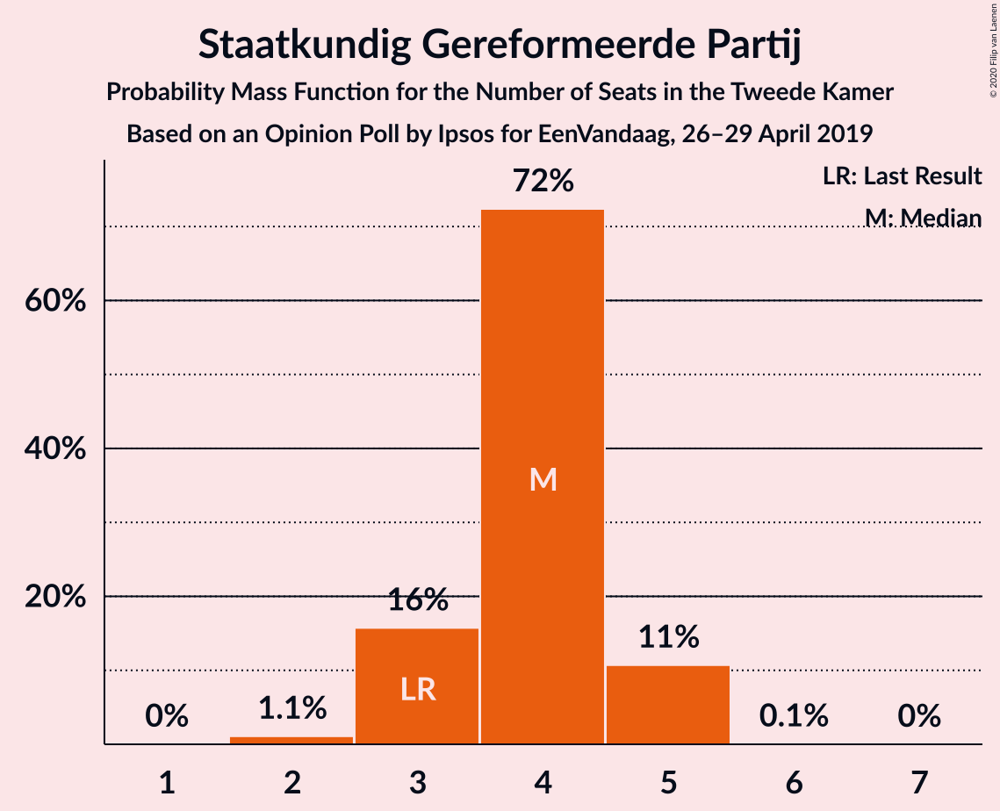

| Number of Seats | Probability | Accumulated | Special Marks |
|:---------------:|:-----------:|:-----------:|:-------------:|
| 1 | 0.2% | 100% |  |
| 2 | 4% | 99.8% |  |
| 3 | 86% | 96% | Last Result, Median |
| 4 | 10% | 10% |  |
| 5 | 0.1% | 0.2% |  |
| 6 | 0% | 0% |  |

### DENK

*For a full overview of the results for this party, see the [DENK](party-denk.html) page.*

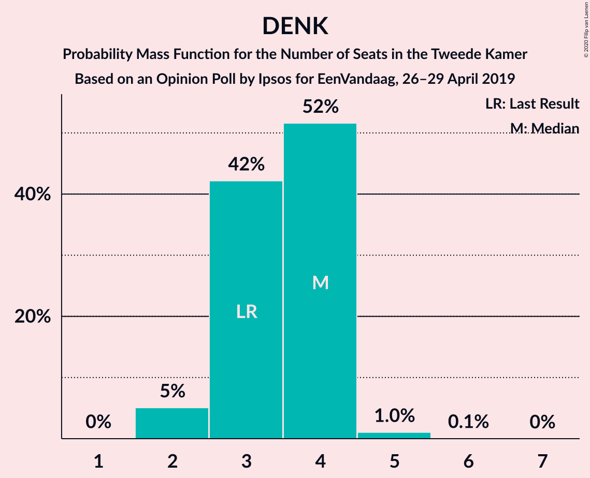

| Number of Seats | Probability | Accumulated | Special Marks |
|:---------------:|:-----------:|:-----------:|:-------------:|
| 2 | 5% | 100% |  |
| 3 | 86% | 95% | Last Result, Median |
| 4 | 6% | 9% |  |
| 5 | 3% | 3% |  |
| 6 | 0% | 0% |  |

## Coalitions

### Confidence Intervals

| Coalition | Last Result | Median | Majority? | 80% Confidence Interval | 90% Confidence Interval | 95% Confidence Interval | 99% Confidence Interval |
|:---------:|:-----------:|:------:|:---------:|:-----------------------:|:-----------------------:|:-----------------------:|:-----------------------:|
| Volkspartij voor Vrijheid en Democratie – Forum voor Democratie – Partij voor de Vrijheid – Christen-Democratisch Appèl – Staatkundig Gereformeerde Partij | 77 | 80 | 100% | 80 | 78–84 | 78–84 | 78–87 |
| Volkspartij voor Vrijheid en Democratie – Forum voor Democratie – Partij voor de Vrijheid – Christen-Democratisch Appèl | 74 | 77 | 92% | 77–78 | 74–81 | 74–81 | 74–84 |
| Volkspartij voor Vrijheid en Democratie – Christen-Democratisch Appèl – GroenLinks – Democraten 66 – ChristenUnie | 90 | 74 | 5% | 73–74 | 69–75 | 69–76 | 69–77 |
| Volkspartij voor Vrijheid en Democratie – Forum voor Democratie – Christen-Democratisch Appèl – 50Plus – Staatkundig Gereformeerde Partij | 61 | 70 | 2% | 70–74 | 70–75 | 70–75 | 70–78 |
| Volkspartij voor Vrijheid en Democratie – Christen-Democratisch Appèl – Democraten 66 – Partij van de Arbeid – ChristenUnie | 85 | 67 | 0% | 67–68 | 65–71 | 65–73 | 65–73 |
| Volkspartij voor Vrijheid en Democratie – Forum voor Democratie – Christen-Democratisch Appèl – 50Plus | 58 | 67 | 0.3% | 67–70 | 67–72 | 67–72 | 66–75 |
| Volkspartij voor Vrijheid en Democratie – Forum voor Democratie – Christen-Democratisch Appèl – Staatkundig Gereformeerde Partij | 57 | 66 | 0.2% | 66–67 | 66–70 | 66–70 | 66–73 |
| Christen-Democratisch Appèl – GroenLinks – Democraten 66 – Partij van de Arbeid – Socialistische Partij – ChristenUnie | 80 | 68 | 0% | 66–68 | 64–68 | 64–68 | 61–69 |
| Volkspartij voor Vrijheid en Democratie – Forum voor Democratie – Christen-Democratisch Appèl | 54 | 63 | 0% | 63–65 | 62–67 | 62–67 | 62–69 |
| Volkspartij voor Vrijheid en Democratie – Christen-Democratisch Appèl – Democraten 66 – ChristenUnie | 76 | 58 | 0% | 57–58 | 55–60 | 55–62 | 55–62 |
| Christen-Democratisch Appèl – GroenLinks – Democraten 66 – Partij van de Arbeid – ChristenUnie | 66 | 58 | 0% | 56–58 | 55–58 | 55–59 | 52–60 |
| Volkspartij voor Vrijheid en Democratie – Partij voor de Vrijheid – Christen-Democratisch Appèl | 72 | 53 | 0% | 53–54 | 48–57 | 48–58 | 48–60 |
| Volkspartij voor Vrijheid en Democratie – Christen-Democratisch Appèl – Democraten 66 | 71 | 51 | 0% | 50–53 | 48–55 | 48–55 | 48–56 |
| Volkspartij voor Vrijheid en Democratie – Christen-Democratisch Appèl – Partij van de Arbeid | 61 | 48 | 0% | 48–52 | 46–54 | 46–55 | 46–55 |
| Volkspartij voor Vrijheid en Democratie – Democraten 66 – Partij van de Arbeid | 61 | 46 | 0% | 46–49 | 45–52 | 45–53 | 45–54 |
| Volkspartij voor Vrijheid en Democratie – Christen-Democratisch Appèl | 52 | 39 | 0% | 39–41 | 36–44 | 36–44 | 36–45 |
| Volkspartij voor Vrijheid en Democratie – Partij van de Arbeid | 42 | 34 | 0% | 33–39 | 33–40 | 33–42 | 33–42 |
| Christen-Democratisch Appèl – Democraten 66 – Partij van de Arbeid | 47 | 35 | 0% | 35 | 35–36 | 32–38 | 32–39 |
| Christen-Democratisch Appèl – Partij van de Arbeid – ChristenUnie | 33 | 30 | 0% | 30 | 30–31 | 30–31 | 28–33 |
| Christen-Democratisch Appèl – Democraten 66 | 38 | 26 | 0% | 25–26 | 24–26 | 21–29 | 21–29 |
| Christen-Democratisch Appèl – Partij van de Arbeid | 28 | 23 | 0% | 23–24 | 23–24 | 23–25 | 22–29 |

### Volkspartij voor Vrijheid en Democratie – Forum voor Democratie – Partij voor de Vrijheid – Christen-Democratisch Appèl – Staatkundig Gereformeerde Partij

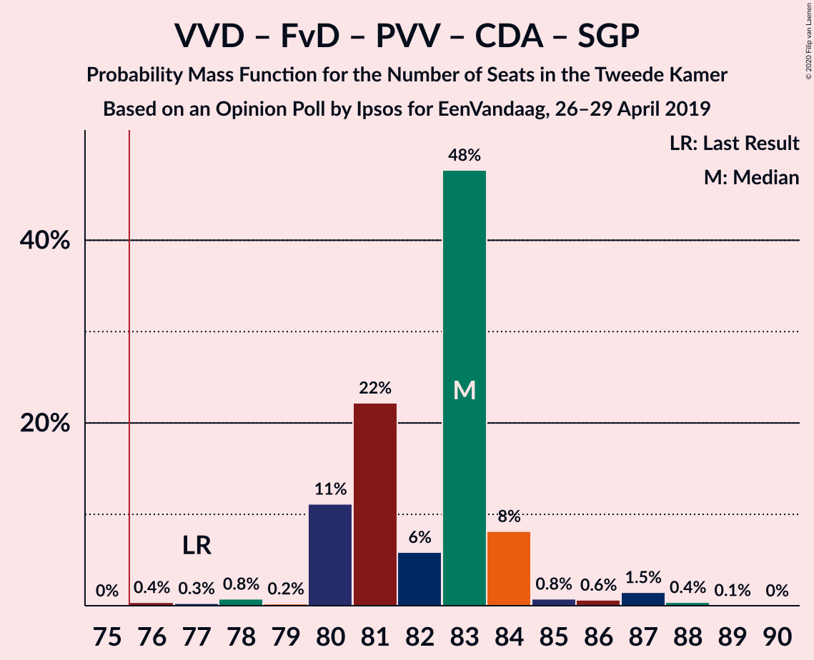

| Number of Seats | Probability | Accumulated | Special Marks |
|:---------------:|:-----------:|:-----------:|:-------------:|
| 77 | 0% | 100% | Last Result |
| 78 | 8% | 100% |  |
| 79 | 0% | 92% |  |
| 80 | 84% | 92% | Median |
| 81 | 0.2% | 8% |  |
| 82 | 0.9% | 7% |  |
| 83 | 0.8% | 6% |  |
| 84 | 4% | 6% |  |
| 85 | 0.3% | 2% |  |
| 86 | 0.2% | 1.3% |  |
| 87 | 0.7% | 1.1% |  |
| 88 | 0.2% | 0.4% |  |
| 89 | 0.2% | 0.2% |  |
| 90 | 0% | 0% |  |

### Volkspartij voor Vrijheid en Democratie – Forum voor Democratie – Partij voor de Vrijheid – Christen-Democratisch Appèl

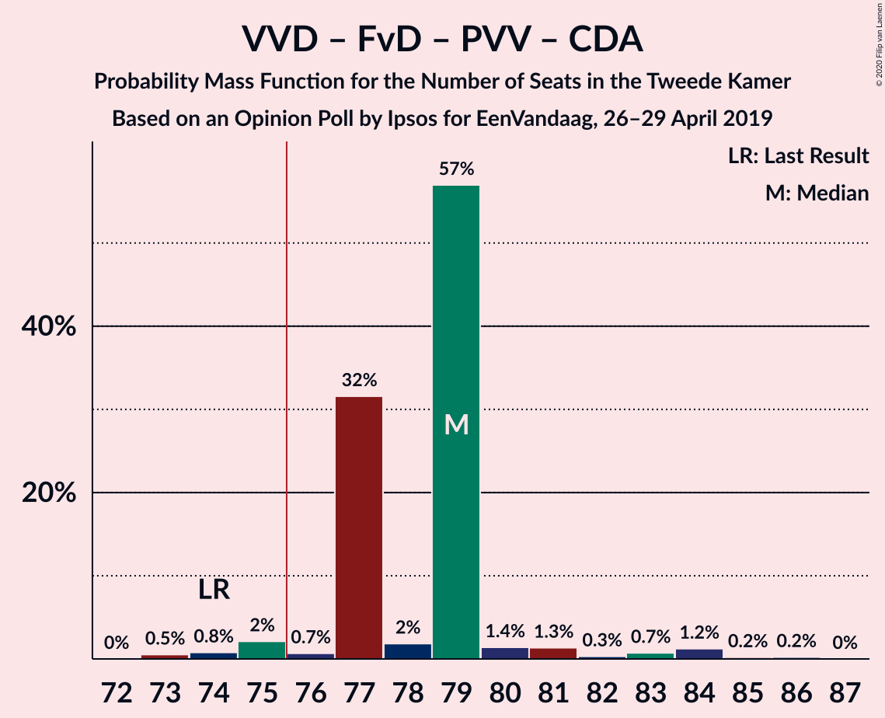

| Number of Seats | Probability | Accumulated | Special Marks |
|:---------------:|:-----------:|:-----------:|:-------------:|
| 73 | 0.1% | 100% |  |
| 74 | 8% | 99.9% | Last Result |
| 75 | 0% | 92% |  |
| 76 | 0.1% | 92% | Majority |
| 77 | 80% | 92% | Median |
| 78 | 5% | 11% |  |
| 79 | 0.1% | 6% |  |
| 80 | 0.8% | 6% |  |
| 81 | 4% | 6% |  |
| 82 | 0.2% | 2% |  |
| 83 | 0.1% | 1.4% |  |
| 84 | 1.1% | 1.3% |  |
| 85 | 0.2% | 0.2% |  |
| 86 | 0% | 0% |  |

### Volkspartij voor Vrijheid en Democratie – Christen-Democratisch Appèl – GroenLinks – Democraten 66 – ChristenUnie

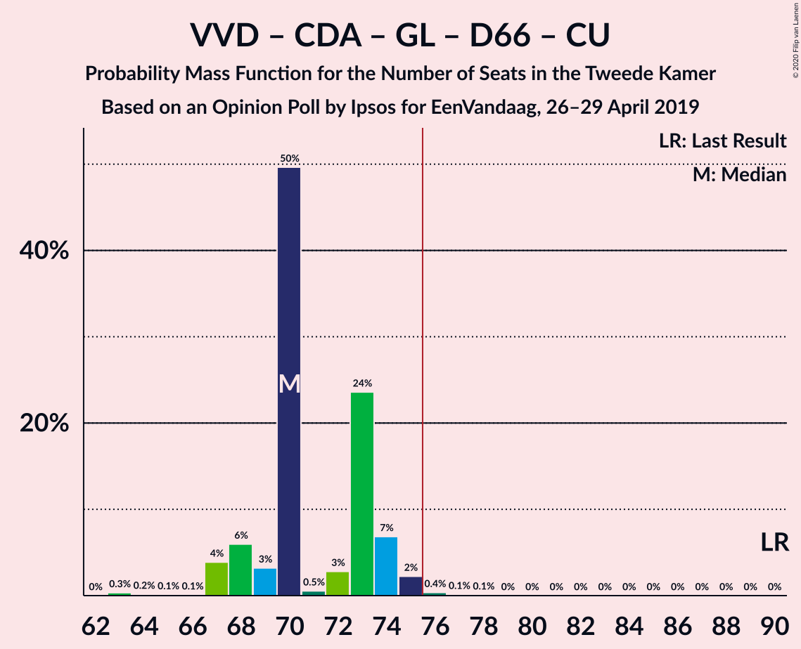

| Number of Seats | Probability | Accumulated | Special Marks |
|:---------------:|:-----------:|:-----------:|:-------------:|
| 66 | 0% | 100% |  |
| 67 | 0.2% | 99.9% |  |
| 68 | 0.1% | 99.7% |  |
| 69 | 8% | 99.6% |  |
| 70 | 1.2% | 91% |  |
| 71 | 0.1% | 90% |  |
| 72 | 0% | 90% |  |
| 73 | 5% | 90% |  |
| 74 | 79% | 85% | Median |
| 75 | 0.8% | 6% |  |
| 76 | 4% | 5% | Majority |
| 77 | 0.9% | 0.9% |  |
| 78 | 0% | 0% |  |
| 79 | 0% | 0% |  |
| 80 | 0% | 0% |  |
| 81 | 0% | 0% |  |
| 82 | 0% | 0% |  |
| 83 | 0% | 0% |  |
| 84 | 0% | 0% |  |
| 85 | 0% | 0% |  |
| 86 | 0% | 0% |  |
| 87 | 0% | 0% |  |
| 88 | 0% | 0% |  |
| 89 | 0% | 0% |  |
| 90 | 0% | 0% | Last Result |

### Volkspartij voor Vrijheid en Democratie – Forum voor Democratie – Christen-Democratisch Appèl – 50Plus – Staatkundig Gereformeerde Partij

| Number of Seats | Probability | Accumulated | Special Marks |
|:---------------:|:-----------:|:-----------:|:-------------:|
| 61 | 0% | 100% | Last Result |
| 62 | 0% | 100% |  |
| 63 | 0% | 100% |  |
| 64 | 0% | 100% |  |
| 65 | 0% | 100% |  |
| 66 | 0% | 100% |  |
| 67 | 0% | 100% |  |
| 68 | 0% | 100% |  |
| 69 | 0% | 99.9% |  |
| 70 | 77% | 99.9% | Median |
| 71 | 0.1% | 23% |  |
| 72 | 7% | 23% |  |
| 73 | 0.3% | 15% |  |
| 74 | 9% | 15% |  |
| 75 | 4% | 6% |  |
| 76 | 1.1% | 2% | Majority |
| 77 | 0.7% | 1.3% |  |
| 78 | 0.2% | 0.6% |  |
| 79 | 0% | 0.3% |  |
| 80 | 0.1% | 0.3% |  |
| 81 | 0% | 0.2% |  |
| 82 | 0.2% | 0.2% |  |
| 83 | 0% | 0% |  |

### Volkspartij voor Vrijheid en Democratie – Christen-Democratisch Appèl – Democraten 66 – Partij van de Arbeid – ChristenUnie

| Number of Seats | Probability | Accumulated | Special Marks |
|:---------------:|:-----------:|:-----------:|:-------------:|
| 62 | 0.1% | 100% |  |
| 63 | 0% | 99.9% |  |
| 64 | 0.1% | 99.8% |  |
| 65 | 9% | 99.7% |  |
| 66 | 0.2% | 91% |  |
| 67 | 77% | 91% | Median |
| 68 | 8% | 15% |  |
| 69 | 0.9% | 7% |  |
| 70 | 0.1% | 6% |  |
| 71 | 0.9% | 6% |  |
| 72 | 0.1% | 5% |  |
| 73 | 5% | 5% |  |
| 74 | 0% | 0% |  |
| 75 | 0% | 0% |  |
| 76 | 0% | 0% | Majority |
| 77 | 0% | 0% |  |
| 78 | 0% | 0% |  |
| 79 | 0% | 0% |  |
| 80 | 0% | 0% |  |
| 81 | 0% | 0% |  |
| 82 | 0% | 0% |  |
| 83 | 0% | 0% |  |
| 84 | 0% | 0% |  |
| 85 | 0% | 0% | Last Result |

### Volkspartij voor Vrijheid en Democratie – Forum voor Democratie – Christen-Democratisch Appèl – 50Plus

| Number of Seats | Probability | Accumulated | Special Marks |
|:---------------:|:-----------:|:-----------:|:-------------:|
| 58 | 0% | 100% | Last Result |
| 59 | 0% | 100% |  |
| 60 | 0% | 100% |  |
| 61 | 0% | 100% |  |
| 62 | 0% | 100% |  |
| 63 | 0% | 100% |  |
| 64 | 0% | 100% |  |
| 65 | 0% | 99.9% |  |
| 66 | 0.9% | 99.9% |  |
| 67 | 76% | 99.1% | Median |
| 68 | 0.2% | 23% |  |
| 69 | 4% | 22% |  |
| 70 | 11% | 18% |  |
| 71 | 0.1% | 7% |  |
| 72 | 5% | 7% |  |
| 73 | 0.9% | 2% |  |
| 74 | 0.9% | 2% |  |
| 75 | 0.3% | 0.6% |  |
| 76 | 0.1% | 0.3% | Majority |
| 77 | 0% | 0.2% |  |
| 78 | 0.2% | 0.2% |  |
| 79 | 0% | 0% |  |

### Volkspartij voor Vrijheid en Democratie – Forum voor Democratie – Christen-Democratisch Appèl – Staatkundig Gereformeerde Partij

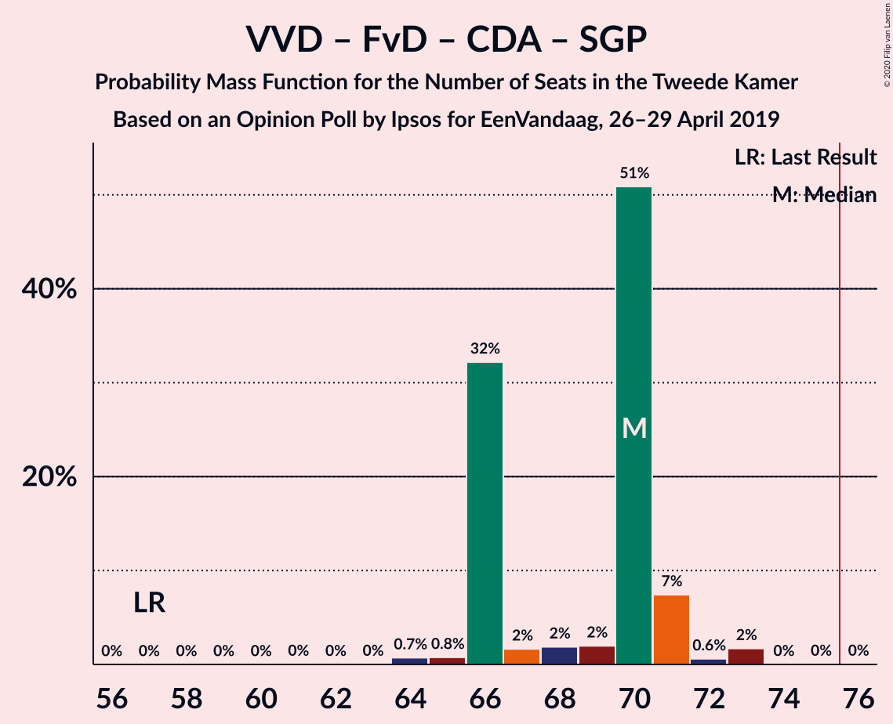

| Number of Seats | Probability | Accumulated | Special Marks |
|:---------------:|:-----------:|:-----------:|:-------------:|
| 57 | 0% | 100% | Last Result |
| 58 | 0% | 100% |  |
| 59 | 0% | 100% |  |
| 60 | 0% | 100% |  |
| 61 | 0% | 100% |  |
| 62 | 0% | 100% |  |
| 63 | 0% | 99.9% |  |
| 64 | 0% | 99.9% |  |
| 65 | 0.1% | 99.9% |  |
| 66 | 85% | 99.8% | Median |
| 67 | 9% | 15% |  |
| 68 | 0% | 6% |  |
| 69 | 0.2% | 6% |  |
| 70 | 5% | 6% |  |
| 71 | 0.1% | 1.3% |  |
| 72 | 0.7% | 1.2% |  |
| 73 | 0.2% | 0.5% |  |
| 74 | 0% | 0.3% |  |
| 75 | 0.1% | 0.3% |  |
| 76 | 0.2% | 0.2% | Majority |
| 77 | 0% | 0% |  |

### Christen-Democratisch Appèl – GroenLinks – Democraten 66 – Partij van de Arbeid – Socialistische Partij – ChristenUnie

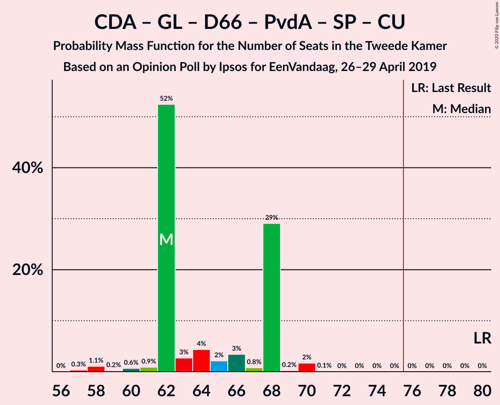

| Number of Seats | Probability | Accumulated | Special Marks |
|:---------------:|:-----------:|:-----------:|:-------------:|
| 58 | 0.2% | 100% |  |
| 59 | 0% | 99.8% |  |
| 60 | 0.1% | 99.8% |  |
| 61 | 1.0% | 99.6% |  |
| 62 | 0.3% | 98.7% |  |
| 63 | 0.2% | 98% |  |
| 64 | 8% | 98% |  |
| 65 | 0.1% | 90% |  |
| 66 | 8% | 90% |  |
| 67 | 4% | 82% |  |
| 68 | 76% | 78% | Median |
| 69 | 2% | 2% |  |
| 70 | 0% | 0% |  |
| 71 | 0% | 0% |  |
| 72 | 0% | 0% |  |
| 73 | 0% | 0% |  |
| 74 | 0% | 0% |  |
| 75 | 0% | 0% |  |
| 76 | 0% | 0% | Majority |
| 77 | 0% | 0% |  |
| 78 | 0% | 0% |  |
| 79 | 0% | 0% |  |
| 80 | 0% | 0% | Last Result |

### Volkspartij voor Vrijheid en Democratie – Forum voor Democratie – Christen-Democratisch Appèl

| Number of Seats | Probability | Accumulated | Special Marks |
|:---------------:|:-----------:|:-----------:|:-------------:|
| 54 | 0% | 100% | Last Result |
| 55 | 0% | 100% |  |
| 56 | 0% | 100% |  |
| 57 | 0% | 100% |  |
| 58 | 0% | 100% |  |
| 59 | 0% | 100% |  |
| 60 | 0% | 99.9% |  |
| 61 | 0.2% | 99.9% |  |
| 62 | 8% | 99.7% |  |
| 63 | 77% | 92% | Median |
| 64 | 4% | 14% |  |
| 65 | 4% | 10% |  |
| 66 | 0.1% | 6% |  |
| 67 | 5% | 6% |  |
| 68 | 0.1% | 2% |  |
| 69 | 1.1% | 1.4% |  |
| 70 | 0% | 0.3% |  |
| 71 | 0.1% | 0.3% |  |
| 72 | 0.2% | 0.2% |  |
| 73 | 0% | 0% |  |

### Volkspartij voor Vrijheid en Democratie – Christen-Democratisch Appèl – Democraten 66 – ChristenUnie

| Number of Seats | Probability | Accumulated | Special Marks |
|:---------------:|:-----------:|:-----------:|:-------------:|
| 52 | 0.1% | 100% |  |
| 53 | 0.2% | 99.9% |  |
| 54 | 0% | 99.6% |  |
| 55 | 8% | 99.6% |  |
| 56 | 0% | 91% |  |
| 57 | 5% | 91% |  |
| 58 | 76% | 86% | Median |
| 59 | 3% | 10% |  |
| 60 | 2% | 6% |  |
| 61 | 0% | 5% |  |
| 62 | 5% | 5% |  |
| 63 | 0% | 0% |  |
| 64 | 0% | 0% |  |
| 65 | 0% | 0% |  |
| 66 | 0% | 0% |  |
| 67 | 0% | 0% |  |
| 68 | 0% | 0% |  |
| 69 | 0% | 0% |  |
| 70 | 0% | 0% |  |
| 71 | 0% | 0% |  |
| 72 | 0% | 0% |  |
| 73 | 0% | 0% |  |
| 74 | 0% | 0% |  |
| 75 | 0% | 0% |  |
| 76 | 0% | 0% | Last Result, Majority |

### Christen-Democratisch Appèl – GroenLinks – Democraten 66 – Partij van de Arbeid – ChristenUnie

| Number of Seats | Probability | Accumulated | Special Marks |
|:---------------:|:-----------:|:-----------:|:-------------:|
| 48 | 0.2% | 100% |  |
| 49 | 0% | 99.8% |  |
| 50 | 0.1% | 99.8% |  |
| 51 | 0% | 99.7% |  |
| 52 | 0.8% | 99.6% |  |
| 53 | 0.1% | 98.9% |  |
| 54 | 0.3% | 98.8% |  |
| 55 | 5% | 98.5% |  |
| 56 | 13% | 93% |  |
| 57 | 0.1% | 80% |  |
| 58 | 76% | 80% | Median |
| 59 | 3% | 4% |  |
| 60 | 0.9% | 0.9% |  |
| 61 | 0% | 0% |  |
| 62 | 0% | 0% |  |
| 63 | 0% | 0% |  |
| 64 | 0% | 0% |  |
| 65 | 0% | 0% |  |
| 66 | 0% | 0% | Last Result |

### Volkspartij voor Vrijheid en Democratie – Partij voor de Vrijheid – Christen-Democratisch Appèl

| Number of Seats | Probability | Accumulated | Special Marks |
|:---------------:|:-----------:|:-----------:|:-------------:|
| 48 | 8% | 100% |  |
| 49 | 0.1% | 92% |  |
| 50 | 0.2% | 92% |  |
| 51 | 0% | 92% |  |
| 52 | 0.1% | 91% |  |
| 53 | 79% | 91% | Median |
| 54 | 4% | 12% |  |
| 55 | 0.1% | 8% |  |
| 56 | 2% | 8% |  |
| 57 | 1.1% | 6% |  |
| 58 | 4% | 5% |  |
| 59 | 0% | 0.8% |  |
| 60 | 0.7% | 0.7% |  |
| 61 | 0% | 0% |  |
| 62 | 0% | 0% |  |
| 63 | 0% | 0% |  |
| 64 | 0% | 0% |  |
| 65 | 0% | 0% |  |
| 66 | 0% | 0% |  |
| 67 | 0% | 0% |  |
| 68 | 0% | 0% |  |
| 69 | 0% | 0% |  |
| 70 | 0% | 0% |  |
| 71 | 0% | 0% |  |
| 72 | 0% | 0% | Last Result |

### Volkspartij voor Vrijheid en Democratie – Christen-Democratisch Appèl – Democraten 66

| Number of Seats | Probability | Accumulated | Special Marks |
|:---------------:|:-----------:|:-----------:|:-------------:|
| 46 | 0.1% | 100% |  |
| 47 | 0.1% | 99.9% |  |
| 48 | 8% | 99.8% |  |
| 49 | 0.3% | 92% |  |
| 50 | 4% | 91% |  |
| 51 | 77% | 87% | Median |
| 52 | 0.1% | 10% |  |
| 53 | 4% | 10% |  |
| 54 | 0.9% | 6% |  |
| 55 | 4% | 5% |  |
| 56 | 1.5% | 1.5% |  |
| 57 | 0% | 0% |  |
| 58 | 0% | 0% |  |
| 59 | 0% | 0% |  |
| 60 | 0% | 0% |  |
| 61 | 0% | 0% |  |
| 62 | 0% | 0% |  |
| 63 | 0% | 0% |  |
| 64 | 0% | 0% |  |
| 65 | 0% | 0% |  |
| 66 | 0% | 0% |  |
| 67 | 0% | 0% |  |
| 68 | 0% | 0% |  |
| 69 | 0% | 0% |  |
| 70 | 0% | 0% |  |
| 71 | 0% | 0% | Last Result |

### Volkspartij voor Vrijheid en Democratie – Christen-Democratisch Appèl – Partij van de Arbeid

| Number of Seats | Probability | Accumulated | Special Marks |
|:---------------:|:-----------:|:-----------:|:-------------:|
| 44 | 0% | 100% |  |
| 45 | 0% | 99.9% |  |
| 46 | 8% | 99.9% |  |
| 47 | 0.1% | 92% |  |
| 48 | 76% | 92% | Median |
| 49 | 3% | 15% |  |
| 50 | 0.2% | 12% |  |
| 51 | 0.2% | 12% |  |
| 52 | 5% | 12% |  |
| 53 | 0.2% | 6% |  |
| 54 | 1.5% | 6% |  |
| 55 | 5% | 5% |  |
| 56 | 0% | 0% |  |
| 57 | 0% | 0% |  |
| 58 | 0% | 0% |  |
| 59 | 0% | 0% |  |
| 60 | 0% | 0% |  |
| 61 | 0% | 0% | Last Result |

### Volkspartij voor Vrijheid en Democratie – Democraten 66 – Partij van de Arbeid

| Number of Seats | Probability | Accumulated | Special Marks |
|:---------------:|:-----------:|:-----------:|:-------------:|
| 42 | 0.1% | 100% |  |
| 43 | 0% | 99.9% |  |
| 44 | 0.1% | 99.9% |  |
| 45 | 8% | 99.8% |  |
| 46 | 80% | 91% | Median |
| 47 | 0.6% | 11% |  |
| 48 | 0.1% | 11% |  |
| 49 | 4% | 11% |  |
| 50 | 0.9% | 6% |  |
| 51 | 0% | 6% |  |
| 52 | 0.9% | 6% |  |
| 53 | 4% | 5% |  |
| 54 | 0.7% | 0.7% |  |
| 55 | 0% | 0% |  |
| 56 | 0% | 0% |  |
| 57 | 0% | 0% |  |
| 58 | 0% | 0% |  |
| 59 | 0% | 0% |  |
| 60 | 0% | 0% |  |
| 61 | 0% | 0% | Last Result |

### Volkspartij voor Vrijheid en Democratie – Christen-Democratisch Appèl

| Number of Seats | Probability | Accumulated | Special Marks |
|:---------------:|:-----------:|:-----------:|:-------------:|
| 34 | 0.1% | 100% |  |
| 35 | 0% | 99.9% |  |
| 36 | 8% | 99.9% |  |
| 37 | 0.1% | 92% |  |
| 38 | 0% | 92% |  |
| 39 | 77% | 91% | Median |
| 40 | 3% | 15% |  |
| 41 | 5% | 12% |  |
| 42 | 0.4% | 7% |  |
| 43 | 0.8% | 6% |  |
| 44 | 5% | 6% |  |
| 45 | 0.7% | 0.7% |  |
| 46 | 0% | 0% |  |
| 47 | 0% | 0% |  |
| 48 | 0% | 0% |  |
| 49 | 0% | 0% |  |
| 50 | 0% | 0% |  |
| 51 | 0% | 0% |  |
| 52 | 0% | 0% | Last Result |

### Volkspartij voor Vrijheid en Democratie – Partij van de Arbeid

| Number of Seats | Probability | Accumulated | Special Marks |
|:---------------:|:-----------:|:-----------:|:-------------:|
| 32 | 0.1% | 100% |  |
| 33 | 11% | 99.9% |  |
| 34 | 76% | 89% | Median |
| 35 | 0.1% | 12% |  |
| 36 | 0.9% | 12% |  |
| 37 | 0.3% | 11% |  |
| 38 | 0.5% | 11% |  |
| 39 | 2% | 10% |  |
| 40 | 4% | 9% |  |
| 41 | 0.1% | 5% |  |
| 42 | 5% | 5% | Last Result |
| 43 | 0% | 0% |  |

### Christen-Democratisch Appèl – Democraten 66 – Partij van de Arbeid

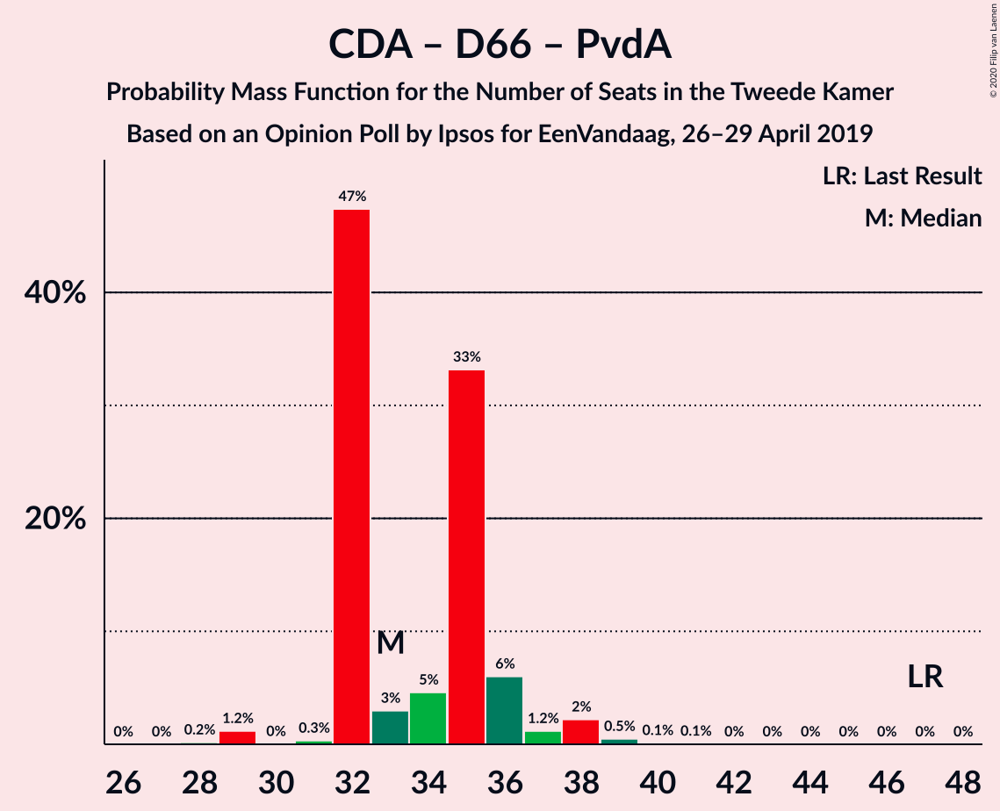

| Number of Seats | Probability | Accumulated | Special Marks |
|:---------------:|:-----------:|:-----------:|:-------------:|
| 29 | 0.3% | 100% |  |
| 30 | 0.1% | 99.7% |  |
| 31 | 0% | 99.7% |  |
| 32 | 4% | 99.6% |  |
| 33 | 0.3% | 95% |  |
| 34 | 0.2% | 95% |  |
| 35 | 89% | 95% | Median |
| 36 | 1.0% | 6% |  |
| 37 | 1.1% | 5% |  |
| 38 | 3% | 4% |  |
| 39 | 0.8% | 0.8% |  |
| 40 | 0% | 0% |  |
| 41 | 0% | 0% |  |
| 42 | 0% | 0% |  |
| 43 | 0% | 0% |  |
| 44 | 0% | 0% |  |
| 45 | 0% | 0% |  |
| 46 | 0% | 0% |  |
| 47 | 0% | 0% | Last Result |

### Christen-Democratisch Appèl – Partij van de Arbeid – ChristenUnie

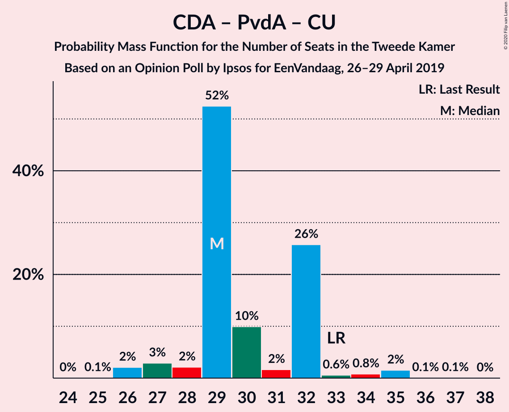

| Number of Seats | Probability | Accumulated | Special Marks |
|:---------------:|:-----------:|:-----------:|:-------------:|
| 26 | 0.3% | 100% |  |
| 27 | 0.1% | 99.6% |  |
| 28 | 0.8% | 99.6% |  |
| 29 | 0.2% | 98.8% |  |
| 30 | 90% | 98.6% | Median |
| 31 | 7% | 8% |  |
| 32 | 0.4% | 1.3% |  |
| 33 | 0.8% | 0.9% | Last Result |
| 34 | 0% | 0.1% |  |
| 35 | 0% | 0.1% |  |
| 36 | 0% | 0% |  |

### Christen-Democratisch Appèl – Democraten 66

| Number of Seats | Probability | Accumulated | Special Marks |
|:---------------:|:-----------:|:-----------:|:-------------:|
| 21 | 4% | 100% |  |
| 22 | 0.2% | 96% |  |
| 23 | 0.3% | 96% |  |
| 24 | 4% | 95% |  |
| 25 | 9% | 91% |  |
| 26 | 78% | 82% | Median |
| 27 | 0.2% | 4% |  |
| 28 | 0.8% | 4% |  |
| 29 | 3% | 3% |  |
| 30 | 0% | 0% |  |
| 31 | 0% | 0% |  |
| 32 | 0% | 0% |  |
| 33 | 0% | 0% |  |
| 34 | 0% | 0% |  |
| 35 | 0% | 0% |  |
| 36 | 0% | 0% |  |
| 37 | 0% | 0% |  |
| 38 | 0% | 0% | Last Result |

### Christen-Democratisch Appèl – Partij van de Arbeid

| Number of Seats | Probability | Accumulated | Special Marks |
|:---------------:|:-----------:|:-----------:|:-------------:|
| 20 | 0.3% | 100% |  |
| 21 | 0.1% | 99.6% |  |
| 22 | 0.1% | 99.6% |  |
| 23 | 89% | 99.4% | Median |
| 24 | 6% | 11% |  |
| 25 | 3% | 4% |  |
| 26 | 0% | 1.1% |  |
| 27 | 0.1% | 1.0% |  |
| 28 | 0.2% | 0.9% | Last Result |
| 29 | 0.8% | 0.8% |  |
| 30 | 0% | 0% |  |

## Technical Information

### Opinion Poll

+ **Polling firm:** Ipsos
+ **Commissioner(s):** EenVandaag
+ **Fieldwork period:** 26–29 April 2019

### Calculations

+ **Sample size:** 1048
+ **Simulations done:** 131,072
+ **Error estimate:** 2.41%

