# Opinion Poll by Peil.nl, 6–12 May 2019

<a href="#voting-intentions">Voting Intentions</a> | <a href="#seats">Seats</a> | <a href="#coalitions">Coalitions</a> | <a href="#technical-information">Technical Information</a>

## Voting Intentions

### Confidence Intervals

| Party | Last Result | Poll Result | 80% Confidence Interval | 90% Confidence Interval | 95% Confidence Interval | 99% Confidence Interval |
|:-----:|:-----------:|:-----------:|:-----------------------:|:-----------------------:|:-----------------------:|:-----------------------:|
| Forum voor Democratie | 1.8% | 17.3% | 16.5–18.3% |16.2–18.5% |16.0–18.7% |15.6–19.2% |
| Volkspartij voor Vrijheid en Democratie | 21.3% | 16.0% | 15.2–16.9% |14.9–17.1% |14.7–17.4% |14.3–17.8% |
| GroenLinks | 9.1% | 10.7% | 10.0–11.4% |9.8–11.6% |9.6–11.8% |9.3–12.2% |
| Christen-Democratisch Appèl | 12.4% | 10.0% | 9.3–10.7% |9.1–10.9% |9.0–11.1% |8.7–11.5% |
| Partij van de Arbeid | 5.7% | 10.0% | 9.3–10.7% |9.1–10.9% |9.0–11.1% |8.7–11.5% |
| Democraten 66 | 12.2% | 7.3% | 6.8–8.0% |6.6–8.2% |6.4–8.3% |6.2–8.6% |
| Partij voor de Vrijheid | 13.1% | 6.0% | 5.5–6.6% |5.3–6.8% |5.2–6.9% |5.0–7.2% |
| Socialistische Partij | 9.1% | 5.3% | 4.8–5.9% |4.7–6.1% |4.6–6.2% |4.4–6.5% |
| Partij voor de Dieren | 3.2% | 5.3% | 4.8–5.9% |4.7–6.1% |4.6–6.2% |4.4–6.5% |
| ChristenUnie | 3.4% | 4.7% | 4.2–5.2% |4.1–5.3% |4.0–5.5% |3.7–5.8% |
| 50Plus | 3.1% | 2.7% | 2.3–3.1% |2.2–3.2% |2.1–3.3% |2.0–3.5% |
| DENK | 2.1% | 2.7% | 2.3–3.1% |2.2–3.2% |2.1–3.3% |2.0–3.5% |
| Staatkundig Gereformeerde Partij | 2.1% | 1.3% | 1.1–1.6% |1.0–1.7% |1.0–1.8% |0.9–2.0% |

*Note:* The poll result column reflects the actual value used in the calculations. Published results may vary slightly, and in addition be rounded to fewer digits.

## Seats

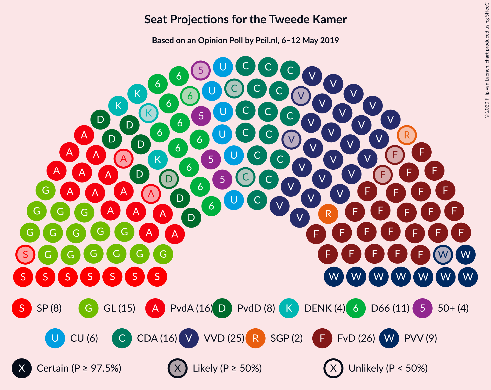

### Confidence Intervals

| Party | Last Result | Median | 80% Confidence Interval | 90% Confidence Interval | 95% Confidence Interval | 99% Confidence Interval |
|:-----:|:-----------:|:------:|:-----------------------:|:-----------------------:|:-----------------------:|:-----------------------:|
| <a href="#forum-voor-democratie">Forum voor Democratie</a> | 2 | 26 | 25–26 |25–27 |24–27 |23–29 |
| <a href="#volkspartij-voor-vrijheid-en-democratie">Volkspartij voor Vrijheid en Democratie</a> | 33 | 26 | 24–27 |23–27 |23–27 |22–28 |
| <a href="#groenlinks">GroenLinks</a> | 14 | 17 | 14–18 |14–18 |14–18 |14–18 |
| <a href="#christen-democratisch-appèl">Christen-Democratisch Appèl</a> | 19 | 15 | 14–16 |13–16 |13–17 |13–18 |
| <a href="#partij-van-de-arbeid">Partij van de Arbeid</a> | 9 | 15 | 14–17 |14–17 |14–18 |13–18 |
| <a href="#democraten-66">Democraten 66</a> | 19 | 11 | 10–12 |10–12 |9–12 |9–14 |
| <a href="#partij-voor-de-vrijheid">Partij voor de Vrijheid</a> | 20 | 8 | 7–9 |7–10 |7–10 |7–11 |
| <a href="#socialistische-partij">Socialistische Partij</a> | 14 | 8 | 7–9 |7–9 |7–9 |6–10 |
| <a href="#partij-voor-de-dieren">Partij voor de Dieren</a> | 5 | 7 | 6–9 |6–9 |6–10 |6–10 |
| <a href="#christenunie">ChristenUnie</a> | 5 | 7 | 6–8 |6–8 |6–8 |5–8 |
| <a href="#50plus">50Plus</a> | 4 | 4 | 4–5 |4–5 |3–5 |3–5 |
| <a href="#denk">DENK</a> | 3 | 4 | 3–5 |3–5 |3–5 |2–5 |
| <a href="#staatkundig-gereformeerde-partij">Staatkundig Gereformeerde Partij</a> | 3 | 2 | 1–2 |1–2 |1–2 |1–3 |

### Forum voor Democratie

*For a full overview of the results for this party, see the [Forum voor Democratie](party-forumvoordemocratie.html) page.*

| Number of Seats | Probability | Accumulated | Special Marks |
|:---------------:|:-----------:|:-----------:|:-------------:|
| 2 | 0% | 100% | Last Result |
| 3 | 0% | 100% |  |
| 4 | 0% | 100% |  |
| 5 | 0% | 100% |  |
| 6 | 0% | 100% |  |
| 7 | 0% | 100% |  |
| 8 | 0% | 100% |  |
| 9 | 0% | 100% |  |
| 10 | 0% | 100% |  |
| 11 | 0% | 100% |  |
| 12 | 0% | 100% |  |
| 13 | 0% | 100% |  |
| 14 | 0% | 100% |  |
| 15 | 0% | 100% |  |
| 16 | 0% | 100% |  |
| 17 | 0% | 100% |  |
| 18 | 0% | 100% |  |
| 19 | 0% | 100% |  |
| 20 | 0% | 100% |  |
| 21 | 0% | 100% |  |
| 22 | 0% | 100% |  |
| 23 | 1.2% | 100% |  |
| 24 | 1.4% | 98.8% |  |
| 25 | 24% | 97% |  |
| 26 | 64% | 73% | Median |
| 27 | 7% | 9% |  |
| 28 | 1.1% | 2% |  |
| 29 | 1.2% | 1.3% |  |
| 30 | 0.1% | 0.1% |  |
| 31 | 0% | 0% |  |

### Volkspartij voor Vrijheid en Democratie

*For a full overview of the results for this party, see the [Volkspartij voor Vrijheid en Democratie](party-volkspartijvoorvrijheidendemocratie.html) page.*

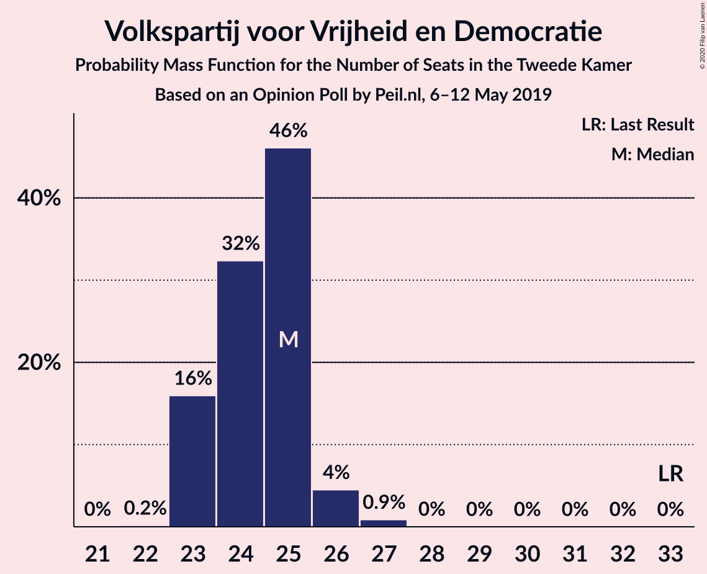

| Number of Seats | Probability | Accumulated | Special Marks |
|:---------------:|:-----------:|:-----------:|:-------------:|
| 21 | 0.1% | 100% |  |
| 22 | 0.5% | 99.9% |  |
| 23 | 5% | 99.4% |  |
| 24 | 15% | 95% |  |
| 25 | 26% | 79% |  |
| 26 | 38% | 53% | Median |
| 27 | 13% | 14% |  |
| 28 | 1.0% | 1.0% |  |
| 29 | 0% | 0% |  |
| 30 | 0% | 0% |  |
| 31 | 0% | 0% |  |
| 32 | 0% | 0% |  |
| 33 | 0% | 0% | Last Result |

### GroenLinks

*For a full overview of the results for this party, see the [GroenLinks](party-groenlinks.html) page.*

| Number of Seats | Probability | Accumulated | Special Marks |
|:---------------:|:-----------:|:-----------:|:-------------:|
| 13 | 0.2% | 100% |  |
| 14 | 11% | 99.8% | Last Result |
| 15 | 2% | 89% |  |
| 16 | 23% | 87% |  |
| 17 | 34% | 64% | Median |
| 18 | 30% | 30% |  |
| 19 | 0.1% | 0.1% |  |
| 20 | 0% | 0% |  |

### Christen-Democratisch Appèl

*For a full overview of the results for this party, see the [Christen-Democratisch Appèl](party-christen-democratischappèl.html) page.*

| Number of Seats | Probability | Accumulated | Special Marks |
|:---------------:|:-----------:|:-----------:|:-------------:|
| 12 | 0.1% | 100% |  |
| 13 | 5% | 99.9% |  |
| 14 | 32% | 95% |  |
| 15 | 50% | 63% | Median |
| 16 | 8% | 13% |  |
| 17 | 4% | 4% |  |
| 18 | 0.5% | 0.5% |  |
| 19 | 0% | 0% | Last Result |

### Partij van de Arbeid

*For a full overview of the results for this party, see the [Partij van de Arbeid](party-partijvandearbeid.html) page.*

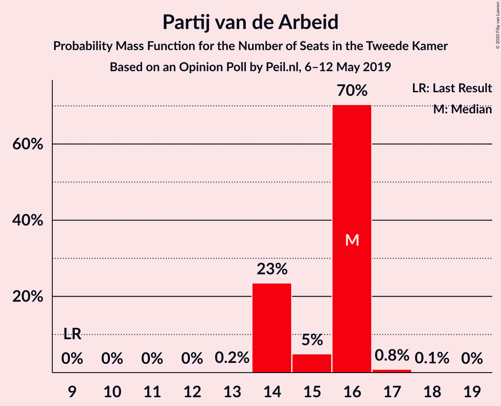

| Number of Seats | Probability | Accumulated | Special Marks |
|:---------------:|:-----------:|:-----------:|:-------------:|
| 9 | 0% | 100% | Last Result |
| 10 | 0% | 100% |  |
| 11 | 0% | 100% |  |
| 12 | 0% | 100% |  |
| 13 | 1.5% | 100% |  |
| 14 | 13% | 98.5% |  |
| 15 | 37% | 86% | Median |
| 16 | 13% | 49% |  |
| 17 | 31% | 35% |  |
| 18 | 4% | 5% |  |
| 19 | 0.4% | 0.4% |  |
| 20 | 0% | 0% |  |

### Democraten 66

*For a full overview of the results for this party, see the [Democraten 66](party-democraten66.html) page.*

| Number of Seats | Probability | Accumulated | Special Marks |
|:---------------:|:-----------:|:-----------:|:-------------:|
| 9 | 4% | 100% |  |
| 10 | 20% | 96% |  |
| 11 | 40% | 76% | Median |
| 12 | 35% | 37% |  |
| 13 | 0.9% | 2% |  |
| 14 | 0.8% | 0.8% |  |
| 15 | 0% | 0% |  |
| 16 | 0% | 0% |  |
| 17 | 0% | 0% |  |
| 18 | 0% | 0% |  |
| 19 | 0% | 0% | Last Result |

### Partij voor de Vrijheid

*For a full overview of the results for this party, see the [Partij voor de Vrijheid](party-partijvoordevrijheid.html) page.*

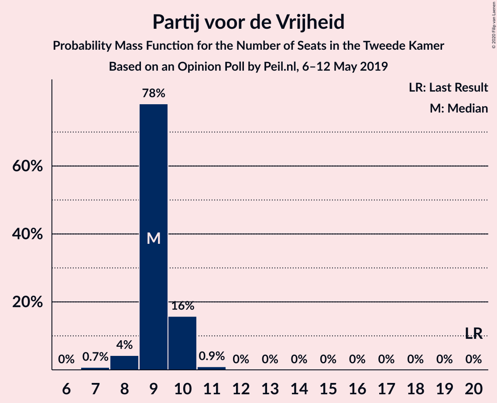

| Number of Seats | Probability | Accumulated | Special Marks |
|:---------------:|:-----------:|:-----------:|:-------------:|
| 7 | 24% | 100% |  |
| 8 | 37% | 76% | Median |
| 9 | 30% | 39% |  |
| 10 | 9% | 10% |  |
| 11 | 1.3% | 1.3% |  |
| 12 | 0% | 0% |  |
| 13 | 0% | 0% |  |
| 14 | 0% | 0% |  |
| 15 | 0% | 0% |  |
| 16 | 0% | 0% |  |
| 17 | 0% | 0% |  |
| 18 | 0% | 0% |  |
| 19 | 0% | 0% |  |
| 20 | 0% | 0% | Last Result |

### Socialistische Partij

*For a full overview of the results for this party, see the [Socialistische Partij](party-socialistischepartij.html) page.*

| Number of Seats | Probability | Accumulated | Special Marks |
|:---------------:|:-----------:|:-----------:|:-------------:|
| 6 | 1.3% | 100% |  |
| 7 | 30% | 98.7% |  |
| 8 | 43% | 68% | Median |
| 9 | 24% | 25% |  |
| 10 | 2% | 2% |  |
| 11 | 0% | 0% |  |
| 12 | 0% | 0% |  |
| 13 | 0% | 0% |  |
| 14 | 0% | 0% | Last Result |

### Partij voor de Dieren

*For a full overview of the results for this party, see the [Partij voor de Dieren](party-partijvoordedieren.html) page.*

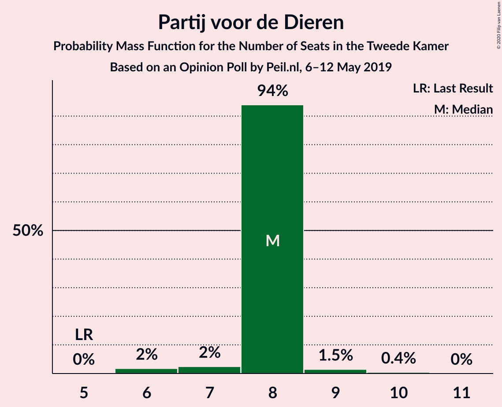

| Number of Seats | Probability | Accumulated | Special Marks |
|:---------------:|:-----------:|:-----------:|:-------------:|
| 5 | 0% | 100% | Last Result |
| 6 | 37% | 100% |  |
| 7 | 26% | 63% | Median |
| 8 | 22% | 37% |  |
| 9 | 12% | 15% |  |
| 10 | 3% | 3% |  |
| 11 | 0% | 0% |  |

### ChristenUnie

*For a full overview of the results for this party, see the [ChristenUnie](party-christenunie.html) page.*

| Number of Seats | Probability | Accumulated | Special Marks |
|:---------------:|:-----------:|:-----------:|:-------------:|
| 5 | 0.6% | 100% | Last Result |
| 6 | 24% | 99.4% |  |
| 7 | 61% | 75% | Median |
| 8 | 14% | 14% |  |
| 9 | 0.2% | 0.2% |  |
| 10 | 0% | 0% |  |

### 50Plus

*For a full overview of the results for this party, see the [50Plus](party-50plus.html) page.*

| Number of Seats | Probability | Accumulated | Special Marks |
|:---------------:|:-----------:|:-----------:|:-------------:|
| 2 | 0.4% | 100% |  |
| 3 | 3% | 99.6% |  |
| 4 | 68% | 97% | Last Result, Median |
| 5 | 29% | 29% |  |
| 6 | 0% | 0% |  |

### DENK

*For a full overview of the results for this party, see the [DENK](party-denk.html) page.*

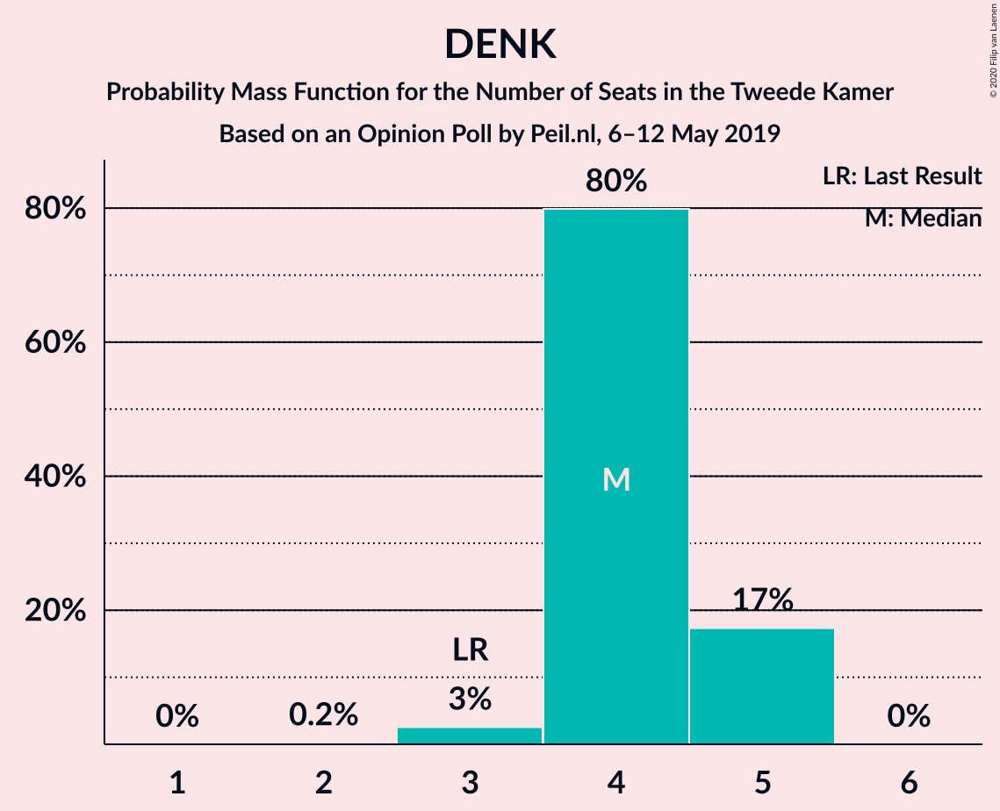

| Number of Seats | Probability | Accumulated | Special Marks |
|:---------------:|:-----------:|:-----------:|:-------------:|
| 2 | 0.6% | 100% |  |
| 3 | 45% | 99.4% | Last Result |
| 4 | 31% | 55% | Median |
| 5 | 23% | 23% |  |
| 6 | 0% | 0% |  |

### Staatkundig Gereformeerde Partij

*For a full overview of the results for this party, see the [Staatkundig Gereformeerde Partij](party-staatkundiggereformeerdepartij.html) page.*

| Number of Seats | Probability | Accumulated | Special Marks |
|:---------------:|:-----------:|:-----------:|:-------------:|
| 1 | 45% | 100% |  |
| 2 | 54% | 55% | Median |
| 3 | 1.0% | 1.0% | Last Result |
| 4 | 0% | 0% |  |

## Coalitions

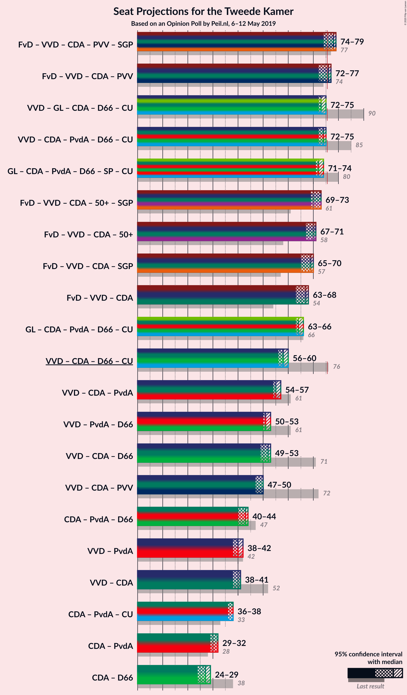

### Confidence Intervals

| Coalition | Last Result | Median | Majority? | 80% Confidence Interval | 90% Confidence Interval | 95% Confidence Interval | 99% Confidence Interval |
|:---------:|:-----------:|:------:|:---------:|:-----------------------:|:-----------------------:|:-----------------------:|:-----------------------:|
| Forum voor Democratie – Volkspartij voor Vrijheid en Democratie – Christen-Democratisch Appèl – Partij voor de Vrijheid – Staatkundig Gereformeerde Partij | 77 | 76 | 72% | 75–76 | 74–78 | 74–78 | 74–80 |
| Volkspartij voor Vrijheid en Democratie – GroenLinks – Christen-Democratisch Appèl – Democraten 66 – ChristenUnie | 90 | 75 | 30% | 72–78 | 71–78 | 70–78 | 70–79 |
| Forum voor Democratie – Volkspartij voor Vrijheid en Democratie – Christen-Democratisch Appèl – Partij voor de Vrijheid | 74 | 74 | 7% | 73–75 | 73–76 | 73–77 | 72–78 |
| GroenLinks – Christen-Democratisch Appèl – Partij van de Arbeid – Democraten 66 – Socialistische Partij – ChristenUnie | 80 | 74 | 7% | 70–75 | 70–76 | 70–76 | 69–76 |
| Volkspartij voor Vrijheid en Democratie – Christen-Democratisch Appèl – Partij van de Arbeid – Democraten 66 – ChristenUnie | 85 | 75 | 13% | 71–76 | 71–76 | 70–76 | 69–78 |
| Forum voor Democratie – Volkspartij voor Vrijheid en Democratie – Christen-Democratisch Appèl – 50Plus – Staatkundig Gereformeerde Partij | 61 | 71 | 0.3% | 71–73 | 70–73 | 69–74 | 68–75 |
| Forum voor Democratie – Volkspartij voor Vrijheid en Democratie – Christen-Democratisch Appèl – 50Plus | 58 | 70 | 0% | 69–71 | 68–71 | 68–73 | 67–74 |
| Forum voor Democratie – Volkspartij voor Vrijheid en Democratie – Christen-Democratisch Appèl – Staatkundig Gereformeerde Partij | 57 | 67 | 0% | 66–69 | 66–69 | 65–70 | 64–71 |
| Forum voor Democratie – Volkspartij voor Vrijheid en Democratie – Christen-Democratisch Appèl | 54 | 66 | 0% | 64–67 | 64–67 | 64–68 | 63–70 |
| GroenLinks – Christen-Democratisch Appèl – Partij van de Arbeid – Democraten 66 – ChristenUnie | 66 | 66 | 0% | 62–67 | 61–67 | 61–67 | 61–68 |
| Volkspartij voor Vrijheid en Democratie – Christen-Democratisch Appèl – Democraten 66 – ChristenUnie | 76 | 58 | 0% | 56–60 | 54–60 | 54–60 | 54–63 |
| Volkspartij voor Vrijheid en Democratie – Christen-Democratisch Appèl – Partij van de Arbeid | 61 | 56 | 0% | 53–58 | 53–58 | 52–58 | 52–59 |
| Volkspartij voor Vrijheid en Democratie – Christen-Democratisch Appèl – Democraten 66 | 71 | 51 | 0% | 50–53 | 48–53 | 48–54 | 48–55 |
| Volkspartij voor Vrijheid en Democratie – Partij van de Arbeid – Democraten 66 | 61 | 53 | 0% | 51–53 | 50–53 | 49–53 | 47–54 |
| Volkspartij voor Vrijheid en Democratie – Christen-Democratisch Appèl – Partij voor de Vrijheid | 72 | 48 | 0% | 47–50 | 47–50 | 47–52 | 46–54 |
| Christen-Democratisch Appèl – Partij van de Arbeid – Democraten 66 | 47 | 42 | 0% | 39–43 | 39–44 | 39–44 | 38–45 |
| Volkspartij voor Vrijheid en Democratie – Christen-Democratisch Appèl | 52 | 40 | 0% | 38–41 | 38–41 | 38–43 | 37–44 |
| Volkspartij voor Vrijheid en Democratie – Partij van de Arbeid | 42 | 41 | 0% | 39–43 | 39–43 | 38–43 | 37–43 |
| Christen-Democratisch Appèl – Partij van de Arbeid – ChristenUnie | 33 | 37 | 0% | 35–40 | 35–40 | 34–40 | 34–40 |
| Christen-Democratisch Appèl – Partij van de Arbeid | 28 | 30 | 0% | 28–32 | 28–32 | 28–32 | 27–34 |
| Christen-Democratisch Appèl – Democraten 66 | 38 | 26 | 0% | 25–28 | 23–28 | 23–28 | 23–29 |

### Forum voor Democratie – Volkspartij voor Vrijheid en Democratie – Christen-Democratisch Appèl – Partij voor de Vrijheid – Staatkundig Gereformeerde Partij

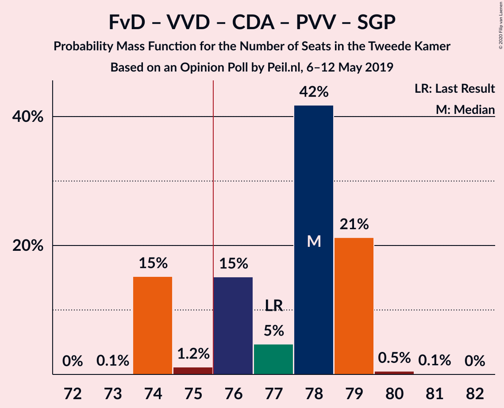

| Number of Seats | Probability | Accumulated | Special Marks |
|:---------------:|:-----------:|:-----------:|:-------------:|
| 72 | 0.1% | 100% |  |
| 73 | 0.4% | 99.9% |  |
| 74 | 9% | 99.5% |  |
| 75 | 18% | 90% |  |
| 76 | 62% | 72% | Majority |
| 77 | 3% | 10% | Last Result, Median |
| 78 | 5% | 7% |  |
| 79 | 1.3% | 2% |  |
| 80 | 0.7% | 0.8% |  |
| 81 | 0% | 0.1% |  |
| 82 | 0% | 0.1% |  |
| 83 | 0% | 0% |  |

### Volkspartij voor Vrijheid en Democratie – GroenLinks – Christen-Democratisch Appèl – Democraten 66 – ChristenUnie

| Number of Seats | Probability | Accumulated | Special Marks |
|:---------------:|:-----------:|:-----------:|:-------------:|
| 70 | 4% | 100% |  |
| 71 | 2% | 96% |  |
| 72 | 17% | 94% |  |
| 73 | 4% | 77% |  |
| 74 | 6% | 73% |  |
| 75 | 38% | 68% |  |
| 76 | 1.3% | 30% | Median, Majority |
| 77 | 10% | 28% |  |
| 78 | 18% | 19% |  |
| 79 | 1.1% | 1.1% |  |
| 80 | 0% | 0% |  |
| 81 | 0% | 0% |  |
| 82 | 0% | 0% |  |
| 83 | 0% | 0% |  |
| 84 | 0% | 0% |  |
| 85 | 0% | 0% |  |
| 86 | 0% | 0% |  |
| 87 | 0% | 0% |  |
| 88 | 0% | 0% |  |
| 89 | 0% | 0% |  |
| 90 | 0% | 0% | Last Result |

### Forum voor Democratie – Volkspartij voor Vrijheid en Democratie – Christen-Democratisch Appèl – Partij voor de Vrijheid

| Number of Seats | Probability | Accumulated | Special Marks |
|:---------------:|:-----------:|:-----------:|:-------------:|
| 71 | 0.4% | 100% |  |
| 72 | 1.3% | 99.6% |  |
| 73 | 13% | 98% |  |
| 74 | 56% | 85% | Last Result |
| 75 | 21% | 29% | Median |
| 76 | 3% | 7% | Majority |
| 77 | 4% | 5% |  |
| 78 | 0.4% | 0.8% |  |
| 79 | 0.4% | 0.5% |  |
| 80 | 0.1% | 0.1% |  |
| 81 | 0% | 0% |  |

### GroenLinks – Christen-Democratisch Appèl – Partij van de Arbeid – Democraten 66 – Socialistische Partij – ChristenUnie

| Number of Seats | Probability | Accumulated | Special Marks |
|:---------------:|:-----------:|:-----------:|:-------------:|
| 67 | 0% | 100% |  |
| 68 | 0% | 99.9% |  |
| 69 | 2% | 99.9% |  |
| 70 | 14% | 98% |  |
| 71 | 4% | 84% |  |
| 72 | 17% | 80% |  |
| 73 | 6% | 62% | Median |
| 74 | 32% | 57% |  |
| 75 | 18% | 25% |  |
| 76 | 7% | 7% | Majority |
| 77 | 0.1% | 0.1% |  |
| 78 | 0% | 0% |  |
| 79 | 0% | 0% |  |
| 80 | 0% | 0% | Last Result |

### Volkspartij voor Vrijheid en Democratie – Christen-Democratisch Appèl – Partij van de Arbeid – Democraten 66 – ChristenUnie

| Number of Seats | Probability | Accumulated | Special Marks |
|:---------------:|:-----------:|:-----------:|:-------------:|
| 68 | 0.2% | 100% |  |
| 69 | 1.1% | 99.8% |  |
| 70 | 3% | 98.7% |  |
| 71 | 8% | 95% |  |
| 72 | 5% | 88% |  |
| 73 | 23% | 83% |  |
| 74 | 9% | 60% | Median |
| 75 | 38% | 51% |  |
| 76 | 12% | 13% | Majority |
| 77 | 0% | 1.1% |  |
| 78 | 1.1% | 1.1% |  |
| 79 | 0% | 0% |  |
| 80 | 0% | 0% |  |
| 81 | 0% | 0% |  |
| 82 | 0% | 0% |  |
| 83 | 0% | 0% |  |
| 84 | 0% | 0% |  |
| 85 | 0% | 0% | Last Result |

### Forum voor Democratie – Volkspartij voor Vrijheid en Democratie – Christen-Democratisch Appèl – 50Plus – Staatkundig Gereformeerde Partij

| Number of Seats | Probability | Accumulated | Special Marks |
|:---------------:|:-----------:|:-----------:|:-------------:|
| 61 | 0% | 100% | Last Result |
| 62 | 0% | 100% |  |
| 63 | 0% | 100% |  |
| 64 | 0% | 100% |  |
| 65 | 0% | 100% |  |
| 66 | 0% | 100% |  |
| 67 | 0% | 99.9% |  |
| 68 | 1.3% | 99.9% |  |
| 69 | 3% | 98.6% |  |
| 70 | 5% | 95% |  |
| 71 | 42% | 90% |  |
| 72 | 7% | 49% |  |
| 73 | 37% | 41% | Median |
| 74 | 2% | 4% |  |
| 75 | 1.1% | 1.5% |  |
| 76 | 0.3% | 0.3% | Majority |
| 77 | 0% | 0% |  |

### Forum voor Democratie – Volkspartij voor Vrijheid en Democratie – Christen-Democratisch Appèl – 50Plus

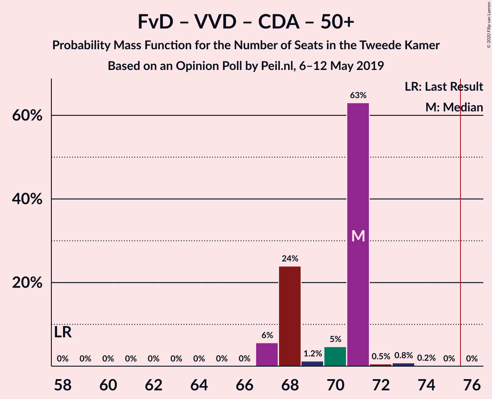

| Number of Seats | Probability | Accumulated | Special Marks |
|:---------------:|:-----------:|:-----------:|:-------------:|
| 58 | 0% | 100% | Last Result |
| 59 | 0% | 100% |  |
| 60 | 0% | 100% |  |
| 61 | 0% | 100% |  |
| 62 | 0% | 100% |  |
| 63 | 0% | 100% |  |
| 64 | 0% | 100% |  |
| 65 | 0% | 100% |  |
| 66 | 0.2% | 99.9% |  |
| 67 | 2% | 99.7% |  |
| 68 | 6% | 98% |  |
| 69 | 7% | 91% |  |
| 70 | 41% | 84% |  |
| 71 | 39% | 43% | Median |
| 72 | 1.2% | 4% |  |
| 73 | 2% | 3% |  |
| 74 | 0.7% | 0.9% |  |
| 75 | 0.2% | 0.2% |  |
| 76 | 0% | 0% | Majority |

### Forum voor Democratie – Volkspartij voor Vrijheid en Democratie – Christen-Democratisch Appèl – Staatkundig Gereformeerde Partij

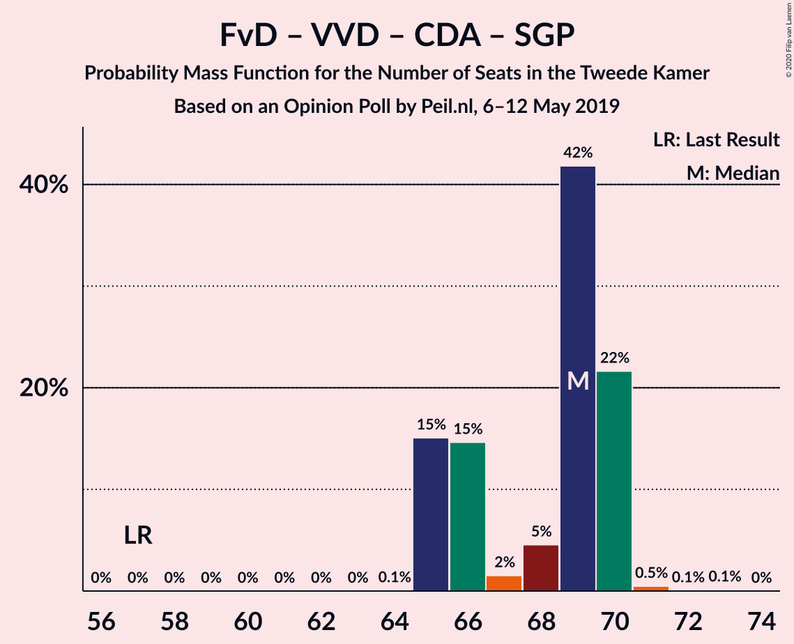

| Number of Seats | Probability | Accumulated | Special Marks |
|:---------------:|:-----------:|:-----------:|:-------------:|
| 57 | 0% | 100% | Last Result |
| 58 | 0% | 100% |  |
| 59 | 0% | 100% |  |
| 60 | 0% | 100% |  |
| 61 | 0% | 100% |  |
| 62 | 0% | 100% |  |
| 63 | 0.1% | 100% |  |
| 64 | 1.3% | 99.9% |  |
| 65 | 2% | 98.6% |  |
| 66 | 11% | 96% |  |
| 67 | 38% | 85% |  |
| 68 | 26% | 48% |  |
| 69 | 19% | 22% | Median |
| 70 | 2% | 3% |  |
| 71 | 0.5% | 0.9% |  |
| 72 | 0.2% | 0.4% |  |
| 73 | 0.3% | 0.3% |  |
| 74 | 0% | 0% |  |

### Forum voor Democratie – Volkspartij voor Vrijheid en Democratie – Christen-Democratisch Appèl

| Number of Seats | Probability | Accumulated | Special Marks |
|:---------------:|:-----------:|:-----------:|:-------------:|
| 54 | 0% | 100% | Last Result |
| 55 | 0% | 100% |  |
| 56 | 0% | 100% |  |
| 57 | 0% | 100% |  |
| 58 | 0% | 100% |  |
| 59 | 0% | 100% |  |
| 60 | 0% | 100% |  |
| 61 | 0% | 100% |  |
| 62 | 0.2% | 100% |  |
| 63 | 1.4% | 99.8% |  |
| 64 | 12% | 98% |  |
| 65 | 1.4% | 86% |  |
| 66 | 62% | 85% |  |
| 67 | 19% | 23% | Median |
| 68 | 3% | 4% |  |
| 69 | 0.7% | 1.4% |  |
| 70 | 0.2% | 0.6% |  |
| 71 | 0.4% | 0.4% |  |
| 72 | 0% | 0% |  |

### GroenLinks – Christen-Democratisch Appèl – Partij van de Arbeid – Democraten 66 – ChristenUnie

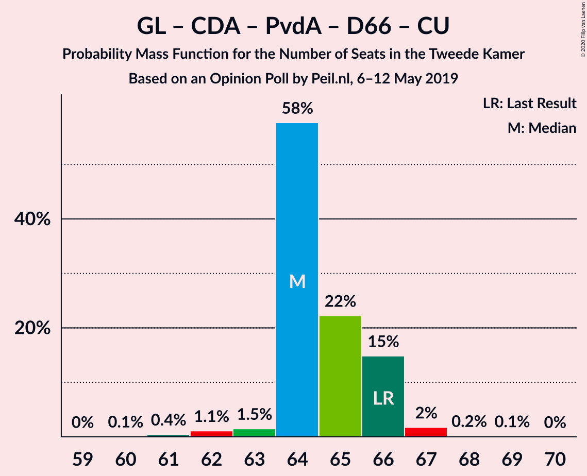

| Number of Seats | Probability | Accumulated | Special Marks |
|:---------------:|:-----------:|:-----------:|:-------------:|
| 60 | 0.1% | 100% |  |
| 61 | 10% | 99.9% |  |
| 62 | 2% | 90% |  |
| 63 | 16% | 88% |  |
| 64 | 10% | 72% |  |
| 65 | 4% | 63% | Median |
| 66 | 14% | 59% | Last Result |
| 67 | 43% | 45% |  |
| 68 | 2% | 2% |  |
| 69 | 0.1% | 0.1% |  |
| 70 | 0% | 0% |  |

### Volkspartij voor Vrijheid en Democratie – Christen-Democratisch Appèl – Democraten 66 – ChristenUnie

| Number of Seats | Probability | Accumulated | Special Marks |
|:---------------:|:-----------:|:-----------:|:-------------:|
| 54 | 6% | 100% |  |
| 55 | 4% | 94% |  |
| 56 | 6% | 91% |  |
| 57 | 5% | 85% |  |
| 58 | 38% | 79% |  |
| 59 | 20% | 42% | Median |
| 60 | 19% | 21% |  |
| 61 | 1.3% | 2% |  |
| 62 | 0% | 1.1% |  |
| 63 | 1.1% | 1.1% |  |
| 64 | 0% | 0% |  |
| 65 | 0% | 0% |  |
| 66 | 0% | 0% |  |
| 67 | 0% | 0% |  |
| 68 | 0% | 0% |  |
| 69 | 0% | 0% |  |
| 70 | 0% | 0% |  |
| 71 | 0% | 0% |  |
| 72 | 0% | 0% |  |
| 73 | 0% | 0% |  |
| 74 | 0% | 0% |  |
| 75 | 0% | 0% |  |
| 76 | 0% | 0% | Last Result, Majority |

### Volkspartij voor Vrijheid en Democratie – Christen-Democratisch Appèl – Partij van de Arbeid

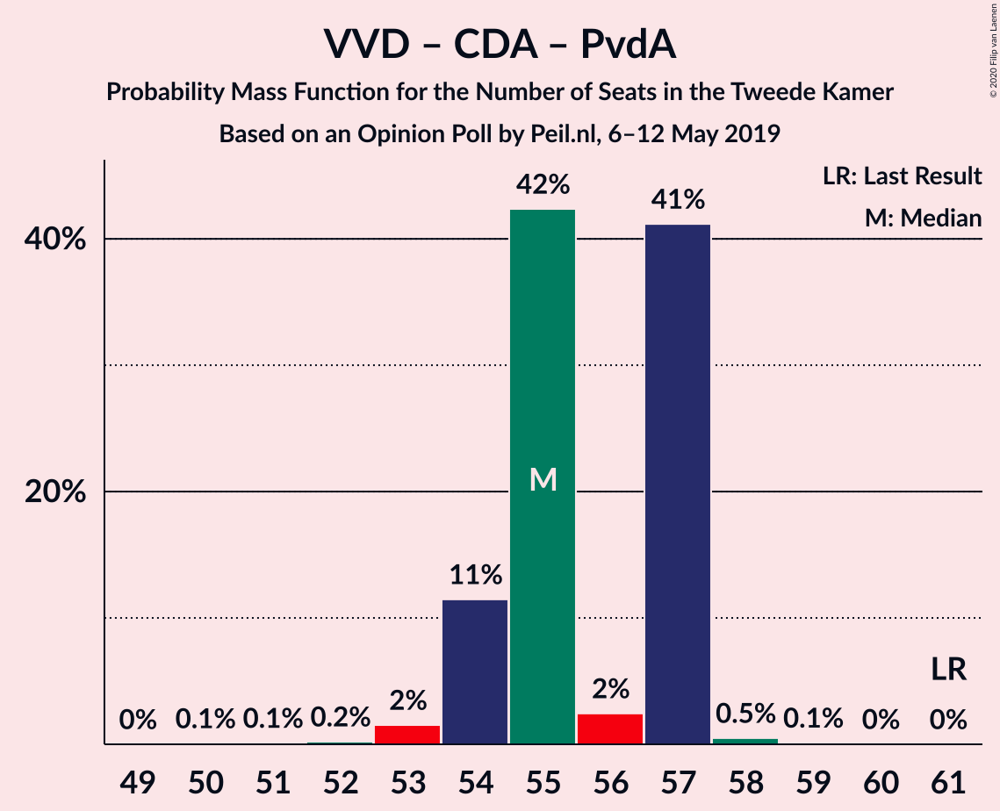

| Number of Seats | Probability | Accumulated | Special Marks |
|:---------------:|:-----------:|:-----------:|:-------------:|
| 51 | 0.2% | 100% |  |
| 52 | 3% | 99.7% |  |
| 53 | 8% | 96% |  |
| 54 | 4% | 88% |  |
| 55 | 19% | 85% |  |
| 56 | 28% | 66% | Median |
| 57 | 24% | 38% |  |
| 58 | 12% | 14% |  |
| 59 | 1.5% | 2% |  |
| 60 | 0.2% | 0.2% |  |
| 61 | 0% | 0% | Last Result |

### Volkspartij voor Vrijheid en Democratie – Christen-Democratisch Appèl – Democraten 66

| Number of Seats | Probability | Accumulated | Special Marks |
|:---------------:|:-----------:|:-----------:|:-------------:|
| 47 | 0.2% | 100% |  |
| 48 | 7% | 99.8% |  |
| 49 | 3% | 93% |  |
| 50 | 10% | 90% |  |
| 51 | 42% | 81% |  |
| 52 | 18% | 38% | Median |
| 53 | 18% | 21% |  |
| 54 | 1.3% | 3% |  |
| 55 | 2% | 2% |  |
| 56 | 0% | 0% |  |
| 57 | 0% | 0% |  |
| 58 | 0% | 0% |  |
| 59 | 0% | 0% |  |
| 60 | 0% | 0% |  |
| 61 | 0% | 0% |  |
| 62 | 0% | 0% |  |
| 63 | 0% | 0% |  |
| 64 | 0% | 0% |  |
| 65 | 0% | 0% |  |
| 66 | 0% | 0% |  |
| 67 | 0% | 0% |  |
| 68 | 0% | 0% |  |
| 69 | 0% | 0% |  |
| 70 | 0% | 0% |  |
| 71 | 0% | 0% | Last Result |

### Volkspartij voor Vrijheid en Democratie – Partij van de Arbeid – Democraten 66

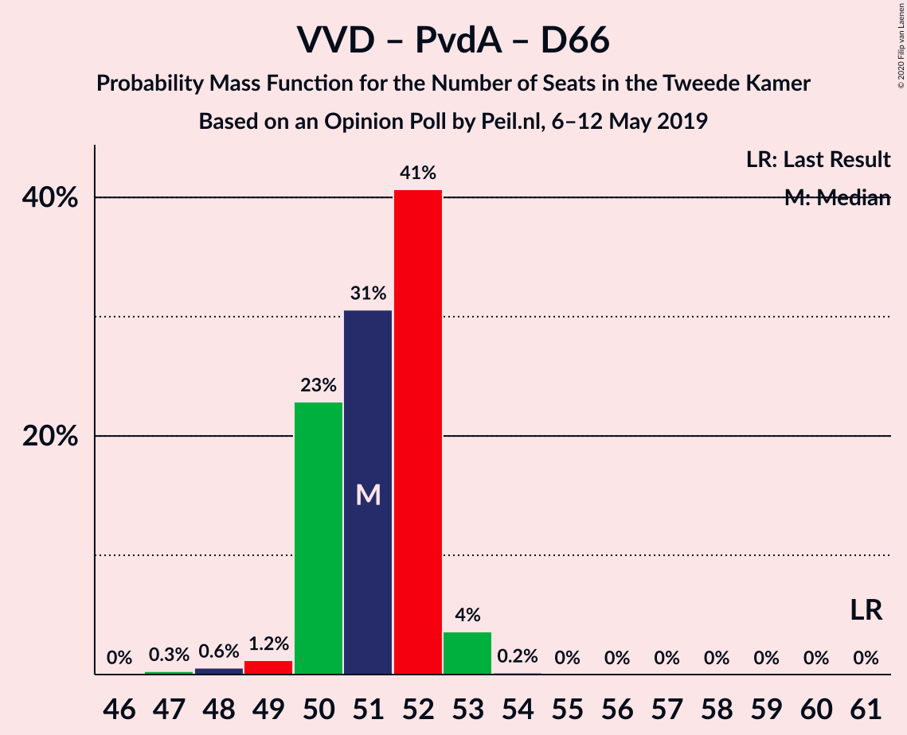

| Number of Seats | Probability | Accumulated | Special Marks |
|:---------------:|:-----------:|:-----------:|:-------------:|
| 46 | 0.1% | 100% |  |
| 47 | 1.2% | 99.9% |  |
| 48 | 0.8% | 98.7% |  |
| 49 | 0.9% | 98% |  |
| 50 | 4% | 97% |  |
| 51 | 9% | 93% |  |
| 52 | 30% | 84% | Median |
| 53 | 53% | 54% |  |
| 54 | 0.8% | 0.9% |  |
| 55 | 0.1% | 0.1% |  |
| 56 | 0% | 0% |  |
| 57 | 0% | 0% |  |
| 58 | 0% | 0% |  |
| 59 | 0% | 0% |  |
| 60 | 0% | 0% |  |
| 61 | 0% | 0% | Last Result |

### Volkspartij voor Vrijheid en Democratie – Christen-Democratisch Appèl – Partij voor de Vrijheid

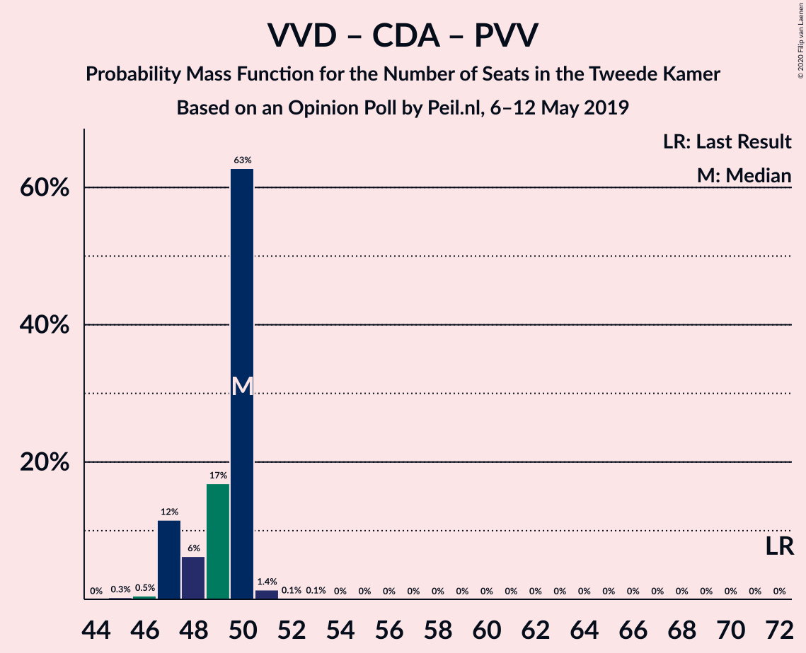

| Number of Seats | Probability | Accumulated | Special Marks |
|:---------------:|:-----------:|:-----------:|:-------------:|
| 44 | 0% | 100% |  |
| 45 | 0.4% | 99.9% |  |
| 46 | 0.6% | 99.6% |  |
| 47 | 17% | 98.9% |  |
| 48 | 44% | 82% |  |
| 49 | 23% | 38% | Median |
| 50 | 10% | 15% |  |
| 51 | 2% | 4% |  |
| 52 | 0.1% | 3% |  |
| 53 | 1.3% | 2% |  |
| 54 | 1.1% | 1.1% |  |
| 55 | 0% | 0% |  |
| 56 | 0% | 0% |  |
| 57 | 0% | 0% |  |
| 58 | 0% | 0% |  |
| 59 | 0% | 0% |  |
| 60 | 0% | 0% |  |
| 61 | 0% | 0% |  |
| 62 | 0% | 0% |  |
| 63 | 0% | 0% |  |
| 64 | 0% | 0% |  |
| 65 | 0% | 0% |  |
| 66 | 0% | 0% |  |
| 67 | 0% | 0% |  |
| 68 | 0% | 0% |  |
| 69 | 0% | 0% |  |
| 70 | 0% | 0% |  |
| 71 | 0% | 0% |  |
| 72 | 0% | 0% | Last Result |

### Christen-Democratisch Appèl – Partij van de Arbeid – Democraten 66

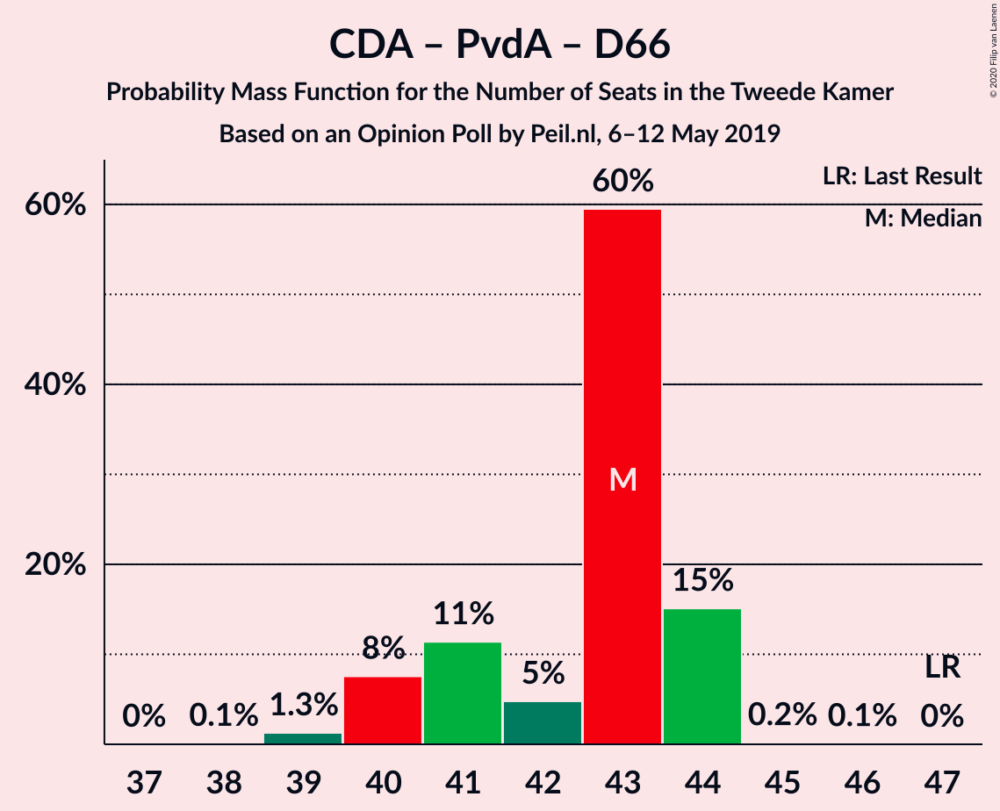

| Number of Seats | Probability | Accumulated | Special Marks |
|:---------------:|:-----------:|:-----------:|:-------------:|
| 37 | 0.2% | 100% |  |
| 38 | 1.0% | 99.8% |  |
| 39 | 14% | 98.8% |  |
| 40 | 13% | 85% |  |
| 41 | 11% | 72% | Median |
| 42 | 30% | 61% |  |
| 43 | 22% | 32% |  |
| 44 | 9% | 10% |  |
| 45 | 0.4% | 0.6% |  |
| 46 | 0.2% | 0.2% |  |
| 47 | 0% | 0% | Last Result |

### Volkspartij voor Vrijheid en Democratie – Christen-Democratisch Appèl

| Number of Seats | Probability | Accumulated | Special Marks |
|:---------------:|:-----------:|:-----------:|:-------------:|
| 36 | 0.2% | 100% |  |
| 37 | 2% | 99.8% |  |
| 38 | 13% | 98% |  |
| 39 | 5% | 85% |  |
| 40 | 36% | 80% |  |
| 41 | 39% | 44% | Median |
| 42 | 1.3% | 5% |  |
| 43 | 2% | 3% |  |
| 44 | 2% | 2% |  |
| 45 | 0% | 0% |  |
| 46 | 0% | 0% |  |
| 47 | 0% | 0% |  |
| 48 | 0% | 0% |  |
| 49 | 0% | 0% |  |
| 50 | 0% | 0% |  |
| 51 | 0% | 0% |  |
| 52 | 0% | 0% | Last Result |

### Volkspartij voor Vrijheid en Democratie – Partij van de Arbeid

| Number of Seats | Probability | Accumulated | Special Marks |
|:---------------:|:-----------:|:-----------:|:-------------:|
| 35 | 0.2% | 100% |  |
| 36 | 0.2% | 99.8% |  |
| 37 | 1.4% | 99.6% |  |
| 38 | 3% | 98% |  |
| 39 | 8% | 96% |  |
| 40 | 10% | 87% |  |
| 41 | 37% | 77% | Median |
| 42 | 22% | 40% | Last Result |
| 43 | 17% | 17% |  |
| 44 | 0% | 0% |  |

### Christen-Democratisch Appèl – Partij van de Arbeid – ChristenUnie

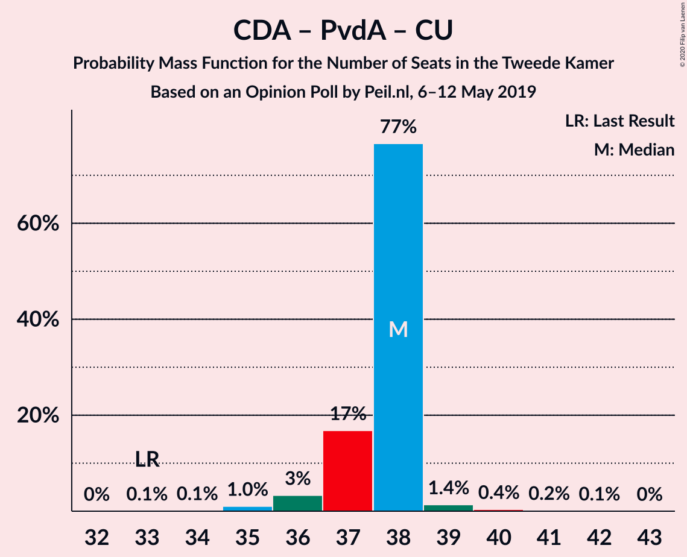

| Number of Seats | Probability | Accumulated | Special Marks |
|:---------------:|:-----------:|:-----------:|:-------------:|
| 33 | 0% | 100% | Last Result |
| 34 | 3% | 100% |  |
| 35 | 17% | 97% |  |
| 36 | 12% | 80% |  |
| 37 | 25% | 68% | Median |
| 38 | 9% | 44% |  |
| 39 | 22% | 34% |  |
| 40 | 12% | 13% |  |
| 41 | 0.4% | 0.4% |  |
| 42 | 0% | 0% |  |

### Christen-Democratisch Appèl – Partij van de Arbeid

| Number of Seats | Probability | Accumulated | Special Marks |
|:---------------:|:-----------:|:-----------:|:-------------:|
| 27 | 2% | 100% |  |
| 28 | 10% | 98% | Last Result |
| 29 | 18% | 88% |  |
| 30 | 23% | 69% | Median |
| 31 | 4% | 47% |  |
| 32 | 41% | 43% |  |
| 33 | 1.2% | 2% |  |
| 34 | 0.8% | 0.9% |  |
| 35 | 0% | 0% |  |

### Christen-Democratisch Appèl – Democraten 66

| Number of Seats | Probability | Accumulated | Special Marks |
|:---------------:|:-----------:|:-----------:|:-------------:|
| 23 | 7% | 100% |  |
| 24 | 1.4% | 93% |  |
| 25 | 31% | 92% |  |
| 26 | 31% | 60% | Median |
| 27 | 19% | 29% |  |
| 28 | 8% | 10% |  |
| 29 | 2% | 2% |  |
| 30 | 0.2% | 0.3% |  |
| 31 | 0% | 0% |  |
| 32 | 0% | 0% |  |
| 33 | 0% | 0% |  |
| 34 | 0% | 0% |  |
| 35 | 0% | 0% |  |
| 36 | 0% | 0% |  |
| 37 | 0% | 0% |  |
| 38 | 0% | 0% | Last Result |

## Technical Information

### Opinion Poll

+ **Polling firm:** Peil.nl
+ **Commissioner(s):** —
+ **Fieldwork period:** 6–12 May 2019

### Calculations

+ **Sample size:** 3000
+ **Simulations done:** 131,072
+ **Error estimate:** 1.22%

