# Opinion Poll by I&O Research, 9–14 May 2019

<a href="#voting-intentions">Voting Intentions</a> | <a href="#seats">Seats</a> | <a href="#coalitions">Coalitions</a> | <a href="#technical-information">Technical Information</a>

## Voting Intentions

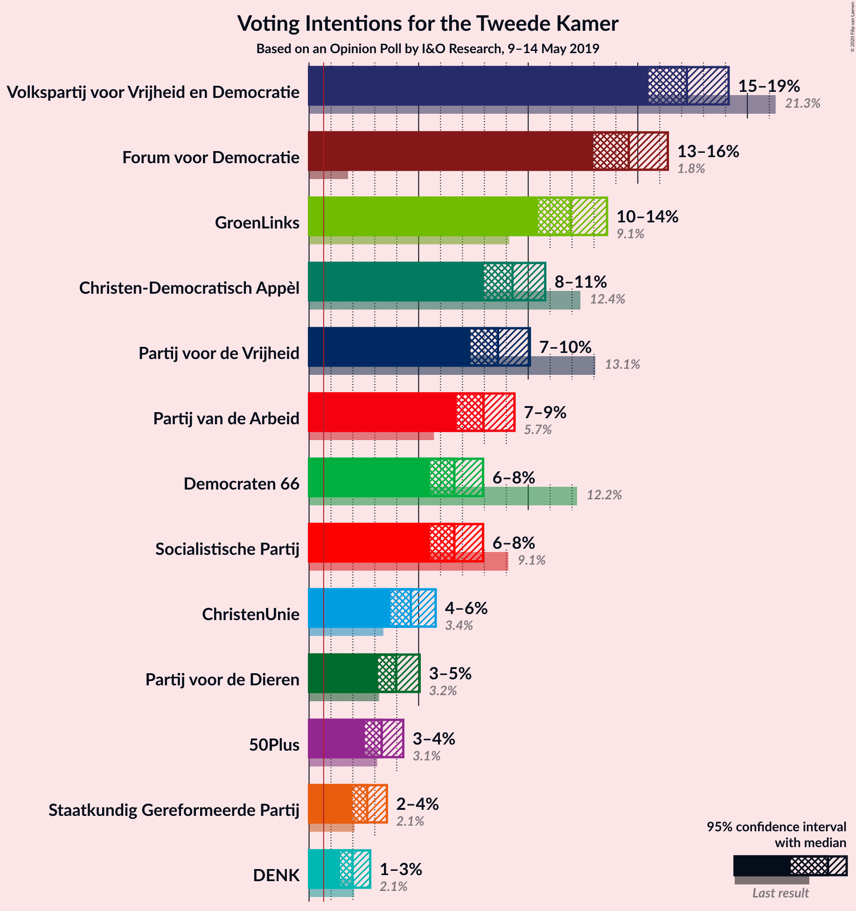

### Confidence Intervals

| Party | Last Result | Poll Result | 80% Confidence Interval | 90% Confidence Interval | 95% Confidence Interval | 99% Confidence Interval |
|:-----:|:-----------:|:-----------:|:-----------------------:|:-----------------------:|:-----------------------:|:-----------------------:|
| Volkspartij voor Vrijheid en Democratie | 21.3% | 17.2% | 16.1–18.5% |15.8–18.8% |15.5–19.1% |15.0–19.8% |
| Forum voor Democratie | 1.8% | 14.6% | 13.5–15.8% |13.2–16.1% |13.0–16.4% |12.5–16.9% |
| GroenLinks | 9.1% | 11.9% | 11.0–13.0% |10.7–13.3% |10.5–13.6% |10.0–14.1% |
| Christen-Democratisch Appèl | 12.4% | 9.3% | 8.4–10.3% |8.2–10.5% |8.0–10.8% |7.6–11.3% |
| Partij voor de Vrijheid | 13.1% | 8.6% | 7.8–9.6% |7.6–9.8% |7.4–10.1% |7.0–10.5% |
| Partij van de Arbeid | 5.7% | 8.0% | 7.2–8.9% |6.9–9.1% |6.7–9.4% |6.4–9.8% |
| Democraten 66 | 12.2% | 6.6% | 5.9–7.5% |5.7–7.7% |5.5–7.9% |5.2–8.4% |
| Socialistische Partij | 9.1% | 6.6% | 5.9–7.5% |5.7–7.7% |5.5–7.9% |5.2–8.4% |
| ChristenUnie | 3.4% | 4.6% | 4.0–5.4% |3.9–5.6% |3.7–5.8% |3.5–6.1% |
| Partij voor de Dieren | 3.2% | 4.0% | 3.4–4.7% |3.3–4.9% |3.1–5.0% |2.9–5.4% |
| 50Plus | 3.1% | 3.3% | 2.8–4.0% |2.7–4.1% |2.5–4.3% |2.3–4.6% |
| Staatkundig Gereformeerde Partij | 2.1% | 2.7% | 2.2–3.2% |2.1–3.4% |2.0–3.6% |1.8–3.8% |
| DENK | 2.1% | 2.0% | 1.6–2.5% |1.5–2.7% |1.4–2.8% |1.2–3.1% |

*Note:* The poll result column reflects the actual value used in the calculations. Published results may vary slightly, and in addition be rounded to fewer digits.

## Seats

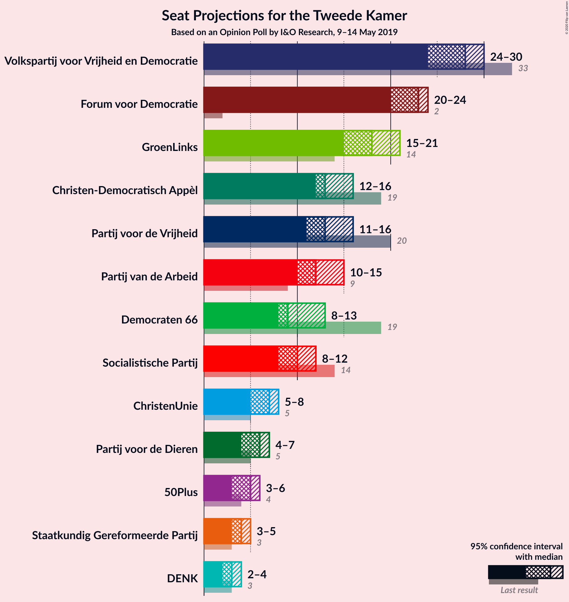

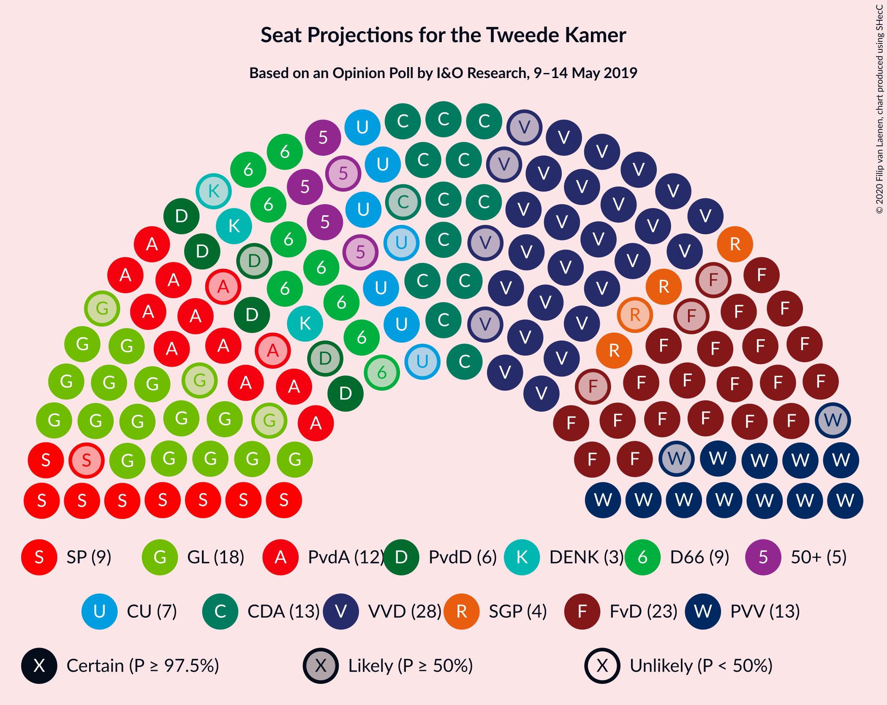

### Confidence Intervals

| Party | Last Result | Median | 80% Confidence Interval | 90% Confidence Interval | 95% Confidence Interval | 99% Confidence Interval |
|:-----:|:-----------:|:------:|:-----------------------:|:-----------------------:|:-----------------------:|:-----------------------:|
| <a href="#volkspartij-voor-vrijheid-en-democratie">Volkspartij voor Vrijheid en Democratie</a> | 33 | 28 | 25–29 |24–30 |24–30 |23–31 |
| <a href="#forum-voor-democratie">Forum voor Democratie</a> | 2 | 23 | 21–24 |20–24 |20–24 |19–26 |
| <a href="#groenlinks">GroenLinks</a> | 14 | 18 | 17–19 |16–19 |15–21 |15–21 |
| <a href="#christen-democratisch-appèl">Christen-Democratisch Appèl</a> | 19 | 13 | 13–15 |13–15 |12–16 |11–17 |
| <a href="#partij-voor-de-vrijheid">Partij voor de Vrijheid</a> | 20 | 13 | 11–13 |11–15 |11–16 |10–17 |
| <a href="#partij-van-de-arbeid">Partij van de Arbeid</a> | 9 | 12 | 11–14 |10–14 |10–15 |10–15 |
| <a href="#democraten-66">Democraten 66</a> | 19 | 9 | 8–12 |8–12 |8–13 |7–13 |
| <a href="#socialistische-partij">Socialistische Partij</a> | 14 | 10 | 9–11 |8–12 |8–12 |8–12 |
| <a href="#christenunie">ChristenUnie</a> | 5 | 7 | 6–7 |6–8 |5–8 |5–9 |
| <a href="#partij-voor-de-dieren">Partij voor de Dieren</a> | 5 | 6 | 4–7 |4–7 |4–7 |4–8 |
| <a href="#50plus">50Plus</a> | 4 | 5 | 3–6 |3–6 |3–6 |3–7 |
| <a href="#staatkundig-gereformeerde-partij">Staatkundig Gereformeerde Partij</a> | 3 | 4 | 3–4 |3–4 |3–5 |2–5 |
| <a href="#denk">DENK</a> | 3 | 3 | 2–4 |2–4 |2–4 |1–4 |

### Volkspartij voor Vrijheid en Democratie

*For a full overview of the results for this party, see the [Volkspartij voor Vrijheid en Democratie](party-volkspartijvoorvrijheidendemocratie.html) page.*

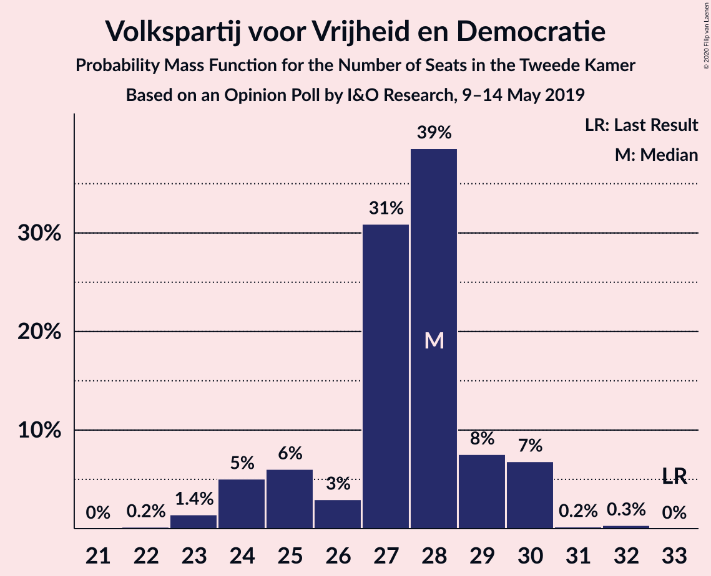

| Number of Seats | Probability | Accumulated | Special Marks |
|:---------------:|:-----------:|:-----------:|:-------------:|
| 22 | 0.2% | 100% |  |
| 23 | 1.4% | 99.8% |  |
| 24 | 5% | 98% |  |
| 25 | 6% | 93% |  |
| 26 | 3% | 87% |  |
| 27 | 31% | 84% |  |
| 28 | 39% | 53% | Median |
| 29 | 8% | 15% |  |
| 30 | 7% | 7% |  |
| 31 | 0.2% | 0.5% |  |
| 32 | 0.3% | 0.3% |  |
| 33 | 0% | 0% | Last Result |

### Forum voor Democratie

*For a full overview of the results for this party, see the [Forum voor Democratie](party-forumvoordemocratie.html) page.*

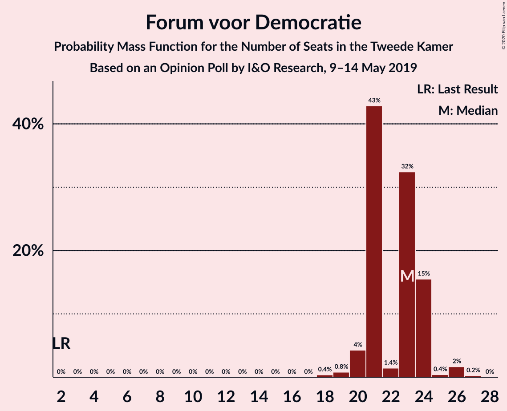

| Number of Seats | Probability | Accumulated | Special Marks |
|:---------------:|:-----------:|:-----------:|:-------------:|
| 2 | 0% | 100% | Last Result |
| 3 | 0% | 100% |  |
| 4 | 0% | 100% |  |
| 5 | 0% | 100% |  |
| 6 | 0% | 100% |  |
| 7 | 0% | 100% |  |
| 8 | 0% | 100% |  |
| 9 | 0% | 100% |  |
| 10 | 0% | 100% |  |
| 11 | 0% | 100% |  |
| 12 | 0% | 100% |  |
| 13 | 0% | 100% |  |
| 14 | 0% | 100% |  |
| 15 | 0% | 100% |  |
| 16 | 0% | 100% |  |
| 17 | 0% | 100% |  |
| 18 | 0.4% | 100% |  |
| 19 | 0.8% | 99.6% |  |
| 20 | 4% | 98.8% |  |
| 21 | 43% | 95% |  |
| 22 | 1.4% | 52% |  |
| 23 | 32% | 50% | Median |
| 24 | 15% | 18% |  |
| 25 | 0.4% | 2% |  |
| 26 | 2% | 2% |  |
| 27 | 0.2% | 0.2% |  |
| 28 | 0% | 0% |  |

### GroenLinks

*For a full overview of the results for this party, see the [GroenLinks](party-groenlinks.html) page.*

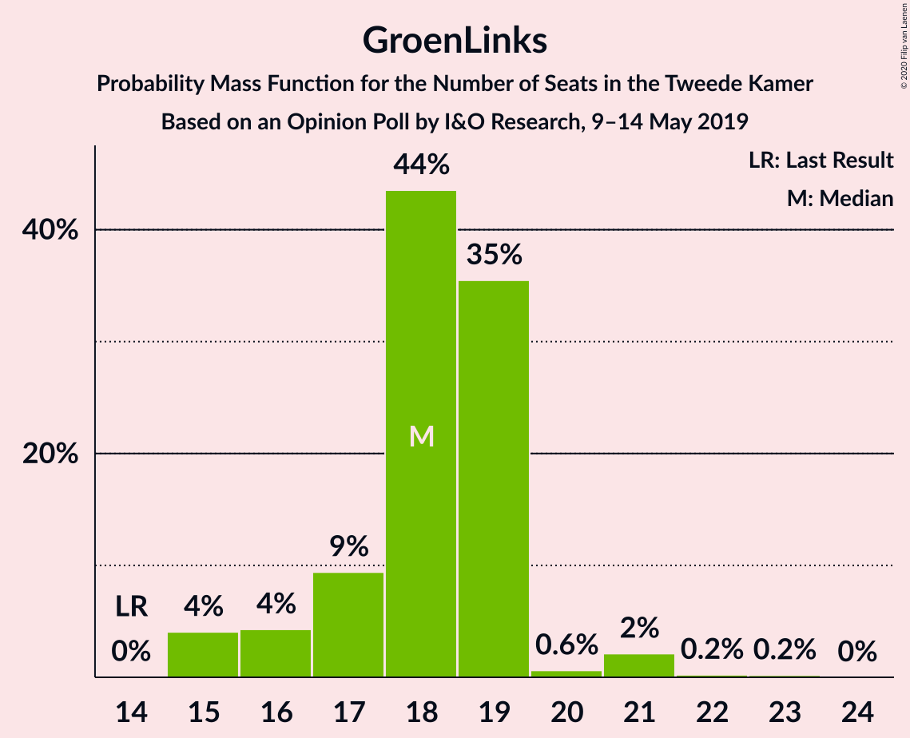

| Number of Seats | Probability | Accumulated | Special Marks |
|:---------------:|:-----------:|:-----------:|:-------------:|
| 14 | 0% | 100% | Last Result |
| 15 | 4% | 99.9% |  |
| 16 | 4% | 96% |  |
| 17 | 9% | 92% |  |
| 18 | 44% | 82% | Median |
| 19 | 35% | 39% |  |
| 20 | 0.6% | 3% |  |
| 21 | 2% | 3% |  |
| 22 | 0.2% | 0.4% |  |
| 23 | 0.2% | 0.2% |  |
| 24 | 0% | 0% |  |

### Christen-Democratisch Appèl

*For a full overview of the results for this party, see the [Christen-Democratisch Appèl](party-christen-democratischappèl.html) page.*

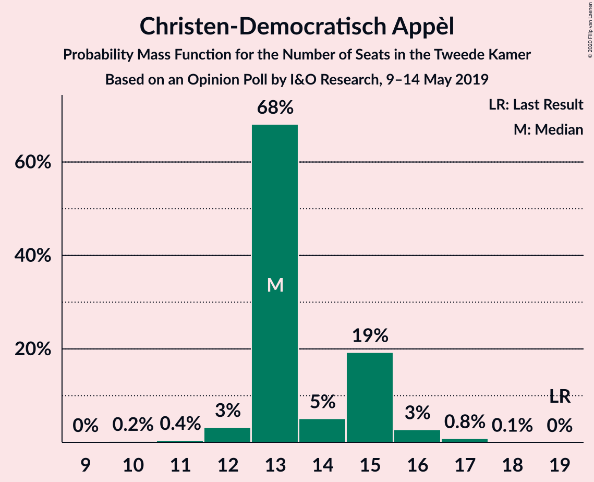

| Number of Seats | Probability | Accumulated | Special Marks |
|:---------------:|:-----------:|:-----------:|:-------------:|
| 10 | 0.2% | 100% |  |
| 11 | 0.4% | 99.8% |  |
| 12 | 3% | 99.3% |  |
| 13 | 68% | 96% | Median |
| 14 | 5% | 28% |  |
| 15 | 19% | 23% |  |
| 16 | 3% | 4% |  |
| 17 | 0.8% | 0.9% |  |
| 18 | 0.1% | 0.1% |  |
| 19 | 0% | 0% | Last Result |

### Partij voor de Vrijheid

*For a full overview of the results for this party, see the [Partij voor de Vrijheid](party-partijvoordevrijheid.html) page.*

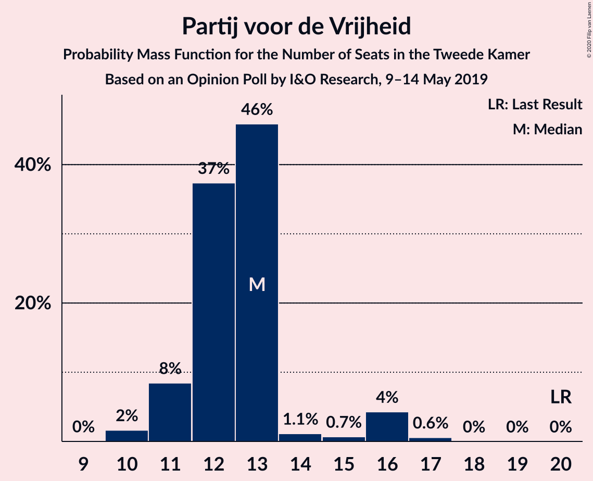

| Number of Seats | Probability | Accumulated | Special Marks |
|:---------------:|:-----------:|:-----------:|:-------------:|
| 10 | 2% | 100% |  |
| 11 | 8% | 98% |  |
| 12 | 37% | 90% |  |
| 13 | 46% | 53% | Median |
| 14 | 1.1% | 7% |  |
| 15 | 0.7% | 6% |  |
| 16 | 4% | 5% |  |
| 17 | 0.6% | 0.6% |  |
| 18 | 0% | 0% |  |
| 19 | 0% | 0% |  |
| 20 | 0% | 0% | Last Result |

### Partij van de Arbeid

*For a full overview of the results for this party, see the [Partij van de Arbeid](party-partijvandearbeid.html) page.*

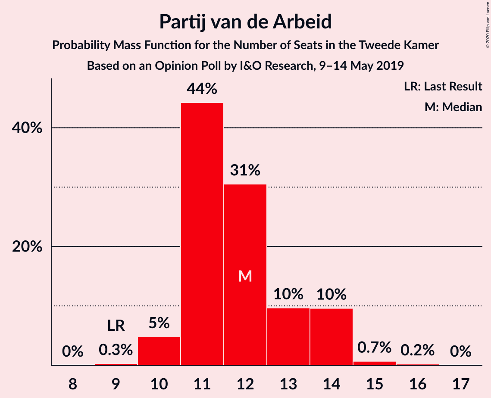

| Number of Seats | Probability | Accumulated | Special Marks |
|:---------------:|:-----------:|:-----------:|:-------------:|
| 9 | 0.1% | 100% | Last Result |
| 10 | 9% | 99.9% |  |
| 11 | 16% | 91% |  |
| 12 | 37% | 75% | Median |
| 13 | 4% | 37% |  |
| 14 | 30% | 33% |  |
| 15 | 2% | 3% |  |
| 16 | 0.1% | 0.1% |  |
| 17 | 0% | 0% |  |

### Democraten 66

*For a full overview of the results for this party, see the [Democraten 66](party-democraten66.html) page.*

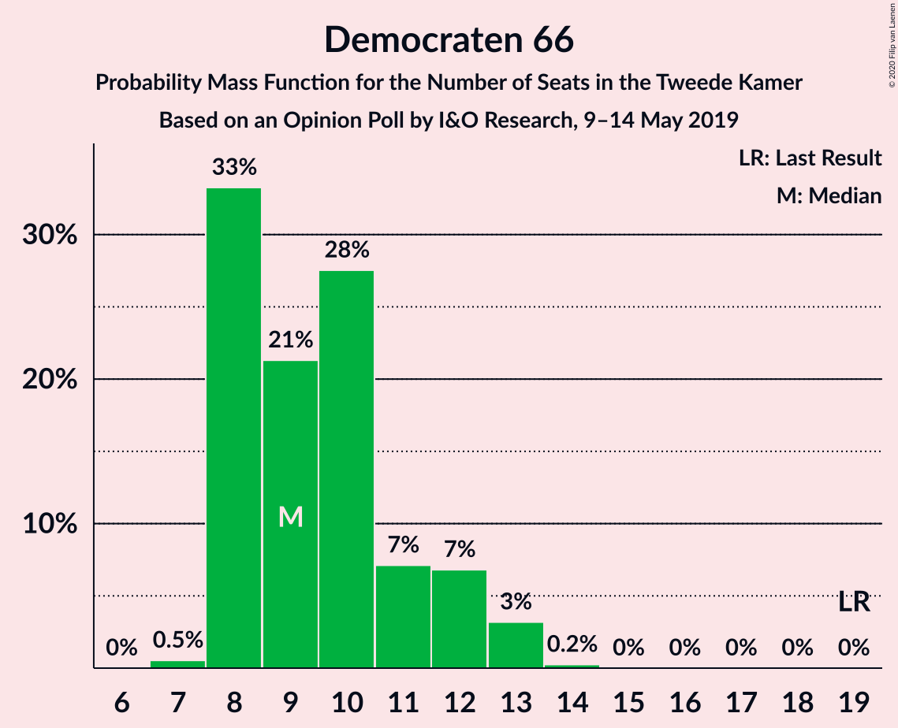

| Number of Seats | Probability | Accumulated | Special Marks |
|:---------------:|:-----------:|:-----------:|:-------------:|
| 7 | 0.5% | 100% |  |
| 8 | 33% | 99.5% |  |
| 9 | 21% | 66% | Median |
| 10 | 28% | 45% |  |
| 11 | 7% | 17% |  |
| 12 | 7% | 10% |  |
| 13 | 3% | 3% |  |
| 14 | 0.2% | 0.2% |  |
| 15 | 0% | 0% |  |
| 16 | 0% | 0% |  |
| 17 | 0% | 0% |  |
| 18 | 0% | 0% |  |
| 19 | 0% | 0% | Last Result |

### Socialistische Partij

*For a full overview of the results for this party, see the [Socialistische Partij](party-socialistischepartij.html) page.*

| Number of Seats | Probability | Accumulated | Special Marks |
|:---------------:|:-----------:|:-----------:|:-------------:|
| 7 | 0.1% | 100% |  |
| 8 | 7% | 99.9% |  |
| 9 | 39% | 93% |  |
| 10 | 10% | 54% | Median |
| 11 | 35% | 44% |  |
| 12 | 9% | 9% |  |
| 13 | 0.3% | 0.4% |  |
| 14 | 0% | 0% | Last Result |

### ChristenUnie

*For a full overview of the results for this party, see the [ChristenUnie](party-christenunie.html) page.*

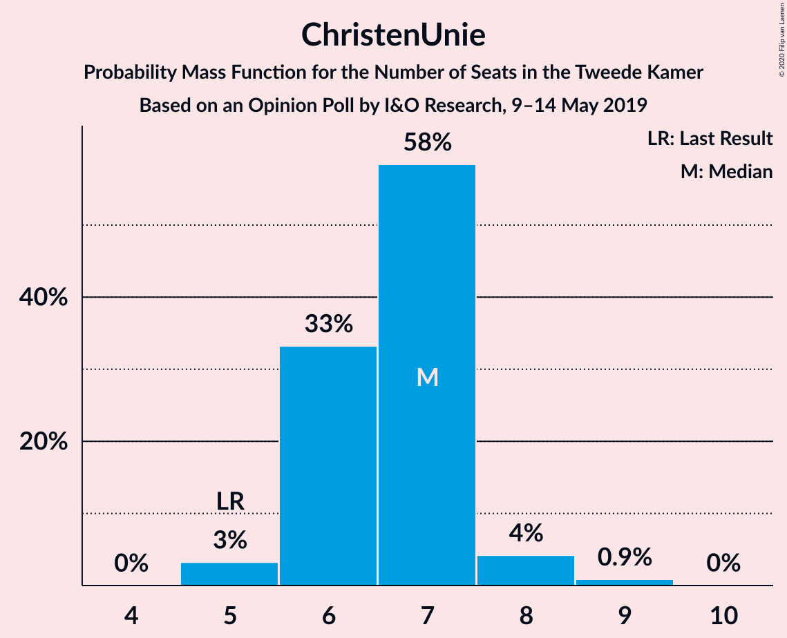

| Number of Seats | Probability | Accumulated | Special Marks |
|:---------------:|:-----------:|:-----------:|:-------------:|
| 5 | 3% | 100% | Last Result |
| 6 | 33% | 97% |  |
| 7 | 58% | 64% | Median |
| 8 | 4% | 5% |  |
| 9 | 0.9% | 0.9% |  |
| 10 | 0% | 0% |  |

### Partij voor de Dieren

*For a full overview of the results for this party, see the [Partij voor de Dieren](party-partijvoordedieren.html) page.*

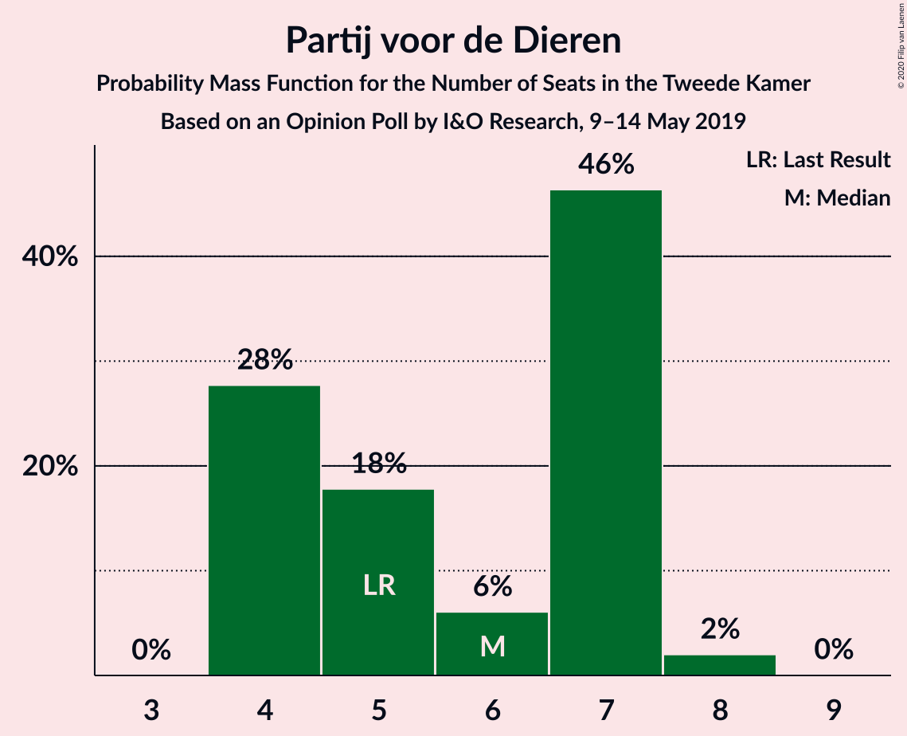

| Number of Seats | Probability | Accumulated | Special Marks |
|:---------------:|:-----------:|:-----------:|:-------------:|
| 4 | 28% | 100% |  |
| 5 | 18% | 72% | Last Result |
| 6 | 6% | 54% | Median |
| 7 | 46% | 48% |  |
| 8 | 2% | 2% |  |
| 9 | 0% | 0% |  |

### 50Plus

*For a full overview of the results for this party, see the [50Plus](party-50plus.html) page.*

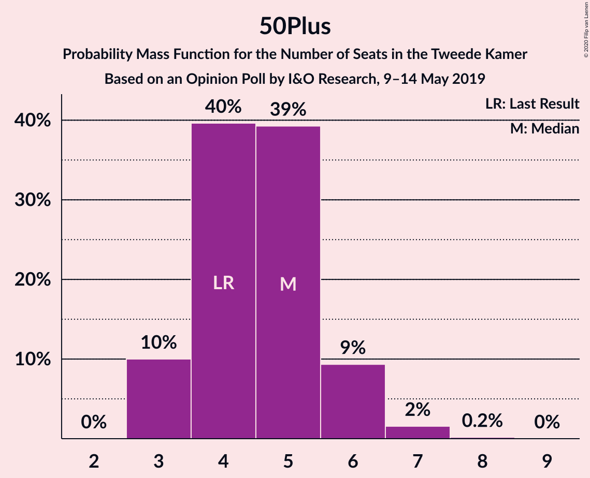

| Number of Seats | Probability | Accumulated | Special Marks |
|:---------------:|:-----------:|:-----------:|:-------------:|
| 3 | 10% | 100% |  |
| 4 | 40% | 90% | Last Result |
| 5 | 39% | 50% | Median |
| 6 | 9% | 11% |  |
| 7 | 2% | 2% |  |
| 8 | 0.2% | 0.2% |  |
| 9 | 0% | 0% |  |

### Staatkundig Gereformeerde Partij

*For a full overview of the results for this party, see the [Staatkundig Gereformeerde Partij](party-staatkundiggereformeerdepartij.html) page.*

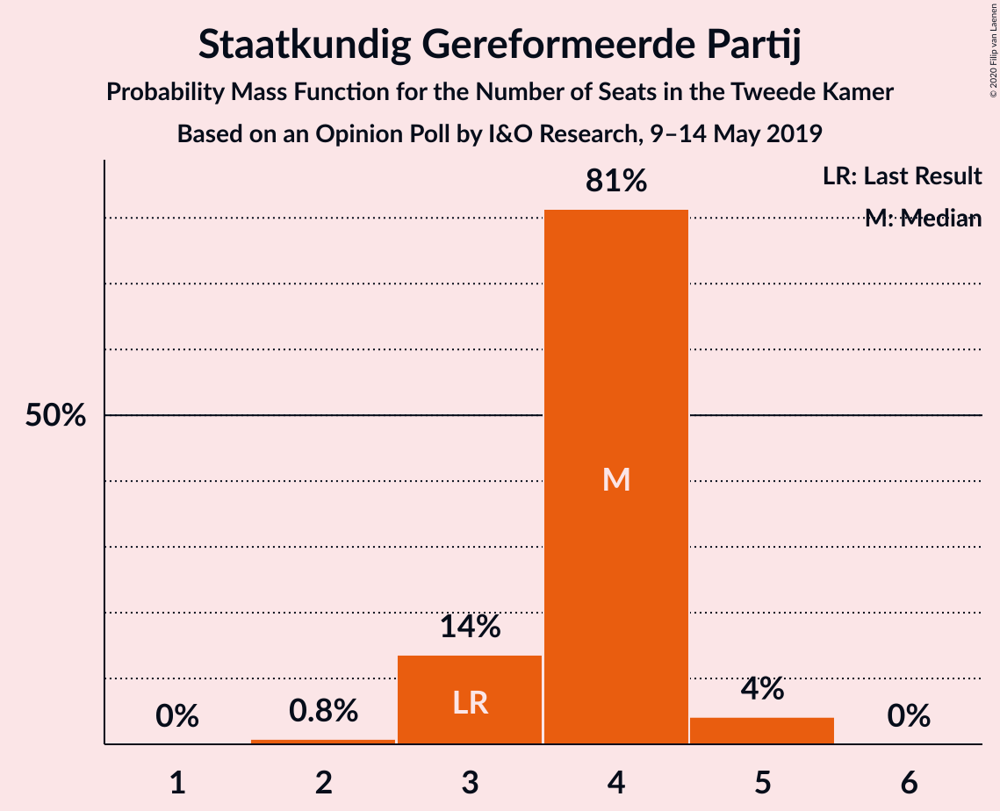

| Number of Seats | Probability | Accumulated | Special Marks |
|:---------------:|:-----------:|:-----------:|:-------------:|
| 2 | 0.8% | 100% |  |
| 3 | 14% | 99.2% | Last Result |
| 4 | 81% | 86% | Median |
| 5 | 4% | 4% |  |
| 6 | 0% | 0% |  |

### DENK

*For a full overview of the results for this party, see the [DENK](party-denk.html) page.*

| Number of Seats | Probability | Accumulated | Special Marks |
|:---------------:|:-----------:|:-----------:|:-------------:|
| 1 | 0.7% | 100% |  |
| 2 | 20% | 99.3% |  |
| 3 | 40% | 80% | Last Result, Median |
| 4 | 39% | 39% |  |
| 5 | 0.3% | 0.3% |  |
| 6 | 0% | 0% |  |

## Coalitions

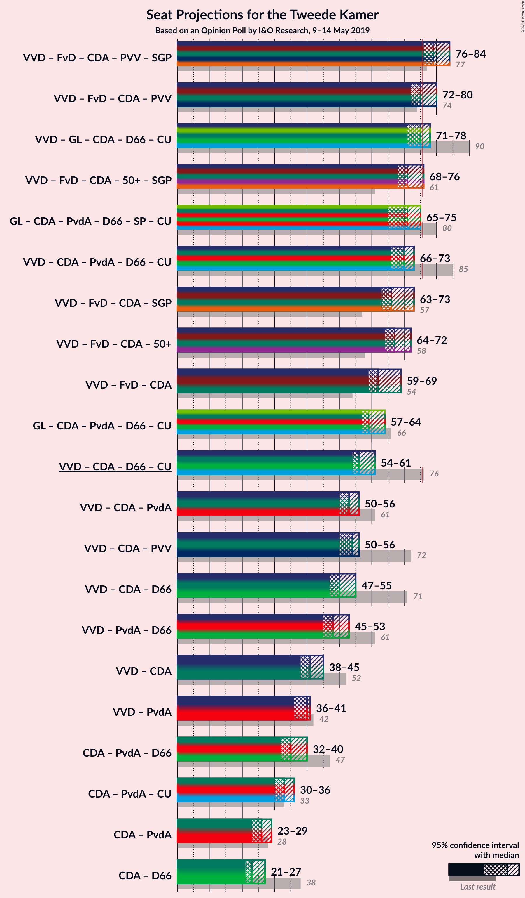

### Confidence Intervals

| Coalition | Last Result | Median | Majority? | 80% Confidence Interval | 90% Confidence Interval | 95% Confidence Interval | 99% Confidence Interval |
|:---------:|:-----------:|:------:|:---------:|:-----------------------:|:-----------------------:|:-----------------------:|:-----------------------:|
| Volkspartij voor Vrijheid en Democratie – Forum voor Democratie – Christen-Democratisch Appèl – Partij voor de Vrijheid – Staatkundig Gereformeerde Partij | 77 | 79 | 98% | 77–83 | 76–84 | 76–84 | 74–84 |
| Volkspartij voor Vrijheid en Democratie – Forum voor Democratie – Christen-Democratisch Appèl – Partij voor de Vrijheid | 74 | 75 | 26% | 74–79 | 73–80 | 72–80 | 70–81 |
| Volkspartij voor Vrijheid en Democratie – GroenLinks – Christen-Democratisch Appèl – Democraten 66 – ChristenUnie | 90 | 75 | 29% | 74–78 | 72–78 | 71–78 | 70–81 |
| Volkspartij voor Vrijheid en Democratie – Forum voor Democratie – Christen-Democratisch Appèl – 50Plus – Staatkundig Gereformeerde Partij | 61 | 71 | 16% | 68–76 | 68–76 | 68–76 | 66–76 |
| GroenLinks – Christen-Democratisch Appèl – Partij van de Arbeid – Democraten 66 – Socialistische Partij – ChristenUnie | 80 | 71 | 2% | 68–72 | 65–74 | 65–75 | 65–77 |
| Volkspartij voor Vrijheid en Democratie – Christen-Democratisch Appèl – Partij van de Arbeid – Democraten 66 – ChristenUnie | 85 | 70 | 0% | 68–72 | 67–72 | 66–73 | 64–74 |
| Volkspartij voor Vrijheid en Democratie – Forum voor Democratie – Christen-Democratisch Appèl – Staatkundig Gereformeerde Partij | 57 | 66 | 0% | 64–71 | 64–73 | 63–73 | 61–73 |
| Volkspartij voor Vrijheid en Democratie – Forum voor Democratie – Christen-Democratisch Appèl – 50Plus | 58 | 67 | 0% | 65–72 | 65–72 | 64–72 | 63–72 |
| Volkspartij voor Vrijheid en Democratie – Forum voor Democratie – Christen-Democratisch Appèl | 54 | 62 | 0% | 61–67 | 61–69 | 59–69 | 57–69 |
| GroenLinks – Christen-Democratisch Appèl – Partij van de Arbeid – Democraten 66 – ChristenUnie | 66 | 59 | 0% | 58–63 | 57–63 | 57–64 | 57–67 |
| Volkspartij voor Vrijheid en Democratie – Christen-Democratisch Appèl – Democraten 66 – ChristenUnie | 76 | 56 | 0% | 56–60 | 56–61 | 54–61 | 51–63 |
| Volkspartij voor Vrijheid en Democratie – Christen-Democratisch Appèl – Partij van de Arbeid | 61 | 53 | 0% | 52–55 | 51–56 | 50–56 | 47–57 |
| Volkspartij voor Vrijheid en Democratie – Christen-Democratisch Appèl – Partij voor de Vrijheid | 72 | 54 | 0% | 52–56 | 52–56 | 50–56 | 48–57 |
| Volkspartij voor Vrijheid en Democratie – Christen-Democratisch Appèl – Democraten 66 | 71 | 50 | 0% | 49–54 | 49–54 | 47–55 | 45–56 |
| Volkspartij voor Vrijheid en Democratie – Partij van de Arbeid – Democraten 66 | 61 | 48 | 0% | 48–51 | 47–51 | 45–53 | 44–54 |
| Volkspartij voor Vrijheid en Democratie – Christen-Democratisch Appèl | 52 | 41 | 0% | 40–43 | 39–45 | 38–45 | 35–45 |
| Volkspartij voor Vrijheid en Democratie – Partij van de Arbeid | 42 | 40 | 0% | 37–41 | 36–41 | 36–41 | 35–42 |
| Christen-Democratisch Appèl – Partij van de Arbeid – Democraten 66 | 47 | 35 | 0% | 33–38 | 32–39 | 32–40 | 32–40 |
| Christen-Democratisch Appèl – Partij van de Arbeid – ChristenUnie | 33 | 33 | 0% | 31–34 | 30–36 | 30–36 | 28–37 |
| Christen-Democratisch Appèl – Partij van de Arbeid | 28 | 26 | 0% | 24–27 | 23–29 | 23–29 | 22–30 |
| Christen-Democratisch Appèl – Democraten 66 | 38 | 23 | 0% | 21–26 | 21–27 | 21–27 | 20–28 |

### Volkspartij voor Vrijheid en Democratie – Forum voor Democratie – Christen-Democratisch Appèl – Partij voor de Vrijheid – Staatkundig Gereformeerde Partij

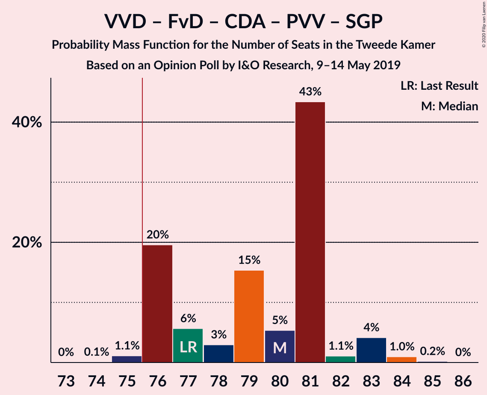

| Number of Seats | Probability | Accumulated | Special Marks |
|:---------------:|:-----------:|:-----------:|:-------------:|
| 73 | 0.3% | 100% |  |
| 74 | 0.2% | 99.6% |  |
| 75 | 1.4% | 99.4% |  |
| 76 | 6% | 98% | Majority |
| 77 | 6% | 92% | Last Result |
| 78 | 0.6% | 86% |  |
| 79 | 61% | 86% |  |
| 80 | 0.3% | 24% |  |
| 81 | 3% | 24% | Median |
| 82 | 6% | 21% |  |
| 83 | 7% | 15% |  |
| 84 | 7% | 8% |  |
| 85 | 0.4% | 0.4% |  |
| 86 | 0.1% | 0.1% |  |
| 87 | 0% | 0% |  |

### Volkspartij voor Vrijheid en Democratie – Forum voor Democratie – Christen-Democratisch Appèl – Partij voor de Vrijheid

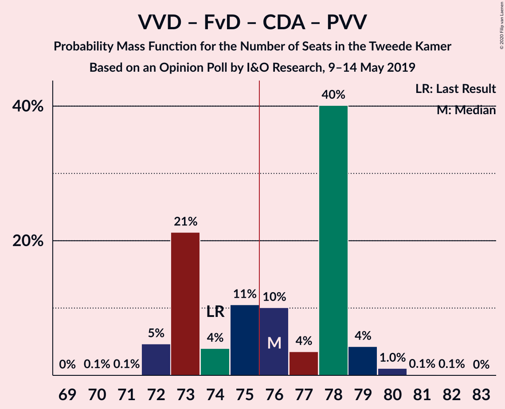

| Number of Seats | Probability | Accumulated | Special Marks |
|:---------------:|:-----------:|:-----------:|:-------------:|
| 69 | 0.3% | 100% |  |
| 70 | 1.1% | 99.7% |  |
| 71 | 0.4% | 98.6% |  |
| 72 | 1.2% | 98% |  |
| 73 | 5% | 97% |  |
| 74 | 6% | 92% | Last Result |
| 75 | 60% | 85% |  |
| 76 | 2% | 26% | Majority |
| 77 | 2% | 24% | Median |
| 78 | 6% | 21% |  |
| 79 | 7% | 16% |  |
| 80 | 8% | 8% |  |
| 81 | 0.7% | 0.7% |  |
| 82 | 0% | 0.1% |  |
| 83 | 0.1% | 0.1% |  |
| 84 | 0% | 0% |  |

### Volkspartij voor Vrijheid en Democratie – GroenLinks – Christen-Democratisch Appèl – Democraten 66 – ChristenUnie

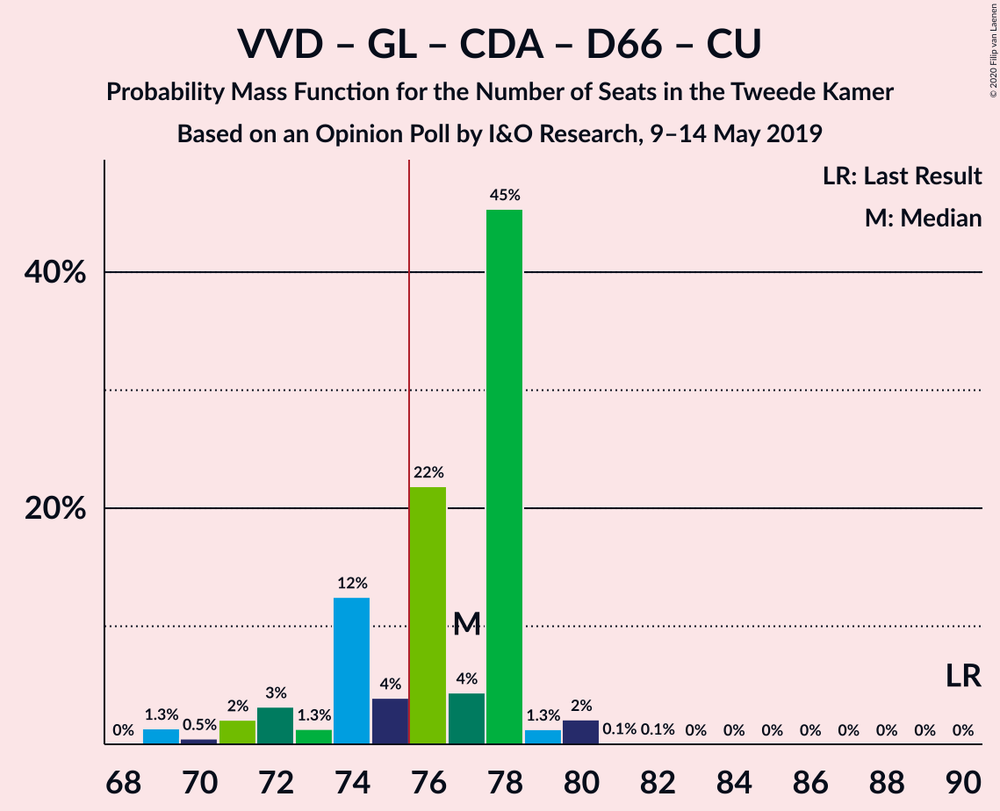

| Number of Seats | Probability | Accumulated | Special Marks |
|:---------------:|:-----------:|:-----------:|:-------------:|
| 68 | 0.3% | 100% |  |
| 69 | 0% | 99.7% |  |
| 70 | 0.9% | 99.7% |  |
| 71 | 2% | 98.8% |  |
| 72 | 4% | 97% |  |
| 73 | 1.0% | 94% |  |
| 74 | 29% | 93% |  |
| 75 | 34% | 63% | Median |
| 76 | 9% | 29% | Majority |
| 77 | 7% | 20% |  |
| 78 | 11% | 13% |  |
| 79 | 0% | 2% |  |
| 80 | 1.2% | 2% |  |
| 81 | 1.0% | 1.1% |  |
| 82 | 0.1% | 0.1% |  |
| 83 | 0% | 0% |  |
| 84 | 0% | 0% |  |
| 85 | 0% | 0% |  |
| 86 | 0% | 0% |  |
| 87 | 0% | 0% |  |
| 88 | 0% | 0% |  |
| 89 | 0% | 0% |  |
| 90 | 0% | 0% | Last Result |

### Volkspartij voor Vrijheid en Democratie – Forum voor Democratie – Christen-Democratisch Appèl – 50Plus – Staatkundig Gereformeerde Partij

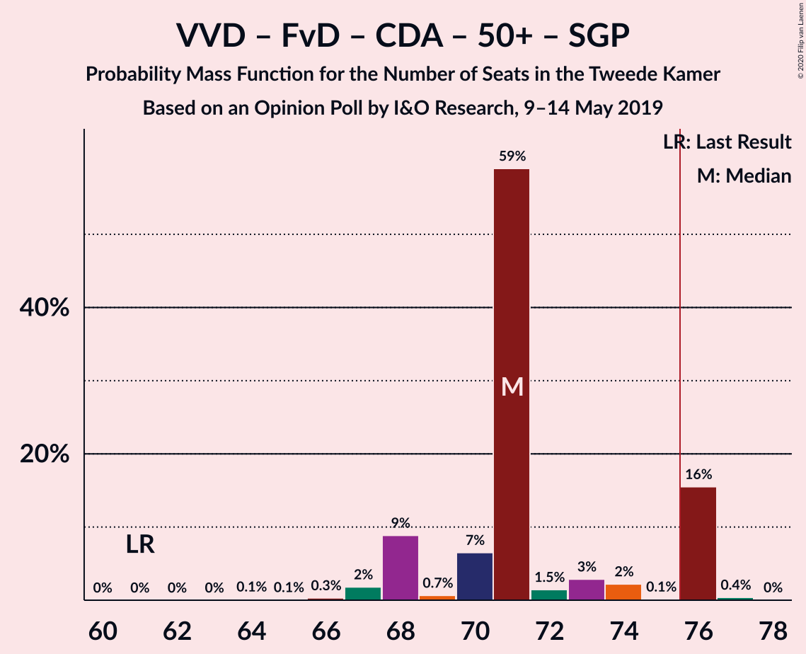

| Number of Seats | Probability | Accumulated | Special Marks |
|:---------------:|:-----------:|:-----------:|:-------------:|
| 61 | 0% | 100% | Last Result |
| 62 | 0% | 100% |  |
| 63 | 0% | 100% |  |
| 64 | 0.1% | 100% |  |
| 65 | 0.1% | 99.9% |  |
| 66 | 0.3% | 99.8% |  |
| 67 | 2% | 99.5% |  |
| 68 | 9% | 98% |  |
| 69 | 0.7% | 89% |  |
| 70 | 7% | 88% |  |
| 71 | 59% | 82% |  |
| 72 | 1.5% | 23% |  |
| 73 | 3% | 21% | Median |
| 74 | 2% | 18% |  |
| 75 | 0.1% | 16% |  |
| 76 | 16% | 16% | Majority |
| 77 | 0.4% | 0.4% |  |
| 78 | 0% | 0% |  |

### GroenLinks – Christen-Democratisch Appèl – Partij van de Arbeid – Democraten 66 – Socialistische Partij – ChristenUnie

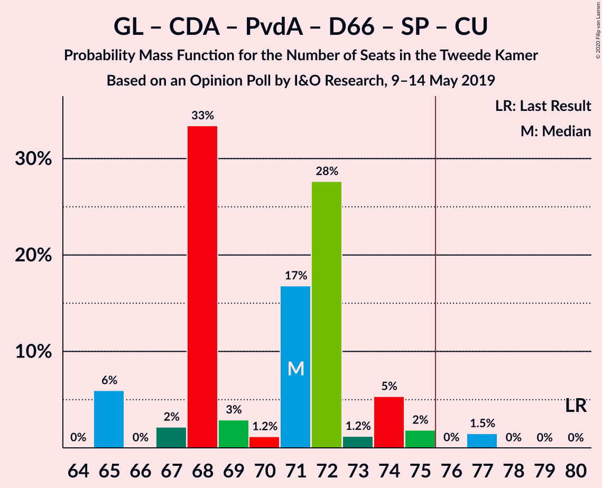

| Number of Seats | Probability | Accumulated | Special Marks |
|:---------------:|:-----------:|:-----------:|:-------------:|
| 65 | 6% | 100% |  |
| 66 | 0% | 94% |  |
| 67 | 2% | 94% |  |
| 68 | 33% | 92% |  |
| 69 | 3% | 58% | Median |
| 70 | 1.2% | 56% |  |
| 71 | 17% | 54% |  |
| 72 | 28% | 38% |  |
| 73 | 1.2% | 10% |  |
| 74 | 5% | 9% |  |
| 75 | 2% | 3% |  |
| 76 | 0% | 2% | Majority |
| 77 | 1.5% | 2% |  |
| 78 | 0% | 0% |  |
| 79 | 0% | 0% |  |
| 80 | 0% | 0% | Last Result |

### Volkspartij voor Vrijheid en Democratie – Christen-Democratisch Appèl – Partij van de Arbeid – Democraten 66 – ChristenUnie

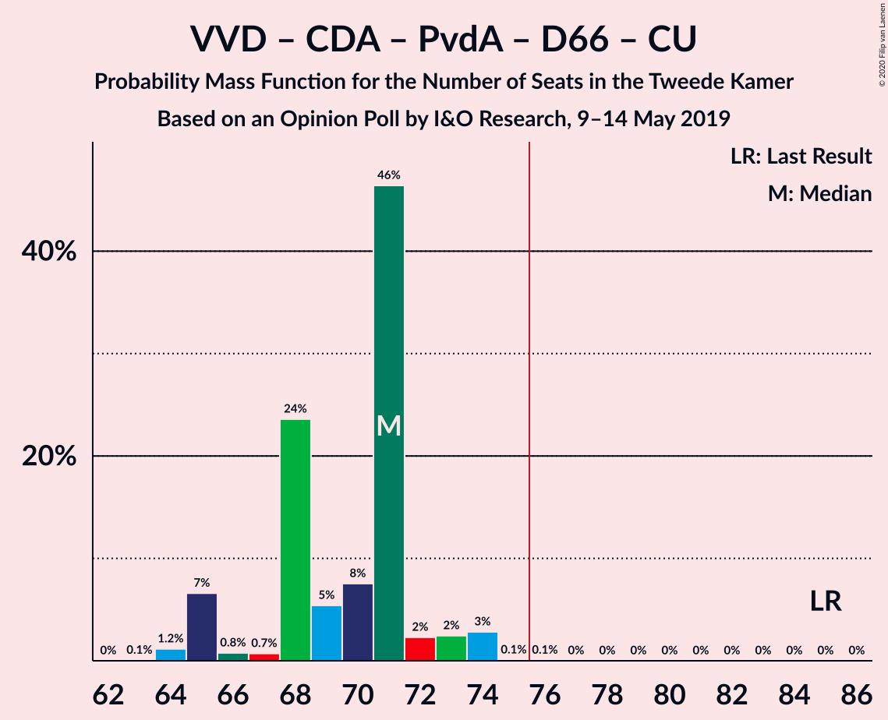

| Number of Seats | Probability | Accumulated | Special Marks |
|:---------------:|:-----------:|:-----------:|:-------------:|
| 63 | 0.4% | 100% |  |
| 64 | 0.6% | 99.6% |  |
| 65 | 0.3% | 99.0% |  |
| 66 | 2% | 98.7% |  |
| 67 | 3% | 97% |  |
| 68 | 39% | 94% |  |
| 69 | 3% | 55% | Median |
| 70 | 32% | 52% |  |
| 71 | 5% | 20% |  |
| 72 | 10% | 15% |  |
| 73 | 4% | 5% |  |
| 74 | 0.4% | 0.8% |  |
| 75 | 0.4% | 0.4% |  |
| 76 | 0% | 0% | Majority |
| 77 | 0% | 0% |  |
| 78 | 0% | 0% |  |
| 79 | 0% | 0% |  |
| 80 | 0% | 0% |  |
| 81 | 0% | 0% |  |
| 82 | 0% | 0% |  |
| 83 | 0% | 0% |  |
| 84 | 0% | 0% |  |
| 85 | 0% | 0% | Last Result |

### Volkspartij voor Vrijheid en Democratie – Forum voor Democratie – Christen-Democratisch Appèl – Staatkundig Gereformeerde Partij

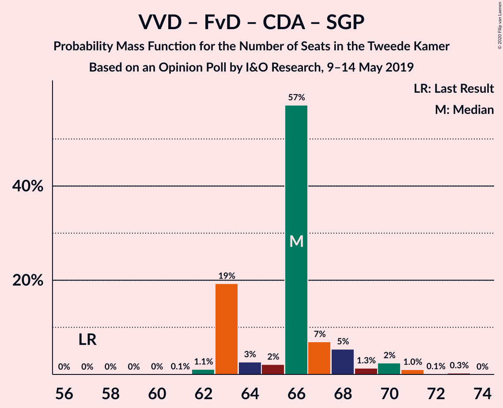

| Number of Seats | Probability | Accumulated | Special Marks |
|:---------------:|:-----------:|:-----------:|:-------------:|
| 57 | 0% | 100% | Last Result |
| 58 | 0% | 100% |  |
| 59 | 0% | 100% |  |
| 60 | 0.2% | 100% |  |
| 61 | 0.4% | 99.8% |  |
| 62 | 0.9% | 99.4% |  |
| 63 | 1.3% | 98% |  |
| 64 | 9% | 97% |  |
| 65 | 1.2% | 88% |  |
| 66 | 37% | 86% |  |
| 67 | 31% | 50% |  |
| 68 | 1.0% | 19% | Median |
| 69 | 2% | 18% |  |
| 70 | 6% | 16% |  |
| 71 | 3% | 10% |  |
| 72 | 0.4% | 7% |  |
| 73 | 7% | 7% |  |
| 74 | 0% | 0% |  |

### Volkspartij voor Vrijheid en Democratie – Forum voor Democratie – Christen-Democratisch Appèl – 50Plus

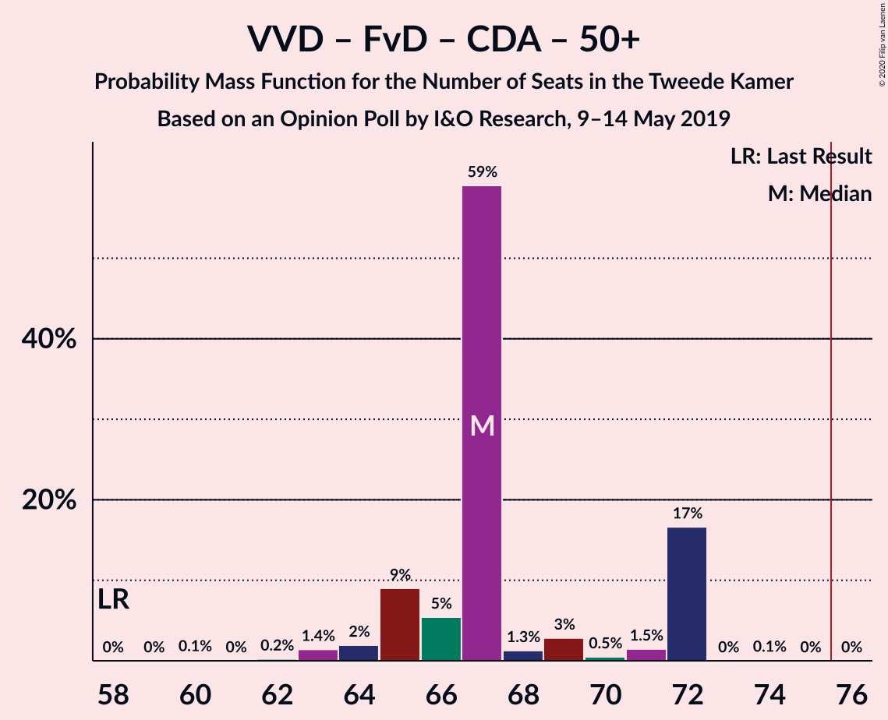

| Number of Seats | Probability | Accumulated | Special Marks |
|:---------------:|:-----------:|:-----------:|:-------------:|
| 58 | 0% | 100% | Last Result |
| 59 | 0% | 100% |  |
| 60 | 0.1% | 100% |  |
| 61 | 0% | 99.9% |  |
| 62 | 0.2% | 99.9% |  |
| 63 | 1.4% | 99.6% |  |
| 64 | 2% | 98% |  |
| 65 | 9% | 96% |  |
| 66 | 5% | 87% |  |
| 67 | 59% | 82% |  |
| 68 | 1.3% | 23% |  |
| 69 | 3% | 22% | Median |
| 70 | 0.5% | 19% |  |
| 71 | 1.5% | 18% |  |
| 72 | 17% | 17% |  |
| 73 | 0% | 0.1% |  |
| 74 | 0.1% | 0.1% |  |
| 75 | 0% | 0% |  |

### Volkspartij voor Vrijheid en Democratie – Forum voor Democratie – Christen-Democratisch Appèl

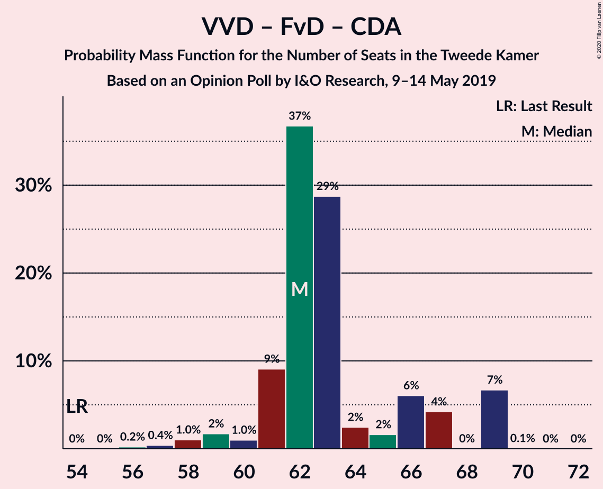

| Number of Seats | Probability | Accumulated | Special Marks |
|:---------------:|:-----------:|:-----------:|:-------------:|
| 54 | 0% | 100% | Last Result |
| 55 | 0% | 100% |  |
| 56 | 0.2% | 100% |  |
| 57 | 0.4% | 99.8% |  |
| 58 | 1.0% | 99.4% |  |
| 59 | 2% | 98% |  |
| 60 | 1.0% | 97% |  |
| 61 | 9% | 96% |  |
| 62 | 37% | 87% |  |
| 63 | 29% | 50% |  |
| 64 | 2% | 21% | Median |
| 65 | 2% | 19% |  |
| 66 | 6% | 17% |  |
| 67 | 4% | 11% |  |
| 68 | 0% | 7% |  |
| 69 | 7% | 7% |  |
| 70 | 0.1% | 0.1% |  |
| 71 | 0% | 0% |  |

### GroenLinks – Christen-Democratisch Appèl – Partij van de Arbeid – Democraten 66 – ChristenUnie

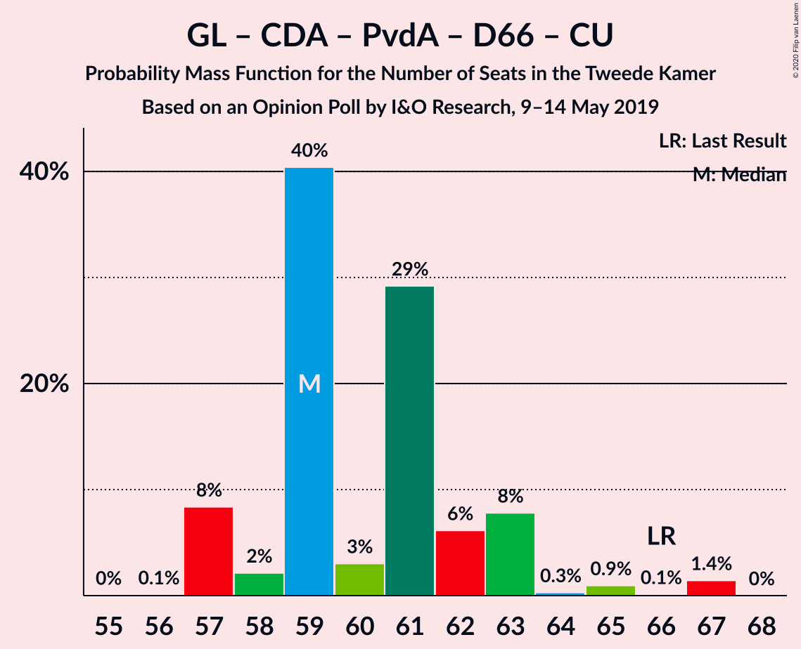

| Number of Seats | Probability | Accumulated | Special Marks |
|:---------------:|:-----------:|:-----------:|:-------------:|
| 55 | 0% | 100% |  |
| 56 | 0.1% | 99.9% |  |
| 57 | 8% | 99.9% |  |
| 58 | 2% | 91% |  |
| 59 | 40% | 89% | Median |
| 60 | 3% | 49% |  |
| 61 | 29% | 46% |  |
| 62 | 6% | 17% |  |
| 63 | 8% | 11% |  |
| 64 | 0.3% | 3% |  |
| 65 | 0.9% | 2% |  |
| 66 | 0.1% | 2% | Last Result |
| 67 | 1.4% | 1.4% |  |
| 68 | 0% | 0% |  |

### Volkspartij voor Vrijheid en Democratie – Christen-Democratisch Appèl – Democraten 66 – ChristenUnie

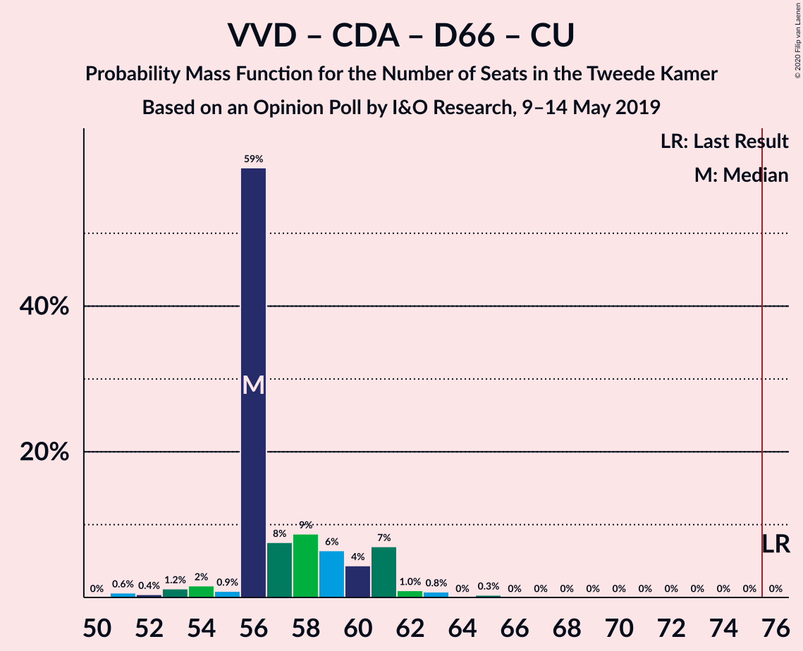

| Number of Seats | Probability | Accumulated | Special Marks |
|:---------------:|:-----------:|:-----------:|:-------------:|
| 51 | 0.6% | 100% |  |
| 52 | 0.4% | 99.4% |  |
| 53 | 1.2% | 98.9% |  |
| 54 | 2% | 98% |  |
| 55 | 0.9% | 96% |  |
| 56 | 59% | 95% |  |
| 57 | 8% | 36% | Median |
| 58 | 9% | 29% |  |
| 59 | 6% | 20% |  |
| 60 | 4% | 13% |  |
| 61 | 7% | 9% |  |
| 62 | 1.0% | 2% |  |
| 63 | 0.8% | 1.1% |  |
| 64 | 0% | 0.3% |  |
| 65 | 0.3% | 0.3% |  |
| 66 | 0% | 0% |  |
| 67 | 0% | 0% |  |
| 68 | 0% | 0% |  |
| 69 | 0% | 0% |  |
| 70 | 0% | 0% |  |
| 71 | 0% | 0% |  |
| 72 | 0% | 0% |  |
| 73 | 0% | 0% |  |
| 74 | 0% | 0% |  |
| 75 | 0% | 0% |  |
| 76 | 0% | 0% | Last Result, Majority |

### Volkspartij voor Vrijheid en Democratie – Christen-Democratisch Appèl – Partij van de Arbeid

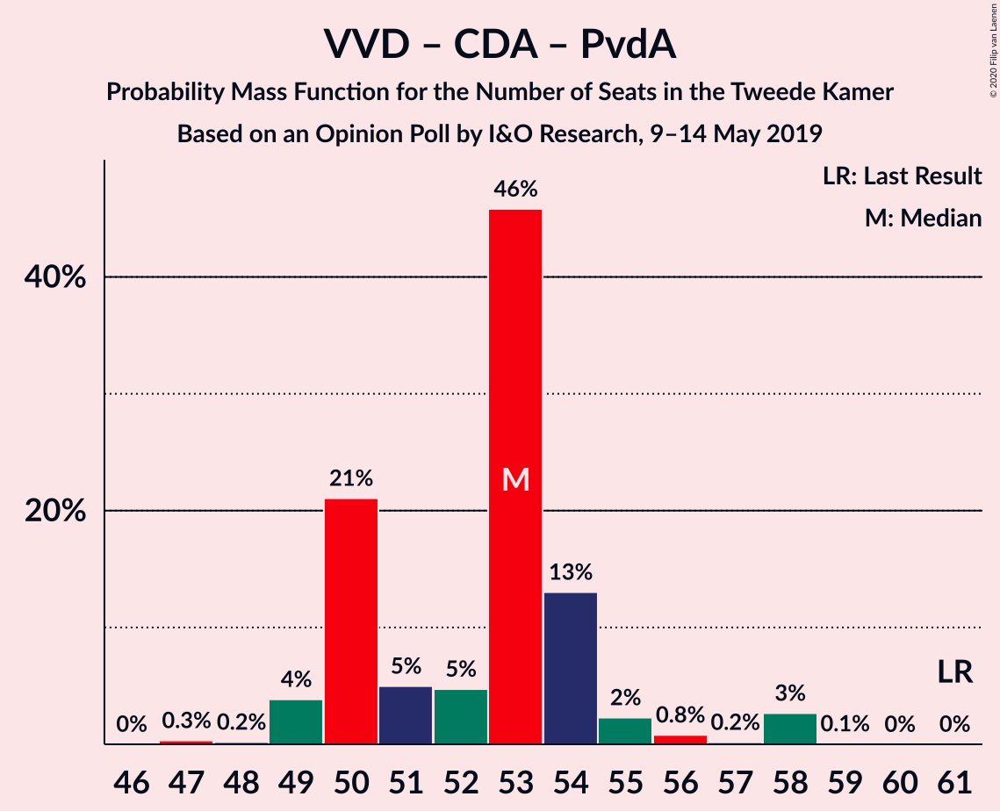

| Number of Seats | Probability | Accumulated | Special Marks |
|:---------------:|:-----------:|:-----------:|:-------------:|
| 46 | 0.2% | 100% |  |
| 47 | 0.5% | 99.8% |  |
| 48 | 0.2% | 99.4% |  |
| 49 | 2% | 99.1% |  |
| 50 | 0.7% | 98% |  |
| 51 | 7% | 97% |  |
| 52 | 9% | 90% |  |
| 53 | 40% | 81% | Median |
| 54 | 30% | 42% |  |
| 55 | 2% | 12% |  |
| 56 | 9% | 10% |  |
| 57 | 1.2% | 1.3% |  |
| 58 | 0% | 0% |  |
| 59 | 0% | 0% |  |
| 60 | 0% | 0% |  |
| 61 | 0% | 0% | Last Result |

### Volkspartij voor Vrijheid en Democratie – Christen-Democratisch Appèl – Partij voor de Vrijheid

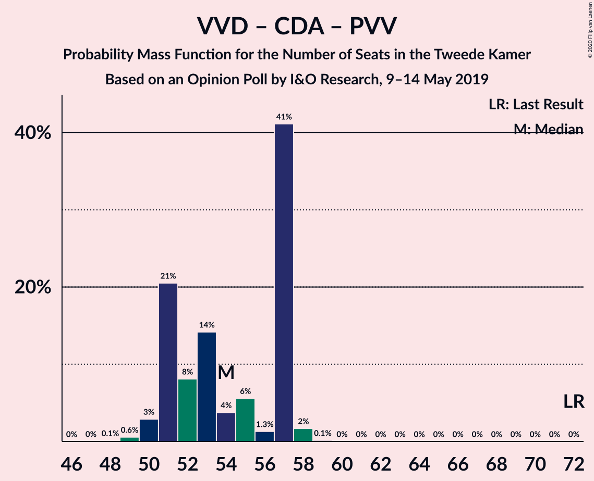

| Number of Seats | Probability | Accumulated | Special Marks |
|:---------------:|:-----------:|:-----------:|:-------------:|
| 48 | 0.7% | 100% |  |
| 49 | 1.4% | 99.3% |  |
| 50 | 0.5% | 98% |  |
| 51 | 1.3% | 97% |  |
| 52 | 34% | 96% |  |
| 53 | 3% | 63% |  |
| 54 | 38% | 60% | Median |
| 55 | 11% | 22% |  |
| 56 | 9% | 11% |  |
| 57 | 1.3% | 2% |  |
| 58 | 0.1% | 0.5% |  |
| 59 | 0.4% | 0.4% |  |
| 60 | 0% | 0% |  |
| 61 | 0% | 0% |  |
| 62 | 0% | 0% |  |
| 63 | 0% | 0% |  |
| 64 | 0% | 0% |  |
| 65 | 0% | 0% |  |
| 66 | 0% | 0% |  |
| 67 | 0% | 0% |  |
| 68 | 0% | 0% |  |
| 69 | 0% | 0% |  |
| 70 | 0% | 0% |  |
| 71 | 0% | 0% |  |
| 72 | 0% | 0% | Last Result |

### Volkspartij voor Vrijheid en Democratie – Christen-Democratisch Appèl – Democraten 66

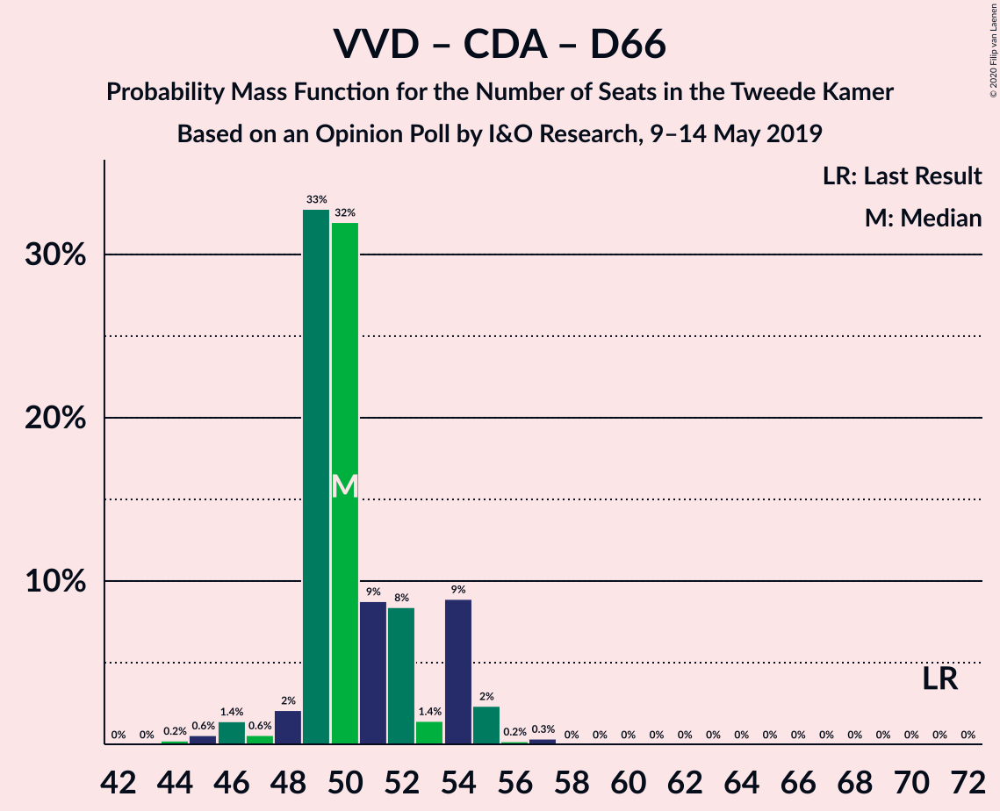

| Number of Seats | Probability | Accumulated | Special Marks |
|:---------------:|:-----------:|:-----------:|:-------------:|
| 44 | 0.2% | 100% |  |
| 45 | 0.6% | 99.8% |  |
| 46 | 1.4% | 99.2% |  |
| 47 | 0.6% | 98% |  |
| 48 | 2% | 97% |  |
| 49 | 33% | 95% |  |
| 50 | 32% | 62% | Median |
| 51 | 9% | 30% |  |
| 52 | 8% | 22% |  |
| 53 | 1.4% | 13% |  |
| 54 | 9% | 12% |  |
| 55 | 2% | 3% |  |
| 56 | 0.2% | 0.5% |  |
| 57 | 0.3% | 0.3% |  |
| 58 | 0% | 0% |  |
| 59 | 0% | 0% |  |
| 60 | 0% | 0% |  |
| 61 | 0% | 0% |  |
| 62 | 0% | 0% |  |
| 63 | 0% | 0% |  |
| 64 | 0% | 0% |  |
| 65 | 0% | 0% |  |
| 66 | 0% | 0% |  |
| 67 | 0% | 0% |  |
| 68 | 0% | 0% |  |
| 69 | 0% | 0% |  |
| 70 | 0% | 0% |  |
| 71 | 0% | 0% | Last Result |

### Volkspartij voor Vrijheid en Democratie – Partij van de Arbeid – Democraten 66

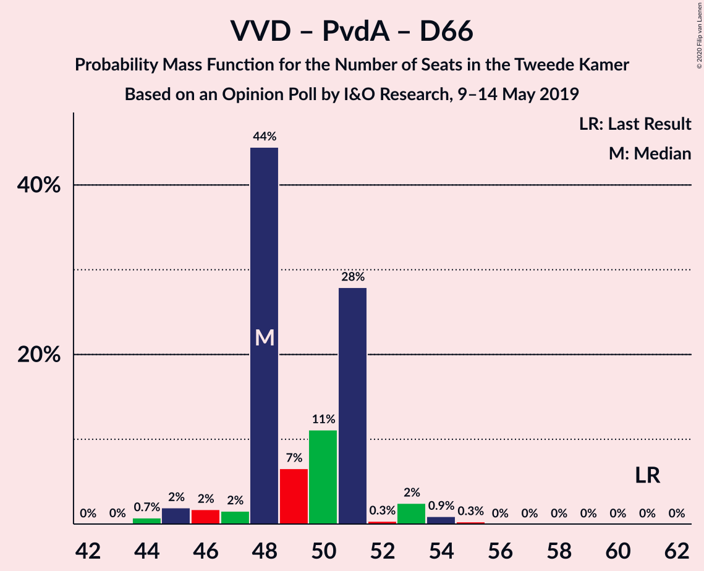

| Number of Seats | Probability | Accumulated | Special Marks |
|:---------------:|:-----------:|:-----------:|:-------------:|
| 44 | 0.7% | 100% |  |
| 45 | 2% | 99.2% |  |
| 46 | 2% | 97% |  |
| 47 | 2% | 96% |  |
| 48 | 44% | 94% |  |
| 49 | 7% | 50% | Median |
| 50 | 11% | 43% |  |
| 51 | 28% | 32% |  |
| 52 | 0.3% | 4% |  |
| 53 | 2% | 4% |  |
| 54 | 0.9% | 1.2% |  |
| 55 | 0.3% | 0.3% |  |
| 56 | 0% | 0% |  |
| 57 | 0% | 0% |  |
| 58 | 0% | 0% |  |
| 59 | 0% | 0% |  |
| 60 | 0% | 0% |  |
| 61 | 0% | 0% | Last Result |

### Volkspartij voor Vrijheid en Democratie – Christen-Democratisch Appèl

| Number of Seats | Probability | Accumulated | Special Marks |
|:---------------:|:-----------:|:-----------:|:-------------:|
| 34 | 0.1% | 100% |  |
| 35 | 0.4% | 99.9% |  |
| 36 | 0.5% | 99.4% |  |
| 37 | 1.4% | 99.0% |  |
| 38 | 1.0% | 98% |  |
| 39 | 5% | 97% |  |
| 40 | 34% | 91% |  |
| 41 | 37% | 57% | Median |
| 42 | 9% | 21% |  |
| 43 | 3% | 12% |  |
| 44 | 2% | 9% |  |
| 45 | 7% | 7% |  |
| 46 | 0.4% | 0.4% |  |
| 47 | 0% | 0% |  |
| 48 | 0% | 0% |  |
| 49 | 0% | 0% |  |
| 50 | 0% | 0% |  |
| 51 | 0% | 0% |  |
| 52 | 0% | 0% | Last Result |

### Volkspartij voor Vrijheid en Democratie – Partij van de Arbeid

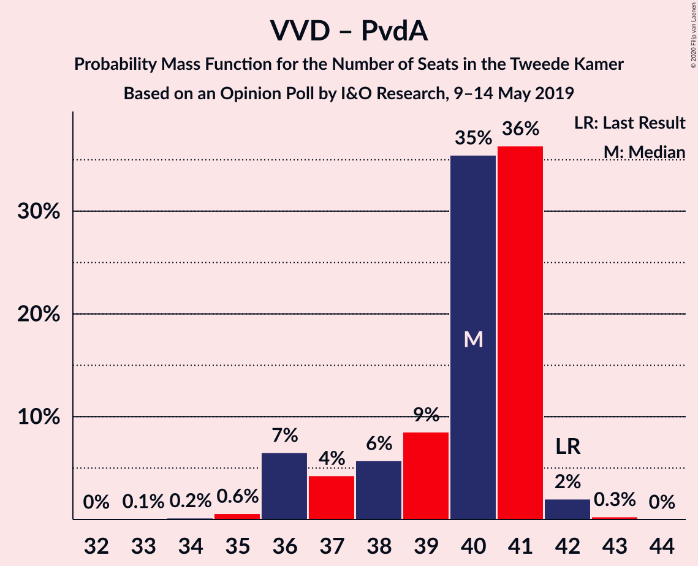

| Number of Seats | Probability | Accumulated | Special Marks |
|:---------------:|:-----------:|:-----------:|:-------------:|
| 33 | 0.1% | 100% |  |
| 34 | 0.2% | 99.9% |  |
| 35 | 0.6% | 99.7% |  |
| 36 | 7% | 99.1% |  |
| 37 | 4% | 93% |  |
| 38 | 6% | 88% |  |
| 39 | 9% | 83% |  |
| 40 | 35% | 74% | Median |
| 41 | 36% | 39% |  |
| 42 | 2% | 2% | Last Result |
| 43 | 0.3% | 0.3% |  |
| 44 | 0% | 0% |  |

### Christen-Democratisch Appèl – Partij van de Arbeid – Democraten 66

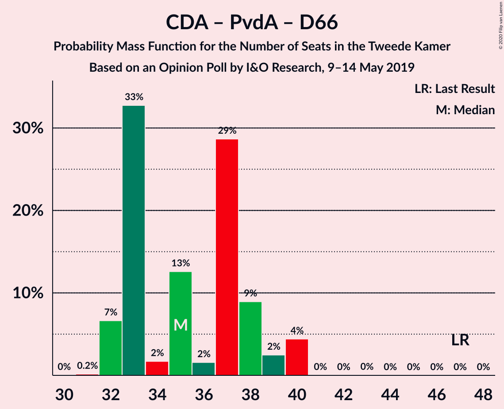

| Number of Seats | Probability | Accumulated | Special Marks |
|:---------------:|:-----------:|:-----------:|:-------------:|
| 31 | 0.2% | 100% |  |
| 32 | 7% | 99.8% |  |
| 33 | 33% | 93% |  |
| 34 | 2% | 60% | Median |
| 35 | 13% | 59% |  |
| 36 | 2% | 46% |  |
| 37 | 29% | 45% |  |
| 38 | 9% | 16% |  |
| 39 | 2% | 7% |  |
| 40 | 4% | 4% |  |
| 41 | 0% | 0.1% |  |
| 42 | 0% | 0% |  |
| 43 | 0% | 0% |  |
| 44 | 0% | 0% |  |
| 45 | 0% | 0% |  |
| 46 | 0% | 0% |  |
| 47 | 0% | 0% | Last Result |

### Christen-Democratisch Appèl – Partij van de Arbeid – ChristenUnie

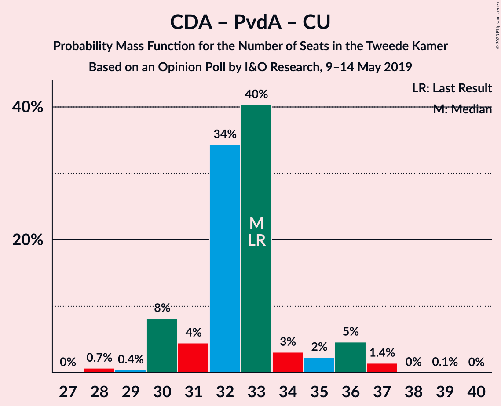

| Number of Seats | Probability | Accumulated | Special Marks |
|:---------------:|:-----------:|:-----------:|:-------------:|
| 28 | 0.7% | 100% |  |
| 29 | 0.4% | 99.3% |  |
| 30 | 8% | 98.9% |  |
| 31 | 4% | 91% |  |
| 32 | 34% | 86% | Median |
| 33 | 40% | 52% | Last Result |
| 34 | 3% | 12% |  |
| 35 | 2% | 8% |  |
| 36 | 5% | 6% |  |
| 37 | 1.4% | 2% |  |
| 38 | 0% | 0.1% |  |
| 39 | 0.1% | 0.1% |  |
| 40 | 0% | 0% |  |

### Christen-Democratisch Appèl – Partij van de Arbeid

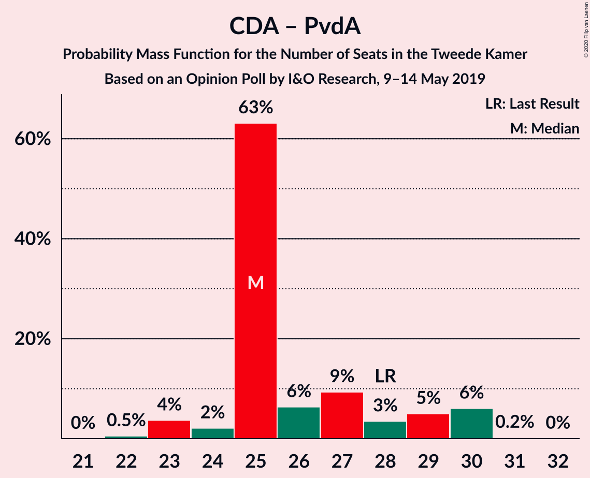

| Number of Seats | Probability | Accumulated | Special Marks |
|:---------------:|:-----------:|:-----------:|:-------------:|
| 22 | 0.7% | 100% |  |
| 23 | 7% | 99.3% |  |
| 24 | 3% | 92% |  |
| 25 | 36% | 89% | Median |
| 26 | 15% | 54% |  |
| 27 | 31% | 38% |  |
| 28 | 2% | 8% | Last Result |
| 29 | 4% | 6% |  |
| 30 | 1.4% | 2% |  |
| 31 | 0.2% | 0.2% |  |
| 32 | 0% | 0% |  |

### Christen-Democratisch Appèl – Democraten 66

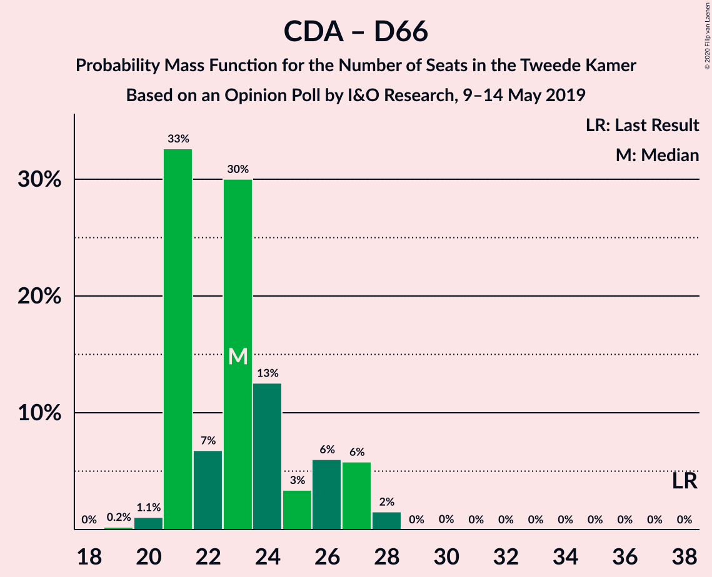

| Number of Seats | Probability | Accumulated | Special Marks |
|:---------------:|:-----------:|:-----------:|:-------------:|
| 19 | 0.2% | 100% |  |
| 20 | 1.1% | 99.8% |  |
| 21 | 33% | 98.7% |  |
| 22 | 7% | 66% | Median |
| 23 | 30% | 59% |  |
| 24 | 13% | 29% |  |
| 25 | 3% | 17% |  |
| 26 | 6% | 13% |  |
| 27 | 6% | 7% |  |
| 28 | 2% | 2% |  |
| 29 | 0% | 0.1% |  |
| 30 | 0% | 0% |  |
| 31 | 0% | 0% |  |
| 32 | 0% | 0% |  |
| 33 | 0% | 0% |  |
| 34 | 0% | 0% |  |
| 35 | 0% | 0% |  |
| 36 | 0% | 0% |  |
| 37 | 0% | 0% |  |
| 38 | 0% | 0% | Last Result |

## Technical Information

### Opinion Poll

+ **Polling firm:** I&O Research
+ **Commissioner(s):** —
+ **Fieldwork period:** 9–14 May 2019

### Calculations

+ **Sample size:** 1659
+ **Simulations done:** 131,072
+ **Error estimate:** 1.68%

