# Opinion Poll by Peil.nl, 13–19 May 2019

<a href="#voting-intentions">Voting Intentions</a> | <a href="#seats">Seats</a> | <a href="#coalitions">Coalitions</a> | <a href="#technical-information">Technical Information</a>

## Voting Intentions

### Confidence Intervals

| Party | Last Result | Poll Result | 80% Confidence Interval | 90% Confidence Interval | 95% Confidence Interval | 99% Confidence Interval |
|:-----:|:-----------:|:-----------:|:-----------------------:|:-----------------------:|:-----------------------:|:-----------------------:|
| Forum voor Democratie | 1.8% | 18.0% | 17.1–18.9% |16.9–19.2% |16.7–19.4% |16.2–19.9% |
| Volkspartij voor Vrijheid en Democratie | 21.3% | 16.7% | 15.8–17.6% |15.6–17.8% |15.4–18.0% |15.0–18.5% |
| Christen-Democratisch Appèl | 12.4% | 10.0% | 9.3–10.7% |9.1–10.9% |9.0–11.1% |8.7–11.5% |
| GroenLinks | 9.1% | 10.0% | 9.3–10.7% |9.1–10.9% |9.0–11.1% |8.7–11.5% |
| Partij van de Arbeid | 5.7% | 10.0% | 9.3–10.7% |9.1–10.9% |9.0–11.1% |8.7–11.5% |
| Democraten 66 | 12.2% | 7.3% | 6.8–8.0% |6.6–8.2% |6.4–8.3% |6.2–8.6% |
| Partij voor de Vrijheid | 13.1% | 5.3% | 4.8–5.9% |4.7–6.1% |4.6–6.2% |4.4–6.5% |
| Socialistische Partij | 9.1% | 5.3% | 4.8–5.9% |4.7–6.1% |4.6–6.2% |4.4–6.5% |
| Partij voor de Dieren | 3.2% | 5.3% | 4.8–5.9% |4.7–6.1% |4.6–6.2% |4.4–6.5% |
| ChristenUnie | 3.4% | 4.7% | 4.2–5.2% |4.1–5.3% |4.0–5.5% |3.7–5.8% |
| 50Plus | 3.1% | 2.7% | 2.3–3.1% |2.2–3.2% |2.1–3.3% |2.0–3.5% |
| DENK | 2.1% | 2.7% | 2.3–3.1% |2.2–3.2% |2.1–3.3% |2.0–3.5% |
| Staatkundig Gereformeerde Partij | 2.1% | 1.3% | 1.1–1.6% |1.0–1.7% |1.0–1.8% |0.9–2.0% |

*Note:* The poll result column reflects the actual value used in the calculations. Published results may vary slightly, and in addition be rounded to fewer digits.

## Seats

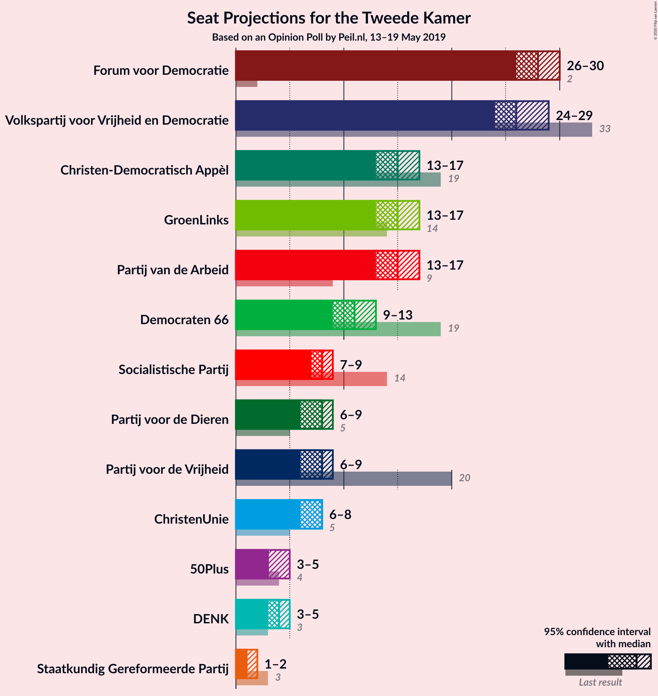

### Confidence Intervals

| Party | Last Result | Median | 80% Confidence Interval | 90% Confidence Interval | 95% Confidence Interval | 99% Confidence Interval |
|:-----:|:-----------:|:------:|:-----------------------:|:-----------------------:|:-----------------------:|:-----------------------:|
| <a href="#forum-voor-democratie">Forum voor Democratie</a> | 2 | 27 | 26–27 |26–28 |26–29 |25–30 |
| <a href="#volkspartij-voor-vrijheid-en-democratie">Volkspartij voor Vrijheid en Democratie</a> | 33 | 26 | 26–27 |25–27 |24–28 |23–29 |
| <a href="#christen-democratisch-appèl">Christen-Democratisch Appèl</a> | 19 | 17 | 15–17 |15–17 |14–17 |14–17 |
| <a href="#groenlinks">GroenLinks</a> | 14 | 16 | 13–16 |13–16 |13–17 |13–18 |
| <a href="#partij-van-de-arbeid">Partij van de Arbeid</a> | 9 | 14 | 14–15 |12–16 |12–17 |12–18 |
| <a href="#democraten-66">Democraten 66</a> | 19 | 10 | 10–11 |10–12 |10–12 |9–13 |
| <a href="#partij-voor-de-vrijheid">Partij voor de Vrijheid</a> | 20 | 8 | 7–9 |7–9 |7–9 |6–10 |
| <a href="#socialistische-partij">Socialistische Partij</a> | 14 | 7 | 7–9 |7–9 |7–9 |6–9 |
| <a href="#partij-voor-de-dieren">Partij voor de Dieren</a> | 5 | 8 | 6–8 |6–8 |6–9 |6–9 |
| <a href="#christenunie">ChristenUnie</a> | 5 | 8 | 6–8 |6–8 |5–8 |5–9 |
| <a href="#50plus">50Plus</a> | 4 | 4 | 4 |3–4 |3–4 |3–5 |
| <a href="#denk">DENK</a> | 3 | 3 | 3–4 |3–4 |3–4 |3–4 |
| <a href="#staatkundig-gereformeerde-partij">Staatkundig Gereformeerde Partij</a> | 3 | 1 | 1–2 |1–2 |1–2 |1–3 |

### Forum voor Democratie

*For a full overview of the results for this party, see the [Forum voor Democratie](party-forumvoordemocratie.html) page.*

| Number of Seats | Probability | Accumulated | Special Marks |
|:---------------:|:-----------:|:-----------:|:-------------:|
| 2 | 0% | 100% | Last Result |
| 3 | 0% | 100% |  |
| 4 | 0% | 100% |  |
| 5 | 0% | 100% |  |
| 6 | 0% | 100% |  |
| 7 | 0% | 100% |  |
| 8 | 0% | 100% |  |
| 9 | 0% | 100% |  |
| 10 | 0% | 100% |  |
| 11 | 0% | 100% |  |
| 12 | 0% | 100% |  |
| 13 | 0% | 100% |  |
| 14 | 0% | 100% |  |
| 15 | 0% | 100% |  |
| 16 | 0% | 100% |  |
| 17 | 0% | 100% |  |
| 18 | 0% | 100% |  |
| 19 | 0% | 100% |  |
| 20 | 0% | 100% |  |
| 21 | 0% | 100% |  |
| 22 | 0% | 100% |  |
| 23 | 0% | 100% |  |
| 24 | 0% | 100% |  |
| 25 | 2% | 100% |  |
| 26 | 19% | 98% |  |
| 27 | 72% | 80% | Median |
| 28 | 4% | 8% |  |
| 29 | 2% | 4% |  |
| 30 | 2% | 2% |  |
| 31 | 0% | 0% |  |

### Volkspartij voor Vrijheid en Democratie

*For a full overview of the results for this party, see the [Volkspartij voor Vrijheid en Democratie](party-volkspartijvoorvrijheidendemocratie.html) page.*

| Number of Seats | Probability | Accumulated | Special Marks |
|:---------------:|:-----------:|:-----------:|:-------------:|
| 22 | 0.1% | 100% |  |
| 23 | 0.6% | 99.9% |  |
| 24 | 2% | 99.3% |  |
| 25 | 3% | 97% |  |
| 26 | 64% | 94% | Median |
| 27 | 27% | 30% |  |
| 28 | 3% | 4% |  |
| 29 | 0.9% | 0.9% |  |
| 30 | 0% | 0% |  |
| 31 | 0% | 0% |  |
| 32 | 0% | 0% |  |
| 33 | 0% | 0% | Last Result |

### Christen-Democratisch Appèl

*For a full overview of the results for this party, see the [Christen-Democratisch Appèl](party-christen-democratischappèl.html) page.*

| Number of Seats | Probability | Accumulated | Special Marks |
|:---------------:|:-----------:|:-----------:|:-------------:|
| 13 | 0.2% | 100% |  |
| 14 | 4% | 99.8% |  |
| 15 | 7% | 96% |  |
| 16 | 31% | 89% |  |
| 17 | 58% | 58% | Median |
| 18 | 0.1% | 0.1% |  |
| 19 | 0% | 0% | Last Result |

### GroenLinks

*For a full overview of the results for this party, see the [GroenLinks](party-groenlinks.html) page.*

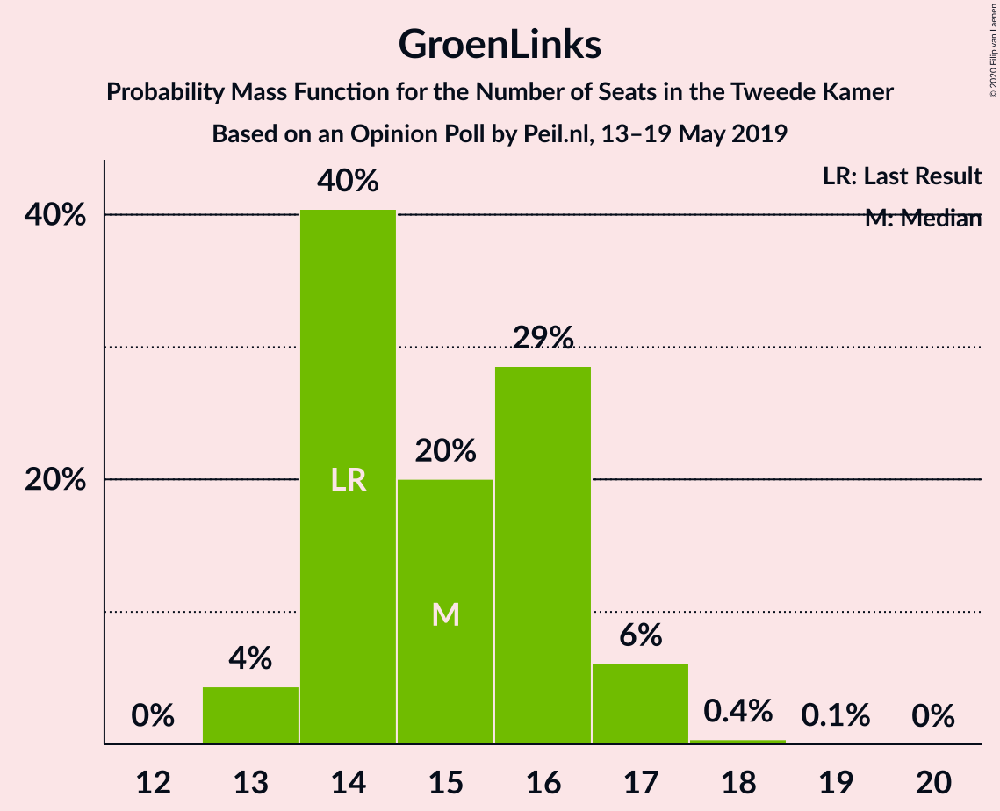

| Number of Seats | Probability | Accumulated | Special Marks |
|:---------------:|:-----------:|:-----------:|:-------------:|
| 13 | 11% | 100% |  |
| 14 | 0.9% | 89% | Last Result |
| 15 | 12% | 88% |  |
| 16 | 73% | 76% | Median |
| 17 | 2% | 3% |  |
| 18 | 1.0% | 1.0% |  |
| 19 | 0% | 0% |  |

### Partij van de Arbeid

*For a full overview of the results for this party, see the [Partij van de Arbeid](party-partijvandearbeid.html) page.*

| Number of Seats | Probability | Accumulated | Special Marks |
|:---------------:|:-----------:|:-----------:|:-------------:|
| 9 | 0% | 100% | Last Result |
| 10 | 0% | 100% |  |
| 11 | 0% | 100% |  |
| 12 | 6% | 100% |  |
| 13 | 1.5% | 94% |  |
| 14 | 56% | 93% | Median |
| 15 | 31% | 36% |  |
| 16 | 1.5% | 5% |  |
| 17 | 3% | 4% |  |
| 18 | 1.0% | 1.0% |  |
| 19 | 0% | 0% |  |

### Democraten 66

*For a full overview of the results for this party, see the [Democraten 66](party-democraten66.html) page.*

| Number of Seats | Probability | Accumulated | Special Marks |
|:---------------:|:-----------:|:-----------:|:-------------:|
| 9 | 1.2% | 100% |  |
| 10 | 57% | 98.8% | Median |
| 11 | 33% | 42% |  |
| 12 | 7% | 9% |  |
| 13 | 1.2% | 1.4% |  |
| 14 | 0.1% | 0.1% |  |
| 15 | 0% | 0% |  |
| 16 | 0% | 0% |  |
| 17 | 0% | 0% |  |
| 18 | 0% | 0% |  |
| 19 | 0% | 0% | Last Result |

### Partij voor de Vrijheid

*For a full overview of the results for this party, see the [Partij voor de Vrijheid](party-partijvoordevrijheid.html) page.*

| Number of Seats | Probability | Accumulated | Special Marks |
|:---------------:|:-----------:|:-----------:|:-------------:|
| 6 | 0.8% | 100% |  |
| 7 | 22% | 99.2% |  |
| 8 | 63% | 77% | Median |
| 9 | 14% | 14% |  |
| 10 | 0.6% | 0.6% |  |
| 11 | 0% | 0% |  |
| 12 | 0% | 0% |  |
| 13 | 0% | 0% |  |
| 14 | 0% | 0% |  |
| 15 | 0% | 0% |  |
| 16 | 0% | 0% |  |
| 17 | 0% | 0% |  |
| 18 | 0% | 0% |  |
| 19 | 0% | 0% |  |
| 20 | 0% | 0% | Last Result |

### Socialistische Partij

*For a full overview of the results for this party, see the [Socialistische Partij](party-socialistischepartij.html) page.*

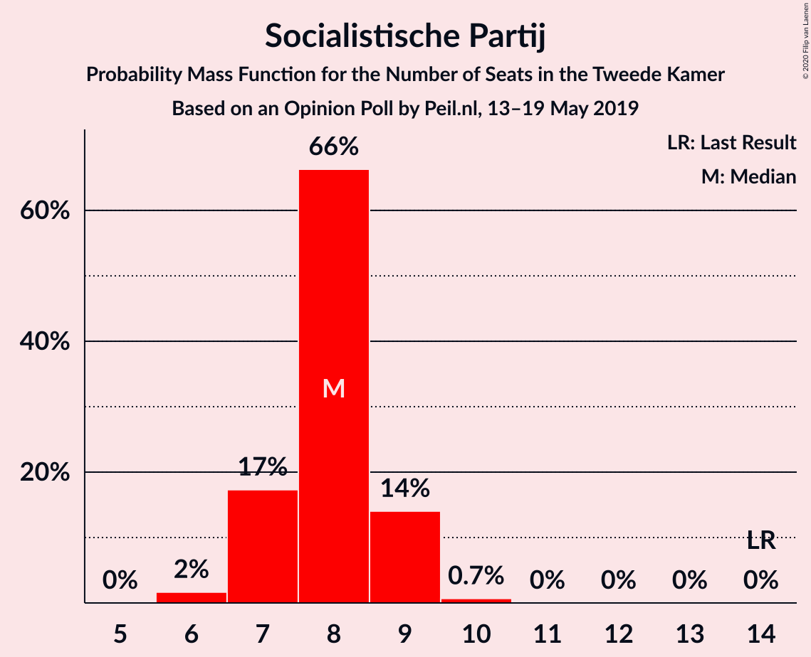

| Number of Seats | Probability | Accumulated | Special Marks |
|:---------------:|:-----------:|:-----------:|:-------------:|
| 6 | 2% | 100% |  |
| 7 | 54% | 98% | Median |
| 8 | 24% | 44% |  |
| 9 | 20% | 20% |  |
| 10 | 0% | 0.1% |  |
| 11 | 0% | 0% |  |
| 12 | 0% | 0% |  |
| 13 | 0% | 0% |  |
| 14 | 0% | 0% | Last Result |

### Partij voor de Dieren

*For a full overview of the results for this party, see the [Partij voor de Dieren](party-partijvoordedieren.html) page.*

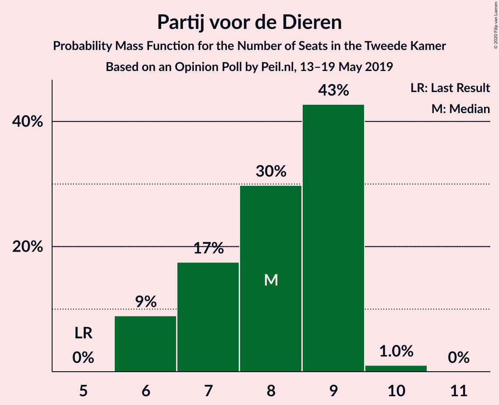

| Number of Seats | Probability | Accumulated | Special Marks |
|:---------------:|:-----------:|:-----------:|:-------------:|
| 5 | 0% | 100% | Last Result |
| 6 | 20% | 100% |  |
| 7 | 5% | 80% |  |
| 8 | 72% | 75% | Median |
| 9 | 3% | 3% |  |
| 10 | 0.1% | 0.1% |  |
| 11 | 0% | 0% |  |

### ChristenUnie

*For a full overview of the results for this party, see the [ChristenUnie](party-christenunie.html) page.*

| Number of Seats | Probability | Accumulated | Special Marks |
|:---------------:|:-----------:|:-----------:|:-------------:|
| 5 | 3% | 100% | Last Result |
| 6 | 16% | 97% |  |
| 7 | 6% | 81% |  |
| 8 | 74% | 75% | Median |
| 9 | 1.4% | 1.4% |  |
| 10 | 0% | 0% |  |

### 50Plus

*For a full overview of the results for this party, see the [50Plus](party-50plus.html) page.*

| Number of Seats | Probability | Accumulated | Special Marks |
|:---------------:|:-----------:|:-----------:|:-------------:|
| 3 | 5% | 100% |  |
| 4 | 94% | 95% | Last Result, Median |
| 5 | 0.7% | 0.7% |  |
| 6 | 0% | 0% |  |

### DENK

*For a full overview of the results for this party, see the [DENK](party-denk.html) page.*

| Number of Seats | Probability | Accumulated | Special Marks |
|:---------------:|:-----------:|:-----------:|:-------------:|
| 2 | 0.1% | 100% |  |
| 3 | 73% | 99.9% | Last Result, Median |
| 4 | 27% | 27% |  |
| 5 | 0.2% | 0.2% |  |
| 6 | 0% | 0% |  |

### Staatkundig Gereformeerde Partij

*For a full overview of the results for this party, see the [Staatkundig Gereformeerde Partij](party-staatkundiggereformeerdepartij.html) page.*

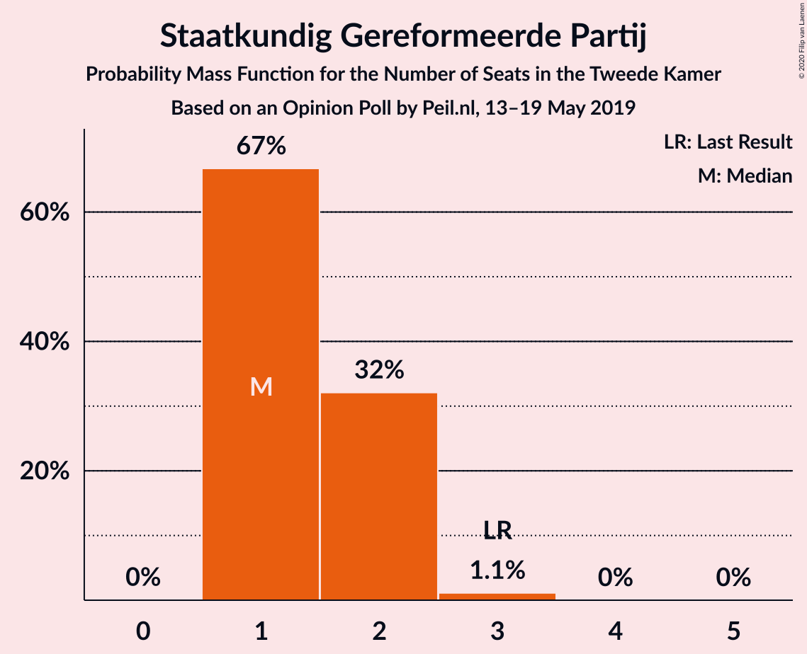

| Number of Seats | Probability | Accumulated | Special Marks |
|:---------------:|:-----------:|:-----------:|:-------------:|
| 1 | 63% | 100% | Median |
| 2 | 36% | 37% |  |
| 3 | 0.8% | 0.8% | Last Result |
| 4 | 0% | 0% |  |

## Coalitions

### Confidence Intervals

| Coalition | Last Result | Median | Majority? | 80% Confidence Interval | 90% Confidence Interval | 95% Confidence Interval | 99% Confidence Interval |
|:---------:|:-----------:|:------:|:---------:|:-----------------------:|:-----------------------:|:-----------------------:|:-----------------------:|
| Forum voor Democratie – Volkspartij voor Vrijheid en Democratie – Christen-Democratisch Appèl – Partij voor de Vrijheid – Staatkundig Gereformeerde Partij | 77 | 79 | 98% | 79 | 77–79 | 76–80 | 75–81 |
| Forum voor Democratie – Volkspartij voor Vrijheid en Democratie – Christen-Democratisch Appèl – Partij voor de Vrijheid | 74 | 78 | 96% | 77–78 | 76–78 | 74–79 | 73–80 |
| Volkspartij voor Vrijheid en Democratie – Christen-Democratisch Appèl – GroenLinks – Democraten 66 – ChristenUnie | 90 | 77 | 79% | 72–78 | 72–78 | 72–78 | 71–79 |
| Volkspartij voor Vrijheid en Democratie – Christen-Democratisch Appèl – Partij van de Arbeid – Democraten 66 – ChristenUnie | 85 | 75 | 22% | 74–77 | 73–77 | 71–77 | 69–77 |
| Forum voor Democratie – Volkspartij voor Vrijheid en Democratie – Christen-Democratisch Appèl – 50Plus – Staatkundig Gereformeerde Partij | 61 | 75 | 23% | 74–76 | 73–76 | 72–76 | 69–78 |
| Forum voor Democratie – Volkspartij voor Vrijheid en Democratie – Christen-Democratisch Appèl – 50Plus | 58 | 74 | 2% | 72–74 | 71–74 | 70–75 | 68–76 |
| Christen-Democratisch Appèl – GroenLinks – Partij van de Arbeid – Democraten 66 – Socialistische Partij – ChristenUnie | 80 | 72 | 0.2% | 70–74 | 70–74 | 68–74 | 67–74 |
| Forum voor Democratie – Volkspartij voor Vrijheid en Democratie – Christen-Democratisch Appèl – Staatkundig Gereformeerde Partij | 57 | 71 | 0% | 70–72 | 69–72 | 68–72 | 66–74 |
| Forum voor Democratie – Volkspartij voor Vrijheid en Democratie – Christen-Democratisch Appèl | 54 | 70 | 0% | 68–70 | 67–70 | 66–71 | 65–72 |
| Christen-Democratisch Appèl – GroenLinks – Partij van de Arbeid – Democraten 66 – ChristenUnie | 66 | 65 | 0% | 61–66 | 61–66 | 61–66 | 59–66 |
| Volkspartij voor Vrijheid en Democratie – Christen-Democratisch Appèl – Democraten 66 – ChristenUnie | 76 | 61 | 0% | 59–62 | 58–63 | 56–63 | 55–63 |
| Volkspartij voor Vrijheid en Democratie – Christen-Democratisch Appèl – Partij van de Arbeid | 61 | 57 | 0% | 56–58 | 56–58 | 53–58 | 51–60 |
| Volkspartij voor Vrijheid en Democratie – Christen-Democratisch Appèl – Democraten 66 | 71 | 53 | 0% | 53–54 | 51–56 | 50–56 | 49–56 |
| Volkspartij voor Vrijheid en Democratie – Partij van de Arbeid – Democraten 66 | 61 | 50 | 0% | 50–53 | 50–53 | 50–54 | 49–55 |
| Volkspartij voor Vrijheid en Democratie – Christen-Democratisch Appèl – Partij voor de Vrijheid | 72 | 51 | 0% | 50–51 | 48–52 | 47–52 | 46–52 |
| Volkspartij voor Vrijheid en Democratie – Christen-Democratisch Appèl | 52 | 43 | 0% | 42–43 | 40–44 | 39–44 | 38–44 |
| Volkspartij voor Vrijheid en Democratie – Partij van de Arbeid | 42 | 40 | 0% | 40–42 | 39–42 | 39–44 | 37–45 |
| Christen-Democratisch Appèl – Partij van de Arbeid – Democraten 66 | 47 | 41 | 0% | 41–42 | 40–42 | 39–43 | 38–44 |
| Christen-Democratisch Appèl – Partij van de Arbeid – ChristenUnie | 33 | 39 | 0% | 36–39 | 36–39 | 35–39 | 34–40 |
| Christen-Democratisch Appèl – Partij van de Arbeid | 28 | 31 | 0% | 29–31 | 29–31 | 29–32 | 27–33 |
| Christen-Democratisch Appèl – Democraten 66 | 38 | 27 | 0% | 27 | 25–29 | 25–29 | 24–29 |

### Forum voor Democratie – Volkspartij voor Vrijheid en Democratie – Christen-Democratisch Appèl – Partij voor de Vrijheid – Staatkundig Gereformeerde Partij

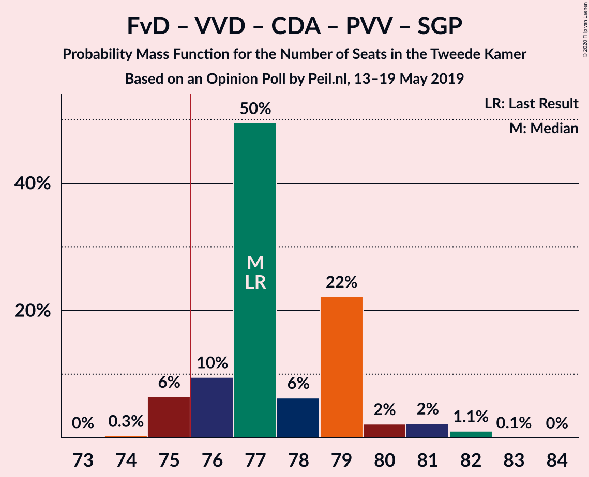

| Number of Seats | Probability | Accumulated | Special Marks |
|:---------------:|:-----------:|:-----------:|:-------------:|
| 73 | 0.1% | 100% |  |
| 74 | 0% | 99.9% |  |
| 75 | 2% | 99.8% |  |
| 76 | 1.2% | 98% | Majority |
| 77 | 2% | 97% | Last Result |
| 78 | 3% | 95% |  |
| 79 | 88% | 92% | Median |
| 80 | 2% | 5% |  |
| 81 | 2% | 2% |  |
| 82 | 0.3% | 0.3% |  |
| 83 | 0% | 0% |  |

### Forum voor Democratie – Volkspartij voor Vrijheid en Democratie – Christen-Democratisch Appèl – Partij voor de Vrijheid

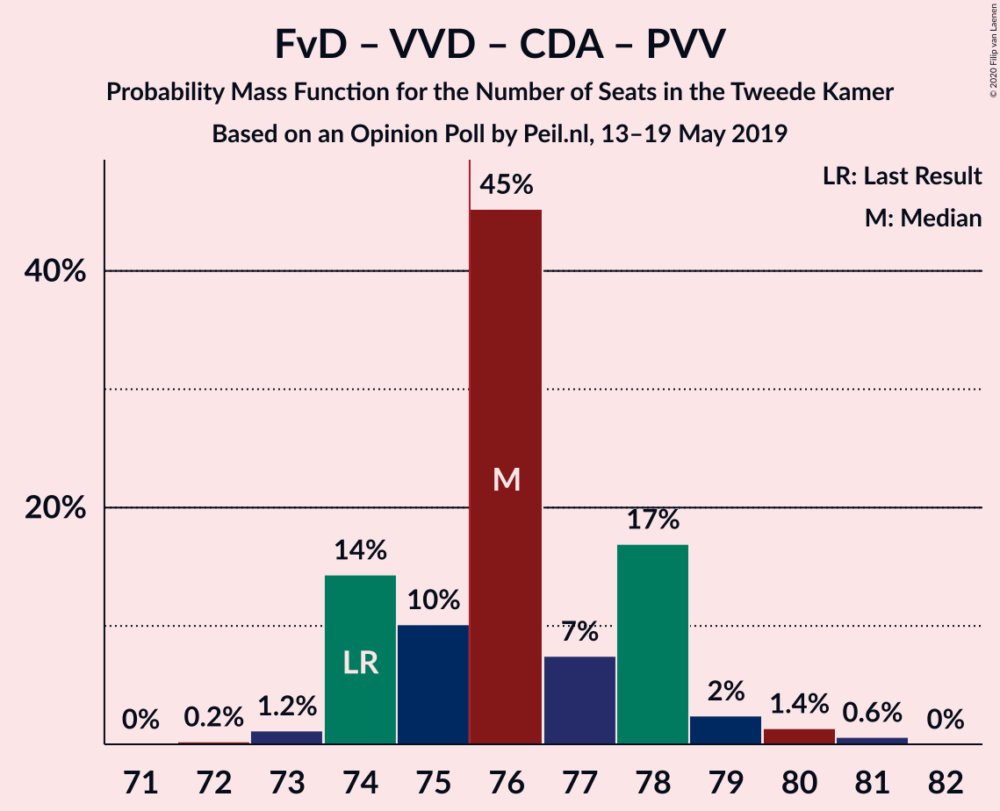

| Number of Seats | Probability | Accumulated | Special Marks |
|:---------------:|:-----------:|:-----------:|:-------------:|
| 72 | 0.1% | 100% |  |
| 73 | 1.3% | 99.9% |  |
| 74 | 2% | 98.5% | Last Result |
| 75 | 0.5% | 96% |  |
| 76 | 3% | 96% | Majority |
| 77 | 29% | 93% |  |
| 78 | 59% | 63% | Median |
| 79 | 3% | 4% |  |
| 80 | 1.2% | 1.2% |  |
| 81 | 0% | 0% |  |

### Volkspartij voor Vrijheid en Democratie – Christen-Democratisch Appèl – GroenLinks – Democraten 66 – ChristenUnie

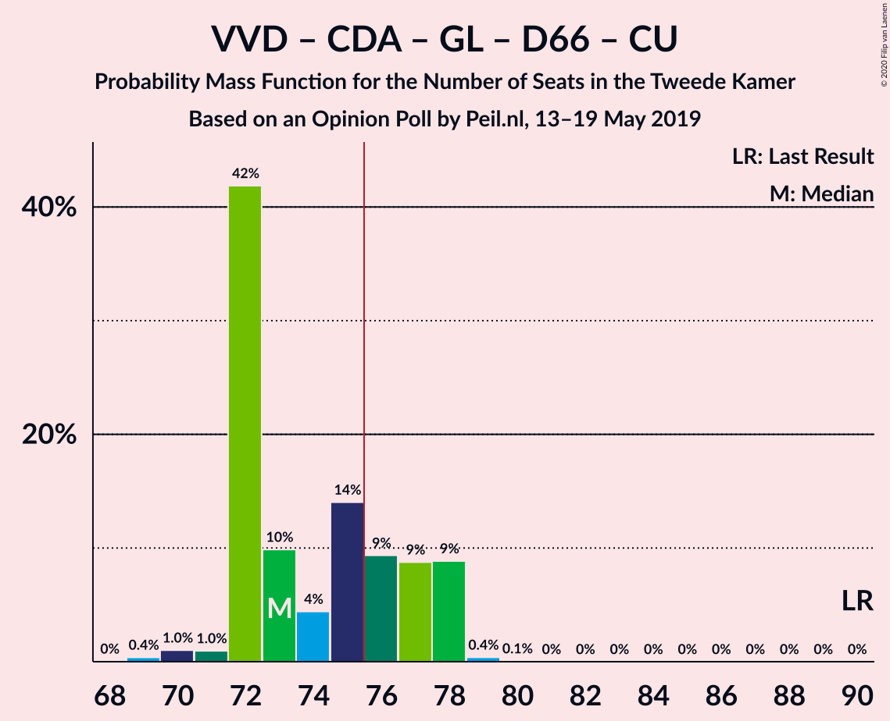

| Number of Seats | Probability | Accumulated | Special Marks |
|:---------------:|:-----------:|:-----------:|:-------------:|
| 70 | 0.3% | 100% |  |
| 71 | 2% | 99.7% |  |
| 72 | 13% | 98% |  |
| 73 | 2% | 84% |  |
| 74 | 0.7% | 82% |  |
| 75 | 3% | 82% |  |
| 76 | 0.5% | 79% | Majority |
| 77 | 52% | 79% | Median |
| 78 | 26% | 27% |  |
| 79 | 0.9% | 1.0% |  |
| 80 | 0% | 0% |  |
| 81 | 0% | 0% |  |
| 82 | 0% | 0% |  |
| 83 | 0% | 0% |  |
| 84 | 0% | 0% |  |
| 85 | 0% | 0% |  |
| 86 | 0% | 0% |  |
| 87 | 0% | 0% |  |
| 88 | 0% | 0% |  |
| 89 | 0% | 0% |  |
| 90 | 0% | 0% | Last Result |

### Volkspartij voor Vrijheid en Democratie – Christen-Democratisch Appèl – Partij van de Arbeid – Democraten 66 – ChristenUnie

| Number of Seats | Probability | Accumulated | Special Marks |
|:---------------:|:-----------:|:-----------:|:-------------:|
| 69 | 1.3% | 100% |  |
| 70 | 0.1% | 98.7% |  |
| 71 | 1.4% | 98.6% |  |
| 72 | 1.2% | 97% |  |
| 73 | 2% | 96% |  |
| 74 | 13% | 94% |  |
| 75 | 60% | 81% | Median |
| 76 | 2% | 22% | Majority |
| 77 | 19% | 19% |  |
| 78 | 0% | 0.1% |  |
| 79 | 0.1% | 0.1% |  |
| 80 | 0% | 0% |  |
| 81 | 0% | 0% |  |
| 82 | 0% | 0% |  |
| 83 | 0% | 0% |  |
| 84 | 0% | 0% |  |
| 85 | 0% | 0% | Last Result |

### Forum voor Democratie – Volkspartij voor Vrijheid en Democratie – Christen-Democratisch Appèl – 50Plus – Staatkundig Gereformeerde Partij

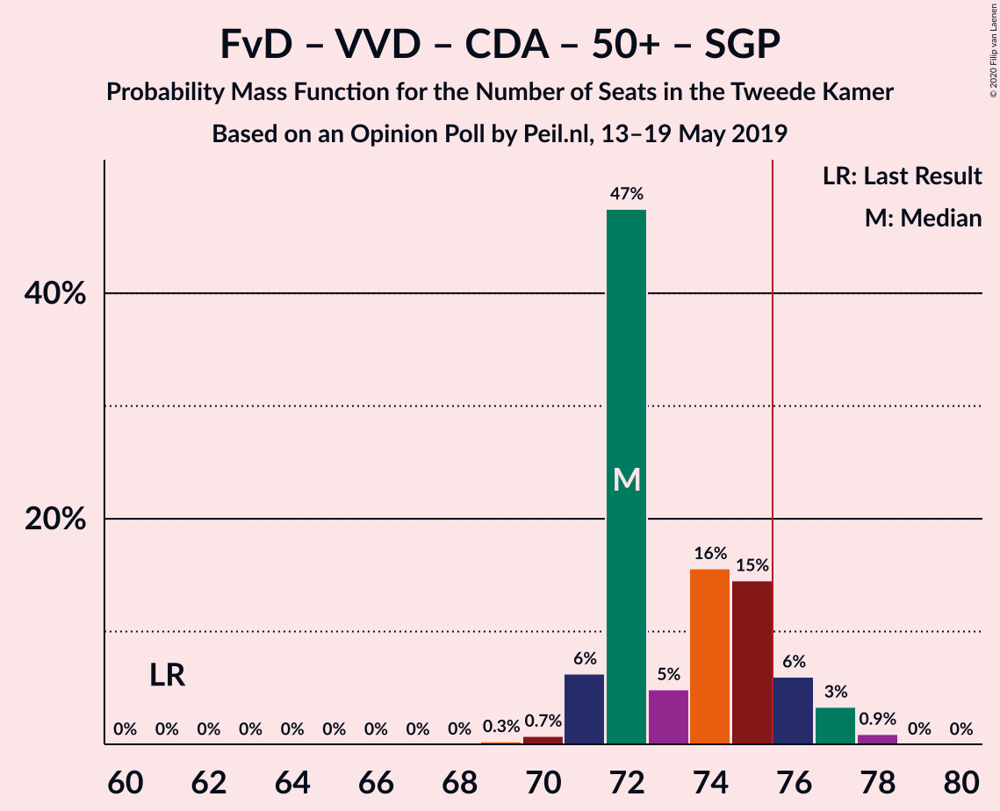

| Number of Seats | Probability | Accumulated | Special Marks |
|:---------------:|:-----------:|:-----------:|:-------------:|
| 61 | 0% | 100% | Last Result |
| 62 | 0% | 100% |  |
| 63 | 0% | 100% |  |
| 64 | 0% | 100% |  |
| 65 | 0% | 100% |  |
| 66 | 0% | 100% |  |
| 67 | 0% | 100% |  |
| 68 | 0.1% | 100% |  |
| 69 | 0.7% | 99.9% |  |
| 70 | 1.3% | 99.2% |  |
| 71 | 0.4% | 98% |  |
| 72 | 2% | 98% |  |
| 73 | 2% | 96% |  |
| 74 | 11% | 94% |  |
| 75 | 60% | 83% | Median |
| 76 | 21% | 23% | Majority |
| 77 | 2% | 2% |  |
| 78 | 0.6% | 0.6% |  |
| 79 | 0% | 0% |  |

### Forum voor Democratie – Volkspartij voor Vrijheid en Democratie – Christen-Democratisch Appèl – 50Plus

| Number of Seats | Probability | Accumulated | Special Marks |
|:---------------:|:-----------:|:-----------:|:-------------:|
| 58 | 0% | 100% | Last Result |
| 59 | 0% | 100% |  |
| 60 | 0% | 100% |  |
| 61 | 0% | 100% |  |
| 62 | 0% | 100% |  |
| 63 | 0% | 100% |  |
| 64 | 0% | 100% |  |
| 65 | 0% | 100% |  |
| 66 | 0% | 100% |  |
| 67 | 0.1% | 100% |  |
| 68 | 2% | 99.9% |  |
| 69 | 0.4% | 98% |  |
| 70 | 2% | 98% |  |
| 71 | 1.4% | 95% |  |
| 72 | 11% | 94% |  |
| 73 | 0.7% | 83% |  |
| 74 | 79% | 83% | Median |
| 75 | 2% | 3% |  |
| 76 | 2% | 2% | Majority |
| 77 | 0% | 0% |  |

### Christen-Democratisch Appèl – GroenLinks – Partij van de Arbeid – Democraten 66 – Socialistische Partij – ChristenUnie

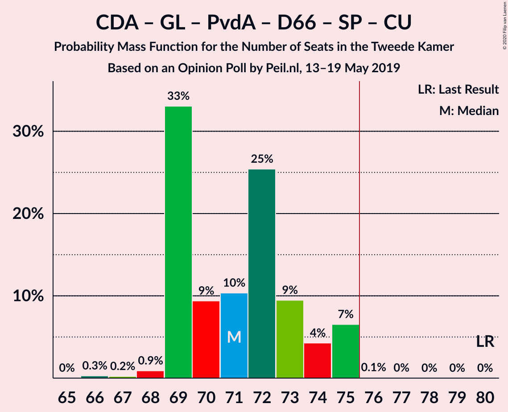

| Number of Seats | Probability | Accumulated | Special Marks |
|:---------------:|:-----------:|:-----------:|:-------------:|
| 67 | 1.2% | 100% |  |
| 68 | 1.4% | 98.7% |  |
| 69 | 0.2% | 97% |  |
| 70 | 15% | 97% |  |
| 71 | 1.1% | 83% |  |
| 72 | 59% | 81% | Median |
| 73 | 1.2% | 22% |  |
| 74 | 20% | 21% |  |
| 75 | 0.1% | 0.3% |  |
| 76 | 0.1% | 0.2% | Majority |
| 77 | 0.1% | 0.1% |  |
| 78 | 0% | 0% |  |
| 79 | 0% | 0% |  |
| 80 | 0% | 0% | Last Result |

### Forum voor Democratie – Volkspartij voor Vrijheid en Democratie – Christen-Democratisch Appèl – Staatkundig Gereformeerde Partij

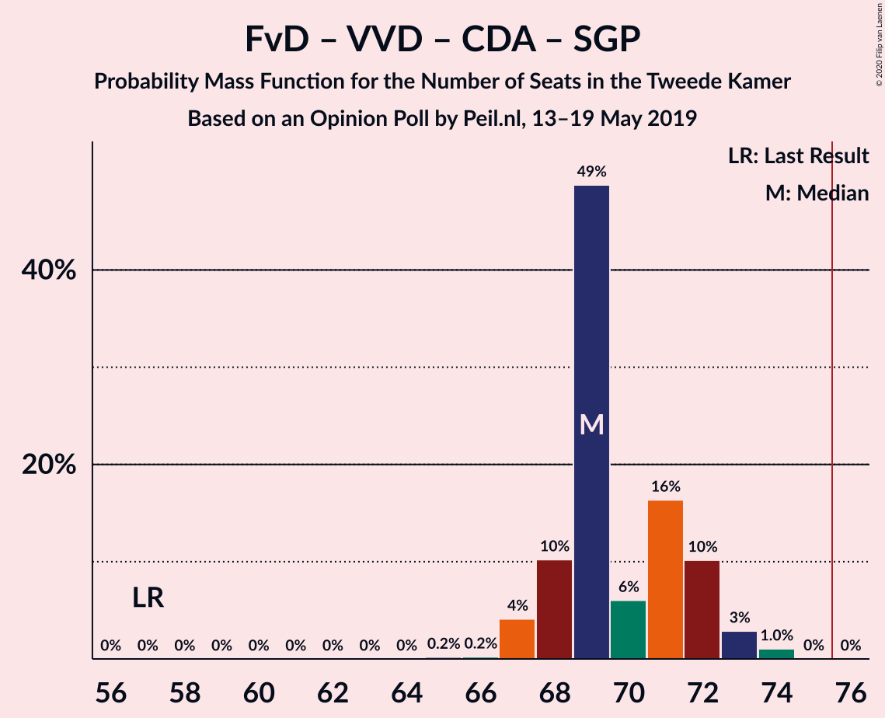

| Number of Seats | Probability | Accumulated | Special Marks |
|:---------------:|:-----------:|:-----------:|:-------------:|
| 57 | 0% | 100% | Last Result |
| 58 | 0% | 100% |  |
| 59 | 0% | 100% |  |
| 60 | 0% | 100% |  |
| 61 | 0% | 100% |  |
| 62 | 0% | 100% |  |
| 63 | 0% | 100% |  |
| 64 | 0% | 100% |  |
| 65 | 0.1% | 100% |  |
| 66 | 0.7% | 99.9% |  |
| 67 | 1.3% | 99.2% |  |
| 68 | 0.7% | 98% |  |
| 69 | 3% | 97% |  |
| 70 | 11% | 94% |  |
| 71 | 59% | 83% | Median |
| 72 | 22% | 24% |  |
| 73 | 2% | 2% |  |
| 74 | 0.6% | 0.6% |  |
| 75 | 0% | 0% |  |

### Forum voor Democratie – Volkspartij voor Vrijheid en Democratie – Christen-Democratisch Appèl

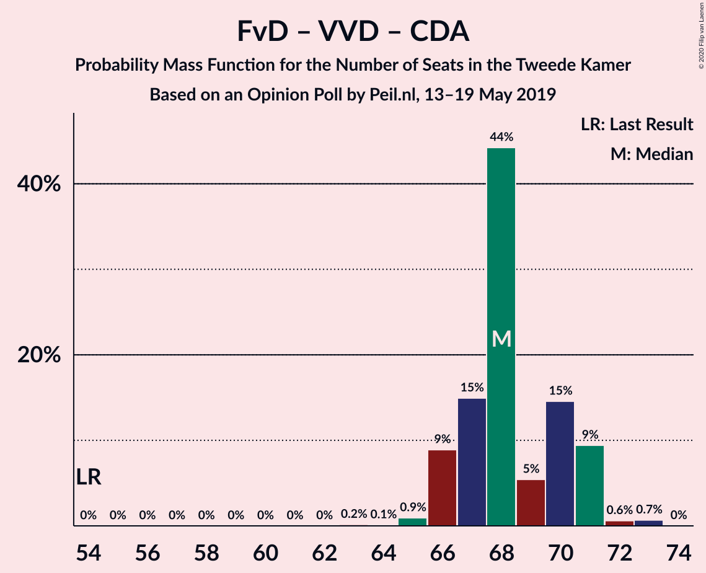

| Number of Seats | Probability | Accumulated | Special Marks |
|:---------------:|:-----------:|:-----------:|:-------------:|
| 54 | 0% | 100% | Last Result |
| 55 | 0% | 100% |  |
| 56 | 0% | 100% |  |
| 57 | 0% | 100% |  |
| 58 | 0% | 100% |  |
| 59 | 0% | 100% |  |
| 60 | 0% | 100% |  |
| 61 | 0% | 100% |  |
| 62 | 0% | 100% |  |
| 63 | 0% | 100% |  |
| 64 | 0.1% | 100% |  |
| 65 | 2% | 99.9% |  |
| 66 | 1.4% | 98% |  |
| 67 | 2% | 97% |  |
| 68 | 11% | 94% |  |
| 69 | 1.2% | 84% |  |
| 70 | 78% | 82% | Median |
| 71 | 3% | 4% |  |
| 72 | 2% | 2% |  |
| 73 | 0% | 0% |  |

### Christen-Democratisch Appèl – GroenLinks – Partij van de Arbeid – Democraten 66 – ChristenUnie

| Number of Seats | Probability | Accumulated | Special Marks |
|:---------------:|:-----------:|:-----------:|:-------------:|
| 59 | 1.2% | 100% |  |
| 60 | 0.6% | 98.8% |  |
| 61 | 12% | 98% |  |
| 62 | 2% | 87% |  |
| 63 | 8% | 85% |  |
| 64 | 2% | 76% |  |
| 65 | 54% | 74% | Median |
| 66 | 19% | 20% | Last Result |
| 67 | 0.1% | 0.3% |  |
| 68 | 0.2% | 0.2% |  |
| 69 | 0% | 0% |  |

### Volkspartij voor Vrijheid en Democratie – Christen-Democratisch Appèl – Democraten 66 – ChristenUnie

| Number of Seats | Probability | Accumulated | Special Marks |
|:---------------:|:-----------:|:-----------:|:-------------:|
| 55 | 2% | 100% |  |
| 56 | 1.3% | 98% |  |
| 57 | 1.5% | 97% |  |
| 58 | 2% | 95% |  |
| 59 | 12% | 93% |  |
| 60 | 2% | 81% |  |
| 61 | 53% | 79% | Median |
| 62 | 19% | 25% |  |
| 63 | 6% | 6% |  |
| 64 | 0% | 0% |  |
| 65 | 0% | 0% |  |
| 66 | 0% | 0% |  |
| 67 | 0% | 0% |  |
| 68 | 0% | 0% |  |
| 69 | 0% | 0% |  |
| 70 | 0% | 0% |  |
| 71 | 0% | 0% |  |
| 72 | 0% | 0% |  |
| 73 | 0% | 0% |  |
| 74 | 0% | 0% |  |
| 75 | 0% | 0% |  |
| 76 | 0% | 0% | Last Result, Majority |

### Volkspartij voor Vrijheid en Democratie – Christen-Democratisch Appèl – Partij van de Arbeid

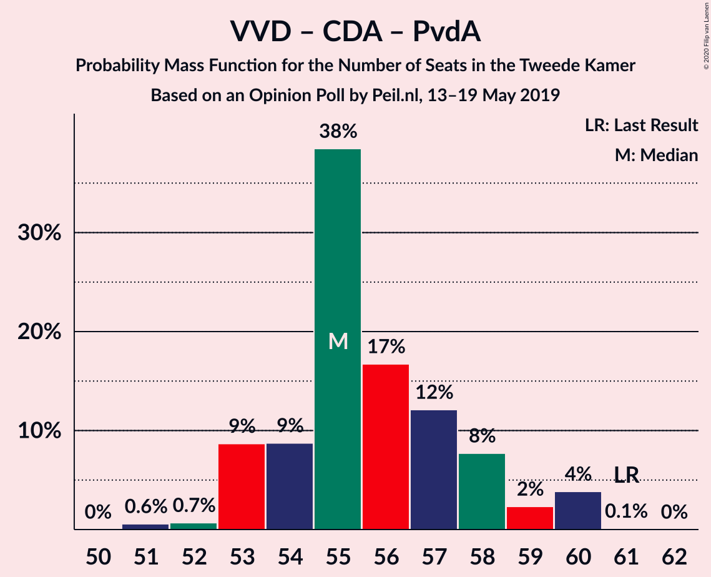

| Number of Seats | Probability | Accumulated | Special Marks |
|:---------------:|:-----------:|:-----------:|:-------------:|
| 51 | 1.1% | 100% |  |
| 52 | 0.1% | 98.9% |  |
| 53 | 2% | 98.8% |  |
| 54 | 1.1% | 97% |  |
| 55 | 0.7% | 96% |  |
| 56 | 7% | 95% |  |
| 57 | 66% | 88% | Median |
| 58 | 20% | 22% |  |
| 59 | 0.1% | 2% |  |
| 60 | 2% | 2% |  |
| 61 | 0% | 0.1% | Last Result |
| 62 | 0% | 0% |  |

### Volkspartij voor Vrijheid en Democratie – Christen-Democratisch Appèl – Democraten 66

| Number of Seats | Probability | Accumulated | Special Marks |
|:---------------:|:-----------:|:-----------:|:-------------:|
| 48 | 0.1% | 100% |  |
| 49 | 2% | 99.9% |  |
| 50 | 0.8% | 98% |  |
| 51 | 3% | 97% |  |
| 52 | 2% | 94% |  |
| 53 | 66% | 92% | Median |
| 54 | 20% | 26% |  |
| 55 | 0.1% | 6% |  |
| 56 | 6% | 6% |  |
| 57 | 0% | 0% |  |
| 58 | 0% | 0% |  |
| 59 | 0% | 0% |  |
| 60 | 0% | 0% |  |
| 61 | 0% | 0% |  |
| 62 | 0% | 0% |  |
| 63 | 0% | 0% |  |
| 64 | 0% | 0% |  |
| 65 | 0% | 0% |  |
| 66 | 0% | 0% |  |
| 67 | 0% | 0% |  |
| 68 | 0% | 0% |  |
| 69 | 0% | 0% |  |
| 70 | 0% | 0% |  |
| 71 | 0% | 0% | Last Result |

### Volkspartij voor Vrijheid en Democratie – Partij van de Arbeid – Democraten 66

| Number of Seats | Probability | Accumulated | Special Marks |
|:---------------:|:-----------:|:-----------:|:-------------:|
| 47 | 0.1% | 100% |  |
| 48 | 0.2% | 99.9% |  |
| 49 | 2% | 99.7% |  |
| 50 | 54% | 98% | Median |
| 51 | 7% | 44% |  |
| 52 | 13% | 37% |  |
| 53 | 20% | 24% |  |
| 54 | 4% | 5% |  |
| 55 | 0.7% | 1.1% |  |
| 56 | 0% | 0.4% |  |
| 57 | 0.4% | 0.4% |  |
| 58 | 0% | 0% |  |
| 59 | 0% | 0% |  |
| 60 | 0% | 0% |  |
| 61 | 0% | 0% | Last Result |

### Volkspartij voor Vrijheid en Democratie – Christen-Democratisch Appèl – Partij voor de Vrijheid

| Number of Seats | Probability | Accumulated | Special Marks |
|:---------------:|:-----------:|:-----------:|:-------------:|
| 44 | 0.1% | 100% |  |
| 45 | 0.1% | 99.9% |  |
| 46 | 2% | 99.9% |  |
| 47 | 0.4% | 98% |  |
| 48 | 3% | 97% |  |
| 49 | 2% | 94% |  |
| 50 | 21% | 92% |  |
| 51 | 65% | 71% | Median |
| 52 | 6% | 6% |  |
| 53 | 0% | 0% |  |
| 54 | 0% | 0% |  |
| 55 | 0% | 0% |  |
| 56 | 0% | 0% |  |
| 57 | 0% | 0% |  |
| 58 | 0% | 0% |  |
| 59 | 0% | 0% |  |
| 60 | 0% | 0% |  |
| 61 | 0% | 0% |  |
| 62 | 0% | 0% |  |
| 63 | 0% | 0% |  |
| 64 | 0% | 0% |  |
| 65 | 0% | 0% |  |
| 66 | 0% | 0% |  |
| 67 | 0% | 0% |  |
| 68 | 0% | 0% |  |
| 69 | 0% | 0% |  |
| 70 | 0% | 0% |  |
| 71 | 0% | 0% |  |
| 72 | 0% | 0% | Last Result |

### Volkspartij voor Vrijheid en Democratie – Christen-Democratisch Appèl

| Number of Seats | Probability | Accumulated | Special Marks |
|:---------------:|:-----------:|:-----------:|:-------------:|
| 36 | 0.1% | 100% |  |
| 37 | 0% | 99.9% |  |
| 38 | 1.4% | 99.9% |  |
| 39 | 2% | 98.6% |  |
| 40 | 2% | 96% |  |
| 41 | 2% | 94% |  |
| 42 | 13% | 93% |  |
| 43 | 74% | 80% | Median |
| 44 | 6% | 6% |  |
| 45 | 0% | 0.1% |  |
| 46 | 0% | 0% |  |
| 47 | 0% | 0% |  |
| 48 | 0% | 0% |  |
| 49 | 0% | 0% |  |
| 50 | 0% | 0% |  |
| 51 | 0% | 0% |  |
| 52 | 0% | 0% | Last Result |

### Volkspartij voor Vrijheid en Democratie – Partij van de Arbeid

| Number of Seats | Probability | Accumulated | Special Marks |
|:---------------:|:-----------:|:-----------:|:-------------:|
| 36 | 0.1% | 100% |  |
| 37 | 1.3% | 99.9% |  |
| 38 | 0.3% | 98.7% |  |
| 39 | 8% | 98% |  |
| 40 | 52% | 90% | Median |
| 41 | 12% | 38% |  |
| 42 | 22% | 26% | Last Result |
| 43 | 1.0% | 4% |  |
| 44 | 1.4% | 3% |  |
| 45 | 0.9% | 1.3% |  |
| 46 | 0.4% | 0.4% |  |
| 47 | 0% | 0% |  |

### Christen-Democratisch Appèl – Partij van de Arbeid – Democraten 66

| Number of Seats | Probability | Accumulated | Special Marks |
|:---------------:|:-----------:|:-----------:|:-------------:|
| 38 | 1.5% | 100% |  |
| 39 | 2% | 98% |  |
| 40 | 3% | 96% |  |
| 41 | 59% | 93% | Median |
| 42 | 30% | 34% |  |
| 43 | 3% | 4% |  |
| 44 | 0.2% | 0.6% |  |
| 45 | 0.3% | 0.4% |  |
| 46 | 0% | 0.1% |  |
| 47 | 0% | 0% | Last Result |

### Christen-Democratisch Appèl – Partij van de Arbeid – ChristenUnie

| Number of Seats | Probability | Accumulated | Special Marks |
|:---------------:|:-----------:|:-----------:|:-------------:|
| 33 | 0% | 100% | Last Result |
| 34 | 2% | 100% |  |
| 35 | 2% | 98% |  |
| 36 | 7% | 96% |  |
| 37 | 14% | 89% |  |
| 38 | 2% | 75% |  |
| 39 | 72% | 73% | Median |
| 40 | 0.2% | 0.6% |  |
| 41 | 0.3% | 0.3% |  |
| 42 | 0% | 0.1% |  |
| 43 | 0% | 0% |  |

### Christen-Democratisch Appèl – Partij van de Arbeid

| Number of Seats | Probability | Accumulated | Special Marks |
|:---------------:|:-----------:|:-----------:|:-------------:|
| 27 | 1.4% | 100% |  |
| 28 | 1.1% | 98.6% | Last Result |
| 29 | 11% | 98% |  |
| 30 | 0% | 87% |  |
| 31 | 83% | 86% | Median |
| 32 | 2% | 4% |  |
| 33 | 2% | 2% |  |
| 34 | 0% | 0.3% |  |
| 35 | 0.2% | 0.3% |  |
| 36 | 0% | 0% |  |

### Christen-Democratisch Appèl – Democraten 66

| Number of Seats | Probability | Accumulated | Special Marks |
|:---------------:|:-----------:|:-----------:|:-------------:|
| 24 | 2% | 100% |  |
| 25 | 5% | 98% |  |
| 26 | 3% | 93% |  |
| 27 | 84% | 90% | Median |
| 28 | 0.3% | 7% |  |
| 29 | 6% | 6% |  |
| 30 | 0.1% | 0.1% |  |
| 31 | 0% | 0% |  |
| 32 | 0% | 0% |  |
| 33 | 0% | 0% |  |
| 34 | 0% | 0% |  |
| 35 | 0% | 0% |  |
| 36 | 0% | 0% |  |
| 37 | 0% | 0% |  |
| 38 | 0% | 0% | Last Result |

## Technical Information

### Opinion Poll

+ **Polling firm:** Peil.nl
+ **Commissioner(s):** —
+ **Fieldwork period:** 13–19 May 2019

### Calculations

+ **Sample size:** 3000
+ **Simulations done:** 131,072
+ **Error estimate:** 1.07%

