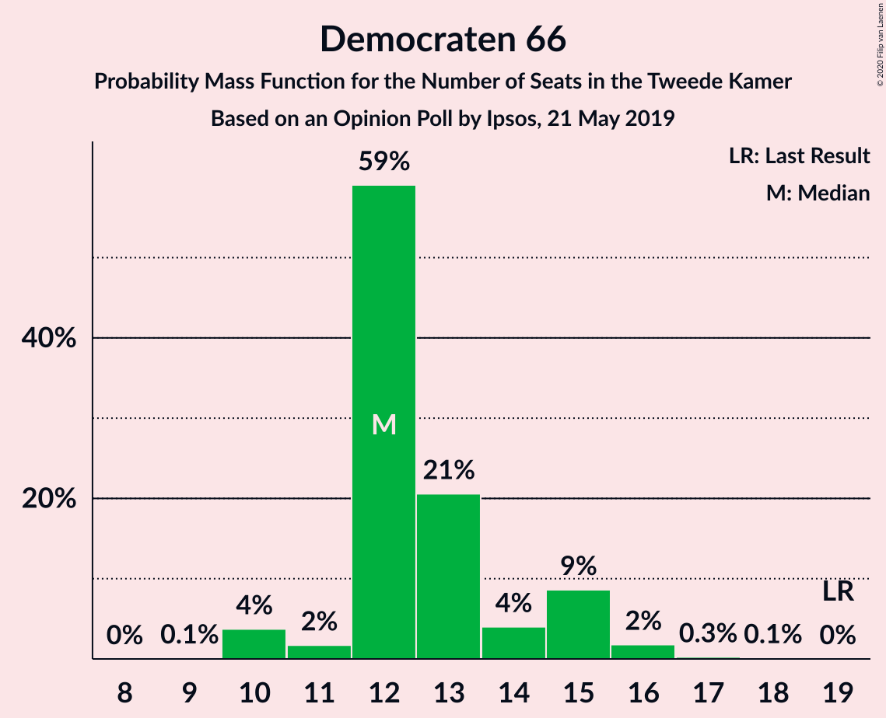
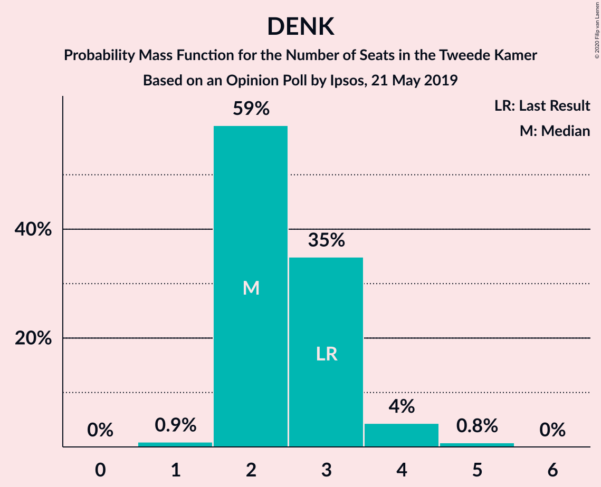
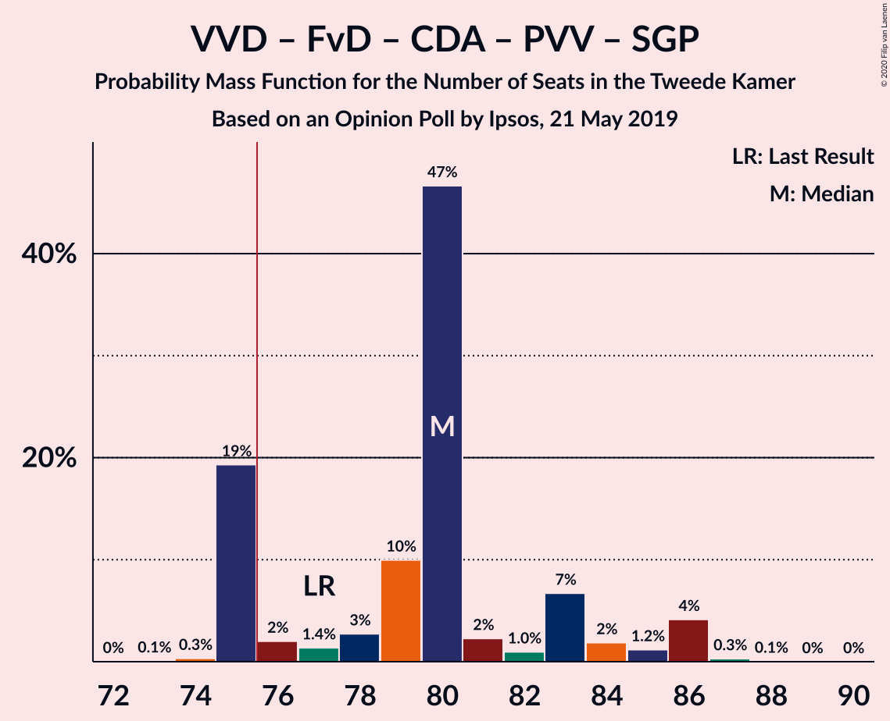
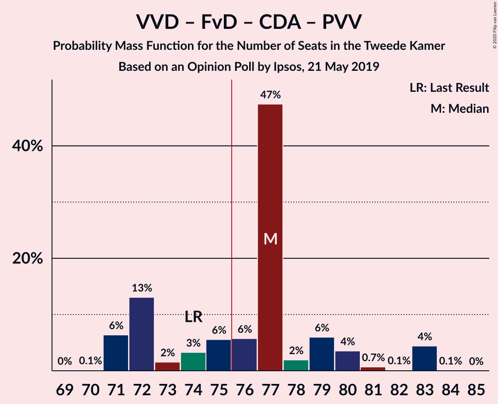
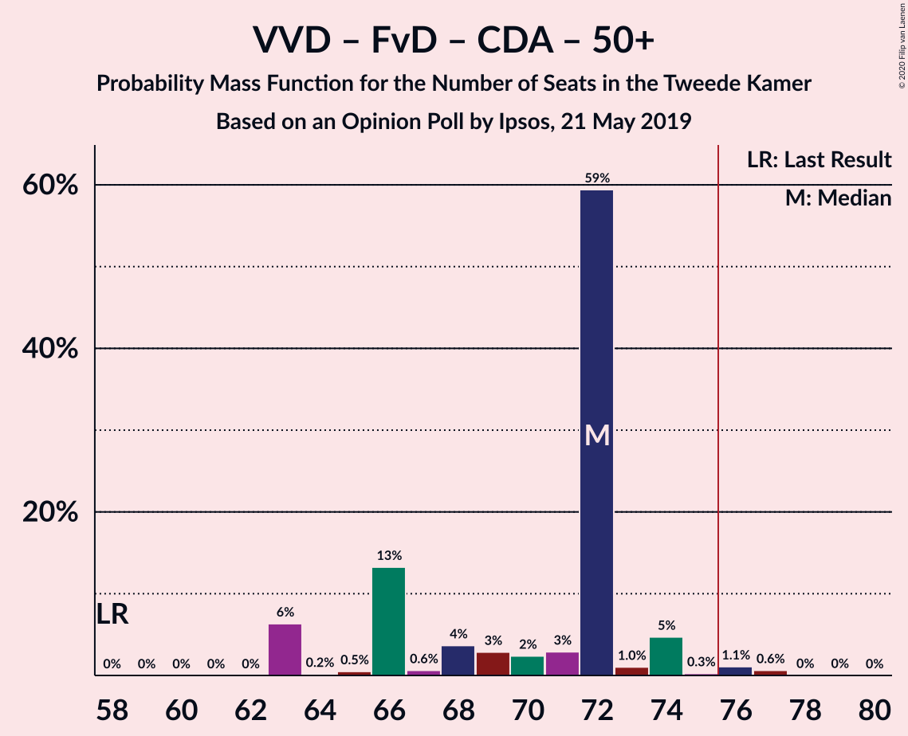
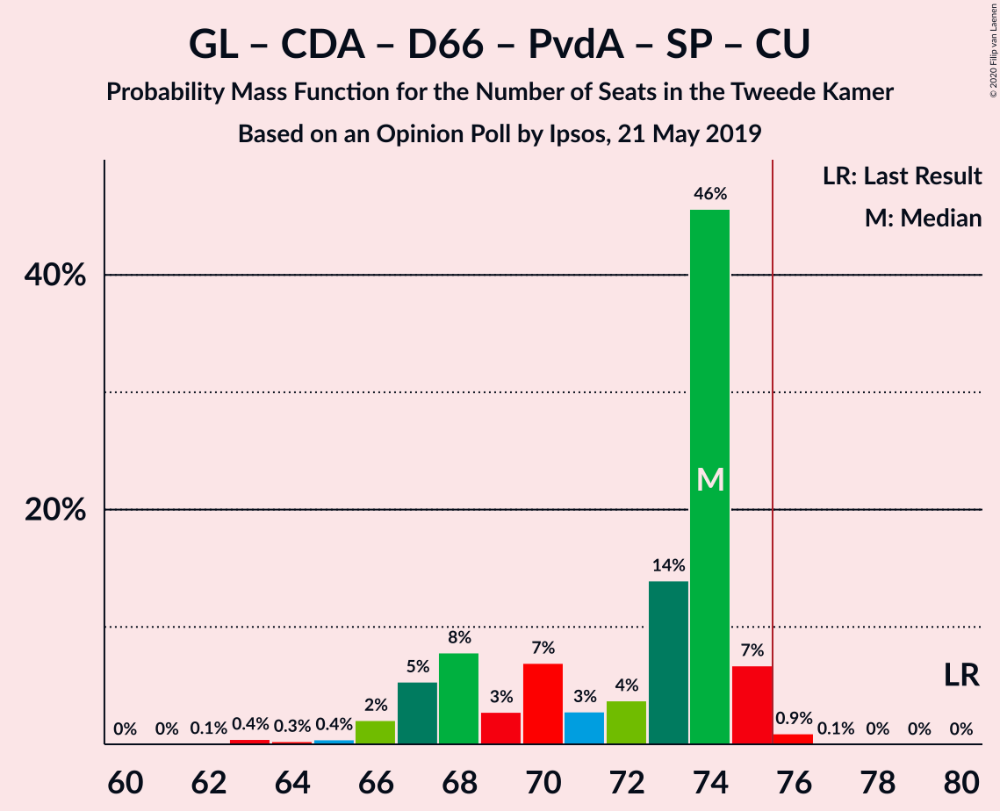
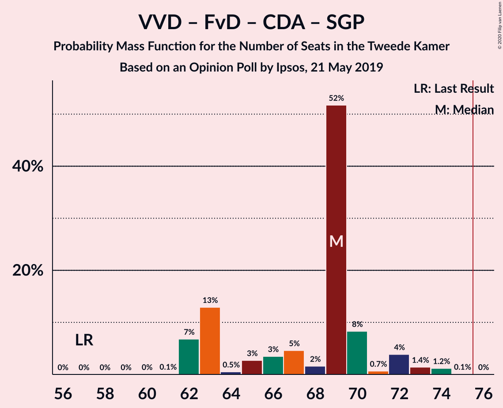
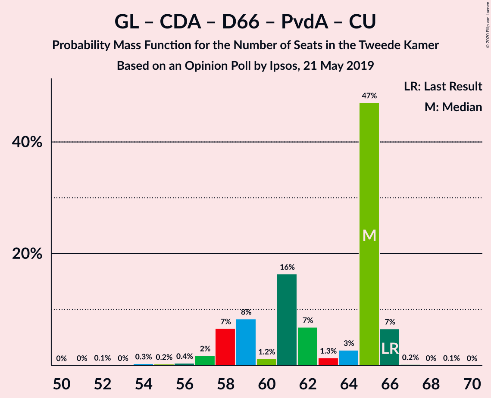
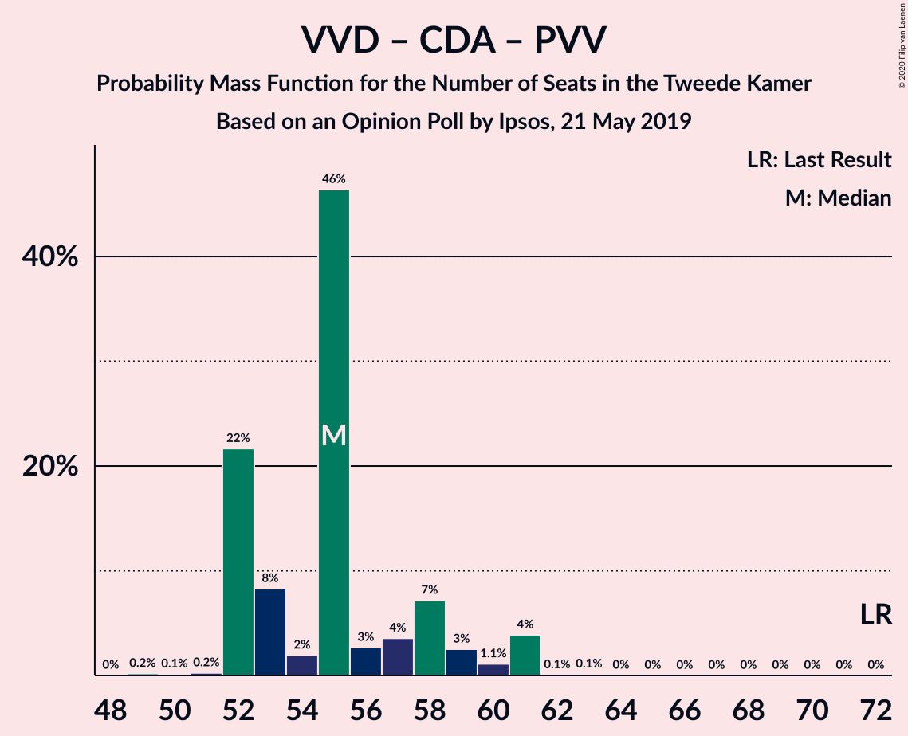

# Opinion Poll by Ipsos, 21 May 2019

<a href="#voting-intentions">Voting Intentions</a> | <a href="#seats">Seats</a> | <a href="#coalitions">Coalitions</a> | <a href="#technical-information">Technical Information</a>

## Voting Intentions

### Confidence Intervals

| Party | Last Result | Poll Result | 80% Confidence Interval | 90% Confidence Interval | 95% Confidence Interval | 99% Confidence Interval |
|:-----:|:-----------:|:-----------:|:-----------------------:|:-----------------------:|:-----------------------:|:-----------------------:|
| Volkspartij voor Vrijheid en Democratie | 21.3% | 18.7% | 17.2–20.4% |16.8–20.8% |16.4–21.2% |15.7–22.1% |
| Forum voor Democratie | 1.8% | 14.0% | 12.7–15.5% |12.3–15.9% |12.0–16.3% |11.4–17.0% |
| GroenLinks | 9.1% | 10.6% | 9.4–11.9% |9.1–12.3% |8.8–12.7% |8.3–13.3% |
| Christen-Democratisch Appèl | 12.4% | 9.9% | 8.8–11.2% |8.5–11.6% |8.2–11.9% |7.7–12.6% |
| Democraten 66 | 12.2% | 8.6% | 7.6–9.8% |7.3–10.2% |7.0–10.5% |6.5–11.1% |
| Partij voor de Vrijheid | 13.1% | 8.2% | 7.2–9.4% |6.9–9.8% |6.6–10.1% |6.2–10.7% |
| Partij van de Arbeid | 5.7% | 7.0% | 6.1–8.2% |5.8–8.5% |5.6–8.8% |5.2–9.3% |
| Socialistische Partij | 9.1% | 6.0% | 5.1–7.1% |4.9–7.4% |4.7–7.7% |4.3–8.2% |
| 50Plus | 3.1% | 4.1% | 3.4–5.0% |3.2–5.3% |3.0–5.5% |2.7–6.0% |
| ChristenUnie | 3.4% | 4.0% | 3.3–4.9% |3.1–5.2% |2.9–5.4% |2.7–5.9% |
| Partij voor de Dieren | 3.2% | 3.8% | 3.1–4.7% |2.9–5.0% |2.8–5.2% |2.5–5.6% |
| Staatkundig Gereformeerde Partij | 2.1% | 2.3% | 1.8–3.0% |1.6–3.2% |1.5–3.4% |1.3–3.8% |
| DENK | 2.1% | 2.0% | 1.5–2.7% |1.4–2.9% |1.3–3.1% |1.1–3.4% |

*Note:* The poll result column reflects the actual value used in the calculations. Published results may vary slightly, and in addition be rounded to fewer digits.

## Seats

### Confidence Intervals

| Party | Last Result | Median | 80% Confidence Interval | 90% Confidence Interval | 95% Confidence Interval | 99% Confidence Interval |
|:-----:|:-----------:|:------:|:-----------------------:|:-----------------------:|:-----------------------:|:-----------------------:|
| <a href="#volkspartij-voor-vrijheid-en-democratie">Volkspartij voor Vrijheid en Democratie</a> | 33 | 27 | 27–32 |26–33 |24–34 |24–35 |
| <a href="#forum-voor-democratie">Forum voor Democratie</a> | 2 | 22 | 20–23 |19–25 |16–26 |16–26 |
| <a href="#groenlinks">GroenLinks</a> | 14 | 15 | 15–17 |14–18 |12–19 |11–20 |
| <a href="#christen-democratisch-appèl">Christen-Democratisch Appèl</a> | 19 | 13 | 12–17 |12–20 |11–20 |10–20 |
| <a href="#democraten-66">Democraten 66</a> | 19 | 13 | 11–14 |11–14 |11–15 |10–16 |
| <a href="#partij-voor-de-vrijheid">Partij voor de Vrijheid</a> | 20 | 13 | 11–14 |11–14 |10–15 |9–16 |
| <a href="#partij-van-de-arbeid">Partij van de Arbeid</a> | 9 | 11 | 10–15 |9–15 |8–15 |7–15 |
| <a href="#socialistische-partij">Socialistische Partij</a> | 14 | 8 | 7–11 |7–11 |7–12 |6–12 |
| <a href="#50plus">50Plus</a> | 4 | 6 | 5–7 |4–7 |4–8 |4–9 |
| <a href="#christenunie">ChristenUnie</a> | 5 | 6 | 5–8 |5–8 |4–8 |4–9 |
| <a href="#partij-voor-de-dieren">Partij voor de Dieren</a> | 5 | 6 | 4–7 |4–8 |4–8 |4–8 |
| <a href="#staatkundig-gereformeerde-partij">Staatkundig Gereformeerde Partij</a> | 3 | 3 | 2–4 |2–4 |2–5 |1–5 |
| <a href="#denk">DENK</a> | 3 | 2 | 2–5 |1–5 |1–5 |1–6 |

### Volkspartij voor Vrijheid en Democratie

*For a full overview of the results for this party, see the [Volkspartij voor Vrijheid en Democratie](party-volkspartijvoorvrijheidendemocratie.html) page.*

| Number of Seats | Probability | Accumulated | Special Marks |
|:---------------:|:-----------:|:-----------:|:-------------:|
| 23 | 0.3% | 100% |  |
| 24 | 2% | 99.7% |  |
| 25 | 2% | 97% |  |
| 26 | 5% | 95% |  |
| 27 | 43% | 91% | Median |
| 28 | 26% | 47% |  |
| 29 | 3% | 21% |  |
| 30 | 1.4% | 18% |  |
| 31 | 6% | 17% |  |
| 32 | 4% | 11% |  |
| 33 | 3% | 7% | Last Result |
| 34 | 2% | 4% |  |
| 35 | 2% | 2% |  |
| 36 | 0% | 0% |  |

### Forum voor Democratie

*For a full overview of the results for this party, see the [Forum voor Democratie](party-forumvoordemocratie.html) page.*

| Number of Seats | Probability | Accumulated | Special Marks |
|:---------------:|:-----------:|:-----------:|:-------------:|
| 2 | 0% | 100% | Last Result |
| 3 | 0% | 100% |  |
| 4 | 0% | 100% |  |
| 5 | 0% | 100% |  |
| 6 | 0% | 100% |  |
| 7 | 0% | 100% |  |
| 8 | 0% | 100% |  |
| 9 | 0% | 100% |  |
| 10 | 0% | 100% |  |
| 11 | 0% | 100% |  |
| 12 | 0% | 100% |  |
| 13 | 0% | 100% |  |
| 14 | 0% | 100% |  |
| 15 | 0.2% | 100% |  |
| 16 | 2% | 99.8% |  |
| 17 | 0.5% | 97% |  |
| 18 | 0.7% | 97% |  |
| 19 | 5% | 96% |  |
| 20 | 11% | 91% |  |
| 21 | 4% | 80% |  |
| 22 | 27% | 75% | Median |
| 23 | 42% | 48% |  |
| 24 | 0.3% | 6% |  |
| 25 | 1.5% | 6% |  |
| 26 | 4% | 4% |  |
| 27 | 0.1% | 0.1% |  |
| 28 | 0% | 0% |  |

### GroenLinks

*For a full overview of the results for this party, see the [GroenLinks](party-groenlinks.html) page.*

| Number of Seats | Probability | Accumulated | Special Marks |
|:---------------:|:-----------:|:-----------:|:-------------:|
| 11 | 1.4% | 100% |  |
| 12 | 1.1% | 98.5% |  |
| 13 | 0.6% | 97% |  |
| 14 | 3% | 97% | Last Result |
| 15 | 52% | 94% | Median |
| 16 | 31% | 42% |  |
| 17 | 6% | 11% |  |
| 18 | 2% | 5% |  |
| 19 | 3% | 3% |  |
| 20 | 0.2% | 0.6% |  |
| 21 | 0.4% | 0.4% |  |
| 22 | 0% | 0% |  |

### Christen-Democratisch Appèl

*For a full overview of the results for this party, see the [Christen-Democratisch Appèl](party-christen-democratischappèl.html) page.*

| Number of Seats | Probability | Accumulated | Special Marks |
|:---------------:|:-----------:|:-----------:|:-------------:|
| 10 | 2% | 100% |  |
| 11 | 1.4% | 98% |  |
| 12 | 9% | 97% |  |
| 13 | 41% | 88% | Median |
| 14 | 6% | 48% |  |
| 15 | 6% | 42% |  |
| 16 | 5% | 36% |  |
| 17 | 24% | 32% |  |
| 18 | 2% | 7% |  |
| 19 | 0.1% | 5% | Last Result |
| 20 | 5% | 5% |  |
| 21 | 0% | 0% |  |

### Democraten 66

*For a full overview of the results for this party, see the [Democraten 66](party-democraten66.html) page.*

| Number of Seats | Probability | Accumulated | Special Marks |
|:---------------:|:-----------:|:-----------:|:-------------:|
| 9 | 0.3% | 100% |  |
| 10 | 1.0% | 99.7% |  |
| 11 | 31% | 98.7% |  |
| 12 | 13% | 68% |  |
| 13 | 9% | 55% | Median |
| 14 | 43% | 46% |  |
| 15 | 2% | 3% |  |
| 16 | 1.0% | 1.4% |  |
| 17 | 0.3% | 0.4% |  |
| 18 | 0.1% | 0.1% |  |
| 19 | 0% | 0% | Last Result |

### Partij voor de Vrijheid

*For a full overview of the results for this party, see the [Partij voor de Vrijheid](party-partijvoordevrijheid.html) page.*

| Number of Seats | Probability | Accumulated | Special Marks |
|:---------------:|:-----------:|:-----------:|:-------------:|
| 8 | 0.1% | 100% |  |
| 9 | 0.7% | 99.9% |  |
| 10 | 2% | 99.2% |  |
| 11 | 30% | 97% |  |
| 12 | 5% | 67% |  |
| 13 | 18% | 62% | Median |
| 14 | 41% | 44% |  |
| 15 | 2% | 3% |  |
| 16 | 0.9% | 1.0% |  |
| 17 | 0.1% | 0.1% |  |
| 18 | 0% | 0% |  |
| 19 | 0% | 0% |  |
| 20 | 0% | 0% | Last Result |

### Partij van de Arbeid

*For a full overview of the results for this party, see the [Partij van de Arbeid](party-partijvandearbeid.html) page.*

| Number of Seats | Probability | Accumulated | Special Marks |
|:---------------:|:-----------:|:-----------:|:-------------:|
| 7 | 1.2% | 100% |  |
| 8 | 2% | 98.8% |  |
| 9 | 6% | 97% | Last Result |
| 10 | 39% | 91% |  |
| 11 | 5% | 52% | Median |
| 12 | 5% | 47% |  |
| 13 | 2% | 42% |  |
| 14 | 1.4% | 40% |  |
| 15 | 38% | 38% |  |
| 16 | 0% | 0% |  |

### Socialistische Partij

*For a full overview of the results for this party, see the [Socialistische Partij](party-socialistischepartij.html) page.*

| Number of Seats | Probability | Accumulated | Special Marks |
|:---------------:|:-----------:|:-----------:|:-------------:|
| 5 | 0.1% | 100% |  |
| 6 | 1.4% | 99.9% |  |
| 7 | 42% | 98% |  |
| 8 | 10% | 56% | Median |
| 9 | 30% | 46% |  |
| 10 | 1.4% | 16% |  |
| 11 | 11% | 15% |  |
| 12 | 3% | 3% |  |
| 13 | 0.1% | 0.1% |  |
| 14 | 0.1% | 0.1% | Last Result |
| 15 | 0% | 0% |  |

### 50Plus

*For a full overview of the results for this party, see the [50Plus](party-50plus.html) page.*

| Number of Seats | Probability | Accumulated | Special Marks |
|:---------------:|:-----------:|:-----------:|:-------------:|
| 4 | 9% | 100% | Last Result |
| 5 | 32% | 91% |  |
| 6 | 49% | 60% | Median |
| 7 | 8% | 11% |  |
| 8 | 2% | 3% |  |
| 9 | 0.8% | 1.1% |  |
| 10 | 0.3% | 0.3% |  |
| 11 | 0% | 0% |  |

### ChristenUnie

*For a full overview of the results for this party, see the [ChristenUnie](party-christenunie.html) page.*

| Number of Seats | Probability | Accumulated | Special Marks |
|:---------------:|:-----------:|:-----------:|:-------------:|
| 3 | 0.2% | 100% |  |
| 4 | 3% | 99.8% |  |
| 5 | 43% | 97% | Last Result |
| 6 | 15% | 54% | Median |
| 7 | 9% | 39% |  |
| 8 | 29% | 29% |  |
| 9 | 0.5% | 0.8% |  |
| 10 | 0.3% | 0.3% |  |
| 11 | 0% | 0% |  |

### Partij voor de Dieren

*For a full overview of the results for this party, see the [Partij voor de Dieren](party-partijvoordedieren.html) page.*

| Number of Seats | Probability | Accumulated | Special Marks |
|:---------------:|:-----------:|:-----------:|:-------------:|
| 3 | 0.4% | 100% |  |
| 4 | 11% | 99.6% |  |
| 5 | 35% | 89% | Last Result |
| 6 | 43% | 53% | Median |
| 7 | 4% | 10% |  |
| 8 | 6% | 6% |  |
| 9 | 0.2% | 0.3% |  |
| 10 | 0% | 0% |  |

### Staatkundig Gereformeerde Partij

*For a full overview of the results for this party, see the [Staatkundig Gereformeerde Partij](party-staatkundiggereformeerdepartij.html) page.*

| Number of Seats | Probability | Accumulated | Special Marks |
|:---------------:|:-----------:|:-----------:|:-------------:|
| 1 | 1.4% | 100% |  |
| 2 | 30% | 98.6% |  |
| 3 | 46% | 69% | Last Result, Median |
| 4 | 17% | 22% |  |
| 5 | 5% | 5% |  |
| 6 | 0.2% | 0.4% |  |
| 7 | 0.2% | 0.2% |  |
| 8 | 0% | 0% |  |

### DENK

*For a full overview of the results for this party, see the [DENK](party-denk.html) page.*

| Number of Seats | Probability | Accumulated | Special Marks |
|:---------------:|:-----------:|:-----------:|:-------------:|
| 1 | 9% | 100% |  |
| 2 | 45% | 91% | Median |
| 3 | 4% | 46% | Last Result |
| 4 | 13% | 42% |  |
| 5 | 28% | 29% |  |
| 6 | 1.0% | 1.1% |  |
| 7 | 0% | 0% |  |

## Coalitions

### Confidence Intervals

| Coalition | Last Result | Median | Majority? | 80% Confidence Interval | 90% Confidence Interval | 95% Confidence Interval | 99% Confidence Interval |
|:---------:|:-----------:|:------:|:---------:|:-----------------------:|:-----------------------:|:-----------------------:|:-----------------------:|
| Volkspartij voor Vrijheid en Democratie – Forum voor Democratie – Christen-Democratisch Appèl – Partij voor de Vrijheid – Staatkundig Gereformeerde Partij | 77 | 80 | 98.8% | 80–83 | 78–85 | 76–85 | 74–87 |
| Volkspartij voor Vrijheid en Democratie – GroenLinks – Christen-Democratisch Appèl – Democraten 66 – ChristenUnie | 90 | 76 | 53% | 74–80 | 74–82 | 74–84 | 74–84 |
| Volkspartij voor Vrijheid en Democratie – Forum voor Democratie – Christen-Democratisch Appèl – Partij voor de Vrijheid | 74 | 77 | 92% | 76–80 | 75–81 | 74–81 | 70–86 |
| Volkspartij voor Vrijheid en Democratie – Forum voor Democratie – Christen-Democratisch Appèl – 50Plus – Staatkundig Gereformeerde Partij | 61 | 72 | 12% | 71–77 | 70–78 | 69–79 | 68–82 |
| Volkspartij voor Vrijheid en Democratie – Christen-Democratisch Appèl – Democraten 66 – Partij van de Arbeid – ChristenUnie | 85 | 74 | 6% | 71–75 | 69–76 | 69–79 | 67–79 |
| Volkspartij voor Vrijheid en Democratie – Forum voor Democratie – Christen-Democratisch Appèl – 50Plus | 58 | 69 | 3% | 67–73 | 67–74 | 66–77 | 64–78 |
| GroenLinks – Christen-Democratisch Appèl – Democraten 66 – Partij van de Arbeid – Socialistische Partij – ChristenUnie | 80 | 69 | 0% | 65–71 | 64–75 | 64–75 | 63–75 |
| Volkspartij voor Vrijheid en Democratie – Forum voor Democratie – Christen-Democratisch Appèl – Staatkundig Gereformeerde Partij | 57 | 67 | 0% | 66–70 | 65–72 | 64–72 | 62–75 |
| Volkspartij voor Vrijheid en Democratie – Forum voor Democratie – Christen-Democratisch Appèl | 54 | 63 | 0% | 63–68 | 62–68 | 60–69 | 58–72 |
| Volkspartij voor Vrijheid en Democratie – Christen-Democratisch Appèl – Democraten 66 – ChristenUnie | 76 | 61 | 0% | 59–65 | 59–65 | 58–67 | 57–68 |
| GroenLinks – Christen-Democratisch Appèl – Democraten 66 – Partij van de Arbeid – ChristenUnie | 66 | 62 | 0% | 57–63 | 56–64 | 55–64 | 52–66 |
| Volkspartij voor Vrijheid en Democratie – Christen-Democratisch Appèl – Partij voor de Vrijheid | 72 | 55 | 0% | 54–57 | 54–60 | 52–62 | 51–64 |
| Volkspartij voor Vrijheid en Democratie – Christen-Democratisch Appèl – Democraten 66 | 71 | 55 | 0% | 54–58 | 53–61 | 52–61 | 50–62 |
| Volkspartij voor Vrijheid en Democratie – Christen-Democratisch Appèl – Partij van de Arbeid | 61 | 55 | 0% | 52–56 | 52–59 | 51–61 | 48–61 |
| Volkspartij voor Vrijheid en Democratie – Democraten 66 – Partij van de Arbeid | 61 | 54 | 0% | 48–56 | 48–57 | 48–59 | 47–59 |
| Volkspartij voor Vrijheid en Democratie – Christen-Democratisch Appèl | 52 | 42 | 0% | 40–46 | 40–48 | 39–49 | 39–50 |
| Volkspartij voor Vrijheid en Democratie – Partij van de Arbeid | 42 | 41 | 0% | 37–42 | 36–43 | 36–46 | 34–47 |
| Christen-Democratisch Appèl – Democraten 66 – Partij van de Arbeid | 47 | 40 | 0% | 34–42 | 34–42 | 34–42 | 32–43 |
| Christen-Democratisch Appèl – Partij van de Arbeid – ChristenUnie | 33 | 33 | 0% | 29–35 | 28–37 | 27–37 | 25–37 |
| Christen-Democratisch Appèl – Democraten 66 | 38 | 27 | 0% | 25–29 | 25–32 | 24–32 | 22–33 |
| Christen-Democratisch Appèl – Partij van de Arbeid | 28 | 27 | 0% | 22–28 | 21–30 | 20–30 | 20–30 |

### Volkspartij voor Vrijheid en Democratie – Forum voor Democratie – Christen-Democratisch Appèl – Partij voor de Vrijheid – Staatkundig Gereformeerde Partij

| Number of Seats | Probability | Accumulated | Special Marks |
|:---------------:|:-----------:|:-----------:|:-------------:|
| 71 | 0.1% | 100% |  |
| 72 | 0% | 99.9% |  |
| 73 | 0% | 99.9% |  |
| 74 | 0.5% | 99.9% |  |
| 75 | 0.6% | 99.4% |  |
| 76 | 1.4% | 98.8% | Majority |
| 77 | 2% | 97% | Last Result |
| 78 | 0.7% | 95% | Median |
| 79 | 4% | 94% |  |
| 80 | 69% | 90% |  |
| 81 | 10% | 22% |  |
| 82 | 1.0% | 12% |  |
| 83 | 2% | 11% |  |
| 84 | 2% | 9% |  |
| 85 | 6% | 7% |  |
| 86 | 0.8% | 1.5% |  |
| 87 | 0.6% | 0.7% |  |
| 88 | 0% | 0.1% |  |
| 89 | 0% | 0% |  |

### Volkspartij voor Vrijheid en Democratie – GroenLinks – Christen-Democratisch Appèl – Democraten 66 – ChristenUnie

| Number of Seats | Probability | Accumulated | Special Marks |
|:---------------:|:-----------:|:-----------:|:-------------:|
| 70 | 0.1% | 100% |  |
| 71 | 0.1% | 99.9% |  |
| 72 | 0.1% | 99.8% |  |
| 73 | 0.2% | 99.7% |  |
| 74 | 42% | 99.5% | Median |
| 75 | 4% | 57% |  |
| 76 | 3% | 53% | Majority |
| 77 | 3% | 50% |  |
| 78 | 2% | 46% |  |
| 79 | 4% | 44% |  |
| 80 | 34% | 40% |  |
| 81 | 0.5% | 7% |  |
| 82 | 2% | 6% |  |
| 83 | 1.0% | 4% |  |
| 84 | 2% | 3% |  |
| 85 | 0.2% | 0.4% |  |
| 86 | 0.2% | 0.3% |  |
| 87 | 0.1% | 0.1% |  |
| 88 | 0% | 0% |  |
| 89 | 0% | 0% |  |
| 90 | 0% | 0% | Last Result |

### Volkspartij voor Vrijheid en Democratie – Forum voor Democratie – Christen-Democratisch Appèl – Partij voor de Vrijheid

| Number of Seats | Probability | Accumulated | Special Marks |
|:---------------:|:-----------:|:-----------:|:-------------:|
| 69 | 0.4% | 100% |  |
| 70 | 0.2% | 99.6% |  |
| 71 | 0.5% | 99.4% |  |
| 72 | 0.3% | 98.9% |  |
| 73 | 0.8% | 98.7% |  |
| 74 | 2% | 98% | Last Result |
| 75 | 4% | 96% | Median |
| 76 | 9% | 92% | Majority |
| 77 | 44% | 83% |  |
| 78 | 28% | 39% |  |
| 79 | 0.4% | 11% |  |
| 80 | 1.4% | 11% |  |
| 81 | 8% | 10% |  |
| 82 | 0.4% | 2% |  |
| 83 | 0.3% | 2% |  |
| 84 | 0.8% | 1.4% |  |
| 85 | 0% | 0.7% |  |
| 86 | 0.6% | 0.6% |  |
| 87 | 0% | 0% |  |

### Volkspartij voor Vrijheid en Democratie – Forum voor Democratie – Christen-Democratisch Appèl – 50Plus – Staatkundig Gereformeerde Partij

| Number of Seats | Probability | Accumulated | Special Marks |
|:---------------:|:-----------:|:-----------:|:-------------:|
| 61 | 0% | 100% | Last Result |
| 62 | 0% | 100% |  |
| 63 | 0% | 100% |  |
| 64 | 0.1% | 100% |  |
| 65 | 0% | 99.9% |  |
| 66 | 0% | 99.9% |  |
| 67 | 0.1% | 99.9% |  |
| 68 | 1.4% | 99.8% |  |
| 69 | 3% | 98% |  |
| 70 | 1.0% | 95% |  |
| 71 | 6% | 94% | Median |
| 72 | 39% | 89% |  |
| 73 | 2% | 49% |  |
| 74 | 25% | 47% |  |
| 75 | 11% | 22% |  |
| 76 | 1.4% | 12% | Majority |
| 77 | 2% | 10% |  |
| 78 | 5% | 8% |  |
| 79 | 0.8% | 3% |  |
| 80 | 0.2% | 2% |  |
| 81 | 0.5% | 2% |  |
| 82 | 1.2% | 1.2% |  |
| 83 | 0% | 0% |  |

### Volkspartij voor Vrijheid en Democratie – Christen-Democratisch Appèl – Democraten 66 – Partij van de Arbeid – ChristenUnie

| Number of Seats | Probability | Accumulated | Special Marks |
|:---------------:|:-----------:|:-----------:|:-------------:|
| 64 | 0.1% | 100% |  |
| 65 | 0.1% | 99.9% |  |
| 66 | 0.2% | 99.8% |  |
| 67 | 1.1% | 99.6% |  |
| 68 | 0.2% | 98% |  |
| 69 | 4% | 98% |  |
| 70 | 2% | 94% | Median |
| 71 | 3% | 92% |  |
| 72 | 3% | 89% |  |
| 73 | 8% | 86% |  |
| 74 | 66% | 78% |  |
| 75 | 6% | 12% |  |
| 76 | 2% | 6% | Majority |
| 77 | 1.2% | 5% |  |
| 78 | 0.4% | 3% |  |
| 79 | 3% | 3% |  |
| 80 | 0% | 0.4% |  |
| 81 | 0.3% | 0.3% |  |
| 82 | 0% | 0% |  |
| 83 | 0% | 0% |  |
| 84 | 0% | 0% |  |
| 85 | 0% | 0% | Last Result |

### Volkspartij voor Vrijheid en Democratie – Forum voor Democratie – Christen-Democratisch Appèl – 50Plus

| Number of Seats | Probability | Accumulated | Special Marks |
|:---------------:|:-----------:|:-----------:|:-------------:|
| 58 | 0% | 100% | Last Result |
| 59 | 0% | 100% |  |
| 60 | 0.1% | 100% |  |
| 61 | 0% | 99.9% |  |
| 62 | 0% | 99.9% |  |
| 63 | 0% | 99.9% |  |
| 64 | 2% | 99.9% |  |
| 65 | 0.3% | 98% |  |
| 66 | 1.4% | 98% |  |
| 67 | 7% | 96% |  |
| 68 | 1.1% | 89% | Median |
| 69 | 39% | 88% |  |
| 70 | 3% | 48% |  |
| 71 | 6% | 46% |  |
| 72 | 27% | 39% |  |
| 73 | 3% | 12% |  |
| 74 | 4% | 9% |  |
| 75 | 2% | 5% |  |
| 76 | 0.7% | 3% | Majority |
| 77 | 0.3% | 3% |  |
| 78 | 2% | 2% |  |
| 79 | 0% | 0.3% |  |
| 80 | 0.3% | 0.3% |  |
| 81 | 0% | 0% |  |

### GroenLinks – Christen-Democratisch Appèl – Democraten 66 – Partij van de Arbeid – Socialistische Partij – ChristenUnie

| Number of Seats | Probability | Accumulated | Special Marks |
|:---------------:|:-----------:|:-----------:|:-------------:|
| 62 | 0% | 100% |  |
| 63 | 0.9% | 99.9% |  |
| 64 | 6% | 99.1% |  |
| 65 | 4% | 93% |  |
| 66 | 2% | 89% | Median |
| 67 | 2% | 87% |  |
| 68 | 2% | 86% |  |
| 69 | 47% | 83% |  |
| 70 | 2% | 36% |  |
| 71 | 25% | 35% |  |
| 72 | 0.7% | 10% |  |
| 73 | 2% | 9% |  |
| 74 | 0.5% | 7% |  |
| 75 | 6% | 6% |  |
| 76 | 0% | 0% | Majority |
| 77 | 0% | 0% |  |
| 78 | 0% | 0% |  |
| 79 | 0% | 0% |  |
| 80 | 0% | 0% | Last Result |

### Volkspartij voor Vrijheid en Democratie – Forum voor Democratie – Christen-Democratisch Appèl – Staatkundig Gereformeerde Partij

| Number of Seats | Probability | Accumulated | Special Marks |
|:---------------:|:-----------:|:-----------:|:-------------:|
| 57 | 0% | 100% | Last Result |
| 58 | 0% | 100% |  |
| 59 | 0.1% | 100% |  |
| 60 | 0.1% | 99.9% |  |
| 61 | 0.2% | 99.8% |  |
| 62 | 0.9% | 99.6% |  |
| 63 | 0.1% | 98.6% |  |
| 64 | 3% | 98.5% |  |
| 65 | 3% | 96% | Median |
| 66 | 39% | 93% |  |
| 67 | 7% | 55% |  |
| 68 | 7% | 47% |  |
| 69 | 24% | 40% |  |
| 70 | 7% | 16% |  |
| 71 | 1.0% | 9% |  |
| 72 | 6% | 8% |  |
| 73 | 1.1% | 2% |  |
| 74 | 0.1% | 1.1% |  |
| 75 | 0.9% | 0.9% |  |
| 76 | 0% | 0% | Majority |

### Volkspartij voor Vrijheid en Democratie – Forum voor Democratie – Christen-Democratisch Appèl

| Number of Seats | Probability | Accumulated | Special Marks |
|:---------------:|:-----------:|:-----------:|:-------------:|
| 54 | 0% | 100% | Last Result |
| 55 | 0.1% | 100% |  |
| 56 | 0.1% | 99.9% |  |
| 57 | 0% | 99.8% |  |
| 58 | 0.4% | 99.8% |  |
| 59 | 0.5% | 99.4% |  |
| 60 | 3% | 98.9% |  |
| 61 | 0.9% | 96% |  |
| 62 | 2% | 95% | Median |
| 63 | 46% | 93% |  |
| 64 | 1.0% | 47% |  |
| 65 | 7% | 46% |  |
| 66 | 4% | 39% |  |
| 67 | 24% | 35% |  |
| 68 | 6% | 10% |  |
| 69 | 2% | 4% |  |
| 70 | 0% | 2% |  |
| 71 | 1.5% | 2% |  |
| 72 | 0.6% | 0.7% |  |
| 73 | 0% | 0% |  |

### Volkspartij voor Vrijheid en Democratie – Christen-Democratisch Appèl – Democraten 66 – ChristenUnie

| Number of Seats | Probability | Accumulated | Special Marks |
|:---------------:|:-----------:|:-----------:|:-------------:|
| 54 | 0.2% | 100% |  |
| 55 | 0.1% | 99.8% |  |
| 56 | 0.2% | 99.8% |  |
| 57 | 0.6% | 99.6% |  |
| 58 | 2% | 99.0% |  |
| 59 | 43% | 97% | Median |
| 60 | 2% | 54% |  |
| 61 | 5% | 52% |  |
| 62 | 1.3% | 48% |  |
| 63 | 3% | 47% |  |
| 64 | 32% | 44% |  |
| 65 | 8% | 12% |  |
| 66 | 0.4% | 4% |  |
| 67 | 3% | 4% |  |
| 68 | 0.1% | 0.6% |  |
| 69 | 0.4% | 0.5% |  |
| 70 | 0.1% | 0.1% |  |
| 71 | 0% | 0% |  |
| 72 | 0% | 0% |  |
| 73 | 0% | 0% |  |
| 74 | 0% | 0% |  |
| 75 | 0% | 0% |  |
| 76 | 0% | 0% | Last Result, Majority |

### GroenLinks – Christen-Democratisch Appèl – Democraten 66 – Partij van de Arbeid – ChristenUnie

| Number of Seats | Probability | Accumulated | Special Marks |
|:---------------:|:-----------:|:-----------:|:-------------:|
| 52 | 0.7% | 100% |  |
| 53 | 0% | 99.3% |  |
| 54 | 0% | 99.3% |  |
| 55 | 3% | 99.2% |  |
| 56 | 2% | 96% |  |
| 57 | 6% | 94% |  |
| 58 | 8% | 88% | Median |
| 59 | 2% | 80% |  |
| 60 | 1.4% | 79% |  |
| 61 | 5% | 77% |  |
| 62 | 62% | 72% |  |
| 63 | 3% | 10% |  |
| 64 | 6% | 7% |  |
| 65 | 0.4% | 1.0% |  |
| 66 | 0.5% | 0.5% | Last Result |
| 67 | 0% | 0% |  |

### Volkspartij voor Vrijheid en Democratie – Christen-Democratisch Appèl – Partij voor de Vrijheid

| Number of Seats | Probability | Accumulated | Special Marks |
|:---------------:|:-----------:|:-----------:|:-------------:|
| 49 | 0.1% | 100% |  |
| 50 | 0.1% | 99.8% |  |
| 51 | 1.4% | 99.8% |  |
| 52 | 1.1% | 98% |  |
| 53 | 2% | 97% | Median |
| 54 | 41% | 96% |  |
| 55 | 7% | 54% |  |
| 56 | 30% | 48% |  |
| 57 | 7% | 17% |  |
| 58 | 2% | 10% |  |
| 59 | 2% | 7% |  |
| 60 | 2% | 6% |  |
| 61 | 0.2% | 4% |  |
| 62 | 2% | 4% |  |
| 63 | 0.8% | 1.4% |  |
| 64 | 0.6% | 0.6% |  |
| 65 | 0% | 0% |  |
| 66 | 0% | 0% |  |
| 67 | 0% | 0% |  |
| 68 | 0% | 0% |  |
| 69 | 0% | 0% |  |
| 70 | 0% | 0% |  |
| 71 | 0% | 0% |  |
| 72 | 0% | 0% | Last Result |

### Volkspartij voor Vrijheid en Democratie – Christen-Democratisch Appèl – Democraten 66

| Number of Seats | Probability | Accumulated | Special Marks |
|:---------------:|:-----------:|:-----------:|:-------------:|
| 49 | 0.2% | 100% |  |
| 50 | 0.4% | 99.8% |  |
| 51 | 0.2% | 99.5% |  |
| 52 | 2% | 99.2% |  |
| 53 | 6% | 97% | Median |
| 54 | 40% | 91% |  |
| 55 | 2% | 51% |  |
| 56 | 31% | 49% |  |
| 57 | 3% | 18% |  |
| 58 | 7% | 15% |  |
| 59 | 0.9% | 8% |  |
| 60 | 1.3% | 7% |  |
| 61 | 4% | 5% |  |
| 62 | 0.6% | 1.0% |  |
| 63 | 0.3% | 0.5% |  |
| 64 | 0.1% | 0.2% |  |
| 65 | 0% | 0% |  |
| 66 | 0% | 0% |  |
| 67 | 0% | 0% |  |
| 68 | 0% | 0% |  |
| 69 | 0% | 0% |  |
| 70 | 0% | 0% |  |
| 71 | 0% | 0% | Last Result |

### Volkspartij voor Vrijheid en Democratie – Christen-Democratisch Appèl – Partij van de Arbeid

| Number of Seats | Probability | Accumulated | Special Marks |
|:---------------:|:-----------:|:-----------:|:-------------:|
| 46 | 0.1% | 100% |  |
| 47 | 0.1% | 99.9% |  |
| 48 | 0.4% | 99.8% |  |
| 49 | 0.5% | 99.4% |  |
| 50 | 0.4% | 98.9% |  |
| 51 | 2% | 98% | Median |
| 52 | 11% | 97% |  |
| 53 | 4% | 86% |  |
| 54 | 6% | 82% |  |
| 55 | 63% | 76% |  |
| 56 | 6% | 13% |  |
| 57 | 0.9% | 7% |  |
| 58 | 0.1% | 6% |  |
| 59 | 2% | 6% |  |
| 60 | 0.6% | 3% |  |
| 61 | 2% | 3% | Last Result |
| 62 | 0.4% | 0.5% |  |
| 63 | 0% | 0% |  |

### Volkspartij voor Vrijheid en Democratie – Democraten 66 – Partij van de Arbeid

| Number of Seats | Probability | Accumulated | Special Marks |
|:---------------:|:-----------:|:-----------:|:-------------:|
| 44 | 0.1% | 100% |  |
| 45 | 0.1% | 99.8% |  |
| 46 | 0.1% | 99.8% |  |
| 47 | 0.6% | 99.7% |  |
| 48 | 11% | 99.1% |  |
| 49 | 25% | 89% |  |
| 50 | 3% | 64% |  |
| 51 | 2% | 61% | Median |
| 52 | 2% | 59% |  |
| 53 | 6% | 57% |  |
| 54 | 2% | 51% |  |
| 55 | 2% | 49% |  |
| 56 | 42% | 47% |  |
| 57 | 2% | 5% |  |
| 58 | 0% | 3% |  |
| 59 | 3% | 3% |  |
| 60 | 0.3% | 0.4% |  |
| 61 | 0.1% | 0.1% | Last Result |
| 62 | 0.1% | 0.1% |  |
| 63 | 0% | 0% |  |

### Volkspartij voor Vrijheid en Democratie – Christen-Democratisch Appèl

| Number of Seats | Probability | Accumulated | Special Marks |
|:---------------:|:-----------:|:-----------:|:-------------:|
| 36 | 0.1% | 100% |  |
| 37 | 0% | 99.9% |  |
| 38 | 0.3% | 99.9% |  |
| 39 | 2% | 99.5% |  |
| 40 | 39% | 97% | Median |
| 41 | 2% | 58% |  |
| 42 | 6% | 56% |  |
| 43 | 9% | 50% |  |
| 44 | 3% | 41% |  |
| 45 | 26% | 38% |  |
| 46 | 6% | 13% |  |
| 47 | 1.1% | 7% |  |
| 48 | 2% | 6% |  |
| 49 | 2% | 3% |  |
| 50 | 0.9% | 0.9% |  |
| 51 | 0% | 0% |  |
| 52 | 0% | 0% | Last Result |

### Volkspartij voor Vrijheid en Democratie – Partij van de Arbeid

| Number of Seats | Probability | Accumulated | Special Marks |
|:---------------:|:-----------:|:-----------:|:-------------:|
| 32 | 0.2% | 100% |  |
| 33 | 0.3% | 99.8% |  |
| 34 | 0.5% | 99.5% |  |
| 35 | 0.6% | 99.0% |  |
| 36 | 7% | 98% |  |
| 37 | 6% | 91% |  |
| 38 | 24% | 85% | Median |
| 39 | 2% | 62% |  |
| 40 | 8% | 59% |  |
| 41 | 2% | 51% |  |
| 42 | 41% | 50% | Last Result |
| 43 | 4% | 9% |  |
| 44 | 2% | 5% |  |
| 45 | 0% | 3% |  |
| 46 | 0.4% | 3% |  |
| 47 | 2% | 2% |  |
| 48 | 0.1% | 0.1% |  |
| 49 | 0% | 0% |  |

### Christen-Democratisch Appèl – Democraten 66 – Partij van de Arbeid

| Number of Seats | Probability | Accumulated | Special Marks |
|:---------------:|:-----------:|:-----------:|:-------------:|
| 32 | 2% | 100% |  |
| 33 | 0.3% | 98% |  |
| 34 | 8% | 98% |  |
| 35 | 0.6% | 90% |  |
| 36 | 6% | 89% |  |
| 37 | 3% | 83% | Median |
| 38 | 28% | 80% |  |
| 39 | 0.7% | 52% |  |
| 40 | 3% | 51% |  |
| 41 | 5% | 49% |  |
| 42 | 43% | 44% |  |
| 43 | 1.1% | 1.3% |  |
| 44 | 0.1% | 0.2% |  |
| 45 | 0% | 0% |  |
| 46 | 0% | 0% |  |
| 47 | 0% | 0% | Last Result |

### Christen-Democratisch Appèl – Partij van de Arbeid – ChristenUnie

| Number of Seats | Probability | Accumulated | Special Marks |
|:---------------:|:-----------:|:-----------:|:-------------:|
| 25 | 1.1% | 100% |  |
| 26 | 1.3% | 98.8% |  |
| 27 | 2% | 98% |  |
| 28 | 4% | 96% |  |
| 29 | 5% | 91% |  |
| 30 | 2% | 87% | Median |
| 31 | 6% | 85% |  |
| 32 | 4% | 79% |  |
| 33 | 42% | 75% | Last Result |
| 34 | 3% | 33% |  |
| 35 | 25% | 31% |  |
| 36 | 0.4% | 6% |  |
| 37 | 5% | 5% |  |
| 38 | 0.1% | 0.1% |  |
| 39 | 0% | 0% |  |

### Christen-Democratisch Appèl – Democraten 66

| Number of Seats | Probability | Accumulated | Special Marks |
|:---------------:|:-----------:|:-----------:|:-------------:|
| 22 | 0.7% | 100% |  |
| 23 | 0.7% | 99.3% |  |
| 24 | 3% | 98.6% |  |
| 25 | 8% | 96% |  |
| 26 | 10% | 88% | Median |
| 27 | 41% | 78% |  |
| 28 | 26% | 37% |  |
| 29 | 2% | 11% |  |
| 30 | 2% | 9% |  |
| 31 | 1.0% | 7% |  |
| 32 | 5% | 6% |  |
| 33 | 0.7% | 0.7% |  |
| 34 | 0% | 0% |  |
| 35 | 0% | 0% |  |
| 36 | 0% | 0% |  |
| 37 | 0% | 0% |  |
| 38 | 0% | 0% | Last Result |

### Christen-Democratisch Appèl – Partij van de Arbeid

| Number of Seats | Probability | Accumulated | Special Marks |
|:---------------:|:-----------:|:-----------:|:-------------:|
| 20 | 3% | 100% |  |
| 21 | 6% | 97% |  |
| 22 | 4% | 91% |  |
| 23 | 1.0% | 88% |  |
| 24 | 1.5% | 86% | Median |
| 25 | 4% | 85% |  |
| 26 | 6% | 81% |  |
| 27 | 27% | 75% |  |
| 28 | 41% | 48% | Last Result |
| 29 | 2% | 7% |  |
| 30 | 5% | 5% |  |
| 31 | 0.1% | 0.1% |  |
| 32 | 0% | 0% |  |

## Technical Information

### Opinion Poll

+ **Polling firm:** Ipsos
+ **Commissioner(s):** —
+ **Fieldwork period:** 21 May 2019

### Calculations

+ **Sample size:** 1000
+ **Simulations done:** 131,072
+ **Error estimate:** 3.80%

