# Opinion Poll by Peil.nl, 20–26 May 2019

<a href="#voting-intentions">Voting Intentions</a> | <a href="#seats">Seats</a> | <a href="#coalitions">Coalitions</a> | <a href="#technical-information">Technical Information</a>

## Voting Intentions

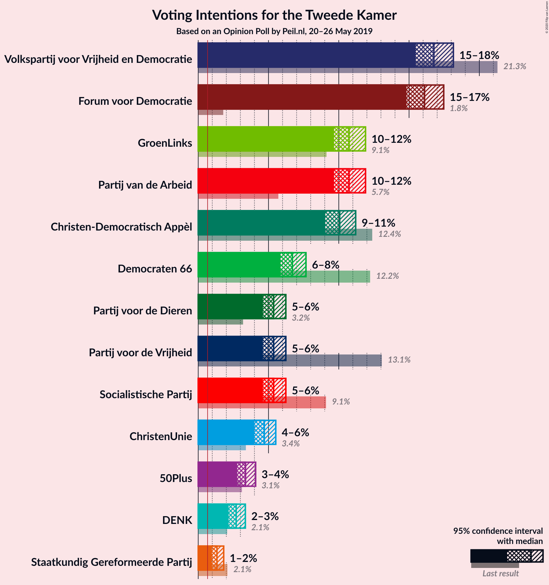

### Confidence Intervals

| Party | Last Result | Poll Result | 80% Confidence Interval | 90% Confidence Interval | 95% Confidence Interval | 99% Confidence Interval |
|:-----:|:-----------:|:-----------:|:-----------------------:|:-----------------------:|:-----------------------:|:-----------------------:|
| Volkspartij voor Vrijheid en Democratie | 21.3% | 16.8% | 15.9–17.7% |15.7–17.9% |15.5–18.2% |15.1–18.6% |
| Forum voor Democratie | 1.8% | 16.1% | 15.3–17.0% |15.0–17.3% |14.8–17.5% |14.4–17.9% |
| GroenLinks | 9.1% | 10.7% | 10.0–11.5% |9.8–11.7% |9.7–11.9% |9.3–12.3% |
| Partij van de Arbeid | 5.7% | 10.7% | 10.0–11.5% |9.8–11.7% |9.7–11.9% |9.3–12.3% |
| Christen-Democratisch Appèl | 12.4% | 10.1% | 9.4–10.8% |9.2–11.0% |9.0–11.2% |8.7–11.6% |
| Democraten 66 | 12.2% | 6.7% | 6.1–7.3% |6.0–7.5% |5.9–7.7% |5.6–8.0% |
| Partij voor de Vrijheid | 13.1% | 5.4% | 4.9–5.9% |4.7–6.1% |4.6–6.2% |4.4–6.5% |
| Socialistische Partij | 9.1% | 5.4% | 4.9–5.9% |4.7–6.1% |4.6–6.2% |4.4–6.5% |
| Partij voor de Dieren | 3.2% | 5.4% | 4.9–5.9% |4.7–6.1% |4.6–6.2% |4.4–6.5% |
| ChristenUnie | 3.4% | 4.7% | 4.2–5.2% |4.1–5.4% |4.0–5.5% |3.8–5.8% |
| 50Plus | 3.1% | 3.4% | 3.0–3.8% |2.9–4.0% |2.8–4.1% |2.6–4.3% |
| DENK | 2.1% | 2.7% | 2.3–3.1% |2.3–3.2% |2.2–3.4% |2.0–3.6% |
| Staatkundig Gereformeerde Partij | 2.1% | 1.3% | 1.1–1.6% |1.0–1.7% |1.0–1.8% |0.9–2.0% |

*Note:* The poll result column reflects the actual value used in the calculations. Published results may vary slightly, and in addition be rounded to fewer digits.

## Seats

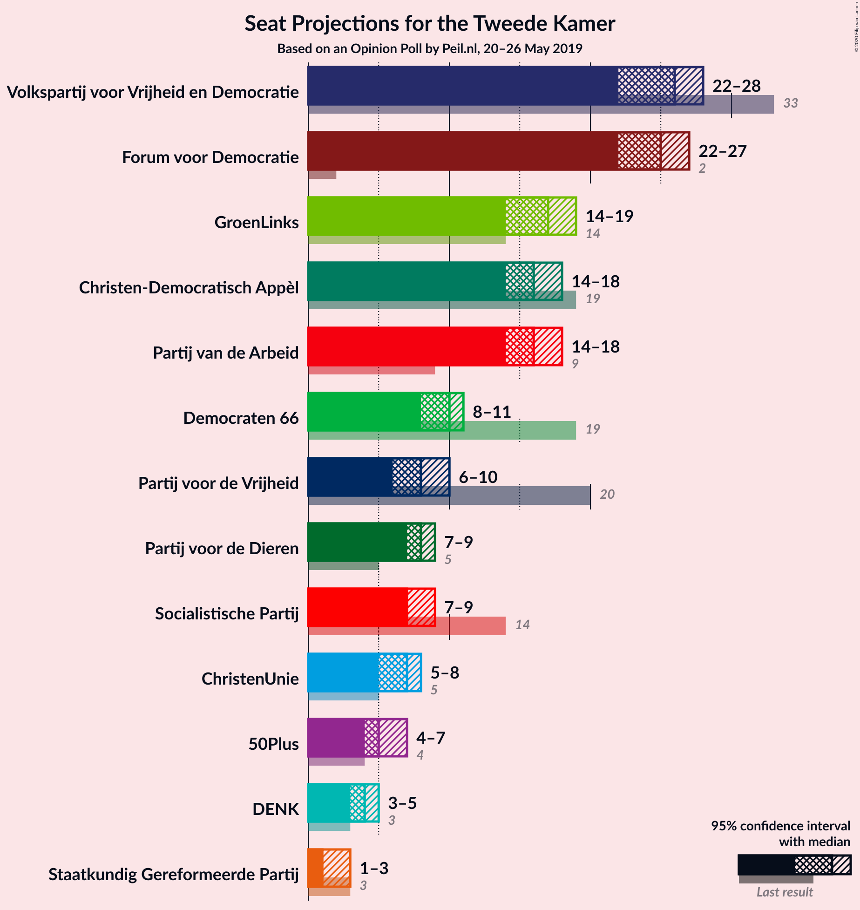

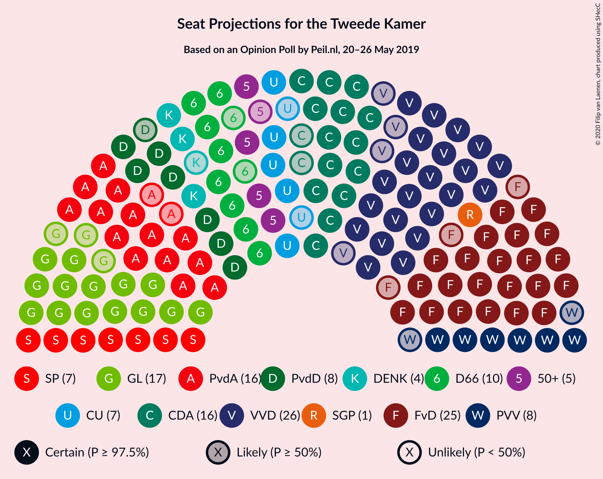

### Confidence Intervals

| Party | Last Result | Median | 80% Confidence Interval | 90% Confidence Interval | 95% Confidence Interval | 99% Confidence Interval |
|:-----:|:-----------:|:------:|:-----------------------:|:-----------------------:|:-----------------------:|:-----------------------:|
| <a href="#volkspartij-voor-vrijheid-en-democratie">Volkspartij voor Vrijheid en Democratie</a> | 33 | 26 | 24–27 |22–28 |22–28 |22–28 |
| <a href="#forum-voor-democratie">Forum voor Democratie</a> | 2 | 25 | 23–27 |22–27 |22–27 |22–28 |
| <a href="#groenlinks">GroenLinks</a> | 14 | 17 | 15–18 |15–19 |14–19 |14–19 |
| <a href="#partij-van-de-arbeid">Partij van de Arbeid</a> | 9 | 16 | 15–18 |14–18 |14–18 |14–19 |
| <a href="#christen-democratisch-appèl">Christen-Democratisch Appèl</a> | 19 | 16 | 14–17 |14–17 |14–18 |13–18 |
| <a href="#democraten-66">Democraten 66</a> | 19 | 10 | 8–11 |8–11 |8–11 |8–12 |
| <a href="#partij-voor-de-vrijheid">Partij voor de Vrijheid</a> | 20 | 8 | 6–10 |6–10 |6–10 |6–10 |
| <a href="#socialistische-partij">Socialistische Partij</a> | 14 | 7 | 7–8 |7–9 |7–9 |6–9 |
| <a href="#partij-voor-de-dieren">Partij voor de Dieren</a> | 5 | 8 | 7–9 |7–9 |7–9 |7–10 |
| <a href="#christenunie">ChristenUnie</a> | 5 | 7 | 6–8 |6–8 |5–8 |5–8 |
| <a href="#50plus">50Plus</a> | 4 | 5 | 4–6 |4–7 |4–7 |3–7 |
| <a href="#denk">DENK</a> | 3 | 4 | 3–5 |3–5 |3–5 |3–5 |
| <a href="#staatkundig-gereformeerde-partij">Staatkundig Gereformeerde Partij</a> | 3 | 1 | 1–2 |1–3 |1–3 |1–3 |

### Volkspartij voor Vrijheid en Democratie

*For a full overview of the results for this party, see the [Volkspartij voor Vrijheid en Democratie](party-volkspartijvoorvrijheidendemocratie.html) page.*

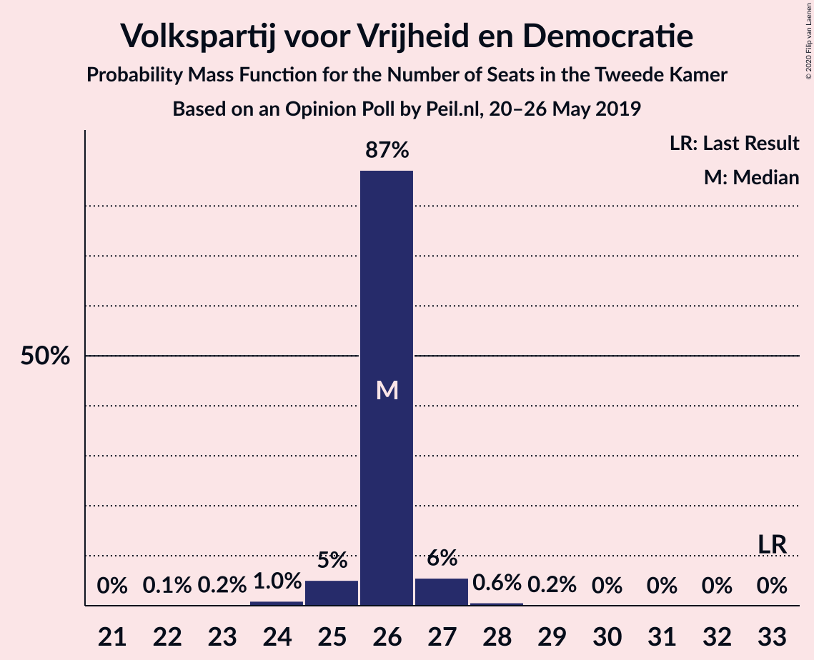

| Number of Seats | Probability | Accumulated | Special Marks |
|:---------------:|:-----------:|:-----------:|:-------------:|
| 22 | 7% | 100% |  |
| 23 | 2% | 92% |  |
| 24 | 18% | 90% |  |
| 25 | 21% | 72% |  |
| 26 | 27% | 52% | Median |
| 27 | 15% | 24% |  |
| 28 | 9% | 10% |  |
| 29 | 0.2% | 0.2% |  |
| 30 | 0.1% | 0.1% |  |
| 31 | 0% | 0% |  |
| 32 | 0% | 0% |  |
| 33 | 0% | 0% | Last Result |

### Forum voor Democratie

*For a full overview of the results for this party, see the [Forum voor Democratie](party-forumvoordemocratie.html) page.*

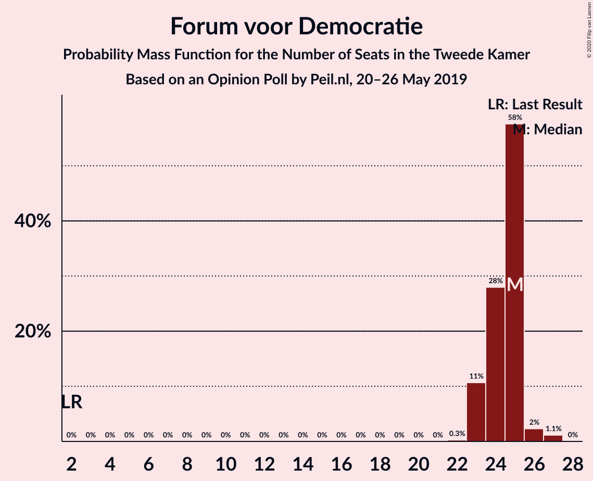

| Number of Seats | Probability | Accumulated | Special Marks |
|:---------------:|:-----------:|:-----------:|:-------------:|
| 2 | 0% | 100% | Last Result |
| 3 | 0% | 100% |  |
| 4 | 0% | 100% |  |
| 5 | 0% | 100% |  |
| 6 | 0% | 100% |  |
| 7 | 0% | 100% |  |
| 8 | 0% | 100% |  |
| 9 | 0% | 100% |  |
| 10 | 0% | 100% |  |
| 11 | 0% | 100% |  |
| 12 | 0% | 100% |  |
| 13 | 0% | 100% |  |
| 14 | 0% | 100% |  |
| 15 | 0% | 100% |  |
| 16 | 0% | 100% |  |
| 17 | 0% | 100% |  |
| 18 | 0% | 100% |  |
| 19 | 0% | 100% |  |
| 20 | 0% | 100% |  |
| 21 | 0.2% | 100% |  |
| 22 | 10% | 99.8% |  |
| 23 | 19% | 90% |  |
| 24 | 13% | 71% |  |
| 25 | 31% | 58% | Median |
| 26 | 12% | 28% |  |
| 27 | 15% | 16% |  |
| 28 | 0.9% | 0.9% |  |
| 29 | 0% | 0% |  |

### GroenLinks

*For a full overview of the results for this party, see the [GroenLinks](party-groenlinks.html) page.*

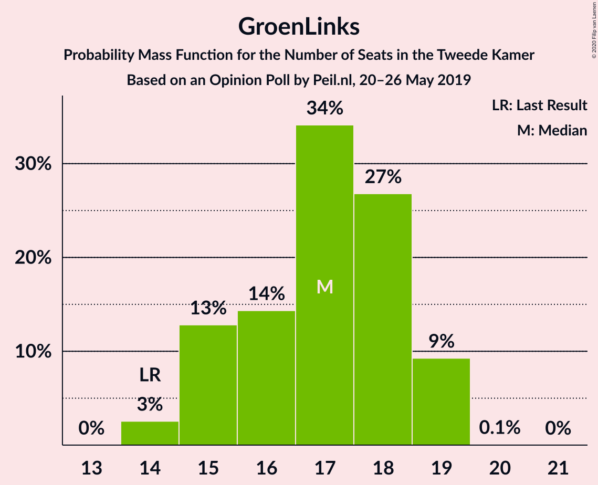

| Number of Seats | Probability | Accumulated | Special Marks |
|:---------------:|:-----------:|:-----------:|:-------------:|
| 14 | 3% | 100% | Last Result |
| 15 | 13% | 97% |  |
| 16 | 14% | 85% |  |
| 17 | 34% | 70% | Median |
| 18 | 27% | 36% |  |
| 19 | 9% | 9% |  |
| 20 | 0.1% | 0.1% |  |
| 21 | 0% | 0% |  |

### Partij van de Arbeid

*For a full overview of the results for this party, see the [Partij van de Arbeid](party-partijvandearbeid.html) page.*

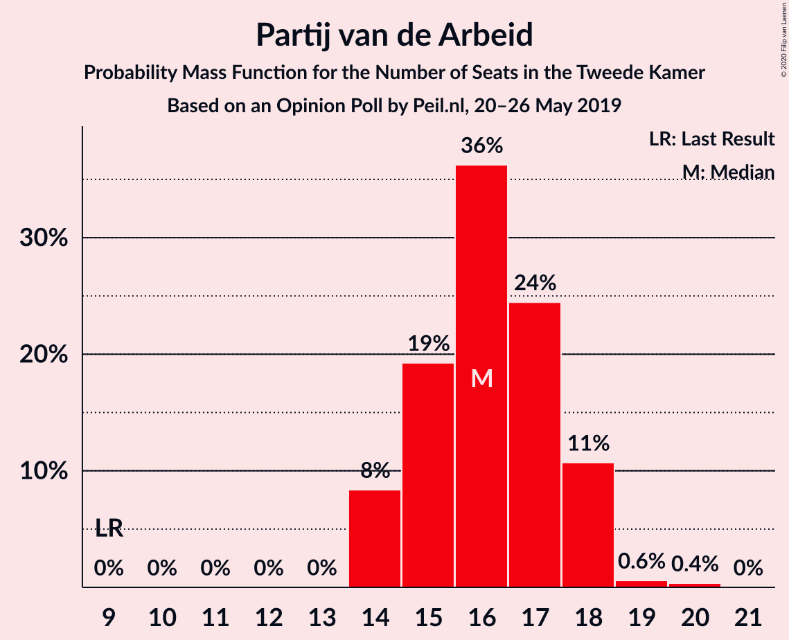

| Number of Seats | Probability | Accumulated | Special Marks |
|:---------------:|:-----------:|:-----------:|:-------------:|
| 9 | 0% | 100% | Last Result |
| 10 | 0% | 100% |  |
| 11 | 0% | 100% |  |
| 12 | 0% | 100% |  |
| 13 | 0% | 100% |  |
| 14 | 8% | 100% |  |
| 15 | 19% | 92% |  |
| 16 | 36% | 72% | Median |
| 17 | 24% | 36% |  |
| 18 | 11% | 12% |  |
| 19 | 0.6% | 0.9% |  |
| 20 | 0.4% | 0.4% |  |
| 21 | 0% | 0% |  |

### Christen-Democratisch Appèl

*For a full overview of the results for this party, see the [Christen-Democratisch Appèl](party-christen-democratischappèl.html) page.*

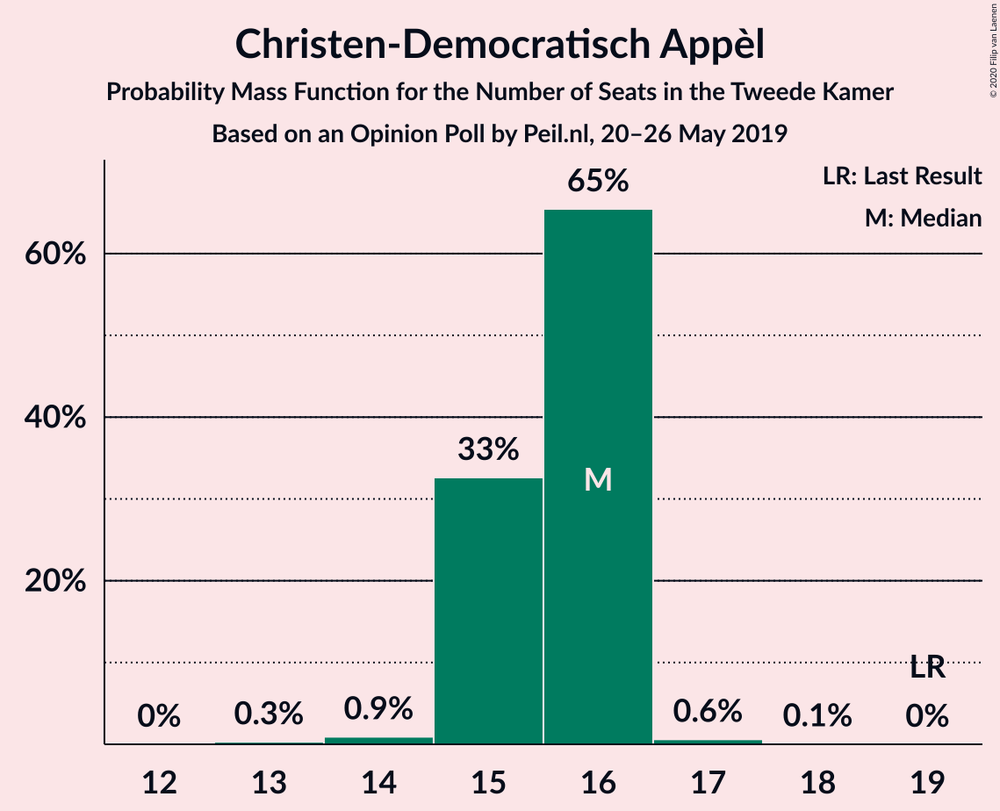

| Number of Seats | Probability | Accumulated | Special Marks |
|:---------------:|:-----------:|:-----------:|:-------------:|
| 12 | 0.4% | 100% |  |
| 13 | 0.3% | 99.6% |  |
| 14 | 17% | 99.4% |  |
| 15 | 25% | 83% |  |
| 16 | 44% | 57% | Median |
| 17 | 9% | 13% |  |
| 18 | 4% | 4% |  |
| 19 | 0% | 0% | Last Result |

### Democraten 66

*For a full overview of the results for this party, see the [Democraten 66](party-democraten66.html) page.*

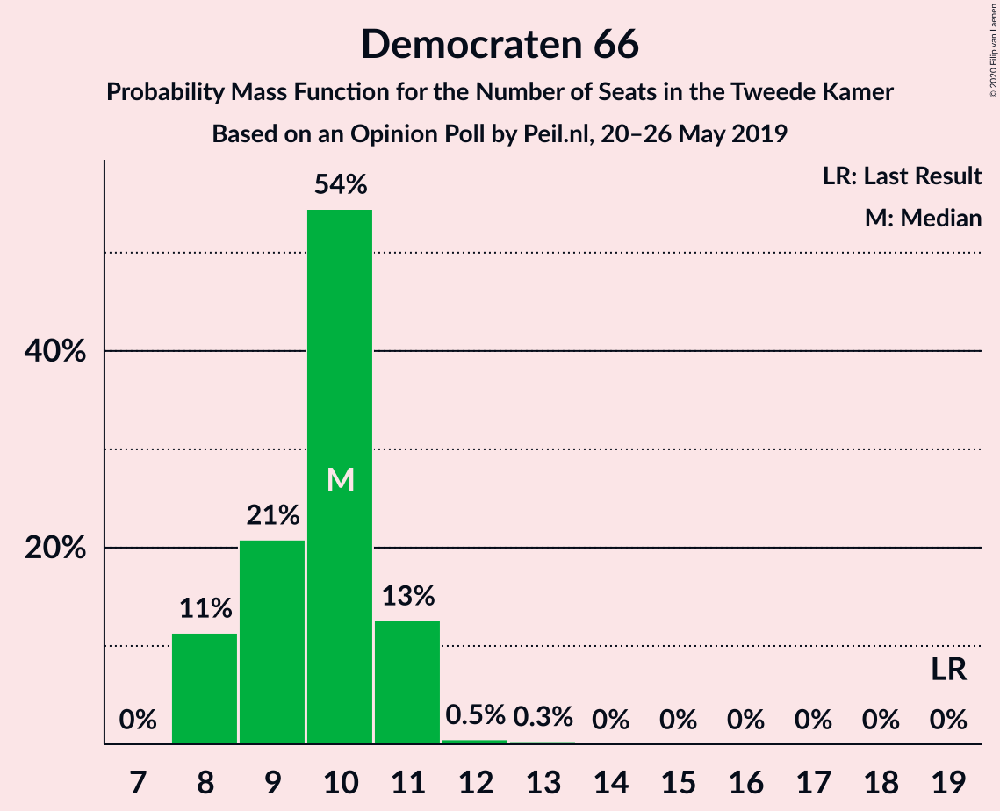

| Number of Seats | Probability | Accumulated | Special Marks |
|:---------------:|:-----------:|:-----------:|:-------------:|
| 8 | 11% | 100% |  |
| 9 | 21% | 89% |  |
| 10 | 54% | 68% | Median |
| 11 | 13% | 13% |  |
| 12 | 0.5% | 0.8% |  |
| 13 | 0.3% | 0.3% |  |
| 14 | 0% | 0% |  |
| 15 | 0% | 0% |  |
| 16 | 0% | 0% |  |
| 17 | 0% | 0% |  |
| 18 | 0% | 0% |  |
| 19 | 0% | 0% | Last Result |

### Partij voor de Vrijheid

*For a full overview of the results for this party, see the [Partij voor de Vrijheid](party-partijvoordevrijheid.html) page.*

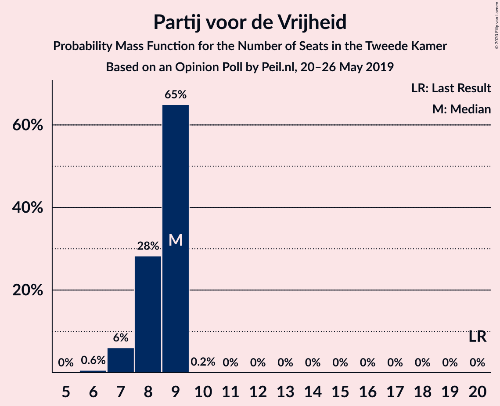

| Number of Seats | Probability | Accumulated | Special Marks |
|:---------------:|:-----------:|:-----------:|:-------------:|
| 6 | 21% | 100% |  |
| 7 | 16% | 79% |  |
| 8 | 38% | 64% | Median |
| 9 | 15% | 26% |  |
| 10 | 11% | 11% |  |
| 11 | 0% | 0% |  |
| 12 | 0% | 0% |  |
| 13 | 0% | 0% |  |
| 14 | 0% | 0% |  |
| 15 | 0% | 0% |  |
| 16 | 0% | 0% |  |
| 17 | 0% | 0% |  |
| 18 | 0% | 0% |  |
| 19 | 0% | 0% |  |
| 20 | 0% | 0% | Last Result |

### Socialistische Partij

*For a full overview of the results for this party, see the [Socialistische Partij](party-socialistischepartij.html) page.*

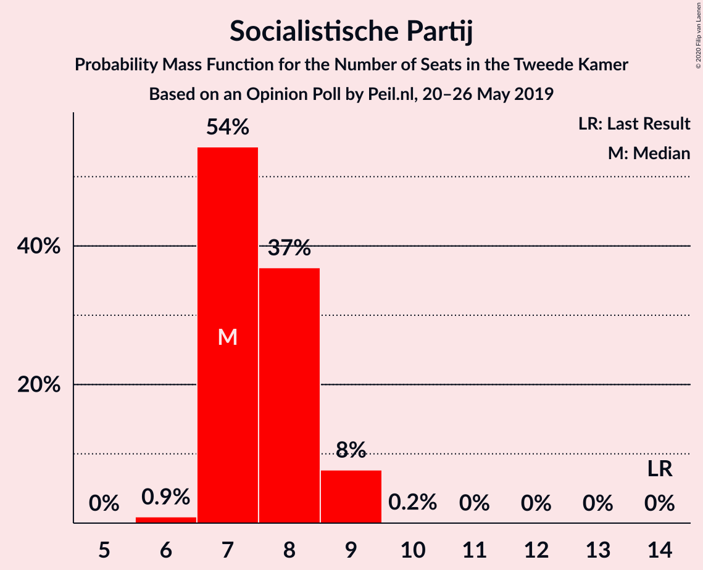

| Number of Seats | Probability | Accumulated | Special Marks |
|:---------------:|:-----------:|:-----------:|:-------------:|
| 6 | 0.9% | 100% |  |
| 7 | 54% | 99.1% | Median |
| 8 | 37% | 45% |  |
| 9 | 8% | 8% |  |
| 10 | 0.2% | 0.2% |  |
| 11 | 0% | 0% |  |
| 12 | 0% | 0% |  |
| 13 | 0% | 0% |  |
| 14 | 0% | 0% | Last Result |

### Partij voor de Dieren

*For a full overview of the results for this party, see the [Partij voor de Dieren](party-partijvoordedieren.html) page.*

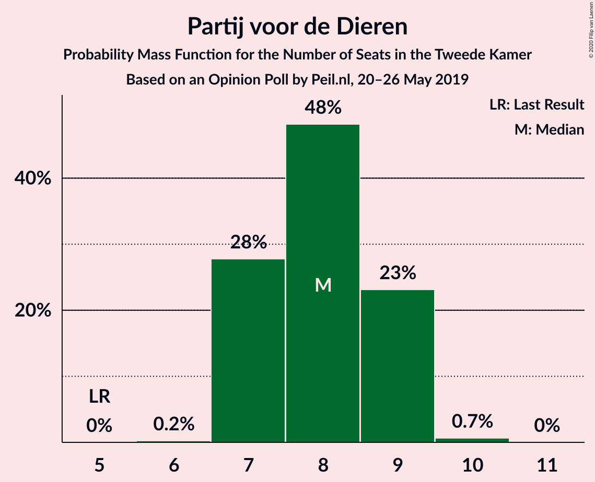

| Number of Seats | Probability | Accumulated | Special Marks |
|:---------------:|:-----------:|:-----------:|:-------------:|
| 5 | 0% | 100% | Last Result |
| 6 | 0.2% | 100% |  |
| 7 | 28% | 99.8% |  |
| 8 | 48% | 72% | Median |
| 9 | 23% | 24% |  |
| 10 | 0.7% | 0.7% |  |
| 11 | 0% | 0% |  |

### ChristenUnie

*For a full overview of the results for this party, see the [ChristenUnie](party-christenunie.html) page.*

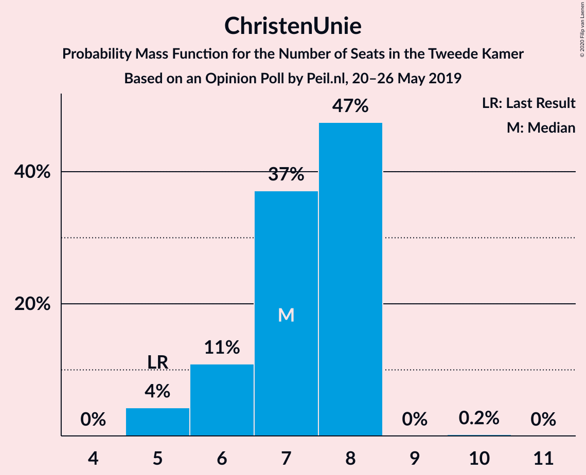

| Number of Seats | Probability | Accumulated | Special Marks |
|:---------------:|:-----------:|:-----------:|:-------------:|
| 5 | 4% | 100% | Last Result |
| 6 | 11% | 96% |  |
| 7 | 37% | 85% | Median |
| 8 | 47% | 48% |  |
| 9 | 0% | 0.2% |  |
| 10 | 0.2% | 0.2% |  |
| 11 | 0% | 0% |  |

### 50Plus

*For a full overview of the results for this party, see the [50Plus](party-50plus.html) page.*

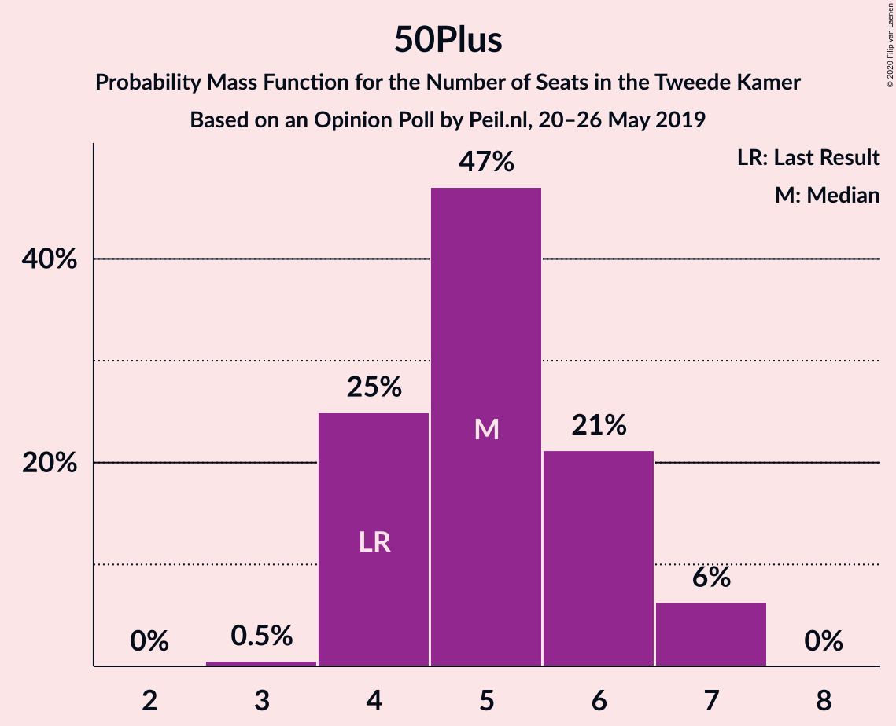

| Number of Seats | Probability | Accumulated | Special Marks |
|:---------------:|:-----------:|:-----------:|:-------------:|
| 3 | 0.5% | 100% |  |
| 4 | 25% | 99.5% | Last Result |
| 5 | 47% | 75% | Median |
| 6 | 21% | 27% |  |
| 7 | 6% | 6% |  |
| 8 | 0% | 0% |  |

### DENK

*For a full overview of the results for this party, see the [DENK](party-denk.html) page.*

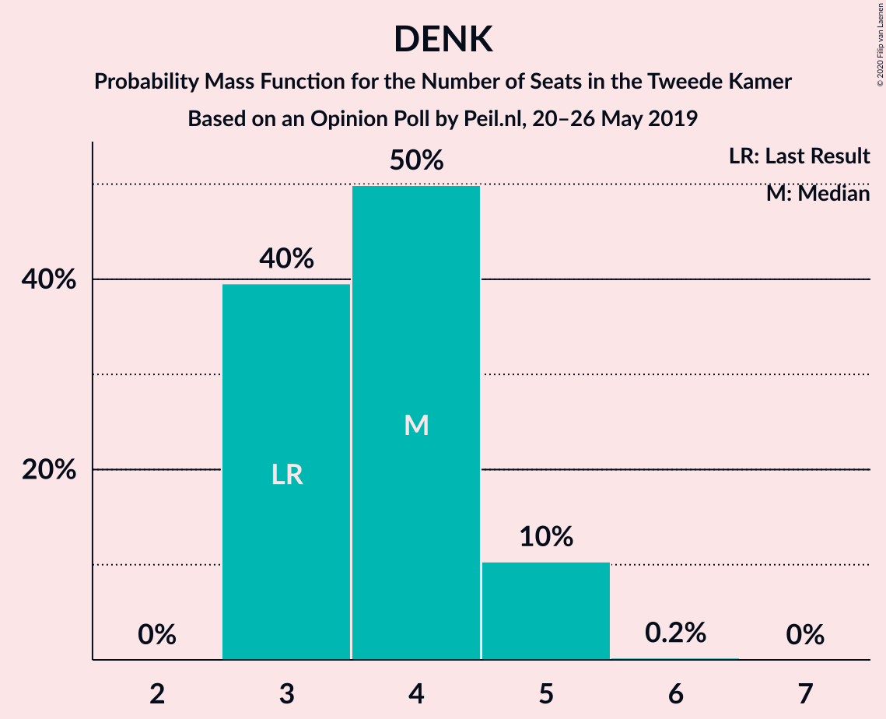

| Number of Seats | Probability | Accumulated | Special Marks |
|:---------------:|:-----------:|:-----------:|:-------------:|
| 3 | 40% | 100% | Last Result |
| 4 | 50% | 60% | Median |
| 5 | 10% | 11% |  |
| 6 | 0.2% | 0.2% |  |
| 7 | 0% | 0% |  |

### Staatkundig Gereformeerde Partij

*For a full overview of the results for this party, see the [Staatkundig Gereformeerde Partij](party-staatkundiggereformeerdepartij.html) page.*

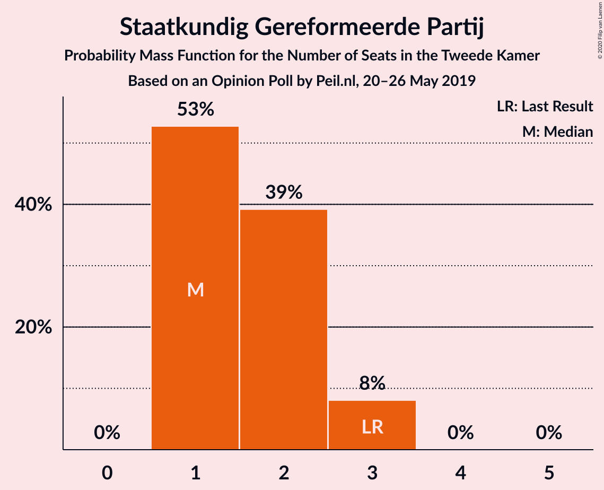

| Number of Seats | Probability | Accumulated | Special Marks |
|:---------------:|:-----------:|:-----------:|:-------------:|
| 1 | 53% | 100% | Median |
| 2 | 39% | 47% |  |
| 3 | 8% | 8% | Last Result |
| 4 | 0% | 0% |  |

## Coalitions

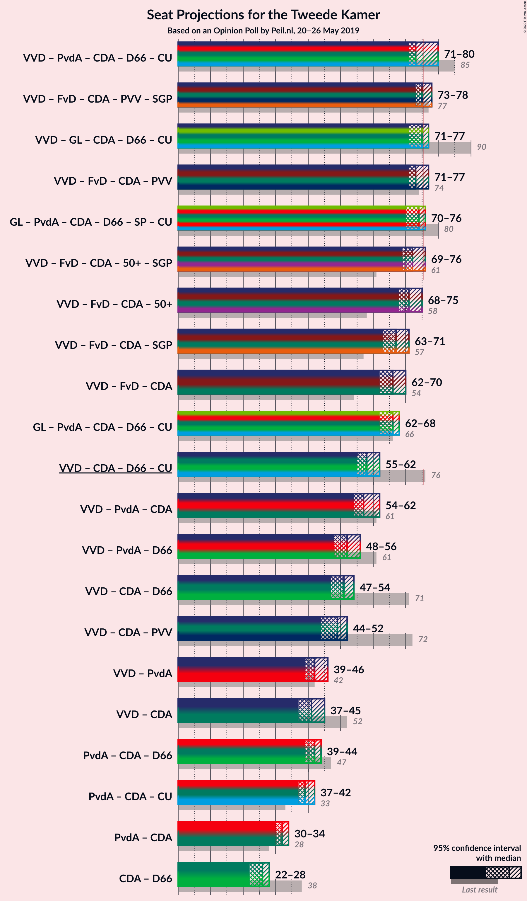

### Confidence Intervals

| Coalition | Last Result | Median | Majority? | 80% Confidence Interval | 90% Confidence Interval | 95% Confidence Interval | 99% Confidence Interval |
|:---------:|:-----------:|:------:|:---------:|:-----------------------:|:-----------------------:|:-----------------------:|:-----------------------:|
| Volkspartij voor Vrijheid en Democratie – Partij van de Arbeid – Christen-Democratisch Appèl – Democraten 66 – ChristenUnie | 85 | 73 | 32% | 71–77 | 71–80 | 71–80 | 71–80 |
| Volkspartij voor Vrijheid en Democratie – Forum voor Democratie – Christen-Democratisch Appèl – Partij voor de Vrijheid – Staatkundig Gereformeerde Partij | 77 | 75 | 28% | 73–76 | 73–78 | 73–78 | 72–79 |
| Volkspartij voor Vrijheid en Democratie – GroenLinks – Christen-Democratisch Appèl – Democraten 66 – ChristenUnie | 90 | 75 | 49% | 72–77 | 71–77 | 71–77 | 69–77 |
| Volkspartij voor Vrijheid en Democratie – Forum voor Democratie – Christen-Democratisch Appèl – Partij voor de Vrijheid | 74 | 73 | 6% | 71–75 | 71–77 | 71–77 | 70–77 |
| GroenLinks – Partij van de Arbeid – Christen-Democratisch Appèl – Democraten 66 – Socialistische Partij – ChristenUnie | 80 | 74 | 3% | 71–74 | 71–75 | 70–76 | 69–77 |
| Volkspartij voor Vrijheid en Democratie – Forum voor Democratie – Christen-Democratisch Appèl – 50Plus – Staatkundig Gereformeerde Partij | 61 | 72 | 5% | 69–75 | 69–75 | 69–76 | 69–77 |
| Volkspartij voor Vrijheid en Democratie – Forum voor Democratie – Christen-Democratisch Appèl – 50Plus | 58 | 71 | 0% | 68–74 | 68–74 | 68–75 | 67–75 |
| Volkspartij voor Vrijheid en Democratie – Forum voor Democratie – Christen-Democratisch Appèl – Staatkundig Gereformeerde Partij | 57 | 67 | 0% | 64–69 | 63–70 | 63–71 | 63–71 |
| Volkspartij voor Vrijheid en Democratie – Forum voor Democratie – Christen-Democratisch Appèl | 54 | 66 | 0% | 63–67 | 62–68 | 62–70 | 62–70 |
| GroenLinks – Partij van de Arbeid – Christen-Democratisch Appèl – Democraten 66 – ChristenUnie | 66 | 66 | 0% | 64–67 | 64–67 | 62–68 | 62–69 |
| Volkspartij voor Vrijheid en Democratie – Christen-Democratisch Appèl – Democraten 66 – ChristenUnie | 76 | 58 | 0% | 55–60 | 55–62 | 55–62 | 54–62 |
| Volkspartij voor Vrijheid en Democratie – Partij van de Arbeid – Christen-Democratisch Appèl | 61 | 57 | 0% | 54–61 | 54–62 | 54–62 | 54–62 |
| Volkspartij voor Vrijheid en Democratie – Partij van de Arbeid – Democraten 66 | 61 | 52 | 0% | 49–55 | 48–56 | 48–56 | 48–56 |
| Volkspartij voor Vrijheid en Democratie – Christen-Democratisch Appèl – Democraten 66 | 71 | 51 | 0% | 48–54 | 47–54 | 47–54 | 47–54 |
| Volkspartij voor Vrijheid en Democratie – Christen-Democratisch Appèl – Partij voor de Vrijheid | 72 | 49 | 0% | 47–52 | 44–52 | 44–52 | 44–52 |
| Volkspartij voor Vrijheid en Democratie – Partij van de Arbeid | 42 | 42 | 0% | 39–44 | 39–46 | 39–46 | 39–46 |
| Volkspartij voor Vrijheid en Democratie – Christen-Democratisch Appèl | 52 | 41 | 0% | 39–44 | 37–44 | 37–45 | 37–45 |
| Partij van de Arbeid – Christen-Democratisch Appèl – Democraten 66 | 47 | 42 | 0% | 39–44 | 39–44 | 39–44 | 39–45 |
| Partij van de Arbeid – Christen-Democratisch Appèl – ChristenUnie | 33 | 39 | 0% | 37–41 | 37–42 | 37–42 | 36–42 |
| Partij van de Arbeid – Christen-Democratisch Appèl | 28 | 32 | 0% | 30–34 | 30–34 | 30–34 | 29–35 |
| Christen-Democratisch Appèl – Democraten 66 | 38 | 26 | 0% | 22–27 | 22–28 | 22–28 | 22–29 |

### Volkspartij voor Vrijheid en Democratie – Partij van de Arbeid – Christen-Democratisch Appèl – Democraten 66 – ChristenUnie

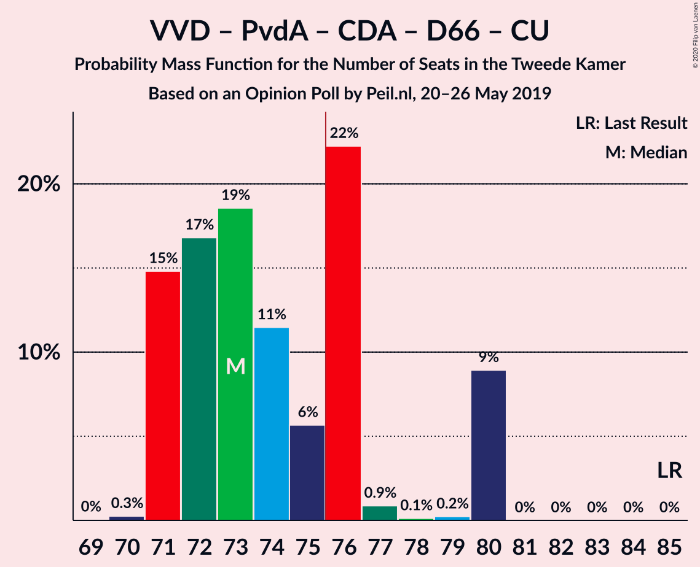

| Number of Seats | Probability | Accumulated | Special Marks |
|:---------------:|:-----------:|:-----------:|:-------------:|
| 69 | 0% | 100% |  |
| 70 | 0.3% | 99.9% |  |
| 71 | 15% | 99.7% |  |
| 72 | 17% | 85% |  |
| 73 | 19% | 68% |  |
| 74 | 11% | 50% |  |
| 75 | 6% | 38% | Median |
| 76 | 22% | 32% | Majority |
| 77 | 0.9% | 10% |  |
| 78 | 0.1% | 9% |  |
| 79 | 0.2% | 9% |  |
| 80 | 9% | 9% |  |
| 81 | 0% | 0% |  |
| 82 | 0% | 0% |  |
| 83 | 0% | 0% |  |
| 84 | 0% | 0% |  |
| 85 | 0% | 0% | Last Result |

### Volkspartij voor Vrijheid en Democratie – Forum voor Democratie – Christen-Democratisch Appèl – Partij voor de Vrijheid – Staatkundig Gereformeerde Partij

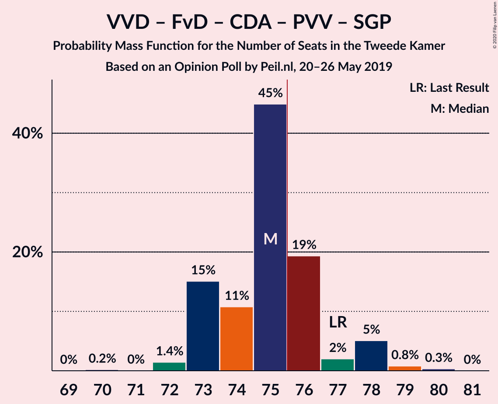

| Number of Seats | Probability | Accumulated | Special Marks |
|:---------------:|:-----------:|:-----------:|:-------------:|
| 70 | 0.2% | 100% |  |
| 71 | 0% | 99.8% |  |
| 72 | 1.4% | 99.8% |  |
| 73 | 15% | 98% |  |
| 74 | 11% | 83% |  |
| 75 | 45% | 72% |  |
| 76 | 19% | 28% | Median, Majority |
| 77 | 2% | 8% | Last Result |
| 78 | 5% | 6% |  |
| 79 | 0.8% | 1.1% |  |
| 80 | 0.3% | 0.3% |  |
| 81 | 0% | 0% |  |

### Volkspartij voor Vrijheid en Democratie – GroenLinks – Christen-Democratisch Appèl – Democraten 66 – ChristenUnie

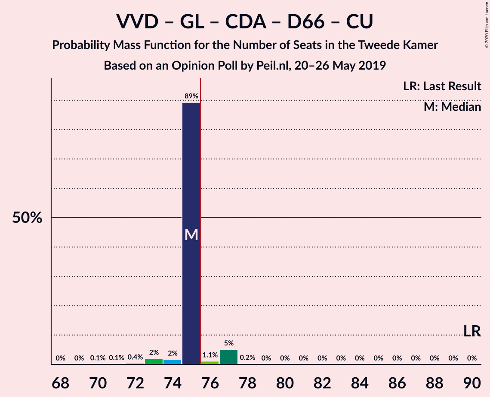

| Number of Seats | Probability | Accumulated | Special Marks |
|:---------------:|:-----------:|:-----------:|:-------------:|
| 69 | 0.7% | 100% |  |
| 70 | 0.6% | 99.3% |  |
| 71 | 8% | 98.7% |  |
| 72 | 2% | 91% |  |
| 73 | 6% | 89% |  |
| 74 | 27% | 83% |  |
| 75 | 7% | 55% |  |
| 76 | 19% | 49% | Median, Majority |
| 77 | 30% | 30% |  |
| 78 | 0.1% | 0.2% |  |
| 79 | 0% | 0.2% |  |
| 80 | 0.1% | 0.1% |  |
| 81 | 0% | 0% |  |
| 82 | 0% | 0% |  |
| 83 | 0% | 0% |  |
| 84 | 0% | 0% |  |
| 85 | 0% | 0% |  |
| 86 | 0% | 0% |  |
| 87 | 0% | 0% |  |
| 88 | 0% | 0% |  |
| 89 | 0% | 0% |  |
| 90 | 0% | 0% | Last Result |

### Volkspartij voor Vrijheid en Democratie – Forum voor Democratie – Christen-Democratisch Appèl – Partij voor de Vrijheid

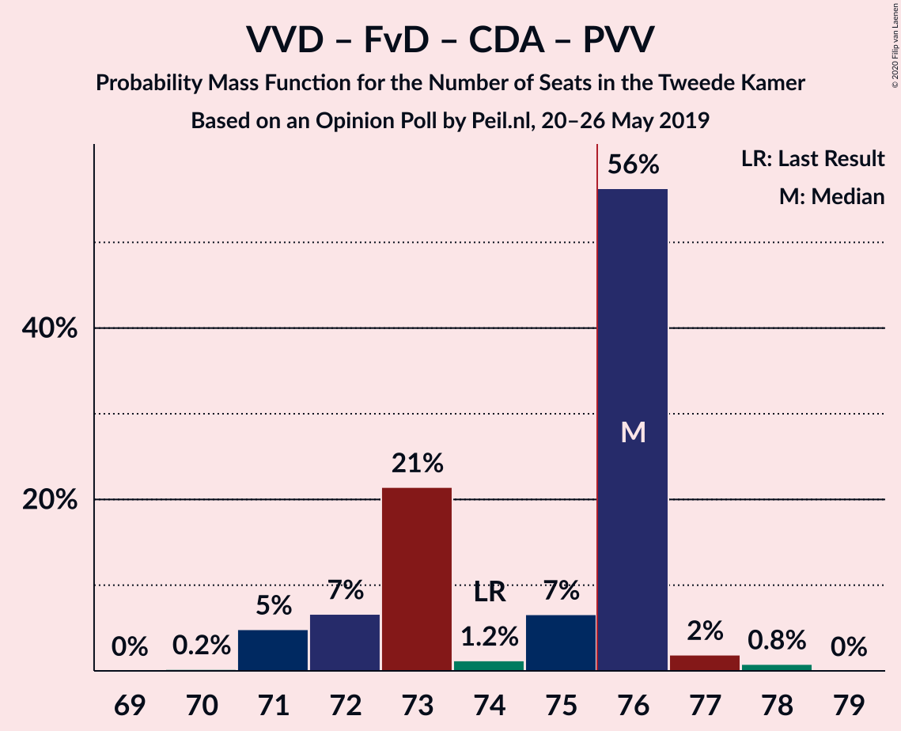

| Number of Seats | Probability | Accumulated | Special Marks |
|:---------------:|:-----------:|:-----------:|:-------------:|
| 68 | 0.2% | 100% |  |
| 69 | 0.1% | 99.8% |  |
| 70 | 0.9% | 99.7% |  |
| 71 | 11% | 98.8% |  |
| 72 | 16% | 88% |  |
| 73 | 27% | 72% |  |
| 74 | 20% | 45% | Last Result |
| 75 | 19% | 25% | Median |
| 76 | 0.3% | 6% | Majority |
| 77 | 6% | 6% |  |
| 78 | 0.4% | 0.4% |  |
| 79 | 0% | 0% |  |

### GroenLinks – Partij van de Arbeid – Christen-Democratisch Appèl – Democraten 66 – Socialistische Partij – ChristenUnie

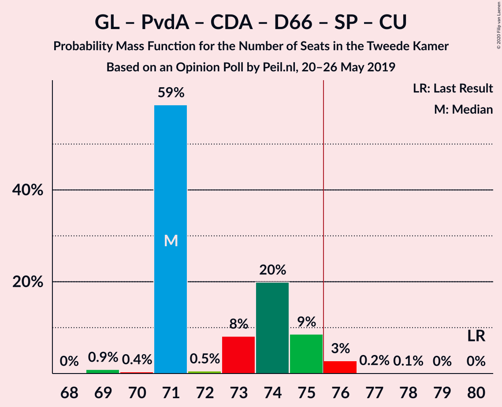

| Number of Seats | Probability | Accumulated | Special Marks |
|:---------------:|:-----------:|:-----------:|:-------------:|
| 69 | 0.5% | 100% |  |
| 70 | 2% | 99.5% |  |
| 71 | 11% | 97% |  |
| 72 | 11% | 87% |  |
| 73 | 25% | 75% | Median |
| 74 | 45% | 50% |  |
| 75 | 2% | 6% |  |
| 76 | 3% | 3% | Majority |
| 77 | 0.1% | 0.6% |  |
| 78 | 0.2% | 0.4% |  |
| 79 | 0.3% | 0.3% |  |
| 80 | 0% | 0% | Last Result |

### Volkspartij voor Vrijheid en Democratie – Forum voor Democratie – Christen-Democratisch Appèl – 50Plus – Staatkundig Gereformeerde Partij

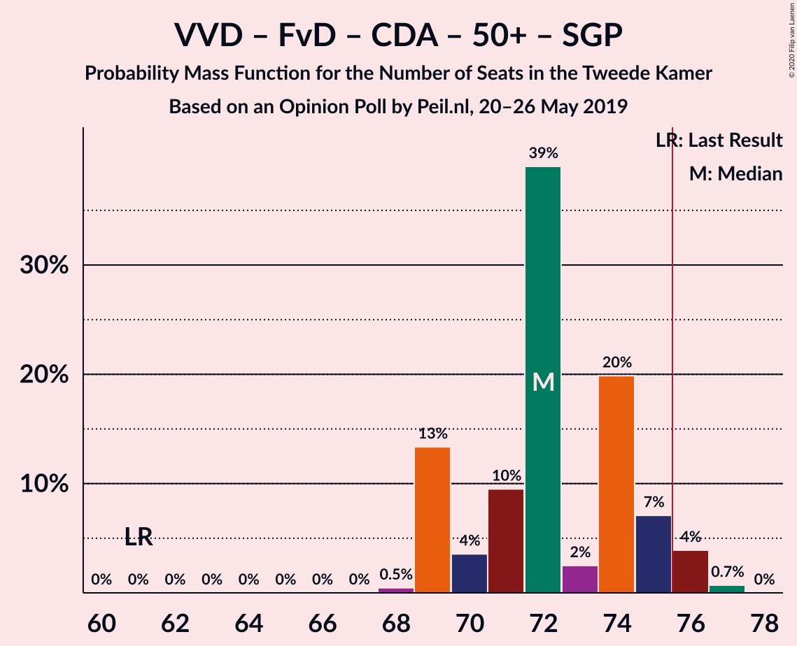

| Number of Seats | Probability | Accumulated | Special Marks |
|:---------------:|:-----------:|:-----------:|:-------------:|
| 61 | 0% | 100% | Last Result |
| 62 | 0% | 100% |  |
| 63 | 0% | 100% |  |
| 64 | 0% | 100% |  |
| 65 | 0% | 100% |  |
| 66 | 0% | 100% |  |
| 67 | 0% | 100% |  |
| 68 | 0.5% | 100% |  |
| 69 | 13% | 99.5% |  |
| 70 | 4% | 86% |  |
| 71 | 10% | 83% |  |
| 72 | 39% | 73% |  |
| 73 | 2% | 34% | Median |
| 74 | 20% | 32% |  |
| 75 | 7% | 12% |  |
| 76 | 4% | 5% | Majority |
| 77 | 0.7% | 0.7% |  |
| 78 | 0% | 0% |  |

### Volkspartij voor Vrijheid en Democratie – Forum voor Democratie – Christen-Democratisch Appèl – 50Plus

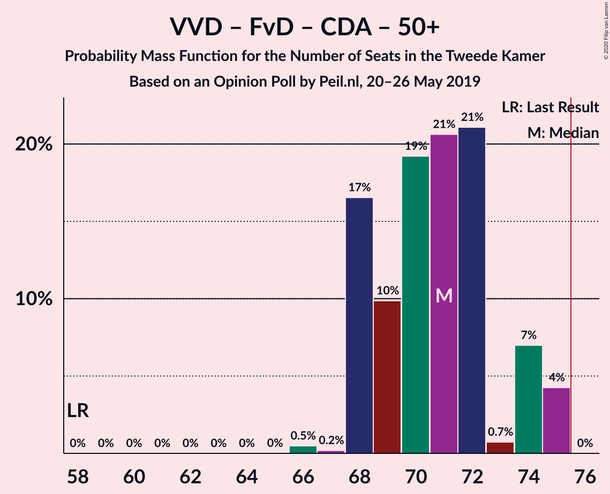

| Number of Seats | Probability | Accumulated | Special Marks |
|:---------------:|:-----------:|:-----------:|:-------------:|
| 58 | 0% | 100% | Last Result |
| 59 | 0% | 100% |  |
| 60 | 0% | 100% |  |
| 61 | 0% | 100% |  |
| 62 | 0% | 100% |  |
| 63 | 0% | 100% |  |
| 64 | 0% | 100% |  |
| 65 | 0% | 100% |  |
| 66 | 0.5% | 100% |  |
| 67 | 0.2% | 99.5% |  |
| 68 | 17% | 99.3% |  |
| 69 | 10% | 83% |  |
| 70 | 19% | 73% |  |
| 71 | 21% | 54% |  |
| 72 | 21% | 33% | Median |
| 73 | 0.7% | 12% |  |
| 74 | 7% | 11% |  |
| 75 | 4% | 4% |  |
| 76 | 0% | 0% | Majority |

### Volkspartij voor Vrijheid en Democratie – Forum voor Democratie – Christen-Democratisch Appèl – Staatkundig Gereformeerde Partij

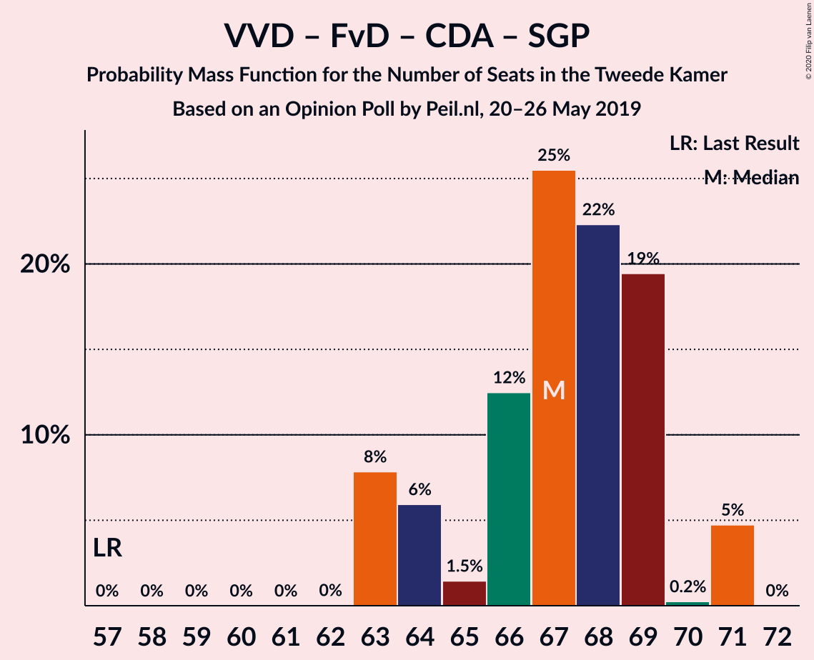

| Number of Seats | Probability | Accumulated | Special Marks |
|:---------------:|:-----------:|:-----------:|:-------------:|
| 57 | 0% | 100% | Last Result |
| 58 | 0% | 100% |  |
| 59 | 0% | 100% |  |
| 60 | 0% | 100% |  |
| 61 | 0% | 100% |  |
| 62 | 0% | 100% |  |
| 63 | 8% | 100% |  |
| 64 | 6% | 92% |  |
| 65 | 1.5% | 86% |  |
| 66 | 12% | 85% |  |
| 67 | 25% | 72% |  |
| 68 | 22% | 47% | Median |
| 69 | 19% | 24% |  |
| 70 | 0.2% | 5% |  |
| 71 | 5% | 5% |  |
| 72 | 0% | 0% |  |

### Volkspartij voor Vrijheid en Democratie – Forum voor Democratie – Christen-Democratisch Appèl

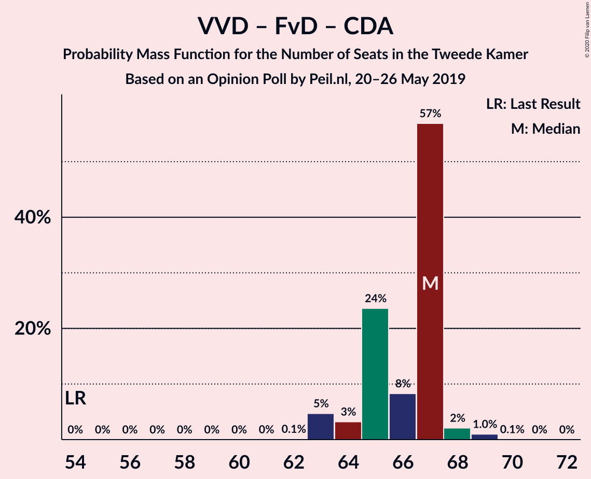

| Number of Seats | Probability | Accumulated | Special Marks |
|:---------------:|:-----------:|:-----------:|:-------------:|
| 54 | 0% | 100% | Last Result |
| 55 | 0% | 100% |  |
| 56 | 0% | 100% |  |
| 57 | 0% | 100% |  |
| 58 | 0% | 100% |  |
| 59 | 0% | 100% |  |
| 60 | 0% | 100% |  |
| 61 | 0.2% | 100% |  |
| 62 | 9% | 99.8% |  |
| 63 | 6% | 91% |  |
| 64 | 21% | 85% |  |
| 65 | 0.9% | 65% |  |
| 66 | 22% | 64% |  |
| 67 | 36% | 42% | Median |
| 68 | 0.8% | 6% |  |
| 69 | 1.4% | 5% |  |
| 70 | 4% | 4% |  |
| 71 | 0% | 0% |  |

### GroenLinks – Partij van de Arbeid – Christen-Democratisch Appèl – Democraten 66 – ChristenUnie

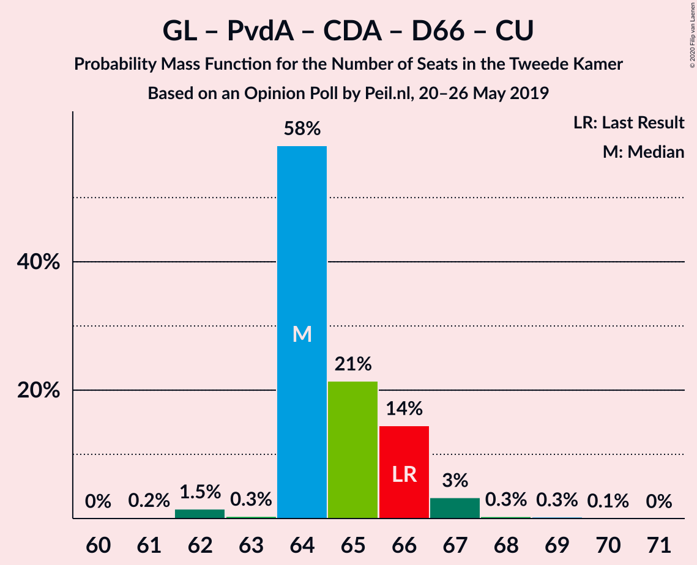

| Number of Seats | Probability | Accumulated | Special Marks |
|:---------------:|:-----------:|:-----------:|:-------------:|
| 60 | 0% | 100% |  |
| 61 | 0.1% | 99.9% |  |
| 62 | 2% | 99.9% |  |
| 63 | 0.5% | 97% |  |
| 64 | 15% | 97% |  |
| 65 | 28% | 82% |  |
| 66 | 21% | 54% | Last Result, Median |
| 67 | 29% | 33% |  |
| 68 | 3% | 3% |  |
| 69 | 0.1% | 0.5% |  |
| 70 | 0.4% | 0.4% |  |
| 71 | 0% | 0% |  |

### Volkspartij voor Vrijheid en Democratie – Christen-Democratisch Appèl – Democraten 66 – ChristenUnie

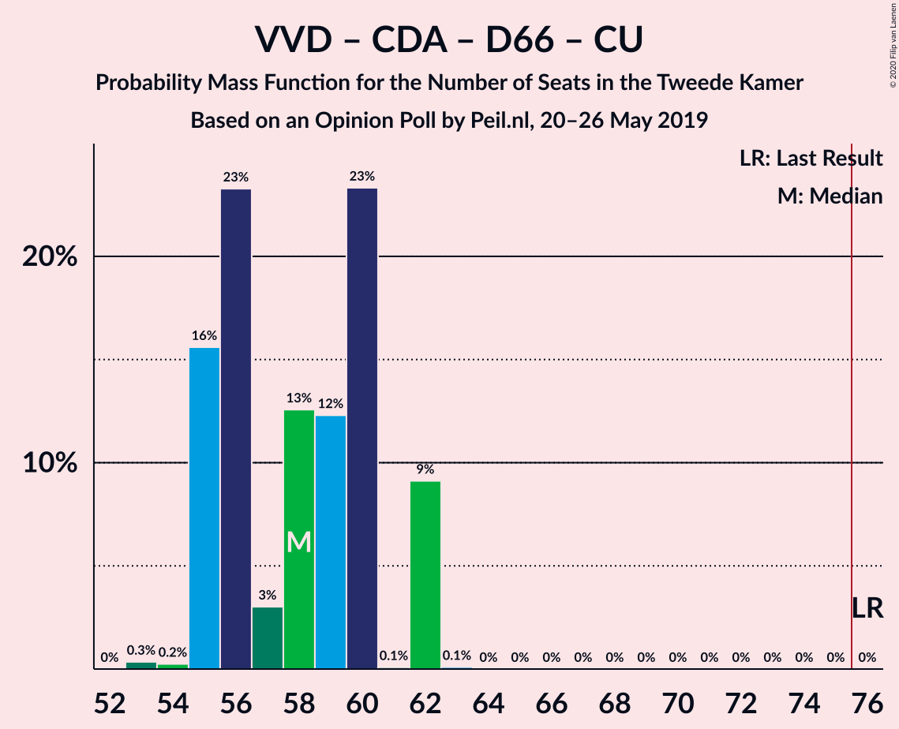

| Number of Seats | Probability | Accumulated | Special Marks |
|:---------------:|:-----------:|:-----------:|:-------------:|
| 53 | 0.3% | 100% |  |
| 54 | 0.2% | 99.6% |  |
| 55 | 16% | 99.4% |  |
| 56 | 23% | 84% |  |
| 57 | 3% | 61% |  |
| 58 | 13% | 58% |  |
| 59 | 12% | 45% | Median |
| 60 | 23% | 33% |  |
| 61 | 0.1% | 9% |  |
| 62 | 9% | 9% |  |
| 63 | 0.1% | 0.1% |  |
| 64 | 0% | 0% |  |
| 65 | 0% | 0% |  |
| 66 | 0% | 0% |  |
| 67 | 0% | 0% |  |
| 68 | 0% | 0% |  |
| 69 | 0% | 0% |  |
| 70 | 0% | 0% |  |
| 71 | 0% | 0% |  |
| 72 | 0% | 0% |  |
| 73 | 0% | 0% |  |
| 74 | 0% | 0% |  |
| 75 | 0% | 0% |  |
| 76 | 0% | 0% | Last Result, Majority |

### Volkspartij voor Vrijheid en Democratie – Partij van de Arbeid – Christen-Democratisch Appèl

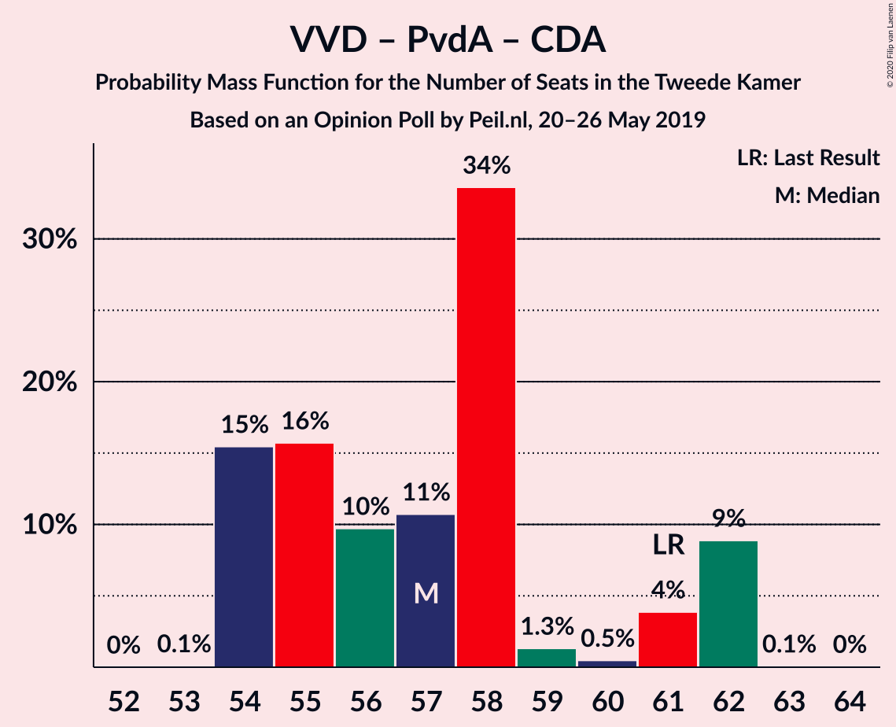

| Number of Seats | Probability | Accumulated | Special Marks |
|:---------------:|:-----------:|:-----------:|:-------------:|
| 53 | 0.1% | 100% |  |
| 54 | 15% | 99.9% |  |
| 55 | 16% | 84% |  |
| 56 | 10% | 69% |  |
| 57 | 11% | 59% |  |
| 58 | 34% | 48% | Median |
| 59 | 1.3% | 15% |  |
| 60 | 0.5% | 13% |  |
| 61 | 4% | 13% | Last Result |
| 62 | 9% | 9% |  |
| 63 | 0.1% | 0.1% |  |
| 64 | 0% | 0% |  |

### Volkspartij voor Vrijheid en Democratie – Partij van de Arbeid – Democraten 66

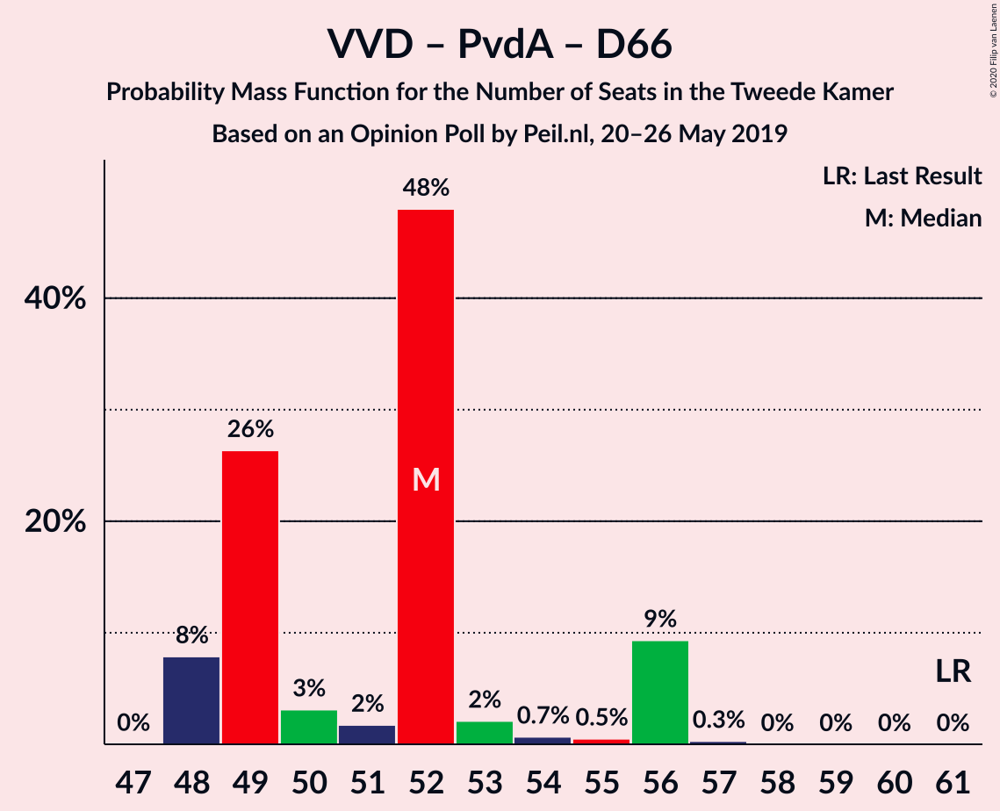

| Number of Seats | Probability | Accumulated | Special Marks |
|:---------------:|:-----------:|:-----------:|:-------------:|
| 48 | 8% | 100% |  |
| 49 | 26% | 92% |  |
| 50 | 3% | 66% |  |
| 51 | 2% | 63% |  |
| 52 | 48% | 61% | Median |
| 53 | 2% | 13% |  |
| 54 | 0.7% | 11% |  |
| 55 | 0.5% | 10% |  |
| 56 | 9% | 10% |  |
| 57 | 0.3% | 0.3% |  |
| 58 | 0% | 0% |  |
| 59 | 0% | 0% |  |
| 60 | 0% | 0% |  |
| 61 | 0% | 0% | Last Result |

### Volkspartij voor Vrijheid en Democratie – Christen-Democratisch Appèl – Democraten 66

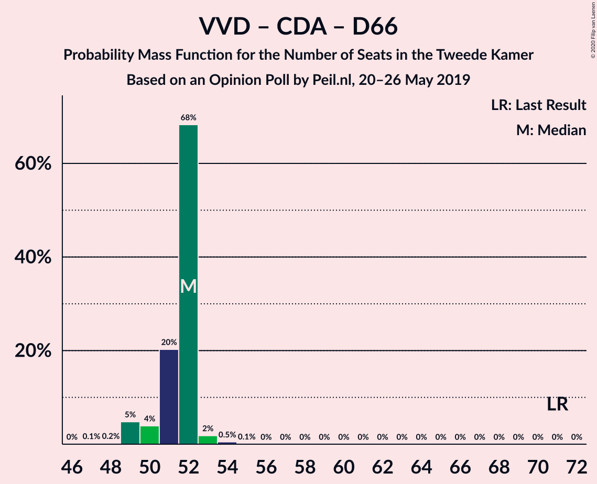

| Number of Seats | Probability | Accumulated | Special Marks |
|:---------------:|:-----------:|:-----------:|:-------------:|
| 47 | 8% | 100% |  |
| 48 | 15% | 92% |  |
| 49 | 16% | 77% |  |
| 50 | 3% | 60% |  |
| 51 | 12% | 57% |  |
| 52 | 21% | 45% | Median |
| 53 | 10% | 23% |  |
| 54 | 14% | 14% |  |
| 55 | 0.1% | 0.2% |  |
| 56 | 0.1% | 0.1% |  |
| 57 | 0% | 0% |  |
| 58 | 0% | 0% |  |
| 59 | 0% | 0% |  |
| 60 | 0% | 0% |  |
| 61 | 0% | 0% |  |
| 62 | 0% | 0% |  |
| 63 | 0% | 0% |  |
| 64 | 0% | 0% |  |
| 65 | 0% | 0% |  |
| 66 | 0% | 0% |  |
| 67 | 0% | 0% |  |
| 68 | 0% | 0% |  |
| 69 | 0% | 0% |  |
| 70 | 0% | 0% |  |
| 71 | 0% | 0% | Last Result |

### Volkspartij voor Vrijheid en Democratie – Christen-Democratisch Appèl – Partij voor de Vrijheid

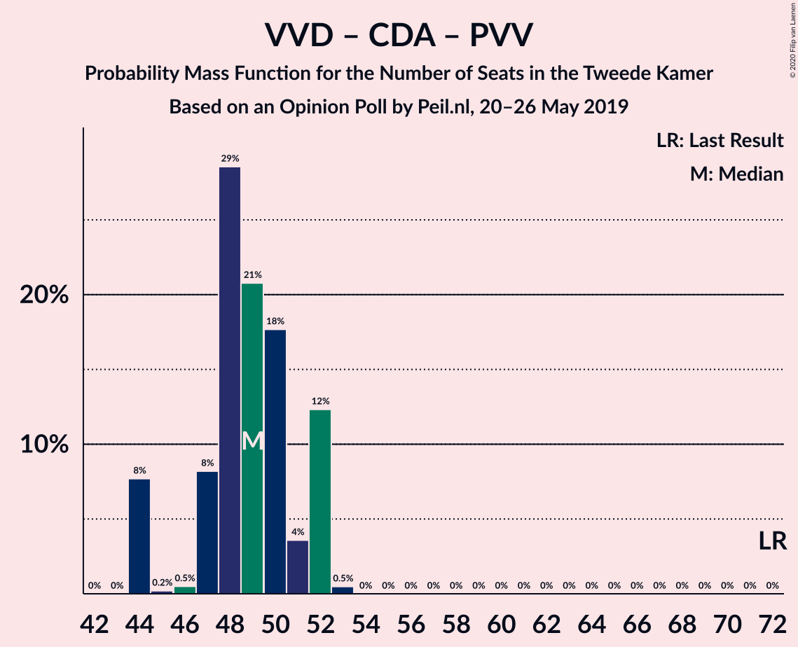

| Number of Seats | Probability | Accumulated | Special Marks |
|:---------------:|:-----------:|:-----------:|:-------------:|
| 44 | 8% | 100% |  |
| 45 | 0.2% | 92% |  |
| 46 | 0.5% | 92% |  |
| 47 | 8% | 92% |  |
| 48 | 29% | 83% |  |
| 49 | 21% | 55% |  |
| 50 | 18% | 34% | Median |
| 51 | 4% | 16% |  |
| 52 | 12% | 13% |  |
| 53 | 0.5% | 0.5% |  |
| 54 | 0% | 0% |  |
| 55 | 0% | 0% |  |
| 56 | 0% | 0% |  |
| 57 | 0% | 0% |  |
| 58 | 0% | 0% |  |
| 59 | 0% | 0% |  |
| 60 | 0% | 0% |  |
| 61 | 0% | 0% |  |
| 62 | 0% | 0% |  |
| 63 | 0% | 0% |  |
| 64 | 0% | 0% |  |
| 65 | 0% | 0% |  |
| 66 | 0% | 0% |  |
| 67 | 0% | 0% |  |
| 68 | 0% | 0% |  |
| 69 | 0% | 0% |  |
| 70 | 0% | 0% |  |
| 71 | 0% | 0% |  |
| 72 | 0% | 0% | Last Result |

### Volkspartij voor Vrijheid en Democratie – Partij van de Arbeid

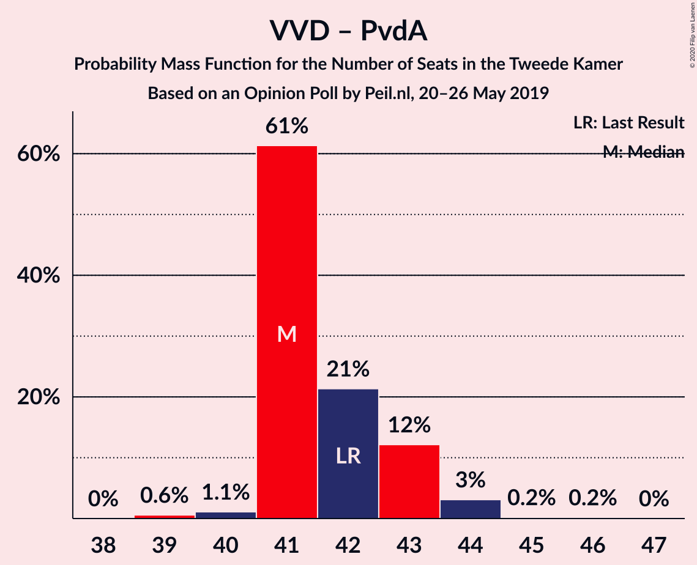

| Number of Seats | Probability | Accumulated | Special Marks |
|:---------------:|:-----------:|:-----------:|:-------------:|
| 38 | 0.2% | 100% |  |
| 39 | 27% | 99.8% |  |
| 40 | 11% | 73% |  |
| 41 | 10% | 63% |  |
| 42 | 26% | 52% | Last Result, Median |
| 43 | 5% | 26% |  |
| 44 | 11% | 21% |  |
| 45 | 0.7% | 10% |  |
| 46 | 9% | 9% |  |
| 47 | 0.1% | 0.1% |  |
| 48 | 0% | 0% |  |

### Volkspartij voor Vrijheid en Democratie – Christen-Democratisch Appèl

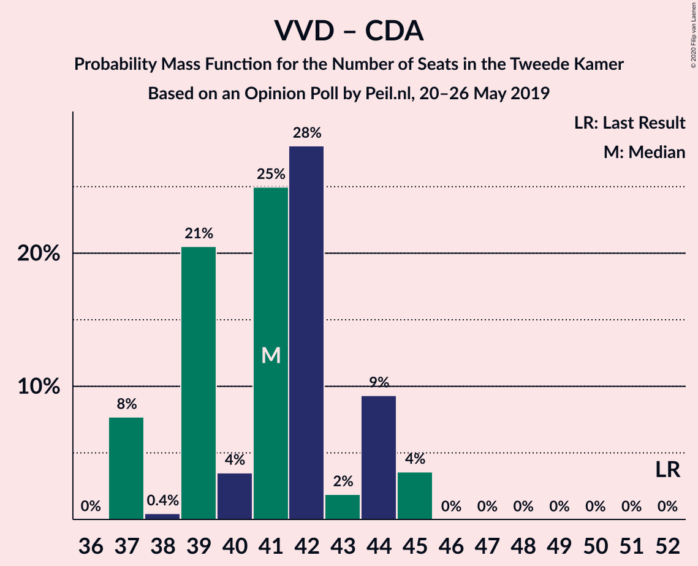

| Number of Seats | Probability | Accumulated | Special Marks |
|:---------------:|:-----------:|:-----------:|:-------------:|
| 37 | 8% | 100% |  |
| 38 | 0.4% | 92% |  |
| 39 | 21% | 92% |  |
| 40 | 4% | 71% |  |
| 41 | 25% | 68% |  |
| 42 | 28% | 43% | Median |
| 43 | 2% | 15% |  |
| 44 | 9% | 13% |  |
| 45 | 4% | 4% |  |
| 46 | 0% | 0% |  |
| 47 | 0% | 0% |  |
| 48 | 0% | 0% |  |
| 49 | 0% | 0% |  |
| 50 | 0% | 0% |  |
| 51 | 0% | 0% |  |
| 52 | 0% | 0% | Last Result |

### Partij van de Arbeid – Christen-Democratisch Appèl – Democraten 66

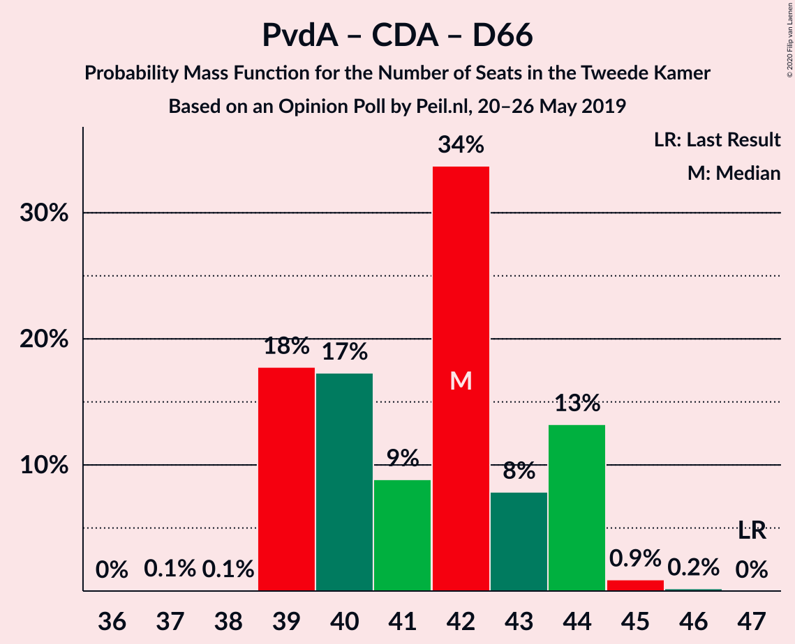

| Number of Seats | Probability | Accumulated | Special Marks |
|:---------------:|:-----------:|:-----------:|:-------------:|
| 37 | 0.1% | 100% |  |
| 38 | 0.1% | 99.9% |  |
| 39 | 18% | 99.8% |  |
| 40 | 17% | 82% |  |
| 41 | 9% | 65% |  |
| 42 | 34% | 56% | Median |
| 43 | 8% | 22% |  |
| 44 | 13% | 14% |  |
| 45 | 0.9% | 1.1% |  |
| 46 | 0.2% | 0.2% |  |
| 47 | 0% | 0% | Last Result |

### Partij van de Arbeid – Christen-Democratisch Appèl – ChristenUnie

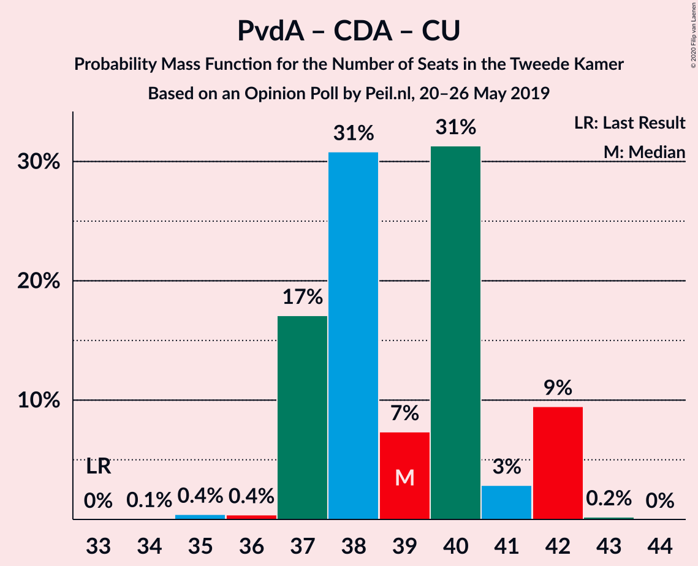

| Number of Seats | Probability | Accumulated | Special Marks |
|:---------------:|:-----------:|:-----------:|:-------------:|
| 33 | 0% | 100% | Last Result |
| 34 | 0.1% | 100% |  |
| 35 | 0.4% | 99.9% |  |
| 36 | 0.4% | 99.5% |  |
| 37 | 17% | 99.1% |  |
| 38 | 31% | 82% |  |
| 39 | 7% | 51% | Median |
| 40 | 31% | 44% |  |
| 41 | 3% | 13% |  |
| 42 | 9% | 10% |  |
| 43 | 0.2% | 0.2% |  |
| 44 | 0% | 0% |  |

### Partij van de Arbeid – Christen-Democratisch Appèl

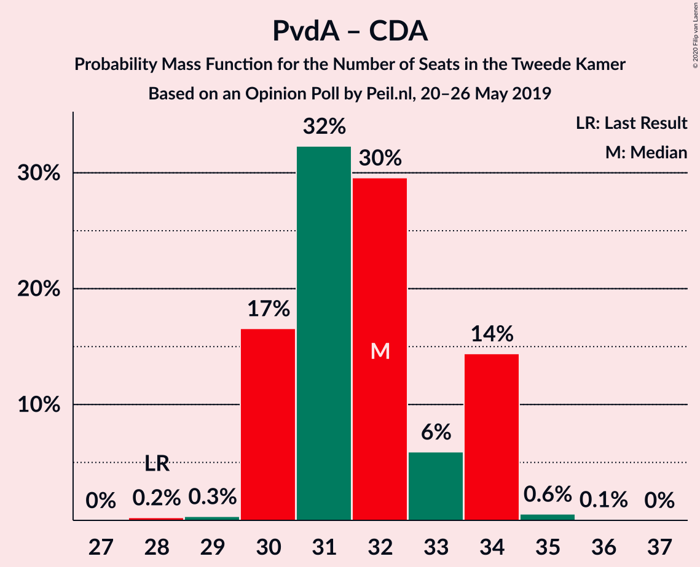

| Number of Seats | Probability | Accumulated | Special Marks |
|:---------------:|:-----------:|:-----------:|:-------------:|
| 28 | 0.2% | 100% | Last Result |
| 29 | 0.3% | 99.8% |  |
| 30 | 17% | 99.4% |  |
| 31 | 32% | 83% |  |
| 32 | 30% | 51% | Median |
| 33 | 6% | 21% |  |
| 34 | 14% | 15% |  |
| 35 | 0.6% | 0.7% |  |
| 36 | 0.1% | 0.1% |  |
| 37 | 0% | 0% |  |

### Christen-Democratisch Appèl – Democraten 66

| Number of Seats | Probability | Accumulated | Special Marks |
|:---------------:|:-----------:|:-----------:|:-------------:|
| 22 | 10% | 100% |  |
| 23 | 2% | 90% |  |
| 24 | 20% | 88% |  |
| 25 | 12% | 68% |  |
| 26 | 37% | 56% | Median |
| 27 | 13% | 19% |  |
| 28 | 5% | 6% |  |
| 29 | 0.9% | 0.9% |  |
| 30 | 0% | 0% |  |
| 31 | 0% | 0% |  |
| 32 | 0% | 0% |  |
| 33 | 0% | 0% |  |
| 34 | 0% | 0% |  |
| 35 | 0% | 0% |  |
| 36 | 0% | 0% |  |
| 37 | 0% | 0% |  |
| 38 | 0% | 0% | Last Result |

## Technical Information

### Opinion Poll

+ **Polling firm:** Peil.nl
+ **Commissioner(s):** —
+ **Fieldwork period:** 20–26 May 2019

### Calculations

+ **Sample size:** 3000
+ **Simulations done:** 131,072
+ **Error estimate:** 0.99%

