# Opinion Poll by Peil.nl, 27 May–2 June 2019

<a href="#voting-intentions">Voting Intentions</a> | <a href="#seats">Seats</a> | <a href="#coalitions">Coalitions</a> | <a href="#technical-information">Technical Information</a>

## Voting Intentions

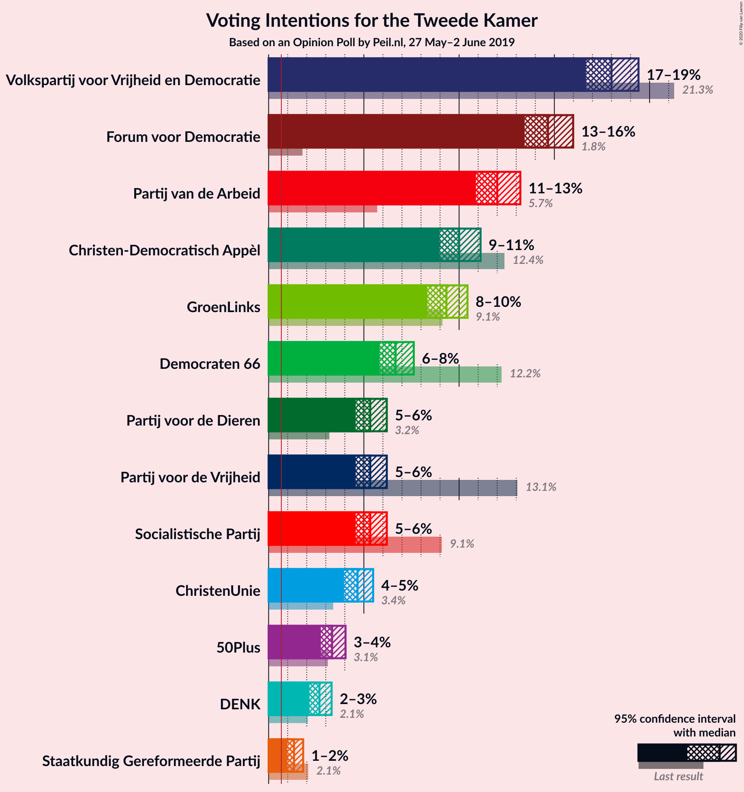

### Confidence Intervals

| Party | Last Result | Poll Result | 80% Confidence Interval | 90% Confidence Interval | 95% Confidence Interval | 99% Confidence Interval |
|:-----:|:-----------:|:-----------:|:-----------------------:|:-----------------------:|:-----------------------:|:-----------------------:|
| Volkspartij voor Vrijheid en Democratie | 21.3% | 18.0% | 17.1–18.9% |16.9–19.2% |16.7–19.4% |16.2–19.9% |
| Forum voor Democratie | 1.8% | 14.7% | 13.9–15.5% |13.6–15.8% |13.4–16.0% |13.1–16.4% |
| Partij van de Arbeid | 5.7% | 12.0% | 11.3–12.8% |11.1–13.0% |10.9–13.2% |10.5–13.6% |
| Christen-Democratisch Appèl | 12.4% | 10.0% | 9.3–10.7% |9.1–10.9% |9.0–11.1% |8.7–11.5% |
| GroenLinks | 9.1% | 9.3% | 8.7–10.1% |8.5–10.3% |8.3–10.4% |8.0–10.8% |
| Democraten 66 | 12.2% | 6.7% | 6.1–7.3% |6.0–7.5% |5.8–7.6% |5.6–7.9% |
| Partij voor de Vrijheid | 13.1% | 5.3% | 4.8–5.9% |4.7–6.1% |4.6–6.2% |4.4–6.5% |
| Socialistische Partij | 9.1% | 5.3% | 4.8–5.9% |4.7–6.1% |4.6–6.2% |4.4–6.5% |
| Partij voor de Dieren | 3.2% | 5.3% | 4.8–5.9% |4.7–6.1% |4.6–6.2% |4.4–6.5% |
| ChristenUnie | 3.4% | 4.7% | 4.2–5.2% |4.1–5.3% |4.0–5.5% |3.7–5.8% |
| 50Plus | 3.1% | 3.3% | 2.9–3.8% |2.8–3.9% |2.7–4.0% |2.6–4.3% |
| DENK | 2.1% | 2.7% | 2.3–3.1% |2.2–3.2% |2.1–3.3% |2.0–3.5% |
| Staatkundig Gereformeerde Partij | 2.1% | 1.3% | 1.1–1.6% |1.0–1.7% |1.0–1.8% |0.9–2.0% |

*Note:* The poll result column reflects the actual value used in the calculations. Published results may vary slightly, and in addition be rounded to fewer digits.

## Seats

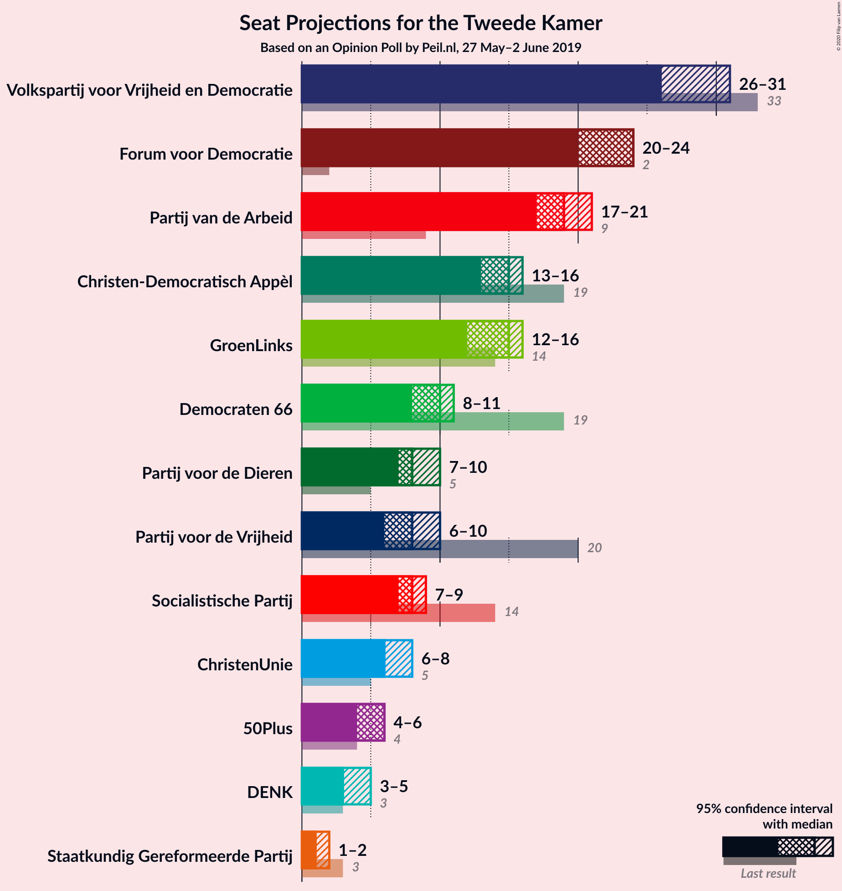

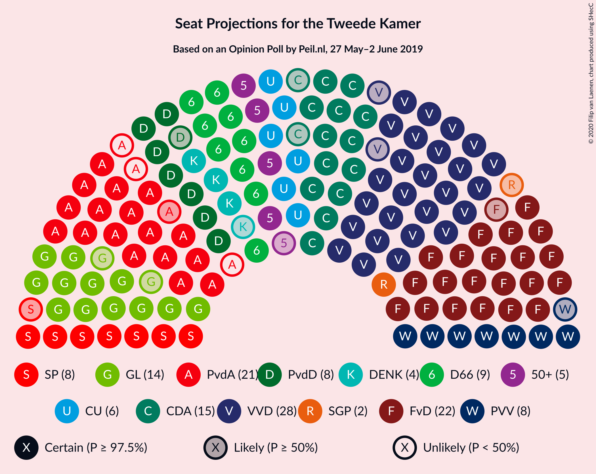

### Confidence Intervals

| Party | Last Result | Median | 80% Confidence Interval | 90% Confidence Interval | 95% Confidence Interval | 99% Confidence Interval |
|:-----:|:-----------:|:------:|:-----------------------:|:-----------------------:|:-----------------------:|:-----------------------:|
| <a href="#volkspartij-voor-vrijheid-en-democratie">Volkspartij voor Vrijheid en Democratie</a> | 33 | 26 | 26–29 |26–29 |26–31 |25–32 |
| <a href="#forum-voor-democratie">Forum voor Democratie</a> | 2 | 24 | 21–24 |20–24 |20–24 |20–25 |
| <a href="#partij-van-de-arbeid">Partij van de Arbeid</a> | 9 | 19 | 18–20 |18–21 |17–21 |16–21 |
| <a href="#christen-democratisch-appèl">Christen-Democratisch Appèl</a> | 19 | 15 | 13–15 |13–16 |13–16 |13–17 |
| <a href="#groenlinks">GroenLinks</a> | 14 | 15 | 13–16 |12–16 |12–16 |12–16 |
| <a href="#democraten-66">Democraten 66</a> | 19 | 10 | 10 |8–11 |8–11 |8–11 |
| <a href="#partij-voor-de-vrijheid">Partij voor de Vrijheid</a> | 20 | 8 | 7–8 |6–8 |6–10 |6–10 |
| <a href="#socialistische-partij">Socialistische Partij</a> | 14 | 8 | 7–8 |7–8 |7–9 |7–9 |
| <a href="#partij-voor-de-dieren">Partij voor de Dieren</a> | 5 | 8 | 8 |7–10 |7–10 |7–10 |
| <a href="#christenunie">ChristenUnie</a> | 5 | 6 | 6–8 |6–8 |6–8 |5–8 |
| <a href="#50plus">50Plus</a> | 4 | 6 | 5–6 |4–6 |4–6 |3–6 |
| <a href="#denk">DENK</a> | 3 | 3 | 3–4 |3–5 |3–5 |3–5 |
| <a href="#staatkundig-gereformeerde-partij">Staatkundig Gereformeerde Partij</a> | 3 | 1 | 1–2 |1–2 |1–2 |1–3 |

### Volkspartij voor Vrijheid en Democratie

*For a full overview of the results for this party, see the [Volkspartij voor Vrijheid en Democratie](party-volkspartijvoorvrijheidendemocratie.html) page.*

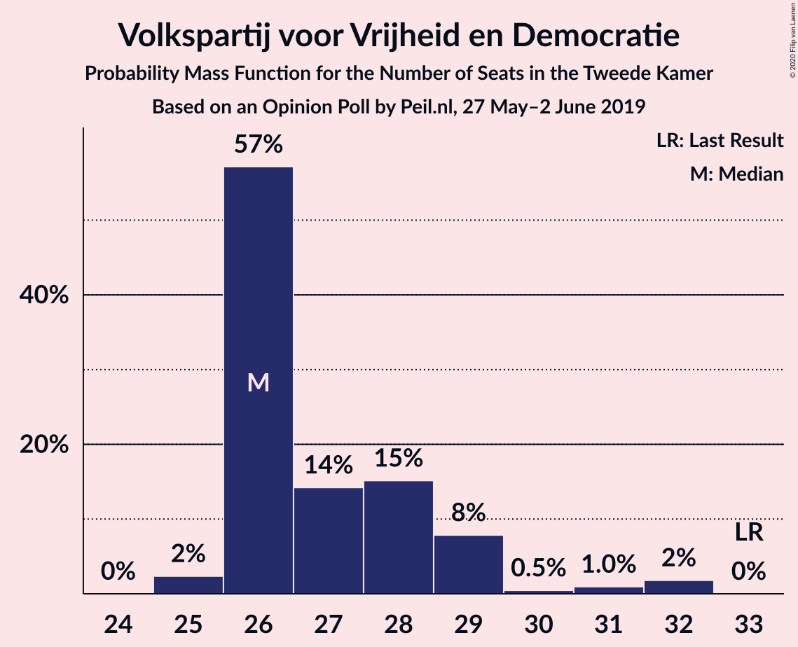

| Number of Seats | Probability | Accumulated | Special Marks |
|:---------------:|:-----------:|:-----------:|:-------------:|
| 25 | 2% | 100% |  |
| 26 | 57% | 98% | Median |
| 27 | 14% | 40% |  |
| 28 | 15% | 26% |  |
| 29 | 8% | 11% |  |
| 30 | 0.5% | 3% |  |
| 31 | 1.0% | 3% |  |
| 32 | 2% | 2% |  |
| 33 | 0% | 0% | Last Result |

### Forum voor Democratie

*For a full overview of the results for this party, see the [Forum voor Democratie](party-forumvoordemocratie.html) page.*

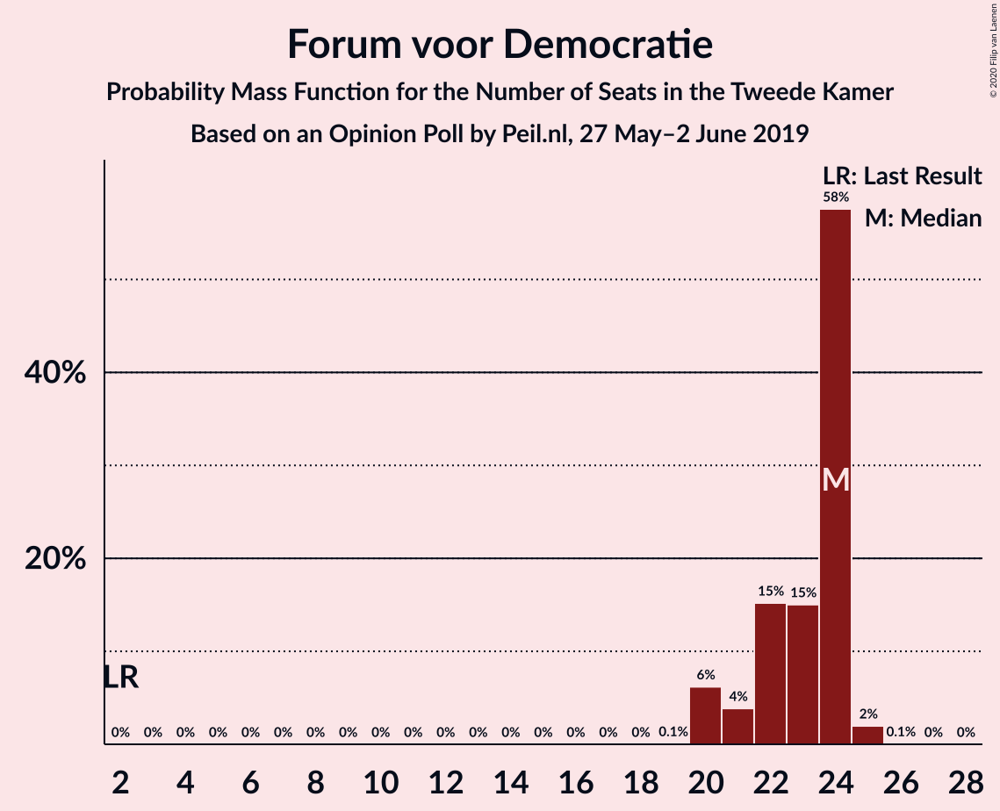

| Number of Seats | Probability | Accumulated | Special Marks |
|:---------------:|:-----------:|:-----------:|:-------------:|
| 2 | 0% | 100% | Last Result |
| 3 | 0% | 100% |  |
| 4 | 0% | 100% |  |
| 5 | 0% | 100% |  |
| 6 | 0% | 100% |  |
| 7 | 0% | 100% |  |
| 8 | 0% | 100% |  |
| 9 | 0% | 100% |  |
| 10 | 0% | 100% |  |
| 11 | 0% | 100% |  |
| 12 | 0% | 100% |  |
| 13 | 0% | 100% |  |
| 14 | 0% | 100% |  |
| 15 | 0% | 100% |  |
| 16 | 0% | 100% |  |
| 17 | 0% | 100% |  |
| 18 | 0% | 100% |  |
| 19 | 0.1% | 100% |  |
| 20 | 6% | 99.9% |  |
| 21 | 4% | 94% |  |
| 22 | 15% | 90% |  |
| 23 | 15% | 75% |  |
| 24 | 58% | 60% | Median |
| 25 | 2% | 2% |  |
| 26 | 0.1% | 0.1% |  |
| 27 | 0% | 0% |  |

### Partij van de Arbeid

*For a full overview of the results for this party, see the [Partij van de Arbeid](party-partijvandearbeid.html) page.*

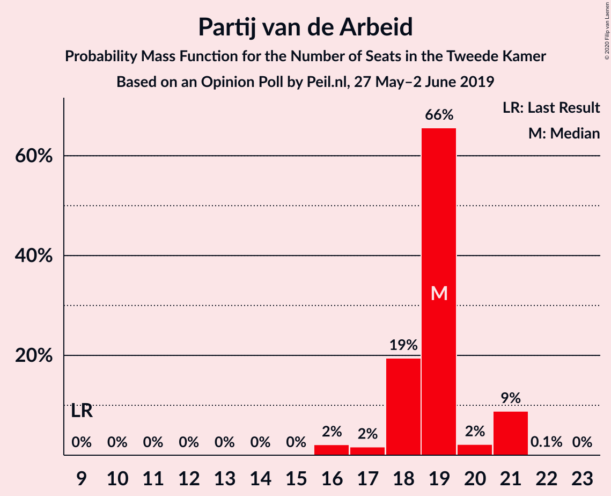

| Number of Seats | Probability | Accumulated | Special Marks |
|:---------------:|:-----------:|:-----------:|:-------------:|
| 9 | 0% | 100% | Last Result |
| 10 | 0% | 100% |  |
| 11 | 0% | 100% |  |
| 12 | 0% | 100% |  |
| 13 | 0% | 100% |  |
| 14 | 0% | 100% |  |
| 15 | 0% | 100% |  |
| 16 | 2% | 100% |  |
| 17 | 2% | 98% |  |
| 18 | 19% | 96% |  |
| 19 | 66% | 77% | Median |
| 20 | 2% | 11% |  |
| 21 | 9% | 9% |  |
| 22 | 0.1% | 0.1% |  |
| 23 | 0% | 0% |  |

### Christen-Democratisch Appèl

*For a full overview of the results for this party, see the [Christen-Democratisch Appèl](party-christen-democratischappèl.html) page.*

| Number of Seats | Probability | Accumulated | Special Marks |
|:---------------:|:-----------:|:-----------:|:-------------:|
| 12 | 0.2% | 100% |  |
| 13 | 11% | 99.8% |  |
| 14 | 0.5% | 88% |  |
| 15 | 79% | 88% | Median |
| 16 | 8% | 9% |  |
| 17 | 0.3% | 0.6% |  |
| 18 | 0.3% | 0.3% |  |
| 19 | 0% | 0% | Last Result |

### GroenLinks

*For a full overview of the results for this party, see the [GroenLinks](party-groenlinks.html) page.*

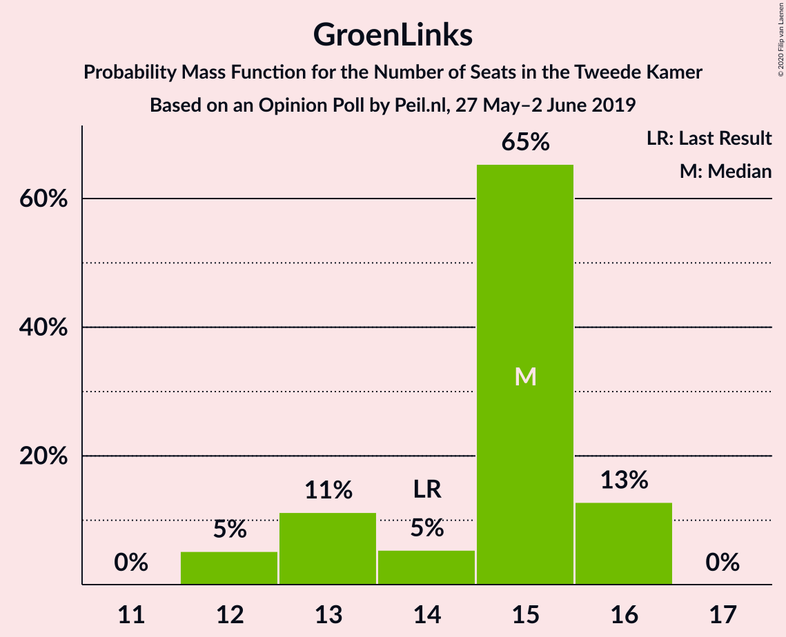

| Number of Seats | Probability | Accumulated | Special Marks |
|:---------------:|:-----------:|:-----------:|:-------------:|
| 12 | 5% | 100% |  |
| 13 | 11% | 95% |  |
| 14 | 5% | 84% | Last Result |
| 15 | 65% | 78% | Median |
| 16 | 13% | 13% |  |
| 17 | 0% | 0% |  |

### Democraten 66

*For a full overview of the results for this party, see the [Democraten 66](party-democraten66.html) page.*

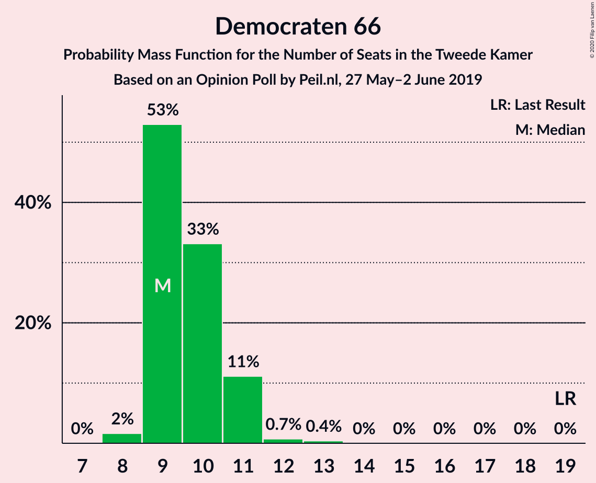

| Number of Seats | Probability | Accumulated | Special Marks |
|:---------------:|:-----------:|:-----------:|:-------------:|
| 8 | 8% | 100% |  |
| 9 | 2% | 92% |  |
| 10 | 84% | 91% | Median |
| 11 | 7% | 7% |  |
| 12 | 0.2% | 0.2% |  |
| 13 | 0% | 0% |  |
| 14 | 0% | 0% |  |
| 15 | 0% | 0% |  |
| 16 | 0% | 0% |  |
| 17 | 0% | 0% |  |
| 18 | 0% | 0% |  |
| 19 | 0% | 0% | Last Result |

### Partij voor de Vrijheid

*For a full overview of the results for this party, see the [Partij voor de Vrijheid](party-partijvoordevrijheid.html) page.*

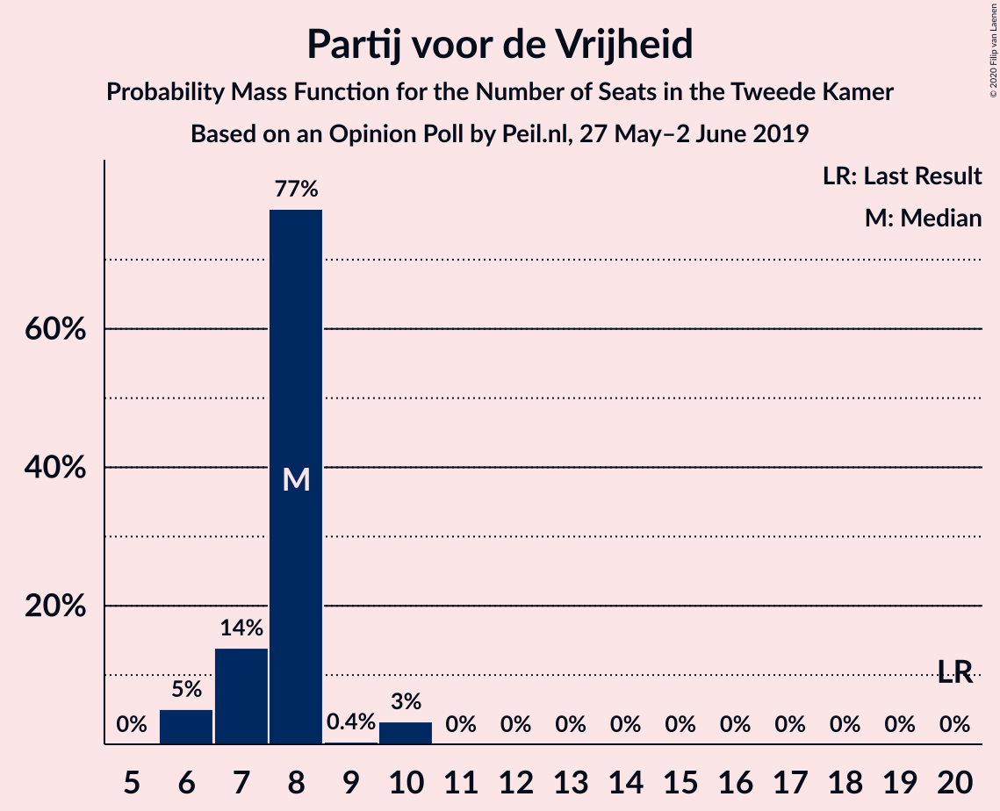

| Number of Seats | Probability | Accumulated | Special Marks |
|:---------------:|:-----------:|:-----------:|:-------------:|
| 6 | 5% | 100% |  |
| 7 | 14% | 95% |  |
| 8 | 77% | 81% | Median |
| 9 | 0.4% | 4% |  |
| 10 | 3% | 3% |  |
| 11 | 0% | 0% |  |
| 12 | 0% | 0% |  |
| 13 | 0% | 0% |  |
| 14 | 0% | 0% |  |
| 15 | 0% | 0% |  |
| 16 | 0% | 0% |  |
| 17 | 0% | 0% |  |
| 18 | 0% | 0% |  |
| 19 | 0% | 0% |  |
| 20 | 0% | 0% | Last Result |

### Socialistische Partij

*For a full overview of the results for this party, see the [Socialistische Partij](party-socialistischepartij.html) page.*

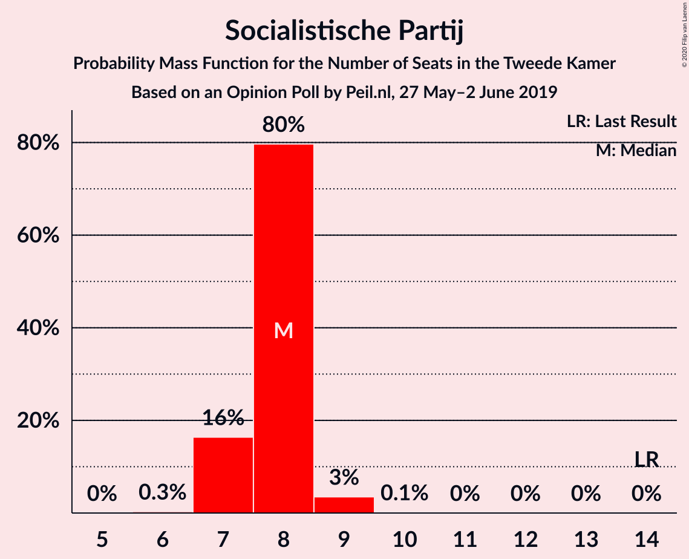

| Number of Seats | Probability | Accumulated | Special Marks |
|:---------------:|:-----------:|:-----------:|:-------------:|
| 6 | 0.3% | 100% |  |
| 7 | 16% | 99.7% |  |
| 8 | 80% | 83% | Median |
| 9 | 3% | 4% |  |
| 10 | 0.1% | 0.1% |  |
| 11 | 0% | 0% |  |
| 12 | 0% | 0% |  |
| 13 | 0% | 0% |  |
| 14 | 0% | 0% | Last Result |

### Partij voor de Dieren

*For a full overview of the results for this party, see the [Partij voor de Dieren](party-partijvoordedieren.html) page.*

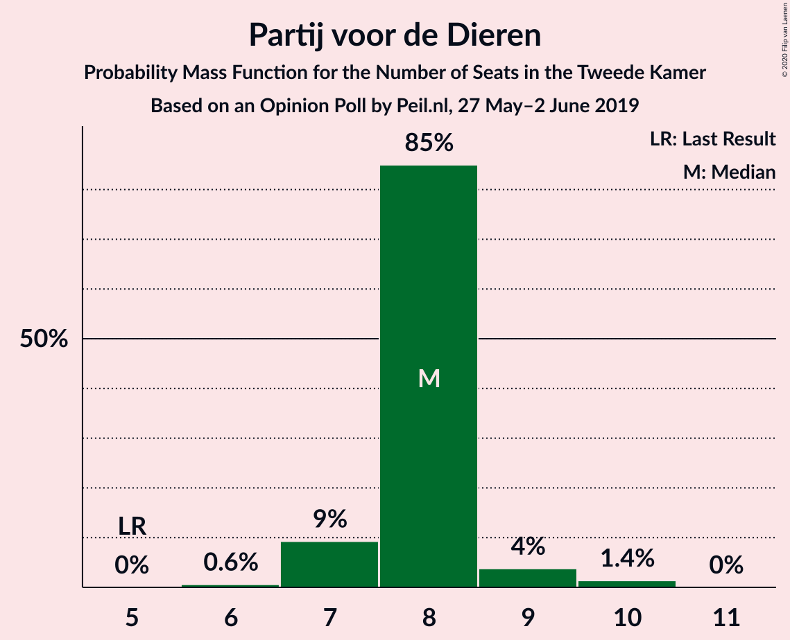

| Number of Seats | Probability | Accumulated | Special Marks |
|:---------------:|:-----------:|:-----------:|:-------------:|
| 5 | 0% | 100% | Last Result |
| 6 | 0.3% | 100% |  |
| 7 | 8% | 99.7% |  |
| 8 | 83% | 92% | Median |
| 9 | 3% | 9% |  |
| 10 | 6% | 6% |  |
| 11 | 0% | 0% |  |

### ChristenUnie

*For a full overview of the results for this party, see the [ChristenUnie](party-christenunie.html) page.*

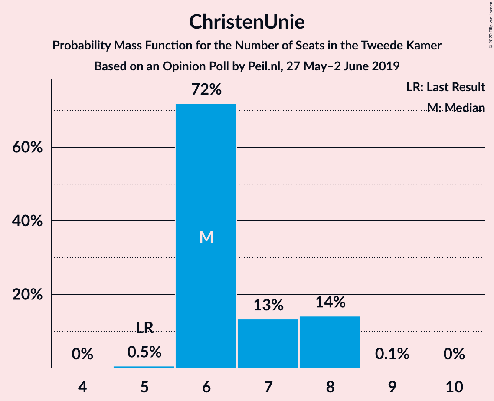

| Number of Seats | Probability | Accumulated | Special Marks |
|:---------------:|:-----------:|:-----------:|:-------------:|
| 5 | 0.5% | 100% | Last Result |
| 6 | 72% | 99.5% | Median |
| 7 | 13% | 28% |  |
| 8 | 14% | 14% |  |
| 9 | 0.1% | 0.1% |  |
| 10 | 0% | 0% |  |

### 50Plus

*For a full overview of the results for this party, see the [50Plus](party-50plus.html) page.*

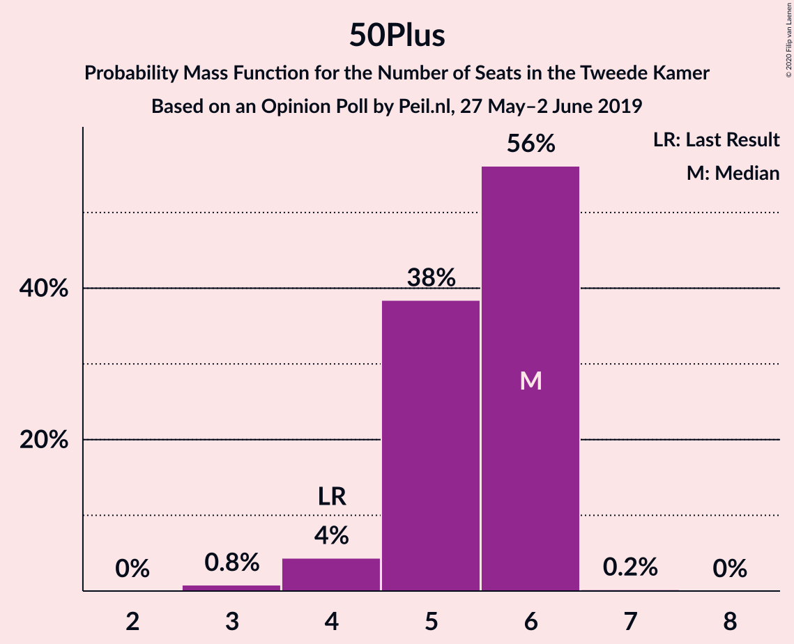

| Number of Seats | Probability | Accumulated | Special Marks |
|:---------------:|:-----------:|:-----------:|:-------------:|
| 3 | 0.8% | 100% |  |
| 4 | 4% | 99.2% | Last Result |
| 5 | 38% | 95% |  |
| 6 | 56% | 56% | Median |
| 7 | 0.2% | 0.2% |  |
| 8 | 0% | 0% |  |

### DENK

*For a full overview of the results for this party, see the [DENK](party-denk.html) page.*

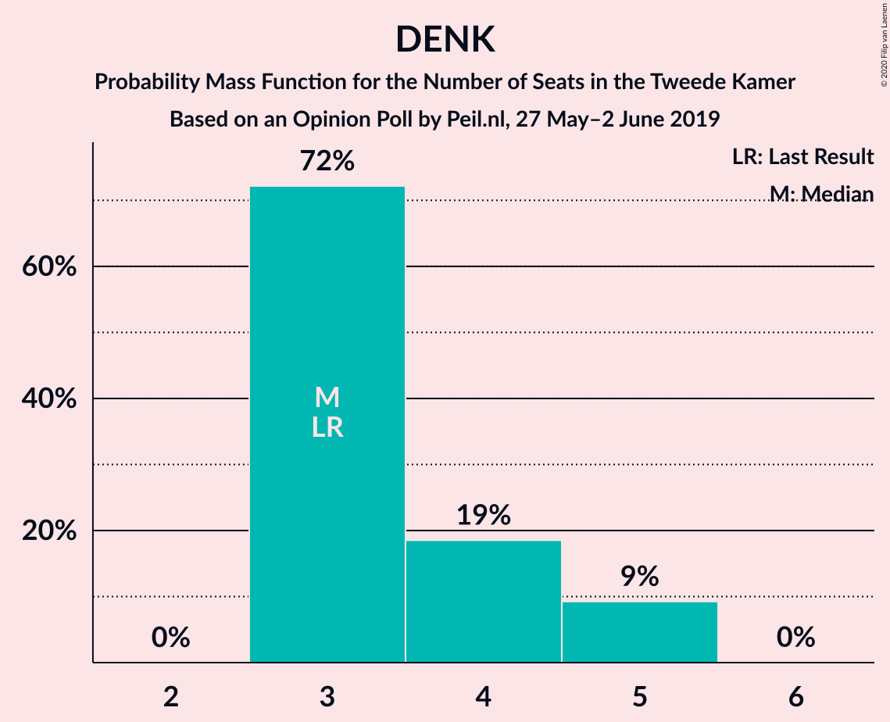

| Number of Seats | Probability | Accumulated | Special Marks |
|:---------------:|:-----------:|:-----------:|:-------------:|
| 3 | 72% | 100% | Last Result, Median |
| 4 | 19% | 28% |  |
| 5 | 9% | 9% |  |
| 6 | 0% | 0% |  |

### Staatkundig Gereformeerde Partij

*For a full overview of the results for this party, see the [Staatkundig Gereformeerde Partij](party-staatkundiggereformeerdepartij.html) page.*

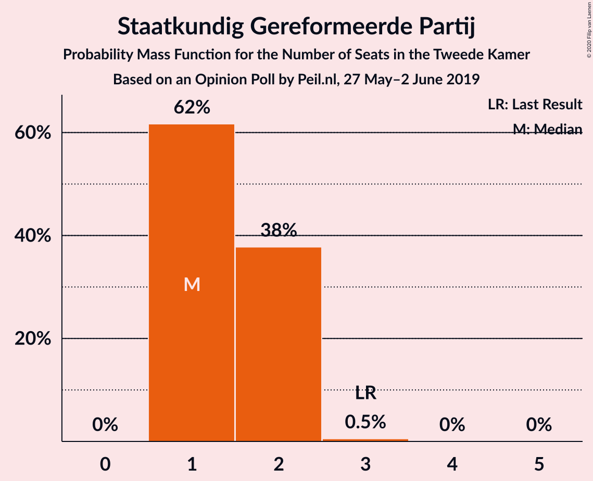

| Number of Seats | Probability | Accumulated | Special Marks |
|:---------------:|:-----------:|:-----------:|:-------------:|
| 1 | 62% | 100% | Median |
| 2 | 38% | 38% |  |
| 3 | 0.5% | 0.5% | Last Result |
| 4 | 0% | 0% |  |

## Coalitions

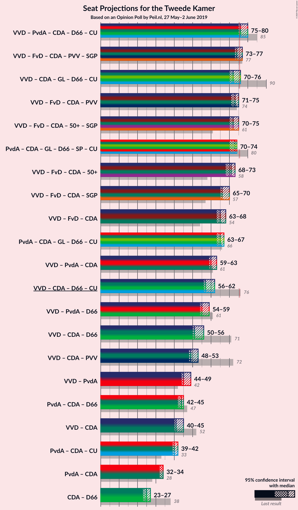

### Confidence Intervals

| Coalition | Last Result | Median | Majority? | 80% Confidence Interval | 90% Confidence Interval | 95% Confidence Interval | 99% Confidence Interval |
|:---------:|:-----------:|:------:|:---------:|:-----------------------:|:-----------------------:|:-----------------------:|:-----------------------:|
| Volkspartij voor Vrijheid en Democratie – Partij van de Arbeid – Christen-Democratisch Appèl – Democraten 66 – ChristenUnie | 85 | 76 | 97% | 76–79 | 76–80 | 75–80 | 73–81 |
| Volkspartij voor Vrijheid en Democratie – Forum voor Democratie – Christen-Democratisch Appèl – Partij voor de Vrijheid – Staatkundig Gereformeerde Partij | 77 | 74 | 10% | 73–75 | 73–76 | 73–77 | 72–77 |
| Volkspartij voor Vrijheid en Democratie – Christen-Democratisch Appèl – GroenLinks – Democraten 66 – ChristenUnie | 90 | 72 | 17% | 70–76 | 70–76 | 70–76 | 70–79 |
| Volkspartij voor Vrijheid en Democratie – Forum voor Democratie – Christen-Democratisch Appèl – Partij voor de Vrijheid | 74 | 73 | 2% | 71–74 | 71–74 | 71–75 | 71–76 |
| Volkspartij voor Vrijheid en Democratie – Forum voor Democratie – Christen-Democratisch Appèl – 50Plus – Staatkundig Gereformeerde Partij | 61 | 72 | 0.3% | 71–72 | 70–75 | 70–75 | 69–75 |
| Partij van de Arbeid – Christen-Democratisch Appèl – GroenLinks – Democraten 66 – Socialistische Partij – ChristenUnie | 80 | 73 | 0.2% | 71–74 | 71–74 | 70–74 | 70–75 |
| Volkspartij voor Vrijheid en Democratie – Forum voor Democratie – Christen-Democratisch Appèl – 50Plus | 58 | 71 | 0% | 69–71 | 68–73 | 68–73 | 67–73 |
| Volkspartij voor Vrijheid en Democratie – Forum voor Democratie – Christen-Democratisch Appèl – Staatkundig Gereformeerde Partij | 57 | 66 | 0% | 66–68 | 65–70 | 65–70 | 65–70 |
| Volkspartij voor Vrijheid en Democratie – Forum voor Democratie – Christen-Democratisch Appèl | 54 | 65 | 0% | 64–66 | 63–68 | 63–68 | 63–69 |
| Partij van de Arbeid – Christen-Democratisch Appèl – GroenLinks – Democraten 66 – ChristenUnie | 66 | 65 | 0% | 63–67 | 63–67 | 63–67 | 62–68 |
| Volkspartij voor Vrijheid en Democratie – Partij van de Arbeid – Christen-Democratisch Appèl | 61 | 60 | 0% | 60–62 | 60–63 | 59–63 | 58–64 |
| Volkspartij voor Vrijheid en Democratie – Christen-Democratisch Appèl – Democraten 66 – ChristenUnie | 76 | 57 | 0% | 57–60 | 57–62 | 56–62 | 56–65 |
| Volkspartij voor Vrijheid en Democratie – Partij van de Arbeid – Democraten 66 | 61 | 55 | 0% | 55–59 | 55–59 | 54–59 | 51–60 |
| Volkspartij voor Vrijheid en Democratie – Christen-Democratisch Appèl – Democraten 66 | 71 | 51 | 0% | 51–53 | 51–56 | 50–56 | 49–58 |
| Volkspartij voor Vrijheid en Democratie – Christen-Democratisch Appèl – Partij voor de Vrijheid | 72 | 49 | 0% | 49–51 | 48–51 | 48–53 | 48–55 |
| Volkspartij voor Vrijheid en Democratie – Partij van de Arbeid | 42 | 45 | 0% | 45–49 | 45–49 | 44–49 | 43–50 |
| Partij van de Arbeid – Christen-Democratisch Appèl – Democraten 66 | 47 | 44 | 0% | 42–44 | 42–45 | 42–45 | 40–46 |
| Volkspartij voor Vrijheid en Democratie – Christen-Democratisch Appèl | 52 | 41 | 0% | 41–43 | 41–45 | 40–45 | 40–48 |
| Partij van de Arbeid – Christen-Democratisch Appèl – ChristenUnie | 33 | 40 | 0% | 40–41 | 39–41 | 39–42 | 38–43 |
| Partij van de Arbeid – Christen-Democratisch Appèl | 28 | 34 | 0% | 33–34 | 33–34 | 32–34 | 32–36 |
| Christen-Democratisch Appèl – Democraten 66 | 38 | 25 | 0% | 23–25 | 23–27 | 23–27 | 23–27 |

### Volkspartij voor Vrijheid en Democratie – Partij van de Arbeid – Christen-Democratisch Appèl – Democraten 66 – ChristenUnie

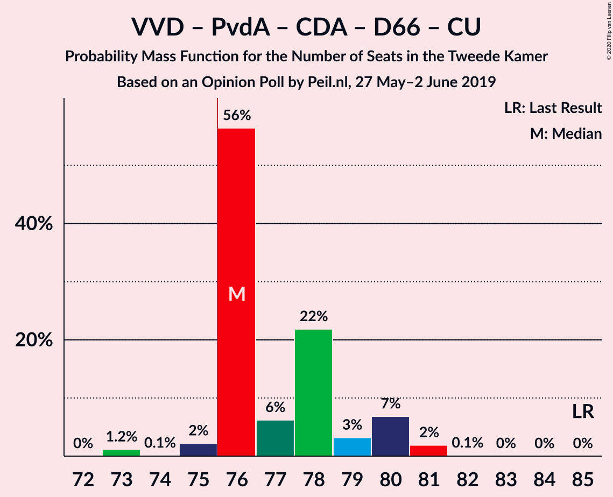

| Number of Seats | Probability | Accumulated | Special Marks |
|:---------------:|:-----------:|:-----------:|:-------------:|
| 73 | 1.2% | 100% |  |
| 74 | 0.1% | 98.8% |  |
| 75 | 2% | 98.7% |  |
| 76 | 56% | 97% | Median, Majority |
| 77 | 6% | 40% |  |
| 78 | 22% | 34% |  |
| 79 | 3% | 12% |  |
| 80 | 7% | 9% |  |
| 81 | 2% | 2% |  |
| 82 | 0.1% | 0.1% |  |
| 83 | 0% | 0% |  |
| 84 | 0% | 0% |  |
| 85 | 0% | 0% | Last Result |

### Volkspartij voor Vrijheid en Democratie – Forum voor Democratie – Christen-Democratisch Appèl – Partij voor de Vrijheid – Staatkundig Gereformeerde Partij

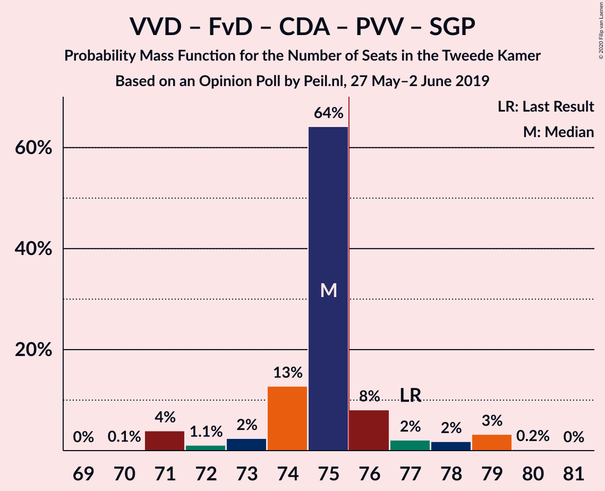

| Number of Seats | Probability | Accumulated | Special Marks |
|:---------------:|:-----------:|:-----------:|:-------------:|
| 69 | 0.1% | 100% |  |
| 70 | 0% | 99.9% |  |
| 71 | 0.2% | 99.9% |  |
| 72 | 0.2% | 99.6% |  |
| 73 | 15% | 99.4% |  |
| 74 | 70% | 85% | Median |
| 75 | 5% | 15% |  |
| 76 | 7% | 10% | Majority |
| 77 | 2% | 3% | Last Result |
| 78 | 0.1% | 0.3% |  |
| 79 | 0.2% | 0.2% |  |
| 80 | 0% | 0% |  |

### Volkspartij voor Vrijheid en Democratie – Christen-Democratisch Appèl – GroenLinks – Democraten 66 – ChristenUnie

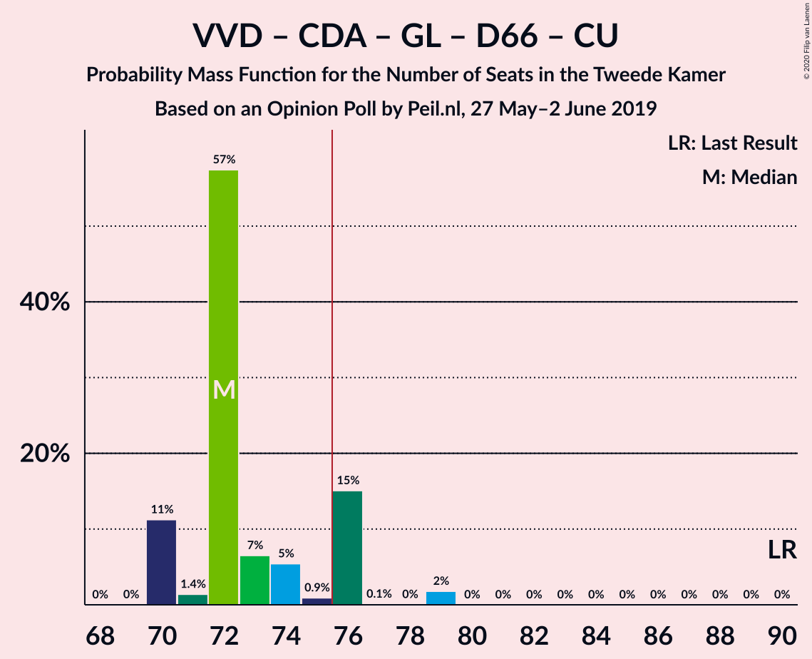

| Number of Seats | Probability | Accumulated | Special Marks |
|:---------------:|:-----------:|:-----------:|:-------------:|
| 70 | 11% | 100% |  |
| 71 | 1.4% | 89% |  |
| 72 | 57% | 87% | Median |
| 73 | 7% | 30% |  |
| 74 | 5% | 23% |  |
| 75 | 0.9% | 18% |  |
| 76 | 15% | 17% | Majority |
| 77 | 0.1% | 2% |  |
| 78 | 0% | 2% |  |
| 79 | 2% | 2% |  |
| 80 | 0% | 0% |  |
| 81 | 0% | 0% |  |
| 82 | 0% | 0% |  |
| 83 | 0% | 0% |  |
| 84 | 0% | 0% |  |
| 85 | 0% | 0% |  |
| 86 | 0% | 0% |  |
| 87 | 0% | 0% |  |
| 88 | 0% | 0% |  |
| 89 | 0% | 0% |  |
| 90 | 0% | 0% | Last Result |

### Volkspartij voor Vrijheid en Democratie – Forum voor Democratie – Christen-Democratisch Appèl – Partij voor de Vrijheid

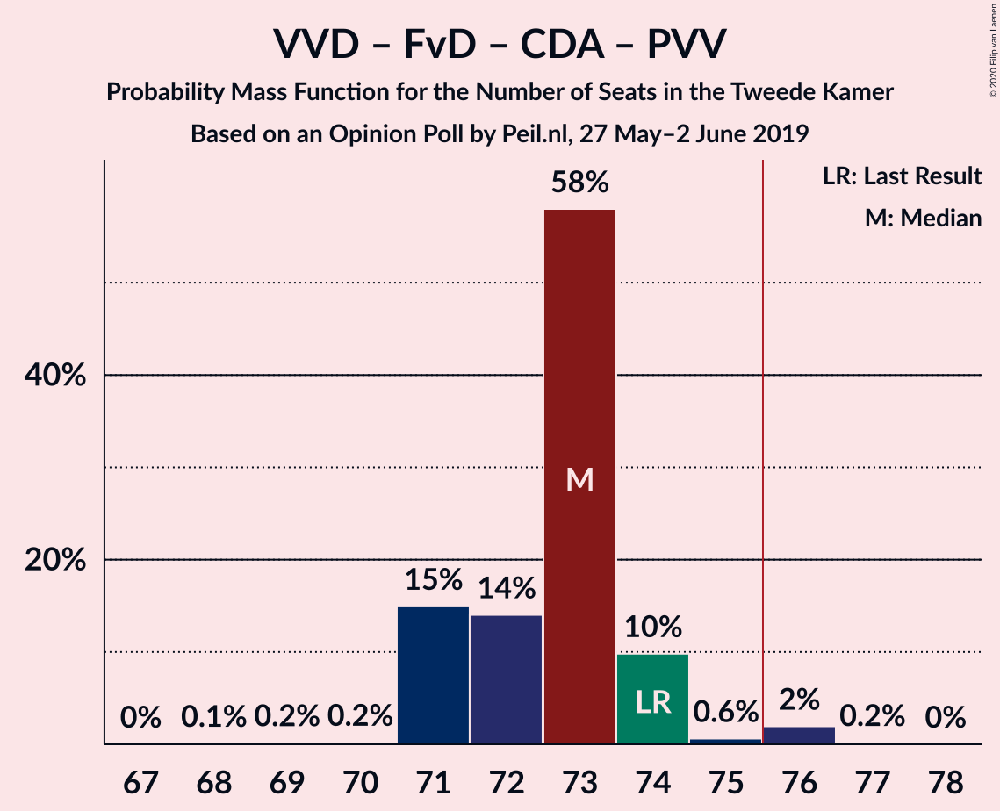

| Number of Seats | Probability | Accumulated | Special Marks |
|:---------------:|:-----------:|:-----------:|:-------------:|
| 68 | 0.1% | 100% |  |
| 69 | 0.2% | 99.9% |  |
| 70 | 0.2% | 99.7% |  |
| 71 | 15% | 99.5% |  |
| 72 | 14% | 85% |  |
| 73 | 58% | 71% | Median |
| 74 | 10% | 13% | Last Result |
| 75 | 0.6% | 3% |  |
| 76 | 2% | 2% | Majority |
| 77 | 0.2% | 0.2% |  |
| 78 | 0% | 0% |  |

### Volkspartij voor Vrijheid en Democratie – Forum voor Democratie – Christen-Democratisch Appèl – 50Plus – Staatkundig Gereformeerde Partij

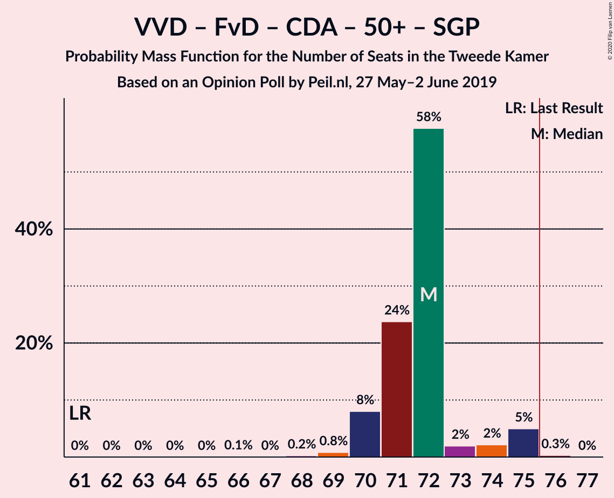

| Number of Seats | Probability | Accumulated | Special Marks |
|:---------------:|:-----------:|:-----------:|:-------------:|
| 61 | 0% | 100% | Last Result |
| 62 | 0% | 100% |  |
| 63 | 0% | 100% |  |
| 64 | 0% | 100% |  |
| 65 | 0% | 100% |  |
| 66 | 0.1% | 100% |  |
| 67 | 0% | 99.9% |  |
| 68 | 0.2% | 99.9% |  |
| 69 | 0.8% | 99.6% |  |
| 70 | 8% | 98.8% |  |
| 71 | 24% | 91% |  |
| 72 | 58% | 67% | Median |
| 73 | 2% | 9% |  |
| 74 | 2% | 7% |  |
| 75 | 5% | 5% |  |
| 76 | 0.3% | 0.3% | Majority |
| 77 | 0% | 0% |  |

### Partij van de Arbeid – Christen-Democratisch Appèl – GroenLinks – Democraten 66 – Socialistische Partij – ChristenUnie

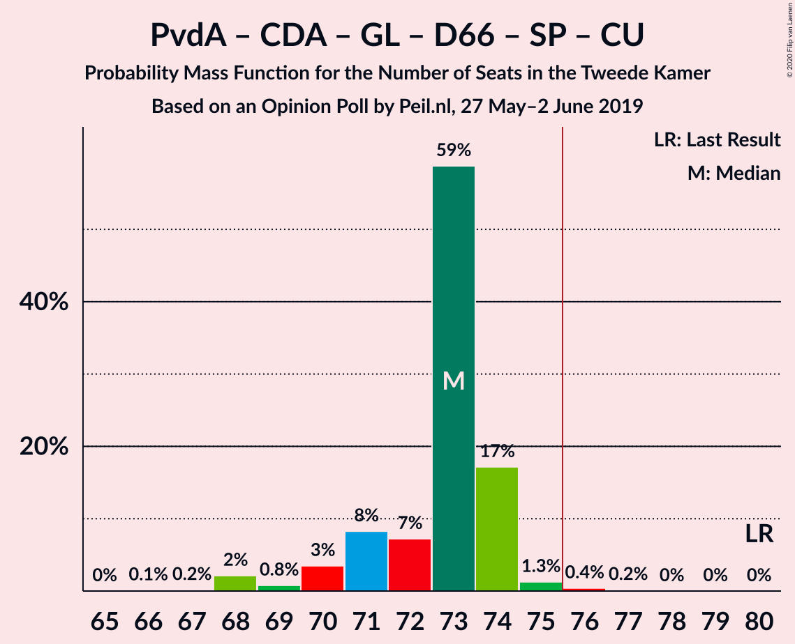

| Number of Seats | Probability | Accumulated | Special Marks |
|:---------------:|:-----------:|:-----------:|:-------------:|
| 68 | 0.2% | 100% |  |
| 69 | 0.2% | 99.8% |  |
| 70 | 3% | 99.5% |  |
| 71 | 14% | 97% |  |
| 72 | 12% | 82% |  |
| 73 | 56% | 70% | Median |
| 74 | 14% | 15% |  |
| 75 | 0.8% | 1.0% |  |
| 76 | 0.2% | 0.2% | Majority |
| 77 | 0% | 0% |  |
| 78 | 0% | 0% |  |
| 79 | 0% | 0% |  |
| 80 | 0% | 0% | Last Result |

### Volkspartij voor Vrijheid en Democratie – Forum voor Democratie – Christen-Democratisch Appèl – 50Plus

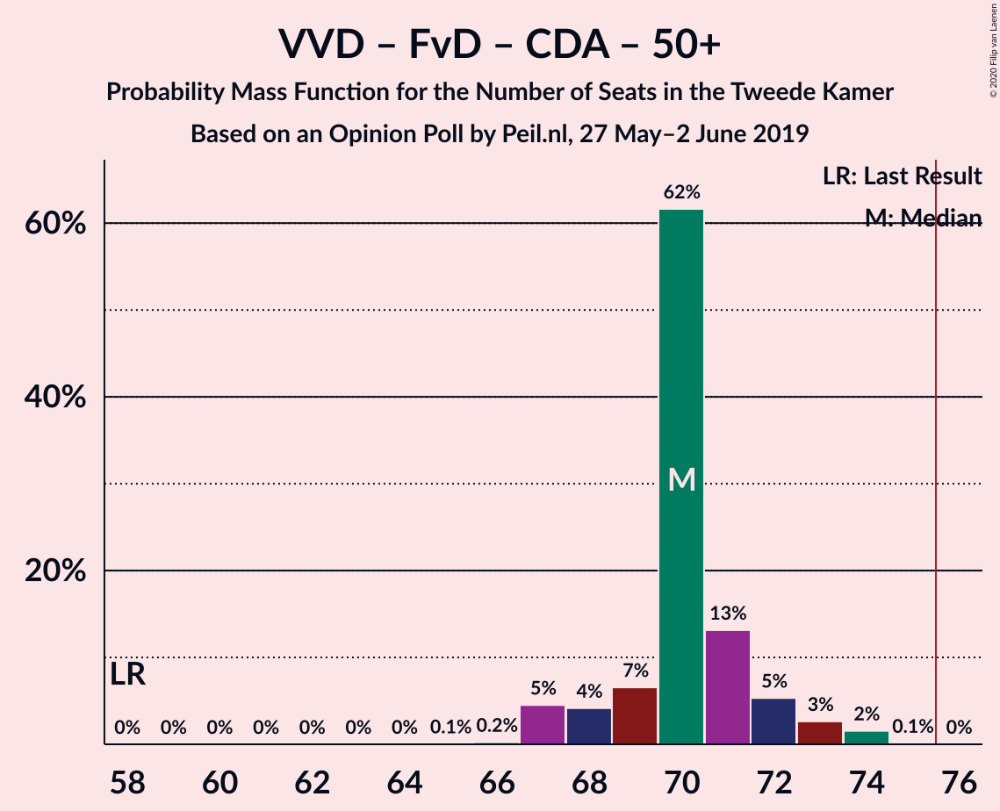

| Number of Seats | Probability | Accumulated | Special Marks |
|:---------------:|:-----------:|:-----------:|:-------------:|
| 58 | 0% | 100% | Last Result |
| 59 | 0% | 100% |  |
| 60 | 0% | 100% |  |
| 61 | 0% | 100% |  |
| 62 | 0% | 100% |  |
| 63 | 0% | 100% |  |
| 64 | 0% | 100% |  |
| 65 | 0.1% | 100% |  |
| 66 | 0.1% | 99.9% |  |
| 67 | 0.9% | 99.8% |  |
| 68 | 7% | 98.9% |  |
| 69 | 25% | 92% |  |
| 70 | 0.6% | 67% |  |
| 71 | 57% | 66% | Median |
| 72 | 2% | 9% |  |
| 73 | 7% | 7% |  |
| 74 | 0.3% | 0.3% |  |
| 75 | 0% | 0% |  |

### Volkspartij voor Vrijheid en Democratie – Forum voor Democratie – Christen-Democratisch Appèl – Staatkundig Gereformeerde Partij

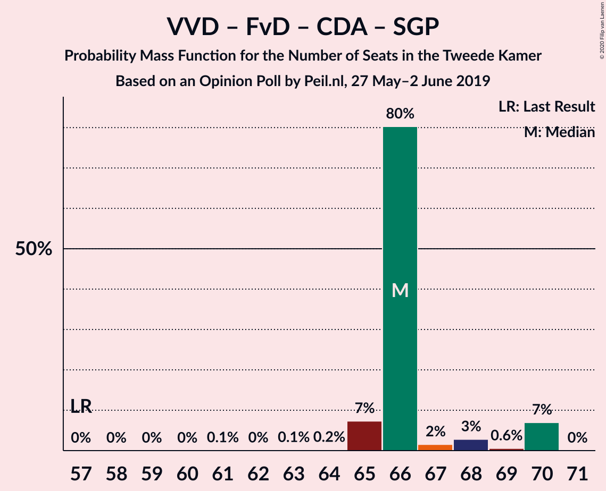

| Number of Seats | Probability | Accumulated | Special Marks |
|:---------------:|:-----------:|:-----------:|:-------------:|
| 57 | 0% | 100% | Last Result |
| 58 | 0% | 100% |  |
| 59 | 0% | 100% |  |
| 60 | 0% | 100% |  |
| 61 | 0.1% | 100% |  |
| 62 | 0% | 99.9% |  |
| 63 | 0.1% | 99.9% |  |
| 64 | 0.2% | 99.7% |  |
| 65 | 7% | 99.5% |  |
| 66 | 80% | 92% | Median |
| 67 | 2% | 12% |  |
| 68 | 3% | 10% |  |
| 69 | 0.6% | 8% |  |
| 70 | 7% | 7% |  |
| 71 | 0% | 0% |  |

### Volkspartij voor Vrijheid en Democratie – Forum voor Democratie – Christen-Democratisch Appèl

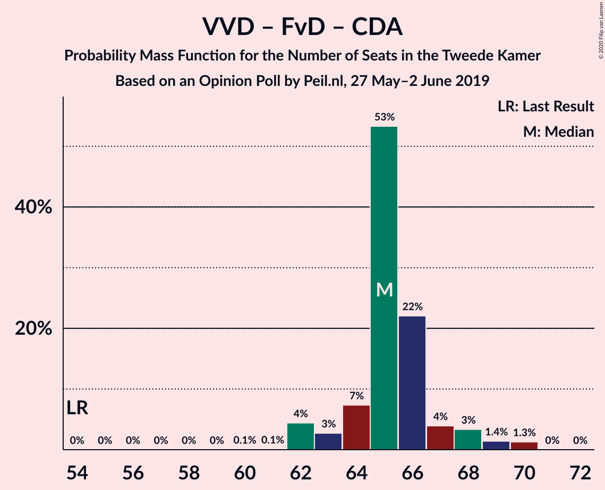

| Number of Seats | Probability | Accumulated | Special Marks |
|:---------------:|:-----------:|:-----------:|:-------------:|
| 54 | 0% | 100% | Last Result |
| 55 | 0% | 100% |  |
| 56 | 0% | 100% |  |
| 57 | 0% | 100% |  |
| 58 | 0% | 100% |  |
| 59 | 0% | 100% |  |
| 60 | 0.1% | 100% |  |
| 61 | 0.1% | 99.9% |  |
| 62 | 0.1% | 99.8% |  |
| 63 | 7% | 99.7% |  |
| 64 | 24% | 92% |  |
| 65 | 57% | 68% | Median |
| 66 | 2% | 11% |  |
| 67 | 2% | 9% |  |
| 68 | 5% | 7% |  |
| 69 | 2% | 2% |  |
| 70 | 0% | 0% |  |

### Partij van de Arbeid – Christen-Democratisch Appèl – GroenLinks – Democraten 66 – ChristenUnie

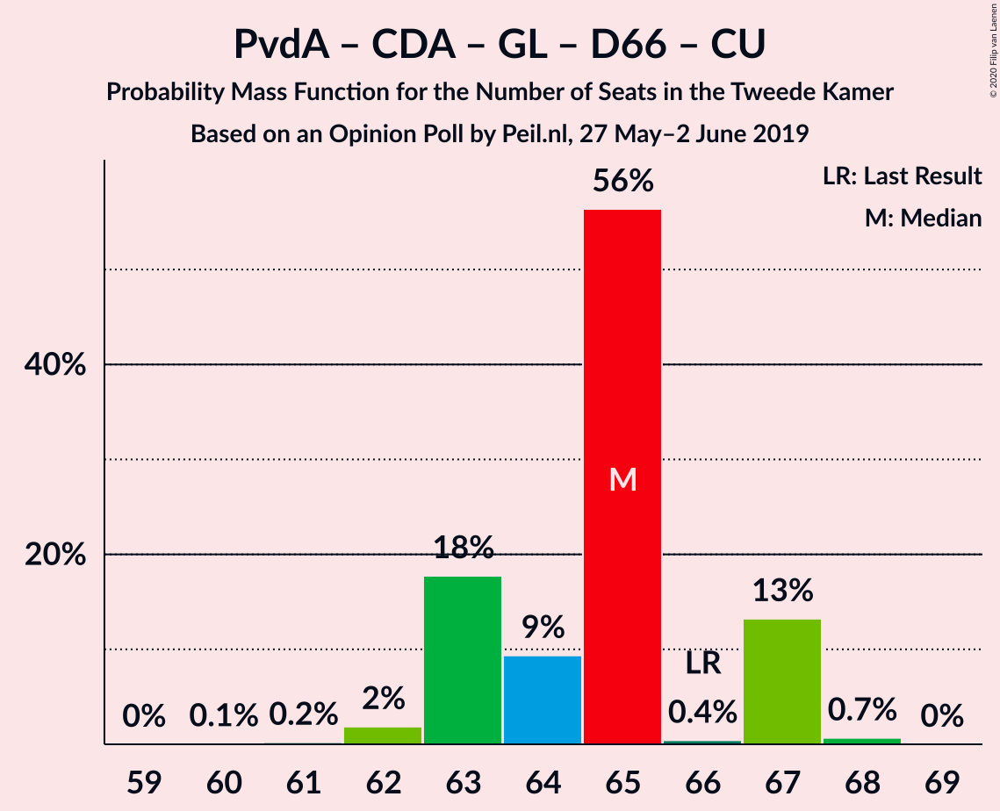

| Number of Seats | Probability | Accumulated | Special Marks |
|:---------------:|:-----------:|:-----------:|:-------------:|
| 60 | 0.1% | 100% |  |
| 61 | 0.2% | 99.9% |  |
| 62 | 2% | 99.7% |  |
| 63 | 18% | 98% |  |
| 64 | 9% | 80% |  |
| 65 | 56% | 71% | Median |
| 66 | 0.4% | 14% | Last Result |
| 67 | 13% | 14% |  |
| 68 | 0.7% | 0.7% |  |
| 69 | 0% | 0% |  |

### Volkspartij voor Vrijheid en Democratie – Partij van de Arbeid – Christen-Democratisch Appèl

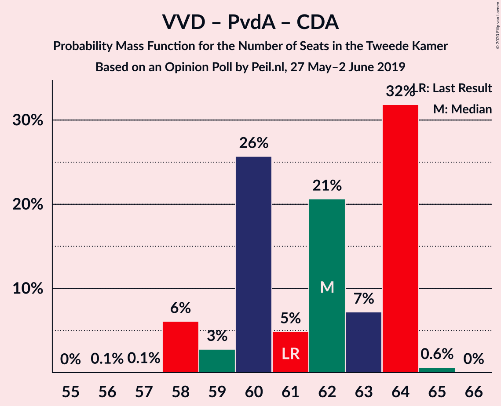

| Number of Seats | Probability | Accumulated | Special Marks |
|:---------------:|:-----------:|:-----------:|:-------------:|
| 56 | 0.1% | 100% |  |
| 57 | 0% | 99.9% |  |
| 58 | 1.3% | 99.9% |  |
| 59 | 2% | 98.6% |  |
| 60 | 69% | 96% | Median |
| 61 | 1.1% | 27% | Last Result |
| 62 | 17% | 26% |  |
| 63 | 8% | 10% |  |
| 64 | 2% | 2% |  |
| 65 | 0% | 0.1% |  |
| 66 | 0.1% | 0.1% |  |
| 67 | 0% | 0% |  |

### Volkspartij voor Vrijheid en Democratie – Christen-Democratisch Appèl – Democraten 66 – ChristenUnie

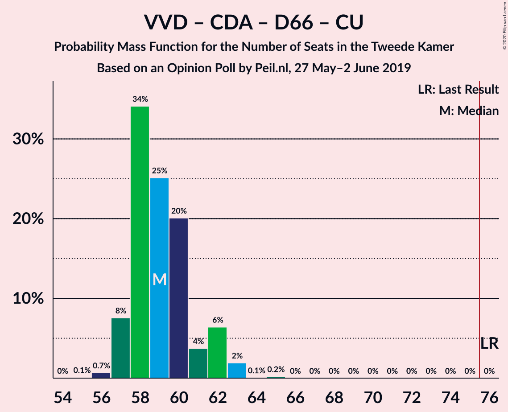

| Number of Seats | Probability | Accumulated | Special Marks |
|:---------------:|:-----------:|:-----------:|:-------------:|
| 56 | 3% | 100% |  |
| 57 | 65% | 97% | Median |
| 58 | 7% | 32% |  |
| 59 | 2% | 26% |  |
| 60 | 13% | 23% |  |
| 61 | 3% | 10% |  |
| 62 | 5% | 7% |  |
| 63 | 0.1% | 2% |  |
| 64 | 0% | 2% |  |
| 65 | 2% | 2% |  |
| 66 | 0% | 0% |  |
| 67 | 0% | 0% |  |
| 68 | 0% | 0% |  |
| 69 | 0% | 0% |  |
| 70 | 0% | 0% |  |
| 71 | 0% | 0% |  |
| 72 | 0% | 0% |  |
| 73 | 0% | 0% |  |
| 74 | 0% | 0% |  |
| 75 | 0% | 0% |  |
| 76 | 0% | 0% | Last Result, Majority |

### Volkspartij voor Vrijheid en Democratie – Partij van de Arbeid – Democraten 66

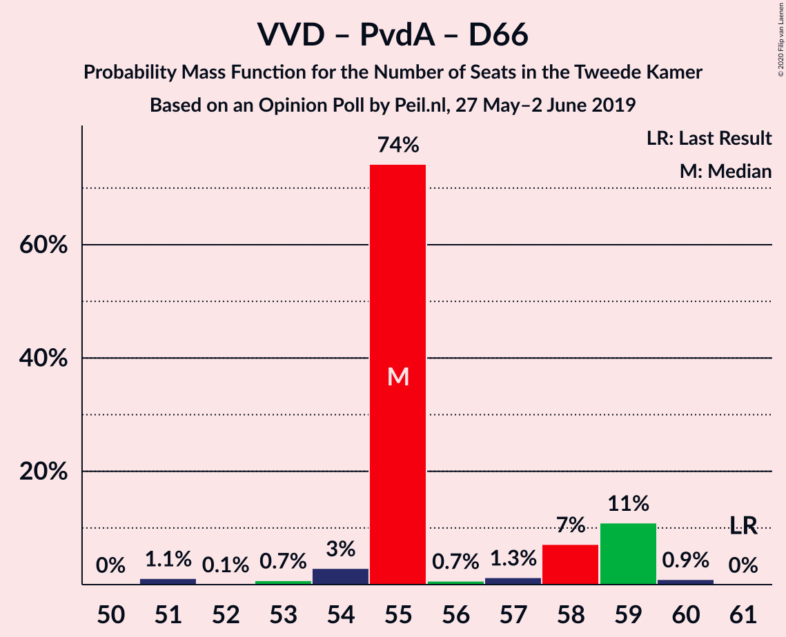

| Number of Seats | Probability | Accumulated | Special Marks |
|:---------------:|:-----------:|:-----------:|:-------------:|
| 51 | 1.1% | 100% |  |
| 52 | 0.1% | 98.9% |  |
| 53 | 0.7% | 98.8% |  |
| 54 | 3% | 98% |  |
| 55 | 74% | 95% | Median |
| 56 | 0.7% | 21% |  |
| 57 | 1.3% | 20% |  |
| 58 | 7% | 19% |  |
| 59 | 11% | 12% |  |
| 60 | 0.9% | 0.9% |  |
| 61 | 0% | 0% | Last Result |

### Volkspartij voor Vrijheid en Democratie – Christen-Democratisch Appèl – Democraten 66

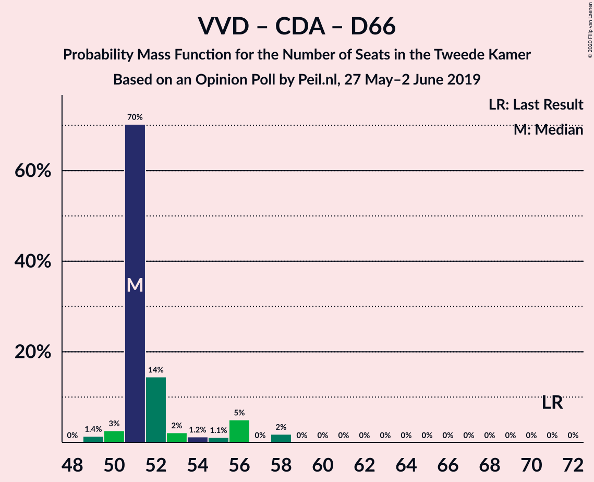

| Number of Seats | Probability | Accumulated | Special Marks |
|:---------------:|:-----------:|:-----------:|:-------------:|
| 49 | 1.4% | 100% |  |
| 50 | 3% | 98.6% |  |
| 51 | 70% | 96% | Median |
| 52 | 14% | 26% |  |
| 53 | 2% | 11% |  |
| 54 | 1.2% | 9% |  |
| 55 | 1.1% | 8% |  |
| 56 | 5% | 7% |  |
| 57 | 0% | 2% |  |
| 58 | 2% | 2% |  |
| 59 | 0% | 0% |  |
| 60 | 0% | 0% |  |
| 61 | 0% | 0% |  |
| 62 | 0% | 0% |  |
| 63 | 0% | 0% |  |
| 64 | 0% | 0% |  |
| 65 | 0% | 0% |  |
| 66 | 0% | 0% |  |
| 67 | 0% | 0% |  |
| 68 | 0% | 0% |  |
| 69 | 0% | 0% |  |
| 70 | 0% | 0% |  |
| 71 | 0% | 0% | Last Result |

### Volkspartij voor Vrijheid en Democratie – Christen-Democratisch Appèl – Partij voor de Vrijheid

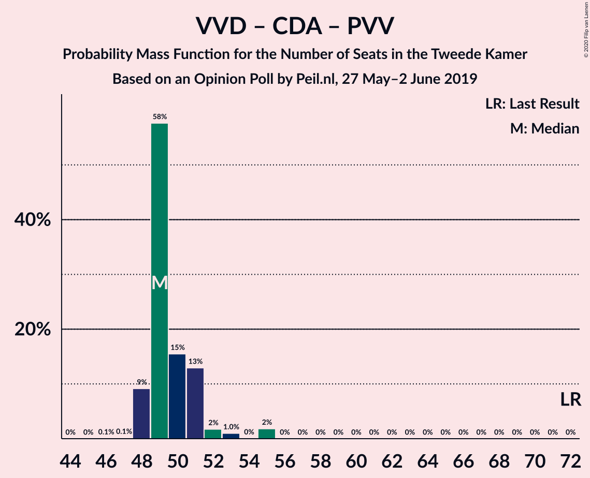

| Number of Seats | Probability | Accumulated | Special Marks |
|:---------------:|:-----------:|:-----------:|:-------------:|
| 46 | 0.1% | 100% |  |
| 47 | 0.1% | 99.9% |  |
| 48 | 9% | 99.8% |  |
| 49 | 58% | 91% | Median |
| 50 | 15% | 33% |  |
| 51 | 13% | 18% |  |
| 52 | 2% | 5% |  |
| 53 | 1.0% | 3% |  |
| 54 | 0% | 2% |  |
| 55 | 2% | 2% |  |
| 56 | 0% | 0% |  |
| 57 | 0% | 0% |  |
| 58 | 0% | 0% |  |
| 59 | 0% | 0% |  |
| 60 | 0% | 0% |  |
| 61 | 0% | 0% |  |
| 62 | 0% | 0% |  |
| 63 | 0% | 0% |  |
| 64 | 0% | 0% |  |
| 65 | 0% | 0% |  |
| 66 | 0% | 0% |  |
| 67 | 0% | 0% |  |
| 68 | 0% | 0% |  |
| 69 | 0% | 0% |  |
| 70 | 0% | 0% |  |
| 71 | 0% | 0% |  |
| 72 | 0% | 0% | Last Result |

### Volkspartij voor Vrijheid en Democratie – Partij van de Arbeid

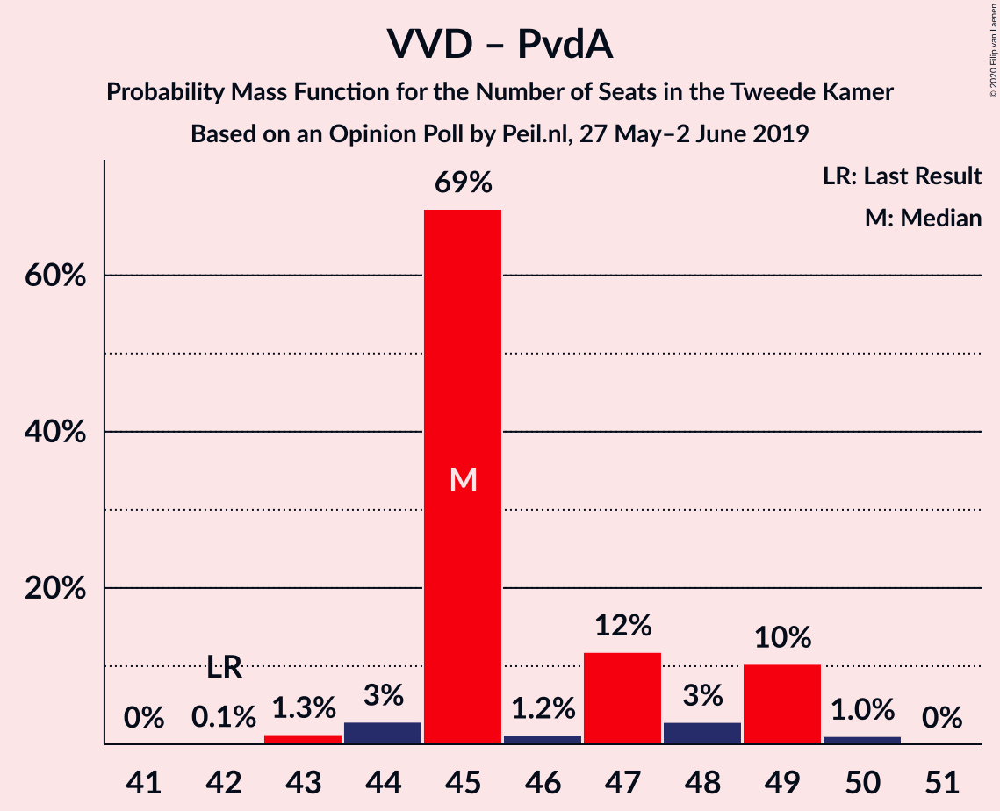

| Number of Seats | Probability | Accumulated | Special Marks |
|:---------------:|:-----------:|:-----------:|:-------------:|
| 42 | 0.1% | 100% | Last Result |
| 43 | 1.3% | 99.9% |  |
| 44 | 3% | 98.6% |  |
| 45 | 69% | 96% | Median |
| 46 | 1.2% | 27% |  |
| 47 | 12% | 26% |  |
| 48 | 3% | 14% |  |
| 49 | 10% | 11% |  |
| 50 | 1.0% | 1.0% |  |
| 51 | 0% | 0% |  |

### Partij van de Arbeid – Christen-Democratisch Appèl – Democraten 66

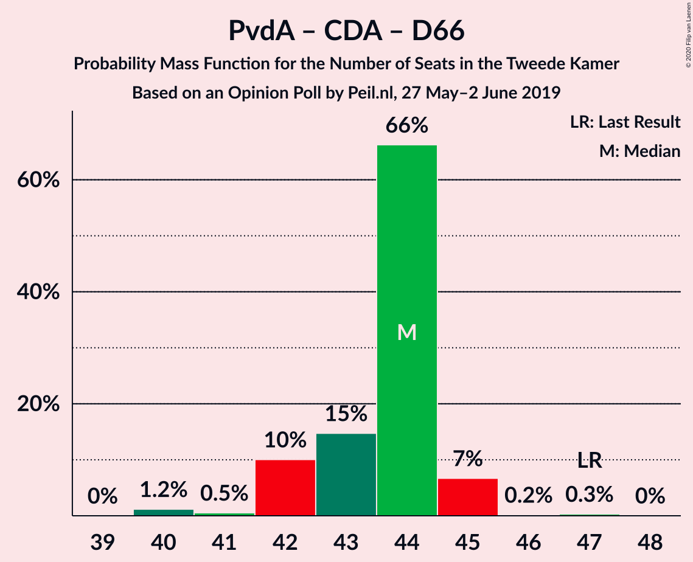

| Number of Seats | Probability | Accumulated | Special Marks |
|:---------------:|:-----------:|:-----------:|:-------------:|
| 40 | 1.2% | 100% |  |
| 41 | 0.5% | 98.8% |  |
| 42 | 10% | 98% |  |
| 43 | 15% | 88% |  |
| 44 | 66% | 73% | Median |
| 45 | 7% | 7% |  |
| 46 | 0.2% | 0.5% |  |
| 47 | 0.3% | 0.4% | Last Result |
| 48 | 0% | 0% |  |

### Volkspartij voor Vrijheid en Democratie – Christen-Democratisch Appèl

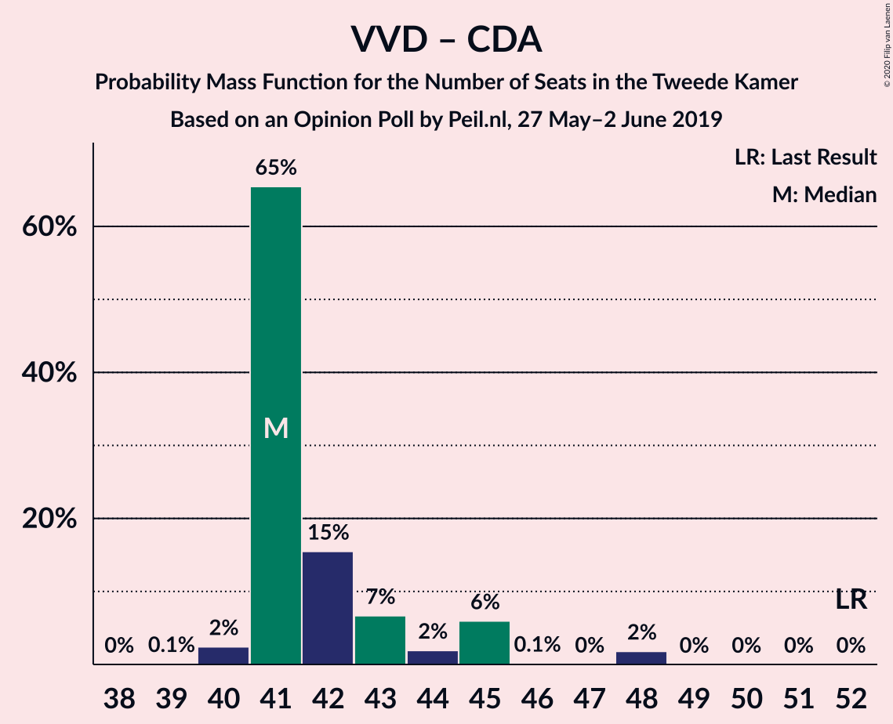

| Number of Seats | Probability | Accumulated | Special Marks |
|:---------------:|:-----------:|:-----------:|:-------------:|
| 39 | 0.1% | 100% |  |
| 40 | 2% | 99.9% |  |
| 41 | 65% | 97% | Median |
| 42 | 15% | 32% |  |
| 43 | 7% | 17% |  |
| 44 | 2% | 10% |  |
| 45 | 6% | 8% |  |
| 46 | 0.1% | 2% |  |
| 47 | 0% | 2% |  |
| 48 | 2% | 2% |  |
| 49 | 0% | 0% |  |
| 50 | 0% | 0% |  |
| 51 | 0% | 0% |  |
| 52 | 0% | 0% | Last Result |

### Partij van de Arbeid – Christen-Democratisch Appèl – ChristenUnie

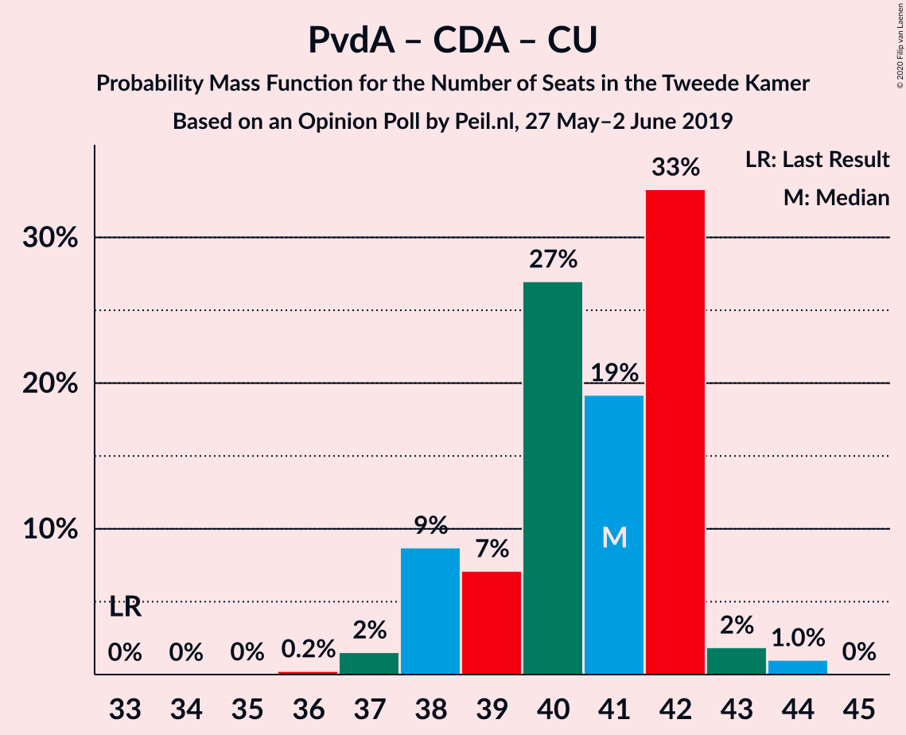

| Number of Seats | Probability | Accumulated | Special Marks |
|:---------------:|:-----------:|:-----------:|:-------------:|
| 33 | 0% | 100% | Last Result |
| 34 | 0% | 100% |  |
| 35 | 0% | 100% |  |
| 36 | 0% | 100% |  |
| 37 | 0.3% | 100% |  |
| 38 | 0.3% | 99.7% |  |
| 39 | 5% | 99.4% |  |
| 40 | 73% | 94% | Median |
| 41 | 19% | 21% |  |
| 42 | 2% | 3% |  |
| 43 | 0.7% | 0.8% |  |
| 44 | 0.1% | 0.1% |  |
| 45 | 0% | 0% |  |

### Partij van de Arbeid – Christen-Democratisch Appèl

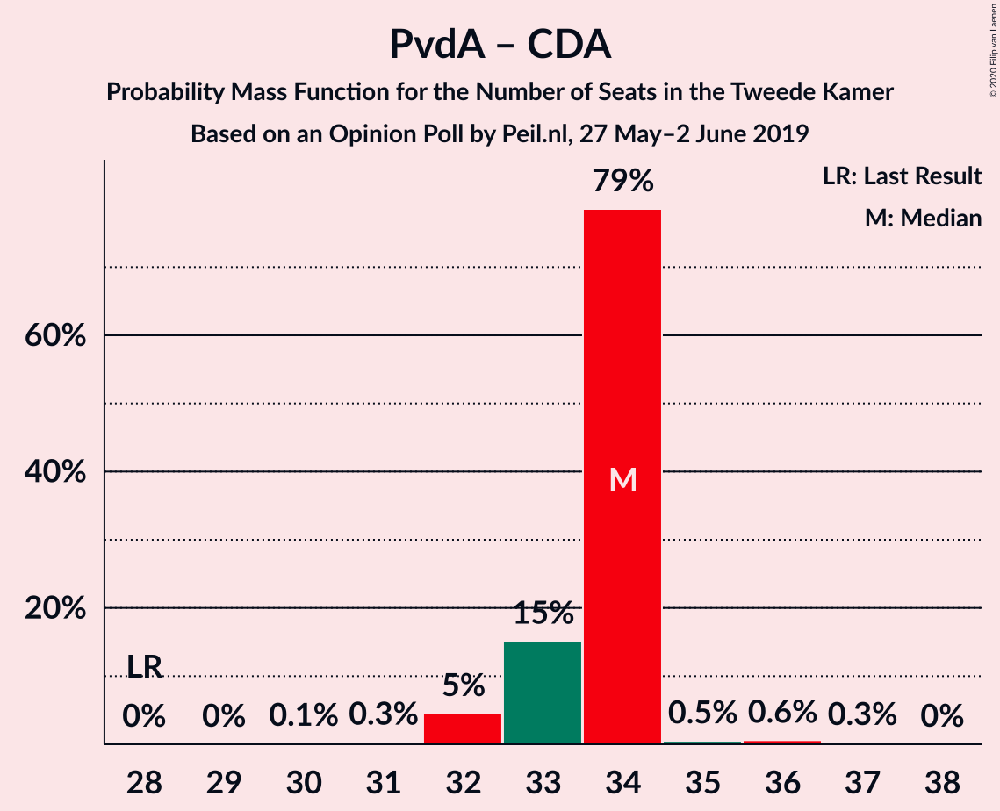

| Number of Seats | Probability | Accumulated | Special Marks |
|:---------------:|:-----------:|:-----------:|:-------------:|
| 28 | 0% | 100% | Last Result |
| 29 | 0% | 100% |  |
| 30 | 0.1% | 100% |  |
| 31 | 0.3% | 99.9% |  |
| 32 | 5% | 99.5% |  |
| 33 | 15% | 95% |  |
| 34 | 79% | 80% | Median |
| 35 | 0.5% | 1.4% |  |
| 36 | 0.6% | 0.9% |  |
| 37 | 0.3% | 0.3% |  |
| 38 | 0% | 0% |  |

### Christen-Democratisch Appèl – Democraten 66

| Number of Seats | Probability | Accumulated | Special Marks |
|:---------------:|:-----------:|:-----------:|:-------------:|
| 21 | 0.2% | 100% |  |
| 22 | 0.1% | 99.8% |  |
| 23 | 18% | 99.7% |  |
| 24 | 1.4% | 81% |  |
| 25 | 71% | 80% | Median |
| 26 | 3% | 9% |  |
| 27 | 6% | 6% |  |
| 28 | 0.1% | 0.2% |  |
| 29 | 0% | 0% |  |
| 30 | 0% | 0% |  |
| 31 | 0% | 0% |  |
| 32 | 0% | 0% |  |
| 33 | 0% | 0% |  |
| 34 | 0% | 0% |  |
| 35 | 0% | 0% |  |
| 36 | 0% | 0% |  |
| 37 | 0% | 0% |  |
| 38 | 0% | 0% | Last Result |

## Technical Information

### Opinion Poll

+ **Polling firm:** Peil.nl
+ **Commissioner(s):** —
+ **Fieldwork period:** 27 May–2 June 2019

### Calculations

+ **Sample size:** 3000
+ **Simulations done:** 131,072
+ **Error estimate:** 1.55%

