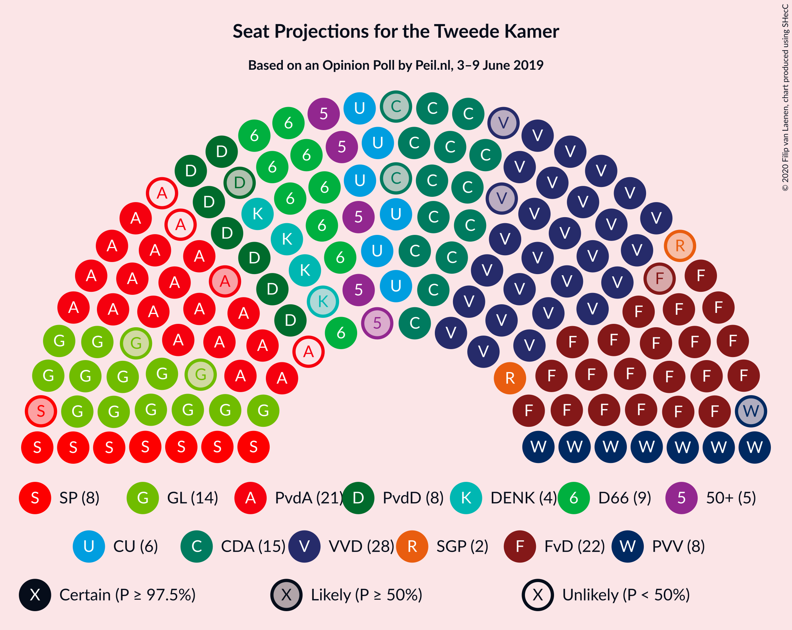
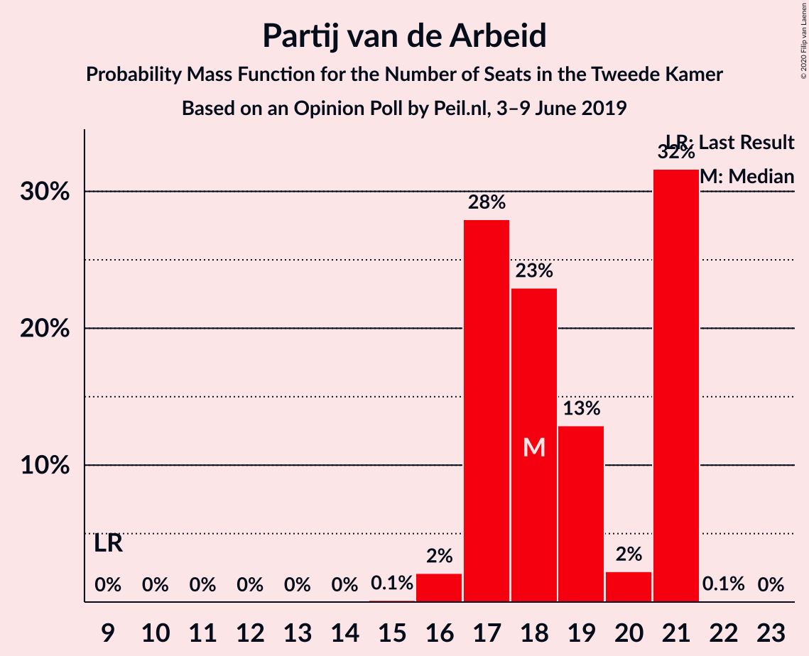
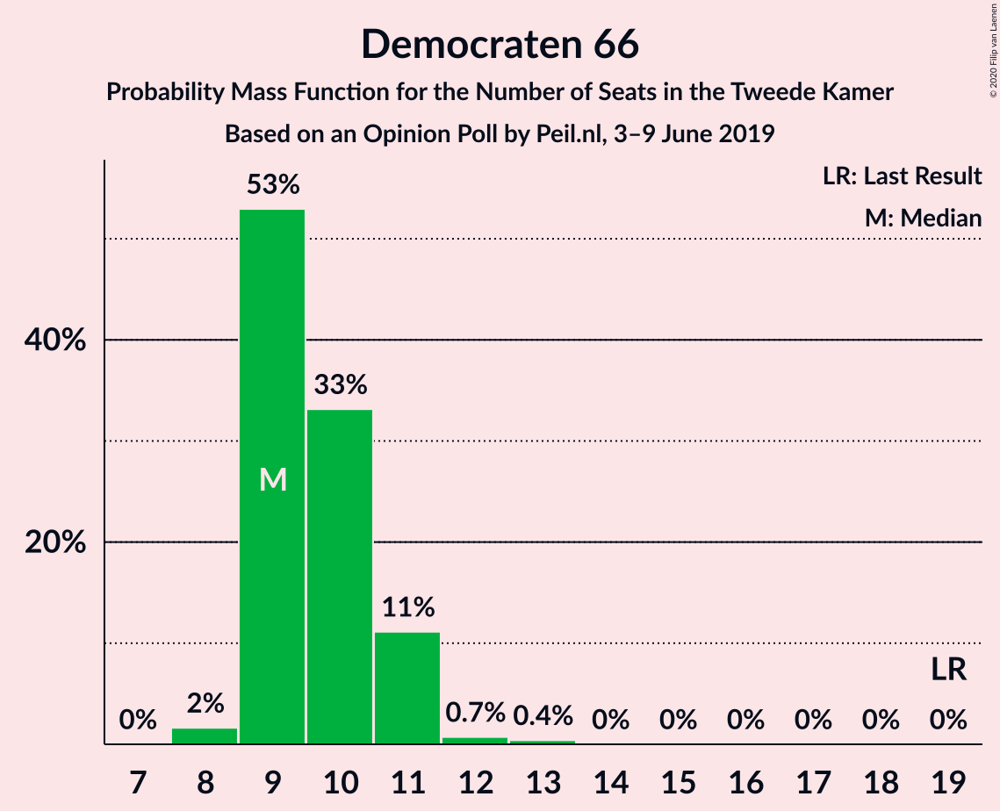
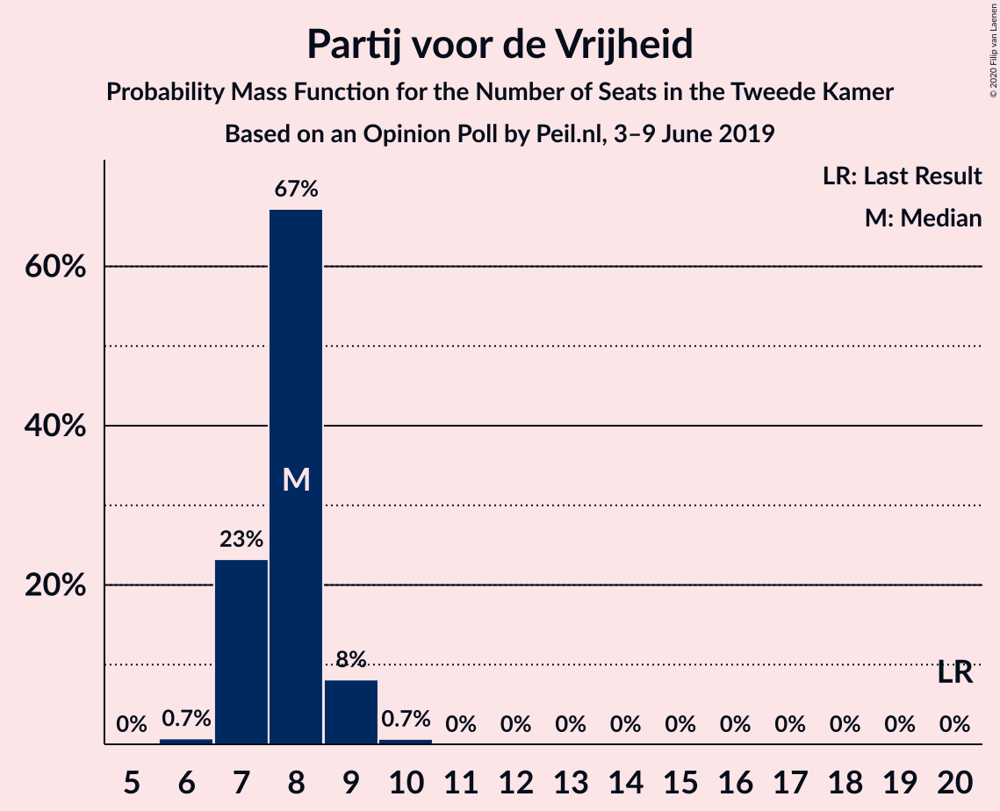
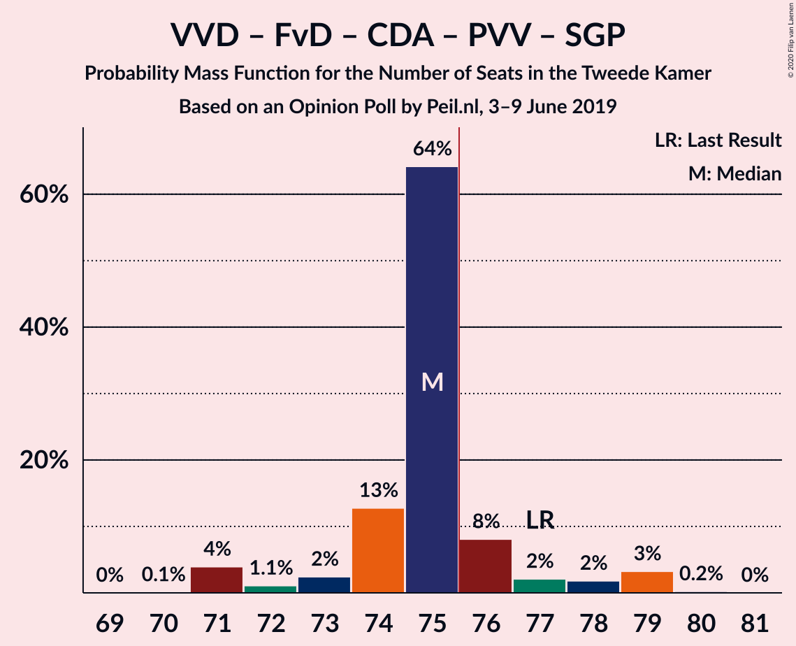
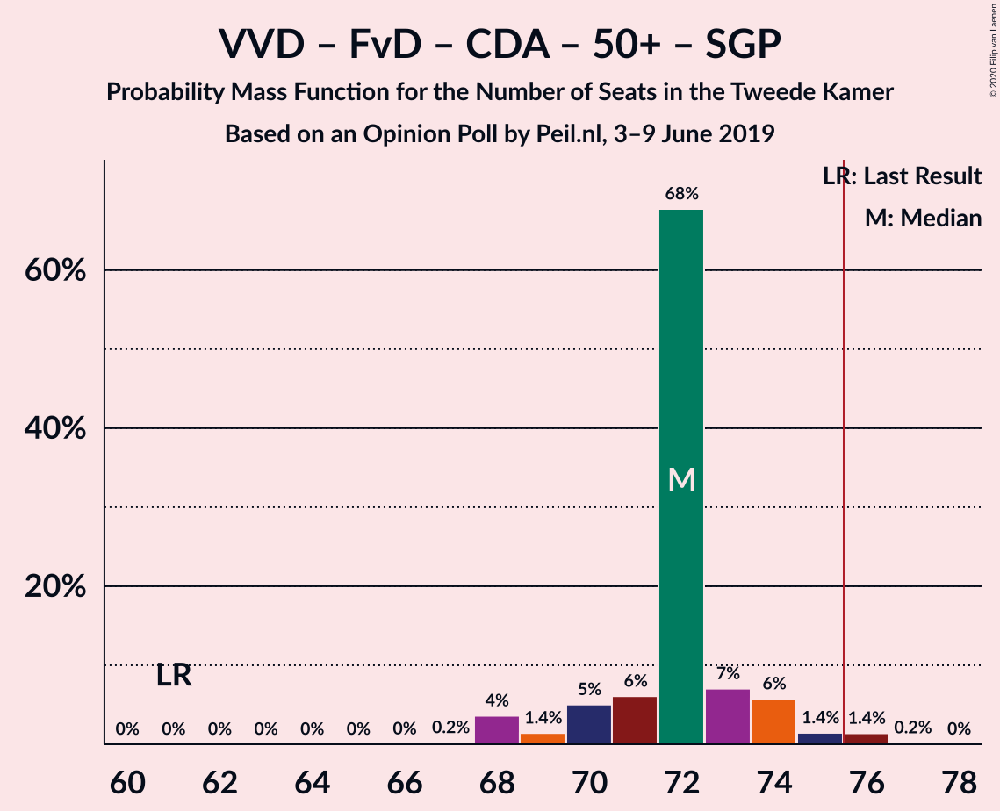
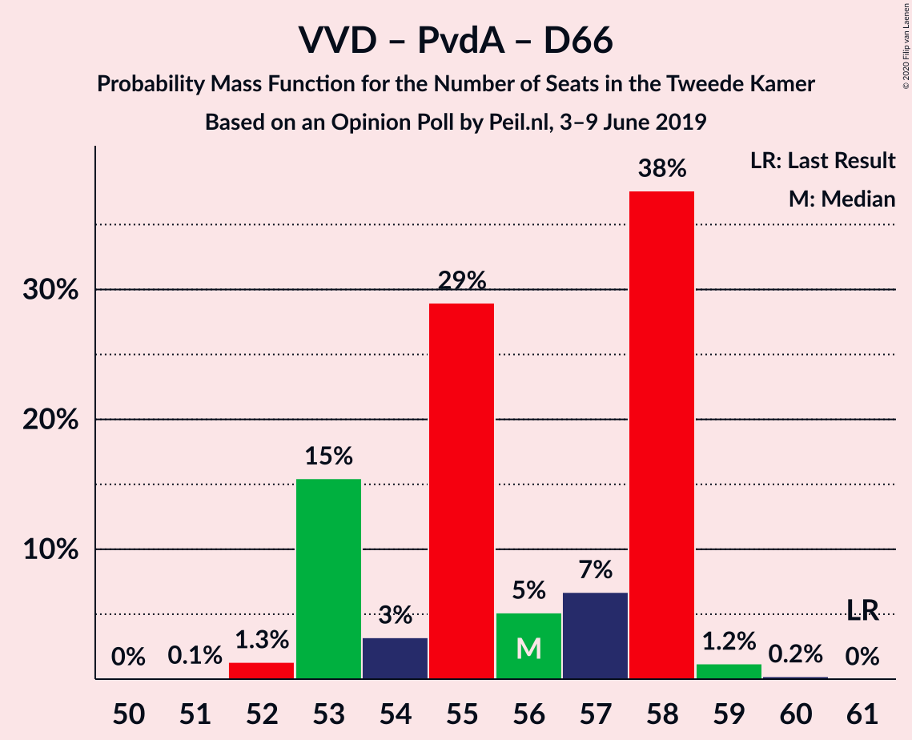
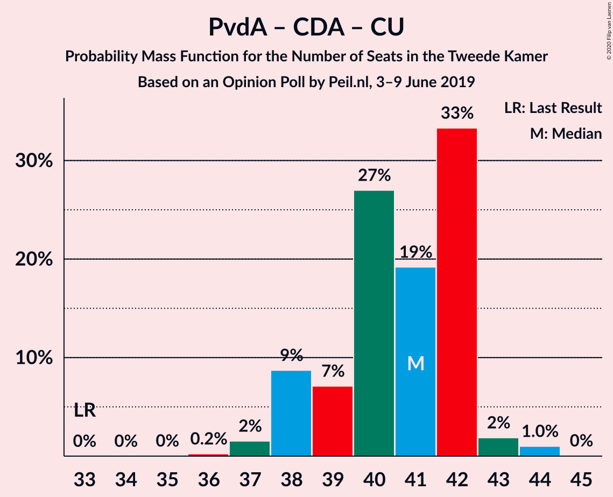

# Opinion Poll by Peil.nl, 3–9 June 2019

<a href="#voting-intentions">Voting Intentions</a> | <a href="#seats">Seats</a> | <a href="#coalitions">Coalitions</a> | <a href="#technical-information">Technical Information</a>

## Voting Intentions

### Confidence Intervals

| Party | Last Result | Poll Result | 80% Confidence Interval | 90% Confidence Interval | 95% Confidence Interval | 99% Confidence Interval |
|:-----:|:-----------:|:-----------:|:-----------------------:|:-----------------------:|:-----------------------:|:-----------------------:|
| Volkspartij voor Vrijheid en Democratie | 21.3% | 18.0% | 17.1–18.9% |16.9–19.2% |16.7–19.4% |16.2–19.9% |
| Forum voor Democratie | 1.8% | 14.7% | 13.9–15.5% |13.6–15.8% |13.4–16.0% |13.1–16.4% |
| Partij van de Arbeid | 5.7% | 12.0% | 11.3–12.8% |11.1–13.0% |10.9–13.2% |10.5–13.6% |
| Christen-Democratisch Appèl | 12.4% | 10.0% | 9.3–10.7% |9.1–10.9% |9.0–11.1% |8.7–11.5% |
| GroenLinks | 9.1% | 9.3% | 8.7–10.1% |8.5–10.3% |8.3–10.4% |8.0–10.8% |
| Democraten 66 | 12.2% | 6.7% | 6.1–7.3% |6.0–7.5% |5.8–7.6% |5.6–7.9% |
| Partij voor de Vrijheid | 13.1% | 5.3% | 4.8–5.9% |4.7–6.1% |4.6–6.2% |4.4–6.5% |
| Socialistische Partij | 9.1% | 5.3% | 4.8–5.9% |4.7–6.1% |4.6–6.2% |4.4–6.5% |
| Partij voor de Dieren | 3.2% | 5.3% | 4.8–5.9% |4.7–6.1% |4.6–6.2% |4.4–6.5% |
| ChristenUnie | 3.4% | 4.7% | 4.2–5.2% |4.1–5.3% |4.0–5.5% |3.7–5.8% |
| 50Plus | 3.1% | 3.3% | 2.9–3.8% |2.8–3.9% |2.7–4.0% |2.6–4.3% |
| DENK | 2.1% | 2.7% | 2.3–3.1% |2.2–3.2% |2.1–3.3% |2.0–3.5% |
| Staatkundig Gereformeerde Partij | 2.1% | 1.3% | 1.1–1.6% |1.0–1.7% |1.0–1.8% |0.9–2.0% |

*Note:* The poll result column reflects the actual value used in the calculations. Published results may vary slightly, and in addition be rounded to fewer digits.

## Seats

### Confidence Intervals

| Party | Last Result | Median | 80% Confidence Interval | 90% Confidence Interval | 95% Confidence Interval | 99% Confidence Interval |
|:-----:|:-----------:|:------:|:-----------------------:|:-----------------------:|:-----------------------:|:-----------------------:|
| <a href="#volkspartij-voor-vrijheid-en-democratie">Volkspartij voor Vrijheid en Democratie</a> | 33 | 28 | 27–29 |26–30 |26–30 |25–30 |
| <a href="#forum-voor-democratie">Forum voor Democratie</a> | 2 | 22 | 21–24 |21–24 |21–24 |20–26 |
| <a href="#partij-van-de-arbeid">Partij van de Arbeid</a> | 9 | 18 | 17–21 |17–21 |17–21 |16–21 |
| <a href="#christen-democratisch-appèl">Christen-Democratisch Appèl</a> | 19 | 15 | 14–17 |14–17 |13–17 |13–18 |
| <a href="#groenlinks">GroenLinks</a> | 14 | 14 | 13–16 |12–16 |12–16 |12–16 |
| <a href="#democraten-66">Democraten 66</a> | 19 | 9 | 9–11 |9–11 |9–11 |8–12 |
| <a href="#partij-voor-de-vrijheid">Partij voor de Vrijheid</a> | 20 | 8 | 7–8 |7–9 |7–9 |6–10 |
| <a href="#socialistische-partij">Socialistische Partij</a> | 14 | 8 | 8–9 |7–9 |7–10 |6–10 |
| <a href="#partij-voor-de-dieren">Partij voor de Dieren</a> | 5 | 8 | 8 |7–9 |7–9 |6–10 |
| <a href="#christenunie">ChristenUnie</a> | 5 | 6 | 6–7 |6–8 |6–8 |5–8 |
| <a href="#50plus">50Plus</a> | 4 | 5 | 4–5 |4–6 |4–6 |4–6 |
| <a href="#denk">DENK</a> | 3 | 4 | 3–4 |3–5 |3–5 |3–5 |
| <a href="#staatkundig-gereformeerde-partij">Staatkundig Gereformeerde Partij</a> | 3 | 2 | 1–2 |1–2 |1–2 |1–3 |

### Volkspartij voor Vrijheid en Democratie

*For a full overview of the results for this party, see the [Volkspartij voor Vrijheid en Democratie](party-volkspartijvoorvrijheidendemocratie.html) page.*

| Number of Seats | Probability | Accumulated | Special Marks |
|:---------------:|:-----------:|:-----------:|:-------------:|
| 24 | 0.1% | 100% |  |
| 25 | 1.1% | 99.9% |  |
| 26 | 8% | 98.8% |  |
| 27 | 38% | 91% |  |
| 28 | 40% | 53% | Median |
| 29 | 8% | 13% |  |
| 30 | 5% | 5% |  |
| 31 | 0.2% | 0.4% |  |
| 32 | 0.2% | 0.2% |  |
| 33 | 0% | 0% | Last Result |

### Forum voor Democratie

*For a full overview of the results for this party, see the [Forum voor Democratie](party-forumvoordemocratie.html) page.*

| Number of Seats | Probability | Accumulated | Special Marks |
|:---------------:|:-----------:|:-----------:|:-------------:|
| 2 | 0% | 100% | Last Result |
| 3 | 0% | 100% |  |
| 4 | 0% | 100% |  |
| 5 | 0% | 100% |  |
| 6 | 0% | 100% |  |
| 7 | 0% | 100% |  |
| 8 | 0% | 100% |  |
| 9 | 0% | 100% |  |
| 10 | 0% | 100% |  |
| 11 | 0% | 100% |  |
| 12 | 0% | 100% |  |
| 13 | 0% | 100% |  |
| 14 | 0% | 100% |  |
| 15 | 0% | 100% |  |
| 16 | 0% | 100% |  |
| 17 | 0% | 100% |  |
| 18 | 0% | 100% |  |
| 19 | 0.4% | 100% |  |
| 20 | 1.3% | 99.6% |  |
| 21 | 12% | 98% |  |
| 22 | 65% | 86% | Median |
| 23 | 7% | 21% |  |
| 24 | 13% | 14% |  |
| 25 | 1.0% | 2% |  |
| 26 | 0.2% | 0.7% |  |
| 27 | 0.5% | 0.5% |  |
| 28 | 0% | 0% |  |

### Partij van de Arbeid

*For a full overview of the results for this party, see the [Partij van de Arbeid](party-partijvandearbeid.html) page.*

| Number of Seats | Probability | Accumulated | Special Marks |
|:---------------:|:-----------:|:-----------:|:-------------:|
| 9 | 0% | 100% | Last Result |
| 10 | 0% | 100% |  |
| 11 | 0% | 100% |  |
| 12 | 0% | 100% |  |
| 13 | 0% | 100% |  |
| 14 | 0% | 100% |  |
| 15 | 0.1% | 100% |  |
| 16 | 2% | 99.9% |  |
| 17 | 28% | 98% |  |
| 18 | 23% | 70% | Median |
| 19 | 13% | 47% |  |
| 20 | 2% | 34% |  |
| 21 | 32% | 32% |  |
| 22 | 0.1% | 0.1% |  |
| 23 | 0% | 0% |  |

### Christen-Democratisch Appèl

*For a full overview of the results for this party, see the [Christen-Democratisch Appèl](party-christen-democratischappèl.html) page.*

| Number of Seats | Probability | Accumulated | Special Marks |
|:---------------:|:-----------:|:-----------:|:-------------:|
| 12 | 0.1% | 100% |  |
| 13 | 3% | 99.9% |  |
| 14 | 12% | 97% |  |
| 15 | 46% | 85% | Median |
| 16 | 20% | 39% |  |
| 17 | 18% | 19% |  |
| 18 | 1.0% | 1.0% |  |
| 19 | 0.1% | 0.1% | Last Result |
| 20 | 0% | 0% |  |

### GroenLinks

*For a full overview of the results for this party, see the [GroenLinks](party-groenlinks.html) page.*

| Number of Seats | Probability | Accumulated | Special Marks |
|:---------------:|:-----------:|:-----------:|:-------------:|
| 12 | 5% | 100% |  |
| 13 | 12% | 95% |  |
| 14 | 37% | 83% | Last Result, Median |
| 15 | 26% | 47% |  |
| 16 | 21% | 21% |  |
| 17 | 0.1% | 0.1% |  |
| 18 | 0% | 0% |  |

### Democraten 66

*For a full overview of the results for this party, see the [Democraten 66](party-democraten66.html) page.*

| Number of Seats | Probability | Accumulated | Special Marks |
|:---------------:|:-----------:|:-----------:|:-------------:|
| 8 | 2% | 100% |  |
| 9 | 53% | 98% | Median |
| 10 | 33% | 45% |  |
| 11 | 11% | 12% |  |
| 12 | 0.7% | 1.1% |  |
| 13 | 0.4% | 0.4% |  |
| 14 | 0% | 0% |  |
| 15 | 0% | 0% |  |
| 16 | 0% | 0% |  |
| 17 | 0% | 0% |  |
| 18 | 0% | 0% |  |
| 19 | 0% | 0% | Last Result |

### Partij voor de Vrijheid

*For a full overview of the results for this party, see the [Partij voor de Vrijheid](party-partijvoordevrijheid.html) page.*

| Number of Seats | Probability | Accumulated | Special Marks |
|:---------------:|:-----------:|:-----------:|:-------------:|
| 6 | 0.7% | 100% |  |
| 7 | 23% | 99.3% |  |
| 8 | 67% | 76% | Median |
| 9 | 8% | 9% |  |
| 10 | 0.7% | 0.7% |  |
| 11 | 0% | 0% |  |
| 12 | 0% | 0% |  |
| 13 | 0% | 0% |  |
| 14 | 0% | 0% |  |
| 15 | 0% | 0% |  |
| 16 | 0% | 0% |  |
| 17 | 0% | 0% |  |
| 18 | 0% | 0% |  |
| 19 | 0% | 0% |  |
| 20 | 0% | 0% | Last Result |

### Socialistische Partij

*For a full overview of the results for this party, see the [Socialistische Partij](party-socialistischepartij.html) page.*

| Number of Seats | Probability | Accumulated | Special Marks |
|:---------------:|:-----------:|:-----------:|:-------------:|
| 6 | 1.4% | 100% |  |
| 7 | 8% | 98.6% |  |
| 8 | 80% | 91% | Median |
| 9 | 8% | 11% |  |
| 10 | 3% | 3% |  |
| 11 | 0% | 0% |  |
| 12 | 0% | 0% |  |
| 13 | 0% | 0% |  |
| 14 | 0% | 0% | Last Result |

### Partij voor de Dieren

*For a full overview of the results for this party, see the [Partij voor de Dieren](party-partijvoordedieren.html) page.*

| Number of Seats | Probability | Accumulated | Special Marks |
|:---------------:|:-----------:|:-----------:|:-------------:|
| 5 | 0% | 100% | Last Result |
| 6 | 0.6% | 100% |  |
| 7 | 9% | 99.4% |  |
| 8 | 85% | 90% | Median |
| 9 | 4% | 5% |  |
| 10 | 1.4% | 1.4% |  |
| 11 | 0% | 0% |  |

### ChristenUnie

*For a full overview of the results for this party, see the [ChristenUnie](party-christenunie.html) page.*

| Number of Seats | Probability | Accumulated | Special Marks |
|:---------------:|:-----------:|:-----------:|:-------------:|
| 5 | 2% | 100% | Last Result |
| 6 | 57% | 98% | Median |
| 7 | 35% | 40% |  |
| 8 | 5% | 6% |  |
| 9 | 0.3% | 0.3% |  |
| 10 | 0% | 0% |  |

### 50Plus

*For a full overview of the results for this party, see the [50Plus](party-50plus.html) page.*

| Number of Seats | Probability | Accumulated | Special Marks |
|:---------------:|:-----------:|:-----------:|:-------------:|
| 3 | 0.2% | 100% |  |
| 4 | 25% | 99.8% | Last Result |
| 5 | 66% | 75% | Median |
| 6 | 9% | 9% |  |
| 7 | 0% | 0% |  |

### DENK

*For a full overview of the results for this party, see the [DENK](party-denk.html) page.*

| Number of Seats | Probability | Accumulated | Special Marks |
|:---------------:|:-----------:|:-----------:|:-------------:|
| 2 | 0.3% | 100% |  |
| 3 | 45% | 99.7% | Last Result |
| 4 | 49% | 55% | Median |
| 5 | 6% | 6% |  |
| 6 | 0.2% | 0.2% |  |
| 7 | 0% | 0% |  |

### Staatkundig Gereformeerde Partij

*For a full overview of the results for this party, see the [Staatkundig Gereformeerde Partij](party-staatkundiggereformeerdepartij.html) page.*

| Number of Seats | Probability | Accumulated | Special Marks |
|:---------------:|:-----------:|:-----------:|:-------------:|
| 1 | 17% | 100% |  |
| 2 | 81% | 83% | Median |
| 3 | 2% | 2% | Last Result |
| 4 | 0% | 0% |  |

## Coalitions

### Confidence Intervals

| Coalition | Last Result | Median | Majority? | 80% Confidence Interval | 90% Confidence Interval | 95% Confidence Interval | 99% Confidence Interval |
|:---------:|:-----------:|:------:|:---------:|:-----------------------:|:-----------------------:|:-----------------------:|:-----------------------:|
| Volkspartij voor Vrijheid en Democratie – Partij van de Arbeid – Christen-Democratisch Appèl – Democraten 66 – ChristenUnie | 85 | 78 | 97% | 76–79 | 76–80 | 75–80 | 74–82 |
| Volkspartij voor Vrijheid en Democratie – Forum voor Democratie – Christen-Democratisch Appèl – Partij voor de Vrijheid – Staatkundig Gereformeerde Partij | 77 | 75 | 15% | 74–76 | 72–78 | 71–79 | 71–79 |
| Volkspartij voor Vrijheid en Democratie – Forum voor Democratie – Christen-Democratisch Appèl – Partij voor de Vrijheid | 74 | 73 | 6% | 72–74 | 71–76 | 70–77 | 70–77 |
| Volkspartij voor Vrijheid en Democratie – Christen-Democratisch Appèl – GroenLinks – Democraten 66 – ChristenUnie | 90 | 73 | 8% | 72–75 | 71–76 | 71–76 | 70–78 |
| Volkspartij voor Vrijheid en Democratie – Forum voor Democratie – Christen-Democratisch Appèl – 50Plus – Staatkundig Gereformeerde Partij | 61 | 72 | 2% | 70–73 | 69–74 | 68–75 | 68–76 |
| Partij van de Arbeid – Christen-Democratisch Appèl – GroenLinks – Democraten 66 – Socialistische Partij – ChristenUnie | 80 | 73 | 0.6% | 71–74 | 70–74 | 69–74 | 68–76 |
| Volkspartij voor Vrijheid en Democratie – Forum voor Democratie – Christen-Democratisch Appèl – 50Plus | 58 | 70 | 0% | 69–71 | 68–72 | 67–73 | 67–74 |
| Volkspartij voor Vrijheid en Democratie – Forum voor Democratie – Christen-Democratisch Appèl – Staatkundig Gereformeerde Partij | 57 | 67 | 0% | 66–68 | 64–70 | 63–70 | 63–72 |
| Volkspartij voor Vrijheid en Democratie – Forum voor Democratie – Christen-Democratisch Appèl | 54 | 65 | 0% | 64–66 | 63–68 | 62–69 | 62–70 |
| Partij van de Arbeid – Christen-Democratisch Appèl – GroenLinks – Democraten 66 – ChristenUnie | 66 | 65 | 0% | 63–66 | 61–66 | 61–67 | 60–67 |
| Volkspartij voor Vrijheid en Democratie – Partij van de Arbeid – Christen-Democratisch Appèl | 61 | 62 | 0% | 60–64 | 58–64 | 58–64 | 58–65 |
| Volkspartij voor Vrijheid en Democratie – Christen-Democratisch Appèl – Democraten 66 – ChristenUnie | 76 | 59 | 0% | 58–61 | 57–62 | 57–62 | 56–63 |
| Volkspartij voor Vrijheid en Democratie – Partij van de Arbeid – Democraten 66 | 61 | 56 | 0% | 53–58 | 53–58 | 53–58 | 52–59 |
| Volkspartij voor Vrijheid en Democratie – Christen-Democratisch Appèl – Democraten 66 | 71 | 52 | 0% | 52–54 | 51–55 | 51–56 | 49–56 |
| Volkspartij voor Vrijheid en Democratie – Christen-Democratisch Appèl – Partij voor de Vrijheid | 72 | 51 | 0% | 49–52 | 49–53 | 48–53 | 47–54 |
| Volkspartij voor Vrijheid en Democratie – Partij van de Arbeid | 42 | 46 | 0% | 44–49 | 44–49 | 44–49 | 42–49 |
| Partij van de Arbeid – Christen-Democratisch Appèl – Democraten 66 | 47 | 44 | 0% | 42–45 | 41–45 | 41–46 | 40–47 |
| Volkspartij voor Vrijheid en Democratie – Christen-Democratisch Appèl | 52 | 43 | 0% | 41–44 | 41–45 | 41–45 | 40–46 |
| Partij van de Arbeid – Christen-Democratisch Appèl – ChristenUnie | 33 | 41 | 0% | 38–42 | 38–42 | 38–43 | 37–44 |
| Partij van de Arbeid – Christen-Democratisch Appèl | 28 | 35 | 0% | 32–36 | 31–36 | 31–36 | 30–37 |
| Christen-Democratisch Appèl – Democraten 66 | 38 | 25 | 0% | 24–27 | 23–27 | 23–27 | 23–29 |

### Volkspartij voor Vrijheid en Democratie – Partij van de Arbeid – Christen-Democratisch Appèl – Democraten 66 – ChristenUnie

| Number of Seats | Probability | Accumulated | Special Marks |
|:---------------:|:-----------:|:-----------:|:-------------:|
| 73 | 0.3% | 100% |  |
| 74 | 0.2% | 99.7% |  |
| 75 | 3% | 99.5% |  |
| 76 | 26% | 97% | Median, Majority |
| 77 | 6% | 71% |  |
| 78 | 21% | 64% |  |
| 79 | 35% | 43% |  |
| 80 | 6% | 8% |  |
| 81 | 1.5% | 2% |  |
| 82 | 0.6% | 0.6% |  |
| 83 | 0% | 0.1% |  |
| 84 | 0% | 0% |  |
| 85 | 0% | 0% | Last Result |

### Volkspartij voor Vrijheid en Democratie – Forum voor Democratie – Christen-Democratisch Appèl – Partij voor de Vrijheid – Staatkundig Gereformeerde Partij

| Number of Seats | Probability | Accumulated | Special Marks |
|:---------------:|:-----------:|:-----------:|:-------------:|
| 70 | 0.1% | 100% |  |
| 71 | 4% | 99.9% |  |
| 72 | 1.1% | 96% |  |
| 73 | 2% | 95% |  |
| 74 | 13% | 92% |  |
| 75 | 64% | 80% | Median |
| 76 | 8% | 15% | Majority |
| 77 | 2% | 7% | Last Result |
| 78 | 2% | 5% |  |
| 79 | 3% | 3% |  |
| 80 | 0.2% | 0.2% |  |
| 81 | 0% | 0% |  |

### Volkspartij voor Vrijheid en Democratie – Forum voor Democratie – Christen-Democratisch Appèl – Partij voor de Vrijheid

| Number of Seats | Probability | Accumulated | Special Marks |
|:---------------:|:-----------:|:-----------:|:-------------:|
| 69 | 0.4% | 100% |  |
| 70 | 4% | 99.6% |  |
| 71 | 4% | 95% |  |
| 72 | 4% | 92% |  |
| 73 | 72% | 88% | Median |
| 74 | 7% | 16% | Last Result |
| 75 | 3% | 9% |  |
| 76 | 2% | 6% | Majority |
| 77 | 4% | 4% |  |
| 78 | 0.2% | 0.2% |  |
| 79 | 0% | 0% |  |

### Volkspartij voor Vrijheid en Democratie – Christen-Democratisch Appèl – GroenLinks – Democraten 66 – ChristenUnie

| Number of Seats | Probability | Accumulated | Special Marks |
|:---------------:|:-----------:|:-----------:|:-------------:|
| 69 | 0.2% | 100% |  |
| 70 | 2% | 99.8% |  |
| 71 | 6% | 98% |  |
| 72 | 36% | 93% | Median |
| 73 | 7% | 56% |  |
| 74 | 6% | 50% |  |
| 75 | 36% | 44% |  |
| 76 | 7% | 8% | Majority |
| 77 | 0.4% | 1.1% |  |
| 78 | 0.5% | 0.7% |  |
| 79 | 0.2% | 0.2% |  |
| 80 | 0% | 0% |  |
| 81 | 0% | 0% |  |
| 82 | 0% | 0% |  |
| 83 | 0% | 0% |  |
| 84 | 0% | 0% |  |
| 85 | 0% | 0% |  |
| 86 | 0% | 0% |  |
| 87 | 0% | 0% |  |
| 88 | 0% | 0% |  |
| 89 | 0% | 0% |  |
| 90 | 0% | 0% | Last Result |

### Volkspartij voor Vrijheid en Democratie – Forum voor Democratie – Christen-Democratisch Appèl – 50Plus – Staatkundig Gereformeerde Partij

| Number of Seats | Probability | Accumulated | Special Marks |
|:---------------:|:-----------:|:-----------:|:-------------:|
| 61 | 0% | 100% | Last Result |
| 62 | 0% | 100% |  |
| 63 | 0% | 100% |  |
| 64 | 0% | 100% |  |
| 65 | 0% | 100% |  |
| 66 | 0% | 100% |  |
| 67 | 0.2% | 99.9% |  |
| 68 | 4% | 99.7% |  |
| 69 | 1.4% | 96% |  |
| 70 | 5% | 95% |  |
| 71 | 6% | 90% |  |
| 72 | 68% | 84% | Median |
| 73 | 7% | 16% |  |
| 74 | 6% | 9% |  |
| 75 | 1.4% | 3% |  |
| 76 | 1.4% | 2% | Majority |
| 77 | 0.2% | 0.2% |  |
| 78 | 0% | 0% |  |

### Partij van de Arbeid – Christen-Democratisch Appèl – GroenLinks – Democraten 66 – Socialistische Partij – ChristenUnie

| Number of Seats | Probability | Accumulated | Special Marks |
|:---------------:|:-----------:|:-----------:|:-------------:|
| 66 | 0.1% | 100% |  |
| 67 | 0.2% | 99.9% |  |
| 68 | 2% | 99.7% |  |
| 69 | 0.8% | 98% |  |
| 70 | 3% | 97% | Median |
| 71 | 8% | 93% |  |
| 72 | 7% | 85% |  |
| 73 | 59% | 78% |  |
| 74 | 17% | 19% |  |
| 75 | 1.3% | 2% |  |
| 76 | 0.4% | 0.6% | Majority |
| 77 | 0.2% | 0.2% |  |
| 78 | 0% | 0% |  |
| 79 | 0% | 0% |  |
| 80 | 0% | 0% | Last Result |

### Volkspartij voor Vrijheid en Democratie – Forum voor Democratie – Christen-Democratisch Appèl – 50Plus

| Number of Seats | Probability | Accumulated | Special Marks |
|:---------------:|:-----------:|:-----------:|:-------------:|
| 58 | 0% | 100% | Last Result |
| 59 | 0% | 100% |  |
| 60 | 0% | 100% |  |
| 61 | 0% | 100% |  |
| 62 | 0% | 100% |  |
| 63 | 0% | 100% |  |
| 64 | 0% | 100% |  |
| 65 | 0.1% | 100% |  |
| 66 | 0.2% | 99.9% |  |
| 67 | 5% | 99.7% |  |
| 68 | 4% | 95% |  |
| 69 | 7% | 91% |  |
| 70 | 62% | 84% | Median |
| 71 | 13% | 23% |  |
| 72 | 5% | 10% |  |
| 73 | 3% | 4% |  |
| 74 | 2% | 2% |  |
| 75 | 0.1% | 0.1% |  |
| 76 | 0% | 0% | Majority |

### Volkspartij voor Vrijheid en Democratie – Forum voor Democratie – Christen-Democratisch Appèl – Staatkundig Gereformeerde Partij

| Number of Seats | Probability | Accumulated | Special Marks |
|:---------------:|:-----------:|:-----------:|:-------------:|
| 57 | 0% | 100% | Last Result |
| 58 | 0% | 100% |  |
| 59 | 0% | 100% |  |
| 60 | 0% | 100% |  |
| 61 | 0% | 100% |  |
| 62 | 0% | 100% |  |
| 63 | 4% | 99.9% |  |
| 64 | 1.4% | 96% |  |
| 65 | 3% | 95% |  |
| 66 | 12% | 91% |  |
| 67 | 49% | 80% | Median |
| 68 | 23% | 31% |  |
| 69 | 2% | 8% |  |
| 70 | 4% | 6% |  |
| 71 | 0.3% | 2% |  |
| 72 | 1.4% | 1.4% |  |
| 73 | 0% | 0% |  |

### Volkspartij voor Vrijheid en Democratie – Forum voor Democratie – Christen-Democratisch Appèl

| Number of Seats | Probability | Accumulated | Special Marks |
|:---------------:|:-----------:|:-----------:|:-------------:|
| 54 | 0% | 100% | Last Result |
| 55 | 0% | 100% |  |
| 56 | 0% | 100% |  |
| 57 | 0% | 100% |  |
| 58 | 0% | 100% |  |
| 59 | 0% | 100% |  |
| 60 | 0.1% | 100% |  |
| 61 | 0.1% | 99.9% |  |
| 62 | 4% | 99.9% |  |
| 63 | 3% | 95% |  |
| 64 | 7% | 93% |  |
| 65 | 53% | 85% | Median |
| 66 | 22% | 32% |  |
| 67 | 4% | 10% |  |
| 68 | 3% | 6% |  |
| 69 | 1.4% | 3% |  |
| 70 | 1.3% | 1.3% |  |
| 71 | 0% | 0% |  |

### Partij van de Arbeid – Christen-Democratisch Appèl – GroenLinks – Democraten 66 – ChristenUnie

| Number of Seats | Probability | Accumulated | Special Marks |
|:---------------:|:-----------:|:-----------:|:-------------:|
| 58 | 0.1% | 100% |  |
| 59 | 0% | 99.9% |  |
| 60 | 2% | 99.9% |  |
| 61 | 4% | 98% |  |
| 62 | 3% | 93% | Median |
| 63 | 7% | 91% |  |
| 64 | 5% | 84% |  |
| 65 | 59% | 79% |  |
| 66 | 17% | 21% | Last Result |
| 67 | 3% | 3% |  |
| 68 | 0.2% | 0.4% |  |
| 69 | 0.1% | 0.2% |  |
| 70 | 0% | 0% |  |

### Volkspartij voor Vrijheid en Democratie – Partij van de Arbeid – Christen-Democratisch Appèl

| Number of Seats | Probability | Accumulated | Special Marks |
|:---------------:|:-----------:|:-----------:|:-------------:|
| 56 | 0.1% | 100% |  |
| 57 | 0.1% | 99.9% |  |
| 58 | 6% | 99.8% |  |
| 59 | 3% | 94% |  |
| 60 | 26% | 91% |  |
| 61 | 5% | 65% | Last Result, Median |
| 62 | 21% | 60% |  |
| 63 | 7% | 40% |  |
| 64 | 32% | 33% |  |
| 65 | 0.6% | 0.7% |  |
| 66 | 0% | 0% |  |

### Volkspartij voor Vrijheid en Democratie – Christen-Democratisch Appèl – Democraten 66 – ChristenUnie

| Number of Seats | Probability | Accumulated | Special Marks |
|:---------------:|:-----------:|:-----------:|:-------------:|
| 55 | 0.1% | 100% |  |
| 56 | 0.7% | 99.9% |  |
| 57 | 8% | 99.2% |  |
| 58 | 34% | 92% | Median |
| 59 | 25% | 58% |  |
| 60 | 20% | 32% |  |
| 61 | 4% | 12% |  |
| 62 | 6% | 9% |  |
| 63 | 2% | 2% |  |
| 64 | 0.1% | 0.3% |  |
| 65 | 0.2% | 0.2% |  |
| 66 | 0% | 0% |  |
| 67 | 0% | 0% |  |
| 68 | 0% | 0% |  |
| 69 | 0% | 0% |  |
| 70 | 0% | 0% |  |
| 71 | 0% | 0% |  |
| 72 | 0% | 0% |  |
| 73 | 0% | 0% |  |
| 74 | 0% | 0% |  |
| 75 | 0% | 0% |  |
| 76 | 0% | 0% | Last Result, Majority |

### Volkspartij voor Vrijheid en Democratie – Partij van de Arbeid – Democraten 66

| Number of Seats | Probability | Accumulated | Special Marks |
|:---------------:|:-----------:|:-----------:|:-------------:|
| 51 | 0.1% | 100% |  |
| 52 | 1.3% | 99.9% |  |
| 53 | 15% | 98.6% |  |
| 54 | 3% | 83% |  |
| 55 | 29% | 80% | Median |
| 56 | 5% | 51% |  |
| 57 | 7% | 46% |  |
| 58 | 38% | 39% |  |
| 59 | 1.2% | 1.5% |  |
| 60 | 0.2% | 0.3% |  |
| 61 | 0% | 0% | Last Result |

### Volkspartij voor Vrijheid en Democratie – Christen-Democratisch Appèl – Democraten 66

| Number of Seats | Probability | Accumulated | Special Marks |
|:---------------:|:-----------:|:-----------:|:-------------:|
| 49 | 1.0% | 100% |  |
| 50 | 1.3% | 98.9% |  |
| 51 | 8% | 98% |  |
| 52 | 55% | 90% | Median |
| 53 | 7% | 35% |  |
| 54 | 20% | 28% |  |
| 55 | 5% | 8% |  |
| 56 | 3% | 3% |  |
| 57 | 0.1% | 0.3% |  |
| 58 | 0.2% | 0.2% |  |
| 59 | 0% | 0% |  |
| 60 | 0% | 0% |  |
| 61 | 0% | 0% |  |
| 62 | 0% | 0% |  |
| 63 | 0% | 0% |  |
| 64 | 0% | 0% |  |
| 65 | 0% | 0% |  |
| 66 | 0% | 0% |  |
| 67 | 0% | 0% |  |
| 68 | 0% | 0% |  |
| 69 | 0% | 0% |  |
| 70 | 0% | 0% |  |
| 71 | 0% | 0% | Last Result |

### Volkspartij voor Vrijheid en Democratie – Christen-Democratisch Appèl – Partij voor de Vrijheid

| Number of Seats | Probability | Accumulated | Special Marks |
|:---------------:|:-----------:|:-----------:|:-------------:|
| 46 | 0.3% | 100% |  |
| 47 | 0.3% | 99.7% |  |
| 48 | 2% | 99.4% |  |
| 49 | 12% | 97% |  |
| 50 | 5% | 86% |  |
| 51 | 66% | 81% | Median |
| 52 | 6% | 14% |  |
| 53 | 7% | 9% |  |
| 54 | 1.0% | 1.2% |  |
| 55 | 0.3% | 0.3% |  |
| 56 | 0% | 0% |  |
| 57 | 0% | 0% |  |
| 58 | 0% | 0% |  |
| 59 | 0% | 0% |  |
| 60 | 0% | 0% |  |
| 61 | 0% | 0% |  |
| 62 | 0% | 0% |  |
| 63 | 0% | 0% |  |
| 64 | 0% | 0% |  |
| 65 | 0% | 0% |  |
| 66 | 0% | 0% |  |
| 67 | 0% | 0% |  |
| 68 | 0% | 0% |  |
| 69 | 0% | 0% |  |
| 70 | 0% | 0% |  |
| 71 | 0% | 0% |  |
| 72 | 0% | 0% | Last Result |

### Volkspartij voor Vrijheid en Democratie – Partij van de Arbeid

| Number of Seats | Probability | Accumulated | Special Marks |
|:---------------:|:-----------:|:-----------:|:-------------:|
| 42 | 1.4% | 100% | Last Result |
| 43 | 1.0% | 98.6% |  |
| 44 | 21% | 98% |  |
| 45 | 25% | 77% |  |
| 46 | 7% | 51% | Median |
| 47 | 5% | 44% |  |
| 48 | 6% | 39% |  |
| 49 | 34% | 34% |  |
| 50 | 0.2% | 0.2% |  |
| 51 | 0% | 0% |  |

### Partij van de Arbeid – Christen-Democratisch Appèl – Democraten 66

| Number of Seats | Probability | Accumulated | Special Marks |
|:---------------:|:-----------:|:-----------:|:-------------:|
| 39 | 0.2% | 100% |  |
| 40 | 0.6% | 99.8% |  |
| 41 | 5% | 99.2% |  |
| 42 | 24% | 94% | Median |
| 43 | 8% | 70% |  |
| 44 | 12% | 62% |  |
| 45 | 47% | 50% |  |
| 46 | 2% | 3% |  |
| 47 | 0.7% | 0.7% | Last Result |
| 48 | 0% | 0% |  |

### Volkspartij voor Vrijheid en Democratie – Christen-Democratisch Appèl

| Number of Seats | Probability | Accumulated | Special Marks |
|:---------------:|:-----------:|:-----------:|:-------------:|
| 39 | 0.5% | 100% |  |
| 40 | 1.3% | 99.5% |  |
| 41 | 12% | 98% |  |
| 42 | 4% | 86% |  |
| 43 | 55% | 82% | Median |
| 44 | 19% | 27% |  |
| 45 | 6% | 8% |  |
| 46 | 1.5% | 2% |  |
| 47 | 0.1% | 0.3% |  |
| 48 | 0.2% | 0.2% |  |
| 49 | 0% | 0% |  |
| 50 | 0% | 0% |  |
| 51 | 0% | 0% |  |
| 52 | 0% | 0% | Last Result |

### Partij van de Arbeid – Christen-Democratisch Appèl – ChristenUnie

| Number of Seats | Probability | Accumulated | Special Marks |
|:---------------:|:-----------:|:-----------:|:-------------:|
| 33 | 0% | 100% | Last Result |
| 34 | 0% | 100% |  |
| 35 | 0% | 100% |  |
| 36 | 0.2% | 100% |  |
| 37 | 2% | 99.7% |  |
| 38 | 9% | 98% |  |
| 39 | 7% | 89% | Median |
| 40 | 27% | 82% |  |
| 41 | 19% | 55% |  |
| 42 | 33% | 36% |  |
| 43 | 2% | 3% |  |
| 44 | 1.0% | 1.0% |  |
| 45 | 0% | 0% |  |

### Partij van de Arbeid – Christen-Democratisch Appèl

| Number of Seats | Probability | Accumulated | Special Marks |
|:---------------:|:-----------:|:-----------:|:-------------:|
| 28 | 0% | 100% | Last Result |
| 29 | 0% | 100% |  |
| 30 | 1.3% | 100% |  |
| 31 | 7% | 98.6% |  |
| 32 | 4% | 91% |  |
| 33 | 28% | 88% | Median |
| 34 | 10% | 60% |  |
| 35 | 18% | 50% |  |
| 36 | 31% | 32% |  |
| 37 | 0.8% | 0.8% |  |
| 38 | 0% | 0% |  |

### Christen-Democratisch Appèl – Democraten 66

| Number of Seats | Probability | Accumulated | Special Marks |
|:---------------:|:-----------:|:-----------:|:-------------:|
| 22 | 0.4% | 100% |  |
| 23 | 7% | 99.6% |  |
| 24 | 35% | 92% | Median |
| 25 | 28% | 57% |  |
| 26 | 9% | 29% |  |
| 27 | 18% | 19% |  |
| 28 | 0.8% | 2% |  |
| 29 | 0.9% | 0.9% |  |
| 30 | 0% | 0% |  |
| 31 | 0% | 0% |  |
| 32 | 0% | 0% |  |
| 33 | 0% | 0% |  |
| 34 | 0% | 0% |  |
| 35 | 0% | 0% |  |
| 36 | 0% | 0% |  |
| 37 | 0% | 0% |  |
| 38 | 0% | 0% | Last Result |

## Technical Information

### Opinion Poll

+ **Polling firm:** Peil.nl
+ **Commissioner(s):** —
+ **Fieldwork period:** 3–9 June 2019

### Calculations

+ **Sample size:** 3000
+ **Simulations done:** 1,048,576
+ **Error estimate:** 2.41%

