# Opinion Poll by Peil.nl, 3–9 June 2019

<a href="#voting-intentions">Voting Intentions</a> | <a href="#seats">Seats</a> | <a href="#coalitions">Coalitions</a> | <a href="#technical-information">Technical Information</a>

## Voting Intentions

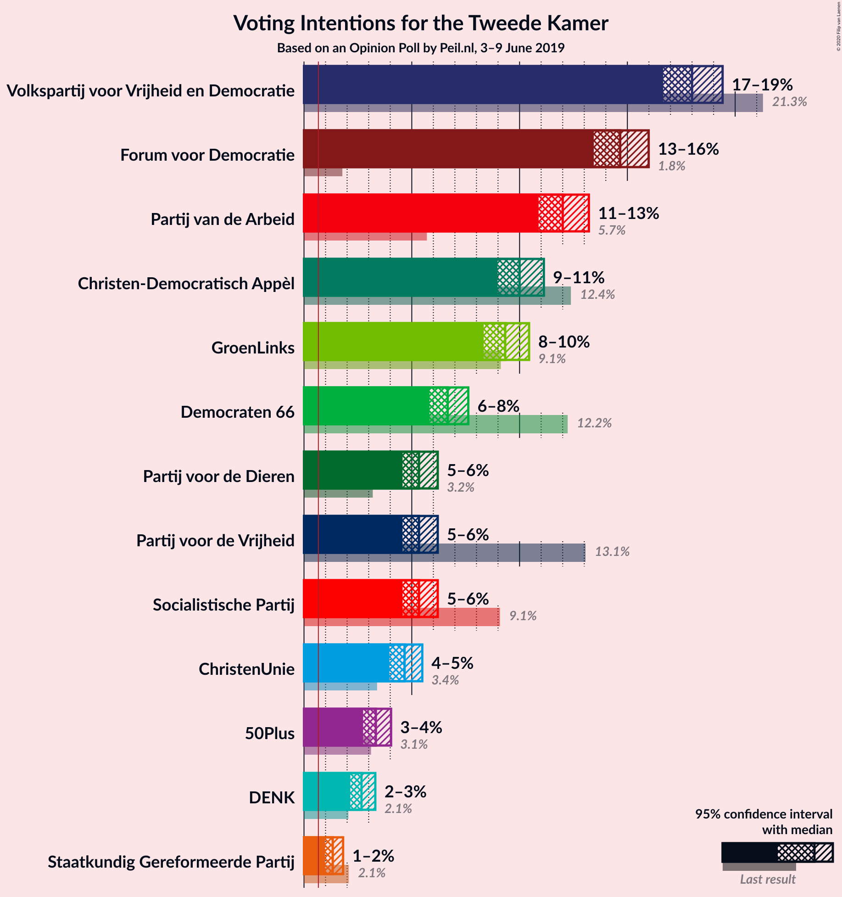

### Confidence Intervals

| Party | Last Result | Poll Result | 80% Confidence Interval | 90% Confidence Interval | 95% Confidence Interval | 99% Confidence Interval |
|:-----:|:-----------:|:-----------:|:-----------------------:|:-----------------------:|:-----------------------:|:-----------------------:|
| Volkspartij voor Vrijheid en Democratie | 21.3% | 18.0% | 17.1–18.9% |16.9–19.2% |16.7–19.4% |16.2–19.9% |
| Forum voor Democratie | 1.8% | 14.7% | 13.9–15.5% |13.6–15.8% |13.4–16.0% |13.1–16.4% |
| Partij van de Arbeid | 5.7% | 12.0% | 11.3–12.8% |11.1–13.0% |10.9–13.2% |10.5–13.6% |
| Christen-Democratisch Appèl | 12.4% | 10.0% | 9.3–10.7% |9.1–10.9% |9.0–11.1% |8.7–11.5% |
| GroenLinks | 9.1% | 9.3% | 8.7–10.1% |8.5–10.3% |8.3–10.4% |8.0–10.8% |
| Democraten 66 | 12.2% | 6.7% | 6.1–7.3% |6.0–7.5% |5.8–7.6% |5.6–7.9% |
| Partij voor de Vrijheid | 13.1% | 5.3% | 4.8–5.9% |4.7–6.1% |4.6–6.2% |4.4–6.5% |
| Socialistische Partij | 9.1% | 5.3% | 4.8–5.9% |4.7–6.1% |4.6–6.2% |4.4–6.5% |
| Partij voor de Dieren | 3.2% | 5.3% | 4.8–5.9% |4.7–6.1% |4.6–6.2% |4.4–6.5% |
| ChristenUnie | 3.4% | 4.7% | 4.2–5.2% |4.1–5.3% |4.0–5.5% |3.7–5.8% |
| 50Plus | 3.1% | 3.3% | 2.9–3.8% |2.8–3.9% |2.7–4.0% |2.6–4.3% |
| DENK | 2.1% | 2.7% | 2.3–3.1% |2.2–3.2% |2.1–3.3% |2.0–3.5% |
| Staatkundig Gereformeerde Partij | 2.1% | 1.3% | 1.1–1.6% |1.0–1.7% |1.0–1.8% |0.9–2.0% |

*Note:* The poll result column reflects the actual value used in the calculations. Published results may vary slightly, and in addition be rounded to fewer digits.

## Seats

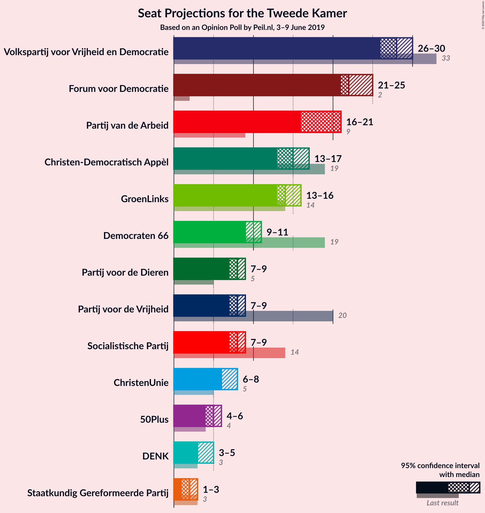

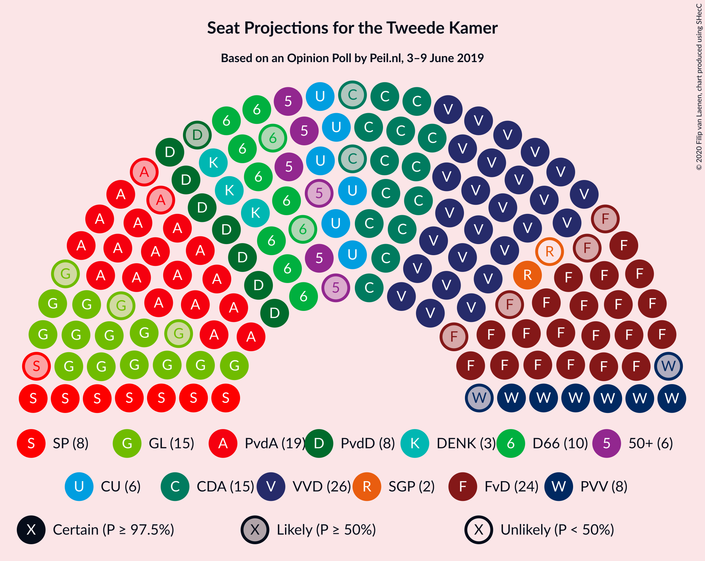

### Confidence Intervals

| Party | Last Result | Median | 80% Confidence Interval | 90% Confidence Interval | 95% Confidence Interval | 99% Confidence Interval |
|:-----:|:-----------:|:------:|:-----------------------:|:-----------------------:|:-----------------------:|:-----------------------:|
| <a href="#volkspartij-voor-vrijheid-en-democratie">Volkspartij voor Vrijheid en Democratie</a> | 33 | 28 | 26–28 |26–29 |26–30 |25–31 |
| <a href="#forum-voor-democratie">Forum voor Democratie</a> | 2 | 22 | 22–24 |21–24 |21–25 |20–27 |
| <a href="#partij-van-de-arbeid">Partij van de Arbeid</a> | 9 | 21 | 18–21 |17–21 |16–21 |16–21 |
| <a href="#christen-democratisch-appèl">Christen-Democratisch Appèl</a> | 19 | 15 | 15 |13–16 |13–17 |13–18 |
| <a href="#groenlinks">GroenLinks</a> | 14 | 14 | 13–15 |13–15 |13–16 |12–16 |
| <a href="#democraten-66">Democraten 66</a> | 19 | 9 | 9–10 |9–11 |9–11 |8–12 |
| <a href="#partij-voor-de-vrijheid">Partij voor de Vrijheid</a> | 20 | 8 | 7–8 |7–8 |7–9 |6–10 |
| <a href="#socialistische-partij">Socialistische Partij</a> | 14 | 8 | 8 |7–9 |7–9 |6–10 |
| <a href="#partij-voor-de-dieren">Partij voor de Dieren</a> | 5 | 8 | 8 |7–8 |7–9 |6–10 |
| <a href="#christenunie">ChristenUnie</a> | 5 | 6 | 6–7 |6–8 |6–8 |6–8 |
| <a href="#50plus">50Plus</a> | 4 | 5 | 5–6 |4–6 |4–6 |4–6 |
| <a href="#denk">DENK</a> | 3 | 3 | 3–4 |3–4 |3–5 |3–5 |
| <a href="#staatkundig-gereformeerde-partij">Staatkundig Gereformeerde Partij</a> | 3 | 2 | 1–2 |1–2 |1–3 |1–3 |

### Volkspartij voor Vrijheid en Democratie

*For a full overview of the results for this party, see the [Volkspartij voor Vrijheid en Democratie](party-volkspartijvoorvrijheidendemocratie.html) page.*

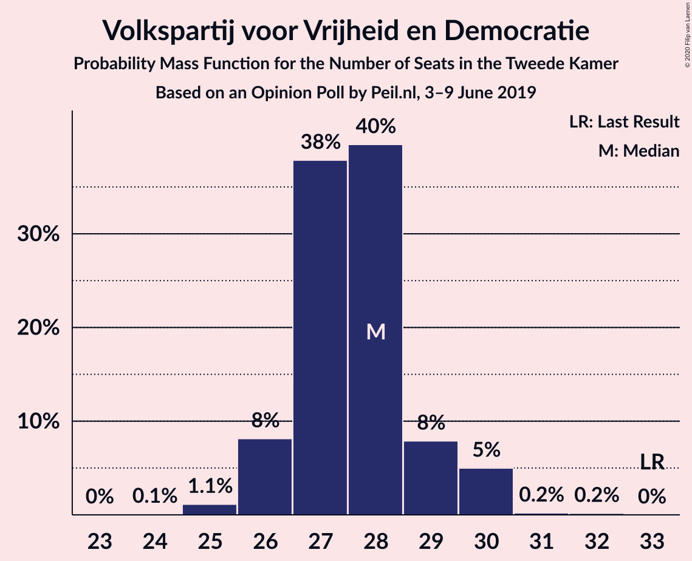

| Number of Seats | Probability | Accumulated | Special Marks |
|:---------------:|:-----------:|:-----------:|:-------------:|
| 24 | 0.1% | 100% |  |
| 25 | 1.5% | 99.9% |  |
| 26 | 13% | 98% |  |
| 27 | 8% | 85% |  |
| 28 | 69% | 77% | Median |
| 29 | 5% | 8% |  |
| 30 | 3% | 4% |  |
| 31 | 0.2% | 0.6% |  |
| 32 | 0.3% | 0.3% |  |
| 33 | 0% | 0% | Last Result |

### Forum voor Democratie

*For a full overview of the results for this party, see the [Forum voor Democratie](party-forumvoordemocratie.html) page.*

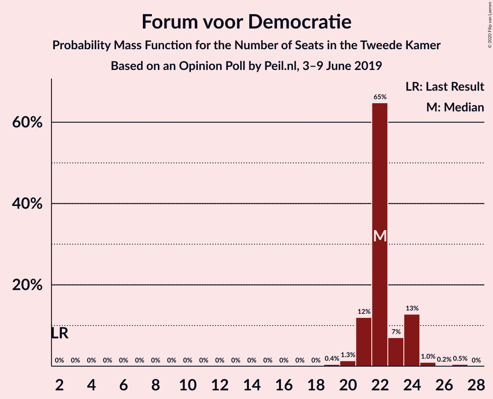

| Number of Seats | Probability | Accumulated | Special Marks |
|:---------------:|:-----------:|:-----------:|:-------------:|
| 2 | 0% | 100% | Last Result |
| 3 | 0% | 100% |  |
| 4 | 0% | 100% |  |
| 5 | 0% | 100% |  |
| 6 | 0% | 100% |  |
| 7 | 0% | 100% |  |
| 8 | 0% | 100% |  |
| 9 | 0% | 100% |  |
| 10 | 0% | 100% |  |
| 11 | 0% | 100% |  |
| 12 | 0% | 100% |  |
| 13 | 0% | 100% |  |
| 14 | 0% | 100% |  |
| 15 | 0% | 100% |  |
| 16 | 0% | 100% |  |
| 17 | 0% | 100% |  |
| 18 | 0% | 100% |  |
| 19 | 0.1% | 100% |  |
| 20 | 1.3% | 99.9% |  |
| 21 | 6% | 98.7% |  |
| 22 | 68% | 92% | Median |
| 23 | 5% | 24% |  |
| 24 | 16% | 19% |  |
| 25 | 1.4% | 3% |  |
| 26 | 0.2% | 1.1% |  |
| 27 | 0.9% | 0.9% |  |
| 28 | 0% | 0% |  |

### Partij van de Arbeid

*For a full overview of the results for this party, see the [Partij van de Arbeid](party-partijvandearbeid.html) page.*

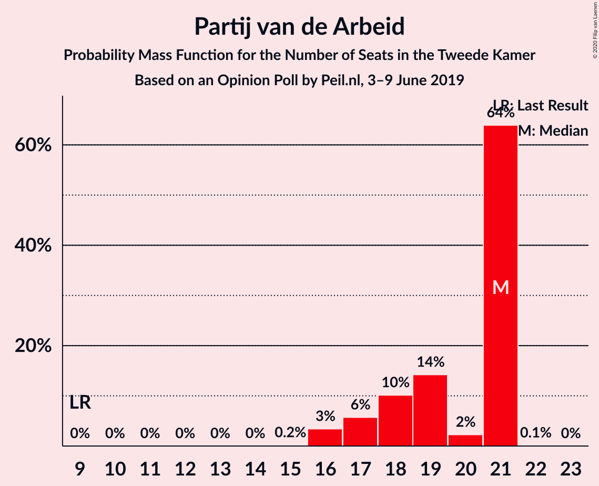

| Number of Seats | Probability | Accumulated | Special Marks |
|:---------------:|:-----------:|:-----------:|:-------------:|
| 9 | 0% | 100% | Last Result |
| 10 | 0% | 100% |  |
| 11 | 0% | 100% |  |
| 12 | 0% | 100% |  |
| 13 | 0% | 100% |  |
| 14 | 0% | 100% |  |
| 15 | 0.2% | 100% |  |
| 16 | 3% | 99.8% |  |
| 17 | 6% | 96% |  |
| 18 | 10% | 91% |  |
| 19 | 14% | 81% |  |
| 20 | 2% | 66% |  |
| 21 | 64% | 64% | Median |
| 22 | 0.1% | 0.1% |  |
| 23 | 0% | 0% |  |

### Christen-Democratisch Appèl

*For a full overview of the results for this party, see the [Christen-Democratisch Appèl](party-christen-democratischappèl.html) page.*

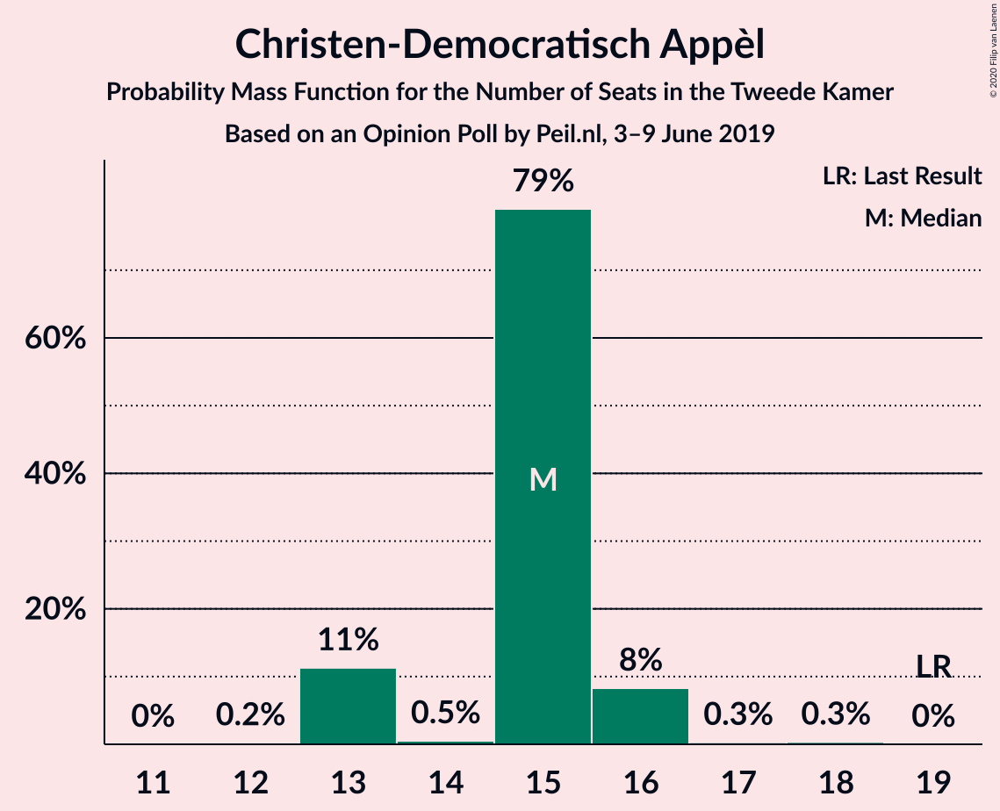

| Number of Seats | Probability | Accumulated | Special Marks |
|:---------------:|:-----------:|:-----------:|:-------------:|
| 12 | 0.1% | 100% |  |
| 13 | 6% | 99.9% |  |
| 14 | 4% | 94% |  |
| 15 | 83% | 91% | Median |
| 16 | 3% | 8% |  |
| 17 | 3% | 5% |  |
| 18 | 2% | 2% |  |
| 19 | 0.1% | 0.1% | Last Result |
| 20 | 0% | 0% |  |

### GroenLinks

*For a full overview of the results for this party, see the [GroenLinks](party-groenlinks.html) page.*

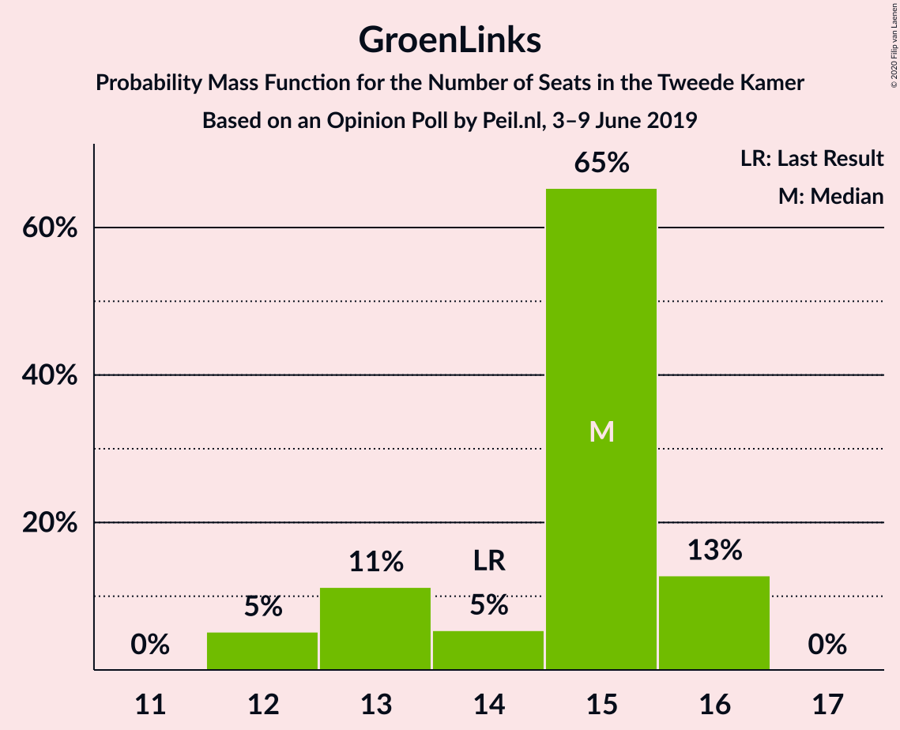

| Number of Seats | Probability | Accumulated | Special Marks |
|:---------------:|:-----------:|:-----------:|:-------------:|
| 11 | 0.1% | 100% |  |
| 12 | 2% | 99.9% |  |
| 13 | 8% | 98% |  |
| 14 | 68% | 90% | Last Result, Median |
| 15 | 19% | 22% |  |
| 16 | 3% | 3% |  |
| 17 | 0% | 0% |  |

### Democraten 66

*For a full overview of the results for this party, see the [Democraten 66](party-democraten66.html) page.*

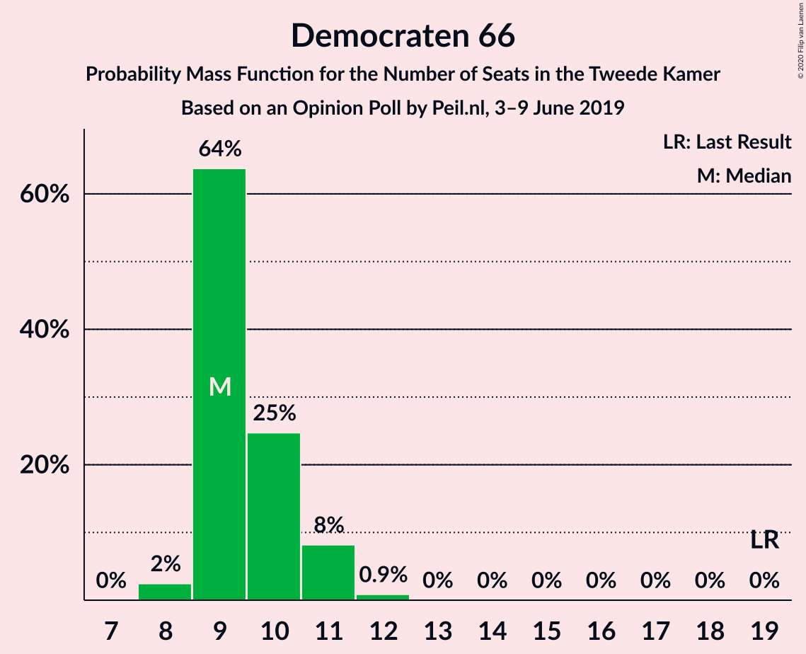

| Number of Seats | Probability | Accumulated | Special Marks |
|:---------------:|:-----------:|:-----------:|:-------------:|
| 8 | 2% | 100% |  |
| 9 | 64% | 98% | Median |
| 10 | 25% | 34% |  |
| 11 | 8% | 9% |  |
| 12 | 0.9% | 0.9% |  |
| 13 | 0% | 0% |  |
| 14 | 0% | 0% |  |
| 15 | 0% | 0% |  |
| 16 | 0% | 0% |  |
| 17 | 0% | 0% |  |
| 18 | 0% | 0% |  |
| 19 | 0% | 0% | Last Result |

### Partij voor de Vrijheid

*For a full overview of the results for this party, see the [Partij voor de Vrijheid](party-partijvoordevrijheid.html) page.*

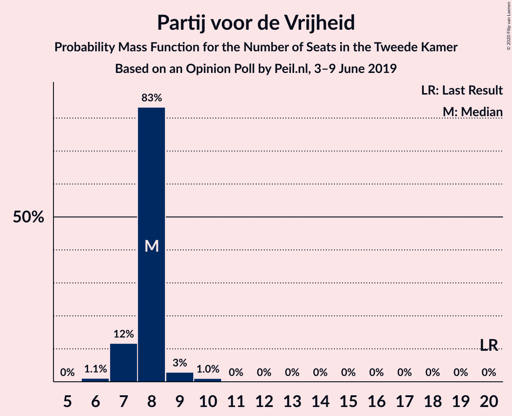

| Number of Seats | Probability | Accumulated | Special Marks |
|:---------------:|:-----------:|:-----------:|:-------------:|
| 6 | 1.1% | 100% |  |
| 7 | 12% | 98.9% |  |
| 8 | 83% | 87% | Median |
| 9 | 3% | 4% |  |
| 10 | 1.0% | 1.0% |  |
| 11 | 0% | 0% |  |
| 12 | 0% | 0% |  |
| 13 | 0% | 0% |  |
| 14 | 0% | 0% |  |
| 15 | 0% | 0% |  |
| 16 | 0% | 0% |  |
| 17 | 0% | 0% |  |
| 18 | 0% | 0% |  |
| 19 | 0% | 0% |  |
| 20 | 0% | 0% | Last Result |

### Socialistische Partij

*For a full overview of the results for this party, see the [Socialistische Partij](party-socialistischepartij.html) page.*

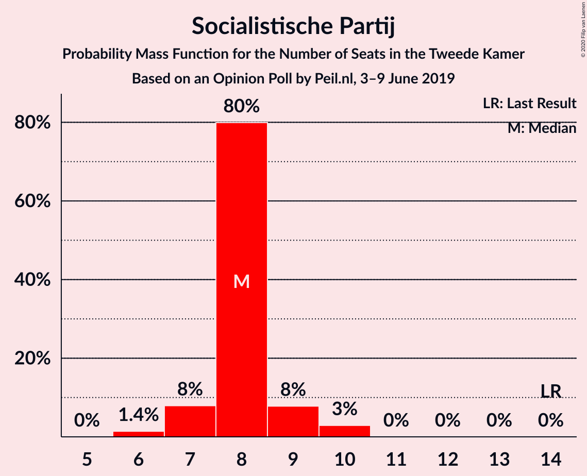

| Number of Seats | Probability | Accumulated | Special Marks |
|:---------------:|:-----------:|:-----------:|:-------------:|
| 6 | 1.1% | 100% |  |
| 7 | 8% | 98.9% |  |
| 8 | 85% | 91% | Median |
| 9 | 5% | 5% |  |
| 10 | 0.5% | 0.5% |  |
| 11 | 0% | 0% |  |
| 12 | 0% | 0% |  |
| 13 | 0% | 0% |  |
| 14 | 0% | 0% | Last Result |

### Partij voor de Dieren

*For a full overview of the results for this party, see the [Partij voor de Dieren](party-partijvoordedieren.html) page.*

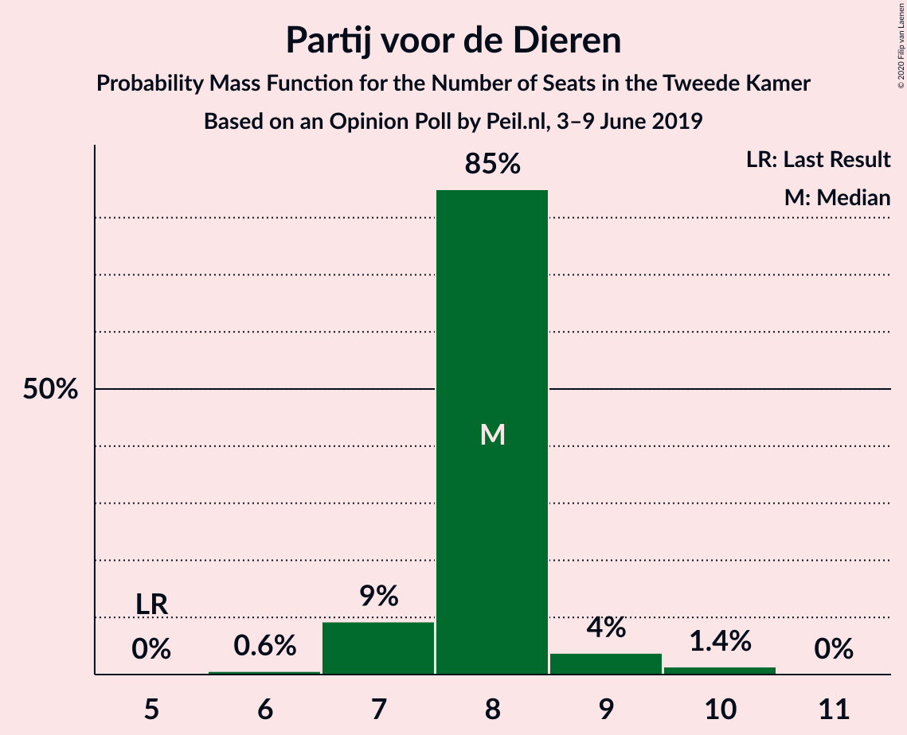

| Number of Seats | Probability | Accumulated | Special Marks |
|:---------------:|:-----------:|:-----------:|:-------------:|
| 5 | 0% | 100% | Last Result |
| 6 | 0.9% | 100% |  |
| 7 | 8% | 99.1% |  |
| 8 | 87% | 91% | Median |
| 9 | 3% | 4% |  |
| 10 | 1.5% | 1.5% |  |
| 11 | 0% | 0% |  |

### ChristenUnie

*For a full overview of the results for this party, see the [ChristenUnie](party-christenunie.html) page.*

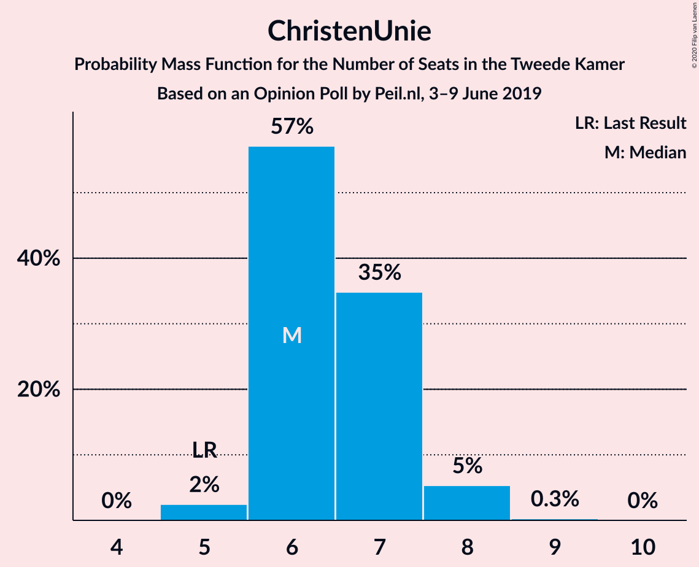

| Number of Seats | Probability | Accumulated | Special Marks |
|:---------------:|:-----------:|:-----------:|:-------------:|
| 5 | 0.2% | 100% | Last Result |
| 6 | 82% | 99.8% | Median |
| 7 | 13% | 18% |  |
| 8 | 5% | 5% |  |
| 9 | 0.3% | 0.3% |  |
| 10 | 0% | 0% |  |

### 50Plus

*For a full overview of the results for this party, see the [50Plus](party-50plus.html) page.*

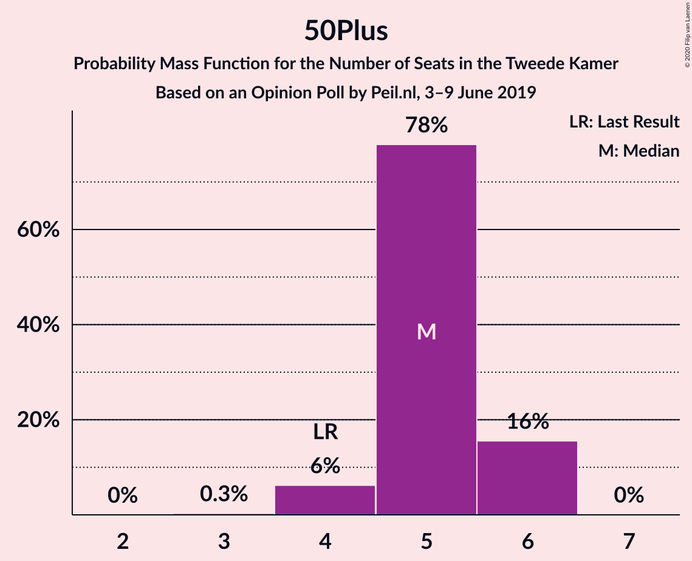

| Number of Seats | Probability | Accumulated | Special Marks |
|:---------------:|:-----------:|:-----------:|:-------------:|
| 3 | 0.3% | 100% |  |
| 4 | 6% | 99.7% | Last Result |
| 5 | 78% | 93% | Median |
| 6 | 16% | 16% |  |
| 7 | 0% | 0% |  |

### DENK

*For a full overview of the results for this party, see the [DENK](party-denk.html) page.*

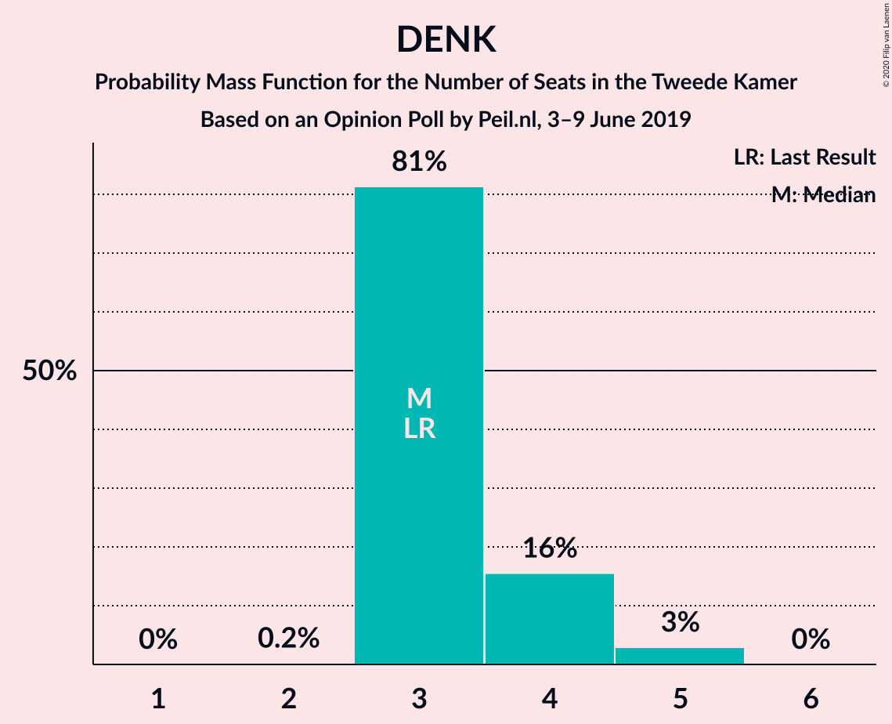

| Number of Seats | Probability | Accumulated | Special Marks |
|:---------------:|:-----------:|:-----------:|:-------------:|
| 2 | 0.2% | 100% |  |
| 3 | 81% | 99.8% | Last Result, Median |
| 4 | 16% | 18% |  |
| 5 | 3% | 3% |  |
| 6 | 0% | 0% |  |

### Staatkundig Gereformeerde Partij

*For a full overview of the results for this party, see the [Staatkundig Gereformeerde Partij](party-staatkundiggereformeerdepartij.html) page.*

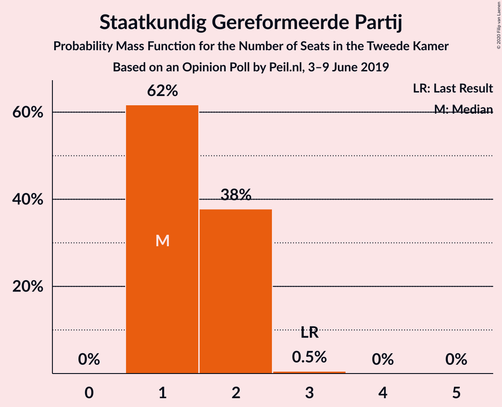

| Number of Seats | Probability | Accumulated | Special Marks |
|:---------------:|:-----------:|:-----------:|:-------------:|
| 1 | 16% | 100% |  |
| 2 | 81% | 84% | Median |
| 3 | 3% | 3% | Last Result |
| 4 | 0% | 0% |  |

## Coalitions

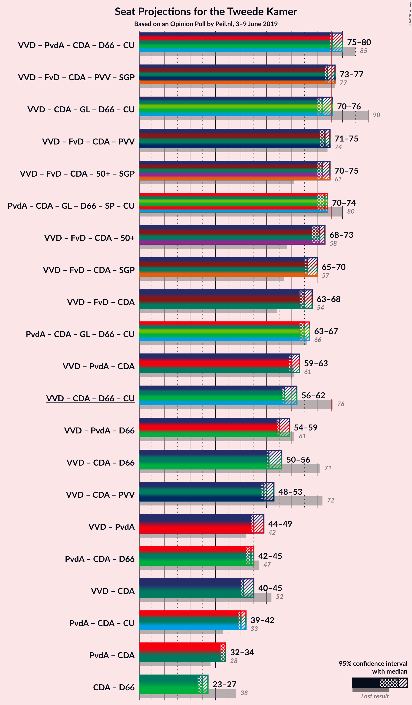

### Confidence Intervals

| Coalition | Last Result | Median | Majority? | 80% Confidence Interval | 90% Confidence Interval | 95% Confidence Interval | 99% Confidence Interval |
|:---------:|:-----------:|:------:|:---------:|:-----------------------:|:-----------------------:|:-----------------------:|:-----------------------:|
| Volkspartij voor Vrijheid en Democratie – Partij van de Arbeid – Christen-Democratisch Appèl – Democraten 66 – ChristenUnie | 85 | 79 | 96% | 76–79 | 76–80 | 75–80 | 75–81 |
| Volkspartij voor Vrijheid en Democratie – Forum voor Democratie – Christen-Democratisch Appèl – Partij voor de Vrijheid – Staatkundig Gereformeerde Partij | 77 | 75 | 11% | 74–76 | 74–76 | 73–77 | 71–79 |
| Volkspartij voor Vrijheid en Democratie – Forum voor Democratie – Christen-Democratisch Appèl – Partij voor de Vrijheid | 74 | 73 | 3% | 72–74 | 71–75 | 71–76 | 69–77 |
| Volkspartij voor Vrijheid en Democratie – Christen-Democratisch Appèl – GroenLinks – Democraten 66 – ChristenUnie | 90 | 72 | 6% | 72–75 | 72–76 | 70–76 | 70–77 |
| Volkspartij voor Vrijheid en Democratie – Forum voor Democratie – Christen-Democratisch Appèl – 50Plus – Staatkundig Gereformeerde Partij | 61 | 72 | 0.4% | 71–73 | 71–74 | 70–74 | 68–75 |
| Partij van de Arbeid – Christen-Democratisch Appèl – GroenLinks – Democraten 66 – Socialistische Partij – ChristenUnie | 80 | 73 | 0.7% | 71–73 | 71–73 | 70–74 | 69–76 |
| Volkspartij voor Vrijheid en Democratie – Forum voor Democratie – Christen-Democratisch Appèl – 50Plus | 58 | 70 | 0% | 69–72 | 68–72 | 68–73 | 67–73 |
| Volkspartij voor Vrijheid en Democratie – Forum voor Democratie – Christen-Democratisch Appèl – Staatkundig Gereformeerde Partij | 57 | 67 | 0% | 66–68 | 66–69 | 65–70 | 64–71 |
| Volkspartij voor Vrijheid en Democratie – Forum voor Democratie – Christen-Democratisch Appèl | 54 | 65 | 0% | 64–66 | 63–67 | 63–69 | 62–69 |
| Partij van de Arbeid – Christen-Democratisch Appèl – GroenLinks – Democraten 66 – ChristenUnie | 66 | 65 | 0% | 63–65 | 63–65 | 62–67 | 61–67 |
| Volkspartij voor Vrijheid en Democratie – Partij van de Arbeid – Christen-Democratisch Appèl | 61 | 64 | 0% | 60–64 | 59–64 | 58–64 | 58–64 |
| Volkspartij voor Vrijheid en Democratie – Christen-Democratisch Appèl – Democraten 66 – ChristenUnie | 76 | 58 | 0% | 57–61 | 57–62 | 57–62 | 56–63 |
| Volkspartij voor Vrijheid en Democratie – Partij van de Arbeid – Democraten 66 | 61 | 58 | 0% | 55–58 | 54–58 | 52–59 | 52–59 |
| Volkspartij voor Vrijheid en Democratie – Christen-Democratisch Appèl – Democraten 66 | 71 | 52 | 0% | 51–53 | 51–55 | 50–56 | 49–56 |
| Volkspartij voor Vrijheid en Democratie – Christen-Democratisch Appèl – Partij voor de Vrijheid | 72 | 51 | 0% | 49–51 | 49–52 | 48–53 | 47–54 |
| Volkspartij voor Vrijheid en Democratie – Partij van de Arbeid | 42 | 49 | 0% | 45–49 | 44–49 | 43–49 | 42–49 |
| Partij van de Arbeid – Christen-Democratisch Appèl – Democraten 66 | 47 | 45 | 0% | 43–45 | 41–45 | 41–46 | 40–46 |
| Volkspartij voor Vrijheid en Democratie – Christen-Democratisch Appèl | 52 | 43 | 0% | 41–43 | 41–45 | 40–45 | 39–46 |
| Partij van de Arbeid – Christen-Democratisch Appèl – ChristenUnie | 33 | 42 | 0% | 39–42 | 39–42 | 38–42 | 37–43 |
| Partij van de Arbeid – Christen-Democratisch Appèl | 28 | 36 | 0% | 33–36 | 32–36 | 31–36 | 30–36 |
| Christen-Democratisch Appèl – Democraten 66 | 38 | 24 | 0% | 24–25 | 23–27 | 23–27 | 23–29 |

### Volkspartij voor Vrijheid en Democratie – Partij van de Arbeid – Christen-Democratisch Appèl – Democraten 66 – ChristenUnie

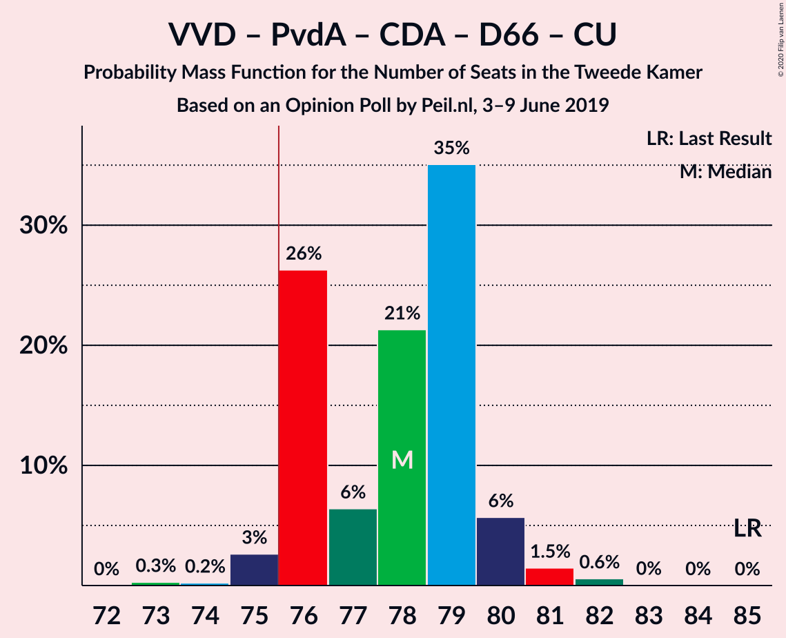

| Number of Seats | Probability | Accumulated | Special Marks |
|:---------------:|:-----------:|:-----------:|:-------------:|
| 73 | 0.2% | 100% |  |
| 74 | 0.2% | 99.8% |  |
| 75 | 4% | 99.5% |  |
| 76 | 14% | 96% | Majority |
| 77 | 3% | 81% |  |
| 78 | 6% | 79% |  |
| 79 | 67% | 73% | Median |
| 80 | 4% | 6% |  |
| 81 | 1.2% | 1.3% |  |
| 82 | 0.1% | 0.2% |  |
| 83 | 0.1% | 0.1% |  |
| 84 | 0% | 0% |  |
| 85 | 0% | 0% | Last Result |

### Volkspartij voor Vrijheid en Democratie – Forum voor Democratie – Christen-Democratisch Appèl – Partij voor de Vrijheid – Staatkundig Gereformeerde Partij

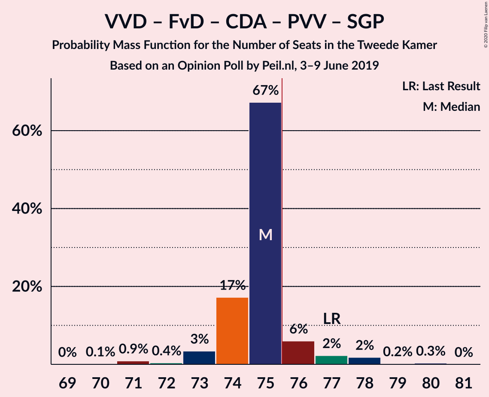

| Number of Seats | Probability | Accumulated | Special Marks |
|:---------------:|:-----------:|:-----------:|:-------------:|
| 70 | 0.1% | 100% |  |
| 71 | 0.9% | 99.8% |  |
| 72 | 0.4% | 98.9% |  |
| 73 | 3% | 98.5% |  |
| 74 | 17% | 95% |  |
| 75 | 67% | 78% | Median |
| 76 | 6% | 11% | Majority |
| 77 | 2% | 5% | Last Result |
| 78 | 2% | 2% |  |
| 79 | 0.2% | 0.5% |  |
| 80 | 0.3% | 0.3% |  |
| 81 | 0% | 0% |  |

### Volkspartij voor Vrijheid en Democratie – Forum voor Democratie – Christen-Democratisch Appèl – Partij voor de Vrijheid

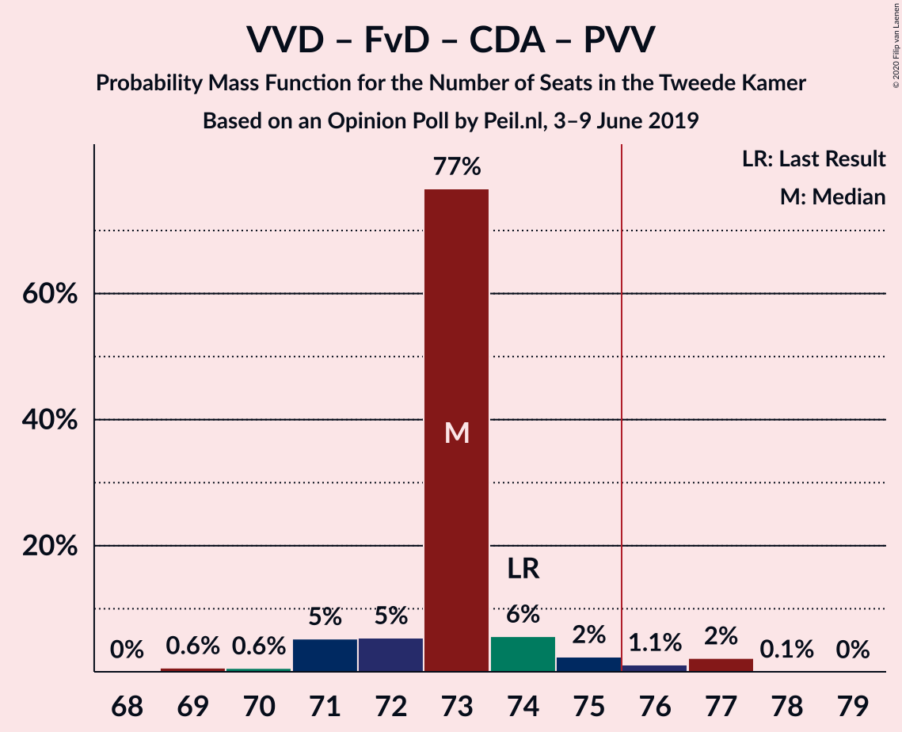

| Number of Seats | Probability | Accumulated | Special Marks |
|:---------------:|:-----------:|:-----------:|:-------------:|
| 69 | 0.6% | 100% |  |
| 70 | 0.6% | 99.3% |  |
| 71 | 5% | 98.7% |  |
| 72 | 5% | 93% |  |
| 73 | 77% | 88% | Median |
| 74 | 6% | 11% | Last Result |
| 75 | 2% | 6% |  |
| 76 | 1.1% | 3% | Majority |
| 77 | 2% | 2% |  |
| 78 | 0.1% | 0.1% |  |
| 79 | 0% | 0% |  |

### Volkspartij voor Vrijheid en Democratie – Christen-Democratisch Appèl – GroenLinks – Democraten 66 – ChristenUnie

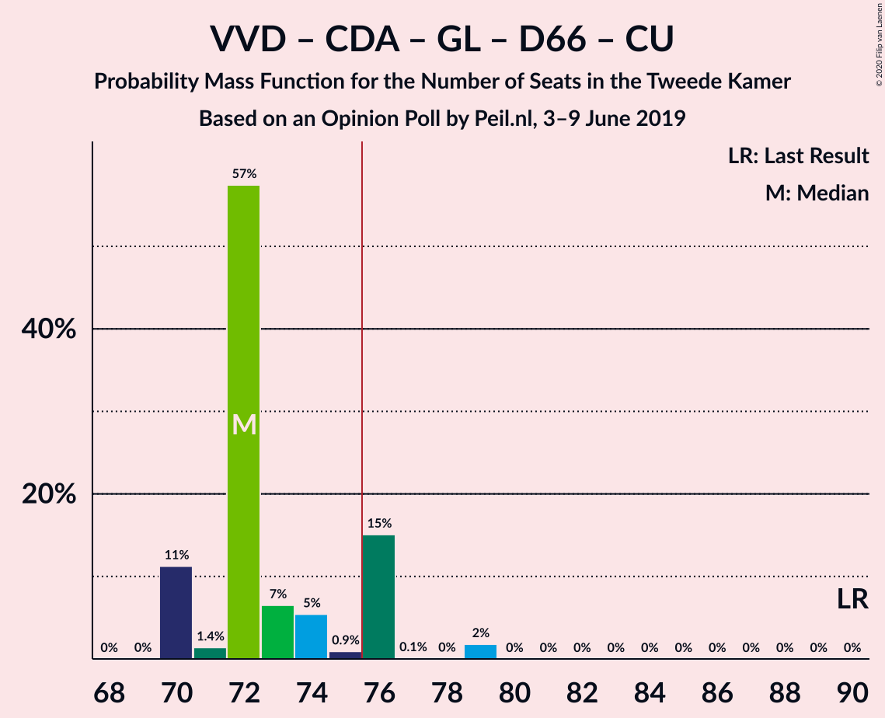

| Number of Seats | Probability | Accumulated | Special Marks |
|:---------------:|:-----------:|:-----------:|:-------------:|
| 70 | 3% | 100% |  |
| 71 | 2% | 97% |  |
| 72 | 73% | 95% | Median |
| 73 | 5% | 22% |  |
| 74 | 6% | 17% |  |
| 75 | 5% | 11% |  |
| 76 | 5% | 6% | Majority |
| 77 | 0.5% | 0.9% |  |
| 78 | 0.1% | 0.4% |  |
| 79 | 0.3% | 0.4% |  |
| 80 | 0% | 0% |  |
| 81 | 0% | 0% |  |
| 82 | 0% | 0% |  |
| 83 | 0% | 0% |  |
| 84 | 0% | 0% |  |
| 85 | 0% | 0% |  |
| 86 | 0% | 0% |  |
| 87 | 0% | 0% |  |
| 88 | 0% | 0% |  |
| 89 | 0% | 0% |  |
| 90 | 0% | 0% | Last Result |

### Volkspartij voor Vrijheid en Democratie – Forum voor Democratie – Christen-Democratisch Appèl – 50Plus – Staatkundig Gereformeerde Partij

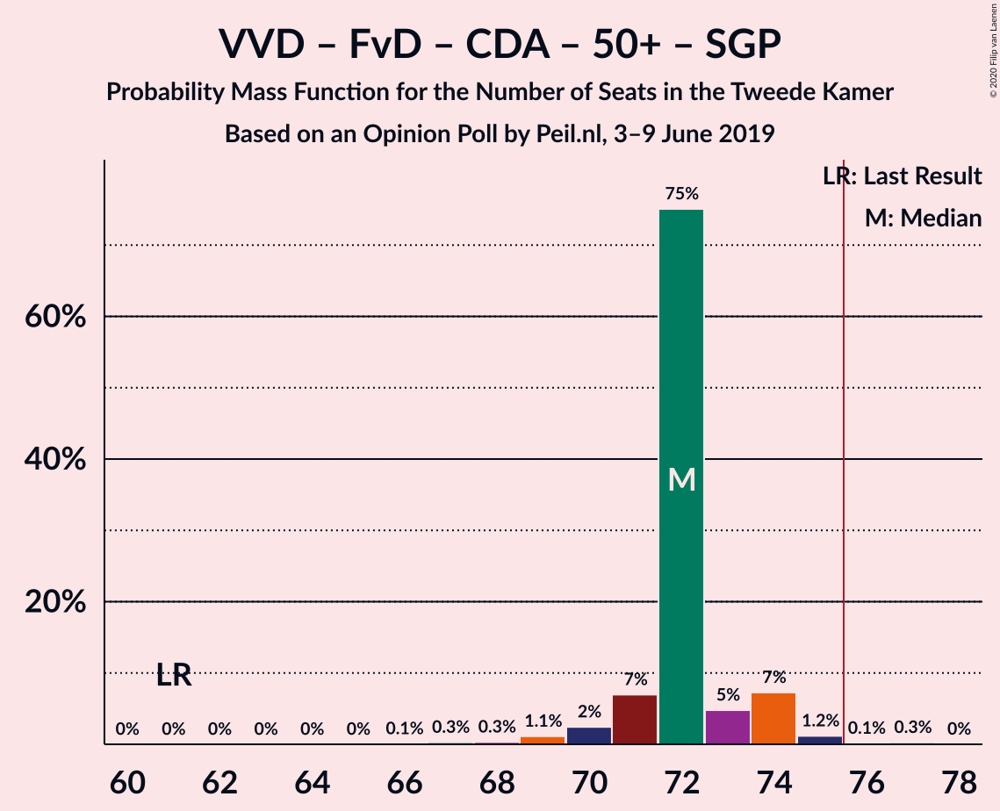

| Number of Seats | Probability | Accumulated | Special Marks |
|:---------------:|:-----------:|:-----------:|:-------------:|
| 61 | 0% | 100% | Last Result |
| 62 | 0% | 100% |  |
| 63 | 0% | 100% |  |
| 64 | 0% | 100% |  |
| 65 | 0% | 100% |  |
| 66 | 0.1% | 100% |  |
| 67 | 0.3% | 99.9% |  |
| 68 | 0.3% | 99.6% |  |
| 69 | 1.1% | 99.3% |  |
| 70 | 2% | 98% |  |
| 71 | 7% | 96% |  |
| 72 | 75% | 89% | Median |
| 73 | 5% | 14% |  |
| 74 | 7% | 9% |  |
| 75 | 1.2% | 2% |  |
| 76 | 0.1% | 0.4% | Majority |
| 77 | 0.3% | 0.3% |  |
| 78 | 0% | 0% |  |

### Partij van de Arbeid – Christen-Democratisch Appèl – GroenLinks – Democraten 66 – Socialistische Partij – ChristenUnie

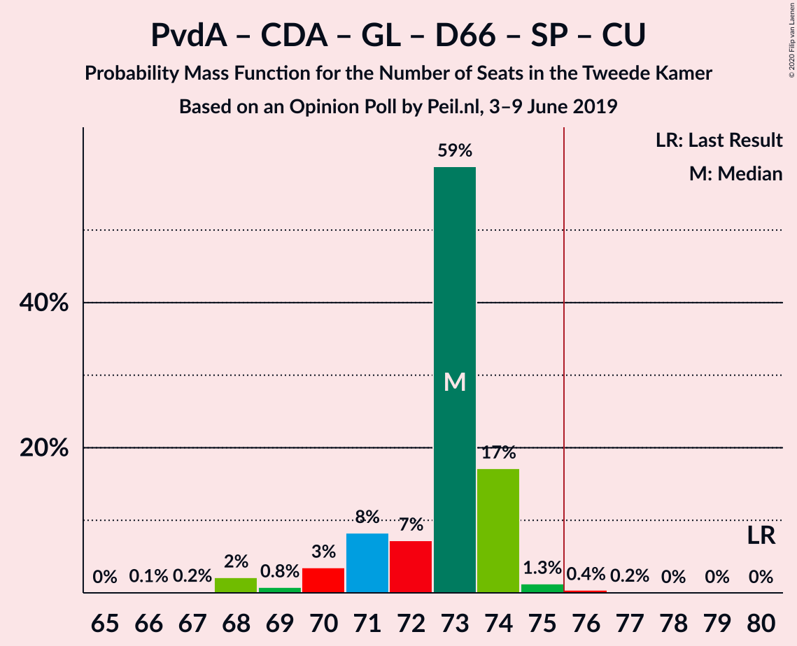

| Number of Seats | Probability | Accumulated | Special Marks |
|:---------------:|:-----------:|:-----------:|:-------------:|
| 67 | 0.3% | 100% |  |
| 68 | 0.2% | 99.7% |  |
| 69 | 1.1% | 99.6% |  |
| 70 | 2% | 98% |  |
| 71 | 7% | 96% |  |
| 72 | 10% | 90% |  |
| 73 | 74% | 79% | Median |
| 74 | 4% | 5% |  |
| 75 | 0.5% | 1.2% |  |
| 76 | 0.5% | 0.7% | Majority |
| 77 | 0.2% | 0.2% |  |
| 78 | 0% | 0% |  |
| 79 | 0% | 0% |  |
| 80 | 0% | 0% | Last Result |

### Volkspartij voor Vrijheid en Democratie – Forum voor Democratie – Christen-Democratisch Appèl – 50Plus

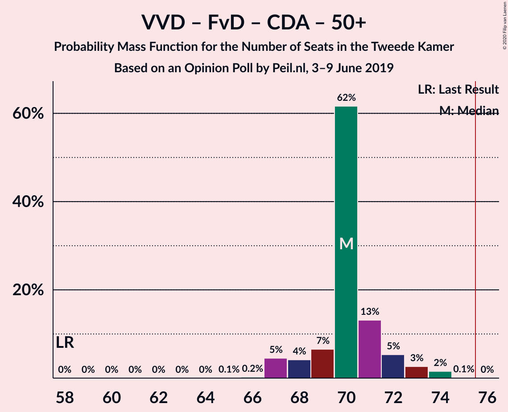

| Number of Seats | Probability | Accumulated | Special Marks |
|:---------------:|:-----------:|:-----------:|:-------------:|
| 58 | 0% | 100% | Last Result |
| 59 | 0% | 100% |  |
| 60 | 0% | 100% |  |
| 61 | 0% | 100% |  |
| 62 | 0% | 100% |  |
| 63 | 0% | 100% |  |
| 64 | 0% | 100% |  |
| 65 | 0.1% | 100% |  |
| 66 | 0.3% | 99.9% |  |
| 67 | 1.1% | 99.6% |  |
| 68 | 4% | 98% |  |
| 69 | 5% | 94% |  |
| 70 | 64% | 89% | Median |
| 71 | 14% | 24% |  |
| 72 | 6% | 10% |  |
| 73 | 4% | 4% |  |
| 74 | 0.3% | 0.4% |  |
| 75 | 0.1% | 0.1% |  |
| 76 | 0% | 0% | Majority |

### Volkspartij voor Vrijheid en Democratie – Forum voor Democratie – Christen-Democratisch Appèl – Staatkundig Gereformeerde Partij

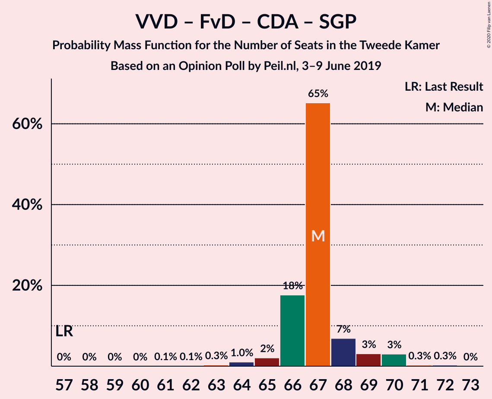

| Number of Seats | Probability | Accumulated | Special Marks |
|:---------------:|:-----------:|:-----------:|:-------------:|
| 57 | 0% | 100% | Last Result |
| 58 | 0% | 100% |  |
| 59 | 0% | 100% |  |
| 60 | 0% | 100% |  |
| 61 | 0.1% | 100% |  |
| 62 | 0.1% | 99.9% |  |
| 63 | 0.3% | 99.8% |  |
| 64 | 1.0% | 99.5% |  |
| 65 | 2% | 98% |  |
| 66 | 18% | 96% |  |
| 67 | 65% | 79% | Median |
| 68 | 7% | 14% |  |
| 69 | 3% | 7% |  |
| 70 | 3% | 4% |  |
| 71 | 0.3% | 0.6% |  |
| 72 | 0.3% | 0.3% |  |
| 73 | 0% | 0% |  |

### Volkspartij voor Vrijheid en Democratie – Forum voor Democratie – Christen-Democratisch Appèl

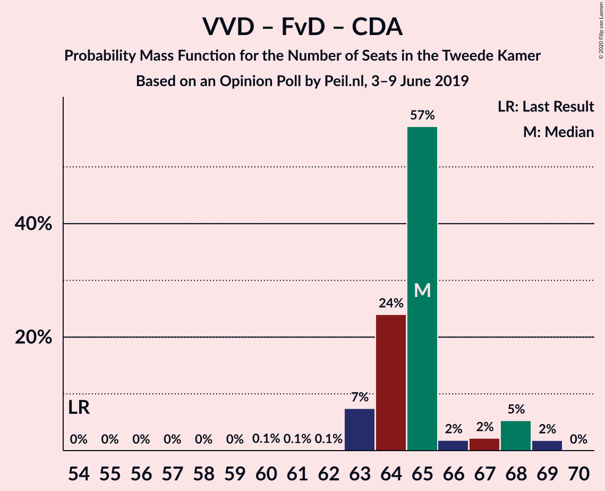

| Number of Seats | Probability | Accumulated | Special Marks |
|:---------------:|:-----------:|:-----------:|:-------------:|
| 54 | 0% | 100% | Last Result |
| 55 | 0% | 100% |  |
| 56 | 0% | 100% |  |
| 57 | 0% | 100% |  |
| 58 | 0% | 100% |  |
| 59 | 0% | 100% |  |
| 60 | 0.1% | 100% |  |
| 61 | 0.1% | 99.9% |  |
| 62 | 0.9% | 99.8% |  |
| 63 | 4% | 98.9% |  |
| 64 | 6% | 95% |  |
| 65 | 75% | 89% | Median |
| 66 | 5% | 14% |  |
| 67 | 5% | 9% |  |
| 68 | 1.1% | 4% |  |
| 69 | 2% | 3% |  |
| 70 | 0.1% | 0.1% |  |
| 71 | 0% | 0% |  |

### Partij van de Arbeid – Christen-Democratisch Appèl – GroenLinks – Democraten 66 – ChristenUnie

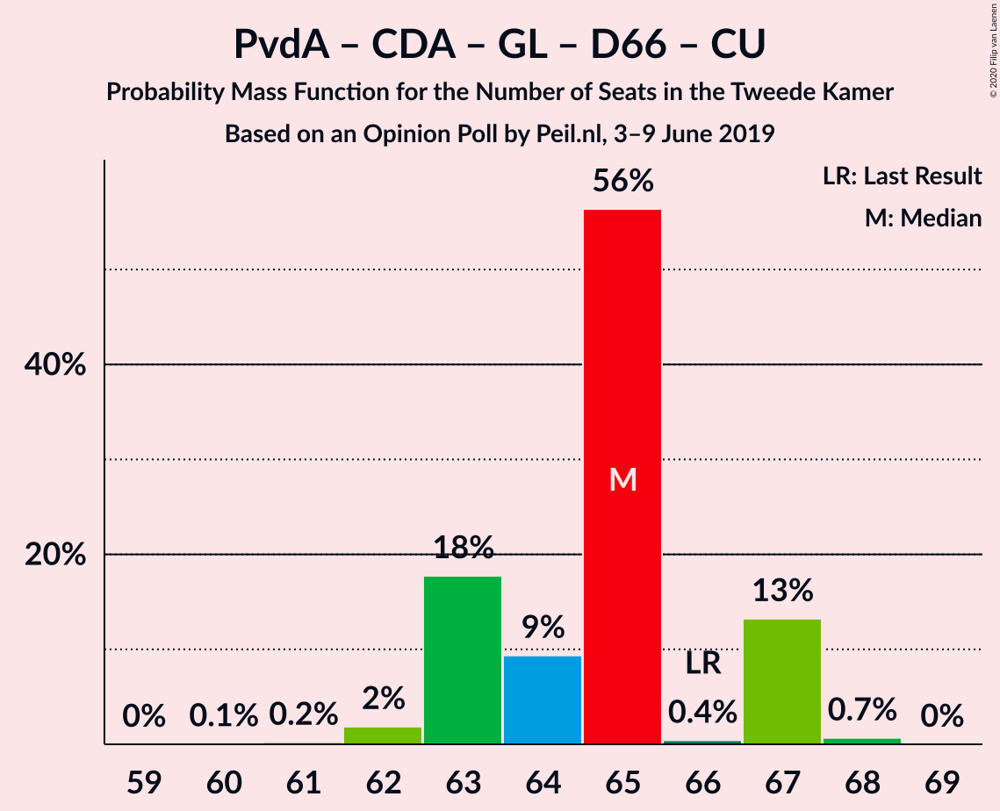

| Number of Seats | Probability | Accumulated | Special Marks |
|:---------------:|:-----------:|:-----------:|:-------------:|
| 60 | 0.4% | 100% |  |
| 61 | 0.2% | 99.6% |  |
| 62 | 3% | 99.5% |  |
| 63 | 9% | 97% |  |
| 64 | 5% | 88% |  |
| 65 | 78% | 83% | Median |
| 66 | 1.4% | 5% | Last Result |
| 67 | 3% | 3% |  |
| 68 | 0.2% | 0.2% |  |
| 69 | 0% | 0% |  |

### Volkspartij voor Vrijheid en Democratie – Partij van de Arbeid – Christen-Democratisch Appèl

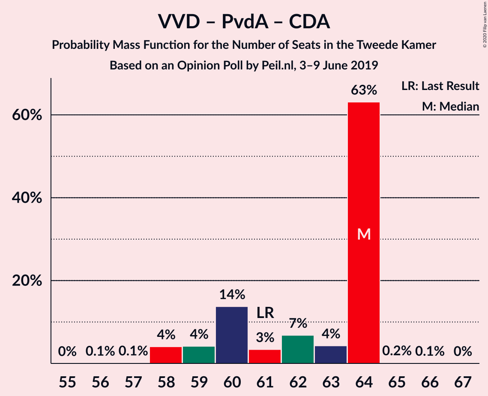

| Number of Seats | Probability | Accumulated | Special Marks |
|:---------------:|:-----------:|:-----------:|:-------------:|
| 56 | 0.1% | 100% |  |
| 57 | 0.1% | 99.9% |  |
| 58 | 4% | 99.8% |  |
| 59 | 4% | 96% |  |
| 60 | 14% | 92% |  |
| 61 | 3% | 78% | Last Result |
| 62 | 7% | 74% |  |
| 63 | 4% | 68% |  |
| 64 | 63% | 63% | Median |
| 65 | 0.2% | 0.3% |  |
| 66 | 0.1% | 0.1% |  |
| 67 | 0% | 0% |  |

### Volkspartij voor Vrijheid en Democratie – Christen-Democratisch Appèl – Democraten 66 – ChristenUnie

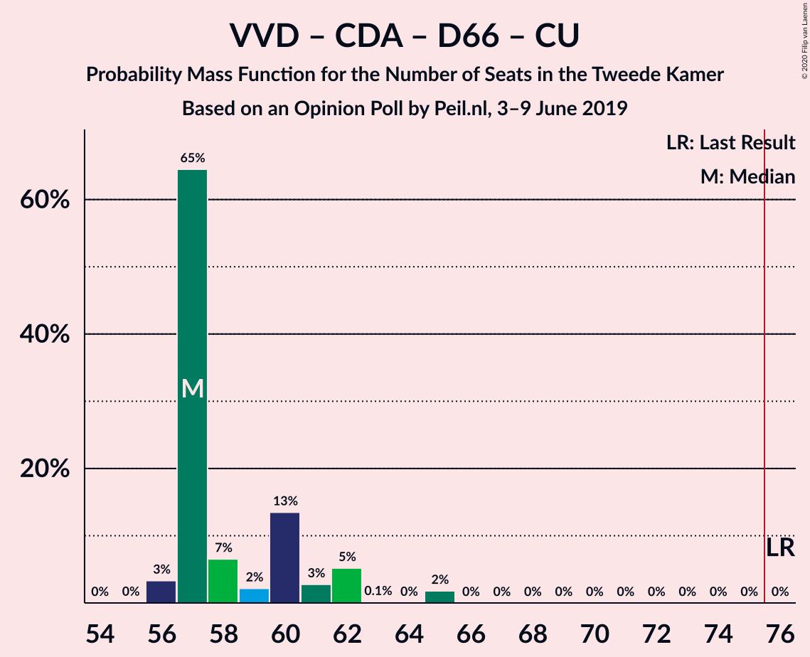

| Number of Seats | Probability | Accumulated | Special Marks |
|:---------------:|:-----------:|:-----------:|:-------------:|
| 55 | 0.1% | 100% |  |
| 56 | 0.8% | 99.9% |  |
| 57 | 14% | 99.0% |  |
| 58 | 64% | 85% | Median |
| 59 | 8% | 21% |  |
| 60 | 4% | 14% |  |
| 61 | 4% | 10% |  |
| 62 | 6% | 7% |  |
| 63 | 0.3% | 0.7% |  |
| 64 | 0.1% | 0.5% |  |
| 65 | 0.4% | 0.4% |  |
| 66 | 0% | 0% |  |
| 67 | 0% | 0% |  |
| 68 | 0% | 0% |  |
| 69 | 0% | 0% |  |
| 70 | 0% | 0% |  |
| 71 | 0% | 0% |  |
| 72 | 0% | 0% |  |
| 73 | 0% | 0% |  |
| 74 | 0% | 0% |  |
| 75 | 0% | 0% |  |
| 76 | 0% | 0% | Last Result, Majority |

### Volkspartij voor Vrijheid en Democratie – Partij van de Arbeid – Democraten 66

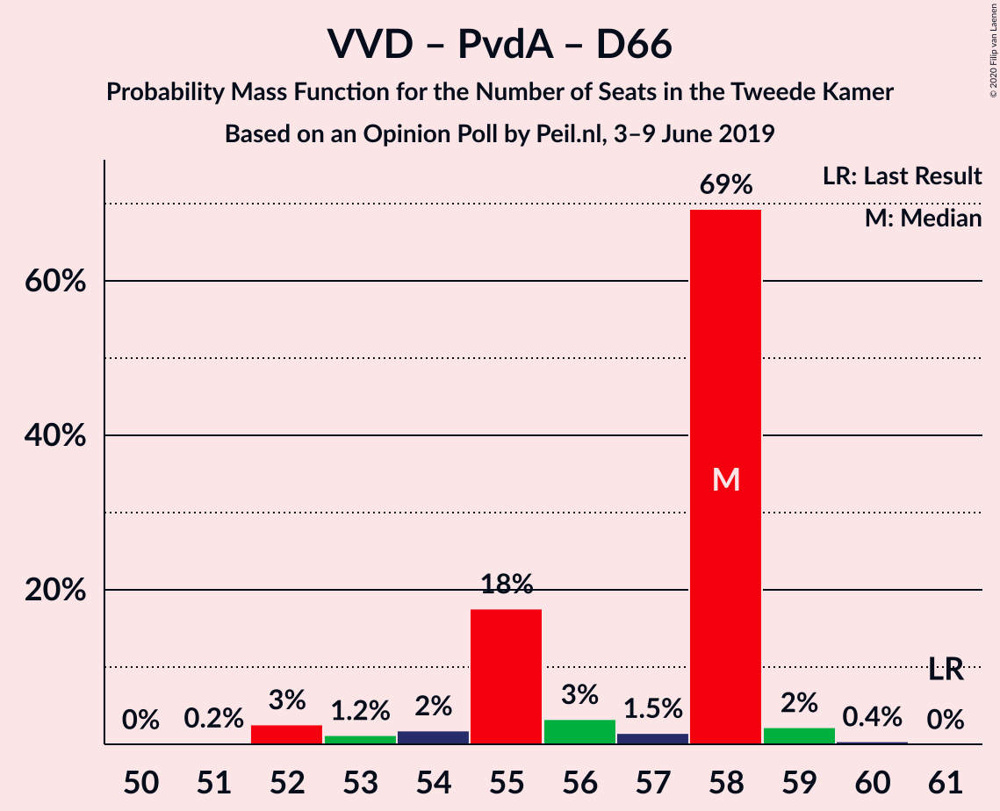

| Number of Seats | Probability | Accumulated | Special Marks |
|:---------------:|:-----------:|:-----------:|:-------------:|
| 51 | 0.2% | 100% |  |
| 52 | 3% | 99.8% |  |
| 53 | 1.2% | 97% |  |
| 54 | 2% | 96% |  |
| 55 | 18% | 94% |  |
| 56 | 3% | 77% |  |
| 57 | 1.5% | 73% |  |
| 58 | 69% | 72% | Median |
| 59 | 2% | 3% |  |
| 60 | 0.4% | 0.4% |  |
| 61 | 0% | 0% | Last Result |

### Volkspartij voor Vrijheid en Democratie – Christen-Democratisch Appèl – Democraten 66

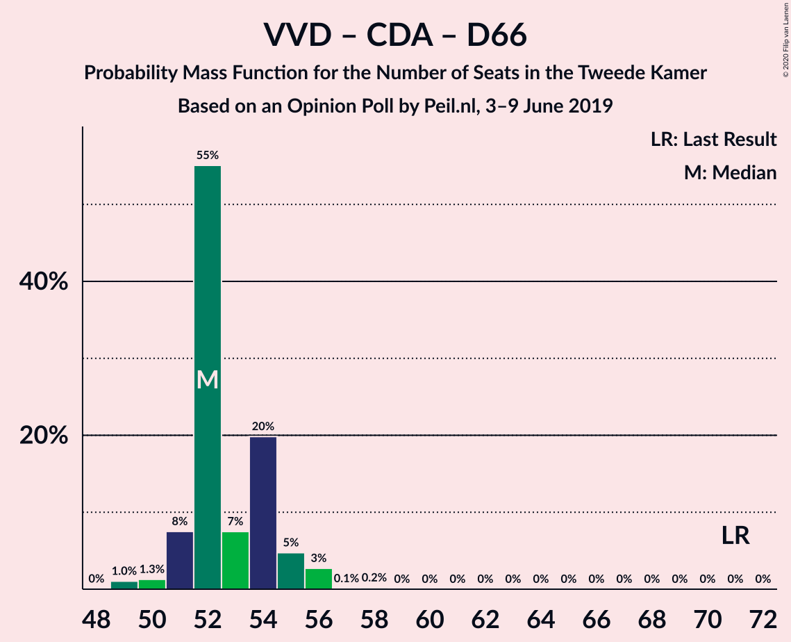

| Number of Seats | Probability | Accumulated | Special Marks |
|:---------------:|:-----------:|:-----------:|:-------------:|
| 49 | 2% | 100% |  |
| 50 | 2% | 98% |  |
| 51 | 13% | 96% |  |
| 52 | 69% | 83% | Median |
| 53 | 4% | 14% |  |
| 54 | 1.4% | 10% |  |
| 55 | 5% | 9% |  |
| 56 | 3% | 3% |  |
| 57 | 0.1% | 0.5% |  |
| 58 | 0.4% | 0.4% |  |
| 59 | 0% | 0% |  |
| 60 | 0% | 0% |  |
| 61 | 0% | 0% |  |
| 62 | 0% | 0% |  |
| 63 | 0% | 0% |  |
| 64 | 0% | 0% |  |
| 65 | 0% | 0% |  |
| 66 | 0% | 0% |  |
| 67 | 0% | 0% |  |
| 68 | 0% | 0% |  |
| 69 | 0% | 0% |  |
| 70 | 0% | 0% |  |
| 71 | 0% | 0% | Last Result |

### Volkspartij voor Vrijheid en Democratie – Christen-Democratisch Appèl – Partij voor de Vrijheid

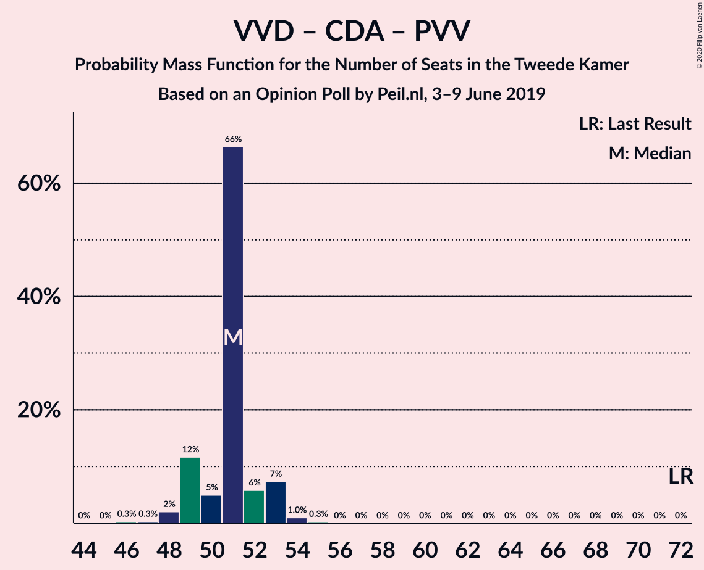

| Number of Seats | Probability | Accumulated | Special Marks |
|:---------------:|:-----------:|:-----------:|:-------------:|
| 46 | 0.5% | 100% |  |
| 47 | 0.3% | 99.5% |  |
| 48 | 3% | 99.2% |  |
| 49 | 14% | 96% |  |
| 50 | 6% | 82% |  |
| 51 | 69% | 76% | Median |
| 52 | 3% | 7% |  |
| 53 | 3% | 3% |  |
| 54 | 0.2% | 0.7% |  |
| 55 | 0.4% | 0.4% |  |
| 56 | 0% | 0% |  |
| 57 | 0% | 0% |  |
| 58 | 0% | 0% |  |
| 59 | 0% | 0% |  |
| 60 | 0% | 0% |  |
| 61 | 0% | 0% |  |
| 62 | 0% | 0% |  |
| 63 | 0% | 0% |  |
| 64 | 0% | 0% |  |
| 65 | 0% | 0% |  |
| 66 | 0% | 0% |  |
| 67 | 0% | 0% |  |
| 68 | 0% | 0% |  |
| 69 | 0% | 0% |  |
| 70 | 0% | 0% |  |
| 71 | 0% | 0% |  |
| 72 | 0% | 0% | Last Result |

### Volkspartij voor Vrijheid en Democratie – Partij van de Arbeid

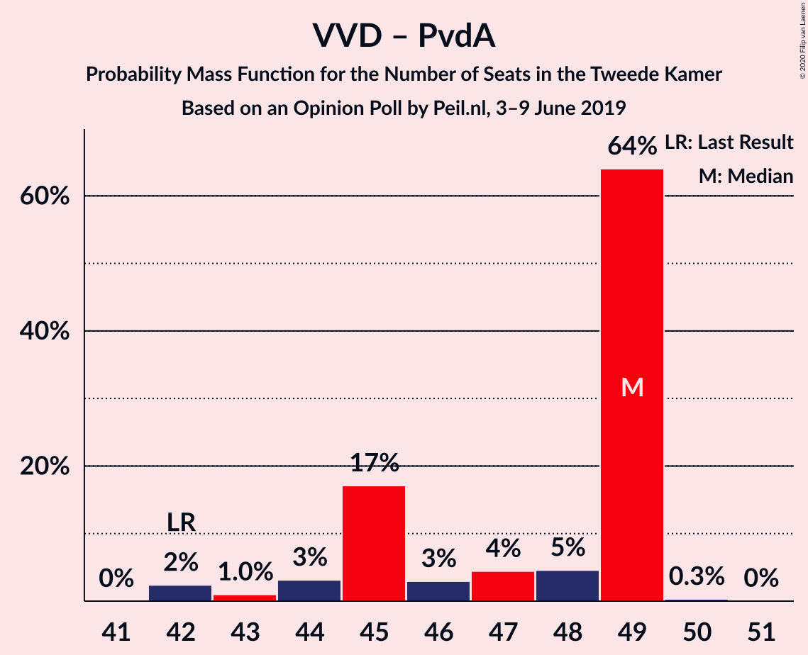

| Number of Seats | Probability | Accumulated | Special Marks |
|:---------------:|:-----------:|:-----------:|:-------------:|
| 42 | 2% | 100% | Last Result |
| 43 | 1.0% | 98% |  |
| 44 | 3% | 97% |  |
| 45 | 17% | 93% |  |
| 46 | 3% | 76% |  |
| 47 | 4% | 73% |  |
| 48 | 5% | 69% |  |
| 49 | 64% | 64% | Median |
| 50 | 0.3% | 0.4% |  |
| 51 | 0% | 0% |  |

### Partij van de Arbeid – Christen-Democratisch Appèl – Democraten 66

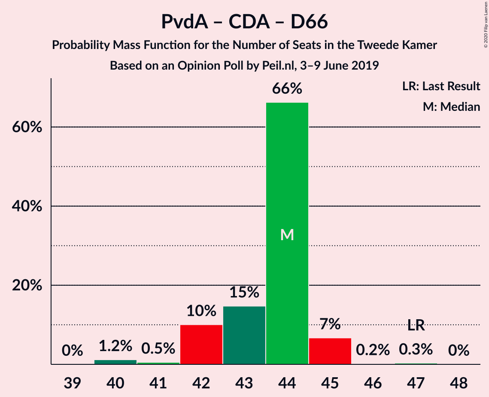

| Number of Seats | Probability | Accumulated | Special Marks |
|:---------------:|:-----------:|:-----------:|:-------------:|
| 40 | 0.5% | 100% |  |
| 41 | 5% | 99.4% |  |
| 42 | 3% | 95% |  |
| 43 | 9% | 91% |  |
| 44 | 15% | 83% |  |
| 45 | 64% | 67% | Median |
| 46 | 3% | 3% |  |
| 47 | 0.1% | 0.2% | Last Result |
| 48 | 0% | 0% |  |

### Volkspartij voor Vrijheid en Democratie – Christen-Democratisch Appèl

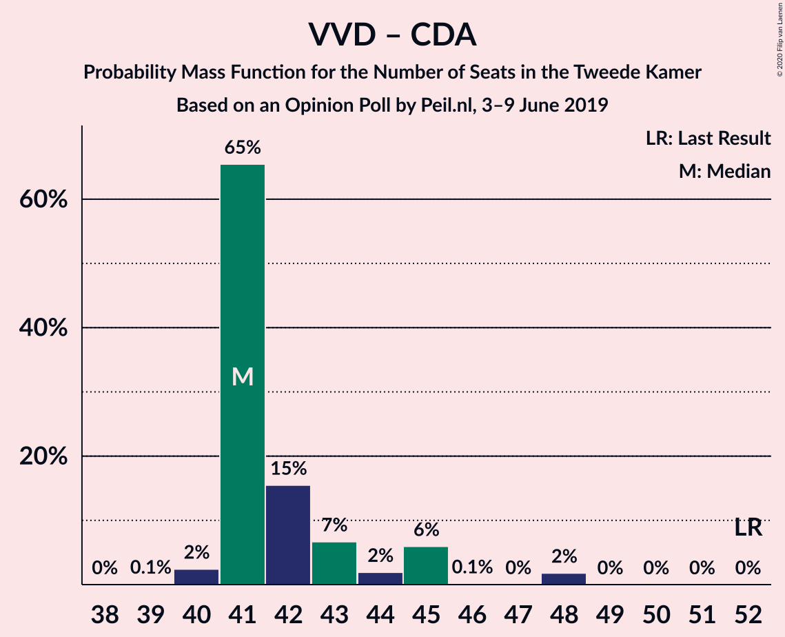

| Number of Seats | Probability | Accumulated | Special Marks |
|:---------------:|:-----------:|:-----------:|:-------------:|
| 38 | 0.1% | 100% |  |
| 39 | 0.8% | 99.9% |  |
| 40 | 2% | 99.1% |  |
| 41 | 15% | 97% |  |
| 42 | 5% | 82% |  |
| 43 | 67% | 77% | Median |
| 44 | 3% | 10% |  |
| 45 | 6% | 6% |  |
| 46 | 0.3% | 0.7% |  |
| 47 | 0.1% | 0.4% |  |
| 48 | 0.3% | 0.3% |  |
| 49 | 0% | 0% |  |
| 50 | 0% | 0% |  |
| 51 | 0% | 0% |  |
| 52 | 0% | 0% | Last Result |

### Partij van de Arbeid – Christen-Democratisch Appèl – ChristenUnie

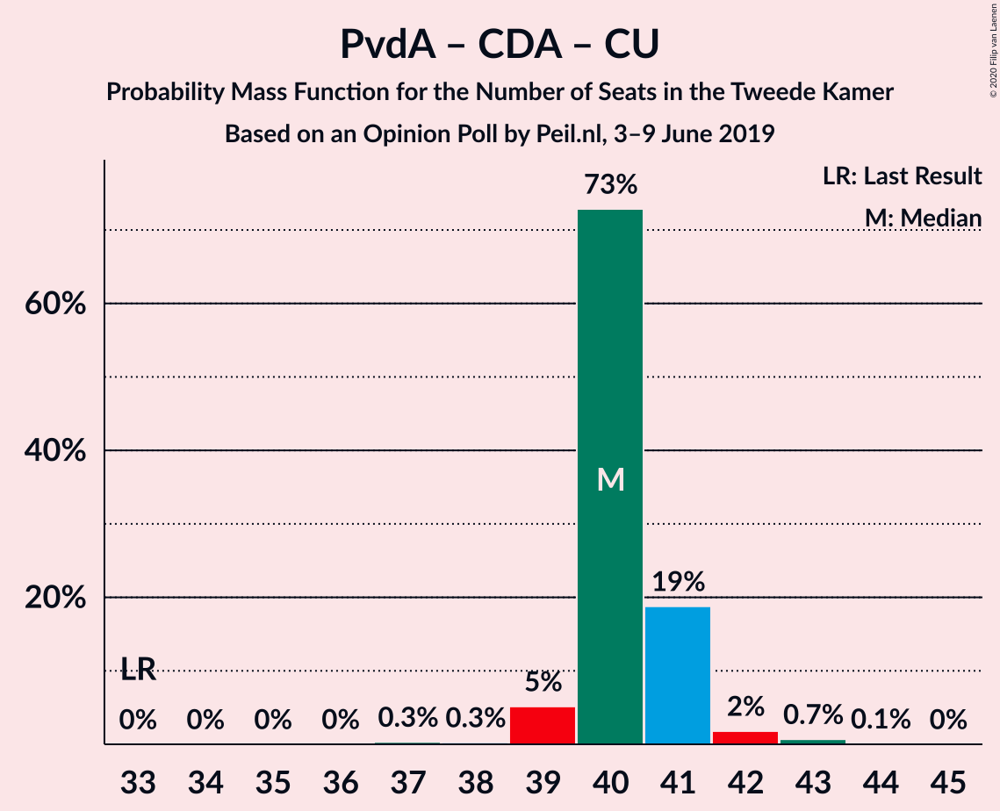

| Number of Seats | Probability | Accumulated | Special Marks |
|:---------------:|:-----------:|:-----------:|:-------------:|
| 33 | 0% | 100% | Last Result |
| 34 | 0% | 100% |  |
| 35 | 0% | 100% |  |
| 36 | 0% | 100% |  |
| 37 | 2% | 100% |  |
| 38 | 2% | 98% |  |
| 39 | 7% | 95% |  |
| 40 | 16% | 88% |  |
| 41 | 7% | 72% |  |
| 42 | 64% | 65% | Median |
| 43 | 1.1% | 2% |  |
| 44 | 0.4% | 0.4% |  |
| 45 | 0% | 0% |  |

### Partij van de Arbeid – Christen-Democratisch Appèl

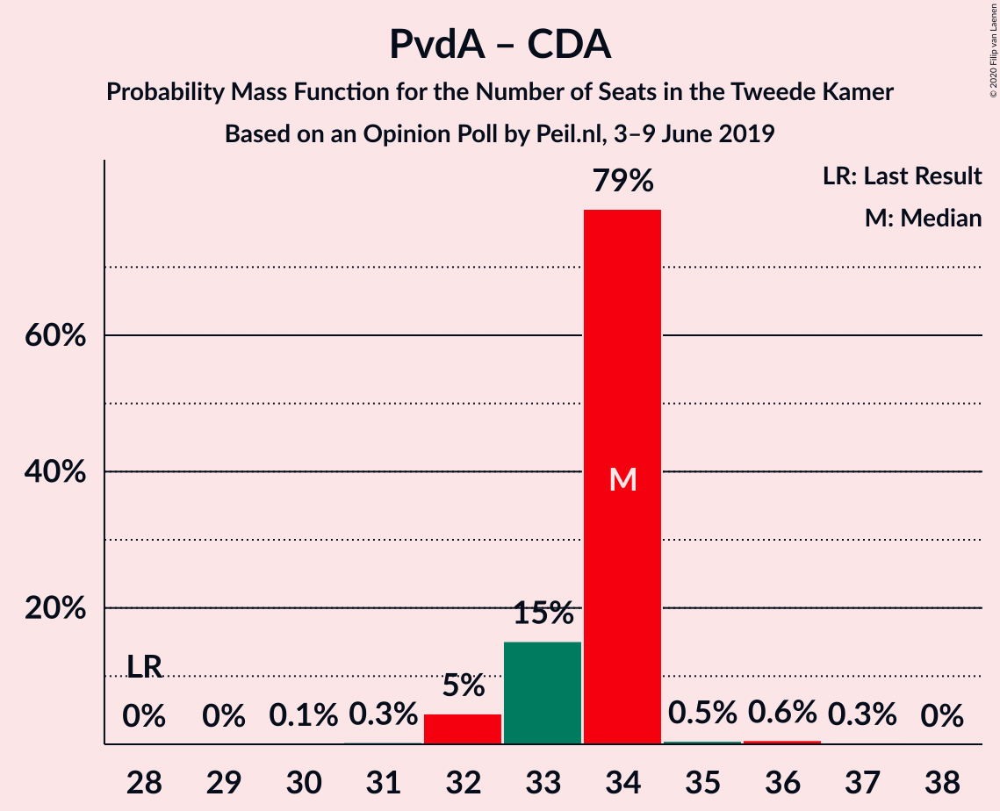

| Number of Seats | Probability | Accumulated | Special Marks |
|:---------------:|:-----------:|:-----------:|:-------------:|
| 28 | 0% | 100% | Last Result |
| 29 | 0% | 100% |  |
| 30 | 2% | 100% |  |
| 31 | 3% | 98% |  |
| 32 | 2% | 95% |  |
| 33 | 11% | 93% |  |
| 34 | 16% | 82% |  |
| 35 | 3% | 66% |  |
| 36 | 63% | 63% | Median |
| 37 | 0.3% | 0.4% |  |
| 38 | 0.1% | 0.1% |  |
| 39 | 0% | 0% |  |

### Christen-Democratisch Appèl – Democraten 66

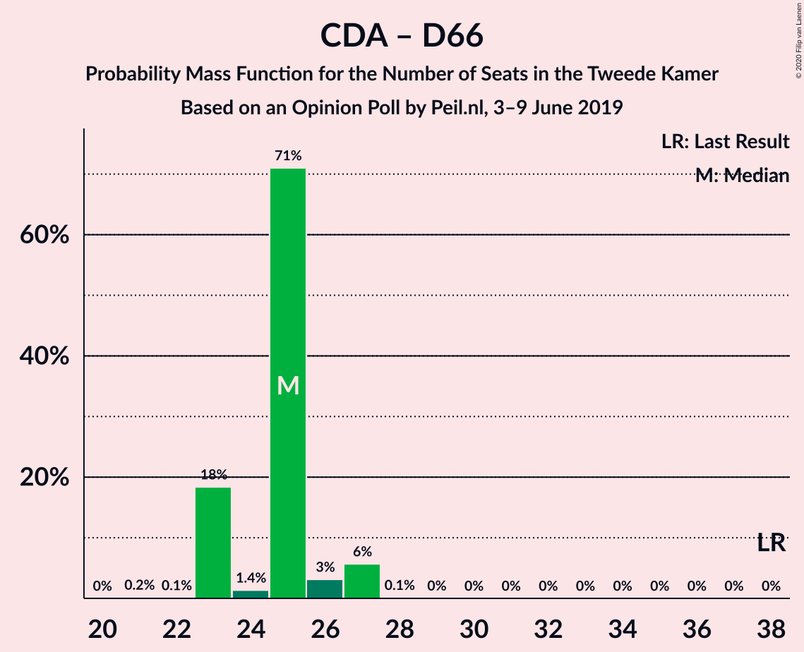

| Number of Seats | Probability | Accumulated | Special Marks |
|:---------------:|:-----------:|:-----------:|:-------------:|
| 22 | 0.3% | 100% |  |
| 23 | 6% | 99.6% |  |
| 24 | 66% | 94% | Median |
| 25 | 18% | 28% |  |
| 26 | 4% | 10% |  |
| 27 | 4% | 6% |  |
| 28 | 0.5% | 2% |  |
| 29 | 2% | 2% |  |
| 30 | 0% | 0% |  |
| 31 | 0% | 0% |  |
| 32 | 0% | 0% |  |
| 33 | 0% | 0% |  |
| 34 | 0% | 0% |  |
| 35 | 0% | 0% |  |
| 36 | 0% | 0% |  |
| 37 | 0% | 0% |  |
| 38 | 0% | 0% | Last Result |

## Technical Information

### Opinion Poll

+ **Polling firm:** Peil.nl
+ **Commissioner(s):** —
+ **Fieldwork period:** 3–9 June 2019

### Calculations

+ **Sample size:** 3000
+ **Simulations done:** 524,288
+ **Error estimate:** 1.66%

