# Opinion Poll by Peil.nl, 17–23 June 2019

<a href="#voting-intentions">Voting Intentions</a> | <a href="#seats">Seats</a> | <a href="#coalitions">Coalitions</a> | <a href="#technical-information">Technical Information</a>

## Voting Intentions

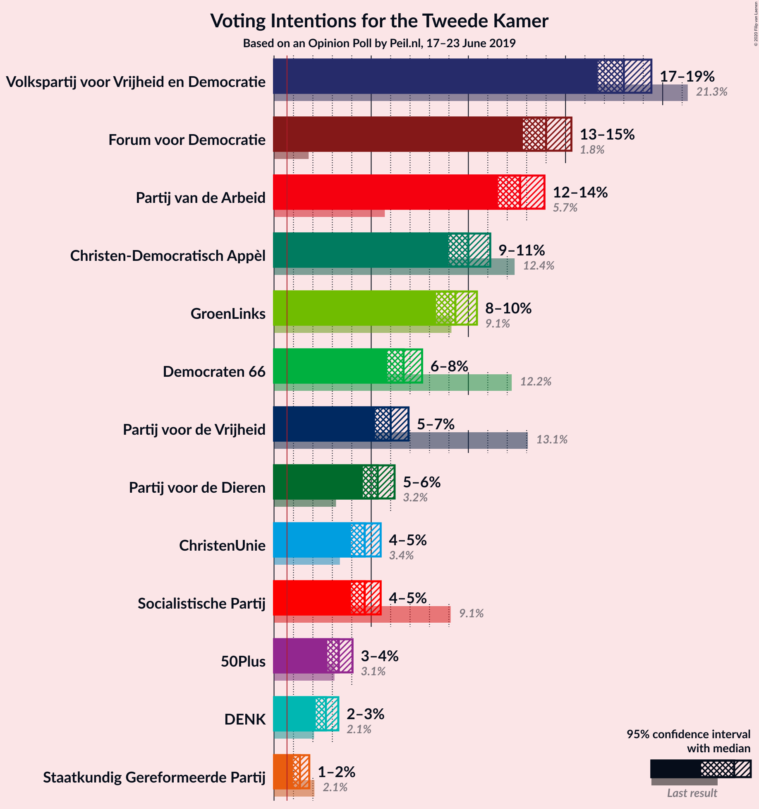

### Confidence Intervals

| Party | Last Result | Poll Result | 80% Confidence Interval | 90% Confidence Interval | 95% Confidence Interval | 99% Confidence Interval |
|:-----:|:-----------:|:-----------:|:-----------------------:|:-----------------------:|:-----------------------:|:-----------------------:|
| Volkspartij voor Vrijheid en Democratie | 21.3% | 18.0% | 17.1–18.9% |16.9–19.2% |16.7–19.4% |16.2–19.9% |
| Forum voor Democratie | 1.8% | 14.0% | 13.2–14.8% |13.0–15.1% |12.8–15.3% |12.4–15.7% |
| Partij van de Arbeid | 5.7% | 12.7% | 11.9–13.5% |11.7–13.7% |11.5–13.9% |11.2–14.3% |
| Christen-Democratisch Appèl | 12.4% | 10.0% | 9.3–10.7% |9.1–10.9% |9.0–11.1% |8.7–11.5% |
| GroenLinks | 9.1% | 9.3% | 8.7–10.1% |8.5–10.3% |8.3–10.4% |8.0–10.8% |
| Democraten 66 | 12.2% | 6.7% | 6.1–7.3% |6.0–7.5% |5.8–7.6% |5.6–7.9% |
| Partij voor de Vrijheid | 13.1% | 6.0% | 5.5–6.6% |5.3–6.8% |5.2–6.9% |5.0–7.2% |
| Partij voor de Dieren | 3.2% | 5.3% | 4.8–5.9% |4.7–6.1% |4.6–6.2% |4.4–6.5% |
| Socialistische Partij | 9.1% | 4.7% | 4.2–5.2% |4.1–5.3% |4.0–5.5% |3.7–5.8% |
| ChristenUnie | 3.4% | 4.7% | 4.2–5.2% |4.1–5.3% |4.0–5.5% |3.7–5.8% |
| 50Plus | 3.1% | 3.3% | 2.9–3.8% |2.8–3.9% |2.7–4.0% |2.6–4.3% |
| DENK | 2.1% | 2.7% | 2.3–3.1% |2.2–3.2% |2.1–3.3% |2.0–3.5% |
| Staatkundig Gereformeerde Partij | 2.1% | 1.3% | 1.1–1.6% |1.0–1.7% |1.0–1.8% |0.9–2.0% |

*Note:* The poll result column reflects the actual value used in the calculations. Published results may vary slightly, and in addition be rounded to fewer digits.

## Seats

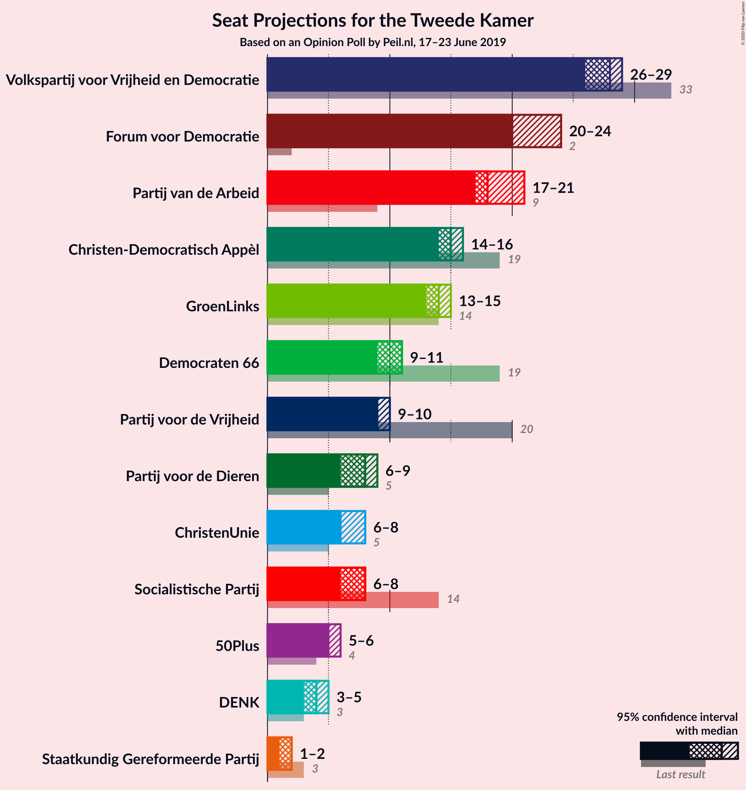

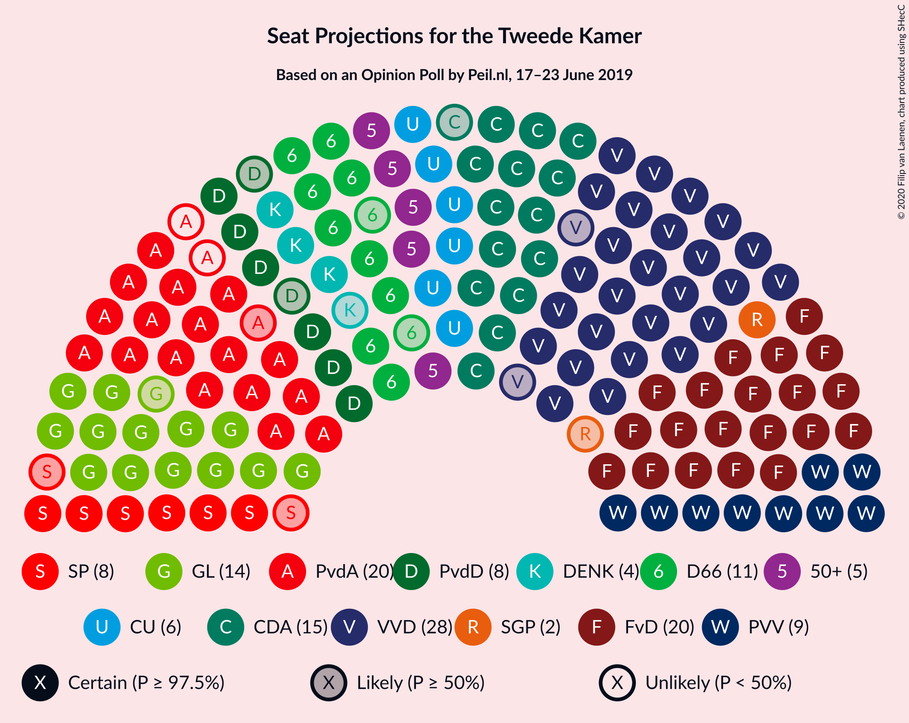

### Confidence Intervals

| Party | Last Result | Median | 80% Confidence Interval | 90% Confidence Interval | 95% Confidence Interval | 99% Confidence Interval |
|:-----:|:-----------:|:------:|:-----------------------:|:-----------------------:|:-----------------------:|:-----------------------:|
| <a href="#volkspartij-voor-vrijheid-en-democratie">Volkspartij voor Vrijheid en Democratie</a> | 33 | 28 | 26–28 |26–29 |26–29 |26–29 |
| <a href="#forum-voor-democratie">Forum voor Democratie</a> | 2 | 20 | 20–23 |20–24 |20–24 |19–24 |
| <a href="#partij-van-de-arbeid">Partij van de Arbeid</a> | 9 | 18 | 18–21 |17–21 |17–21 |17–21 |
| <a href="#christen-democratisch-appèl">Christen-Democratisch Appèl</a> | 19 | 15 | 15 |14–16 |14–16 |13–17 |
| <a href="#groenlinks">GroenLinks</a> | 14 | 14 | 13–14 |13–15 |13–15 |12–16 |
| <a href="#democraten-66">Democraten 66</a> | 19 | 11 | 10–11 |9–11 |9–11 |9–11 |
| <a href="#partij-voor-de-vrijheid">Partij voor de Vrijheid</a> | 20 | 9 | 9 |9–10 |9–10 |8–10 |
| <a href="#partij-voor-de-dieren">Partij voor de Dieren</a> | 5 | 8 | 7–8 |6–9 |6–9 |6–10 |
| <a href="#socialistische-partij">Socialistische Partij</a> | 14 | 8 | 6–8 |6–8 |6–8 |5–9 |
| <a href="#christenunie">ChristenUnie</a> | 5 | 6 | 6–7 |6–7 |6–8 |5–8 |
| <a href="#50plus">50Plus</a> | 4 | 5 | 5 |5–6 |5–6 |4–6 |
| <a href="#denk">DENK</a> | 3 | 4 | 3–5 |3–5 |3–5 |3–5 |
| <a href="#staatkundig-gereformeerde-partij">Staatkundig Gereformeerde Partij</a> | 3 | 2 | 1–2 |1–2 |1–2 |1–3 |

### Volkspartij voor Vrijheid en Democratie

*For a full overview of the results for this party, see the [Volkspartij voor Vrijheid en Democratie](party-volkspartijvoorvrijheidendemocratie.html) page.*

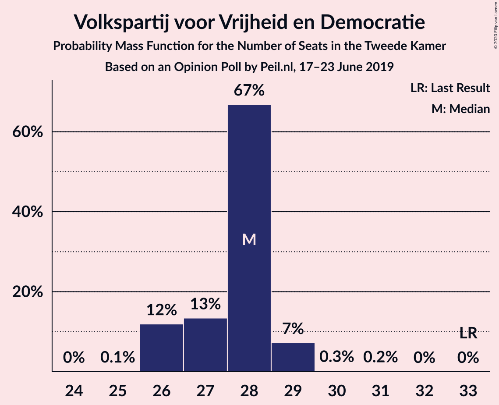

| Number of Seats | Probability | Accumulated | Special Marks |
|:---------------:|:-----------:|:-----------:|:-------------:|
| 25 | 0.1% | 100% |  |
| 26 | 12% | 99.9% |  |
| 27 | 13% | 88% |  |
| 28 | 67% | 75% | Median |
| 29 | 7% | 8% |  |
| 30 | 0.3% | 0.4% |  |
| 31 | 0.2% | 0.2% |  |
| 32 | 0% | 0% |  |
| 33 | 0% | 0% | Last Result |

### Forum voor Democratie

*For a full overview of the results for this party, see the [Forum voor Democratie](party-forumvoordemocratie.html) page.*

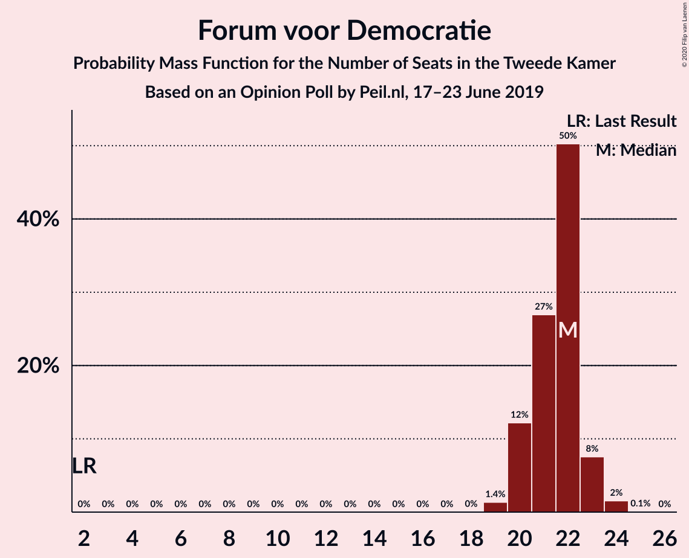

| Number of Seats | Probability | Accumulated | Special Marks |
|:---------------:|:-----------:|:-----------:|:-------------:|
| 2 | 0% | 100% | Last Result |
| 3 | 0% | 100% |  |
| 4 | 0% | 100% |  |
| 5 | 0% | 100% |  |
| 6 | 0% | 100% |  |
| 7 | 0% | 100% |  |
| 8 | 0% | 100% |  |
| 9 | 0% | 100% |  |
| 10 | 0% | 100% |  |
| 11 | 0% | 100% |  |
| 12 | 0% | 100% |  |
| 13 | 0% | 100% |  |
| 14 | 0% | 100% |  |
| 15 | 0% | 100% |  |
| 16 | 0% | 100% |  |
| 17 | 0% | 100% |  |
| 18 | 0.1% | 100% |  |
| 19 | 2% | 99.9% |  |
| 20 | 64% | 98% | Median |
| 21 | 8% | 34% |  |
| 22 | 13% | 26% |  |
| 23 | 4% | 13% |  |
| 24 | 10% | 10% |  |
| 25 | 0% | 0% |  |

### Partij van de Arbeid

*For a full overview of the results for this party, see the [Partij van de Arbeid](party-partijvandearbeid.html) page.*

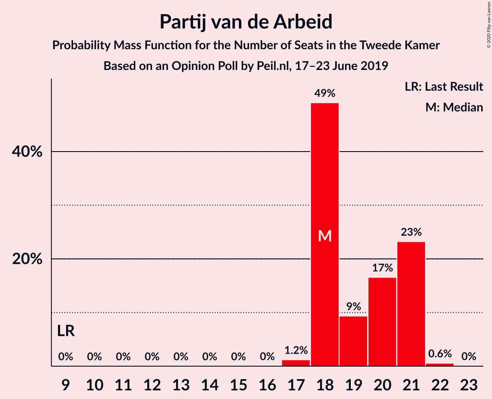

| Number of Seats | Probability | Accumulated | Special Marks |
|:---------------:|:-----------:|:-----------:|:-------------:|
| 9 | 0% | 100% | Last Result |
| 10 | 0% | 100% |  |
| 11 | 0% | 100% |  |
| 12 | 0% | 100% |  |
| 13 | 0% | 100% |  |
| 14 | 0% | 100% |  |
| 15 | 0% | 100% |  |
| 16 | 0.1% | 100% |  |
| 17 | 5% | 99.9% |  |
| 18 | 66% | 95% | Median |
| 19 | 5% | 29% |  |
| 20 | 13% | 24% |  |
| 21 | 11% | 11% |  |
| 22 | 0.2% | 0.2% |  |
| 23 | 0% | 0% |  |

### Christen-Democratisch Appèl

*For a full overview of the results for this party, see the [Christen-Democratisch Appèl](party-christen-democratischappèl.html) page.*

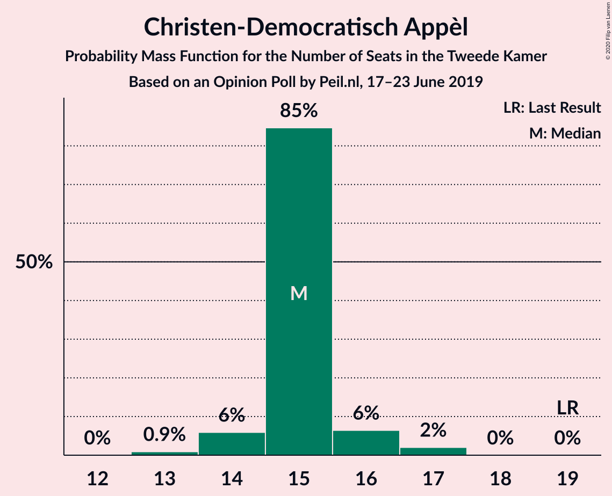

| Number of Seats | Probability | Accumulated | Special Marks |
|:---------------:|:-----------:|:-----------:|:-------------:|
| 13 | 0.9% | 100% |  |
| 14 | 6% | 99.1% |  |
| 15 | 85% | 93% | Median |
| 16 | 6% | 8% |  |
| 17 | 2% | 2% |  |
| 18 | 0% | 0% |  |
| 19 | 0% | 0% | Last Result |

### GroenLinks

*For a full overview of the results for this party, see the [GroenLinks](party-groenlinks.html) page.*

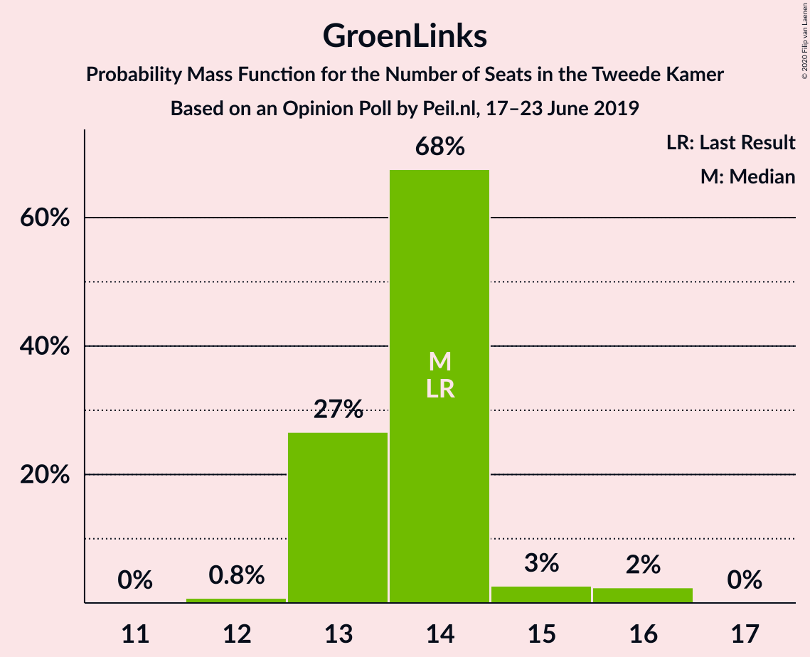

| Number of Seats | Probability | Accumulated | Special Marks |
|:---------------:|:-----------:|:-----------:|:-------------:|
| 12 | 0.8% | 100% |  |
| 13 | 27% | 99.2% |  |
| 14 | 68% | 73% | Last Result, Median |
| 15 | 3% | 5% |  |
| 16 | 2% | 2% |  |
| 17 | 0% | 0% |  |

### Democraten 66

*For a full overview of the results for this party, see the [Democraten 66](party-democraten66.html) page.*

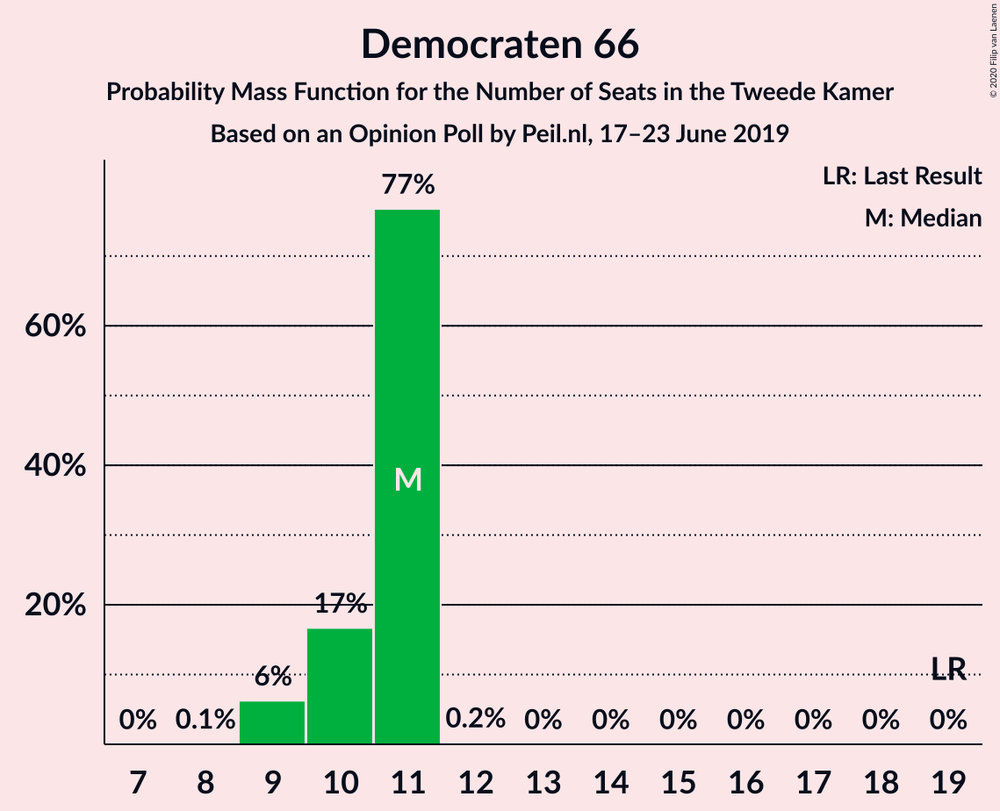

| Number of Seats | Probability | Accumulated | Special Marks |
|:---------------:|:-----------:|:-----------:|:-------------:|
| 8 | 0.1% | 100% |  |
| 9 | 6% | 99.9% |  |
| 10 | 17% | 94% |  |
| 11 | 77% | 77% | Median |
| 12 | 0.2% | 0.2% |  |
| 13 | 0% | 0% |  |
| 14 | 0% | 0% |  |
| 15 | 0% | 0% |  |
| 16 | 0% | 0% |  |
| 17 | 0% | 0% |  |
| 18 | 0% | 0% |  |
| 19 | 0% | 0% | Last Result |

### Partij voor de Vrijheid

*For a full overview of the results for this party, see the [Partij voor de Vrijheid](party-partijvoordevrijheid.html) page.*

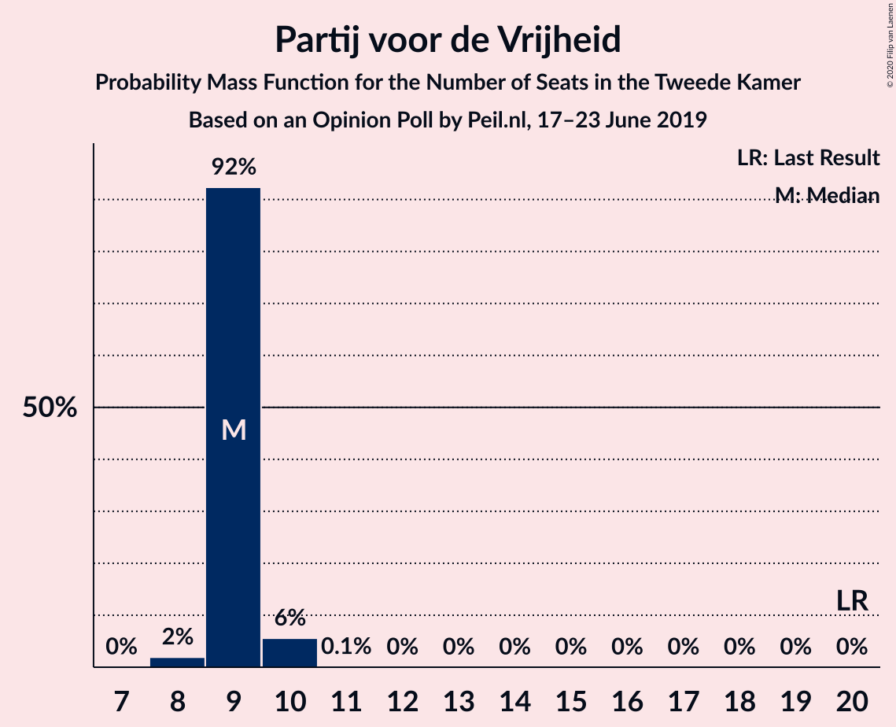

| Number of Seats | Probability | Accumulated | Special Marks |
|:---------------:|:-----------:|:-----------:|:-------------:|
| 8 | 2% | 100% |  |
| 9 | 92% | 98% | Median |
| 10 | 6% | 6% |  |
| 11 | 0.1% | 0.1% |  |
| 12 | 0% | 0% |  |
| 13 | 0% | 0% |  |
| 14 | 0% | 0% |  |
| 15 | 0% | 0% |  |
| 16 | 0% | 0% |  |
| 17 | 0% | 0% |  |
| 18 | 0% | 0% |  |
| 19 | 0% | 0% |  |
| 20 | 0% | 0% | Last Result |

### Partij voor de Dieren

*For a full overview of the results for this party, see the [Partij voor de Dieren](party-partijvoordedieren.html) page.*

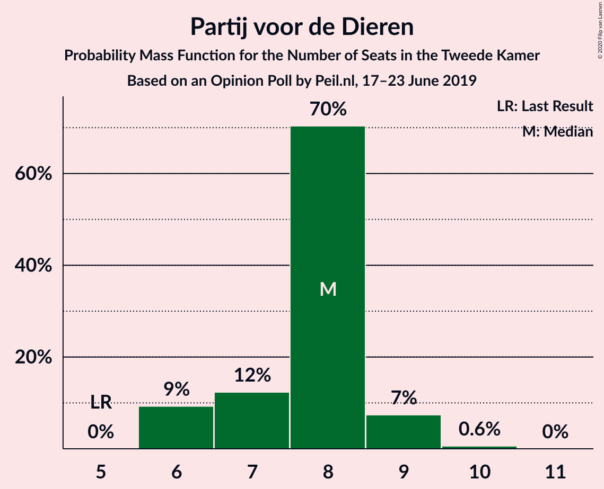

| Number of Seats | Probability | Accumulated | Special Marks |
|:---------------:|:-----------:|:-----------:|:-------------:|
| 5 | 0% | 100% | Last Result |
| 6 | 9% | 100% |  |
| 7 | 12% | 91% |  |
| 8 | 70% | 78% | Median |
| 9 | 7% | 8% |  |
| 10 | 0.6% | 0.6% |  |
| 11 | 0% | 0% |  |

### Socialistische Partij

*For a full overview of the results for this party, see the [Socialistische Partij](party-socialistischepartij.html) page.*

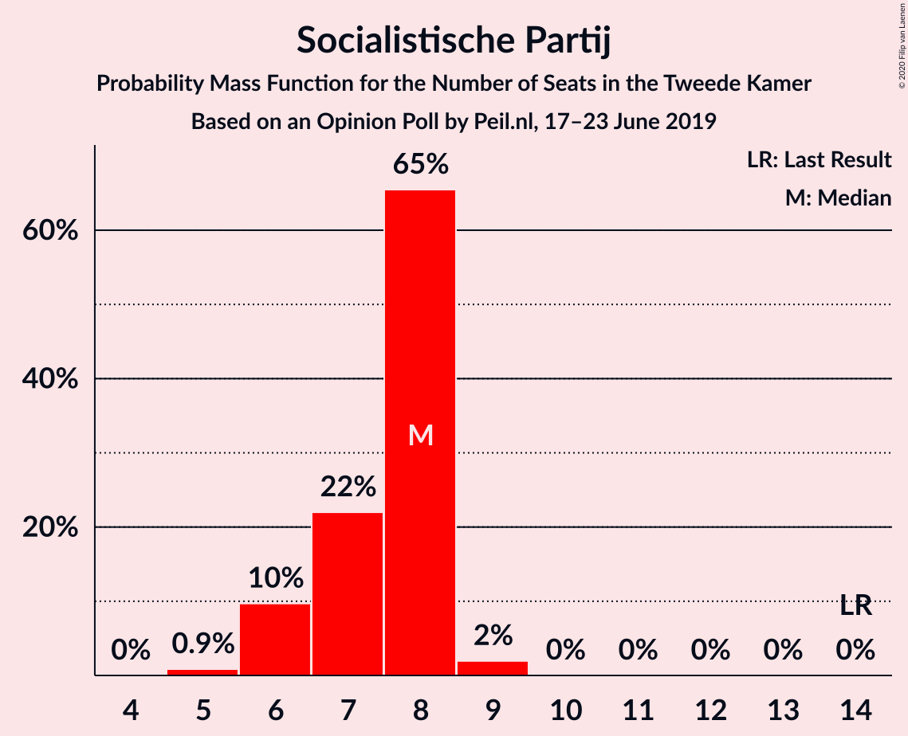

| Number of Seats | Probability | Accumulated | Special Marks |
|:---------------:|:-----------:|:-----------:|:-------------:|
| 5 | 0.9% | 100% |  |
| 6 | 10% | 99.1% |  |
| 7 | 22% | 89% |  |
| 8 | 65% | 67% | Median |
| 9 | 2% | 2% |  |
| 10 | 0% | 0% |  |
| 11 | 0% | 0% |  |
| 12 | 0% | 0% |  |
| 13 | 0% | 0% |  |
| 14 | 0% | 0% | Last Result |

### ChristenUnie

*For a full overview of the results for this party, see the [ChristenUnie](party-christenunie.html) page.*

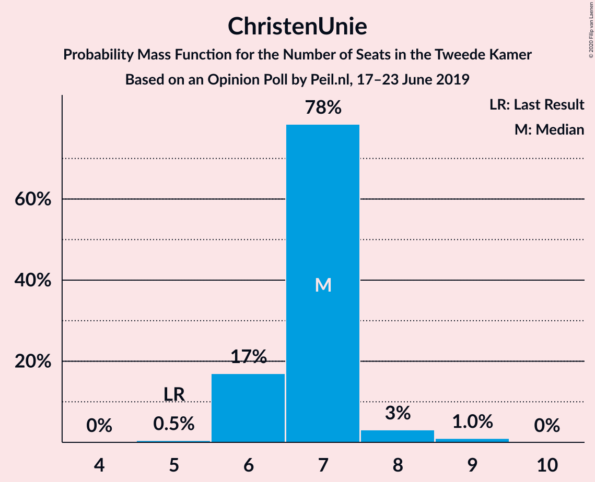

| Number of Seats | Probability | Accumulated | Special Marks |
|:---------------:|:-----------:|:-----------:|:-------------:|
| 5 | 1.4% | 100% | Last Result |
| 6 | 77% | 98.6% | Median |
| 7 | 18% | 21% |  |
| 8 | 3% | 4% |  |
| 9 | 0.2% | 0.2% |  |
| 10 | 0% | 0% |  |

### 50Plus

*For a full overview of the results for this party, see the [50Plus](party-50plus.html) page.*

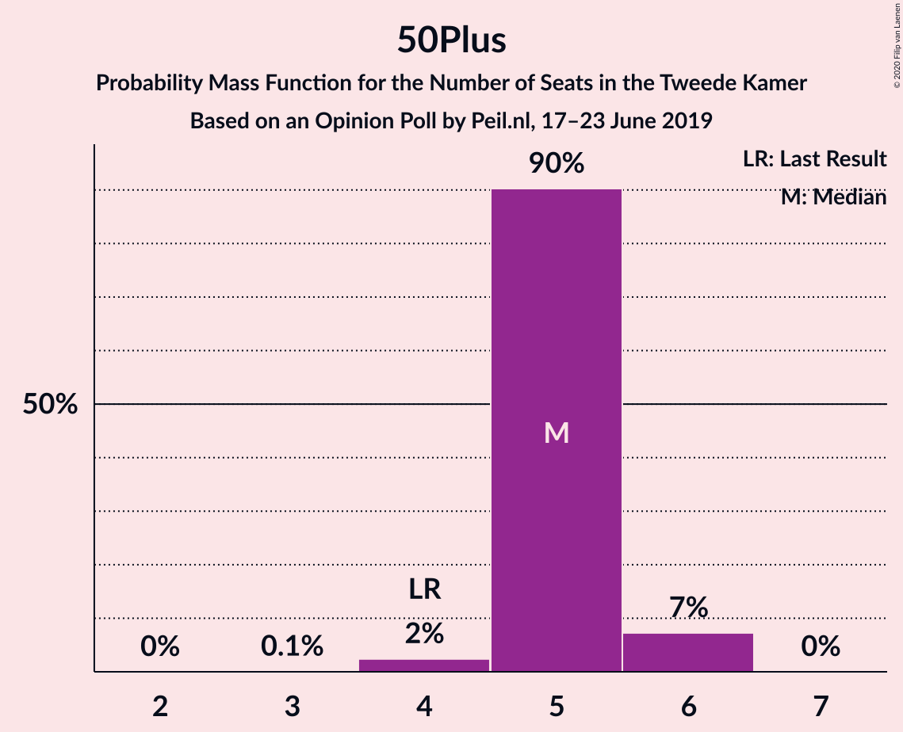

| Number of Seats | Probability | Accumulated | Special Marks |
|:---------------:|:-----------:|:-----------:|:-------------:|
| 3 | 0.1% | 100% |  |
| 4 | 2% | 99.9% | Last Result |
| 5 | 90% | 98% | Median |
| 6 | 7% | 7% |  |
| 7 | 0% | 0% |  |

### DENK

*For a full overview of the results for this party, see the [DENK](party-denk.html) page.*

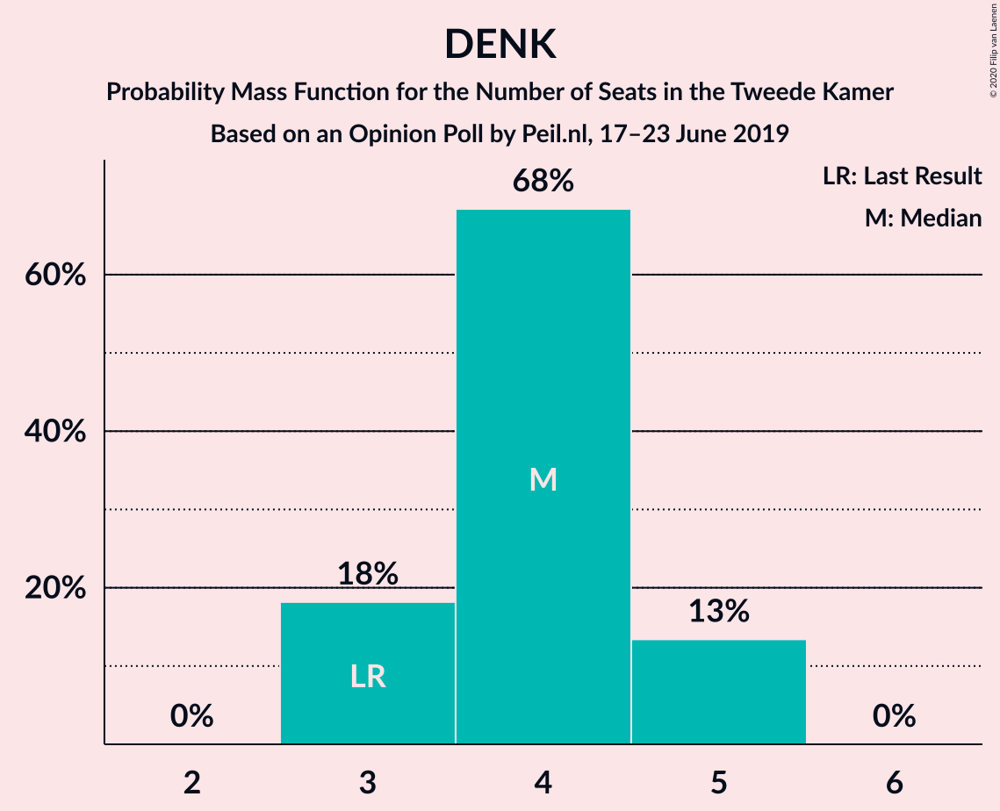

| Number of Seats | Probability | Accumulated | Special Marks |
|:---------------:|:-----------:|:-----------:|:-------------:|
| 3 | 18% | 100% | Last Result |
| 4 | 68% | 82% | Median |
| 5 | 13% | 13% |  |
| 6 | 0% | 0% |  |

### Staatkundig Gereformeerde Partij

*For a full overview of the results for this party, see the [Staatkundig Gereformeerde Partij](party-staatkundiggereformeerdepartij.html) page.*

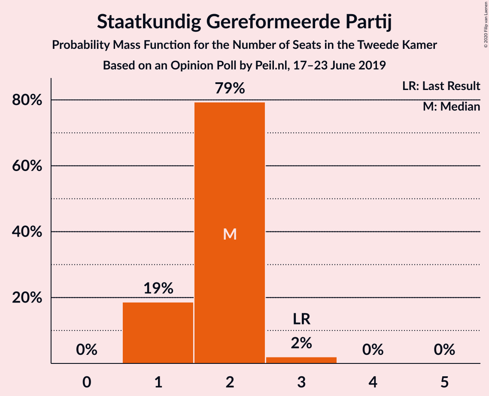

| Number of Seats | Probability | Accumulated | Special Marks |
|:---------------:|:-----------:|:-----------:|:-------------:|
| 1 | 19% | 100% |  |
| 2 | 79% | 81% | Median |
| 3 | 2% | 2% | Last Result |
| 4 | 0% | 0% |  |

## Coalitions

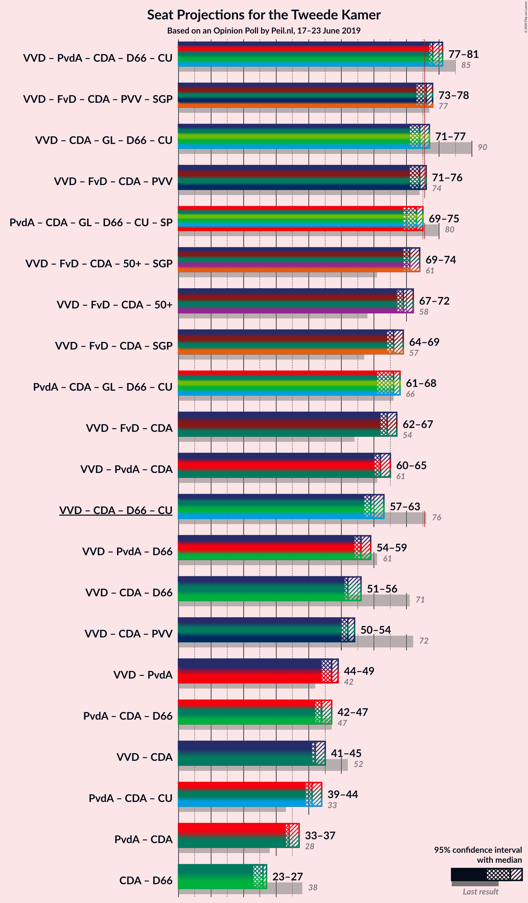

### Confidence Intervals

| Coalition | Last Result | Median | Majority? | 80% Confidence Interval | 90% Confidence Interval | 95% Confidence Interval | 99% Confidence Interval |
|:---------:|:-----------:|:------:|:---------:|:-----------------------:|:-----------------------:|:-----------------------:|:-----------------------:|
| Volkspartij voor Vrijheid en Democratie – Partij van de Arbeid – Christen-Democratisch Appèl – Democraten 66 – ChristenUnie | 85 | 78 | 99.8% | 77–81 | 77–81 | 77–81 | 76–83 |
| Volkspartij voor Vrijheid en Democratie – Christen-Democratisch Appèl – GroenLinks – Democraten 66 – ChristenUnie | 90 | 74 | 3% | 71–74 | 70–75 | 70–78 | 70–78 |
| Volkspartij voor Vrijheid en Democratie – Forum voor Democratie – Christen-Democratisch Appèl – Partij voor de Vrijheid – Staatkundig Gereformeerde Partij | 77 | 74 | 11% | 74–76 | 74–77 | 72–77 | 69–78 |
| Volkspartij voor Vrijheid en Democratie – Forum voor Democratie – Christen-Democratisch Appèl – Partij voor de Vrijheid | 74 | 72 | 1.4% | 72–74 | 72–75 | 71–75 | 68–76 |
| Volkspartij voor Vrijheid en Democratie – Forum voor Democratie – Christen-Democratisch Appèl – 50Plus – Staatkundig Gereformeerde Partij | 61 | 70 | 0% | 70–71 | 70–73 | 69–74 | 65–74 |
| Partij van de Arbeid – Christen-Democratisch Appèl – GroenLinks – Democraten 66 – ChristenUnie – Socialistische Partij | 80 | 72 | 0.1% | 71–74 | 69–74 | 69–74 | 68–74 |
| Volkspartij voor Vrijheid en Democratie – Forum voor Democratie – Christen-Democratisch Appèl – 50Plus | 58 | 68 | 0% | 68–70 | 68–71 | 67–72 | 64–72 |
| Volkspartij voor Vrijheid en Democratie – Forum voor Democratie – Christen-Democratisch Appèl – Staatkundig Gereformeerde Partij | 57 | 65 | 0% | 65–66 | 65–68 | 63–68 | 60–70 |
| Partij van de Arbeid – Christen-Democratisch Appèl – GroenLinks – Democraten 66 – ChristenUnie | 66 | 64 | 0% | 64–67 | 63–67 | 61–67 | 61–68 |
| Volkspartij voor Vrijheid en Democratie – Forum voor Democratie – Christen-Democratisch Appèl | 54 | 63 | 0% | 63–65 | 63–66 | 62–66 | 59–68 |
| Volkspartij voor Vrijheid en Democratie – Partij van de Arbeid – Christen-Democratisch Appèl | 61 | 61 | 0% | 61–63 | 61–63 | 59–63 | 58–65 |
| Volkspartij voor Vrijheid en Democratie – Christen-Democratisch Appèl – Democraten 66 – ChristenUnie | 76 | 60 | 0% | 57–60 | 57–61 | 57–63 | 57–64 |
| Volkspartij voor Vrijheid en Democratie – Partij van de Arbeid – Democraten 66 | 61 | 57 | 0% | 56–59 | 56–59 | 54–59 | 54–59 |
| Volkspartij voor Vrijheid en Democratie – Christen-Democratisch Appèl – Democraten 66 | 71 | 54 | 0% | 51–54 | 51–54 | 51–55 | 50–56 |
| Volkspartij voor Vrijheid en Democratie – Christen-Democratisch Appèl – Partij voor de Vrijheid | 72 | 52 | 0% | 50–52 | 50–53 | 50–54 | 48–55 |
| Volkspartij voor Vrijheid en Democratie – Partij van de Arbeid | 42 | 46 | 0% | 46–48 | 45–48 | 45–48 | 43–49 |
| Partij van de Arbeid – Christen-Democratisch Appèl – Democraten 66 | 47 | 44 | 0% | 44–46 | 43–47 | 42–47 | 42–47 |
| Volkspartij voor Vrijheid en Democratie – Christen-Democratisch Appèl | 52 | 43 | 0% | 41–43 | 41–44 | 41–45 | 39–46 |
| Partij van de Arbeid – Christen-Democratisch Appèl – ChristenUnie | 33 | 39 | 0% | 39–42 | 39–43 | 39–43 | 39–44 |
| Partij van de Arbeid – Christen-Democratisch Appèl | 28 | 33 | 0% | 33–36 | 33–36 | 32–36 | 32–37 |
| Christen-Democratisch Appèl – Democraten 66 | 38 | 26 | 0% | 25–26 | 24–27 | 23–27 | 23–27 |

### Volkspartij voor Vrijheid en Democratie – Partij van de Arbeid – Christen-Democratisch Appèl – Democraten 66 – ChristenUnie

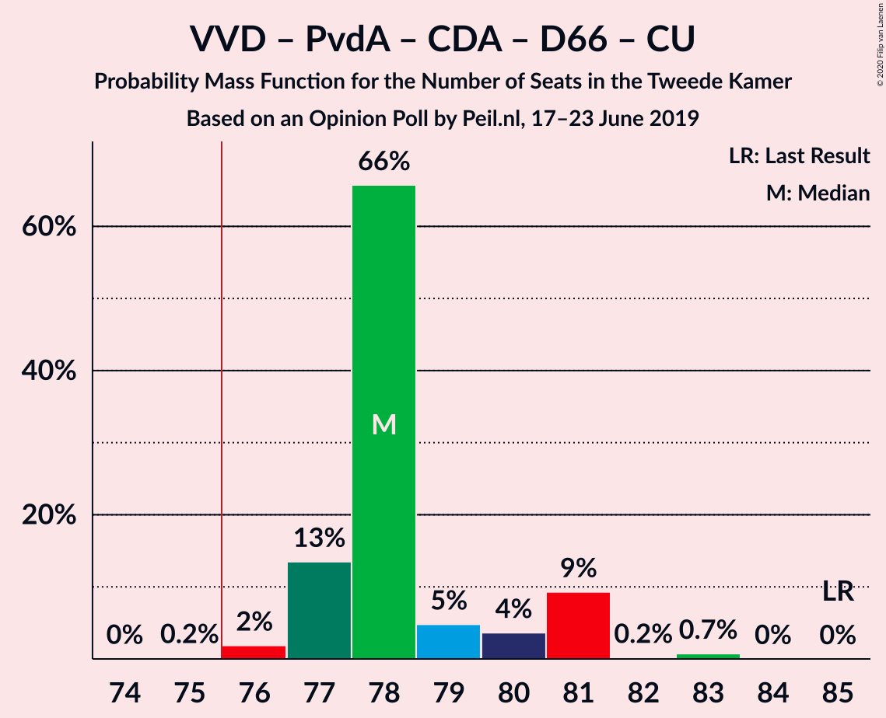

| Number of Seats | Probability | Accumulated | Special Marks |
|:---------------:|:-----------:|:-----------:|:-------------:|
| 75 | 0.2% | 100% |  |
| 76 | 2% | 99.8% | Majority |
| 77 | 13% | 98% |  |
| 78 | 66% | 84% | Median |
| 79 | 5% | 19% |  |
| 80 | 4% | 14% |  |
| 81 | 9% | 10% |  |
| 82 | 0.2% | 0.9% |  |
| 83 | 0.7% | 0.8% |  |
| 84 | 0% | 0% |  |
| 85 | 0% | 0% | Last Result |

### Volkspartij voor Vrijheid en Democratie – Christen-Democratisch Appèl – GroenLinks – Democraten 66 – ChristenUnie

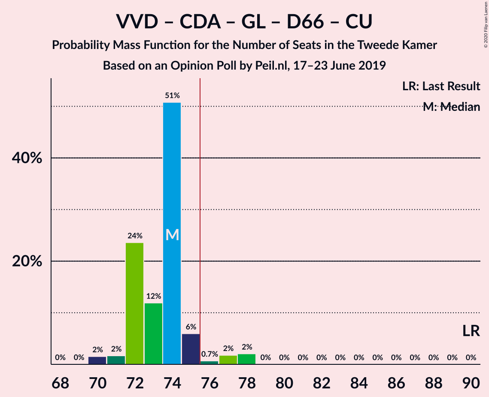

| Number of Seats | Probability | Accumulated | Special Marks |
|:---------------:|:-----------:|:-----------:|:-------------:|
| 68 | 0.1% | 100% |  |
| 69 | 0.1% | 99.9% |  |
| 70 | 10% | 99.8% |  |
| 71 | 6% | 90% |  |
| 72 | 3% | 85% |  |
| 73 | 10% | 82% |  |
| 74 | 63% | 72% | Median |
| 75 | 5% | 9% |  |
| 76 | 0.2% | 3% | Majority |
| 77 | 0.2% | 3% |  |
| 78 | 3% | 3% |  |
| 79 | 0% | 0% |  |
| 80 | 0% | 0% |  |
| 81 | 0% | 0% |  |
| 82 | 0% | 0% |  |
| 83 | 0% | 0% |  |
| 84 | 0% | 0% |  |
| 85 | 0% | 0% |  |
| 86 | 0% | 0% |  |
| 87 | 0% | 0% |  |
| 88 | 0% | 0% |  |
| 89 | 0% | 0% |  |
| 90 | 0% | 0% | Last Result |

### Volkspartij voor Vrijheid en Democratie – Forum voor Democratie – Christen-Democratisch Appèl – Partij voor de Vrijheid – Staatkundig Gereformeerde Partij

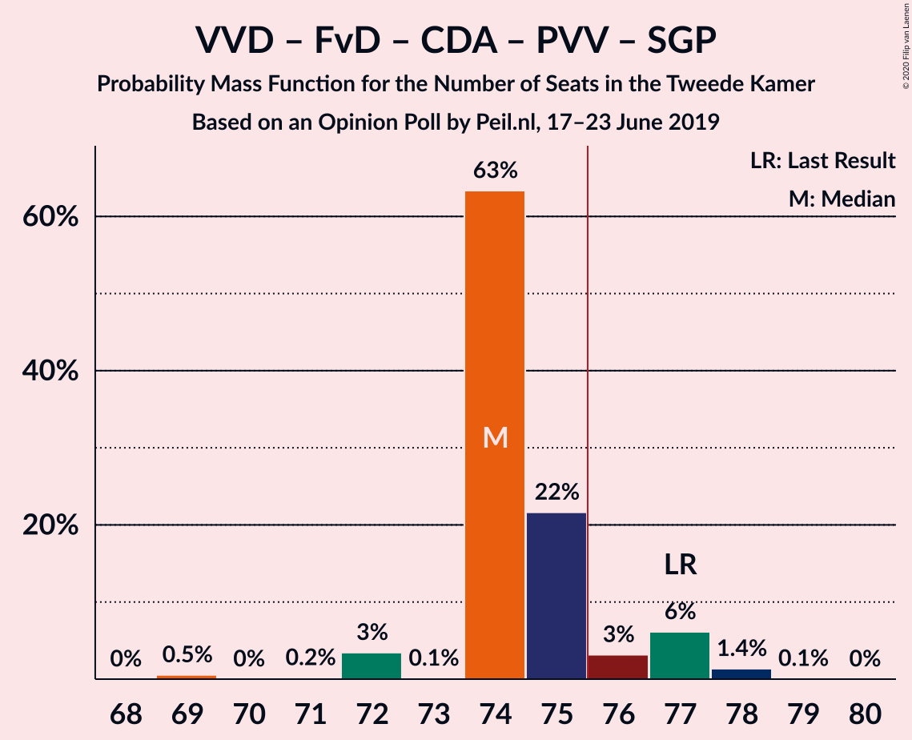

| Number of Seats | Probability | Accumulated | Special Marks |
|:---------------:|:-----------:|:-----------:|:-------------:|
| 69 | 0.5% | 100% |  |
| 70 | 0% | 99.5% |  |
| 71 | 0.2% | 99.4% |  |
| 72 | 3% | 99.3% |  |
| 73 | 0.1% | 96% |  |
| 74 | 63% | 96% | Median |
| 75 | 22% | 32% |  |
| 76 | 3% | 11% | Majority |
| 77 | 6% | 8% | Last Result |
| 78 | 1.4% | 1.4% |  |
| 79 | 0.1% | 0.1% |  |
| 80 | 0% | 0% |  |

### Volkspartij voor Vrijheid en Democratie – Forum voor Democratie – Christen-Democratisch Appèl – Partij voor de Vrijheid

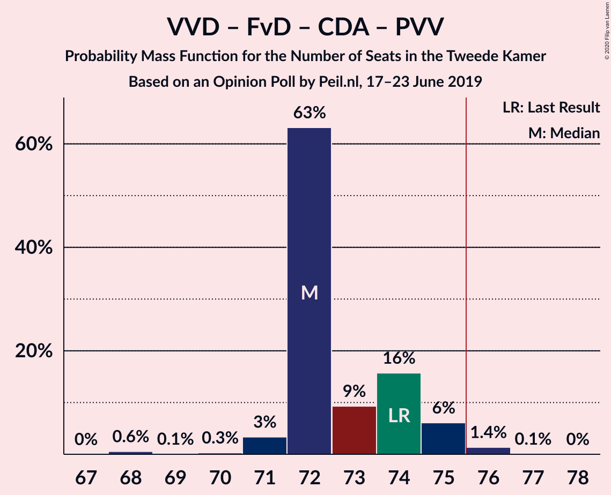

| Number of Seats | Probability | Accumulated | Special Marks |
|:---------------:|:-----------:|:-----------:|:-------------:|
| 68 | 0.6% | 100% |  |
| 69 | 0.1% | 99.4% |  |
| 70 | 0.3% | 99.4% |  |
| 71 | 3% | 99.1% |  |
| 72 | 63% | 96% | Median |
| 73 | 9% | 33% |  |
| 74 | 16% | 23% | Last Result |
| 75 | 6% | 8% |  |
| 76 | 1.4% | 1.4% | Majority |
| 77 | 0.1% | 0.1% |  |
| 78 | 0% | 0% |  |

### Volkspartij voor Vrijheid en Democratie – Forum voor Democratie – Christen-Democratisch Appèl – 50Plus – Staatkundig Gereformeerde Partij

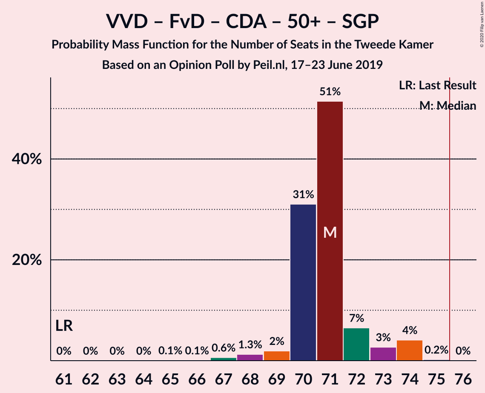

| Number of Seats | Probability | Accumulated | Special Marks |
|:---------------:|:-----------:|:-----------:|:-------------:|
| 61 | 0% | 100% | Last Result |
| 62 | 0% | 100% |  |
| 63 | 0% | 100% |  |
| 64 | 0% | 100% |  |
| 65 | 0.5% | 100% |  |
| 66 | 0.2% | 99.5% |  |
| 67 | 1.5% | 99.3% |  |
| 68 | 0.3% | 98% |  |
| 69 | 2% | 98% |  |
| 70 | 64% | 96% | Median |
| 71 | 22% | 32% |  |
| 72 | 1.3% | 10% |  |
| 73 | 5% | 8% |  |
| 74 | 3% | 3% |  |
| 75 | 0% | 0% |  |

### Partij van de Arbeid – Christen-Democratisch Appèl – GroenLinks – Democraten 66 – ChristenUnie – Socialistische Partij

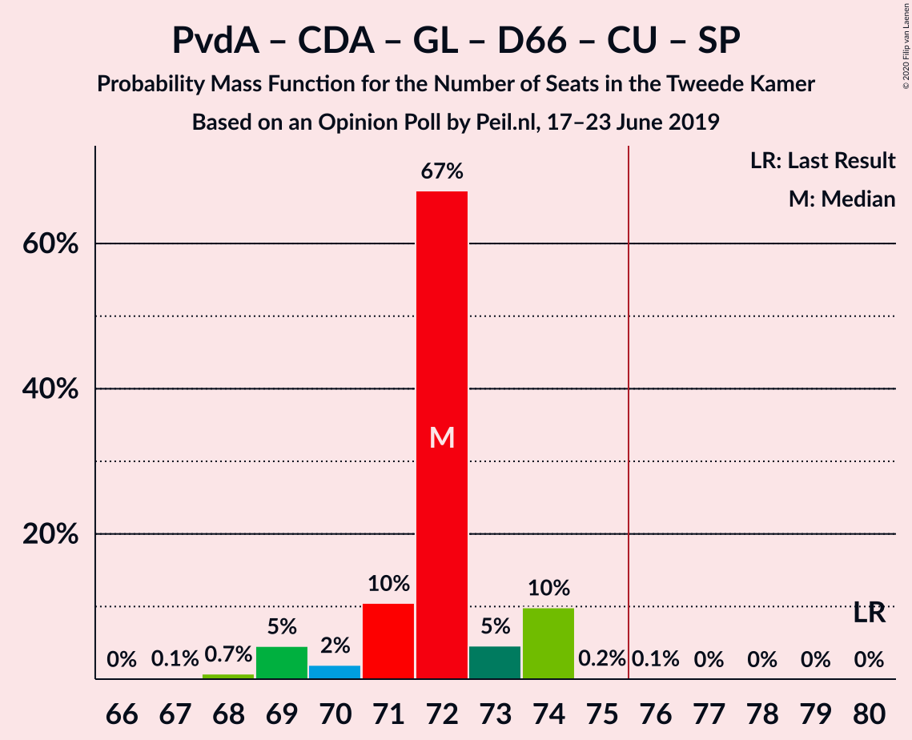

| Number of Seats | Probability | Accumulated | Special Marks |
|:---------------:|:-----------:|:-----------:|:-------------:|
| 67 | 0.1% | 100% |  |
| 68 | 0.7% | 99.8% |  |
| 69 | 5% | 99.1% |  |
| 70 | 2% | 95% |  |
| 71 | 10% | 93% |  |
| 72 | 67% | 82% | Median |
| 73 | 5% | 15% |  |
| 74 | 10% | 10% |  |
| 75 | 0.2% | 0.3% |  |
| 76 | 0.1% | 0.1% | Majority |
| 77 | 0% | 0% |  |
| 78 | 0% | 0% |  |
| 79 | 0% | 0% |  |
| 80 | 0% | 0% | Last Result |

### Volkspartij voor Vrijheid en Democratie – Forum voor Democratie – Christen-Democratisch Appèl – 50Plus

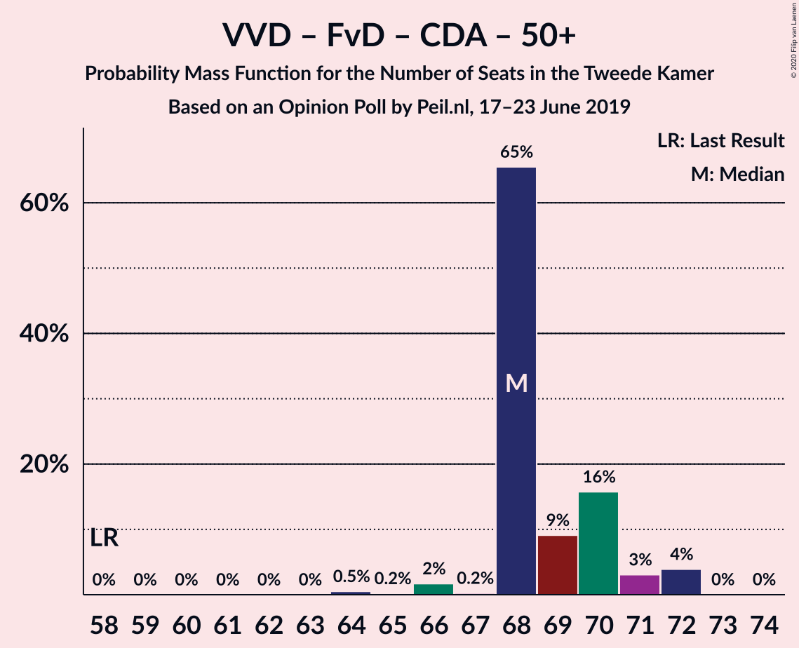

| Number of Seats | Probability | Accumulated | Special Marks |
|:---------------:|:-----------:|:-----------:|:-------------:|
| 58 | 0% | 100% | Last Result |
| 59 | 0% | 100% |  |
| 60 | 0% | 100% |  |
| 61 | 0% | 100% |  |
| 62 | 0% | 100% |  |
| 63 | 0% | 100% |  |
| 64 | 0.5% | 100% |  |
| 65 | 0.2% | 99.5% |  |
| 66 | 2% | 99.3% |  |
| 67 | 0.2% | 98% |  |
| 68 | 65% | 97% | Median |
| 69 | 9% | 32% |  |
| 70 | 16% | 23% |  |
| 71 | 3% | 7% |  |
| 72 | 4% | 4% |  |
| 73 | 0% | 0.1% |  |
| 74 | 0% | 0% |  |

### Volkspartij voor Vrijheid en Democratie – Forum voor Democratie – Christen-Democratisch Appèl – Staatkundig Gereformeerde Partij

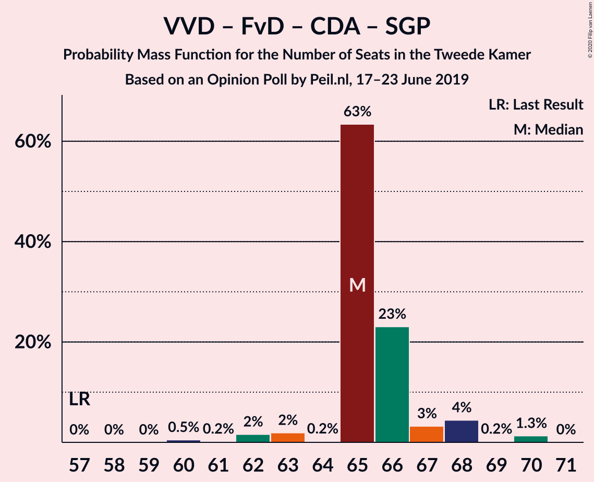

| Number of Seats | Probability | Accumulated | Special Marks |
|:---------------:|:-----------:|:-----------:|:-------------:|
| 57 | 0% | 100% | Last Result |
| 58 | 0% | 100% |  |
| 59 | 0% | 100% |  |
| 60 | 0.5% | 100% |  |
| 61 | 0.2% | 99.5% |  |
| 62 | 2% | 99.3% |  |
| 63 | 2% | 98% |  |
| 64 | 0.2% | 96% |  |
| 65 | 63% | 96% | Median |
| 66 | 23% | 32% |  |
| 67 | 3% | 9% |  |
| 68 | 4% | 6% |  |
| 69 | 0.2% | 1.5% |  |
| 70 | 1.3% | 1.3% |  |
| 71 | 0% | 0% |  |

### Partij van de Arbeid – Christen-Democratisch Appèl – GroenLinks – Democraten 66 – ChristenUnie

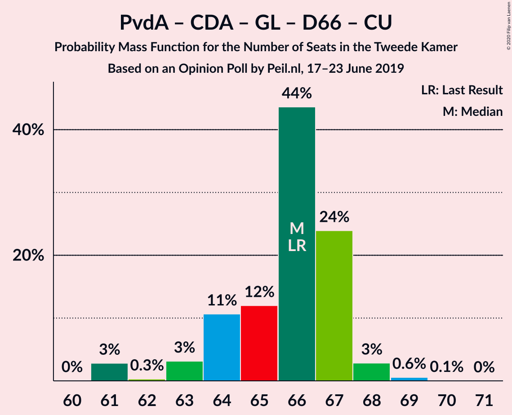

| Number of Seats | Probability | Accumulated | Special Marks |
|:---------------:|:-----------:|:-----------:|:-------------:|
| 60 | 0.2% | 100% |  |
| 61 | 3% | 99.8% |  |
| 62 | 0.7% | 97% |  |
| 63 | 3% | 96% |  |
| 64 | 75% | 93% | Median |
| 65 | 0.4% | 18% |  |
| 66 | 7% | 18% | Last Result |
| 67 | 10% | 11% |  |
| 68 | 0.8% | 1.0% |  |
| 69 | 0.2% | 0.2% |  |
| 70 | 0% | 0% |  |

### Volkspartij voor Vrijheid en Democratie – Forum voor Democratie – Christen-Democratisch Appèl

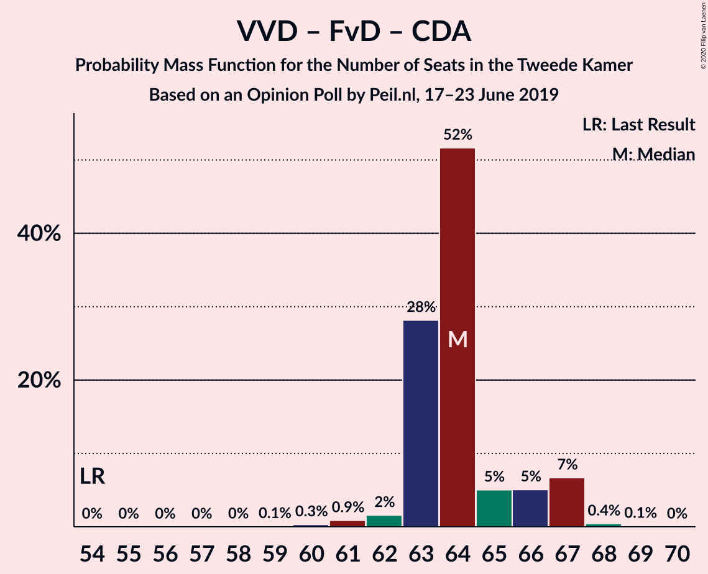

| Number of Seats | Probability | Accumulated | Special Marks |
|:---------------:|:-----------:|:-----------:|:-------------:|
| 54 | 0% | 100% | Last Result |
| 55 | 0% | 100% |  |
| 56 | 0% | 100% |  |
| 57 | 0% | 100% |  |
| 58 | 0% | 100% |  |
| 59 | 0.5% | 100% |  |
| 60 | 0.3% | 99.5% |  |
| 61 | 2% | 99.2% |  |
| 62 | 2% | 98% |  |
| 63 | 63% | 96% | Median |
| 64 | 12% | 32% |  |
| 65 | 13% | 20% |  |
| 66 | 5% | 7% |  |
| 67 | 0.2% | 2% |  |
| 68 | 1.3% | 1.3% |  |
| 69 | 0% | 0% |  |

### Volkspartij voor Vrijheid en Democratie – Partij van de Arbeid – Christen-Democratisch Appèl

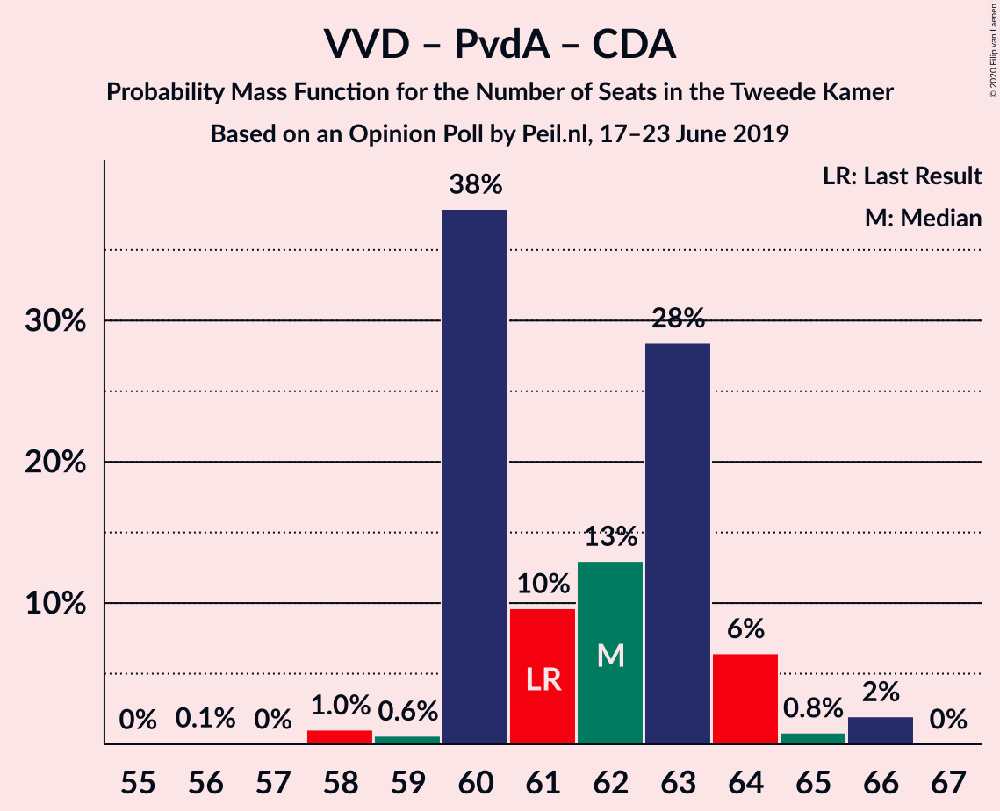

| Number of Seats | Probability | Accumulated | Special Marks |
|:---------------:|:-----------:|:-----------:|:-------------:|
| 58 | 2% | 100% |  |
| 59 | 0.3% | 98% |  |
| 60 | 0.4% | 97% |  |
| 61 | 75% | 97% | Last Result, Median |
| 62 | 7% | 22% |  |
| 63 | 13% | 15% |  |
| 64 | 0.6% | 2% |  |
| 65 | 1.2% | 1.3% |  |
| 66 | 0.1% | 0.1% |  |
| 67 | 0% | 0% |  |

### Volkspartij voor Vrijheid en Democratie – Christen-Democratisch Appèl – Democraten 66 – ChristenUnie

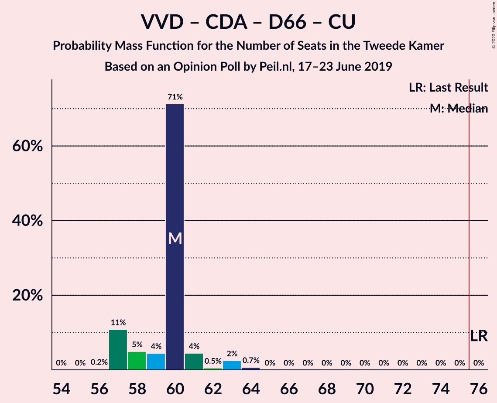

| Number of Seats | Probability | Accumulated | Special Marks |
|:---------------:|:-----------:|:-----------:|:-------------:|
| 56 | 0.2% | 100% |  |
| 57 | 11% | 99.7% |  |
| 58 | 5% | 89% |  |
| 59 | 4% | 84% |  |
| 60 | 71% | 79% | Median |
| 61 | 4% | 8% |  |
| 62 | 0.5% | 4% |  |
| 63 | 2% | 3% |  |
| 64 | 0.7% | 0.7% |  |
| 65 | 0% | 0% |  |
| 66 | 0% | 0% |  |
| 67 | 0% | 0% |  |
| 68 | 0% | 0% |  |
| 69 | 0% | 0% |  |
| 70 | 0% | 0% |  |
| 71 | 0% | 0% |  |
| 72 | 0% | 0% |  |
| 73 | 0% | 0% |  |
| 74 | 0% | 0% |  |
| 75 | 0% | 0% |  |
| 76 | 0% | 0% | Last Result, Majority |

### Volkspartij voor Vrijheid en Democratie – Partij van de Arbeid – Democraten 66

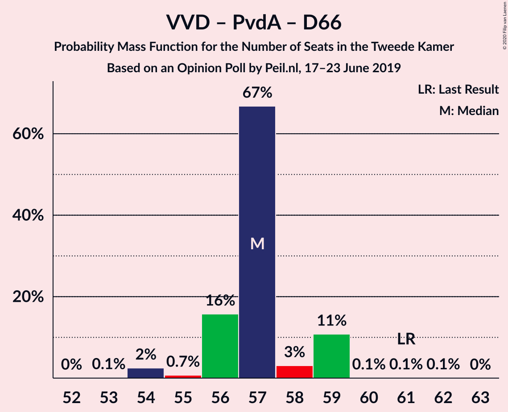

| Number of Seats | Probability | Accumulated | Special Marks |
|:---------------:|:-----------:|:-----------:|:-------------:|
| 53 | 0.1% | 100% |  |
| 54 | 2% | 99.8% |  |
| 55 | 0.7% | 97% |  |
| 56 | 16% | 97% |  |
| 57 | 67% | 81% | Median |
| 58 | 3% | 14% |  |
| 59 | 11% | 11% |  |
| 60 | 0.1% | 0.2% |  |
| 61 | 0.1% | 0.2% | Last Result |
| 62 | 0.1% | 0.1% |  |
| 63 | 0% | 0% |  |

### Volkspartij voor Vrijheid en Democratie – Christen-Democratisch Appèl – Democraten 66

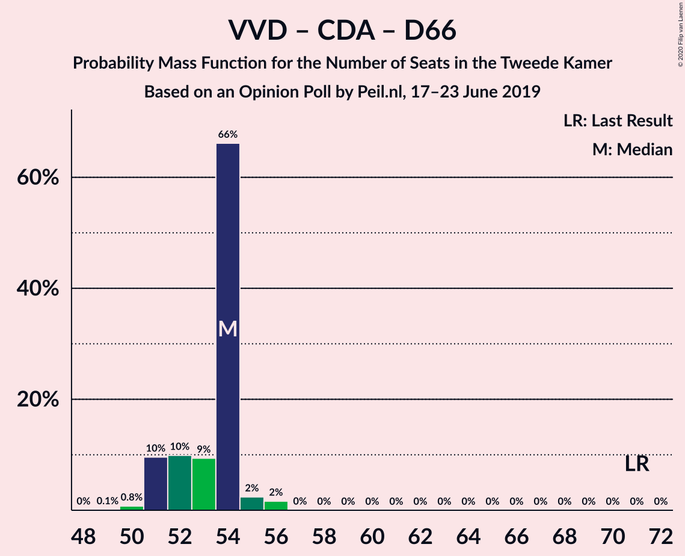

| Number of Seats | Probability | Accumulated | Special Marks |
|:---------------:|:-----------:|:-----------:|:-------------:|
| 49 | 0.1% | 100% |  |
| 50 | 0.8% | 99.9% |  |
| 51 | 10% | 99.1% |  |
| 52 | 10% | 90% |  |
| 53 | 9% | 80% |  |
| 54 | 66% | 70% | Median |
| 55 | 2% | 4% |  |
| 56 | 2% | 2% |  |
| 57 | 0% | 0% |  |
| 58 | 0% | 0% |  |
| 59 | 0% | 0% |  |
| 60 | 0% | 0% |  |
| 61 | 0% | 0% |  |
| 62 | 0% | 0% |  |
| 63 | 0% | 0% |  |
| 64 | 0% | 0% |  |
| 65 | 0% | 0% |  |
| 66 | 0% | 0% |  |
| 67 | 0% | 0% |  |
| 68 | 0% | 0% |  |
| 69 | 0% | 0% |  |
| 70 | 0% | 0% |  |
| 71 | 0% | 0% | Last Result |

### Volkspartij voor Vrijheid en Democratie – Christen-Democratisch Appèl – Partij voor de Vrijheid

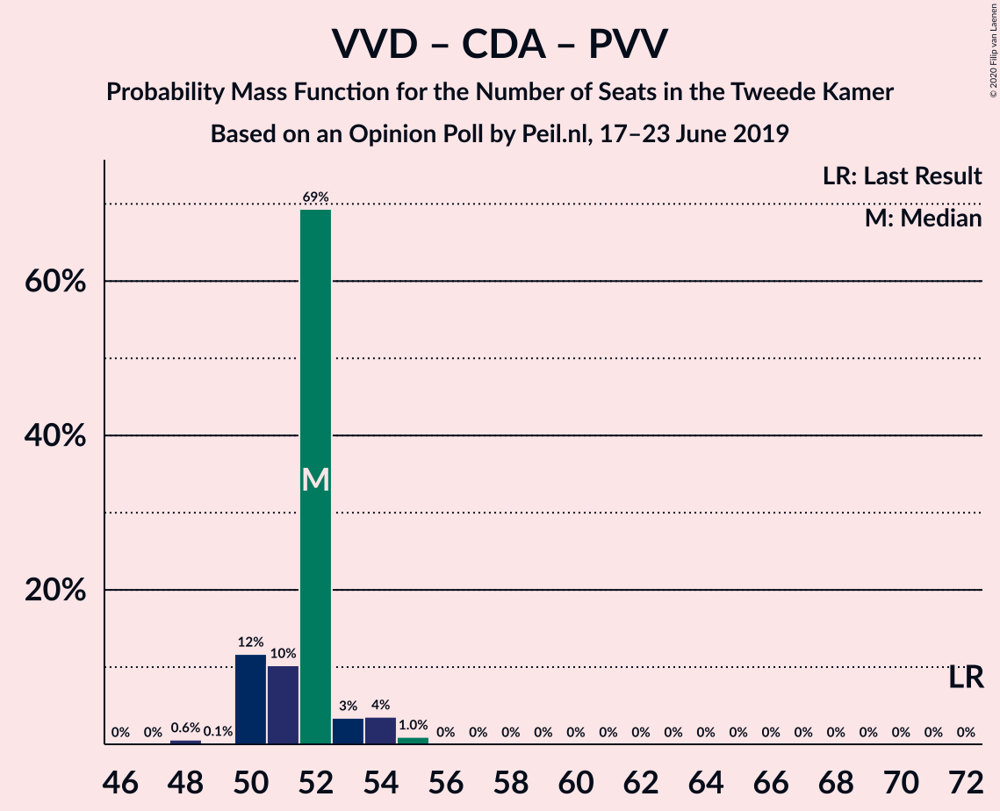

| Number of Seats | Probability | Accumulated | Special Marks |
|:---------------:|:-----------:|:-----------:|:-------------:|
| 48 | 0.6% | 100% |  |
| 49 | 0.1% | 99.4% |  |
| 50 | 12% | 99.3% |  |
| 51 | 10% | 88% |  |
| 52 | 69% | 77% | Median |
| 53 | 3% | 8% |  |
| 54 | 4% | 5% |  |
| 55 | 1.0% | 1.0% |  |
| 56 | 0% | 0% |  |
| 57 | 0% | 0% |  |
| 58 | 0% | 0% |  |
| 59 | 0% | 0% |  |
| 60 | 0% | 0% |  |
| 61 | 0% | 0% |  |
| 62 | 0% | 0% |  |
| 63 | 0% | 0% |  |
| 64 | 0% | 0% |  |
| 65 | 0% | 0% |  |
| 66 | 0% | 0% |  |
| 67 | 0% | 0% |  |
| 68 | 0% | 0% |  |
| 69 | 0% | 0% |  |
| 70 | 0% | 0% |  |
| 71 | 0% | 0% |  |
| 72 | 0% | 0% | Last Result |

### Volkspartij voor Vrijheid en Democratie – Partij van de Arbeid

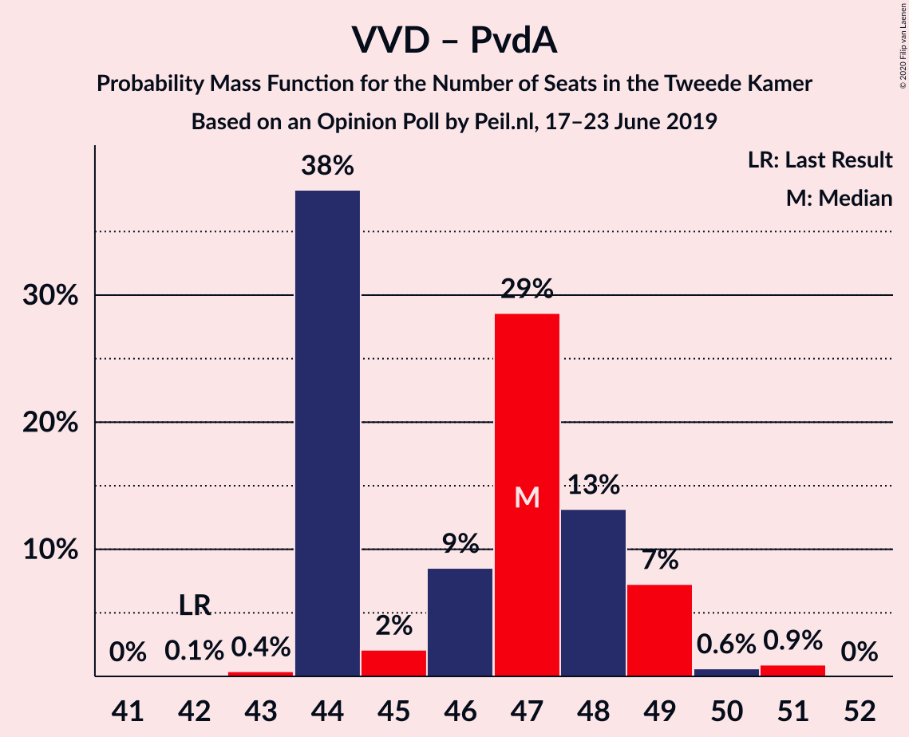

| Number of Seats | Probability | Accumulated | Special Marks |
|:---------------:|:-----------:|:-----------:|:-------------:|
| 42 | 0% | 100% | Last Result |
| 43 | 2% | 100% |  |
| 44 | 0.2% | 98% |  |
| 45 | 4% | 98% |  |
| 46 | 75% | 94% | Median |
| 47 | 0.9% | 19% |  |
| 48 | 16% | 18% |  |
| 49 | 1.3% | 2% |  |
| 50 | 0.3% | 0.4% |  |
| 51 | 0% | 0.1% |  |
| 52 | 0.1% | 0.1% |  |
| 53 | 0% | 0% |  |

### Partij van de Arbeid – Christen-Democratisch Appèl – Democraten 66

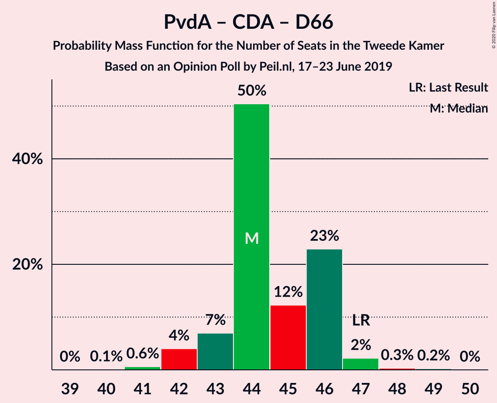

| Number of Seats | Probability | Accumulated | Special Marks |
|:---------------:|:-----------:|:-----------:|:-------------:|
| 40 | 0.3% | 100% |  |
| 41 | 0% | 99.7% |  |
| 42 | 3% | 99.7% |  |
| 43 | 5% | 96% |  |
| 44 | 66% | 91% | Median |
| 45 | 15% | 25% |  |
| 46 | 1.0% | 10% |  |
| 47 | 9% | 9% | Last Result |
| 48 | 0.4% | 0.4% |  |
| 49 | 0.1% | 0.1% |  |
| 50 | 0% | 0% |  |

### Volkspartij voor Vrijheid en Democratie – Christen-Democratisch Appèl

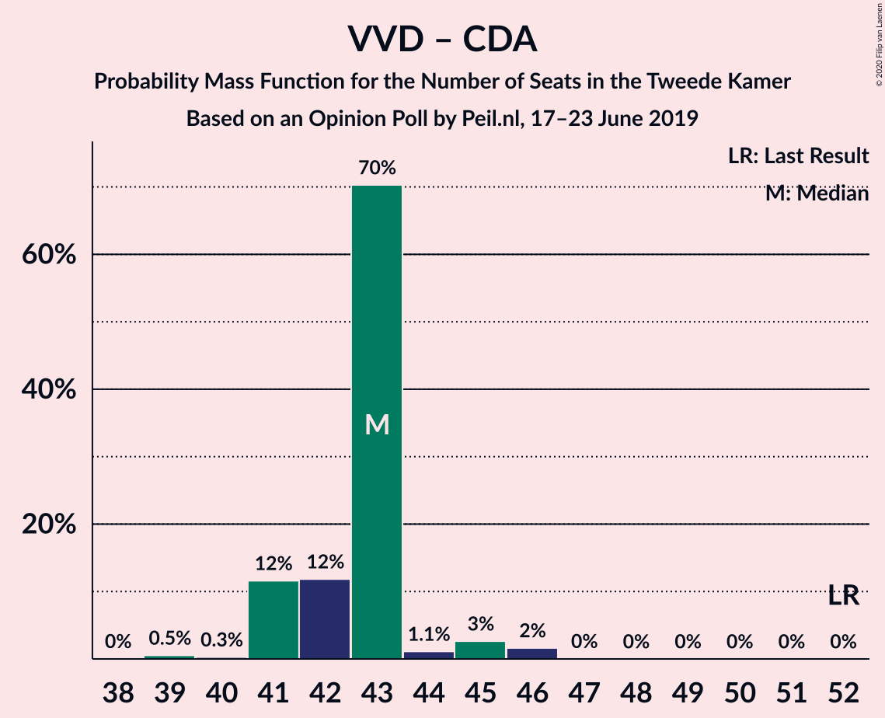

| Number of Seats | Probability | Accumulated | Special Marks |
|:---------------:|:-----------:|:-----------:|:-------------:|
| 39 | 0.5% | 100% |  |
| 40 | 0.3% | 99.4% |  |
| 41 | 12% | 99.2% |  |
| 42 | 12% | 88% |  |
| 43 | 70% | 76% | Median |
| 44 | 1.1% | 5% |  |
| 45 | 3% | 4% |  |
| 46 | 2% | 2% |  |
| 47 | 0% | 0% |  |
| 48 | 0% | 0% |  |
| 49 | 0% | 0% |  |
| 50 | 0% | 0% |  |
| 51 | 0% | 0% |  |
| 52 | 0% | 0% | Last Result |

### Partij van de Arbeid – Christen-Democratisch Appèl – ChristenUnie

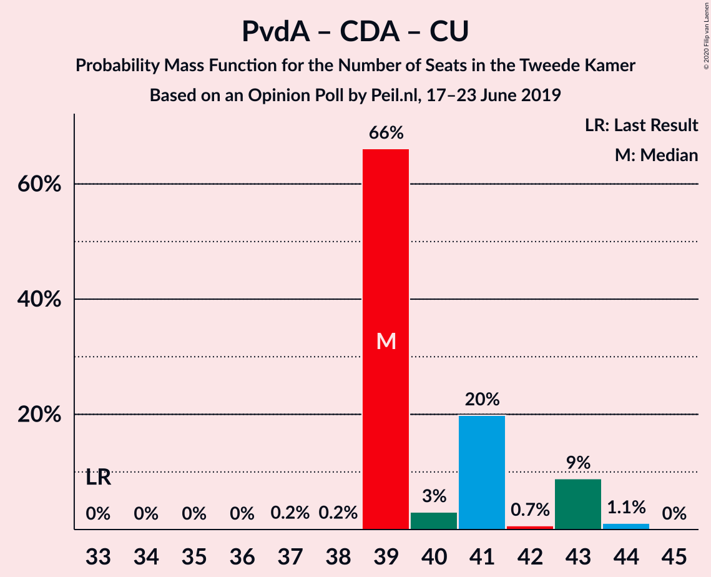

| Number of Seats | Probability | Accumulated | Special Marks |
|:---------------:|:-----------:|:-----------:|:-------------:|
| 33 | 0% | 100% | Last Result |
| 34 | 0% | 100% |  |
| 35 | 0% | 100% |  |
| 36 | 0% | 100% |  |
| 37 | 0.2% | 100% |  |
| 38 | 0.2% | 99.8% |  |
| 39 | 66% | 99.7% | Median |
| 40 | 3% | 34% |  |
| 41 | 20% | 30% |  |
| 42 | 0.7% | 11% |  |
| 43 | 9% | 10% |  |
| 44 | 1.1% | 1.1% |  |
| 45 | 0% | 0% |  |

### Partij van de Arbeid – Christen-Democratisch Appèl

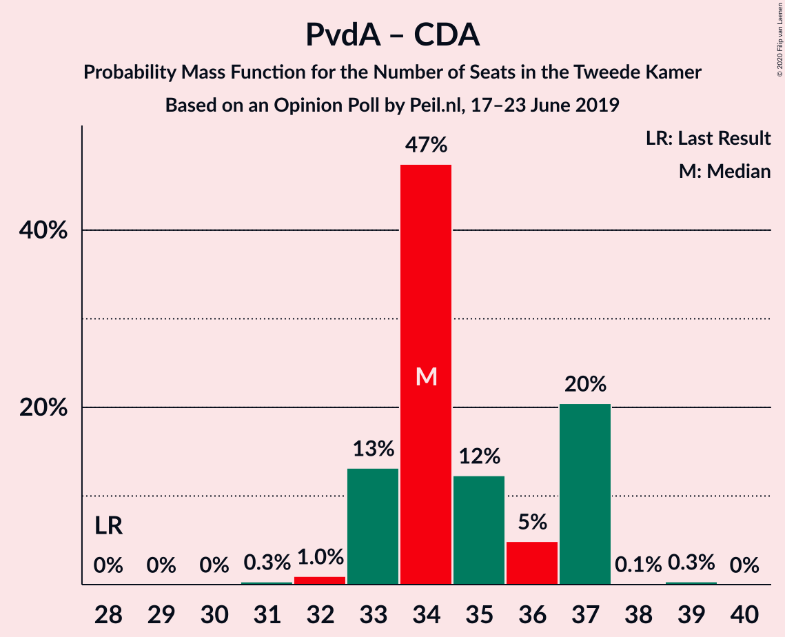

| Number of Seats | Probability | Accumulated | Special Marks |
|:---------------:|:-----------:|:-----------:|:-------------:|
| 28 | 0% | 100% | Last Result |
| 29 | 0% | 100% |  |
| 30 | 0.1% | 100% |  |
| 31 | 0.2% | 99.9% |  |
| 32 | 2% | 99.7% |  |
| 33 | 67% | 97% | Median |
| 34 | 7% | 30% |  |
| 35 | 13% | 24% |  |
| 36 | 10% | 10% |  |
| 37 | 0.1% | 0.5% |  |
| 38 | 0.4% | 0.4% |  |
| 39 | 0% | 0% |  |

### Christen-Democratisch Appèl – Democraten 66

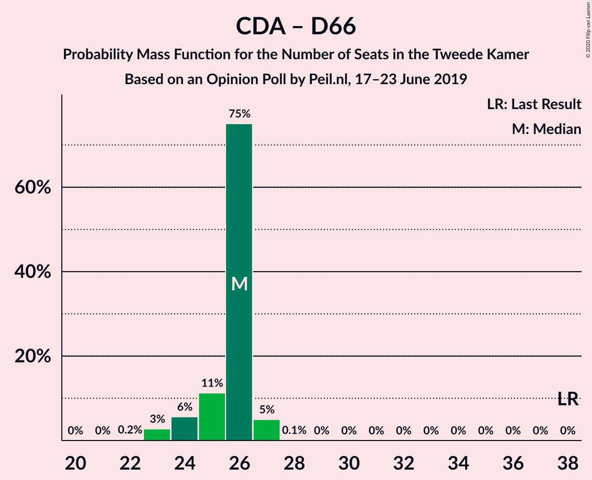

| Number of Seats | Probability | Accumulated | Special Marks |
|:---------------:|:-----------:|:-----------:|:-------------:|
| 22 | 0.2% | 100% |  |
| 23 | 3% | 99.8% |  |
| 24 | 6% | 97% |  |
| 25 | 11% | 91% |  |
| 26 | 75% | 80% | Median |
| 27 | 5% | 5% |  |
| 28 | 0.1% | 0.1% |  |
| 29 | 0% | 0% |  |
| 30 | 0% | 0% |  |
| 31 | 0% | 0% |  |
| 32 | 0% | 0% |  |
| 33 | 0% | 0% |  |
| 34 | 0% | 0% |  |
| 35 | 0% | 0% |  |
| 36 | 0% | 0% |  |
| 37 | 0% | 0% |  |
| 38 | 0% | 0% | Last Result |

## Technical Information

### Opinion Poll

+ **Polling firm:** Peil.nl
+ **Commissioner(s):** —
+ **Fieldwork period:** 17–23 June 2019

### Calculations

+ **Sample size:** 3000
+ **Simulations done:** 131,072
+ **Error estimate:** 1.40%

