# Opinion Poll by Ipsos for EenVandaag, 21–24 June 2019

<a href="#voting-intentions">Voting Intentions</a> | <a href="#seats">Seats</a> | <a href="#coalitions">Coalitions</a> | <a href="#technical-information">Technical Information</a>

## Voting Intentions

### Confidence Intervals

| Party | Last Result | Poll Result | 80% Confidence Interval | 90% Confidence Interval | 95% Confidence Interval | 99% Confidence Interval |
|:-----:|:-----------:|:-----------:|:-----------------------:|:-----------------------:|:-----------------------:|:-----------------------:|
| Volkspartij voor Vrijheid en Democratie | 21.3% | 20.0% | 18.5–21.7% |18.1–22.2% |17.7–22.6% |17.0–23.4% |
| Forum voor Democratie | 1.8% | 13.2% | 11.9–14.7% |11.6–15.1% |11.3–15.5% |10.7–16.2% |
| GroenLinks | 9.1% | 11.3% | 10.1–12.7% |9.8–13.0% |9.5–13.4% |8.9–14.1% |
| Partij van de Arbeid | 5.7% | 9.0% | 8.0–10.3% |7.7–10.7% |7.4–11.0% |7.0–11.6% |
| Christen-Democratisch Appèl | 12.4% | 8.9% | 7.8–10.1% |7.5–10.4% |7.3–10.8% |6.8–11.4% |
| Democraten 66 | 12.2% | 7.6% | 6.6–8.7% |6.3–9.1% |6.1–9.4% |5.7–10.0% |
| Partij voor de Vrijheid | 13.1% | 7.1% | 6.2–8.2% |5.9–8.6% |5.7–8.8% |5.3–9.4% |
| Socialistische Partij | 9.1% | 5.6% | 4.8–6.7% |4.6–7.0% |4.4–7.2% |4.0–7.8% |
| Partij voor de Dieren | 3.2% | 4.1% | 3.4–5.0% |3.2–5.3% |3.0–5.5% |2.7–5.9% |
| ChristenUnie | 3.4% | 4.0% | 3.3–4.9% |3.1–5.2% |3.0–5.4% |2.7–5.8% |
| 50Plus | 3.1% | 4.0% | 3.3–4.9% |3.1–5.2% |3.0–5.4% |2.7–5.8% |
| Staatkundig Gereformeerde Partij | 2.1% | 2.1% | 1.7–2.9% |1.5–3.0% |1.4–3.2% |1.2–3.6% |
| DENK | 2.1% | 1.8% | 1.4–2.5% |1.3–2.7% |1.2–2.9% |1.0–3.2% |

*Note:* The poll result column reflects the actual value used in the calculations. Published results may vary slightly, and in addition be rounded to fewer digits.

## Seats

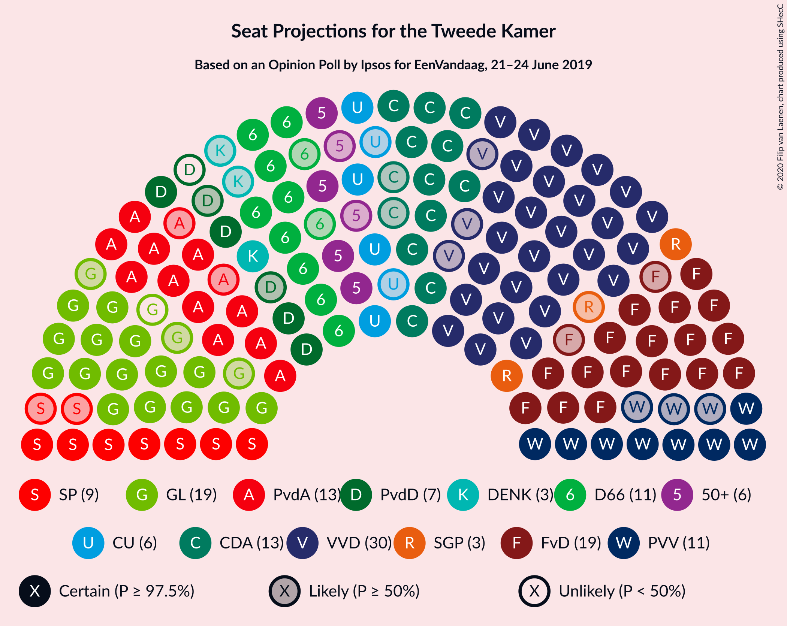

### Confidence Intervals

| Party | Last Result | Median | 80% Confidence Interval | 90% Confidence Interval | 95% Confidence Interval | 99% Confidence Interval |
|:-----:|:-----------:|:------:|:-----------------------:|:-----------------------:|:-----------------------:|:-----------------------:|
| <a href="#volkspartij-voor-vrijheid-en-democratie">Volkspartij voor Vrijheid en Democratie</a> | 33 | 31 | 28–33 |27–34 |26–36 |24–36 |
| <a href="#forum-voor-democratie">Forum voor Democratie</a> | 2 | 20 | 17–23 |17–23 |17–24 |15–25 |
| <a href="#groenlinks">GroenLinks</a> | 14 | 17 | 15–20 |15–21 |14–21 |14–22 |
| <a href="#partij-van-de-arbeid">Partij van de Arbeid</a> | 9 | 14 | 12–16 |11–16 |11–16 |10–17 |
| <a href="#christen-democratisch-appèl">Christen-Democratisch Appèl</a> | 19 | 12 | 12–16 |11–16 |11–16 |9–17 |
| <a href="#democraten-66">Democraten 66</a> | 19 | 11 | 7–12 |7–13 |7–14 |7–15 |
| <a href="#partij-voor-de-vrijheid">Partij voor de Vrijheid</a> | 20 | 10 | 9–11 |8–12 |8–13 |7–14 |
| <a href="#socialistische-partij">Socialistische Partij</a> | 14 | 8 | 7–10 |7–10 |6–10 |5–12 |
| <a href="#partij-voor-de-dieren">Partij voor de Dieren</a> | 5 | 6 | 3–8 |3–8 |3–8 |3–9 |
| <a href="#christenunie">ChristenUnie</a> | 5 | 6 | 5–7 |4–8 |4–8 |4–8 |
| <a href="#50plus">50Plus</a> | 4 | 6 | 4–9 |4–9 |4–9 |3–9 |
| <a href="#staatkundig-gereformeerde-partij">Staatkundig Gereformeerde Partij</a> | 3 | 3 | 2–4 |2–4 |2–5 |1–6 |
| <a href="#denk">DENK</a> | 3 | 3 | 2–4 |1–6 |0–6 |0–6 |

### Volkspartij voor Vrijheid en Democratie

*For a full overview of the results for this party, see the [Volkspartij voor Vrijheid en Democratie](party-volkspartijvoorvrijheidendemocratie.html) page.*

| Number of Seats | Probability | Accumulated | Special Marks |
|:---------------:|:-----------:|:-----------:|:-------------:|
| 24 | 0.6% | 100% |  |
| 25 | 1.5% | 99.4% |  |
| 26 | 0.7% | 98% |  |
| 27 | 4% | 97% |  |
| 28 | 12% | 93% |  |
| 29 | 3% | 81% |  |
| 30 | 11% | 78% |  |
| 31 | 29% | 67% | Median |
| 32 | 25% | 37% |  |
| 33 | 4% | 12% | Last Result |
| 34 | 4% | 8% |  |
| 35 | 1.4% | 4% |  |
| 36 | 3% | 3% |  |
| 37 | 0.1% | 0.1% |  |
| 38 | 0% | 0% |  |

### Forum voor Democratie

*For a full overview of the results for this party, see the [Forum voor Democratie](party-forumvoordemocratie.html) page.*

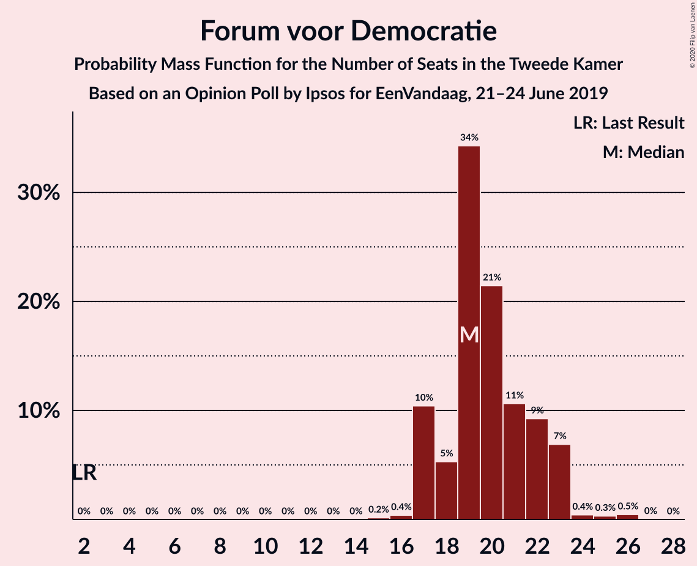

| Number of Seats | Probability | Accumulated | Special Marks |
|:---------------:|:-----------:|:-----------:|:-------------:|
| 2 | 0% | 100% | Last Result |
| 3 | 0% | 100% |  |
| 4 | 0% | 100% |  |
| 5 | 0% | 100% |  |
| 6 | 0% | 100% |  |
| 7 | 0% | 100% |  |
| 8 | 0% | 100% |  |
| 9 | 0% | 100% |  |
| 10 | 0% | 100% |  |
| 11 | 0% | 100% |  |
| 12 | 0% | 100% |  |
| 13 | 0% | 100% |  |
| 14 | 0% | 100% |  |
| 15 | 0.8% | 100% |  |
| 16 | 0.6% | 99.2% |  |
| 17 | 11% | 98.6% |  |
| 18 | 2% | 88% |  |
| 19 | 17% | 86% |  |
| 20 | 23% | 69% | Median |
| 21 | 26% | 45% |  |
| 22 | 7% | 19% |  |
| 23 | 8% | 12% |  |
| 24 | 3% | 4% |  |
| 25 | 1.1% | 1.2% |  |
| 26 | 0% | 0% |  |

### GroenLinks

*For a full overview of the results for this party, see the [GroenLinks](party-groenlinks.html) page.*

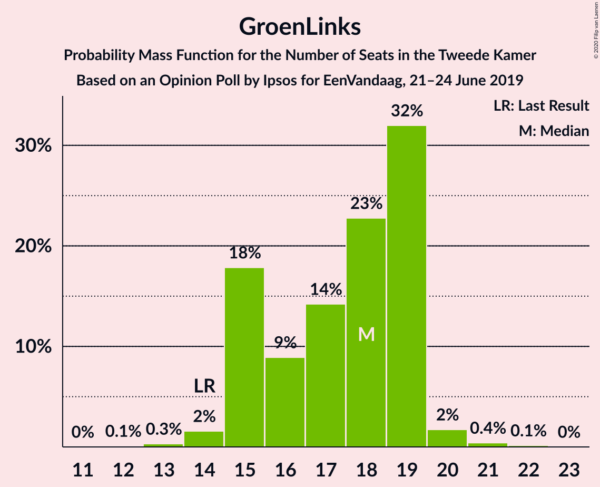

| Number of Seats | Probability | Accumulated | Special Marks |
|:---------------:|:-----------:|:-----------:|:-------------:|
| 12 | 0.1% | 100% |  |
| 13 | 0.4% | 99.9% |  |
| 14 | 2% | 99.5% | Last Result |
| 15 | 11% | 97% |  |
| 16 | 7% | 86% |  |
| 17 | 34% | 78% | Median |
| 18 | 30% | 44% |  |
| 19 | 4% | 14% |  |
| 20 | 1.3% | 10% |  |
| 21 | 8% | 9% |  |
| 22 | 0.5% | 0.5% |  |
| 23 | 0% | 0% |  |

### Partij van de Arbeid

*For a full overview of the results for this party, see the [Partij van de Arbeid](party-partijvandearbeid.html) page.*

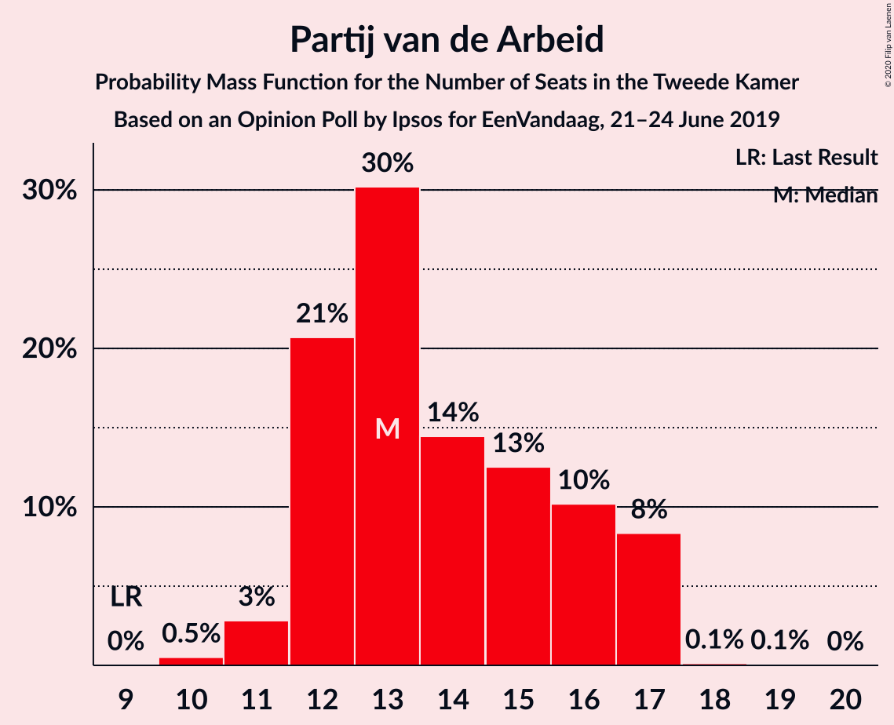

| Number of Seats | Probability | Accumulated | Special Marks |
|:---------------:|:-----------:|:-----------:|:-------------:|
| 9 | 0.4% | 100% | Last Result |
| 10 | 2% | 99.6% |  |
| 11 | 5% | 98% |  |
| 12 | 3% | 93% |  |
| 13 | 31% | 90% |  |
| 14 | 24% | 59% | Median |
| 15 | 20% | 34% |  |
| 16 | 13% | 14% |  |
| 17 | 2% | 2% |  |
| 18 | 0% | 0.2% |  |
| 19 | 0% | 0.2% |  |
| 20 | 0.2% | 0.2% |  |
| 21 | 0% | 0% |  |

### Christen-Democratisch Appèl

*For a full overview of the results for this party, see the [Christen-Democratisch Appèl](party-christen-democratischappèl.html) page.*

| Number of Seats | Probability | Accumulated | Special Marks |
|:---------------:|:-----------:|:-----------:|:-------------:|
| 9 | 0.5% | 100% |  |
| 10 | 1.2% | 99.5% |  |
| 11 | 4% | 98% |  |
| 12 | 52% | 95% | Median |
| 13 | 6% | 43% |  |
| 14 | 10% | 36% |  |
| 15 | 16% | 27% |  |
| 16 | 10% | 11% |  |
| 17 | 0.9% | 1.1% |  |
| 18 | 0.2% | 0.2% |  |
| 19 | 0% | 0% | Last Result |

### Democraten 66

*For a full overview of the results for this party, see the [Democraten 66](party-democraten66.html) page.*

| Number of Seats | Probability | Accumulated | Special Marks |
|:---------------:|:-----------:|:-----------:|:-------------:|
| 7 | 15% | 100% |  |
| 8 | 0.3% | 85% |  |
| 9 | 0.9% | 85% |  |
| 10 | 8% | 84% |  |
| 11 | 47% | 76% | Median |
| 12 | 23% | 30% |  |
| 13 | 3% | 7% |  |
| 14 | 2% | 3% |  |
| 15 | 1.5% | 2% |  |
| 16 | 0.1% | 0.4% |  |
| 17 | 0% | 0.2% |  |
| 18 | 0.1% | 0.2% |  |
| 19 | 0.1% | 0.1% | Last Result |
| 20 | 0% | 0% |  |

### Partij voor de Vrijheid

*For a full overview of the results for this party, see the [Partij voor de Vrijheid](party-partijvoordevrijheid.html) page.*

| Number of Seats | Probability | Accumulated | Special Marks |
|:---------------:|:-----------:|:-----------:|:-------------:|
| 7 | 0.6% | 100% |  |
| 8 | 5% | 99.4% |  |
| 9 | 42% | 95% |  |
| 10 | 12% | 53% | Median |
| 11 | 34% | 41% |  |
| 12 | 5% | 7% |  |
| 13 | 1.5% | 3% |  |
| 14 | 1.2% | 1.4% |  |
| 15 | 0.2% | 0.2% |  |
| 16 | 0% | 0% |  |
| 17 | 0% | 0% |  |
| 18 | 0% | 0% |  |
| 19 | 0% | 0% |  |
| 20 | 0% | 0% | Last Result |

### Socialistische Partij

*For a full overview of the results for this party, see the [Socialistische Partij](party-socialistischepartij.html) page.*

| Number of Seats | Probability | Accumulated | Special Marks |
|:---------------:|:-----------:|:-----------:|:-------------:|
| 5 | 2% | 100% |  |
| 6 | 1.0% | 98% |  |
| 7 | 44% | 97% |  |
| 8 | 24% | 53% | Median |
| 9 | 14% | 29% |  |
| 10 | 13% | 14% |  |
| 11 | 1.1% | 2% |  |
| 12 | 0.5% | 0.8% |  |
| 13 | 0.3% | 0.3% |  |
| 14 | 0% | 0% | Last Result |

### Partij voor de Dieren

*For a full overview of the results for this party, see the [Partij voor de Dieren](party-partijvoordedieren.html) page.*

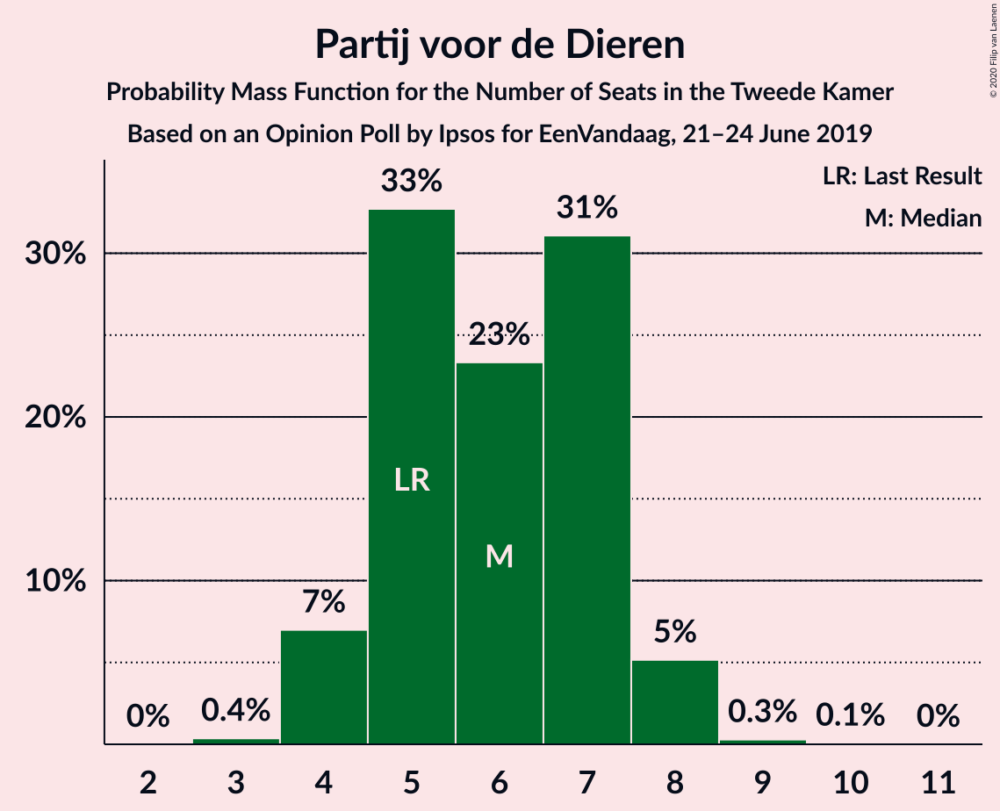

| Number of Seats | Probability | Accumulated | Special Marks |
|:---------------:|:-----------:|:-----------:|:-------------:|
| 3 | 10% | 100% |  |
| 4 | 8% | 90% |  |
| 5 | 7% | 82% | Last Result |
| 6 | 50% | 74% | Median |
| 7 | 3% | 24% |  |
| 8 | 20% | 21% |  |
| 9 | 0.7% | 0.7% |  |
| 10 | 0% | 0.1% |  |
| 11 | 0% | 0% |  |

### ChristenUnie

*For a full overview of the results for this party, see the [ChristenUnie](party-christenunie.html) page.*

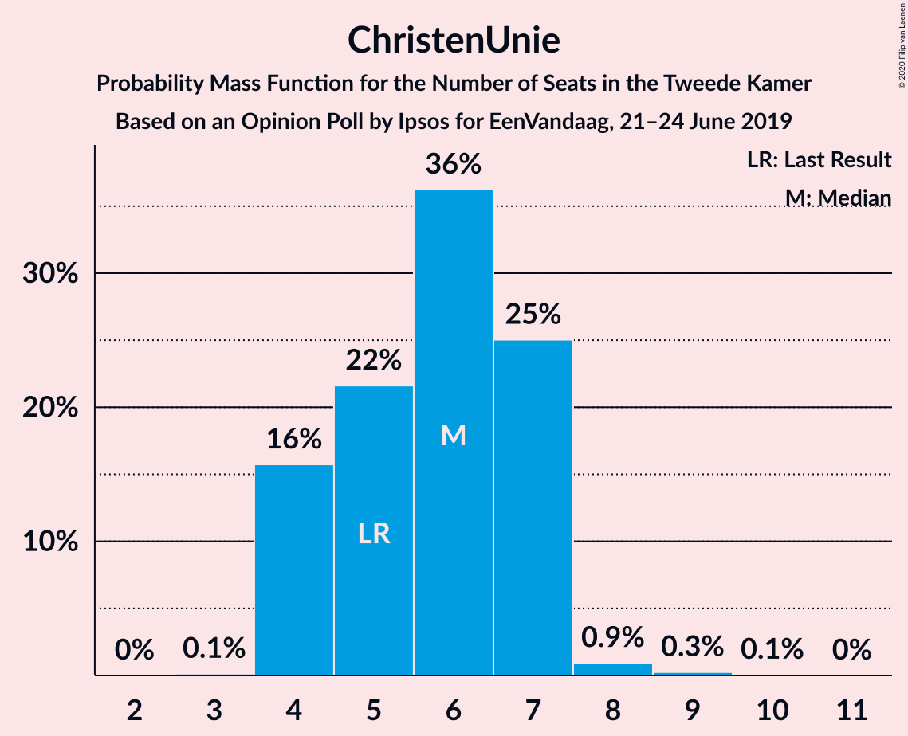

| Number of Seats | Probability | Accumulated | Special Marks |
|:---------------:|:-----------:|:-----------:|:-------------:|
| 3 | 0.5% | 100% |  |
| 4 | 7% | 99.5% |  |
| 5 | 11% | 93% | Last Result |
| 6 | 43% | 82% | Median |
| 7 | 33% | 39% |  |
| 8 | 5% | 6% |  |
| 9 | 0.5% | 0.5% |  |
| 10 | 0% | 0% |  |

### 50Plus

*For a full overview of the results for this party, see the [50Plus](party-50plus.html) page.*

| Number of Seats | Probability | Accumulated | Special Marks |
|:---------------:|:-----------:|:-----------:|:-------------:|
| 3 | 1.1% | 100% |  |
| 4 | 16% | 98.9% | Last Result |
| 5 | 15% | 83% |  |
| 6 | 29% | 67% | Median |
| 7 | 12% | 38% |  |
| 8 | 3% | 26% |  |
| 9 | 23% | 23% |  |
| 10 | 0.2% | 0.2% |  |
| 11 | 0% | 0% |  |

### Staatkundig Gereformeerde Partij

*For a full overview of the results for this party, see the [Staatkundig Gereformeerde Partij](party-staatkundiggereformeerdepartij.html) page.*

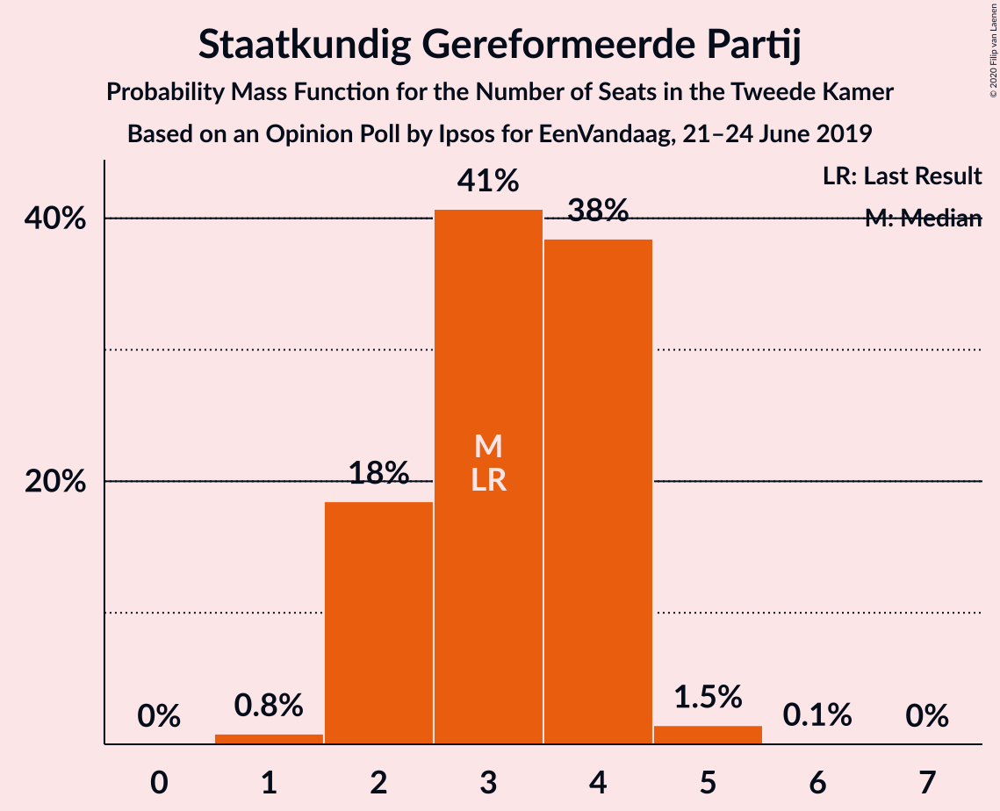

| Number of Seats | Probability | Accumulated | Special Marks |
|:---------------:|:-----------:|:-----------:|:-------------:|
| 1 | 1.0% | 100% |  |
| 2 | 22% | 99.0% |  |
| 3 | 46% | 77% | Last Result, Median |
| 4 | 28% | 31% |  |
| 5 | 2% | 3% |  |
| 6 | 0.7% | 0.7% |  |
| 7 | 0% | 0% |  |

### DENK

*For a full overview of the results for this party, see the [DENK](party-denk.html) page.*

| Number of Seats | Probability | Accumulated | Special Marks |
|:---------------:|:-----------:|:-----------:|:-------------:|
| 0 | 4% | 100% |  |
| 1 | 4% | 96% |  |
| 2 | 18% | 92% |  |
| 3 | 61% | 73% | Last Result, Median |
| 4 | 7% | 13% |  |
| 5 | 0.2% | 6% |  |
| 6 | 6% | 6% |  |
| 7 | 0% | 0% |  |

## Coalitions

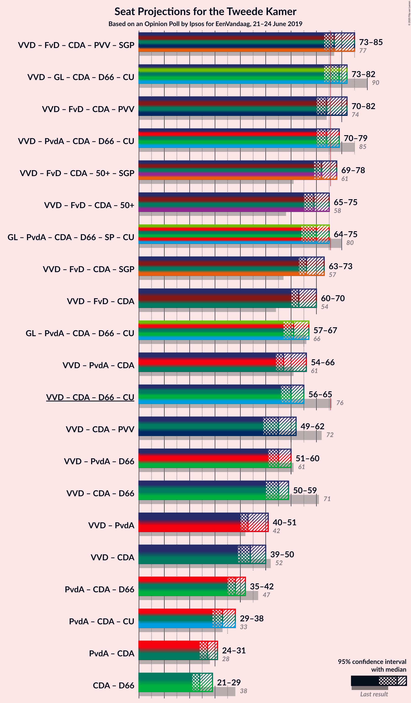

### Confidence Intervals

| Coalition | Last Result | Median | Majority? | 80% Confidence Interval | 90% Confidence Interval | 95% Confidence Interval | 99% Confidence Interval |
|:---------:|:-----------:|:------:|:---------:|:-----------------------:|:-----------------------:|:-----------------------:|:-----------------------:|
| Volkspartij voor Vrijheid en Democratie – GroenLinks – Christen-Democratisch Appèl – Democraten 66 – ChristenUnie | 90 | 78 | 94% | 76–81 | 74–81 | 73–83 | 70–85 |
| Volkspartij voor Vrijheid en Democratie – Forum voor Democratie – Christen-Democratisch Appèl – Partij voor de Vrijheid – Staatkundig Gereformeerde Partij | 77 | 77 | 86% | 73–80 | 70–82 | 70–83 | 70–84 |
| Volkspartij voor Vrijheid en Democratie – Partij van de Arbeid – Christen-Democratisch Appèl – Democraten 66 – ChristenUnie | 85 | 73 | 28% | 72–82 | 71–82 | 70–82 | 65–82 |
| Volkspartij voor Vrijheid en Democratie – Forum voor Democratie – Christen-Democratisch Appèl – Partij voor de Vrijheid | 74 | 74 | 26% | 70–78 | 68–79 | 68–80 | 66–82 |
| Volkspartij voor Vrijheid en Democratie – Forum voor Democratie – Christen-Democratisch Appèl – 50Plus – Staatkundig Gereformeerde Partij | 61 | 74 | 31% | 68–77 | 65–77 | 65–78 | 65–81 |
| GroenLinks – Partij van de Arbeid – Christen-Democratisch Appèl – Democraten 66 – Socialistische Partij – ChristenUnie | 80 | 68 | 9% | 66–74 | 66–76 | 66–76 | 64–76 |
| Volkspartij voor Vrijheid en Democratie – Forum voor Democratie – Christen-Democratisch Appèl – 50Plus | 58 | 71 | 2% | 65–73 | 63–74 | 63–75 | 62–79 |
| Volkspartij voor Vrijheid en Democratie – Forum voor Democratie – Christen-Democratisch Appèl – Staatkundig Gereformeerde Partij | 57 | 68 | 0% | 62–69 | 61–72 | 61–73 | 61–75 |
| Volkspartij voor Vrijheid en Democratie – Forum voor Democratie – Christen-Democratisch Appèl | 54 | 64 | 0% | 59–67 | 59–68 | 59–70 | 57–73 |
| Volkspartij voor Vrijheid en Democratie – Christen-Democratisch Appèl – Democraten 66 – ChristenUnie | 76 | 60 | 0% | 58–66 | 57–66 | 57–66 | 52–69 |
| GroenLinks – Partij van de Arbeid – Christen-Democratisch Appèl – Democraten 66 – ChristenUnie | 66 | 60 | 0% | 58–66 | 58–66 | 56–66 | 56–68 |
| Volkspartij voor Vrijheid en Democratie – Partij van de Arbeid – Christen-Democratisch Appèl | 61 | 58 | 0% | 54–63 | 53–63 | 51–63 | 50–64 |
| Volkspartij voor Vrijheid en Democratie – Partij van de Arbeid – Democraten 66 | 61 | 55 | 0% | 52–60 | 52–60 | 51–61 | 50–63 |
| Volkspartij voor Vrijheid en Democratie – Christen-Democratisch Appèl – Democraten 66 | 71 | 54 | 0% | 51–59 | 51–59 | 51–60 | 47–62 |
| Volkspartij voor Vrijheid en Democratie – Christen-Democratisch Appèl – Partij voor de Vrijheid | 72 | 54 | 0% | 51–58 | 50–58 | 49–58 | 47–62 |
| Volkspartij voor Vrijheid en Democratie – Partij van de Arbeid | 42 | 44 | 0% | 41–48 | 41–49 | 39–51 | 37–51 |
| Volkspartij voor Vrijheid en Democratie – Christen-Democratisch Appèl | 52 | 44 | 0% | 42–47 | 41–48 | 38–49 | 37–50 |
| Partij van de Arbeid – Christen-Democratisch Appèl – Democraten 66 | 47 | 37 | 0% | 33–43 | 33–43 | 33–43 | 32–44 |
| Partij van de Arbeid – Christen-Democratisch Appèl – ChristenUnie | 33 | 33 | 0% | 31–38 | 30–38 | 29–38 | 27–38 |
| Partij van de Arbeid – Christen-Democratisch Appèl | 28 | 26 | 0% | 25–31 | 23–31 | 23–31 | 22–32 |
| Christen-Democratisch Appèl – Democraten 66 | 38 | 24 | 0% | 19–27 | 19–27 | 19–29 | 19–30 |

### Volkspartij voor Vrijheid en Democratie – GroenLinks – Christen-Democratisch Appèl – Democraten 66 – ChristenUnie

| Number of Seats | Probability | Accumulated | Special Marks |
|:---------------:|:-----------:|:-----------:|:-------------:|
| 69 | 0.3% | 100% |  |
| 70 | 1.1% | 99.7% |  |
| 71 | 0.6% | 98.6% |  |
| 72 | 0.1% | 98% |  |
| 73 | 0.9% | 98% |  |
| 74 | 3% | 97% |  |
| 75 | 0.7% | 94% |  |
| 76 | 15% | 94% | Majority |
| 77 | 24% | 78% | Median |
| 78 | 14% | 54% |  |
| 79 | 8% | 40% |  |
| 80 | 6% | 32% |  |
| 81 | 20% | 25% |  |
| 82 | 2% | 5% |  |
| 83 | 1.3% | 3% |  |
| 84 | 0.8% | 2% |  |
| 85 | 0.8% | 1.0% |  |
| 86 | 0.2% | 0.2% |  |
| 87 | 0% | 0% |  |
| 88 | 0% | 0% |  |
| 89 | 0% | 0% |  |
| 90 | 0% | 0% | Last Result |

### Volkspartij voor Vrijheid en Democratie – Forum voor Democratie – Christen-Democratisch Appèl – Partij voor de Vrijheid – Staatkundig Gereformeerde Partij

| Number of Seats | Probability | Accumulated | Special Marks |
|:---------------:|:-----------:|:-----------:|:-------------:|
| 70 | 8% | 100% |  |
| 71 | 0.8% | 92% |  |
| 72 | 0.6% | 91% |  |
| 73 | 0.7% | 90% |  |
| 74 | 2% | 90% |  |
| 75 | 1.2% | 87% |  |
| 76 | 10% | 86% | Median, Majority |
| 77 | 33% | 76% | Last Result |
| 78 | 19% | 43% |  |
| 79 | 1.5% | 24% |  |
| 80 | 14% | 23% |  |
| 81 | 2% | 8% |  |
| 82 | 3% | 6% |  |
| 83 | 1.4% | 4% |  |
| 84 | 2% | 2% |  |
| 85 | 0.3% | 0.4% |  |
| 86 | 0.1% | 0.1% |  |
| 87 | 0% | 0% |  |

### Volkspartij voor Vrijheid en Democratie – Partij van de Arbeid – Christen-Democratisch Appèl – Democraten 66 – ChristenUnie

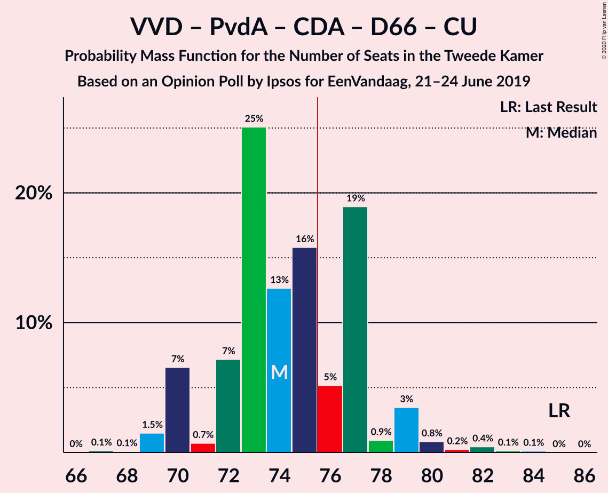

| Number of Seats | Probability | Accumulated | Special Marks |
|:---------------:|:-----------:|:-----------:|:-------------:|
| 65 | 0.8% | 100% |  |
| 66 | 0% | 99.2% |  |
| 67 | 0% | 99.2% |  |
| 68 | 0.1% | 99.1% |  |
| 69 | 0.2% | 99.1% |  |
| 70 | 2% | 98.9% |  |
| 71 | 3% | 97% |  |
| 72 | 18% | 94% |  |
| 73 | 29% | 76% |  |
| 74 | 2% | 47% | Median |
| 75 | 18% | 45% |  |
| 76 | 8% | 28% | Majority |
| 77 | 1.1% | 20% |  |
| 78 | 4% | 19% |  |
| 79 | 2% | 14% |  |
| 80 | 1.3% | 12% |  |
| 81 | 0.4% | 11% |  |
| 82 | 11% | 11% |  |
| 83 | 0% | 0% |  |
| 84 | 0% | 0% |  |
| 85 | 0% | 0% | Last Result |

### Volkspartij voor Vrijheid en Democratie – Forum voor Democratie – Christen-Democratisch Appèl – Partij voor de Vrijheid

| Number of Seats | Probability | Accumulated | Special Marks |
|:---------------:|:-----------:|:-----------:|:-------------:|
| 66 | 0.6% | 100% |  |
| 67 | 0.5% | 99.4% |  |
| 68 | 8% | 98.9% |  |
| 69 | 0.6% | 91% |  |
| 70 | 0.9% | 90% |  |
| 71 | 2% | 89% |  |
| 72 | 2% | 87% |  |
| 73 | 29% | 85% | Median |
| 74 | 14% | 56% | Last Result |
| 75 | 17% | 42% |  |
| 76 | 4% | 26% | Majority |
| 77 | 11% | 22% |  |
| 78 | 5% | 11% |  |
| 79 | 2% | 6% |  |
| 80 | 2% | 4% |  |
| 81 | 0.3% | 2% |  |
| 82 | 2% | 2% |  |
| 83 | 0.1% | 0.1% |  |
| 84 | 0% | 0% |  |

### Volkspartij voor Vrijheid en Democratie – Forum voor Democratie – Christen-Democratisch Appèl – 50Plus – Staatkundig Gereformeerde Partij

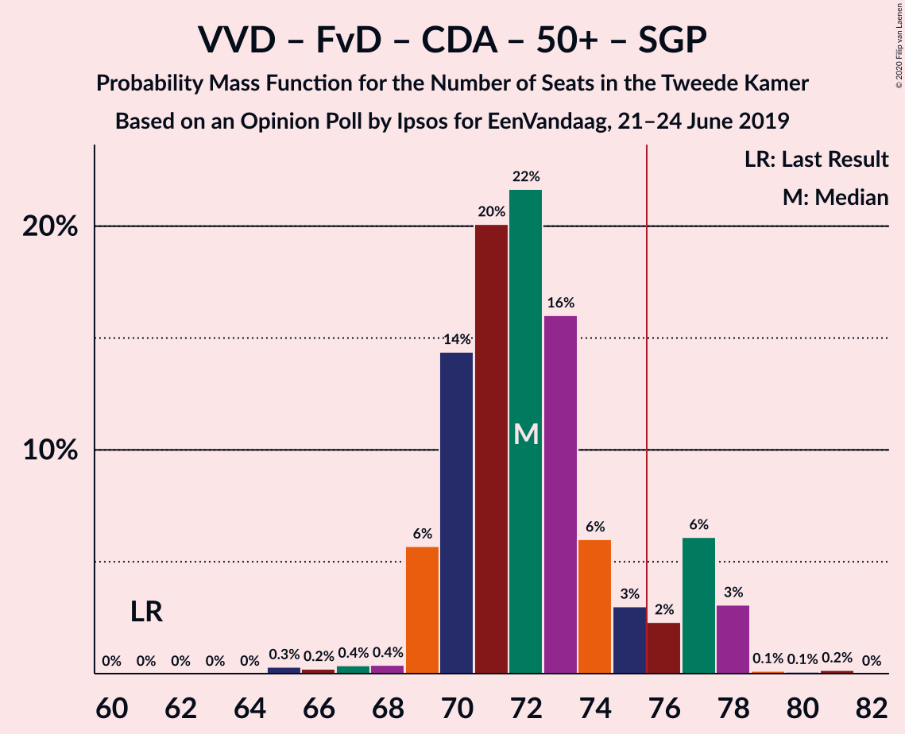

| Number of Seats | Probability | Accumulated | Special Marks |
|:---------------:|:-----------:|:-----------:|:-------------:|
| 61 | 0% | 100% | Last Result |
| 62 | 0% | 100% |  |
| 63 | 0% | 100% |  |
| 64 | 0% | 100% |  |
| 65 | 8% | 99.9% |  |
| 66 | 0% | 92% |  |
| 67 | 2% | 92% |  |
| 68 | 2% | 91% |  |
| 69 | 0.3% | 89% |  |
| 70 | 3% | 89% |  |
| 71 | 8% | 86% |  |
| 72 | 0.5% | 78% | Median |
| 73 | 21% | 78% |  |
| 74 | 18% | 57% |  |
| 75 | 8% | 39% |  |
| 76 | 3% | 31% | Majority |
| 77 | 24% | 28% |  |
| 78 | 2% | 4% |  |
| 79 | 0.9% | 2% |  |
| 80 | 0.1% | 2% |  |
| 81 | 2% | 2% |  |
| 82 | 0% | 0% |  |

### GroenLinks – Partij van de Arbeid – Christen-Democratisch Appèl – Democraten 66 – Socialistische Partij – ChristenUnie

| Number of Seats | Probability | Accumulated | Special Marks |
|:---------------:|:-----------:|:-----------:|:-------------:|
| 63 | 0.4% | 100% |  |
| 64 | 0.3% | 99.6% |  |
| 65 | 0.5% | 99.2% |  |
| 66 | 42% | 98.7% |  |
| 67 | 3% | 57% |  |
| 68 | 4% | 54% | Median |
| 69 | 4% | 50% |  |
| 70 | 9% | 46% |  |
| 71 | 12% | 37% |  |
| 72 | 2% | 24% |  |
| 73 | 2% | 22% |  |
| 74 | 10% | 20% |  |
| 75 | 0.4% | 10% |  |
| 76 | 9% | 9% | Majority |
| 77 | 0.4% | 0.5% |  |
| 78 | 0% | 0% |  |
| 79 | 0% | 0% |  |
| 80 | 0% | 0% | Last Result |

### Volkspartij voor Vrijheid en Democratie – Forum voor Democratie – Christen-Democratisch Appèl – 50Plus

| Number of Seats | Probability | Accumulated | Special Marks |
|:---------------:|:-----------:|:-----------:|:-------------:|
| 58 | 0% | 100% | Last Result |
| 59 | 0% | 100% |  |
| 60 | 0% | 100% |  |
| 61 | 0% | 100% |  |
| 62 | 0.6% | 99.9% |  |
| 63 | 8% | 99.3% |  |
| 64 | 1.2% | 91% |  |
| 65 | 1.4% | 90% |  |
| 66 | 0.7% | 89% |  |
| 67 | 3% | 88% |  |
| 68 | 6% | 85% |  |
| 69 | 0.7% | 78% | Median |
| 70 | 18% | 78% |  |
| 71 | 21% | 59% |  |
| 72 | 3% | 39% |  |
| 73 | 29% | 35% |  |
| 74 | 3% | 7% |  |
| 75 | 2% | 3% |  |
| 76 | 0% | 2% | Majority |
| 77 | 0.1% | 2% |  |
| 78 | 0% | 2% |  |
| 79 | 2% | 2% |  |
| 80 | 0% | 0% |  |

### Volkspartij voor Vrijheid en Democratie – Forum voor Democratie – Christen-Democratisch Appèl – Staatkundig Gereformeerde Partij

| Number of Seats | Probability | Accumulated | Special Marks |
|:---------------:|:-----------:|:-----------:|:-------------:|
| 57 | 0% | 100% | Last Result |
| 58 | 0% | 100% |  |
| 59 | 0% | 99.9% |  |
| 60 | 0% | 99.9% |  |
| 61 | 9% | 99.9% |  |
| 62 | 2% | 91% |  |
| 63 | 1.4% | 89% |  |
| 64 | 2% | 87% |  |
| 65 | 0.7% | 85% |  |
| 66 | 3% | 85% | Median |
| 67 | 31% | 82% |  |
| 68 | 28% | 52% |  |
| 69 | 16% | 24% |  |
| 70 | 2% | 8% |  |
| 71 | 0.7% | 6% |  |
| 72 | 0.3% | 5% |  |
| 73 | 3% | 5% |  |
| 74 | 0.9% | 2% |  |
| 75 | 2% | 2% |  |
| 76 | 0% | 0% | Majority |

### Volkspartij voor Vrijheid en Democratie – Forum voor Democratie – Christen-Democratisch Appèl

| Number of Seats | Probability | Accumulated | Special Marks |
|:---------------:|:-----------:|:-----------:|:-------------:|
| 54 | 0% | 100% | Last Result |
| 55 | 0% | 100% |  |
| 56 | 0% | 99.9% |  |
| 57 | 1.0% | 99.9% |  |
| 58 | 1.3% | 99.0% |  |
| 59 | 9% | 98% |  |
| 60 | 1.4% | 89% |  |
| 61 | 2% | 87% |  |
| 62 | 0.8% | 86% |  |
| 63 | 4% | 85% | Median |
| 64 | 51% | 81% |  |
| 65 | 4% | 30% |  |
| 66 | 13% | 26% |  |
| 67 | 7% | 13% |  |
| 68 | 2% | 6% |  |
| 69 | 0.5% | 4% |  |
| 70 | 2% | 4% |  |
| 71 | 0% | 2% |  |
| 72 | 0% | 2% |  |
| 73 | 2% | 2% |  |
| 74 | 0% | 0% |  |

### Volkspartij voor Vrijheid en Democratie – Christen-Democratisch Appèl – Democraten 66 – ChristenUnie

| Number of Seats | Probability | Accumulated | Special Marks |
|:---------------:|:-----------:|:-----------:|:-------------:|
| 51 | 0.3% | 100% |  |
| 52 | 0.4% | 99.6% |  |
| 53 | 0% | 99.3% |  |
| 54 | 0.1% | 99.2% |  |
| 55 | 0.1% | 99.1% |  |
| 56 | 2% | 99.0% |  |
| 57 | 3% | 98% |  |
| 58 | 15% | 94% |  |
| 59 | 0.9% | 79% |  |
| 60 | 41% | 78% | Median |
| 61 | 12% | 38% |  |
| 62 | 1.3% | 26% |  |
| 63 | 6% | 25% |  |
| 64 | 6% | 19% |  |
| 65 | 0.4% | 13% |  |
| 66 | 11% | 12% |  |
| 67 | 0.4% | 2% |  |
| 68 | 0.4% | 1.3% |  |
| 69 | 0.9% | 0.9% |  |
| 70 | 0% | 0% |  |
| 71 | 0% | 0% |  |
| 72 | 0% | 0% |  |
| 73 | 0% | 0% |  |
| 74 | 0% | 0% |  |
| 75 | 0% | 0% |  |
| 76 | 0% | 0% | Last Result, Majority |

### GroenLinks – Partij van de Arbeid – Christen-Democratisch Appèl – Democraten 66 – ChristenUnie

| Number of Seats | Probability | Accumulated | Special Marks |
|:---------------:|:-----------:|:-----------:|:-------------:|
| 55 | 0.3% | 100% |  |
| 56 | 2% | 99.6% |  |
| 57 | 0.7% | 97% |  |
| 58 | 16% | 97% |  |
| 59 | 29% | 81% |  |
| 60 | 4% | 52% | Median |
| 61 | 3% | 48% |  |
| 62 | 5% | 46% |  |
| 63 | 9% | 41% |  |
| 64 | 7% | 32% |  |
| 65 | 14% | 25% |  |
| 66 | 10% | 11% | Last Result |
| 67 | 0.6% | 1.1% |  |
| 68 | 0.5% | 0.5% |  |
| 69 | 0% | 0.1% |  |
| 70 | 0% | 0% |  |

### Volkspartij voor Vrijheid en Democratie – Partij van de Arbeid – Christen-Democratisch Appèl

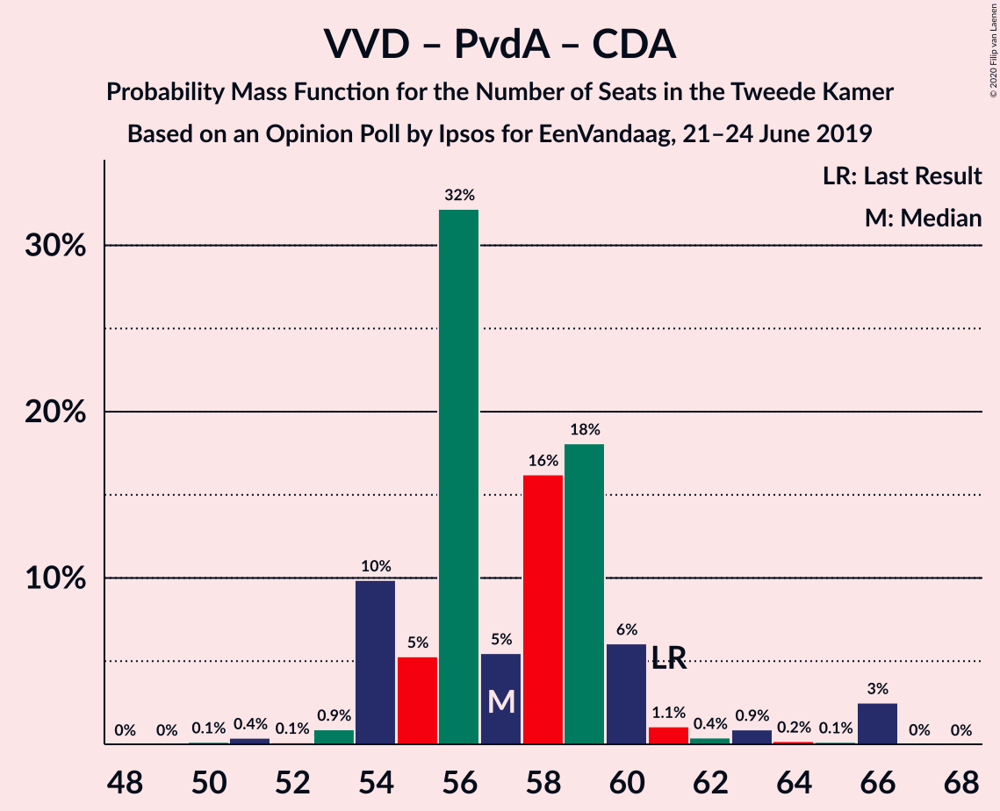

| Number of Seats | Probability | Accumulated | Special Marks |
|:---------------:|:-----------:|:-----------:|:-------------:|
| 50 | 0.6% | 100% |  |
| 51 | 2% | 99.4% |  |
| 52 | 0.1% | 97% |  |
| 53 | 3% | 97% |  |
| 54 | 6% | 94% |  |
| 55 | 0.4% | 88% |  |
| 56 | 24% | 87% |  |
| 57 | 11% | 63% | Median |
| 58 | 24% | 53% |  |
| 59 | 4% | 28% |  |
| 60 | 7% | 24% |  |
| 61 | 0.3% | 17% | Last Result |
| 62 | 4% | 16% |  |
| 63 | 12% | 13% |  |
| 64 | 0.9% | 0.9% |  |
| 65 | 0% | 0% |  |

### Volkspartij voor Vrijheid en Democratie – Partij van de Arbeid – Democraten 66

| Number of Seats | Probability | Accumulated | Special Marks |
|:---------------:|:-----------:|:-----------:|:-------------:|
| 48 | 0.3% | 100% |  |
| 49 | 0.1% | 99.7% |  |
| 50 | 0.7% | 99.5% |  |
| 51 | 2% | 98.8% |  |
| 52 | 10% | 97% |  |
| 53 | 22% | 87% |  |
| 54 | 2% | 65% |  |
| 55 | 26% | 63% |  |
| 56 | 3% | 36% | Median |
| 57 | 13% | 33% |  |
| 58 | 3% | 20% |  |
| 59 | 1.3% | 17% |  |
| 60 | 11% | 16% |  |
| 61 | 3% | 5% | Last Result |
| 62 | 1.0% | 2% |  |
| 63 | 0.6% | 0.6% |  |
| 64 | 0% | 0% |  |

### Volkspartij voor Vrijheid en Democratie – Christen-Democratisch Appèl – Democraten 66

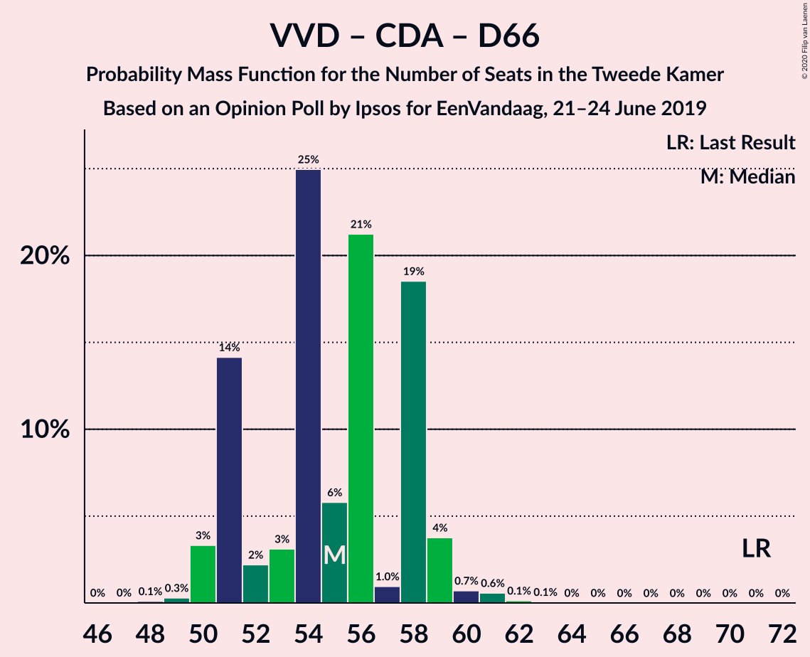

| Number of Seats | Probability | Accumulated | Special Marks |
|:---------------:|:-----------:|:-----------:|:-------------:|
| 46 | 0.3% | 100% |  |
| 47 | 0.4% | 99.6% |  |
| 48 | 0% | 99.2% |  |
| 49 | 1.3% | 99.2% |  |
| 50 | 0.1% | 98% |  |
| 51 | 16% | 98% |  |
| 52 | 5% | 82% |  |
| 53 | 5% | 77% |  |
| 54 | 32% | 71% | Median |
| 55 | 8% | 39% |  |
| 56 | 7% | 31% |  |
| 57 | 4% | 24% |  |
| 58 | 3% | 20% |  |
| 59 | 13% | 17% |  |
| 60 | 2% | 4% |  |
| 61 | 0.9% | 2% |  |
| 62 | 0.5% | 0.6% |  |
| 63 | 0% | 0.1% |  |
| 64 | 0% | 0% |  |
| 65 | 0% | 0% |  |
| 66 | 0% | 0% |  |
| 67 | 0% | 0% |  |
| 68 | 0% | 0% |  |
| 69 | 0% | 0% |  |
| 70 | 0% | 0% |  |
| 71 | 0% | 0% | Last Result |

### Volkspartij voor Vrijheid en Democratie – Christen-Democratisch Appèl – Partij voor de Vrijheid

| Number of Seats | Probability | Accumulated | Special Marks |
|:---------------:|:-----------:|:-----------:|:-------------:|
| 47 | 1.0% | 100% |  |
| 48 | 0.1% | 99.0% |  |
| 49 | 2% | 98.9% |  |
| 50 | 6% | 97% |  |
| 51 | 9% | 92% |  |
| 52 | 24% | 82% |  |
| 53 | 5% | 58% | Median |
| 54 | 9% | 53% |  |
| 55 | 20% | 44% |  |
| 56 | 6% | 24% |  |
| 57 | 2% | 18% |  |
| 58 | 13% | 16% |  |
| 59 | 0.1% | 2% |  |
| 60 | 0.4% | 2% |  |
| 61 | 1.5% | 2% |  |
| 62 | 0.4% | 0.5% |  |
| 63 | 0.1% | 0.1% |  |
| 64 | 0% | 0% |  |
| 65 | 0% | 0% |  |
| 66 | 0% | 0% |  |
| 67 | 0% | 0% |  |
| 68 | 0% | 0% |  |
| 69 | 0% | 0% |  |
| 70 | 0% | 0% |  |
| 71 | 0% | 0% |  |
| 72 | 0% | 0% | Last Result |

### Volkspartij voor Vrijheid en Democratie – Partij van de Arbeid

| Number of Seats | Probability | Accumulated | Special Marks |
|:---------------:|:-----------:|:-----------:|:-------------:|
| 37 | 0.7% | 100% |  |
| 38 | 0.1% | 99.3% |  |
| 39 | 2% | 99.2% |  |
| 40 | 2% | 97% |  |
| 41 | 8% | 96% |  |
| 42 | 9% | 88% | Last Result |
| 43 | 3% | 79% |  |
| 44 | 27% | 76% |  |
| 45 | 11% | 49% | Median |
| 46 | 21% | 38% |  |
| 47 | 0.7% | 17% |  |
| 48 | 11% | 17% |  |
| 49 | 0.9% | 5% |  |
| 50 | 1.5% | 4% |  |
| 51 | 3% | 3% |  |
| 52 | 0% | 0% |  |

### Volkspartij voor Vrijheid en Democratie – Christen-Democratisch Appèl

| Number of Seats | Probability | Accumulated | Special Marks |
|:---------------:|:-----------:|:-----------:|:-------------:|
| 37 | 2% | 100% |  |
| 38 | 0.8% | 98% |  |
| 39 | 0.6% | 97% |  |
| 40 | 0.6% | 97% |  |
| 41 | 5% | 96% |  |
| 42 | 12% | 91% |  |
| 43 | 28% | 78% | Median |
| 44 | 23% | 51% |  |
| 45 | 4% | 28% |  |
| 46 | 3% | 23% |  |
| 47 | 15% | 20% |  |
| 48 | 2% | 5% |  |
| 49 | 2% | 3% |  |
| 50 | 0.4% | 0.5% |  |
| 51 | 0.1% | 0.1% |  |
| 52 | 0% | 0% | Last Result |

### Partij van de Arbeid – Christen-Democratisch Appèl – Democraten 66

| Number of Seats | Probability | Accumulated | Special Marks |
|:---------------:|:-----------:|:-----------:|:-------------:|
| 32 | 0.5% | 100% |  |
| 33 | 15% | 99.5% |  |
| 34 | 4% | 85% |  |
| 35 | 1.0% | 80% |  |
| 36 | 28% | 79% |  |
| 37 | 6% | 52% | Median |
| 38 | 4% | 46% |  |
| 39 | 10% | 42% |  |
| 40 | 6% | 32% |  |
| 41 | 10% | 26% |  |
| 42 | 2% | 16% |  |
| 43 | 12% | 14% |  |
| 44 | 2% | 2% |  |
| 45 | 0% | 0.1% |  |
| 46 | 0.1% | 0.1% |  |
| 47 | 0% | 0% | Last Result |

### Partij van de Arbeid – Christen-Democratisch Appèl – ChristenUnie

| Number of Seats | Probability | Accumulated | Special Marks |
|:---------------:|:-----------:|:-----------:|:-------------:|
| 26 | 0.2% | 100% |  |
| 27 | 0.6% | 99.8% |  |
| 28 | 0.5% | 99.2% |  |
| 29 | 3% | 98.7% |  |
| 30 | 5% | 96% |  |
| 31 | 25% | 91% |  |
| 32 | 3% | 67% | Median |
| 33 | 27% | 64% | Last Result |
| 34 | 11% | 37% |  |
| 35 | 7% | 26% |  |
| 36 | 8% | 19% |  |
| 37 | 0.6% | 11% |  |
| 38 | 11% | 11% |  |
| 39 | 0.1% | 0.2% |  |
| 40 | 0.1% | 0.1% |  |
| 41 | 0% | 0% |  |

### Partij van de Arbeid – Christen-Democratisch Appèl

| Number of Seats | Probability | Accumulated | Special Marks |
|:---------------:|:-----------:|:-----------:|:-------------:|
| 21 | 0.2% | 100% |  |
| 22 | 0.6% | 99.8% |  |
| 23 | 5% | 99.3% |  |
| 24 | 1.0% | 95% |  |
| 25 | 26% | 94% |  |
| 26 | 26% | 68% | Median |
| 27 | 10% | 42% |  |
| 28 | 2% | 32% | Last Result |
| 29 | 5% | 30% |  |
| 30 | 8% | 24% |  |
| 31 | 16% | 16% |  |
| 32 | 0.4% | 0.6% |  |
| 33 | 0.1% | 0.1% |  |
| 34 | 0% | 0% |  |

### Christen-Democratisch Appèl – Democraten 66

| Number of Seats | Probability | Accumulated | Special Marks |
|:---------------:|:-----------:|:-----------:|:-------------:|
| 18 | 0.1% | 100% |  |
| 19 | 15% | 99.9% |  |
| 20 | 0.3% | 85% |  |
| 21 | 3% | 84% |  |
| 22 | 0.2% | 81% |  |
| 23 | 27% | 81% | Median |
| 24 | 14% | 53% |  |
| 25 | 9% | 40% |  |
| 26 | 9% | 31% |  |
| 27 | 18% | 22% |  |
| 28 | 0.5% | 4% |  |
| 29 | 2% | 3% |  |
| 30 | 1.1% | 1.2% |  |
| 31 | 0.1% | 0.1% |  |
| 32 | 0% | 0% |  |
| 33 | 0% | 0% |  |
| 34 | 0% | 0% |  |
| 35 | 0% | 0% |  |
| 36 | 0% | 0% |  |
| 37 | 0% | 0% |  |
| 38 | 0% | 0% | Last Result |

## Technical Information

### Opinion Poll

+ **Polling firm:** Ipsos
+ **Commissioner(s):** EenVandaag
+ **Fieldwork period:** 21–24 June 2019

### Calculations

+ **Sample size:** 1028
+ **Simulations done:** 131,072
+ **Error estimate:** 2.45%

