# Opinion Poll by I&O Research, 5–9 July 2019

<a href="#voting-intentions">Voting Intentions</a> | <a href="#seats">Seats</a> | <a href="#coalitions">Coalitions</a> | <a href="#technical-information">Technical Information</a>

## Voting Intentions

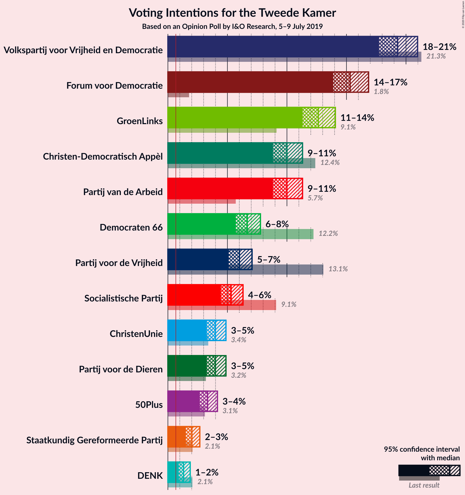

### Confidence Intervals

| Party | Last Result | Poll Result | 80% Confidence Interval | 90% Confidence Interval | 95% Confidence Interval | 99% Confidence Interval |
|:-----:|:-----------:|:-----------:|:-----------------------:|:-----------------------:|:-----------------------:|:-----------------------:|
| Volkspartij voor Vrijheid en Democratie | 21.3% | 19.3% | 18.3–20.4% |18.0–20.7% |17.7–21.0% |17.2–21.5% |
| Forum voor Democratie | 1.8% | 15.3% | 14.4–16.3% |14.1–16.6% |13.9–16.9% |13.4–17.3% |
| GroenLinks | 9.1% | 12.6% | 11.8–13.6% |11.5–13.8% |11.3–14.1% |10.9–14.5% |
| Christen-Democratisch Appèl | 12.4% | 10.0% | 9.2–10.9% |9.0–11.1% |8.8–11.3% |8.5–11.7% |
| Partij van de Arbeid | 5.7% | 10.0% | 9.2–10.9% |9.0–11.1% |8.8–11.3% |8.5–11.7% |
| Democraten 66 | 12.2% | 6.7% | 6.0–7.4% |5.9–7.6% |5.7–7.8% |5.4–8.1% |
| Partij voor de Vrijheid | 13.1% | 6.0% | 5.4–6.7% |5.2–6.9% |5.1–7.1% |4.8–7.4% |
| Socialistische Partij | 9.1% | 5.3% | 4.7–6.0% |4.6–6.1% |4.5–6.3% |4.2–6.6% |
| ChristenUnie | 3.4% | 4.0% | 3.5–4.6% |3.4–4.7% |3.3–4.9% |3.0–5.2% |
| Partij voor de Dieren | 3.2% | 4.0% | 3.5–4.6% |3.4–4.7% |3.3–4.9% |3.0–5.2% |
| 50Plus | 3.1% | 3.3% | 2.9–3.9% |2.8–4.0% |2.7–4.2% |2.5–4.4% |
| Staatkundig Gereformeerde Partij | 2.1% | 2.0% | 1.7–2.5% |1.6–2.6% |1.5–2.7% |1.4–2.9% |
| DENK | 2.1% | 1.3% | 1.1–1.7% |1.0–1.8% |0.9–1.9% |0.8–2.1% |

*Note:* The poll result column reflects the actual value used in the calculations. Published results may vary slightly, and in addition be rounded to fewer digits.

## Seats

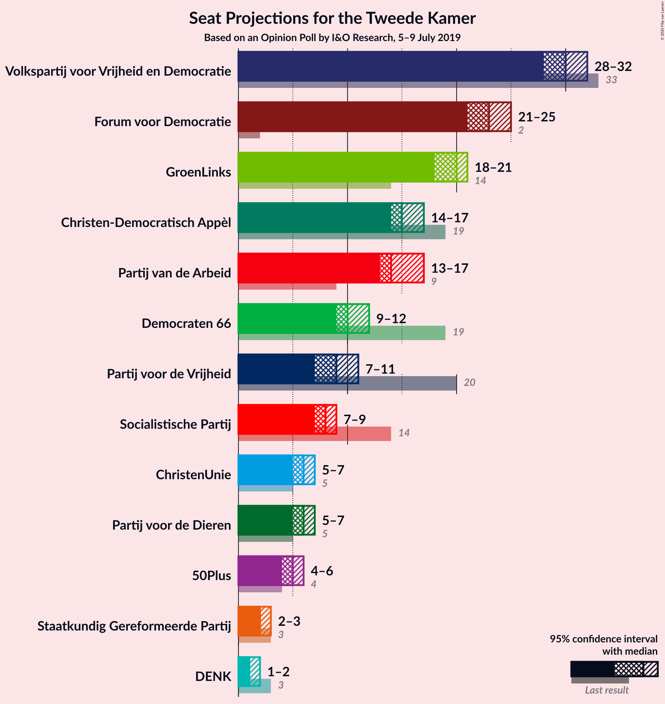

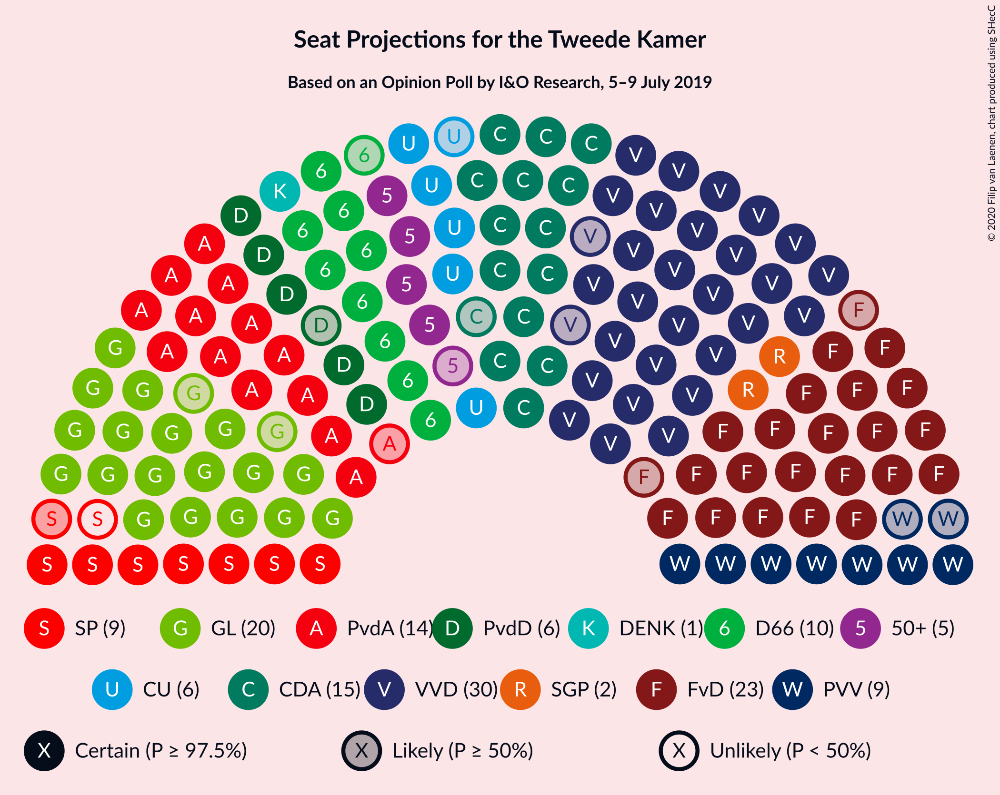

### Confidence Intervals

| Party | Last Result | Median | 80% Confidence Interval | 90% Confidence Interval | 95% Confidence Interval | 99% Confidence Interval |
|:-----:|:-----------:|:------:|:-----------------------:|:-----------------------:|:-----------------------:|:-----------------------:|
| <a href="#volkspartij-voor-vrijheid-en-democratie">Volkspartij voor Vrijheid en Democratie</a> | 33 | 31 | 30–31 |29–32 |28–32 |27–34 |
| <a href="#forum-voor-democratie">Forum voor Democratie</a> | 2 | 23 | 22–24 |21–25 |21–25 |20–25 |
| <a href="#groenlinks">GroenLinks</a> | 14 | 19 | 18–20 |18–20 |17–20 |17–22 |
| <a href="#christen-democratisch-appèl">Christen-Democratisch Appèl</a> | 19 | 16 | 15–17 |14–17 |14–17 |13–17 |
| <a href="#partij-van-de-arbeid">Partij van de Arbeid</a> | 9 | 15 | 13–16 |13–17 |12–17 |12–18 |
| <a href="#democraten-66">Democraten 66</a> | 19 | 12 | 10–12 |9–12 |9–12 |9–12 |
| <a href="#partij-voor-de-vrijheid">Partij voor de Vrijheid</a> | 20 | 7 | 7–9 |7–10 |7–10 |7–11 |
| <a href="#socialistische-partij">Socialistische Partij</a> | 14 | 7 | 7–8 |7–9 |7–9 |6–9 |
| <a href="#christenunie">ChristenUnie</a> | 5 | 6 | 5–6 |5–6 |5–7 |5–7 |
| <a href="#partij-voor-de-dieren">Partij voor de Dieren</a> | 5 | 5 | 5–7 |5–7 |5–7 |5–7 |
| <a href="#50plus">50Plus</a> | 4 | 5 | 5 |4–6 |4–6 |4–6 |
| <a href="#staatkundig-gereformeerde-partij">Staatkundig Gereformeerde Partij</a> | 3 | 2 | 2–3 |2–3 |2–3 |2–4 |
| <a href="#denk">DENK</a> | 3 | 2 | 1–2 |1–2 |1–2 |1–2 |

### Volkspartij voor Vrijheid en Democratie

*For a full overview of the results for this party, see the [Volkspartij voor Vrijheid en Democratie](party-volkspartijvoorvrijheidendemocratie.html) page.*

| Number of Seats | Probability | Accumulated | Special Marks |
|:---------------:|:-----------:|:-----------:|:-------------:|
| 26 | 0.4% | 100% |  |
| 27 | 0.5% | 99.6% |  |
| 28 | 2% | 99.1% |  |
| 29 | 6% | 97% |  |
| 30 | 10% | 91% |  |
| 31 | 73% | 81% | Median |
| 32 | 7% | 8% |  |
| 33 | 0.3% | 1.0% | Last Result |
| 34 | 0.7% | 0.7% |  |
| 35 | 0% | 0% |  |

### Forum voor Democratie

*For a full overview of the results for this party, see the [Forum voor Democratie](party-forumvoordemocratie.html) page.*

| Number of Seats | Probability | Accumulated | Special Marks |
|:---------------:|:-----------:|:-----------:|:-------------:|
| 2 | 0% | 100% | Last Result |
| 3 | 0% | 100% |  |
| 4 | 0% | 100% |  |
| 5 | 0% | 100% |  |
| 6 | 0% | 100% |  |
| 7 | 0% | 100% |  |
| 8 | 0% | 100% |  |
| 9 | 0% | 100% |  |
| 10 | 0% | 100% |  |
| 11 | 0% | 100% |  |
| 12 | 0% | 100% |  |
| 13 | 0% | 100% |  |
| 14 | 0% | 100% |  |
| 15 | 0% | 100% |  |
| 16 | 0% | 100% |  |
| 17 | 0% | 100% |  |
| 18 | 0% | 100% |  |
| 19 | 0% | 100% |  |
| 20 | 0.8% | 100% |  |
| 21 | 5% | 99.2% |  |
| 22 | 9% | 94% |  |
| 23 | 72% | 85% | Median |
| 24 | 8% | 13% |  |
| 25 | 5% | 5% |  |
| 26 | 0.3% | 0.3% |  |
| 27 | 0% | 0% |  |

### GroenLinks

*For a full overview of the results for this party, see the [GroenLinks](party-groenlinks.html) page.*

| Number of Seats | Probability | Accumulated | Special Marks |
|:---------------:|:-----------:|:-----------:|:-------------:|
| 14 | 0% | 100% | Last Result |
| 15 | 0% | 100% |  |
| 16 | 0.5% | 100% |  |
| 17 | 3% | 99.5% |  |
| 18 | 15% | 97% |  |
| 19 | 63% | 82% | Median |
| 20 | 16% | 18% |  |
| 21 | 0.8% | 2% |  |
| 22 | 2% | 2% |  |
| 23 | 0.1% | 0.1% |  |
| 24 | 0% | 0% |  |

### Christen-Democratisch Appèl

*For a full overview of the results for this party, see the [Christen-Democratisch Appèl](party-christen-democratischappèl.html) page.*

| Number of Seats | Probability | Accumulated | Special Marks |
|:---------------:|:-----------:|:-----------:|:-------------:|
| 13 | 2% | 100% |  |
| 14 | 8% | 98% |  |
| 15 | 13% | 90% |  |
| 16 | 66% | 77% | Median |
| 17 | 11% | 11% |  |
| 18 | 0.4% | 0.4% |  |
| 19 | 0.1% | 0.1% | Last Result |
| 20 | 0% | 0% |  |

### Partij van de Arbeid

*For a full overview of the results for this party, see the [Partij van de Arbeid](party-partijvandearbeid.html) page.*

| Number of Seats | Probability | Accumulated | Special Marks |
|:---------------:|:-----------:|:-----------:|:-------------:|
| 9 | 0% | 100% | Last Result |
| 10 | 0% | 100% |  |
| 11 | 0% | 100% |  |
| 12 | 3% | 100% |  |
| 13 | 11% | 97% |  |
| 14 | 3% | 86% |  |
| 15 | 70% | 83% | Median |
| 16 | 7% | 13% |  |
| 17 | 4% | 6% |  |
| 18 | 2% | 2% |  |
| 19 | 0% | 0% |  |

### Democraten 66

*For a full overview of the results for this party, see the [Democraten 66](party-democraten66.html) page.*

| Number of Seats | Probability | Accumulated | Special Marks |
|:---------------:|:-----------:|:-----------:|:-------------:|
| 8 | 0.1% | 100% |  |
| 9 | 9% | 99.9% |  |
| 10 | 11% | 91% |  |
| 11 | 17% | 80% |  |
| 12 | 63% | 63% | Median |
| 13 | 0% | 0% |  |
| 14 | 0% | 0% |  |
| 15 | 0% | 0% |  |
| 16 | 0% | 0% |  |
| 17 | 0% | 0% |  |
| 18 | 0% | 0% |  |
| 19 | 0% | 0% | Last Result |

### Partij voor de Vrijheid

*For a full overview of the results for this party, see the [Partij voor de Vrijheid](party-partijvoordevrijheid.html) page.*

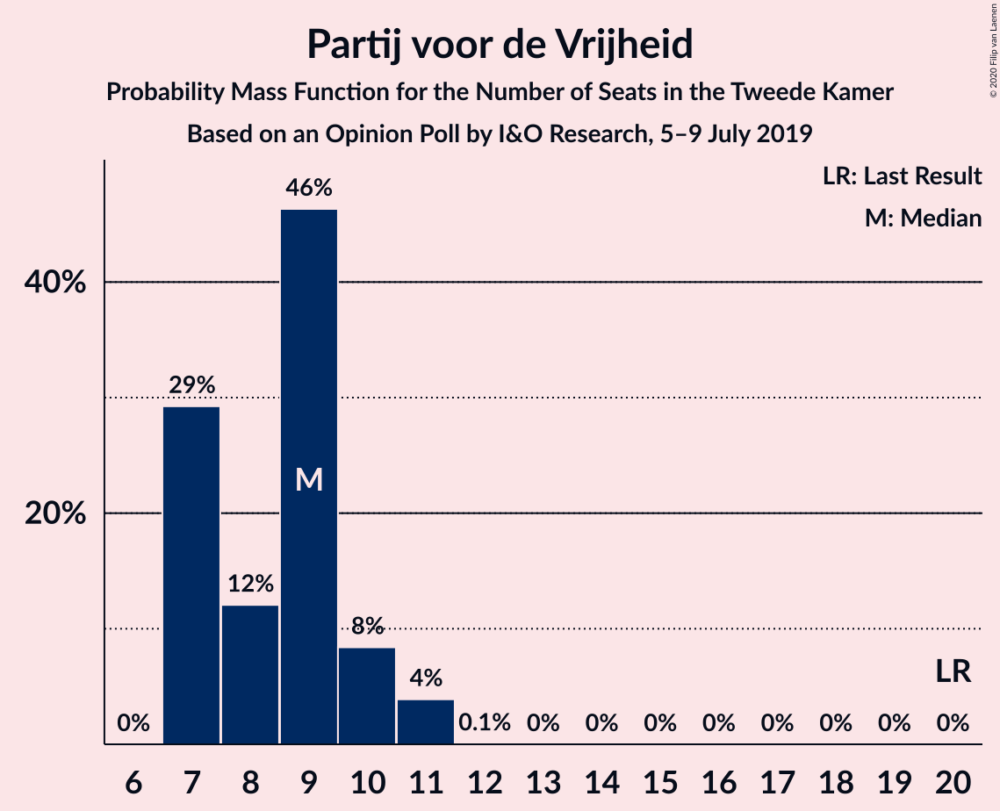

| Number of Seats | Probability | Accumulated | Special Marks |
|:---------------:|:-----------:|:-----------:|:-------------:|
| 7 | 63% | 100% | Median |
| 8 | 8% | 37% |  |
| 9 | 21% | 29% |  |
| 10 | 7% | 8% |  |
| 11 | 1.1% | 1.1% |  |
| 12 | 0% | 0% |  |
| 13 | 0% | 0% |  |
| 14 | 0% | 0% |  |
| 15 | 0% | 0% |  |
| 16 | 0% | 0% |  |
| 17 | 0% | 0% |  |
| 18 | 0% | 0% |  |
| 19 | 0% | 0% |  |
| 20 | 0% | 0% | Last Result |

### Socialistische Partij

*For a full overview of the results for this party, see the [Socialistische Partij](party-socialistischepartij.html) page.*

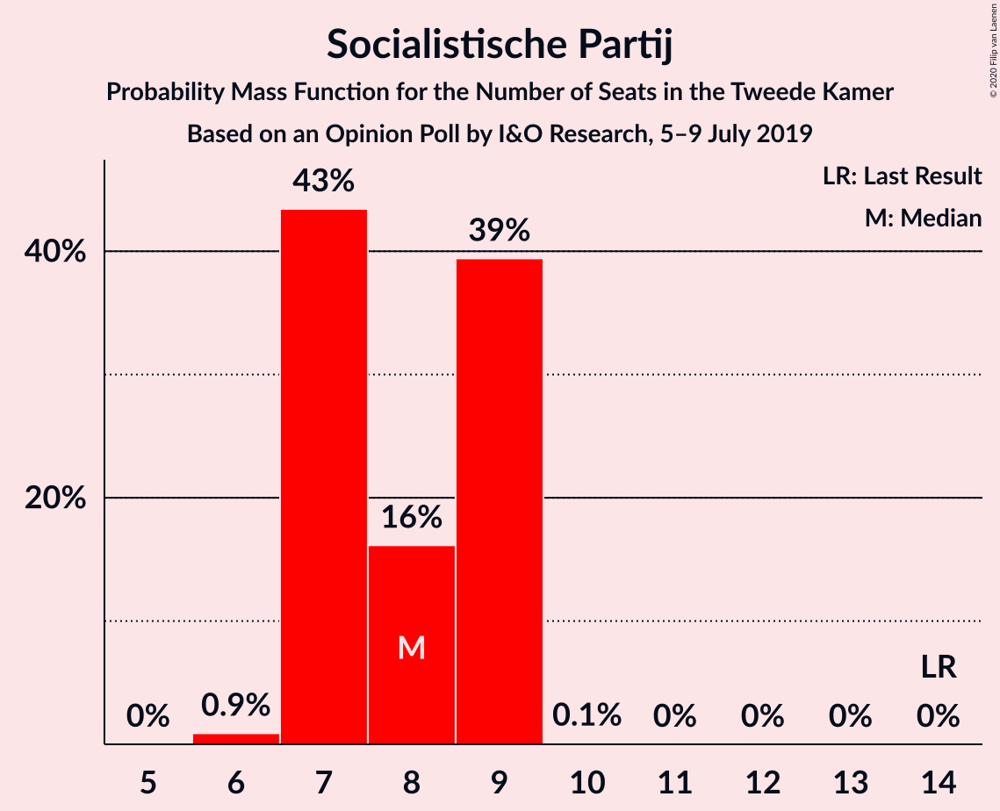

| Number of Seats | Probability | Accumulated | Special Marks |
|:---------------:|:-----------:|:-----------:|:-------------:|
| 6 | 0.7% | 100% |  |
| 7 | 76% | 99.3% | Median |
| 8 | 17% | 24% |  |
| 9 | 6% | 6% |  |
| 10 | 0.1% | 0.1% |  |
| 11 | 0% | 0% |  |
| 12 | 0% | 0% |  |
| 13 | 0% | 0% |  |
| 14 | 0% | 0% | Last Result |

### ChristenUnie

*For a full overview of the results for this party, see the [ChristenUnie](party-christenunie.html) page.*

| Number of Seats | Probability | Accumulated | Special Marks |
|:---------------:|:-----------:|:-----------:|:-------------:|
| 4 | 0.3% | 100% |  |
| 5 | 15% | 99.7% | Last Result |
| 6 | 82% | 85% | Median |
| 7 | 3% | 3% |  |
| 8 | 0% | 0% |  |

### Partij voor de Dieren

*For a full overview of the results for this party, see the [Partij voor de Dieren](party-partijvoordedieren.html) page.*

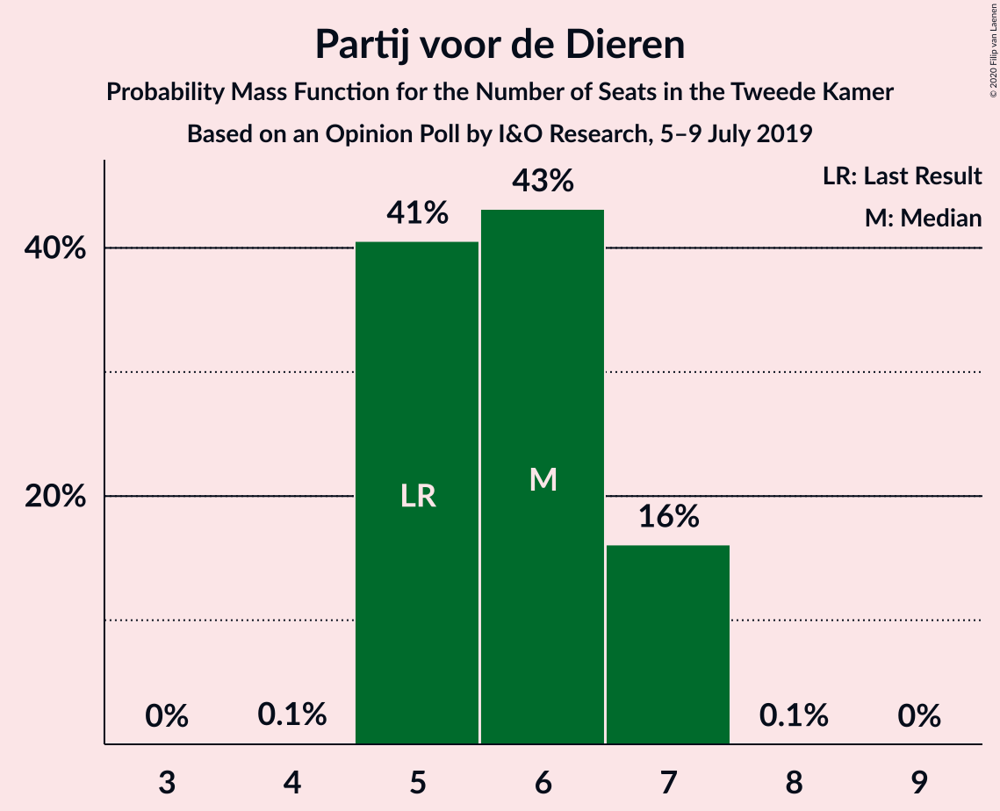

| Number of Seats | Probability | Accumulated | Special Marks |
|:---------------:|:-----------:|:-----------:|:-------------:|
| 4 | 0.2% | 100% |  |
| 5 | 75% | 99.8% | Last Result, Median |
| 6 | 14% | 24% |  |
| 7 | 10% | 11% |  |
| 8 | 0% | 0% |  |

### 50Plus

*For a full overview of the results for this party, see the [50Plus](party-50plus.html) page.*

| Number of Seats | Probability | Accumulated | Special Marks |
|:---------------:|:-----------:|:-----------:|:-------------:|
| 3 | 0.1% | 100% |  |
| 4 | 8% | 99.9% | Last Result |
| 5 | 85% | 92% | Median |
| 6 | 7% | 7% |  |
| 7 | 0% | 0% |  |

### Staatkundig Gereformeerde Partij

*For a full overview of the results for this party, see the [Staatkundig Gereformeerde Partij](party-staatkundiggereformeerdepartij.html) page.*

| Number of Seats | Probability | Accumulated | Special Marks |
|:---------------:|:-----------:|:-----------:|:-------------:|
| 2 | 78% | 100% | Median |
| 3 | 21% | 22% | Last Result |
| 4 | 0.6% | 0.6% |  |
| 5 | 0% | 0% |  |

### DENK

*For a full overview of the results for this party, see the [DENK](party-denk.html) page.*

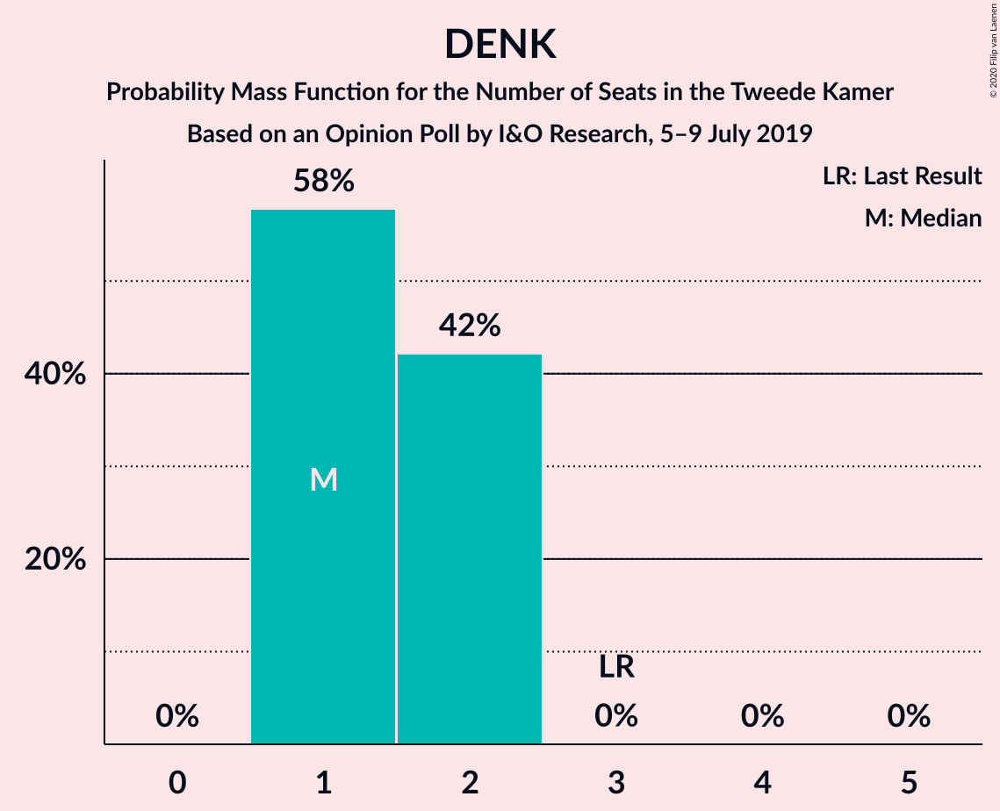

| Number of Seats | Probability | Accumulated | Special Marks |
|:---------------:|:-----------:|:-----------:|:-------------:|
| 1 | 19% | 100% |  |
| 2 | 81% | 81% | Median |
| 3 | 0.1% | 0.1% | Last Result |
| 4 | 0% | 0% |  |

## Coalitions

### Confidence Intervals

| Coalition | Last Result | Median | Majority? | 80% Confidence Interval | 90% Confidence Interval | 95% Confidence Interval | 99% Confidence Interval |
|:---------:|:-----------:|:------:|:---------:|:-----------------------:|:-----------------------:|:-----------------------:|:-----------------------:|
| Volkspartij voor Vrijheid en Democratie – GroenLinks – Christen-Democratisch Appèl – Democraten 66 – ChristenUnie | 90 | 84 | 100% | 79–84 | 79–84 | 79–84 | 78–85 |
| Volkspartij voor Vrijheid en Democratie – Forum voor Democratie – Christen-Democratisch Appèl – Partij voor de Vrijheid – Staatkundig Gereformeerde Partij | 77 | 79 | 98.6% | 79–82 | 78–83 | 77–83 | 75–83 |
| Volkspartij voor Vrijheid en Democratie – Forum voor Democratie – Christen-Democratisch Appèl – Partij voor de Vrijheid | 74 | 77 | 92% | 77–79 | 75–80 | 75–80 | 73–80 |
| Volkspartij voor Vrijheid en Democratie – Christen-Democratisch Appèl – Partij van de Arbeid – Democraten 66 – ChristenUnie | 85 | 80 | 85% | 75–80 | 74–80 | 73–80 | 73–80 |
| Volkspartij voor Vrijheid en Democratie – Forum voor Democratie – Christen-Democratisch Appèl – 50Plus – Staatkundig Gereformeerde Partij | 61 | 77 | 90% | 75–78 | 74–78 | 73–78 | 73–78 |
| Volkspartij voor Vrijheid en Democratie – Forum voor Democratie – Christen-Democratisch Appèl – 50Plus | 58 | 75 | 0.5% | 73–75 | 71–75 | 71–75 | 71–75 |
| GroenLinks – Christen-Democratisch Appèl – Partij van de Arbeid – Democraten 66 – Socialistische Partij – ChristenUnie | 80 | 75 | 2% | 71–75 | 71–75 | 71–75 | 70–77 |
| Volkspartij voor Vrijheid en Democratie – Forum voor Democratie – Christen-Democratisch Appèl – Staatkundig Gereformeerde Partij | 57 | 72 | 0% | 71–72 | 69–74 | 68–74 | 67–74 |
| Volkspartij voor Vrijheid en Democratie – Forum voor Democratie – Christen-Democratisch Appèl | 54 | 70 | 0% | 68–70 | 66–71 | 66–71 | 65–71 |
| GroenLinks – Christen-Democratisch Appèl – Partij van de Arbeid – Democraten 66 – ChristenUnie | 66 | 68 | 0% | 64–68 | 64–68 | 63–68 | 63–69 |
| Volkspartij voor Vrijheid en Democratie – Christen-Democratisch Appèl – Democraten 66 – ChristenUnie | 76 | 65 | 0% | 60–65 | 60–65 | 60–65 | 57–65 |
| Volkspartij voor Vrijheid en Democratie – Christen-Democratisch Appèl – Partij van de Arbeid | 61 | 62 | 0% | 59–62 | 58–62 | 57–62 | 56–64 |
| Volkspartij voor Vrijheid en Democratie – Christen-Democratisch Appèl – Democraten 66 | 71 | 59 | 0% | 54–59 | 54–59 | 53–59 | 52–60 |
| Volkspartij voor Vrijheid en Democratie – Partij van de Arbeid – Democraten 66 | 61 | 58 | 0% | 55–58 | 53–58 | 53–58 | 52–58 |
| Volkspartij voor Vrijheid en Democratie – Christen-Democratisch Appèl – Partij voor de Vrijheid | 72 | 54 | 0% | 54–56 | 53–58 | 52–58 | 51–59 |
| Volkspartij voor Vrijheid en Democratie – Christen-Democratisch Appèl | 52 | 47 | 0% | 45–47 | 44–49 | 43–49 | 42–50 |
| Volkspartij voor Vrijheid en Democratie – Partij van de Arbeid | 42 | 46 | 0% | 44–46 | 42–47 | 42–47 | 41–48 |
| Christen-Democratisch Appèl – Partij van de Arbeid – Democraten 66 | 47 | 43 | 0% | 38–43 | 38–43 | 38–44 | 38–44 |
| Christen-Democratisch Appèl – Partij van de Arbeid – ChristenUnie | 33 | 37 | 0% | 35–37 | 34–38 | 32–38 | 32–40 |
| Christen-Democratisch Appèl – Partij van de Arbeid | 28 | 31 | 0% | 29–32 | 28–33 | 27–33 | 27–33 |
| Christen-Democratisch Appèl – Democraten 66 | 38 | 28 | 0% | 24–28 | 23–28 | 23–28 | 23–28 |

### Volkspartij voor Vrijheid en Democratie – GroenLinks – Christen-Democratisch Appèl – Democraten 66 – ChristenUnie

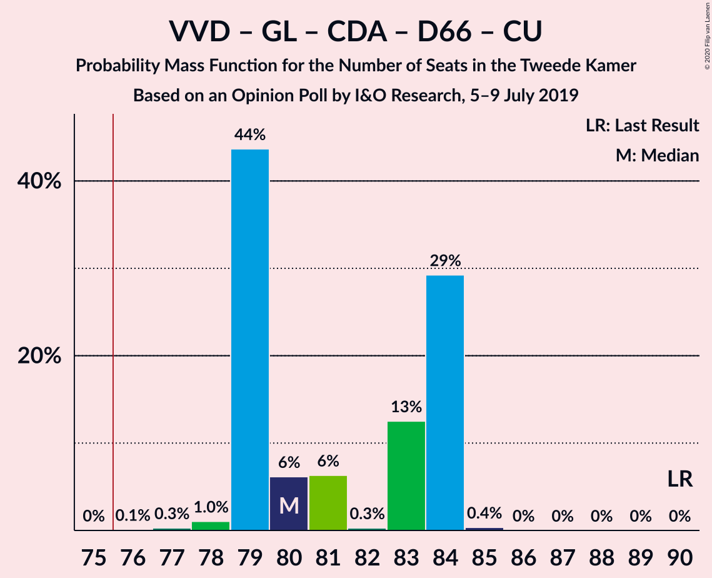

| Number of Seats | Probability | Accumulated | Special Marks |
|:---------------:|:-----------:|:-----------:|:-------------:|
| 76 | 0.2% | 100% | Majority |
| 77 | 0.3% | 99.8% |  |
| 78 | 2% | 99.5% |  |
| 79 | 8% | 98% |  |
| 80 | 12% | 89% |  |
| 81 | 4% | 78% |  |
| 82 | 0.6% | 74% |  |
| 83 | 10% | 73% |  |
| 84 | 63% | 63% | Median |
| 85 | 0.7% | 0.7% |  |
| 86 | 0% | 0% |  |
| 87 | 0% | 0% |  |
| 88 | 0% | 0% |  |
| 89 | 0% | 0% |  |
| 90 | 0% | 0% | Last Result |

### Volkspartij voor Vrijheid en Democratie – Forum voor Democratie – Christen-Democratisch Appèl – Partij voor de Vrijheid – Staatkundig Gereformeerde Partij

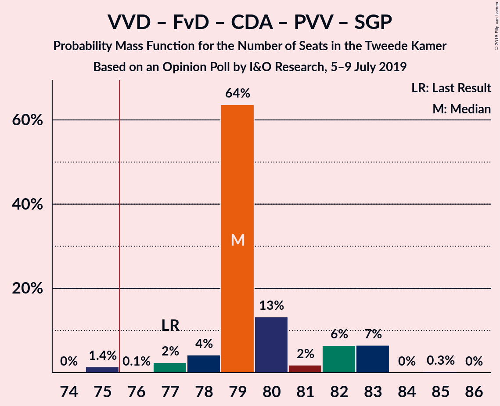

| Number of Seats | Probability | Accumulated | Special Marks |
|:---------------:|:-----------:|:-----------:|:-------------:|
| 75 | 1.4% | 100% |  |
| 76 | 0.1% | 98.6% | Majority |
| 77 | 2% | 98.5% | Last Result |
| 78 | 4% | 96% |  |
| 79 | 64% | 92% | Median |
| 80 | 13% | 28% |  |
| 81 | 2% | 15% |  |
| 82 | 6% | 13% |  |
| 83 | 7% | 7% |  |
| 84 | 0% | 0.3% |  |
| 85 | 0.3% | 0.3% |  |
| 86 | 0% | 0% |  |

### Volkspartij voor Vrijheid en Democratie – Forum voor Democratie – Christen-Democratisch Appèl – Partij voor de Vrijheid

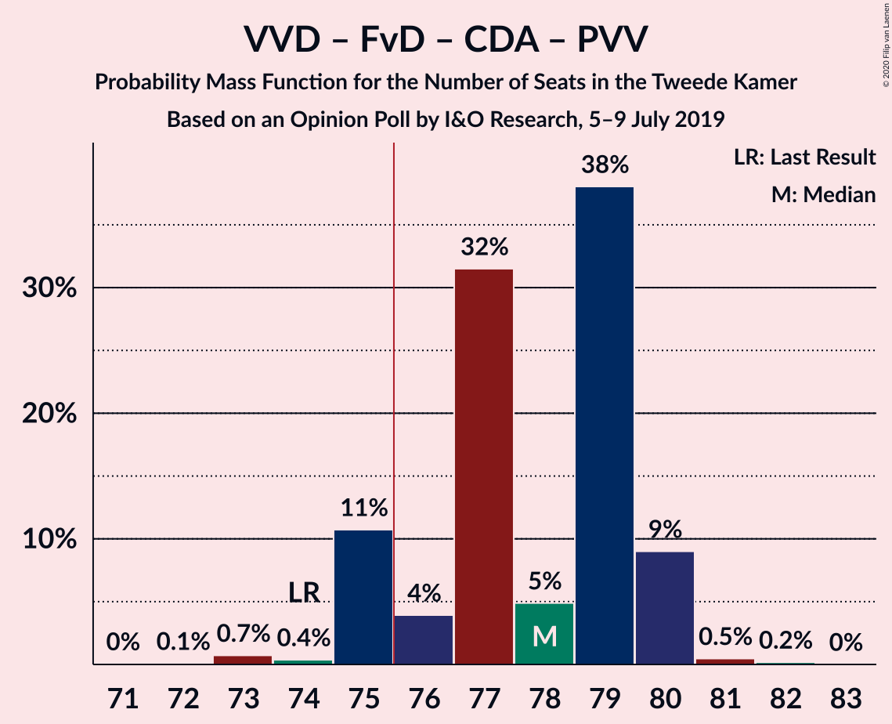

| Number of Seats | Probability | Accumulated | Special Marks |
|:---------------:|:-----------:|:-----------:|:-------------:|
| 73 | 1.5% | 100% |  |
| 74 | 0.3% | 98.5% | Last Result |
| 75 | 6% | 98% |  |
| 76 | 1.3% | 92% | Majority |
| 77 | 67% | 91% | Median |
| 78 | 10% | 23% |  |
| 79 | 4% | 14% |  |
| 80 | 10% | 10% |  |
| 81 | 0.1% | 0.4% |  |
| 82 | 0.3% | 0.3% |  |
| 83 | 0% | 0% |  |

### Volkspartij voor Vrijheid en Democratie – Christen-Democratisch Appèl – Partij van de Arbeid – Democraten 66 – ChristenUnie

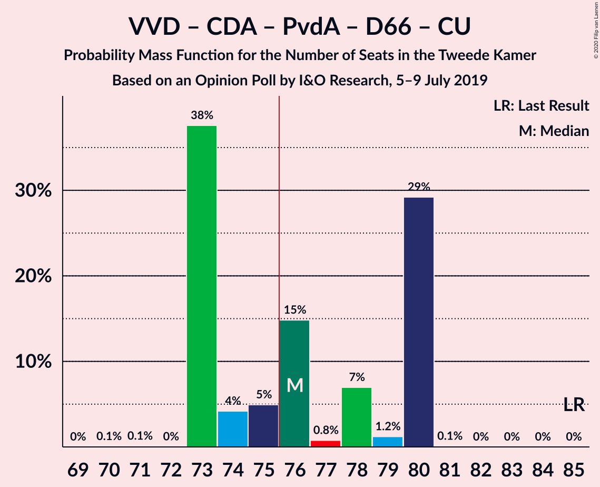

| Number of Seats | Probability | Accumulated | Special Marks |
|:---------------:|:-----------:|:-----------:|:-------------:|
| 71 | 0.2% | 100% |  |
| 72 | 0% | 99.8% |  |
| 73 | 3% | 99.7% |  |
| 74 | 2% | 96% |  |
| 75 | 10% | 95% |  |
| 76 | 5% | 85% | Majority |
| 77 | 0.6% | 80% |  |
| 78 | 15% | 79% |  |
| 79 | 2% | 64% |  |
| 80 | 62% | 63% | Median |
| 81 | 0.1% | 0.1% |  |
| 82 | 0% | 0% |  |
| 83 | 0% | 0% |  |
| 84 | 0% | 0% |  |
| 85 | 0% | 0% | Last Result |

### Volkspartij voor Vrijheid en Democratie – Forum voor Democratie – Christen-Democratisch Appèl – 50Plus – Staatkundig Gereformeerde Partij

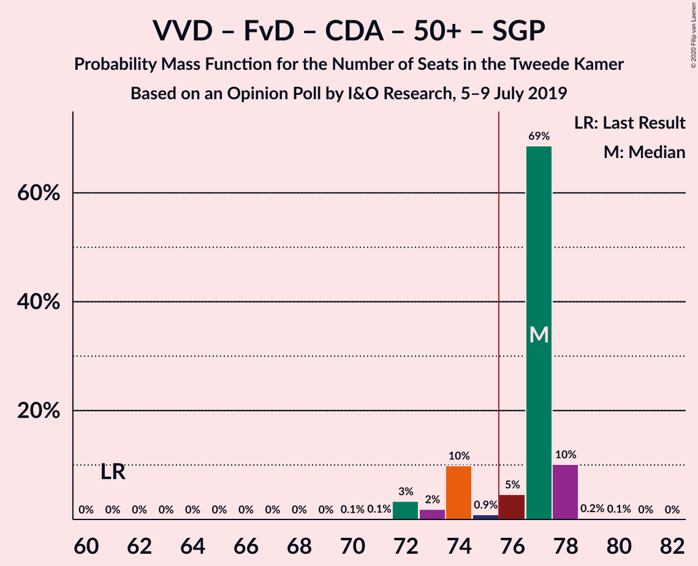

| Number of Seats | Probability | Accumulated | Special Marks |
|:---------------:|:-----------:|:-----------:|:-------------:|
| 61 | 0% | 100% | Last Result |
| 62 | 0% | 100% |  |
| 63 | 0% | 100% |  |
| 64 | 0% | 100% |  |
| 65 | 0% | 100% |  |
| 66 | 0% | 100% |  |
| 67 | 0% | 100% |  |
| 68 | 0% | 100% |  |
| 69 | 0% | 100% |  |
| 70 | 0% | 100% |  |
| 71 | 0% | 100% |  |
| 72 | 0.1% | 100% |  |
| 73 | 4% | 99.9% |  |
| 74 | 4% | 96% |  |
| 75 | 2% | 92% |  |
| 76 | 9% | 90% | Majority |
| 77 | 70% | 81% | Median |
| 78 | 11% | 11% |  |
| 79 | 0.2% | 0.5% |  |
| 80 | 0.3% | 0.3% |  |
| 81 | 0% | 0% |  |

### Volkspartij voor Vrijheid en Democratie – Forum voor Democratie – Christen-Democratisch Appèl – 50Plus

| Number of Seats | Probability | Accumulated | Special Marks |
|:---------------:|:-----------:|:-----------:|:-------------:|
| 58 | 0% | 100% | Last Result |
| 59 | 0% | 100% |  |
| 60 | 0% | 100% |  |
| 61 | 0% | 100% |  |
| 62 | 0% | 100% |  |
| 63 | 0% | 100% |  |
| 64 | 0% | 100% |  |
| 65 | 0% | 100% |  |
| 66 | 0% | 100% |  |
| 67 | 0% | 100% |  |
| 68 | 0% | 100% |  |
| 69 | 0.1% | 100% |  |
| 70 | 0.2% | 99.9% |  |
| 71 | 8% | 99.7% |  |
| 72 | 1.0% | 91% |  |
| 73 | 2% | 90% |  |
| 74 | 10% | 88% |  |
| 75 | 78% | 78% | Median |
| 76 | 0.1% | 0.5% | Majority |
| 77 | 0.3% | 0.4% |  |
| 78 | 0% | 0% |  |

### GroenLinks – Christen-Democratisch Appèl – Partij van de Arbeid – Democraten 66 – Socialistische Partij – ChristenUnie

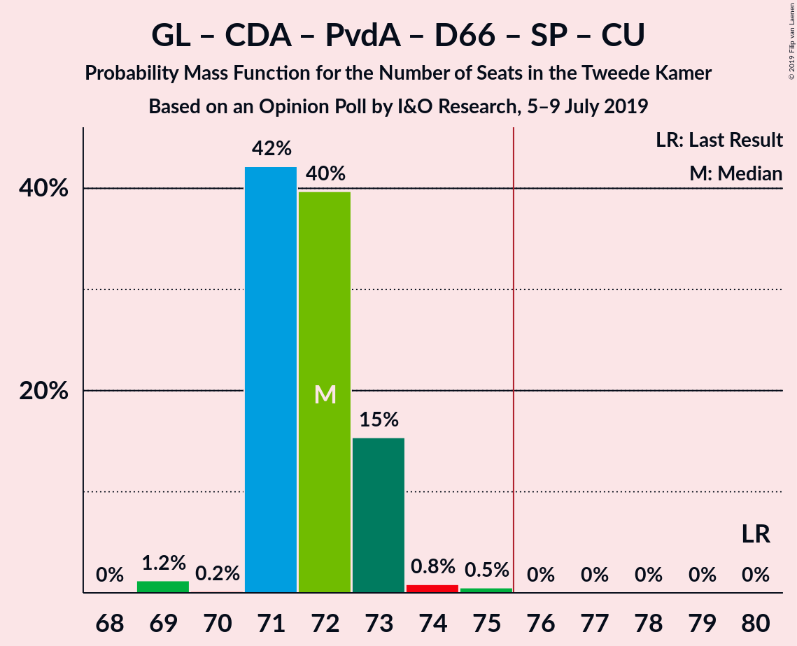

| Number of Seats | Probability | Accumulated | Special Marks |
|:---------------:|:-----------:|:-----------:|:-------------:|
| 68 | 0.3% | 100% |  |
| 69 | 0.2% | 99.7% |  |
| 70 | 0.1% | 99.5% |  |
| 71 | 11% | 99.5% |  |
| 72 | 7% | 89% |  |
| 73 | 9% | 82% |  |
| 74 | 3% | 72% |  |
| 75 | 67% | 70% | Median |
| 76 | 2% | 2% | Majority |
| 77 | 0.4% | 0.5% |  |
| 78 | 0.1% | 0.1% |  |
| 79 | 0% | 0% |  |
| 80 | 0% | 0% | Last Result |

### Volkspartij voor Vrijheid en Democratie – Forum voor Democratie – Christen-Democratisch Appèl – Staatkundig Gereformeerde Partij

| Number of Seats | Probability | Accumulated | Special Marks |
|:---------------:|:-----------:|:-----------:|:-------------:|
| 57 | 0% | 100% | Last Result |
| 58 | 0% | 100% |  |
| 59 | 0% | 100% |  |
| 60 | 0% | 100% |  |
| 61 | 0% | 100% |  |
| 62 | 0% | 100% |  |
| 63 | 0% | 100% |  |
| 64 | 0% | 100% |  |
| 65 | 0% | 100% |  |
| 66 | 0% | 100% |  |
| 67 | 1.4% | 100% |  |
| 68 | 2% | 98.6% |  |
| 69 | 5% | 96% |  |
| 70 | 1.2% | 92% |  |
| 71 | 9% | 90% |  |
| 72 | 74% | 81% | Median |
| 73 | 0.8% | 8% |  |
| 74 | 6% | 7% |  |
| 75 | 0.3% | 0.3% |  |
| 76 | 0% | 0% | Majority |

### Volkspartij voor Vrijheid en Democratie – Forum voor Democratie – Christen-Democratisch Appèl

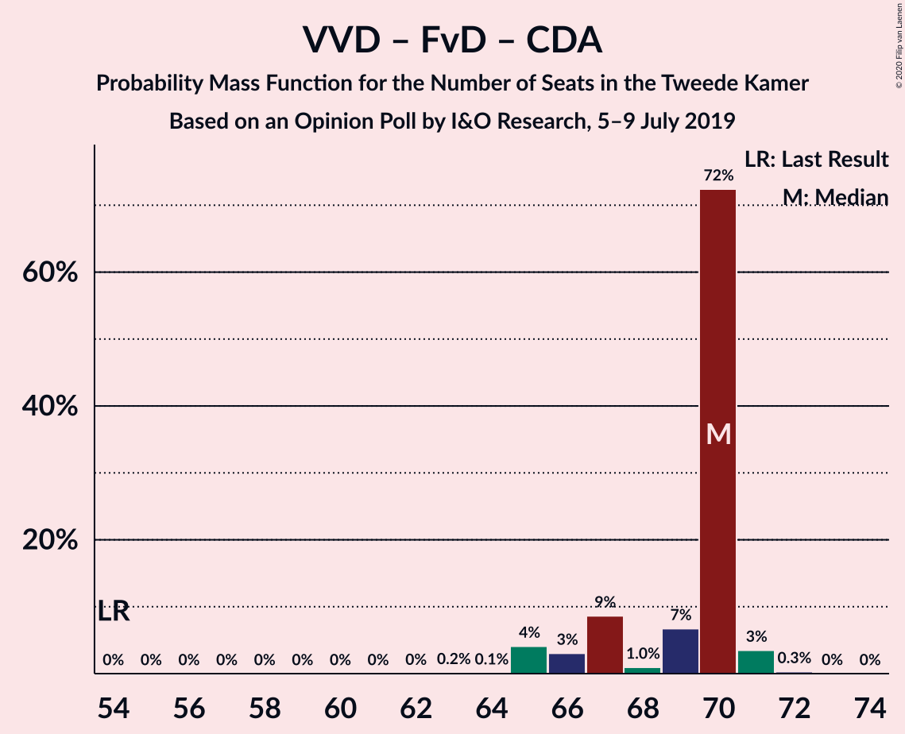

| Number of Seats | Probability | Accumulated | Special Marks |
|:---------------:|:-----------:|:-----------:|:-------------:|
| 54 | 0% | 100% | Last Result |
| 55 | 0% | 100% |  |
| 56 | 0% | 100% |  |
| 57 | 0% | 100% |  |
| 58 | 0% | 100% |  |
| 59 | 0% | 100% |  |
| 60 | 0% | 100% |  |
| 61 | 0% | 100% |  |
| 62 | 0% | 100% |  |
| 63 | 0% | 100% |  |
| 64 | 0% | 100% |  |
| 65 | 2% | 100% |  |
| 66 | 6% | 98% |  |
| 67 | 2% | 92% |  |
| 68 | 2% | 90% |  |
| 69 | 14% | 88% |  |
| 70 | 68% | 75% | Median |
| 71 | 6% | 7% |  |
| 72 | 0.3% | 0.4% |  |
| 73 | 0% | 0% |  |

### GroenLinks – Christen-Democratisch Appèl – Partij van de Arbeid – Democraten 66 – ChristenUnie

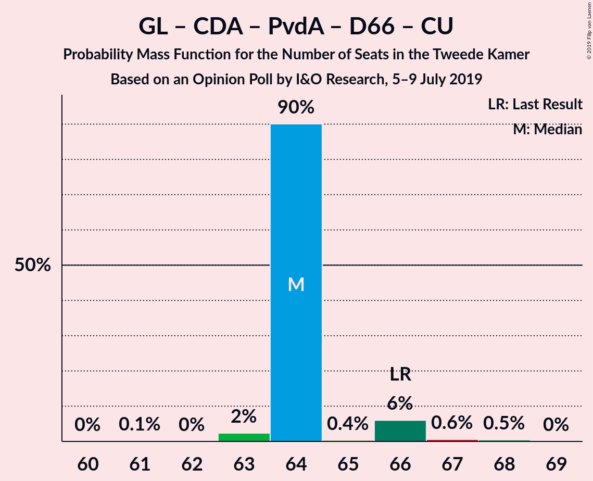

| Number of Seats | Probability | Accumulated | Special Marks |
|:---------------:|:-----------:|:-----------:|:-------------:|
| 62 | 0.3% | 100% |  |
| 63 | 5% | 99.7% |  |
| 64 | 15% | 95% |  |
| 65 | 4% | 80% |  |
| 66 | 11% | 76% | Last Result |
| 67 | 0.3% | 65% |  |
| 68 | 63% | 65% | Median |
| 69 | 2% | 2% |  |
| 70 | 0.1% | 0.2% |  |
| 71 | 0% | 0.1% |  |
| 72 | 0.1% | 0.1% |  |
| 73 | 0% | 0% |  |

### Volkspartij voor Vrijheid en Democratie – Christen-Democratisch Appèl – Democraten 66 – ChristenUnie

| Number of Seats | Probability | Accumulated | Special Marks |
|:---------------:|:-----------:|:-----------:|:-------------:|
| 57 | 2% | 100% |  |
| 58 | 0.5% | 98% |  |
| 59 | 0.3% | 98% |  |
| 60 | 10% | 98% |  |
| 61 | 8% | 88% |  |
| 62 | 6% | 80% |  |
| 63 | 3% | 74% |  |
| 64 | 0.3% | 70% |  |
| 65 | 70% | 70% | Median |
| 66 | 0.1% | 0.1% |  |
| 67 | 0% | 0% |  |
| 68 | 0% | 0% |  |
| 69 | 0% | 0% |  |
| 70 | 0% | 0% |  |
| 71 | 0% | 0% |  |
| 72 | 0% | 0% |  |
| 73 | 0% | 0% |  |
| 74 | 0% | 0% |  |
| 75 | 0% | 0% |  |
| 76 | 0% | 0% | Last Result, Majority |

### Volkspartij voor Vrijheid en Democratie – Christen-Democratisch Appèl – Partij van de Arbeid

| Number of Seats | Probability | Accumulated | Special Marks |
|:---------------:|:-----------:|:-----------:|:-------------:|
| 55 | 0% | 100% |  |
| 56 | 0.6% | 99.9% |  |
| 57 | 3% | 99.3% |  |
| 58 | 3% | 96% |  |
| 59 | 5% | 93% |  |
| 60 | 7% | 88% |  |
| 61 | 3% | 81% | Last Result |
| 62 | 76% | 78% | Median |
| 63 | 1.1% | 2% |  |
| 64 | 0.9% | 0.9% |  |
| 65 | 0% | 0% |  |

### Volkspartij voor Vrijheid en Democratie – Christen-Democratisch Appèl – Democraten 66

| Number of Seats | Probability | Accumulated | Special Marks |
|:---------------:|:-----------:|:-----------:|:-------------:|
| 51 | 0.1% | 100% |  |
| 52 | 2% | 99.8% |  |
| 53 | 2% | 98% |  |
| 54 | 7% | 96% |  |
| 55 | 1.2% | 89% |  |
| 56 | 10% | 87% |  |
| 57 | 7% | 77% |  |
| 58 | 0.5% | 70% |  |
| 59 | 69% | 70% | Median |
| 60 | 0.7% | 0.7% |  |
| 61 | 0% | 0% |  |
| 62 | 0% | 0% |  |
| 63 | 0% | 0% |  |
| 64 | 0% | 0% |  |
| 65 | 0% | 0% |  |
| 66 | 0% | 0% |  |
| 67 | 0% | 0% |  |
| 68 | 0% | 0% |  |
| 69 | 0% | 0% |  |
| 70 | 0% | 0% |  |
| 71 | 0% | 0% | Last Result |

### Volkspartij voor Vrijheid en Democratie – Partij van de Arbeid – Democraten 66

| Number of Seats | Probability | Accumulated | Special Marks |
|:---------------:|:-----------:|:-----------:|:-------------:|
| 50 | 0.2% | 100% |  |
| 51 | 0.2% | 99.8% |  |
| 52 | 0.2% | 99.6% |  |
| 53 | 5% | 99.4% |  |
| 54 | 2% | 95% |  |
| 55 | 19% | 93% |  |
| 56 | 6% | 74% |  |
| 57 | 0.2% | 68% |  |
| 58 | 67% | 68% | Median |
| 59 | 0.4% | 0.4% |  |
| 60 | 0% | 0% |  |
| 61 | 0% | 0% | Last Result |

### Volkspartij voor Vrijheid en Democratie – Christen-Democratisch Appèl – Partij voor de Vrijheid

| Number of Seats | Probability | Accumulated | Special Marks |
|:---------------:|:-----------:|:-----------:|:-------------:|
| 50 | 0.3% | 100% |  |
| 51 | 2% | 99.7% |  |
| 52 | 2% | 98% |  |
| 53 | 2% | 95% |  |
| 54 | 77% | 93% | Median |
| 55 | 5% | 17% |  |
| 56 | 3% | 11% |  |
| 57 | 0.4% | 8% |  |
| 58 | 6% | 7% |  |
| 59 | 0.7% | 0.7% |  |
| 60 | 0% | 0% |  |
| 61 | 0% | 0% |  |
| 62 | 0% | 0% |  |
| 63 | 0% | 0% |  |
| 64 | 0% | 0% |  |
| 65 | 0% | 0% |  |
| 66 | 0% | 0% |  |
| 67 | 0% | 0% |  |
| 68 | 0% | 0% |  |
| 69 | 0% | 0% |  |
| 70 | 0% | 0% |  |
| 71 | 0% | 0% |  |
| 72 | 0% | 0% | Last Result |

### Volkspartij voor Vrijheid en Democratie – Christen-Democratisch Appèl

| Number of Seats | Probability | Accumulated | Special Marks |
|:---------------:|:-----------:|:-----------:|:-------------:|
| 40 | 0.1% | 100% |  |
| 41 | 0.2% | 99.9% |  |
| 42 | 0.7% | 99.8% |  |
| 43 | 4% | 99.0% |  |
| 44 | 1.3% | 95% |  |
| 45 | 16% | 94% |  |
| 46 | 6% | 78% |  |
| 47 | 64% | 72% | Median |
| 48 | 0% | 7% |  |
| 49 | 7% | 7% |  |
| 50 | 0.7% | 0.7% |  |
| 51 | 0% | 0% |  |
| 52 | 0% | 0% | Last Result |

### Volkspartij voor Vrijheid en Democratie – Partij van de Arbeid

| Number of Seats | Probability | Accumulated | Special Marks |
|:---------------:|:-----------:|:-----------:|:-------------:|
| 40 | 0.3% | 100% |  |
| 41 | 0.2% | 99.6% |  |
| 42 | 5% | 99.5% | Last Result |
| 43 | 1.1% | 95% |  |
| 44 | 4% | 93% |  |
| 45 | 10% | 89% |  |
| 46 | 74% | 79% | Median |
| 47 | 4% | 5% |  |
| 48 | 0.9% | 1.2% |  |
| 49 | 0.3% | 0.3% |  |
| 50 | 0% | 0% |  |

### Christen-Democratisch Appèl – Partij van de Arbeid – Democraten 66

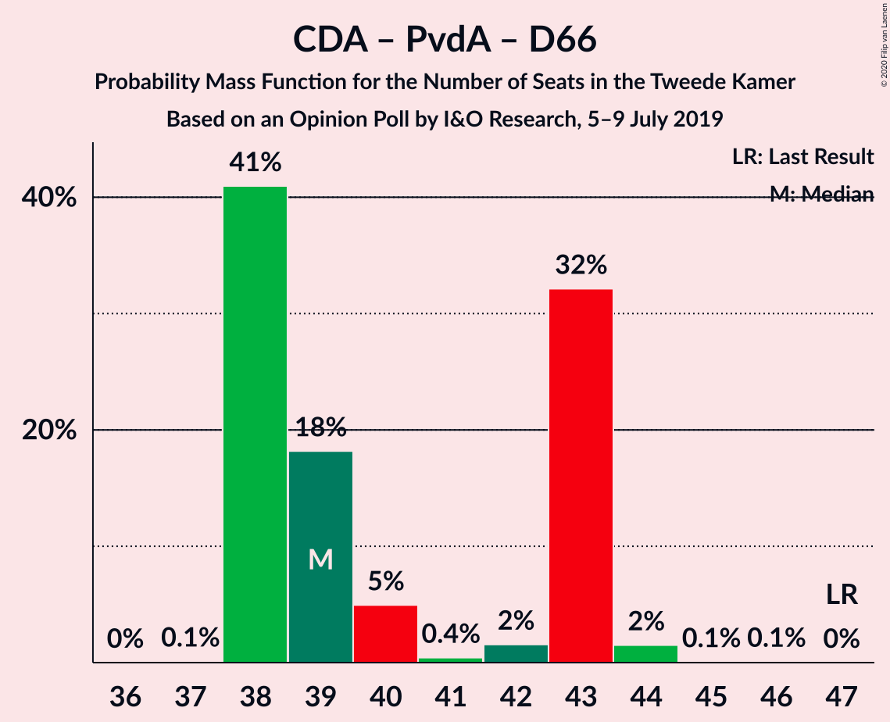

| Number of Seats | Probability | Accumulated | Special Marks |
|:---------------:|:-----------:|:-----------:|:-------------:|
| 37 | 0.1% | 100% |  |
| 38 | 10% | 99.9% |  |
| 39 | 5% | 90% |  |
| 40 | 10% | 84% |  |
| 41 | 0.8% | 74% |  |
| 42 | 2% | 73% |  |
| 43 | 68% | 72% | Median |
| 44 | 3% | 3% |  |
| 45 | 0.1% | 0.3% |  |
| 46 | 0.2% | 0.2% |  |
| 47 | 0% | 0% | Last Result |

### Christen-Democratisch Appèl – Partij van de Arbeid – ChristenUnie

| Number of Seats | Probability | Accumulated | Special Marks |
|:---------------:|:-----------:|:-----------:|:-------------:|
| 32 | 3% | 100% |  |
| 33 | 0.1% | 97% | Last Result |
| 34 | 5% | 97% |  |
| 35 | 9% | 92% |  |
| 36 | 9% | 82% |  |
| 37 | 67% | 74% | Median |
| 38 | 6% | 7% |  |
| 39 | 0.5% | 1.1% |  |
| 40 | 0.5% | 0.6% |  |
| 41 | 0.1% | 0.1% |  |
| 42 | 0% | 0% |  |

### Christen-Democratisch Appèl – Partij van de Arbeid

| Number of Seats | Probability | Accumulated | Special Marks |
|:---------------:|:-----------:|:-----------:|:-------------:|
| 26 | 0.2% | 100% |  |
| 27 | 3% | 99.8% |  |
| 28 | 3% | 97% | Last Result |
| 29 | 12% | 93% |  |
| 30 | 8% | 82% |  |
| 31 | 63% | 73% | Median |
| 32 | 4% | 11% |  |
| 33 | 6% | 7% |  |
| 34 | 0.3% | 0.4% |  |
| 35 | 0.1% | 0.1% |  |
| 36 | 0% | 0% |  |

### Christen-Democratisch Appèl – Democraten 66

| Number of Seats | Probability | Accumulated | Special Marks |
|:---------------:|:-----------:|:-----------:|:-------------:|
| 22 | 0% | 100% |  |
| 23 | 9% | 99.9% |  |
| 24 | 2% | 91% |  |
| 25 | 0.3% | 89% |  |
| 26 | 12% | 89% |  |
| 27 | 10% | 76% |  |
| 28 | 66% | 66% | Median |
| 29 | 0.1% | 0.1% |  |
| 30 | 0% | 0% |  |
| 31 | 0% | 0% |  |
| 32 | 0% | 0% |  |
| 33 | 0% | 0% |  |
| 34 | 0% | 0% |  |
| 35 | 0% | 0% |  |
| 36 | 0% | 0% |  |
| 37 | 0% | 0% |  |
| 38 | 0% | 0% | Last Result |

## Technical Information

### Opinion Poll

+ **Polling firm:** I&O Research
+ **Commissioner(s):** —
+ **Fieldwork period:** 5–9 July 2019

### Calculations

+ **Sample size:** 2280
+ **Simulations done:** 524,288
+ **Error estimate:** 1.81%

