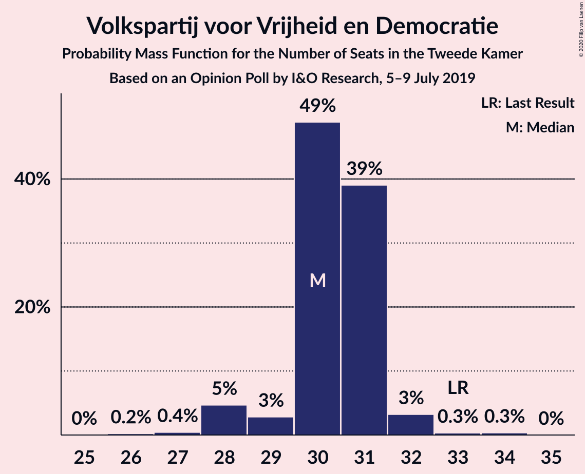
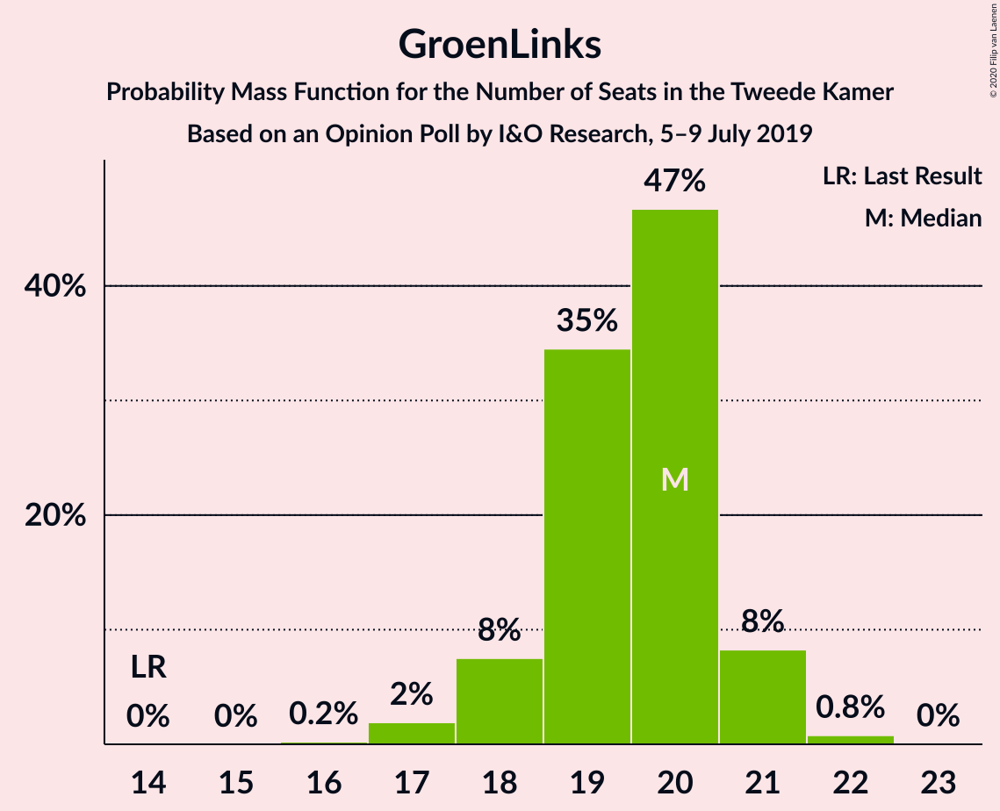
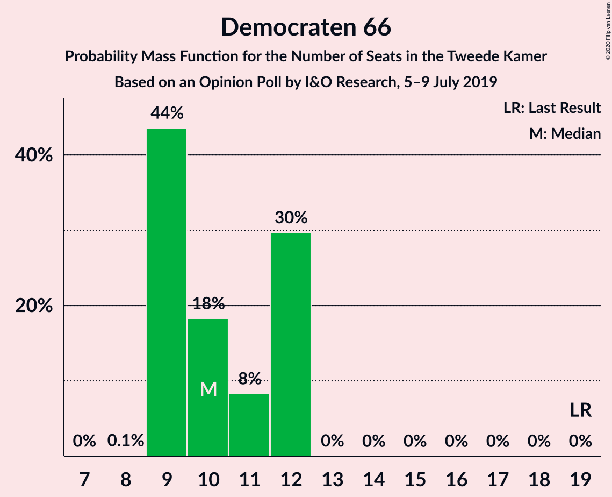
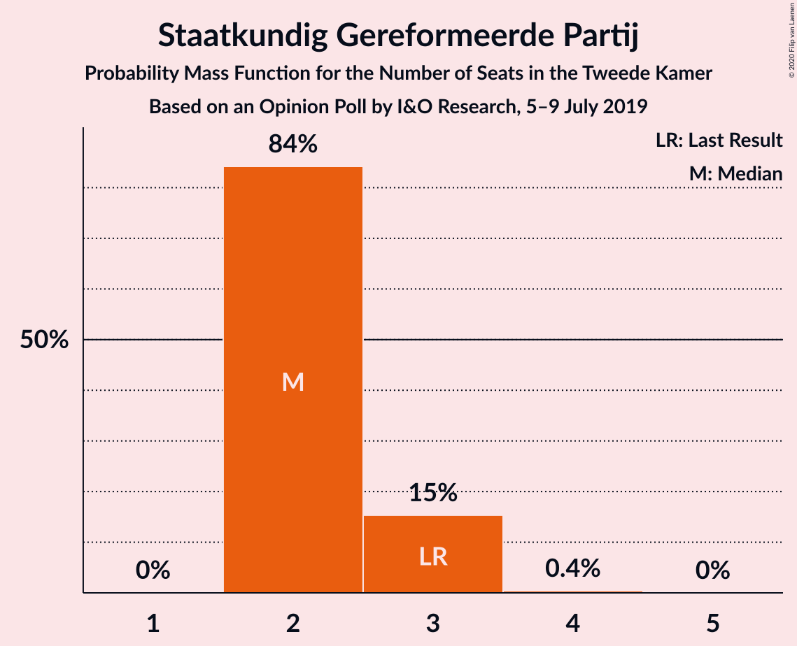
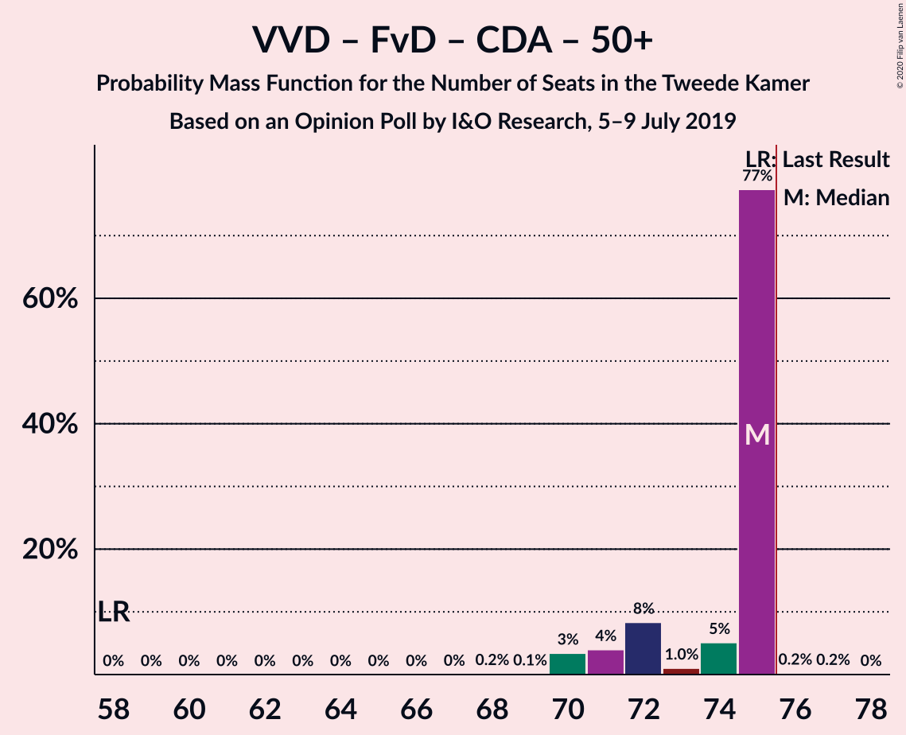
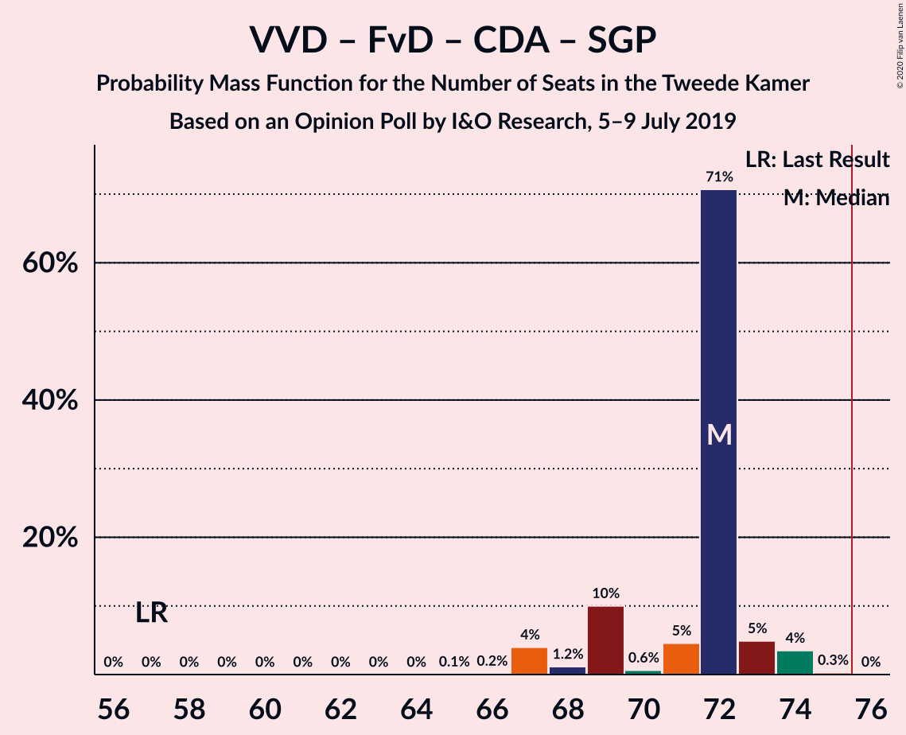
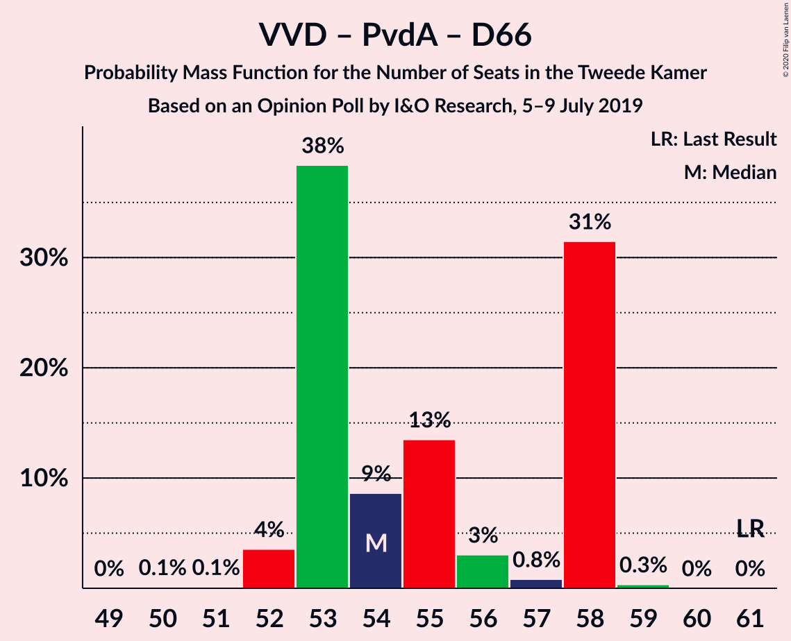

# Opinion Poll by I&O Research, 5–9 July 2019

<a href="#voting-intentions">Voting Intentions</a> | <a href="#seats">Seats</a> | <a href="#coalitions">Coalitions</a> | <a href="#technical-information">Technical Information</a>

## Voting Intentions

### Confidence Intervals

| Party | Last Result | Poll Result | 80% Confidence Interval | 90% Confidence Interval | 95% Confidence Interval | 99% Confidence Interval |
|:-----:|:-----------:|:-----------:|:-----------------------:|:-----------------------:|:-----------------------:|:-----------------------:|
| Volkspartij voor Vrijheid en Democratie | 21.3% | 19.3% | 18.3–20.4% |18.0–20.7% |17.7–21.0% |17.2–21.5% |
| Forum voor Democratie | 1.8% | 15.3% | 14.4–16.3% |14.1–16.6% |13.9–16.9% |13.4–17.3% |
| GroenLinks | 9.1% | 12.6% | 11.8–13.6% |11.5–13.8% |11.3–14.1% |10.9–14.5% |
| Christen-Democratisch Appèl | 12.4% | 10.0% | 9.2–10.9% |9.0–11.1% |8.8–11.3% |8.5–11.7% |
| Partij van de Arbeid | 5.7% | 10.0% | 9.2–10.9% |9.0–11.1% |8.8–11.3% |8.5–11.7% |
| Democraten 66 | 12.2% | 6.7% | 6.0–7.4% |5.9–7.6% |5.7–7.8% |5.4–8.1% |
| Partij voor de Vrijheid | 13.1% | 6.0% | 5.4–6.7% |5.2–6.9% |5.1–7.1% |4.8–7.4% |
| Socialistische Partij | 9.1% | 5.3% | 4.7–6.0% |4.6–6.1% |4.5–6.3% |4.2–6.6% |
| ChristenUnie | 3.4% | 4.0% | 3.5–4.6% |3.4–4.7% |3.3–4.9% |3.0–5.2% |
| Partij voor de Dieren | 3.2% | 4.0% | 3.5–4.6% |3.4–4.7% |3.3–4.9% |3.0–5.2% |
| 50Plus | 3.1% | 3.3% | 2.9–3.9% |2.8–4.0% |2.7–4.2% |2.5–4.4% |
| Staatkundig Gereformeerde Partij | 2.1% | 2.0% | 1.7–2.5% |1.6–2.6% |1.5–2.7% |1.4–2.9% |
| DENK | 2.1% | 1.3% | 1.1–1.7% |1.0–1.8% |0.9–1.9% |0.8–2.1% |

*Note:* The poll result column reflects the actual value used in the calculations. Published results may vary slightly, and in addition be rounded to fewer digits.

## Seats

### Confidence Intervals

| Party | Last Result | Median | 80% Confidence Interval | 90% Confidence Interval | 95% Confidence Interval | 99% Confidence Interval |
|:-----:|:-----------:|:------:|:-----------------------:|:-----------------------:|:-----------------------:|:-----------------------:|
| <a href="#volkspartij-voor-vrijheid-en-democratie">Volkspartij voor Vrijheid en Democratie</a> | 33 | 31 | 29–32 |29–32 |29–32 |27–33 |
| <a href="#forum-voor-democratie">Forum voor Democratie</a> | 2 | 24 | 22–25 |22–25 |22–25 |22–26 |
| <a href="#groenlinks">GroenLinks</a> | 14 | 18 | 18–20 |18–20 |18–20 |17–20 |
| <a href="#christen-democratisch-appèl">Christen-Democratisch Appèl</a> | 19 | 16 | 14–17 |14–17 |14–17 |13–17 |
| <a href="#partij-van-de-arbeid">Partij van de Arbeid</a> | 9 | 15 | 13–15 |13–16 |13–16 |13–17 |
| <a href="#democraten-66">Democraten 66</a> | 19 | 10 | 9–11 |9–11 |9–11 |9–12 |
| <a href="#partij-voor-de-vrijheid">Partij voor de Vrijheid</a> | 20 | 9 | 8–9 |8–9 |8–10 |8–11 |
| <a href="#socialistische-partij">Socialistische Partij</a> | 14 | 8 | 7–9 |7–9 |7–9 |6–9 |
| <a href="#christenunie">ChristenUnie</a> | 5 | 6 | 6 |5–6 |5–6 |4–7 |
| <a href="#partij-voor-de-dieren">Partij voor de Dieren</a> | 5 | 7 | 6–7 |6–7 |6–7 |5–7 |
| <a href="#50plus">50Plus</a> | 4 | 5 | 4–5 |4–6 |4–6 |4–6 |
| <a href="#staatkundig-gereformeerde-partij">Staatkundig Gereformeerde Partij</a> | 3 | 2 | 2–3 |2–3 |2–3 |2–3 |
| <a href="#denk">DENK</a> | 3 | 1 | 1–2 |1–2 |1–2 |1–2 |

### Volkspartij voor Vrijheid en Democratie

*For a full overview of the results for this party, see the [Volkspartij voor Vrijheid en Democratie](party-volkspartijvoorvrijheidendemocratie.html) page.*

| Number of Seats | Probability | Accumulated | Special Marks |
|:---------------:|:-----------:|:-----------:|:-------------:|
| 27 | 1.3% | 100% |  |
| 28 | 0.8% | 98.7% |  |
| 29 | 10% | 98% |  |
| 30 | 6% | 88% |  |
| 31 | 41% | 82% | Median |
| 32 | 39% | 40% |  |
| 33 | 1.2% | 1.2% | Last Result |
| 34 | 0% | 0% |  |

### Forum voor Democratie

*For a full overview of the results for this party, see the [Forum voor Democratie](party-forumvoordemocratie.html) page.*

| Number of Seats | Probability | Accumulated | Special Marks |
|:---------------:|:-----------:|:-----------:|:-------------:|
| 2 | 0% | 100% | Last Result |
| 3 | 0% | 100% |  |
| 4 | 0% | 100% |  |
| 5 | 0% | 100% |  |
| 6 | 0% | 100% |  |
| 7 | 0% | 100% |  |
| 8 | 0% | 100% |  |
| 9 | 0% | 100% |  |
| 10 | 0% | 100% |  |
| 11 | 0% | 100% |  |
| 12 | 0% | 100% |  |
| 13 | 0% | 100% |  |
| 14 | 0% | 100% |  |
| 15 | 0% | 100% |  |
| 16 | 0% | 100% |  |
| 17 | 0% | 100% |  |
| 18 | 0% | 100% |  |
| 19 | 0% | 100% |  |
| 20 | 0% | 100% |  |
| 21 | 0.1% | 100% |  |
| 22 | 45% | 99.9% |  |
| 23 | 3% | 55% |  |
| 24 | 42% | 52% | Median |
| 25 | 10% | 10% |  |
| 26 | 0.5% | 0.5% |  |
| 27 | 0% | 0.1% |  |
| 28 | 0% | 0% |  |

### GroenLinks

*For a full overview of the results for this party, see the [GroenLinks](party-groenlinks.html) page.*

| Number of Seats | Probability | Accumulated | Special Marks |
|:---------------:|:-----------:|:-----------:|:-------------:|
| 14 | 0% | 100% | Last Result |
| 15 | 0% | 100% |  |
| 16 | 0% | 100% |  |
| 17 | 0.8% | 100% |  |
| 18 | 56% | 99.2% | Median |
| 19 | 1.1% | 43% |  |
| 20 | 42% | 42% |  |
| 21 | 0.3% | 0.4% |  |
| 22 | 0.1% | 0.1% |  |
| 23 | 0% | 0% |  |

### Christen-Democratisch Appèl

*For a full overview of the results for this party, see the [Christen-Democratisch Appèl](party-christen-democratischappèl.html) page.*

| Number of Seats | Probability | Accumulated | Special Marks |
|:---------------:|:-----------:|:-----------:|:-------------:|
| 13 | 1.2% | 100% |  |
| 14 | 43% | 98.8% |  |
| 15 | 0.2% | 56% |  |
| 16 | 10% | 56% | Median |
| 17 | 45% | 45% |  |
| 18 | 0.1% | 0.4% |  |
| 19 | 0.4% | 0.4% | Last Result |
| 20 | 0% | 0% |  |

### Partij van de Arbeid

*For a full overview of the results for this party, see the [Partij van de Arbeid](party-partijvandearbeid.html) page.*

| Number of Seats | Probability | Accumulated | Special Marks |
|:---------------:|:-----------:|:-----------:|:-------------:|
| 9 | 0% | 100% | Last Result |
| 10 | 0% | 100% |  |
| 11 | 0% | 100% |  |
| 12 | 0% | 100% |  |
| 13 | 49% | 100% |  |
| 14 | 0.5% | 51% |  |
| 15 | 43% | 50% | Median |
| 16 | 6% | 7% |  |
| 17 | 0.7% | 1.1% |  |
| 18 | 0.4% | 0.4% |  |
| 19 | 0% | 0% |  |

### Democraten 66

*For a full overview of the results for this party, see the [Democraten 66](party-democraten66.html) page.*

| Number of Seats | Probability | Accumulated | Special Marks |
|:---------------:|:-----------:|:-----------:|:-------------:|
| 8 | 0.1% | 100% |  |
| 9 | 42% | 99.9% |  |
| 10 | 45% | 58% | Median |
| 11 | 12% | 13% |  |
| 12 | 0.5% | 0.6% |  |
| 13 | 0% | 0% |  |
| 14 | 0% | 0% |  |
| 15 | 0% | 0% |  |
| 16 | 0% | 0% |  |
| 17 | 0% | 0% |  |
| 18 | 0% | 0% |  |
| 19 | 0% | 0% | Last Result |

### Partij voor de Vrijheid

*For a full overview of the results for this party, see the [Partij voor de Vrijheid](party-partijvoordevrijheid.html) page.*

| Number of Seats | Probability | Accumulated | Special Marks |
|:---------------:|:-----------:|:-----------:|:-------------:|
| 7 | 0.4% | 100% |  |
| 8 | 15% | 99.6% |  |
| 9 | 81% | 84% | Median |
| 10 | 2% | 3% |  |
| 11 | 0.7% | 0.9% |  |
| 12 | 0.2% | 0.2% |  |
| 13 | 0% | 0% |  |
| 14 | 0% | 0% |  |
| 15 | 0% | 0% |  |
| 16 | 0% | 0% |  |
| 17 | 0% | 0% |  |
| 18 | 0% | 0% |  |
| 19 | 0% | 0% |  |
| 20 | 0% | 0% | Last Result |

### Socialistische Partij

*For a full overview of the results for this party, see the [Socialistische Partij](party-socialistischepartij.html) page.*

| Number of Seats | Probability | Accumulated | Special Marks |
|:---------------:|:-----------:|:-----------:|:-------------:|
| 6 | 2% | 100% |  |
| 7 | 48% | 98% |  |
| 8 | 40% | 50% | Median |
| 9 | 10% | 10% |  |
| 10 | 0% | 0% |  |
| 11 | 0% | 0% |  |
| 12 | 0% | 0% |  |
| 13 | 0% | 0% |  |
| 14 | 0% | 0% | Last Result |

### ChristenUnie

*For a full overview of the results for this party, see the [ChristenUnie](party-christenunie.html) page.*

| Number of Seats | Probability | Accumulated | Special Marks |
|:---------------:|:-----------:|:-----------:|:-------------:|
| 4 | 0.6% | 100% |  |
| 5 | 7% | 99.4% | Last Result |
| 6 | 92% | 92% | Median |
| 7 | 0.6% | 0.6% |  |
| 8 | 0% | 0% |  |

### Partij voor de Dieren

*For a full overview of the results for this party, see the [Partij voor de Dieren](party-partijvoordedieren.html) page.*

| Number of Seats | Probability | Accumulated | Special Marks |
|:---------------:|:-----------:|:-----------:|:-------------:|
| 4 | 0.1% | 100% |  |
| 5 | 1.1% | 99.9% | Last Result |
| 6 | 48% | 98.8% |  |
| 7 | 51% | 51% | Median |
| 8 | 0% | 0% |  |

### 50Plus

*For a full overview of the results for this party, see the [50Plus](party-50plus.html) page.*

| Number of Seats | Probability | Accumulated | Special Marks |
|:---------------:|:-----------:|:-----------:|:-------------:|
| 3 | 0.2% | 100% |  |
| 4 | 40% | 99.8% | Last Result |
| 5 | 53% | 60% | Median |
| 6 | 6% | 6% |  |
| 7 | 0.1% | 0.2% |  |
| 8 | 0.1% | 0.1% |  |
| 9 | 0% | 0% |  |

### Staatkundig Gereformeerde Partij

*For a full overview of the results for this party, see the [Staatkundig Gereformeerde Partij](party-staatkundiggereformeerdepartij.html) page.*

| Number of Seats | Probability | Accumulated | Special Marks |
|:---------------:|:-----------:|:-----------:|:-------------:|
| 2 | 53% | 100% | Median |
| 3 | 47% | 47% | Last Result |
| 4 | 0.3% | 0.4% |  |
| 5 | 0% | 0% |  |

### DENK

*For a full overview of the results for this party, see the [DENK](party-denk.html) page.*

| Number of Seats | Probability | Accumulated | Special Marks |
|:---------------:|:-----------:|:-----------:|:-------------:|
| 1 | 51% | 100% | Median |
| 2 | 49% | 49% |  |
| 3 | 0% | 0% | Last Result |

## Coalitions

### Confidence Intervals

| Coalition | Last Result | Median | Majority? | 80% Confidence Interval | 90% Confidence Interval | 95% Confidence Interval | 99% Confidence Interval |
|:---------:|:-----------:|:------:|:---------:|:-----------------------:|:-----------------------:|:-----------------------:|:-----------------------:|
| Volkspartij voor Vrijheid en Democratie – GroenLinks – Christen-Democratisch Appèl – Democraten 66 – ChristenUnie | 90 | 80 | 100% | 80–83 | 80–83 | 79–83 | 77–83 |
| Volkspartij voor Vrijheid en Democratie – Forum voor Democratie – Christen-Democratisch Appèl – Partij voor de Vrijheid | 74 | 78 | 99.4% | 78–80 | 77–80 | 77–80 | 75–80 |
| Volkspartij voor Vrijheid en Democratie – Forum voor Democratie – Christen-Democratisch Appèl – 50Plus – Staatkundig Gereformeerde Partij | 61 | 77 | 97% | 76–78 | 76–78 | 75–78 | 74–78 |
| Volkspartij voor Vrijheid en Democratie – Christen-Democratisch Appèl – Partij van de Arbeid – Democraten 66 – ChristenUnie | 85 | 75 | 48% | 75–78 | 75–78 | 75–78 | 73–78 |
| Volkspartij voor Vrijheid en Democratie – Forum voor Democratie – Christen-Democratisch Appèl – 50Plus | 58 | 75 | 0.5% | 74–75 | 74–75 | 73–75 | 71–75 |
| Volkspartij voor Vrijheid en Democratie – Forum voor Democratie – Christen-Democratisch Appèl – Staatkundig Gereformeerde Partij | 57 | 72 | 0% | 71–74 | 71–74 | 71–74 | 69–74 |
| Volkspartij voor Vrijheid en Democratie – Forum voor Democratie – Christen-Democratisch Appèl | 54 | 69 | 0% | 69–71 | 69–71 | 68–71 | 66–71 |
| Volkspartij voor Vrijheid en Democratie – Christen-Democratisch Appèl – Democraten 66 – ChristenUnie | 76 | 62 | 0% | 60–65 | 60–65 | 60–65 | 58–65 |
| Volkspartij voor Vrijheid en Democratie – Christen-Democratisch Appèl – Partij van de Arbeid | 61 | 60 | 0% | 58–62 | 58–63 | 58–63 | 56–63 |
| Volkspartij voor Vrijheid en Democratie – Christen-Democratisch Appèl – Democraten 66 | 71 | 56 | 0% | 54–59 | 54–59 | 54–59 | 53–59 |
| Volkspartij voor Vrijheid en Democratie – Christen-Democratisch Appèl – Partij voor de Vrijheid | 72 | 54 | 0% | 53–58 | 53–58 | 53–58 | 51–58 |
| Volkspartij voor Vrijheid en Democratie – Partij van de Arbeid – Democraten 66 | 61 | 55 | 0% | 53–55 | 53–56 | 53–56 | 51–59 |
| Volkspartij voor Vrijheid en Democratie – Christen-Democratisch Appèl | 52 | 45 | 0% | 45–49 | 45–49 | 45–49 | 41–49 |
| Volkspartij voor Vrijheid en Democratie – Partij van de Arbeid | 42 | 45 | 0% | 42–46 | 42–46 | 42–46 | 40–48 |
| Christen-Democratisch Appèl – Partij van de Arbeid – Democraten 66 | 47 | 40 | 0% | 38–40 | 38–43 | 38–43 | 38–43 |
| Christen-Democratisch Appèl – Partij van de Arbeid – ChristenUnie | 33 | 35 | 0% | 35–36 | 35–38 | 35–38 | 33–38 |
| Christen-Democratisch Appèl – Partij van de Arbeid | 28 | 29 | 0% | 29–30 | 29–33 | 29–33 | 28–34 |
| Christen-Democratisch Appèl – Democraten 66 | 38 | 27 | 0% | 23–27 | 23–27 | 23–27 | 23–27 |

### Volkspartij voor Vrijheid en Democratie – GroenLinks – Christen-Democratisch Appèl – Democraten 66 – ChristenUnie

| Number of Seats | Probability | Accumulated | Special Marks |
|:---------------:|:-----------:|:-----------:|:-------------:|
| 76 | 0.4% | 100% | Majority |
| 77 | 0.9% | 99.6% |  |
| 78 | 0.7% | 98.7% |  |
| 79 | 0.5% | 98% |  |
| 80 | 56% | 97% |  |
| 81 | 2% | 41% | Median |
| 82 | 0.2% | 40% |  |
| 83 | 39% | 39% |  |
| 84 | 0% | 0% |  |
| 85 | 0% | 0% |  |
| 86 | 0% | 0% |  |
| 87 | 0% | 0% |  |
| 88 | 0% | 0% |  |
| 89 | 0% | 0% |  |
| 90 | 0% | 0% | Last Result |

### Volkspartij voor Vrijheid en Democratie – Forum voor Democratie – Christen-Democratisch Appèl – Partij voor de Vrijheid

| Number of Seats | Probability | Accumulated | Special Marks |
|:---------------:|:-----------:|:-----------:|:-------------:|
| 72 | 0.1% | 100% |  |
| 73 | 0.2% | 99.9% |  |
| 74 | 0.1% | 99.7% | Last Result |
| 75 | 0.2% | 99.6% |  |
| 76 | 1.0% | 99.4% | Majority |
| 77 | 7% | 98% |  |
| 78 | 50% | 92% |  |
| 79 | 2% | 42% |  |
| 80 | 39% | 40% | Median |
| 81 | 0.4% | 0.4% |  |
| 82 | 0% | 0% |  |

### Volkspartij voor Vrijheid en Democratie – Forum voor Democratie – Christen-Democratisch Appèl – 50Plus – Staatkundig Gereformeerde Partij

| Number of Seats | Probability | Accumulated | Special Marks |
|:---------------:|:-----------:|:-----------:|:-------------:|
| 61 | 0% | 100% | Last Result |
| 62 | 0% | 100% |  |
| 63 | 0% | 100% |  |
| 64 | 0% | 100% |  |
| 65 | 0% | 100% |  |
| 66 | 0% | 100% |  |
| 67 | 0% | 100% |  |
| 68 | 0% | 100% |  |
| 69 | 0% | 100% |  |
| 70 | 0% | 100% |  |
| 71 | 0% | 100% |  |
| 72 | 0% | 100% |  |
| 73 | 0.4% | 100% |  |
| 74 | 0.7% | 99.6% |  |
| 75 | 2% | 98.9% |  |
| 76 | 43% | 97% | Majority |
| 77 | 9% | 54% |  |
| 78 | 45% | 45% | Median |
| 79 | 0.4% | 0.4% |  |
| 80 | 0% | 0.1% |  |
| 81 | 0% | 0% |  |

### Volkspartij voor Vrijheid en Democratie – Christen-Democratisch Appèl – Partij van de Arbeid – Democraten 66 – ChristenUnie

| Number of Seats | Probability | Accumulated | Special Marks |
|:---------------:|:-----------:|:-----------:|:-------------:|
| 72 | 0.1% | 100% |  |
| 73 | 1.4% | 99.9% |  |
| 74 | 0.7% | 98.5% |  |
| 75 | 50% | 98% |  |
| 76 | 0.1% | 48% | Majority |
| 77 | 0.6% | 48% |  |
| 78 | 47% | 47% | Median |
| 79 | 0.4% | 0.4% |  |
| 80 | 0% | 0% |  |
| 81 | 0% | 0% |  |
| 82 | 0% | 0% |  |
| 83 | 0% | 0% |  |
| 84 | 0% | 0% |  |
| 85 | 0% | 0% | Last Result |

### Volkspartij voor Vrijheid en Democratie – Forum voor Democratie – Christen-Democratisch Appèl – 50Plus

| Number of Seats | Probability | Accumulated | Special Marks |
|:---------------:|:-----------:|:-----------:|:-------------:|
| 58 | 0% | 100% | Last Result |
| 59 | 0% | 100% |  |
| 60 | 0% | 100% |  |
| 61 | 0% | 100% |  |
| 62 | 0% | 100% |  |
| 63 | 0% | 100% |  |
| 64 | 0% | 100% |  |
| 65 | 0% | 100% |  |
| 66 | 0% | 100% |  |
| 67 | 0% | 100% |  |
| 68 | 0% | 100% |  |
| 69 | 0% | 100% |  |
| 70 | 0.1% | 100% |  |
| 71 | 1.0% | 99.9% |  |
| 72 | 0.8% | 98.9% |  |
| 73 | 1.5% | 98% |  |
| 74 | 42% | 97% |  |
| 75 | 54% | 54% |  |
| 76 | 0% | 0.5% | Median, Majority |
| 77 | 0.4% | 0.4% |  |
| 78 | 0% | 0.1% |  |
| 79 | 0% | 0% |  |

### Volkspartij voor Vrijheid en Democratie – Forum voor Democratie – Christen-Democratisch Appèl – Staatkundig Gereformeerde Partij

| Number of Seats | Probability | Accumulated | Special Marks |
|:---------------:|:-----------:|:-----------:|:-------------:|
| 57 | 0% | 100% | Last Result |
| 58 | 0% | 100% |  |
| 59 | 0% | 100% |  |
| 60 | 0% | 100% |  |
| 61 | 0% | 100% |  |
| 62 | 0% | 100% |  |
| 63 | 0% | 100% |  |
| 64 | 0% | 100% |  |
| 65 | 0% | 100% |  |
| 66 | 0% | 100% |  |
| 67 | 0% | 100% |  |
| 68 | 0% | 100% |  |
| 69 | 1.2% | 100% |  |
| 70 | 1.0% | 98.8% |  |
| 71 | 43% | 98% |  |
| 72 | 15% | 55% |  |
| 73 | 0.1% | 39% | Median |
| 74 | 39% | 39% |  |
| 75 | 0% | 0.1% |  |
| 76 | 0% | 0% | Majority |

### Volkspartij voor Vrijheid en Democratie – Forum voor Democratie – Christen-Democratisch Appèl

| Number of Seats | Probability | Accumulated | Special Marks |
|:---------------:|:-----------:|:-----------:|:-------------:|
| 54 | 0% | 100% | Last Result |
| 55 | 0% | 100% |  |
| 56 | 0% | 100% |  |
| 57 | 0% | 100% |  |
| 58 | 0% | 100% |  |
| 59 | 0% | 100% |  |
| 60 | 0% | 100% |  |
| 61 | 0% | 100% |  |
| 62 | 0% | 100% |  |
| 63 | 0% | 100% |  |
| 64 | 0% | 100% |  |
| 65 | 0.1% | 100% |  |
| 66 | 0.9% | 99.9% |  |
| 67 | 0.5% | 99.0% |  |
| 68 | 2% | 98.5% |  |
| 69 | 48% | 97% |  |
| 70 | 9% | 49% |  |
| 71 | 39% | 39% | Median |
| 72 | 0.4% | 0.5% |  |
| 73 | 0% | 0.1% |  |
| 74 | 0% | 0% |  |

### Volkspartij voor Vrijheid en Democratie – Christen-Democratisch Appèl – Democraten 66 – ChristenUnie

| Number of Seats | Probability | Accumulated | Special Marks |
|:---------------:|:-----------:|:-----------:|:-------------:|
| 57 | 0.1% | 100% |  |
| 58 | 0.6% | 99.9% |  |
| 59 | 0.2% | 99.3% |  |
| 60 | 43% | 99.1% |  |
| 61 | 0.4% | 56% |  |
| 62 | 15% | 56% |  |
| 63 | 1.4% | 41% | Median |
| 64 | 0.4% | 39% |  |
| 65 | 39% | 39% |  |
| 66 | 0% | 0% |  |
| 67 | 0% | 0% |  |
| 68 | 0% | 0% |  |
| 69 | 0% | 0% |  |
| 70 | 0% | 0% |  |
| 71 | 0% | 0% |  |
| 72 | 0% | 0% |  |
| 73 | 0% | 0% |  |
| 74 | 0% | 0% |  |
| 75 | 0% | 0% |  |
| 76 | 0% | 0% | Last Result, Majority |

### Volkspartij voor Vrijheid en Democratie – Christen-Democratisch Appèl – Partij van de Arbeid

| Number of Seats | Probability | Accumulated | Special Marks |
|:---------------:|:-----------:|:-----------:|:-------------:|
| 56 | 1.2% | 100% |  |
| 57 | 0.1% | 98.8% |  |
| 58 | 10% | 98.7% |  |
| 59 | 0.6% | 89% |  |
| 60 | 41% | 88% |  |
| 61 | 1.3% | 47% | Last Result |
| 62 | 39% | 46% | Median |
| 63 | 6% | 7% |  |
| 64 | 0.4% | 0.4% |  |
| 65 | 0% | 0% |  |

### Volkspartij voor Vrijheid en Democratie – Christen-Democratisch Appèl – Democraten 66

| Number of Seats | Probability | Accumulated | Special Marks |
|:---------------:|:-----------:|:-----------:|:-------------:|
| 50 | 0.1% | 100% |  |
| 51 | 0% | 99.9% |  |
| 52 | 0% | 99.9% |  |
| 53 | 1.0% | 99.9% |  |
| 54 | 42% | 98.9% |  |
| 55 | 0.4% | 57% |  |
| 56 | 10% | 56% |  |
| 57 | 7% | 47% | Median |
| 58 | 0.5% | 40% |  |
| 59 | 39% | 39% |  |
| 60 | 0% | 0% |  |
| 61 | 0% | 0% |  |
| 62 | 0% | 0% |  |
| 63 | 0% | 0% |  |
| 64 | 0% | 0% |  |
| 65 | 0% | 0% |  |
| 66 | 0% | 0% |  |
| 67 | 0% | 0% |  |
| 68 | 0% | 0% |  |
| 69 | 0% | 0% |  |
| 70 | 0% | 0% |  |
| 71 | 0% | 0% | Last Result |

### Volkspartij voor Vrijheid en Democratie – Christen-Democratisch Appèl – Partij voor de Vrijheid

| Number of Seats | Probability | Accumulated | Special Marks |
|:---------------:|:-----------:|:-----------:|:-------------:|
| 48 | 0.1% | 100% |  |
| 49 | 0% | 99.9% |  |
| 50 | 0.2% | 99.9% |  |
| 51 | 0.6% | 99.7% |  |
| 52 | 0.6% | 99.1% |  |
| 53 | 9% | 98% |  |
| 54 | 42% | 89% |  |
| 55 | 6% | 47% |  |
| 56 | 1.3% | 41% | Median |
| 57 | 0.1% | 39% |  |
| 58 | 39% | 39% |  |
| 59 | 0% | 0% |  |
| 60 | 0% | 0% |  |
| 61 | 0% | 0% |  |
| 62 | 0% | 0% |  |
| 63 | 0% | 0% |  |
| 64 | 0% | 0% |  |
| 65 | 0% | 0% |  |
| 66 | 0% | 0% |  |
| 67 | 0% | 0% |  |
| 68 | 0% | 0% |  |
| 69 | 0% | 0% |  |
| 70 | 0% | 0% |  |
| 71 | 0% | 0% |  |
| 72 | 0% | 0% | Last Result |

### Volkspartij voor Vrijheid en Democratie – Partij van de Arbeid – Democraten 66

| Number of Seats | Probability | Accumulated | Special Marks |
|:---------------:|:-----------:|:-----------:|:-------------:|
| 51 | 0.8% | 100% |  |
| 52 | 0.2% | 99.2% |  |
| 53 | 9% | 99.0% |  |
| 54 | 1.0% | 90% |  |
| 55 | 81% | 89% |  |
| 56 | 6% | 8% | Median |
| 57 | 0.1% | 2% |  |
| 58 | 0.6% | 2% |  |
| 59 | 1.2% | 1.2% |  |
| 60 | 0% | 0% |  |
| 61 | 0% | 0% | Last Result |

### Volkspartij voor Vrijheid en Democratie – Christen-Democratisch Appèl

| Number of Seats | Probability | Accumulated | Special Marks |
|:---------------:|:-----------:|:-----------:|:-------------:|
| 41 | 0.5% | 100% |  |
| 42 | 0.5% | 99.5% |  |
| 43 | 1.0% | 98.9% |  |
| 44 | 0.3% | 98% |  |
| 45 | 51% | 98% |  |
| 46 | 1.3% | 47% |  |
| 47 | 6% | 45% | Median |
| 48 | 0.1% | 39% |  |
| 49 | 39% | 39% |  |
| 50 | 0% | 0% |  |
| 51 | 0% | 0% |  |
| 52 | 0% | 0% | Last Result |

### Volkspartij voor Vrijheid en Democratie – Partij van de Arbeid

| Number of Seats | Probability | Accumulated | Special Marks |
|:---------------:|:-----------:|:-----------:|:-------------:|
| 40 | 0.7% | 100% |  |
| 41 | 0% | 99.3% |  |
| 42 | 10% | 99.2% | Last Result |
| 43 | 0.2% | 90% |  |
| 44 | 0.7% | 89% |  |
| 45 | 40% | 89% |  |
| 46 | 47% | 49% | Median |
| 47 | 0.6% | 2% |  |
| 48 | 1.2% | 1.2% |  |
| 49 | 0% | 0% |  |

### Christen-Democratisch Appèl – Partij van de Arbeid – Democraten 66

| Number of Seats | Probability | Accumulated | Special Marks |
|:---------------:|:-----------:|:-----------:|:-------------:|
| 37 | 0% | 100% |  |
| 38 | 42% | 99.9% |  |
| 39 | 1.3% | 58% |  |
| 40 | 49% | 57% |  |
| 41 | 0.8% | 8% | Median |
| 42 | 0.6% | 7% |  |
| 43 | 6% | 7% |  |
| 44 | 0% | 0.4% |  |
| 45 | 0.4% | 0.4% |  |
| 46 | 0% | 0% |  |
| 47 | 0% | 0% | Last Result |

### Christen-Democratisch Appèl – Partij van de Arbeid – ChristenUnie

| Number of Seats | Probability | Accumulated | Special Marks |
|:---------------:|:-----------:|:-----------:|:-------------:|
| 32 | 0.5% | 100% |  |
| 33 | 0.2% | 99.5% | Last Result |
| 34 | 2% | 99.4% |  |
| 35 | 51% | 98% |  |
| 36 | 39% | 47% |  |
| 37 | 0.1% | 7% | Median |
| 38 | 7% | 7% |  |
| 39 | 0% | 0.4% |  |
| 40 | 0.4% | 0.4% |  |
| 41 | 0% | 0% |  |

### Christen-Democratisch Appèl – Partij van de Arbeid

| Number of Seats | Probability | Accumulated | Special Marks |
|:---------------:|:-----------:|:-----------:|:-------------:|
| 27 | 0.4% | 100% |  |
| 28 | 1.4% | 99.6% | Last Result |
| 29 | 51% | 98% |  |
| 30 | 39% | 47% |  |
| 31 | 0.8% | 8% | Median |
| 32 | 0.1% | 7% |  |
| 33 | 6% | 7% |  |
| 34 | 0.8% | 0.8% |  |
| 35 | 0% | 0% |  |

### Christen-Democratisch Appèl – Democraten 66

| Number of Seats | Probability | Accumulated | Special Marks |
|:---------------:|:-----------:|:-----------:|:-------------:|
| 23 | 41% | 100% |  |
| 24 | 1.3% | 59% |  |
| 25 | 1.1% | 57% |  |
| 26 | 1.0% | 56% | Median |
| 27 | 55% | 55% |  |
| 28 | 0.4% | 0.4% |  |
| 29 | 0% | 0% |  |
| 30 | 0% | 0% |  |
| 31 | 0% | 0% |  |
| 32 | 0% | 0% |  |
| 33 | 0% | 0% |  |
| 34 | 0% | 0% |  |
| 35 | 0% | 0% |  |
| 36 | 0% | 0% |  |
| 37 | 0% | 0% |  |
| 38 | 0% | 0% | Last Result |

## Technical Information

### Opinion Poll

+ **Polling firm:** I&O Research
+ **Commissioner(s):** —
+ **Fieldwork period:** 5–9 July 2019

### Calculations

+ **Sample size:** 2280
+ **Simulations done:** 131,072
+ **Error estimate:** 3.19%

