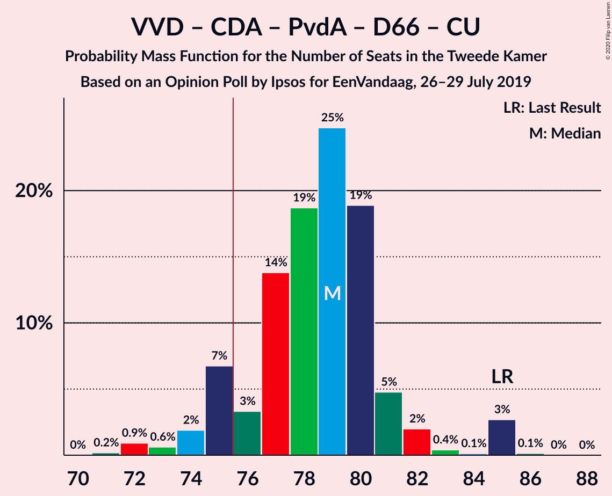
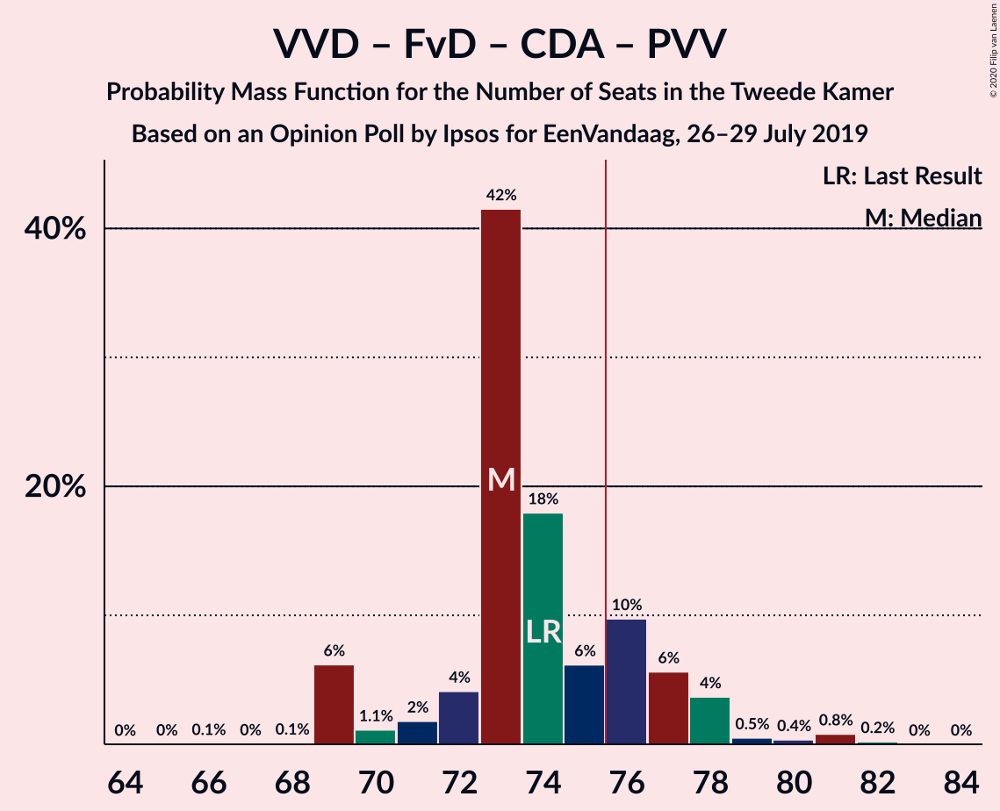
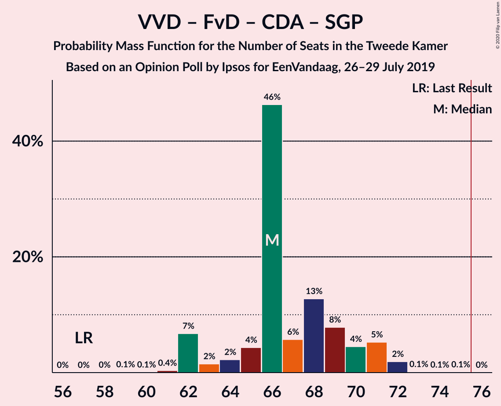
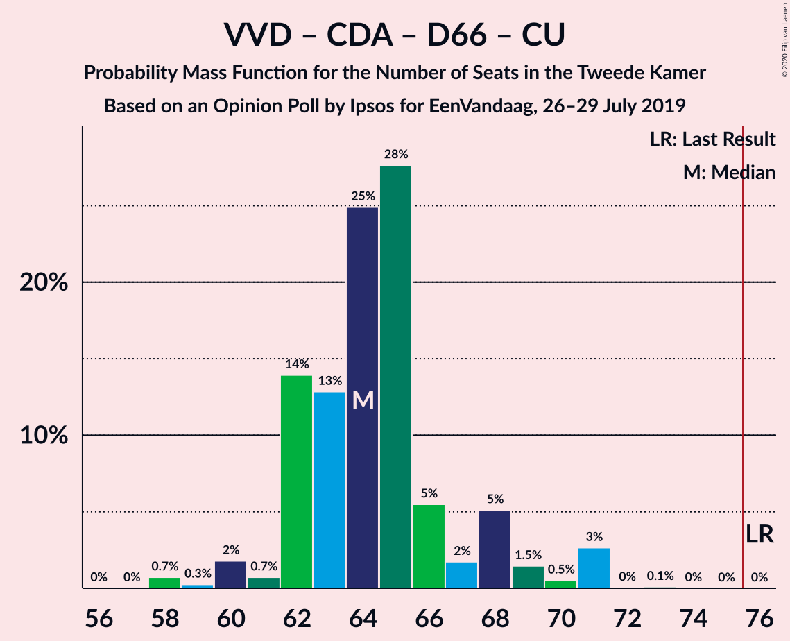
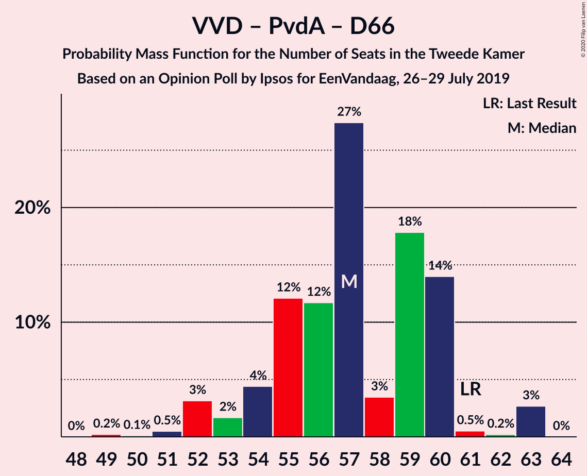
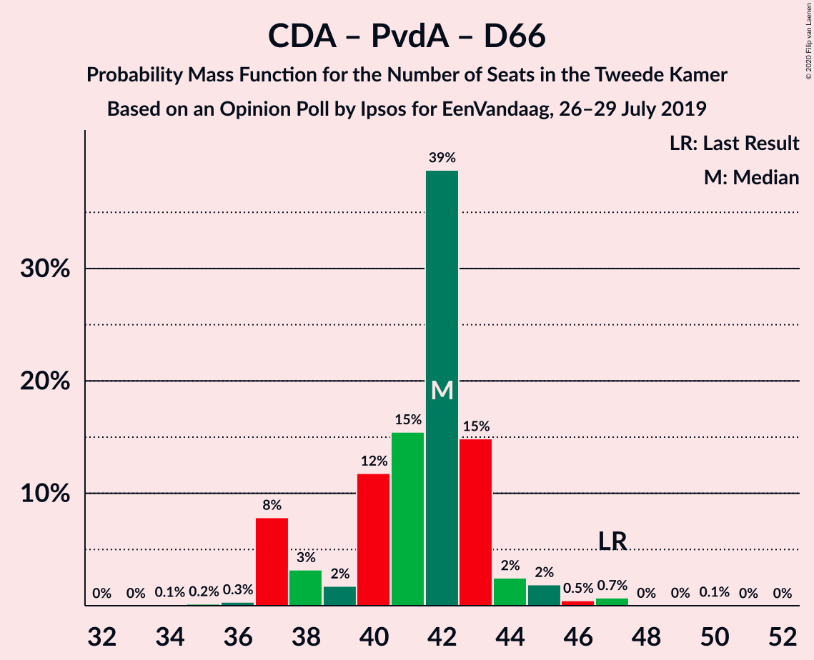

# Opinion Poll by Ipsos for EenVandaag, 26–29 July 2019

<a href="#voting-intentions">Voting Intentions</a> | <a href="#seats">Seats</a> | <a href="#coalitions">Coalitions</a> | <a href="#technical-information">Technical Information</a>

## Voting Intentions

### Confidence Intervals

| Party | Last Result | Poll Result | 80% Confidence Interval | 90% Confidence Interval | 95% Confidence Interval | 99% Confidence Interval |
|:-----:|:-----------:|:-----------:|:-----------------------:|:-----------------------:|:-----------------------:|:-----------------------:|
| Volkspartij voor Vrijheid en Democratie | 21.3% | 20.1% | 18.6–21.8% |18.2–22.3% |17.8–22.7% |17.1–23.5% |
| Forum voor Democratie | 1.8% | 12.0% | 10.7–13.4% |10.4–13.7% |10.1–14.1% |9.6–14.8% |
| GroenLinks | 9.1% | 10.2% | 9.1–11.5% |8.8–11.9% |8.5–12.2% |8.0–12.9% |
| Christen-Democratisch Appèl | 12.4% | 10.0% | 8.9–11.3% |8.6–11.7% |8.3–12.0% |7.8–12.7% |
| Partij van de Arbeid | 5.7% | 8.9% | 7.8–10.1% |7.5–10.4% |7.3–10.8% |6.8–11.4% |
| Democraten 66 | 12.2% | 8.3% | 7.3–9.5% |7.0–9.8% |6.7–10.1% |6.3–10.7% |
| Partij voor de Vrijheid | 13.1% | 7.0% | 6.1–8.1% |5.8–8.5% |5.6–8.7% |5.2–9.3% |
| Socialistische Partij | 9.1% | 5.4% | 4.6–6.5% |4.4–6.8% |4.2–7.0% |3.9–7.5% |
| ChristenUnie | 3.4% | 4.5% | 3.7–5.4% |3.5–5.7% |3.4–5.9% |3.0–6.4% |
| Partij voor de Dieren | 3.2% | 3.9% | 3.2–4.8% |3.0–5.0% |2.9–5.3% |2.6–5.7% |
| 50Plus | 3.1% | 3.8% | 3.1–4.7% |2.9–4.9% |2.8–5.2% |2.5–5.6% |
| Staatkundig Gereformeerde Partij | 2.1% | 2.2% | 1.7–3.0% |1.6–3.2% |1.5–3.3% |1.3–3.7% |
| DENK | 2.1% | 1.2% | 0.8–1.7% |0.7–1.9% |0.7–2.0% |0.5–2.3% |

*Note:* The poll result column reflects the actual value used in the calculations. Published results may vary slightly, and in addition be rounded to fewer digits.

## Seats

### Confidence Intervals

| Party | Last Result | Median | 80% Confidence Interval | 90% Confidence Interval | 95% Confidence Interval | 99% Confidence Interval |
|:-----:|:-----------:|:------:|:-----------------------:|:-----------------------:|:-----------------------:|:-----------------------:|
| <a href="#volkspartij-voor-vrijheid-en-democratie">Volkspartij voor Vrijheid en Democratie</a> | 33 | 32 | 31–32 |30–32 |28–32 |26–34 |
| <a href="#forum-voor-democratie">Forum voor Democratie</a> | 2 | 16 | 15–20 |15–20 |15–20 |15–21 |
| <a href="#groenlinks">GroenLinks</a> | 14 | 15 | 14–15 |14–15 |14–16 |13–20 |
| <a href="#christen-democratisch-appèl">Christen-Democratisch Appèl</a> | 19 | 14 | 13–17 |13–17 |13–17 |12–18 |
| <a href="#partij-van-de-arbeid">Partij van de Arbeid</a> | 9 | 14 | 12–15 |12–15 |12–16 |11–18 |
| <a href="#democraten-66">Democraten 66</a> | 19 | 12 | 10–14 |10–14 |10–14 |9–15 |
| <a href="#partij-voor-de-vrijheid">Partij voor de Vrijheid</a> | 20 | 11 | 9–11 |9–12 |9–12 |8–13 |
| <a href="#socialistische-partij">Socialistische Partij</a> | 14 | 8 | 8–10 |8–10 |8–10 |6–11 |
| <a href="#christenunie">ChristenUnie</a> | 5 | 6 | 5–7 |5–7 |5–7 |5–9 |
| <a href="#partij-voor-de-dieren">Partij voor de Dieren</a> | 5 | 5 | 5–7 |5–7 |5–7 |4–8 |
| <a href="#50plus">50Plus</a> | 4 | 7 | 4–8 |4–8 |4–8 |4–8 |
| <a href="#staatkundig-gereformeerde-partij">Staatkundig Gereformeerde Partij</a> | 3 | 4 | 3–4 |3–4 |2–4 |2–5 |
| <a href="#denk">DENK</a> | 3 | 2 | 1–2 |1–2 |1–2 |1–3 |

### Volkspartij voor Vrijheid en Democratie

*For a full overview of the results for this party, see the [Volkspartij voor Vrijheid en Democratie](party-volkspartijvoorvrijheidendemocratie.html) page.*

| Number of Seats | Probability | Accumulated | Special Marks |
|:---------------:|:-----------:|:-----------:|:-------------:|
| 24 | 0% | 100% |  |
| 25 | 0.1% | 99.9% |  |
| 26 | 0.6% | 99.9% |  |
| 27 | 0.9% | 99.3% |  |
| 28 | 2% | 98% |  |
| 29 | 0.8% | 97% |  |
| 30 | 3% | 96% |  |
| 31 | 28% | 94% |  |
| 32 | 64% | 66% | Median |
| 33 | 0.6% | 2% | Last Result |
| 34 | 0.6% | 0.9% |  |
| 35 | 0.3% | 0.4% |  |
| 36 | 0% | 0.1% |  |
| 37 | 0% | 0% |  |

### Forum voor Democratie

*For a full overview of the results for this party, see the [Forum voor Democratie](party-forumvoordemocratie.html) page.*

| Number of Seats | Probability | Accumulated | Special Marks |
|:---------------:|:-----------:|:-----------:|:-------------:|
| 2 | 0% | 100% | Last Result |
| 3 | 0% | 100% |  |
| 4 | 0% | 100% |  |
| 5 | 0% | 100% |  |
| 6 | 0% | 100% |  |
| 7 | 0% | 100% |  |
| 8 | 0% | 100% |  |
| 9 | 0% | 100% |  |
| 10 | 0% | 100% |  |
| 11 | 0% | 100% |  |
| 12 | 0% | 100% |  |
| 13 | 0% | 100% |  |
| 14 | 0.3% | 100% |  |
| 15 | 12% | 99.6% |  |
| 16 | 42% | 88% | Median |
| 17 | 24% | 45% |  |
| 18 | 3% | 22% |  |
| 19 | 0.5% | 19% |  |
| 20 | 18% | 18% |  |
| 21 | 0.3% | 0.7% |  |
| 22 | 0.2% | 0.4% |  |
| 23 | 0.2% | 0.2% |  |
| 24 | 0% | 0% |  |

### GroenLinks

*For a full overview of the results for this party, see the [GroenLinks](party-groenlinks.html) page.*

| Number of Seats | Probability | Accumulated | Special Marks |
|:---------------:|:-----------:|:-----------:|:-------------:|
| 11 | 0.3% | 100% |  |
| 12 | 0.1% | 99.7% |  |
| 13 | 0.7% | 99.6% |  |
| 14 | 23% | 98.9% | Last Result |
| 15 | 72% | 76% | Median |
| 16 | 2% | 4% |  |
| 17 | 1.0% | 2% |  |
| 18 | 0.5% | 1.3% |  |
| 19 | 0.1% | 0.8% |  |
| 20 | 0.7% | 0.7% |  |
| 21 | 0% | 0% |  |

### Christen-Democratisch Appèl

*For a full overview of the results for this party, see the [Christen-Democratisch Appèl](party-christen-democratischappèl.html) page.*

| Number of Seats | Probability | Accumulated | Special Marks |
|:---------------:|:-----------:|:-----------:|:-------------:|
| 11 | 0.2% | 100% |  |
| 12 | 0.4% | 99.8% |  |
| 13 | 16% | 99.4% |  |
| 14 | 43% | 83% | Median |
| 15 | 2% | 40% |  |
| 16 | 23% | 38% |  |
| 17 | 14% | 15% |  |
| 18 | 0.8% | 0.9% |  |
| 19 | 0.1% | 0.1% | Last Result |
| 20 | 0% | 0% |  |

### Partij van de Arbeid

*For a full overview of the results for this party, see the [Partij van de Arbeid](party-partijvandearbeid.html) page.*

| Number of Seats | Probability | Accumulated | Special Marks |
|:---------------:|:-----------:|:-----------:|:-------------:|
| 9 | 0.1% | 100% | Last Result |
| 10 | 0.2% | 99.9% |  |
| 11 | 1.4% | 99.7% |  |
| 12 | 16% | 98% |  |
| 13 | 7% | 82% |  |
| 14 | 61% | 75% | Median |
| 15 | 11% | 14% |  |
| 16 | 2% | 3% |  |
| 17 | 0.1% | 0.8% |  |
| 18 | 0.7% | 0.7% |  |
| 19 | 0% | 0% |  |

### Democraten 66

*For a full overview of the results for this party, see the [Democraten 66](party-democraten66.html) page.*

| Number of Seats | Probability | Accumulated | Special Marks |
|:---------------:|:-----------:|:-----------:|:-------------:|
| 9 | 2% | 100% |  |
| 10 | 14% | 98% |  |
| 11 | 21% | 84% |  |
| 12 | 18% | 63% | Median |
| 13 | 1.0% | 44% |  |
| 14 | 42% | 43% |  |
| 15 | 0.8% | 1.3% |  |
| 16 | 0.4% | 0.4% |  |
| 17 | 0% | 0% |  |
| 18 | 0% | 0% |  |
| 19 | 0% | 0% | Last Result |

### Partij voor de Vrijheid

*For a full overview of the results for this party, see the [Partij voor de Vrijheid](party-partijvoordevrijheid.html) page.*

| Number of Seats | Probability | Accumulated | Special Marks |
|:---------------:|:-----------:|:-----------:|:-------------:|
| 7 | 0% | 100% |  |
| 8 | 0.5% | 99.9% |  |
| 9 | 18% | 99.5% |  |
| 10 | 3% | 81% |  |
| 11 | 72% | 78% | Median |
| 12 | 5% | 7% |  |
| 13 | 1.0% | 1.3% |  |
| 14 | 0.2% | 0.3% |  |
| 15 | 0.1% | 0.1% |  |
| 16 | 0% | 0% |  |
| 17 | 0% | 0% |  |
| 18 | 0% | 0% |  |
| 19 | 0% | 0% |  |
| 20 | 0% | 0% | Last Result |

### Socialistische Partij

*For a full overview of the results for this party, see the [Socialistische Partij](party-socialistischepartij.html) page.*

| Number of Seats | Probability | Accumulated | Special Marks |
|:---------------:|:-----------:|:-----------:|:-------------:|
| 5 | 0.1% | 100% |  |
| 6 | 0.4% | 99.8% |  |
| 7 | 2% | 99.5% |  |
| 8 | 57% | 98% | Median |
| 9 | 21% | 41% |  |
| 10 | 18% | 20% |  |
| 11 | 1.2% | 1.3% |  |
| 12 | 0.2% | 0.2% |  |
| 13 | 0% | 0% |  |
| 14 | 0% | 0% | Last Result |

### ChristenUnie

*For a full overview of the results for this party, see the [ChristenUnie](party-christenunie.html) page.*

| Number of Seats | Probability | Accumulated | Special Marks |
|:---------------:|:-----------:|:-----------:|:-------------:|
| 4 | 0.5% | 100% |  |
| 5 | 46% | 99.5% | Last Result |
| 6 | 32% | 54% | Median |
| 7 | 20% | 22% |  |
| 8 | 1.5% | 2% |  |
| 9 | 0.5% | 0.7% |  |
| 10 | 0.1% | 0.1% |  |
| 11 | 0% | 0% |  |

### Partij voor de Dieren

*For a full overview of the results for this party, see the [Partij voor de Dieren](party-partijvoordedieren.html) page.*

| Number of Seats | Probability | Accumulated | Special Marks |
|:---------------:|:-----------:|:-----------:|:-------------:|
| 3 | 0.3% | 100% |  |
| 4 | 1.2% | 99.7% |  |
| 5 | 63% | 98.5% | Last Result, Median |
| 6 | 22% | 35% |  |
| 7 | 12% | 13% |  |
| 8 | 0.4% | 0.6% |  |
| 9 | 0.1% | 0.1% |  |
| 10 | 0% | 0% |  |

### 50Plus

*For a full overview of the results for this party, see the [50Plus](party-50plus.html) page.*

| Number of Seats | Probability | Accumulated | Special Marks |
|:---------------:|:-----------:|:-----------:|:-------------:|
| 3 | 0.1% | 100% |  |
| 4 | 20% | 99.9% | Last Result |
| 5 | 3% | 80% |  |
| 6 | 7% | 76% |  |
| 7 | 57% | 69% | Median |
| 8 | 12% | 12% |  |
| 9 | 0.2% | 0.2% |  |
| 10 | 0% | 0% |  |

### Staatkundig Gereformeerde Partij

*For a full overview of the results for this party, see the [Staatkundig Gereformeerde Partij](party-staatkundiggereformeerdepartij.html) page.*

| Number of Seats | Probability | Accumulated | Special Marks |
|:---------------:|:-----------:|:-----------:|:-------------:|
| 1 | 0.2% | 100% |  |
| 2 | 3% | 99.8% |  |
| 3 | 14% | 96% | Last Result |
| 4 | 82% | 82% | Median |
| 5 | 0.4% | 0.5% |  |
| 6 | 0.1% | 0.1% |  |
| 7 | 0% | 0% |  |

### DENK

*For a full overview of the results for this party, see the [DENK](party-denk.html) page.*

| Number of Seats | Probability | Accumulated | Special Marks |
|:---------------:|:-----------:|:-----------:|:-------------:|
| 0 | 0.2% | 100% |  |
| 1 | 19% | 99.8% |  |
| 2 | 80% | 81% | Median |
| 3 | 1.1% | 1.2% | Last Result |
| 4 | 0.1% | 0.1% |  |
| 5 | 0% | 0% |  |

## Coalitions

### Confidence Intervals

| Coalition | Last Result | Median | Majority? | 80% Confidence Interval | 90% Confidence Interval | 95% Confidence Interval | 99% Confidence Interval |
|:---------:|:-----------:|:------:|:---------:|:-----------------------:|:-----------------------:|:-----------------------:|:-----------------------:|
| Volkspartij voor Vrijheid en Democratie – Forum voor Democratie – Christen-Democratisch Appèl – Partij voor de Vrijheid – Staatkundig Gereformeerde Partij | 77 | 77 | 97% | 77–80 | 76–80 | 74–82 | 72–82 |
| Volkspartij voor Vrijheid en Democratie – GroenLinks – Christen-Democratisch Appèl – Democraten 66 – ChristenUnie | 90 | 79 | 98.7% | 78–80 | 78–80 | 76–81 | 75–87 |
| Volkspartij voor Vrijheid en Democratie – Christen-Democratisch Appèl – Partij van de Arbeid – Democraten 66 – ChristenUnie | 85 | 79 | 80% | 75–79 | 75–79 | 75–81 | 73–85 |
| Volkspartij voor Vrijheid en Democratie – Forum voor Democratie – Christen-Democratisch Appèl – Partij voor de Vrijheid | 74 | 73 | 24% | 73–76 | 73–76 | 72–78 | 69–78 |
| Volkspartij voor Vrijheid en Democratie – Forum voor Democratie – Christen-Democratisch Appèl – 50Plus – Staatkundig Gereformeerde Partij | 61 | 73 | 6% | 73–75 | 72–76 | 69–76 | 67–77 |
| GroenLinks – Christen-Democratisch Appèl – Partij van de Arbeid – Democraten 66 – Socialistische Partij – ChristenUnie | 80 | 70 | 0.6% | 69–71 | 69–73 | 68–73 | 66–77 |
| Volkspartij voor Vrijheid en Democratie – Forum voor Democratie – Christen-Democratisch Appèl – 50Plus | 58 | 69 | 0.1% | 69–71 | 68–72 | 66–72 | 64–74 |
| Volkspartij voor Vrijheid en Democratie – Forum voor Democratie – Christen-Democratisch Appèl – Staatkundig Gereformeerde Partij | 57 | 66 | 0% | 66–69 | 66–69 | 63–70 | 61–71 |
| Volkspartij voor Vrijheid en Democratie – Forum voor Democratie – Christen-Democratisch Appèl | 54 | 63 | 0% | 62–65 | 62–66 | 61–66 | 58–68 |
| Volkspartij voor Vrijheid en Democratie – Christen-Democratisch Appèl – Democraten 66 – ChristenUnie | 76 | 65 | 0% | 63–65 | 63–65 | 62–65 | 60–71 |
| GroenLinks – Christen-Democratisch Appèl – Partij van de Arbeid – Democraten 66 – ChristenUnie | 66 | 62 | 0% | 59–63 | 59–63 | 59–64 | 58–68 |
| Volkspartij voor Vrijheid en Democratie – Christen-Democratisch Appèl – Partij van de Arbeid | 61 | 60 | 0% | 56–63 | 56–63 | 56–63 | 53–65 |
| Volkspartij voor Vrijheid en Democratie – Christen-Democratisch Appèl – Partij voor de Vrijheid | 72 | 57 | 0% | 53–59 | 53–59 | 53–61 | 51–61 |
| Volkspartij voor Vrijheid en Democratie – Christen-Democratisch Appèl – Democraten 66 | 71 | 59 | 0% | 56–60 | 56–60 | 55–60 | 53–62 |
| Volkspartij voor Vrijheid en Democratie – Partij van de Arbeid – Democraten 66 | 61 | 57 | 0% | 55–60 | 55–60 | 52–60 | 51–62 |
| Volkspartij voor Vrijheid en Democratie – Christen-Democratisch Appèl | 52 | 46 | 0% | 44–48 | 44–48 | 43–49 | 41–50 |
| Volkspartij voor Vrijheid en Democratie – Partij van de Arbeid | 42 | 46 | 0% | 43–46 | 43–46 | 41–47 | 39–48 |
| Christen-Democratisch Appèl – Partij van de Arbeid – Democraten 66 | 47 | 42 | 0% | 37–42 | 37–42 | 37–43 | 37–46 |
| Christen-Democratisch Appèl – Partij van de Arbeid – ChristenUnie | 33 | 33 | 0% | 32–38 | 32–38 | 32–38 | 31–40 |
| Christen-Democratisch Appèl – Partij van de Arbeid | 28 | 28 | 0% | 25–32 | 25–32 | 25–32 | 25–33 |
| Christen-Democratisch Appèl – Democraten 66 | 38 | 27 | 0% | 25–28 | 25–28 | 25–28 | 24–32 |

### Volkspartij voor Vrijheid en Democratie – Forum voor Democratie – Christen-Democratisch Appèl – Partij voor de Vrijheid – Staatkundig Gereformeerde Partij

| Number of Seats | Probability | Accumulated | Special Marks |
|:---------------:|:-----------:|:-----------:|:-------------:|
| 69 | 0.1% | 100% |  |
| 70 | 0% | 99.9% |  |
| 71 | 0.1% | 99.8% |  |
| 72 | 0.3% | 99.8% |  |
| 73 | 1.0% | 99.5% |  |
| 74 | 1.1% | 98% |  |
| 75 | 0.2% | 97% |  |
| 76 | 3% | 97% | Majority |
| 77 | 67% | 94% | Last Result, Median |
| 78 | 2% | 27% |  |
| 79 | 0.8% | 25% |  |
| 80 | 20% | 24% |  |
| 81 | 0.3% | 4% |  |
| 82 | 4% | 4% |  |
| 83 | 0.1% | 0.3% |  |
| 84 | 0.1% | 0.2% |  |
| 85 | 0% | 0.1% |  |
| 86 | 0% | 0% |  |

### Volkspartij voor Vrijheid en Democratie – GroenLinks – Christen-Democratisch Appèl – Democraten 66 – ChristenUnie

| Number of Seats | Probability | Accumulated | Special Marks |
|:---------------:|:-----------:|:-----------:|:-------------:|
| 72 | 0% | 100% |  |
| 73 | 0% | 99.9% |  |
| 74 | 0.3% | 99.9% |  |
| 75 | 0.9% | 99.6% |  |
| 76 | 2% | 98.7% | Majority |
| 77 | 1.1% | 97% |  |
| 78 | 17% | 96% |  |
| 79 | 35% | 79% | Median |
| 80 | 41% | 44% |  |
| 81 | 0.6% | 3% |  |
| 82 | 0.5% | 2% |  |
| 83 | 0.2% | 2% |  |
| 84 | 0.8% | 2% |  |
| 85 | 0.3% | 1.1% |  |
| 86 | 0.1% | 0.8% |  |
| 87 | 0.4% | 0.7% |  |
| 88 | 0% | 0.3% |  |
| 89 | 0.1% | 0.3% |  |
| 90 | 0.2% | 0.2% | Last Result |
| 91 | 0% | 0% |  |

### Volkspartij voor Vrijheid en Democratie – Christen-Democratisch Appèl – Partij van de Arbeid – Democraten 66 – ChristenUnie

| Number of Seats | Probability | Accumulated | Special Marks |
|:---------------:|:-----------:|:-----------:|:-------------:|
| 71 | 0.3% | 100% |  |
| 72 | 0% | 99.7% |  |
| 73 | 1.0% | 99.7% |  |
| 74 | 0.8% | 98.7% |  |
| 75 | 18% | 98% |  |
| 76 | 0.4% | 80% | Majority |
| 77 | 5% | 79% |  |
| 78 | 0.5% | 74% | Median |
| 79 | 70% | 74% |  |
| 80 | 0.2% | 4% |  |
| 81 | 2% | 4% |  |
| 82 | 0.6% | 2% |  |
| 83 | 0.4% | 1.2% |  |
| 84 | 0.2% | 0.7% |  |
| 85 | 0.2% | 0.6% | Last Result |
| 86 | 0.4% | 0.4% |  |
| 87 | 0% | 0% |  |

### Volkspartij voor Vrijheid en Democratie – Forum voor Democratie – Christen-Democratisch Appèl – Partij voor de Vrijheid

| Number of Seats | Probability | Accumulated | Special Marks |
|:---------------:|:-----------:|:-----------:|:-------------:|
| 66 | 0.1% | 100% |  |
| 67 | 0% | 99.9% |  |
| 68 | 0% | 99.8% |  |
| 69 | 0.3% | 99.8% |  |
| 70 | 1.2% | 99.5% |  |
| 71 | 0.7% | 98% |  |
| 72 | 2% | 98% |  |
| 73 | 57% | 96% | Median |
| 74 | 13% | 39% | Last Result |
| 75 | 2% | 26% |  |
| 76 | 20% | 24% | Majority |
| 77 | 0.4% | 5% |  |
| 78 | 4% | 4% |  |
| 79 | 0.1% | 0.4% |  |
| 80 | 0.1% | 0.3% |  |
| 81 | 0% | 0.2% |  |
| 82 | 0.1% | 0.1% |  |
| 83 | 0% | 0% |  |

### Volkspartij voor Vrijheid en Democratie – Forum voor Democratie – Christen-Democratisch Appèl – 50Plus – Staatkundig Gereformeerde Partij

| Number of Seats | Probability | Accumulated | Special Marks |
|:---------------:|:-----------:|:-----------:|:-------------:|
| 61 | 0% | 100% | Last Result |
| 62 | 0% | 100% |  |
| 63 | 0% | 100% |  |
| 64 | 0% | 100% |  |
| 65 | 0.2% | 100% |  |
| 66 | 0% | 99.7% |  |
| 67 | 0.2% | 99.7% |  |
| 68 | 1.5% | 99.5% |  |
| 69 | 0.8% | 98% |  |
| 70 | 0.9% | 97% |  |
| 71 | 1.1% | 96% |  |
| 72 | 3% | 95% |  |
| 73 | 60% | 93% | Median |
| 74 | 11% | 32% |  |
| 75 | 16% | 21% |  |
| 76 | 4% | 6% | Majority |
| 77 | 2% | 2% |  |
| 78 | 0.1% | 0.3% |  |
| 79 | 0.1% | 0.1% |  |
| 80 | 0% | 0.1% |  |
| 81 | 0% | 0.1% |  |
| 82 | 0% | 0% |  |

### GroenLinks – Christen-Democratisch Appèl – Partij van de Arbeid – Democraten 66 – Socialistische Partij – ChristenUnie

| Number of Seats | Probability | Accumulated | Special Marks |
|:---------------:|:-----------:|:-----------:|:-------------:|
| 64 | 0.1% | 100% |  |
| 65 | 0% | 99.9% |  |
| 66 | 0.5% | 99.9% |  |
| 67 | 0.5% | 99.4% |  |
| 68 | 4% | 98.9% |  |
| 69 | 17% | 95% | Median |
| 70 | 61% | 78% |  |
| 71 | 12% | 17% |  |
| 72 | 0.5% | 6% |  |
| 73 | 3% | 5% |  |
| 74 | 2% | 2% |  |
| 75 | 0.2% | 0.8% |  |
| 76 | 0% | 0.6% | Majority |
| 77 | 0.2% | 0.6% |  |
| 78 | 0.4% | 0.4% |  |
| 79 | 0% | 0% |  |
| 80 | 0% | 0% | Last Result |

### Volkspartij voor Vrijheid en Democratie – Forum voor Democratie – Christen-Democratisch Appèl – 50Plus

| Number of Seats | Probability | Accumulated | Special Marks |
|:---------------:|:-----------:|:-----------:|:-------------:|
| 58 | 0% | 100% | Last Result |
| 59 | 0% | 100% |  |
| 60 | 0% | 100% |  |
| 61 | 0% | 100% |  |
| 62 | 0.3% | 100% |  |
| 63 | 0% | 99.7% |  |
| 64 | 0.3% | 99.7% |  |
| 65 | 0.4% | 99.4% |  |
| 66 | 2% | 99.0% |  |
| 67 | 0.9% | 97% |  |
| 68 | 2% | 96% |  |
| 69 | 61% | 94% | Median |
| 70 | 1.3% | 33% |  |
| 71 | 26% | 32% |  |
| 72 | 4% | 6% |  |
| 73 | 0.4% | 2% |  |
| 74 | 2% | 2% |  |
| 75 | 0.1% | 0.2% |  |
| 76 | 0% | 0.1% | Majority |
| 77 | 0% | 0.1% |  |
| 78 | 0% | 0% |  |

### Volkspartij voor Vrijheid en Democratie – Forum voor Democratie – Christen-Democratisch Appèl – Staatkundig Gereformeerde Partij

| Number of Seats | Probability | Accumulated | Special Marks |
|:---------------:|:-----------:|:-----------:|:-------------:|
| 57 | 0% | 100% | Last Result |
| 58 | 0% | 100% |  |
| 59 | 0% | 100% |  |
| 60 | 0.2% | 100% |  |
| 61 | 0.9% | 99.8% |  |
| 62 | 0.6% | 98.9% |  |
| 63 | 0.8% | 98% |  |
| 64 | 0.7% | 97% |  |
| 65 | 0.5% | 97% |  |
| 66 | 54% | 96% | Median |
| 67 | 1.2% | 43% |  |
| 68 | 16% | 41% |  |
| 69 | 21% | 26% |  |
| 70 | 4% | 4% |  |
| 71 | 0.4% | 0.5% |  |
| 72 | 0% | 0.2% |  |
| 73 | 0.1% | 0.1% |  |
| 74 | 0% | 0.1% |  |
| 75 | 0% | 0.1% |  |
| 76 | 0% | 0% | Majority |

### Volkspartij voor Vrijheid en Democratie – Forum voor Democratie – Christen-Democratisch Appèl

| Number of Seats | Probability | Accumulated | Special Marks |
|:---------------:|:-----------:|:-----------:|:-------------:|
| 54 | 0% | 100% | Last Result |
| 55 | 0% | 100% |  |
| 56 | 0% | 100% |  |
| 57 | 0.1% | 99.9% |  |
| 58 | 0.8% | 99.8% |  |
| 59 | 1.0% | 99.1% |  |
| 60 | 0.3% | 98% |  |
| 61 | 1.0% | 98% |  |
| 62 | 43% | 97% | Median |
| 63 | 11% | 54% |  |
| 64 | 17% | 43% |  |
| 65 | 20% | 27% |  |
| 66 | 5% | 6% |  |
| 67 | 0.3% | 0.8% |  |
| 68 | 0.3% | 0.5% |  |
| 69 | 0.1% | 0.2% |  |
| 70 | 0% | 0.1% |  |
| 71 | 0% | 0.1% |  |
| 72 | 0% | 0% |  |

### Volkspartij voor Vrijheid en Democratie – Christen-Democratisch Appèl – Democraten 66 – ChristenUnie

| Number of Seats | Probability | Accumulated | Special Marks |
|:---------------:|:-----------:|:-----------:|:-------------:|
| 58 | 0.1% | 100% |  |
| 59 | 0.4% | 99.9% |  |
| 60 | 0.8% | 99.5% |  |
| 61 | 1.2% | 98.7% |  |
| 62 | 2% | 98% |  |
| 63 | 16% | 95% |  |
| 64 | 15% | 79% | Median |
| 65 | 61% | 64% |  |
| 66 | 0.3% | 2% |  |
| 67 | 0.3% | 2% |  |
| 68 | 0.7% | 2% |  |
| 69 | 0.2% | 1.1% |  |
| 70 | 0.2% | 0.9% |  |
| 71 | 0.5% | 0.7% |  |
| 72 | 0% | 0.3% |  |
| 73 | 0.2% | 0.2% |  |
| 74 | 0% | 0% |  |
| 75 | 0% | 0% |  |
| 76 | 0% | 0% | Last Result, Majority |

### GroenLinks – Christen-Democratisch Appèl – Partij van de Arbeid – Democraten 66 – ChristenUnie

| Number of Seats | Probability | Accumulated | Special Marks |
|:---------------:|:-----------:|:-----------:|:-------------:|
| 56 | 0% | 100% |  |
| 57 | 0.1% | 99.9% |  |
| 58 | 0.7% | 99.8% |  |
| 59 | 17% | 99.1% |  |
| 60 | 4% | 82% |  |
| 61 | 19% | 78% | Median |
| 62 | 42% | 59% |  |
| 63 | 12% | 17% |  |
| 64 | 3% | 5% |  |
| 65 | 0.4% | 2% |  |
| 66 | 0.3% | 1.4% | Last Result |
| 67 | 0.5% | 1.1% |  |
| 68 | 0.2% | 0.6% |  |
| 69 | 0% | 0.4% |  |
| 70 | 0.4% | 0.4% |  |
| 71 | 0% | 0% |  |

### Volkspartij voor Vrijheid en Democratie – Christen-Democratisch Appèl – Partij van de Arbeid

| Number of Seats | Probability | Accumulated | Special Marks |
|:---------------:|:-----------:|:-----------:|:-------------:|
| 52 | 0.1% | 100% |  |
| 53 | 0.6% | 99.9% |  |
| 54 | 1.0% | 99.3% |  |
| 55 | 0.5% | 98% |  |
| 56 | 16% | 98% |  |
| 57 | 2% | 82% |  |
| 58 | 0.4% | 80% |  |
| 59 | 2% | 80% |  |
| 60 | 42% | 78% | Median |
| 61 | 0.2% | 36% | Last Result |
| 62 | 23% | 36% |  |
| 63 | 12% | 13% |  |
| 64 | 0.1% | 0.8% |  |
| 65 | 0.4% | 0.6% |  |
| 66 | 0.3% | 0.3% |  |
| 67 | 0% | 0% |  |

### Volkspartij voor Vrijheid en Democratie – Christen-Democratisch Appèl – Partij voor de Vrijheid

| Number of Seats | Probability | Accumulated | Special Marks |
|:---------------:|:-----------:|:-----------:|:-------------:|
| 49 | 0% | 100% |  |
| 50 | 0% | 99.9% |  |
| 51 | 0.4% | 99.9% |  |
| 52 | 0.6% | 99.5% |  |
| 53 | 16% | 98.9% |  |
| 54 | 1.4% | 83% |  |
| 55 | 2% | 81% |  |
| 56 | 1.2% | 79% |  |
| 57 | 43% | 78% | Median |
| 58 | 0.9% | 35% |  |
| 59 | 30% | 34% |  |
| 60 | 0.7% | 5% |  |
| 61 | 4% | 4% |  |
| 62 | 0.1% | 0.2% |  |
| 63 | 0.1% | 0.1% |  |
| 64 | 0% | 0% |  |
| 65 | 0% | 0% |  |
| 66 | 0% | 0% |  |
| 67 | 0% | 0% |  |
| 68 | 0% | 0% |  |
| 69 | 0% | 0% |  |
| 70 | 0% | 0% |  |
| 71 | 0% | 0% |  |
| 72 | 0% | 0% | Last Result |

### Volkspartij voor Vrijheid en Democratie – Christen-Democratisch Appèl – Democraten 66

| Number of Seats | Probability | Accumulated | Special Marks |
|:---------------:|:-----------:|:-----------:|:-------------:|
| 51 | 0% | 100% |  |
| 52 | 0.1% | 99.9% |  |
| 53 | 0.7% | 99.8% |  |
| 54 | 0.8% | 99.1% |  |
| 55 | 3% | 98% |  |
| 56 | 16% | 96% |  |
| 57 | 0.7% | 79% |  |
| 58 | 13% | 79% | Median |
| 59 | 23% | 66% |  |
| 60 | 41% | 43% |  |
| 61 | 0.4% | 2% |  |
| 62 | 1.0% | 1.5% |  |
| 63 | 0.1% | 0.5% |  |
| 64 | 0.1% | 0.4% |  |
| 65 | 0.2% | 0.3% |  |
| 66 | 0.1% | 0.1% |  |
| 67 | 0% | 0% |  |
| 68 | 0% | 0% |  |
| 69 | 0% | 0% |  |
| 70 | 0% | 0% |  |
| 71 | 0% | 0% | Last Result |

### Volkspartij voor Vrijheid en Democratie – Partij van de Arbeid – Democraten 66

| Number of Seats | Probability | Accumulated | Special Marks |
|:---------------:|:-----------:|:-----------:|:-------------:|
| 50 | 0.2% | 100% |  |
| 51 | 0.6% | 99.8% |  |
| 52 | 2% | 99.2% |  |
| 53 | 1.2% | 97% |  |
| 54 | 1.1% | 96% |  |
| 55 | 20% | 95% |  |
| 56 | 11% | 75% |  |
| 57 | 19% | 64% |  |
| 58 | 2% | 45% | Median |
| 59 | 0.7% | 43% |  |
| 60 | 41% | 42% |  |
| 61 | 0.4% | 1.0% | Last Result |
| 62 | 0.1% | 0.6% |  |
| 63 | 0.5% | 0.5% |  |
| 64 | 0% | 0% |  |

### Volkspartij voor Vrijheid en Democratie – Christen-Democratisch Appèl

| Number of Seats | Probability | Accumulated | Special Marks |
|:---------------:|:-----------:|:-----------:|:-------------:|
| 39 | 0.1% | 100% |  |
| 40 | 0.4% | 99.9% |  |
| 41 | 1.1% | 99.5% |  |
| 42 | 0.8% | 98% |  |
| 43 | 0.9% | 98% |  |
| 44 | 16% | 97% |  |
| 45 | 1.0% | 81% |  |
| 46 | 43% | 80% | Median |
| 47 | 2% | 37% |  |
| 48 | 30% | 34% |  |
| 49 | 4% | 5% |  |
| 50 | 0.2% | 0.6% |  |
| 51 | 0.3% | 0.4% |  |
| 52 | 0.1% | 0.1% | Last Result |
| 53 | 0% | 0% |  |

### Volkspartij voor Vrijheid en Democratie – Partij van de Arbeid

| Number of Seats | Probability | Accumulated | Special Marks |
|:---------------:|:-----------:|:-----------:|:-------------:|
| 37 | 0.1% | 100% |  |
| 38 | 0.1% | 99.9% |  |
| 39 | 0.8% | 99.9% |  |
| 40 | 0.4% | 99.0% |  |
| 41 | 2% | 98.7% |  |
| 42 | 0.4% | 97% | Last Result |
| 43 | 18% | 97% |  |
| 44 | 0.8% | 78% |  |
| 45 | 4% | 78% |  |
| 46 | 71% | 73% | Median |
| 47 | 2% | 3% |  |
| 48 | 0.6% | 0.9% |  |
| 49 | 0.1% | 0.4% |  |
| 50 | 0% | 0.2% |  |
| 51 | 0.2% | 0.2% |  |
| 52 | 0% | 0% |  |

### Christen-Democratisch Appèl – Partij van de Arbeid – Democraten 66

| Number of Seats | Probability | Accumulated | Special Marks |
|:---------------:|:-----------:|:-----------:|:-------------:|
| 35 | 0.1% | 100% |  |
| 36 | 0.1% | 99.9% |  |
| 37 | 16% | 99.8% |  |
| 38 | 2% | 83% |  |
| 39 | 1.4% | 82% |  |
| 40 | 5% | 80% | Median |
| 41 | 19% | 75% |  |
| 42 | 52% | 56% |  |
| 43 | 3% | 4% |  |
| 44 | 0.2% | 1.2% |  |
| 45 | 0.3% | 1.0% |  |
| 46 | 0.2% | 0.7% |  |
| 47 | 0% | 0.5% | Last Result |
| 48 | 0% | 0.4% |  |
| 49 | 0% | 0.4% |  |
| 50 | 0.4% | 0.4% |  |
| 51 | 0% | 0% |  |

### Christen-Democratisch Appèl – Partij van de Arbeid – ChristenUnie

| Number of Seats | Probability | Accumulated | Special Marks |
|:---------------:|:-----------:|:-----------:|:-------------:|
| 30 | 0.1% | 100% |  |
| 31 | 2% | 99.9% |  |
| 32 | 16% | 98% |  |
| 33 | 41% | 82% | Last Result |
| 34 | 1.0% | 41% | Median |
| 35 | 5% | 40% |  |
| 36 | 21% | 35% |  |
| 37 | 0.6% | 14% |  |
| 38 | 11% | 14% |  |
| 39 | 2% | 2% |  |
| 40 | 0.1% | 0.6% |  |
| 41 | 0.4% | 0.5% |  |
| 42 | 0% | 0% |  |

### Christen-Democratisch Appèl – Partij van de Arbeid

| Number of Seats | Probability | Accumulated | Special Marks |
|:---------------:|:-----------:|:-----------:|:-------------:|
| 24 | 0.2% | 100% |  |
| 25 | 17% | 99.8% |  |
| 26 | 1.2% | 83% |  |
| 27 | 1.1% | 82% |  |
| 28 | 42% | 81% | Last Result, Median |
| 29 | 2% | 39% |  |
| 30 | 23% | 37% |  |
| 31 | 0.4% | 13% |  |
| 32 | 12% | 13% |  |
| 33 | 0.6% | 1.1% |  |
| 34 | 0.1% | 0.5% |  |
| 35 | 0.4% | 0.4% |  |
| 36 | 0% | 0% |  |

### Christen-Democratisch Appèl – Democraten 66

| Number of Seats | Probability | Accumulated | Special Marks |
|:---------------:|:-----------:|:-----------:|:-------------:|
| 22 | 0.2% | 100% |  |
| 23 | 0% | 99.8% |  |
| 24 | 0.4% | 99.8% |  |
| 25 | 17% | 99.4% |  |
| 26 | 2% | 82% | Median |
| 27 | 36% | 81% |  |
| 28 | 42% | 45% |  |
| 29 | 1.1% | 2% |  |
| 30 | 0.5% | 1.4% |  |
| 31 | 0.3% | 0.8% |  |
| 32 | 0.5% | 0.6% |  |
| 33 | 0% | 0.1% |  |
| 34 | 0% | 0% |  |
| 35 | 0% | 0% |  |
| 36 | 0% | 0% |  |
| 37 | 0% | 0% |  |
| 38 | 0% | 0% | Last Result |

## Technical Information

### Opinion Poll

+ **Polling firm:** Ipsos
+ **Commissioner(s):** EenVandaag
+ **Fieldwork period:** 26–29 July 2019

### Calculations

+ **Sample size:** 1028
+ **Simulations done:** 262,144
+ **Error estimate:** 2.07%

