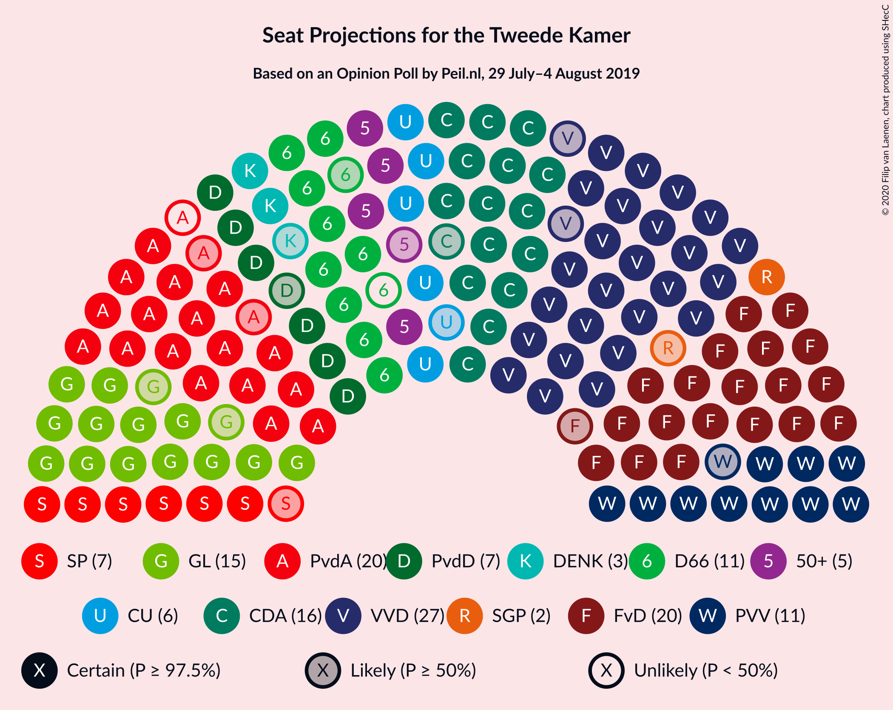
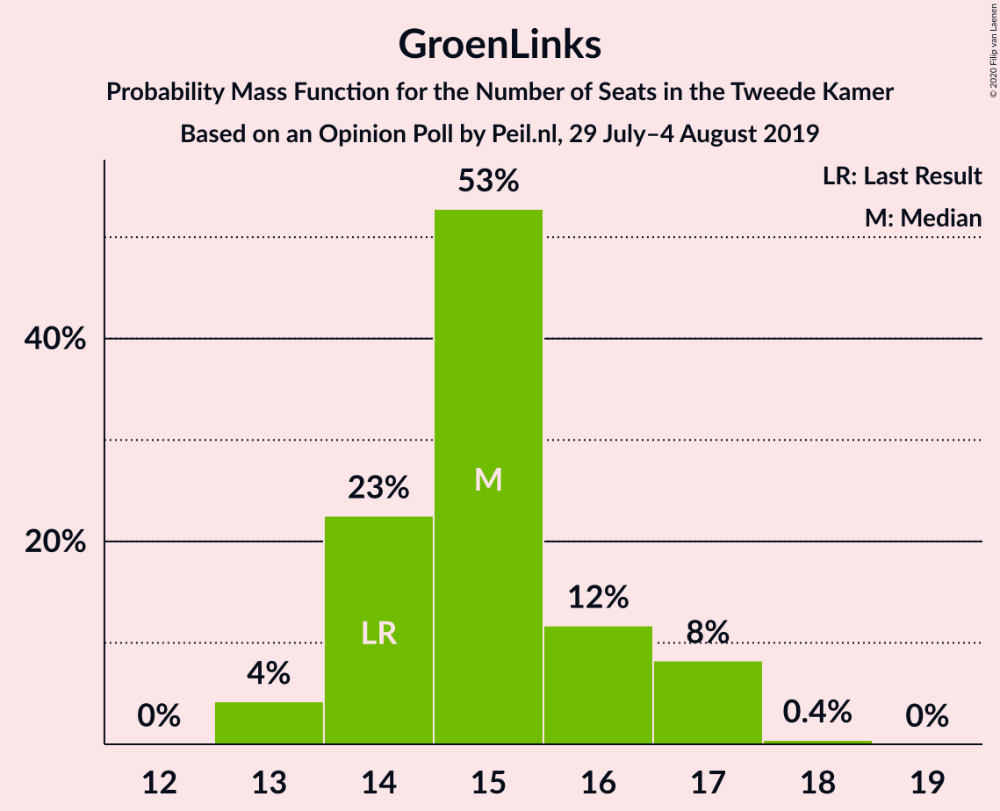
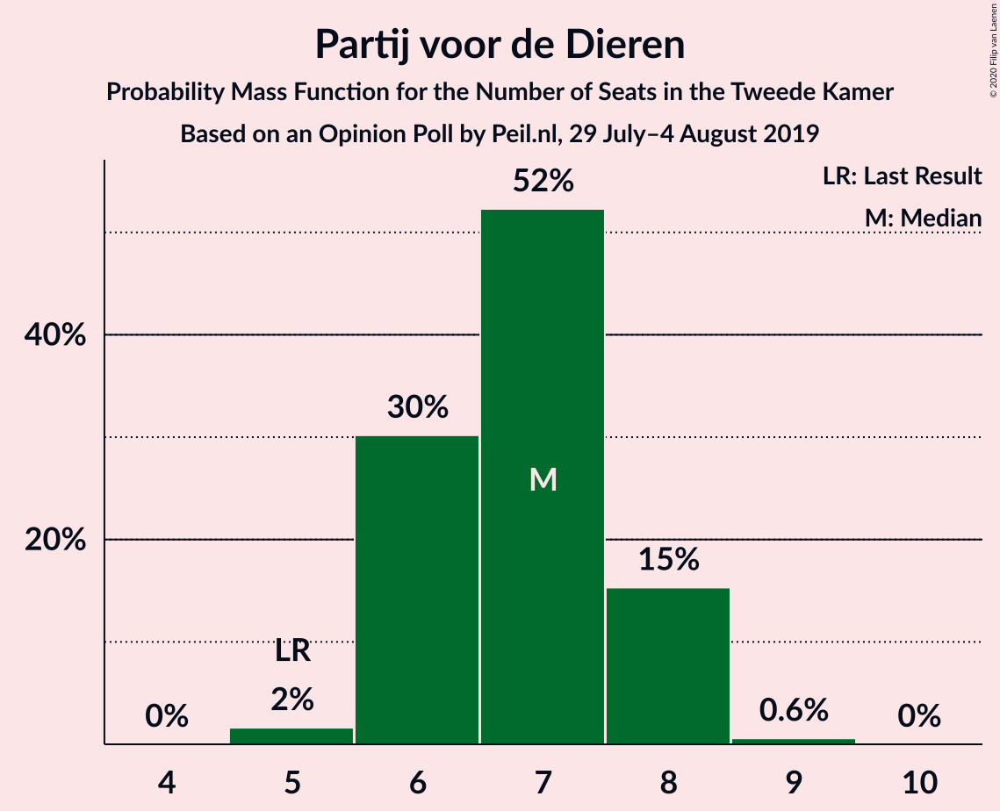
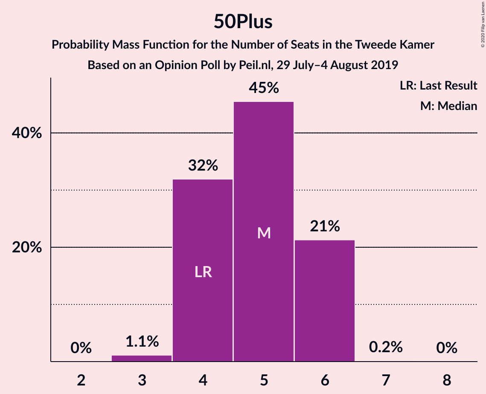
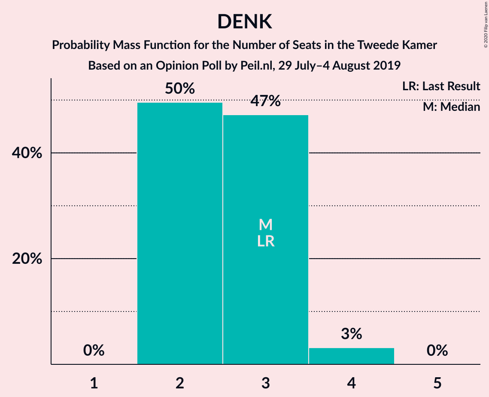
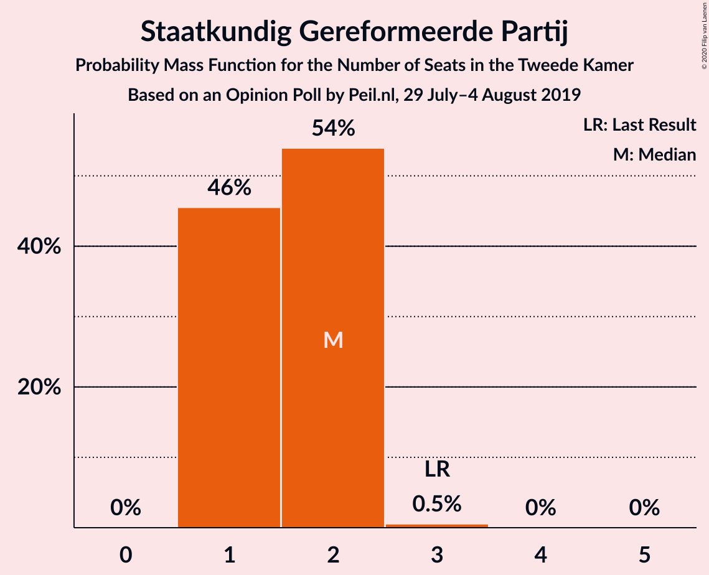
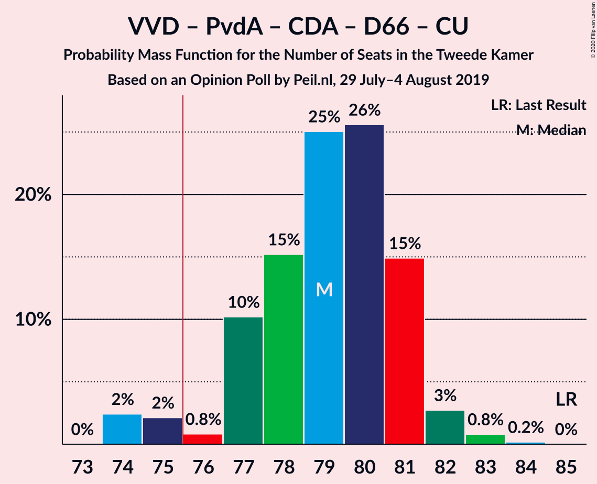
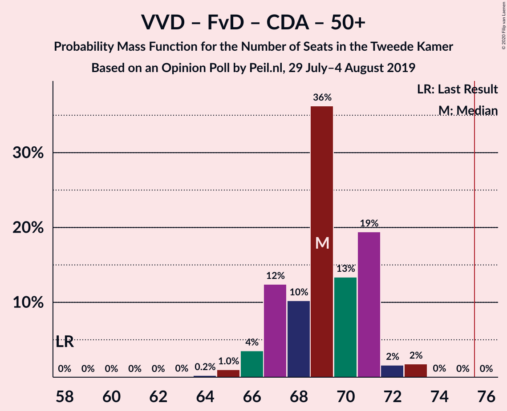
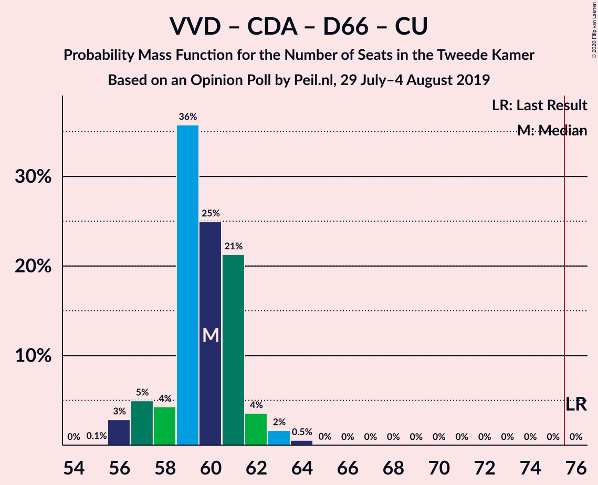

# Opinion Poll by Peil.nl, 29 July–4 August 2019

<a href="#voting-intentions">Voting Intentions</a> | <a href="#seats">Seats</a> | <a href="#coalitions">Coalitions</a> | <a href="#technical-information">Technical Information</a>

## Voting Intentions

### Confidence Intervals

| Party | Last Result | Poll Result | 80% Confidence Interval | 90% Confidence Interval | 95% Confidence Interval | 99% Confidence Interval |
|:-----:|:-----------:|:-----------:|:-----------------------:|:-----------------------:|:-----------------------:|:-----------------------:|
| Volkspartij voor Vrijheid en Democratie | 21.3% | 18.0% | 17.1–18.9% |16.9–19.2% |16.7–19.4% |16.2–19.9% |
| Forum voor Democratie | 1.8% | 13.3% | 12.6–14.2% |12.3–14.4% |12.2–14.6% |11.8–15.0% |
| Partij van de Arbeid | 5.7% | 12.7% | 11.9–13.5% |11.7–13.7% |11.5–13.9% |11.2–14.3% |
| Christen-Democratisch Appèl | 12.4% | 10.7% | 10.0–11.4% |9.8–11.6% |9.6–11.8% |9.3–12.2% |
| GroenLinks | 9.1% | 10.0% | 9.3–10.7% |9.1–10.9% |9.0–11.1% |8.7–11.5% |
| Partij voor de Vrijheid | 13.1% | 7.3% | 6.8–8.0% |6.6–8.2% |6.4–8.3% |6.2–8.6% |
| Democraten 66 | 12.2% | 6.7% | 6.1–7.3% |6.0–7.5% |5.8–7.6% |5.6–7.9% |
| Socialistische Partij | 9.1% | 4.7% | 4.2–5.2% |4.1–5.3% |4.0–5.5% |3.7–5.8% |
| Partij voor de Dieren | 3.2% | 4.7% | 4.2–5.2% |4.1–5.3% |4.0–5.5% |3.7–5.8% |
| ChristenUnie | 3.4% | 4.0% | 3.6–4.5% |3.4–4.6% |3.4–4.8% |3.2–5.0% |
| 50Plus | 3.1% | 3.3% | 2.9–3.8% |2.8–3.9% |2.7–4.0% |2.6–4.3% |
| DENK | 2.1% | 2.0% | 1.7–2.4% |1.6–2.5% |1.6–2.6% |1.4–2.8% |
| Staatkundig Gereformeerde Partij | 2.1% | 1.3% | 1.1–1.6% |1.0–1.7% |1.0–1.8% |0.9–2.0% |

*Note:* The poll result column reflects the actual value used in the calculations. Published results may vary slightly, and in addition be rounded to fewer digits.

## Seats

### Confidence Intervals

| Party | Last Result | Median | 80% Confidence Interval | 90% Confidence Interval | 95% Confidence Interval | 99% Confidence Interval |
|:-----:|:-----------:|:------:|:-----------------------:|:-----------------------:|:-----------------------:|:-----------------------:|
| <a href="#volkspartij-voor-vrijheid-en-democratie">Volkspartij voor Vrijheid en Democratie</a> | 33 | 27 | 27–28 |27–29 |26–29 |24–30 |
| <a href="#forum-voor-democratie">Forum voor Democratie</a> | 2 | 22 | 19–22 |19–22 |18–22 |18–23 |
| <a href="#partij-van-de-arbeid">Partij van de Arbeid</a> | 9 | 17 | 17–20 |17–20 |17–20 |17–21 |
| <a href="#christen-democratisch-appèl">Christen-Democratisch Appèl</a> | 19 | 15 | 15–16 |14–17 |14–17 |14–18 |
| <a href="#groenlinks">GroenLinks</a> | 14 | 16 | 14–17 |14–17 |14–17 |14–17 |
| <a href="#partij-voor-de-vrijheid">Partij voor de Vrijheid</a> | 20 | 12 | 11–12 |10–12 |10–12 |10–12 |
| <a href="#democraten-66">Democraten 66</a> | 19 | 10 | 9–10 |9–11 |8–11 |8–12 |
| <a href="#socialistische-partij">Socialistische Partij</a> | 14 | 8 | 6–8 |6–8 |6–9 |5–9 |
| <a href="#partij-voor-de-dieren">Partij voor de Dieren</a> | 5 | 8 | 5–8 |5–8 |5–8 |5–8 |
| <a href="#christenunie">ChristenUnie</a> | 5 | 5 | 5–6 |5–7 |5–7 |5–7 |
| <a href="#50plus">50Plus</a> | 4 | 5 | 5–6 |5–6 |4–6 |4–7 |
| <a href="#denk">DENK</a> | 3 | 2 | 2–3 |2–3 |2–4 |2–4 |
| <a href="#staatkundig-gereformeerde-partij">Staatkundig Gereformeerde Partij</a> | 3 | 2 | 1–2 |1–2 |1–2 |1–2 |

### Volkspartij voor Vrijheid en Democratie

*For a full overview of the results for this party, see the [Volkspartij voor Vrijheid en Democratie](party-volkspartijvoorvrijheidendemocratie.html) page.*

| Number of Seats | Probability | Accumulated | Special Marks |
|:---------------:|:-----------:|:-----------:|:-------------:|
| 23 | 0.1% | 100% |  |
| 24 | 0.4% | 99.9% |  |
| 25 | 0% | 99.4% |  |
| 26 | 3% | 99.4% |  |
| 27 | 52% | 97% | Median |
| 28 | 38% | 45% |  |
| 29 | 5% | 7% |  |
| 30 | 2% | 2% |  |
| 31 | 0.1% | 0.1% |  |
| 32 | 0% | 0% |  |
| 33 | 0% | 0% | Last Result |

### Forum voor Democratie

*For a full overview of the results for this party, see the [Forum voor Democratie](party-forumvoordemocratie.html) page.*

| Number of Seats | Probability | Accumulated | Special Marks |
|:---------------:|:-----------:|:-----------:|:-------------:|
| 2 | 0% | 100% | Last Result |
| 3 | 0% | 100% |  |
| 4 | 0% | 100% |  |
| 5 | 0% | 100% |  |
| 6 | 0% | 100% |  |
| 7 | 0% | 100% |  |
| 8 | 0% | 100% |  |
| 9 | 0% | 100% |  |
| 10 | 0% | 100% |  |
| 11 | 0% | 100% |  |
| 12 | 0% | 100% |  |
| 13 | 0% | 100% |  |
| 14 | 0% | 100% |  |
| 15 | 0% | 100% |  |
| 16 | 0% | 100% |  |
| 17 | 0% | 100% |  |
| 18 | 3% | 100% |  |
| 19 | 8% | 97% |  |
| 20 | 27% | 89% |  |
| 21 | 6% | 62% |  |
| 22 | 54% | 56% | Median |
| 23 | 2% | 2% |  |
| 24 | 0% | 0% |  |

### Partij van de Arbeid

*For a full overview of the results for this party, see the [Partij van de Arbeid](party-partijvandearbeid.html) page.*

| Number of Seats | Probability | Accumulated | Special Marks |
|:---------------:|:-----------:|:-----------:|:-------------:|
| 9 | 0% | 100% | Last Result |
| 10 | 0% | 100% |  |
| 11 | 0% | 100% |  |
| 12 | 0% | 100% |  |
| 13 | 0% | 100% |  |
| 14 | 0% | 100% |  |
| 15 | 0% | 100% |  |
| 16 | 0% | 100% |  |
| 17 | 52% | 100% | Median |
| 18 | 8% | 48% |  |
| 19 | 10% | 40% |  |
| 20 | 29% | 30% |  |
| 21 | 0.5% | 0.8% |  |
| 22 | 0% | 0.3% |  |
| 23 | 0.3% | 0.3% |  |
| 24 | 0% | 0% |  |

### Christen-Democratisch Appèl

*For a full overview of the results for this party, see the [Christen-Democratisch Appèl](party-christen-democratischappèl.html) page.*

| Number of Seats | Probability | Accumulated | Special Marks |
|:---------------:|:-----------:|:-----------:|:-------------:|
| 13 | 0.1% | 100% |  |
| 14 | 6% | 99.9% |  |
| 15 | 53% | 94% | Median |
| 16 | 33% | 42% |  |
| 17 | 7% | 8% |  |
| 18 | 1.3% | 1.4% |  |
| 19 | 0.1% | 0.1% | Last Result |
| 20 | 0% | 0% |  |

### GroenLinks

*For a full overview of the results for this party, see the [GroenLinks](party-groenlinks.html) page.*

| Number of Seats | Probability | Accumulated | Special Marks |
|:---------------:|:-----------:|:-----------:|:-------------:|
| 13 | 0.4% | 100% |  |
| 14 | 32% | 99.6% | Last Result |
| 15 | 2% | 68% |  |
| 16 | 54% | 66% | Median |
| 17 | 12% | 12% |  |
| 18 | 0% | 0% |  |

### Partij voor de Vrijheid

*For a full overview of the results for this party, see the [Partij voor de Vrijheid](party-partijvoordevrijheid.html) page.*

| Number of Seats | Probability | Accumulated | Special Marks |
|:---------------:|:-----------:|:-----------:|:-------------:|
| 9 | 0.2% | 100% |  |
| 10 | 6% | 99.8% |  |
| 11 | 12% | 94% |  |
| 12 | 82% | 82% | Median |
| 13 | 0.2% | 0.2% |  |
| 14 | 0% | 0% |  |
| 15 | 0% | 0% |  |
| 16 | 0% | 0% |  |
| 17 | 0% | 0% |  |
| 18 | 0% | 0% |  |
| 19 | 0% | 0% |  |
| 20 | 0% | 0% | Last Result |

### Democraten 66

*For a full overview of the results for this party, see the [Democraten 66](party-democraten66.html) page.*

| Number of Seats | Probability | Accumulated | Special Marks |
|:---------------:|:-----------:|:-----------:|:-------------:|
| 8 | 4% | 100% |  |
| 9 | 8% | 96% |  |
| 10 | 79% | 89% | Median |
| 11 | 9% | 10% |  |
| 12 | 0.6% | 0.6% |  |
| 13 | 0% | 0% |  |
| 14 | 0% | 0% |  |
| 15 | 0% | 0% |  |
| 16 | 0% | 0% |  |
| 17 | 0% | 0% |  |
| 18 | 0% | 0% |  |
| 19 | 0% | 0% | Last Result |

### Socialistische Partij

*For a full overview of the results for this party, see the [Socialistische Partij](party-socialistischepartij.html) page.*

| Number of Seats | Probability | Accumulated | Special Marks |
|:---------------:|:-----------:|:-----------:|:-------------:|
| 5 | 0.6% | 100% |  |
| 6 | 11% | 99.4% |  |
| 7 | 30% | 88% |  |
| 8 | 56% | 59% | Median |
| 9 | 3% | 3% |  |
| 10 | 0% | 0% |  |
| 11 | 0% | 0% |  |
| 12 | 0% | 0% |  |
| 13 | 0% | 0% |  |
| 14 | 0% | 0% | Last Result |

### Partij voor de Dieren

*For a full overview of the results for this party, see the [Partij voor de Dieren](party-partijvoordedieren.html) page.*

| Number of Seats | Probability | Accumulated | Special Marks |
|:---------------:|:-----------:|:-----------:|:-------------:|
| 5 | 28% | 100% | Last Result |
| 6 | 4% | 72% |  |
| 7 | 10% | 68% |  |
| 8 | 57% | 58% | Median |
| 9 | 0.2% | 0.2% |  |
| 10 | 0% | 0% |  |

### ChristenUnie

*For a full overview of the results for this party, see the [ChristenUnie](party-christenunie.html) page.*

| Number of Seats | Probability | Accumulated | Special Marks |
|:---------------:|:-----------:|:-----------:|:-------------:|
| 5 | 60% | 100% | Last Result, Median |
| 6 | 34% | 40% |  |
| 7 | 6% | 6% |  |
| 8 | 0.2% | 0.2% |  |
| 9 | 0% | 0% |  |

### 50Plus

*For a full overview of the results for this party, see the [50Plus](party-50plus.html) page.*

| Number of Seats | Probability | Accumulated | Special Marks |
|:---------------:|:-----------:|:-----------:|:-------------:|
| 3 | 0.5% | 100% |  |
| 4 | 3% | 99.5% | Last Result |
| 5 | 67% | 97% | Median |
| 6 | 29% | 30% |  |
| 7 | 1.0% | 1.0% |  |
| 8 | 0% | 0% |  |

### DENK

*For a full overview of the results for this party, see the [DENK](party-denk.html) page.*

| Number of Seats | Probability | Accumulated | Special Marks |
|:---------------:|:-----------:|:-----------:|:-------------:|
| 1 | 0.3% | 100% |  |
| 2 | 63% | 99.7% | Median |
| 3 | 34% | 37% | Last Result |
| 4 | 3% | 3% |  |
| 5 | 0% | 0% |  |

### Staatkundig Gereformeerde Partij

*For a full overview of the results for this party, see the [Staatkundig Gereformeerde Partij](party-staatkundiggereformeerdepartij.html) page.*

| Number of Seats | Probability | Accumulated | Special Marks |
|:---------------:|:-----------:|:-----------:|:-------------:|
| 1 | 14% | 100% |  |
| 2 | 86% | 86% | Median |
| 3 | 0.1% | 0.1% | Last Result |
| 4 | 0% | 0% |  |

## Coalitions

### Confidence Intervals

| Coalition | Last Result | Median | Majority? | 80% Confidence Interval | 90% Confidence Interval | 95% Confidence Interval | 99% Confidence Interval |
|:---------:|:-----------:|:------:|:---------:|:-----------------------:|:-----------------------:|:-----------------------:|:-----------------------:|
| Volkspartij voor Vrijheid en Democratie – Partij van de Arbeid – Christen-Democratisch Appèl – Democraten 66 – ChristenUnie | 85 | 74 | 49% | 74–80 | 74–80 | 74–81 | 74–81 |
| Volkspartij voor Vrijheid en Democratie – Christen-Democratisch Appèl – GroenLinks – Democraten 66 – ChristenUnie | 90 | 73 | 10% | 73–75 | 73–79 | 73–79 | 72–79 |
| Volkspartij voor Vrijheid en Democratie – Forum voor Democratie – Christen-Democratisch Appèl – Partij voor de Vrijheid | 74 | 76 | 82% | 74–76 | 74–77 | 74–78 | 71–79 |
| Volkspartij voor Vrijheid en Democratie – Forum voor Democratie – Christen-Democratisch Appèl – 50Plus – Staatkundig Gereformeerde Partij | 61 | 71 | 0.2% | 70–72 | 69–73 | 69–73 | 66–75 |
| Volkspartij voor Vrijheid en Democratie – Forum voor Democratie – Christen-Democratisch Appèl – 50Plus | 58 | 69 | 0% | 68–70 | 68–72 | 67–72 | 64–73 |
| Volkspartij voor Vrijheid en Democratie – Forum voor Democratie – Christen-Democratisch Appèl – Staatkundig Gereformeerde Partij | 57 | 66 | 0% | 64–66 | 64–68 | 64–69 | 62–70 |
| Volkspartij voor Vrijheid en Democratie – Forum voor Democratie – Christen-Democratisch Appèl | 54 | 64 | 0% | 63–64 | 63–67 | 62–68 | 60–68 |
| Volkspartij voor Vrijheid en Democratie – Partij van de Arbeid – Christen-Democratisch Appèl | 61 | 59 | 0% | 59–64 | 59–64 | 59–65 | 59–66 |
| Volkspartij voor Vrijheid en Democratie – Christen-Democratisch Appèl – Democraten 66 – ChristenUnie | 76 | 57 | 0% | 57–61 | 57–62 | 56–62 | 56–62 |
| Volkspartij voor Vrijheid en Democratie – Partij van de Arbeid – Democraten 66 | 61 | 54 | 0% | 54–58 | 54–58 | 54–59 | 54–60 |
| Volkspartij voor Vrijheid en Democratie – Christen-Democratisch Appèl – Partij voor de Vrijheid | 72 | 54 | 0% | 54–56 | 53–57 | 53–57 | 51–58 |
| Volkspartij voor Vrijheid en Democratie – Christen-Democratisch Appèl – Democraten 66 | 71 | 52 | 0% | 52–55 | 52–56 | 51–56 | 50–57 |
| Volkspartij voor Vrijheid en Democratie – Partij van de Arbeid | 42 | 44 | 0% | 44–48 | 44–48 | 44–48 | 43–50 |
| Partij van de Arbeid – Christen-Democratisch Appèl – Democraten 66 | 47 | 42 | 0% | 42–46 | 42–46 | 42–46 | 42–47 |
| Volkspartij voor Vrijheid en Democratie – Christen-Democratisch Appèl | 52 | 42 | 0% | 42–44 | 42–45 | 42–46 | 39–47 |
| Partij van de Arbeid – Christen-Democratisch Appèl – ChristenUnie | 33 | 37 | 0% | 37–42 | 37–42 | 37–42 | 37–43 |
| Partij van de Arbeid – Christen-Democratisch Appèl | 28 | 32 | 0% | 32–36 | 32–36 | 32–36 | 32–37 |
| Christen-Democratisch Appèl – Democraten 66 | 38 | 25 | 0% | 25–27 | 24–27 | 23–27 | 23–29 |

### Volkspartij voor Vrijheid en Democratie – Partij van de Arbeid – Christen-Democratisch Appèl – Democraten 66 – ChristenUnie

| Number of Seats | Probability | Accumulated | Special Marks |
|:---------------:|:-----------:|:-----------:|:-------------:|
| 74 | 51% | 100% | Median |
| 75 | 0.1% | 49% |  |
| 76 | 5% | 49% | Majority |
| 77 | 3% | 43% |  |
| 78 | 4% | 40% |  |
| 79 | 1.0% | 36% |  |
| 80 | 32% | 36% |  |
| 81 | 3% | 3% |  |
| 82 | 0.2% | 0.2% |  |
| 83 | 0.1% | 0.1% |  |
| 84 | 0% | 0% |  |
| 85 | 0% | 0% | Last Result |

### Volkspartij voor Vrijheid en Democratie – Christen-Democratisch Appèl – GroenLinks – Democraten 66 – ChristenUnie

| Number of Seats | Probability | Accumulated | Special Marks |
|:---------------:|:-----------:|:-----------:|:-------------:|
| 71 | 0.3% | 100% |  |
| 72 | 0.5% | 99.7% |  |
| 73 | 58% | 99.2% | Median |
| 74 | 28% | 41% |  |
| 75 | 3% | 13% |  |
| 76 | 3% | 10% | Majority |
| 77 | 1.2% | 7% |  |
| 78 | 0.3% | 6% |  |
| 79 | 6% | 6% |  |
| 80 | 0% | 0% |  |
| 81 | 0% | 0% |  |
| 82 | 0% | 0% |  |
| 83 | 0% | 0% |  |
| 84 | 0% | 0% |  |
| 85 | 0% | 0% |  |
| 86 | 0% | 0% |  |
| 87 | 0% | 0% |  |
| 88 | 0% | 0% |  |
| 89 | 0% | 0% |  |
| 90 | 0% | 0% | Last Result |

### Volkspartij voor Vrijheid en Democratie – Forum voor Democratie – Christen-Democratisch Appèl – Partij voor de Vrijheid

| Number of Seats | Probability | Accumulated | Special Marks |
|:---------------:|:-----------:|:-----------:|:-------------:|
| 71 | 0.7% | 100% |  |
| 72 | 0.1% | 99.3% |  |
| 73 | 1.2% | 99.1% |  |
| 74 | 13% | 98% | Last Result |
| 75 | 3% | 85% |  |
| 76 | 76% | 82% | Median, Majority |
| 77 | 3% | 7% |  |
| 78 | 2% | 3% |  |
| 79 | 0.8% | 1.2% |  |
| 80 | 0.3% | 0.4% |  |
| 81 | 0.1% | 0.1% |  |
| 82 | 0% | 0% |  |

### Volkspartij voor Vrijheid en Democratie – Forum voor Democratie – Christen-Democratisch Appèl – 50Plus – Staatkundig Gereformeerde Partij

| Number of Seats | Probability | Accumulated | Special Marks |
|:---------------:|:-----------:|:-----------:|:-------------:|
| 61 | 0% | 100% | Last Result |
| 62 | 0% | 100% |  |
| 63 | 0% | 100% |  |
| 64 | 0% | 100% |  |
| 65 | 0.2% | 100% |  |
| 66 | 0.4% | 99.8% |  |
| 67 | 0% | 99.4% |  |
| 68 | 0.1% | 99.4% |  |
| 69 | 8% | 99.3% |  |
| 70 | 7% | 91% |  |
| 71 | 53% | 84% | Median |
| 72 | 26% | 31% |  |
| 73 | 3% | 5% |  |
| 74 | 1.3% | 2% |  |
| 75 | 0.3% | 0.5% |  |
| 76 | 0.2% | 0.2% | Majority |
| 77 | 0% | 0% |  |

### Volkspartij voor Vrijheid en Democratie – Forum voor Democratie – Christen-Democratisch Appèl – 50Plus

| Number of Seats | Probability | Accumulated | Special Marks |
|:---------------:|:-----------:|:-----------:|:-------------:|
| 58 | 0% | 100% | Last Result |
| 59 | 0% | 100% |  |
| 60 | 0% | 100% |  |
| 61 | 0% | 100% |  |
| 62 | 0% | 100% |  |
| 63 | 0% | 100% |  |
| 64 | 0.6% | 100% |  |
| 65 | 0% | 99.4% |  |
| 66 | 0.1% | 99.4% |  |
| 67 | 3% | 99.3% |  |
| 68 | 8% | 96% |  |
| 69 | 57% | 88% | Median |
| 70 | 25% | 31% |  |
| 71 | 0.6% | 6% |  |
| 72 | 4% | 5% |  |
| 73 | 1.3% | 2% |  |
| 74 | 0.2% | 0.2% |  |
| 75 | 0% | 0% |  |

### Volkspartij voor Vrijheid en Democratie – Forum voor Democratie – Christen-Democratisch Appèl – Staatkundig Gereformeerde Partij

| Number of Seats | Probability | Accumulated | Special Marks |
|:---------------:|:-----------:|:-----------:|:-------------:|
| 57 | 0% | 100% | Last Result |
| 58 | 0% | 100% |  |
| 59 | 0% | 100% |  |
| 60 | 0.1% | 100% |  |
| 61 | 0.1% | 99.9% |  |
| 62 | 0.4% | 99.8% |  |
| 63 | 0.2% | 99.4% |  |
| 64 | 12% | 99.2% |  |
| 65 | 4% | 87% |  |
| 66 | 76% | 83% | Median |
| 67 | 1.3% | 7% |  |
| 68 | 2% | 6% |  |
| 69 | 3% | 3% |  |
| 70 | 0.5% | 0.5% |  |
| 71 | 0% | 0% |  |

### Volkspartij voor Vrijheid en Democratie – Forum voor Democratie – Christen-Democratisch Appèl

| Number of Seats | Probability | Accumulated | Special Marks |
|:---------------:|:-----------:|:-----------:|:-------------:|
| 54 | 0% | 100% | Last Result |
| 55 | 0% | 100% |  |
| 56 | 0% | 100% |  |
| 57 | 0% | 100% |  |
| 58 | 0% | 100% |  |
| 59 | 0.2% | 100% |  |
| 60 | 0.4% | 99.8% |  |
| 61 | 0.2% | 99.4% |  |
| 62 | 3% | 99.2% |  |
| 63 | 13% | 96% |  |
| 64 | 76% | 83% | Median |
| 65 | 0.9% | 7% |  |
| 66 | 0.9% | 6% |  |
| 67 | 2% | 5% |  |
| 68 | 3% | 3% |  |
| 69 | 0% | 0% |  |

### Volkspartij voor Vrijheid en Democratie – Partij van de Arbeid – Christen-Democratisch Appèl

| Number of Seats | Probability | Accumulated | Special Marks |
|:---------------:|:-----------:|:-----------:|:-------------:|
| 58 | 0.4% | 100% |  |
| 59 | 51% | 99.6% | Median |
| 60 | 2% | 48% |  |
| 61 | 0.2% | 47% | Last Result |
| 62 | 12% | 46% |  |
| 63 | 0.5% | 35% |  |
| 64 | 31% | 34% |  |
| 65 | 2% | 3% |  |
| 66 | 0.9% | 1.1% |  |
| 67 | 0% | 0.1% |  |
| 68 | 0.1% | 0.1% |  |
| 69 | 0% | 0% |  |

### Volkspartij voor Vrijheid en Democratie – Christen-Democratisch Appèl – Democraten 66 – ChristenUnie

| Number of Seats | Probability | Accumulated | Special Marks |
|:---------------:|:-----------:|:-----------:|:-------------:|
| 55 | 0.1% | 100% |  |
| 56 | 4% | 99.9% |  |
| 57 | 52% | 96% | Median |
| 58 | 4% | 44% |  |
| 59 | 4% | 40% |  |
| 60 | 26% | 36% |  |
| 61 | 1.1% | 10% |  |
| 62 | 9% | 9% |  |
| 63 | 0.1% | 0.3% |  |
| 64 | 0.2% | 0.2% |  |
| 65 | 0% | 0% |  |
| 66 | 0% | 0% |  |
| 67 | 0% | 0% |  |
| 68 | 0% | 0% |  |
| 69 | 0% | 0% |  |
| 70 | 0% | 0% |  |
| 71 | 0% | 0% |  |
| 72 | 0% | 0% |  |
| 73 | 0% | 0% |  |
| 74 | 0% | 0% |  |
| 75 | 0% | 0% |  |
| 76 | 0% | 0% | Last Result, Majority |

### Volkspartij voor Vrijheid en Democratie – Partij van de Arbeid – Democraten 66

| Number of Seats | Probability | Accumulated | Special Marks |
|:---------------:|:-----------:|:-----------:|:-------------:|
| 53 | 0.2% | 100% |  |
| 54 | 54% | 99.8% | Median |
| 55 | 3% | 46% |  |
| 56 | 2% | 43% |  |
| 57 | 11% | 41% |  |
| 58 | 25% | 30% |  |
| 59 | 4% | 4% |  |
| 60 | 0.6% | 0.7% |  |
| 61 | 0.1% | 0.1% | Last Result |
| 62 | 0% | 0% |  |

### Volkspartij voor Vrijheid en Democratie – Christen-Democratisch Appèl – Partij voor de Vrijheid

| Number of Seats | Probability | Accumulated | Special Marks |
|:---------------:|:-----------:|:-----------:|:-------------:|
| 50 | 0.4% | 100% |  |
| 51 | 0.2% | 99.6% |  |
| 52 | 0.7% | 99.4% |  |
| 53 | 6% | 98.7% |  |
| 54 | 51% | 93% | Median |
| 55 | 10% | 42% |  |
| 56 | 25% | 31% |  |
| 57 | 5% | 6% |  |
| 58 | 0.9% | 0.9% |  |
| 59 | 0% | 0% |  |
| 60 | 0% | 0% |  |
| 61 | 0% | 0% |  |
| 62 | 0% | 0% |  |
| 63 | 0% | 0% |  |
| 64 | 0% | 0% |  |
| 65 | 0% | 0% |  |
| 66 | 0% | 0% |  |
| 67 | 0% | 0% |  |
| 68 | 0% | 0% |  |
| 69 | 0% | 0% |  |
| 70 | 0% | 0% |  |
| 71 | 0% | 0% |  |
| 72 | 0% | 0% | Last Result |

### Volkspartij voor Vrijheid en Democratie – Christen-Democratisch Appèl – Democraten 66

| Number of Seats | Probability | Accumulated | Special Marks |
|:---------------:|:-----------:|:-----------:|:-------------:|
| 49 | 0.1% | 100% |  |
| 50 | 0.5% | 99.9% |  |
| 51 | 4% | 99.4% |  |
| 52 | 55% | 95% | Median |
| 53 | 3% | 40% |  |
| 54 | 26% | 37% |  |
| 55 | 6% | 11% |  |
| 56 | 4% | 5% |  |
| 57 | 1.3% | 1.4% |  |
| 58 | 0.1% | 0.1% |  |
| 59 | 0% | 0% |  |
| 60 | 0% | 0% |  |
| 61 | 0% | 0% |  |
| 62 | 0% | 0% |  |
| 63 | 0% | 0% |  |
| 64 | 0% | 0% |  |
| 65 | 0% | 0% |  |
| 66 | 0% | 0% |  |
| 67 | 0% | 0% |  |
| 68 | 0% | 0% |  |
| 69 | 0% | 0% |  |
| 70 | 0% | 0% |  |
| 71 | 0% | 0% | Last Result |

### Volkspartij voor Vrijheid en Democratie – Partij van de Arbeid

| Number of Seats | Probability | Accumulated | Special Marks |
|:---------------:|:-----------:|:-----------:|:-------------:|
| 42 | 0% | 100% | Last Result |
| 43 | 0.6% | 100% |  |
| 44 | 51% | 99.4% | Median |
| 45 | 3% | 48% |  |
| 46 | 7% | 45% |  |
| 47 | 4% | 39% |  |
| 48 | 32% | 34% |  |
| 49 | 2% | 2% |  |
| 50 | 0.5% | 0.6% |  |
| 51 | 0.1% | 0.2% |  |
| 52 | 0% | 0% |  |

### Partij van de Arbeid – Christen-Democratisch Appèl – Democraten 66

| Number of Seats | Probability | Accumulated | Special Marks |
|:---------------:|:-----------:|:-----------:|:-------------:|
| 42 | 52% | 100% | Median |
| 43 | 6% | 48% |  |
| 44 | 3% | 42% |  |
| 45 | 8% | 38% |  |
| 46 | 28% | 30% |  |
| 47 | 2% | 2% | Last Result |
| 48 | 0.1% | 0.4% |  |
| 49 | 0.3% | 0.3% |  |
| 50 | 0% | 0% |  |

### Volkspartij voor Vrijheid en Democratie – Christen-Democratisch Appèl

| Number of Seats | Probability | Accumulated | Special Marks |
|:---------------:|:-----------:|:-----------:|:-------------:|
| 39 | 0.6% | 100% |  |
| 40 | 0% | 99.4% |  |
| 41 | 0.5% | 99.4% |  |
| 42 | 57% | 98.9% | Median |
| 43 | 2% | 42% |  |
| 44 | 30% | 40% |  |
| 45 | 7% | 10% |  |
| 46 | 1.3% | 3% |  |
| 47 | 2% | 2% |  |
| 48 | 0% | 0% |  |
| 49 | 0% | 0% |  |
| 50 | 0% | 0% |  |
| 51 | 0% | 0% |  |
| 52 | 0% | 0% | Last Result |

### Partij van de Arbeid – Christen-Democratisch Appèl – ChristenUnie

| Number of Seats | Probability | Accumulated | Special Marks |
|:---------------:|:-----------:|:-----------:|:-------------:|
| 33 | 0% | 100% | Last Result |
| 34 | 0% | 100% |  |
| 35 | 0% | 100% |  |
| 36 | 0% | 100% |  |
| 37 | 51% | 100% | Median |
| 38 | 2% | 49% |  |
| 39 | 5% | 47% |  |
| 40 | 0.8% | 42% |  |
| 41 | 10% | 42% |  |
| 42 | 31% | 31% |  |
| 43 | 0.3% | 0.6% |  |
| 44 | 0.3% | 0.3% |  |
| 45 | 0% | 0% |  |

### Partij van de Arbeid – Christen-Democratisch Appèl

| Number of Seats | Probability | Accumulated | Special Marks |
|:---------------:|:-----------:|:-----------:|:-------------:|
| 28 | 0% | 100% | Last Result |
| 29 | 0% | 100% |  |
| 30 | 0% | 100% |  |
| 31 | 0% | 100% |  |
| 32 | 53% | 100% | Median |
| 33 | 0.4% | 47% |  |
| 34 | 10% | 47% |  |
| 35 | 4% | 37% |  |
| 36 | 32% | 33% |  |
| 37 | 0.7% | 1.1% |  |
| 38 | 0.2% | 0.4% |  |
| 39 | 0.3% | 0.3% |  |
| 40 | 0% | 0% |  |

### Christen-Democratisch Appèl – Democraten 66

| Number of Seats | Probability | Accumulated | Special Marks |
|:---------------:|:-----------:|:-----------:|:-------------:|
| 23 | 4% | 100% |  |
| 24 | 3% | 96% |  |
| 25 | 54% | 93% | Median |
| 26 | 29% | 39% |  |
| 27 | 8% | 10% |  |
| 28 | 1.5% | 2% |  |
| 29 | 0.5% | 0.5% |  |
| 30 | 0% | 0% |  |
| 31 | 0% | 0% |  |
| 32 | 0% | 0% |  |
| 33 | 0% | 0% |  |
| 34 | 0% | 0% |  |
| 35 | 0% | 0% |  |
| 36 | 0% | 0% |  |
| 37 | 0% | 0% |  |
| 38 | 0% | 0% | Last Result |

## Technical Information

### Opinion Poll

+ **Polling firm:** Peil.nl
+ **Commissioner(s):** —
+ **Fieldwork period:** 29 July–4 August 2019

### Calculations

+ **Sample size:** 3000
+ **Simulations done:** 65,536
+ **Error estimate:** 1.78%

