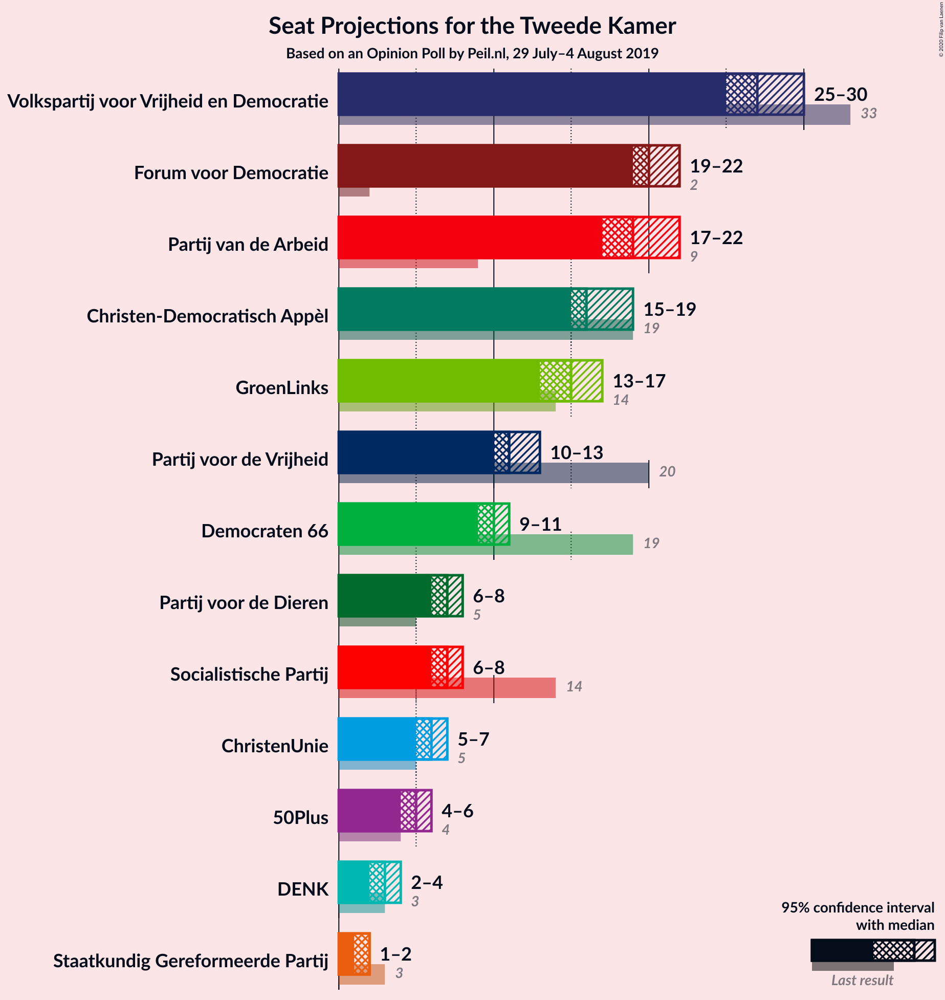
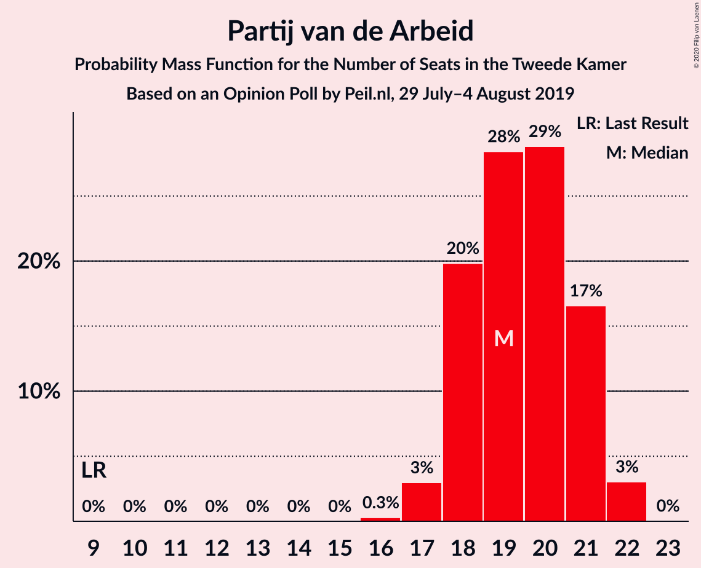
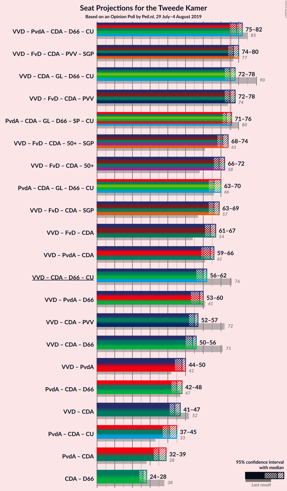
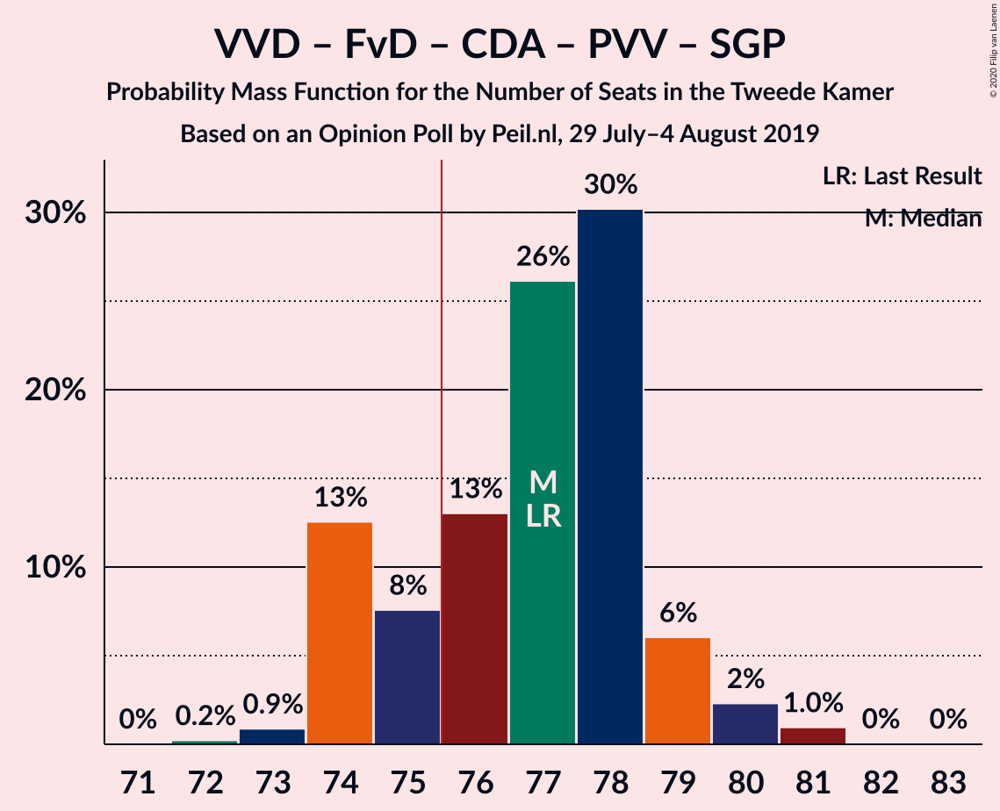
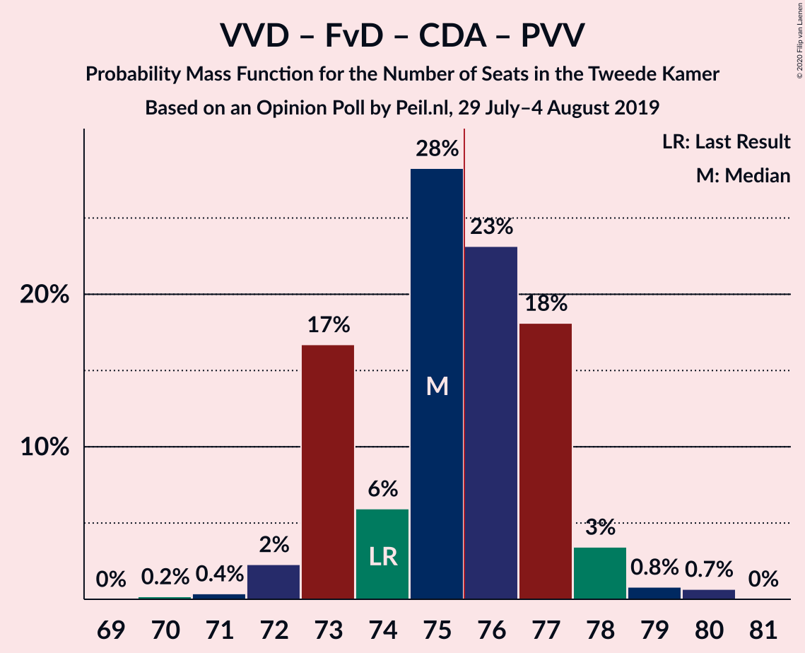
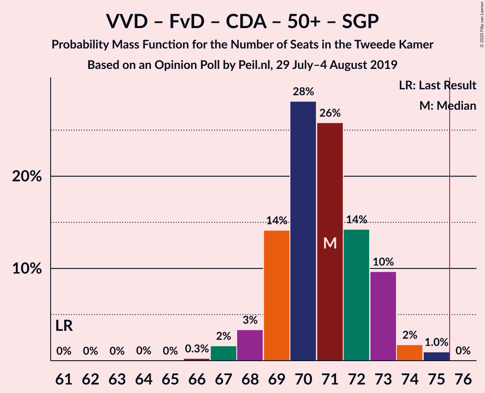
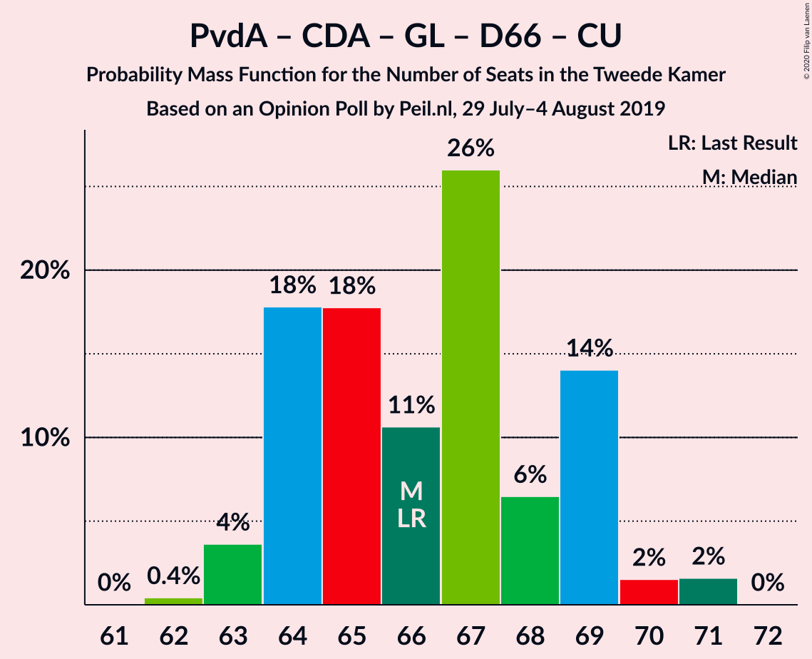
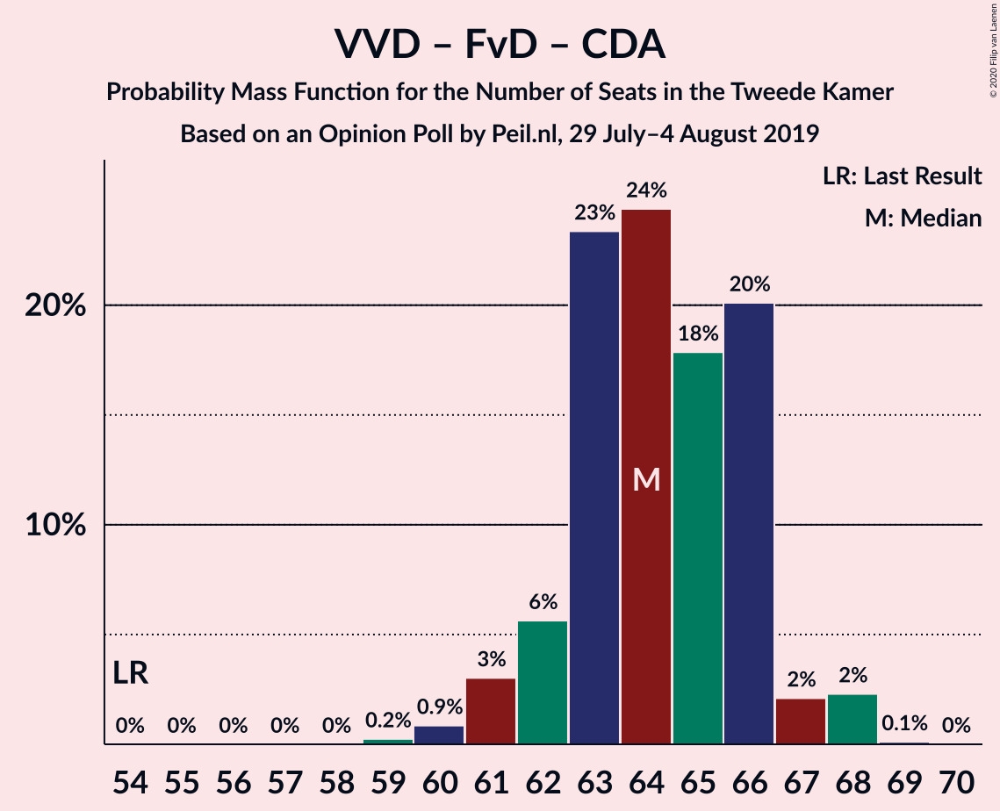
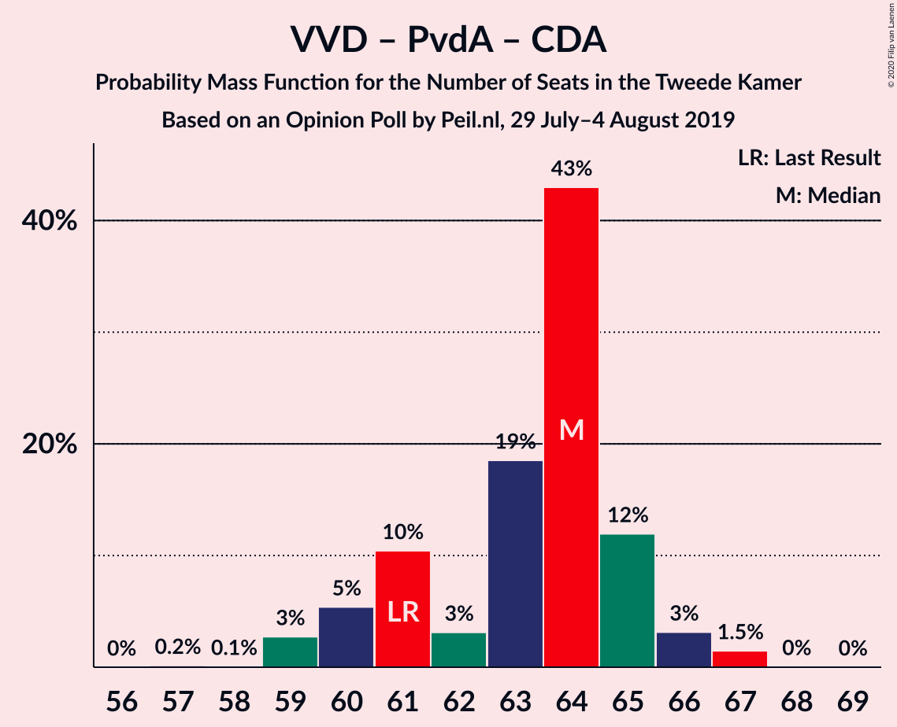
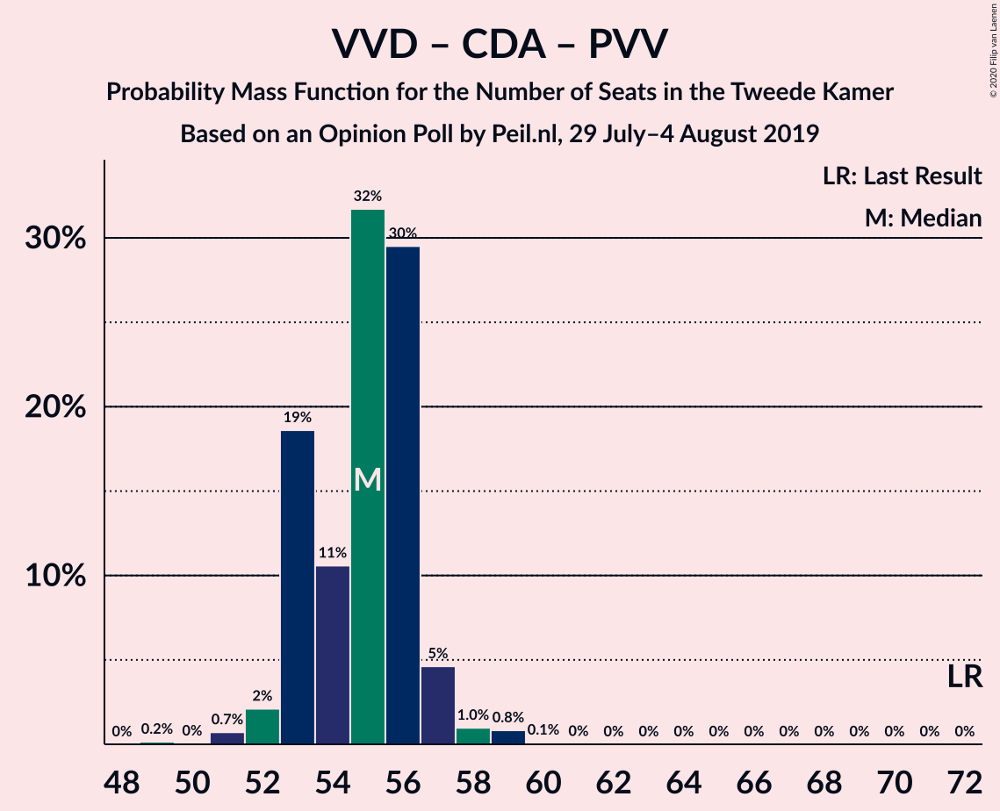

# Opinion Poll by Peil.nl, 29 July–4 August 2019

<a href="#voting-intentions">Voting Intentions</a> | <a href="#seats">Seats</a> | <a href="#coalitions">Coalitions</a> | <a href="#technical-information">Technical Information</a>

## Voting Intentions

### Confidence Intervals

| Party | Last Result | Poll Result | 80% Confidence Interval | 90% Confidence Interval | 95% Confidence Interval | 99% Confidence Interval |
|:-----:|:-----------:|:-----------:|:-----------------------:|:-----------------------:|:-----------------------:|:-----------------------:|
| Volkspartij voor Vrijheid en Democratie | 21.3% | 18.0% | 17.1–18.9% |16.9–19.2% |16.7–19.4% |16.2–19.9% |
| Forum voor Democratie | 1.8% | 13.3% | 12.6–14.2% |12.3–14.4% |12.2–14.6% |11.8–15.0% |
| Partij van de Arbeid | 5.7% | 12.7% | 11.9–13.5% |11.7–13.7% |11.5–13.9% |11.2–14.3% |
| Christen-Democratisch Appèl | 12.4% | 10.7% | 10.0–11.4% |9.8–11.6% |9.6–11.8% |9.3–12.2% |
| GroenLinks | 9.1% | 10.0% | 9.3–10.7% |9.1–10.9% |9.0–11.1% |8.7–11.5% |
| Partij voor de Vrijheid | 13.1% | 7.3% | 6.8–8.0% |6.6–8.2% |6.4–8.3% |6.2–8.6% |
| Democraten 66 | 12.2% | 6.7% | 6.1–7.3% |6.0–7.5% |5.8–7.6% |5.6–7.9% |
| Socialistische Partij | 9.1% | 4.7% | 4.2–5.2% |4.1–5.3% |4.0–5.5% |3.7–5.8% |
| Partij voor de Dieren | 3.2% | 4.7% | 4.2–5.2% |4.1–5.3% |4.0–5.5% |3.7–5.8% |
| ChristenUnie | 3.4% | 4.0% | 3.6–4.5% |3.4–4.6% |3.4–4.8% |3.2–5.0% |
| 50Plus | 3.1% | 3.3% | 2.9–3.8% |2.8–3.9% |2.7–4.0% |2.6–4.3% |
| DENK | 2.1% | 2.0% | 1.7–2.4% |1.6–2.5% |1.6–2.6% |1.4–2.8% |
| Staatkundig Gereformeerde Partij | 2.1% | 1.3% | 1.1–1.6% |1.0–1.7% |1.0–1.8% |0.9–2.0% |

*Note:* The poll result column reflects the actual value used in the calculations. Published results may vary slightly, and in addition be rounded to fewer digits.

## Seats

### Confidence Intervals

| Party | Last Result | Median | 80% Confidence Interval | 90% Confidence Interval | 95% Confidence Interval | 99% Confidence Interval |
|:-----:|:-----------:|:------:|:-----------------------:|:-----------------------:|:-----------------------:|:-----------------------:|
| <a href="#volkspartij-voor-vrijheid-en-democratie">Volkspartij voor Vrijheid en Democratie</a> | 33 | 27 | 26–30 |25–30 |25–30 |25–31 |
| <a href="#forum-voor-democratie">Forum voor Democratie</a> | 2 | 20 | 19–22 |19–22 |18–22 |18–22 |
| <a href="#partij-van-de-arbeid">Partij van de Arbeid</a> | 9 | 19 | 18–21 |17–21 |17–22 |16–22 |
| <a href="#christen-democratisch-appèl">Christen-Democratisch Appèl</a> | 19 | 16 | 15–18 |15–19 |14–19 |14–20 |
| <a href="#groenlinks">GroenLinks</a> | 14 | 15 | 14–17 |13–17 |13–17 |13–17 |
| <a href="#partij-voor-de-vrijheid">Partij voor de Vrijheid</a> | 20 | 11 | 10–12 |10–12 |10–12 |9–13 |
| <a href="#democraten-66">Democraten 66</a> | 19 | 10 | 9–11 |9–11 |9–11 |8–12 |
| <a href="#socialistische-partij">Socialistische Partij</a> | 14 | 7 | 6–8 |6–8 |6–8 |5–9 |
| <a href="#partij-voor-de-dieren">Partij voor de Dieren</a> | 5 | 7 | 6–8 |6–8 |5–8 |5–9 |
| <a href="#christenunie">ChristenUnie</a> | 5 | 6 | 5–7 |5–7 |5–7 |4–8 |
| <a href="#50plus">50Plus</a> | 4 | 5 | 4–6 |4–6 |4–6 |3–6 |
| <a href="#denk">DENK</a> | 3 | 2 | 2–3 |2–3 |2–3 |2–4 |
| <a href="#staatkundig-gereformeerde-partij">Staatkundig Gereformeerde Partij</a> | 3 | 1 | 1–2 |1–2 |1–2 |1–3 |

### Volkspartij voor Vrijheid en Democratie

*For a full overview of the results for this party, see the [Volkspartij voor Vrijheid en Democratie](party-volkspartijvoorvrijheidendemocratie.html) page.*

| Number of Seats | Probability | Accumulated | Special Marks |
|:---------------:|:-----------:|:-----------:|:-------------:|
| 23 | 0.3% | 100% |  |
| 24 | 0.1% | 99.7% |  |
| 25 | 6% | 99.6% |  |
| 26 | 23% | 94% |  |
| 27 | 40% | 71% | Median |
| 28 | 8% | 31% |  |
| 29 | 6% | 23% |  |
| 30 | 15% | 16% |  |
| 31 | 2% | 2% |  |
| 32 | 0% | 0% |  |
| 33 | 0% | 0% | Last Result |

### Forum voor Democratie

*For a full overview of the results for this party, see the [Forum voor Democratie](party-forumvoordemocratie.html) page.*

| Number of Seats | Probability | Accumulated | Special Marks |
|:---------------:|:-----------:|:-----------:|:-------------:|
| 2 | 0% | 100% | Last Result |
| 3 | 0% | 100% |  |
| 4 | 0% | 100% |  |
| 5 | 0% | 100% |  |
| 6 | 0% | 100% |  |
| 7 | 0% | 100% |  |
| 8 | 0% | 100% |  |
| 9 | 0% | 100% |  |
| 10 | 0% | 100% |  |
| 11 | 0% | 100% |  |
| 12 | 0% | 100% |  |
| 13 | 0% | 100% |  |
| 14 | 0% | 100% |  |
| 15 | 0% | 100% |  |
| 16 | 0% | 100% |  |
| 17 | 0.1% | 100% |  |
| 18 | 3% | 99.9% |  |
| 19 | 9% | 97% |  |
| 20 | 45% | 88% | Median |
| 21 | 20% | 43% |  |
| 22 | 23% | 23% |  |
| 23 | 0.4% | 0.4% |  |
| 24 | 0% | 0% |  |

### Partij van de Arbeid

*For a full overview of the results for this party, see the [Partij van de Arbeid](party-partijvandearbeid.html) page.*

| Number of Seats | Probability | Accumulated | Special Marks |
|:---------------:|:-----------:|:-----------:|:-------------:|
| 9 | 0% | 100% | Last Result |
| 10 | 0% | 100% |  |
| 11 | 0% | 100% |  |
| 12 | 0% | 100% |  |
| 13 | 0% | 100% |  |
| 14 | 0% | 100% |  |
| 15 | 0% | 100% |  |
| 16 | 0.6% | 100% |  |
| 17 | 5% | 99.4% |  |
| 18 | 13% | 94% |  |
| 19 | 36% | 81% | Median |
| 20 | 16% | 46% |  |
| 21 | 26% | 30% |  |
| 22 | 4% | 4% |  |
| 23 | 0% | 0% |  |

### Christen-Democratisch Appèl

*For a full overview of the results for this party, see the [Christen-Democratisch Appèl](party-christen-democratischappèl.html) page.*

| Number of Seats | Probability | Accumulated | Special Marks |
|:---------------:|:-----------:|:-----------:|:-------------:|
| 14 | 2% | 100% |  |
| 15 | 23% | 97% |  |
| 16 | 45% | 74% | Median |
| 17 | 6% | 29% |  |
| 18 | 16% | 22% |  |
| 19 | 5% | 6% | Last Result |
| 20 | 0.7% | 0.7% |  |
| 21 | 0% | 0% |  |

### GroenLinks

*For a full overview of the results for this party, see the [GroenLinks](party-groenlinks.html) page.*

| Number of Seats | Probability | Accumulated | Special Marks |
|:---------------:|:-----------:|:-----------:|:-------------:|
| 13 | 7% | 100% |  |
| 14 | 15% | 93% | Last Result |
| 15 | 52% | 78% | Median |
| 16 | 11% | 27% |  |
| 17 | 16% | 16% |  |
| 18 | 0.3% | 0.3% |  |
| 19 | 0% | 0% |  |

### Partij voor de Vrijheid

*For a full overview of the results for this party, see the [Partij voor de Vrijheid](party-partijvoordevrijheid.html) page.*

| Number of Seats | Probability | Accumulated | Special Marks |
|:---------------:|:-----------:|:-----------:|:-------------:|
| 9 | 1.2% | 100% |  |
| 10 | 41% | 98.7% |  |
| 11 | 42% | 58% | Median |
| 12 | 13% | 16% |  |
| 13 | 2% | 2% |  |
| 14 | 0% | 0% |  |
| 15 | 0% | 0% |  |
| 16 | 0% | 0% |  |
| 17 | 0% | 0% |  |
| 18 | 0% | 0% |  |
| 19 | 0% | 0% |  |
| 20 | 0% | 0% | Last Result |

### Democraten 66

*For a full overview of the results for this party, see the [Democraten 66](party-democraten66.html) page.*

| Number of Seats | Probability | Accumulated | Special Marks |
|:---------------:|:-----------:|:-----------:|:-------------:|
| 8 | 1.3% | 100% |  |
| 9 | 35% | 98.7% |  |
| 10 | 26% | 64% | Median |
| 11 | 37% | 38% |  |
| 12 | 0.4% | 0.5% |  |
| 13 | 0.1% | 0.1% |  |
| 14 | 0% | 0% |  |
| 15 | 0% | 0% |  |
| 16 | 0% | 0% |  |
| 17 | 0% | 0% |  |
| 18 | 0% | 0% |  |
| 19 | 0% | 0% | Last Result |

### Socialistische Partij

*For a full overview of the results for this party, see the [Socialistische Partij](party-socialistischepartij.html) page.*

| Number of Seats | Probability | Accumulated | Special Marks |
|:---------------:|:-----------:|:-----------:|:-------------:|
| 5 | 0.6% | 100% |  |
| 6 | 15% | 99.4% |  |
| 7 | 65% | 84% | Median |
| 8 | 17% | 20% |  |
| 9 | 2% | 2% |  |
| 10 | 0% | 0% |  |
| 11 | 0% | 0% |  |
| 12 | 0% | 0% |  |
| 13 | 0% | 0% |  |
| 14 | 0% | 0% | Last Result |

### Partij voor de Dieren

*For a full overview of the results for this party, see the [Partij voor de Dieren](party-partijvoordedieren.html) page.*

| Number of Seats | Probability | Accumulated | Special Marks |
|:---------------:|:-----------:|:-----------:|:-------------:|
| 5 | 3% | 100% | Last Result |
| 6 | 25% | 97% |  |
| 7 | 48% | 72% | Median |
| 8 | 23% | 24% |  |
| 9 | 0.8% | 0.8% |  |
| 10 | 0% | 0% |  |

### ChristenUnie

*For a full overview of the results for this party, see the [ChristenUnie](party-christenunie.html) page.*

| Number of Seats | Probability | Accumulated | Special Marks |
|:---------------:|:-----------:|:-----------:|:-------------:|
| 4 | 0.8% | 100% |  |
| 5 | 15% | 99.2% | Last Result |
| 6 | 64% | 84% | Median |
| 7 | 19% | 20% |  |
| 8 | 0.5% | 0.5% |  |
| 9 | 0% | 0% |  |

### 50Plus

*For a full overview of the results for this party, see the [50Plus](party-50plus.html) page.*

| Number of Seats | Probability | Accumulated | Special Marks |
|:---------------:|:-----------:|:-----------:|:-------------:|
| 3 | 1.1% | 100% |  |
| 4 | 27% | 98.9% | Last Result |
| 5 | 40% | 72% | Median |
| 6 | 32% | 32% |  |
| 7 | 0.1% | 0.1% |  |
| 8 | 0% | 0% |  |

### DENK

*For a full overview of the results for this party, see the [DENK](party-denk.html) page.*

| Number of Seats | Probability | Accumulated | Special Marks |
|:---------------:|:-----------:|:-----------:|:-------------:|
| 2 | 56% | 100% | Median |
| 3 | 42% | 44% | Last Result |
| 4 | 2% | 2% |  |
| 5 | 0% | 0% |  |

### Staatkundig Gereformeerde Partij

*For a full overview of the results for this party, see the [Staatkundig Gereformeerde Partij](party-staatkundiggereformeerdepartij.html) page.*

| Number of Seats | Probability | Accumulated | Special Marks |
|:---------------:|:-----------:|:-----------:|:-------------:|
| 1 | 64% | 100% | Median |
| 2 | 35% | 36% |  |
| 3 | 0.6% | 0.6% | Last Result |
| 4 | 0% | 0% |  |

## Coalitions

### Confidence Intervals

| Coalition | Last Result | Median | Majority? | 80% Confidence Interval | 90% Confidence Interval | 95% Confidence Interval | 99% Confidence Interval |
|:---------:|:-----------:|:------:|:---------:|:-----------------------:|:-----------------------:|:-----------------------:|:-----------------------:|
| Volkspartij voor Vrijheid en Democratie – Partij van de Arbeid – Christen-Democratisch Appèl – Democraten 66 – ChristenUnie | 85 | 79 | 95% | 78–81 | 75–81 | 74–81 | 74–83 |
| Volkspartij voor Vrijheid en Democratie – Forum voor Democratie – Christen-Democratisch Appèl – Partij voor de Vrijheid – Staatkundig Gereformeerde Partij | 77 | 76 | 66% | 74–78 | 74–79 | 74–80 | 73–81 |
| Volkspartij voor Vrijheid en Democratie – Christen-Democratisch Appèl – GroenLinks – Democraten 66 – ChristenUnie | 90 | 75 | 21% | 73–78 | 73–78 | 72–78 | 72–79 |
| Volkspartij voor Vrijheid en Democratie – Forum voor Democratie – Christen-Democratisch Appèl – Partij voor de Vrijheid | 74 | 75 | 35% | 73–77 | 73–78 | 72–78 | 72–79 |
| Partij van de Arbeid – Christen-Democratisch Appèl – GroenLinks – Democraten 66 – Socialistische Partij – ChristenUnie | 80 | 74 | 28% | 71–76 | 71–76 | 70–76 | 69–78 |
| Volkspartij voor Vrijheid en Democratie – Forum voor Democratie – Christen-Democratisch Appèl – 50Plus – Staatkundig Gereformeerde Partij | 61 | 70 | 0% | 69–72 | 68–73 | 68–74 | 67–75 |
| Volkspartij voor Vrijheid en Democratie – Forum voor Democratie – Christen-Democratisch Appèl – 50Plus | 58 | 69 | 0% | 67–71 | 67–71 | 66–72 | 65–73 |
| Partij van de Arbeid – Christen-Democratisch Appèl – GroenLinks – Democraten 66 – ChristenUnie | 66 | 67 | 0% | 65–69 | 63–69 | 63–70 | 62–71 |
| Volkspartij voor Vrijheid en Democratie – Forum voor Democratie – Christen-Democratisch Appèl – Staatkundig Gereformeerde Partij | 57 | 66 | 0% | 64–67 | 64–68 | 63–69 | 62–70 |
| Volkspartij voor Vrijheid en Democratie – Forum voor Democratie – Christen-Democratisch Appèl | 54 | 64 | 0% | 62–66 | 62–66 | 61–67 | 61–68 |
| Volkspartij voor Vrijheid en Democratie – Partij van de Arbeid – Christen-Democratisch Appèl | 61 | 64 | 0% | 60–64 | 59–65 | 59–66 | 59–67 |
| Volkspartij voor Vrijheid en Democratie – Christen-Democratisch Appèl – Democraten 66 – ChristenUnie | 76 | 60 | 0% | 58–61 | 57–62 | 57–62 | 56–63 |
| Volkspartij voor Vrijheid en Democratie – Partij van de Arbeid – Democraten 66 | 61 | 57 | 0% | 54–59 | 54–59 | 53–60 | 53–61 |
| Volkspartij voor Vrijheid en Democratie – Christen-Democratisch Appèl – Partij voor de Vrijheid | 72 | 55 | 0% | 53–56 | 53–57 | 53–57 | 51–59 |
| Volkspartij voor Vrijheid en Democratie – Christen-Democratisch Appèl – Democraten 66 | 71 | 54 | 0% | 52–55 | 51–56 | 51–56 | 50–58 |
| Volkspartij voor Vrijheid en Democratie – Partij van de Arbeid | 42 | 47 | 0% | 44–49 | 44–49 | 44–50 | 44–50 |
| Partij van de Arbeid – Christen-Democratisch Appèl – Democraten 66 | 47 | 46 | 0% | 44–48 | 42–48 | 42–48 | 42–50 |
| Volkspartij voor Vrijheid en Democratie – Christen-Democratisch Appèl | 52 | 43 | 0% | 42–45 | 42–46 | 42–47 | 41–47 |
| Partij van de Arbeid – Christen-Democratisch Appèl – ChristenUnie | 33 | 43 | 0% | 40–43 | 37–44 | 37–45 | 37–45 |
| Partij van de Arbeid – Christen-Democratisch Appèl | 28 | 36 | 0% | 34–37 | 32–38 | 32–39 | 31–40 |
| Christen-Democratisch Appèl – Democraten 66 | 38 | 27 | 0% | 25–28 | 24–28 | 24–28 | 23–30 |

### Volkspartij voor Vrijheid en Democratie – Partij van de Arbeid – Christen-Democratisch Appèl – Democraten 66 – ChristenUnie

| Number of Seats | Probability | Accumulated | Special Marks |
|:---------------:|:-----------:|:-----------:|:-------------:|
| 74 | 5% | 100% |  |
| 75 | 0.4% | 95% |  |
| 76 | 0.8% | 95% | Majority |
| 77 | 2% | 94% |  |
| 78 | 26% | 92% | Median |
| 79 | 17% | 66% |  |
| 80 | 21% | 49% |  |
| 81 | 27% | 28% |  |
| 82 | 0.2% | 1.4% |  |
| 83 | 1.2% | 1.2% |  |
| 84 | 0% | 0% |  |
| 85 | 0% | 0% | Last Result |

### Volkspartij voor Vrijheid en Democratie – Forum voor Democratie – Christen-Democratisch Appèl – Partij voor de Vrijheid – Staatkundig Gereformeerde Partij

| Number of Seats | Probability | Accumulated | Special Marks |
|:---------------:|:-----------:|:-----------:|:-------------:|
| 72 | 0.3% | 100% |  |
| 73 | 1.0% | 99.7% |  |
| 74 | 23% | 98.6% |  |
| 75 | 9% | 75% | Median |
| 76 | 21% | 66% | Majority |
| 77 | 15% | 45% | Last Result |
| 78 | 23% | 30% |  |
| 79 | 3% | 7% |  |
| 80 | 4% | 4% |  |
| 81 | 0.5% | 0.5% |  |
| 82 | 0.1% | 0.1% |  |
| 83 | 0% | 0% |  |

### Volkspartij voor Vrijheid en Democratie – Christen-Democratisch Appèl – GroenLinks – Democraten 66 – ChristenUnie

| Number of Seats | Probability | Accumulated | Special Marks |
|:---------------:|:-----------:|:-----------:|:-------------:|
| 70 | 0.1% | 100% |  |
| 71 | 0.3% | 99.9% |  |
| 72 | 3% | 99.6% |  |
| 73 | 19% | 97% |  |
| 74 | 23% | 78% | Median |
| 75 | 34% | 55% |  |
| 76 | 4% | 21% | Majority |
| 77 | 3% | 17% |  |
| 78 | 13% | 14% |  |
| 79 | 0.8% | 0.9% |  |
| 80 | 0% | 0% |  |
| 81 | 0% | 0% |  |
| 82 | 0% | 0% |  |
| 83 | 0% | 0% |  |
| 84 | 0% | 0% |  |
| 85 | 0% | 0% |  |
| 86 | 0% | 0% |  |
| 87 | 0% | 0% |  |
| 88 | 0% | 0% |  |
| 89 | 0% | 0% |  |
| 90 | 0% | 0% | Last Result |

### Volkspartij voor Vrijheid en Democratie – Forum voor Democratie – Christen-Democratisch Appèl – Partij voor de Vrijheid

| Number of Seats | Probability | Accumulated | Special Marks |
|:---------------:|:-----------:|:-----------:|:-------------:|
| 70 | 0.3% | 100% |  |
| 71 | 0.2% | 99.7% |  |
| 72 | 2% | 99.5% |  |
| 73 | 29% | 97% |  |
| 74 | 7% | 68% | Last Result, Median |
| 75 | 26% | 62% |  |
| 76 | 14% | 35% | Majority |
| 77 | 15% | 21% |  |
| 78 | 5% | 6% |  |
| 79 | 0.5% | 0.7% |  |
| 80 | 0.2% | 0.2% |  |
| 81 | 0% | 0% |  |

### Partij van de Arbeid – Christen-Democratisch Appèl – GroenLinks – Democraten 66 – Socialistische Partij – ChristenUnie

| Number of Seats | Probability | Accumulated | Special Marks |
|:---------------:|:-----------:|:-----------:|:-------------:|
| 68 | 0.5% | 100% |  |
| 69 | 0.3% | 99.5% |  |
| 70 | 2% | 99.2% |  |
| 71 | 9% | 97% |  |
| 72 | 3% | 89% |  |
| 73 | 14% | 86% | Median |
| 74 | 38% | 72% |  |
| 75 | 6% | 34% |  |
| 76 | 26% | 28% | Majority |
| 77 | 0.2% | 1.5% |  |
| 78 | 1.3% | 1.3% |  |
| 79 | 0% | 0% |  |
| 80 | 0% | 0% | Last Result |

### Volkspartij voor Vrijheid en Democratie – Forum voor Democratie – Christen-Democratisch Appèl – 50Plus – Staatkundig Gereformeerde Partij

| Number of Seats | Probability | Accumulated | Special Marks |
|:---------------:|:-----------:|:-----------:|:-------------:|
| 61 | 0% | 100% | Last Result |
| 62 | 0% | 100% |  |
| 63 | 0% | 100% |  |
| 64 | 0% | 100% |  |
| 65 | 0% | 100% |  |
| 66 | 0.4% | 100% |  |
| 67 | 1.2% | 99.6% |  |
| 68 | 4% | 98% |  |
| 69 | 11% | 95% | Median |
| 70 | 48% | 84% |  |
| 71 | 5% | 36% |  |
| 72 | 24% | 31% |  |
| 73 | 3% | 6% |  |
| 74 | 1.4% | 3% |  |
| 75 | 2% | 2% |  |
| 76 | 0% | 0% | Majority |

### Volkspartij voor Vrijheid en Democratie – Forum voor Democratie – Christen-Democratisch Appèl – 50Plus

| Number of Seats | Probability | Accumulated | Special Marks |
|:---------------:|:-----------:|:-----------:|:-------------:|
| 58 | 0% | 100% | Last Result |
| 59 | 0% | 100% |  |
| 60 | 0% | 100% |  |
| 61 | 0% | 100% |  |
| 62 | 0% | 100% |  |
| 63 | 0% | 100% |  |
| 64 | 0.4% | 100% |  |
| 65 | 0.1% | 99.6% |  |
| 66 | 4% | 99.5% |  |
| 67 | 8% | 95% |  |
| 68 | 13% | 87% | Median |
| 69 | 44% | 75% |  |
| 70 | 4% | 30% |  |
| 71 | 21% | 26% |  |
| 72 | 3% | 4% |  |
| 73 | 2% | 2% |  |
| 74 | 0% | 0.1% |  |
| 75 | 0% | 0% |  |

### Partij van de Arbeid – Christen-Democratisch Appèl – GroenLinks – Democraten 66 – ChristenUnie

| Number of Seats | Probability | Accumulated | Special Marks |
|:---------------:|:-----------:|:-----------:|:-------------:|
| 62 | 0.7% | 100% |  |
| 63 | 7% | 99.3% |  |
| 64 | 2% | 92% |  |
| 65 | 6% | 90% |  |
| 66 | 14% | 84% | Last Result, Median |
| 67 | 37% | 71% |  |
| 68 | 7% | 33% |  |
| 69 | 23% | 27% |  |
| 70 | 3% | 4% |  |
| 71 | 1.3% | 1.4% |  |
| 72 | 0% | 0% |  |

### Volkspartij voor Vrijheid en Democratie – Forum voor Democratie – Christen-Democratisch Appèl – Staatkundig Gereformeerde Partij

| Number of Seats | Probability | Accumulated | Special Marks |
|:---------------:|:-----------:|:-----------:|:-------------:|
| 57 | 0% | 100% | Last Result |
| 58 | 0% | 100% |  |
| 59 | 0% | 100% |  |
| 60 | 0% | 100% |  |
| 61 | 0.3% | 100% |  |
| 62 | 0.2% | 99.7% |  |
| 63 | 4% | 99.5% |  |
| 64 | 31% | 95% | Median |
| 65 | 7% | 64% |  |
| 66 | 34% | 58% |  |
| 67 | 17% | 24% |  |
| 68 | 3% | 6% |  |
| 69 | 2% | 3% |  |
| 70 | 2% | 2% |  |
| 71 | 0% | 0% |  |

### Volkspartij voor Vrijheid en Democratie – Forum voor Democratie – Christen-Democratisch Appèl

| Number of Seats | Probability | Accumulated | Special Marks |
|:---------------:|:-----------:|:-----------:|:-------------:|
| 54 | 0% | 100% | Last Result |
| 55 | 0% | 100% |  |
| 56 | 0% | 100% |  |
| 57 | 0% | 100% |  |
| 58 | 0% | 100% |  |
| 59 | 0.3% | 100% |  |
| 60 | 0.1% | 99.7% |  |
| 61 | 3% | 99.6% |  |
| 62 | 9% | 97% |  |
| 63 | 25% | 88% | Median |
| 64 | 22% | 63% |  |
| 65 | 21% | 41% |  |
| 66 | 16% | 20% |  |
| 67 | 3% | 5% |  |
| 68 | 2% | 2% |  |
| 69 | 0.1% | 0.1% |  |
| 70 | 0% | 0% |  |

### Volkspartij voor Vrijheid en Democratie – Partij van de Arbeid – Christen-Democratisch Appèl

| Number of Seats | Probability | Accumulated | Special Marks |
|:---------------:|:-----------:|:-----------:|:-------------:|
| 57 | 0.3% | 100% |  |
| 58 | 0% | 99.7% |  |
| 59 | 5% | 99.7% |  |
| 60 | 5% | 95% |  |
| 61 | 3% | 89% | Last Result |
| 62 | 5% | 86% | Median |
| 63 | 26% | 81% |  |
| 64 | 46% | 55% |  |
| 65 | 6% | 8% |  |
| 66 | 2% | 3% |  |
| 67 | 0.7% | 0.8% |  |
| 68 | 0.1% | 0.1% |  |
| 69 | 0% | 0% |  |

### Volkspartij voor Vrijheid en Democratie – Christen-Democratisch Appèl – Democraten 66 – ChristenUnie

| Number of Seats | Probability | Accumulated | Special Marks |
|:---------------:|:-----------:|:-----------:|:-------------:|
| 55 | 0.1% | 100% |  |
| 56 | 1.1% | 99.9% |  |
| 57 | 9% | 98.9% |  |
| 58 | 5% | 90% |  |
| 59 | 26% | 85% | Median |
| 60 | 33% | 59% |  |
| 61 | 19% | 26% |  |
| 62 | 6% | 7% |  |
| 63 | 1.3% | 2% |  |
| 64 | 0.2% | 0.2% |  |
| 65 | 0% | 0% |  |
| 66 | 0% | 0% |  |
| 67 | 0% | 0% |  |
| 68 | 0% | 0% |  |
| 69 | 0% | 0% |  |
| 70 | 0% | 0% |  |
| 71 | 0% | 0% |  |
| 72 | 0% | 0% |  |
| 73 | 0% | 0% |  |
| 74 | 0% | 0% |  |
| 75 | 0% | 0% |  |
| 76 | 0% | 0% | Last Result, Majority |

### Volkspartij voor Vrijheid en Democratie – Partij van de Arbeid – Democraten 66

| Number of Seats | Probability | Accumulated | Special Marks |
|:---------------:|:-----------:|:-----------:|:-------------:|
| 53 | 4% | 100% |  |
| 54 | 18% | 96% |  |
| 55 | 10% | 78% |  |
| 56 | 16% | 68% | Median |
| 57 | 4% | 53% |  |
| 58 | 8% | 49% |  |
| 59 | 37% | 41% |  |
| 60 | 2% | 4% |  |
| 61 | 1.4% | 1.5% | Last Result |
| 62 | 0% | 0% |  |

### Volkspartij voor Vrijheid en Democratie – Christen-Democratisch Appèl – Partij voor de Vrijheid

| Number of Seats | Probability | Accumulated | Special Marks |
|:---------------:|:-----------:|:-----------:|:-------------:|
| 49 | 0.3% | 100% |  |
| 50 | 0.1% | 99.7% |  |
| 51 | 0.9% | 99.6% |  |
| 52 | 0.9% | 98.7% |  |
| 53 | 33% | 98% |  |
| 54 | 15% | 65% | Median |
| 55 | 34% | 50% |  |
| 56 | 7% | 16% |  |
| 57 | 7% | 9% |  |
| 58 | 2% | 2% |  |
| 59 | 0.7% | 0.7% |  |
| 60 | 0% | 0% |  |
| 61 | 0% | 0% |  |
| 62 | 0% | 0% |  |
| 63 | 0% | 0% |  |
| 64 | 0% | 0% |  |
| 65 | 0% | 0% |  |
| 66 | 0% | 0% |  |
| 67 | 0% | 0% |  |
| 68 | 0% | 0% |  |
| 69 | 0% | 0% |  |
| 70 | 0% | 0% |  |
| 71 | 0% | 0% |  |
| 72 | 0% | 0% | Last Result |

### Volkspartij voor Vrijheid en Democratie – Christen-Democratisch Appèl – Democraten 66

| Number of Seats | Probability | Accumulated | Special Marks |
|:---------------:|:-----------:|:-----------:|:-------------:|
| 49 | 0.3% | 100% |  |
| 50 | 1.1% | 99.7% |  |
| 51 | 4% | 98.6% |  |
| 52 | 15% | 95% |  |
| 53 | 25% | 80% | Median |
| 54 | 29% | 54% |  |
| 55 | 17% | 26% |  |
| 56 | 6% | 9% |  |
| 57 | 2% | 2% |  |
| 58 | 0.9% | 0.9% |  |
| 59 | 0% | 0% |  |
| 60 | 0% | 0% |  |
| 61 | 0% | 0% |  |
| 62 | 0% | 0% |  |
| 63 | 0% | 0% |  |
| 64 | 0% | 0% |  |
| 65 | 0% | 0% |  |
| 66 | 0% | 0% |  |
| 67 | 0% | 0% |  |
| 68 | 0% | 0% |  |
| 69 | 0% | 0% |  |
| 70 | 0% | 0% |  |
| 71 | 0% | 0% | Last Result |

### Volkspartij voor Vrijheid en Democratie – Partij van de Arbeid

| Number of Seats | Probability | Accumulated | Special Marks |
|:---------------:|:-----------:|:-----------:|:-------------:|
| 42 | 0.3% | 100% | Last Result |
| 43 | 0.2% | 99.7% |  |
| 44 | 13% | 99.5% |  |
| 45 | 17% | 86% |  |
| 46 | 6% | 69% | Median |
| 47 | 15% | 63% |  |
| 48 | 28% | 48% |  |
| 49 | 17% | 20% |  |
| 50 | 3% | 3% |  |
| 51 | 0.2% | 0.2% |  |
| 52 | 0% | 0% |  |

### Partij van de Arbeid – Christen-Democratisch Appèl – Democraten 66

| Number of Seats | Probability | Accumulated | Special Marks |
|:---------------:|:-----------:|:-----------:|:-------------:|
| 40 | 0.1% | 100% |  |
| 41 | 0% | 99.9% |  |
| 42 | 7% | 99.9% |  |
| 43 | 0.9% | 93% |  |
| 44 | 16% | 92% |  |
| 45 | 20% | 76% | Median |
| 46 | 20% | 56% |  |
| 47 | 9% | 37% | Last Result |
| 48 | 26% | 27% |  |
| 49 | 0.3% | 2% |  |
| 50 | 1.3% | 1.4% |  |
| 51 | 0% | 0% |  |

### Volkspartij voor Vrijheid en Democratie – Christen-Democratisch Appèl

| Number of Seats | Probability | Accumulated | Special Marks |
|:---------------:|:-----------:|:-----------:|:-------------:|
| 38 | 0.3% | 100% |  |
| 39 | 0.1% | 99.7% |  |
| 40 | 0.1% | 99.6% |  |
| 41 | 1.3% | 99.6% |  |
| 42 | 16% | 98% |  |
| 43 | 33% | 82% | Median |
| 44 | 22% | 49% |  |
| 45 | 21% | 26% |  |
| 46 | 2% | 6% |  |
| 47 | 3% | 4% |  |
| 48 | 0.1% | 0.1% |  |
| 49 | 0% | 0% |  |
| 50 | 0% | 0% |  |
| 51 | 0% | 0% |  |
| 52 | 0% | 0% | Last Result |

### Partij van de Arbeid – Christen-Democratisch Appèl – ChristenUnie

| Number of Seats | Probability | Accumulated | Special Marks |
|:---------------:|:-----------:|:-----------:|:-------------:|
| 33 | 0% | 100% | Last Result |
| 34 | 0% | 100% |  |
| 35 | 0% | 100% |  |
| 36 | 0.5% | 100% |  |
| 37 | 5% | 99.5% |  |
| 38 | 0.3% | 95% |  |
| 39 | 3% | 94% |  |
| 40 | 15% | 91% |  |
| 41 | 12% | 76% | Median |
| 42 | 9% | 64% |  |
| 43 | 46% | 55% |  |
| 44 | 5% | 9% |  |
| 45 | 4% | 4% |  |
| 46 | 0% | 0.1% |  |
| 47 | 0% | 0% |  |

### Partij van de Arbeid – Christen-Democratisch Appèl

| Number of Seats | Probability | Accumulated | Special Marks |
|:---------------:|:-----------:|:-----------:|:-------------:|
| 28 | 0% | 100% | Last Result |
| 29 | 0% | 100% |  |
| 30 | 0% | 100% |  |
| 31 | 0.5% | 100% |  |
| 32 | 5% | 99.5% |  |
| 33 | 2% | 95% |  |
| 34 | 22% | 93% |  |
| 35 | 5% | 70% | Median |
| 36 | 18% | 65% |  |
| 37 | 39% | 48% |  |
| 38 | 4% | 8% |  |
| 39 | 2% | 4% |  |
| 40 | 1.3% | 1.3% |  |
| 41 | 0% | 0% |  |

### Christen-Democratisch Appèl – Democraten 66

| Number of Seats | Probability | Accumulated | Special Marks |
|:---------------:|:-----------:|:-----------:|:-------------:|
| 23 | 2% | 100% |  |
| 24 | 4% | 98% |  |
| 25 | 26% | 94% |  |
| 26 | 11% | 68% | Median |
| 27 | 47% | 57% |  |
| 28 | 9% | 11% |  |
| 29 | 0.6% | 1.5% |  |
| 30 | 0.9% | 0.9% |  |
| 31 | 0% | 0% |  |
| 32 | 0% | 0% |  |
| 33 | 0% | 0% |  |
| 34 | 0% | 0% |  |
| 35 | 0% | 0% |  |
| 36 | 0% | 0% |  |
| 37 | 0% | 0% |  |
| 38 | 0% | 0% | Last Result |

## Technical Information

### Opinion Poll

+ **Polling firm:** Peil.nl
+ **Commissioner(s):** —
+ **Fieldwork period:** 29 July–4 August 2019

### Calculations

+ **Sample size:** 3000
+ **Simulations done:** 524,288
+ **Error estimate:** 2.21%

