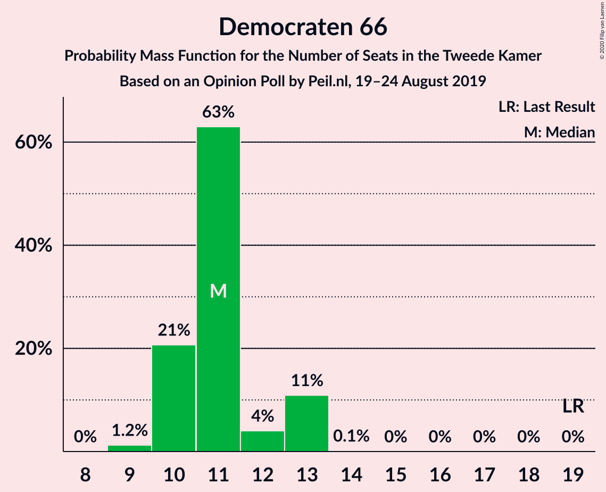
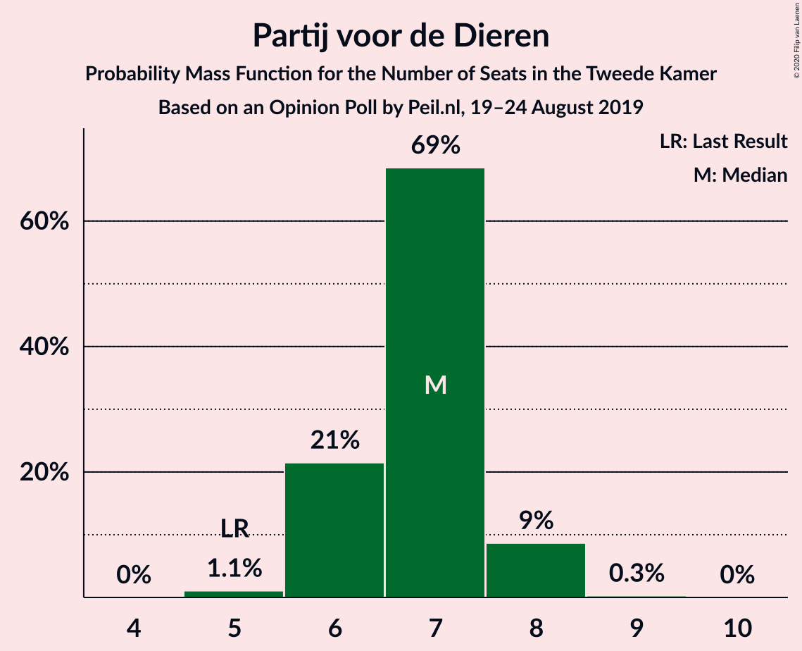
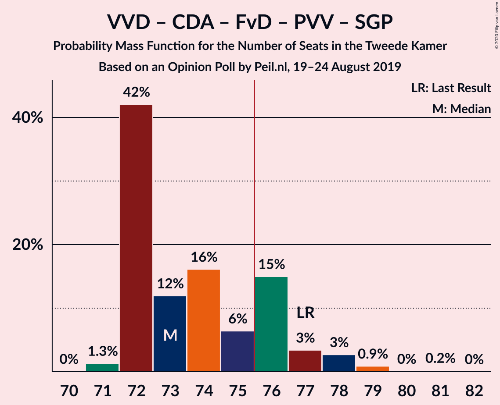
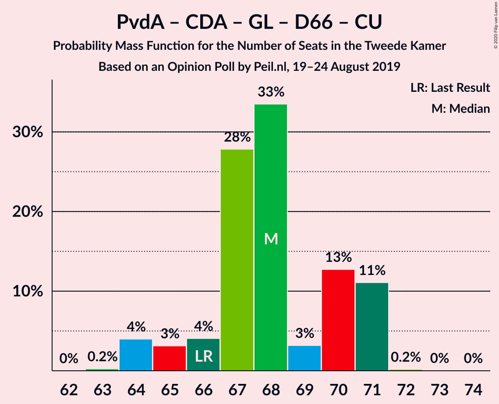
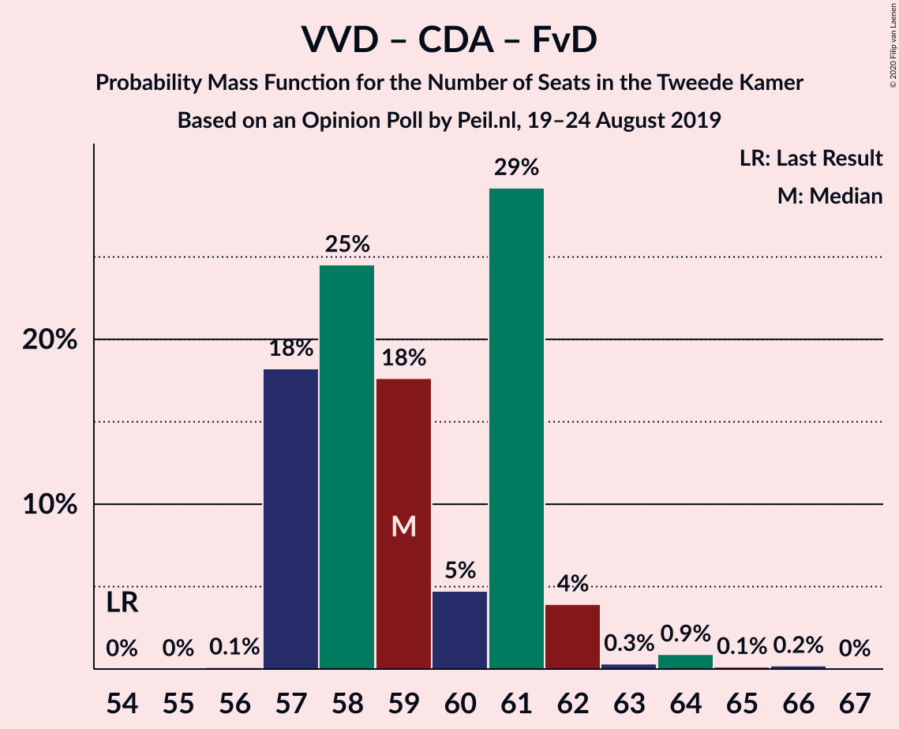
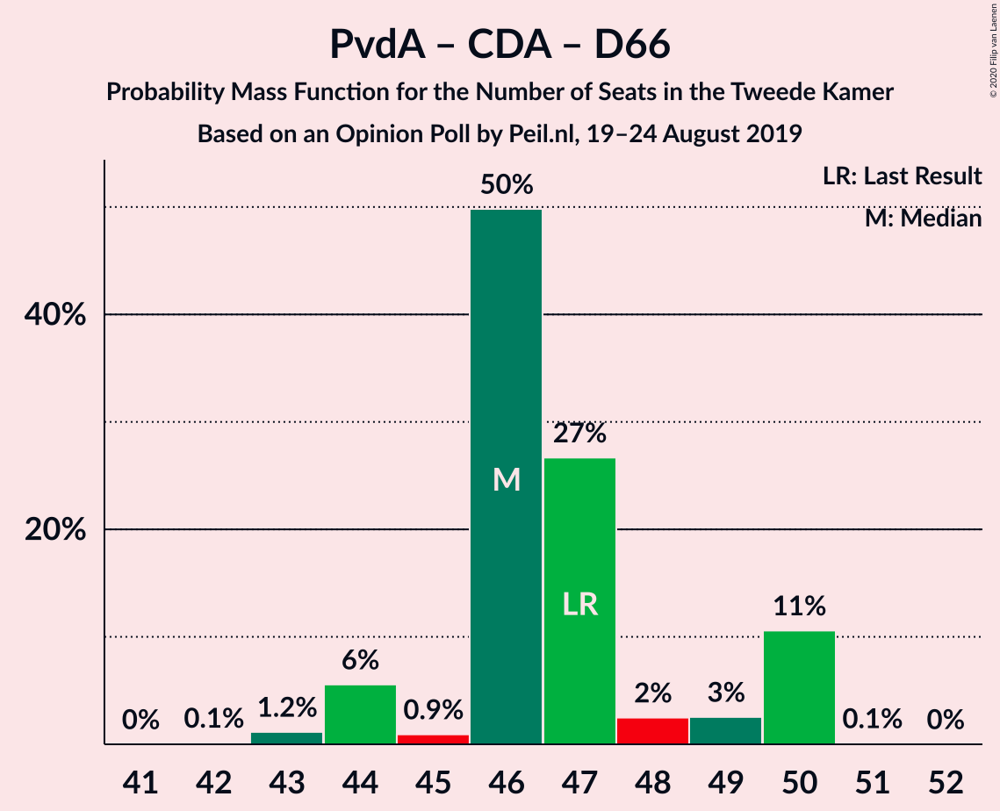

# Opinion Poll by Peil.nl, 19–24 August 2019

<a href="#voting-intentions">Voting Intentions</a> | <a href="#seats">Seats</a> | <a href="#coalitions">Coalitions</a> | <a href="#technical-information">Technical Information</a>

## Voting Intentions

### Confidence Intervals

| Party | Last Result | Poll Result | 80% Confidence Interval | 90% Confidence Interval | 95% Confidence Interval | 99% Confidence Interval |
|:-----:|:-----------:|:-----------:|:-----------------------:|:-----------------------:|:-----------------------:|:-----------------------:|
| Volkspartij voor Vrijheid en Democratie | 21.3% | 18.0% | 17.1–18.9% |16.9–19.2% |16.7–19.4% |16.2–19.9% |
| Partij van de Arbeid | 5.7% | 12.7% | 11.9–13.5% |11.7–13.7% |11.5–13.9% |11.2–14.3% |
| Christen-Democratisch Appèl | 12.4% | 10.7% | 10.0–11.4% |9.8–11.6% |9.6–11.8% |9.3–12.2% |
| Forum voor Democratie | 1.8% | 10.7% | 10.0–11.4% |9.8–11.6% |9.6–11.8% |9.3–12.2% |
| GroenLinks | 9.1% | 10.0% | 9.3–10.7% |9.1–10.9% |9.0–11.1% |8.7–11.5% |
| Partij voor de Vrijheid | 13.1% | 8.7% | 8.0–9.4% |7.8–9.6% |7.7–9.7% |7.4–10.1% |
| Democraten 66 | 12.2% | 7.3% | 6.8–8.0% |6.6–8.2% |6.4–8.3% |6.2–8.6% |
| Socialistische Partij | 9.1% | 5.3% | 4.8–5.9% |4.7–6.1% |4.6–6.2% |4.4–6.5% |
| Partij voor de Dieren | 3.2% | 4.7% | 4.2–5.2% |4.1–5.3% |4.0–5.5% |3.7–5.8% |
| ChristenUnie | 3.4% | 4.0% | 3.6–4.5% |3.4–4.6% |3.4–4.8% |3.2–5.0% |
| 50Plus | 3.1% | 4.0% | 3.6–4.5% |3.4–4.6% |3.4–4.8% |3.2–5.0% |
| DENK | 2.1% | 2.0% | 1.7–2.4% |1.6–2.5% |1.6–2.6% |1.4–2.8% |
| Staatkundig Gereformeerde Partij | 2.1% | 1.3% | 1.1–1.6% |1.0–1.7% |1.0–1.8% |0.9–2.0% |

*Note:* The poll result column reflects the actual value used in the calculations. Published results may vary slightly, and in addition be rounded to fewer digits.

## Seats

### Confidence Intervals

| Party | Last Result | Median | 80% Confidence Interval | 90% Confidence Interval | 95% Confidence Interval | 99% Confidence Interval |
|:-----:|:-----------:|:------:|:-----------------------:|:-----------------------:|:-----------------------:|:-----------------------:|
| <a href="#volkspartij-voor-vrijheid-en-democratie">Volkspartij voor Vrijheid en Democratie</a> | 33 | 29 | 28–29 |26–29 |26–30 |25–31 |
| <a href="#partij-van-de-arbeid">Partij van de Arbeid</a> | 9 | 20 | 18–21 |18–21 |16–21 |16–21 |
| <a href="#christen-democratisch-appèl">Christen-Democratisch Appèl</a> | 19 | 16 | 15–17 |14–18 |14–18 |14–19 |
| <a href="#forum-voor-democratie">Forum voor Democratie</a> | 2 | 17 | 15–17 |15–18 |15–18 |14–18 |
| <a href="#groenlinks">GroenLinks</a> | 14 | 16 | 13–16 |13–17 |13–17 |13–17 |
| <a href="#partij-voor-de-vrijheid">Partij voor de Vrijheid</a> | 20 | 11 | 11–13 |11–14 |11–15 |11–15 |
| <a href="#democraten-66">Democraten 66</a> | 19 | 11 | 11–13 |10–13 |10–13 |9–13 |
| <a href="#socialistische-partij">Socialistische Partij</a> | 14 | 6 | 6–9 |6–9 |6–9 |6–9 |
| <a href="#partij-voor-de-dieren">Partij voor de Dieren</a> | 5 | 8 | 6–8 |6–8 |6–8 |5–9 |
| <a href="#christenunie">ChristenUnie</a> | 5 | 5 | 5–6 |5–6 |5–7 |4–7 |
| <a href="#50plus">50Plus</a> | 4 | 7 | 5–7 |5–7 |5–7 |5–7 |
| <a href="#denk">DENK</a> | 3 | 2 | 2–3 |2–3 |2–3 |2–4 |
| <a href="#staatkundig-gereformeerde-partij">Staatkundig Gereformeerde Partij</a> | 3 | 2 | 1–2 |1–2 |1–2 |1–3 |

### Volkspartij voor Vrijheid en Democratie

*For a full overview of the results for this party, see the [Volkspartij voor Vrijheid en Democratie](party-volkspartijvoorvrijheidendemocratie.html) page.*

| Number of Seats | Probability | Accumulated | Special Marks |
|:---------------:|:-----------:|:-----------:|:-------------:|
| 24 | 0.1% | 100% |  |
| 25 | 0.6% | 99.9% |  |
| 26 | 6% | 99.3% |  |
| 27 | 3% | 94% |  |
| 28 | 20% | 91% |  |
| 29 | 68% | 71% | Median |
| 30 | 3% | 4% |  |
| 31 | 1.0% | 1.1% |  |
| 32 | 0% | 0% |  |
| 33 | 0% | 0% | Last Result |

### Partij van de Arbeid

*For a full overview of the results for this party, see the [Partij van de Arbeid](party-partijvandearbeid.html) page.*

| Number of Seats | Probability | Accumulated | Special Marks |
|:---------------:|:-----------:|:-----------:|:-------------:|
| 9 | 0% | 100% | Last Result |
| 10 | 0% | 100% |  |
| 11 | 0% | 100% |  |
| 12 | 0% | 100% |  |
| 13 | 0% | 100% |  |
| 14 | 0% | 100% |  |
| 15 | 0% | 100% |  |
| 16 | 3% | 100% |  |
| 17 | 2% | 97% |  |
| 18 | 6% | 95% |  |
| 19 | 2% | 89% |  |
| 20 | 76% | 87% | Median |
| 21 | 10% | 10% |  |
| 22 | 0.3% | 0.3% |  |
| 23 | 0% | 0% |  |

### Christen-Democratisch Appèl

*For a full overview of the results for this party, see the [Christen-Democratisch Appèl](party-christen-democratischappèl.html) page.*

| Number of Seats | Probability | Accumulated | Special Marks |
|:---------------:|:-----------:|:-----------:|:-------------:|
| 14 | 9% | 100% |  |
| 15 | 17% | 91% |  |
| 16 | 58% | 74% | Median |
| 17 | 10% | 16% |  |
| 18 | 5% | 6% |  |
| 19 | 0.7% | 0.7% | Last Result |
| 20 | 0% | 0% |  |

### Forum voor Democratie

*For a full overview of the results for this party, see the [Forum voor Democratie](party-forumvoordemocratie.html) page.*

| Number of Seats | Probability | Accumulated | Special Marks |
|:---------------:|:-----------:|:-----------:|:-------------:|
| 2 | 0% | 100% | Last Result |
| 3 | 0% | 100% |  |
| 4 | 0% | 100% |  |
| 5 | 0% | 100% |  |
| 6 | 0% | 100% |  |
| 7 | 0% | 100% |  |
| 8 | 0% | 100% |  |
| 9 | 0% | 100% |  |
| 10 | 0% | 100% |  |
| 11 | 0% | 100% |  |
| 12 | 0% | 100% |  |
| 13 | 0.1% | 100% |  |
| 14 | 2% | 99.9% |  |
| 15 | 13% | 98% |  |
| 16 | 12% | 85% |  |
| 17 | 65% | 73% | Median |
| 18 | 8% | 8% |  |
| 19 | 0.2% | 0.2% |  |
| 20 | 0% | 0% |  |

### GroenLinks

*For a full overview of the results for this party, see the [GroenLinks](party-groenlinks.html) page.*

| Number of Seats | Probability | Accumulated | Special Marks |
|:---------------:|:-----------:|:-----------:|:-------------:|
| 13 | 12% | 100% |  |
| 14 | 3% | 88% | Last Result |
| 15 | 17% | 85% |  |
| 16 | 59% | 68% | Median |
| 17 | 9% | 9% |  |
| 18 | 0.3% | 0.3% |  |
| 19 | 0% | 0% |  |

### Partij voor de Vrijheid

*For a full overview of the results for this party, see the [Partij voor de Vrijheid](party-partijvoordevrijheid.html) page.*

| Number of Seats | Probability | Accumulated | Special Marks |
|:---------------:|:-----------:|:-----------:|:-------------:|
| 10 | 0.1% | 100% |  |
| 11 | 60% | 99.9% | Median |
| 12 | 2% | 40% |  |
| 13 | 30% | 38% |  |
| 14 | 3% | 8% |  |
| 15 | 4% | 4% |  |
| 16 | 0% | 0.1% |  |
| 17 | 0.1% | 0.1% |  |
| 18 | 0% | 0% |  |
| 19 | 0% | 0% |  |
| 20 | 0% | 0% | Last Result |

### Democraten 66

*For a full overview of the results for this party, see the [Democraten 66](party-democraten66.html) page.*

| Number of Seats | Probability | Accumulated | Special Marks |
|:---------------:|:-----------:|:-----------:|:-------------:|
| 9 | 2% | 100% |  |
| 10 | 8% | 98% |  |
| 11 | 64% | 90% | Median |
| 12 | 15% | 26% |  |
| 13 | 12% | 12% |  |
| 14 | 0% | 0% |  |
| 15 | 0% | 0% |  |
| 16 | 0% | 0% |  |
| 17 | 0% | 0% |  |
| 18 | 0% | 0% |  |
| 19 | 0% | 0% | Last Result |

### Socialistische Partij

*For a full overview of the results for this party, see the [Socialistische Partij](party-socialistischepartij.html) page.*

| Number of Seats | Probability | Accumulated | Special Marks |
|:---------------:|:-----------:|:-----------:|:-------------:|
| 6 | 54% | 100% | Median |
| 7 | 10% | 46% |  |
| 8 | 23% | 36% |  |
| 9 | 13% | 13% |  |
| 10 | 0.3% | 0.3% |  |
| 11 | 0% | 0% |  |
| 12 | 0% | 0% |  |
| 13 | 0% | 0% |  |
| 14 | 0% | 0% | Last Result |

### Partij voor de Dieren

*For a full overview of the results for this party, see the [Partij voor de Dieren](party-partijvoordedieren.html) page.*

| Number of Seats | Probability | Accumulated | Special Marks |
|:---------------:|:-----------:|:-----------:|:-------------:|
| 5 | 1.0% | 100% | Last Result |
| 6 | 18% | 99.0% |  |
| 7 | 20% | 81% |  |
| 8 | 60% | 61% | Median |
| 9 | 1.2% | 1.2% |  |
| 10 | 0% | 0% |  |

### ChristenUnie

*For a full overview of the results for this party, see the [ChristenUnie](party-christenunie.html) page.*

| Number of Seats | Probability | Accumulated | Special Marks |
|:---------------:|:-----------:|:-----------:|:-------------:|
| 4 | 2% | 100% |  |
| 5 | 80% | 98% | Last Result, Median |
| 6 | 15% | 19% |  |
| 7 | 4% | 4% |  |
| 8 | 0.1% | 0.1% |  |
| 9 | 0% | 0% |  |

### 50Plus

*For a full overview of the results for this party, see the [50Plus](party-50plus.html) page.*

| Number of Seats | Probability | Accumulated | Special Marks |
|:---------------:|:-----------:|:-----------:|:-------------:|
| 4 | 0.4% | 100% | Last Result |
| 5 | 22% | 99.6% |  |
| 6 | 12% | 78% |  |
| 7 | 66% | 66% | Median |
| 8 | 0.3% | 0.3% |  |
| 9 | 0% | 0% |  |

### DENK

*For a full overview of the results for this party, see the [DENK](party-denk.html) page.*

| Number of Seats | Probability | Accumulated | Special Marks |
|:---------------:|:-----------:|:-----------:|:-------------:|
| 1 | 0.1% | 100% |  |
| 2 | 73% | 99.9% | Median |
| 3 | 25% | 26% | Last Result |
| 4 | 1.2% | 1.2% |  |
| 5 | 0% | 0% |  |

### Staatkundig Gereformeerde Partij

*For a full overview of the results for this party, see the [Staatkundig Gereformeerde Partij](party-staatkundiggereformeerdepartij.html) page.*

| Number of Seats | Probability | Accumulated | Special Marks |
|:---------------:|:-----------:|:-----------:|:-------------:|
| 1 | 30% | 100% |  |
| 2 | 69% | 70% | Median |
| 3 | 0.6% | 0.6% | Last Result |
| 4 | 0% | 0% |  |

## Coalitions

### Confidence Intervals

| Coalition | Last Result | Median | Majority? | 80% Confidence Interval | 90% Confidence Interval | 95% Confidence Interval | 99% Confidence Interval |
|:---------:|:-----------:|:------:|:---------:|:-----------------------:|:-----------------------:|:-----------------------:|:-----------------------:|
| Volkspartij voor Vrijheid en Democratie – Partij van de Arbeid – Christen-Democratisch Appèl – Democraten 66 – ChristenUnie | 85 | 81 | 99.8% | 78–83 | 77–83 | 77–83 | 76–83 |
| Partij van de Arbeid – Christen-Democratisch Appèl – GroenLinks – Democraten 66 – Socialistische Partij – ChristenUnie | 80 | 74 | 20% | 73–77 | 73–80 | 72–80 | 71–80 |
| Volkspartij voor Vrijheid en Democratie – Christen-Democratisch Appèl – GroenLinks – Democraten 66 – ChristenUnie | 90 | 77 | 74% | 74–78 | 72–80 | 72–80 | 72–80 |
| Volkspartij voor Vrijheid en Democratie – Christen-Democratisch Appèl – Forum voor Democratie – Partij voor de Vrijheid – Staatkundig Gereformeerde Partij | 77 | 75 | 13% | 73–76 | 73–77 | 73–79 | 71–79 |
| Volkspartij voor Vrijheid en Democratie – Christen-Democratisch Appèl – Forum voor Democratie – Partij voor de Vrijheid | 74 | 73 | 3% | 72–74 | 72–75 | 71–77 | 70–77 |
| Partij van de Arbeid – Christen-Democratisch Appèl – GroenLinks – Democraten 66 – ChristenUnie | 66 | 68 | 0% | 65–69 | 64–72 | 64–72 | 64–72 |
| Volkspartij voor Vrijheid en Democratie – Christen-Democratisch Appèl – Forum voor Democratie – 50Plus – Staatkundig Gereformeerde Partij | 61 | 71 | 0% | 66–71 | 66–71 | 66–71 | 64–72 |
| Volkspartij voor Vrijheid en Democratie – Christen-Democratisch Appèl – Forum voor Democratie – 50Plus | 58 | 69 | 0% | 65–69 | 65–69 | 64–69 | 63–70 |
| Volkspartij voor Vrijheid en Democratie – Christen-Democratisch Appèl – Forum voor Democratie – Staatkundig Gereformeerde Partij | 57 | 64 | 0% | 60–64 | 60–64 | 60–65 | 59–66 |
| Volkspartij voor Vrijheid en Democratie – Partij van de Arbeid – Christen-Democratisch Appèl | 61 | 65 | 0% | 62–65 | 60–65 | 60–65 | 60–66 |
| Volkspartij voor Vrijheid en Democratie – Christen-Democratisch Appèl – Forum voor Democratie | 54 | 62 | 0% | 59–62 | 59–62 | 58–64 | 57–64 |
| Volkspartij voor Vrijheid en Democratie – Christen-Democratisch Appèl – Democraten 66 – ChristenUnie | 76 | 61 | 0% | 60–63 | 57–63 | 57–63 | 57–65 |
| Volkspartij voor Vrijheid en Democratie – Partij van de Arbeid – Democraten 66 | 61 | 60 | 0% | 58–62 | 56–62 | 54–62 | 53–63 |
| Volkspartij voor Vrijheid en Democratie – Christen-Democratisch Appèl – Partij voor de Vrijheid | 72 | 56 | 0% | 56–58 | 55–59 | 55–60 | 53–61 |
| Volkspartij voor Vrijheid en Democratie – Christen-Democratisch Appèl – Democraten 66 | 71 | 56 | 0% | 54–58 | 52–58 | 52–58 | 50–58 |
| Partij van de Arbeid – Christen-Democratisch Appèl – Democraten 66 | 47 | 47 | 0% | 45–48 | 44–50 | 44–50 | 43–50 |
| Volkspartij voor Vrijheid en Democratie – Partij van de Arbeid | 42 | 49 | 0% | 47–50 | 45–50 | 42–50 | 42–50 |
| Volkspartij voor Vrijheid en Democratie – Christen-Democratisch Appèl | 52 | 45 | 0% | 43–45 | 42–46 | 42–47 | 40–47 |
| Partij van de Arbeid – Christen-Democratisch Appèl – ChristenUnie | 33 | 41 | 0% | 40–42 | 39–42 | 39–43 | 39–45 |
| Partij van de Arbeid – Christen-Democratisch Appèl | 28 | 36 | 0% | 34–36 | 34–37 | 34–37 | 32–38 |
| Christen-Democratisch Appèl – Democraten 66 | 38 | 27 | 0% | 26–30 | 24–30 | 24–30 | 24–30 |

### Volkspartij voor Vrijheid en Democratie – Partij van de Arbeid – Christen-Democratisch Appèl – Democraten 66 – ChristenUnie

| Number of Seats | Probability | Accumulated | Special Marks |
|:---------------:|:-----------:|:-----------:|:-------------:|
| 75 | 0.2% | 100% |  |
| 76 | 1.0% | 99.8% | Majority |
| 77 | 6% | 98.8% |  |
| 78 | 4% | 92% |  |
| 79 | 4% | 88% |  |
| 80 | 8% | 85% |  |
| 81 | 56% | 77% | Median |
| 82 | 11% | 21% |  |
| 83 | 10% | 10% |  |
| 84 | 0.1% | 0.2% |  |
| 85 | 0.1% | 0.1% | Last Result |
| 86 | 0% | 0% |  |

### Partij van de Arbeid – Christen-Democratisch Appèl – GroenLinks – Democraten 66 – Socialistische Partij – ChristenUnie

| Number of Seats | Probability | Accumulated | Special Marks |
|:---------------:|:-----------:|:-----------:|:-------------:|
| 71 | 1.3% | 100% |  |
| 72 | 4% | 98.7% |  |
| 73 | 6% | 95% |  |
| 74 | 67% | 89% | Median |
| 75 | 2% | 23% |  |
| 76 | 10% | 20% | Majority |
| 77 | 2% | 10% |  |
| 78 | 0.7% | 8% |  |
| 79 | 0.2% | 7% |  |
| 80 | 7% | 7% | Last Result |
| 81 | 0.3% | 0.3% |  |
| 82 | 0% | 0% |  |

### Volkspartij voor Vrijheid en Democratie – Christen-Democratisch Appèl – GroenLinks – Democraten 66 – ChristenUnie

| Number of Seats | Probability | Accumulated | Special Marks |
|:---------------:|:-----------:|:-----------:|:-------------:|
| 71 | 0.1% | 100% |  |
| 72 | 5% | 99.9% |  |
| 73 | 2% | 95% |  |
| 74 | 12% | 93% |  |
| 75 | 7% | 80% |  |
| 76 | 2% | 74% | Majority |
| 77 | 56% | 72% | Median |
| 78 | 7% | 16% |  |
| 79 | 2% | 9% |  |
| 80 | 7% | 7% |  |
| 81 | 0% | 0% |  |
| 82 | 0% | 0% |  |
| 83 | 0% | 0% |  |
| 84 | 0% | 0% |  |
| 85 | 0% | 0% |  |
| 86 | 0% | 0% |  |
| 87 | 0% | 0% |  |
| 88 | 0% | 0% |  |
| 89 | 0% | 0% |  |
| 90 | 0% | 0% | Last Result |

### Volkspartij voor Vrijheid en Democratie – Christen-Democratisch Appèl – Forum voor Democratie – Partij voor de Vrijheid – Staatkundig Gereformeerde Partij

| Number of Seats | Probability | Accumulated | Special Marks |
|:---------------:|:-----------:|:-----------:|:-------------:|
| 71 | 0.5% | 100% |  |
| 72 | 0.9% | 99.5% |  |
| 73 | 24% | 98.5% |  |
| 74 | 2% | 74% |  |
| 75 | 60% | 73% | Median |
| 76 | 4% | 13% | Majority |
| 77 | 6% | 9% | Last Result |
| 78 | 0.2% | 3% |  |
| 79 | 2% | 3% |  |
| 80 | 0.4% | 0.4% |  |
| 81 | 0% | 0% |  |

### Volkspartij voor Vrijheid en Democratie – Christen-Democratisch Appèl – Forum voor Democratie – Partij voor de Vrijheid

| Number of Seats | Probability | Accumulated | Special Marks |
|:---------------:|:-----------:|:-----------:|:-------------:|
| 69 | 0.4% | 100% |  |
| 70 | 0.9% | 99.5% |  |
| 71 | 2% | 98.7% |  |
| 72 | 23% | 96% |  |
| 73 | 54% | 73% | Median |
| 74 | 10% | 19% | Last Result |
| 75 | 6% | 9% |  |
| 76 | 0.3% | 3% | Majority |
| 77 | 2% | 3% |  |
| 78 | 0.3% | 0.4% |  |
| 79 | 0.1% | 0.1% |  |
| 80 | 0% | 0% |  |

### Partij van de Arbeid – Christen-Democratisch Appèl – GroenLinks – Democraten 66 – ChristenUnie

| Number of Seats | Probability | Accumulated | Special Marks |
|:---------------:|:-----------:|:-----------:|:-------------:|
| 63 | 0% | 100% |  |
| 64 | 7% | 99.9% |  |
| 65 | 4% | 93% |  |
| 66 | 10% | 89% | Last Result |
| 67 | 9% | 79% |  |
| 68 | 59% | 69% | Median |
| 69 | 1.4% | 10% |  |
| 70 | 1.5% | 9% |  |
| 71 | 0.1% | 7% |  |
| 72 | 7% | 7% |  |
| 73 | 0.3% | 0.3% |  |
| 74 | 0% | 0% |  |

### Volkspartij voor Vrijheid en Democratie – Christen-Democratisch Appèl – Forum voor Democratie – 50Plus – Staatkundig Gereformeerde Partij

| Number of Seats | Probability | Accumulated | Special Marks |
|:---------------:|:-----------:|:-----------:|:-------------:|
| 61 | 0% | 100% | Last Result |
| 62 | 0% | 100% |  |
| 63 | 0.1% | 100% |  |
| 64 | 0.5% | 99.9% |  |
| 65 | 2% | 99.4% |  |
| 66 | 8% | 98% |  |
| 67 | 27% | 90% |  |
| 68 | 0.6% | 63% |  |
| 69 | 4% | 62% |  |
| 70 | 2% | 58% |  |
| 71 | 55% | 56% | Median |
| 72 | 0.9% | 0.9% |  |
| 73 | 0% | 0% |  |

### Volkspartij voor Vrijheid en Democratie – Christen-Democratisch Appèl – Forum voor Democratie – 50Plus

| Number of Seats | Probability | Accumulated | Special Marks |
|:---------------:|:-----------:|:-----------:|:-------------:|
| 58 | 0% | 100% | Last Result |
| 59 | 0% | 100% |  |
| 60 | 0% | 100% |  |
| 61 | 0.1% | 100% |  |
| 62 | 0.3% | 99.9% |  |
| 63 | 2% | 99.6% |  |
| 64 | 3% | 98% |  |
| 65 | 10% | 95% |  |
| 66 | 23% | 85% |  |
| 67 | 4% | 62% |  |
| 68 | 2% | 58% |  |
| 69 | 55% | 56% | Median |
| 70 | 1.0% | 1.1% |  |
| 71 | 0.1% | 0.1% |  |
| 72 | 0% | 0% |  |

### Volkspartij voor Vrijheid en Democratie – Christen-Democratisch Appèl – Forum voor Democratie – Staatkundig Gereformeerde Partij

| Number of Seats | Probability | Accumulated | Special Marks |
|:---------------:|:-----------:|:-----------:|:-------------:|
| 57 | 0% | 100% | Last Result |
| 58 | 0.1% | 100% |  |
| 59 | 1.1% | 99.8% |  |
| 60 | 18% | 98.8% |  |
| 61 | 2% | 81% |  |
| 62 | 19% | 79% |  |
| 63 | 2% | 60% |  |
| 64 | 54% | 58% | Median |
| 65 | 1.2% | 4% |  |
| 66 | 2% | 2% |  |
| 67 | 0% | 0% |  |

### Volkspartij voor Vrijheid en Democratie – Partij van de Arbeid – Christen-Democratisch Appèl

| Number of Seats | Probability | Accumulated | Special Marks |
|:---------------:|:-----------:|:-----------:|:-------------:|
| 58 | 0.1% | 100% |  |
| 59 | 0.2% | 99.9% |  |
| 60 | 6% | 99.8% |  |
| 61 | 1.0% | 94% | Last Result |
| 62 | 6% | 93% |  |
| 63 | 10% | 87% |  |
| 64 | 1.4% | 76% |  |
| 65 | 73% | 75% | Median |
| 66 | 2% | 2% |  |
| 67 | 0% | 0% |  |

### Volkspartij voor Vrijheid en Democratie – Christen-Democratisch Appèl – Forum voor Democratie

| Number of Seats | Probability | Accumulated | Special Marks |
|:---------------:|:-----------:|:-----------:|:-------------:|
| 54 | 0% | 100% | Last Result |
| 55 | 0% | 100% |  |
| 56 | 0.5% | 100% |  |
| 57 | 0.4% | 99.5% |  |
| 58 | 3% | 99.1% |  |
| 59 | 17% | 96% |  |
| 60 | 6% | 79% |  |
| 61 | 15% | 73% |  |
| 62 | 54% | 58% | Median |
| 63 | 1.1% | 4% |  |
| 64 | 3% | 3% |  |
| 65 | 0.1% | 0.1% |  |
| 66 | 0% | 0% |  |

### Volkspartij voor Vrijheid en Democratie – Christen-Democratisch Appèl – Democraten 66 – ChristenUnie

| Number of Seats | Probability | Accumulated | Special Marks |
|:---------------:|:-----------:|:-----------:|:-------------:|
| 56 | 0.3% | 100% |  |
| 57 | 6% | 99.7% |  |
| 58 | 0.4% | 94% |  |
| 59 | 2% | 93% |  |
| 60 | 9% | 91% |  |
| 61 | 64% | 83% | Median |
| 62 | 5% | 18% |  |
| 63 | 11% | 13% |  |
| 64 | 1.1% | 2% |  |
| 65 | 1.1% | 1.1% |  |
| 66 | 0% | 0% |  |
| 67 | 0% | 0% |  |
| 68 | 0% | 0% |  |
| 69 | 0% | 0% |  |
| 70 | 0% | 0% |  |
| 71 | 0% | 0% |  |
| 72 | 0% | 0% |  |
| 73 | 0% | 0% |  |
| 74 | 0% | 0% |  |
| 75 | 0% | 0% |  |
| 76 | 0% | 0% | Last Result, Majority |

### Volkspartij voor Vrijheid en Democratie – Partij van de Arbeid – Democraten 66

| Number of Seats | Probability | Accumulated | Special Marks |
|:---------------:|:-----------:|:-----------:|:-------------:|
| 53 | 0.7% | 100% |  |
| 54 | 3% | 99.3% |  |
| 55 | 0.6% | 96% |  |
| 56 | 3% | 96% |  |
| 57 | 2% | 93% |  |
| 58 | 7% | 90% |  |
| 59 | 8% | 84% |  |
| 60 | 57% | 76% | Median |
| 61 | 7% | 18% | Last Result |
| 62 | 10% | 11% |  |
| 63 | 0.7% | 0.8% |  |
| 64 | 0.1% | 0.1% |  |
| 65 | 0% | 0% |  |

### Volkspartij voor Vrijheid en Democratie – Christen-Democratisch Appèl – Partij voor de Vrijheid

| Number of Seats | Probability | Accumulated | Special Marks |
|:---------------:|:-----------:|:-----------:|:-------------:|
| 52 | 0.1% | 100% |  |
| 53 | 0.9% | 99.9% |  |
| 54 | 1.4% | 99.0% |  |
| 55 | 6% | 98% |  |
| 56 | 68% | 92% | Median |
| 57 | 10% | 23% |  |
| 58 | 4% | 13% |  |
| 59 | 5% | 9% |  |
| 60 | 3% | 4% |  |
| 61 | 0.5% | 0.5% |  |
| 62 | 0% | 0% |  |
| 63 | 0% | 0% |  |
| 64 | 0% | 0% |  |
| 65 | 0% | 0% |  |
| 66 | 0% | 0% |  |
| 67 | 0% | 0% |  |
| 68 | 0% | 0% |  |
| 69 | 0% | 0% |  |
| 70 | 0% | 0% |  |
| 71 | 0% | 0% |  |
| 72 | 0% | 0% | Last Result |

### Volkspartij voor Vrijheid en Democratie – Christen-Democratisch Appèl – Democraten 66

| Number of Seats | Probability | Accumulated | Special Marks |
|:---------------:|:-----------:|:-----------:|:-------------:|
| 50 | 0.9% | 100% |  |
| 51 | 0.1% | 99.1% |  |
| 52 | 6% | 99.0% |  |
| 53 | 2% | 93% |  |
| 54 | 8% | 92% |  |
| 55 | 2% | 84% |  |
| 56 | 69% | 82% | Median |
| 57 | 1.2% | 13% |  |
| 58 | 12% | 12% |  |
| 59 | 0.2% | 0.3% |  |
| 60 | 0% | 0% |  |
| 61 | 0% | 0% |  |
| 62 | 0% | 0% |  |
| 63 | 0% | 0% |  |
| 64 | 0% | 0% |  |
| 65 | 0% | 0% |  |
| 66 | 0% | 0% |  |
| 67 | 0% | 0% |  |
| 68 | 0% | 0% |  |
| 69 | 0% | 0% |  |
| 70 | 0% | 0% |  |
| 71 | 0% | 0% | Last Result |

### Partij van de Arbeid – Christen-Democratisch Appèl – Democraten 66

| Number of Seats | Probability | Accumulated | Special Marks |
|:---------------:|:-----------:|:-----------:|:-------------:|
| 42 | 0.2% | 100% |  |
| 43 | 0.4% | 99.8% |  |
| 44 | 9% | 99.4% |  |
| 45 | 2% | 91% |  |
| 46 | 10% | 89% |  |
| 47 | 58% | 78% | Last Result, Median |
| 48 | 12% | 20% |  |
| 49 | 0.8% | 8% |  |
| 50 | 7% | 7% |  |
| 51 | 0% | 0% |  |

### Volkspartij voor Vrijheid en Democratie – Partij van de Arbeid

| Number of Seats | Probability | Accumulated | Special Marks |
|:---------------:|:-----------:|:-----------:|:-------------:|
| 42 | 3% | 100% | Last Result |
| 43 | 0.9% | 97% |  |
| 44 | 0.9% | 96% |  |
| 45 | 2% | 95% |  |
| 46 | 2% | 93% |  |
| 47 | 3% | 91% |  |
| 48 | 21% | 88% |  |
| 49 | 56% | 67% | Median |
| 50 | 10% | 10% |  |
| 51 | 0.1% | 0.2% |  |
| 52 | 0.1% | 0.1% |  |
| 53 | 0% | 0% |  |

### Volkspartij voor Vrijheid en Democratie – Christen-Democratisch Appèl

| Number of Seats | Probability | Accumulated | Special Marks |
|:---------------:|:-----------:|:-----------:|:-------------:|
| 40 | 0.9% | 100% |  |
| 41 | 1.1% | 99.1% |  |
| 42 | 7% | 98% |  |
| 43 | 9% | 91% |  |
| 44 | 13% | 82% |  |
| 45 | 64% | 69% | Median |
| 46 | 2% | 5% |  |
| 47 | 3% | 4% |  |
| 48 | 0.1% | 0.1% |  |
| 49 | 0% | 0% |  |
| 50 | 0% | 0% |  |
| 51 | 0% | 0% |  |
| 52 | 0% | 0% | Last Result |

### Partij van de Arbeid – Christen-Democratisch Appèl – ChristenUnie

| Number of Seats | Probability | Accumulated | Special Marks |
|:---------------:|:-----------:|:-----------:|:-------------:|
| 33 | 0% | 100% | Last Result |
| 34 | 0% | 100% |  |
| 35 | 0% | 100% |  |
| 36 | 0.3% | 100% |  |
| 37 | 0% | 99.7% |  |
| 38 | 0.1% | 99.7% |  |
| 39 | 9% | 99.6% |  |
| 40 | 10% | 91% |  |
| 41 | 70% | 81% | Median |
| 42 | 7% | 11% |  |
| 43 | 2% | 3% |  |
| 44 | 0.4% | 0.9% |  |
| 45 | 0.4% | 0.6% |  |
| 46 | 0.2% | 0.2% |  |
| 47 | 0% | 0% |  |

### Partij van de Arbeid – Christen-Democratisch Appèl

| Number of Seats | Probability | Accumulated | Special Marks |
|:---------------:|:-----------:|:-----------:|:-------------:|
| 28 | 0% | 100% | Last Result |
| 29 | 0% | 100% |  |
| 30 | 0% | 100% |  |
| 31 | 0% | 100% |  |
| 32 | 0.8% | 100% |  |
| 33 | 0.6% | 99.2% |  |
| 34 | 15% | 98.6% |  |
| 35 | 9% | 83% |  |
| 36 | 64% | 74% | Median |
| 37 | 9% | 10% |  |
| 38 | 0.6% | 0.9% |  |
| 39 | 0.2% | 0.3% |  |
| 40 | 0% | 0% |  |

### Christen-Democratisch Appèl – Democraten 66

| Number of Seats | Probability | Accumulated | Special Marks |
|:---------------:|:-----------:|:-----------:|:-------------:|
| 23 | 0.1% | 100% |  |
| 24 | 6% | 99.9% |  |
| 25 | 0.6% | 94% |  |
| 26 | 9% | 93% |  |
| 27 | 67% | 84% | Median |
| 28 | 3% | 17% |  |
| 29 | 4% | 15% |  |
| 30 | 11% | 11% |  |
| 31 | 0.3% | 0.3% |  |
| 32 | 0% | 0% |  |
| 33 | 0% | 0% |  |
| 34 | 0% | 0% |  |
| 35 | 0% | 0% |  |
| 36 | 0% | 0% |  |
| 37 | 0% | 0% |  |
| 38 | 0% | 0% | Last Result |

## Technical Information

### Opinion Poll

+ **Polling firm:** Peil.nl
+ **Commissioner(s):** —
+ **Fieldwork period:** 19–24 August 2019

### Calculations

+ **Sample size:** 3000
+ **Simulations done:** 131,072
+ **Error estimate:** 1.46%

