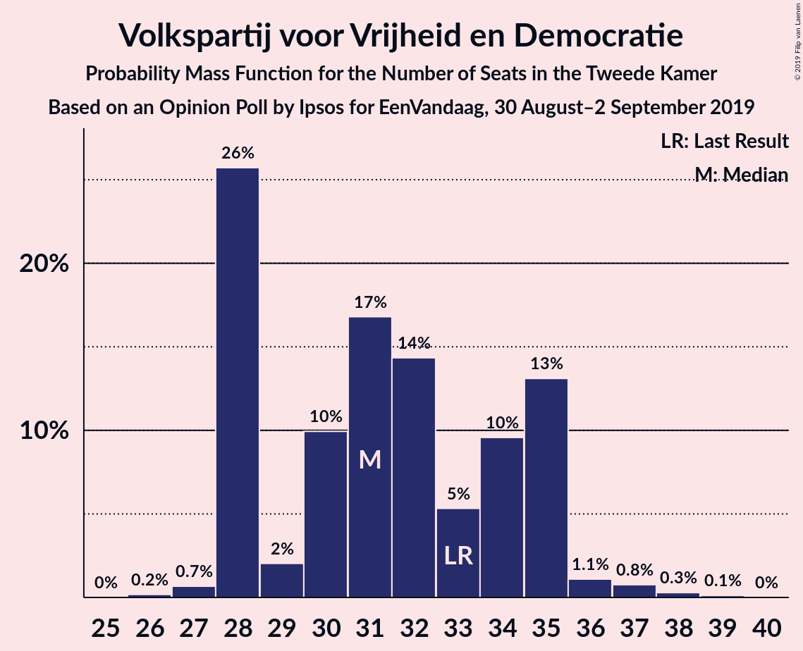
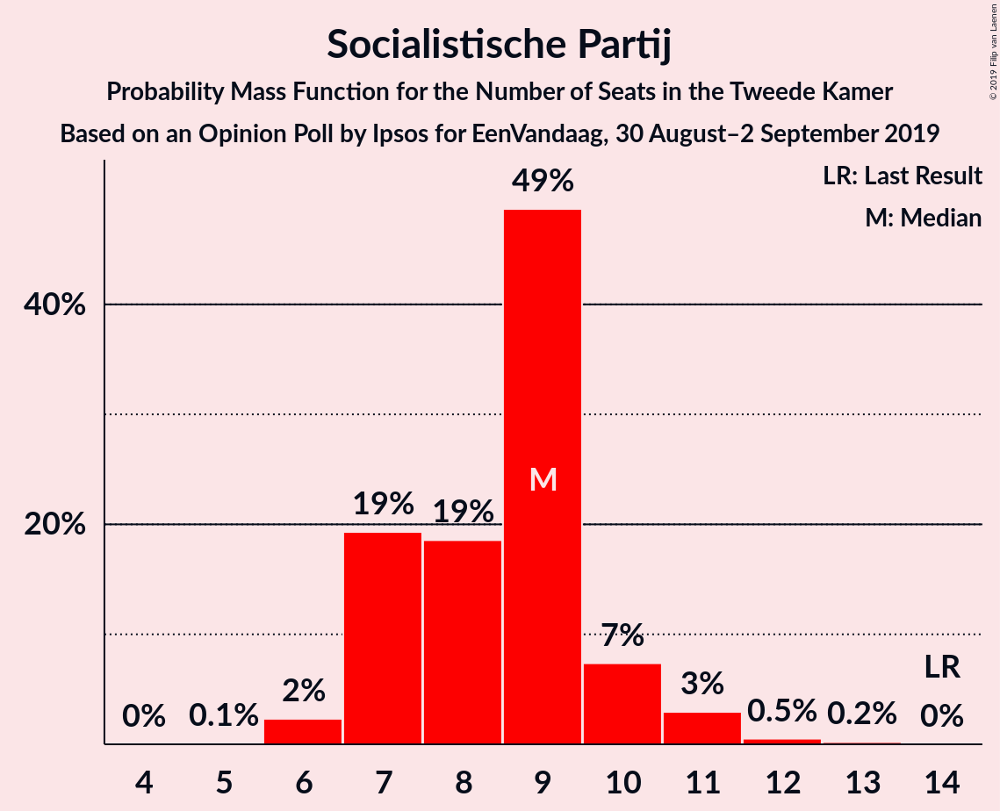
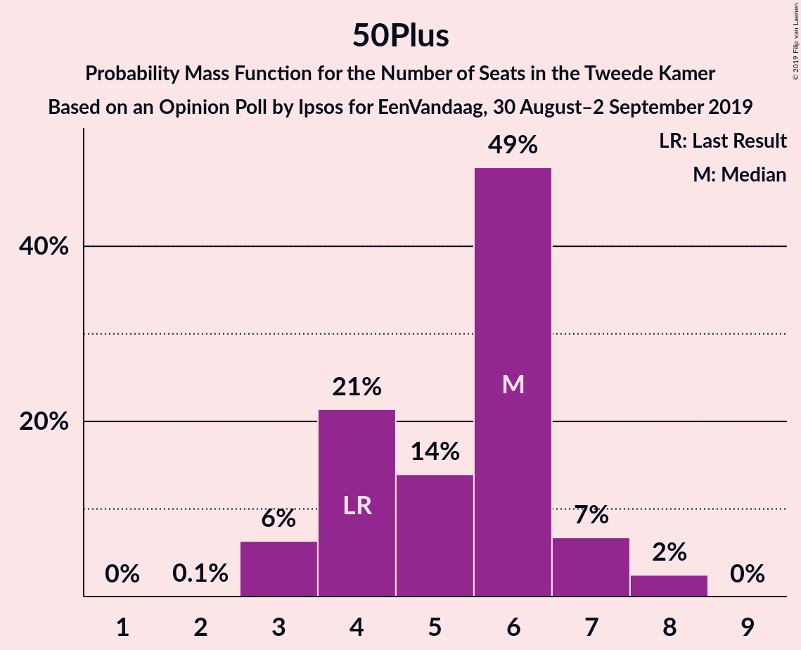
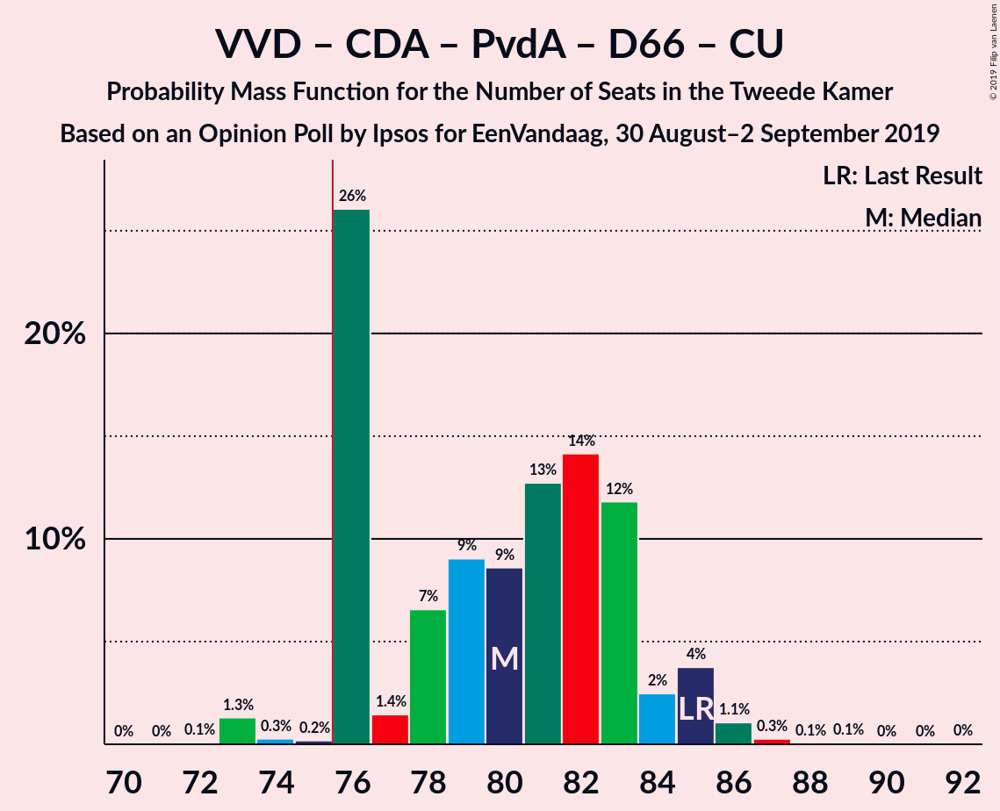
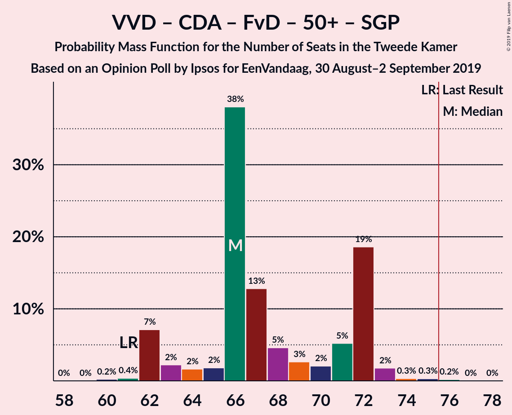
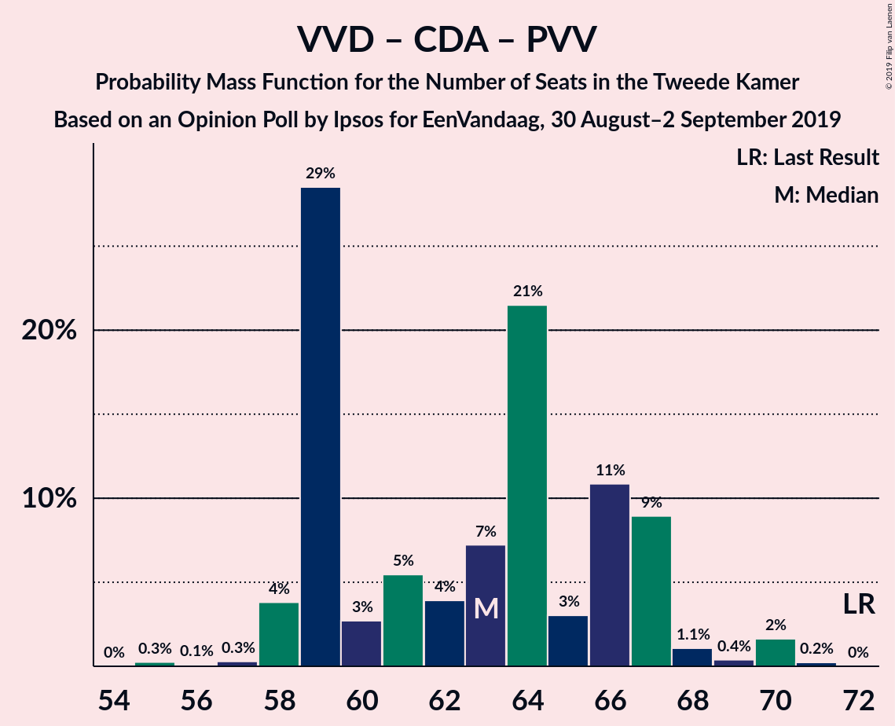
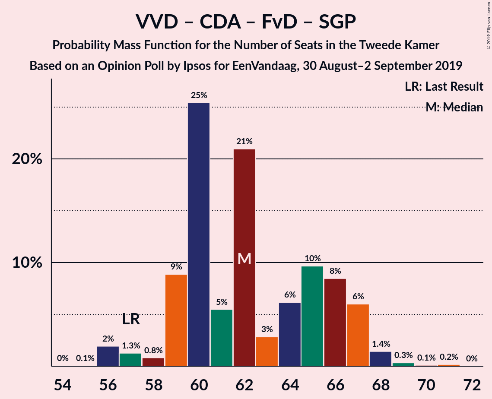
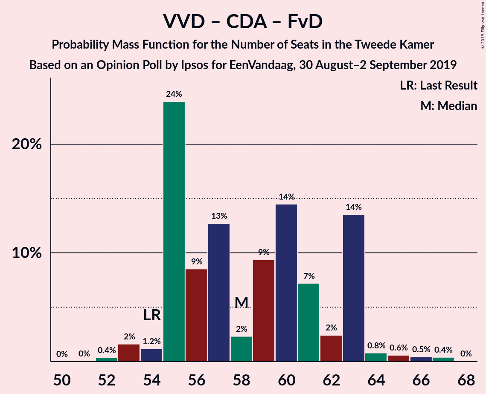
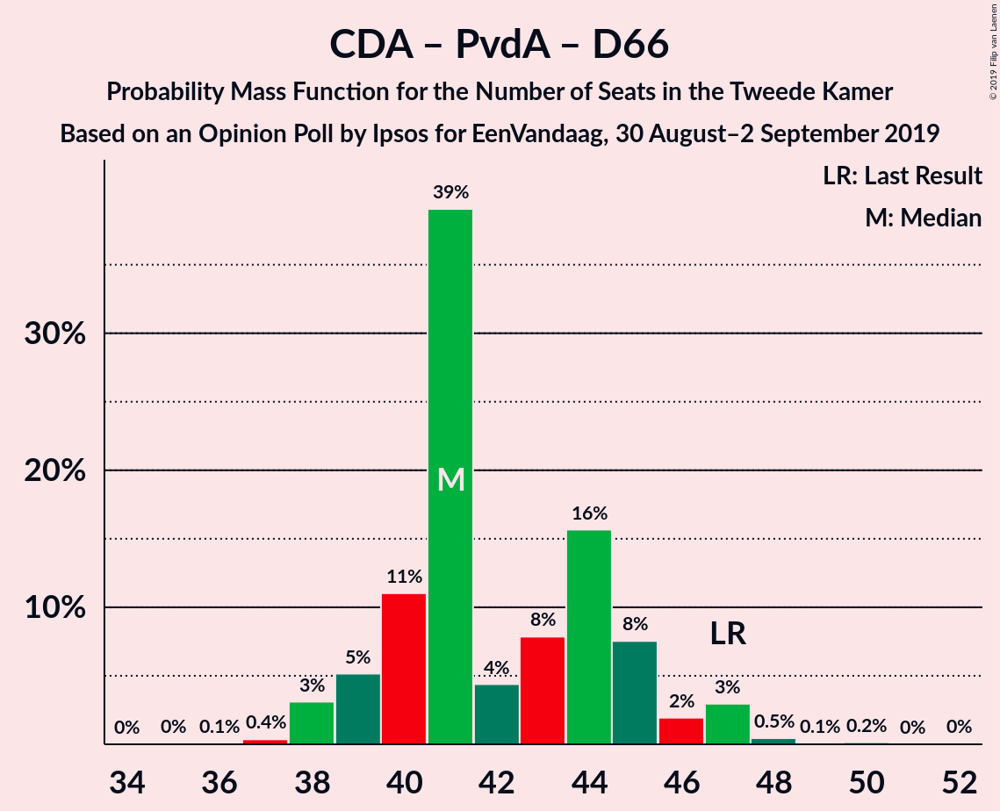

# Opinion Poll by Ipsos for EenVandaag, 30 August–2 September 2019

<a href="#voting-intentions">Voting Intentions</a> | <a href="#seats">Seats</a> | <a href="#coalitions">Coalitions</a> | <a href="#technical-information">Technical Information</a>

## Voting Intentions

### Confidence Intervals

| Party | Last Result | Poll Result | 80% Confidence Interval | 90% Confidence Interval | 95% Confidence Interval | 99% Confidence Interval |
|:-----:|:-----------:|:-----------:|:-----------------------:|:-----------------------:|:-----------------------:|:-----------------------:|
| Volkspartij voor Vrijheid en Democratie | 21.3% | 20.9% | 19.3–22.6% |18.9–23.1% |18.5–23.5% |17.7–24.4% |
| Christen-Democratisch Appèl | 12.4% | 10.7% | 9.5–12.0% |9.2–12.4% |8.9–12.8% |8.4–13.4% |
| Partij voor de Vrijheid | 13.1% | 9.9% | 8.8–11.2% |8.5–11.6% |8.2–11.9% |7.7–12.6% |
| GroenLinks | 9.1% | 9.3% | 8.2–10.6% |7.9–10.9% |7.6–11.3% |7.1–11.9% |
| Partij van de Arbeid | 5.7% | 9.1% | 8.0–10.4% |7.7–10.7% |7.5–11.0% |7.0–11.7% |
| Democraten 66 | 12.2% | 8.4% | 7.4–9.6% |7.1–10.0% |6.8–10.3% |6.4–10.9% |
| Forum voor Democratie | 1.8% | 7.3% | 6.3–8.5% |6.1–8.8% |5.8–9.1% |5.4–9.7% |
| Socialistische Partij | 9.1% | 5.8% | 4.9–6.9% |4.7–7.2% |4.5–7.4% |4.1–8.0% |
| Partij voor de Dieren | 3.2% | 5.1% | 4.3–6.1% |4.1–6.4% |3.9–6.6% |3.6–7.2% |
| ChristenUnie | 3.4% | 4.4% | 3.7–5.3% |3.5–5.6% |3.3–5.9% |3.0–6.3% |
| 50Plus | 3.1% | 3.5% | 2.9–4.4% |2.7–4.6% |2.5–4.8% |2.2–5.3% |
| Staatkundig Gereformeerde Partij | 2.1% | 2.4% | 1.9–3.2% |1.7–3.4% |1.6–3.6% |1.4–3.9% |
| DENK | 2.1% | 1.8% | 1.4–2.5% |1.2–2.7% |1.1–2.8% |1.0–3.2% |

*Note:* The poll result column reflects the actual value used in the calculations. Published results may vary slightly, and in addition be rounded to fewer digits.

## Seats

### Confidence Intervals

| Party | Last Result | Median | 80% Confidence Interval | 90% Confidence Interval | 95% Confidence Interval | 99% Confidence Interval |
|:-----:|:-----------:|:------:|:-----------------------:|:-----------------------:|:-----------------------:|:-----------------------:|
| <a href="#volkspartij-voor-vrijheid-en-democratie">Volkspartij voor Vrijheid en Democratie</a> | 33 | 31 | 28–35 |28–35 |28–35 |27–37 |
| <a href="#christen-democratisch-appèl">Christen-Democratisch Appèl</a> | 19 | 16 | 14–18 |14–19 |13–20 |13–21 |
| <a href="#partij-voor-de-vrijheid">Partij voor de Vrijheid</a> | 20 | 16 | 13–18 |12–19 |12–19 |11–19 |
| <a href="#groenlinks">GroenLinks</a> | 14 | 13 | 13–16 |12–16 |11–17 |11–18 |
| <a href="#partij-van-de-arbeid">Partij van de Arbeid</a> | 9 | 13 | 12–16 |12–16 |11–17 |10–18 |
| <a href="#democraten-66">Democraten 66</a> | 19 | 13 | 11–14 |10–15 |10–15 |9–16 |
| <a href="#forum-voor-democratie">Forum voor Democratie</a> | 2 | 11 | 9–13 |9–13 |9–14 |8–16 |
| <a href="#socialistische-partij">Socialistische Partij</a> | 14 | 9 | 7–10 |7–10 |7–11 |6–12 |
| <a href="#partij-voor-de-dieren">Partij voor de Dieren</a> | 5 | 8 | 6–9 |6–10 |5–10 |5–11 |
| <a href="#christenunie">ChristenUnie</a> | 5 | 7 | 5–7 |5–8 |5–9 |4–10 |
| <a href="#50plus">50Plus</a> | 4 | 6 | 4–6 |3–7 |3–7 |3–8 |
| <a href="#staatkundig-gereformeerde-partij">Staatkundig Gereformeerde Partij</a> | 3 | 4 | 2–5 |2–5 |2–5 |2–6 |
| <a href="#denk">DENK</a> | 3 | 3 | 2–4 |2–4 |1–4 |1–4 |

### Volkspartij voor Vrijheid en Democratie

*For a full overview of the results for this party, see the [Volkspartij voor Vrijheid en Democratie](party-volkspartijvoorvrijheidendemocratie.html) page.*

| Number of Seats | Probability | Accumulated | Special Marks |
|:---------------:|:-----------:|:-----------:|:-------------:|
| 26 | 0.2% | 100% |  |
| 27 | 0.7% | 99.8% |  |
| 28 | 26% | 99.1% |  |
| 29 | 2% | 73% |  |
| 30 | 10% | 71% |  |
| 31 | 17% | 61% | Median |
| 32 | 14% | 45% |  |
| 33 | 5% | 30% | Last Result |
| 34 | 10% | 25% |  |
| 35 | 13% | 15% |  |
| 36 | 1.1% | 2% |  |
| 37 | 0.8% | 1.2% |  |
| 38 | 0.3% | 0.4% |  |
| 39 | 0.1% | 0.1% |  |
| 40 | 0% | 0% |  |

### Christen-Democratisch Appèl

*For a full overview of the results for this party, see the [Christen-Democratisch Appèl](party-christen-democratischappèl.html) page.*

| Number of Seats | Probability | Accumulated | Special Marks |
|:---------------:|:-----------:|:-----------:|:-------------:|
| 12 | 0.5% | 100% |  |
| 13 | 4% | 99.5% |  |
| 14 | 6% | 95% |  |
| 15 | 32% | 89% |  |
| 16 | 23% | 58% | Median |
| 17 | 25% | 35% |  |
| 18 | 5% | 11% |  |
| 19 | 2% | 6% | Last Result |
| 20 | 2% | 3% |  |
| 21 | 0.3% | 0.6% |  |
| 22 | 0.3% | 0.3% |  |
| 23 | 0% | 0% |  |

### Partij voor de Vrijheid

*For a full overview of the results for this party, see the [Partij voor de Vrijheid](party-partijvoordevrijheid.html) page.*

| Number of Seats | Probability | Accumulated | Special Marks |
|:---------------:|:-----------:|:-----------:|:-------------:|
| 10 | 0.1% | 100% |  |
| 11 | 0.4% | 99.9% |  |
| 12 | 6% | 99.5% |  |
| 13 | 12% | 93% |  |
| 14 | 12% | 82% |  |
| 15 | 15% | 70% |  |
| 16 | 36% | 55% | Median |
| 17 | 8% | 19% |  |
| 18 | 5% | 11% |  |
| 19 | 6% | 6% |  |
| 20 | 0.2% | 0.2% | Last Result |
| 21 | 0% | 0% |  |

### GroenLinks

*For a full overview of the results for this party, see the [GroenLinks](party-groenlinks.html) page.*

| Number of Seats | Probability | Accumulated | Special Marks |
|:---------------:|:-----------:|:-----------:|:-------------:|
| 9 | 0.1% | 100% |  |
| 10 | 0.2% | 99.9% |  |
| 11 | 3% | 99.8% |  |
| 12 | 4% | 97% |  |
| 13 | 47% | 93% | Median |
| 14 | 20% | 46% | Last Result |
| 15 | 14% | 26% |  |
| 16 | 7% | 12% |  |
| 17 | 4% | 5% |  |
| 18 | 0.5% | 0.7% |  |
| 19 | 0.1% | 0.3% |  |
| 20 | 0.2% | 0.2% |  |
| 21 | 0% | 0% |  |

### Partij van de Arbeid

*For a full overview of the results for this party, see the [Partij van de Arbeid](party-partijvandearbeid.html) page.*

| Number of Seats | Probability | Accumulated | Special Marks |
|:---------------:|:-----------:|:-----------:|:-------------:|
| 9 | 0% | 100% | Last Result |
| 10 | 2% | 100% |  |
| 11 | 2% | 98% |  |
| 12 | 17% | 96% |  |
| 13 | 44% | 78% | Median |
| 14 | 12% | 35% |  |
| 15 | 10% | 23% |  |
| 16 | 10% | 13% |  |
| 17 | 2% | 3% |  |
| 18 | 0.7% | 0.8% |  |
| 19 | 0% | 0.1% |  |
| 20 | 0% | 0% |  |

### Democraten 66

*For a full overview of the results for this party, see the [Democraten 66](party-democraten66.html) page.*

| Number of Seats | Probability | Accumulated | Special Marks |
|:---------------:|:-----------:|:-----------:|:-------------:|
| 8 | 0.1% | 100% |  |
| 9 | 0.4% | 99.9% |  |
| 10 | 5% | 99.5% |  |
| 11 | 11% | 94% |  |
| 12 | 32% | 83% |  |
| 13 | 32% | 51% | Median |
| 14 | 13% | 19% |  |
| 15 | 5% | 6% |  |
| 16 | 0.5% | 0.9% |  |
| 17 | 0.4% | 0.4% |  |
| 18 | 0% | 0% |  |
| 19 | 0% | 0% | Last Result |

### Forum voor Democratie

*For a full overview of the results for this party, see the [Forum voor Democratie](party-forumvoordemocratie.html) page.*

| Number of Seats | Probability | Accumulated | Special Marks |
|:---------------:|:-----------:|:-----------:|:-------------:|
| 2 | 0% | 100% | Last Result |
| 3 | 0% | 100% |  |
| 4 | 0% | 100% |  |
| 5 | 0% | 100% |  |
| 6 | 0% | 100% |  |
| 7 | 0.4% | 100% |  |
| 8 | 0.7% | 99.6% |  |
| 9 | 17% | 99.0% |  |
| 10 | 16% | 82% |  |
| 11 | 21% | 66% | Median |
| 12 | 27% | 45% |  |
| 13 | 15% | 18% |  |
| 14 | 0.3% | 3% |  |
| 15 | 0.8% | 2% |  |
| 16 | 1.4% | 1.4% |  |
| 17 | 0% | 0% |  |

### Socialistische Partij

*For a full overview of the results for this party, see the [Socialistische Partij](party-socialistischepartij.html) page.*

| Number of Seats | Probability | Accumulated | Special Marks |
|:---------------:|:-----------:|:-----------:|:-------------:|
| 5 | 0.1% | 100% |  |
| 6 | 2% | 99.9% |  |
| 7 | 19% | 98% |  |
| 8 | 19% | 78% |  |
| 9 | 49% | 60% | Median |
| 10 | 7% | 11% |  |
| 11 | 3% | 4% |  |
| 12 | 0.5% | 0.7% |  |
| 13 | 0.2% | 0.2% |  |
| 14 | 0% | 0% | Last Result |

### Partij voor de Dieren

*For a full overview of the results for this party, see the [Partij voor de Dieren](party-partijvoordedieren.html) page.*

| Number of Seats | Probability | Accumulated | Special Marks |
|:---------------:|:-----------:|:-----------:|:-------------:|
| 4 | 0.1% | 100% |  |
| 5 | 5% | 99.9% | Last Result |
| 6 | 15% | 95% |  |
| 7 | 15% | 80% |  |
| 8 | 39% | 65% | Median |
| 9 | 21% | 27% |  |
| 10 | 4% | 6% |  |
| 11 | 2% | 2% |  |
| 12 | 0.1% | 0.1% |  |
| 13 | 0% | 0% |  |

### ChristenUnie

*For a full overview of the results for this party, see the [ChristenUnie](party-christenunie.html) page.*

| Number of Seats | Probability | Accumulated | Special Marks |
|:---------------:|:-----------:|:-----------:|:-------------:|
| 4 | 2% | 100% |  |
| 5 | 21% | 98% | Last Result |
| 6 | 17% | 78% |  |
| 7 | 52% | 61% | Median |
| 8 | 5% | 9% |  |
| 9 | 4% | 4% |  |
| 10 | 0.4% | 0.5% |  |
| 11 | 0.1% | 0.1% |  |
| 12 | 0% | 0% |  |

### 50Plus

*For a full overview of the results for this party, see the [50Plus](party-50plus.html) page.*

| Number of Seats | Probability | Accumulated | Special Marks |
|:---------------:|:-----------:|:-----------:|:-------------:|
| 2 | 0.1% | 100% |  |
| 3 | 6% | 99.9% |  |
| 4 | 21% | 94% | Last Result |
| 5 | 14% | 72% |  |
| 6 | 49% | 58% | Median |
| 7 | 7% | 9% |  |
| 8 | 2% | 2% |  |
| 9 | 0% | 0% |  |

### Staatkundig Gereformeerde Partij

*For a full overview of the results for this party, see the [Staatkundig Gereformeerde Partij](party-staatkundiggereformeerdepartij.html) page.*

| Number of Seats | Probability | Accumulated | Special Marks |
|:---------------:|:-----------:|:-----------:|:-------------:|
| 1 | 0.4% | 100% |  |
| 2 | 13% | 99.6% |  |
| 3 | 30% | 86% | Last Result |
| 4 | 19% | 56% | Median |
| 5 | 36% | 37% |  |
| 6 | 1.0% | 1.0% |  |
| 7 | 0% | 0% |  |

### DENK

*For a full overview of the results for this party, see the [DENK](party-denk.html) page.*

| Number of Seats | Probability | Accumulated | Special Marks |
|:---------------:|:-----------:|:-----------:|:-------------:|
| 1 | 5% | 100% |  |
| 2 | 36% | 95% |  |
| 3 | 49% | 60% | Last Result, Median |
| 4 | 10% | 10% |  |
| 5 | 0.3% | 0.4% |  |
| 6 | 0% | 0% |  |

## Coalitions

### Confidence Intervals

| Coalition | Last Result | Median | Majority? | 80% Confidence Interval | 90% Confidence Interval | 95% Confidence Interval | 99% Confidence Interval |
|:---------:|:-----------:|:------:|:---------:|:-----------------------:|:-----------------------:|:-----------------------:|:-----------------------:|
| Volkspartij voor Vrijheid en Democratie – Christen-Democratisch Appèl – GroenLinks – Democraten 66 – ChristenUnie | 90 | 80 | 98% | 76–84 | 76–84 | 76–86 | 74–88 |
| Volkspartij voor Vrijheid en Democratie – Christen-Democratisch Appèl – Partij van de Arbeid – Democraten 66 – ChristenUnie | 85 | 80 | 98% | 76–83 | 76–85 | 76–85 | 73–86 |
| Volkspartij voor Vrijheid en Democratie – Christen-Democratisch Appèl – Partij voor de Vrijheid – Forum voor Democratie – Staatkundig Gereformeerde Partij | 77 | 77 | 83% | 74–81 | 73–81 | 72–83 | 71–85 |
| Volkspartij voor Vrijheid en Democratie – Christen-Democratisch Appèl – Partij voor de Vrijheid – Forum voor Democratie | 74 | 73 | 32% | 71–78 | 70–79 | 69–79 | 67–81 |
| Christen-Democratisch Appèl – GroenLinks – Partij van de Arbeid – Democraten 66 – Socialistische Partij – ChristenUnie | 80 | 70 | 7% | 69–75 | 69–76 | 67–77 | 66–78 |
| Volkspartij voor Vrijheid en Democratie – Christen-Democratisch Appèl – Forum voor Democratie – 50Plus – Staatkundig Gereformeerde Partij | 61 | 66 | 0.2% | 64–72 | 62–72 | 62–73 | 61–75 |
| Volkspartij voor Vrijheid en Democratie – Christen-Democratisch Appèl – Democraten 66 – ChristenUnie | 76 | 66 | 0.1% | 63–71 | 63–71 | 62–72 | 60–73 |
| Volkspartij voor Vrijheid en Democratie – Christen-Democratisch Appèl – Forum voor Democratie – 50Plus | 58 | 63 | 0% | 61–69 | 59–69 | 59–69 | 58–71 |
| Christen-Democratisch Appèl – GroenLinks – Partij van de Arbeid – Democraten 66 – ChristenUnie | 66 | 62 | 0% | 60–66 | 59–67 | 59–68 | 57–69 |
| Volkspartij voor Vrijheid en Democratie – Christen-Democratisch Appèl – Partij voor de Vrijheid | 72 | 63 | 0% | 59–67 | 59–67 | 58–68 | 57–70 |
| Volkspartij voor Vrijheid en Democratie – Christen-Democratisch Appèl – Forum voor Democratie – Staatkundig Gereformeerde Partij | 57 | 62 | 0% | 59–66 | 59–67 | 57–67 | 56–69 |
| Volkspartij voor Vrijheid en Democratie – Christen-Democratisch Appèl – Partij van de Arbeid | 61 | 61 | 0% | 56–64 | 56–64 | 56–66 | 56–69 |
| Volkspartij voor Vrijheid en Democratie – Christen-Democratisch Appèl – Democraten 66 | 71 | 60 | 0% | 56–64 | 56–64 | 55–66 | 54–67 |
| Volkspartij voor Vrijheid en Democratie – Christen-Democratisch Appèl – Forum voor Democratie | 54 | 58 | 0% | 55–63 | 55–63 | 54–63 | 53–66 |
| Volkspartij voor Vrijheid en Democratie – Partij van de Arbeid – Democraten 66 | 61 | 58 | 0% | 54–61 | 54–62 | 53–63 | 52–65 |
| Volkspartij voor Vrijheid en Democratie – Christen-Democratisch Appèl | 52 | 47 | 0% | 43–52 | 43–52 | 43–53 | 43–55 |
| Volkspartij voor Vrijheid en Democratie – Partij van de Arbeid | 42 | 45 | 0% | 41–48 | 41–49 | 41–50 | 40–51 |
| Christen-Democratisch Appèl – Partij van de Arbeid – Democraten 66 | 47 | 41 | 0% | 40–45 | 39–46 | 38–47 | 37–48 |
| Christen-Democratisch Appèl – Partij van de Arbeid – ChristenUnie | 33 | 36 | 0% | 34–38 | 34–39 | 33–40 | 32–42 |
| Christen-Democratisch Appèl – Partij van de Arbeid | 28 | 29 | 0% | 28–32 | 27–32 | 27–33 | 25–35 |
| Christen-Democratisch Appèl – Democraten 66 | 38 | 28 | 0% | 27–31 | 26–32 | 25–32 | 24–34 |

### Volkspartij voor Vrijheid en Democratie – Christen-Democratisch Appèl – GroenLinks – Democraten 66 – ChristenUnie

| Number of Seats | Probability | Accumulated | Special Marks |
|:---------------:|:-----------:|:-----------:|:-------------:|
| 73 | 0% | 100% |  |
| 74 | 1.4% | 99.9% |  |
| 75 | 0.7% | 98.5% |  |
| 76 | 23% | 98% | Majority |
| 77 | 2% | 75% |  |
| 78 | 9% | 73% |  |
| 79 | 5% | 63% |  |
| 80 | 13% | 59% | Median |
| 81 | 4% | 46% |  |
| 82 | 16% | 42% |  |
| 83 | 10% | 26% |  |
| 84 | 11% | 16% |  |
| 85 | 2% | 5% |  |
| 86 | 0.8% | 3% |  |
| 87 | 2% | 2% |  |
| 88 | 0.4% | 0.5% |  |
| 89 | 0.1% | 0.2% |  |
| 90 | 0% | 0.1% | Last Result |
| 91 | 0% | 0% |  |

### Volkspartij voor Vrijheid en Democratie – Christen-Democratisch Appèl – Partij van de Arbeid – Democraten 66 – ChristenUnie

| Number of Seats | Probability | Accumulated | Special Marks |
|:---------------:|:-----------:|:-----------:|:-------------:|
| 72 | 0.1% | 100% |  |
| 73 | 1.3% | 99.9% |  |
| 74 | 0.3% | 98.6% |  |
| 75 | 0.2% | 98% |  |
| 76 | 26% | 98% | Majority |
| 77 | 1.4% | 72% |  |
| 78 | 7% | 71% |  |
| 79 | 9% | 64% |  |
| 80 | 9% | 55% | Median |
| 81 | 13% | 46% |  |
| 82 | 14% | 34% |  |
| 83 | 12% | 20% |  |
| 84 | 2% | 8% |  |
| 85 | 4% | 5% | Last Result |
| 86 | 1.1% | 2% |  |
| 87 | 0.3% | 0.5% |  |
| 88 | 0.1% | 0.2% |  |
| 89 | 0.1% | 0.1% |  |
| 90 | 0% | 0.1% |  |
| 91 | 0% | 0% |  |

### Volkspartij voor Vrijheid en Democratie – Christen-Democratisch Appèl – Partij voor de Vrijheid – Forum voor Democratie – Staatkundig Gereformeerde Partij

| Number of Seats | Probability | Accumulated | Special Marks |
|:---------------:|:-----------:|:-----------:|:-------------:|
| 69 | 0% | 100% |  |
| 70 | 0.1% | 99.9% |  |
| 71 | 0.7% | 99.9% |  |
| 72 | 3% | 99.1% |  |
| 73 | 2% | 96% |  |
| 74 | 5% | 94% |  |
| 75 | 7% | 89% |  |
| 76 | 32% | 83% | Majority |
| 77 | 6% | 51% | Last Result |
| 78 | 9% | 45% | Median |
| 79 | 8% | 36% |  |
| 80 | 6% | 28% |  |
| 81 | 18% | 22% |  |
| 82 | 0.7% | 4% |  |
| 83 | 0.9% | 3% |  |
| 84 | 1.4% | 2% |  |
| 85 | 0.4% | 0.5% |  |
| 86 | 0% | 0.2% |  |
| 87 | 0.1% | 0.1% |  |
| 88 | 0% | 0% |  |

### Volkspartij voor Vrijheid en Democratie – Christen-Democratisch Appèl – Partij voor de Vrijheid – Forum voor Democratie

| Number of Seats | Probability | Accumulated | Special Marks |
|:---------------:|:-----------:|:-----------:|:-------------:|
| 66 | 0% | 100% |  |
| 67 | 0.5% | 99.9% |  |
| 68 | 0.6% | 99.4% |  |
| 69 | 2% | 98.9% |  |
| 70 | 5% | 97% |  |
| 71 | 27% | 92% |  |
| 72 | 7% | 65% |  |
| 73 | 16% | 58% |  |
| 74 | 9% | 42% | Last Result, Median |
| 75 | 0.9% | 33% |  |
| 76 | 8% | 32% | Majority |
| 77 | 6% | 24% |  |
| 78 | 9% | 18% |  |
| 79 | 6% | 8% |  |
| 80 | 1.5% | 2% |  |
| 81 | 0.4% | 0.8% |  |
| 82 | 0.2% | 0.4% |  |
| 83 | 0.1% | 0.1% |  |
| 84 | 0% | 0% |  |

### Christen-Democratisch Appèl – GroenLinks – Partij van de Arbeid – Democraten 66 – Socialistische Partij – ChristenUnie

| Number of Seats | Probability | Accumulated | Special Marks |
|:---------------:|:-----------:|:-----------:|:-------------:|
| 63 | 0.2% | 100% |  |
| 64 | 0.2% | 99.8% |  |
| 65 | 0.1% | 99.6% |  |
| 66 | 0.2% | 99.5% |  |
| 67 | 2% | 99.3% |  |
| 68 | 1.1% | 97% |  |
| 69 | 13% | 96% |  |
| 70 | 56% | 83% |  |
| 71 | 9% | 28% | Median |
| 72 | 3% | 19% |  |
| 73 | 1.2% | 16% |  |
| 74 | 0.9% | 15% |  |
| 75 | 7% | 14% |  |
| 76 | 2% | 7% | Majority |
| 77 | 2% | 4% |  |
| 78 | 1.5% | 2% |  |
| 79 | 0.3% | 0.4% |  |
| 80 | 0% | 0% | Last Result |

### Volkspartij voor Vrijheid en Democratie – Christen-Democratisch Appèl – Forum voor Democratie – 50Plus – Staatkundig Gereformeerde Partij

| Number of Seats | Probability | Accumulated | Special Marks |
|:---------------:|:-----------:|:-----------:|:-------------:|
| 60 | 0.2% | 100% |  |
| 61 | 0.4% | 99.7% | Last Result |
| 62 | 7% | 99.4% |  |
| 63 | 2% | 92% |  |
| 64 | 2% | 90% |  |
| 65 | 2% | 88% |  |
| 66 | 38% | 87% |  |
| 67 | 13% | 49% |  |
| 68 | 5% | 36% | Median |
| 69 | 3% | 31% |  |
| 70 | 2% | 29% |  |
| 71 | 5% | 26% |  |
| 72 | 19% | 21% |  |
| 73 | 2% | 3% |  |
| 74 | 0.3% | 0.8% |  |
| 75 | 0.3% | 0.5% |  |
| 76 | 0.2% | 0.2% | Majority |
| 77 | 0% | 0% |  |

### Volkspartij voor Vrijheid en Democratie – Christen-Democratisch Appèl – Democraten 66 – ChristenUnie

| Number of Seats | Probability | Accumulated | Special Marks |
|:---------------:|:-----------:|:-----------:|:-------------:|
| 60 | 2% | 100% |  |
| 61 | 0.5% | 98% |  |
| 62 | 1.4% | 98% |  |
| 63 | 25% | 96% |  |
| 64 | 2% | 71% |  |
| 65 | 16% | 69% |  |
| 66 | 5% | 53% |  |
| 67 | 13% | 48% | Median |
| 68 | 9% | 35% |  |
| 69 | 8% | 26% |  |
| 70 | 6% | 18% |  |
| 71 | 9% | 12% |  |
| 72 | 2% | 3% |  |
| 73 | 0.5% | 0.8% |  |
| 74 | 0.1% | 0.3% |  |
| 75 | 0.1% | 0.1% |  |
| 76 | 0% | 0.1% | Last Result, Majority |
| 77 | 0% | 0% |  |

### Volkspartij voor Vrijheid en Democratie – Christen-Democratisch Appèl – Forum voor Democratie – 50Plus

| Number of Seats | Probability | Accumulated | Special Marks |
|:---------------:|:-----------:|:-----------:|:-------------:|
| 56 | 0.1% | 100% |  |
| 57 | 0.2% | 99.8% |  |
| 58 | 1.0% | 99.7% | Last Result |
| 59 | 7% | 98.7% |  |
| 60 | 1.4% | 92% |  |
| 61 | 24% | 91% |  |
| 62 | 11% | 67% |  |
| 63 | 11% | 55% |  |
| 64 | 11% | 45% | Median |
| 65 | 4% | 34% |  |
| 66 | 6% | 29% |  |
| 67 | 2% | 24% |  |
| 68 | 7% | 21% |  |
| 69 | 13% | 14% |  |
| 70 | 0.5% | 1.4% |  |
| 71 | 0.5% | 0.9% |  |
| 72 | 0.2% | 0.5% |  |
| 73 | 0.3% | 0.3% |  |
| 74 | 0% | 0% |  |

### Christen-Democratisch Appèl – GroenLinks – Partij van de Arbeid – Democraten 66 – ChristenUnie

| Number of Seats | Probability | Accumulated | Special Marks |
|:---------------:|:-----------:|:-----------:|:-------------:|
| 55 | 0.2% | 100% |  |
| 56 | 0.2% | 99.8% |  |
| 57 | 0.4% | 99.6% |  |
| 58 | 0.3% | 99.2% |  |
| 59 | 6% | 98.8% |  |
| 60 | 3% | 93% |  |
| 61 | 36% | 90% |  |
| 62 | 21% | 53% | Median |
| 63 | 11% | 32% |  |
| 64 | 3% | 21% |  |
| 65 | 5% | 17% |  |
| 66 | 6% | 12% | Last Result |
| 67 | 1.4% | 6% |  |
| 68 | 4% | 5% |  |
| 69 | 1.0% | 1.1% |  |
| 70 | 0.1% | 0.2% |  |
| 71 | 0.1% | 0.1% |  |
| 72 | 0% | 0% |  |

### Volkspartij voor Vrijheid en Democratie – Christen-Democratisch Appèl – Partij voor de Vrijheid

| Number of Seats | Probability | Accumulated | Special Marks |
|:---------------:|:-----------:|:-----------:|:-------------:|
| 55 | 0.3% | 100% |  |
| 56 | 0.1% | 99.7% |  |
| 57 | 0.3% | 99.6% |  |
| 58 | 4% | 99.3% |  |
| 59 | 29% | 96% |  |
| 60 | 3% | 67% |  |
| 61 | 5% | 64% |  |
| 62 | 4% | 59% |  |
| 63 | 7% | 55% | Median |
| 64 | 21% | 48% |  |
| 65 | 3% | 26% |  |
| 66 | 11% | 23% |  |
| 67 | 9% | 12% |  |
| 68 | 1.1% | 3% |  |
| 69 | 0.4% | 2% |  |
| 70 | 2% | 2% |  |
| 71 | 0.2% | 0.2% |  |
| 72 | 0% | 0% | Last Result |

### Volkspartij voor Vrijheid en Democratie – Christen-Democratisch Appèl – Forum voor Democratie – Staatkundig Gereformeerde Partij

| Number of Seats | Probability | Accumulated | Special Marks |
|:---------------:|:-----------:|:-----------:|:-------------:|
| 55 | 0.1% | 100% |  |
| 56 | 2% | 99.9% |  |
| 57 | 1.3% | 98% | Last Result |
| 58 | 0.8% | 97% |  |
| 59 | 9% | 96% |  |
| 60 | 25% | 87% |  |
| 61 | 5% | 62% |  |
| 62 | 21% | 56% | Median |
| 63 | 3% | 35% |  |
| 64 | 6% | 32% |  |
| 65 | 10% | 26% |  |
| 66 | 8% | 17% |  |
| 67 | 6% | 8% |  |
| 68 | 1.4% | 2% |  |
| 69 | 0.3% | 0.6% |  |
| 70 | 0.1% | 0.3% |  |
| 71 | 0.2% | 0.2% |  |
| 72 | 0% | 0% |  |

### Volkspartij voor Vrijheid en Democratie – Christen-Democratisch Appèl – Partij van de Arbeid

| Number of Seats | Probability | Accumulated | Special Marks |
|:---------------:|:-----------:|:-----------:|:-------------:|
| 54 | 0.1% | 100% |  |
| 55 | 0.3% | 99.9% |  |
| 56 | 24% | 99.7% |  |
| 57 | 2% | 76% |  |
| 58 | 3% | 74% |  |
| 59 | 2% | 71% |  |
| 60 | 9% | 69% | Median |
| 61 | 14% | 60% | Last Result |
| 62 | 9% | 46% |  |
| 63 | 14% | 37% |  |
| 64 | 19% | 23% |  |
| 65 | 2% | 5% |  |
| 66 | 1.2% | 3% |  |
| 67 | 0.8% | 2% |  |
| 68 | 0.4% | 1.1% |  |
| 69 | 0.7% | 0.7% |  |
| 70 | 0% | 0% |  |

### Volkspartij voor Vrijheid en Democratie – Christen-Democratisch Appèl – Democraten 66

| Number of Seats | Probability | Accumulated | Special Marks |
|:---------------:|:-----------:|:-----------:|:-------------:|
| 52 | 0% | 100% |  |
| 53 | 0.1% | 99.9% |  |
| 54 | 2% | 99.9% |  |
| 55 | 1.3% | 98% |  |
| 56 | 24% | 97% |  |
| 57 | 1.3% | 73% |  |
| 58 | 11% | 72% |  |
| 59 | 4% | 61% |  |
| 60 | 15% | 57% | Median |
| 61 | 11% | 41% |  |
| 62 | 8% | 30% |  |
| 63 | 6% | 22% |  |
| 64 | 13% | 17% |  |
| 65 | 0.7% | 4% |  |
| 66 | 2% | 3% |  |
| 67 | 0.5% | 1.0% |  |
| 68 | 0.4% | 0.5% |  |
| 69 | 0% | 0.1% |  |
| 70 | 0% | 0.1% |  |
| 71 | 0% | 0% | Last Result |

### Volkspartij voor Vrijheid en Democratie – Christen-Democratisch Appèl – Forum voor Democratie

| Number of Seats | Probability | Accumulated | Special Marks |
|:---------------:|:-----------:|:-----------:|:-------------:|
| 52 | 0.4% | 100% |  |
| 53 | 2% | 99.6% |  |
| 54 | 1.2% | 98% | Last Result |
| 55 | 24% | 97% |  |
| 56 | 9% | 73% |  |
| 57 | 13% | 64% |  |
| 58 | 2% | 52% | Median |
| 59 | 9% | 49% |  |
| 60 | 14% | 40% |  |
| 61 | 7% | 25% |  |
| 62 | 2% | 18% |  |
| 63 | 14% | 16% |  |
| 64 | 0.8% | 2% |  |
| 65 | 0.6% | 1.5% |  |
| 66 | 0.5% | 0.9% |  |
| 67 | 0.4% | 0.4% |  |
| 68 | 0% | 0% |  |

### Volkspartij voor Vrijheid en Democratie – Partij van de Arbeid – Democraten 66

| Number of Seats | Probability | Accumulated | Special Marks |
|:---------------:|:-----------:|:-----------:|:-------------:|
| 50 | 0% | 100% |  |
| 51 | 0.3% | 99.9% |  |
| 52 | 1.4% | 99.6% |  |
| 53 | 3% | 98% |  |
| 54 | 25% | 96% |  |
| 55 | 10% | 70% |  |
| 56 | 4% | 60% |  |
| 57 | 2% | 55% | Median |
| 58 | 10% | 53% |  |
| 59 | 19% | 43% |  |
| 60 | 11% | 24% |  |
| 61 | 7% | 13% | Last Result |
| 62 | 1.5% | 6% |  |
| 63 | 3% | 4% |  |
| 64 | 0.3% | 2% |  |
| 65 | 1.2% | 1.3% |  |
| 66 | 0.1% | 0.1% |  |
| 67 | 0% | 0% |  |

### Volkspartij voor Vrijheid en Democratie – Christen-Democratisch Appèl

| Number of Seats | Probability | Accumulated | Special Marks |
|:---------------:|:-----------:|:-----------:|:-------------:|
| 41 | 0.1% | 100% |  |
| 42 | 0.4% | 99.9% |  |
| 43 | 25% | 99.5% |  |
| 44 | 2% | 74% |  |
| 45 | 2% | 72% |  |
| 46 | 9% | 71% |  |
| 47 | 16% | 62% | Median |
| 48 | 16% | 46% |  |
| 49 | 4% | 31% |  |
| 50 | 7% | 27% |  |
| 51 | 7% | 20% |  |
| 52 | 10% | 13% | Last Result |
| 53 | 2% | 3% |  |
| 54 | 0.7% | 2% |  |
| 55 | 0.5% | 0.8% |  |
| 56 | 0.3% | 0.3% |  |
| 57 | 0% | 0% |  |

### Volkspartij voor Vrijheid en Democratie – Partij van de Arbeid

| Number of Seats | Probability | Accumulated | Special Marks |
|:---------------:|:-----------:|:-----------:|:-------------:|
| 38 | 0% | 100% |  |
| 39 | 0.1% | 99.9% |  |
| 40 | 0.9% | 99.8% |  |
| 41 | 25% | 99.0% |  |
| 42 | 1.4% | 74% | Last Result |
| 43 | 7% | 73% |  |
| 44 | 16% | 66% | Median |
| 45 | 5% | 50% |  |
| 46 | 9% | 45% |  |
| 47 | 19% | 36% |  |
| 48 | 10% | 17% |  |
| 49 | 2% | 6% |  |
| 50 | 4% | 5% |  |
| 51 | 0.4% | 0.6% |  |
| 52 | 0.2% | 0.2% |  |
| 53 | 0% | 0.1% |  |
| 54 | 0% | 0% |  |

### Christen-Democratisch Appèl – Partij van de Arbeid – Democraten 66

| Number of Seats | Probability | Accumulated | Special Marks |
|:---------------:|:-----------:|:-----------:|:-------------:|
| 35 | 0% | 100% |  |
| 36 | 0.1% | 99.9% |  |
| 37 | 0.4% | 99.9% |  |
| 38 | 3% | 99.5% |  |
| 39 | 5% | 96% |  |
| 40 | 11% | 91% |  |
| 41 | 39% | 80% |  |
| 42 | 4% | 41% | Median |
| 43 | 8% | 37% |  |
| 44 | 16% | 29% |  |
| 45 | 8% | 13% |  |
| 46 | 2% | 6% |  |
| 47 | 3% | 4% | Last Result |
| 48 | 0.5% | 0.8% |  |
| 49 | 0.1% | 0.3% |  |
| 50 | 0.2% | 0.2% |  |
| 51 | 0% | 0.1% |  |
| 52 | 0% | 0% |  |

### Christen-Democratisch Appèl – Partij van de Arbeid – ChristenUnie

| Number of Seats | Probability | Accumulated | Special Marks |
|:---------------:|:-----------:|:-----------:|:-------------:|
| 29 | 0.1% | 100% |  |
| 30 | 0.2% | 99.9% |  |
| 31 | 0.2% | 99.7% |  |
| 32 | 0.7% | 99.6% |  |
| 33 | 3% | 98.9% | Last Result |
| 34 | 8% | 96% |  |
| 35 | 34% | 88% |  |
| 36 | 27% | 54% | Median |
| 37 | 12% | 27% |  |
| 38 | 8% | 16% |  |
| 39 | 4% | 8% |  |
| 40 | 2% | 3% |  |
| 41 | 0.5% | 1.3% |  |
| 42 | 0.3% | 0.8% |  |
| 43 | 0.4% | 0.5% |  |
| 44 | 0% | 0.1% |  |
| 45 | 0% | 0.1% |  |
| 46 | 0% | 0% |  |

### Christen-Democratisch Appèl – Partij van de Arbeid

| Number of Seats | Probability | Accumulated | Special Marks |
|:---------------:|:-----------:|:-----------:|:-------------:|
| 23 | 0.1% | 100% |  |
| 24 | 0.1% | 99.9% |  |
| 25 | 0.5% | 99.8% |  |
| 26 | 1.3% | 99.4% |  |
| 27 | 5% | 98% |  |
| 28 | 27% | 93% | Last Result |
| 29 | 30% | 65% | Median |
| 30 | 7% | 36% |  |
| 31 | 11% | 29% |  |
| 32 | 13% | 17% |  |
| 33 | 2% | 4% |  |
| 34 | 1.1% | 2% |  |
| 35 | 0.5% | 0.7% |  |
| 36 | 0.2% | 0.3% |  |
| 37 | 0% | 0.1% |  |
| 38 | 0% | 0.1% |  |
| 39 | 0% | 0% |  |

### Christen-Democratisch Appèl – Democraten 66

| Number of Seats | Probability | Accumulated | Special Marks |
|:---------------:|:-----------:|:-----------:|:-------------:|
| 23 | 0.2% | 100% |  |
| 24 | 1.2% | 99.8% |  |
| 25 | 1.3% | 98.6% |  |
| 26 | 6% | 97% |  |
| 27 | 11% | 91% |  |
| 28 | 42% | 80% |  |
| 29 | 16% | 37% | Median |
| 30 | 6% | 22% |  |
| 31 | 9% | 16% |  |
| 32 | 6% | 7% |  |
| 33 | 0.6% | 1.3% |  |
| 34 | 0.3% | 0.7% |  |
| 35 | 0.2% | 0.4% |  |
| 36 | 0.2% | 0.2% |  |
| 37 | 0% | 0% |  |
| 38 | 0% | 0% | Last Result |

## Technical Information

### Opinion Poll

+ **Polling firm:** Ipsos
+ **Commissioner(s):** EenVandaag
+ **Fieldwork period:** 30 August–2 September 2019

### Calculations

+ **Sample size:** 1001
+ **Simulations done:** 1,048,576
+ **Error estimate:** 3.87%

