# Opinion Poll by Ipsos for EenVandaag, 30 August–2 September 2019

<a href="#voting-intentions">Voting Intentions</a> | <a href="#seats">Seats</a> | <a href="#coalitions">Coalitions</a> | <a href="#technical-information">Technical Information</a>

## Voting Intentions

### Confidence Intervals

| Party | Last Result | Poll Result | 80% Confidence Interval | 90% Confidence Interval | 95% Confidence Interval | 99% Confidence Interval |
|:-----:|:-----------:|:-----------:|:-----------------------:|:-----------------------:|:-----------------------:|:-----------------------:|
| Volkspartij voor Vrijheid en Democratie | 21.3% | 20.9% | 19.3–22.6% |18.9–23.1% |18.5–23.5% |17.7–24.4% |
| Christen-Democratisch Appèl | 12.4% | 10.7% | 9.5–12.0% |9.2–12.4% |8.9–12.8% |8.4–13.4% |
| Partij voor de Vrijheid | 13.1% | 9.9% | 8.8–11.2% |8.5–11.6% |8.2–11.9% |7.7–12.6% |
| GroenLinks | 9.1% | 9.3% | 8.2–10.6% |7.9–10.9% |7.6–11.3% |7.1–11.9% |
| Partij van de Arbeid | 5.7% | 9.1% | 8.0–10.4% |7.7–10.7% |7.5–11.0% |7.0–11.7% |
| Democraten 66 | 12.2% | 8.4% | 7.4–9.6% |7.1–10.0% |6.8–10.3% |6.4–10.9% |
| Forum voor Democratie | 1.8% | 7.3% | 6.3–8.5% |6.1–8.8% |5.8–9.1% |5.4–9.7% |
| Socialistische Partij | 9.1% | 5.8% | 4.9–6.9% |4.7–7.2% |4.5–7.4% |4.1–8.0% |
| Partij voor de Dieren | 3.2% | 5.1% | 4.3–6.1% |4.1–6.4% |3.9–6.6% |3.6–7.2% |
| ChristenUnie | 3.4% | 4.4% | 3.7–5.3% |3.5–5.6% |3.3–5.9% |3.0–6.3% |
| 50Plus | 3.1% | 3.5% | 2.9–4.4% |2.7–4.6% |2.5–4.8% |2.2–5.3% |
| Staatkundig Gereformeerde Partij | 2.1% | 2.4% | 1.9–3.2% |1.7–3.4% |1.6–3.6% |1.4–3.9% |
| DENK | 2.1% | 1.8% | 1.4–2.5% |1.2–2.7% |1.1–2.8% |1.0–3.2% |

*Note:* The poll result column reflects the actual value used in the calculations. Published results may vary slightly, and in addition be rounded to fewer digits.

## Seats

### Confidence Intervals

| Party | Last Result | Median | 80% Confidence Interval | 90% Confidence Interval | 95% Confidence Interval | 99% Confidence Interval |
|:-----:|:-----------:|:------:|:-----------------------:|:-----------------------:|:-----------------------:|:-----------------------:|
| <a href="#volkspartij-voor-vrijheid-en-democratie">Volkspartij voor Vrijheid en Democratie</a> | 33 | 30 | 28–34 |28–35 |28–35 |27–37 |
| <a href="#christen-democratisch-appèl">Christen-Democratisch Appèl</a> | 19 | 15 | 15–17 |13–19 |13–20 |12–20 |
| <a href="#partij-voor-de-vrijheid">Partij voor de Vrijheid</a> | 20 | 16 | 14–18 |13–19 |12–19 |11–19 |
| <a href="#groenlinks">GroenLinks</a> | 14 | 14 | 13–16 |13–17 |12–17 |11–17 |
| <a href="#partij-van-de-arbeid">Partij van de Arbeid</a> | 9 | 13 | 12–15 |12–15 |10–16 |10–17 |
| <a href="#democraten-66">Democraten 66</a> | 19 | 13 | 11–14 |10–14 |10–15 |10–16 |
| <a href="#forum-voor-democratie">Forum voor Democratie</a> | 2 | 12 | 9–13 |9–13 |9–13 |8–15 |
| <a href="#socialistische-partij">Socialistische Partij</a> | 14 | 9 | 7–9 |7–10 |7–11 |6–12 |
| <a href="#partij-voor-de-dieren">Partij voor de Dieren</a> | 5 | 8 | 6–9 |6–9 |5–10 |5–10 |
| <a href="#christenunie">ChristenUnie</a> | 5 | 7 | 5–7 |5–8 |5–9 |4–9 |
| <a href="#50plus">50Plus</a> | 4 | 6 | 4–6 |3–7 |3–8 |3–8 |
| <a href="#staatkundig-gereformeerde-partij">Staatkundig Gereformeerde Partij</a> | 3 | 4 | 2–5 |2–5 |2–5 |2–6 |
| <a href="#denk">DENK</a> | 3 | 3 | 2–3 |2–4 |1–4 |1–4 |

### Volkspartij voor Vrijheid en Democratie

*For a full overview of the results for this party, see the [Volkspartij voor Vrijheid en Democratie](party-volkspartijvoorvrijheidendemocratie.html) page.*

| Number of Seats | Probability | Accumulated | Special Marks |
|:---------------:|:-----------:|:-----------:|:-------------:|
| 26 | 0.1% | 100% |  |
| 27 | 0.4% | 99.9% |  |
| 28 | 40% | 99.4% |  |
| 29 | 2% | 59% |  |
| 30 | 11% | 57% | Median |
| 31 | 20% | 46% |  |
| 32 | 2% | 26% |  |
| 33 | 5% | 24% | Last Result |
| 34 | 11% | 20% |  |
| 35 | 6% | 8% |  |
| 36 | 1.2% | 2% |  |
| 37 | 0.4% | 0.7% |  |
| 38 | 0.1% | 0.3% |  |
| 39 | 0.2% | 0.2% |  |
| 40 | 0% | 0% |  |

### Christen-Democratisch Appèl

*For a full overview of the results for this party, see the [Christen-Democratisch Appèl](party-christen-democratischappèl.html) page.*

| Number of Seats | Probability | Accumulated | Special Marks |
|:---------------:|:-----------:|:-----------:|:-------------:|
| 12 | 0.7% | 100% |  |
| 13 | 4% | 99.3% |  |
| 14 | 2% | 95% |  |
| 15 | 47% | 93% | Median |
| 16 | 19% | 45% |  |
| 17 | 18% | 26% |  |
| 18 | 3% | 8% |  |
| 19 | 0.8% | 5% | Last Result |
| 20 | 4% | 4% |  |
| 21 | 0.4% | 0.4% |  |
| 22 | 0% | 0% |  |

### Partij voor de Vrijheid

*For a full overview of the results for this party, see the [Partij voor de Vrijheid](party-partijvoordevrijheid.html) page.*

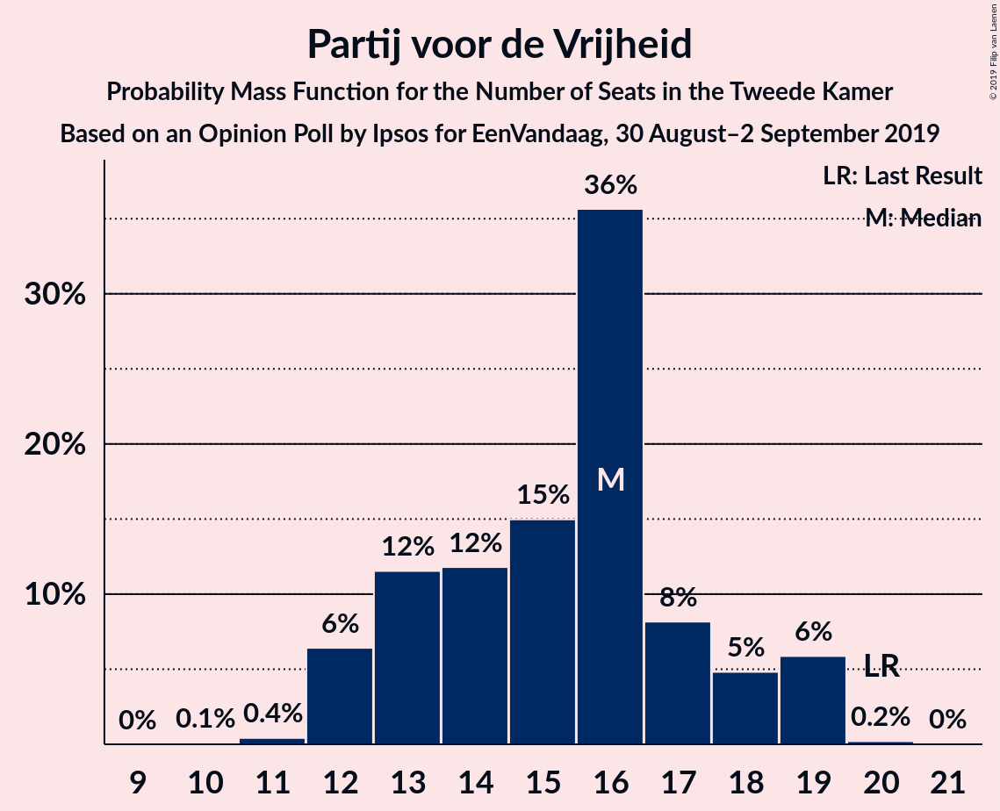

| Number of Seats | Probability | Accumulated | Special Marks |
|:---------------:|:-----------:|:-----------:|:-------------:|
| 10 | 0.1% | 100% |  |
| 11 | 0.5% | 99.9% |  |
| 12 | 3% | 99.4% |  |
| 13 | 5% | 97% |  |
| 14 | 10% | 91% |  |
| 15 | 7% | 81% |  |
| 16 | 47% | 74% | Median |
| 17 | 12% | 28% |  |
| 18 | 6% | 16% |  |
| 19 | 10% | 10% |  |
| 20 | 0% | 0% | Last Result |

### GroenLinks

*For a full overview of the results for this party, see the [GroenLinks](party-groenlinks.html) page.*

| Number of Seats | Probability | Accumulated | Special Marks |
|:---------------:|:-----------:|:-----------:|:-------------:|
| 9 | 0.1% | 100% |  |
| 10 | 0.1% | 99.9% |  |
| 11 | 2% | 99.9% |  |
| 12 | 1.4% | 98% |  |
| 13 | 43% | 97% |  |
| 14 | 18% | 54% | Last Result, Median |
| 15 | 20% | 35% |  |
| 16 | 10% | 15% |  |
| 17 | 5% | 6% |  |
| 18 | 0.3% | 0.4% |  |
| 19 | 0% | 0.1% |  |
| 20 | 0.1% | 0.1% |  |
| 21 | 0% | 0% |  |

### Partij van de Arbeid

*For a full overview of the results for this party, see the [Partij van de Arbeid](party-partijvandearbeid.html) page.*

| Number of Seats | Probability | Accumulated | Special Marks |
|:---------------:|:-----------:|:-----------:|:-------------:|
| 9 | 0% | 100% | Last Result |
| 10 | 3% | 100% |  |
| 11 | 1.3% | 97% |  |
| 12 | 10% | 96% |  |
| 13 | 60% | 86% | Median |
| 14 | 15% | 26% |  |
| 15 | 7% | 11% |  |
| 16 | 3% | 4% |  |
| 17 | 0.9% | 1.2% |  |
| 18 | 0.2% | 0.2% |  |
| 19 | 0% | 0.1% |  |
| 20 | 0% | 0% |  |

### Democraten 66

*For a full overview of the results for this party, see the [Democraten 66](party-democraten66.html) page.*

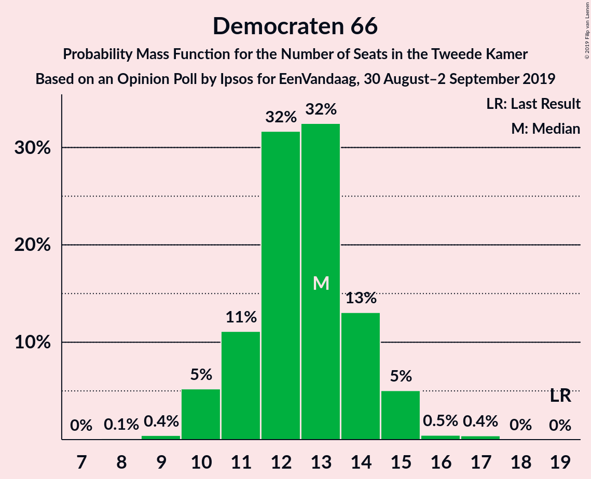

| Number of Seats | Probability | Accumulated | Special Marks |
|:---------------:|:-----------:|:-----------:|:-------------:|
| 8 | 0.2% | 100% |  |
| 9 | 0.2% | 99.8% |  |
| 10 | 7% | 99.6% |  |
| 11 | 16% | 93% |  |
| 12 | 19% | 77% |  |
| 13 | 42% | 58% | Median |
| 14 | 13% | 16% |  |
| 15 | 3% | 4% |  |
| 16 | 0.4% | 0.7% |  |
| 17 | 0.2% | 0.3% |  |
| 18 | 0% | 0% |  |
| 19 | 0% | 0% | Last Result |

### Forum voor Democratie

*For a full overview of the results for this party, see the [Forum voor Democratie](party-forumvoordemocratie.html) page.*

| Number of Seats | Probability | Accumulated | Special Marks |
|:---------------:|:-----------:|:-----------:|:-------------:|
| 2 | 0% | 100% | Last Result |
| 3 | 0% | 100% |  |
| 4 | 0% | 100% |  |
| 5 | 0% | 100% |  |
| 6 | 0% | 100% |  |
| 7 | 0.2% | 100% |  |
| 8 | 0.7% | 99.8% |  |
| 9 | 14% | 99.1% |  |
| 10 | 20% | 85% |  |
| 11 | 9% | 65% |  |
| 12 | 40% | 56% | Median |
| 13 | 15% | 16% |  |
| 14 | 0.1% | 1.2% |  |
| 15 | 1.0% | 1.0% |  |
| 16 | 0% | 0% |  |

### Socialistische Partij

*For a full overview of the results for this party, see the [Socialistische Partij](party-socialistischepartij.html) page.*

| Number of Seats | Probability | Accumulated | Special Marks |
|:---------------:|:-----------:|:-----------:|:-------------:|
| 5 | 0.1% | 100% |  |
| 6 | 2% | 99.9% |  |
| 7 | 20% | 98% |  |
| 8 | 15% | 78% |  |
| 9 | 55% | 63% | Median |
| 10 | 4% | 8% |  |
| 11 | 3% | 4% |  |
| 12 | 0.7% | 0.8% |  |
| 13 | 0.1% | 0.1% |  |
| 14 | 0% | 0% | Last Result |

### Partij voor de Dieren

*For a full overview of the results for this party, see the [Partij voor de Dieren](party-partijvoordedieren.html) page.*

| Number of Seats | Probability | Accumulated | Special Marks |
|:---------------:|:-----------:|:-----------:|:-------------:|
| 5 | 5% | 100% | Last Result |
| 6 | 9% | 95% |  |
| 7 | 11% | 86% |  |
| 8 | 56% | 75% | Median |
| 9 | 15% | 19% |  |
| 10 | 5% | 5% |  |
| 11 | 0.1% | 0.1% |  |
| 12 | 0% | 0% |  |

### ChristenUnie

*For a full overview of the results for this party, see the [ChristenUnie](party-christenunie.html) page.*

| Number of Seats | Probability | Accumulated | Special Marks |
|:---------------:|:-----------:|:-----------:|:-------------:|
| 4 | 1.1% | 100% |  |
| 5 | 14% | 98.9% | Last Result |
| 6 | 13% | 85% |  |
| 7 | 67% | 72% | Median |
| 8 | 1.2% | 5% |  |
| 9 | 4% | 4% |  |
| 10 | 0.2% | 0.2% |  |
| 11 | 0% | 0% |  |

### 50Plus

*For a full overview of the results for this party, see the [50Plus](party-50plus.html) page.*

| Number of Seats | Probability | Accumulated | Special Marks |
|:---------------:|:-----------:|:-----------:|:-------------:|
| 2 | 0.1% | 100% |  |
| 3 | 9% | 99.9% |  |
| 4 | 19% | 91% | Last Result |
| 5 | 5% | 72% |  |
| 6 | 59% | 67% | Median |
| 7 | 4% | 8% |  |
| 8 | 3% | 3% |  |
| 9 | 0% | 0% |  |

### Staatkundig Gereformeerde Partij

*For a full overview of the results for this party, see the [Staatkundig Gereformeerde Partij](party-staatkundiggereformeerdepartij.html) page.*

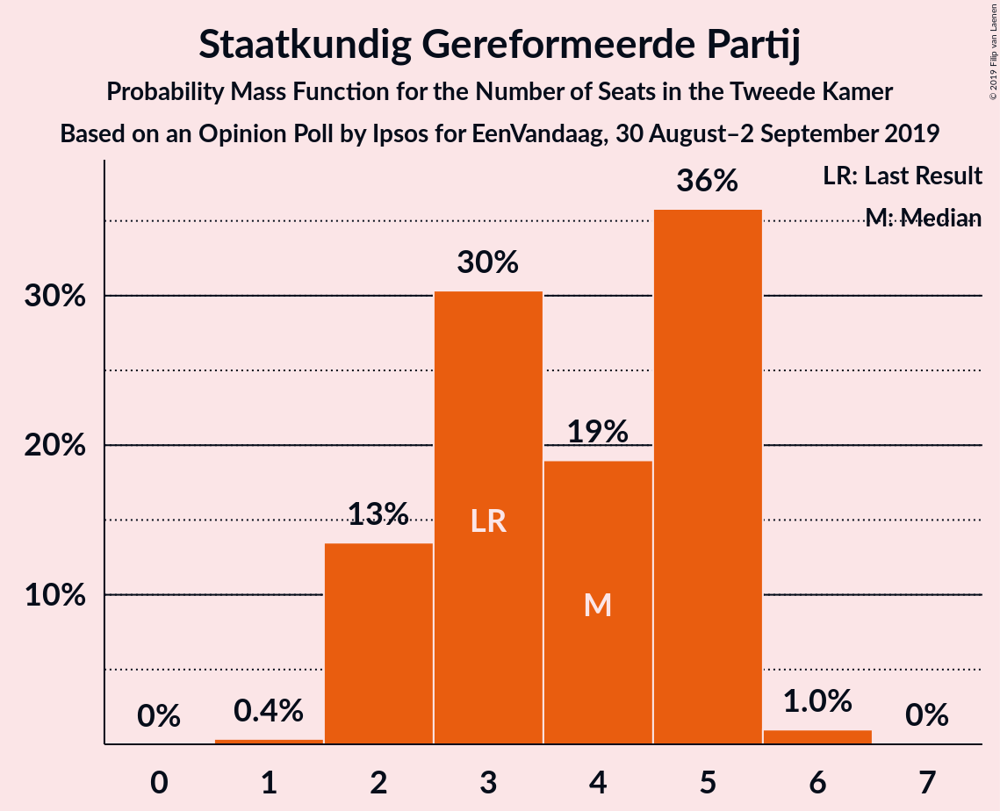

| Number of Seats | Probability | Accumulated | Special Marks |
|:---------------:|:-----------:|:-----------:|:-------------:|
| 1 | 0.1% | 100% |  |
| 2 | 17% | 99.9% |  |
| 3 | 21% | 83% | Last Result |
| 4 | 15% | 62% | Median |
| 5 | 46% | 47% |  |
| 6 | 1.1% | 1.1% |  |
| 7 | 0% | 0% |  |

### DENK

*For a full overview of the results for this party, see the [DENK](party-denk.html) page.*

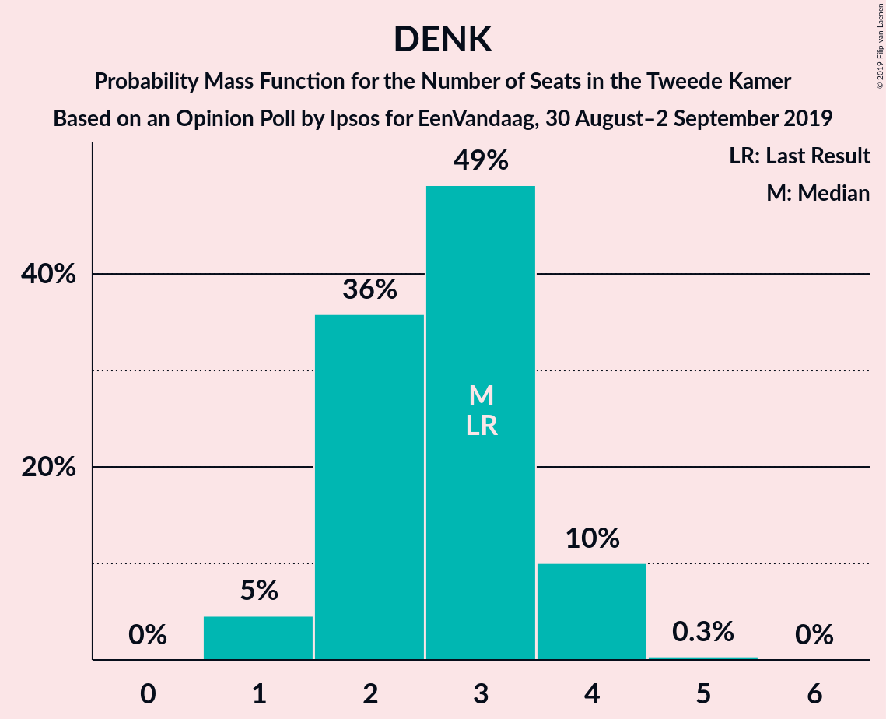

| Number of Seats | Probability | Accumulated | Special Marks |
|:---------------:|:-----------:|:-----------:|:-------------:|
| 1 | 3% | 100% |  |
| 2 | 32% | 97% |  |
| 3 | 60% | 65% | Last Result, Median |
| 4 | 5% | 5% |  |
| 5 | 0.4% | 0.5% |  |
| 6 | 0% | 0% |  |

## Coalitions

### Confidence Intervals

| Coalition | Last Result | Median | Majority? | 80% Confidence Interval | 90% Confidence Interval | 95% Confidence Interval | 99% Confidence Interval |
|:---------:|:-----------:|:------:|:---------:|:-----------------------:|:-----------------------:|:-----------------------:|:-----------------------:|
| Volkspartij voor Vrijheid en Democratie – Christen-Democratisch Appèl – GroenLinks – Democraten 66 – ChristenUnie | 90 | 80 | 98% | 76–83 | 76–85 | 76–87 | 74–87 |
| Volkspartij voor Vrijheid en Democratie – Christen-Democratisch Appèl – Partij van de Arbeid – Democraten 66 – ChristenUnie | 85 | 78 | 97% | 76–82 | 76–83 | 75–85 | 73–86 |
| Volkspartij voor Vrijheid en Democratie – Christen-Democratisch Appèl – Partij voor de Vrijheid – Forum voor Democratie – Staatkundig Gereformeerde Partij | 77 | 76 | 89% | 75–81 | 74–81 | 74–84 | 71–85 |
| Volkspartij voor Vrijheid en Democratie – Christen-Democratisch Appèl – Partij voor de Vrijheid – Forum voor Democratie | 74 | 72 | 26% | 71–79 | 71–79 | 70–80 | 67–81 |
| Christen-Democratisch Appèl – GroenLinks – Partij van de Arbeid – Democraten 66 – Socialistische Partij – ChristenUnie | 80 | 70 | 5% | 69–75 | 68–76 | 67–76 | 66–77 |
| Volkspartij voor Vrijheid en Democratie – Christen-Democratisch Appèl – Forum voor Democratie – 50Plus – Staatkundig Gereformeerde Partij | 61 | 66 | 0.1% | 62–71 | 62–72 | 62–73 | 61–74 |
| Volkspartij voor Vrijheid en Democratie – Christen-Democratisch Appèl – Democraten 66 – ChristenUnie | 76 | 65 | 0% | 63–69 | 63–70 | 61–70 | 60–73 |
| Volkspartij voor Vrijheid en Democratie – Christen-Democratisch Appèl – Partij voor de Vrijheid | 72 | 62 | 0% | 59–66 | 59–66 | 59–70 | 57–70 |
| Volkspartij voor Vrijheid en Democratie – Christen-Democratisch Appèl – Forum voor Democratie – 50Plus | 58 | 61 | 0% | 59–68 | 59–69 | 59–69 | 58–70 |
| Christen-Democratisch Appèl – GroenLinks – Partij van de Arbeid – Democraten 66 – ChristenUnie | 66 | 61 | 0% | 60–66 | 59–66 | 59–68 | 57–69 |
| Volkspartij voor Vrijheid en Democratie – Christen-Democratisch Appèl – Forum voor Democratie – Staatkundig Gereformeerde Partij | 57 | 60 | 0% | 59–65 | 59–67 | 56–67 | 56–68 |
| Volkspartij voor Vrijheid en Democratie – Christen-Democratisch Appèl – Partij van de Arbeid | 61 | 60 | 0% | 56–63 | 56–64 | 56–66 | 55–68 |
| Volkspartij voor Vrijheid en Democratie – Christen-Democratisch Appèl – Democraten 66 | 71 | 58 | 0% | 56–63 | 56–63 | 55–64 | 54–66 |
| Volkspartij voor Vrijheid en Democratie – Christen-Democratisch Appèl – Forum voor Democratie | 54 | 56 | 0% | 55–61 | 55–62 | 53–63 | 53–65 |
| Volkspartij voor Vrijheid en Democratie – Partij van de Arbeid – Democraten 66 | 61 | 55 | 0% | 54–60 | 53–62 | 52–63 | 52–65 |
| Volkspartij voor Vrijheid en Democratie – Christen-Democratisch Appèl | 52 | 47 | 0% | 43–50 | 43–51 | 43–53 | 43–54 |
| Volkspartij voor Vrijheid en Democratie – Partij van de Arbeid | 42 | 44 | 0% | 41–47 | 41–50 | 41–50 | 40–50 |
| Christen-Democratisch Appèl – Partij van de Arbeid – Democraten 66 | 47 | 41 | 0% | 40–45 | 39–45 | 38–47 | 37–47 |
| Christen-Democratisch Appèl – Partij van de Arbeid – ChristenUnie | 33 | 35 | 0% | 34–38 | 33–39 | 33–39 | 32–41 |
| Christen-Democratisch Appèl – Partij van de Arbeid | 28 | 28 | 0% | 28–31 | 27–32 | 27–33 | 25–34 |
| Christen-Democratisch Appèl – Democraten 66 | 38 | 28 | 0% | 26–31 | 26–31 | 25–32 | 24–33 |

### Volkspartij voor Vrijheid en Democratie – Christen-Democratisch Appèl – GroenLinks – Democraten 66 – ChristenUnie

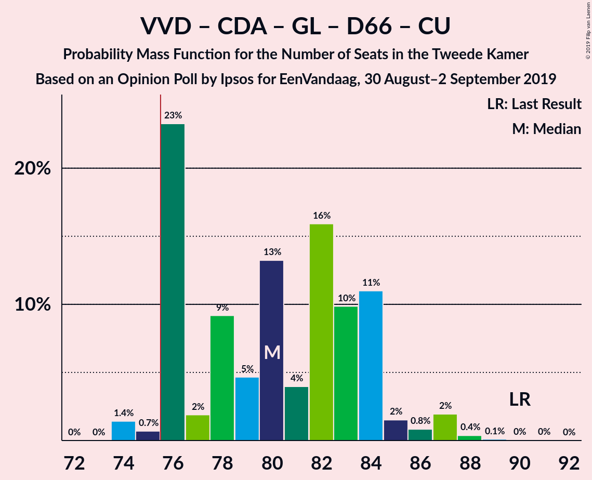

| Number of Seats | Probability | Accumulated | Special Marks |
|:---------------:|:-----------:|:-----------:|:-------------:|
| 73 | 0% | 100% |  |
| 74 | 2% | 99.9% |  |
| 75 | 0.1% | 98% |  |
| 76 | 38% | 98% | Majority |
| 77 | 1.5% | 60% |  |
| 78 | 2% | 58% |  |
| 79 | 4% | 56% | Median |
| 80 | 13% | 52% |  |
| 81 | 2% | 39% |  |
| 82 | 17% | 36% |  |
| 83 | 12% | 19% |  |
| 84 | 2% | 8% |  |
| 85 | 2% | 6% |  |
| 86 | 1.0% | 4% |  |
| 87 | 3% | 3% |  |
| 88 | 0.2% | 0.4% |  |
| 89 | 0.2% | 0.2% |  |
| 90 | 0% | 0% | Last Result |

### Volkspartij voor Vrijheid en Democratie – Christen-Democratisch Appèl – Partij van de Arbeid – Democraten 66 – ChristenUnie

| Number of Seats | Probability | Accumulated | Special Marks |
|:---------------:|:-----------:|:-----------:|:-------------:|
| 72 | 0.1% | 100% |  |
| 73 | 2% | 99.9% |  |
| 74 | 0.1% | 98% |  |
| 75 | 0.2% | 98% |  |
| 76 | 40% | 97% | Majority |
| 77 | 1.4% | 57% |  |
| 78 | 10% | 56% | Median |
| 79 | 12% | 46% |  |
| 80 | 8% | 34% |  |
| 81 | 2% | 26% |  |
| 82 | 16% | 24% |  |
| 83 | 3% | 8% |  |
| 84 | 0.3% | 5% |  |
| 85 | 3% | 5% | Last Result |
| 86 | 0.6% | 1.1% |  |
| 87 | 0.4% | 0.5% |  |
| 88 | 0% | 0.1% |  |
| 89 | 0% | 0% |  |

### Volkspartij voor Vrijheid en Democratie – Christen-Democratisch Appèl – Partij voor de Vrijheid – Forum voor Democratie – Staatkundig Gereformeerde Partij

| Number of Seats | Probability | Accumulated | Special Marks |
|:---------------:|:-----------:|:-----------:|:-------------:|
| 69 | 0.1% | 100% |  |
| 70 | 0% | 99.9% |  |
| 71 | 0.9% | 99.9% |  |
| 72 | 0.5% | 99.0% |  |
| 73 | 0.9% | 98% |  |
| 74 | 5% | 98% |  |
| 75 | 3% | 93% |  |
| 76 | 51% | 89% | Majority |
| 77 | 5% | 39% | Last Result, Median |
| 78 | 2% | 34% |  |
| 79 | 10% | 32% |  |
| 80 | 5% | 21% |  |
| 81 | 12% | 17% |  |
| 82 | 0.2% | 4% |  |
| 83 | 1.1% | 4% |  |
| 84 | 2% | 3% |  |
| 85 | 0.6% | 0.6% |  |
| 86 | 0% | 0% |  |

### Volkspartij voor Vrijheid en Democratie – Christen-Democratisch Appèl – Partij voor de Vrijheid – Forum voor Democratie

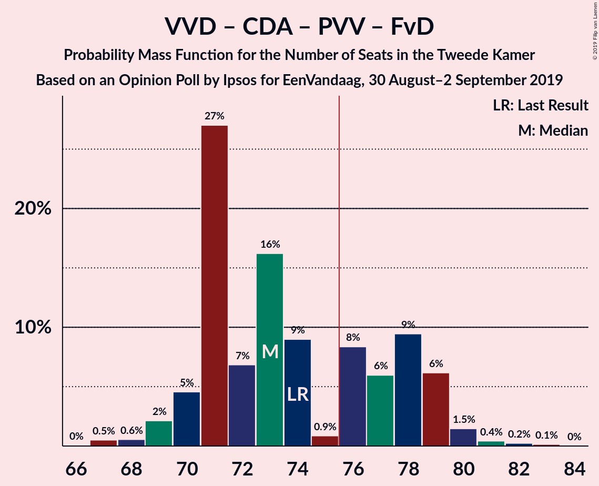

| Number of Seats | Probability | Accumulated | Special Marks |
|:---------------:|:-----------:|:-----------:|:-------------:|
| 66 | 0.1% | 100% |  |
| 67 | 0.8% | 99.9% |  |
| 68 | 0.2% | 99.2% |  |
| 69 | 0.5% | 98.9% |  |
| 70 | 2% | 98% |  |
| 71 | 44% | 97% |  |
| 72 | 3% | 53% |  |
| 73 | 12% | 49% | Median |
| 74 | 11% | 37% | Last Result |
| 75 | 0.5% | 27% |  |
| 76 | 5% | 26% | Majority |
| 77 | 7% | 21% |  |
| 78 | 1.3% | 14% |  |
| 79 | 10% | 13% |  |
| 80 | 2% | 3% |  |
| 81 | 0.3% | 0.7% |  |
| 82 | 0.4% | 0.4% |  |
| 83 | 0% | 0% |  |

### Christen-Democratisch Appèl – GroenLinks – Partij van de Arbeid – Democraten 66 – Socialistische Partij – ChristenUnie

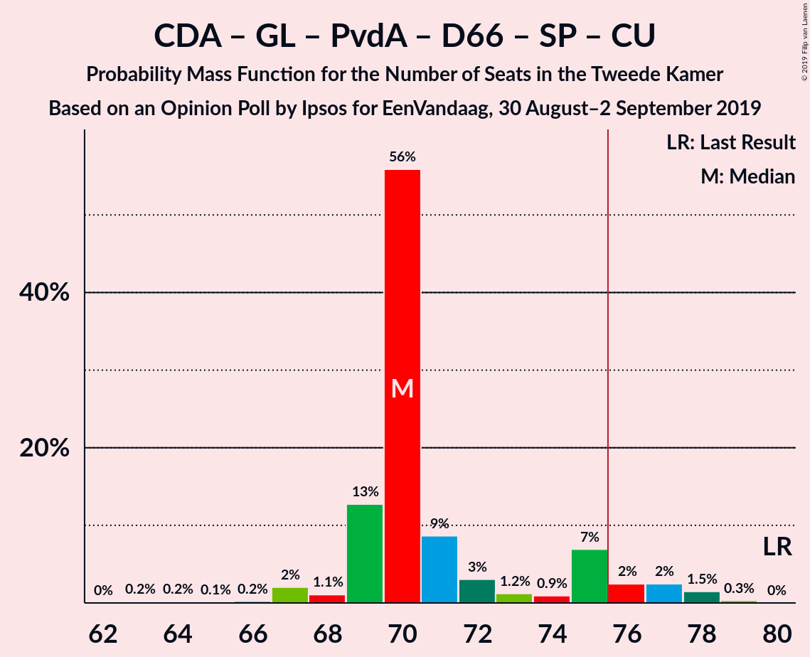

| Number of Seats | Probability | Accumulated | Special Marks |
|:---------------:|:-----------:|:-----------:|:-------------:|
| 62 | 0.1% | 100% |  |
| 63 | 0% | 99.9% |  |
| 64 | 0.2% | 99.9% |  |
| 65 | 0% | 99.7% |  |
| 66 | 0.3% | 99.7% |  |
| 67 | 3% | 99.4% |  |
| 68 | 1.5% | 96% |  |
| 69 | 17% | 95% |  |
| 70 | 56% | 78% |  |
| 71 | 1.1% | 22% | Median |
| 72 | 4% | 21% |  |
| 73 | 0.2% | 17% |  |
| 74 | 0.3% | 17% |  |
| 75 | 11% | 16% |  |
| 76 | 4% | 5% | Majority |
| 77 | 1.5% | 2% |  |
| 78 | 0.1% | 0.2% |  |
| 79 | 0.1% | 0.1% |  |
| 80 | 0% | 0% | Last Result |

### Volkspartij voor Vrijheid en Democratie – Christen-Democratisch Appèl – Forum voor Democratie – 50Plus – Staatkundig Gereformeerde Partij

| Number of Seats | Probability | Accumulated | Special Marks |
|:---------------:|:-----------:|:-----------:|:-------------:|
| 60 | 0.3% | 100% |  |
| 61 | 0.5% | 99.7% | Last Result |
| 62 | 11% | 99.2% |  |
| 63 | 1.0% | 88% |  |
| 64 | 2% | 87% |  |
| 65 | 0.8% | 85% |  |
| 66 | 50% | 84% |  |
| 67 | 8% | 34% | Median |
| 68 | 5% | 26% |  |
| 69 | 3% | 22% |  |
| 70 | 3% | 19% |  |
| 71 | 6% | 16% |  |
| 72 | 7% | 10% |  |
| 73 | 2% | 3% |  |
| 74 | 0.4% | 0.6% |  |
| 75 | 0.1% | 0.2% |  |
| 76 | 0.1% | 0.1% | Majority |
| 77 | 0% | 0% |  |

### Volkspartij voor Vrijheid en Democratie – Christen-Democratisch Appèl – Democraten 66 – ChristenUnie

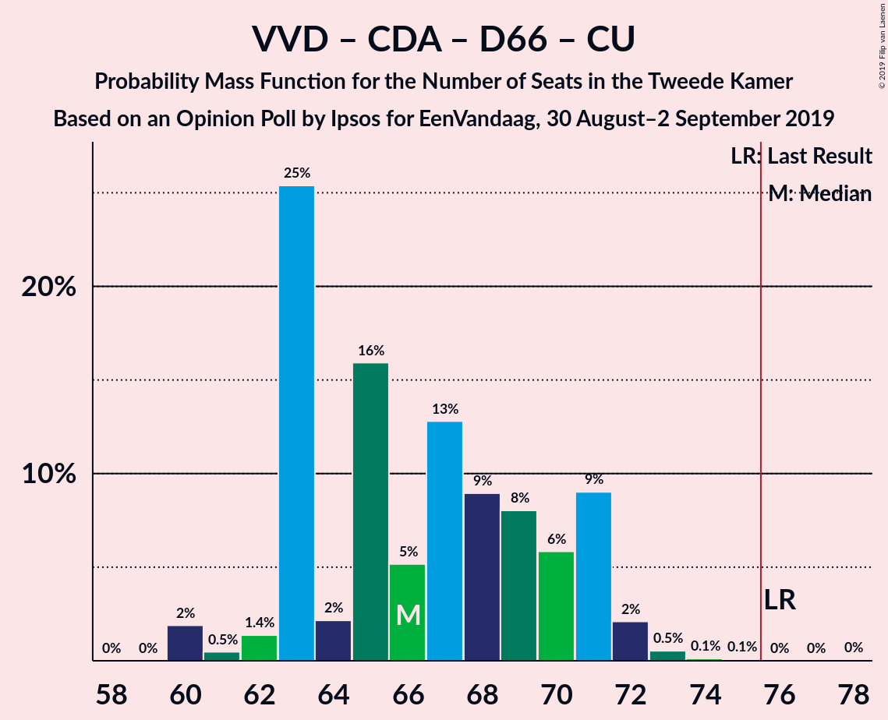

| Number of Seats | Probability | Accumulated | Special Marks |
|:---------------:|:-----------:|:-----------:|:-------------:|
| 60 | 2% | 100% |  |
| 61 | 0.2% | 98% |  |
| 62 | 0.3% | 97% |  |
| 63 | 41% | 97% |  |
| 64 | 2% | 56% |  |
| 65 | 14% | 55% | Median |
| 66 | 1.4% | 41% |  |
| 67 | 15% | 39% |  |
| 68 | 11% | 25% |  |
| 69 | 6% | 13% |  |
| 70 | 5% | 7% |  |
| 71 | 1.1% | 2% |  |
| 72 | 0.5% | 1.0% |  |
| 73 | 0.2% | 0.6% |  |
| 74 | 0.2% | 0.3% |  |
| 75 | 0.1% | 0.1% |  |
| 76 | 0% | 0% | Last Result, Majority |

### Volkspartij voor Vrijheid en Democratie – Christen-Democratisch Appèl – Partij voor de Vrijheid

| Number of Seats | Probability | Accumulated | Special Marks |
|:---------------:|:-----------:|:-----------:|:-------------:|
| 55 | 0.4% | 100% |  |
| 56 | 0.1% | 99.6% |  |
| 57 | 0.3% | 99.5% |  |
| 58 | 0.8% | 99.2% |  |
| 59 | 39% | 98% |  |
| 60 | 0.9% | 60% |  |
| 61 | 7% | 59% | Median |
| 62 | 5% | 52% |  |
| 63 | 5% | 47% |  |
| 64 | 21% | 43% |  |
| 65 | 1.1% | 22% |  |
| 66 | 16% | 21% |  |
| 67 | 0.2% | 5% |  |
| 68 | 1.2% | 4% |  |
| 69 | 0.5% | 3% |  |
| 70 | 2% | 3% |  |
| 71 | 0.4% | 0.4% |  |
| 72 | 0% | 0% | Last Result |

### Volkspartij voor Vrijheid en Democratie – Christen-Democratisch Appèl – Forum voor Democratie – 50Plus

| Number of Seats | Probability | Accumulated | Special Marks |
|:---------------:|:-----------:|:-----------:|:-------------:|
| 56 | 0.2% | 100% |  |
| 57 | 0.3% | 99.8% |  |
| 58 | 0.1% | 99.5% | Last Result |
| 59 | 11% | 99.4% |  |
| 60 | 0.8% | 88% |  |
| 61 | 39% | 88% |  |
| 62 | 5% | 49% |  |
| 63 | 5% | 44% | Median |
| 64 | 14% | 39% |  |
| 65 | 6% | 26% |  |
| 66 | 9% | 20% |  |
| 67 | 0.7% | 11% |  |
| 68 | 4% | 10% |  |
| 69 | 6% | 6% |  |
| 70 | 0.4% | 0.8% |  |
| 71 | 0.3% | 0.4% |  |
| 72 | 0% | 0.1% |  |
| 73 | 0.1% | 0.1% |  |
| 74 | 0% | 0% |  |

### Christen-Democratisch Appèl – GroenLinks – Partij van de Arbeid – Democraten 66 – ChristenUnie

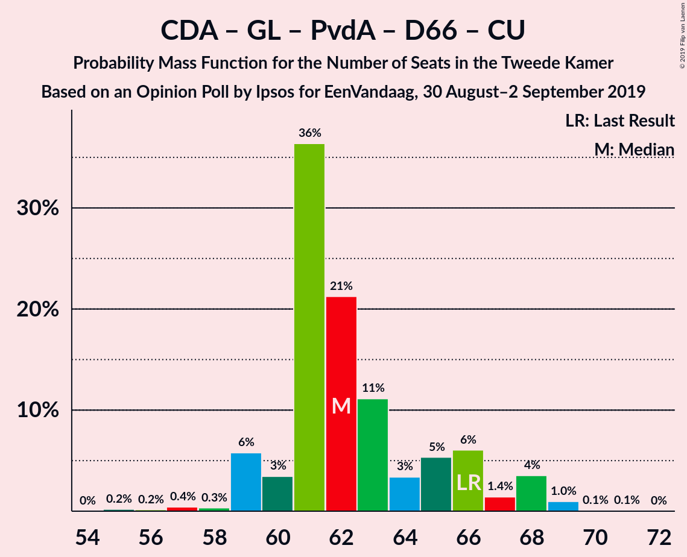

| Number of Seats | Probability | Accumulated | Special Marks |
|:---------------:|:-----------:|:-----------:|:-------------:|
| 54 | 0.1% | 100% |  |
| 55 | 0% | 99.9% |  |
| 56 | 0.2% | 99.9% |  |
| 57 | 0.6% | 99.7% |  |
| 58 | 0.3% | 99.1% |  |
| 59 | 7% | 98.8% |  |
| 60 | 3% | 92% |  |
| 61 | 43% | 89% |  |
| 62 | 17% | 46% | Median |
| 63 | 8% | 28% |  |
| 64 | 0.6% | 21% |  |
| 65 | 6% | 20% |  |
| 66 | 9% | 14% | Last Result |
| 67 | 2% | 5% |  |
| 68 | 2% | 3% |  |
| 69 | 1.0% | 1.1% |  |
| 70 | 0.1% | 0.1% |  |
| 71 | 0% | 0% |  |

### Volkspartij voor Vrijheid en Democratie – Christen-Democratisch Appèl – Forum voor Democratie – Staatkundig Gereformeerde Partij

| Number of Seats | Probability | Accumulated | Special Marks |
|:---------------:|:-----------:|:-----------:|:-------------:|
| 55 | 0% | 100% |  |
| 56 | 3% | 99.9% |  |
| 57 | 0.8% | 97% | Last Result |
| 58 | 0.2% | 96% |  |
| 59 | 11% | 96% |  |
| 60 | 38% | 85% |  |
| 61 | 8% | 47% | Median |
| 62 | 14% | 39% |  |
| 63 | 3% | 25% |  |
| 64 | 8% | 22% |  |
| 65 | 9% | 14% |  |
| 66 | 0.5% | 6% |  |
| 67 | 4% | 5% |  |
| 68 | 1.1% | 2% |  |
| 69 | 0.3% | 0.5% |  |
| 70 | 0.1% | 0.2% |  |
| 71 | 0% | 0.1% |  |
| 72 | 0% | 0% |  |

### Volkspartij voor Vrijheid en Democratie – Christen-Democratisch Appèl – Partij van de Arbeid

| Number of Seats | Probability | Accumulated | Special Marks |
|:---------------:|:-----------:|:-----------:|:-------------:|
| 54 | 0.1% | 100% |  |
| 55 | 0.4% | 99.9% |  |
| 56 | 40% | 99.5% |  |
| 57 | 0.4% | 60% |  |
| 58 | 4% | 59% | Median |
| 59 | 0.5% | 56% |  |
| 60 | 11% | 55% |  |
| 61 | 16% | 45% | Last Result |
| 62 | 8% | 29% |  |
| 63 | 16% | 21% |  |
| 64 | 2% | 6% |  |
| 65 | 0.6% | 4% |  |
| 66 | 2% | 3% |  |
| 67 | 0.7% | 1.3% |  |
| 68 | 0.5% | 0.6% |  |
| 69 | 0.1% | 0.1% |  |
| 70 | 0% | 0% |  |

### Volkspartij voor Vrijheid en Democratie – Christen-Democratisch Appèl – Democraten 66

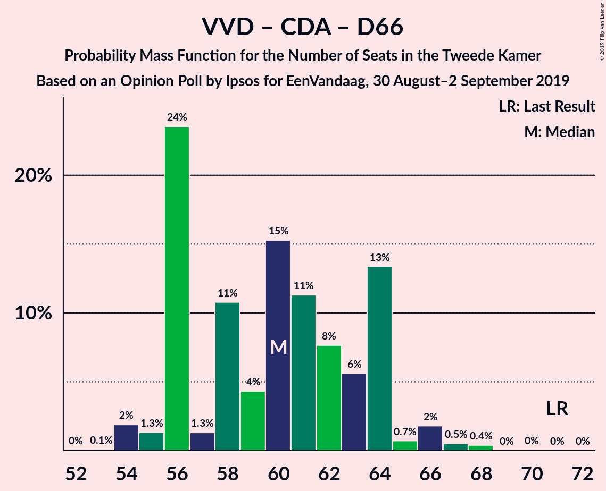

| Number of Seats | Probability | Accumulated | Special Marks |
|:---------------:|:-----------:|:-----------:|:-------------:|
| 52 | 0.1% | 100% |  |
| 53 | 0.1% | 99.9% |  |
| 54 | 2% | 99.8% |  |
| 55 | 0.2% | 98% |  |
| 56 | 38% | 97% |  |
| 57 | 1.2% | 59% |  |
| 58 | 16% | 58% | Median |
| 59 | 2% | 42% |  |
| 60 | 5% | 40% |  |
| 61 | 15% | 35% |  |
| 62 | 9% | 20% |  |
| 63 | 9% | 11% |  |
| 64 | 1.1% | 3% |  |
| 65 | 0.9% | 2% |  |
| 66 | 0.3% | 0.7% |  |
| 67 | 0.1% | 0.4% |  |
| 68 | 0.2% | 0.3% |  |
| 69 | 0% | 0.1% |  |
| 70 | 0% | 0% |  |
| 71 | 0% | 0% | Last Result |

### Volkspartij voor Vrijheid en Democratie – Christen-Democratisch Appèl – Forum voor Democratie

| Number of Seats | Probability | Accumulated | Special Marks |
|:---------------:|:-----------:|:-----------:|:-------------:|
| 52 | 0.2% | 100% |  |
| 53 | 3% | 99.8% |  |
| 54 | 0.6% | 97% | Last Result |
| 55 | 38% | 97% |  |
| 56 | 12% | 58% |  |
| 57 | 5% | 47% | Median |
| 58 | 1.1% | 42% |  |
| 59 | 7% | 41% |  |
| 60 | 21% | 34% |  |
| 61 | 6% | 12% |  |
| 62 | 1.2% | 6% |  |
| 63 | 3% | 5% |  |
| 64 | 1.1% | 2% |  |
| 65 | 0.5% | 0.9% |  |
| 66 | 0.3% | 0.4% |  |
| 67 | 0% | 0.1% |  |
| 68 | 0% | 0% |  |

### Volkspartij voor Vrijheid en Democratie – Partij van de Arbeid – Democraten 66

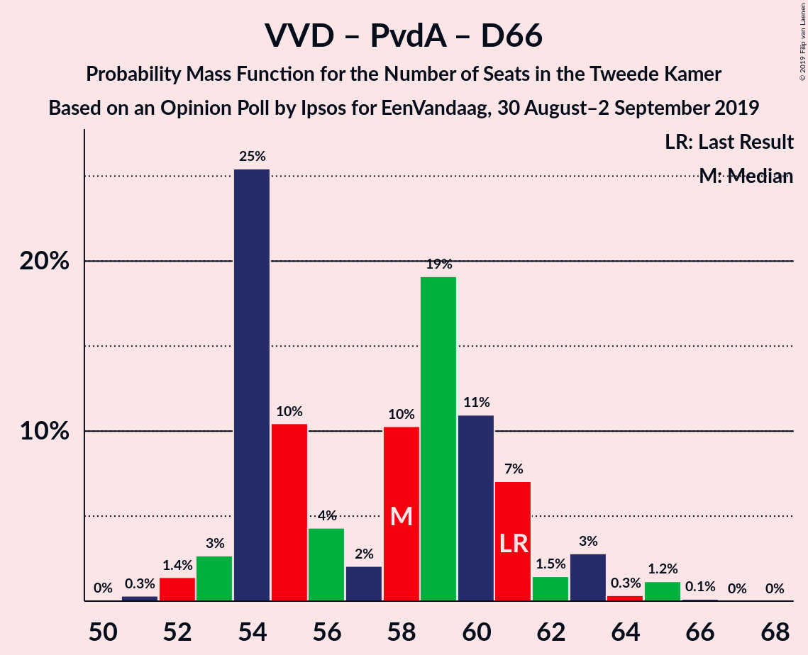

| Number of Seats | Probability | Accumulated | Special Marks |
|:---------------:|:-----------:|:-----------:|:-------------:|
| 49 | 0.1% | 100% |  |
| 50 | 0.1% | 99.9% |  |
| 51 | 0.2% | 99.9% |  |
| 52 | 2% | 99.7% |  |
| 53 | 4% | 97% |  |
| 54 | 41% | 94% |  |
| 55 | 13% | 53% |  |
| 56 | 0.8% | 40% | Median |
| 57 | 3% | 39% |  |
| 58 | 15% | 36% |  |
| 59 | 9% | 21% |  |
| 60 | 3% | 12% |  |
| 61 | 3% | 8% | Last Result |
| 62 | 2% | 6% |  |
| 63 | 2% | 4% |  |
| 64 | 0.3% | 2% |  |
| 65 | 2% | 2% |  |
| 66 | 0.1% | 0.1% |  |
| 67 | 0% | 0% |  |

### Volkspartij voor Vrijheid en Democratie – Christen-Democratisch Appèl

| Number of Seats | Probability | Accumulated | Special Marks |
|:---------------:|:-----------:|:-----------:|:-------------:|
| 41 | 0.1% | 100% |  |
| 42 | 0.4% | 99.9% |  |
| 43 | 40% | 99.6% |  |
| 44 | 1.4% | 60% |  |
| 45 | 0.7% | 58% | Median |
| 46 | 4% | 58% |  |
| 47 | 20% | 53% |  |
| 48 | 11% | 33% |  |
| 49 | 3% | 22% |  |
| 50 | 11% | 19% |  |
| 51 | 3% | 7% |  |
| 52 | 0.6% | 4% | Last Result |
| 53 | 2% | 4% |  |
| 54 | 0.9% | 1.3% |  |
| 55 | 0.4% | 0.4% |  |
| 56 | 0% | 0% |  |

### Volkspartij voor Vrijheid en Democratie – Partij van de Arbeid

| Number of Seats | Probability | Accumulated | Special Marks |
|:---------------:|:-----------:|:-----------:|:-------------:|
| 38 | 0% | 100% |  |
| 39 | 0.1% | 99.9% |  |
| 40 | 0.3% | 99.8% |  |
| 41 | 41% | 99.5% |  |
| 42 | 0.6% | 58% | Last Result |
| 43 | 6% | 58% | Median |
| 44 | 21% | 51% |  |
| 45 | 6% | 30% |  |
| 46 | 5% | 25% |  |
| 47 | 10% | 19% |  |
| 48 | 1.4% | 9% |  |
| 49 | 2% | 8% |  |
| 50 | 6% | 6% |  |
| 51 | 0.2% | 0.3% |  |
| 52 | 0.1% | 0.1% |  |
| 53 | 0% | 0% |  |

### Christen-Democratisch Appèl – Partij van de Arbeid – Democraten 66

| Number of Seats | Probability | Accumulated | Special Marks |
|:---------------:|:-----------:|:-----------:|:-------------:|
| 35 | 0% | 100% |  |
| 36 | 0.1% | 99.9% |  |
| 37 | 0.5% | 99.9% |  |
| 38 | 4% | 99.3% |  |
| 39 | 5% | 95% |  |
| 40 | 17% | 90% |  |
| 41 | 47% | 73% | Median |
| 42 | 2% | 26% |  |
| 43 | 6% | 24% |  |
| 44 | 5% | 18% |  |
| 45 | 9% | 13% |  |
| 46 | 1.3% | 4% |  |
| 47 | 2% | 3% | Last Result |
| 48 | 0.1% | 0.4% |  |
| 49 | 0% | 0.3% |  |
| 50 | 0.2% | 0.3% |  |
| 51 | 0% | 0% |  |

### Christen-Democratisch Appèl – Partij van de Arbeid – ChristenUnie

| Number of Seats | Probability | Accumulated | Special Marks |
|:---------------:|:-----------:|:-----------:|:-------------:|
| 29 | 0.2% | 100% |  |
| 30 | 0.1% | 99.8% |  |
| 31 | 0.2% | 99.8% |  |
| 32 | 0.3% | 99.6% |  |
| 33 | 4% | 99.3% | Last Result |
| 34 | 12% | 95% |  |
| 35 | 43% | 83% | Median |
| 36 | 22% | 40% |  |
| 37 | 0.8% | 18% |  |
| 38 | 11% | 17% |  |
| 39 | 4% | 6% |  |
| 40 | 1.3% | 2% |  |
| 41 | 0.6% | 0.9% |  |
| 42 | 0.3% | 0.3% |  |
| 43 | 0% | 0% |  |

### Christen-Democratisch Appèl – Partij van de Arbeid

| Number of Seats | Probability | Accumulated | Special Marks |
|:---------------:|:-----------:|:-----------:|:-------------:|
| 23 | 0.2% | 100% |  |
| 24 | 0.1% | 99.8% |  |
| 25 | 0.5% | 99.8% |  |
| 26 | 1.2% | 99.3% |  |
| 27 | 6% | 98% |  |
| 28 | 45% | 92% | Last Result, Median |
| 29 | 19% | 47% |  |
| 30 | 8% | 28% |  |
| 31 | 12% | 20% |  |
| 32 | 4% | 8% |  |
| 33 | 2% | 3% |  |
| 34 | 0.5% | 1.0% |  |
| 35 | 0.4% | 0.5% |  |
| 36 | 0.1% | 0.1% |  |
| 37 | 0% | 0% |  |

### Christen-Democratisch Appèl – Democraten 66

| Number of Seats | Probability | Accumulated | Special Marks |
|:---------------:|:-----------:|:-----------:|:-------------:|
| 23 | 0.2% | 100% |  |
| 24 | 0.6% | 99.8% |  |
| 25 | 2% | 99.2% |  |
| 26 | 8% | 97% |  |
| 27 | 16% | 90% |  |
| 28 | 47% | 74% | Median |
| 29 | 9% | 27% |  |
| 30 | 4% | 18% |  |
| 31 | 9% | 14% |  |
| 32 | 4% | 5% |  |
| 33 | 0.8% | 1.2% |  |
| 34 | 0.1% | 0.4% |  |
| 35 | 0% | 0.2% |  |
| 36 | 0.2% | 0.2% |  |
| 37 | 0% | 0% |  |
| 38 | 0% | 0% | Last Result |

## Technical Information

### Opinion Poll

+ **Polling firm:** Ipsos
+ **Commissioner(s):** EenVandaag
+ **Fieldwork period:** 30 August–2 September 2019

### Calculations

+ **Sample size:** 1001
+ **Simulations done:** 524,288
+ **Error estimate:** 1.87%

