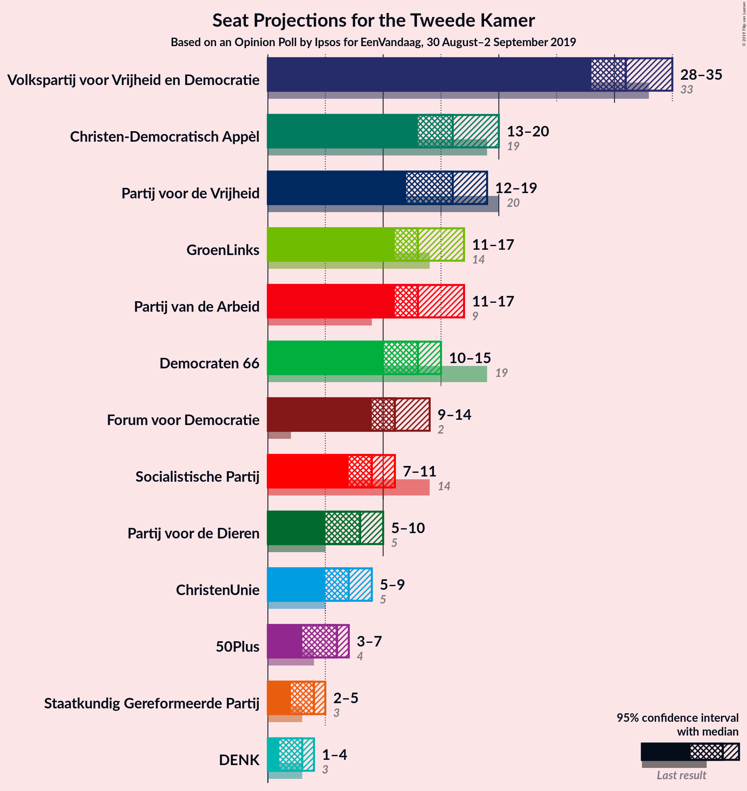
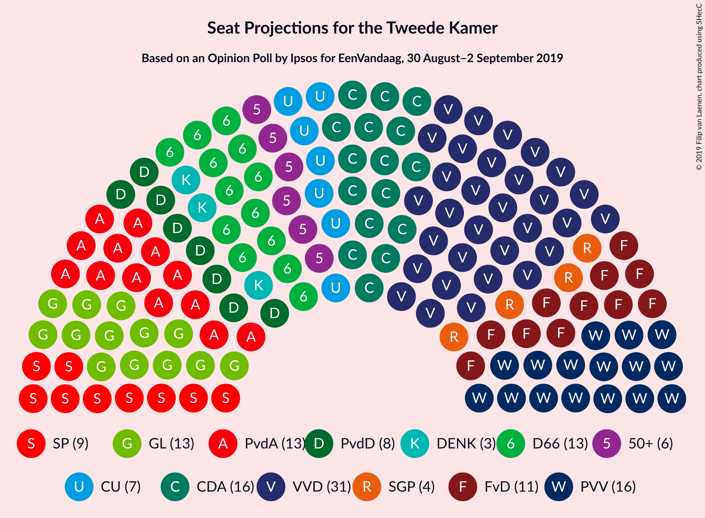
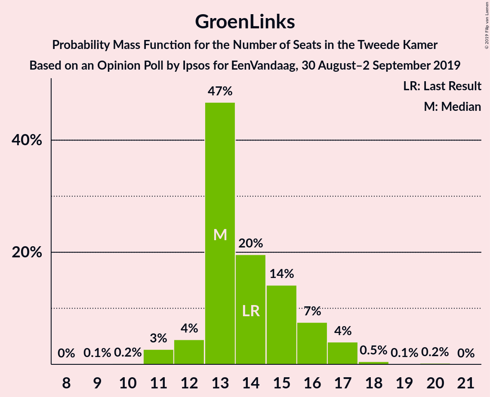
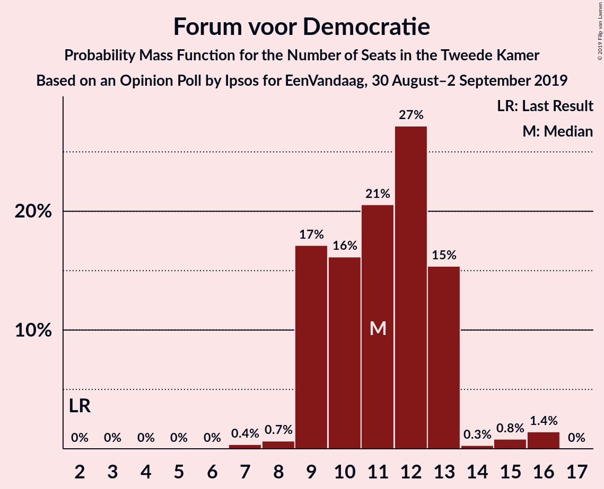
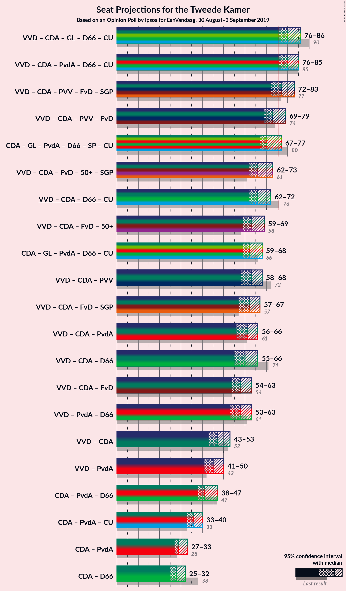
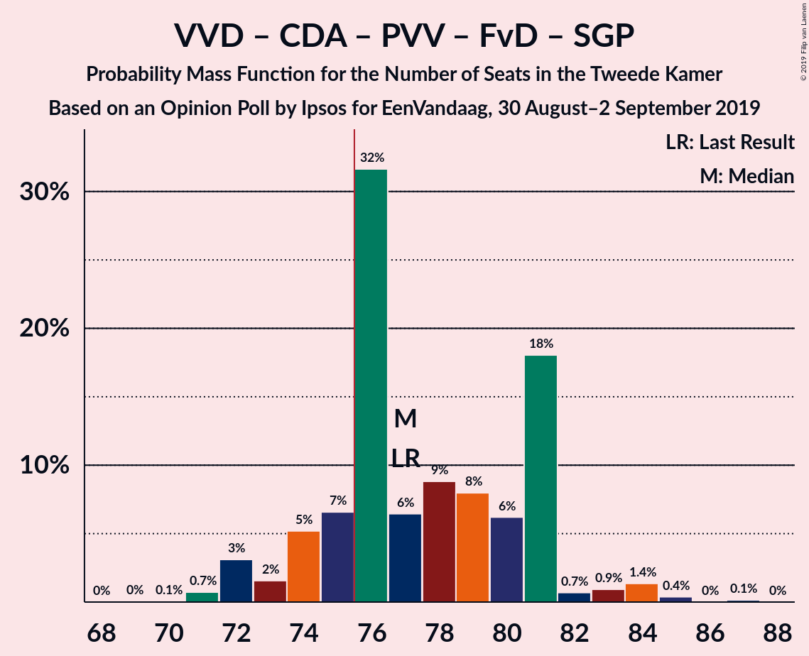
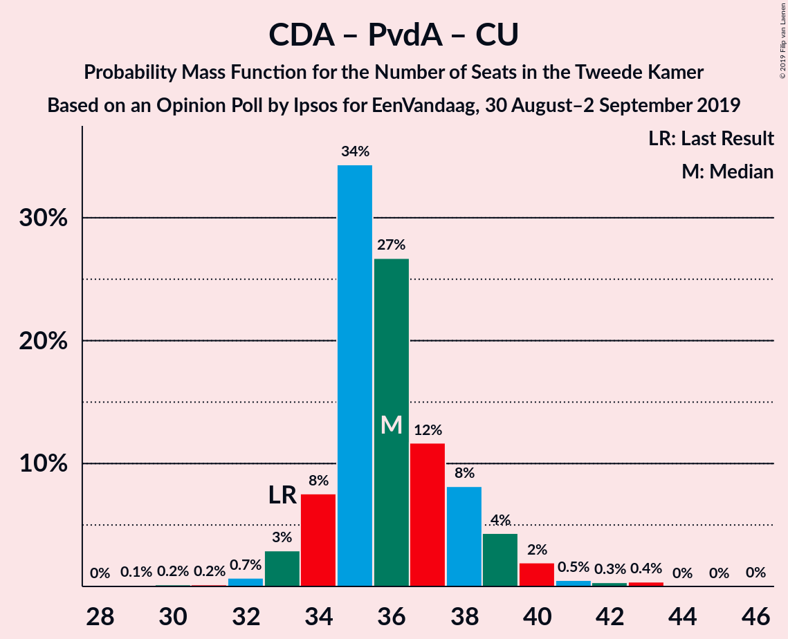

# Opinion Poll by Ipsos for EenVandaag, 30 August–2 September 2019

<a href="#voting-intentions">Voting Intentions</a> | <a href="#seats">Seats</a> | <a href="#coalitions">Coalitions</a> | <a href="#technical-information">Technical Information</a>

## Voting Intentions

### Confidence Intervals

| Party | Last Result | Poll Result | 80% Confidence Interval | 90% Confidence Interval | 95% Confidence Interval | 99% Confidence Interval |
|:-----:|:-----------:|:-----------:|:-----------------------:|:-----------------------:|:-----------------------:|:-----------------------:|
| Volkspartij voor Vrijheid en Democratie | 21.3% | 20.9% | 19.3–22.6% |18.9–23.1% |18.5–23.5% |17.7–24.4% |
| Christen-Democratisch Appèl | 12.4% | 10.7% | 9.5–12.0% |9.2–12.4% |8.9–12.8% |8.4–13.4% |
| Partij voor de Vrijheid | 13.1% | 9.9% | 8.8–11.2% |8.5–11.6% |8.2–11.9% |7.7–12.6% |
| GroenLinks | 9.1% | 9.3% | 8.2–10.6% |7.9–10.9% |7.6–11.3% |7.1–11.9% |
| Partij van de Arbeid | 5.7% | 9.1% | 8.0–10.4% |7.7–10.7% |7.5–11.0% |7.0–11.7% |
| Democraten 66 | 12.2% | 8.4% | 7.4–9.6% |7.1–10.0% |6.8–10.3% |6.4–10.9% |
| Forum voor Democratie | 1.8% | 7.3% | 6.3–8.5% |6.1–8.8% |5.8–9.1% |5.4–9.7% |
| Socialistische Partij | 9.1% | 5.8% | 4.9–6.9% |4.7–7.2% |4.5–7.4% |4.1–8.0% |
| Partij voor de Dieren | 3.2% | 5.1% | 4.3–6.1% |4.1–6.4% |3.9–6.6% |3.6–7.2% |
| ChristenUnie | 3.4% | 4.4% | 3.7–5.3% |3.5–5.6% |3.3–5.9% |3.0–6.3% |
| 50Plus | 3.1% | 3.5% | 2.9–4.4% |2.7–4.6% |2.5–4.8% |2.2–5.3% |
| Staatkundig Gereformeerde Partij | 2.1% | 2.4% | 1.9–3.2% |1.7–3.4% |1.6–3.6% |1.4–3.9% |
| DENK | 2.1% | 1.8% | 1.4–2.5% |1.2–2.7% |1.1–2.8% |1.0–3.2% |

*Note:* The poll result column reflects the actual value used in the calculations. Published results may vary slightly, and in addition be rounded to fewer digits.

## Seats

### Confidence Intervals

| Party | Last Result | Median | 80% Confidence Interval | 90% Confidence Interval | 95% Confidence Interval | 99% Confidence Interval |
|:-----:|:-----------:|:------:|:-----------------------:|:-----------------------:|:-----------------------:|:-----------------------:|
| <a href="#volkspartij-voor-vrijheid-en-democratie">Volkspartij voor Vrijheid en Democratie</a> | 33 | 31 | 30–34 |30–35 |29–35 |28–36 |
| <a href="#christen-democratisch-appèl">Christen-Democratisch Appèl</a> | 19 | 16 | 15–17 |13–17 |13–18 |12–21 |
| <a href="#partij-voor-de-vrijheid">Partij voor de Vrijheid</a> | 20 | 17 | 12–19 |12–19 |12–19 |11–19 |
| <a href="#groenlinks">GroenLinks</a> | 14 | 14 | 13–15 |13–15 |13–16 |12–17 |
| <a href="#partij-van-de-arbeid">Partij van de Arbeid</a> | 9 | 14 | 13–15 |13–16 |13–17 |10–18 |
| <a href="#democraten-66">Democraten 66</a> | 19 | 12 | 11–14 |11–15 |11–15 |10–15 |
| <a href="#forum-voor-democratie">Forum voor Democratie</a> | 2 | 11 | 9–13 |9–13 |9–13 |8–14 |
| <a href="#socialistische-partij">Socialistische Partij</a> | 14 | 8 | 7–10 |6–10 |6–10 |6–12 |
| <a href="#partij-voor-de-dieren">Partij voor de Dieren</a> | 5 | 8 | 7–9 |7–9 |6–9 |5–10 |
| <a href="#christenunie">ChristenUnie</a> | 5 | 7 | 7 |6–7 |5–7 |4–9 |
| <a href="#50plus">50Plus</a> | 4 | 4 | 3–6 |3–6 |3–7 |3–8 |
| <a href="#staatkundig-gereformeerde-partij">Staatkundig Gereformeerde Partij</a> | 3 | 3 | 2–4 |2–4 |2–4 |2–5 |
| <a href="#denk">DENK</a> | 3 | 3 | 2–3 |2–3 |2–4 |1–5 |

### Volkspartij voor Vrijheid en Democratie

*For a full overview of the results for this party, see the [Volkspartij voor Vrijheid en Democratie](party-volkspartijvoorvrijheidendemocratie.html) page.*

| Number of Seats | Probability | Accumulated | Special Marks |
|:---------------:|:-----------:|:-----------:|:-------------:|
| 26 | 0% | 100% |  |
| 27 | 0.3% | 99.9% |  |
| 28 | 2% | 99.7% |  |
| 29 | 2% | 98% |  |
| 30 | 34% | 96% |  |
| 31 | 41% | 62% | Median |
| 32 | 2% | 21% |  |
| 33 | 3% | 19% | Last Result |
| 34 | 9% | 16% |  |
| 35 | 6% | 8% |  |
| 36 | 0.7% | 1.1% |  |
| 37 | 0% | 0.5% |  |
| 38 | 0.4% | 0.4% |  |
| 39 | 0% | 0% |  |

### Christen-Democratisch Appèl

*For a full overview of the results for this party, see the [Christen-Democratisch Appèl](party-christen-democratischappèl.html) page.*

| Number of Seats | Probability | Accumulated | Special Marks |
|:---------------:|:-----------:|:-----------:|:-------------:|
| 12 | 1.3% | 100% |  |
| 13 | 8% | 98.7% |  |
| 14 | 0.9% | 91% |  |
| 15 | 4% | 90% |  |
| 16 | 48% | 87% | Median |
| 17 | 35% | 39% |  |
| 18 | 2% | 4% |  |
| 19 | 1.2% | 2% | Last Result |
| 20 | 0.1% | 1.3% |  |
| 21 | 1.2% | 1.2% |  |
| 22 | 0% | 0% |  |

### Partij voor de Vrijheid

*For a full overview of the results for this party, see the [Partij voor de Vrijheid](party-partijvoordevrijheid.html) page.*

| Number of Seats | Probability | Accumulated | Special Marks |
|:---------------:|:-----------:|:-----------:|:-------------:|
| 10 | 0.4% | 100% |  |
| 11 | 2% | 99.6% |  |
| 12 | 9% | 98% |  |
| 13 | 2% | 89% |  |
| 14 | 7% | 87% |  |
| 15 | 4% | 80% |  |
| 16 | 1.4% | 76% |  |
| 17 | 35% | 75% | Median |
| 18 | 1.4% | 40% |  |
| 19 | 39% | 39% |  |
| 20 | 0.1% | 0.1% | Last Result |
| 21 | 0% | 0% |  |

### GroenLinks

*For a full overview of the results for this party, see the [GroenLinks](party-groenlinks.html) page.*

| Number of Seats | Probability | Accumulated | Special Marks |
|:---------------:|:-----------:|:-----------:|:-------------:|
| 10 | 0.1% | 100% |  |
| 11 | 0.2% | 99.9% |  |
| 12 | 2% | 99.7% |  |
| 13 | 11% | 98% |  |
| 14 | 41% | 87% | Last Result, Median |
| 15 | 43% | 46% |  |
| 16 | 2% | 3% |  |
| 17 | 1.1% | 1.5% |  |
| 18 | 0.2% | 0.4% |  |
| 19 | 0% | 0.2% |  |
| 20 | 0.2% | 0.2% |  |
| 21 | 0% | 0% |  |

### Partij van de Arbeid

*For a full overview of the results for this party, see the [Partij van de Arbeid](party-partijvandearbeid.html) page.*

| Number of Seats | Probability | Accumulated | Special Marks |
|:---------------:|:-----------:|:-----------:|:-------------:|
| 9 | 0.1% | 100% | Last Result |
| 10 | 0.9% | 99.9% |  |
| 11 | 0.5% | 99.1% |  |
| 12 | 1.1% | 98.6% |  |
| 13 | 42% | 98% |  |
| 14 | 38% | 56% | Median |
| 15 | 8% | 17% |  |
| 16 | 7% | 10% |  |
| 17 | 2% | 3% |  |
| 18 | 0.5% | 0.5% |  |
| 19 | 0% | 0% |  |

### Democraten 66

*For a full overview of the results for this party, see the [Democraten 66](party-democraten66.html) page.*

| Number of Seats | Probability | Accumulated | Special Marks |
|:---------------:|:-----------:|:-----------:|:-------------:|
| 9 | 0.2% | 100% |  |
| 10 | 2% | 99.8% |  |
| 11 | 40% | 98% |  |
| 12 | 8% | 58% | Median |
| 13 | 2% | 50% |  |
| 14 | 39% | 47% |  |
| 15 | 9% | 9% |  |
| 16 | 0.1% | 0.2% |  |
| 17 | 0.1% | 0.1% |  |
| 18 | 0% | 0% |  |
| 19 | 0% | 0% | Last Result |

### Forum voor Democratie

*For a full overview of the results for this party, see the [Forum voor Democratie](party-forumvoordemocratie.html) page.*

| Number of Seats | Probability | Accumulated | Special Marks |
|:---------------:|:-----------:|:-----------:|:-------------:|
| 2 | 0% | 100% | Last Result |
| 3 | 0% | 100% |  |
| 4 | 0% | 100% |  |
| 5 | 0% | 100% |  |
| 6 | 0% | 100% |  |
| 7 | 0.4% | 100% |  |
| 8 | 2% | 99.6% |  |
| 9 | 43% | 98% |  |
| 10 | 2% | 54% |  |
| 11 | 8% | 53% | Median |
| 12 | 4% | 45% |  |
| 13 | 40% | 41% |  |
| 14 | 0.1% | 0.5% |  |
| 15 | 0.3% | 0.4% |  |
| 16 | 0.1% | 0.1% |  |
| 17 | 0% | 0% |  |

### Socialistische Partij

*For a full overview of the results for this party, see the [Socialistische Partij](party-socialistischepartij.html) page.*

| Number of Seats | Probability | Accumulated | Special Marks |
|:---------------:|:-----------:|:-----------:|:-------------:|
| 5 | 0.2% | 100% |  |
| 6 | 7% | 99.8% |  |
| 7 | 42% | 93% |  |
| 8 | 5% | 51% | Median |
| 9 | 35% | 46% |  |
| 10 | 9% | 11% |  |
| 11 | 0.2% | 2% |  |
| 12 | 2% | 2% |  |
| 13 | 0% | 0% |  |
| 14 | 0% | 0% | Last Result |

### Partij voor de Dieren

*For a full overview of the results for this party, see the [Partij voor de Dieren](party-partijvoordedieren.html) page.*

| Number of Seats | Probability | Accumulated | Special Marks |
|:---------------:|:-----------:|:-----------:|:-------------:|
| 5 | 0.5% | 100% | Last Result |
| 6 | 2% | 99.5% |  |
| 7 | 8% | 97% |  |
| 8 | 45% | 89% | Median |
| 9 | 42% | 43% |  |
| 10 | 1.0% | 1.1% |  |
| 11 | 0.1% | 0.1% |  |
| 12 | 0% | 0% |  |

### ChristenUnie

*For a full overview of the results for this party, see the [ChristenUnie](party-christenunie.html) page.*

| Number of Seats | Probability | Accumulated | Special Marks |
|:---------------:|:-----------:|:-----------:|:-------------:|
| 4 | 1.2% | 100% |  |
| 5 | 2% | 98.8% | Last Result |
| 6 | 4% | 97% |  |
| 7 | 91% | 93% | Median |
| 8 | 0.4% | 2% |  |
| 9 | 2% | 2% |  |
| 10 | 0.1% | 0.1% |  |
| 11 | 0% | 0% |  |

### 50Plus

*For a full overview of the results for this party, see the [50Plus](party-50plus.html) page.*

| Number of Seats | Probability | Accumulated | Special Marks |
|:---------------:|:-----------:|:-----------:|:-------------:|
| 3 | 35% | 100% |  |
| 4 | 47% | 65% | Last Result, Median |
| 5 | 5% | 18% |  |
| 6 | 9% | 13% |  |
| 7 | 4% | 4% |  |
| 8 | 0.9% | 0.9% |  |
| 9 | 0% | 0% |  |

### Staatkundig Gereformeerde Partij

*For a full overview of the results for this party, see the [Staatkundig Gereformeerde Partij](party-staatkundiggereformeerdepartij.html) page.*

| Number of Seats | Probability | Accumulated | Special Marks |
|:---------------:|:-----------:|:-----------:|:-------------:|
| 2 | 41% | 100% |  |
| 3 | 45% | 59% | Last Result, Median |
| 4 | 12% | 14% |  |
| 5 | 1.4% | 2% |  |
| 6 | 0.4% | 0.4% |  |
| 7 | 0% | 0% |  |

### DENK

*For a full overview of the results for this party, see the [DENK](party-denk.html) page.*

| Number of Seats | Probability | Accumulated | Special Marks |
|:---------------:|:-----------:|:-----------:|:-------------:|
| 1 | 2% | 100% |  |
| 2 | 47% | 98% |  |
| 3 | 48% | 51% | Last Result, Median |
| 4 | 2% | 3% |  |
| 5 | 2% | 2% |  |
| 6 | 0% | 0% |  |

## Coalitions

### Confidence Intervals

| Coalition | Last Result | Median | Majority? | 80% Confidence Interval | 90% Confidence Interval | 95% Confidence Interval | 99% Confidence Interval |
|:---------:|:-----------:|:------:|:---------:|:-----------------------:|:-----------------------:|:-----------------------:|:-----------------------:|
| Volkspartij voor Vrijheid en Democratie – Christen-Democratisch Appèl – Partij van de Arbeid – Democraten 66 – ChristenUnie | 85 | 82 | 99.5% | 78–85 | 78–85 | 78–85 | 76–87 |
| Volkspartij voor Vrijheid en Democratie – Christen-Democratisch Appèl – GroenLinks – Democraten 66 – ChristenUnie | 90 | 82 | 99.9% | 80–83 | 79–84 | 78–84 | 76–87 |
| Volkspartij voor Vrijheid en Democratie – Christen-Democratisch Appèl – Partij voor de Vrijheid – Forum voor Democratie – Staatkundig Gereformeerde Partij | 77 | 77 | 86% | 74–81 | 73–81 | 71–81 | 71–85 |
| Volkspartij voor Vrijheid en Democratie – Christen-Democratisch Appèl – Partij voor de Vrijheid – Forum voor Democratie | 74 | 73 | 43% | 71–79 | 70–79 | 68–79 | 67–81 |
| Christen-Democratisch Appèl – GroenLinks – Partij van de Arbeid – Democraten 66 – Socialistische Partij – ChristenUnie | 80 | 70 | 4% | 69–75 | 69–75 | 69–77 | 67–77 |
| Volkspartij voor Vrijheid en Democratie – Christen-Democratisch Appèl – Forum voor Democratie – 50Plus – Staatkundig Gereformeerde Partij | 61 | 66 | 0.1% | 62–69 | 62–69 | 62–72 | 61–74 |
| Volkspartij voor Vrijheid en Democratie – Christen-Democratisch Appèl – Democraten 66 – ChristenUnie | 76 | 68 | 0% | 65–69 | 65–70 | 64–71 | 62–73 |
| Volkspartij voor Vrijheid en Democratie – Christen-Democratisch Appèl – Forum voor Democratie – 50Plus | 58 | 64 | 0% | 59–65 | 59–65 | 59–68 | 57–71 |
| Christen-Democratisch Appèl – GroenLinks – Partij van de Arbeid – Democraten 66 – ChristenUnie | 66 | 63 | 0% | 62–66 | 62–66 | 61–67 | 59–69 |
| Volkspartij voor Vrijheid en Democratie – Christen-Democratisch Appèl – Forum voor Democratie – Staatkundig Gereformeerde Partij | 57 | 62 | 0% | 59–63 | 59–63 | 57–67 | 56–68 |
| Volkspartij voor Vrijheid en Democratie – Christen-Democratisch Appèl – Partij van de Arbeid | 61 | 61 | 0% | 60–64 | 60–66 | 58–66 | 57–68 |
| Volkspartij voor Vrijheid en Democratie – Christen-Democratisch Appèl – Partij voor de Vrijheid | 72 | 64 | 0% | 62–66 | 60–66 | 58–66 | 55–69 |
| Volkspartij voor Vrijheid en Democratie – Partij van de Arbeid – Democraten 66 | 61 | 58 | 0% | 55–62 | 55–65 | 55–65 | 53–65 |
| Volkspartij voor Vrijheid en Democratie – Christen-Democratisch Appèl – Democraten 66 | 71 | 61 | 0% | 58–63 | 58–63 | 57–64 | 56–68 |
| Volkspartij voor Vrijheid en Democratie – Christen-Democratisch Appèl – Forum voor Democratie | 54 | 59 | 0% | 56–60 | 56–60 | 54–63 | 53–65 |
| Volkspartij voor Vrijheid en Democratie – Christen-Democratisch Appèl | 52 | 47 | 0% | 47–50 | 46–50 | 44–52 | 42–54 |
| Volkspartij voor Vrijheid en Democratie – Partij van de Arbeid | 42 | 44 | 0% | 44–50 | 44–50 | 43–50 | 42–50 |
| Christen-Democratisch Appèl – Partij van de Arbeid – Democraten 66 | 47 | 43 | 0% | 40–45 | 40–45 | 39–47 | 38–47 |
| Christen-Democratisch Appèl – Partij van de Arbeid – ChristenUnie | 33 | 36 | 0% | 35–39 | 35–39 | 34–40 | 32–41 |
| Christen-Democratisch Appèl – Partij van de Arbeid | 28 | 29 | 0% | 28–32 | 28–32 | 28–33 | 25–35 |
| Christen-Democratisch Appèl – Democraten 66 | 38 | 28 | 0% | 27–31 | 27–31 | 25–32 | 25–33 |

### Volkspartij voor Vrijheid en Democratie – Christen-Democratisch Appèl – Partij van de Arbeid – Democraten 66 – ChristenUnie

| Number of Seats | Probability | Accumulated | Special Marks |
|:---------------:|:-----------:|:-----------:|:-------------:|
| 74 | 0.1% | 100% |  |
| 75 | 0.3% | 99.8% |  |
| 76 | 0.5% | 99.5% | Majority |
| 77 | 1.4% | 99.0% |  |
| 78 | 39% | 98% |  |
| 79 | 1.1% | 59% |  |
| 80 | 2% | 58% | Median |
| 81 | 3% | 56% |  |
| 82 | 37% | 53% |  |
| 83 | 0.2% | 16% |  |
| 84 | 0.6% | 15% |  |
| 85 | 14% | 15% | Last Result |
| 86 | 0.1% | 1.3% |  |
| 87 | 1.0% | 1.2% |  |
| 88 | 0.2% | 0.2% |  |
| 89 | 0% | 0.1% |  |
| 90 | 0% | 0% |  |

### Volkspartij voor Vrijheid en Democratie – Christen-Democratisch Appèl – GroenLinks – Democraten 66 – ChristenUnie

| Number of Seats | Probability | Accumulated | Special Marks |
|:---------------:|:-----------:|:-----------:|:-------------:|
| 74 | 0% | 100% |  |
| 75 | 0.1% | 99.9% |  |
| 76 | 1.1% | 99.9% | Majority |
| 77 | 0.8% | 98.7% |  |
| 78 | 2% | 98% |  |
| 79 | 1.4% | 96% |  |
| 80 | 39% | 94% | Median |
| 81 | 0.4% | 55% |  |
| 82 | 35% | 54% |  |
| 83 | 13% | 19% |  |
| 84 | 5% | 6% |  |
| 85 | 0.1% | 1.1% |  |
| 86 | 0.2% | 1.0% |  |
| 87 | 0.5% | 0.8% |  |
| 88 | 0% | 0.4% |  |
| 89 | 0.4% | 0.4% |  |
| 90 | 0% | 0% | Last Result |

### Volkspartij voor Vrijheid en Democratie – Christen-Democratisch Appèl – Partij voor de Vrijheid – Forum voor Democratie – Staatkundig Gereformeerde Partij

| Number of Seats | Probability | Accumulated | Special Marks |
|:---------------:|:-----------:|:-----------:|:-------------:|
| 69 | 0% | 100% |  |
| 70 | 0% | 99.9% |  |
| 71 | 3% | 99.9% |  |
| 72 | 1.1% | 97% |  |
| 73 | 2% | 96% |  |
| 74 | 7% | 94% |  |
| 75 | 0.9% | 87% |  |
| 76 | 36% | 86% | Majority |
| 77 | 7% | 50% | Last Result |
| 78 | 0.4% | 43% | Median |
| 79 | 2% | 43% |  |
| 80 | 0.5% | 41% |  |
| 81 | 39% | 41% |  |
| 82 | 0% | 1.4% |  |
| 83 | 0.4% | 1.3% |  |
| 84 | 0% | 1.0% |  |
| 85 | 0.9% | 0.9% |  |
| 86 | 0% | 0% |  |

### Volkspartij voor Vrijheid en Democratie – Christen-Democratisch Appèl – Partij voor de Vrijheid – Forum voor Democratie

| Number of Seats | Probability | Accumulated | Special Marks |
|:---------------:|:-----------:|:-----------:|:-------------:|
| 66 | 0% | 100% |  |
| 67 | 2% | 99.9% |  |
| 68 | 0.7% | 98% |  |
| 69 | 0.2% | 97% |  |
| 70 | 3% | 97% |  |
| 71 | 6% | 94% |  |
| 72 | 4% | 87% |  |
| 73 | 41% | 84% |  |
| 74 | 0.2% | 43% | Last Result |
| 75 | 0.3% | 43% | Median |
| 76 | 2% | 43% | Majority |
| 77 | 0.5% | 41% |  |
| 78 | 0.1% | 40% |  |
| 79 | 39% | 40% |  |
| 80 | 0.1% | 1.0% |  |
| 81 | 0.9% | 0.9% |  |
| 82 | 0% | 0% |  |

### Christen-Democratisch Appèl – GroenLinks – Partij van de Arbeid – Democraten 66 – Socialistische Partij – ChristenUnie

| Number of Seats | Probability | Accumulated | Special Marks |
|:---------------:|:-----------:|:-----------:|:-------------:|
| 65 | 0% | 100% |  |
| 66 | 0% | 99.9% |  |
| 67 | 0.9% | 99.9% |  |
| 68 | 1.3% | 98.9% |  |
| 69 | 47% | 98% |  |
| 70 | 3% | 51% |  |
| 71 | 0.4% | 48% | Median |
| 72 | 0.1% | 47% |  |
| 73 | 0.1% | 47% |  |
| 74 | 0.5% | 47% |  |
| 75 | 43% | 47% |  |
| 76 | 0.8% | 4% | Majority |
| 77 | 3% | 3% |  |
| 78 | 0.1% | 0.1% |  |
| 79 | 0% | 0% |  |
| 80 | 0% | 0% | Last Result |

### Volkspartij voor Vrijheid en Democratie – Christen-Democratisch Appèl – Forum voor Democratie – 50Plus – Staatkundig Gereformeerde Partij

| Number of Seats | Probability | Accumulated | Special Marks |
|:---------------:|:-----------:|:-----------:|:-------------:|
| 60 | 0.4% | 100% |  |
| 61 | 2% | 99.5% | Last Result |
| 62 | 35% | 98% |  |
| 63 | 0% | 63% |  |
| 64 | 0.7% | 63% |  |
| 65 | 0.4% | 62% | Median |
| 66 | 46% | 62% |  |
| 67 | 1.0% | 15% |  |
| 68 | 3% | 14% |  |
| 69 | 7% | 11% |  |
| 70 | 0.9% | 4% |  |
| 71 | 0.7% | 3% |  |
| 72 | 0.7% | 3% |  |
| 73 | 0.2% | 2% |  |
| 74 | 2% | 2% |  |
| 75 | 0% | 0.1% |  |
| 76 | 0.1% | 0.1% | Majority |
| 77 | 0% | 0% |  |

### Volkspartij voor Vrijheid en Democratie – Christen-Democratisch Appèl – Democraten 66 – ChristenUnie

| Number of Seats | Probability | Accumulated | Special Marks |
|:---------------:|:-----------:|:-----------:|:-------------:|
| 60 | 0.1% | 100% |  |
| 61 | 0.4% | 99.9% |  |
| 62 | 0.1% | 99.6% |  |
| 63 | 2% | 99.5% |  |
| 64 | 2% | 98% |  |
| 65 | 41% | 96% |  |
| 66 | 0.5% | 55% | Median |
| 67 | 3% | 55% |  |
| 68 | 34% | 52% |  |
| 69 | 8% | 18% |  |
| 70 | 6% | 10% |  |
| 71 | 2% | 3% |  |
| 72 | 0.5% | 1.2% |  |
| 73 | 0.2% | 0.7% |  |
| 74 | 0% | 0.4% |  |
| 75 | 0.4% | 0.4% |  |
| 76 | 0% | 0% | Last Result, Majority |

### Volkspartij voor Vrijheid en Democratie – Christen-Democratisch Appèl – Forum voor Democratie – 50Plus

| Number of Seats | Probability | Accumulated | Special Marks |
|:---------------:|:-----------:|:-----------:|:-------------:|
| 57 | 0.8% | 100% |  |
| 58 | 0.1% | 99.1% | Last Result |
| 59 | 35% | 99.1% |  |
| 60 | 1.1% | 64% |  |
| 61 | 0.8% | 63% |  |
| 62 | 3% | 62% | Median |
| 63 | 7% | 60% |  |
| 64 | 40% | 53% |  |
| 65 | 8% | 13% |  |
| 66 | 1.2% | 4% |  |
| 67 | 0.7% | 3% |  |
| 68 | 0.7% | 3% |  |
| 69 | 0.1% | 2% |  |
| 70 | 0.5% | 2% |  |
| 71 | 1.2% | 1.3% |  |
| 72 | 0% | 0% |  |

### Christen-Democratisch Appèl – GroenLinks – Partij van de Arbeid – Democraten 66 – ChristenUnie

| Number of Seats | Probability | Accumulated | Special Marks |
|:---------------:|:-----------:|:-----------:|:-------------:|
| 56 | 0.2% | 100% |  |
| 57 | 0% | 99.8% |  |
| 58 | 0.1% | 99.8% |  |
| 59 | 0.5% | 99.7% |  |
| 60 | 0.7% | 99.1% |  |
| 61 | 1.3% | 98% |  |
| 62 | 42% | 97% |  |
| 63 | 9% | 55% | Median |
| 64 | 0.3% | 46% |  |
| 65 | 7% | 46% |  |
| 66 | 34% | 38% | Last Result |
| 67 | 2% | 4% |  |
| 68 | 0.9% | 2% |  |
| 69 | 1.1% | 1.1% |  |
| 70 | 0% | 0% |  |

### Volkspartij voor Vrijheid en Democratie – Christen-Democratisch Appèl – Forum voor Democratie – Staatkundig Gereformeerde Partij

| Number of Seats | Probability | Accumulated | Special Marks |
|:---------------:|:-----------:|:-----------:|:-------------:|
| 56 | 2% | 100% |  |
| 57 | 1.4% | 98% | Last Result |
| 58 | 0.1% | 96% |  |
| 59 | 34% | 96% |  |
| 60 | 2% | 62% |  |
| 61 | 2% | 60% | Median |
| 62 | 45% | 58% |  |
| 63 | 8% | 13% |  |
| 64 | 0.3% | 5% |  |
| 65 | 0.9% | 4% |  |
| 66 | 0.4% | 3% |  |
| 67 | 2% | 3% |  |
| 68 | 0.7% | 1.2% |  |
| 69 | 0.1% | 0.5% |  |
| 70 | 0.4% | 0.4% |  |
| 71 | 0% | 0.1% |  |
| 72 | 0.1% | 0.1% |  |
| 73 | 0% | 0% |  |

### Volkspartij voor Vrijheid en Democratie – Christen-Democratisch Appèl – Partij van de Arbeid

| Number of Seats | Probability | Accumulated | Special Marks |
|:---------------:|:-----------:|:-----------:|:-------------:|
| 55 | 0.1% | 100% |  |
| 56 | 0.3% | 99.8% |  |
| 57 | 0.7% | 99.5% |  |
| 58 | 2% | 98.8% |  |
| 59 | 0.3% | 97% |  |
| 60 | 41% | 97% |  |
| 61 | 37% | 56% | Last Result, Median |
| 62 | 2% | 19% |  |
| 63 | 6% | 17% |  |
| 64 | 0.8% | 10% |  |
| 65 | 0.5% | 9% |  |
| 66 | 7% | 9% |  |
| 67 | 0.4% | 2% |  |
| 68 | 1.2% | 2% |  |
| 69 | 0.2% | 0.3% |  |
| 70 | 0% | 0.1% |  |
| 71 | 0.1% | 0.1% |  |
| 72 | 0% | 0% |  |

### Volkspartij voor Vrijheid en Democratie – Christen-Democratisch Appèl – Partij voor de Vrijheid

| Number of Seats | Probability | Accumulated | Special Marks |
|:---------------:|:-----------:|:-----------:|:-------------:|
| 55 | 2% | 100% |  |
| 56 | 0.1% | 98% |  |
| 57 | 0.7% | 98% |  |
| 58 | 0.5% | 98% |  |
| 59 | 2% | 97% |  |
| 60 | 0.7% | 95% |  |
| 61 | 2% | 95% |  |
| 62 | 14% | 93% |  |
| 63 | 2% | 78% |  |
| 64 | 34% | 77% | Median |
| 65 | 0.5% | 42% |  |
| 66 | 40% | 42% |  |
| 67 | 0.5% | 2% |  |
| 68 | 0.1% | 1.4% |  |
| 69 | 0.9% | 1.2% |  |
| 70 | 0.4% | 0.4% |  |
| 71 | 0% | 0% |  |
| 72 | 0% | 0% | Last Result |

### Volkspartij voor Vrijheid en Democratie – Partij van de Arbeid – Democraten 66

| Number of Seats | Probability | Accumulated | Special Marks |
|:---------------:|:-----------:|:-----------:|:-------------:|
| 49 | 0.2% | 100% |  |
| 50 | 0% | 99.8% |  |
| 51 | 0% | 99.8% |  |
| 52 | 0.1% | 99.8% |  |
| 53 | 0.2% | 99.7% |  |
| 54 | 0.3% | 99.5% |  |
| 55 | 40% | 99.1% |  |
| 56 | 0.2% | 59% |  |
| 57 | 0.6% | 59% | Median |
| 58 | 37% | 58% |  |
| 59 | 5% | 21% |  |
| 60 | 0.1% | 17% |  |
| 61 | 3% | 17% | Last Result |
| 62 | 6% | 14% |  |
| 63 | 0.2% | 8% |  |
| 64 | 0.9% | 7% |  |
| 65 | 6% | 6% |  |
| 66 | 0% | 0% |  |

### Volkspartij voor Vrijheid en Democratie – Christen-Democratisch Appèl – Democraten 66

| Number of Seats | Probability | Accumulated | Special Marks |
|:---------------:|:-----------:|:-----------:|:-------------:|
| 53 | 0.1% | 100% |  |
| 54 | 0% | 99.9% |  |
| 55 | 0.1% | 99.9% |  |
| 56 | 1.4% | 99.8% |  |
| 57 | 2% | 98% |  |
| 58 | 42% | 96% |  |
| 59 | 0.3% | 54% | Median |
| 60 | 0.6% | 54% |  |
| 61 | 34% | 53% |  |
| 62 | 8% | 19% |  |
| 63 | 8% | 12% |  |
| 64 | 1.3% | 4% |  |
| 65 | 1.2% | 2% |  |
| 66 | 0.1% | 1.1% |  |
| 67 | 0.2% | 1.1% |  |
| 68 | 0.9% | 0.9% |  |
| 69 | 0% | 0% |  |
| 70 | 0% | 0% |  |
| 71 | 0% | 0% | Last Result |

### Volkspartij voor Vrijheid en Democratie – Christen-Democratisch Appèl – Forum voor Democratie

| Number of Seats | Probability | Accumulated | Special Marks |
|:---------------:|:-----------:|:-----------:|:-------------:|
| 52 | 0.5% | 100% |  |
| 53 | 0.6% | 99.5% |  |
| 54 | 2% | 98.9% | Last Result |
| 55 | 2% | 97% |  |
| 56 | 36% | 96% |  |
| 57 | 0.7% | 60% |  |
| 58 | 2% | 59% | Median |
| 59 | 14% | 57% |  |
| 60 | 39% | 43% |  |
| 61 | 0.7% | 4% |  |
| 62 | 0.9% | 4% |  |
| 63 | 0.6% | 3% |  |
| 64 | 2% | 2% |  |
| 65 | 0.2% | 0.6% |  |
| 66 | 0.4% | 0.4% |  |
| 67 | 0.1% | 0.1% |  |
| 68 | 0% | 0% |  |

### Volkspartij voor Vrijheid en Democratie – Christen-Democratisch Appèl

| Number of Seats | Probability | Accumulated | Special Marks |
|:---------------:|:-----------:|:-----------:|:-------------:|
| 41 | 0% | 100% |  |
| 42 | 1.1% | 99.9% |  |
| 43 | 0.1% | 98.9% |  |
| 44 | 2% | 98.8% |  |
| 45 | 2% | 97% |  |
| 46 | 2% | 95% |  |
| 47 | 75% | 93% | Median |
| 48 | 6% | 19% |  |
| 49 | 2% | 12% |  |
| 50 | 7% | 10% |  |
| 51 | 0.2% | 3% |  |
| 52 | 0.7% | 3% | Last Result |
| 53 | 0.1% | 2% |  |
| 54 | 2% | 2% |  |
| 55 | 0.4% | 0.4% |  |
| 56 | 0% | 0% |  |

### Volkspartij voor Vrijheid en Democratie – Partij van de Arbeid

| Number of Seats | Probability | Accumulated | Special Marks |
|:---------------:|:-----------:|:-----------:|:-------------:|
| 37 | 0.2% | 100% |  |
| 38 | 0% | 99.8% |  |
| 39 | 0.1% | 99.8% |  |
| 40 | 0.1% | 99.7% |  |
| 41 | 0.1% | 99.7% |  |
| 42 | 0.4% | 99.6% | Last Result |
| 43 | 2% | 99.1% |  |
| 44 | 73% | 97% |  |
| 45 | 4% | 24% | Median |
| 46 | 2% | 20% |  |
| 47 | 3% | 18% |  |
| 48 | 0.7% | 15% |  |
| 49 | 0.9% | 14% |  |
| 50 | 13% | 14% |  |
| 51 | 0.2% | 0.4% |  |
| 52 | 0.1% | 0.1% |  |
| 53 | 0.1% | 0.1% |  |
| 54 | 0% | 0% |  |

### Christen-Democratisch Appèl – Partij van de Arbeid – Democraten 66

| Number of Seats | Probability | Accumulated | Special Marks |
|:---------------:|:-----------:|:-----------:|:-------------:|
| 34 | 0.1% | 100% |  |
| 35 | 0% | 99.9% |  |
| 36 | 0.1% | 99.9% |  |
| 37 | 0.1% | 99.8% |  |
| 38 | 1.3% | 99.8% |  |
| 39 | 1.4% | 98% |  |
| 40 | 39% | 97% |  |
| 41 | 1.3% | 58% |  |
| 42 | 3% | 56% | Median |
| 43 | 7% | 53% |  |
| 44 | 7% | 46% |  |
| 45 | 34% | 39% |  |
| 46 | 2% | 5% |  |
| 47 | 3% | 3% | Last Result |
| 48 | 0% | 0.2% |  |
| 49 | 0.1% | 0.1% |  |
| 50 | 0.1% | 0.1% |  |
| 51 | 0% | 0% |  |

### Christen-Democratisch Appèl – Partij van de Arbeid – ChristenUnie

| Number of Seats | Probability | Accumulated | Special Marks |
|:---------------:|:-----------:|:-----------:|:-------------:|
| 29 | 0.1% | 100% |  |
| 30 | 0% | 99.9% |  |
| 31 | 0.1% | 99.9% |  |
| 32 | 0.4% | 99.8% |  |
| 33 | 0.4% | 99.4% | Last Result |
| 34 | 4% | 99.0% |  |
| 35 | 8% | 95% |  |
| 36 | 41% | 87% |  |
| 37 | 1.2% | 47% | Median |
| 38 | 35% | 45% |  |
| 39 | 7% | 11% |  |
| 40 | 2% | 3% |  |
| 41 | 1.4% | 2% |  |
| 42 | 0.1% | 0.2% |  |
| 43 | 0.1% | 0.1% |  |
| 44 | 0% | 0% |  |

### Christen-Democratisch Appèl – Partij van de Arbeid

| Number of Seats | Probability | Accumulated | Special Marks |
|:---------------:|:-----------:|:-----------:|:-------------:|
| 24 | 0.1% | 100% |  |
| 25 | 2% | 99.9% |  |
| 26 | 0.1% | 98% |  |
| 27 | 0.5% | 98% |  |
| 28 | 10% | 98% | Last Result |
| 29 | 41% | 88% |  |
| 30 | 0.2% | 47% | Median |
| 31 | 35% | 47% |  |
| 32 | 9% | 12% |  |
| 33 | 2% | 3% |  |
| 34 | 0.2% | 1.5% |  |
| 35 | 1.3% | 1.3% |  |
| 36 | 0.1% | 0.1% |  |
| 37 | 0% | 0% |  |

### Christen-Democratisch Appèl – Democraten 66

| Number of Seats | Probability | Accumulated | Special Marks |
|:---------------:|:-----------:|:-----------:|:-------------:|
| 23 | 0.1% | 100% |  |
| 24 | 0.1% | 99.9% |  |
| 25 | 3% | 99.8% |  |
| 26 | 0.5% | 96% |  |
| 27 | 39% | 96% |  |
| 28 | 13% | 57% | Median |
| 29 | 3% | 43% |  |
| 30 | 3% | 41% |  |
| 31 | 35% | 38% |  |
| 32 | 2% | 3% |  |
| 33 | 1.1% | 1.2% |  |
| 34 | 0.1% | 0.1% |  |
| 35 | 0% | 0% |  |
| 36 | 0% | 0% |  |
| 37 | 0% | 0% |  |
| 38 | 0% | 0% | Last Result |

## Technical Information

### Opinion Poll

+ **Polling firm:** Ipsos
+ **Commissioner(s):** EenVandaag
+ **Fieldwork period:** 30 August–2 September 2019

### Calculations

+ **Sample size:** 1001
+ **Simulations done:** 131,072
+ **Error estimate:** 2.73%

