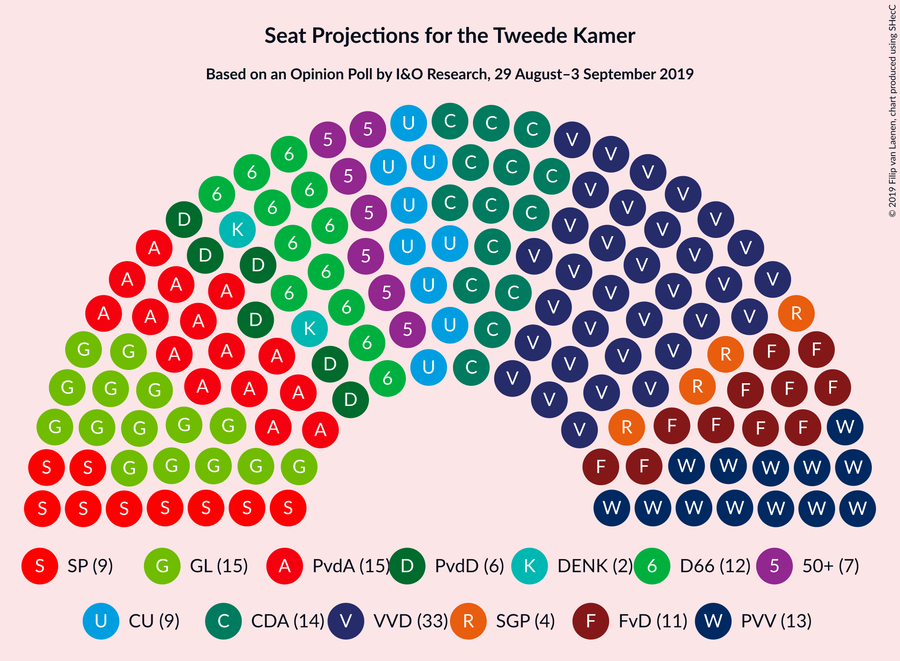
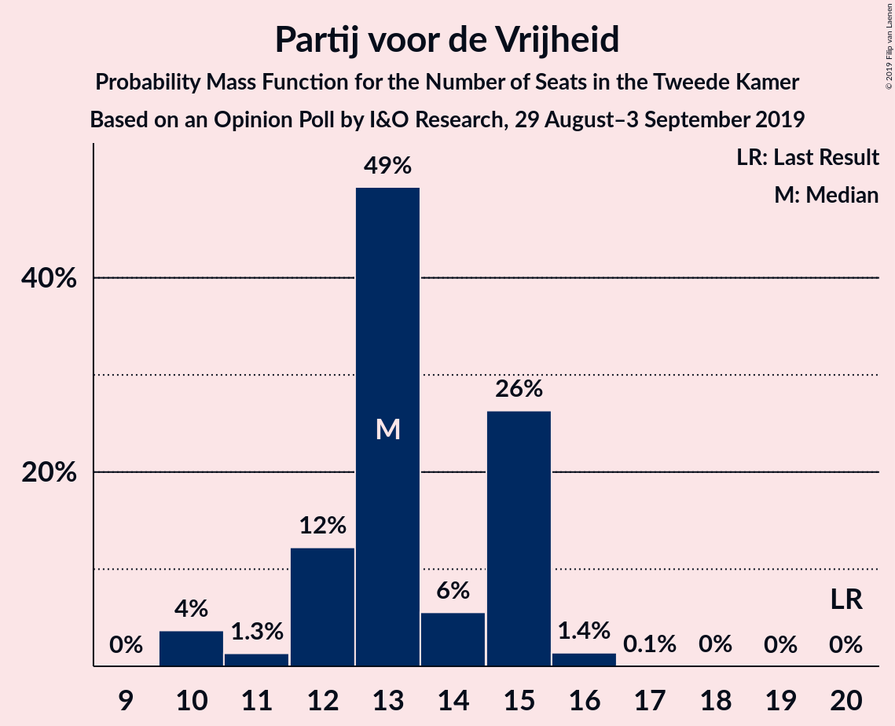
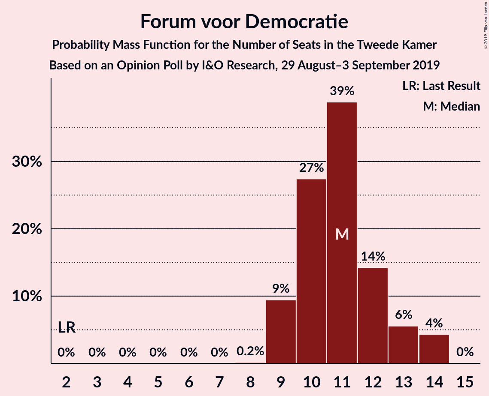
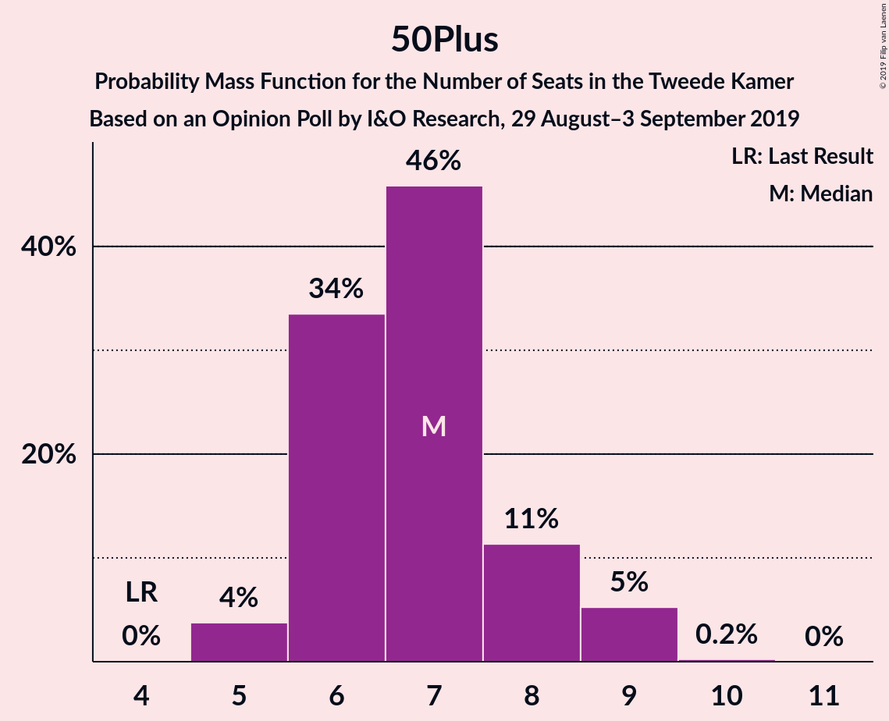
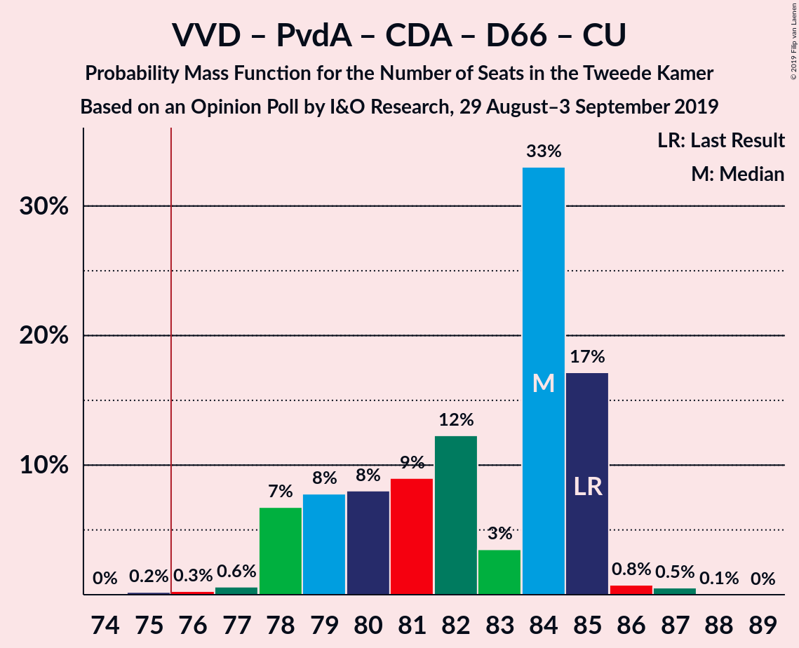
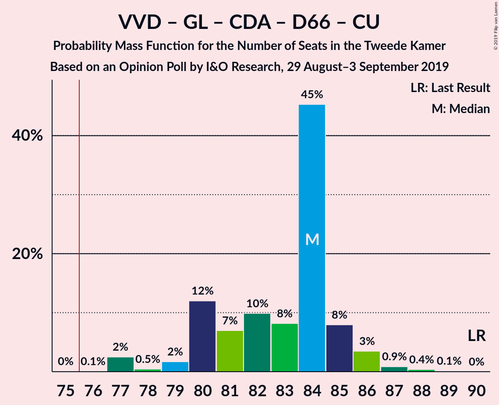
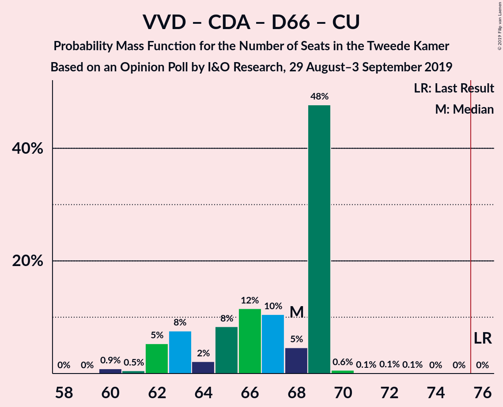
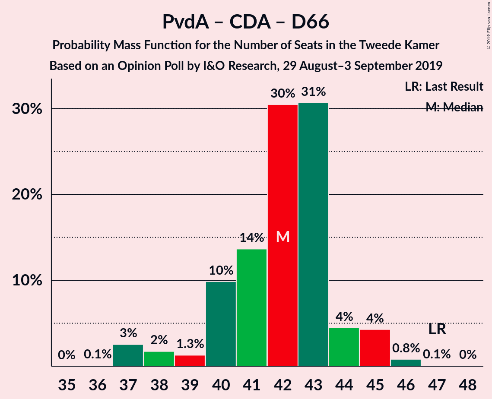
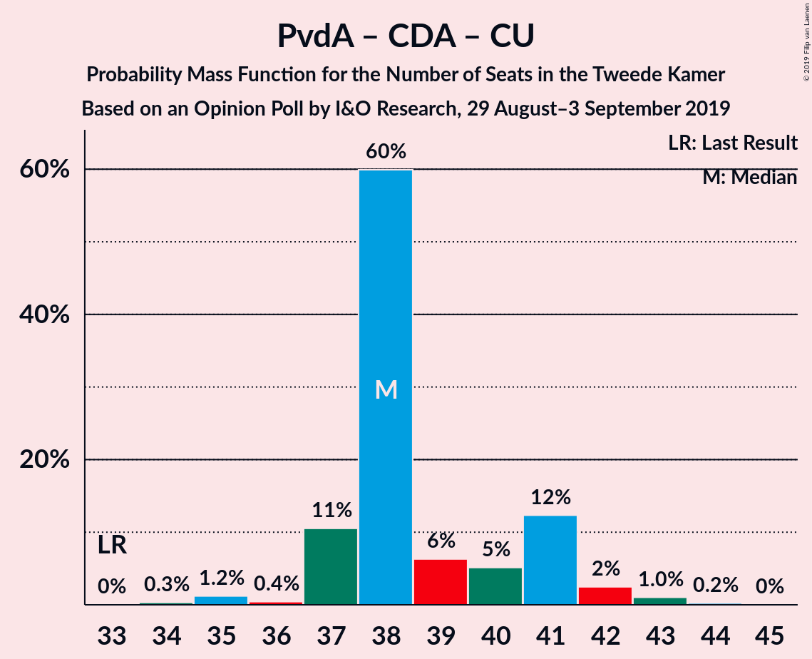

# Opinion Poll by I&O Research, 29 August–3 September 2019

<a href="#voting-intentions">Voting Intentions</a> | <a href="#seats">Seats</a> | <a href="#coalitions">Coalitions</a> | <a href="#technical-information">Technical Information</a>

## Voting Intentions

### Confidence Intervals

| Party | Last Result | Poll Result | 80% Confidence Interval | 90% Confidence Interval | 95% Confidence Interval | 99% Confidence Interval |
|:-----:|:-----------:|:-----------:|:-----------------------:|:-----------------------:|:-----------------------:|:-----------------------:|
| Volkspartij voor Vrijheid en Democratie | 21.3% | 20.6% | 19.3–21.9% |19.0–22.3% |18.7–22.6% |18.1–23.3% |
| GroenLinks | 9.1% | 10.9% | 10.0–11.9% |9.7–12.3% |9.5–12.5% |9.0–13.0% |
| Partij van de Arbeid | 5.7% | 10.2% | 9.3–11.2% |9.1–11.5% |8.8–11.8% |8.4–12.3% |
| Christen-Democratisch Appèl | 12.4% | 9.9% | 9.0–10.9% |8.8–11.2% |8.6–11.5% |8.2–12.0% |
| Partij voor de Vrijheid | 13.1% | 8.7% | 7.8–9.7% |7.6–9.9% |7.4–10.2% |7.0–10.7% |
| Democraten 66 | 12.2% | 7.4% | 6.6–8.3% |6.4–8.6% |6.2–8.8% |5.9–9.2% |
| Forum voor Democratie | 1.8% | 7.3% | 6.5–8.2% |6.3–8.4% |6.1–8.7% |5.8–9.1% |
| Socialistische Partij | 9.1% | 6.0% | 5.3–6.8% |5.1–7.1% |4.9–7.3% |4.6–7.7% |
| ChristenUnie | 3.4% | 5.5% | 4.8–6.3% |4.7–6.5% |4.5–6.7% |4.2–7.1% |
| 50Plus | 3.1% | 4.8% | 4.2–5.5% |4.0–5.7% |3.8–5.9% |3.6–6.3% |
| Partij voor de Dieren | 3.2% | 4.3% | 3.7–5.0% |3.5–5.2% |3.4–5.4% |3.1–5.7% |
| Staatkundig Gereformeerde Partij | 2.1% | 2.9% | 2.4–3.5% |2.3–3.7% |2.2–3.8% |2.0–4.1% |
| DENK | 2.1% | 1.2% | 0.9–1.7% |0.9–1.8% |0.8–1.9% |0.7–2.1% |

*Note:* The poll result column reflects the actual value used in the calculations. Published results may vary slightly, and in addition be rounded to fewer digits.

## Seats

### Confidence Intervals

| Party | Last Result | Median | 80% Confidence Interval | 90% Confidence Interval | 95% Confidence Interval | 99% Confidence Interval |
|:-----:|:-----------:|:------:|:-----------------------:|:-----------------------:|:-----------------------:|:-----------------------:|
| <a href="#volkspartij-voor-vrijheid-en-democratie">Volkspartij voor Vrijheid en Democratie</a> | 33 | 35 | 30–35 |29–35 |28–35 |26–35 |
| <a href="#groenlinks">GroenLinks</a> | 14 | 15 | 14–18 |14–19 |14–19 |14–19 |
| <a href="#partij-van-de-arbeid">Partij van de Arbeid</a> | 9 | 16 | 15–16 |13–17 |13–17 |13–18 |
| <a href="#christen-democratisch-appèl">Christen-Democratisch Appèl</a> | 19 | 15 | 14–17 |14–17 |14–17 |13–19 |
| <a href="#partij-voor-de-vrijheid">Partij voor de Vrijheid</a> | 20 | 15 | 12–15 |12–15 |12–15 |10–16 |
| <a href="#democraten-66">Democraten 66</a> | 19 | 12 | 10–12 |10–12 |10–14 |9–14 |
| <a href="#forum-voor-democratie">Forum voor Democratie</a> | 2 | 10 | 10–14 |10–14 |10–14 |9–14 |
| <a href="#socialistische-partij">Socialistische Partij</a> | 14 | 8 | 7–9 |7–10 |7–10 |7–11 |
| <a href="#christenunie">ChristenUnie</a> | 5 | 7 | 7–9 |7–9 |7–10 |6–11 |
| <a href="#50plus">50Plus</a> | 4 | 6 | 6–8 |6–9 |5–9 |5–9 |
| <a href="#partij-voor-de-dieren">Partij voor de Dieren</a> | 5 | 5 | 5–7 |5–7 |5–7 |5–8 |
| <a href="#staatkundig-gereformeerde-partij">Staatkundig Gereformeerde Partij</a> | 3 | 4 | 4 |3–4 |3–5 |3–5 |
| <a href="#denk">DENK</a> | 3 | 2 | 2 |1–2 |1–2 |1–3 |

### Volkspartij voor Vrijheid en Democratie

*For a full overview of the results for this party, see the [Volkspartij voor Vrijheid en Democratie](party-volkspartijvoorvrijheidendemocratie.html) page.*

| Number of Seats | Probability | Accumulated | Special Marks |
|:---------------:|:-----------:|:-----------:|:-------------:|
| 26 | 0.7% | 100% |  |
| 27 | 0.1% | 99.3% |  |
| 28 | 4% | 99.2% |  |
| 29 | 0.6% | 95% |  |
| 30 | 10% | 95% |  |
| 31 | 8% | 85% |  |
| 32 | 16% | 76% |  |
| 33 | 0.4% | 60% | Last Result |
| 34 | 0.7% | 60% |  |
| 35 | 59% | 59% | Median |
| 36 | 0% | 0% |  |

### GroenLinks

*For a full overview of the results for this party, see the [GroenLinks](party-groenlinks.html) page.*

| Number of Seats | Probability | Accumulated | Special Marks |
|:---------------:|:-----------:|:-----------:|:-------------:|
| 12 | 0.1% | 100% |  |
| 13 | 0.1% | 99.9% |  |
| 14 | 10% | 99.8% | Last Result |
| 15 | 59% | 89% | Median |
| 16 | 2% | 30% |  |
| 17 | 6% | 28% |  |
| 18 | 14% | 23% |  |
| 19 | 9% | 9% |  |
| 20 | 0.1% | 0.1% |  |
| 21 | 0% | 0% |  |

### Partij van de Arbeid

*For a full overview of the results for this party, see the [Partij van de Arbeid](party-partijvandearbeid.html) page.*

| Number of Seats | Probability | Accumulated | Special Marks |
|:---------------:|:-----------:|:-----------:|:-------------:|
| 9 | 0% | 100% | Last Result |
| 10 | 0% | 100% |  |
| 11 | 0% | 100% |  |
| 12 | 0.1% | 100% |  |
| 13 | 8% | 99.9% |  |
| 14 | 2% | 92% |  |
| 15 | 17% | 90% |  |
| 16 | 69% | 74% | Median |
| 17 | 4% | 5% |  |
| 18 | 1.5% | 2% |  |
| 19 | 0.1% | 0.1% |  |
| 20 | 0% | 0% |  |

### Christen-Democratisch Appèl

*For a full overview of the results for this party, see the [Christen-Democratisch Appèl](party-christen-democratischappèl.html) page.*

| Number of Seats | Probability | Accumulated | Special Marks |
|:---------------:|:-----------:|:-----------:|:-------------:|
| 12 | 0.4% | 100% |  |
| 13 | 1.0% | 99.5% |  |
| 14 | 21% | 98.6% |  |
| 15 | 63% | 77% | Median |
| 16 | 4% | 14% |  |
| 17 | 10% | 11% |  |
| 18 | 0.3% | 1.2% |  |
| 19 | 0.5% | 0.8% | Last Result |
| 20 | 0.3% | 0.3% |  |
| 21 | 0% | 0% |  |

### Partij voor de Vrijheid

*For a full overview of the results for this party, see the [Partij voor de Vrijheid](party-partijvoordevrijheid.html) page.*

| Number of Seats | Probability | Accumulated | Special Marks |
|:---------------:|:-----------:|:-----------:|:-------------:|
| 10 | 0.8% | 100% |  |
| 11 | 1.2% | 99.2% |  |
| 12 | 15% | 98% |  |
| 13 | 17% | 83% |  |
| 14 | 9% | 66% |  |
| 15 | 57% | 58% | Median |
| 16 | 0.6% | 0.7% |  |
| 17 | 0% | 0% |  |
| 18 | 0% | 0% |  |
| 19 | 0% | 0% |  |
| 20 | 0% | 0% | Last Result |

### Democraten 66

*For a full overview of the results for this party, see the [Democraten 66](party-democraten66.html) page.*

| Number of Seats | Probability | Accumulated | Special Marks |
|:---------------:|:-----------:|:-----------:|:-------------:|
| 8 | 0.1% | 100% |  |
| 9 | 1.0% | 99.9% |  |
| 10 | 15% | 98.9% |  |
| 11 | 9% | 84% |  |
| 12 | 70% | 75% | Median |
| 13 | 0.9% | 5% |  |
| 14 | 4% | 4% |  |
| 15 | 0% | 0% |  |
| 16 | 0% | 0% |  |
| 17 | 0% | 0% |  |
| 18 | 0% | 0% |  |
| 19 | 0% | 0% | Last Result |

### Forum voor Democratie

*For a full overview of the results for this party, see the [Forum voor Democratie](party-forumvoordemocratie.html) page.*

| Number of Seats | Probability | Accumulated | Special Marks |
|:---------------:|:-----------:|:-----------:|:-------------:|
| 2 | 0% | 100% | Last Result |
| 3 | 0% | 100% |  |
| 4 | 0% | 100% |  |
| 5 | 0% | 100% |  |
| 6 | 0% | 100% |  |
| 7 | 0% | 100% |  |
| 8 | 0.1% | 100% |  |
| 9 | 2% | 99.9% |  |
| 10 | 58% | 98% | Median |
| 11 | 4% | 40% |  |
| 12 | 9% | 35% |  |
| 13 | 14% | 26% |  |
| 14 | 12% | 12% |  |
| 15 | 0% | 0% |  |

### Socialistische Partij

*For a full overview of the results for this party, see the [Socialistische Partij](party-socialistischepartij.html) page.*

| Number of Seats | Probability | Accumulated | Special Marks |
|:---------------:|:-----------:|:-----------:|:-------------:|
| 6 | 0.1% | 100% |  |
| 7 | 13% | 99.9% |  |
| 8 | 66% | 87% | Median |
| 9 | 14% | 22% |  |
| 10 | 6% | 8% |  |
| 11 | 1.2% | 1.3% |  |
| 12 | 0.1% | 0.1% |  |
| 13 | 0% | 0% |  |
| 14 | 0% | 0% | Last Result |

### ChristenUnie

*For a full overview of the results for this party, see the [ChristenUnie](party-christenunie.html) page.*

| Number of Seats | Probability | Accumulated | Special Marks |
|:---------------:|:-----------:|:-----------:|:-------------:|
| 5 | 0% | 100% | Last Result |
| 6 | 0.8% | 100% |  |
| 7 | 70% | 99.2% | Median |
| 8 | 5% | 29% |  |
| 9 | 21% | 24% |  |
| 10 | 2% | 3% |  |
| 11 | 2% | 2% |  |
| 12 | 0% | 0% |  |

### 50Plus

*For a full overview of the results for this party, see the [50Plus](party-50plus.html) page.*

| Number of Seats | Probability | Accumulated | Special Marks |
|:---------------:|:-----------:|:-----------:|:-------------:|
| 4 | 0% | 100% | Last Result |
| 5 | 3% | 100% |  |
| 6 | 73% | 97% | Median |
| 7 | 13% | 24% |  |
| 8 | 3% | 11% |  |
| 9 | 8% | 8% |  |
| 10 | 0.1% | 0.1% |  |
| 11 | 0% | 0% |  |

### Partij voor de Dieren

*For a full overview of the results for this party, see the [Partij voor de Dieren](party-partijvoordedieren.html) page.*

| Number of Seats | Probability | Accumulated | Special Marks |
|:---------------:|:-----------:|:-----------:|:-------------:|
| 4 | 0.2% | 100% |  |
| 5 | 80% | 99.8% | Last Result, Median |
| 6 | 4% | 19% |  |
| 7 | 14% | 15% |  |
| 8 | 1.1% | 1.3% |  |
| 9 | 0.2% | 0.2% |  |
| 10 | 0% | 0% |  |

### Staatkundig Gereformeerde Partij

*For a full overview of the results for this party, see the [Staatkundig Gereformeerde Partij](party-staatkundiggereformeerdepartij.html) page.*

| Number of Seats | Probability | Accumulated | Special Marks |
|:---------------:|:-----------:|:-----------:|:-------------:|
| 2 | 0.4% | 100% |  |
| 3 | 6% | 99.6% | Last Result |
| 4 | 91% | 94% | Median |
| 5 | 3% | 3% |  |
| 6 | 0.3% | 0.3% |  |
| 7 | 0% | 0% |  |

### DENK

*For a full overview of the results for this party, see the [DENK](party-denk.html) page.*

| Number of Seats | Probability | Accumulated | Special Marks |
|:---------------:|:-----------:|:-----------:|:-------------:|
| 0 | 0.4% | 100% |  |
| 1 | 7% | 99.6% |  |
| 2 | 91% | 92% | Median |
| 3 | 2% | 2% | Last Result |
| 4 | 0% | 0% |  |

## Coalitions

### Confidence Intervals

| Coalition | Last Result | Median | Majority? | 80% Confidence Interval | 90% Confidence Interval | 95% Confidence Interval | 99% Confidence Interval |
|:---------:|:-----------:|:------:|:---------:|:-----------------------:|:-----------------------:|:-----------------------:|:-----------------------:|
| Volkspartij voor Vrijheid en Democratie – Partij van de Arbeid – Christen-Democratisch Appèl – Democraten 66 – ChristenUnie | 85 | 85 | 99.7% | 79–85 | 79–85 | 79–85 | 76–87 |
| Volkspartij voor Vrijheid en Democratie – GroenLinks – Christen-Democratisch Appèl – Democraten 66 – ChristenUnie | 90 | 84 | 99.9% | 81–85 | 77–85 | 77–85 | 77–87 |
| Volkspartij voor Vrijheid en Democratie – Christen-Democratisch Appèl – Partij voor de Vrijheid – Forum voor Democratie – Staatkundig Gereformeerde Partij | 77 | 79 | 82% | 74–79 | 73–79 | 71–80 | 70–80 |
| GroenLinks – Partij van de Arbeid – Christen-Democratisch Appèl – Democraten 66 – Socialistische Partij – ChristenUnie | 80 | 73 | 12% | 72–77 | 72–78 | 71–79 | 71–79 |
| Volkspartij voor Vrijheid en Democratie – Christen-Democratisch Appèl – Partij voor de Vrijheid – Forum voor Democratie | 74 | 75 | 3% | 70–75 | 69–75 | 67–77 | 65–77 |
| Volkspartij voor Vrijheid en Democratie – Christen-Democratisch Appèl – Forum voor Democratie – 50Plus – Staatkundig Gereformeerde Partij | 61 | 70 | 0% | 68–71 | 67–71 | 66–73 | 64–73 |
| Volkspartij voor Vrijheid en Democratie – Christen-Democratisch Appèl – Forum voor Democratie – 50Plus | 58 | 66 | 0% | 65–67 | 63–67 | 62–70 | 59–70 |
| Volkspartij voor Vrijheid en Democratie – Christen-Democratisch Appèl – Democraten 66 – ChristenUnie | 76 | 69 | 0% | 64–69 | 63–69 | 63–69 | 60–70 |
| GroenLinks – Partij van de Arbeid – Christen-Democratisch Appèl – Democraten 66 – ChristenUnie | 66 | 65 | 0% | 63–68 | 63–69 | 62–69 | 62–71 |
| Volkspartij voor Vrijheid en Democratie – Christen-Democratisch Appèl – Forum voor Democratie – Staatkundig Gereformeerde Partij | 57 | 64 | 0% | 61–64 | 60–64 | 59–67 | 57–67 |
| Volkspartij voor Vrijheid en Democratie – Partij van de Arbeid – Christen-Democratisch Appèl | 61 | 66 | 0% | 60–66 | 59–66 | 59–66 | 56–68 |
| Volkspartij voor Vrijheid en Democratie – Christen-Democratisch Appèl – Partij voor de Vrijheid | 72 | 65 | 0% | 57–65 | 56–65 | 56–65 | 53–65 |
| Volkspartij voor Vrijheid en Democratie – Christen-Democratisch Appèl – Forum voor Democratie | 54 | 60 | 0% | 57–60 | 56–60 | 55–64 | 52–64 |
| Volkspartij voor Vrijheid en Democratie – Partij van de Arbeid – Democraten 66 | 61 | 63 | 0% | 55–63 | 55–63 | 55–63 | 54–63 |
| Volkspartij voor Vrijheid en Democratie – Christen-Democratisch Appèl – Democraten 66 | 71 | 62 | 0% | 54–62 | 54–62 | 54–62 | 52–62 |
| Volkspartij voor Vrijheid en Democratie – Partij van de Arbeid | 42 | 51 | 0% | 44–51 | 44–51 | 44–51 | 42–51 |
| Volkspartij voor Vrijheid en Democratie – Christen-Democratisch Appèl | 52 | 50 | 0% | 44–50 | 44–50 | 43–51 | 40–51 |
| Partij van de Arbeid – Christen-Democratisch Appèl – Democraten 66 | 47 | 43 | 0% | 41–43 | 40–45 | 40–45 | 38–45 |
| Partij van de Arbeid – Christen-Democratisch Appèl – ChristenUnie | 33 | 38 | 0% | 38–39 | 37–41 | 37–42 | 35–43 |
| Partij van de Arbeid – Christen-Democratisch Appèl | 28 | 31 | 0% | 29–31 | 29–32 | 29–34 | 27–34 |
| Christen-Democratisch Appèl – Democraten 66 | 38 | 27 | 0% | 25–28 | 24–29 | 24–29 | 23–29 |

### Volkspartij voor Vrijheid en Democratie – Partij van de Arbeid – Christen-Democratisch Appèl – Democraten 66 – ChristenUnie

| Number of Seats | Probability | Accumulated | Special Marks |
|:---------------:|:-----------:|:-----------:|:-------------:|
| 74 | 0.1% | 100% |  |
| 75 | 0.2% | 99.9% |  |
| 76 | 0.7% | 99.7% | Majority |
| 77 | 0.3% | 99.1% |  |
| 78 | 1.1% | 98.8% |  |
| 79 | 15% | 98% |  |
| 80 | 4% | 83% |  |
| 81 | 0.9% | 79% |  |
| 82 | 13% | 78% |  |
| 83 | 5% | 65% |  |
| 84 | 3% | 60% |  |
| 85 | 56% | 57% | Last Result, Median |
| 86 | 0.3% | 0.9% |  |
| 87 | 0.6% | 0.6% |  |
| 88 | 0% | 0% |  |

### Volkspartij voor Vrijheid en Democratie – GroenLinks – Christen-Democratisch Appèl – Democraten 66 – ChristenUnie

| Number of Seats | Probability | Accumulated | Special Marks |
|:---------------:|:-----------:|:-----------:|:-------------:|
| 75 | 0.1% | 100% |  |
| 76 | 0% | 99.9% | Majority |
| 77 | 8% | 99.9% |  |
| 78 | 0.6% | 92% |  |
| 79 | 0.7% | 91% |  |
| 80 | 0.5% | 91% |  |
| 81 | 4% | 90% |  |
| 82 | 6% | 86% |  |
| 83 | 1.0% | 80% |  |
| 84 | 57% | 79% | Median |
| 85 | 21% | 22% |  |
| 86 | 0.2% | 0.7% |  |
| 87 | 0.1% | 0.5% |  |
| 88 | 0% | 0.4% |  |
| 89 | 0.3% | 0.4% |  |
| 90 | 0% | 0% | Last Result |

### Volkspartij voor Vrijheid en Democratie – Christen-Democratisch Appèl – Partij voor de Vrijheid – Forum voor Democratie – Staatkundig Gereformeerde Partij

| Number of Seats | Probability | Accumulated | Special Marks |
|:---------------:|:-----------:|:-----------:|:-------------:|
| 68 | 0.1% | 100% |  |
| 69 | 0.1% | 99.9% |  |
| 70 | 2% | 99.9% |  |
| 71 | 0.8% | 98% |  |
| 72 | 2% | 97% |  |
| 73 | 5% | 96% |  |
| 74 | 9% | 91% |  |
| 75 | 0.2% | 82% |  |
| 76 | 13% | 82% | Majority |
| 77 | 2% | 69% | Last Result |
| 78 | 7% | 67% |  |
| 79 | 56% | 59% | Median |
| 80 | 3% | 3% |  |
| 81 | 0.1% | 0.1% |  |
| 82 | 0% | 0% |  |

### GroenLinks – Partij van de Arbeid – Christen-Democratisch Appèl – Democraten 66 – Socialistische Partij – ChristenUnie

| Number of Seats | Probability | Accumulated | Special Marks |
|:---------------:|:-----------:|:-----------:|:-------------:|
| 69 | 0.1% | 100% |  |
| 70 | 0.1% | 99.9% |  |
| 71 | 3% | 99.8% |  |
| 72 | 7% | 97% |  |
| 73 | 57% | 90% | Median |
| 74 | 0.9% | 33% |  |
| 75 | 20% | 32% |  |
| 76 | 0.5% | 12% | Majority |
| 77 | 3% | 11% |  |
| 78 | 3% | 8% |  |
| 79 | 4% | 5% |  |
| 80 | 0.1% | 0.2% | Last Result |
| 81 | 0% | 0.1% |  |
| 82 | 0.1% | 0.1% |  |
| 83 | 0% | 0% |  |

### Volkspartij voor Vrijheid en Democratie – Christen-Democratisch Appèl – Partij voor de Vrijheid – Forum voor Democratie

| Number of Seats | Probability | Accumulated | Special Marks |
|:---------------:|:-----------:|:-----------:|:-------------:|
| 64 | 0.1% | 100% |  |
| 65 | 0.7% | 99.9% |  |
| 66 | 0.8% | 99.3% |  |
| 67 | 1.2% | 98% |  |
| 68 | 2% | 97% |  |
| 69 | 4% | 95% |  |
| 70 | 9% | 91% |  |
| 71 | 0.5% | 83% |  |
| 72 | 13% | 82% |  |
| 73 | 3% | 70% |  |
| 74 | 7% | 67% | Last Result |
| 75 | 56% | 59% | Median |
| 76 | 0.4% | 3% | Majority |
| 77 | 3% | 3% |  |
| 78 | 0% | 0% |  |

### Volkspartij voor Vrijheid en Democratie – Christen-Democratisch Appèl – Forum voor Democratie – 50Plus – Staatkundig Gereformeerde Partij

| Number of Seats | Probability | Accumulated | Special Marks |
|:---------------:|:-----------:|:-----------:|:-------------:|
| 61 | 0% | 100% | Last Result |
| 62 | 0% | 100% |  |
| 63 | 0% | 100% |  |
| 64 | 1.5% | 100% |  |
| 65 | 0.4% | 98.5% |  |
| 66 | 0.7% | 98% |  |
| 67 | 5% | 97% |  |
| 68 | 3% | 92% |  |
| 69 | 3% | 89% |  |
| 70 | 76% | 86% | Median |
| 71 | 7% | 11% |  |
| 72 | 0.2% | 3% |  |
| 73 | 3% | 3% |  |
| 74 | 0% | 0.4% |  |
| 75 | 0.3% | 0.3% |  |
| 76 | 0% | 0% | Majority |

### Volkspartij voor Vrijheid en Democratie – Christen-Democratisch Appèl – Forum voor Democratie – 50Plus

| Number of Seats | Probability | Accumulated | Special Marks |
|:---------------:|:-----------:|:-----------:|:-------------:|
| 58 | 0% | 100% | Last Result |
| 59 | 1.3% | 100% |  |
| 60 | 0.1% | 98.7% |  |
| 61 | 0.4% | 98.6% |  |
| 62 | 0.9% | 98% |  |
| 63 | 4% | 97% |  |
| 64 | 3% | 93% |  |
| 65 | 4% | 90% |  |
| 66 | 76% | 86% | Median |
| 67 | 7% | 11% |  |
| 68 | 0.2% | 3% |  |
| 69 | 0.1% | 3% |  |
| 70 | 3% | 3% |  |
| 71 | 0.3% | 0.3% |  |
| 72 | 0% | 0% |  |

### Volkspartij voor Vrijheid en Democratie – Christen-Democratisch Appèl – Democraten 66 – ChristenUnie

| Number of Seats | Probability | Accumulated | Special Marks |
|:---------------:|:-----------:|:-----------:|:-------------:|
| 60 | 0.8% | 100% |  |
| 61 | 0.7% | 99.2% |  |
| 62 | 0% | 98% |  |
| 63 | 8% | 98% |  |
| 64 | 5% | 91% |  |
| 65 | 1.1% | 86% |  |
| 66 | 8% | 85% |  |
| 67 | 15% | 77% |  |
| 68 | 4% | 61% |  |
| 69 | 57% | 58% | Median |
| 70 | 0.1% | 0.5% |  |
| 71 | 0% | 0.4% |  |
| 72 | 0% | 0.4% |  |
| 73 | 0.3% | 0.4% |  |
| 74 | 0% | 0% |  |
| 75 | 0% | 0% |  |
| 76 | 0% | 0% | Last Result, Majority |

### GroenLinks – Partij van de Arbeid – Christen-Democratisch Appèl – Democraten 66 – ChristenUnie

| Number of Seats | Probability | Accumulated | Special Marks |
|:---------------:|:-----------:|:-----------:|:-------------:|
| 61 | 0.2% | 100% |  |
| 62 | 3% | 99.8% |  |
| 63 | 7% | 97% |  |
| 64 | 0.2% | 90% |  |
| 65 | 57% | 89% | Median |
| 66 | 1.0% | 32% | Last Result |
| 67 | 11% | 32% |  |
| 68 | 13% | 21% |  |
| 69 | 7% | 8% |  |
| 70 | 0.7% | 1.3% |  |
| 71 | 0.4% | 0.5% |  |
| 72 | 0.1% | 0.1% |  |
| 73 | 0.1% | 0.1% |  |
| 74 | 0% | 0% |  |

### Volkspartij voor Vrijheid en Democratie – Christen-Democratisch Appèl – Forum voor Democratie – Staatkundig Gereformeerde Partij

| Number of Seats | Probability | Accumulated | Special Marks |
|:---------------:|:-----------:|:-----------:|:-------------:|
| 56 | 0% | 100% |  |
| 57 | 1.5% | 99.9% | Last Result |
| 58 | 0.6% | 98% |  |
| 59 | 0.7% | 98% |  |
| 60 | 6% | 97% |  |
| 61 | 9% | 91% |  |
| 62 | 0.8% | 82% |  |
| 63 | 0.3% | 81% |  |
| 64 | 78% | 81% | Median |
| 65 | 0.2% | 3% |  |
| 66 | 0.1% | 3% |  |
| 67 | 3% | 3% |  |
| 68 | 0.4% | 0.4% |  |
| 69 | 0% | 0% |  |

### Volkspartij voor Vrijheid en Democratie – Partij van de Arbeid – Christen-Democratisch Appèl

| Number of Seats | Probability | Accumulated | Special Marks |
|:---------------:|:-----------:|:-----------:|:-------------:|
| 55 | 0.1% | 100% |  |
| 56 | 0.7% | 99.9% |  |
| 57 | 0.4% | 99.3% |  |
| 58 | 0.1% | 98.9% |  |
| 59 | 5% | 98.8% |  |
| 60 | 9% | 94% |  |
| 61 | 20% | 85% | Last Result |
| 62 | 1.1% | 65% |  |
| 63 | 0.8% | 64% |  |
| 64 | 1.3% | 64% |  |
| 65 | 0.5% | 62% |  |
| 66 | 61% | 62% | Median |
| 67 | 0.2% | 0.8% |  |
| 68 | 0.5% | 0.6% |  |
| 69 | 0.1% | 0.1% |  |
| 70 | 0% | 0% |  |

### Volkspartij voor Vrijheid en Democratie – Christen-Democratisch Appèl – Partij voor de Vrijheid

| Number of Seats | Probability | Accumulated | Special Marks |
|:---------------:|:-----------:|:-----------:|:-------------:|
| 53 | 0.7% | 100% |  |
| 54 | 0% | 99.3% |  |
| 55 | 0.8% | 99.3% |  |
| 56 | 5% | 98.5% |  |
| 57 | 7% | 94% |  |
| 58 | 15% | 86% |  |
| 59 | 2% | 72% |  |
| 60 | 0.1% | 70% |  |
| 61 | 0.2% | 70% |  |
| 62 | 10% | 70% |  |
| 63 | 0.2% | 60% |  |
| 64 | 3% | 60% |  |
| 65 | 56% | 56% | Median |
| 66 | 0.3% | 0.4% |  |
| 67 | 0% | 0% |  |
| 68 | 0% | 0% |  |
| 69 | 0% | 0% |  |
| 70 | 0% | 0% |  |
| 71 | 0% | 0% |  |
| 72 | 0% | 0% | Last Result |

### Volkspartij voor Vrijheid en Democratie – Christen-Democratisch Appèl – Forum voor Democratie

| Number of Seats | Probability | Accumulated | Special Marks |
|:---------------:|:-----------:|:-----------:|:-------------:|
| 52 | 1.0% | 100% |  |
| 53 | 0.6% | 99.0% |  |
| 54 | 0.5% | 98% | Last Result |
| 55 | 0.4% | 98% |  |
| 56 | 6% | 97% |  |
| 57 | 9% | 92% |  |
| 58 | 1.2% | 83% |  |
| 59 | 0.5% | 81% |  |
| 60 | 77% | 81% | Median |
| 61 | 0.3% | 3% |  |
| 62 | 0% | 3% |  |
| 63 | 0.1% | 3% |  |
| 64 | 3% | 3% |  |
| 65 | 0% | 0% |  |

### Volkspartij voor Vrijheid en Democratie – Partij van de Arbeid – Democraten 66

| Number of Seats | Probability | Accumulated | Special Marks |
|:---------------:|:-----------:|:-----------:|:-------------:|
| 52 | 0% | 100% |  |
| 53 | 0.3% | 99.9% |  |
| 54 | 1.4% | 99.6% |  |
| 55 | 9% | 98% |  |
| 56 | 8% | 90% |  |
| 57 | 2% | 82% |  |
| 58 | 4% | 80% |  |
| 59 | 15% | 76% |  |
| 60 | 4% | 61% |  |
| 61 | 0.4% | 58% | Last Result |
| 62 | 1.0% | 57% |  |
| 63 | 56% | 56% | Median |
| 64 | 0.1% | 0.2% |  |
| 65 | 0.1% | 0.1% |  |
| 66 | 0% | 0% |  |

### Volkspartij voor Vrijheid en Democratie – Christen-Democratisch Appèl – Democraten 66

| Number of Seats | Probability | Accumulated | Special Marks |
|:---------------:|:-----------:|:-----------:|:-------------:|
| 52 | 1.1% | 100% |  |
| 53 | 0.3% | 98.8% |  |
| 54 | 9% | 98.5% |  |
| 55 | 0.3% | 90% |  |
| 56 | 1.0% | 89% |  |
| 57 | 4% | 88% |  |
| 58 | 13% | 84% |  |
| 59 | 10% | 71% |  |
| 60 | 0.4% | 61% |  |
| 61 | 4% | 60% |  |
| 62 | 56% | 56% | Median |
| 63 | 0% | 0.4% |  |
| 64 | 0% | 0.4% |  |
| 65 | 0.4% | 0.4% |  |
| 66 | 0% | 0% |  |
| 67 | 0% | 0% |  |
| 68 | 0% | 0% |  |
| 69 | 0% | 0% |  |
| 70 | 0% | 0% |  |
| 71 | 0% | 0% | Last Result |

### Volkspartij voor Vrijheid en Democratie – Partij van de Arbeid

| Number of Seats | Probability | Accumulated | Special Marks |
|:---------------:|:-----------:|:-----------:|:-------------:|
| 41 | 0.2% | 100% |  |
| 42 | 0.8% | 99.8% | Last Result |
| 43 | 0.1% | 99.0% |  |
| 44 | 11% | 98.9% |  |
| 45 | 2% | 88% |  |
| 46 | 8% | 85% |  |
| 47 | 13% | 77% |  |
| 48 | 2% | 64% |  |
| 49 | 3% | 63% |  |
| 50 | 3% | 60% |  |
| 51 | 56% | 56% | Median |
| 52 | 0.3% | 0.4% |  |
| 53 | 0% | 0.1% |  |
| 54 | 0% | 0% |  |

### Volkspartij voor Vrijheid en Democratie – Christen-Democratisch Appèl

| Number of Seats | Probability | Accumulated | Special Marks |
|:---------------:|:-----------:|:-----------:|:-------------:|
| 40 | 0.7% | 100% |  |
| 41 | 0% | 99.3% |  |
| 42 | 0.1% | 99.3% |  |
| 43 | 4% | 99.2% |  |
| 44 | 9% | 95% |  |
| 45 | 2% | 86% |  |
| 46 | 13% | 84% |  |
| 47 | 2% | 72% |  |
| 48 | 7% | 70% |  |
| 49 | 3% | 63% |  |
| 50 | 56% | 60% | Median |
| 51 | 3% | 3% |  |
| 52 | 0.1% | 0.4% | Last Result |
| 53 | 0% | 0.3% |  |
| 54 | 0.3% | 0.3% |  |
| 55 | 0% | 0% |  |

### Partij van de Arbeid – Christen-Democratisch Appèl – Democraten 66

| Number of Seats | Probability | Accumulated | Special Marks |
|:---------------:|:-----------:|:-----------:|:-------------:|
| 36 | 0.2% | 100% |  |
| 37 | 0.1% | 99.8% |  |
| 38 | 0.3% | 99.6% |  |
| 39 | 1.1% | 99.3% |  |
| 40 | 8% | 98% |  |
| 41 | 23% | 90% |  |
| 42 | 2% | 67% |  |
| 43 | 57% | 66% | Median |
| 44 | 3% | 8% |  |
| 45 | 5% | 5% |  |
| 46 | 0.1% | 0.2% |  |
| 47 | 0.1% | 0.1% | Last Result |
| 48 | 0% | 0% |  |

### Partij van de Arbeid – Christen-Democratisch Appèl – ChristenUnie

| Number of Seats | Probability | Accumulated | Special Marks |
|:---------------:|:-----------:|:-----------:|:-------------:|
| 33 | 0% | 100% | Last Result |
| 34 | 0.3% | 100% |  |
| 35 | 0.3% | 99.7% |  |
| 36 | 0.2% | 99.4% |  |
| 37 | 8% | 99.1% |  |
| 38 | 75% | 91% | Median |
| 39 | 8% | 15% |  |
| 40 | 2% | 7% |  |
| 41 | 0.9% | 6% |  |
| 42 | 3% | 5% |  |
| 43 | 2% | 2% |  |
| 44 | 0.1% | 0.1% |  |
| 45 | 0% | 0% |  |

### Partij van de Arbeid – Christen-Democratisch Appèl

| Number of Seats | Probability | Accumulated | Special Marks |
|:---------------:|:-----------:|:-----------:|:-------------:|
| 26 | 0.2% | 100% |  |
| 27 | 0.6% | 99.8% |  |
| 28 | 0.2% | 99.2% | Last Result |
| 29 | 14% | 99.0% |  |
| 30 | 16% | 85% |  |
| 31 | 64% | 69% | Median |
| 32 | 0.8% | 6% |  |
| 33 | 1.2% | 5% |  |
| 34 | 3% | 4% |  |
| 35 | 0.3% | 0.4% |  |
| 36 | 0.1% | 0.1% |  |
| 37 | 0% | 0% |  |

### Christen-Democratisch Appèl – Democraten 66

| Number of Seats | Probability | Accumulated | Special Marks |
|:---------------:|:-----------:|:-----------:|:-------------:|
| 21 | 0% | 100% |  |
| 22 | 0.2% | 99.9% |  |
| 23 | 0.2% | 99.7% |  |
| 24 | 9% | 99.5% |  |
| 25 | 2% | 90% |  |
| 26 | 16% | 88% |  |
| 27 | 59% | 72% | Median |
| 28 | 9% | 14% |  |
| 29 | 5% | 5% |  |
| 30 | 0.1% | 0.5% |  |
| 31 | 0.4% | 0.4% |  |
| 32 | 0% | 0% |  |
| 33 | 0% | 0% |  |
| 34 | 0% | 0% |  |
| 35 | 0% | 0% |  |
| 36 | 0% | 0% |  |
| 37 | 0% | 0% |  |
| 38 | 0% | 0% | Last Result |

## Technical Information

### Opinion Poll

+ **Polling firm:** I&O Research
+ **Commissioner(s):** —
+ **Fieldwork period:** 29 August–3 September 2019

### Calculations

+ **Sample size:** 1633
+ **Simulations done:** 262,144
+ **Error estimate:** 2.06%

