# Opinion Poll by Peil.nl, 2–7 September 2019

<a href="#voting-intentions">Voting Intentions</a> | <a href="#seats">Seats</a> | <a href="#coalitions">Coalitions</a> | <a href="#technical-information">Technical Information</a>

## Voting Intentions

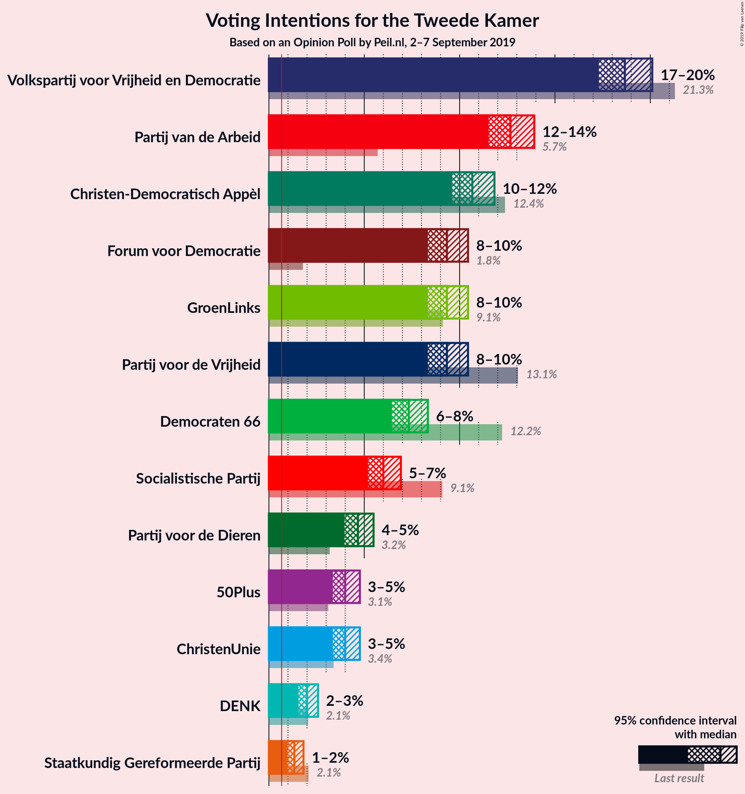

### Confidence Intervals

| Party | Last Result | Poll Result | 80% Confidence Interval | 90% Confidence Interval | 95% Confidence Interval | 99% Confidence Interval |
|:-----:|:-----------:|:-----------:|:-----------------------:|:-----------------------:|:-----------------------:|:-----------------------:|
| Volkspartij voor Vrijheid en Democratie | 21.3% | 18.7% | 17.8–19.6% |17.5–19.9% |17.3–20.1% |16.9–20.6% |
| Partij van de Arbeid | 5.7% | 12.7% | 11.9–13.5% |11.7–13.7% |11.5–13.9% |11.2–14.3% |
| Christen-Democratisch Appèl | 12.4% | 10.7% | 10.0–11.4% |9.8–11.6% |9.6–11.8% |9.3–12.2% |
| Partij voor de Vrijheid | 13.1% | 9.3% | 8.7–10.1% |8.5–10.3% |8.3–10.4% |8.0–10.8% |
| GroenLinks | 9.1% | 9.3% | 8.7–10.1% |8.5–10.3% |8.3–10.4% |8.0–10.8% |
| Forum voor Democratie | 1.8% | 9.3% | 8.7–10.1% |8.5–10.3% |8.3–10.4% |8.0–10.8% |
| Democraten 66 | 12.2% | 7.3% | 6.8–8.0% |6.6–8.2% |6.4–8.3% |6.2–8.6% |
| Socialistische Partij | 9.1% | 6.0% | 5.5–6.6% |5.3–6.8% |5.2–6.9% |5.0–7.2% |
| Partij voor de Dieren | 3.2% | 4.7% | 4.2–5.2% |4.1–5.3% |4.0–5.5% |3.7–5.8% |
| ChristenUnie | 3.4% | 4.0% | 3.6–4.5% |3.4–4.6% |3.4–4.8% |3.2–5.0% |
| 50Plus | 3.1% | 4.0% | 3.6–4.5% |3.4–4.6% |3.4–4.8% |3.2–5.0% |
| DENK | 2.1% | 2.0% | 1.7–2.4% |1.6–2.5% |1.6–2.6% |1.4–2.8% |
| Staatkundig Gereformeerde Partij | 2.1% | 1.3% | 1.1–1.6% |1.0–1.7% |1.0–1.8% |0.9–2.0% |

*Note:* The poll result column reflects the actual value used in the calculations. Published results may vary slightly, and in addition be rounded to fewer digits.

## Seats

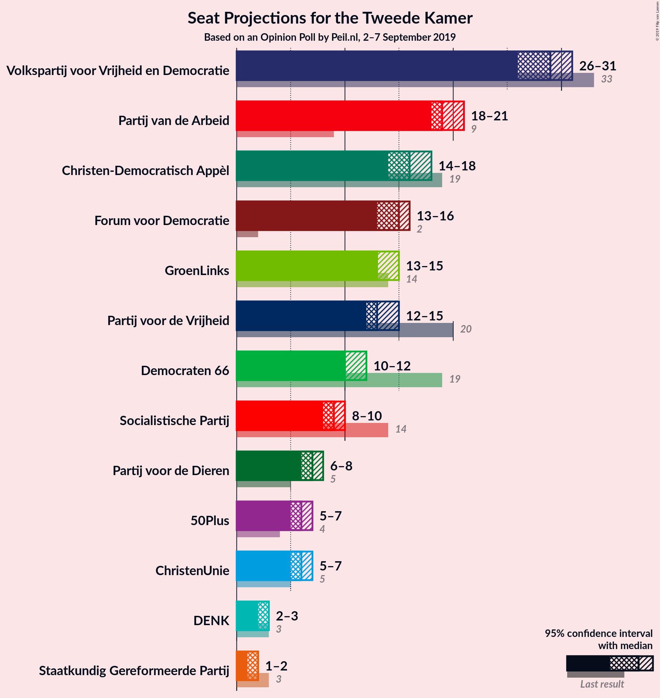

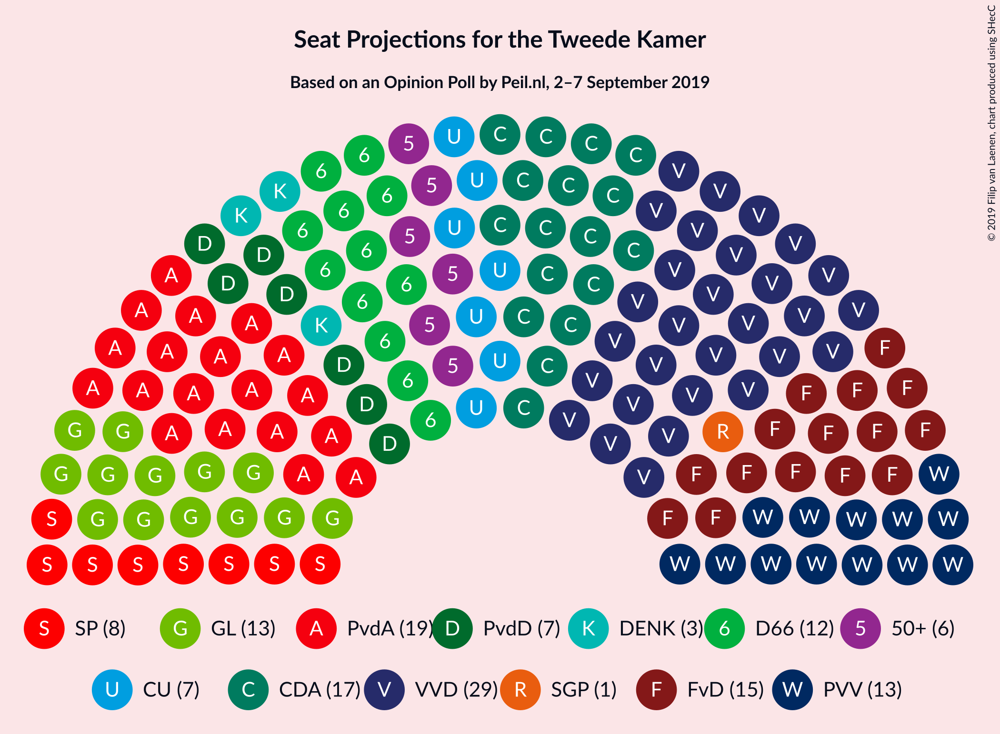

### Confidence Intervals

| Party | Last Result | Median | 80% Confidence Interval | 90% Confidence Interval | 95% Confidence Interval | 99% Confidence Interval |
|:-----:|:-----------:|:------:|:-----------------------:|:-----------------------:|:-----------------------:|:-----------------------:|
| <a href="#volkspartij-voor-vrijheid-en-democratie">Volkspartij voor Vrijheid en Democratie</a> | 33 | 29 | 27–30 |27–31 |27–31 |26–31 |
| <a href="#partij-van-de-arbeid">Partij van de Arbeid</a> | 9 | 20 | 18–21 |18–21 |18–21 |17–22 |
| <a href="#christen-democratisch-appèl">Christen-Democratisch Appèl</a> | 19 | 16 | 15–17 |15–18 |14–18 |14–18 |
| <a href="#partij-voor-de-vrijheid">Partij voor de Vrijheid</a> | 20 | 14 | 13–15 |13–16 |13–16 |12–16 |
| <a href="#groenlinks">GroenLinks</a> | 14 | 13 | 13–15 |13–15 |13–15 |12–16 |
| <a href="#forum-voor-democratie">Forum voor Democratie</a> | 2 | 15 | 13–16 |13–16 |13–16 |12–16 |
| <a href="#democraten-66">Democraten 66</a> | 19 | 10 | 10–12 |10–12 |9–12 |9–13 |
| <a href="#socialistische-partij">Socialistische Partij</a> | 14 | 9 | 8–9 |7–10 |7–10 |7–10 |
| <a href="#partij-voor-de-dieren">Partij voor de Dieren</a> | 5 | 7 | 6–8 |6–8 |6–8 |5–8 |
| <a href="#christenunie">ChristenUnie</a> | 5 | 6 | 5–6 |5–7 |5–7 |4–8 |
| <a href="#50plus">50Plus</a> | 4 | 6 | 5–6 |5–7 |5–7 |5–7 |
| <a href="#denk">DENK</a> | 3 | 3 | 2–3 |2–3 |2–4 |2–4 |
| <a href="#staatkundig-gereformeerde-partij">Staatkundig Gereformeerde Partij</a> | 3 | 2 | 1–2 |1–2 |1–2 |1–3 |

### Volkspartij voor Vrijheid en Democratie

*For a full overview of the results for this party, see the [Volkspartij voor Vrijheid en Democratie](party-volkspartijvoorvrijheidendemocratie.html) page.*

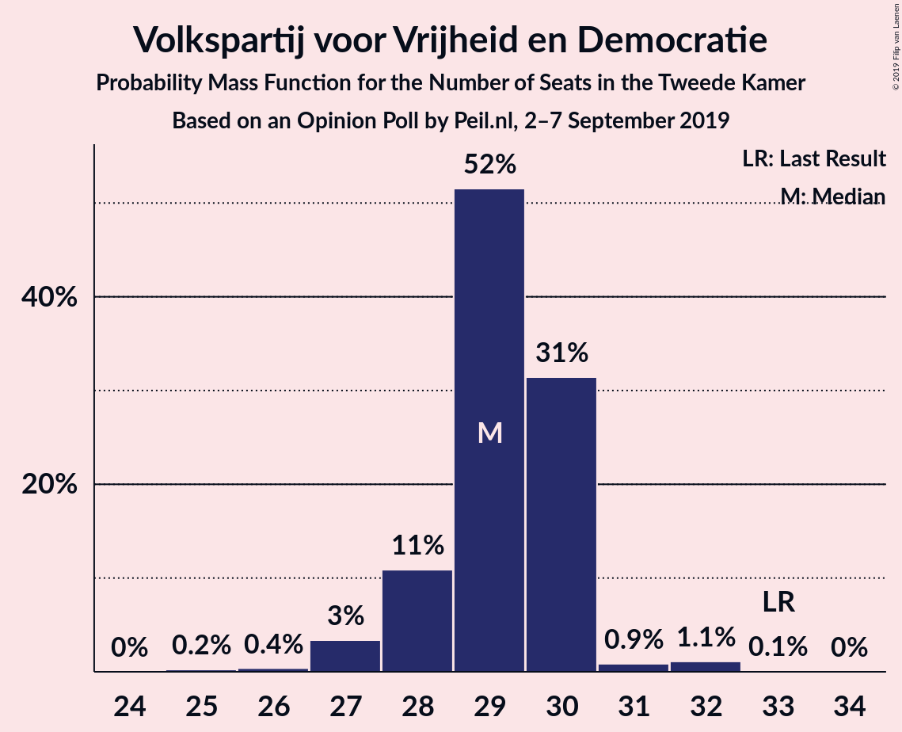

| Number of Seats | Probability | Accumulated | Special Marks |
|:---------------:|:-----------:|:-----------:|:-------------:|
| 24 | 0.1% | 100% |  |
| 25 | 0.1% | 99.9% |  |
| 26 | 2% | 99.9% |  |
| 27 | 15% | 98% |  |
| 28 | 6% | 83% |  |
| 29 | 37% | 78% | Median |
| 30 | 36% | 41% |  |
| 31 | 5% | 5% |  |
| 32 | 0.4% | 0.5% |  |
| 33 | 0.1% | 0.1% | Last Result |
| 34 | 0% | 0% |  |

### Partij van de Arbeid

*For a full overview of the results for this party, see the [Partij van de Arbeid](party-partijvandearbeid.html) page.*

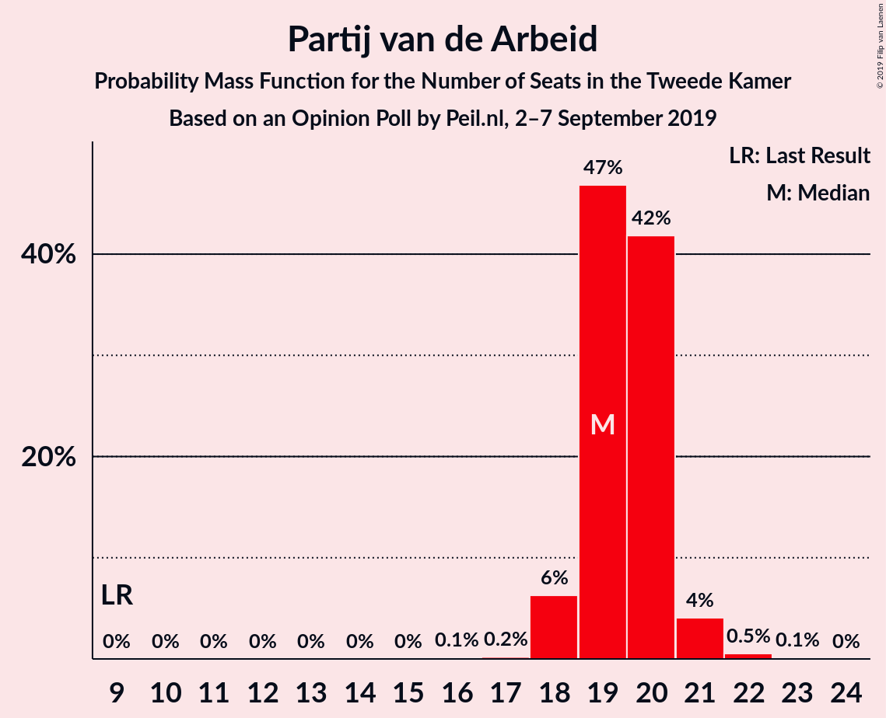

| Number of Seats | Probability | Accumulated | Special Marks |
|:---------------:|:-----------:|:-----------:|:-------------:|
| 9 | 0% | 100% | Last Result |
| 10 | 0% | 100% |  |
| 11 | 0% | 100% |  |
| 12 | 0% | 100% |  |
| 13 | 0% | 100% |  |
| 14 | 0% | 100% |  |
| 15 | 0% | 100% |  |
| 16 | 0.1% | 100% |  |
| 17 | 2% | 99.9% |  |
| 18 | 8% | 98% |  |
| 19 | 35% | 89% |  |
| 20 | 42% | 54% | Median |
| 21 | 12% | 13% |  |
| 22 | 0.7% | 0.8% |  |
| 23 | 0.1% | 0.1% |  |
| 24 | 0% | 0% |  |

### Christen-Democratisch Appèl

*For a full overview of the results for this party, see the [Christen-Democratisch Appèl](party-christen-democratischappèl.html) page.*

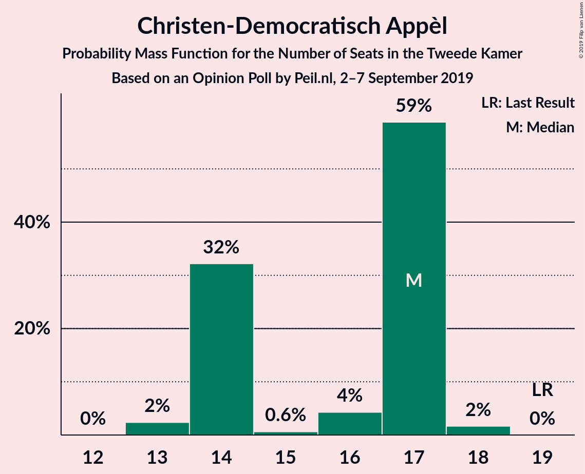

| Number of Seats | Probability | Accumulated | Special Marks |
|:---------------:|:-----------:|:-----------:|:-------------:|
| 13 | 0.2% | 100% |  |
| 14 | 3% | 99.8% |  |
| 15 | 21% | 97% |  |
| 16 | 47% | 76% | Median |
| 17 | 22% | 29% |  |
| 18 | 6% | 7% |  |
| 19 | 0.3% | 0.3% | Last Result |
| 20 | 0% | 0% |  |

### Partij voor de Vrijheid

*For a full overview of the results for this party, see the [Partij voor de Vrijheid](party-partijvoordevrijheid.html) page.*

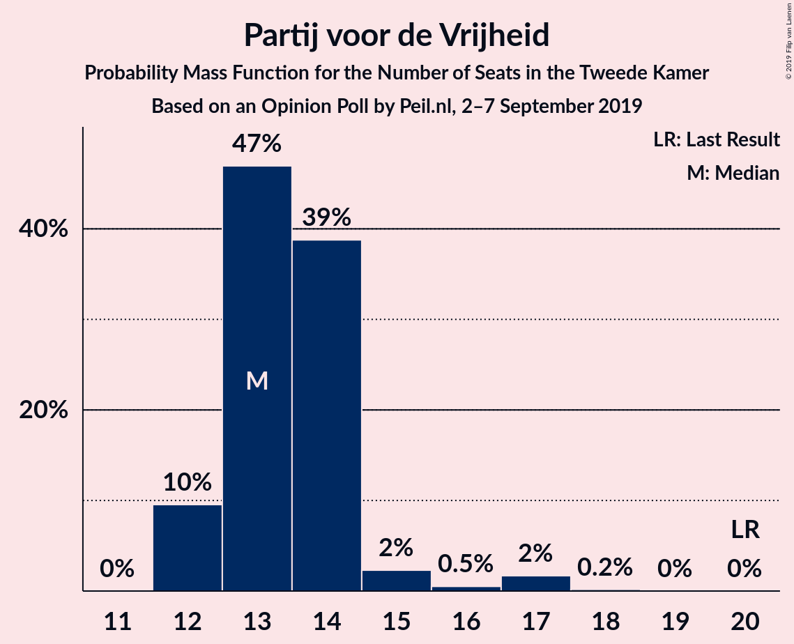

| Number of Seats | Probability | Accumulated | Special Marks |
|:---------------:|:-----------:|:-----------:|:-------------:|
| 11 | 0.4% | 100% |  |
| 12 | 2% | 99.6% |  |
| 13 | 45% | 98% |  |
| 14 | 20% | 53% | Median |
| 15 | 27% | 32% |  |
| 16 | 5% | 5% |  |
| 17 | 0.1% | 0.1% |  |
| 18 | 0% | 0% |  |
| 19 | 0% | 0% |  |
| 20 | 0% | 0% | Last Result |

### GroenLinks

*For a full overview of the results for this party, see the [GroenLinks](party-groenlinks.html) page.*

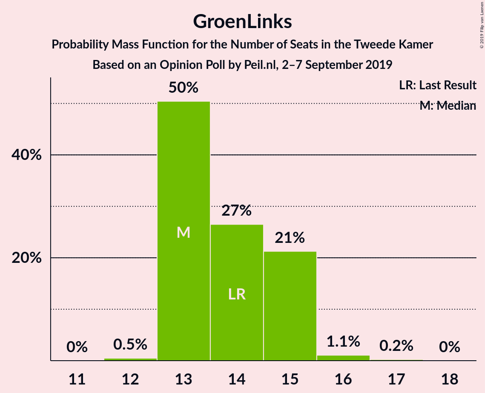

| Number of Seats | Probability | Accumulated | Special Marks |
|:---------------:|:-----------:|:-----------:|:-------------:|
| 12 | 2% | 100% |  |
| 13 | 48% | 98% | Median |
| 14 | 27% | 50% | Last Result |
| 15 | 22% | 23% |  |
| 16 | 1.0% | 1.3% |  |
| 17 | 0.3% | 0.3% |  |
| 18 | 0% | 0% |  |

### Forum voor Democratie

*For a full overview of the results for this party, see the [Forum voor Democratie](party-forumvoordemocratie.html) page.*

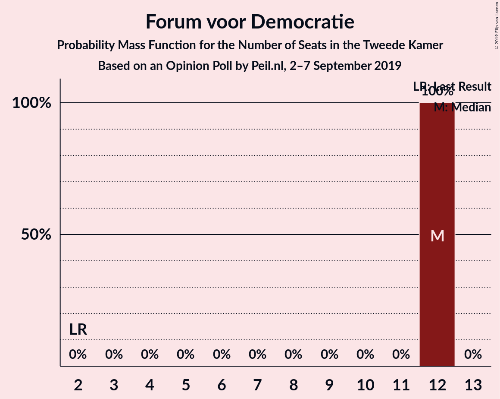

| Number of Seats | Probability | Accumulated | Special Marks |
|:---------------:|:-----------:|:-----------:|:-------------:|
| 2 | 0% | 100% | Last Result |
| 3 | 0% | 100% |  |
| 4 | 0% | 100% |  |
| 5 | 0% | 100% |  |
| 6 | 0% | 100% |  |
| 7 | 0% | 100% |  |
| 8 | 0% | 100% |  |
| 9 | 0% | 100% |  |
| 10 | 0% | 100% |  |
| 11 | 0% | 100% |  |
| 12 | 2% | 100% |  |
| 13 | 16% | 98% |  |
| 14 | 26% | 82% |  |
| 15 | 23% | 56% | Median |
| 16 | 32% | 33% |  |
| 17 | 0.1% | 0.1% |  |
| 18 | 0% | 0% |  |

### Democraten 66

*For a full overview of the results for this party, see the [Democraten 66](party-democraten66.html) page.*

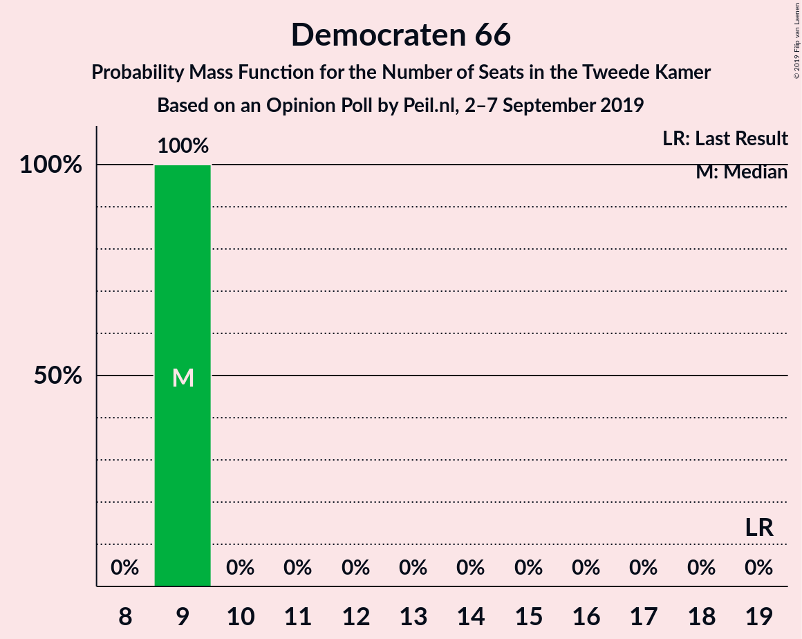

| Number of Seats | Probability | Accumulated | Special Marks |
|:---------------:|:-----------:|:-----------:|:-------------:|
| 9 | 5% | 100% |  |
| 10 | 57% | 95% | Median |
| 11 | 19% | 38% |  |
| 12 | 17% | 19% |  |
| 13 | 2% | 2% |  |
| 14 | 0% | 0% |  |
| 15 | 0% | 0% |  |
| 16 | 0% | 0% |  |
| 17 | 0% | 0% |  |
| 18 | 0% | 0% |  |
| 19 | 0% | 0% | Last Result |

### Socialistische Partij

*For a full overview of the results for this party, see the [Socialistische Partij](party-socialistischepartij.html) page.*

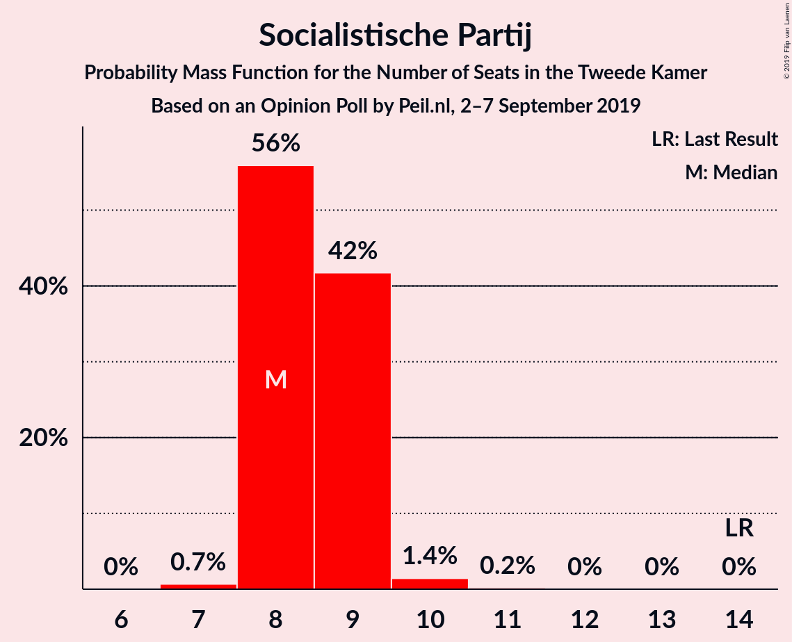

| Number of Seats | Probability | Accumulated | Special Marks |
|:---------------:|:-----------:|:-----------:|:-------------:|
| 7 | 5% | 100% |  |
| 8 | 23% | 95% |  |
| 9 | 64% | 72% | Median |
| 10 | 8% | 8% |  |
| 11 | 0.4% | 0.4% |  |
| 12 | 0% | 0% |  |
| 13 | 0% | 0% |  |
| 14 | 0% | 0% | Last Result |

### Partij voor de Dieren

*For a full overview of the results for this party, see the [Partij voor de Dieren](party-partijvoordedieren.html) page.*

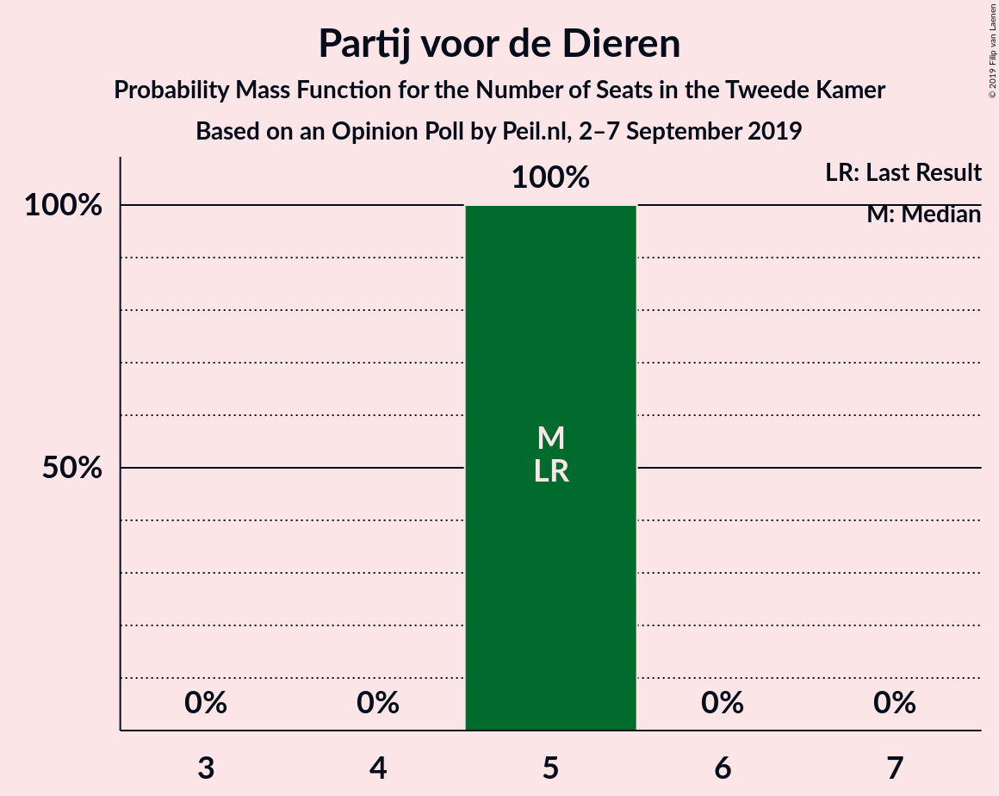

| Number of Seats | Probability | Accumulated | Special Marks |
|:---------------:|:-----------:|:-----------:|:-------------:|
| 5 | 0.7% | 100% | Last Result |
| 6 | 25% | 99.3% |  |
| 7 | 60% | 74% | Median |
| 8 | 14% | 14% |  |
| 9 | 0.4% | 0.4% |  |
| 10 | 0% | 0% |  |

### ChristenUnie

*For a full overview of the results for this party, see the [ChristenUnie](party-christenunie.html) page.*

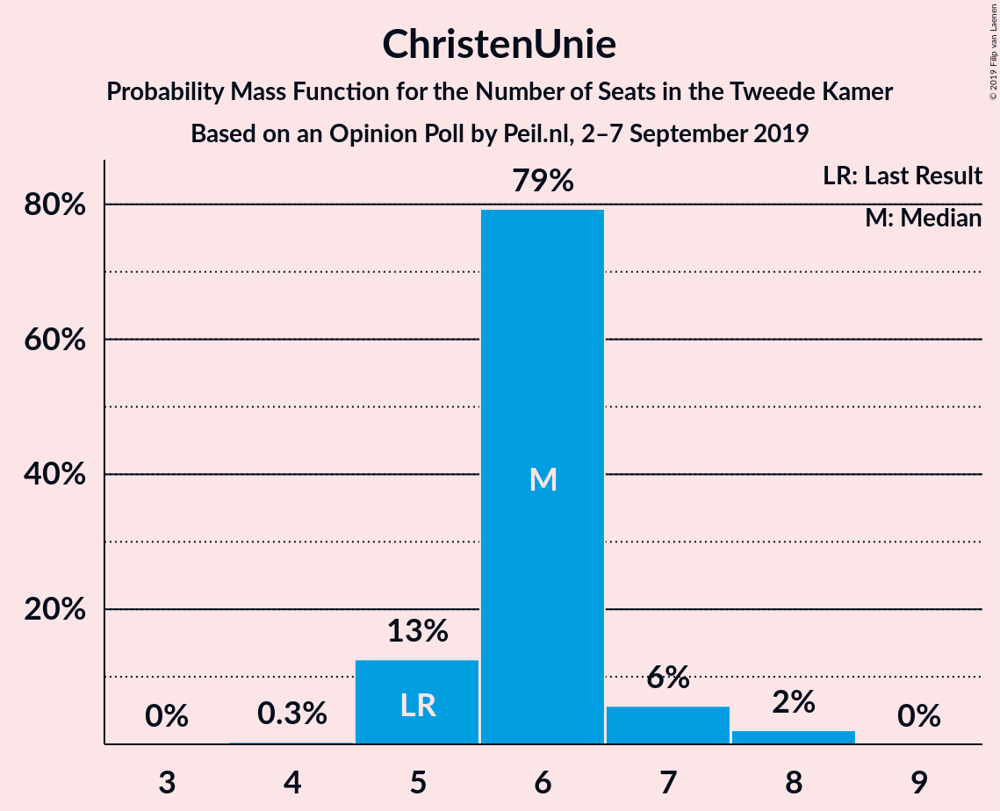

| Number of Seats | Probability | Accumulated | Special Marks |
|:---------------:|:-----------:|:-----------:|:-------------:|
| 4 | 0.5% | 100% |  |
| 5 | 18% | 99.5% | Last Result |
| 6 | 74% | 81% | Median |
| 7 | 6% | 7% |  |
| 8 | 1.5% | 1.5% |  |
| 9 | 0% | 0% |  |

### 50Plus

*For a full overview of the results for this party, see the [50Plus](party-50plus.html) page.*

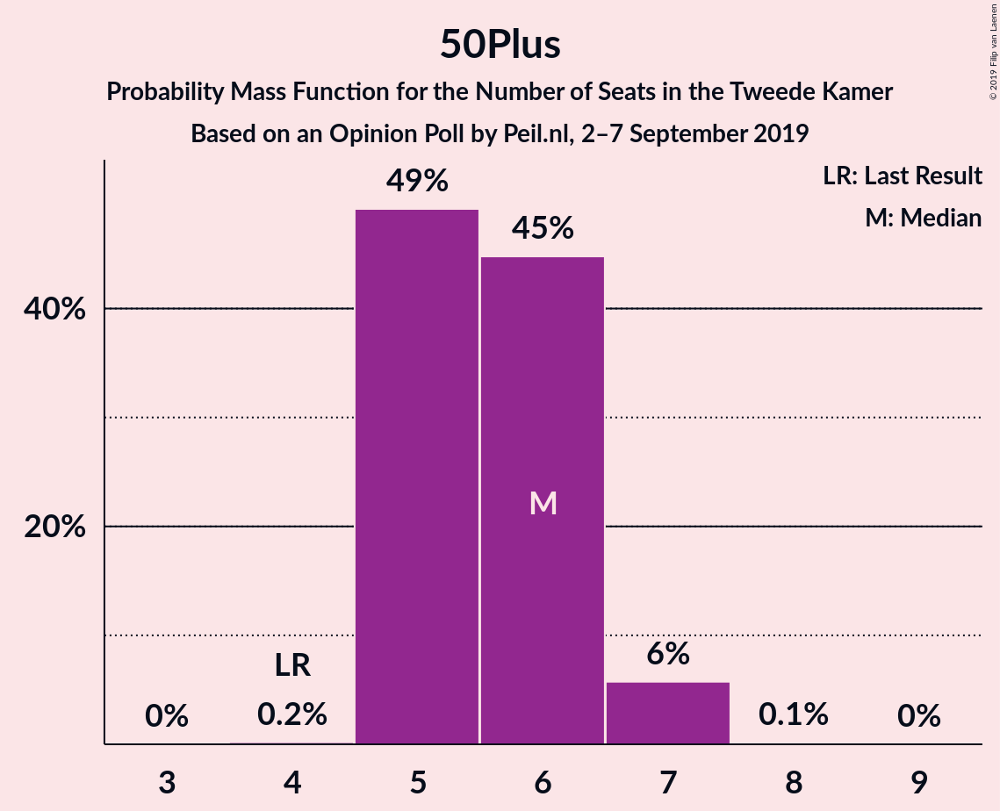

| Number of Seats | Probability | Accumulated | Special Marks |
|:---------------:|:-----------:|:-----------:|:-------------:|
| 4 | 0.3% | 100% | Last Result |
| 5 | 35% | 99.7% |  |
| 6 | 57% | 65% | Median |
| 7 | 7% | 7% |  |
| 8 | 0.2% | 0.2% |  |
| 9 | 0% | 0% |  |

### DENK

*For a full overview of the results for this party, see the [DENK](party-denk.html) page.*

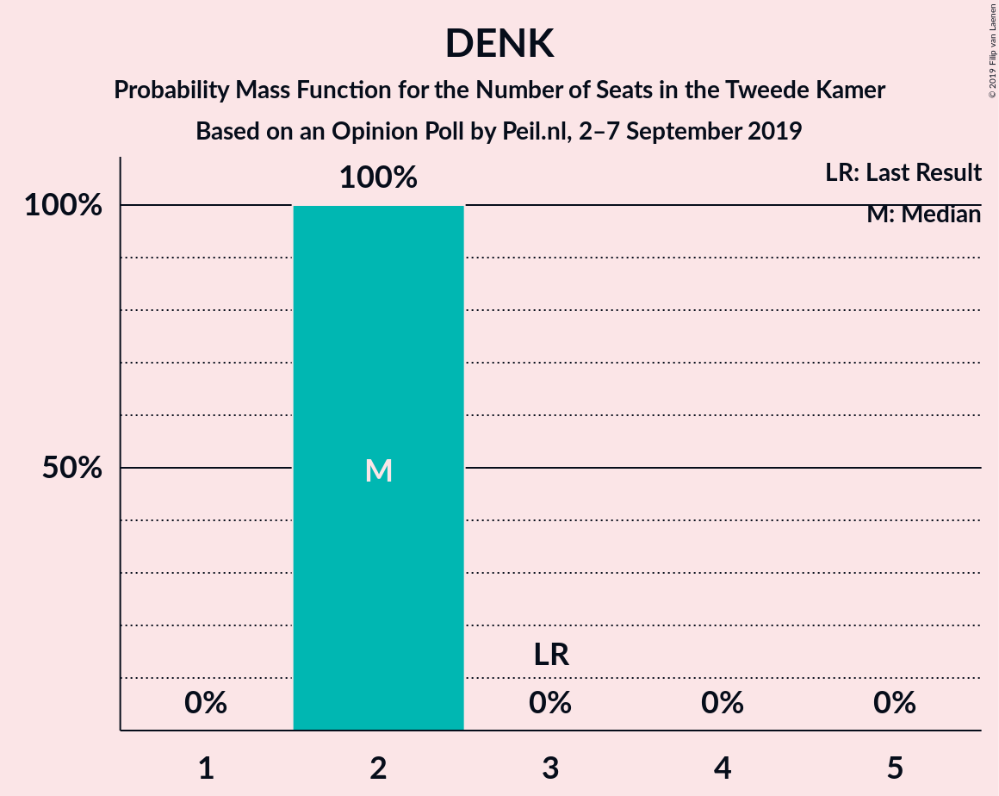

| Number of Seats | Probability | Accumulated | Special Marks |
|:---------------:|:-----------:|:-----------:|:-------------:|
| 1 | 0.1% | 100% |  |
| 2 | 23% | 99.9% |  |
| 3 | 74% | 77% | Last Result, Median |
| 4 | 3% | 3% |  |
| 5 | 0% | 0% |  |

### Staatkundig Gereformeerde Partij

*For a full overview of the results for this party, see the [Staatkundig Gereformeerde Partij](party-staatkundiggereformeerdepartij.html) page.*

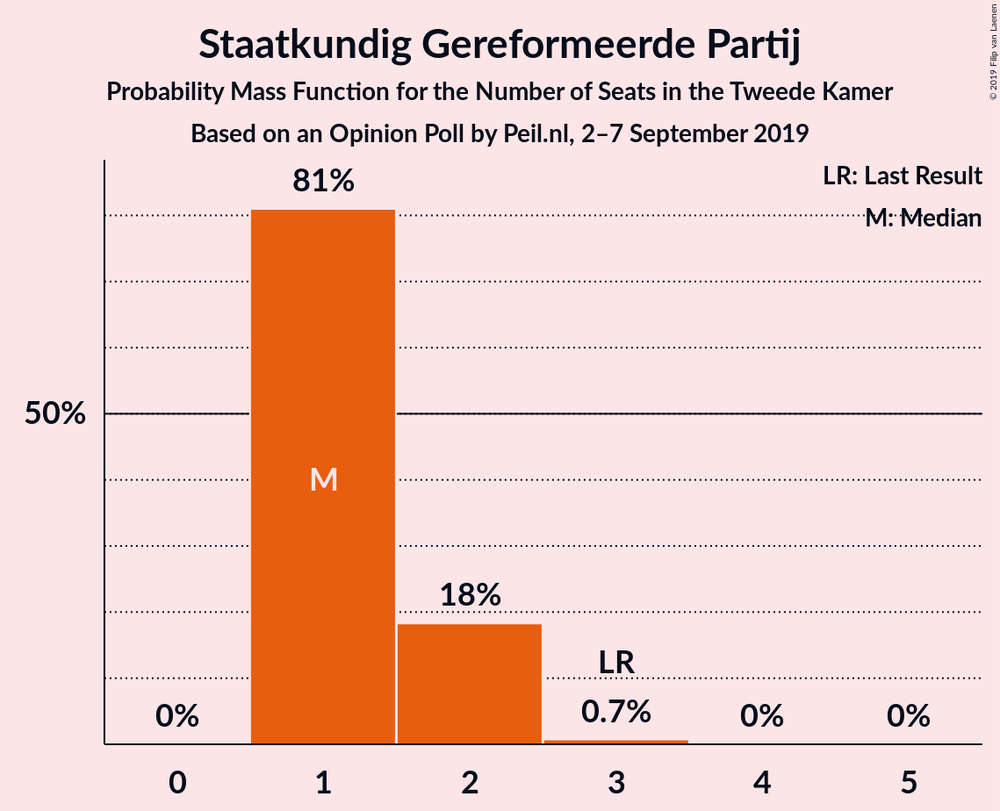

| Number of Seats | Probability | Accumulated | Special Marks |
|:---------------:|:-----------:|:-----------:|:-------------:|
| 1 | 38% | 100% |  |
| 2 | 61% | 62% | Median |
| 3 | 1.4% | 1.4% | Last Result |
| 4 | 0% | 0% |  |

## Coalitions

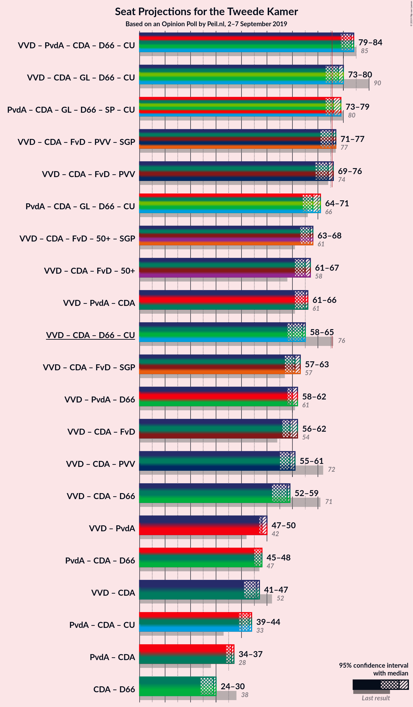

### Confidence Intervals

| Coalition | Last Result | Median | Majority? | 80% Confidence Interval | 90% Confidence Interval | 95% Confidence Interval | 99% Confidence Interval |
|:---------:|:-----------:|:------:|:---------:|:-----------------------:|:-----------------------:|:-----------------------:|:-----------------------:|
| Volkspartij voor Vrijheid en Democratie – Partij van de Arbeid – Christen-Democratisch Appèl – Democraten 66 – ChristenUnie | 85 | 81 | 100% | 79–83 | 79–84 | 79–84 | 78–86 |
| Volkspartij voor Vrijheid en Democratie – Christen-Democratisch Appèl – GroenLinks – Democraten 66 – ChristenUnie | 90 | 75 | 40% | 74–77 | 73–78 | 73–80 | 72–80 |
| Volkspartij voor Vrijheid en Democratie – Christen-Democratisch Appèl – Forum voor Democratie – Partij voor de Vrijheid – Staatkundig Gereformeerde Partij | 77 | 75 | 48% | 73–77 | 73–77 | 72–79 | 71–79 |
| Partij van de Arbeid – Christen-Democratisch Appèl – GroenLinks – Democraten 66 – Socialistische Partij – ChristenUnie | 80 | 74 | 31% | 73–76 | 73–77 | 73–78 | 72–79 |
| Volkspartij voor Vrijheid en Democratie – Christen-Democratisch Appèl – Forum voor Democratie – Partij voor de Vrijheid | 74 | 74 | 5% | 72–75 | 71–76 | 70–77 | 69–77 |
| Volkspartij voor Vrijheid en Democratie – Christen-Democratisch Appèl – Forum voor Democratie – 50Plus – Staatkundig Gereformeerde Partij | 61 | 68 | 0% | 65–69 | 65–69 | 64–69 | 63–70 |
| Partij van de Arbeid – Christen-Democratisch Appèl – GroenLinks – Democraten 66 – ChristenUnie | 66 | 66 | 0% | 64–68 | 64–69 | 64–69 | 63–71 |
| Volkspartij voor Vrijheid en Democratie – Partij van de Arbeid – Christen-Democratisch Appèl | 61 | 64 | 0% | 63–66 | 62–67 | 62–69 | 61–69 |
| Volkspartij voor Vrijheid en Democratie – Christen-Democratisch Appèl – Forum voor Democratie – 50Plus | 58 | 66 | 0% | 63–67 | 63–67 | 63–68 | 61–68 |
| Volkspartij voor Vrijheid en Democratie – Christen-Democratisch Appèl – Democraten 66 – ChristenUnie | 76 | 61 | 0% | 60–63 | 59–65 | 59–65 | 58–65 |
| Volkspartij voor Vrijheid en Democratie – Christen-Democratisch Appèl – Forum voor Democratie – Staatkundig Gereformeerde Partij | 57 | 62 | 0% | 60–63 | 59–63 | 58–64 | 57–64 |
| Volkspartij voor Vrijheid en Democratie – Christen-Democratisch Appèl – Partij voor de Vrijheid | 72 | 59 | 0% | 58–61 | 57–61 | 56–63 | 55–63 |
| Volkspartij voor Vrijheid en Democratie – Christen-Democratisch Appèl – Forum voor Democratie | 54 | 60 | 0% | 58–61 | 57–62 | 57–62 | 55–63 |
| Volkspartij voor Vrijheid en Democratie – Partij van de Arbeid – Democraten 66 | 61 | 59 | 0% | 58–62 | 57–62 | 56–62 | 56–63 |
| Volkspartij voor Vrijheid en Democratie – Christen-Democratisch Appèl – Democraten 66 | 71 | 55 | 0% | 54–58 | 54–58 | 53–59 | 53–59 |
| Volkspartij voor Vrijheid en Democratie – Partij van de Arbeid | 42 | 48 | 0% | 47–50 | 46–51 | 45–51 | 45–51 |
| Partij van de Arbeid – Christen-Democratisch Appèl – Democraten 66 | 47 | 46 | 0% | 45–48 | 45–48 | 45–49 | 44–50 |
| Volkspartij voor Vrijheid en Democratie – Christen-Democratisch Appèl | 52 | 45 | 0% | 44–46 | 43–48 | 42–48 | 41–48 |
| Partij van de Arbeid – Christen-Democratisch Appèl – ChristenUnie | 33 | 41 | 0% | 41–44 | 40–45 | 39–45 | 38–46 |
| Partij van de Arbeid – Christen-Democratisch Appèl | 28 | 35 | 0% | 35–37 | 34–38 | 34–39 | 33–39 |
| Christen-Democratisch Appèl – Democraten 66 | 38 | 26 | 0% | 25–28 | 25–29 | 25–29 | 25–30 |

### Volkspartij voor Vrijheid en Democratie – Partij van de Arbeid – Christen-Democratisch Appèl – Democraten 66 – ChristenUnie

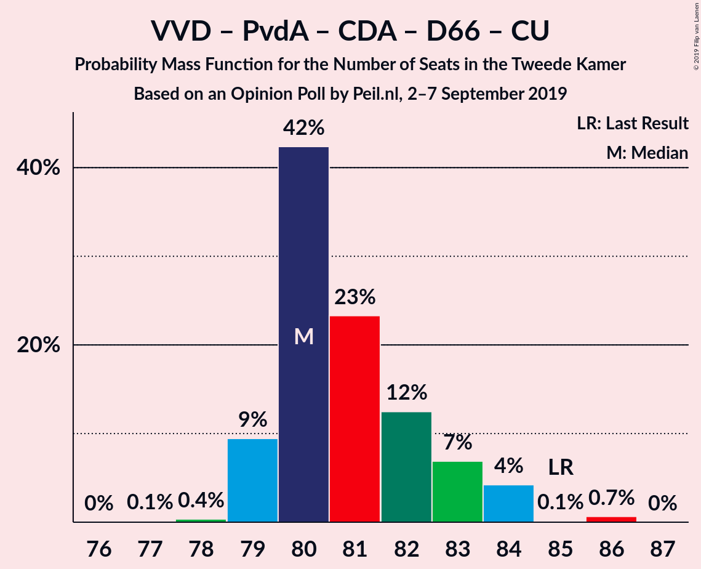

| Number of Seats | Probability | Accumulated | Special Marks |
|:---------------:|:-----------:|:-----------:|:-------------:|
| 77 | 0.2% | 100% |  |
| 78 | 0.3% | 99.8% |  |
| 79 | 10% | 99.5% |  |
| 80 | 32% | 89% |  |
| 81 | 24% | 57% | Median |
| 82 | 11% | 34% |  |
| 83 | 14% | 22% |  |
| 84 | 7% | 8% |  |
| 85 | 0.9% | 1.4% | Last Result |
| 86 | 0.5% | 0.5% |  |
| 87 | 0% | 0% |  |

### Volkspartij voor Vrijheid en Democratie – Christen-Democratisch Appèl – GroenLinks – Democraten 66 – ChristenUnie

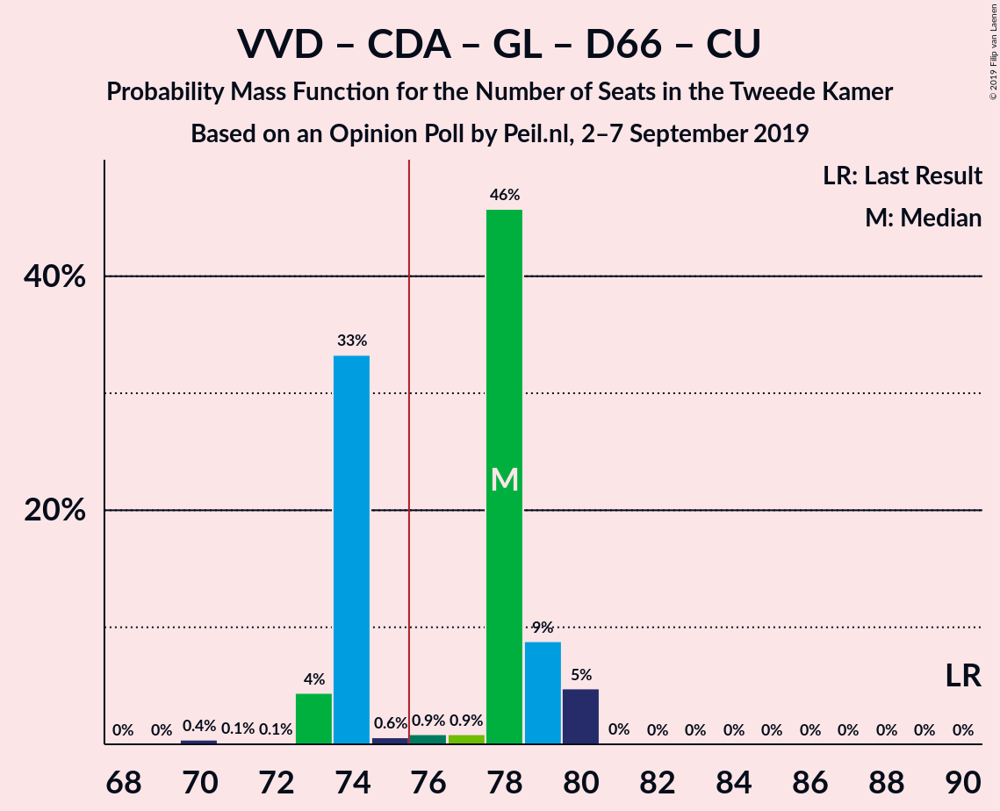

| Number of Seats | Probability | Accumulated | Special Marks |
|:---------------:|:-----------:|:-----------:|:-------------:|
| 70 | 0.1% | 100% |  |
| 71 | 0% | 99.9% |  |
| 72 | 2% | 99.9% |  |
| 73 | 8% | 98% |  |
| 74 | 30% | 90% | Median |
| 75 | 20% | 60% |  |
| 76 | 15% | 40% | Majority |
| 77 | 15% | 25% |  |
| 78 | 5% | 9% |  |
| 79 | 1.0% | 5% |  |
| 80 | 4% | 4% |  |
| 81 | 0% | 0% |  |
| 82 | 0% | 0% |  |
| 83 | 0% | 0% |  |
| 84 | 0% | 0% |  |
| 85 | 0% | 0% |  |
| 86 | 0% | 0% |  |
| 87 | 0% | 0% |  |
| 88 | 0% | 0% |  |
| 89 | 0% | 0% |  |
| 90 | 0% | 0% | Last Result |

### Volkspartij voor Vrijheid en Democratie – Christen-Democratisch Appèl – Forum voor Democratie – Partij voor de Vrijheid – Staatkundig Gereformeerde Partij

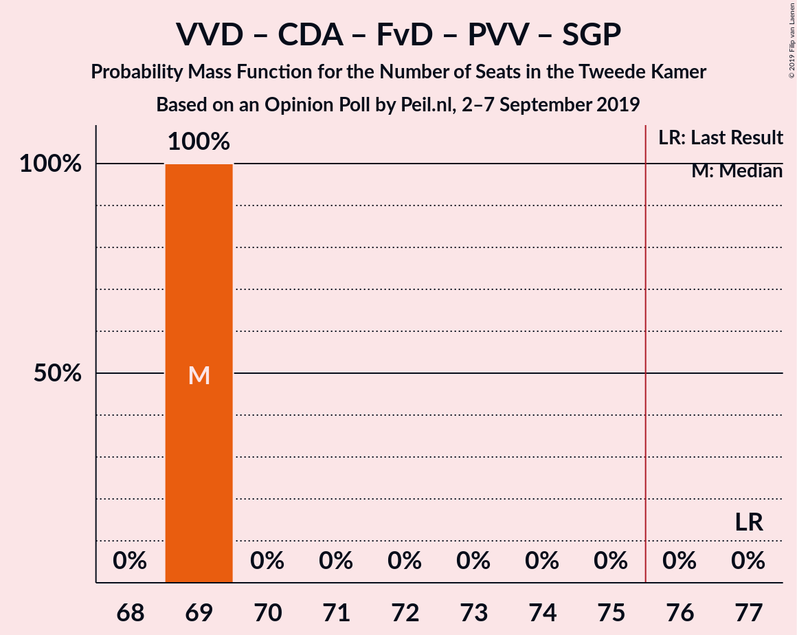

| Number of Seats | Probability | Accumulated | Special Marks |
|:---------------:|:-----------:|:-----------:|:-------------:|
| 68 | 0.1% | 100% |  |
| 69 | 0% | 99.9% |  |
| 70 | 0.3% | 99.9% |  |
| 71 | 0.8% | 99.6% |  |
| 72 | 2% | 98.8% |  |
| 73 | 9% | 97% |  |
| 74 | 6% | 87% |  |
| 75 | 34% | 81% |  |
| 76 | 34% | 48% | Median, Majority |
| 77 | 9% | 14% | Last Result |
| 78 | 0.5% | 5% |  |
| 79 | 4% | 4% |  |
| 80 | 0.1% | 0.1% |  |
| 81 | 0% | 0% |  |

### Partij van de Arbeid – Christen-Democratisch Appèl – GroenLinks – Democraten 66 – Socialistische Partij – ChristenUnie

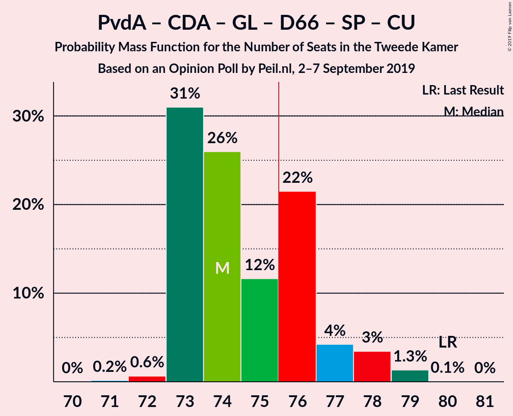

| Number of Seats | Probability | Accumulated | Special Marks |
|:---------------:|:-----------:|:-----------:|:-------------:|
| 71 | 0.2% | 100% |  |
| 72 | 0.6% | 99.8% |  |
| 73 | 31% | 99.2% |  |
| 74 | 26% | 68% | Median |
| 75 | 12% | 42% |  |
| 76 | 22% | 31% | Majority |
| 77 | 4% | 9% |  |
| 78 | 3% | 5% |  |
| 79 | 1.3% | 1.4% |  |
| 80 | 0.1% | 0.1% | Last Result |
| 81 | 0% | 0% |  |

### Volkspartij voor Vrijheid en Democratie – Christen-Democratisch Appèl – Forum voor Democratie – Partij voor de Vrijheid

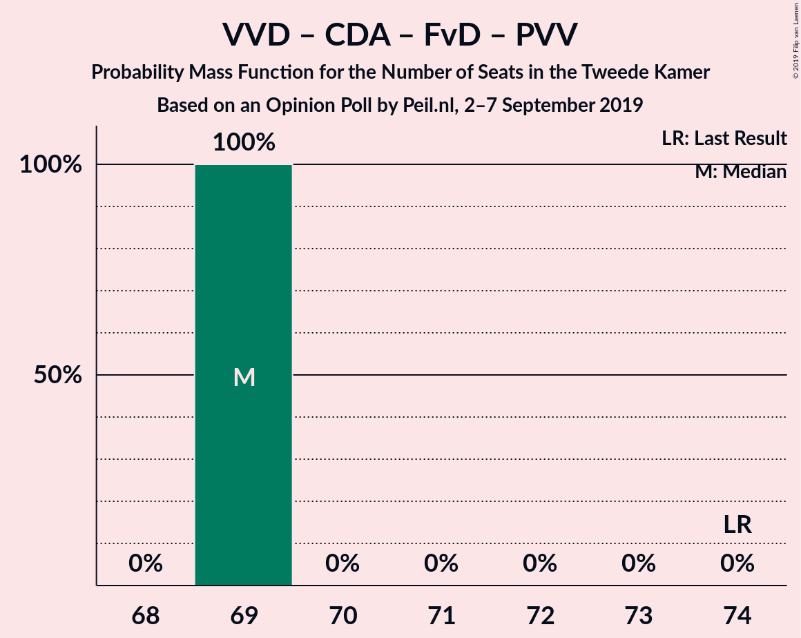

| Number of Seats | Probability | Accumulated | Special Marks |
|:---------------:|:-----------:|:-----------:|:-------------:|
| 67 | 0.1% | 100% |  |
| 68 | 0% | 99.9% |  |
| 69 | 0.9% | 99.9% |  |
| 70 | 1.5% | 99.0% |  |
| 71 | 3% | 97% |  |
| 72 | 11% | 95% |  |
| 73 | 15% | 84% |  |
| 74 | 50% | 68% | Last Result, Median |
| 75 | 13% | 19% |  |
| 76 | 0.7% | 5% | Majority |
| 77 | 4% | 4% |  |
| 78 | 0.4% | 0.5% |  |
| 79 | 0% | 0% |  |

### Volkspartij voor Vrijheid en Democratie – Christen-Democratisch Appèl – Forum voor Democratie – 50Plus – Staatkundig Gereformeerde Partij

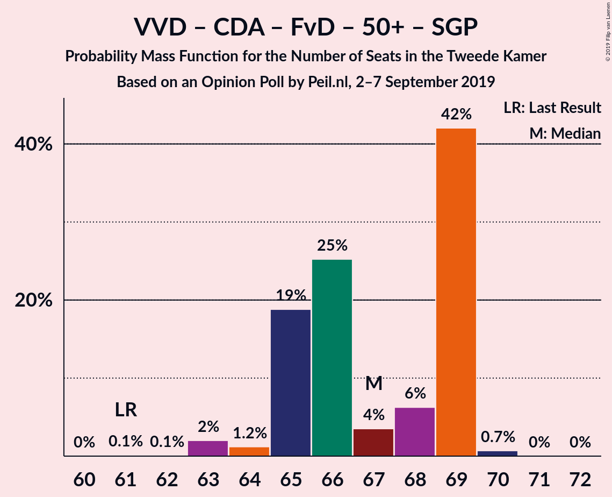

| Number of Seats | Probability | Accumulated | Special Marks |
|:---------------:|:-----------:|:-----------:|:-------------:|
| 61 | 0.1% | 100% | Last Result |
| 62 | 0.1% | 99.9% |  |
| 63 | 2% | 99.8% |  |
| 64 | 1.1% | 98% |  |
| 65 | 18% | 97% |  |
| 66 | 22% | 79% |  |
| 67 | 6% | 57% |  |
| 68 | 15% | 51% | Median |
| 69 | 35% | 36% |  |
| 70 | 1.0% | 1.1% |  |
| 71 | 0% | 0.1% |  |
| 72 | 0% | 0% |  |

### Partij van de Arbeid – Christen-Democratisch Appèl – GroenLinks – Democraten 66 – ChristenUnie

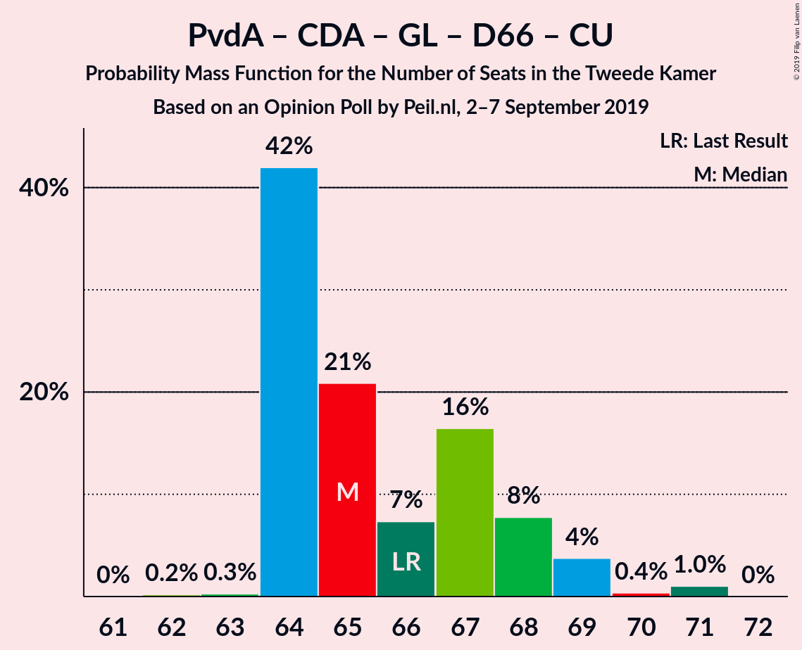

| Number of Seats | Probability | Accumulated | Special Marks |
|:---------------:|:-----------:|:-----------:|:-------------:|
| 62 | 0.2% | 100% |  |
| 63 | 0.4% | 99.8% |  |
| 64 | 30% | 99.5% |  |
| 65 | 16% | 69% | Median |
| 66 | 20% | 54% | Last Result |
| 67 | 18% | 34% |  |
| 68 | 11% | 16% |  |
| 69 | 4% | 5% |  |
| 70 | 0.6% | 1.5% |  |
| 71 | 0.8% | 0.9% |  |
| 72 | 0.1% | 0.1% |  |
| 73 | 0% | 0% |  |

### Volkspartij voor Vrijheid en Democratie – Partij van de Arbeid – Christen-Democratisch Appèl

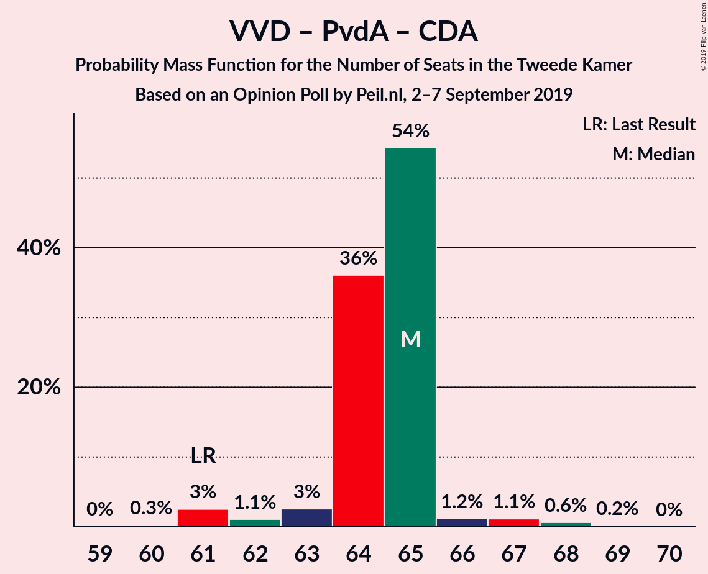

| Number of Seats | Probability | Accumulated | Special Marks |
|:---------------:|:-----------:|:-----------:|:-------------:|
| 60 | 0.1% | 100% |  |
| 61 | 1.3% | 99.9% | Last Result |
| 62 | 7% | 98.5% |  |
| 63 | 3% | 92% |  |
| 64 | 39% | 89% |  |
| 65 | 24% | 50% | Median |
| 66 | 19% | 25% |  |
| 67 | 1.5% | 6% |  |
| 68 | 0.4% | 4% |  |
| 69 | 4% | 4% |  |
| 70 | 0% | 0% |  |

### Volkspartij voor Vrijheid en Democratie – Christen-Democratisch Appèl – Forum voor Democratie – 50Plus

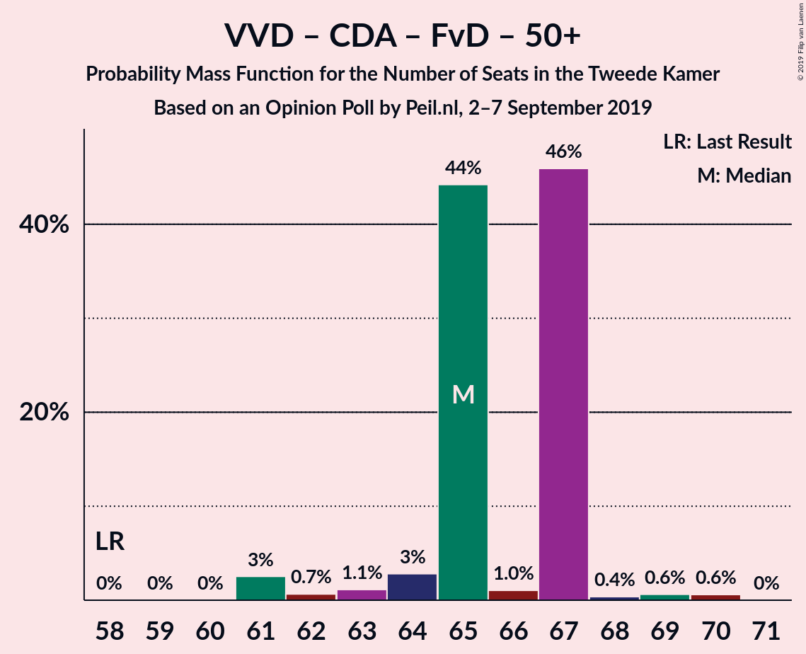

| Number of Seats | Probability | Accumulated | Special Marks |
|:---------------:|:-----------:|:-----------:|:-------------:|
| 58 | 0% | 100% | Last Result |
| 59 | 0% | 100% |  |
| 60 | 0.1% | 100% |  |
| 61 | 2% | 99.9% |  |
| 62 | 0.6% | 98% |  |
| 63 | 11% | 98% |  |
| 64 | 11% | 87% |  |
| 65 | 24% | 76% |  |
| 66 | 13% | 52% | Median |
| 67 | 34% | 39% |  |
| 68 | 4% | 5% |  |
| 69 | 0.4% | 0.5% |  |
| 70 | 0.1% | 0.1% |  |
| 71 | 0% | 0% |  |

### Volkspartij voor Vrijheid en Democratie – Christen-Democratisch Appèl – Democraten 66 – ChristenUnie

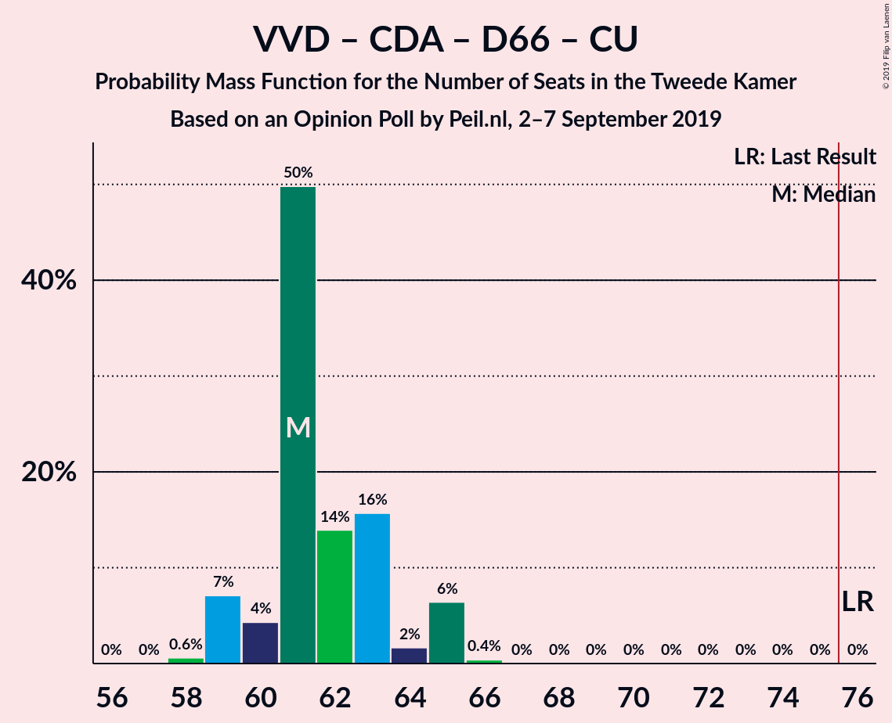

| Number of Seats | Probability | Accumulated | Special Marks |
|:---------------:|:-----------:|:-----------:|:-------------:|
| 58 | 0.6% | 100% |  |
| 59 | 7% | 99.4% |  |
| 60 | 4% | 92% |  |
| 61 | 50% | 88% | Median |
| 62 | 14% | 38% |  |
| 63 | 16% | 24% |  |
| 64 | 2% | 8% |  |
| 65 | 6% | 7% |  |
| 66 | 0.4% | 0.4% |  |
| 67 | 0% | 0% |  |
| 68 | 0% | 0% |  |
| 69 | 0% | 0% |  |
| 70 | 0% | 0% |  |
| 71 | 0% | 0% |  |
| 72 | 0% | 0% |  |
| 73 | 0% | 0% |  |
| 74 | 0% | 0% |  |
| 75 | 0% | 0% |  |
| 76 | 0% | 0% | Last Result, Majority |

### Volkspartij voor Vrijheid en Democratie – Christen-Democratisch Appèl – Forum voor Democratie – Staatkundig Gereformeerde Partij

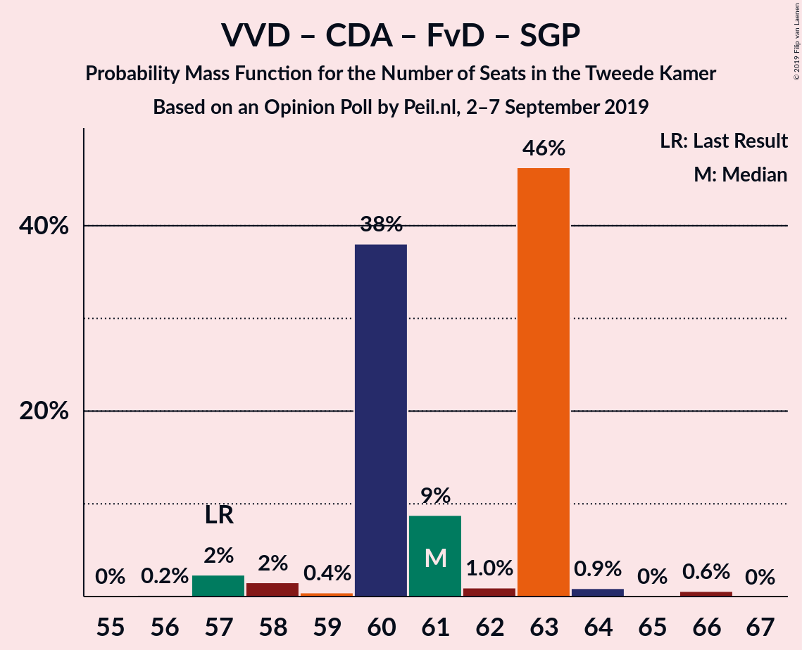

| Number of Seats | Probability | Accumulated | Special Marks |
|:---------------:|:-----------:|:-----------:|:-------------:|
| 55 | 0.1% | 100% |  |
| 56 | 0% | 99.9% |  |
| 57 | 0.6% | 99.9% | Last Result |
| 58 | 2% | 99.3% |  |
| 59 | 6% | 97% |  |
| 60 | 32% | 91% |  |
| 61 | 8% | 59% |  |
| 62 | 7% | 51% | Median |
| 63 | 39% | 44% |  |
| 64 | 4% | 5% |  |
| 65 | 0.3% | 0.5% |  |
| 66 | 0.1% | 0.1% |  |
| 67 | 0% | 0% |  |

### Volkspartij voor Vrijheid en Democratie – Christen-Democratisch Appèl – Partij voor de Vrijheid

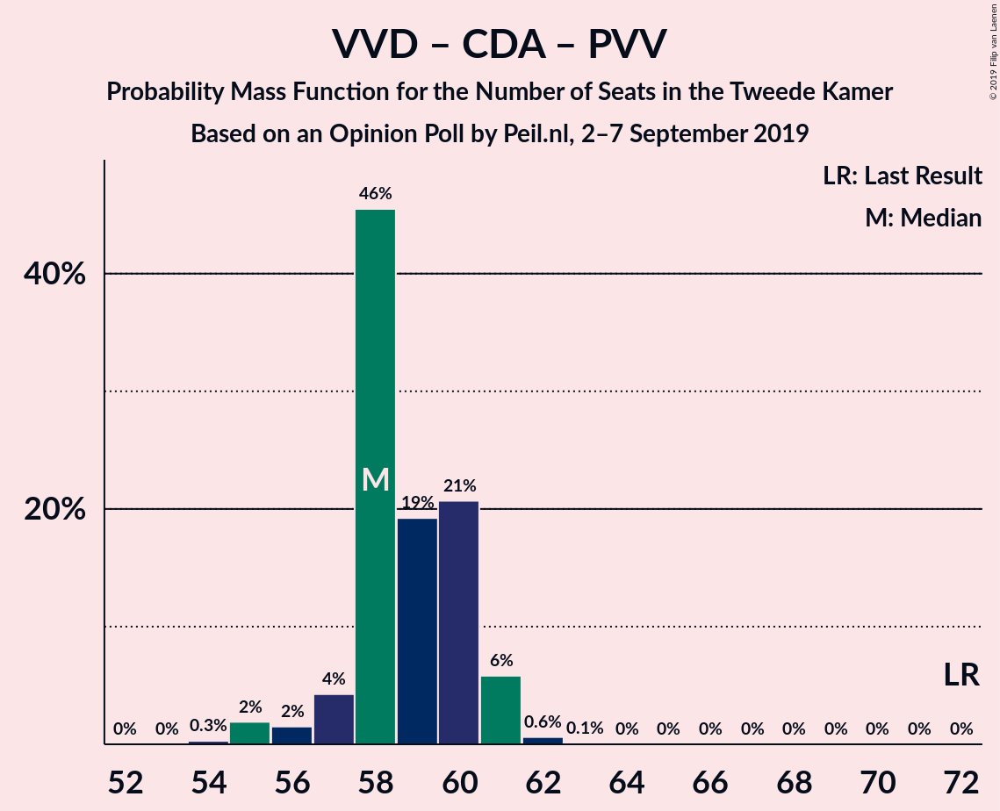

| Number of Seats | Probability | Accumulated | Special Marks |
|:---------------:|:-----------:|:-----------:|:-------------:|
| 54 | 0.2% | 100% |  |
| 55 | 2% | 99.8% |  |
| 56 | 2% | 98% |  |
| 57 | 5% | 96% |  |
| 58 | 35% | 92% |  |
| 59 | 17% | 56% | Median |
| 60 | 27% | 39% |  |
| 61 | 7% | 12% |  |
| 62 | 0.7% | 5% |  |
| 63 | 4% | 4% |  |
| 64 | 0.1% | 0.1% |  |
| 65 | 0% | 0% |  |
| 66 | 0% | 0% |  |
| 67 | 0% | 0% |  |
| 68 | 0% | 0% |  |
| 69 | 0% | 0% |  |
| 70 | 0% | 0% |  |
| 71 | 0% | 0% |  |
| 72 | 0% | 0% | Last Result |

### Volkspartij voor Vrijheid en Democratie – Christen-Democratisch Appèl – Forum voor Democratie

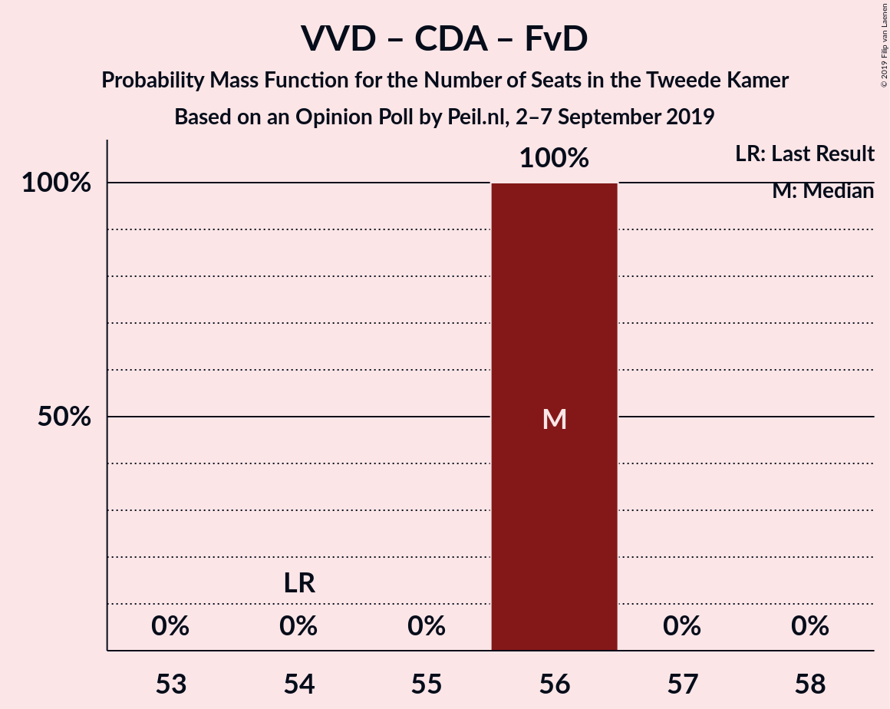

| Number of Seats | Probability | Accumulated | Special Marks |
|:---------------:|:-----------:|:-----------:|:-------------:|
| 54 | 0.1% | 100% | Last Result |
| 55 | 0.6% | 99.9% |  |
| 56 | 1.4% | 99.3% |  |
| 57 | 6% | 98% |  |
| 58 | 6% | 92% |  |
| 59 | 32% | 85% |  |
| 60 | 5% | 53% | Median |
| 61 | 40% | 48% |  |
| 62 | 7% | 7% |  |
| 63 | 0.1% | 0.5% |  |
| 64 | 0.4% | 0.4% |  |
| 65 | 0% | 0% |  |

### Volkspartij voor Vrijheid en Democratie – Partij van de Arbeid – Democraten 66

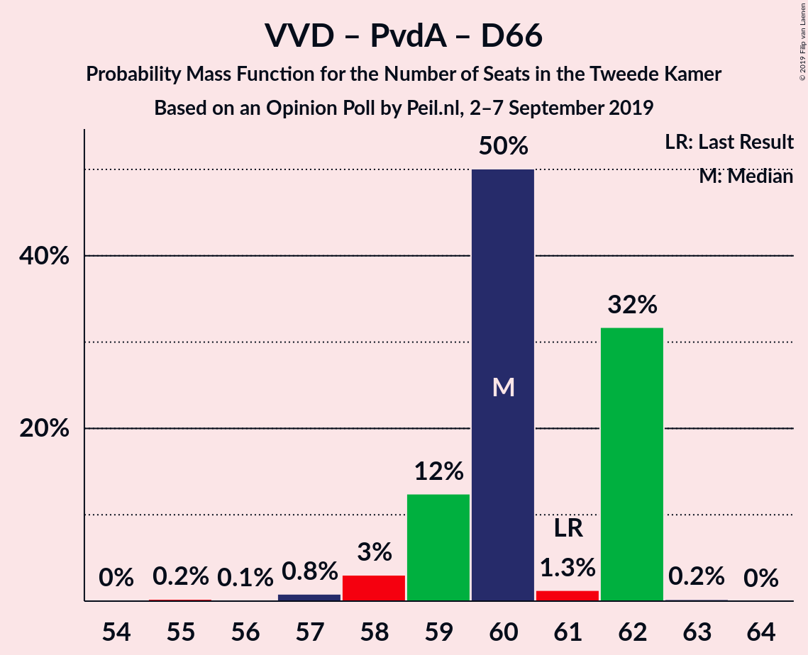

| Number of Seats | Probability | Accumulated | Special Marks |
|:---------------:|:-----------:|:-----------:|:-------------:|
| 55 | 0.1% | 100% |  |
| 56 | 4% | 99.9% |  |
| 57 | 5% | 96% |  |
| 58 | 36% | 90% |  |
| 59 | 7% | 54% | Median |
| 60 | 33% | 47% |  |
| 61 | 3% | 14% | Last Result |
| 62 | 11% | 12% |  |
| 63 | 0.2% | 0.6% |  |
| 64 | 0.3% | 0.3% |  |
| 65 | 0% | 0% |  |

### Volkspartij voor Vrijheid en Democratie – Christen-Democratisch Appèl – Democraten 66

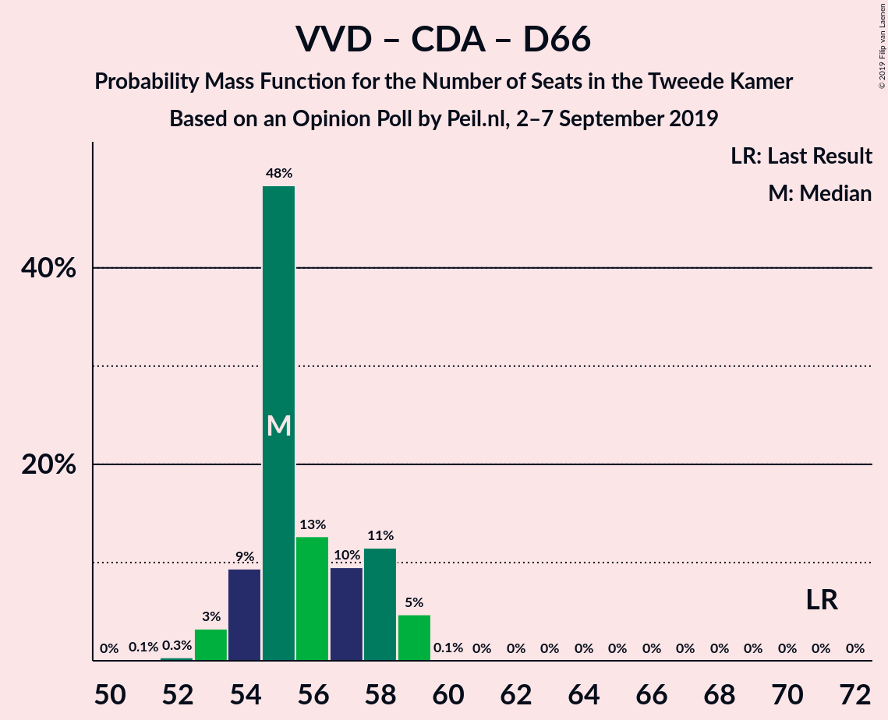

| Number of Seats | Probability | Accumulated | Special Marks |
|:---------------:|:-----------:|:-----------:|:-------------:|
| 51 | 0.1% | 100% |  |
| 52 | 0.3% | 99.9% |  |
| 53 | 3% | 99.5% |  |
| 54 | 9% | 96% |  |
| 55 | 48% | 87% | Median |
| 56 | 13% | 38% |  |
| 57 | 10% | 26% |  |
| 58 | 11% | 16% |  |
| 59 | 5% | 5% |  |
| 60 | 0.1% | 0.1% |  |
| 61 | 0% | 0% |  |
| 62 | 0% | 0% |  |
| 63 | 0% | 0% |  |
| 64 | 0% | 0% |  |
| 65 | 0% | 0% |  |
| 66 | 0% | 0% |  |
| 67 | 0% | 0% |  |
| 68 | 0% | 0% |  |
| 69 | 0% | 0% |  |
| 70 | 0% | 0% |  |
| 71 | 0% | 0% | Last Result |

### Volkspartij voor Vrijheid en Democratie – Partij van de Arbeid

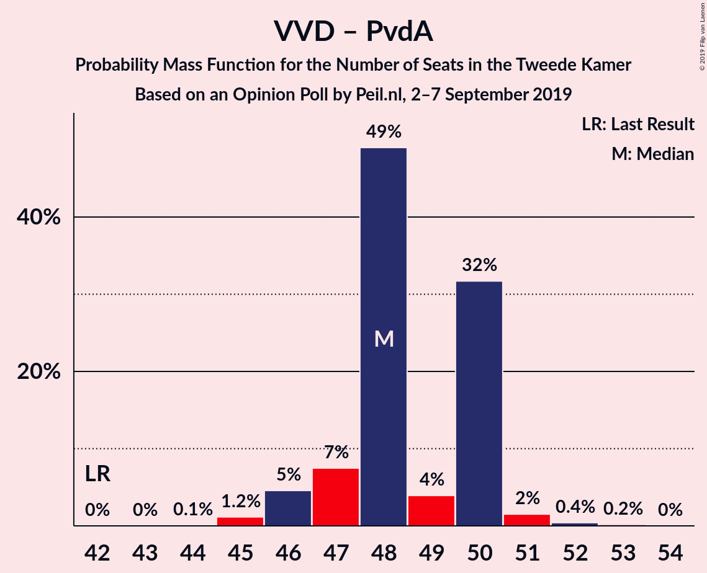

| Number of Seats | Probability | Accumulated | Special Marks |
|:---------------:|:-----------:|:-----------:|:-------------:|
| 42 | 0% | 100% | Last Result |
| 43 | 0% | 100% |  |
| 44 | 0.1% | 100% |  |
| 45 | 4% | 99.9% |  |
| 46 | 3% | 96% |  |
| 47 | 7% | 92% |  |
| 48 | 41% | 85% |  |
| 49 | 8% | 44% | Median |
| 50 | 31% | 36% |  |
| 51 | 5% | 6% |  |
| 52 | 0.3% | 0.5% |  |
| 53 | 0.1% | 0.2% |  |
| 54 | 0% | 0% |  |

### Partij van de Arbeid – Christen-Democratisch Appèl – Democraten 66

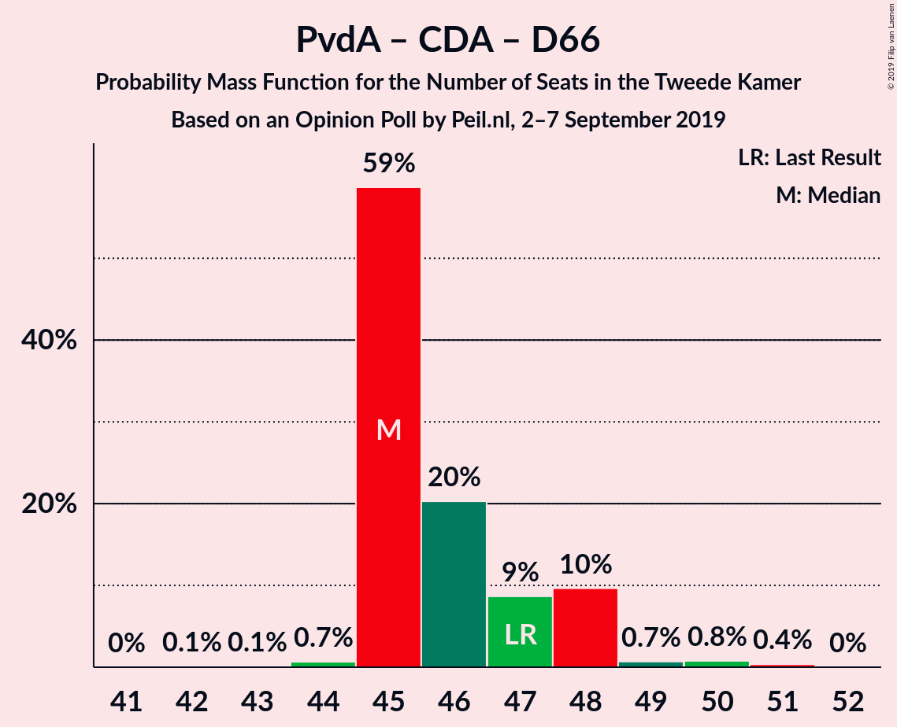

| Number of Seats | Probability | Accumulated | Special Marks |
|:---------------:|:-----------:|:-----------:|:-------------:|
| 42 | 0.1% | 100% |  |
| 43 | 0.4% | 99.9% |  |
| 44 | 0.6% | 99.5% |  |
| 45 | 44% | 98.9% |  |
| 46 | 21% | 55% | Median |
| 47 | 9% | 34% | Last Result |
| 48 | 22% | 25% |  |
| 49 | 0.9% | 3% |  |
| 50 | 1.4% | 2% |  |
| 51 | 0.4% | 0.5% |  |
| 52 | 0% | 0% |  |

### Volkspartij voor Vrijheid en Democratie – Christen-Democratisch Appèl

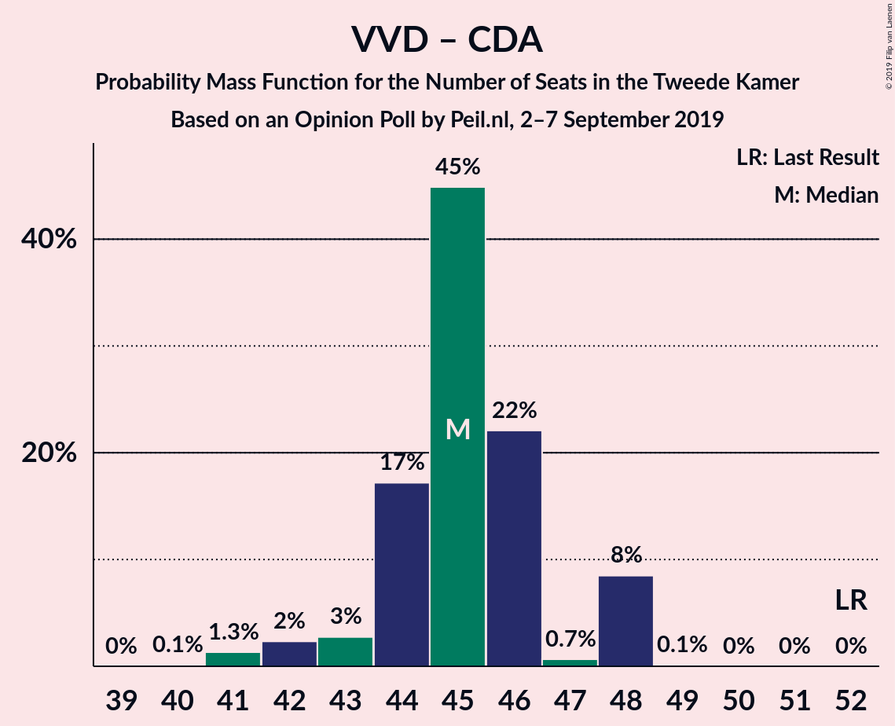

| Number of Seats | Probability | Accumulated | Special Marks |
|:---------------:|:-----------:|:-----------:|:-------------:|
| 40 | 0.1% | 100% |  |
| 41 | 1.3% | 99.9% |  |
| 42 | 2% | 98.5% |  |
| 43 | 3% | 96% |  |
| 44 | 17% | 93% |  |
| 45 | 45% | 76% | Median |
| 46 | 22% | 31% |  |
| 47 | 0.7% | 9% |  |
| 48 | 8% | 9% |  |
| 49 | 0.1% | 0.1% |  |
| 50 | 0% | 0% |  |
| 51 | 0% | 0% |  |
| 52 | 0% | 0% | Last Result |

### Partij van de Arbeid – Christen-Democratisch Appèl – ChristenUnie

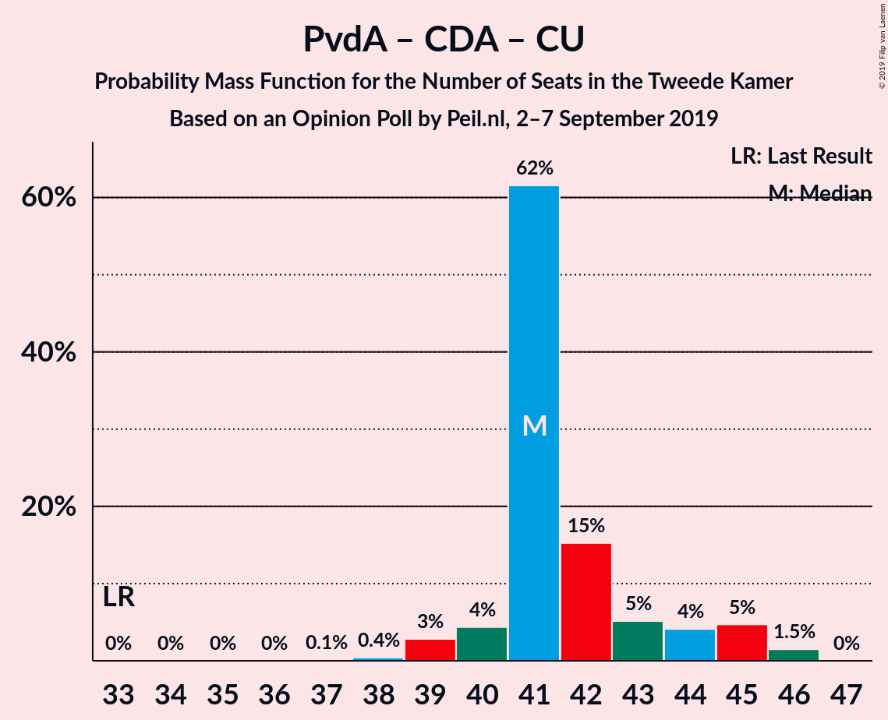

| Number of Seats | Probability | Accumulated | Special Marks |
|:---------------:|:-----------:|:-----------:|:-------------:|
| 33 | 0% | 100% | Last Result |
| 34 | 0% | 100% |  |
| 35 | 0% | 100% |  |
| 36 | 0% | 100% |  |
| 37 | 0.1% | 100% |  |
| 38 | 0.4% | 99.9% |  |
| 39 | 3% | 99.5% |  |
| 40 | 4% | 97% |  |
| 41 | 62% | 92% |  |
| 42 | 15% | 31% | Median |
| 43 | 5% | 15% |  |
| 44 | 4% | 10% |  |
| 45 | 5% | 6% |  |
| 46 | 1.5% | 1.5% |  |
| 47 | 0% | 0% |  |

### Partij van de Arbeid – Christen-Democratisch Appèl

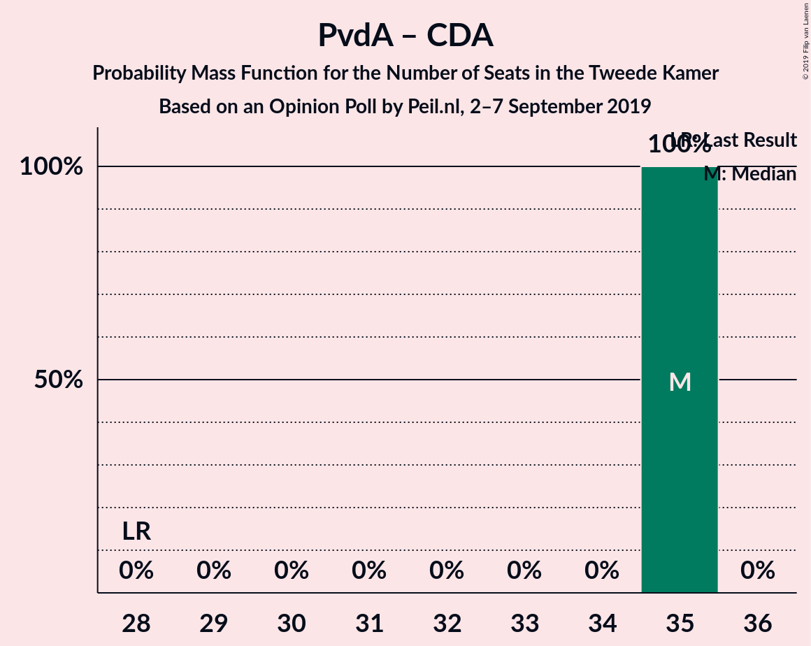

| Number of Seats | Probability | Accumulated | Special Marks |
|:---------------:|:-----------:|:-----------:|:-------------:|
| 28 | 0% | 100% | Last Result |
| 29 | 0% | 100% |  |
| 30 | 0% | 100% |  |
| 31 | 0.1% | 100% |  |
| 32 | 0.3% | 99.9% |  |
| 33 | 0.8% | 99.6% |  |
| 34 | 6% | 98.8% |  |
| 35 | 52% | 93% |  |
| 36 | 24% | 41% | Median |
| 37 | 7% | 17% |  |
| 38 | 5% | 10% |  |
| 39 | 4% | 4% |  |
| 40 | 0% | 0.1% |  |
| 41 | 0% | 0% |  |

### Christen-Democratisch Appèl – Democraten 66

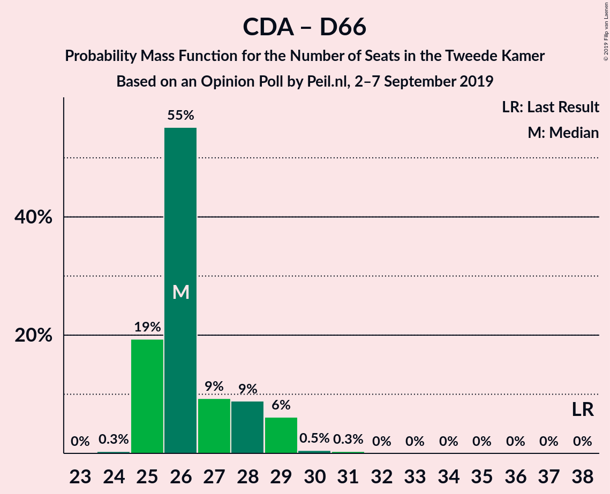

| Number of Seats | Probability | Accumulated | Special Marks |
|:---------------:|:-----------:|:-----------:|:-------------:|
| 23 | 0.1% | 100% |  |
| 24 | 0.3% | 99.9% |  |
| 25 | 14% | 99.6% |  |
| 26 | 44% | 86% | Median |
| 27 | 14% | 42% |  |
| 28 | 21% | 28% |  |
| 29 | 6% | 7% |  |
| 30 | 0.5% | 0.8% |  |
| 31 | 0.3% | 0.3% |  |
| 32 | 0% | 0% |  |
| 33 | 0% | 0% |  |
| 34 | 0% | 0% |  |
| 35 | 0% | 0% |  |
| 36 | 0% | 0% |  |
| 37 | 0% | 0% |  |
| 38 | 0% | 0% | Last Result |

## Technical Information

### Opinion Poll

+ **Polling firm:** Peil.nl
+ **Commissioner(s):** —
+ **Fieldwork period:** 2–7 September 2019

### Calculations

+ **Sample size:** 3000
+ **Simulations done:** 1,048,576
+ **Error estimate:** 1.10%

