# Opinion Poll by Peil.nl, 9–14 September 2019

<a href="#voting-intentions">Voting Intentions</a> | <a href="#seats">Seats</a> | <a href="#coalitions">Coalitions</a> | <a href="#technical-information">Technical Information</a>

## Voting Intentions

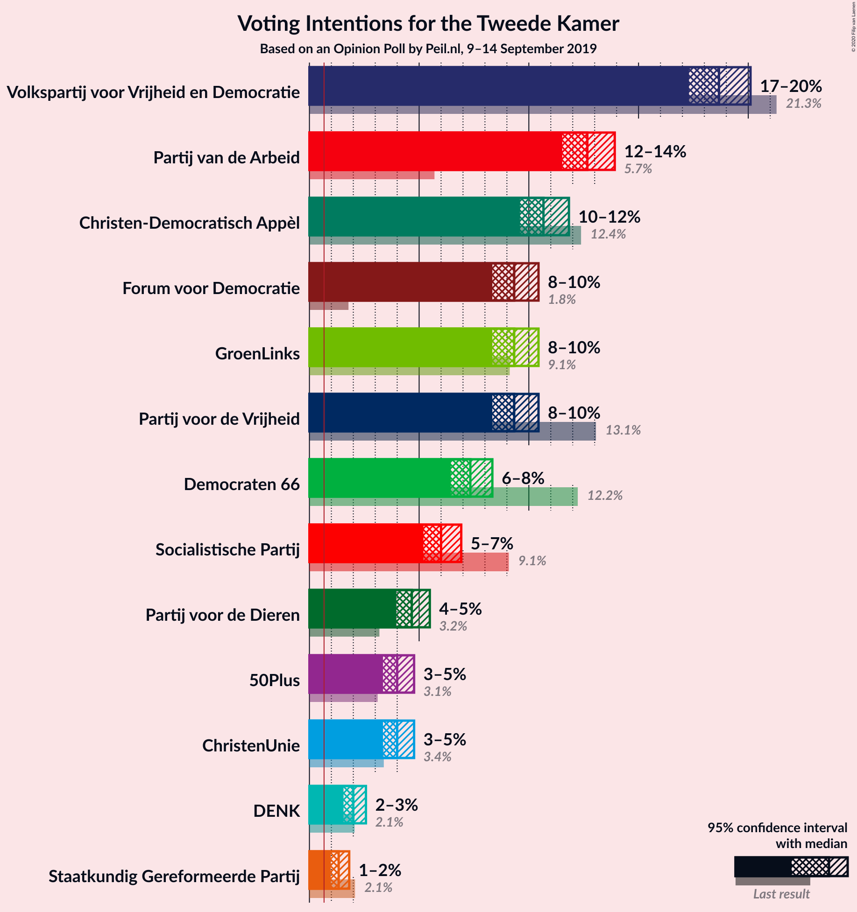

### Confidence Intervals

| Party | Last Result | Poll Result | 80% Confidence Interval | 90% Confidence Interval | 95% Confidence Interval | 99% Confidence Interval |
|:-----:|:-----------:|:-----------:|:-----------------------:|:-----------------------:|:-----------------------:|:-----------------------:|
| Volkspartij voor Vrijheid en Democratie | 21.3% | 18.7% | 17.8–19.6% |17.5–19.9% |17.3–20.1% |16.9–20.6% |
| Partij van de Arbeid | 5.7% | 12.7% | 11.9–13.5% |11.7–13.7% |11.5–13.9% |11.2–14.3% |
| Christen-Democratisch Appèl | 12.4% | 10.7% | 10.0–11.4% |9.8–11.6% |9.6–11.8% |9.3–12.2% |
| Partij voor de Vrijheid | 13.1% | 9.3% | 8.7–10.1% |8.5–10.3% |8.3–10.4% |8.0–10.8% |
| GroenLinks | 9.1% | 9.3% | 8.7–10.1% |8.5–10.3% |8.3–10.4% |8.0–10.8% |
| Forum voor Democratie | 1.8% | 9.3% | 8.7–10.1% |8.5–10.3% |8.3–10.4% |8.0–10.8% |
| Democraten 66 | 12.2% | 7.3% | 6.8–8.0% |6.6–8.2% |6.4–8.3% |6.2–8.6% |
| Socialistische Partij | 9.1% | 6.0% | 5.5–6.6% |5.3–6.8% |5.2–6.9% |5.0–7.2% |
| Partij voor de Dieren | 3.2% | 4.7% | 4.2–5.2% |4.1–5.3% |4.0–5.5% |3.7–5.8% |
| ChristenUnie | 3.4% | 4.0% | 3.6–4.5% |3.4–4.6% |3.4–4.8% |3.2–5.0% |
| 50Plus | 3.1% | 4.0% | 3.6–4.5% |3.4–4.6% |3.4–4.8% |3.2–5.0% |
| DENK | 2.1% | 2.0% | 1.7–2.4% |1.6–2.5% |1.6–2.6% |1.4–2.8% |
| Staatkundig Gereformeerde Partij | 2.1% | 1.3% | 1.1–1.6% |1.0–1.7% |1.0–1.8% |0.9–2.0% |

*Note:* The poll result column reflects the actual value used in the calculations. Published results may vary slightly, and in addition be rounded to fewer digits.

## Seats

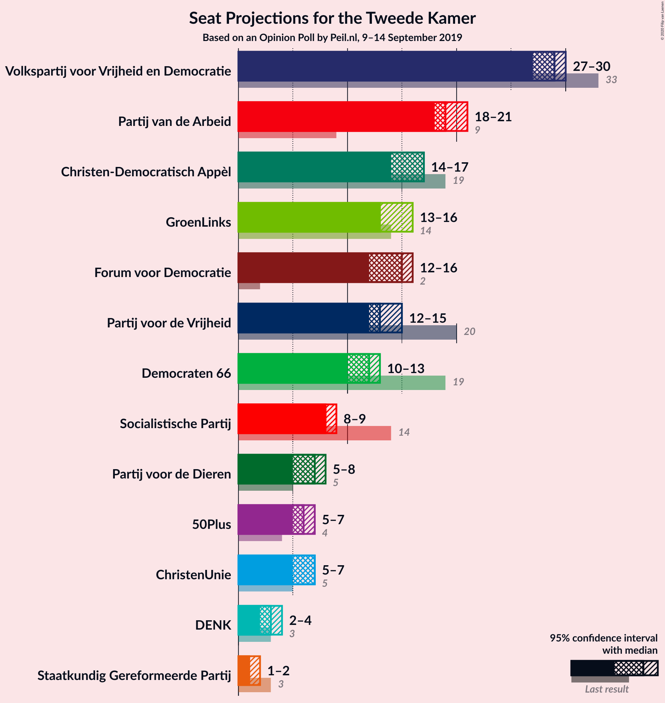

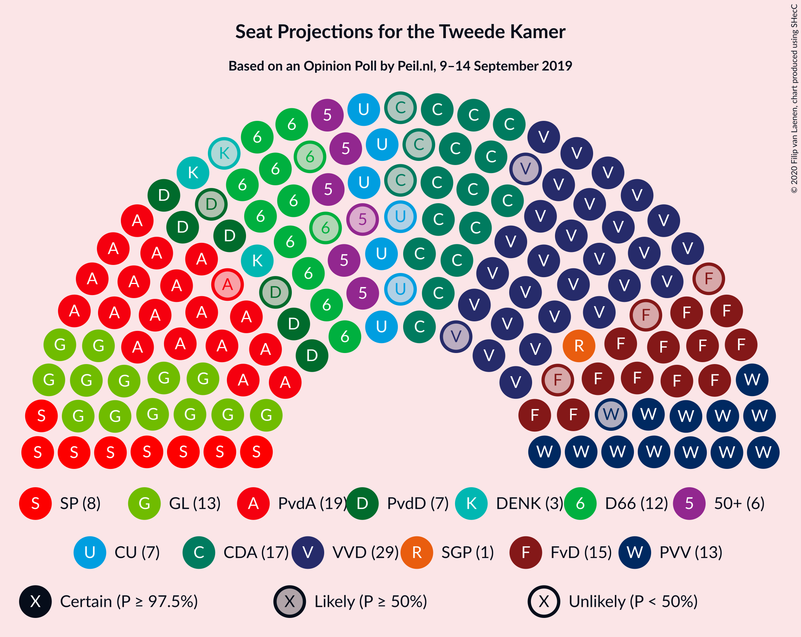

### Confidence Intervals

| Party | Last Result | Median | 80% Confidence Interval | 90% Confidence Interval | 95% Confidence Interval | 99% Confidence Interval |
|:-----:|:-----------:|:------:|:-----------------------:|:-----------------------:|:-----------------------:|:-----------------------:|
| <a href="#volkspartij-voor-vrijheid-en-democratie">Volkspartij voor Vrijheid en Democratie</a> | 33 | 29 | 28–30 |28–30 |27–30 |26–32 |
| <a href="#partij-van-de-arbeid">Partij van de Arbeid</a> | 9 | 19 | 19–20 |18–20 |18–21 |18–21 |
| <a href="#christen-democratisch-appèl">Christen-Democratisch Appèl</a> | 19 | 17 | 14–17 |14–17 |14–17 |13–18 |
| <a href="#partij-voor-de-vrijheid">Partij voor de Vrijheid</a> | 20 | 13 | 13–14 |12–14 |12–15 |12–17 |
| <a href="#groenlinks">GroenLinks</a> | 14 | 13 | 13–15 |13–16 |13–16 |12–16 |
| <a href="#forum-voor-democratie">Forum voor Democratie</a> | 2 | 15 | 14–16 |13–16 |12–16 |12–17 |
| <a href="#democraten-66">Democraten 66</a> | 19 | 12 | 11–12 |11–12 |10–13 |9–13 |
| <a href="#socialistische-partij">Socialistische Partij</a> | 14 | 8 | 8–9 |8–9 |8–9 |7–10 |
| <a href="#partij-voor-de-dieren">Partij voor de Dieren</a> | 5 | 7 | 6–7 |6–7 |5–8 |5–9 |
| <a href="#christenunie">ChristenUnie</a> | 5 | 7 | 5–7 |5–7 |5–7 |5–7 |
| <a href="#50plus">50Plus</a> | 4 | 6 | 5–6 |5–7 |5–7 |5–7 |
| <a href="#denk">DENK</a> | 3 | 3 | 2–3 |2–3 |2–4 |2–4 |
| <a href="#staatkundig-gereformeerde-partij">Staatkundig Gereformeerde Partij</a> | 3 | 1 | 1–2 |1–2 |1–2 |1–3 |

### Volkspartij voor Vrijheid en Democratie

*For a full overview of the results for this party, see the [Volkspartij voor Vrijheid en Democratie](party-volkspartijvoorvrijheidendemocratie.html) page.*

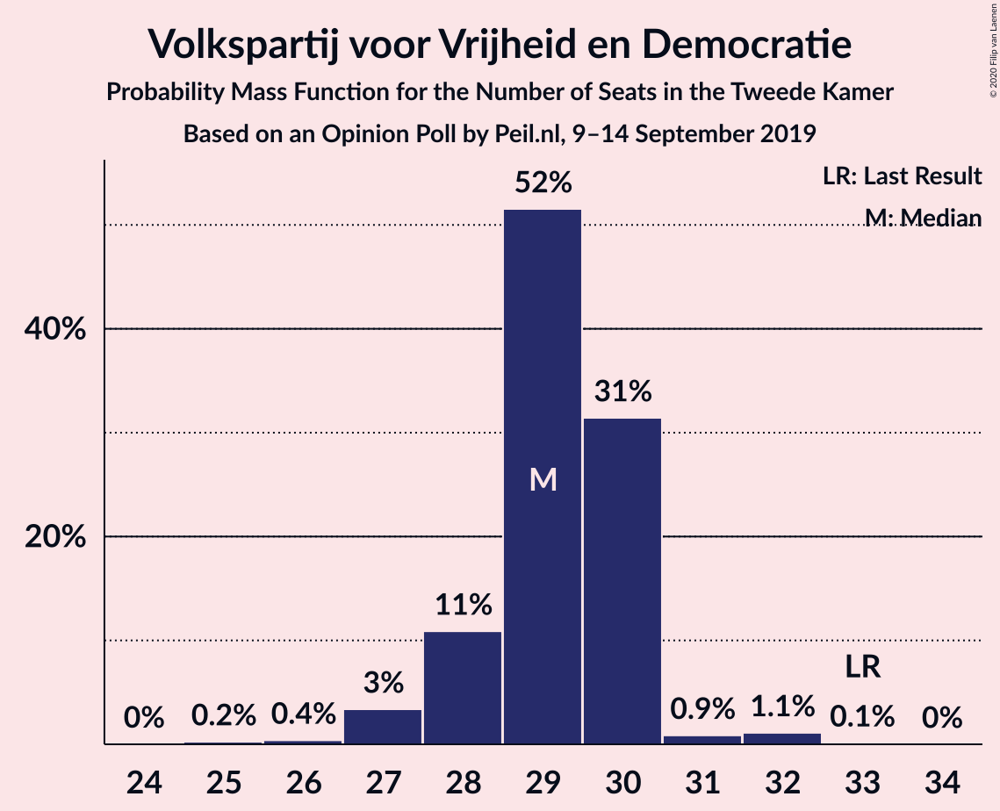

| Number of Seats | Probability | Accumulated | Special Marks |
|:---------------:|:-----------:|:-----------:|:-------------:|
| 25 | 0.2% | 100% |  |
| 26 | 0.4% | 99.7% |  |
| 27 | 3% | 99.3% |  |
| 28 | 11% | 96% |  |
| 29 | 52% | 85% | Median |
| 30 | 31% | 34% |  |
| 31 | 0.9% | 2% |  |
| 32 | 1.1% | 1.2% |  |
| 33 | 0.1% | 0.1% | Last Result |
| 34 | 0% | 0% |  |

### Partij van de Arbeid

*For a full overview of the results for this party, see the [Partij van de Arbeid](party-partijvandearbeid.html) page.*

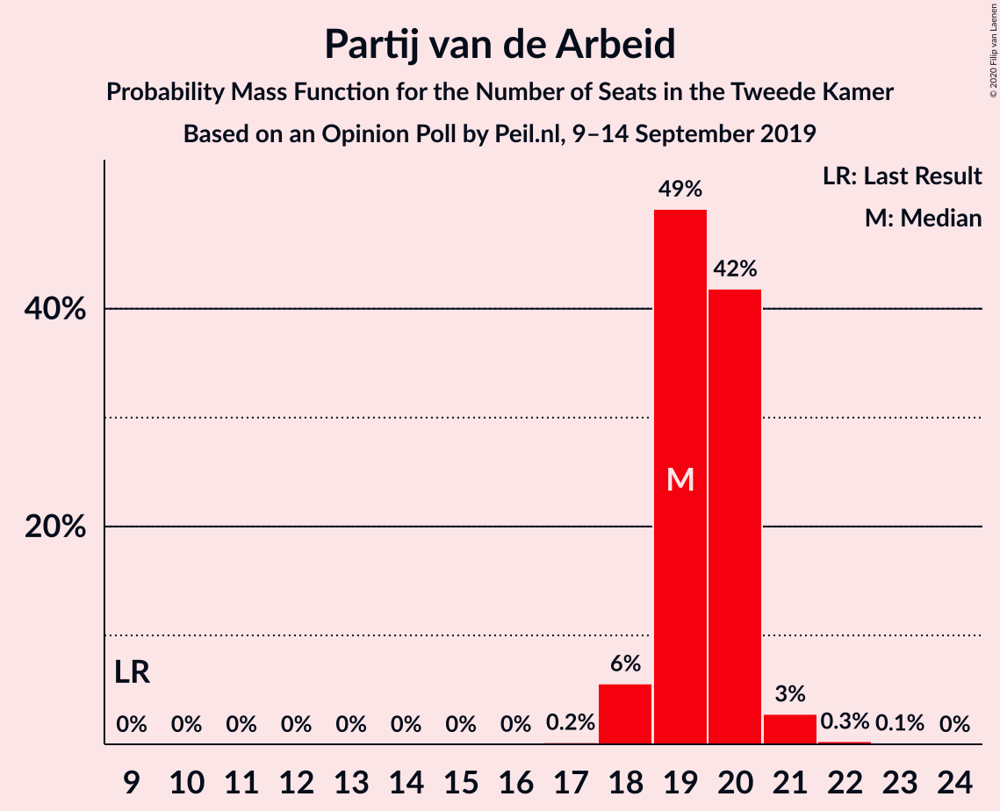

| Number of Seats | Probability | Accumulated | Special Marks |
|:---------------:|:-----------:|:-----------:|:-------------:|
| 9 | 0% | 100% | Last Result |
| 10 | 0% | 100% |  |
| 11 | 0% | 100% |  |
| 12 | 0% | 100% |  |
| 13 | 0% | 100% |  |
| 14 | 0% | 100% |  |
| 15 | 0% | 100% |  |
| 16 | 0% | 100% |  |
| 17 | 0.2% | 100% |  |
| 18 | 6% | 99.8% |  |
| 19 | 49% | 94% | Median |
| 20 | 42% | 45% |  |
| 21 | 3% | 3% |  |
| 22 | 0.3% | 0.4% |  |
| 23 | 0.1% | 0.1% |  |
| 24 | 0% | 0% |  |

### Christen-Democratisch Appèl

*For a full overview of the results for this party, see the [Christen-Democratisch Appèl](party-christen-democratischappèl.html) page.*

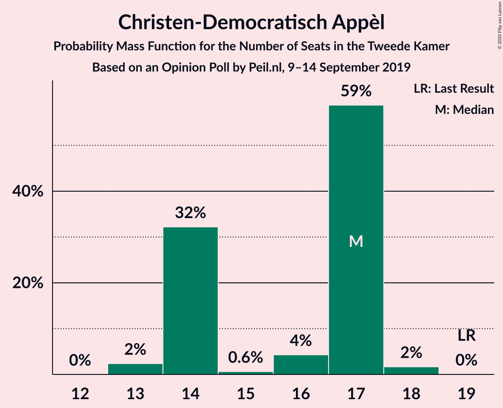

| Number of Seats | Probability | Accumulated | Special Marks |
|:---------------:|:-----------:|:-----------:|:-------------:|
| 13 | 2% | 100% |  |
| 14 | 32% | 98% |  |
| 15 | 0.6% | 65% |  |
| 16 | 4% | 65% |  |
| 17 | 59% | 60% | Median |
| 18 | 2% | 2% |  |
| 19 | 0% | 0% | Last Result |

### Partij voor de Vrijheid

*For a full overview of the results for this party, see the [Partij voor de Vrijheid](party-partijvoordevrijheid.html) page.*

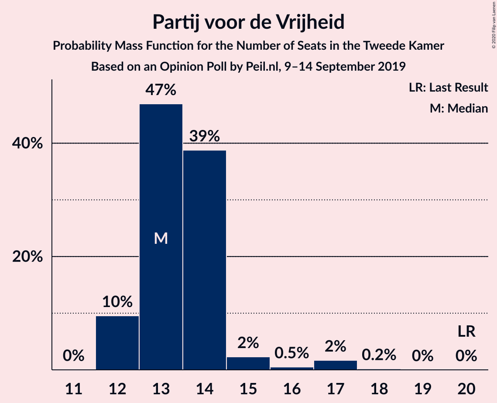

| Number of Seats | Probability | Accumulated | Special Marks |
|:---------------:|:-----------:|:-----------:|:-------------:|
| 12 | 10% | 100% |  |
| 13 | 47% | 90% | Median |
| 14 | 39% | 43% |  |
| 15 | 2% | 5% |  |
| 16 | 0.5% | 2% |  |
| 17 | 2% | 2% |  |
| 18 | 0.2% | 0.2% |  |
| 19 | 0% | 0% |  |
| 20 | 0% | 0% | Last Result |

### GroenLinks

*For a full overview of the results for this party, see the [GroenLinks](party-groenlinks.html) page.*

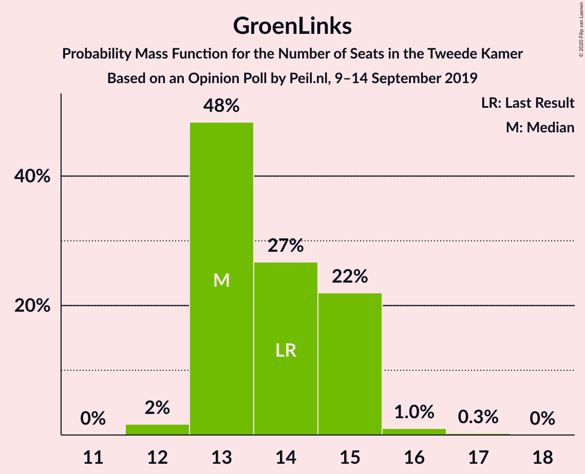

| Number of Seats | Probability | Accumulated | Special Marks |
|:---------------:|:-----------:|:-----------:|:-------------:|
| 12 | 1.1% | 100% |  |
| 13 | 80% | 98.8% | Median |
| 14 | 2% | 19% | Last Result |
| 15 | 8% | 17% |  |
| 16 | 9% | 9% |  |
| 17 | 0.2% | 0.2% |  |
| 18 | 0% | 0% |  |

### Forum voor Democratie

*For a full overview of the results for this party, see the [Forum voor Democratie](party-forumvoordemocratie.html) page.*

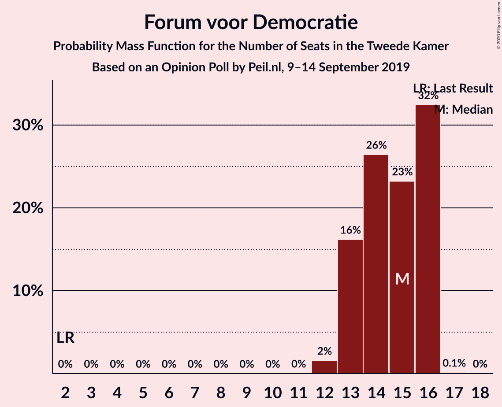

| Number of Seats | Probability | Accumulated | Special Marks |
|:---------------:|:-----------:|:-----------:|:-------------:|
| 2 | 0% | 100% | Last Result |
| 3 | 0% | 100% |  |
| 4 | 0% | 100% |  |
| 5 | 0% | 100% |  |
| 6 | 0% | 100% |  |
| 7 | 0% | 100% |  |
| 8 | 0% | 100% |  |
| 9 | 0% | 100% |  |
| 10 | 0% | 100% |  |
| 11 | 0% | 100% |  |
| 12 | 5% | 100% |  |
| 13 | 2% | 95% |  |
| 14 | 11% | 93% |  |
| 15 | 36% | 83% | Median |
| 16 | 46% | 46% |  |
| 17 | 0.9% | 0.9% |  |
| 18 | 0% | 0% |  |

### Democraten 66

*For a full overview of the results for this party, see the [Democraten 66](party-democraten66.html) page.*

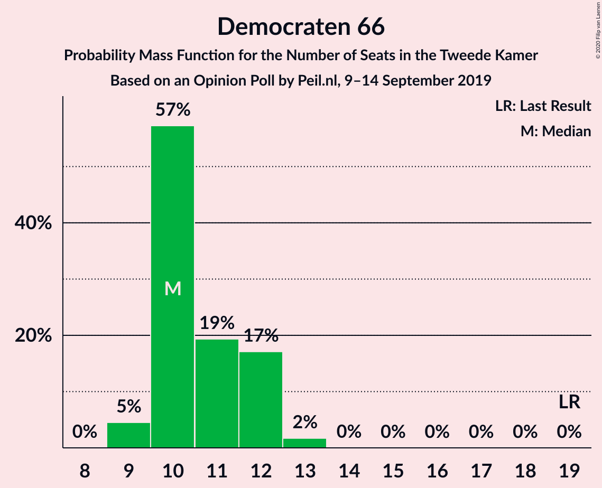

| Number of Seats | Probability | Accumulated | Special Marks |
|:---------------:|:-----------:|:-----------:|:-------------:|
| 9 | 1.3% | 100% |  |
| 10 | 2% | 98.7% |  |
| 11 | 14% | 97% |  |
| 12 | 78% | 82% | Median |
| 13 | 5% | 5% |  |
| 14 | 0% | 0% |  |
| 15 | 0% | 0% |  |
| 16 | 0% | 0% |  |
| 17 | 0% | 0% |  |
| 18 | 0% | 0% |  |
| 19 | 0% | 0% | Last Result |

### Socialistische Partij

*For a full overview of the results for this party, see the [Socialistische Partij](party-socialistischepartij.html) page.*

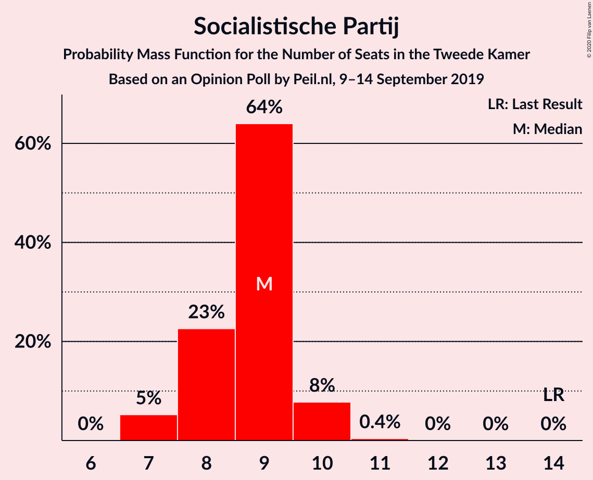

| Number of Seats | Probability | Accumulated | Special Marks |
|:---------------:|:-----------:|:-----------:|:-------------:|
| 7 | 0.7% | 100% |  |
| 8 | 56% | 99.3% | Median |
| 9 | 42% | 43% |  |
| 10 | 1.4% | 2% |  |
| 11 | 0.2% | 0.2% |  |
| 12 | 0% | 0% |  |
| 13 | 0% | 0% |  |
| 14 | 0% | 0% | Last Result |

### Partij voor de Dieren

*For a full overview of the results for this party, see the [Partij voor de Dieren](party-partijvoordedieren.html) page.*

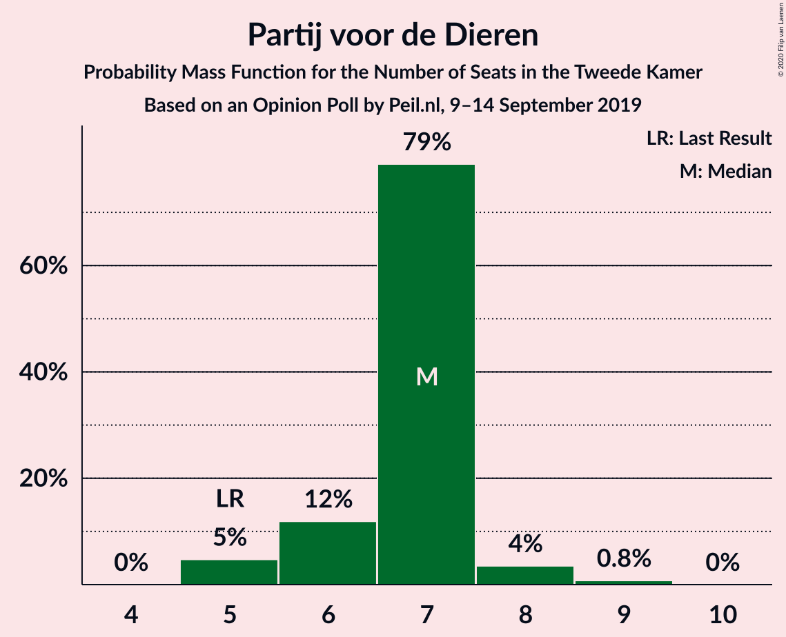

| Number of Seats | Probability | Accumulated | Special Marks |
|:---------------:|:-----------:|:-----------:|:-------------:|
| 5 | 5% | 100% | Last Result |
| 6 | 12% | 95% |  |
| 7 | 79% | 83% | Median |
| 8 | 4% | 4% |  |
| 9 | 0.8% | 0.8% |  |
| 10 | 0% | 0% |  |

### ChristenUnie

*For a full overview of the results for this party, see the [ChristenUnie](party-christenunie.html) page.*

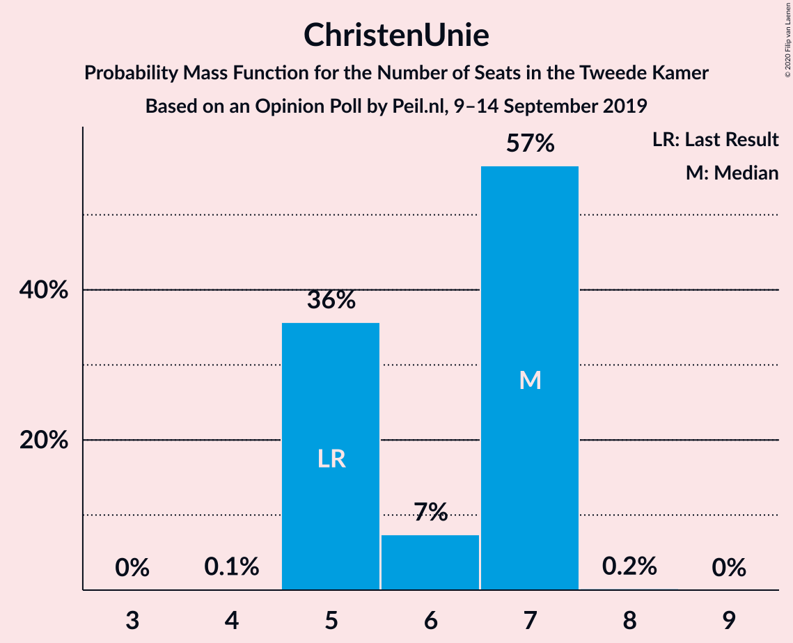

| Number of Seats | Probability | Accumulated | Special Marks |
|:---------------:|:-----------:|:-----------:|:-------------:|
| 4 | 0.1% | 100% |  |
| 5 | 36% | 99.9% | Last Result |
| 6 | 7% | 64% |  |
| 7 | 57% | 57% | Median |
| 8 | 0.2% | 0.2% |  |
| 9 | 0% | 0% |  |

### 50Plus

*For a full overview of the results for this party, see the [50Plus](party-50plus.html) page.*

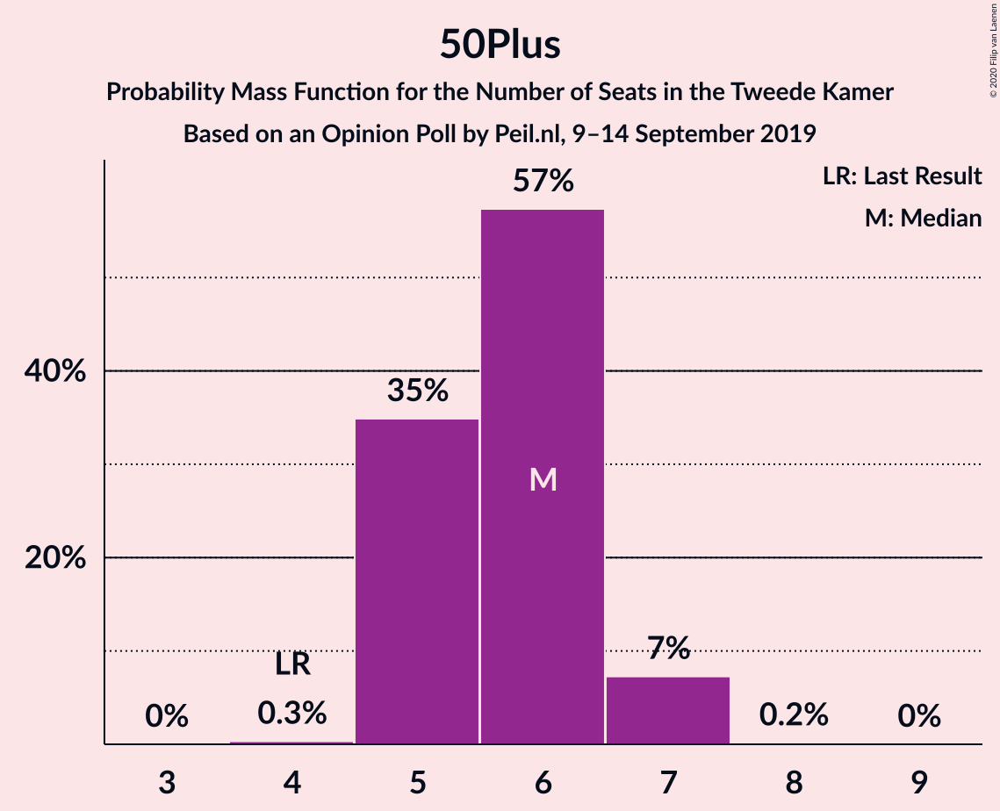

| Number of Seats | Probability | Accumulated | Special Marks |
|:---------------:|:-----------:|:-----------:|:-------------:|
| 4 | 0.2% | 100% | Last Result |
| 5 | 49% | 99.8% |  |
| 6 | 45% | 51% | Median |
| 7 | 6% | 6% |  |
| 8 | 0.1% | 0.1% |  |
| 9 | 0% | 0% |  |

### DENK

*For a full overview of the results for this party, see the [DENK](party-denk.html) page.*

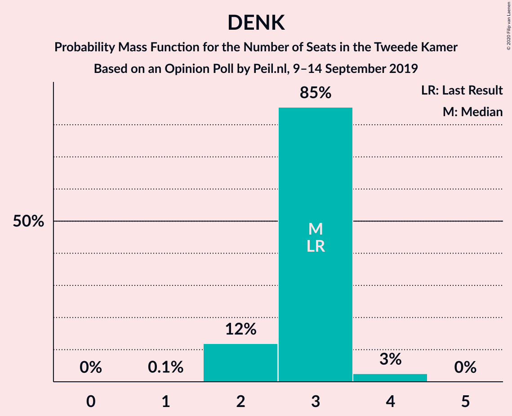

| Number of Seats | Probability | Accumulated | Special Marks |
|:---------------:|:-----------:|:-----------:|:-------------:|
| 1 | 0.1% | 100% |  |
| 2 | 12% | 99.9% |  |
| 3 | 85% | 88% | Last Result, Median |
| 4 | 3% | 3% |  |
| 5 | 0% | 0% |  |

### Staatkundig Gereformeerde Partij

*For a full overview of the results for this party, see the [Staatkundig Gereformeerde Partij](party-staatkundiggereformeerdepartij.html) page.*

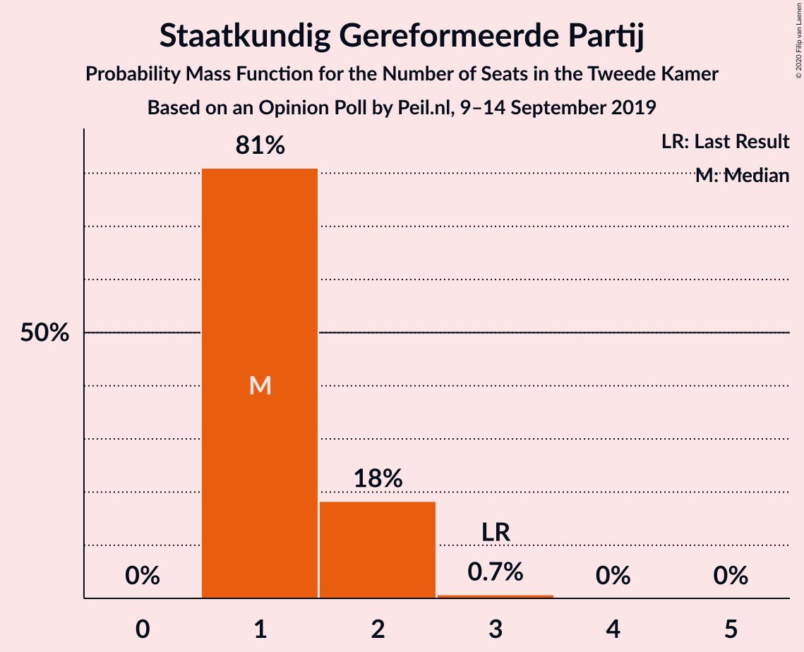

| Number of Seats | Probability | Accumulated | Special Marks |
|:---------------:|:-----------:|:-----------:|:-------------:|
| 1 | 81% | 100% | Median |
| 2 | 18% | 19% |  |
| 3 | 0.7% | 0.7% | Last Result |
| 4 | 0% | 0% |  |

## Coalitions

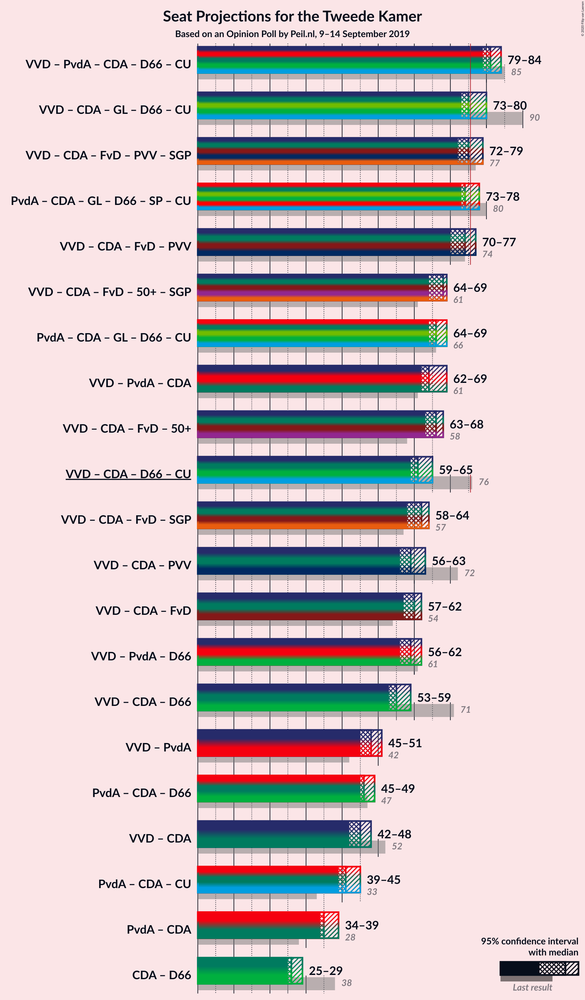

### Confidence Intervals

| Coalition | Last Result | Median | Majority? | 80% Confidence Interval | 90% Confidence Interval | 95% Confidence Interval | 99% Confidence Interval |
|:---------:|:-----------:|:------:|:---------:|:-----------------------:|:-----------------------:|:-----------------------:|:-----------------------:|
| Volkspartij voor Vrijheid en Democratie – Partij van de Arbeid – Christen-Democratisch Appèl – Democraten 66 – ChristenUnie | 85 | 83 | 100% | 81–84 | 79–84 | 79–84 | 78–84 |
| Volkspartij voor Vrijheid en Democratie – Christen-Democratisch Appèl – GroenLinks – Democraten 66 – ChristenUnie | 90 | 78 | 61% | 74–79 | 73–79 | 73–80 | 71–80 |
| Partij van de Arbeid – Christen-Democratisch Appèl – GroenLinks – Democraten 66 – Socialistische Partij – ChristenUnie | 80 | 76 | 63% | 73–78 | 73–79 | 73–79 | 71–79 |
| Volkspartij voor Vrijheid en Democratie – Christen-Democratisch Appèl – Forum voor Democratie – Partij voor de Vrijheid – Staatkundig Gereformeerde Partij | 77 | 76 | 50% | 73–76 | 73–76 | 71–77 | 71–79 |
| Volkspartij voor Vrijheid en Democratie – Christen-Democratisch Appèl – Forum voor Democratie – Partij voor de Vrijheid | 74 | 74 | 4% | 71–75 | 71–75 | 69–76 | 69–77 |
| Partij van de Arbeid – Christen-Democratisch Appèl – GroenLinks – Democraten 66 – ChristenUnie | 66 | 68 | 0% | 64–69 | 64–71 | 64–71 | 63–71 |
| Volkspartij voor Vrijheid en Democratie – Christen-Democratisch Appèl – Forum voor Democratie – 50Plus – Staatkundig Gereformeerde Partij | 61 | 67 | 0% | 66–68 | 65–68 | 63–68 | 63–72 |
| Volkspartij voor Vrijheid en Democratie – Christen-Democratisch Appèl – Forum voor Democratie – 50Plus | 58 | 65 | 0% | 65–67 | 64–67 | 61–67 | 61–70 |
| Volkspartij voor Vrijheid en Democratie – Partij van de Arbeid – Christen-Democratisch Appèl | 61 | 65 | 0% | 64–65 | 63–65 | 61–66 | 61–68 |
| Volkspartij voor Vrijheid en Democratie – Christen-Democratisch Appèl – Democraten 66 – ChristenUnie | 76 | 64 | 0% | 61–65 | 60–65 | 58–65 | 58–65 |
| Volkspartij voor Vrijheid en Democratie – Christen-Democratisch Appèl – Forum voor Democratie – Staatkundig Gereformeerde Partij | 57 | 61 | 0% | 60–63 | 60–63 | 57–63 | 57–66 |
| Volkspartij voor Vrijheid en Democratie – Partij van de Arbeid – Democraten 66 | 61 | 60 | 0% | 59–62 | 59–62 | 58–62 | 57–62 |
| Volkspartij voor Vrijheid en Democratie – Christen-Democratisch Appèl – Forum voor Democratie | 54 | 59 | 0% | 59–62 | 58–62 | 56–62 | 55–64 |
| Volkspartij voor Vrijheid en Democratie – Christen-Democratisch Appèl – Partij voor de Vrijheid | 72 | 59 | 0% | 57–59 | 57–60 | 55–61 | 54–63 |
| Volkspartij voor Vrijheid en Democratie – Christen-Democratisch Appèl – Democraten 66 | 71 | 58 | 0% | 56–58 | 55–59 | 52–59 | 51–59 |
| Volkspartij voor Vrijheid en Democratie – Partij van de Arbeid | 42 | 48 | 0% | 48–50 | 47–50 | 47–50 | 46–52 |
| Partij van de Arbeid – Christen-Democratisch Appèl – Democraten 66 | 47 | 48 | 0% | 46–48 | 46–48 | 45–48 | 44–49 |
| Volkspartij voor Vrijheid en Democratie – Christen-Democratisch Appèl | 52 | 46 | 0% | 44–46 | 44–46 | 41–47 | 40–48 |
| Partij van de Arbeid – Christen-Democratisch Appèl – ChristenUnie | 33 | 43 | 0% | 39–43 | 39–44 | 39–44 | 39–44 |
| Partij van de Arbeid – Christen-Democratisch Appèl | 28 | 36 | 0% | 34–37 | 34–37 | 34–37 | 33–38 |
| Christen-Democratisch Appèl – Democraten 66 | 38 | 29 | 0% | 26–29 | 26–29 | 24–30 | 24–30 |

### Volkspartij voor Vrijheid en Democratie – Partij van de Arbeid – Christen-Democratisch Appèl – Democraten 66 – ChristenUnie

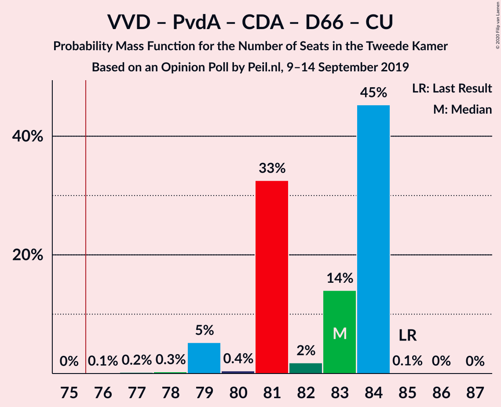

| Number of Seats | Probability | Accumulated | Special Marks |
|:---------------:|:-----------:|:-----------:|:-------------:|
| 76 | 0.1% | 100% | Majority |
| 77 | 0.2% | 99.9% |  |
| 78 | 0.3% | 99.7% |  |
| 79 | 5% | 99.4% |  |
| 80 | 0.4% | 94% |  |
| 81 | 33% | 94% |  |
| 82 | 2% | 61% |  |
| 83 | 14% | 59% |  |
| 84 | 45% | 45% | Median |
| 85 | 0.1% | 0.1% | Last Result |
| 86 | 0% | 0.1% |  |
| 87 | 0% | 0% |  |

### Volkspartij voor Vrijheid en Democratie – Christen-Democratisch Appèl – GroenLinks – Democraten 66 – ChristenUnie

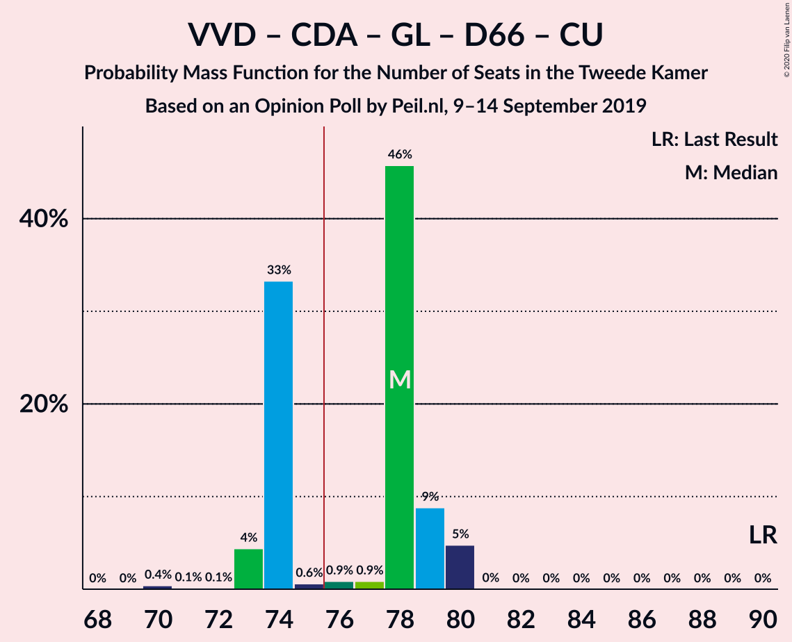

| Number of Seats | Probability | Accumulated | Special Marks |
|:---------------:|:-----------:|:-----------:|:-------------:|
| 70 | 0.4% | 100% |  |
| 71 | 0.1% | 99.6% |  |
| 72 | 0.1% | 99.5% |  |
| 73 | 4% | 99.4% |  |
| 74 | 33% | 95% |  |
| 75 | 0.6% | 62% |  |
| 76 | 0.9% | 61% | Majority |
| 77 | 0.9% | 60% |  |
| 78 | 46% | 59% | Median |
| 79 | 9% | 14% |  |
| 80 | 5% | 5% |  |
| 81 | 0% | 0.1% |  |
| 82 | 0% | 0% |  |
| 83 | 0% | 0% |  |
| 84 | 0% | 0% |  |
| 85 | 0% | 0% |  |
| 86 | 0% | 0% |  |
| 87 | 0% | 0% |  |
| 88 | 0% | 0% |  |
| 89 | 0% | 0% |  |
| 90 | 0% | 0% | Last Result |

### Partij van de Arbeid – Christen-Democratisch Appèl – GroenLinks – Democraten 66 – Socialistische Partij – ChristenUnie

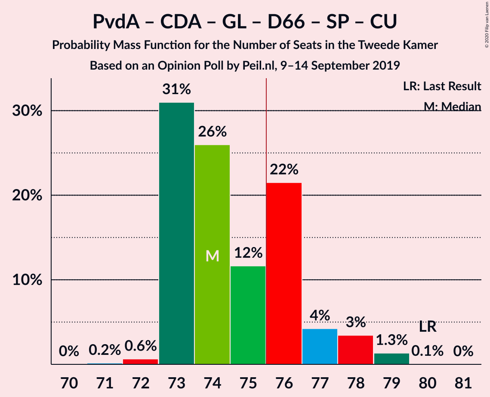

| Number of Seats | Probability | Accumulated | Special Marks |
|:---------------:|:-----------:|:-----------:|:-------------:|
| 70 | 0.1% | 100% |  |
| 71 | 0.9% | 99.9% |  |
| 72 | 0.7% | 99.0% |  |
| 73 | 34% | 98% |  |
| 74 | 1.3% | 65% |  |
| 75 | 0.5% | 63% |  |
| 76 | 49% | 63% | Median, Majority |
| 77 | 0.3% | 14% |  |
| 78 | 5% | 14% |  |
| 79 | 8% | 9% |  |
| 80 | 0% | 0.1% | Last Result |
| 81 | 0% | 0.1% |  |
| 82 | 0% | 0% |  |

### Volkspartij voor Vrijheid en Democratie – Christen-Democratisch Appèl – Forum voor Democratie – Partij voor de Vrijheid – Staatkundig Gereformeerde Partij

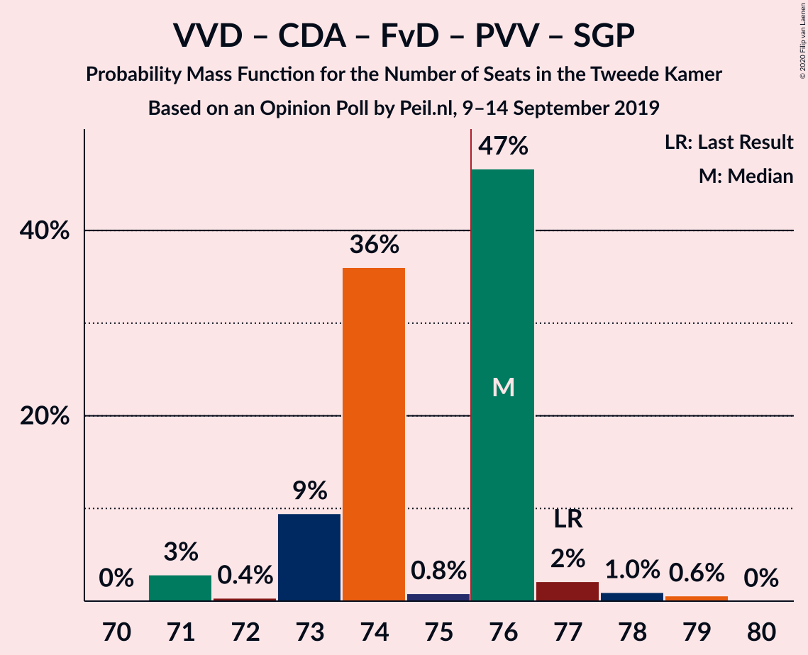

| Number of Seats | Probability | Accumulated | Special Marks |
|:---------------:|:-----------:|:-----------:|:-------------:|
| 70 | 0% | 100% |  |
| 71 | 3% | 99.9% |  |
| 72 | 0.4% | 97% |  |
| 73 | 9% | 97% |  |
| 74 | 36% | 87% |  |
| 75 | 0.8% | 51% | Median |
| 76 | 47% | 50% | Majority |
| 77 | 2% | 4% | Last Result |
| 78 | 1.0% | 2% |  |
| 79 | 0.6% | 0.6% |  |
| 80 | 0% | 0% |  |

### Volkspartij voor Vrijheid en Democratie – Christen-Democratisch Appèl – Forum voor Democratie – Partij voor de Vrijheid

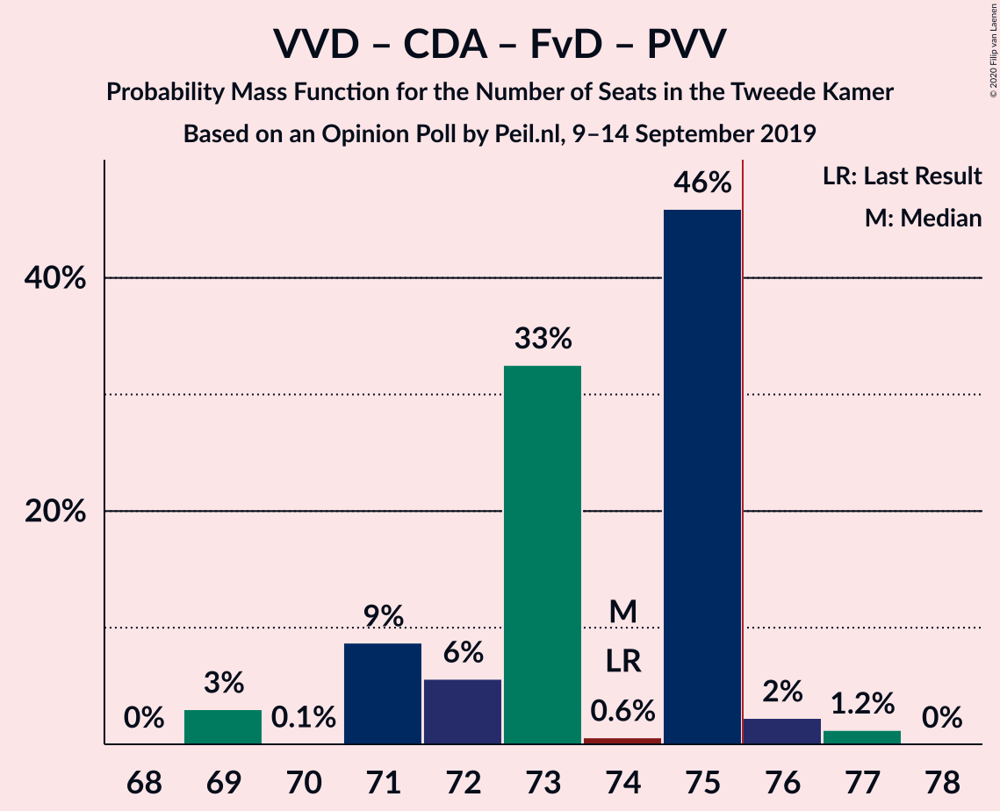

| Number of Seats | Probability | Accumulated | Special Marks |
|:---------------:|:-----------:|:-----------:|:-------------:|
| 69 | 3% | 100% |  |
| 70 | 0.1% | 97% |  |
| 71 | 9% | 97% |  |
| 72 | 6% | 88% |  |
| 73 | 33% | 83% |  |
| 74 | 0.6% | 50% | Last Result, Median |
| 75 | 46% | 49% |  |
| 76 | 2% | 4% | Majority |
| 77 | 1.2% | 1.3% |  |
| 78 | 0% | 0% |  |

### Partij van de Arbeid – Christen-Democratisch Appèl – GroenLinks – Democraten 66 – ChristenUnie

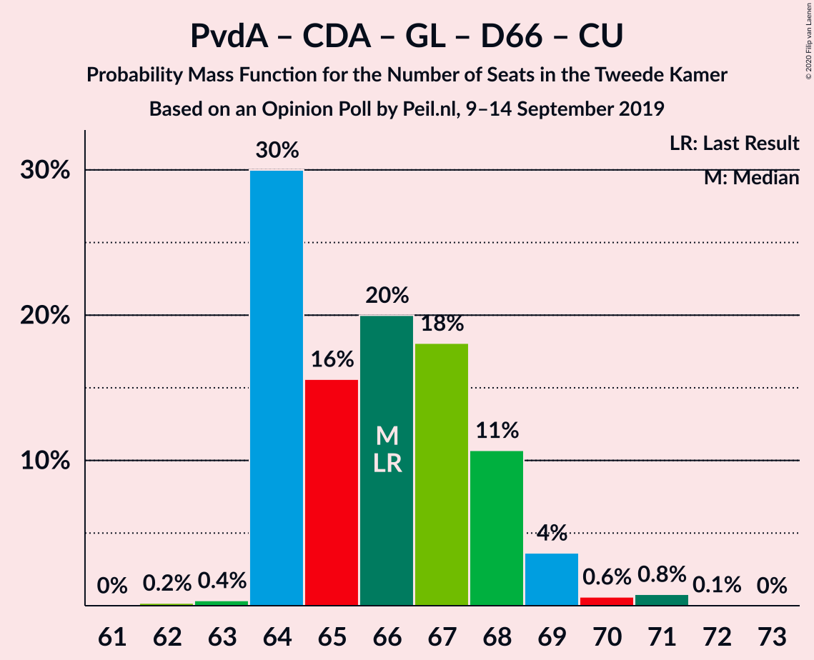

| Number of Seats | Probability | Accumulated | Special Marks |
|:---------------:|:-----------:|:-----------:|:-------------:|
| 62 | 0.3% | 100% |  |
| 63 | 0.3% | 99.7% |  |
| 64 | 35% | 99.4% |  |
| 65 | 0.9% | 65% |  |
| 66 | 1.3% | 64% | Last Result |
| 67 | 3% | 63% |  |
| 68 | 45% | 59% | Median |
| 69 | 5% | 14% |  |
| 70 | 0.1% | 9% |  |
| 71 | 8% | 8% |  |
| 72 | 0.1% | 0.1% |  |
| 73 | 0% | 0% |  |

### Volkspartij voor Vrijheid en Democratie – Christen-Democratisch Appèl – Forum voor Democratie – 50Plus – Staatkundig Gereformeerde Partij

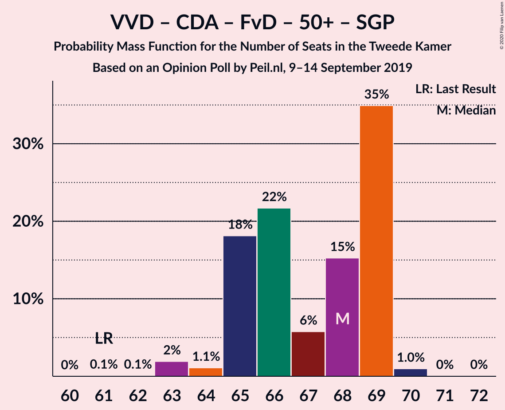

| Number of Seats | Probability | Accumulated | Special Marks |
|:---------------:|:-----------:|:-----------:|:-------------:|
| 61 | 0% | 100% | Last Result |
| 62 | 0.2% | 100% |  |
| 63 | 3% | 99.8% |  |
| 64 | 1.2% | 97% |  |
| 65 | 2% | 96% |  |
| 66 | 32% | 94% |  |
| 67 | 14% | 62% |  |
| 68 | 47% | 48% | Median |
| 69 | 0.5% | 2% |  |
| 70 | 0.7% | 1.3% |  |
| 71 | 0.1% | 0.7% |  |
| 72 | 0.6% | 0.6% |  |
| 73 | 0% | 0% |  |

### Volkspartij voor Vrijheid en Democratie – Christen-Democratisch Appèl – Forum voor Democratie – 50Plus

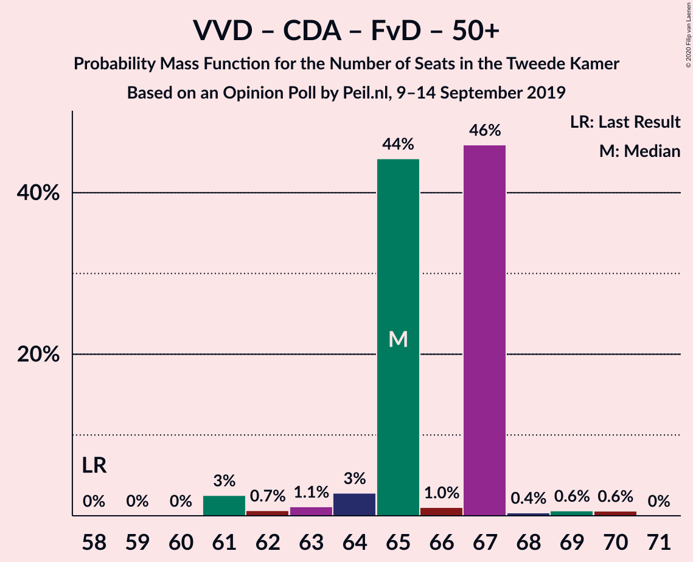

| Number of Seats | Probability | Accumulated | Special Marks |
|:---------------:|:-----------:|:-----------:|:-------------:|
| 58 | 0% | 100% | Last Result |
| 59 | 0% | 100% |  |
| 60 | 0% | 100% |  |
| 61 | 3% | 100% |  |
| 62 | 0.7% | 97% |  |
| 63 | 1.1% | 97% |  |
| 64 | 3% | 96% |  |
| 65 | 44% | 93% |  |
| 66 | 1.0% | 49% |  |
| 67 | 46% | 48% | Median |
| 68 | 0.4% | 2% |  |
| 69 | 0.6% | 1.2% |  |
| 70 | 0.6% | 0.6% |  |
| 71 | 0% | 0% |  |

### Volkspartij voor Vrijheid en Democratie – Partij van de Arbeid – Christen-Democratisch Appèl

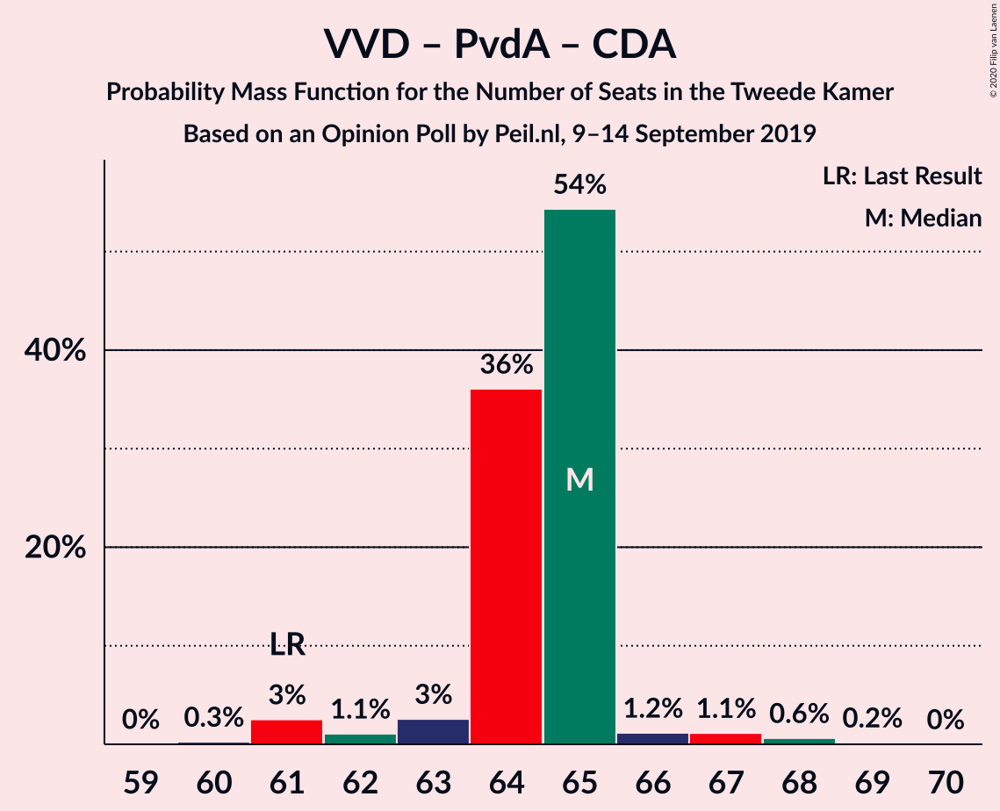

| Number of Seats | Probability | Accumulated | Special Marks |
|:---------------:|:-----------:|:-----------:|:-------------:|
| 60 | 0.3% | 100% |  |
| 61 | 3% | 99.7% | Last Result |
| 62 | 1.1% | 97% |  |
| 63 | 3% | 96% |  |
| 64 | 36% | 94% |  |
| 65 | 54% | 57% | Median |
| 66 | 1.2% | 3% |  |
| 67 | 1.1% | 2% |  |
| 68 | 0.6% | 0.8% |  |
| 69 | 0.2% | 0.2% |  |
| 70 | 0% | 0% |  |

### Volkspartij voor Vrijheid en Democratie – Christen-Democratisch Appèl – Democraten 66 – ChristenUnie

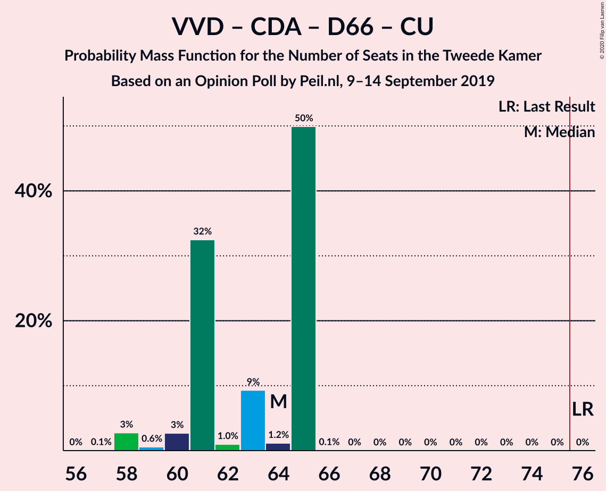

| Number of Seats | Probability | Accumulated | Special Marks |
|:---------------:|:-----------:|:-----------:|:-------------:|
| 57 | 0.1% | 100% |  |
| 58 | 3% | 99.9% |  |
| 59 | 0.6% | 97% |  |
| 60 | 3% | 97% |  |
| 61 | 32% | 94% |  |
| 62 | 1.0% | 61% |  |
| 63 | 9% | 60% |  |
| 64 | 1.2% | 51% |  |
| 65 | 50% | 50% | Median |
| 66 | 0.1% | 0.1% |  |
| 67 | 0% | 0% |  |
| 68 | 0% | 0% |  |
| 69 | 0% | 0% |  |
| 70 | 0% | 0% |  |
| 71 | 0% | 0% |  |
| 72 | 0% | 0% |  |
| 73 | 0% | 0% |  |
| 74 | 0% | 0% |  |
| 75 | 0% | 0% |  |
| 76 | 0% | 0% | Last Result, Majority |

### Volkspartij voor Vrijheid en Democratie – Christen-Democratisch Appèl – Forum voor Democratie – Staatkundig Gereformeerde Partij

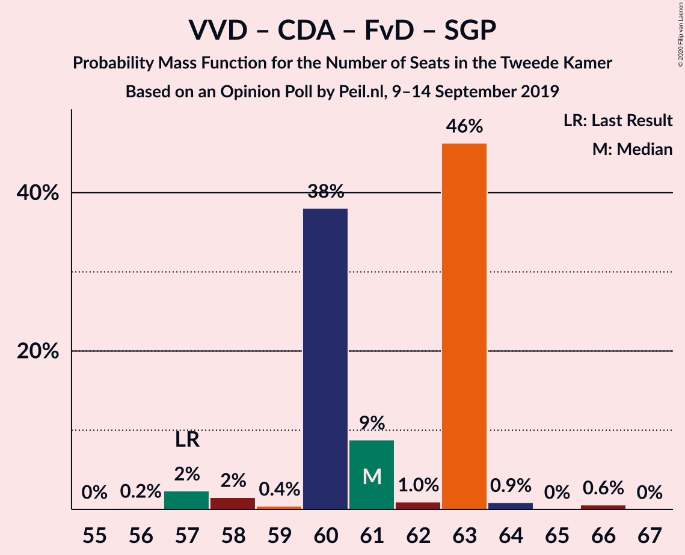

| Number of Seats | Probability | Accumulated | Special Marks |
|:---------------:|:-----------:|:-----------:|:-------------:|
| 56 | 0.2% | 100% |  |
| 57 | 2% | 99.8% | Last Result |
| 58 | 2% | 97% |  |
| 59 | 0.4% | 96% |  |
| 60 | 38% | 96% |  |
| 61 | 9% | 58% |  |
| 62 | 1.0% | 49% | Median |
| 63 | 46% | 48% |  |
| 64 | 0.9% | 1.5% |  |
| 65 | 0% | 0.6% |  |
| 66 | 0.6% | 0.6% |  |
| 67 | 0% | 0% |  |

### Volkspartij voor Vrijheid en Democratie – Partij van de Arbeid – Democraten 66

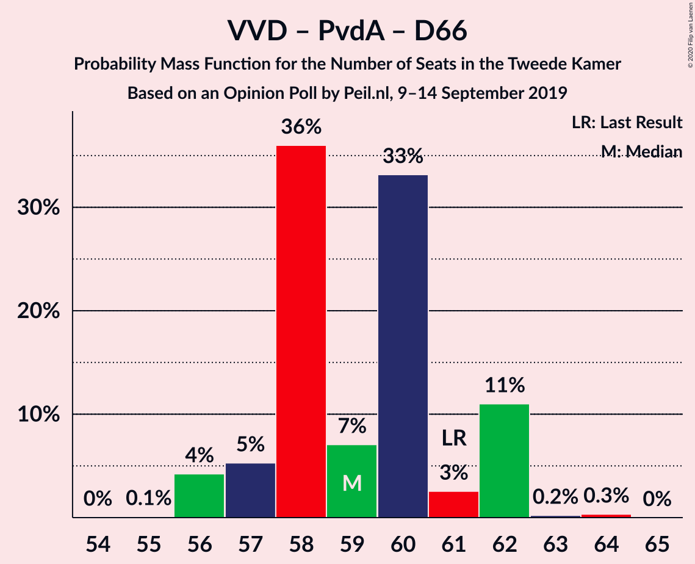

| Number of Seats | Probability | Accumulated | Special Marks |
|:---------------:|:-----------:|:-----------:|:-------------:|
| 55 | 0.2% | 100% |  |
| 56 | 0.1% | 99.7% |  |
| 57 | 0.8% | 99.6% |  |
| 58 | 3% | 98.8% |  |
| 59 | 12% | 96% |  |
| 60 | 50% | 83% | Median |
| 61 | 1.3% | 33% | Last Result |
| 62 | 32% | 32% |  |
| 63 | 0.2% | 0.2% |  |
| 64 | 0% | 0% |  |

### Volkspartij voor Vrijheid en Democratie – Christen-Democratisch Appèl – Forum voor Democratie

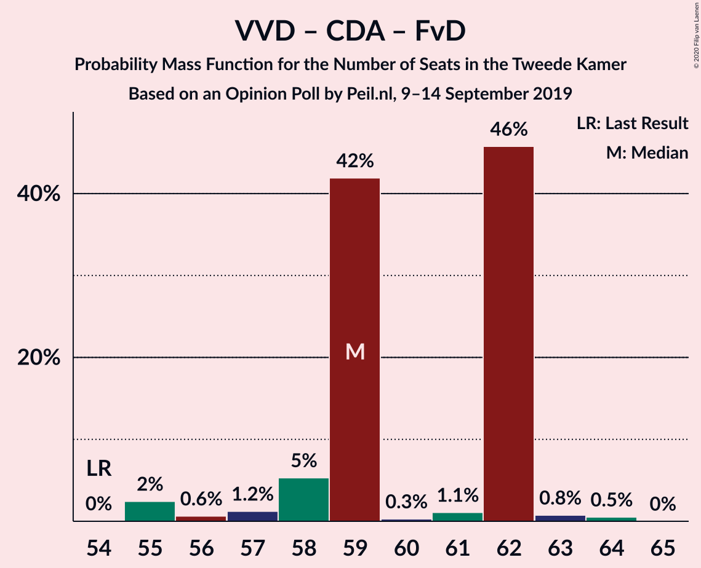

| Number of Seats | Probability | Accumulated | Special Marks |
|:---------------:|:-----------:|:-----------:|:-------------:|
| 54 | 0% | 100% | Last Result |
| 55 | 2% | 100% |  |
| 56 | 0.6% | 98% |  |
| 57 | 1.2% | 97% |  |
| 58 | 5% | 96% |  |
| 59 | 42% | 90% |  |
| 60 | 0.3% | 48% |  |
| 61 | 1.1% | 48% | Median |
| 62 | 46% | 47% |  |
| 63 | 0.8% | 1.3% |  |
| 64 | 0.5% | 0.5% |  |
| 65 | 0% | 0% |  |

### Volkspartij voor Vrijheid en Democratie – Christen-Democratisch Appèl – Partij voor de Vrijheid

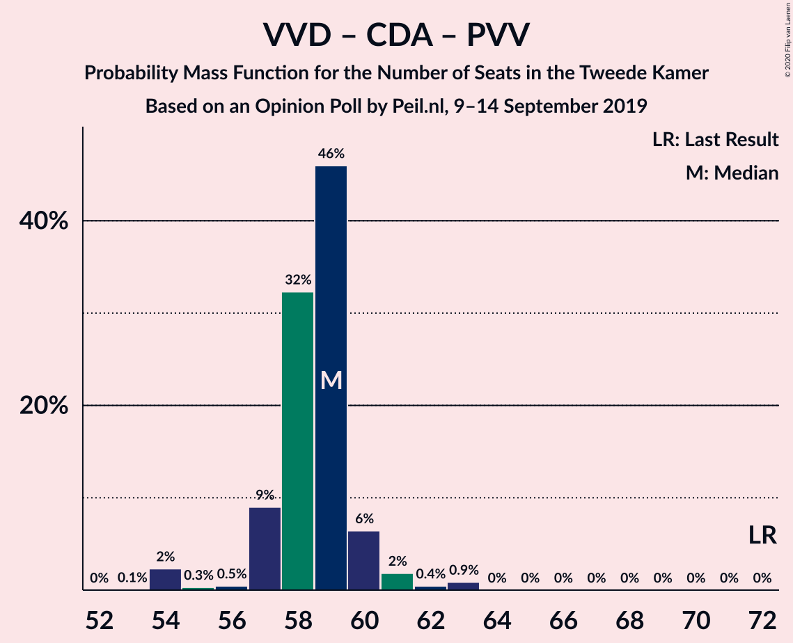

| Number of Seats | Probability | Accumulated | Special Marks |
|:---------------:|:-----------:|:-----------:|:-------------:|
| 53 | 0.1% | 100% |  |
| 54 | 2% | 99.9% |  |
| 55 | 0.3% | 98% |  |
| 56 | 0.5% | 97% |  |
| 57 | 9% | 97% |  |
| 58 | 32% | 88% |  |
| 59 | 46% | 56% | Median |
| 60 | 6% | 10% |  |
| 61 | 2% | 3% |  |
| 62 | 0.4% | 1.3% |  |
| 63 | 0.9% | 0.9% |  |
| 64 | 0% | 0% |  |
| 65 | 0% | 0% |  |
| 66 | 0% | 0% |  |
| 67 | 0% | 0% |  |
| 68 | 0% | 0% |  |
| 69 | 0% | 0% |  |
| 70 | 0% | 0% |  |
| 71 | 0% | 0% |  |
| 72 | 0% | 0% | Last Result |

### Volkspartij voor Vrijheid en Democratie – Christen-Democratisch Appèl – Democraten 66

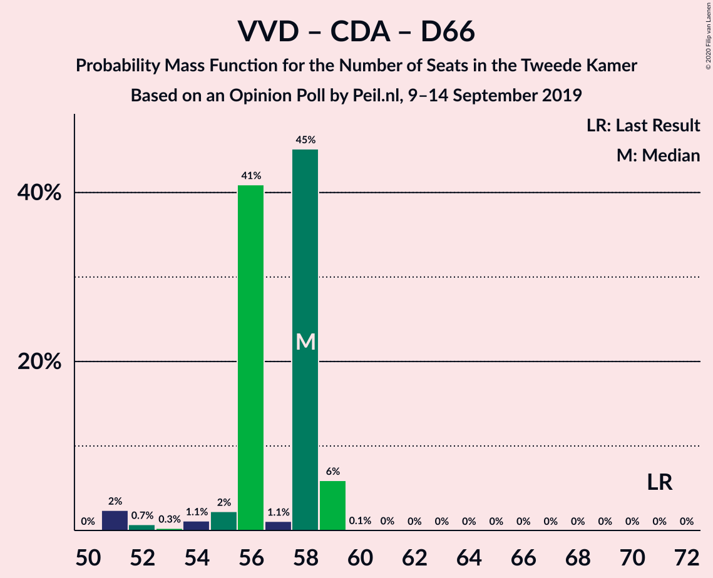

| Number of Seats | Probability | Accumulated | Special Marks |
|:---------------:|:-----------:|:-----------:|:-------------:|
| 51 | 2% | 100% |  |
| 52 | 0.7% | 98% |  |
| 53 | 0.3% | 97% |  |
| 54 | 1.1% | 97% |  |
| 55 | 2% | 95% |  |
| 56 | 41% | 93% |  |
| 57 | 1.1% | 52% |  |
| 58 | 45% | 51% | Median |
| 59 | 6% | 6% |  |
| 60 | 0.1% | 0.1% |  |
| 61 | 0% | 0% |  |
| 62 | 0% | 0% |  |
| 63 | 0% | 0% |  |
| 64 | 0% | 0% |  |
| 65 | 0% | 0% |  |
| 66 | 0% | 0% |  |
| 67 | 0% | 0% |  |
| 68 | 0% | 0% |  |
| 69 | 0% | 0% |  |
| 70 | 0% | 0% |  |
| 71 | 0% | 0% | Last Result |

### Volkspartij voor Vrijheid en Democratie – Partij van de Arbeid

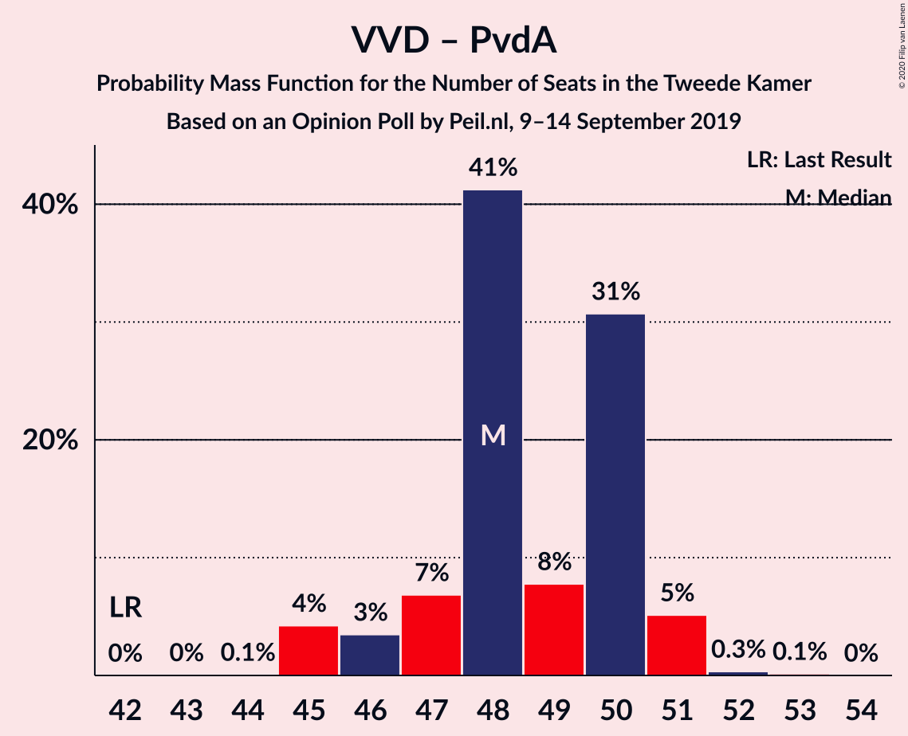

| Number of Seats | Probability | Accumulated | Special Marks |
|:---------------:|:-----------:|:-----------:|:-------------:|
| 42 | 0% | 100% | Last Result |
| 43 | 0.1% | 100% |  |
| 44 | 0.2% | 99.9% |  |
| 45 | 0.2% | 99.8% |  |
| 46 | 0.3% | 99.5% |  |
| 47 | 7% | 99.2% |  |
| 48 | 58% | 92% | Median |
| 49 | 2% | 34% |  |
| 50 | 31% | 33% |  |
| 51 | 0.6% | 1.4% |  |
| 52 | 0.7% | 0.8% |  |
| 53 | 0% | 0.1% |  |
| 54 | 0.1% | 0.1% |  |
| 55 | 0% | 0% |  |

### Partij van de Arbeid – Christen-Democratisch Appèl – Democraten 66

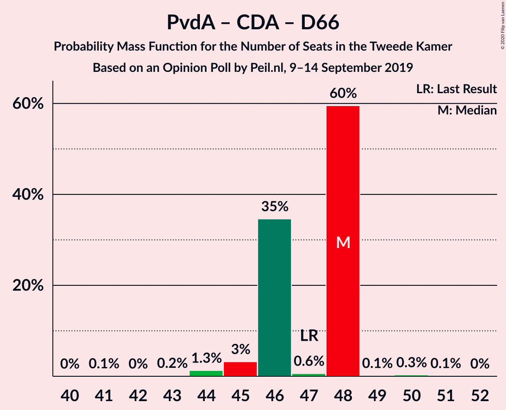

| Number of Seats | Probability | Accumulated | Special Marks |
|:---------------:|:-----------:|:-----------:|:-------------:|
| 41 | 0.1% | 100% |  |
| 42 | 0% | 99.9% |  |
| 43 | 0.2% | 99.9% |  |
| 44 | 1.3% | 99.8% |  |
| 45 | 3% | 98% |  |
| 46 | 35% | 95% |  |
| 47 | 0.6% | 61% | Last Result |
| 48 | 60% | 60% | Median |
| 49 | 0.1% | 0.6% |  |
| 50 | 0.3% | 0.4% |  |
| 51 | 0.1% | 0.1% |  |
| 52 | 0% | 0% |  |

### Volkspartij voor Vrijheid en Democratie – Christen-Democratisch Appèl

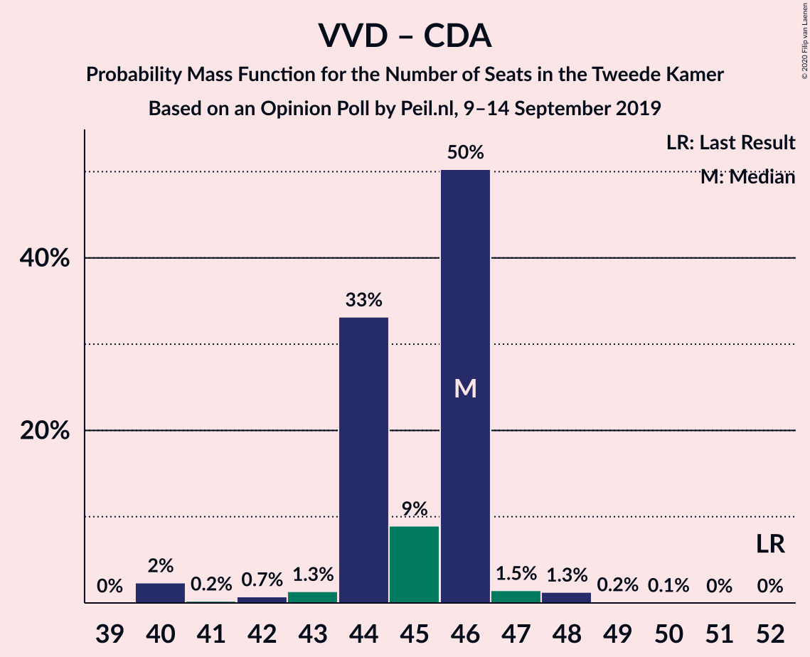

| Number of Seats | Probability | Accumulated | Special Marks |
|:---------------:|:-----------:|:-----------:|:-------------:|
| 40 | 2% | 100% |  |
| 41 | 0.2% | 98% |  |
| 42 | 0.7% | 97% |  |
| 43 | 1.3% | 97% |  |
| 44 | 33% | 95% |  |
| 45 | 9% | 62% |  |
| 46 | 50% | 53% | Median |
| 47 | 1.5% | 3% |  |
| 48 | 1.3% | 1.5% |  |
| 49 | 0.2% | 0.2% |  |
| 50 | 0.1% | 0.1% |  |
| 51 | 0% | 0% |  |
| 52 | 0% | 0% | Last Result |

### Partij van de Arbeid – Christen-Democratisch Appèl – ChristenUnie

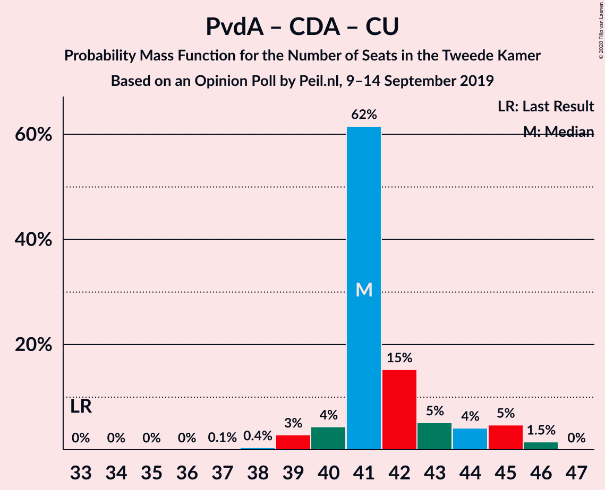

| Number of Seats | Probability | Accumulated | Special Marks |
|:---------------:|:-----------:|:-----------:|:-------------:|
| 33 | 0% | 100% | Last Result |
| 34 | 0% | 100% |  |
| 35 | 0% | 100% |  |
| 36 | 0% | 100% |  |
| 37 | 0.1% | 100% |  |
| 38 | 0.1% | 99.9% |  |
| 39 | 32% | 99.8% |  |
| 40 | 3% | 67% |  |
| 41 | 8% | 65% |  |
| 42 | 1.3% | 57% |  |
| 43 | 46% | 55% | Median |
| 44 | 9% | 10% |  |
| 45 | 0.4% | 0.4% |  |
| 46 | 0% | 0% |  |

### Partij van de Arbeid – Christen-Democratisch Appèl

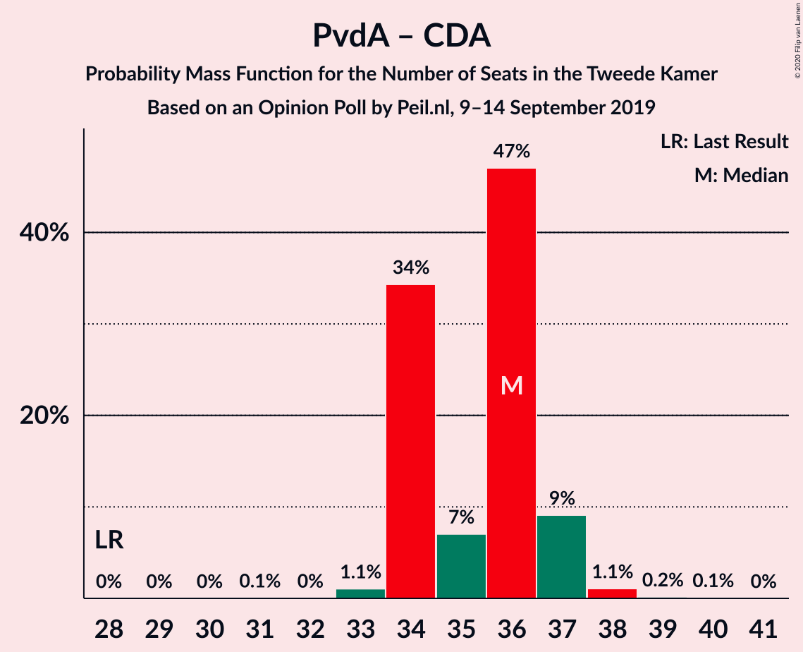

| Number of Seats | Probability | Accumulated | Special Marks |
|:---------------:|:-----------:|:-----------:|:-------------:|
| 28 | 0% | 100% | Last Result |
| 29 | 0% | 100% |  |
| 30 | 0% | 100% |  |
| 31 | 0.1% | 100% |  |
| 32 | 0% | 99.9% |  |
| 33 | 1.1% | 99.9% |  |
| 34 | 34% | 98.9% |  |
| 35 | 7% | 65% |  |
| 36 | 47% | 57% | Median |
| 37 | 9% | 10% |  |
| 38 | 1.1% | 1.3% |  |
| 39 | 0.2% | 0.3% |  |
| 40 | 0.1% | 0.1% |  |
| 41 | 0% | 0% |  |

### Christen-Democratisch Appèl – Democraten 66

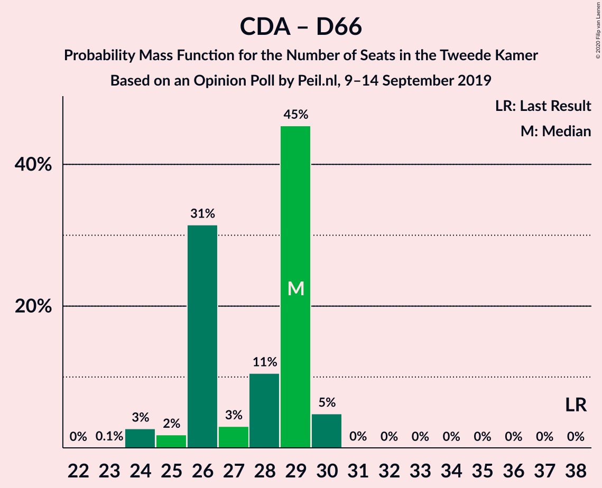

| Number of Seats | Probability | Accumulated | Special Marks |
|:---------------:|:-----------:|:-----------:|:-------------:|
| 23 | 0.1% | 100% |  |
| 24 | 3% | 99.9% |  |
| 25 | 2% | 97% |  |
| 26 | 31% | 95% |  |
| 27 | 3% | 64% |  |
| 28 | 11% | 61% |  |
| 29 | 45% | 50% | Median |
| 30 | 5% | 5% |  |
| 31 | 0% | 0.1% |  |
| 32 | 0% | 0% |  |
| 33 | 0% | 0% |  |
| 34 | 0% | 0% |  |
| 35 | 0% | 0% |  |
| 36 | 0% | 0% |  |
| 37 | 0% | 0% |  |
| 38 | 0% | 0% | Last Result |

## Technical Information

### Opinion Poll

+ **Polling firm:** Peil.nl
+ **Commissioner(s):** —
+ **Fieldwork period:** 9–14 September 2019

### Calculations

+ **Sample size:** 3000
+ **Simulations done:** 131,072
+ **Error estimate:** 1.87%

