# Opinion Poll by Kantar Public, 15 September 2019

<a href="#voting-intentions">Voting Intentions</a> | <a href="#seats">Seats</a> | <a href="#coalitions">Coalitions</a> | <a href="#technical-information">Technical Information</a>

## Voting Intentions

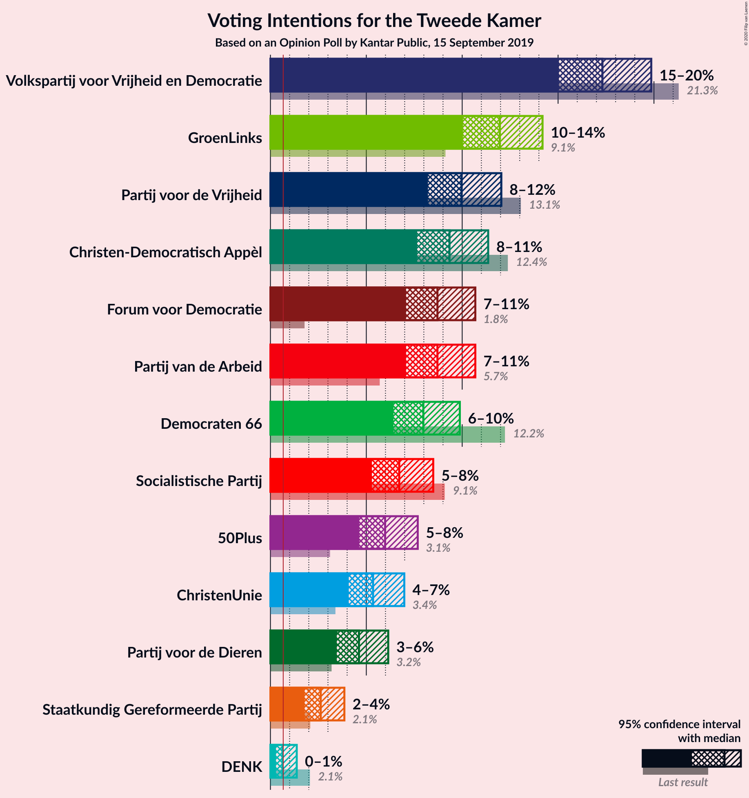

### Confidence Intervals

| Party | Last Result | Poll Result | 80% Confidence Interval | 90% Confidence Interval | 95% Confidence Interval | 99% Confidence Interval |
|:-----:|:-----------:|:-----------:|:-----------------------:|:-----------------------:|:-----------------------:|:-----------------------:|
| Volkspartij voor Vrijheid en Democratie | 21.3% | 17.3% | 15.8–19.0% |15.4–19.4% |15.0–19.9% |14.3–20.7% |
| GroenLinks | 9.1% | 12.0% | 10.7–13.4% |10.3–13.8% |10.0–14.2% |9.5–14.9% |
| Partij voor de Vrijheid | 13.1% | 10.0% | 8.8–11.3% |8.5–11.7% |8.2–12.0% |7.7–12.7% |
| Christen-Democratisch Appèl | 12.4% | 9.3% | 8.2–10.7% |7.9–11.0% |7.7–11.4% |7.1–12.0% |
| Partij van de Arbeid | 5.7% | 8.7% | 7.6–10.0% |7.3–10.4% |7.1–10.7% |6.6–11.3% |
| Forum voor Democratie | 1.8% | 8.7% | 7.6–10.0% |7.3–10.4% |7.1–10.7% |6.6–11.3% |
| Democraten 66 | 12.2% | 8.0% | 7.0–9.2% |6.7–9.6% |6.4–9.9% |6.0–10.5% |
| Socialistische Partij | 9.1% | 6.7% | 5.8–7.9% |5.5–8.2% |5.3–8.5% |4.9–9.1% |
| 50Plus | 3.1% | 6.0% | 5.1–7.1% |4.8–7.4% |4.6–7.7% |4.3–8.2% |
| ChristenUnie | 3.4% | 5.4% | 4.5–6.4% |4.3–6.7% |4.1–7.0% |3.7–7.5% |
| Partij voor de Dieren | 3.2% | 4.6% | 3.9–5.6% |3.6–5.9% |3.5–6.1% |3.1–6.7% |
| Staatkundig Gereformeerde Partij | 2.1% | 2.6% | 2.1–3.4% |1.9–3.6% |1.8–3.9% |1.5–4.3% |
| DENK | 2.1% | 0.6% | 0.4–1.1% |0.3–1.2% |0.3–1.4% |0.2–1.6% |

*Note:* The poll result column reflects the actual value used in the calculations. Published results may vary slightly, and in addition be rounded to fewer digits.

## Seats

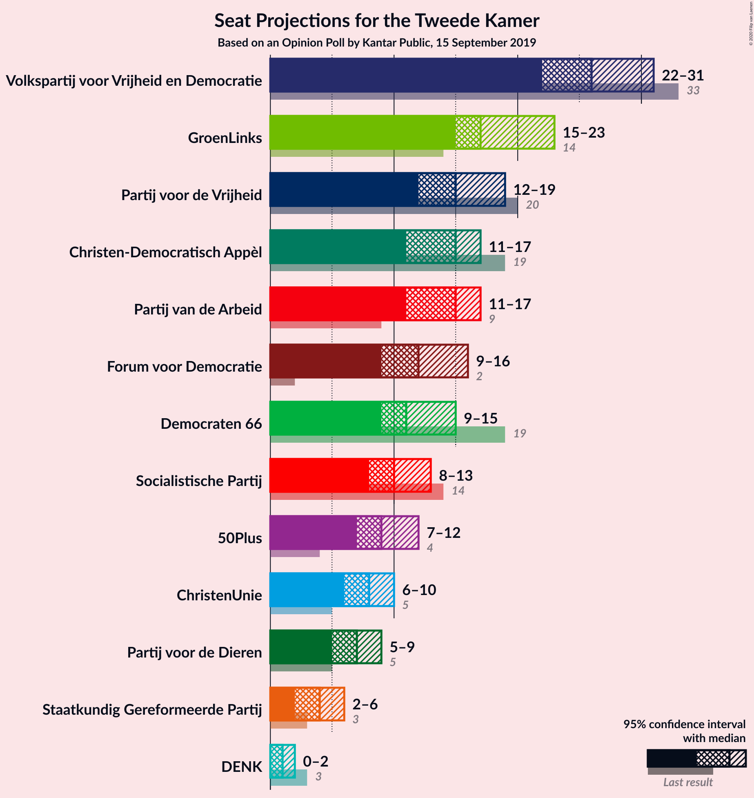

### Confidence Intervals

| Party | Last Result | Median | 80% Confidence Interval | 90% Confidence Interval | 95% Confidence Interval | 99% Confidence Interval |
|:-----:|:-----------:|:------:|:-----------------------:|:-----------------------:|:-----------------------:|:-----------------------:|
| <a href="#volkspartij-voor-vrijheid-en-democratie">Volkspartij voor Vrijheid en Democratie</a> | 33 | 26 | 23–29 |23–29 |22–31 |21–31 |
| <a href="#groenlinks">GroenLinks</a> | 14 | 17 | 15–21 |15–23 |15–23 |13–23 |
| <a href="#partij-voor-de-vrijheid">Partij voor de Vrijheid</a> | 20 | 15 | 13–16 |12–18 |12–19 |12–19 |
| <a href="#christen-democratisch-appèl">Christen-Democratisch Appèl</a> | 19 | 15 | 12–16 |12–16 |11–17 |11–17 |
| <a href="#partij-van-de-arbeid">Partij van de Arbeid</a> | 9 | 15 | 12–17 |12–17 |11–17 |10–17 |
| <a href="#forum-voor-democratie">Forum voor Democratie</a> | 2 | 12 | 10–15 |10–16 |9–16 |9–18 |
| <a href="#democraten-66">Democraten 66</a> | 19 | 11 | 9–13 |9–14 |9–15 |9–16 |
| <a href="#socialistische-partij">Socialistische Partij</a> | 14 | 10 | 8–13 |8–13 |8–13 |7–14 |
| <a href="#50plus">50Plus</a> | 4 | 9 | 8–10 |7–11 |7–12 |6–12 |
| <a href="#christenunie">ChristenUnie</a> | 5 | 8 | 7–9 |6–9 |6–10 |5–11 |
| <a href="#partij-voor-de-dieren">Partij voor de Dieren</a> | 5 | 7 | 6–8 |5–9 |5–9 |5–10 |
| <a href="#staatkundig-gereformeerde-partij">Staatkundig Gereformeerde Partij</a> | 3 | 4 | 3–5 |3–5 |2–6 |2–6 |
| <a href="#denk">DENK</a> | 3 | 1 | 0–2 |0–2 |0–2 |0–3 |

### Volkspartij voor Vrijheid en Democratie

*For a full overview of the results for this party, see the [Volkspartij voor Vrijheid en Democratie](party-volkspartijvoorvrijheidendemocratie.html) page.*

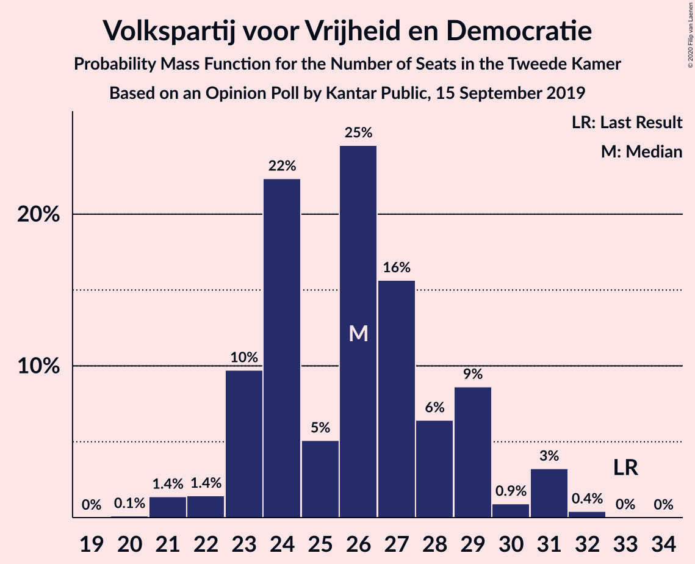

| Number of Seats | Probability | Accumulated | Special Marks |
|:---------------:|:-----------:|:-----------:|:-------------:|
| 20 | 0.1% | 100% |  |
| 21 | 1.4% | 99.9% |  |
| 22 | 1.4% | 98% |  |
| 23 | 10% | 97% |  |
| 24 | 22% | 87% |  |
| 25 | 5% | 65% |  |
| 26 | 25% | 60% | Median |
| 27 | 16% | 35% |  |
| 28 | 6% | 20% |  |
| 29 | 9% | 13% |  |
| 30 | 0.9% | 5% |  |
| 31 | 3% | 4% |  |
| 32 | 0.4% | 0.5% |  |
| 33 | 0% | 0.1% | Last Result |
| 34 | 0% | 0% |  |

### GroenLinks

*For a full overview of the results for this party, see the [GroenLinks](party-groenlinks.html) page.*

| Number of Seats | Probability | Accumulated | Special Marks |
|:---------------:|:-----------:|:-----------:|:-------------:|
| 13 | 0.7% | 100% |  |
| 14 | 0.9% | 99.3% | Last Result |
| 15 | 20% | 98% |  |
| 16 | 4% | 78% |  |
| 17 | 34% | 74% | Median |
| 18 | 17% | 41% |  |
| 19 | 5% | 23% |  |
| 20 | 5% | 18% |  |
| 21 | 5% | 13% |  |
| 22 | 1.0% | 8% |  |
| 23 | 7% | 7% |  |
| 24 | 0% | 0% |  |

### Partij voor de Vrijheid

*For a full overview of the results for this party, see the [Partij voor de Vrijheid](party-partijvoordevrijheid.html) page.*

| Number of Seats | Probability | Accumulated | Special Marks |
|:---------------:|:-----------:|:-----------:|:-------------:|
| 10 | 0.1% | 100% |  |
| 11 | 0.4% | 99.9% |  |
| 12 | 8% | 99.5% |  |
| 13 | 14% | 92% |  |
| 14 | 16% | 78% |  |
| 15 | 44% | 62% | Median |
| 16 | 8% | 18% |  |
| 17 | 3% | 9% |  |
| 18 | 3% | 6% |  |
| 19 | 3% | 3% |  |
| 20 | 0.3% | 0.4% | Last Result |
| 21 | 0.1% | 0.1% |  |
| 22 | 0% | 0% |  |

### Christen-Democratisch Appèl

*For a full overview of the results for this party, see the [Christen-Democratisch Appèl](party-christen-democratischappèl.html) page.*

| Number of Seats | Probability | Accumulated | Special Marks |
|:---------------:|:-----------:|:-----------:|:-------------:|
| 10 | 0.2% | 100% |  |
| 11 | 4% | 99.8% |  |
| 12 | 18% | 96% |  |
| 13 | 4% | 78% |  |
| 14 | 21% | 74% |  |
| 15 | 9% | 53% | Median |
| 16 | 42% | 44% |  |
| 17 | 2% | 3% |  |
| 18 | 0.2% | 0.4% |  |
| 19 | 0.1% | 0.1% | Last Result |
| 20 | 0% | 0% |  |

### Partij van de Arbeid

*For a full overview of the results for this party, see the [Partij van de Arbeid](party-partijvandearbeid.html) page.*

| Number of Seats | Probability | Accumulated | Special Marks |
|:---------------:|:-----------:|:-----------:|:-------------:|
| 9 | 0.1% | 100% | Last Result |
| 10 | 1.0% | 99.9% |  |
| 11 | 4% | 98.8% |  |
| 12 | 17% | 95% |  |
| 13 | 11% | 78% |  |
| 14 | 14% | 67% |  |
| 15 | 18% | 53% | Median |
| 16 | 19% | 35% |  |
| 17 | 16% | 17% |  |
| 18 | 0.2% | 0.4% |  |
| 19 | 0.1% | 0.1% |  |
| 20 | 0% | 0% |  |

### Forum voor Democratie

*For a full overview of the results for this party, see the [Forum voor Democratie](party-forumvoordemocratie.html) page.*

| Number of Seats | Probability | Accumulated | Special Marks |
|:---------------:|:-----------:|:-----------:|:-------------:|
| 2 | 0% | 100% | Last Result |
| 3 | 0% | 100% |  |
| 4 | 0% | 100% |  |
| 5 | 0% | 100% |  |
| 6 | 0% | 100% |  |
| 7 | 0% | 100% |  |
| 8 | 0% | 100% |  |
| 9 | 3% | 100% |  |
| 10 | 17% | 97% |  |
| 11 | 7% | 80% |  |
| 12 | 23% | 73% | Median |
| 13 | 8% | 49% |  |
| 14 | 20% | 42% |  |
| 15 | 16% | 22% |  |
| 16 | 4% | 6% |  |
| 17 | 0.7% | 2% |  |
| 18 | 0.7% | 0.9% |  |
| 19 | 0.2% | 0.2% |  |
| 20 | 0% | 0% |  |

### Democraten 66

*For a full overview of the results for this party, see the [Democraten 66](party-democraten66.html) page.*

| Number of Seats | Probability | Accumulated | Special Marks |
|:---------------:|:-----------:|:-----------:|:-------------:|
| 8 | 0.2% | 100% |  |
| 9 | 17% | 99.7% |  |
| 10 | 6% | 83% |  |
| 11 | 35% | 77% | Median |
| 12 | 29% | 41% |  |
| 13 | 4% | 12% |  |
| 14 | 4% | 9% |  |
| 15 | 3% | 5% |  |
| 16 | 2% | 2% |  |
| 17 | 0% | 0% |  |
| 18 | 0% | 0% |  |
| 19 | 0% | 0% | Last Result |

### Socialistische Partij

*For a full overview of the results for this party, see the [Socialistische Partij](party-socialistischepartij.html) page.*

| Number of Seats | Probability | Accumulated | Special Marks |
|:---------------:|:-----------:|:-----------:|:-------------:|
| 6 | 0.2% | 100% |  |
| 7 | 1.1% | 99.8% |  |
| 8 | 13% | 98.7% |  |
| 9 | 28% | 86% |  |
| 10 | 35% | 58% | Median |
| 11 | 5% | 24% |  |
| 12 | 4% | 19% |  |
| 13 | 13% | 15% |  |
| 14 | 2% | 2% | Last Result |
| 15 | 0% | 0% |  |

### 50Plus

*For a full overview of the results for this party, see the [50Plus](party-50plus.html) page.*

| Number of Seats | Probability | Accumulated | Special Marks |
|:---------------:|:-----------:|:-----------:|:-------------:|
| 4 | 0% | 100% | Last Result |
| 5 | 0.1% | 100% |  |
| 6 | 1.1% | 99.9% |  |
| 7 | 4% | 98.8% |  |
| 8 | 21% | 95% |  |
| 9 | 24% | 74% | Median |
| 10 | 42% | 50% |  |
| 11 | 5% | 8% |  |
| 12 | 3% | 3% |  |
| 13 | 0.4% | 0.4% |  |
| 14 | 0% | 0% |  |

### ChristenUnie

*For a full overview of the results for this party, see the [ChristenUnie](party-christenunie.html) page.*

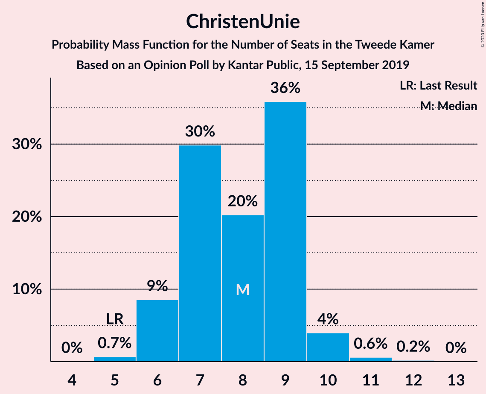

| Number of Seats | Probability | Accumulated | Special Marks |
|:---------------:|:-----------:|:-----------:|:-------------:|
| 5 | 0.7% | 100% | Last Result |
| 6 | 9% | 99.3% |  |
| 7 | 30% | 91% |  |
| 8 | 20% | 61% | Median |
| 9 | 36% | 41% |  |
| 10 | 4% | 5% |  |
| 11 | 0.6% | 0.8% |  |
| 12 | 0.2% | 0.2% |  |
| 13 | 0% | 0% |  |

### Partij voor de Dieren

*For a full overview of the results for this party, see the [Partij voor de Dieren](party-partijvoordedieren.html) page.*

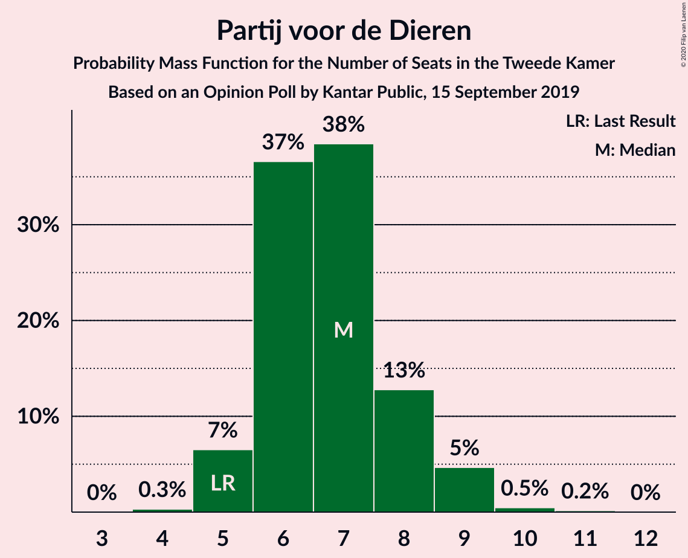

| Number of Seats | Probability | Accumulated | Special Marks |
|:---------------:|:-----------:|:-----------:|:-------------:|
| 4 | 0.3% | 100% |  |
| 5 | 7% | 99.7% | Last Result |
| 6 | 37% | 93% |  |
| 7 | 38% | 57% | Median |
| 8 | 13% | 18% |  |
| 9 | 5% | 5% |  |
| 10 | 0.5% | 0.6% |  |
| 11 | 0.2% | 0.2% |  |
| 12 | 0% | 0% |  |

### Staatkundig Gereformeerde Partij

*For a full overview of the results for this party, see the [Staatkundig Gereformeerde Partij](party-staatkundiggereformeerdepartij.html) page.*

| Number of Seats | Probability | Accumulated | Special Marks |
|:---------------:|:-----------:|:-----------:|:-------------:|
| 1 | 0.3% | 100% |  |
| 2 | 4% | 99.7% |  |
| 3 | 11% | 96% | Last Result |
| 4 | 43% | 84% | Median |
| 5 | 37% | 42% |  |
| 6 | 4% | 4% |  |
| 7 | 0.3% | 0.3% |  |
| 8 | 0% | 0% |  |

### DENK

*For a full overview of the results for this party, see the [DENK](party-denk.html) page.*

| Number of Seats | Probability | Accumulated | Special Marks |
|:---------------:|:-----------:|:-----------:|:-------------:|
| 0 | 49% | 100% |  |
| 1 | 39% | 51% | Median |
| 2 | 10% | 12% |  |
| 3 | 2% | 2% | Last Result |
| 4 | 0% | 0% |  |

## Coalitions

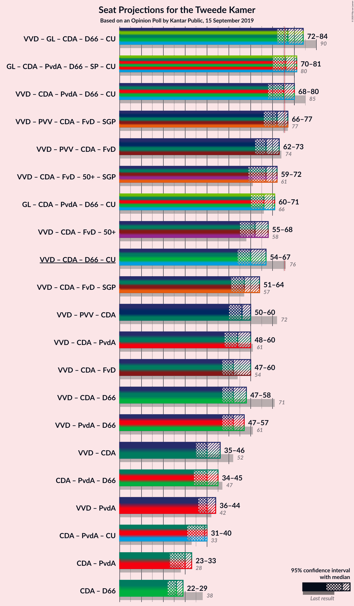

### Confidence Intervals

| Coalition | Last Result | Median | Majority? | 80% Confidence Interval | 90% Confidence Interval | 95% Confidence Interval | 99% Confidence Interval |
|:---------:|:-----------:|:------:|:---------:|:-----------------------:|:-----------------------:|:-----------------------:|:-----------------------:|
| Volkspartij voor Vrijheid en Democratie – GroenLinks – Christen-Democratisch Appèl – Democraten 66 – ChristenUnie | 90 | 77 | 66% | 73–81 | 73–83 | 72–84 | 71–85 |
| GroenLinks – Christen-Democratisch Appèl – Partij van de Arbeid – Democraten 66 – Socialistische Partij – ChristenUnie | 80 | 76 | 51% | 71–80 | 71–81 | 70–81 | 68–83 |
| Volkspartij voor Vrijheid en Democratie – Christen-Democratisch Appèl – Partij van de Arbeid – Democraten 66 – ChristenUnie | 85 | 75 | 35% | 69–77 | 68–78 | 68–80 | 66–82 |
| Volkspartij voor Vrijheid en Democratie – Partij voor de Vrijheid – Christen-Democratisch Appèl – Forum voor Democratie – Staatkundig Gereformeerde Partij | 77 | 72 | 15% | 68–76 | 66–77 | 66–77 | 66–80 |
| Volkspartij voor Vrijheid en Democratie – Partij voor de Vrijheid – Christen-Democratisch Appèl – Forum voor Democratie | 74 | 67 | 0.1% | 64–73 | 62–73 | 62–73 | 62–75 |
| Volkspartij voor Vrijheid en Democratie – Christen-Democratisch Appèl – Forum voor Democratie – 50Plus – Staatkundig Gereformeerde Partij | 61 | 67 | 0% | 61–72 | 59–72 | 59–72 | 58–74 |
| GroenLinks – Christen-Democratisch Appèl – Partij van de Arbeid – Democraten 66 – ChristenUnie | 66 | 66 | 0% | 62–68 | 61–69 | 60–71 | 59–74 |
| Volkspartij voor Vrijheid en Democratie – Christen-Democratisch Appèl – Forum voor Democratie – 50Plus | 58 | 62 | 0% | 57–67 | 55–68 | 55–68 | 54–69 |
| Volkspartij voor Vrijheid en Democratie – Christen-Democratisch Appèl – Democraten 66 – ChristenUnie | 76 | 60 | 0% | 55–63 | 55–64 | 54–67 | 54–67 |
| Volkspartij voor Vrijheid en Democratie – Christen-Democratisch Appèl – Forum voor Democratie – Staatkundig Gereformeerde Partij | 57 | 57 | 0% | 53–62 | 51–64 | 51–64 | 51–64 |
| Volkspartij voor Vrijheid en Democratie – Partij voor de Vrijheid – Christen-Democratisch Appèl | 72 | 56 | 0% | 51–58 | 50–58 | 50–60 | 49–62 |
| Volkspartij voor Vrijheid en Democratie – Christen-Democratisch Appèl – Partij van de Arbeid | 61 | 54 | 0% | 48–59 | 48–59 | 48–60 | 47–61 |
| Volkspartij voor Vrijheid en Democratie – Christen-Democratisch Appèl – Forum voor Democratie | 54 | 52 | 0% | 49–57 | 47–60 | 47–60 | 47–60 |
| Volkspartij voor Vrijheid en Democratie – Christen-Democratisch Appèl – Democraten 66 | 71 | 52 | 0% | 48–56 | 47–57 | 47–58 | 45–58 |
| Volkspartij voor Vrijheid en Democratie – Partij van de Arbeid – Democraten 66 | 61 | 52 | 0% | 48–54 | 47–54 | 47–57 | 45–58 |
| Volkspartij voor Vrijheid en Democratie – Christen-Democratisch Appèl | 52 | 40 | 0% | 35–45 | 35–45 | 35–46 | 35–46 |
| Christen-Democratisch Appèl – Partij van de Arbeid – Democraten 66 | 47 | 40 | 0% | 36–44 | 36–44 | 34–45 | 33–45 |
| Volkspartij voor Vrijheid en Democratie – Partij van de Arbeid | 42 | 40 | 0% | 36–43 | 36–43 | 36–44 | 34–46 |
| Christen-Democratisch Appèl – Partij van de Arbeid – ChristenUnie | 33 | 39 | 0% | 33–40 | 31–40 | 31–40 | 30–40 |
| Christen-Democratisch Appèl – Partij van de Arbeid | 28 | 30 | 0% | 25–33 | 24–33 | 23–33 | 21–33 |
| Christen-Democratisch Appèl – Democraten 66 | 38 | 26 | 0% | 23–27 | 22–28 | 22–29 | 21–33 |

### Volkspartij voor Vrijheid en Democratie – GroenLinks – Christen-Democratisch Appèl – Democraten 66 – ChristenUnie

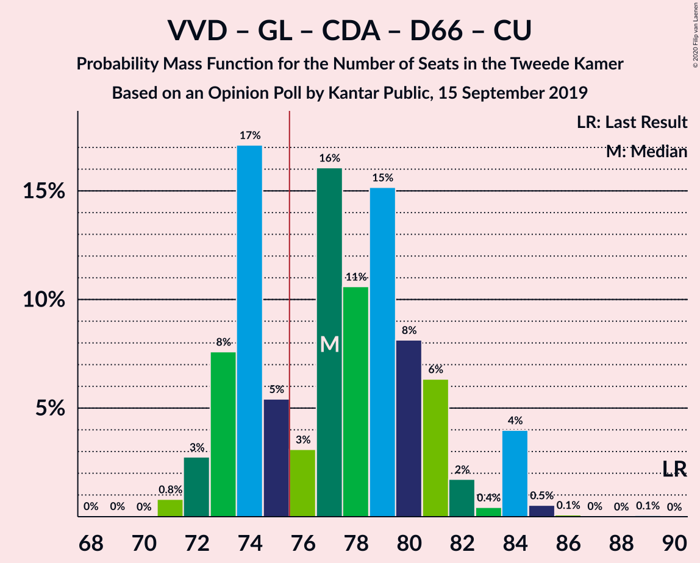

| Number of Seats | Probability | Accumulated | Special Marks |
|:---------------:|:-----------:|:-----------:|:-------------:|
| 69 | 0% | 100% |  |
| 70 | 0% | 99.9% |  |
| 71 | 0.8% | 99.9% |  |
| 72 | 3% | 99.1% |  |
| 73 | 8% | 96% |  |
| 74 | 17% | 89% |  |
| 75 | 5% | 72% |  |
| 76 | 3% | 66% | Majority |
| 77 | 16% | 63% | Median |
| 78 | 11% | 47% |  |
| 79 | 15% | 36% |  |
| 80 | 8% | 21% |  |
| 81 | 6% | 13% |  |
| 82 | 2% | 7% |  |
| 83 | 0.4% | 5% |  |
| 84 | 4% | 5% |  |
| 85 | 0.5% | 0.7% |  |
| 86 | 0.1% | 0.2% |  |
| 87 | 0% | 0.1% |  |
| 88 | 0% | 0.1% |  |
| 89 | 0.1% | 0.1% |  |
| 90 | 0% | 0% | Last Result |

### GroenLinks – Christen-Democratisch Appèl – Partij van de Arbeid – Democraten 66 – Socialistische Partij – ChristenUnie

| Number of Seats | Probability | Accumulated | Special Marks |
|:---------------:|:-----------:|:-----------:|:-------------:|
| 68 | 0.5% | 100% |  |
| 69 | 1.2% | 99.5% |  |
| 70 | 2% | 98% |  |
| 71 | 10% | 96% |  |
| 72 | 0.7% | 86% |  |
| 73 | 4% | 86% |  |
| 74 | 10% | 82% |  |
| 75 | 21% | 73% |  |
| 76 | 6% | 51% | Median, Majority |
| 77 | 16% | 46% |  |
| 78 | 17% | 30% |  |
| 79 | 2% | 13% |  |
| 80 | 1.4% | 11% | Last Result |
| 81 | 8% | 9% |  |
| 82 | 0.5% | 1.1% |  |
| 83 | 0.6% | 0.6% |  |
| 84 | 0% | 0% |  |

### Volkspartij voor Vrijheid en Democratie – Christen-Democratisch Appèl – Partij van de Arbeid – Democraten 66 – ChristenUnie

| Number of Seats | Probability | Accumulated | Special Marks |
|:---------------:|:-----------:|:-----------:|:-------------:|
| 63 | 0.2% | 100% |  |
| 64 | 0.1% | 99.8% |  |
| 65 | 0.1% | 99.8% |  |
| 66 | 2% | 99.6% |  |
| 67 | 0.2% | 98% |  |
| 68 | 8% | 98% |  |
| 69 | 4% | 90% |  |
| 70 | 7% | 86% |  |
| 71 | 4% | 79% |  |
| 72 | 3% | 75% |  |
| 73 | 5% | 72% |  |
| 74 | 5% | 67% |  |
| 75 | 27% | 63% | Median |
| 76 | 12% | 35% | Majority |
| 77 | 16% | 23% |  |
| 78 | 5% | 8% |  |
| 79 | 0.3% | 3% |  |
| 80 | 0.3% | 3% |  |
| 81 | 0.2% | 2% |  |
| 82 | 2% | 2% |  |
| 83 | 0% | 0% |  |
| 84 | 0% | 0% |  |
| 85 | 0% | 0% | Last Result |

### Volkspartij voor Vrijheid en Democratie – Partij voor de Vrijheid – Christen-Democratisch Appèl – Forum voor Democratie – Staatkundig Gereformeerde Partij

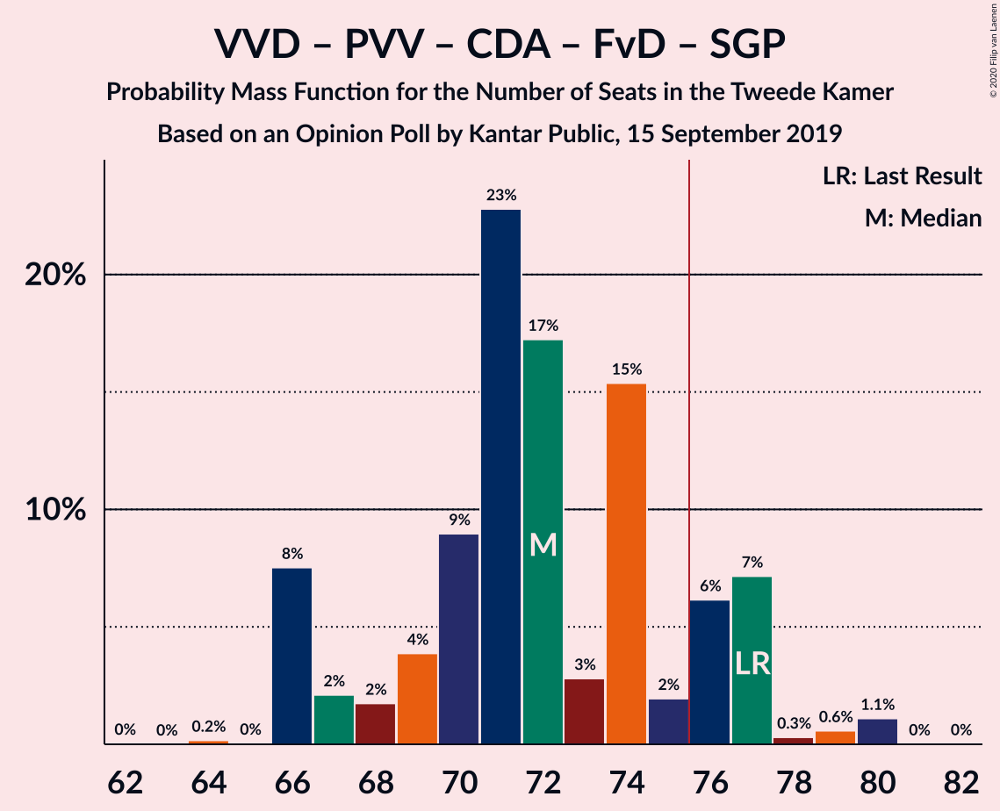

| Number of Seats | Probability | Accumulated | Special Marks |
|:---------------:|:-----------:|:-----------:|:-------------:|
| 64 | 0.2% | 100% |  |
| 65 | 0% | 99.8% |  |
| 66 | 8% | 99.7% |  |
| 67 | 2% | 92% |  |
| 68 | 2% | 90% |  |
| 69 | 4% | 88% |  |
| 70 | 9% | 84% |  |
| 71 | 23% | 76% |  |
| 72 | 17% | 53% | Median |
| 73 | 3% | 35% |  |
| 74 | 15% | 33% |  |
| 75 | 2% | 17% |  |
| 76 | 6% | 15% | Majority |
| 77 | 7% | 9% | Last Result |
| 78 | 0.3% | 2% |  |
| 79 | 0.6% | 2% |  |
| 80 | 1.1% | 1.2% |  |
| 81 | 0% | 0.1% |  |
| 82 | 0% | 0% |  |

### Volkspartij voor Vrijheid en Democratie – Partij voor de Vrijheid – Christen-Democratisch Appèl – Forum voor Democratie

| Number of Seats | Probability | Accumulated | Special Marks |
|:---------------:|:-----------:|:-----------:|:-------------:|
| 60 | 0.1% | 100% |  |
| 61 | 0.1% | 99.9% |  |
| 62 | 7% | 99.8% |  |
| 63 | 2% | 92% |  |
| 64 | 2% | 90% |  |
| 65 | 6% | 88% |  |
| 66 | 7% | 82% |  |
| 67 | 31% | 75% |  |
| 68 | 8% | 44% | Median |
| 69 | 14% | 36% |  |
| 70 | 5% | 22% |  |
| 71 | 5% | 17% |  |
| 72 | 1.2% | 12% |  |
| 73 | 9% | 11% |  |
| 74 | 0.6% | 2% | Last Result |
| 75 | 1.3% | 1.4% |  |
| 76 | 0.1% | 0.1% | Majority |
| 77 | 0% | 0.1% |  |
| 78 | 0% | 0.1% |  |
| 79 | 0% | 0% |  |

### Volkspartij voor Vrijheid en Democratie – Christen-Democratisch Appèl – Forum voor Democratie – 50Plus – Staatkundig Gereformeerde Partij

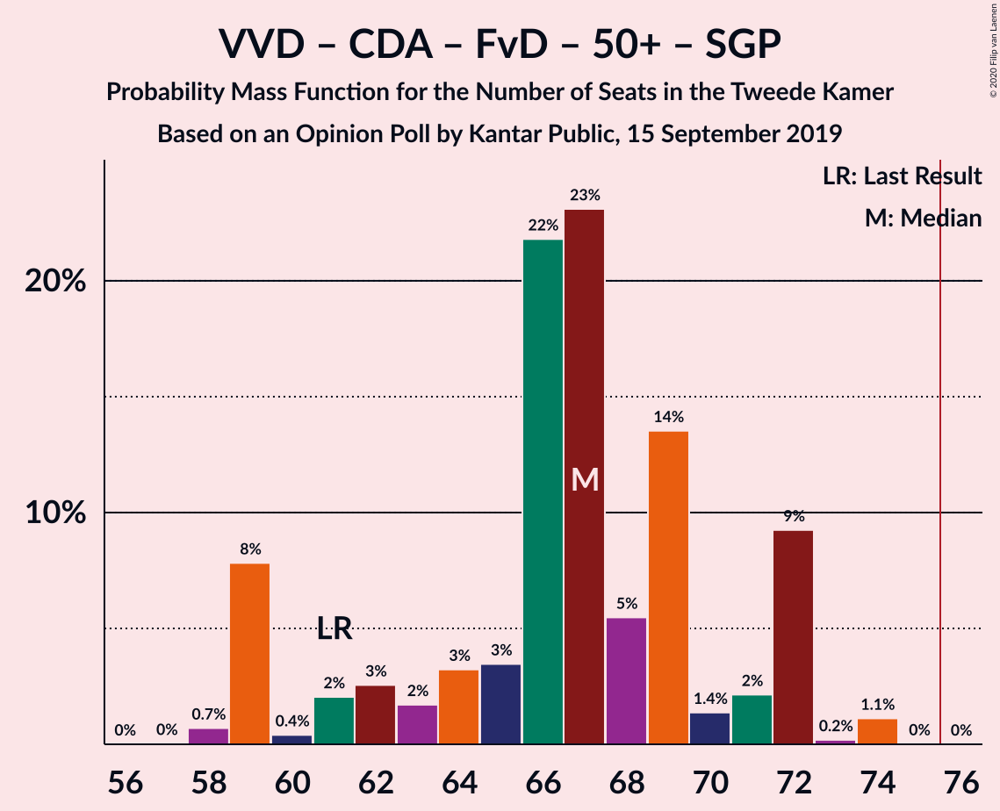

| Number of Seats | Probability | Accumulated | Special Marks |
|:---------------:|:-----------:|:-----------:|:-------------:|
| 58 | 0.7% | 100% |  |
| 59 | 8% | 99.3% |  |
| 60 | 0.4% | 91% |  |
| 61 | 2% | 91% | Last Result |
| 62 | 3% | 89% |  |
| 63 | 2% | 86% |  |
| 64 | 3% | 85% |  |
| 65 | 3% | 81% |  |
| 66 | 22% | 78% | Median |
| 67 | 23% | 56% |  |
| 68 | 5% | 33% |  |
| 69 | 14% | 28% |  |
| 70 | 1.4% | 14% |  |
| 71 | 2% | 13% |  |
| 72 | 9% | 11% |  |
| 73 | 0.2% | 1.3% |  |
| 74 | 1.1% | 1.1% |  |
| 75 | 0% | 0% |  |

### GroenLinks – Christen-Democratisch Appèl – Partij van de Arbeid – Democraten 66 – ChristenUnie

| Number of Seats | Probability | Accumulated | Special Marks |
|:---------------:|:-----------:|:-----------:|:-------------:|
| 57 | 0% | 100% |  |
| 58 | 0.2% | 99.9% |  |
| 59 | 1.2% | 99.7% |  |
| 60 | 1.5% | 98.5% |  |
| 61 | 7% | 97% |  |
| 62 | 4% | 90% |  |
| 63 | 12% | 86% |  |
| 64 | 4% | 74% |  |
| 65 | 3% | 70% |  |
| 66 | 17% | 67% | Last Result, Median |
| 67 | 16% | 49% |  |
| 68 | 27% | 33% |  |
| 69 | 1.0% | 5% |  |
| 70 | 0.8% | 4% |  |
| 71 | 2% | 4% |  |
| 72 | 0.5% | 1.3% |  |
| 73 | 0.2% | 0.8% |  |
| 74 | 0.2% | 0.6% |  |
| 75 | 0.4% | 0.4% |  |
| 76 | 0% | 0% | Majority |

### Volkspartij voor Vrijheid en Democratie – Christen-Democratisch Appèl – Forum voor Democratie – 50Plus

| Number of Seats | Probability | Accumulated | Special Marks |
|:---------------:|:-----------:|:-----------:|:-------------:|
| 54 | 1.1% | 100% |  |
| 55 | 7% | 98.9% |  |
| 56 | 1.1% | 91% |  |
| 57 | 1.4% | 90% |  |
| 58 | 1.4% | 89% | Last Result |
| 59 | 2% | 87% |  |
| 60 | 4% | 85% |  |
| 61 | 3% | 81% |  |
| 62 | 31% | 78% | Median |
| 63 | 11% | 46% |  |
| 64 | 19% | 36% |  |
| 65 | 4% | 17% |  |
| 66 | 2% | 13% |  |
| 67 | 1.5% | 11% |  |
| 68 | 8% | 9% |  |
| 69 | 1.1% | 1.2% |  |
| 70 | 0% | 0.1% |  |
| 71 | 0% | 0% |  |

### Volkspartij voor Vrijheid en Democratie – Christen-Democratisch Appèl – Democraten 66 – ChristenUnie

| Number of Seats | Probability | Accumulated | Special Marks |
|:---------------:|:-----------:|:-----------:|:-------------:|
| 52 | 0.2% | 100% |  |
| 53 | 0.2% | 99.8% |  |
| 54 | 2% | 99.6% |  |
| 55 | 11% | 97% |  |
| 56 | 6% | 87% |  |
| 57 | 5% | 80% |  |
| 58 | 3% | 75% |  |
| 59 | 19% | 72% |  |
| 60 | 18% | 54% | Median |
| 61 | 14% | 36% |  |
| 62 | 3% | 22% |  |
| 63 | 13% | 19% |  |
| 64 | 3% | 7% |  |
| 65 | 0.5% | 4% |  |
| 66 | 0.9% | 3% |  |
| 67 | 2% | 3% |  |
| 68 | 0.4% | 0.5% |  |
| 69 | 0% | 0.1% |  |
| 70 | 0% | 0% |  |
| 71 | 0% | 0% |  |
| 72 | 0% | 0% |  |
| 73 | 0% | 0% |  |
| 74 | 0% | 0% |  |
| 75 | 0% | 0% |  |
| 76 | 0% | 0% | Last Result, Majority |

### Volkspartij voor Vrijheid en Democratie – Christen-Democratisch Appèl – Forum voor Democratie – Staatkundig Gereformeerde Partij

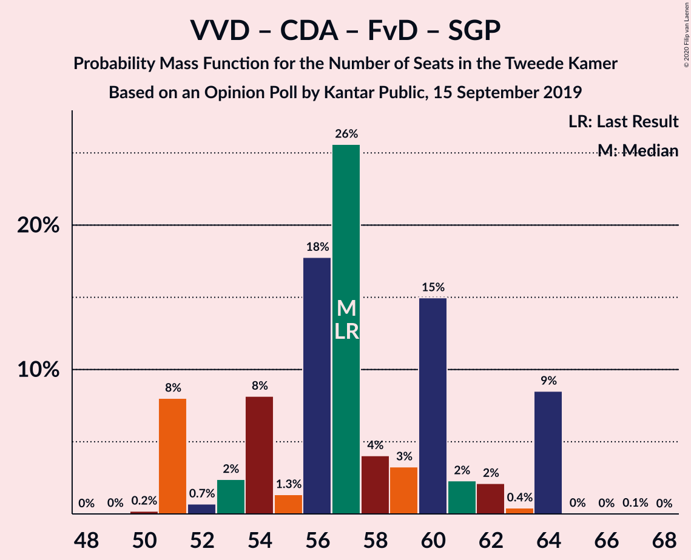

| Number of Seats | Probability | Accumulated | Special Marks |
|:---------------:|:-----------:|:-----------:|:-------------:|
| 49 | 0% | 100% |  |
| 50 | 0.2% | 99.9% |  |
| 51 | 8% | 99.7% |  |
| 52 | 0.7% | 92% |  |
| 53 | 2% | 91% |  |
| 54 | 8% | 89% |  |
| 55 | 1.3% | 80% |  |
| 56 | 18% | 79% |  |
| 57 | 26% | 61% | Last Result, Median |
| 58 | 4% | 36% |  |
| 59 | 3% | 32% |  |
| 60 | 15% | 28% |  |
| 61 | 2% | 13% |  |
| 62 | 2% | 11% |  |
| 63 | 0.4% | 9% |  |
| 64 | 9% | 9% |  |
| 65 | 0% | 0.1% |  |
| 66 | 0% | 0.1% |  |
| 67 | 0.1% | 0.1% |  |
| 68 | 0% | 0% |  |

### Volkspartij voor Vrijheid en Democratie – Partij voor de Vrijheid – Christen-Democratisch Appèl

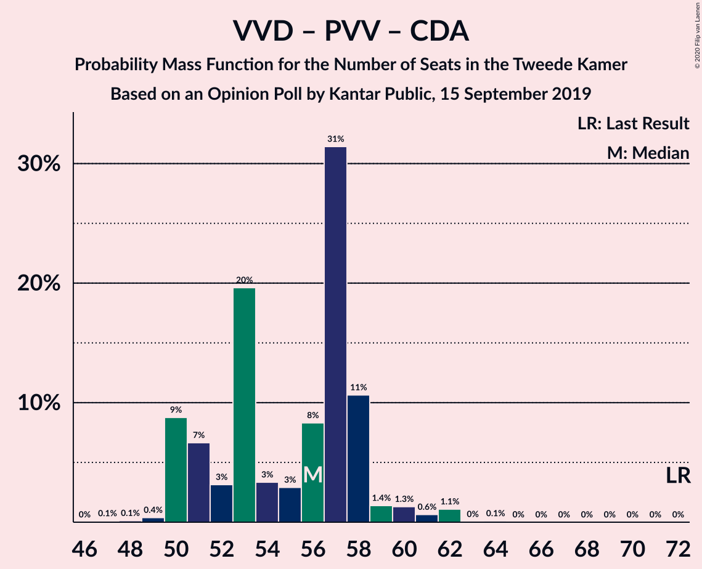

| Number of Seats | Probability | Accumulated | Special Marks |
|:---------------:|:-----------:|:-----------:|:-------------:|
| 47 | 0.1% | 100% |  |
| 48 | 0.1% | 99.9% |  |
| 49 | 0.4% | 99.8% |  |
| 50 | 9% | 99.4% |  |
| 51 | 7% | 91% |  |
| 52 | 3% | 84% |  |
| 53 | 20% | 81% |  |
| 54 | 3% | 61% |  |
| 55 | 3% | 58% |  |
| 56 | 8% | 55% | Median |
| 57 | 31% | 47% |  |
| 58 | 11% | 15% |  |
| 59 | 1.4% | 5% |  |
| 60 | 1.3% | 3% |  |
| 61 | 0.6% | 2% |  |
| 62 | 1.1% | 1.2% |  |
| 63 | 0% | 0.1% |  |
| 64 | 0.1% | 0.1% |  |
| 65 | 0% | 0% |  |
| 66 | 0% | 0% |  |
| 67 | 0% | 0% |  |
| 68 | 0% | 0% |  |
| 69 | 0% | 0% |  |
| 70 | 0% | 0% |  |
| 71 | 0% | 0% |  |
| 72 | 0% | 0% | Last Result |

### Volkspartij voor Vrijheid en Democratie – Christen-Democratisch Appèl – Partij van de Arbeid

| Number of Seats | Probability | Accumulated | Special Marks |
|:---------------:|:-----------:|:-----------:|:-------------:|
| 44 | 0.2% | 100% |  |
| 45 | 0% | 99.8% |  |
| 46 | 0.2% | 99.8% |  |
| 47 | 2% | 99.6% |  |
| 48 | 8% | 98% |  |
| 49 | 0.9% | 90% |  |
| 50 | 2% | 89% |  |
| 51 | 4% | 87% |  |
| 52 | 10% | 83% |  |
| 53 | 3% | 73% |  |
| 54 | 22% | 70% |  |
| 55 | 4% | 48% |  |
| 56 | 2% | 43% | Median |
| 57 | 11% | 42% |  |
| 58 | 11% | 31% |  |
| 59 | 17% | 20% |  |
| 60 | 0.5% | 3% |  |
| 61 | 2% | 2% | Last Result |
| 62 | 0% | 0% |  |

### Volkspartij voor Vrijheid en Democratie – Christen-Democratisch Appèl – Forum voor Democratie

| Number of Seats | Probability | Accumulated | Special Marks |
|:---------------:|:-----------:|:-----------:|:-------------:|
| 45 | 0.1% | 100% |  |
| 46 | 0.1% | 99.9% |  |
| 47 | 9% | 99.9% |  |
| 48 | 1.2% | 91% |  |
| 49 | 2% | 90% |  |
| 50 | 3% | 88% |  |
| 51 | 5% | 85% |  |
| 52 | 34% | 80% |  |
| 53 | 8% | 46% | Median |
| 54 | 3% | 37% | Last Result |
| 55 | 17% | 34% |  |
| 56 | 6% | 17% |  |
| 57 | 1.0% | 11% |  |
| 58 | 1.0% | 10% |  |
| 59 | 2% | 9% |  |
| 60 | 7% | 7% |  |
| 61 | 0.1% | 0.2% |  |
| 62 | 0% | 0.1% |  |
| 63 | 0.1% | 0.1% |  |
| 64 | 0% | 0% |  |

### Volkspartij voor Vrijheid en Democratie – Christen-Democratisch Appèl – Democraten 66

| Number of Seats | Probability | Accumulated | Special Marks |
|:---------------:|:-----------:|:-----------:|:-------------:|
| 44 | 0.3% | 100% |  |
| 45 | 0.2% | 99.7% |  |
| 46 | 2% | 99.4% |  |
| 47 | 7% | 98% |  |
| 48 | 7% | 90% |  |
| 49 | 5% | 84% |  |
| 50 | 21% | 78% |  |
| 51 | 5% | 57% |  |
| 52 | 13% | 53% | Median |
| 53 | 17% | 40% |  |
| 54 | 5% | 24% |  |
| 55 | 5% | 18% |  |
| 56 | 8% | 13% |  |
| 57 | 2% | 5% |  |
| 58 | 3% | 3% |  |
| 59 | 0.1% | 0.3% |  |
| 60 | 0.1% | 0.2% |  |
| 61 | 0% | 0.1% |  |
| 62 | 0% | 0% |  |
| 63 | 0% | 0% |  |
| 64 | 0% | 0% |  |
| 65 | 0% | 0% |  |
| 66 | 0% | 0% |  |
| 67 | 0% | 0% |  |
| 68 | 0% | 0% |  |
| 69 | 0% | 0% |  |
| 70 | 0% | 0% |  |
| 71 | 0% | 0% | Last Result |

### Volkspartij voor Vrijheid en Democratie – Partij van de Arbeid – Democraten 66

| Number of Seats | Probability | Accumulated | Special Marks |
|:---------------:|:-----------:|:-----------:|:-------------:|
| 43 | 0.1% | 100% |  |
| 44 | 0.3% | 99.9% |  |
| 45 | 0.6% | 99.6% |  |
| 46 | 0.3% | 98.9% |  |
| 47 | 6% | 98.6% |  |
| 48 | 9% | 93% |  |
| 49 | 3% | 84% |  |
| 50 | 8% | 81% |  |
| 51 | 13% | 73% |  |
| 52 | 29% | 60% | Median |
| 53 | 3% | 31% |  |
| 54 | 22% | 27% |  |
| 55 | 2% | 5% |  |
| 56 | 0.3% | 3% |  |
| 57 | 0.7% | 3% |  |
| 58 | 2% | 2% |  |
| 59 | 0.1% | 0.1% |  |
| 60 | 0% | 0% |  |
| 61 | 0% | 0% | Last Result |

### Volkspartij voor Vrijheid en Democratie – Christen-Democratisch Appèl

| Number of Seats | Probability | Accumulated | Special Marks |
|:---------------:|:-----------:|:-----------:|:-------------:|
| 33 | 0.2% | 100% |  |
| 34 | 0.2% | 99.7% |  |
| 35 | 10% | 99.5% |  |
| 36 | 1.1% | 90% |  |
| 37 | 6% | 89% |  |
| 38 | 22% | 83% |  |
| 39 | 4% | 60% |  |
| 40 | 7% | 56% |  |
| 41 | 3% | 49% | Median |
| 42 | 17% | 46% |  |
| 43 | 14% | 29% |  |
| 44 | 3% | 15% |  |
| 45 | 9% | 13% |  |
| 46 | 3% | 4% |  |
| 47 | 0.3% | 0.4% |  |
| 48 | 0.1% | 0.1% |  |
| 49 | 0% | 0% |  |
| 50 | 0% | 0% |  |
| 51 | 0% | 0% |  |
| 52 | 0% | 0% | Last Result |

### Christen-Democratisch Appèl – Partij van de Arbeid – Democraten 66

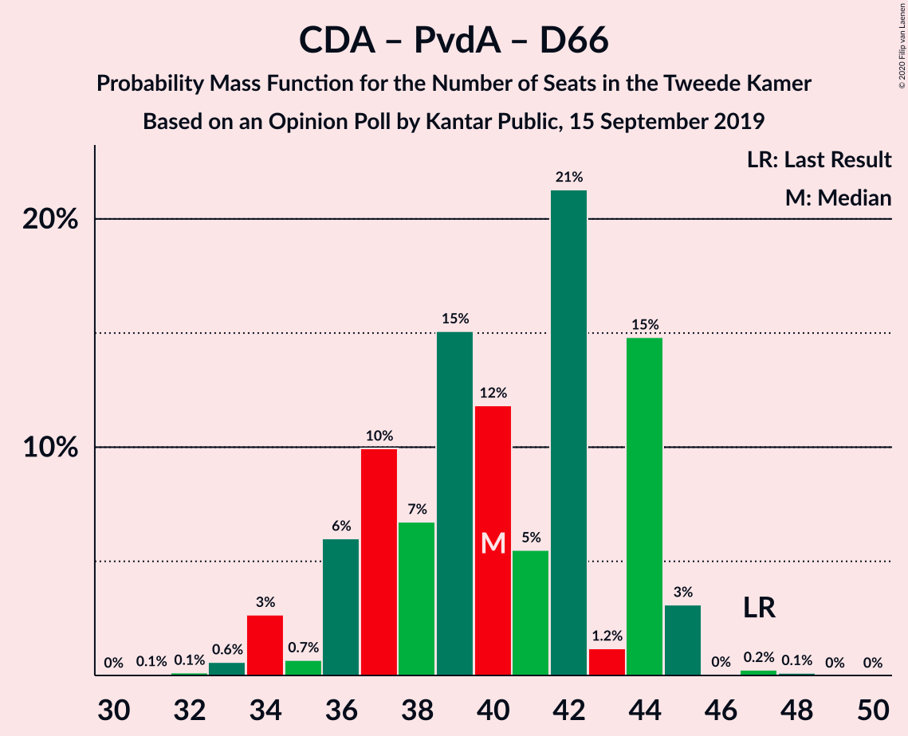

| Number of Seats | Probability | Accumulated | Special Marks |
|:---------------:|:-----------:|:-----------:|:-------------:|
| 31 | 0.1% | 100% |  |
| 32 | 0.1% | 99.9% |  |
| 33 | 0.6% | 99.8% |  |
| 34 | 3% | 99.2% |  |
| 35 | 0.7% | 97% |  |
| 36 | 6% | 96% |  |
| 37 | 10% | 90% |  |
| 38 | 7% | 80% |  |
| 39 | 15% | 73% |  |
| 40 | 12% | 58% |  |
| 41 | 5% | 46% | Median |
| 42 | 21% | 41% |  |
| 43 | 1.2% | 20% |  |
| 44 | 15% | 18% |  |
| 45 | 3% | 4% |  |
| 46 | 0% | 0.4% |  |
| 47 | 0.2% | 0.4% | Last Result |
| 48 | 0.1% | 0.1% |  |
| 49 | 0% | 0% |  |

### Volkspartij voor Vrijheid en Democratie – Partij van de Arbeid

| Number of Seats | Probability | Accumulated | Special Marks |
|:---------------:|:-----------:|:-----------:|:-------------:|
| 33 | 0.2% | 100% |  |
| 34 | 1.1% | 99.7% |  |
| 35 | 1.1% | 98.7% |  |
| 36 | 11% | 98% |  |
| 37 | 3% | 87% |  |
| 38 | 7% | 84% |  |
| 39 | 3% | 77% |  |
| 40 | 27% | 73% |  |
| 41 | 11% | 47% | Median |
| 42 | 13% | 35% | Last Result |
| 43 | 20% | 23% |  |
| 44 | 0.2% | 3% |  |
| 45 | 0.1% | 2% |  |
| 46 | 2% | 2% |  |
| 47 | 0% | 0% |  |

### Christen-Democratisch Appèl – Partij van de Arbeid – ChristenUnie

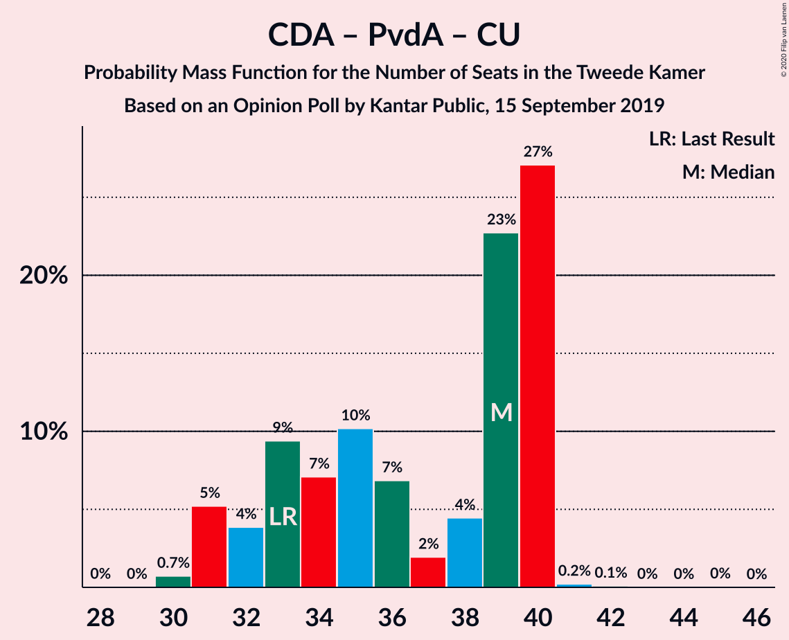

| Number of Seats | Probability | Accumulated | Special Marks |
|:---------------:|:-----------:|:-----------:|:-------------:|
| 28 | 0% | 100% |  |
| 29 | 0% | 99.9% |  |
| 30 | 0.7% | 99.9% |  |
| 31 | 5% | 99.2% |  |
| 32 | 4% | 94% |  |
| 33 | 9% | 90% | Last Result |
| 34 | 7% | 81% |  |
| 35 | 10% | 74% |  |
| 36 | 7% | 63% |  |
| 37 | 2% | 57% |  |
| 38 | 4% | 55% | Median |
| 39 | 23% | 50% |  |
| 40 | 27% | 27% |  |
| 41 | 0.2% | 0.4% |  |
| 42 | 0.1% | 0.2% |  |
| 43 | 0% | 0.1% |  |
| 44 | 0% | 0.1% |  |
| 45 | 0% | 0% |  |

### Christen-Democratisch Appèl – Partij van de Arbeid

| Number of Seats | Probability | Accumulated | Special Marks |
|:---------------:|:-----------:|:-----------:|:-------------:|
| 20 | 0.1% | 100% |  |
| 21 | 0.5% | 99.9% |  |
| 22 | 0.2% | 99.4% |  |
| 23 | 2% | 99.2% |  |
| 24 | 3% | 97% |  |
| 25 | 10% | 94% |  |
| 26 | 10% | 84% |  |
| 27 | 5% | 74% |  |
| 28 | 10% | 69% | Last Result |
| 29 | 3% | 59% |  |
| 30 | 25% | 56% | Median |
| 31 | 15% | 31% |  |
| 32 | 1.1% | 16% |  |
| 33 | 15% | 15% |  |
| 34 | 0.1% | 0.1% |  |
| 35 | 0% | 0% |  |

### Christen-Democratisch Appèl – Democraten 66

| Number of Seats | Probability | Accumulated | Special Marks |
|:---------------:|:-----------:|:-----------:|:-------------:|
| 19 | 0.1% | 100% |  |
| 20 | 0.1% | 99.9% |  |
| 21 | 0.4% | 99.7% |  |
| 22 | 8% | 99.4% |  |
| 23 | 3% | 92% |  |
| 24 | 11% | 89% |  |
| 25 | 17% | 78% |  |
| 26 | 22% | 61% | Median |
| 27 | 30% | 39% |  |
| 28 | 4% | 9% |  |
| 29 | 3% | 5% |  |
| 30 | 0.4% | 2% |  |
| 31 | 0.5% | 2% |  |
| 32 | 0.3% | 1.2% |  |
| 33 | 0.8% | 0.9% |  |
| 34 | 0.1% | 0.1% |  |
| 35 | 0% | 0% |  |
| 36 | 0% | 0% |  |
| 37 | 0% | 0% |  |
| 38 | 0% | 0% | Last Result |

## Technical Information

### Opinion Poll

+ **Polling firm:** Kantar Public
+ **Commissioner(s):** —
+ **Fieldwork period:** 15 September 2019

### Calculations

+ **Sample size:** 953
+ **Simulations done:** 1,048,576
+ **Error estimate:** 2.91%

