# Opinion Poll by Ipsos for EenVandaag, 20–23 September 2019

<a href="#voting-intentions">Voting Intentions</a> | <a href="#seats">Seats</a> | <a href="#coalitions">Coalitions</a> | <a href="#technical-information">Technical Information</a>

## Voting Intentions

### Confidence Intervals

| Party | Last Result | Poll Result | 80% Confidence Interval | 90% Confidence Interval | 95% Confidence Interval | 99% Confidence Interval |
|:-----:|:-----------:|:-----------:|:-----------------------:|:-----------------------:|:-----------------------:|:-----------------------:|
| Volkspartij voor Vrijheid en Democratie | 21.3% | 21.1% | 19.5–22.8% |19.1–23.3% |18.7–23.7% |17.9–24.6% |
| Partij voor de Vrijheid | 13.1% | 10.9% | 9.7–12.3% |9.4–12.7% |9.1–13.0% |8.6–13.7% |
| Christen-Democratisch Appèl | 12.4% | 10.0% | 8.9–11.3% |8.6–11.7% |8.3–12.0% |7.8–12.7% |
| Democraten 66 | 12.2% | 9.9% | 8.8–11.2% |8.5–11.6% |8.2–11.9% |7.7–12.6% |
| GroenLinks | 9.1% | 9.4% | 8.3–10.7% |8.0–11.1% |7.7–11.4% |7.2–12.0% |
| Partij van de Arbeid | 5.7% | 8.4% | 7.4–9.6% |7.1–10.0% |6.8–10.3% |6.4–10.9% |
| Forum voor Democratie | 1.8% | 7.1% | 6.2–8.3% |5.9–8.6% |5.7–8.9% |5.2–9.4% |
| Socialistische Partij | 9.1% | 6.1% | 5.2–7.2% |5.0–7.5% |4.8–7.8% |4.4–8.3% |
| ChristenUnie | 3.4% | 4.9% | 4.1–5.9% |3.9–6.2% |3.7–6.4% |3.4–6.9% |
| Partij voor de Dieren | 3.2% | 4.3% | 3.6–5.2% |3.4–5.5% |3.2–5.7% |2.9–6.2% |
| 50Plus | 3.1% | 3.7% | 3.0–4.6% |2.9–4.8% |2.7–5.1% |2.4–5.5% |
| Staatkundig Gereformeerde Partij | 2.1% | 1.9% | 1.4–2.6% |1.3–2.8% |1.2–3.0% |1.0–3.3% |
| DENK | 2.1% | 1.3% | 0.9–1.9% |0.8–2.1% |0.8–2.2% |0.6–2.5% |

*Note:* The poll result column reflects the actual value used in the calculations. Published results may vary slightly, and in addition be rounded to fewer digits.

## Seats

### Confidence Intervals

| Party | Last Result | Median | 80% Confidence Interval | 90% Confidence Interval | 95% Confidence Interval | 99% Confidence Interval |
|:-----:|:-----------:|:------:|:-----------------------:|:-----------------------:|:-----------------------:|:-----------------------:|
| <a href="#volkspartij-voor-vrijheid-en-democratie">Volkspartij voor Vrijheid en Democratie</a> | 33 | 31 | 29–36 |28–36 |28–37 |26–37 |
| <a href="#partij-voor-de-vrijheid">Partij voor de Vrijheid</a> | 20 | 17 | 14–19 |14–20 |13–20 |13–22 |
| <a href="#christen-democratisch-appèl">Christen-Democratisch Appèl</a> | 19 | 16 | 13–17 |12–17 |12–17 |11–19 |
| <a href="#democraten-66">Democraten 66</a> | 19 | 15 | 13–17 |12–18 |12–18 |12–18 |
| <a href="#groenlinks">GroenLinks</a> | 14 | 14 | 11–16 |11–17 |11–17 |11–18 |
| <a href="#partij-van-de-arbeid">Partij van de Arbeid</a> | 9 | 14 | 12–15 |11–16 |10–16 |9–17 |
| <a href="#forum-voor-democratie">Forum voor Democratie</a> | 2 | 10 | 8–12 |7–12 |7–13 |7–14 |
| <a href="#socialistische-partij">Socialistische Partij</a> | 14 | 9 | 7–10 |7–11 |7–11 |6–12 |
| <a href="#christenunie">ChristenUnie</a> | 5 | 8 | 6–8 |6–8 |6–9 |5–10 |
| <a href="#partij-voor-de-dieren">Partij voor de Dieren</a> | 5 | 6 | 5–7 |4–8 |4–9 |4–10 |
| <a href="#50plus">50Plus</a> | 4 | 6 | 4–7 |4–7 |4–7 |3–7 |
| <a href="#staatkundig-gereformeerde-partij">Staatkundig Gereformeerde Partij</a> | 3 | 4 | 2–5 |2–5 |2–5 |1–5 |
| <a href="#denk">DENK</a> | 3 | 1 | 1–3 |1–3 |1–3 |0–3 |

### Volkspartij voor Vrijheid en Democratie

*For a full overview of the results for this party, see the [Volkspartij voor Vrijheid en Democratie](party-volkspartijvoorvrijheidendemocratie.html) page.*

| Number of Seats | Probability | Accumulated | Special Marks |
|:---------------:|:-----------:|:-----------:|:-------------:|
| 25 | 0.1% | 100% |  |
| 26 | 0.6% | 99.9% |  |
| 27 | 0.2% | 99.3% |  |
| 28 | 5% | 99.1% |  |
| 29 | 6% | 94% |  |
| 30 | 7% | 88% |  |
| 31 | 34% | 81% | Median |
| 32 | 0.3% | 48% |  |
| 33 | 7% | 47% | Last Result |
| 34 | 7% | 40% |  |
| 35 | 11% | 33% |  |
| 36 | 17% | 21% |  |
| 37 | 4% | 4% |  |
| 38 | 0% | 0.1% |  |
| 39 | 0% | 0% |  |

### Partij voor de Vrijheid

*For a full overview of the results for this party, see the [Partij voor de Vrijheid](party-partijvoordevrijheid.html) page.*

| Number of Seats | Probability | Accumulated | Special Marks |
|:---------------:|:-----------:|:-----------:|:-------------:|
| 12 | 0.2% | 100% |  |
| 13 | 2% | 99.7% |  |
| 14 | 24% | 97% |  |
| 15 | 9% | 74% |  |
| 16 | 14% | 65% |  |
| 17 | 4% | 51% | Median |
| 18 | 24% | 47% |  |
| 19 | 16% | 23% |  |
| 20 | 6% | 7% | Last Result |
| 21 | 1.1% | 2% |  |
| 22 | 0.7% | 0.7% |  |
| 23 | 0% | 0% |  |

### Christen-Democratisch Appèl

*For a full overview of the results for this party, see the [Christen-Democratisch Appèl](party-christen-democratischappèl.html) page.*

| Number of Seats | Probability | Accumulated | Special Marks |
|:---------------:|:-----------:|:-----------:|:-------------:|
| 11 | 2% | 100% |  |
| 12 | 6% | 98% |  |
| 13 | 16% | 92% |  |
| 14 | 14% | 77% |  |
| 15 | 9% | 62% |  |
| 16 | 19% | 53% | Median |
| 17 | 33% | 34% |  |
| 18 | 0.4% | 1.0% |  |
| 19 | 0.6% | 0.6% | Last Result |
| 20 | 0% | 0% |  |

### Democraten 66

*For a full overview of the results for this party, see the [Democraten 66](party-democraten66.html) page.*

| Number of Seats | Probability | Accumulated | Special Marks |
|:---------------:|:-----------:|:-----------:|:-------------:|
| 11 | 0.4% | 100% |  |
| 12 | 5% | 99.5% |  |
| 13 | 21% | 94% |  |
| 14 | 14% | 73% |  |
| 15 | 17% | 59% | Median |
| 16 | 9% | 42% |  |
| 17 | 25% | 33% |  |
| 18 | 8% | 8% |  |
| 19 | 0.1% | 0.4% | Last Result |
| 20 | 0.3% | 0.3% |  |
| 21 | 0% | 0% |  |

### GroenLinks

*For a full overview of the results for this party, see the [GroenLinks](party-groenlinks.html) page.*

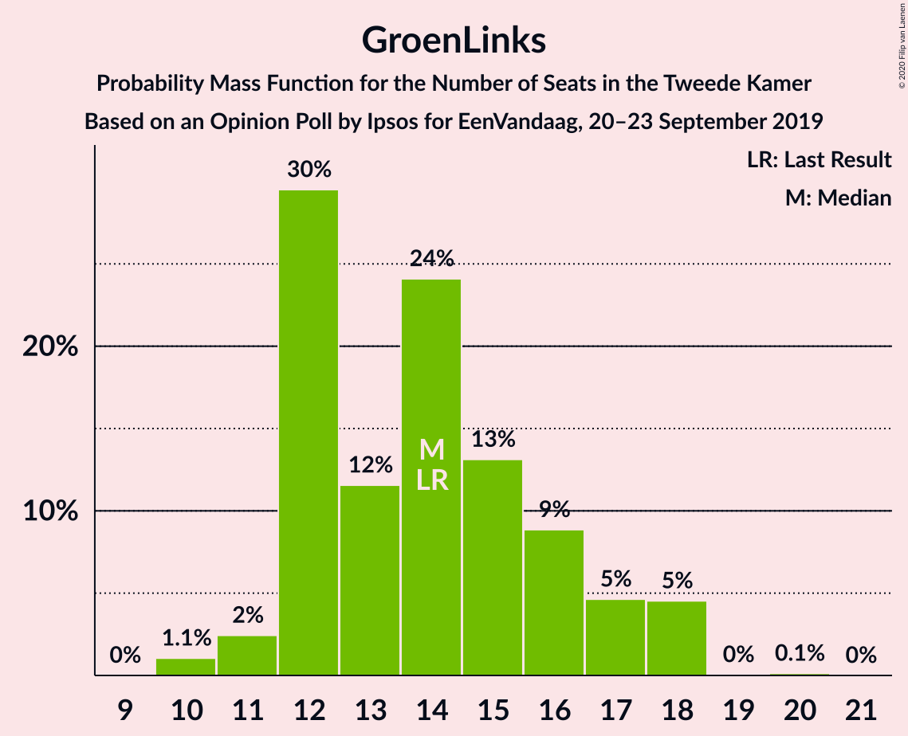

| Number of Seats | Probability | Accumulated | Special Marks |
|:---------------:|:-----------:|:-----------:|:-------------:|
| 10 | 0.1% | 100% |  |
| 11 | 27% | 99.9% |  |
| 12 | 2% | 73% |  |
| 13 | 20% | 71% |  |
| 14 | 32% | 51% | Last Result, Median |
| 15 | 9% | 19% |  |
| 16 | 2% | 10% |  |
| 17 | 6% | 8% |  |
| 18 | 2% | 2% |  |
| 19 | 0% | 0% |  |

### Partij van de Arbeid

*For a full overview of the results for this party, see the [Partij van de Arbeid](party-partijvandearbeid.html) page.*

| Number of Seats | Probability | Accumulated | Special Marks |
|:---------------:|:-----------:|:-----------:|:-------------:|
| 9 | 2% | 100% | Last Result |
| 10 | 3% | 98% |  |
| 11 | 2% | 96% |  |
| 12 | 30% | 94% |  |
| 13 | 12% | 64% |  |
| 14 | 39% | 52% | Median |
| 15 | 5% | 13% |  |
| 16 | 7% | 9% |  |
| 17 | 2% | 2% |  |
| 18 | 0.1% | 0.1% |  |
| 19 | 0% | 0% |  |

### Forum voor Democratie

*For a full overview of the results for this party, see the [Forum voor Democratie](party-forumvoordemocratie.html) page.*

| Number of Seats | Probability | Accumulated | Special Marks |
|:---------------:|:-----------:|:-----------:|:-------------:|
| 2 | 0% | 100% | Last Result |
| 3 | 0% | 100% |  |
| 4 | 0% | 100% |  |
| 5 | 0% | 100% |  |
| 6 | 0% | 100% |  |
| 7 | 10% | 100% |  |
| 8 | 1.0% | 90% |  |
| 9 | 11% | 89% |  |
| 10 | 46% | 78% | Median |
| 11 | 9% | 32% |  |
| 12 | 18% | 23% |  |
| 13 | 4% | 4% |  |
| 14 | 0.3% | 0.5% |  |
| 15 | 0.2% | 0.3% |  |
| 16 | 0% | 0% |  |

### Socialistische Partij

*For a full overview of the results for this party, see the [Socialistische Partij](party-socialistischepartij.html) page.*

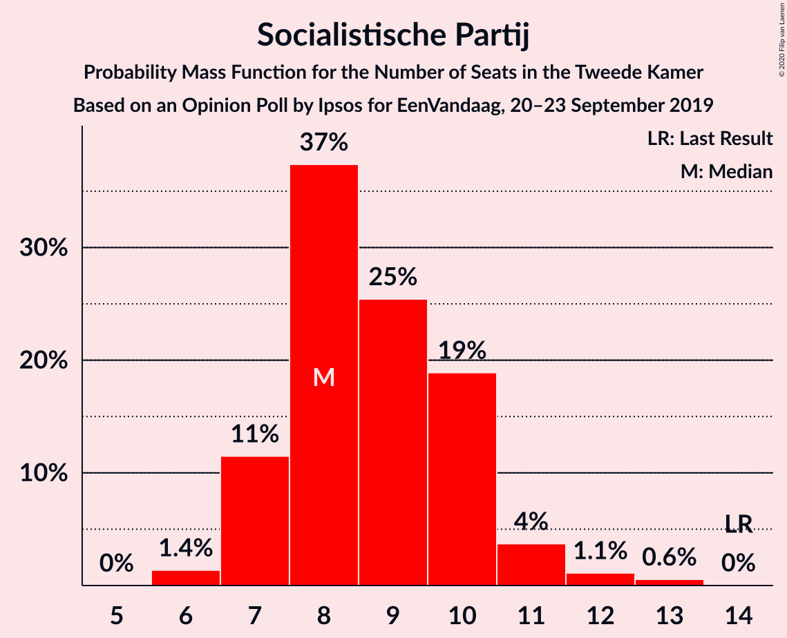

| Number of Seats | Probability | Accumulated | Special Marks |
|:---------------:|:-----------:|:-----------:|:-------------:|
| 6 | 0.8% | 100% |  |
| 7 | 42% | 99.1% |  |
| 8 | 4% | 57% |  |
| 9 | 40% | 54% | Median |
| 10 | 4% | 14% |  |
| 11 | 8% | 10% |  |
| 12 | 1.2% | 1.5% |  |
| 13 | 0.3% | 0.3% |  |
| 14 | 0% | 0% | Last Result |

### ChristenUnie

*For a full overview of the results for this party, see the [ChristenUnie](party-christenunie.html) page.*

| Number of Seats | Probability | Accumulated | Special Marks |
|:---------------:|:-----------:|:-----------:|:-------------:|
| 5 | 1.0% | 100% | Last Result |
| 6 | 14% | 99.0% |  |
| 7 | 19% | 85% |  |
| 8 | 61% | 65% | Median |
| 9 | 4% | 4% |  |
| 10 | 0.1% | 0.6% |  |
| 11 | 0.4% | 0.4% |  |
| 12 | 0% | 0% |  |

### Partij voor de Dieren

*For a full overview of the results for this party, see the [Partij voor de Dieren](party-partijvoordedieren.html) page.*

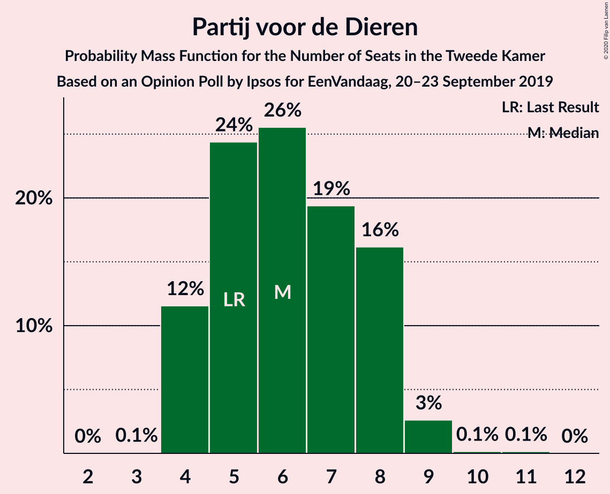

| Number of Seats | Probability | Accumulated | Special Marks |
|:---------------:|:-----------:|:-----------:|:-------------:|
| 4 | 10% | 100% |  |
| 5 | 29% | 90% | Last Result |
| 6 | 21% | 61% | Median |
| 7 | 34% | 40% |  |
| 8 | 3% | 6% |  |
| 9 | 2% | 3% |  |
| 10 | 1.4% | 1.4% |  |
| 11 | 0% | 0% |  |

### 50Plus

*For a full overview of the results for this party, see the [50Plus](party-50plus.html) page.*

| Number of Seats | Probability | Accumulated | Special Marks |
|:---------------:|:-----------:|:-----------:|:-------------:|
| 3 | 1.4% | 100% |  |
| 4 | 31% | 98.6% | Last Result |
| 5 | 9% | 68% |  |
| 6 | 36% | 58% | Median |
| 7 | 22% | 23% |  |
| 8 | 0.1% | 0.2% |  |
| 9 | 0% | 0% |  |

### Staatkundig Gereformeerde Partij

*For a full overview of the results for this party, see the [Staatkundig Gereformeerde Partij](party-staatkundiggereformeerdepartij.html) page.*

| Number of Seats | Probability | Accumulated | Special Marks |
|:---------------:|:-----------:|:-----------:|:-------------:|
| 1 | 0.6% | 100% |  |
| 2 | 18% | 99.3% |  |
| 3 | 29% | 81% | Last Result |
| 4 | 35% | 52% | Median |
| 5 | 17% | 17% |  |
| 6 | 0% | 0% |  |

### DENK

*For a full overview of the results for this party, see the [DENK](party-denk.html) page.*

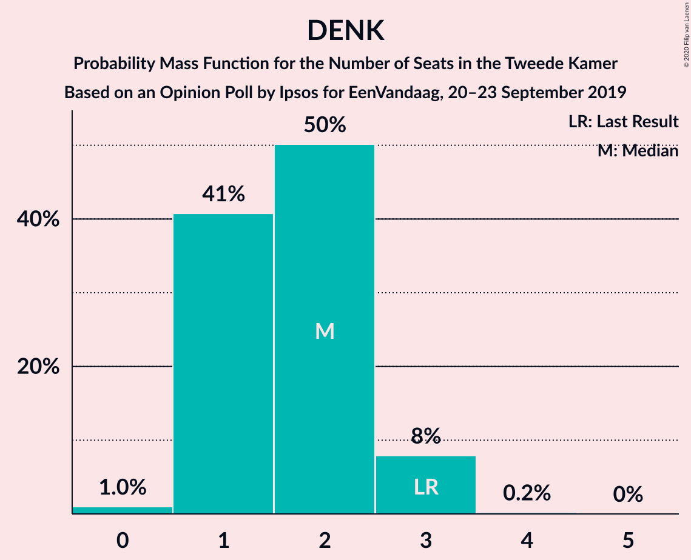

| Number of Seats | Probability | Accumulated | Special Marks |
|:---------------:|:-----------:|:-----------:|:-------------:|
| 0 | 1.2% | 100% |  |
| 1 | 62% | 98.8% | Median |
| 2 | 17% | 36% |  |
| 3 | 19% | 19% | Last Result |
| 4 | 0% | 0.1% |  |
| 5 | 0% | 0% |  |

## Coalitions

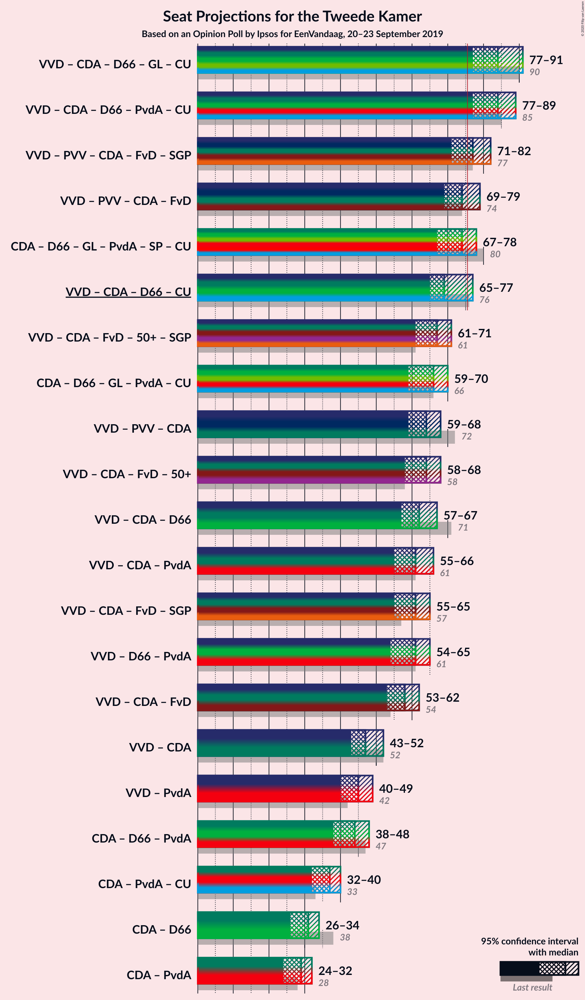

### Confidence Intervals

| Coalition | Last Result | Median | Majority? | 80% Confidence Interval | 90% Confidence Interval | 95% Confidence Interval | 99% Confidence Interval |
|:---------:|:-----------:|:------:|:---------:|:-----------------------:|:-----------------------:|:-----------------------:|:-----------------------:|
| Volkspartij voor Vrijheid en Democratie – Christen-Democratisch Appèl – Democraten 66 – GroenLinks – ChristenUnie | 90 | 84 | 96% | 80–87 | 79–87 | 75–89 | 74–90 |
| Volkspartij voor Vrijheid en Democratie – Christen-Democratisch Appèl – Democraten 66 – Partij van de Arbeid – ChristenUnie | 85 | 84 | 99.4% | 79–87 | 78–87 | 76–87 | 75–87 |
| Volkspartij voor Vrijheid en Democratie – Partij voor de Vrijheid – Christen-Democratisch Appèl – Forum voor Democratie – Staatkundig Gereformeerde Partij | 77 | 79 | 80% | 72–81 | 72–81 | 72–82 | 71–82 |
| Volkspartij voor Vrijheid en Democratie – Partij voor de Vrijheid – Christen-Democratisch Appèl – Forum voor Democratie | 74 | 76 | 61% | 69–77 | 68–78 | 68–79 | 68–79 |
| Christen-Democratisch Appèl – Democraten 66 – GroenLinks – Partij van de Arbeid – Socialistische Partij – ChristenUnie | 80 | 73 | 13% | 69–76 | 69–77 | 65–77 | 65–77 |
| Volkspartij voor Vrijheid en Democratie – Christen-Democratisch Appèl – Democraten 66 – ChristenUnie | 76 | 71 | 0.1% | 65–73 | 64–73 | 63–74 | 61–75 |
| Volkspartij voor Vrijheid en Democratie – Christen-Democratisch Appèl – Forum voor Democratie – 50Plus – Staatkundig Gereformeerde Partij | 61 | 66 | 0% | 61–73 | 61–73 | 60–73 | 59–73 |
| Volkspartij voor Vrijheid en Democratie – Partij voor de Vrijheid – Christen-Democratisch Appèl | 72 | 66 | 0% | 59–67 | 58–68 | 56–69 | 56–69 |
| Christen-Democratisch Appèl – Democraten 66 – GroenLinks – Partij van de Arbeid – ChristenUnie | 66 | 65 | 0% | 60–68 | 59–68 | 58–68 | 58–68 |
| Volkspartij voor Vrijheid en Democratie – Christen-Democratisch Appèl – Forum voor Democratie – 50Plus | 58 | 62 | 0% | 58–68 | 58–68 | 57–68 | 56–70 |
| Volkspartij voor Vrijheid en Democratie – Christen-Democratisch Appèl – Democraten 66 | 71 | 64 | 0% | 58–65 | 57–65 | 55–67 | 55–67 |
| Volkspartij voor Vrijheid en Democratie – Christen-Democratisch Appèl – Forum voor Democratie – Staatkundig Gereformeerde Partij | 57 | 62 | 0% | 56–67 | 56–67 | 55–67 | 55–67 |
| Volkspartij voor Vrijheid en Democratie – Christen-Democratisch Appèl – Partij van de Arbeid | 61 | 62 | 0% | 56–64 | 56–64 | 53–64 | 53–66 |
| Volkspartij voor Vrijheid en Democratie – Democraten 66 – Partij van de Arbeid | 61 | 61 | 0% | 59–63 | 58–63 | 54–63 | 52–65 |
| Volkspartij voor Vrijheid en Democratie – Christen-Democratisch Appèl – Forum voor Democratie | 54 | 58 | 0% | 53–62 | 53–62 | 52–62 | 52–64 |
| Volkspartij voor Vrijheid en Democratie – Christen-Democratisch Appèl | 52 | 48 | 0% | 42–52 | 41–52 | 41–52 | 41–53 |
| Volkspartij voor Vrijheid en Democratie – Partij van de Arbeid | 42 | 45 | 0% | 42–48 | 41–49 | 40–49 | 38–49 |
| Christen-Democratisch Appèl – Democraten 66 – Partij van de Arbeid | 47 | 44 | 0% | 39–48 | 39–48 | 38–48 | 38–48 |
| Christen-Democratisch Appèl – Partij van de Arbeid – ChristenUnie | 33 | 36 | 0% | 33–39 | 31–39 | 31–39 | 30–39 |
| Christen-Democratisch Appèl – Democraten 66 | 38 | 29 | 0% | 26–34 | 25–34 | 25–34 | 25–34 |
| Christen-Democratisch Appèl – Partij van de Arbeid | 28 | 28 | 0% | 26–31 | 25–31 | 25–31 | 23–33 |

### Volkspartij voor Vrijheid en Democratie – Christen-Democratisch Appèl – Democraten 66 – GroenLinks – ChristenUnie

| Number of Seats | Probability | Accumulated | Special Marks |
|:---------------:|:-----------:|:-----------:|:-------------:|
| 74 | 2% | 100% |  |
| 75 | 2% | 98% |  |
| 76 | 0.1% | 96% | Majority |
| 77 | 0.2% | 96% |  |
| 78 | 0.1% | 96% |  |
| 79 | 6% | 96% |  |
| 80 | 0.7% | 90% |  |
| 81 | 5% | 89% |  |
| 82 | 6% | 84% |  |
| 83 | 14% | 78% |  |
| 84 | 35% | 64% | Median |
| 85 | 7% | 29% |  |
| 86 | 1.2% | 22% |  |
| 87 | 18% | 21% |  |
| 88 | 0% | 3% |  |
| 89 | 0.3% | 3% |  |
| 90 | 2% | 2% | Last Result |
| 91 | 0.2% | 0.2% |  |
| 92 | 0% | 0% |  |

### Volkspartij voor Vrijheid en Democratie – Christen-Democratisch Appèl – Democraten 66 – Partij van de Arbeid – ChristenUnie

| Number of Seats | Probability | Accumulated | Special Marks |
|:---------------:|:-----------:|:-----------:|:-------------:|
| 73 | 0.4% | 100% |  |
| 74 | 0% | 99.6% |  |
| 75 | 0.2% | 99.6% |  |
| 76 | 2% | 99.4% | Majority |
| 77 | 0.3% | 97% |  |
| 78 | 3% | 97% |  |
| 79 | 8% | 94% |  |
| 80 | 0.5% | 85% |  |
| 81 | 10% | 85% |  |
| 82 | 6% | 75% |  |
| 83 | 2% | 69% |  |
| 84 | 20% | 67% | Median |
| 85 | 22% | 48% | Last Result |
| 86 | 2% | 25% |  |
| 87 | 23% | 23% |  |
| 88 | 0% | 0.1% |  |
| 89 | 0% | 0% |  |

### Volkspartij voor Vrijheid en Democratie – Partij voor de Vrijheid – Christen-Democratisch Appèl – Forum voor Democratie – Staatkundig Gereformeerde Partij

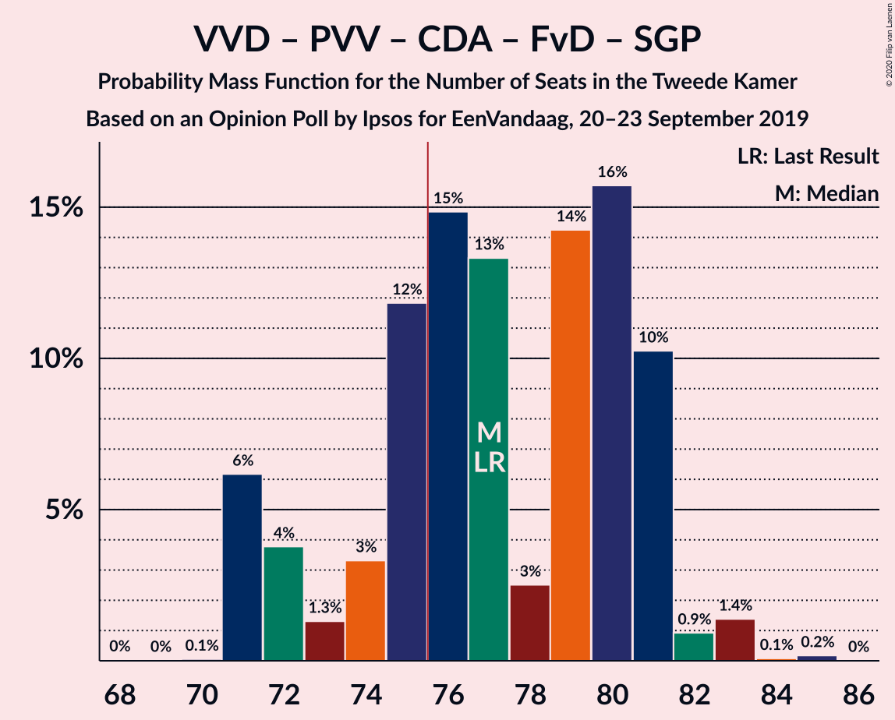

| Number of Seats | Probability | Accumulated | Special Marks |
|:---------------:|:-----------:|:-----------:|:-------------:|
| 69 | 0% | 100% |  |
| 70 | 0% | 99.9% |  |
| 71 | 1.0% | 99.9% |  |
| 72 | 10% | 98.9% |  |
| 73 | 2% | 88% |  |
| 74 | 0.1% | 86% |  |
| 75 | 5% | 86% |  |
| 76 | 9% | 80% | Majority |
| 77 | 11% | 72% | Last Result |
| 78 | 0.5% | 61% | Median |
| 79 | 12% | 61% |  |
| 80 | 28% | 49% |  |
| 81 | 17% | 21% |  |
| 82 | 4% | 4% |  |
| 83 | 0% | 0.1% |  |
| 84 | 0% | 0% |  |

### Volkspartij voor Vrijheid en Democratie – Partij voor de Vrijheid – Christen-Democratisch Appèl – Forum voor Democratie

| Number of Seats | Probability | Accumulated | Special Marks |
|:---------------:|:-----------:|:-----------:|:-------------:|
| 67 | 0% | 100% |  |
| 68 | 7% | 99.9% |  |
| 69 | 7% | 93% |  |
| 70 | 0.1% | 86% |  |
| 71 | 0.5% | 86% |  |
| 72 | 5% | 86% |  |
| 73 | 7% | 81% |  |
| 74 | 12% | 74% | Last Result, Median |
| 75 | 0.8% | 62% |  |
| 76 | 43% | 61% | Majority |
| 77 | 12% | 18% |  |
| 78 | 2% | 6% |  |
| 79 | 4% | 4% |  |
| 80 | 0.3% | 0.3% |  |
| 81 | 0% | 0% |  |

### Christen-Democratisch Appèl – Democraten 66 – GroenLinks – Partij van de Arbeid – Socialistische Partij – ChristenUnie

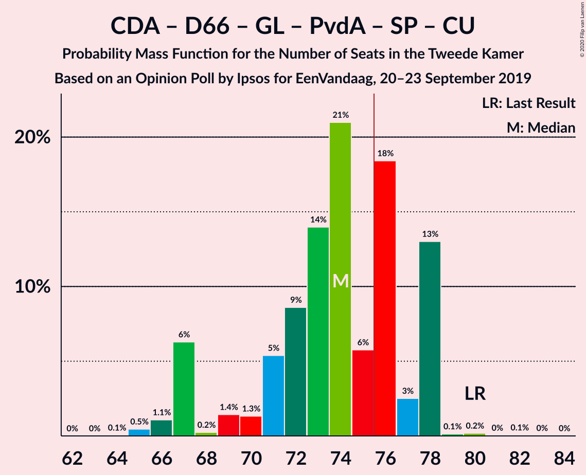

| Number of Seats | Probability | Accumulated | Special Marks |
|:---------------:|:-----------:|:-----------:|:-------------:|
| 65 | 4% | 100% |  |
| 66 | 0% | 96% |  |
| 67 | 0.1% | 96% |  |
| 68 | 0.2% | 96% |  |
| 69 | 10% | 96% |  |
| 70 | 7% | 86% |  |
| 71 | 3% | 79% |  |
| 72 | 21% | 76% |  |
| 73 | 5% | 55% |  |
| 74 | 25% | 50% |  |
| 75 | 12% | 25% |  |
| 76 | 6% | 13% | Median, Majority |
| 77 | 7% | 7% |  |
| 78 | 0.2% | 0.5% |  |
| 79 | 0.1% | 0.2% |  |
| 80 | 0% | 0.1% | Last Result |
| 81 | 0% | 0.1% |  |
| 82 | 0% | 0.1% |  |
| 83 | 0% | 0.1% |  |
| 84 | 0.1% | 0.1% |  |
| 85 | 0% | 0% |  |

### Volkspartij voor Vrijheid en Democratie – Christen-Democratisch Appèl – Democraten 66 – ChristenUnie

| Number of Seats | Probability | Accumulated | Special Marks |
|:---------------:|:-----------:|:-----------:|:-------------:|
| 60 | 0.1% | 100% |  |
| 61 | 2% | 99.9% |  |
| 62 | 0.1% | 98% |  |
| 63 | 3% | 98% |  |
| 64 | 2% | 95% |  |
| 65 | 10% | 93% |  |
| 66 | 1.1% | 84% |  |
| 67 | 0.6% | 82% |  |
| 68 | 1.0% | 82% |  |
| 69 | 5% | 81% |  |
| 70 | 21% | 76% | Median |
| 71 | 11% | 55% |  |
| 72 | 1.3% | 44% |  |
| 73 | 39% | 43% |  |
| 74 | 1.3% | 4% |  |
| 75 | 2% | 2% |  |
| 76 | 0% | 0.1% | Last Result, Majority |
| 77 | 0% | 0% |  |

### Volkspartij voor Vrijheid en Democratie – Christen-Democratisch Appèl – Forum voor Democratie – 50Plus – Staatkundig Gereformeerde Partij

| Number of Seats | Probability | Accumulated | Special Marks |
|:---------------:|:-----------:|:-----------:|:-------------:|
| 59 | 1.4% | 100% |  |
| 60 | 2% | 98.6% |  |
| 61 | 8% | 97% | Last Result |
| 62 | 3% | 89% |  |
| 63 | 2% | 86% |  |
| 64 | 20% | 85% |  |
| 65 | 1.1% | 65% |  |
| 66 | 22% | 64% |  |
| 67 | 2% | 42% | Median |
| 68 | 0.4% | 40% |  |
| 69 | 11% | 40% |  |
| 70 | 10% | 29% |  |
| 71 | 0.1% | 19% |  |
| 72 | 1.5% | 18% |  |
| 73 | 17% | 17% |  |
| 74 | 0.2% | 0.2% |  |
| 75 | 0% | 0% |  |

### Volkspartij voor Vrijheid en Democratie – Partij voor de Vrijheid – Christen-Democratisch Appèl

| Number of Seats | Probability | Accumulated | Special Marks |
|:---------------:|:-----------:|:-----------:|:-------------:|
| 56 | 3% | 100% |  |
| 57 | 0.2% | 97% |  |
| 58 | 4% | 97% |  |
| 59 | 7% | 93% |  |
| 60 | 2% | 86% |  |
| 61 | 7% | 84% |  |
| 62 | 1.4% | 77% |  |
| 63 | 3% | 76% |  |
| 64 | 2% | 72% | Median |
| 65 | 11% | 70% |  |
| 66 | 40% | 59% |  |
| 67 | 14% | 19% |  |
| 68 | 0.2% | 5% |  |
| 69 | 5% | 5% |  |
| 70 | 0% | 0.1% |  |
| 71 | 0% | 0% |  |
| 72 | 0% | 0% | Last Result |

### Christen-Democratisch Appèl – Democraten 66 – GroenLinks – Partij van de Arbeid – ChristenUnie

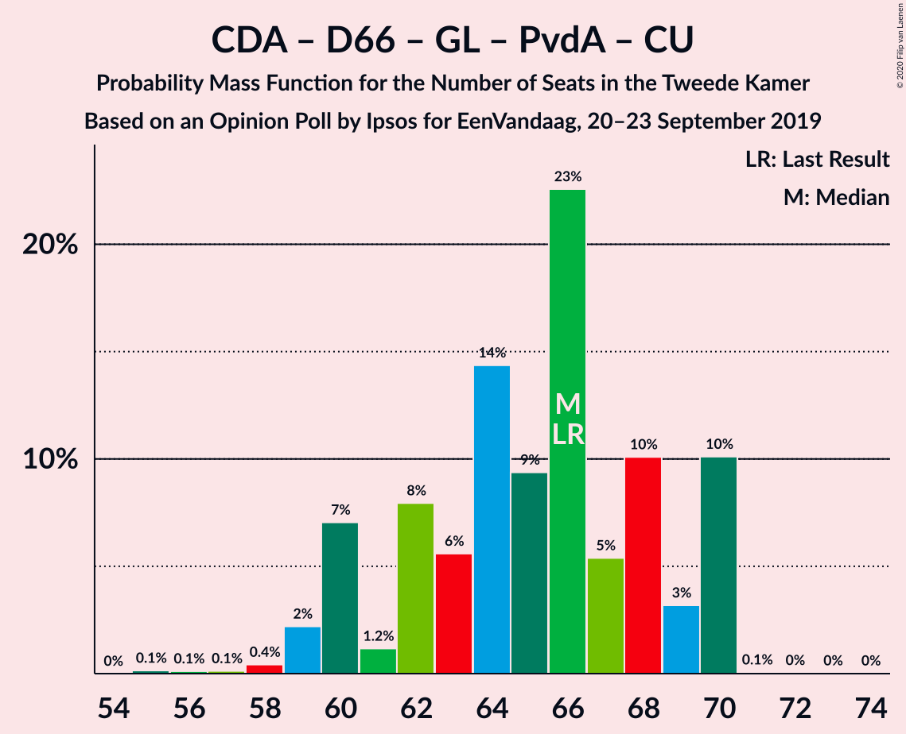

| Number of Seats | Probability | Accumulated | Special Marks |
|:---------------:|:-----------:|:-----------:|:-------------:|
| 57 | 0% | 100% |  |
| 58 | 4% | 99.9% |  |
| 59 | 5% | 96% |  |
| 60 | 1.0% | 91% |  |
| 61 | 1.4% | 90% |  |
| 62 | 14% | 89% |  |
| 63 | 19% | 75% |  |
| 64 | 0.7% | 56% |  |
| 65 | 8% | 55% |  |
| 66 | 14% | 47% | Last Result |
| 67 | 23% | 33% | Median |
| 68 | 10% | 10% |  |
| 69 | 0.1% | 0.3% |  |
| 70 | 0% | 0.2% |  |
| 71 | 0% | 0.1% |  |
| 72 | 0% | 0.1% |  |
| 73 | 0.1% | 0.1% |  |
| 74 | 0% | 0% |  |

### Volkspartij voor Vrijheid en Democratie – Christen-Democratisch Appèl – Forum voor Democratie – 50Plus

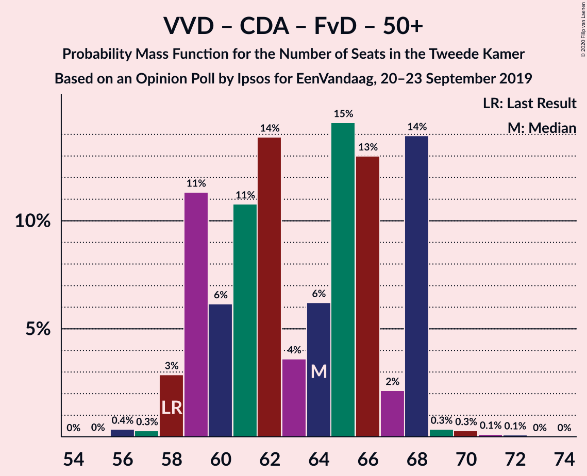

| Number of Seats | Probability | Accumulated | Special Marks |
|:---------------:|:-----------:|:-----------:|:-------------:|
| 56 | 1.4% | 100% |  |
| 57 | 2% | 98.6% |  |
| 58 | 9% | 97% | Last Result |
| 59 | 2% | 88% |  |
| 60 | 10% | 86% |  |
| 61 | 12% | 76% |  |
| 62 | 22% | 64% |  |
| 63 | 0.4% | 42% | Median |
| 64 | 0.1% | 42% |  |
| 65 | 2% | 42% |  |
| 66 | 9% | 40% |  |
| 67 | 2% | 31% |  |
| 68 | 27% | 29% |  |
| 69 | 0.4% | 2% |  |
| 70 | 1.4% | 1.4% |  |
| 71 | 0% | 0% |  |

### Volkspartij voor Vrijheid en Democratie – Christen-Democratisch Appèl – Democraten 66

| Number of Seats | Probability | Accumulated | Special Marks |
|:---------------:|:-----------:|:-----------:|:-------------:|
| 52 | 0.2% | 100% |  |
| 53 | 0% | 99.8% |  |
| 54 | 0% | 99.7% |  |
| 55 | 4% | 99.7% |  |
| 56 | 0.5% | 96% |  |
| 57 | 2% | 96% |  |
| 58 | 5% | 93% |  |
| 59 | 6% | 88% |  |
| 60 | 1.1% | 82% |  |
| 61 | 0.9% | 81% |  |
| 62 | 20% | 80% | Median |
| 63 | 7% | 60% |  |
| 64 | 10% | 53% |  |
| 65 | 39% | 43% |  |
| 66 | 0.2% | 4% |  |
| 67 | 4% | 4% |  |
| 68 | 0.3% | 0.4% |  |
| 69 | 0% | 0% |  |
| 70 | 0% | 0% |  |
| 71 | 0% | 0% | Last Result |

### Volkspartij voor Vrijheid en Democratie – Christen-Democratisch Appèl – Forum voor Democratie – Staatkundig Gereformeerde Partij

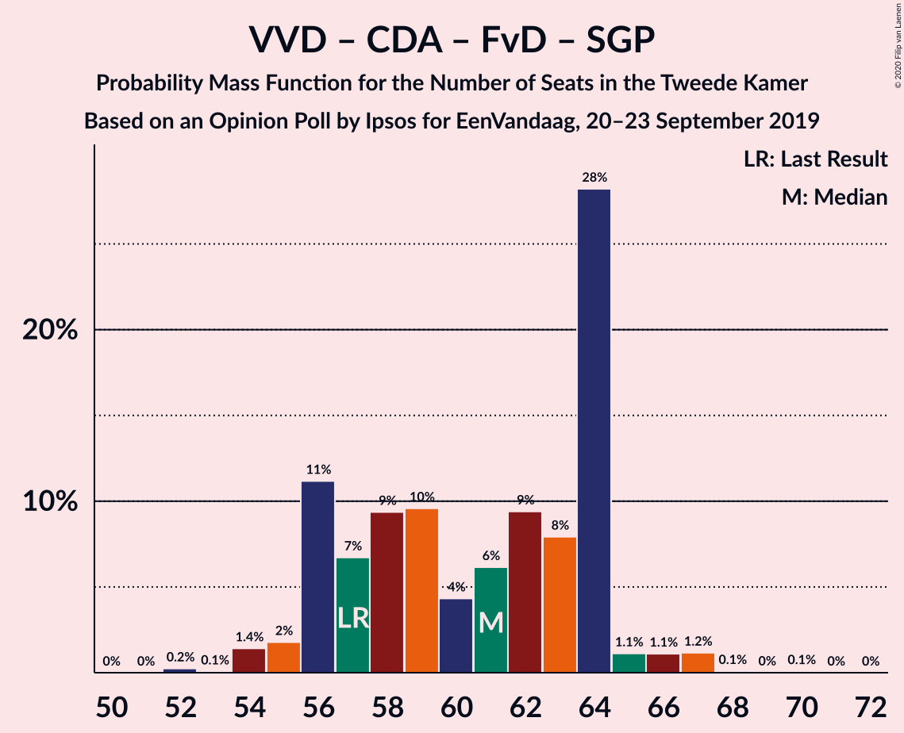

| Number of Seats | Probability | Accumulated | Special Marks |
|:---------------:|:-----------:|:-----------:|:-------------:|
| 54 | 0.1% | 100% |  |
| 55 | 3% | 99.8% |  |
| 56 | 7% | 97% |  |
| 57 | 6% | 90% | Last Result |
| 58 | 14% | 83% |  |
| 59 | 2% | 70% |  |
| 60 | 4% | 68% |  |
| 61 | 2% | 64% | Median |
| 62 | 27% | 62% |  |
| 63 | 16% | 35% |  |
| 64 | 0.2% | 19% |  |
| 65 | 2% | 19% |  |
| 66 | 0.3% | 17% |  |
| 67 | 17% | 17% |  |
| 68 | 0.2% | 0.2% |  |
| 69 | 0% | 0% |  |

### Volkspartij voor Vrijheid en Democratie – Christen-Democratisch Appèl – Partij van de Arbeid

| Number of Seats | Probability | Accumulated | Special Marks |
|:---------------:|:-----------:|:-----------:|:-------------:|
| 52 | 0.4% | 100% |  |
| 53 | 2% | 99.6% |  |
| 54 | 0.1% | 97% |  |
| 55 | 0.3% | 97% |  |
| 56 | 9% | 97% |  |
| 57 | 4% | 88% |  |
| 58 | 6% | 84% |  |
| 59 | 0.7% | 78% |  |
| 60 | 2% | 78% |  |
| 61 | 6% | 75% | Last Result, Median |
| 62 | 51% | 69% |  |
| 63 | 0.5% | 18% |  |
| 64 | 17% | 18% |  |
| 65 | 0.1% | 0.9% |  |
| 66 | 0.3% | 0.8% |  |
| 67 | 0.5% | 0.5% |  |
| 68 | 0% | 0% |  |

### Volkspartij voor Vrijheid en Democratie – Democraten 66 – Partij van de Arbeid

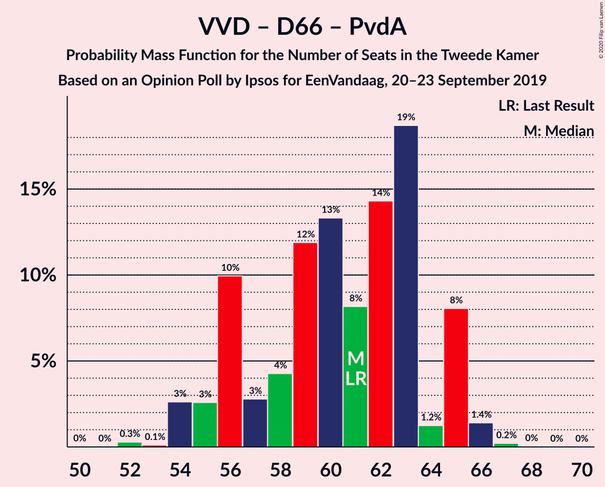

| Number of Seats | Probability | Accumulated | Special Marks |
|:---------------:|:-----------:|:-----------:|:-------------:|
| 50 | 0.4% | 100% |  |
| 51 | 0% | 99.6% |  |
| 52 | 0.2% | 99.6% |  |
| 53 | 0% | 99.5% |  |
| 54 | 2% | 99.4% |  |
| 55 | 2% | 97% |  |
| 56 | 0.1% | 96% |  |
| 57 | 0.5% | 96% |  |
| 58 | 0.8% | 95% |  |
| 59 | 16% | 94% |  |
| 60 | 9% | 78% | Median |
| 61 | 20% | 70% | Last Result |
| 62 | 33% | 49% |  |
| 63 | 14% | 16% |  |
| 64 | 0.4% | 2% |  |
| 65 | 1.3% | 2% |  |
| 66 | 0.3% | 0.4% |  |
| 67 | 0.1% | 0.1% |  |
| 68 | 0% | 0% |  |

### Volkspartij voor Vrijheid en Democratie – Christen-Democratisch Appèl – Forum voor Democratie

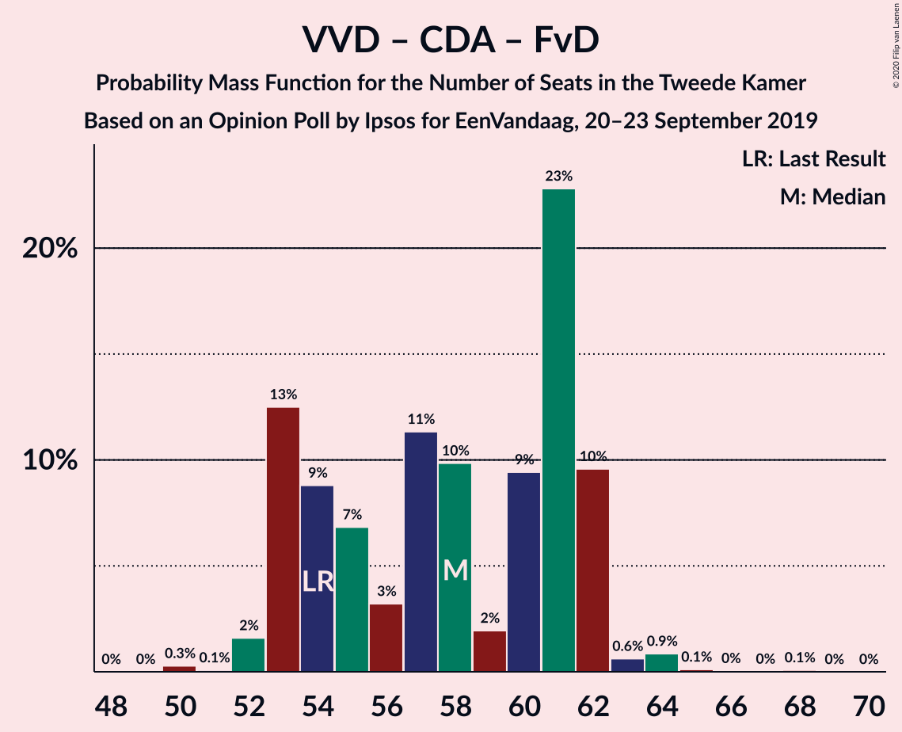

| Number of Seats | Probability | Accumulated | Special Marks |
|:---------------:|:-----------:|:-----------:|:-------------:|
| 51 | 0.1% | 100% |  |
| 52 | 3% | 99.9% |  |
| 53 | 13% | 97% |  |
| 54 | 3% | 84% | Last Result |
| 55 | 11% | 81% |  |
| 56 | 5% | 70% |  |
| 57 | 1.4% | 65% | Median |
| 58 | 22% | 64% |  |
| 59 | 6% | 42% |  |
| 60 | 4% | 35% |  |
| 61 | 12% | 31% |  |
| 62 | 17% | 19% |  |
| 63 | 2% | 2% |  |
| 64 | 0.7% | 0.7% |  |
| 65 | 0% | 0.1% |  |
| 66 | 0% | 0% |  |

### Volkspartij voor Vrijheid en Democratie – Christen-Democratisch Appèl

| Number of Seats | Probability | Accumulated | Special Marks |
|:---------------:|:-----------:|:-----------:|:-------------:|
| 40 | 0.3% | 100% |  |
| 41 | 7% | 99.6% |  |
| 42 | 5% | 93% |  |
| 43 | 0.2% | 88% |  |
| 44 | 6% | 88% |  |
| 45 | 2% | 82% |  |
| 46 | 1.5% | 80% |  |
| 47 | 9% | 78% | Median |
| 48 | 34% | 69% |  |
| 49 | 10% | 35% |  |
| 50 | 7% | 25% |  |
| 51 | 0.2% | 18% |  |
| 52 | 17% | 18% | Last Result |
| 53 | 0.6% | 0.6% |  |
| 54 | 0% | 0% |  |

### Volkspartij voor Vrijheid en Democratie – Partij van de Arbeid

| Number of Seats | Probability | Accumulated | Special Marks |
|:---------------:|:-----------:|:-----------:|:-------------:|
| 36 | 0.4% | 100% |  |
| 37 | 0.1% | 99.6% |  |
| 38 | 0.1% | 99.5% |  |
| 39 | 0.1% | 99.4% |  |
| 40 | 3% | 99.3% |  |
| 41 | 6% | 96% |  |
| 42 | 0.7% | 90% | Last Result |
| 43 | 1.2% | 89% |  |
| 44 | 5% | 88% |  |
| 45 | 34% | 83% | Median |
| 46 | 7% | 49% |  |
| 47 | 2% | 43% |  |
| 48 | 35% | 41% |  |
| 49 | 5% | 6% |  |
| 50 | 0% | 0.3% |  |
| 51 | 0.3% | 0.3% |  |
| 52 | 0% | 0% |  |

### Christen-Democratisch Appèl – Democraten 66 – Partij van de Arbeid

| Number of Seats | Probability | Accumulated | Special Marks |
|:---------------:|:-----------:|:-----------:|:-------------:|
| 37 | 0.2% | 100% |  |
| 38 | 4% | 99.7% |  |
| 39 | 7% | 96% |  |
| 40 | 1.1% | 89% |  |
| 41 | 19% | 87% |  |
| 42 | 15% | 68% |  |
| 43 | 1.2% | 53% |  |
| 44 | 8% | 52% |  |
| 45 | 20% | 43% | Median |
| 46 | 1.0% | 24% |  |
| 47 | 0.8% | 23% | Last Result |
| 48 | 22% | 22% |  |
| 49 | 0% | 0.1% |  |
| 50 | 0% | 0.1% |  |
| 51 | 0% | 0% |  |

### Christen-Democratisch Appèl – Partij van de Arbeid – ChristenUnie

| Number of Seats | Probability | Accumulated | Special Marks |
|:---------------:|:-----------:|:-----------:|:-------------:|
| 29 | 0.3% | 100% |  |
| 30 | 1.0% | 99.7% |  |
| 31 | 4% | 98.7% |  |
| 32 | 2% | 95% |  |
| 33 | 9% | 93% | Last Result |
| 34 | 14% | 84% |  |
| 35 | 15% | 70% |  |
| 36 | 17% | 56% |  |
| 37 | 4% | 38% |  |
| 38 | 2% | 34% | Median |
| 39 | 32% | 32% |  |
| 40 | 0.1% | 0.2% |  |
| 41 | 0.1% | 0.1% |  |
| 42 | 0% | 0% |  |

### Christen-Democratisch Appèl – Democraten 66

| Number of Seats | Probability | Accumulated | Special Marks |
|:---------------:|:-----------:|:-----------:|:-------------:|
| 24 | 0.3% | 100% |  |
| 25 | 7% | 99.7% |  |
| 26 | 4% | 93% |  |
| 27 | 2% | 89% |  |
| 28 | 6% | 87% |  |
| 29 | 34% | 81% |  |
| 30 | 3% | 47% |  |
| 31 | 11% | 44% | Median |
| 32 | 4% | 33% |  |
| 33 | 7% | 30% |  |
| 34 | 22% | 22% |  |
| 35 | 0.2% | 0.3% |  |
| 36 | 0% | 0.1% |  |
| 37 | 0.1% | 0.1% |  |
| 38 | 0% | 0% | Last Result |

### Christen-Democratisch Appèl – Partij van de Arbeid

| Number of Seats | Probability | Accumulated | Special Marks |
|:---------------:|:-----------:|:-----------:|:-------------:|
| 22 | 0.3% | 100% |  |
| 23 | 0.8% | 99.7% |  |
| 24 | 0.6% | 98.9% |  |
| 25 | 8% | 98% |  |
| 26 | 4% | 90% |  |
| 27 | 21% | 87% |  |
| 28 | 25% | 66% | Last Result |
| 29 | 7% | 41% |  |
| 30 | 0.6% | 33% | Median |
| 31 | 32% | 33% |  |
| 32 | 0.1% | 0.7% |  |
| 33 | 0.5% | 0.5% |  |
| 34 | 0% | 0% |  |

## Technical Information

### Opinion Poll

+ **Polling firm:** Ipsos
+ **Commissioner(s):** EenVandaag
+ **Fieldwork period:** 20–23 September 2019

### Calculations

+ **Sample size:** 1000
+ **Simulations done:** 131,072
+ **Error estimate:** 1.80%

