# Opinion Poll by Ipsos for EenVandaag, 20–23 September 2019

<a href="#voting-intentions">Voting Intentions</a> | <a href="#seats">Seats</a> | <a href="#coalitions">Coalitions</a> | <a href="#technical-information">Technical Information</a>

## Voting Intentions

### Confidence Intervals

| Party | Last Result | Poll Result | 80% Confidence Interval | 90% Confidence Interval | 95% Confidence Interval | 99% Confidence Interval |
|:-----:|:-----------:|:-----------:|:-----------------------:|:-----------------------:|:-----------------------:|:-----------------------:|
| Volkspartij voor Vrijheid en Democratie | 21.3% | 21.1% | 19.5–22.8% |19.1–23.3% |18.7–23.7% |17.9–24.6% |
| Partij voor de Vrijheid | 13.1% | 10.9% | 9.7–12.3% |9.4–12.7% |9.1–13.0% |8.6–13.7% |
| Christen-Democratisch Appèl | 12.4% | 10.0% | 8.9–11.3% |8.6–11.7% |8.3–12.0% |7.8–12.7% |
| Democraten 66 | 12.2% | 9.9% | 8.8–11.2% |8.5–11.6% |8.2–11.9% |7.7–12.6% |
| GroenLinks | 9.1% | 9.4% | 8.3–10.7% |8.0–11.1% |7.7–11.4% |7.2–12.0% |
| Partij van de Arbeid | 5.7% | 8.4% | 7.4–9.6% |7.1–10.0% |6.8–10.3% |6.4–10.9% |
| Forum voor Democratie | 1.8% | 7.1% | 6.2–8.3% |5.9–8.6% |5.7–8.9% |5.2–9.4% |
| Socialistische Partij | 9.1% | 6.1% | 5.2–7.2% |5.0–7.5% |4.8–7.8% |4.4–8.3% |
| ChristenUnie | 3.4% | 4.9% | 4.1–5.9% |3.9–6.2% |3.7–6.4% |3.4–6.9% |
| Partij voor de Dieren | 3.2% | 4.3% | 3.6–5.2% |3.4–5.5% |3.2–5.7% |2.9–6.2% |
| 50Plus | 3.1% | 3.7% | 3.0–4.6% |2.9–4.8% |2.7–5.1% |2.4–5.5% |
| Staatkundig Gereformeerde Partij | 2.1% | 1.9% | 1.4–2.6% |1.3–2.8% |1.2–3.0% |1.0–3.3% |
| DENK | 2.1% | 1.3% | 0.9–1.9% |0.8–2.1% |0.8–2.2% |0.6–2.5% |

*Note:* The poll result column reflects the actual value used in the calculations. Published results may vary slightly, and in addition be rounded to fewer digits.

## Seats

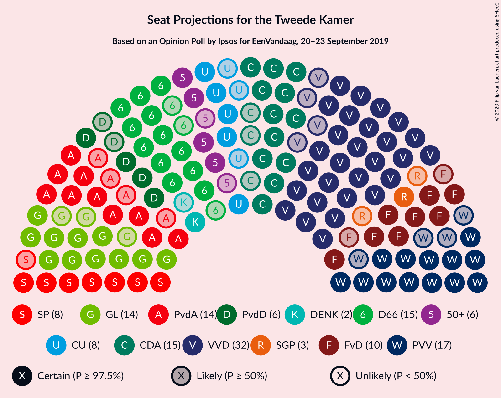

### Confidence Intervals

| Party | Last Result | Median | 80% Confidence Interval | 90% Confidence Interval | 95% Confidence Interval | 99% Confidence Interval |
|:-----:|:-----------:|:------:|:-----------------------:|:-----------------------:|:-----------------------:|:-----------------------:|
| <a href="#volkspartij-voor-vrijheid-en-democratie">Volkspartij voor Vrijheid en Democratie</a> | 33 | 32 | 28–36 |28–36 |28–36 |28–37 |
| <a href="#partij-voor-de-vrijheid">Partij voor de Vrijheid</a> | 20 | 17 | 14–19 |13–19 |13–19 |12–20 |
| <a href="#christen-democratisch-appèl">Christen-Democratisch Appèl</a> | 19 | 16 | 13–17 |12–17 |12–18 |11–19 |
| <a href="#democraten-66">Democraten 66</a> | 19 | 15 | 13–17 |13–17 |12–18 |11–19 |
| <a href="#groenlinks">GroenLinks</a> | 14 | 14 | 12–16 |12–17 |11–18 |10–18 |
| <a href="#partij-van-de-arbeid">Partij van de Arbeid</a> | 9 | 14 | 11–15 |10–16 |10–17 |9–17 |
| <a href="#forum-voor-democratie">Forum voor Democratie</a> | 2 | 10 | 9–12 |9–13 |8–14 |7–15 |
| <a href="#socialistische-partij">Socialistische Partij</a> | 14 | 8 | 7–10 |7–11 |7–11 |6–13 |
| <a href="#christenunie">ChristenUnie</a> | 5 | 8 | 6–9 |6–9 |5–10 |5–10 |
| <a href="#partij-voor-de-dieren">Partij voor de Dieren</a> | 5 | 6 | 4–8 |4–8 |4–9 |4–9 |
| <a href="#50plus">50Plus</a> | 4 | 6 | 4–7 |4–8 |4–8 |4–8 |
| <a href="#staatkundig-gereformeerde-partij">Staatkundig Gereformeerde Partij</a> | 3 | 3 | 2–4 |2–4 |1–4 |1–5 |
| <a href="#denk">DENK</a> | 3 | 2 | 1–2 |1–3 |1–3 |0–3 |

### Volkspartij voor Vrijheid en Democratie

*For a full overview of the results for this party, see the [Volkspartij voor Vrijheid en Democratie](party-volkspartijvoorvrijheidendemocratie.html) page.*

| Number of Seats | Probability | Accumulated | Special Marks |
|:---------------:|:-----------:|:-----------:|:-------------:|
| 26 | 0.3% | 100% |  |
| 27 | 0.1% | 99.6% |  |
| 28 | 12% | 99.5% |  |
| 29 | 5% | 88% |  |
| 30 | 15% | 83% |  |
| 31 | 8% | 69% |  |
| 32 | 15% | 60% | Median |
| 33 | 10% | 46% | Last Result |
| 34 | 12% | 36% |  |
| 35 | 15% | 25% |  |
| 36 | 9% | 10% |  |
| 37 | 1.1% | 1.2% |  |
| 38 | 0% | 0.1% |  |
| 39 | 0% | 0.1% |  |
| 40 | 0.1% | 0.1% |  |
| 41 | 0% | 0% |  |

### Partij voor de Vrijheid

*For a full overview of the results for this party, see the [Partij voor de Vrijheid](party-partijvoordevrijheid.html) page.*

| Number of Seats | Probability | Accumulated | Special Marks |
|:---------------:|:-----------:|:-----------:|:-------------:|
| 12 | 0.5% | 100% |  |
| 13 | 6% | 99.4% |  |
| 14 | 10% | 94% |  |
| 15 | 12% | 84% |  |
| 16 | 21% | 72% |  |
| 17 | 21% | 51% | Median |
| 18 | 9% | 30% |  |
| 19 | 19% | 21% |  |
| 20 | 2% | 2% | Last Result |
| 21 | 0.4% | 0.5% |  |
| 22 | 0.1% | 0.1% |  |
| 23 | 0% | 0% |  |

### Christen-Democratisch Appèl

*For a full overview of the results for this party, see the [Christen-Democratisch Appèl](party-christen-democratischappèl.html) page.*

| Number of Seats | Probability | Accumulated | Special Marks |
|:---------------:|:-----------:|:-----------:|:-------------:|
| 10 | 0.2% | 100% |  |
| 11 | 2% | 99.8% |  |
| 12 | 6% | 98% |  |
| 13 | 3% | 92% |  |
| 14 | 12% | 89% |  |
| 15 | 24% | 77% |  |
| 16 | 15% | 53% | Median |
| 17 | 35% | 38% |  |
| 18 | 2% | 3% |  |
| 19 | 0.7% | 0.8% | Last Result |
| 20 | 0% | 0.1% |  |
| 21 | 0% | 0% |  |

### Democraten 66

*For a full overview of the results for this party, see the [Democraten 66](party-democraten66.html) page.*

| Number of Seats | Probability | Accumulated | Special Marks |
|:---------------:|:-----------:|:-----------:|:-------------:|
| 11 | 1.3% | 100% |  |
| 12 | 2% | 98.7% |  |
| 13 | 10% | 96% |  |
| 14 | 28% | 86% |  |
| 15 | 23% | 58% | Median |
| 16 | 15% | 35% |  |
| 17 | 16% | 20% |  |
| 18 | 3% | 4% |  |
| 19 | 0.9% | 1.1% | Last Result |
| 20 | 0.2% | 0.2% |  |
| 21 | 0% | 0% |  |

### GroenLinks

*For a full overview of the results for this party, see the [GroenLinks](party-groenlinks.html) page.*

| Number of Seats | Probability | Accumulated | Special Marks |
|:---------------:|:-----------:|:-----------:|:-------------:|
| 10 | 1.1% | 100% |  |
| 11 | 2% | 98.9% |  |
| 12 | 30% | 97% |  |
| 13 | 12% | 67% |  |
| 14 | 24% | 55% | Last Result, Median |
| 15 | 13% | 31% |  |
| 16 | 9% | 18% |  |
| 17 | 5% | 9% |  |
| 18 | 5% | 5% |  |
| 19 | 0% | 0.2% |  |
| 20 | 0.1% | 0.1% |  |
| 21 | 0% | 0% |  |

### Partij van de Arbeid

*For a full overview of the results for this party, see the [Partij van de Arbeid](party-partijvandearbeid.html) page.*

| Number of Seats | Probability | Accumulated | Special Marks |
|:---------------:|:-----------:|:-----------:|:-------------:|
| 9 | 0.9% | 100% | Last Result |
| 10 | 5% | 99.1% |  |
| 11 | 13% | 94% |  |
| 12 | 19% | 81% |  |
| 13 | 9% | 62% |  |
| 14 | 21% | 53% | Median |
| 15 | 26% | 32% |  |
| 16 | 0.9% | 6% |  |
| 17 | 5% | 5% |  |
| 18 | 0.1% | 0.1% |  |
| 19 | 0% | 0% |  |

### Forum voor Democratie

*For a full overview of the results for this party, see the [Forum voor Democratie](party-forumvoordemocratie.html) page.*

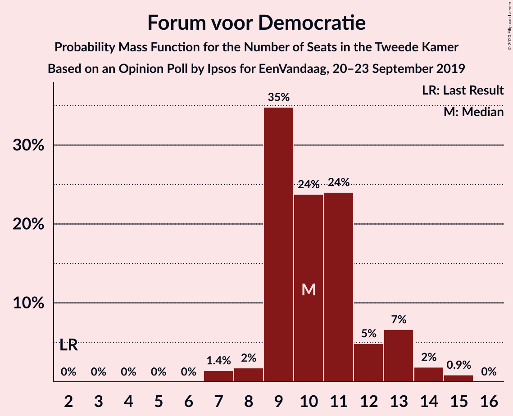

| Number of Seats | Probability | Accumulated | Special Marks |
|:---------------:|:-----------:|:-----------:|:-------------:|
| 2 | 0% | 100% | Last Result |
| 3 | 0% | 100% |  |
| 4 | 0% | 100% |  |
| 5 | 0% | 100% |  |
| 6 | 0% | 100% |  |
| 7 | 1.4% | 100% |  |
| 8 | 2% | 98.6% |  |
| 9 | 35% | 97% |  |
| 10 | 24% | 62% | Median |
| 11 | 24% | 38% |  |
| 12 | 5% | 14% |  |
| 13 | 7% | 9% |  |
| 14 | 2% | 3% |  |
| 15 | 0.9% | 0.9% |  |
| 16 | 0% | 0% |  |

### Socialistische Partij

*For a full overview of the results for this party, see the [Socialistische Partij](party-socialistischepartij.html) page.*

| Number of Seats | Probability | Accumulated | Special Marks |
|:---------------:|:-----------:|:-----------:|:-------------:|
| 6 | 1.4% | 100% |  |
| 7 | 11% | 98.6% |  |
| 8 | 37% | 87% | Median |
| 9 | 25% | 50% |  |
| 10 | 19% | 24% |  |
| 11 | 4% | 5% |  |
| 12 | 1.1% | 2% |  |
| 13 | 0.6% | 0.6% |  |
| 14 | 0% | 0% | Last Result |

### ChristenUnie

*For a full overview of the results for this party, see the [ChristenUnie](party-christenunie.html) page.*

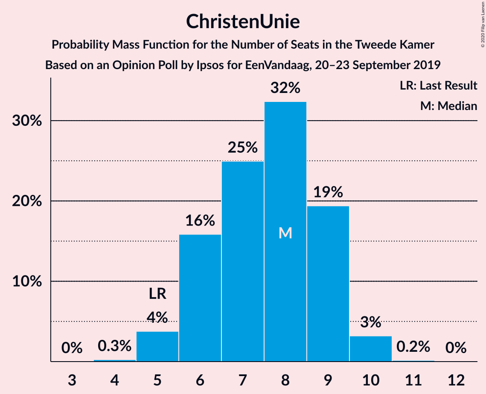

| Number of Seats | Probability | Accumulated | Special Marks |
|:---------------:|:-----------:|:-----------:|:-------------:|
| 4 | 0.3% | 100% |  |
| 5 | 4% | 99.7% | Last Result |
| 6 | 16% | 96% |  |
| 7 | 25% | 80% |  |
| 8 | 32% | 55% | Median |
| 9 | 19% | 23% |  |
| 10 | 3% | 3% |  |
| 11 | 0.2% | 0.2% |  |
| 12 | 0% | 0% |  |

### Partij voor de Dieren

*For a full overview of the results for this party, see the [Partij voor de Dieren](party-partijvoordedieren.html) page.*

| Number of Seats | Probability | Accumulated | Special Marks |
|:---------------:|:-----------:|:-----------:|:-------------:|
| 3 | 0.1% | 100% |  |
| 4 | 12% | 99.9% |  |
| 5 | 24% | 88% | Last Result |
| 6 | 26% | 64% | Median |
| 7 | 19% | 38% |  |
| 8 | 16% | 19% |  |
| 9 | 3% | 3% |  |
| 10 | 0.1% | 0.3% |  |
| 11 | 0.1% | 0.1% |  |
| 12 | 0% | 0% |  |

### 50Plus

*For a full overview of the results for this party, see the [50Plus](party-50plus.html) page.*

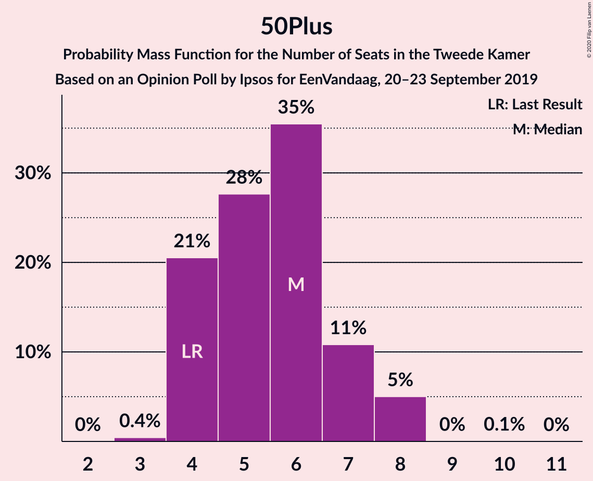

| Number of Seats | Probability | Accumulated | Special Marks |
|:---------------:|:-----------:|:-----------:|:-------------:|
| 3 | 0.4% | 100% |  |
| 4 | 21% | 99.6% | Last Result |
| 5 | 28% | 79% |  |
| 6 | 35% | 51% | Median |
| 7 | 11% | 16% |  |
| 8 | 5% | 5% |  |
| 9 | 0% | 0.1% |  |
| 10 | 0.1% | 0.1% |  |
| 11 | 0% | 0% |  |

### Staatkundig Gereformeerde Partij

*For a full overview of the results for this party, see the [Staatkundig Gereformeerde Partij](party-staatkundiggereformeerdepartij.html) page.*

| Number of Seats | Probability | Accumulated | Special Marks |
|:---------------:|:-----------:|:-----------:|:-------------:|
| 1 | 3% | 100% |  |
| 2 | 32% | 97% |  |
| 3 | 48% | 65% | Last Result, Median |
| 4 | 15% | 17% |  |
| 5 | 2% | 2% |  |
| 6 | 0% | 0% |  |

### DENK

*For a full overview of the results for this party, see the [DENK](party-denk.html) page.*

| Number of Seats | Probability | Accumulated | Special Marks |
|:---------------:|:-----------:|:-----------:|:-------------:|
| 0 | 1.0% | 100% |  |
| 1 | 41% | 99.0% |  |
| 2 | 50% | 58% | Median |
| 3 | 8% | 8% | Last Result |
| 4 | 0.2% | 0.2% |  |
| 5 | 0% | 0% |  |

## Coalitions

### Confidence Intervals

| Coalition | Last Result | Median | Majority? | 80% Confidence Interval | 90% Confidence Interval | 95% Confidence Interval | 99% Confidence Interval |
|:---------:|:-----------:|:------:|:---------:|:-----------------------:|:-----------------------:|:-----------------------:|:-----------------------:|
| Volkspartij voor Vrijheid en Democratie – Christen-Democratisch Appèl – Democraten 66 – GroenLinks – ChristenUnie | 90 | 84 | 99.7% | 80–87 | 78–89 | 77–91 | 77–91 |
| Volkspartij voor Vrijheid en Democratie – Christen-Democratisch Appèl – Democraten 66 – Partij van de Arbeid – ChristenUnie | 85 | 84 | 99.6% | 79–89 | 78–89 | 77–89 | 76–89 |
| Volkspartij voor Vrijheid en Democratie – Partij voor de Vrijheid – Christen-Democratisch Appèl – Forum voor Democratie – Staatkundig Gereformeerde Partij | 77 | 77 | 73% | 72–81 | 71–81 | 71–82 | 71–83 |
| Volkspartij voor Vrijheid en Democratie – Partij voor de Vrijheid – Christen-Democratisch Appèl – Forum voor Democratie | 74 | 74 | 41% | 70–79 | 69–79 | 69–79 | 68–81 |
| Christen-Democratisch Appèl – Democraten 66 – GroenLinks – Partij van de Arbeid – Socialistische Partij – ChristenUnie | 80 | 74 | 34% | 70–78 | 67–78 | 67–78 | 65–78 |
| Volkspartij voor Vrijheid en Democratie – Christen-Democratisch Appèl – Democraten 66 – ChristenUnie | 76 | 69 | 3% | 66–75 | 65–75 | 65–77 | 64–77 |
| Volkspartij voor Vrijheid en Democratie – Christen-Democratisch Appèl – Forum voor Democratie – 50Plus – Staatkundig Gereformeerde Partij | 61 | 67 | 0% | 62–70 | 62–71 | 61–71 | 60–73 |
| Christen-Democratisch Appèl – Democraten 66 – GroenLinks – Partij van de Arbeid – ChristenUnie | 66 | 66 | 0% | 60–70 | 60–70 | 59–70 | 58–70 |
| Volkspartij voor Vrijheid en Democratie – Partij voor de Vrijheid – Christen-Democratisch Appèl | 72 | 64 | 0% | 60–68 | 59–68 | 59–68 | 58–70 |
| Volkspartij voor Vrijheid en Democratie – Christen-Democratisch Appèl – Forum voor Democratie – 50Plus | 58 | 64 | 0% | 59–68 | 59–68 | 58–68 | 57–70 |
| Volkspartij voor Vrijheid en Democratie – Christen-Democratisch Appèl – Democraten 66 | 71 | 62 | 0% | 59–67 | 58–67 | 57–67 | 56–68 |
| Volkspartij voor Vrijheid en Democratie – Christen-Democratisch Appèl – Partij van de Arbeid | 61 | 61 | 0% | 56–66 | 56–66 | 55–66 | 53–66 |
| Volkspartij voor Vrijheid en Democratie – Christen-Democratisch Appèl – Forum voor Democratie – Staatkundig Gereformeerde Partij | 57 | 61 | 0% | 56–64 | 56–64 | 55–65 | 54–67 |
| Volkspartij voor Vrijheid en Democratie – Democraten 66 – Partij van de Arbeid | 61 | 61 | 0% | 56–64 | 55–65 | 54–65 | 54–66 |
| Volkspartij voor Vrijheid en Democratie – Christen-Democratisch Appèl – Forum voor Democratie | 54 | 58 | 0% | 53–62 | 53–62 | 53–62 | 52–64 |
| Volkspartij voor Vrijheid en Democratie – Christen-Democratisch Appèl | 52 | 47 | 0% | 44–52 | 44–52 | 43–52 | 41–53 |
| Volkspartij voor Vrijheid en Democratie – Partij van de Arbeid | 42 | 45 | 0% | 42–49 | 40–49 | 40–49 | 39–51 |
| Christen-Democratisch Appèl – Democraten 66 – Partij van de Arbeid | 47 | 44 | 0% | 40–48 | 39–48 | 38–48 | 38–49 |
| Christen-Democratisch Appèl – Partij van de Arbeid – ChristenUnie | 33 | 37 | 0% | 33–40 | 33–40 | 32–40 | 29–40 |
| Christen-Democratisch Appèl – Democraten 66 | 38 | 31 | 0% | 27–33 | 27–34 | 26–34 | 24–35 |
| Christen-Democratisch Appèl – Partij van de Arbeid | 28 | 29 | 0% | 26–32 | 25–32 | 24–32 | 23–32 |

### Volkspartij voor Vrijheid en Democratie – Christen-Democratisch Appèl – Democraten 66 – GroenLinks – ChristenUnie

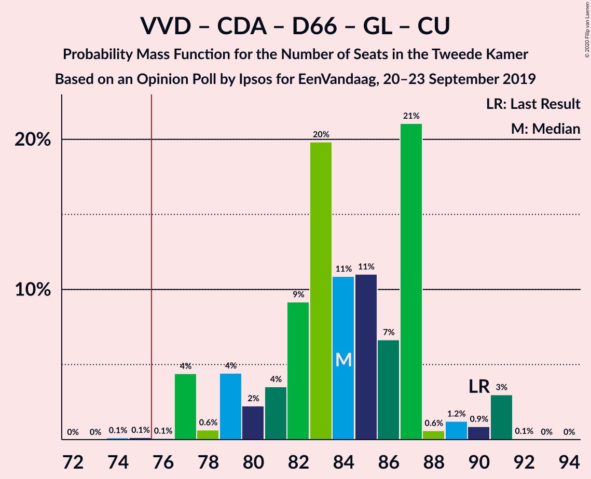

| Number of Seats | Probability | Accumulated | Special Marks |
|:---------------:|:-----------:|:-----------:|:-------------:|
| 74 | 0.1% | 100% |  |
| 75 | 0.1% | 99.9% |  |
| 76 | 0.1% | 99.7% | Majority |
| 77 | 4% | 99.6% |  |
| 78 | 0.6% | 95% |  |
| 79 | 4% | 95% |  |
| 80 | 2% | 90% |  |
| 81 | 4% | 88% |  |
| 82 | 9% | 84% |  |
| 83 | 20% | 75% |  |
| 84 | 11% | 55% |  |
| 85 | 11% | 45% | Median |
| 86 | 7% | 34% |  |
| 87 | 21% | 27% |  |
| 88 | 0.6% | 6% |  |
| 89 | 1.2% | 5% |  |
| 90 | 0.9% | 4% | Last Result |
| 91 | 3% | 3% |  |
| 92 | 0.1% | 0.1% |  |
| 93 | 0% | 0% |  |

### Volkspartij voor Vrijheid en Democratie – Christen-Democratisch Appèl – Democraten 66 – Partij van de Arbeid – ChristenUnie

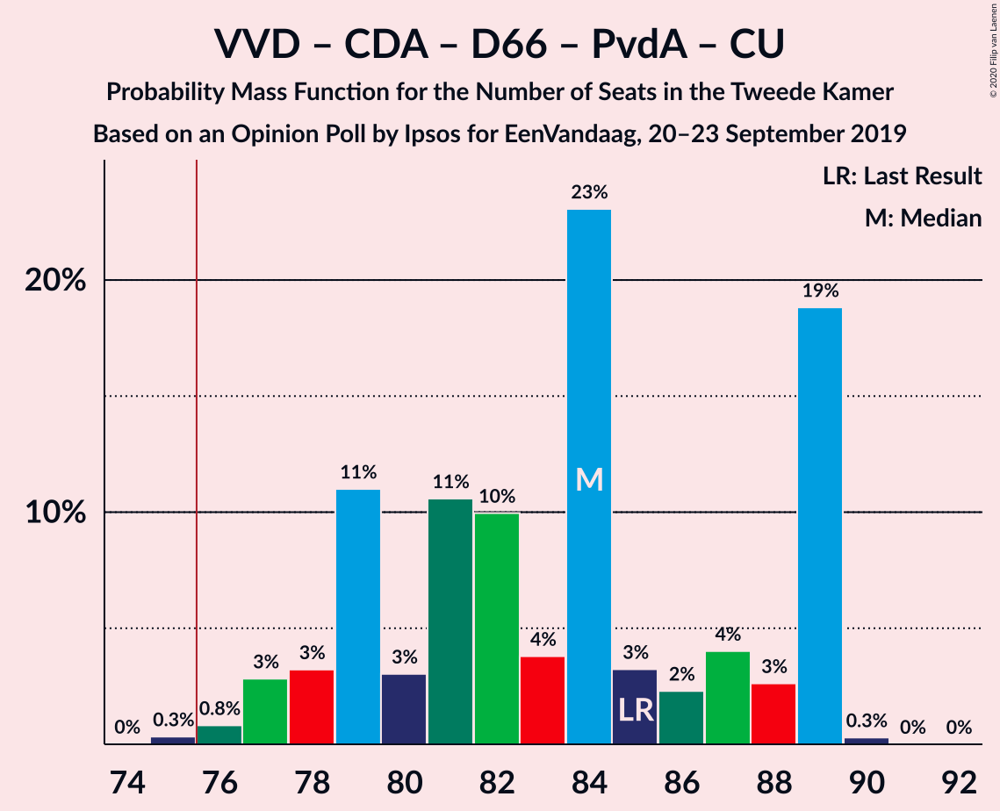

| Number of Seats | Probability | Accumulated | Special Marks |
|:---------------:|:-----------:|:-----------:|:-------------:|
| 74 | 0% | 100% |  |
| 75 | 0.3% | 99.9% |  |
| 76 | 0.8% | 99.6% | Majority |
| 77 | 3% | 98.8% |  |
| 78 | 3% | 96% |  |
| 79 | 11% | 93% |  |
| 80 | 3% | 82% |  |
| 81 | 11% | 79% |  |
| 82 | 10% | 68% |  |
| 83 | 4% | 58% |  |
| 84 | 23% | 54% |  |
| 85 | 3% | 31% | Last Result, Median |
| 86 | 2% | 28% |  |
| 87 | 4% | 26% |  |
| 88 | 3% | 22% |  |
| 89 | 19% | 19% |  |
| 90 | 0.3% | 0.3% |  |
| 91 | 0% | 0% |  |

### Volkspartij voor Vrijheid en Democratie – Partij voor de Vrijheid – Christen-Democratisch Appèl – Forum voor Democratie – Staatkundig Gereformeerde Partij

| Number of Seats | Probability | Accumulated | Special Marks |
|:---------------:|:-----------:|:-----------:|:-------------:|
| 69 | 0% | 100% |  |
| 70 | 0.1% | 99.9% |  |
| 71 | 6% | 99.9% |  |
| 72 | 4% | 94% |  |
| 73 | 1.3% | 90% |  |
| 74 | 3% | 89% |  |
| 75 | 12% | 85% |  |
| 76 | 15% | 73% | Majority |
| 77 | 13% | 59% | Last Result |
| 78 | 3% | 45% | Median |
| 79 | 14% | 43% |  |
| 80 | 16% | 29% |  |
| 81 | 10% | 13% |  |
| 82 | 0.9% | 3% |  |
| 83 | 1.4% | 2% |  |
| 84 | 0.1% | 0.3% |  |
| 85 | 0.2% | 0.2% |  |
| 86 | 0% | 0% |  |

### Volkspartij voor Vrijheid en Democratie – Partij voor de Vrijheid – Christen-Democratisch Appèl – Forum voor Democratie

| Number of Seats | Probability | Accumulated | Special Marks |
|:---------------:|:-----------:|:-----------:|:-------------:|
| 67 | 0% | 100% |  |
| 68 | 0.6% | 99.9% |  |
| 69 | 5% | 99.3% |  |
| 70 | 6% | 94% |  |
| 71 | 1.3% | 88% |  |
| 72 | 13% | 87% |  |
| 73 | 13% | 73% |  |
| 74 | 14% | 60% | Last Result |
| 75 | 4% | 46% | Median |
| 76 | 14% | 41% | Majority |
| 77 | 14% | 27% |  |
| 78 | 2% | 13% |  |
| 79 | 9% | 11% |  |
| 80 | 0.2% | 2% |  |
| 81 | 1.3% | 2% |  |
| 82 | 0.1% | 0.2% |  |
| 83 | 0.1% | 0.1% |  |
| 84 | 0% | 0% |  |

### Christen-Democratisch Appèl – Democraten 66 – GroenLinks – Partij van de Arbeid – Socialistische Partij – ChristenUnie

| Number of Seats | Probability | Accumulated | Special Marks |
|:---------------:|:-----------:|:-----------:|:-------------:|
| 64 | 0.1% | 100% |  |
| 65 | 0.5% | 99.9% |  |
| 66 | 1.1% | 99.5% |  |
| 67 | 6% | 98% |  |
| 68 | 0.2% | 92% |  |
| 69 | 1.4% | 92% |  |
| 70 | 1.3% | 90% |  |
| 71 | 5% | 89% |  |
| 72 | 9% | 84% |  |
| 73 | 14% | 75% |  |
| 74 | 21% | 61% |  |
| 75 | 6% | 40% | Median |
| 76 | 18% | 34% | Majority |
| 77 | 3% | 16% |  |
| 78 | 13% | 13% |  |
| 79 | 0.1% | 0.5% |  |
| 80 | 0.2% | 0.3% | Last Result |
| 81 | 0% | 0.1% |  |
| 82 | 0.1% | 0.1% |  |
| 83 | 0% | 0% |  |

### Volkspartij voor Vrijheid en Democratie – Christen-Democratisch Appèl – Democraten 66 – ChristenUnie

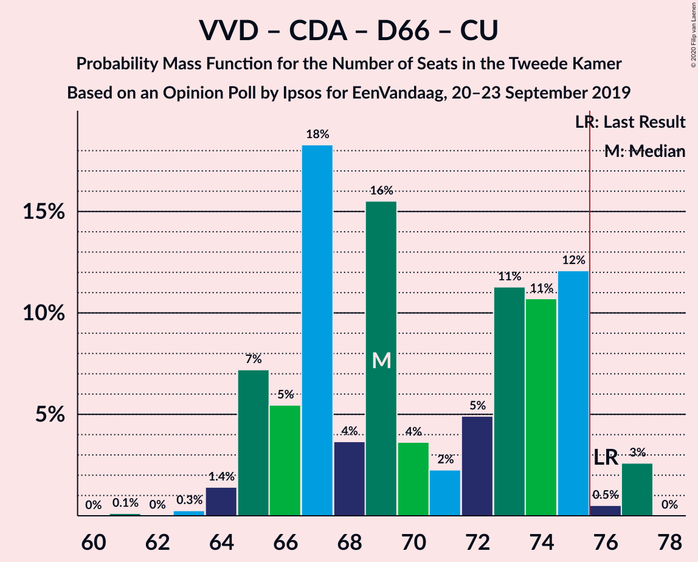

| Number of Seats | Probability | Accumulated | Special Marks |
|:---------------:|:-----------:|:-----------:|:-------------:|
| 61 | 0.1% | 100% |  |
| 62 | 0% | 99.9% |  |
| 63 | 0.3% | 99.8% |  |
| 64 | 1.4% | 99.6% |  |
| 65 | 7% | 98% |  |
| 66 | 5% | 91% |  |
| 67 | 18% | 86% |  |
| 68 | 4% | 67% |  |
| 69 | 16% | 64% |  |
| 70 | 4% | 48% |  |
| 71 | 2% | 44% | Median |
| 72 | 5% | 42% |  |
| 73 | 11% | 37% |  |
| 74 | 11% | 26% |  |
| 75 | 12% | 15% |  |
| 76 | 0.5% | 3% | Last Result, Majority |
| 77 | 3% | 3% |  |
| 78 | 0% | 0% |  |

### Volkspartij voor Vrijheid en Democratie – Christen-Democratisch Appèl – Forum voor Democratie – 50Plus – Staatkundig Gereformeerde Partij

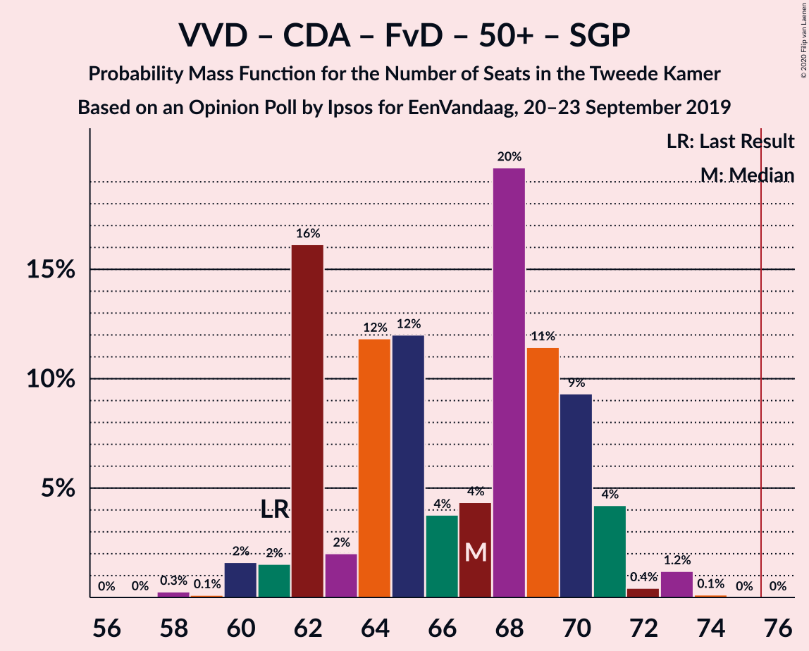

| Number of Seats | Probability | Accumulated | Special Marks |
|:---------------:|:-----------:|:-----------:|:-------------:|
| 58 | 0.3% | 100% |  |
| 59 | 0.1% | 99.7% |  |
| 60 | 2% | 99.6% |  |
| 61 | 2% | 98% | Last Result |
| 62 | 16% | 96% |  |
| 63 | 2% | 80% |  |
| 64 | 12% | 78% |  |
| 65 | 12% | 66% |  |
| 66 | 4% | 54% |  |
| 67 | 4% | 51% | Median |
| 68 | 20% | 46% |  |
| 69 | 11% | 27% |  |
| 70 | 9% | 15% |  |
| 71 | 4% | 6% |  |
| 72 | 0.4% | 2% |  |
| 73 | 1.2% | 1.3% |  |
| 74 | 0.1% | 0.1% |  |
| 75 | 0% | 0% |  |

### Christen-Democratisch Appèl – Democraten 66 – GroenLinks – Partij van de Arbeid – ChristenUnie

| Number of Seats | Probability | Accumulated | Special Marks |
|:---------------:|:-----------:|:-----------:|:-------------:|
| 55 | 0.1% | 100% |  |
| 56 | 0.1% | 99.9% |  |
| 57 | 0.1% | 99.7% |  |
| 58 | 0.4% | 99.6% |  |
| 59 | 2% | 99.2% |  |
| 60 | 7% | 97% |  |
| 61 | 1.2% | 90% |  |
| 62 | 8% | 89% |  |
| 63 | 6% | 81% |  |
| 64 | 14% | 75% |  |
| 65 | 9% | 61% |  |
| 66 | 23% | 51% | Last Result |
| 67 | 5% | 29% | Median |
| 68 | 10% | 24% |  |
| 69 | 3% | 13% |  |
| 70 | 10% | 10% |  |
| 71 | 0.1% | 0.1% |  |
| 72 | 0% | 0.1% |  |
| 73 | 0% | 0% |  |

### Volkspartij voor Vrijheid en Democratie – Partij voor de Vrijheid – Christen-Democratisch Appèl

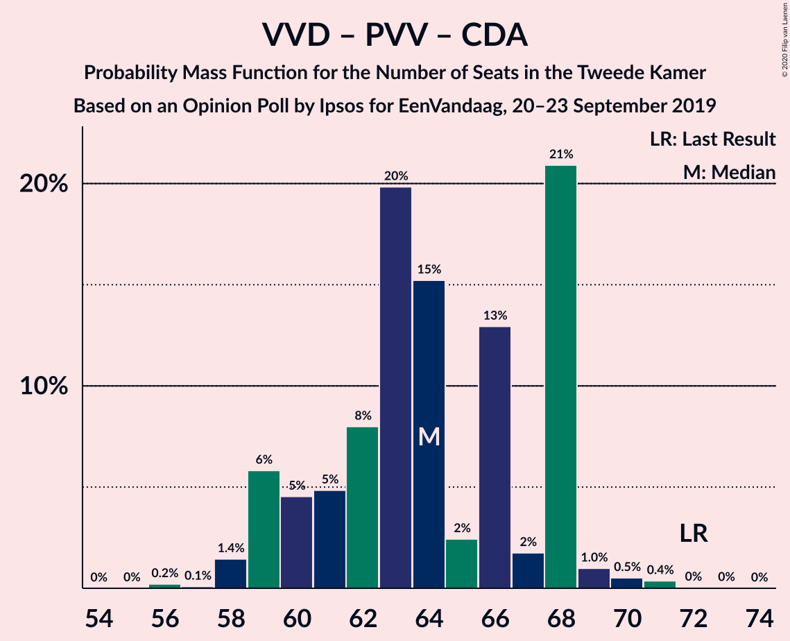

| Number of Seats | Probability | Accumulated | Special Marks |
|:---------------:|:-----------:|:-----------:|:-------------:|
| 56 | 0.2% | 100% |  |
| 57 | 0.1% | 99.8% |  |
| 58 | 1.4% | 99.7% |  |
| 59 | 6% | 98% |  |
| 60 | 5% | 92% |  |
| 61 | 5% | 88% |  |
| 62 | 8% | 83% |  |
| 63 | 20% | 75% |  |
| 64 | 15% | 55% |  |
| 65 | 2% | 40% | Median |
| 66 | 13% | 38% |  |
| 67 | 2% | 25% |  |
| 68 | 21% | 23% |  |
| 69 | 1.0% | 2% |  |
| 70 | 0.5% | 1.0% |  |
| 71 | 0.4% | 0.4% |  |
| 72 | 0% | 0.1% | Last Result |
| 73 | 0% | 0% |  |

### Volkspartij voor Vrijheid en Democratie – Christen-Democratisch Appèl – Forum voor Democratie – 50Plus

| Number of Seats | Probability | Accumulated | Special Marks |
|:---------------:|:-----------:|:-----------:|:-------------:|
| 56 | 0.4% | 100% |  |
| 57 | 0.3% | 99.6% |  |
| 58 | 3% | 99.3% | Last Result |
| 59 | 11% | 96% |  |
| 60 | 6% | 85% |  |
| 61 | 11% | 79% |  |
| 62 | 14% | 68% |  |
| 63 | 4% | 54% |  |
| 64 | 6% | 51% | Median |
| 65 | 15% | 44% |  |
| 66 | 13% | 30% |  |
| 67 | 2% | 17% |  |
| 68 | 14% | 15% |  |
| 69 | 0.3% | 0.9% |  |
| 70 | 0.3% | 0.5% |  |
| 71 | 0.1% | 0.2% |  |
| 72 | 0.1% | 0.1% |  |
| 73 | 0% | 0% |  |

### Volkspartij voor Vrijheid en Democratie – Christen-Democratisch Appèl – Democraten 66

| Number of Seats | Probability | Accumulated | Special Marks |
|:---------------:|:-----------:|:-----------:|:-------------:|
| 55 | 0.3% | 100% |  |
| 56 | 2% | 99.7% |  |
| 57 | 1.1% | 98% |  |
| 58 | 3% | 97% |  |
| 59 | 17% | 94% |  |
| 60 | 7% | 77% |  |
| 61 | 17% | 70% |  |
| 62 | 4% | 53% |  |
| 63 | 5% | 49% | Median |
| 64 | 6% | 44% |  |
| 65 | 5% | 38% |  |
| 66 | 19% | 33% |  |
| 67 | 13% | 14% |  |
| 68 | 0.5% | 0.8% |  |
| 69 | 0.2% | 0.3% |  |
| 70 | 0% | 0.1% |  |
| 71 | 0% | 0.1% | Last Result |
| 72 | 0% | 0% |  |

### Volkspartij voor Vrijheid en Democratie – Christen-Democratisch Appèl – Partij van de Arbeid

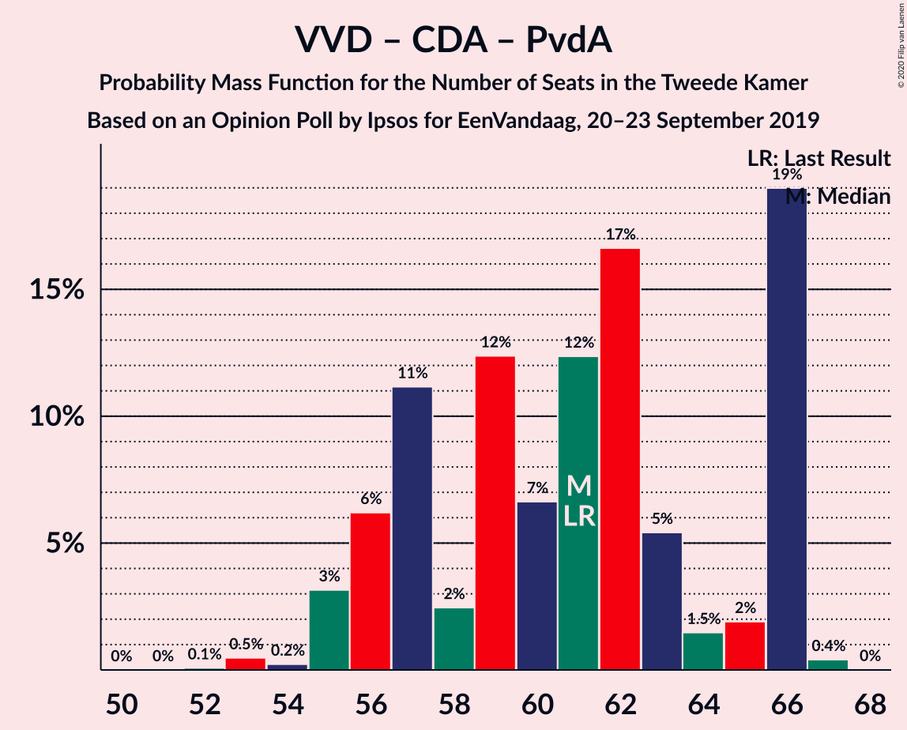

| Number of Seats | Probability | Accumulated | Special Marks |
|:---------------:|:-----------:|:-----------:|:-------------:|
| 52 | 0.1% | 100% |  |
| 53 | 0.5% | 99.9% |  |
| 54 | 0.2% | 99.4% |  |
| 55 | 3% | 99.2% |  |
| 56 | 6% | 96% |  |
| 57 | 11% | 90% |  |
| 58 | 2% | 79% |  |
| 59 | 12% | 76% |  |
| 60 | 7% | 64% |  |
| 61 | 12% | 57% | Last Result |
| 62 | 17% | 45% | Median |
| 63 | 5% | 28% |  |
| 64 | 1.5% | 23% |  |
| 65 | 2% | 21% |  |
| 66 | 19% | 19% |  |
| 67 | 0.4% | 0.4% |  |
| 68 | 0% | 0% |  |

### Volkspartij voor Vrijheid en Democratie – Christen-Democratisch Appèl – Forum voor Democratie – Staatkundig Gereformeerde Partij

| Number of Seats | Probability | Accumulated | Special Marks |
|:---------------:|:-----------:|:-----------:|:-------------:|
| 52 | 0.2% | 100% |  |
| 53 | 0.1% | 99.7% |  |
| 54 | 1.4% | 99.7% |  |
| 55 | 2% | 98% |  |
| 56 | 11% | 96% |  |
| 57 | 7% | 85% | Last Result |
| 58 | 9% | 79% |  |
| 59 | 10% | 69% |  |
| 60 | 4% | 60% |  |
| 61 | 6% | 55% | Median |
| 62 | 9% | 49% |  |
| 63 | 8% | 40% |  |
| 64 | 28% | 32% |  |
| 65 | 1.1% | 4% |  |
| 66 | 1.1% | 2% |  |
| 67 | 1.2% | 1.4% |  |
| 68 | 0.1% | 0.2% |  |
| 69 | 0% | 0.1% |  |
| 70 | 0.1% | 0.1% |  |
| 71 | 0% | 0% |  |

### Volkspartij voor Vrijheid en Democratie – Democraten 66 – Partij van de Arbeid

| Number of Seats | Probability | Accumulated | Special Marks |
|:---------------:|:-----------:|:-----------:|:-------------:|
| 52 | 0.3% | 100% |  |
| 53 | 0.1% | 99.7% |  |
| 54 | 3% | 99.6% |  |
| 55 | 3% | 97% |  |
| 56 | 10% | 94% |  |
| 57 | 3% | 84% |  |
| 58 | 4% | 82% |  |
| 59 | 12% | 77% |  |
| 60 | 13% | 65% |  |
| 61 | 8% | 52% | Last Result, Median |
| 62 | 14% | 44% |  |
| 63 | 19% | 30% |  |
| 64 | 1.2% | 11% |  |
| 65 | 8% | 10% |  |
| 66 | 1.4% | 2% |  |
| 67 | 0.2% | 0.3% |  |
| 68 | 0% | 0.1% |  |
| 69 | 0% | 0% |  |

### Volkspartij voor Vrijheid en Democratie – Christen-Democratisch Appèl – Forum voor Democratie

| Number of Seats | Probability | Accumulated | Special Marks |
|:---------------:|:-----------:|:-----------:|:-------------:|
| 50 | 0.3% | 100% |  |
| 51 | 0.1% | 99.7% |  |
| 52 | 2% | 99.6% |  |
| 53 | 13% | 98% |  |
| 54 | 9% | 86% | Last Result |
| 55 | 7% | 77% |  |
| 56 | 3% | 70% |  |
| 57 | 11% | 67% |  |
| 58 | 10% | 55% | Median |
| 59 | 2% | 46% |  |
| 60 | 9% | 44% |  |
| 61 | 23% | 34% |  |
| 62 | 10% | 11% |  |
| 63 | 0.6% | 2% |  |
| 64 | 0.9% | 1.1% |  |
| 65 | 0.1% | 0.3% |  |
| 66 | 0% | 0.1% |  |
| 67 | 0% | 0.1% |  |
| 68 | 0.1% | 0.1% |  |
| 69 | 0% | 0% |  |

### Volkspartij voor Vrijheid en Democratie – Christen-Democratisch Appèl

| Number of Seats | Probability | Accumulated | Special Marks |
|:---------------:|:-----------:|:-----------:|:-------------:|
| 40 | 0.3% | 100% |  |
| 41 | 0.5% | 99.7% |  |
| 42 | 0.4% | 99.2% |  |
| 43 | 3% | 98.8% |  |
| 44 | 16% | 95% |  |
| 45 | 17% | 80% |  |
| 46 | 8% | 63% |  |
| 47 | 5% | 55% |  |
| 48 | 5% | 50% | Median |
| 49 | 8% | 45% |  |
| 50 | 7% | 37% |  |
| 51 | 15% | 29% |  |
| 52 | 14% | 14% | Last Result |
| 53 | 0.7% | 0.8% |  |
| 54 | 0% | 0.1% |  |
| 55 | 0% | 0.1% |  |
| 56 | 0% | 0.1% |  |
| 57 | 0% | 0% |  |

### Volkspartij voor Vrijheid en Democratie – Partij van de Arbeid

| Number of Seats | Probability | Accumulated | Special Marks |
|:---------------:|:-----------:|:-----------:|:-------------:|
| 38 | 0.1% | 100% |  |
| 39 | 0.9% | 99.8% |  |
| 40 | 4% | 98.9% |  |
| 41 | 4% | 95% |  |
| 42 | 8% | 91% | Last Result |
| 43 | 13% | 83% |  |
| 44 | 11% | 69% |  |
| 45 | 9% | 58% |  |
| 46 | 6% | 49% | Median |
| 47 | 9% | 43% |  |
| 48 | 10% | 35% |  |
| 49 | 24% | 25% |  |
| 50 | 0.2% | 0.7% |  |
| 51 | 0.4% | 0.5% |  |
| 52 | 0.1% | 0.1% |  |
| 53 | 0% | 0% |  |

### Christen-Democratisch Appèl – Democraten 66 – Partij van de Arbeid

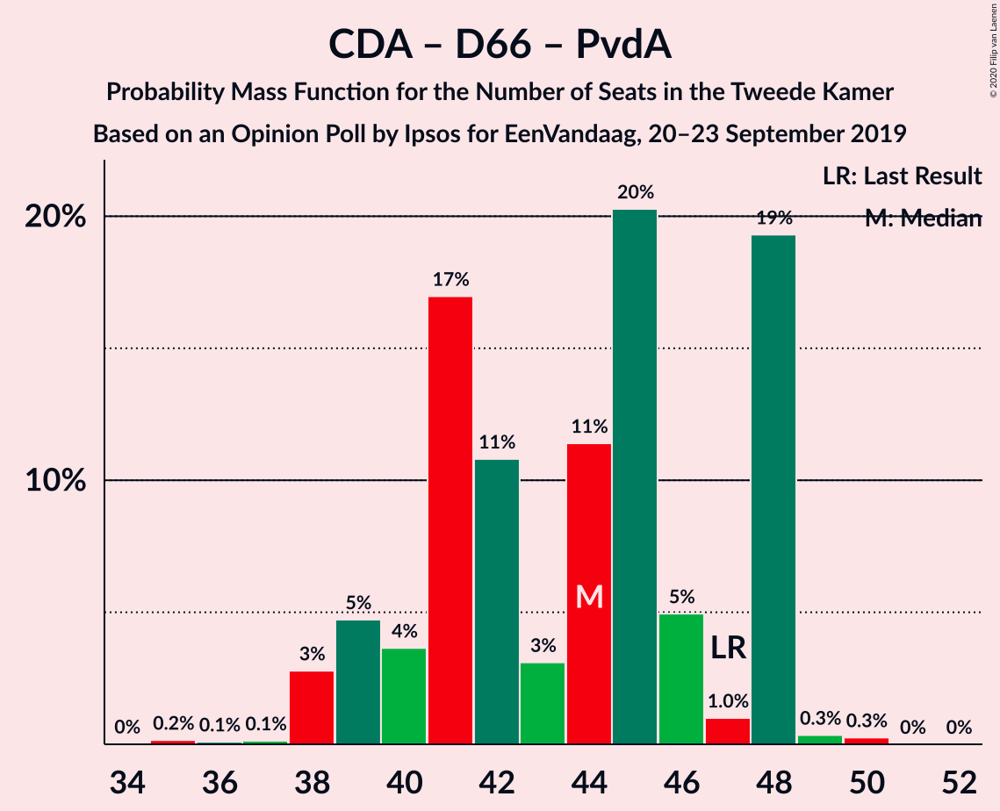

| Number of Seats | Probability | Accumulated | Special Marks |
|:---------------:|:-----------:|:-----------:|:-------------:|
| 35 | 0.2% | 100% |  |
| 36 | 0.1% | 99.8% |  |
| 37 | 0.1% | 99.7% |  |
| 38 | 3% | 99.6% |  |
| 39 | 5% | 97% |  |
| 40 | 4% | 92% |  |
| 41 | 17% | 88% |  |
| 42 | 11% | 71% |  |
| 43 | 3% | 61% |  |
| 44 | 11% | 58% |  |
| 45 | 20% | 46% | Median |
| 46 | 5% | 26% |  |
| 47 | 1.0% | 21% | Last Result |
| 48 | 19% | 20% |  |
| 49 | 0.3% | 0.6% |  |
| 50 | 0.3% | 0.3% |  |
| 51 | 0% | 0% |  |

### Christen-Democratisch Appèl – Partij van de Arbeid – ChristenUnie

| Number of Seats | Probability | Accumulated | Special Marks |
|:---------------:|:-----------:|:-----------:|:-------------:|
| 28 | 0.2% | 100% |  |
| 29 | 0.4% | 99.8% |  |
| 30 | 0.3% | 99.4% |  |
| 31 | 1.5% | 99.1% |  |
| 32 | 2% | 98% |  |
| 33 | 17% | 96% | Last Result |
| 34 | 7% | 79% |  |
| 35 | 14% | 72% |  |
| 36 | 7% | 58% |  |
| 37 | 11% | 51% |  |
| 38 | 8% | 40% | Median |
| 39 | 21% | 33% |  |
| 40 | 11% | 12% |  |
| 41 | 0.3% | 0.4% |  |
| 42 | 0.1% | 0.1% |  |
| 43 | 0% | 0% |  |

### Christen-Democratisch Appèl – Democraten 66

| Number of Seats | Probability | Accumulated | Special Marks |
|:---------------:|:-----------:|:-----------:|:-------------:|
| 23 | 0.1% | 100% |  |
| 24 | 1.4% | 99.9% |  |
| 25 | 0.7% | 98.5% |  |
| 26 | 3% | 98% |  |
| 27 | 11% | 95% |  |
| 28 | 3% | 84% |  |
| 29 | 13% | 82% |  |
| 30 | 15% | 69% |  |
| 31 | 18% | 54% | Median |
| 32 | 10% | 36% |  |
| 33 | 21% | 26% |  |
| 34 | 4% | 5% |  |
| 35 | 0.5% | 0.9% |  |
| 36 | 0.4% | 0.4% |  |
| 37 | 0.1% | 0.1% |  |
| 38 | 0% | 0% | Last Result |

### Christen-Democratisch Appèl – Partij van de Arbeid

| Number of Seats | Probability | Accumulated | Special Marks |
|:---------------:|:-----------:|:-----------:|:-------------:|
| 22 | 0.3% | 100% |  |
| 23 | 0.4% | 99.7% |  |
| 24 | 2% | 99.3% |  |
| 25 | 6% | 97% |  |
| 26 | 13% | 92% |  |
| 27 | 16% | 79% |  |
| 28 | 9% | 62% | Last Result |
| 29 | 9% | 53% |  |
| 30 | 4% | 45% | Median |
| 31 | 29% | 41% |  |
| 32 | 11% | 12% |  |
| 33 | 0.4% | 0.4% |  |
| 34 | 0% | 0% |  |

## Technical Information

### Opinion Poll

+ **Polling firm:** Ipsos
+ **Commissioner(s):** EenVandaag
+ **Fieldwork period:** 20–23 September 2019

### Calculations

+ **Sample size:** 1000
+ **Simulations done:** 1,048,576
+ **Error estimate:** 1.42%

