# Opinion Poll by I&O Research, 10–15 October 2019

<a href="#voting-intentions">Voting Intentions</a> | <a href="#seats">Seats</a> | <a href="#coalitions">Coalitions</a> | <a href="#technical-information">Technical Information</a>

## Voting Intentions

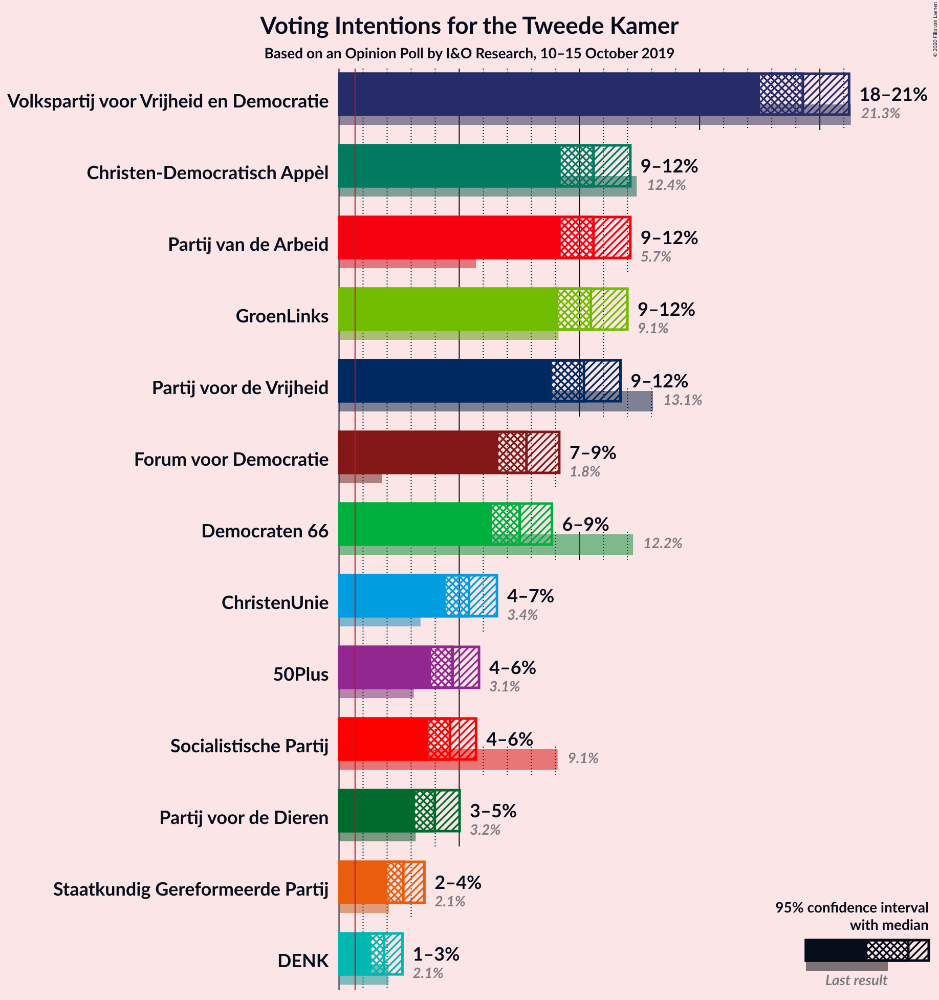

### Confidence Intervals

| Party | Last Result | Poll Result | 80% Confidence Interval | 90% Confidence Interval | 95% Confidence Interval | 99% Confidence Interval |
|:-----:|:-----------:|:-----------:|:-----------------------:|:-----------------------:|:-----------------------:|:-----------------------:|
| Volkspartij voor Vrijheid en Democratie | 21.3% | 19.3% | 18.1–20.5% |17.8–20.9% |17.5–21.2% |17.0–21.8% |
| Christen-Democratisch Appèl | 12.4% | 10.6% | 9.7–11.6% |9.4–11.9% |9.2–12.1% |8.8–12.6% |
| Partij van de Arbeid | 5.7% | 10.6% | 9.7–11.6% |9.4–11.9% |9.2–12.1% |8.8–12.6% |
| GroenLinks | 9.1% | 10.5% | 9.6–11.5% |9.3–11.8% |9.1–12.0% |8.7–12.5% |
| Partij voor de Vrijheid | 13.1% | 10.2% | 9.3–11.2% |9.1–11.5% |8.9–11.7% |8.4–12.2% |
| Forum voor Democratie | 1.8% | 7.8% | 7.0–8.7% |6.8–8.9% |6.6–9.2% |6.3–9.6% |
| Democraten 66 | 12.2% | 7.5% | 6.8–8.4% |6.5–8.6% |6.4–8.9% |6.0–9.3% |
| ChristenUnie | 3.4% | 5.4% | 4.8–6.2% |4.6–6.4% |4.4–6.6% |4.1–7.0% |
| 50Plus | 3.1% | 4.7% | 4.1–5.4% |4.0–5.7% |3.8–5.8% |3.6–6.2% |
| Socialistische Partij | 9.1% | 4.6% | 4.0–5.3% |3.9–5.5% |3.7–5.7% |3.5–6.1% |
| Partij voor de Dieren | 3.2% | 4.0% | 3.4–4.6% |3.3–4.8% |3.2–5.0% |2.9–5.3% |
| Staatkundig Gereformeerde Partij | 2.1% | 2.7% | 2.2–3.2% |2.1–3.4% |2.0–3.6% |1.8–3.8% |
| DENK | 2.1% | 1.9% | 1.5–2.4% |1.4–2.5% |1.3–2.6% |1.2–2.9% |

*Note:* The poll result column reflects the actual value used in the calculations. Published results may vary slightly, and in addition be rounded to fewer digits.

## Seats

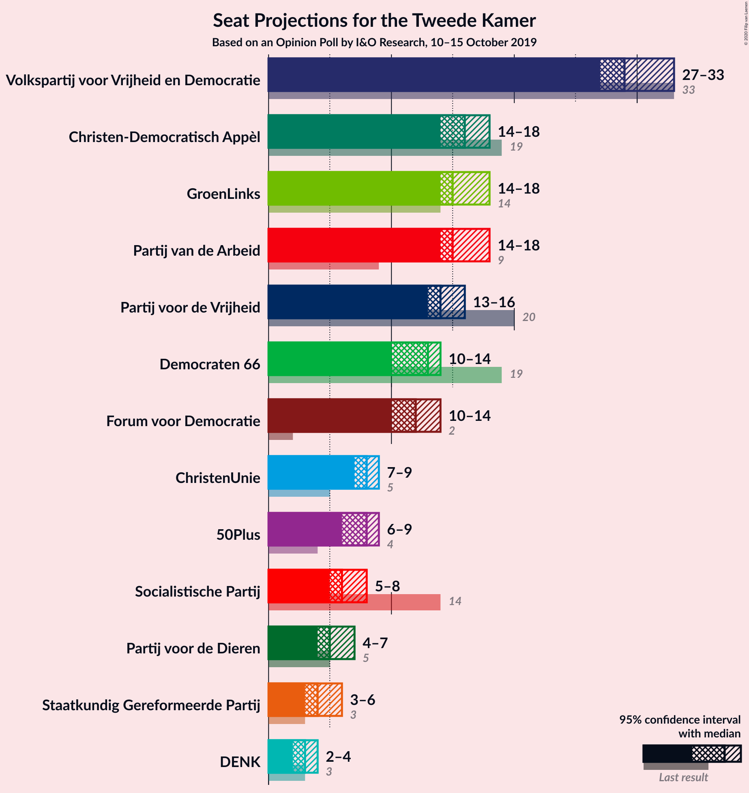

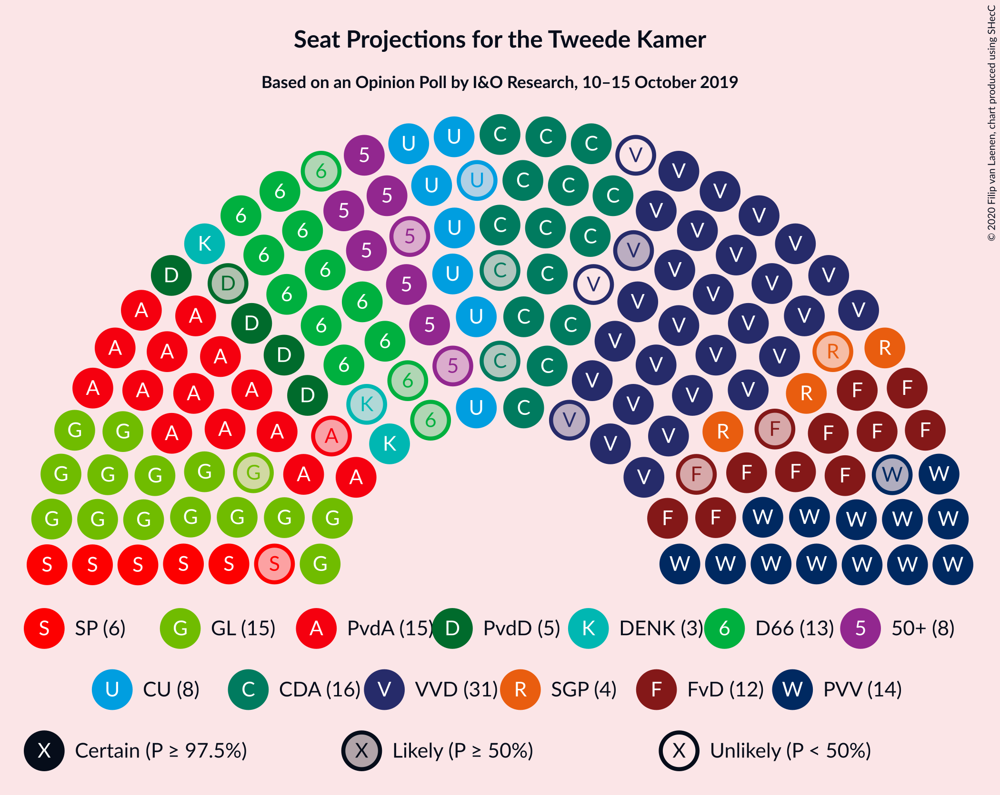

### Confidence Intervals

| Party | Last Result | Median | 80% Confidence Interval | 90% Confidence Interval | 95% Confidence Interval | 99% Confidence Interval |
|:-----:|:-----------:|:------:|:-----------------------:|:-----------------------:|:-----------------------:|:-----------------------:|
| <a href="#volkspartij-voor-vrijheid-en-democratie">Volkspartij voor Vrijheid en Democratie</a> | 33 | 29 | 27–31 |27–32 |27–33 |26–33 |
| <a href="#christen-democratisch-appèl">Christen-Democratisch Appèl</a> | 19 | 16 | 15–16 |15–17 |14–18 |14–19 |
| <a href="#partij-van-de-arbeid">Partij van de Arbeid</a> | 9 | 15 | 14–17 |14–17 |14–18 |13–19 |
| <a href="#groenlinks">GroenLinks</a> | 14 | 15 | 15–16 |15–16 |14–18 |14–19 |
| <a href="#partij-voor-de-vrijheid">Partij voor de Vrijheid</a> | 20 | 14 | 14–16 |14–16 |13–16 |12–17 |
| <a href="#forum-voor-democratie">Forum voor Democratie</a> | 2 | 12 | 12–14 |10–14 |10–14 |10–14 |
| <a href="#democraten-66">Democraten 66</a> | 19 | 13 | 10–14 |10–14 |10–14 |10–14 |
| <a href="#christenunie">ChristenUnie</a> | 5 | 8 | 7–9 |7–9 |7–9 |7–10 |
| <a href="#50plus">50Plus</a> | 4 | 8 | 7–9 |6–9 |6–9 |6–10 |
| <a href="#socialistische-partij">Socialistische Partij</a> | 14 | 6 | 5–8 |5–8 |5–8 |5–8 |
| <a href="#partij-voor-de-dieren">Partij voor de Dieren</a> | 5 | 5 | 5–6 |5–6 |4–7 |4–8 |
| <a href="#staatkundig-gereformeerde-partij">Staatkundig Gereformeerde Partij</a> | 3 | 4 | 3–6 |3–6 |3–6 |2–6 |
| <a href="#denk">DENK</a> | 3 | 3 | 2–4 |2–4 |2–4 |1–4 |

### Volkspartij voor Vrijheid en Democratie

*For a full overview of the results for this party, see the [Volkspartij voor Vrijheid en Democratie](party-volkspartijvoorvrijheidendemocratie.html) page.*

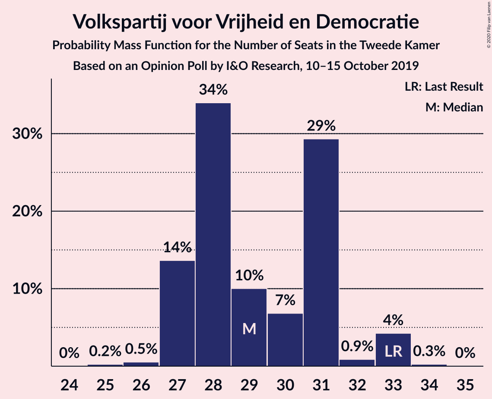

| Number of Seats | Probability | Accumulated | Special Marks |
|:---------------:|:-----------:|:-----------:|:-------------:|
| 25 | 0.2% | 100% |  |
| 26 | 0.5% | 99.7% |  |
| 27 | 14% | 99.2% |  |
| 28 | 34% | 86% |  |
| 29 | 10% | 52% | Median |
| 30 | 7% | 42% |  |
| 31 | 29% | 35% |  |
| 32 | 0.9% | 5% |  |
| 33 | 4% | 5% | Last Result |
| 34 | 0.3% | 0.3% |  |
| 35 | 0% | 0% |  |

### Christen-Democratisch Appèl

*For a full overview of the results for this party, see the [Christen-Democratisch Appèl](party-christen-democratischappèl.html) page.*

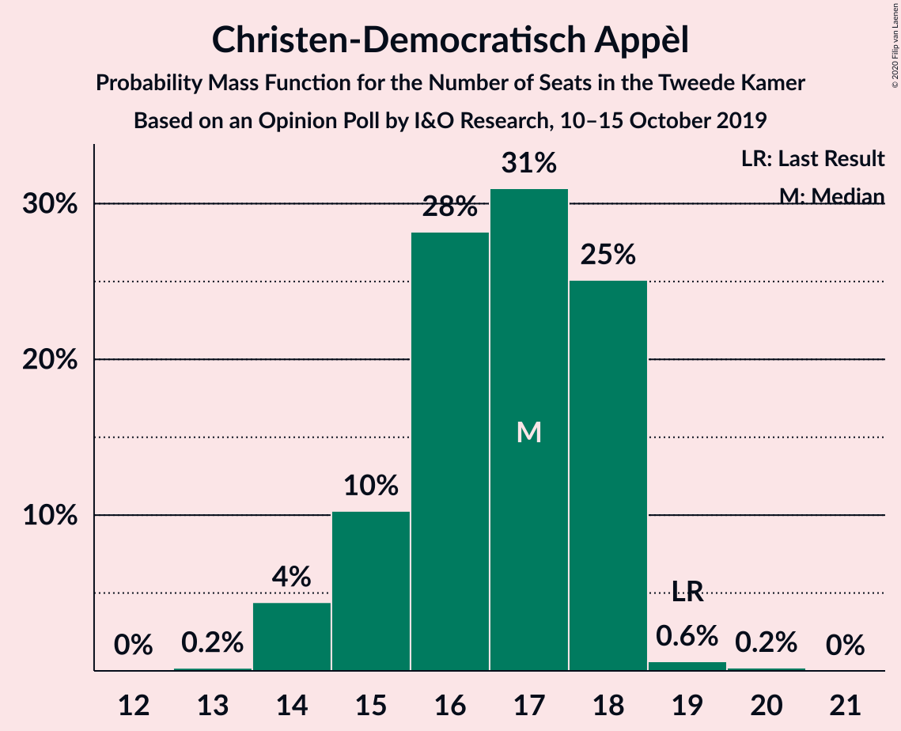

| Number of Seats | Probability | Accumulated | Special Marks |
|:---------------:|:-----------:|:-----------:|:-------------:|
| 13 | 0.3% | 100% |  |
| 14 | 4% | 99.7% |  |
| 15 | 20% | 95% |  |
| 16 | 69% | 75% | Median |
| 17 | 4% | 6% |  |
| 18 | 2% | 3% |  |
| 19 | 0.5% | 0.6% | Last Result |
| 20 | 0% | 0% |  |

### Partij van de Arbeid

*For a full overview of the results for this party, see the [Partij van de Arbeid](party-partijvandearbeid.html) page.*

| Number of Seats | Probability | Accumulated | Special Marks |
|:---------------:|:-----------:|:-----------:|:-------------:|
| 9 | 0% | 100% | Last Result |
| 10 | 0% | 100% |  |
| 11 | 0% | 100% |  |
| 12 | 0.1% | 100% |  |
| 13 | 1.1% | 99.9% |  |
| 14 | 30% | 98.8% |  |
| 15 | 44% | 68% | Median |
| 16 | 2% | 24% |  |
| 17 | 18% | 23% |  |
| 18 | 2% | 4% |  |
| 19 | 2% | 2% |  |
| 20 | 0% | 0.1% |  |
| 21 | 0.1% | 0.1% |  |
| 22 | 0% | 0% |  |

### GroenLinks

*For a full overview of the results for this party, see the [GroenLinks](party-groenlinks.html) page.*

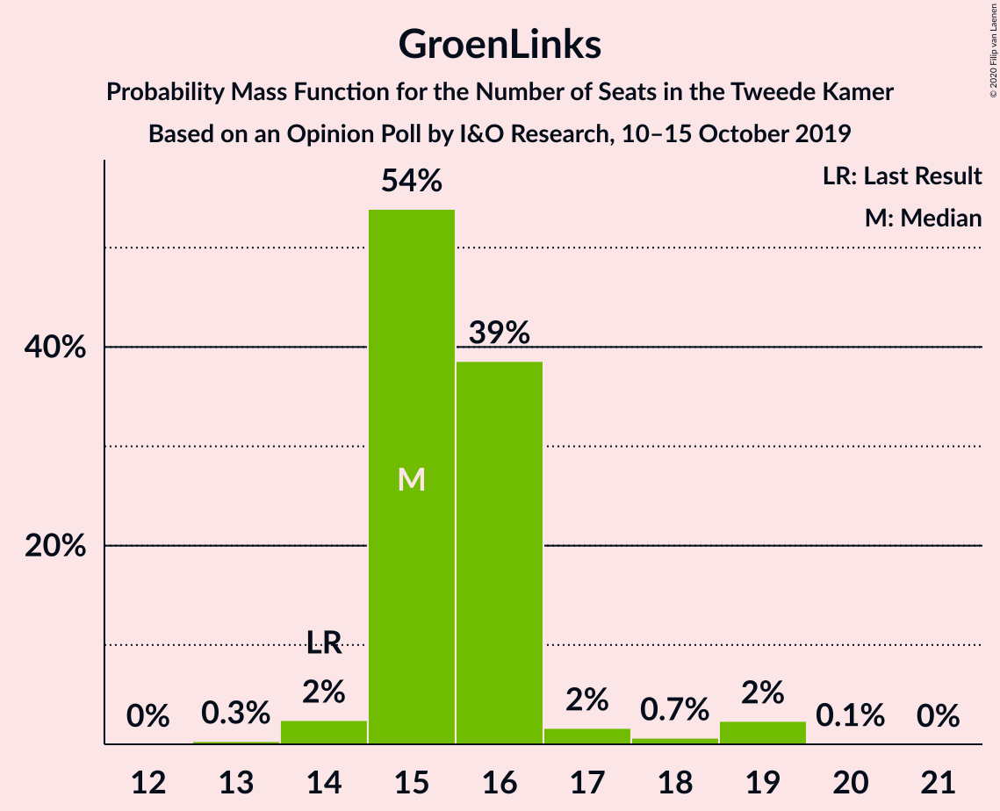

| Number of Seats | Probability | Accumulated | Special Marks |
|:---------------:|:-----------:|:-----------:|:-------------:|
| 13 | 0.3% | 100% |  |
| 14 | 2% | 99.7% | Last Result |
| 15 | 54% | 97% | Median |
| 16 | 39% | 43% |  |
| 17 | 2% | 5% |  |
| 18 | 0.7% | 3% |  |
| 19 | 2% | 2% |  |
| 20 | 0.1% | 0.1% |  |
| 21 | 0% | 0% |  |

### Partij voor de Vrijheid

*For a full overview of the results for this party, see the [Partij voor de Vrijheid](party-partijvoordevrijheid.html) page.*

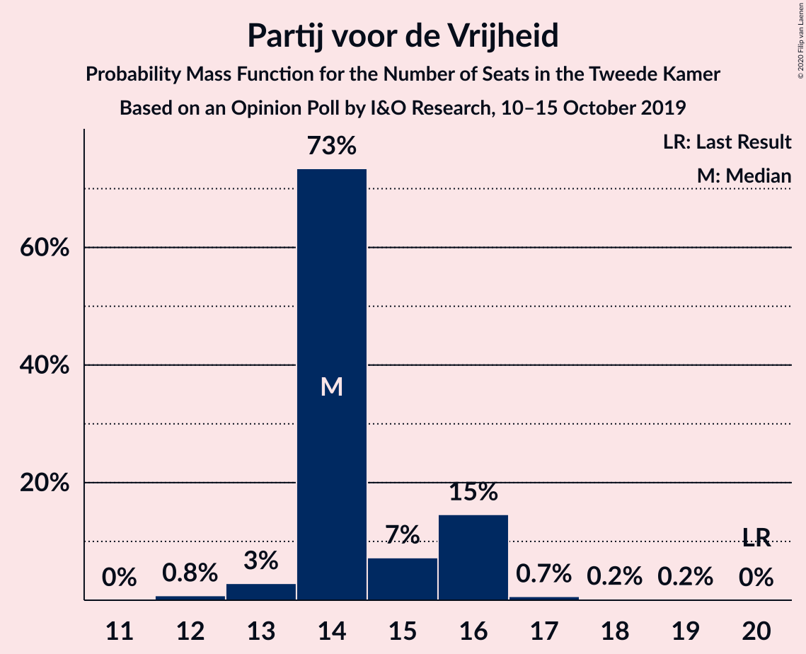

| Number of Seats | Probability | Accumulated | Special Marks |
|:---------------:|:-----------:|:-----------:|:-------------:|
| 12 | 0.8% | 100% |  |
| 13 | 3% | 99.2% |  |
| 14 | 73% | 96% | Median |
| 15 | 7% | 23% |  |
| 16 | 15% | 16% |  |
| 17 | 0.7% | 1.0% |  |
| 18 | 0.2% | 0.4% |  |
| 19 | 0.2% | 0.2% |  |
| 20 | 0% | 0% | Last Result |

### Forum voor Democratie

*For a full overview of the results for this party, see the [Forum voor Democratie](party-forumvoordemocratie.html) page.*

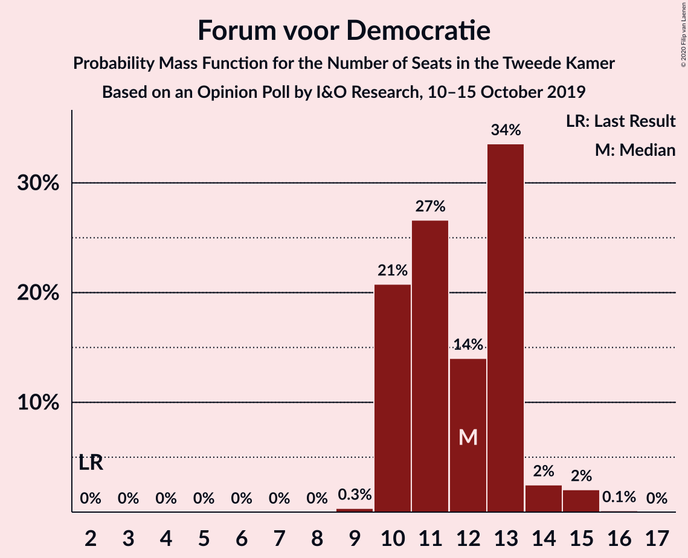

| Number of Seats | Probability | Accumulated | Special Marks |
|:---------------:|:-----------:|:-----------:|:-------------:|
| 2 | 0% | 100% | Last Result |
| 3 | 0% | 100% |  |
| 4 | 0% | 100% |  |
| 5 | 0% | 100% |  |
| 6 | 0% | 100% |  |
| 7 | 0% | 100% |  |
| 8 | 0% | 100% |  |
| 9 | 0.4% | 100% |  |
| 10 | 5% | 99.5% |  |
| 11 | 3% | 95% |  |
| 12 | 44% | 92% | Median |
| 13 | 33% | 48% |  |
| 14 | 15% | 15% |  |
| 15 | 0% | 0.1% |  |
| 16 | 0.1% | 0.1% |  |
| 17 | 0% | 0% |  |

### Democraten 66

*For a full overview of the results for this party, see the [Democraten 66](party-democraten66.html) page.*

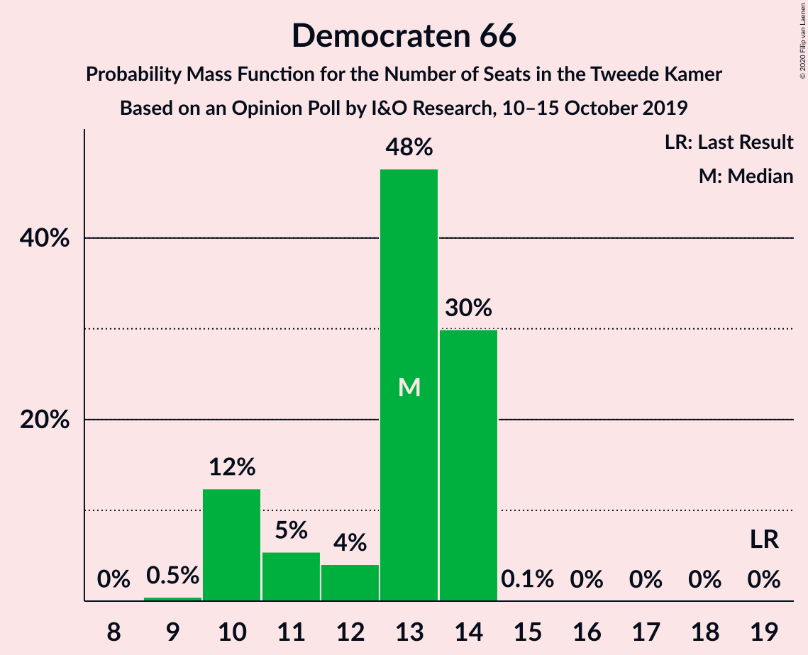

| Number of Seats | Probability | Accumulated | Special Marks |
|:---------------:|:-----------:|:-----------:|:-------------:|
| 9 | 0.5% | 100% |  |
| 10 | 12% | 99.5% |  |
| 11 | 5% | 87% |  |
| 12 | 4% | 82% |  |
| 13 | 48% | 78% | Median |
| 14 | 30% | 30% |  |
| 15 | 0.1% | 0.1% |  |
| 16 | 0% | 0% |  |
| 17 | 0% | 0% |  |
| 18 | 0% | 0% |  |
| 19 | 0% | 0% | Last Result |

### ChristenUnie

*For a full overview of the results for this party, see the [ChristenUnie](party-christenunie.html) page.*

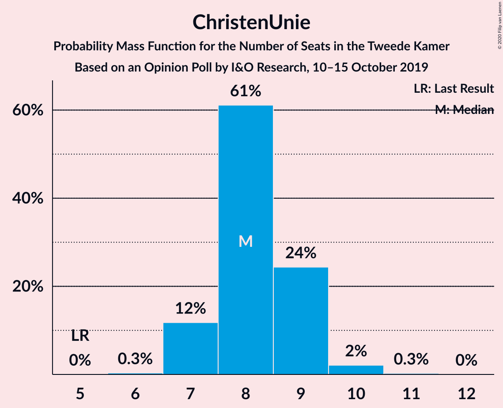

| Number of Seats | Probability | Accumulated | Special Marks |
|:---------------:|:-----------:|:-----------:|:-------------:|
| 5 | 0% | 100% | Last Result |
| 6 | 0.3% | 100% |  |
| 7 | 12% | 99.7% |  |
| 8 | 61% | 88% | Median |
| 9 | 24% | 27% |  |
| 10 | 2% | 2% |  |
| 11 | 0.3% | 0.3% |  |
| 12 | 0% | 0% |  |

### 50Plus

*For a full overview of the results for this party, see the [50Plus](party-50plus.html) page.*

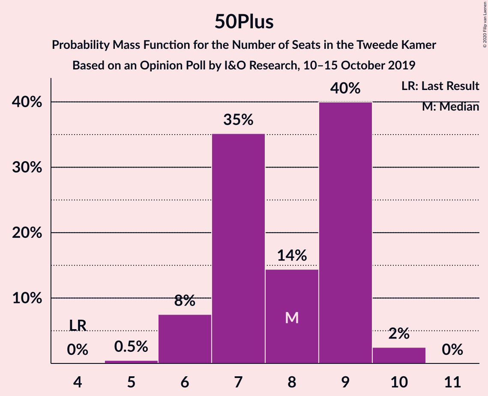

| Number of Seats | Probability | Accumulated | Special Marks |
|:---------------:|:-----------:|:-----------:|:-------------:|
| 4 | 0% | 100% | Last Result |
| 5 | 0.5% | 100% |  |
| 6 | 8% | 99.5% |  |
| 7 | 35% | 92% |  |
| 8 | 14% | 57% | Median |
| 9 | 40% | 42% |  |
| 10 | 2% | 2% |  |
| 11 | 0% | 0% |  |

### Socialistische Partij

*For a full overview of the results for this party, see the [Socialistische Partij](party-socialistischepartij.html) page.*

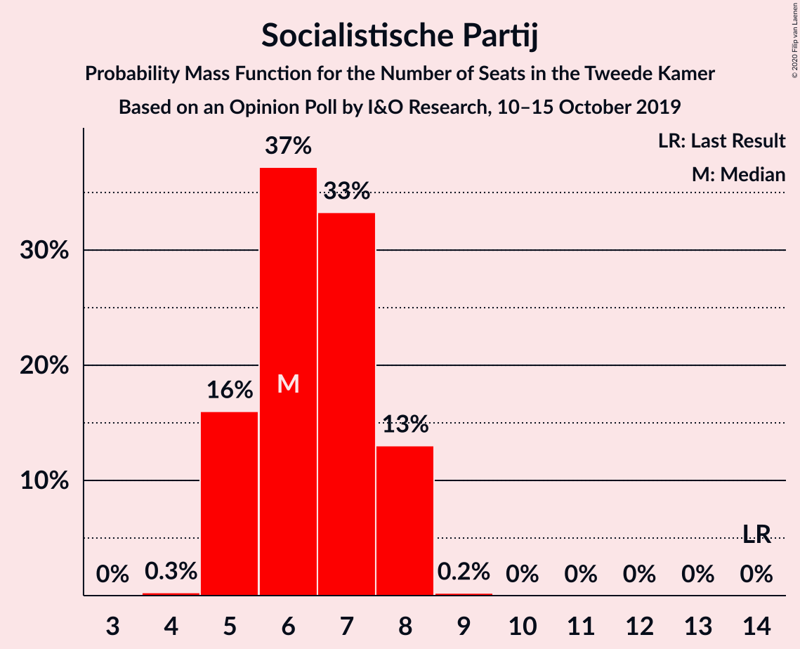

| Number of Seats | Probability | Accumulated | Special Marks |
|:---------------:|:-----------:|:-----------:|:-------------:|
| 4 | 0.3% | 100% |  |
| 5 | 16% | 99.7% |  |
| 6 | 37% | 84% | Median |
| 7 | 33% | 47% |  |
| 8 | 13% | 13% |  |
| 9 | 0.2% | 0.2% |  |
| 10 | 0% | 0% |  |
| 11 | 0% | 0% |  |
| 12 | 0% | 0% |  |
| 13 | 0% | 0% |  |
| 14 | 0% | 0% | Last Result |

### Partij voor de Dieren

*For a full overview of the results for this party, see the [Partij voor de Dieren](party-partijvoordedieren.html) page.*

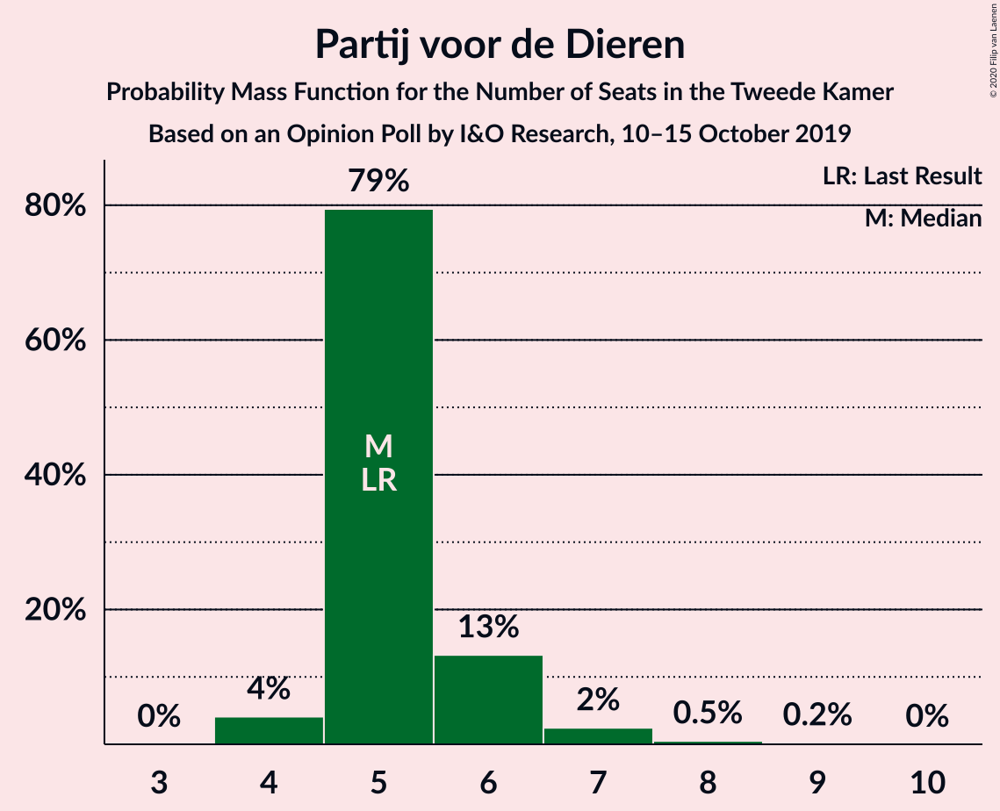

| Number of Seats | Probability | Accumulated | Special Marks |
|:---------------:|:-----------:|:-----------:|:-------------:|
| 4 | 4% | 100% |  |
| 5 | 79% | 96% | Last Result, Median |
| 6 | 13% | 16% |  |
| 7 | 2% | 3% |  |
| 8 | 0.5% | 0.7% |  |
| 9 | 0.2% | 0.2% |  |
| 10 | 0% | 0% |  |

### Staatkundig Gereformeerde Partij

*For a full overview of the results for this party, see the [Staatkundig Gereformeerde Partij](party-staatkundiggereformeerdepartij.html) page.*

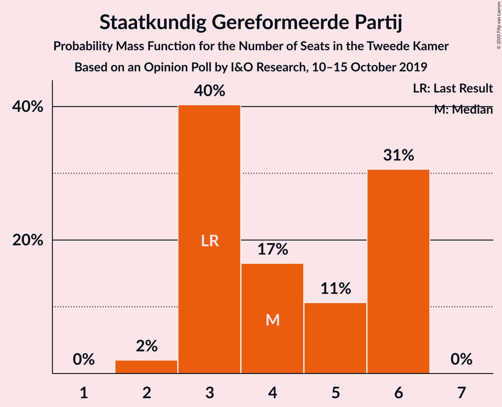

| Number of Seats | Probability | Accumulated | Special Marks |
|:---------------:|:-----------:|:-----------:|:-------------:|
| 2 | 2% | 100% |  |
| 3 | 40% | 98% | Last Result |
| 4 | 17% | 58% | Median |
| 5 | 11% | 41% |  |
| 6 | 31% | 31% |  |
| 7 | 0% | 0% |  |

### DENK

*For a full overview of the results for this party, see the [DENK](party-denk.html) page.*

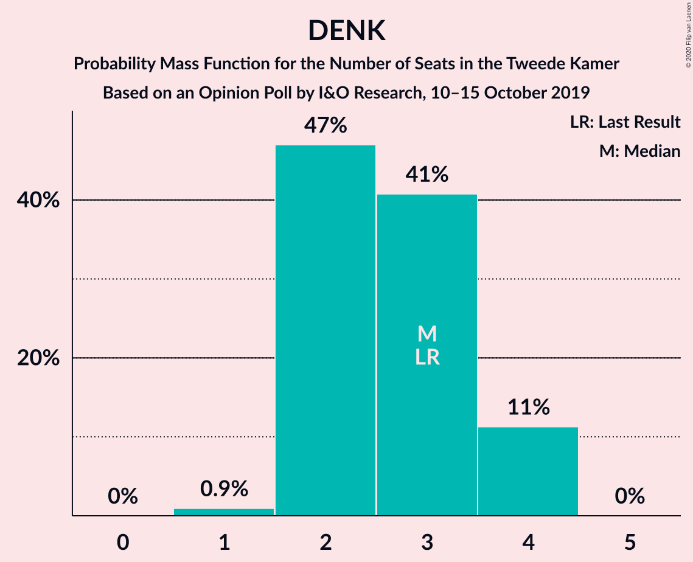

| Number of Seats | Probability | Accumulated | Special Marks |
|:---------------:|:-----------:|:-----------:|:-------------:|
| 1 | 0.9% | 100% |  |
| 2 | 47% | 99.1% |  |
| 3 | 41% | 52% | Last Result, Median |
| 4 | 11% | 11% |  |
| 5 | 0% | 0% |  |

## Coalitions

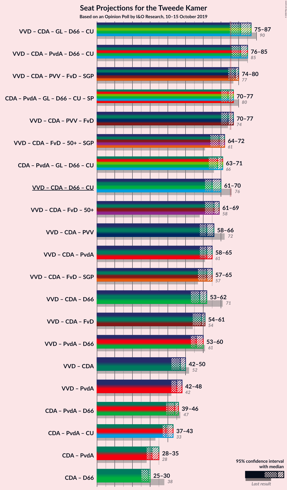

### Confidence Intervals

| Coalition | Last Result | Median | Majority? | 80% Confidence Interval | 90% Confidence Interval | 95% Confidence Interval | 99% Confidence Interval |
|:---------:|:-----------:|:------:|:---------:|:-----------------------:|:-----------------------:|:-----------------------:|:-----------------------:|
| Volkspartij voor Vrijheid en Democratie – Christen-Democratisch Appèl – GroenLinks – Democraten 66 – ChristenUnie | 90 | 80 | 99.6% | 76–85 | 76–85 | 76–85 | 76–87 |
| Volkspartij voor Vrijheid en Democratie – Christen-Democratisch Appèl – Partij van de Arbeid – Democraten 66 – ChristenUnie | 85 | 82 | 100% | 76–83 | 76–84 | 76–85 | 76–87 |
| Volkspartij voor Vrijheid en Democratie – Christen-Democratisch Appèl – Partij voor de Vrijheid – Forum voor Democratie – Staatkundig Gereformeerde Partij | 77 | 76 | 78% | 74–78 | 74–78 | 72–80 | 69–80 |
| Christen-Democratisch Appèl – Partij van de Arbeid – GroenLinks – Democraten 66 – ChristenUnie – Socialistische Partij | 80 | 74 | 7% | 72–75 | 72–76 | 72–78 | 70–80 |
| Volkspartij voor Vrijheid en Democratie – Christen-Democratisch Appèl – Partij voor de Vrijheid – Forum voor Democratie | 74 | 72 | 3% | 70–73 | 70–73 | 69–76 | 66–76 |
| Volkspartij voor Vrijheid en Democratie – Christen-Democratisch Appèl – Forum voor Democratie – 50Plus – Staatkundig Gereformeerde Partij | 61 | 70 | 0% | 67–71 | 67–72 | 65–72 | 61–73 |
| Christen-Democratisch Appèl – Partij van de Arbeid – GroenLinks – Democraten 66 – ChristenUnie | 66 | 68 | 0% | 64–69 | 64–70 | 64–72 | 64–74 |
| Volkspartij voor Vrijheid en Democratie – Christen-Democratisch Appèl – Democraten 66 – ChristenUnie | 76 | 65 | 0% | 61–69 | 61–69 | 61–69 | 61–71 |
| Volkspartij voor Vrijheid en Democratie – Christen-Democratisch Appèl – Forum voor Democratie – 50Plus | 58 | 65 | 0% | 63–68 | 63–68 | 61–68 | 58–69 |
| Volkspartij voor Vrijheid en Democratie – Christen-Democratisch Appèl – Forum voor Democratie – Staatkundig Gereformeerde Partij | 57 | 62 | 0% | 58–64 | 58–64 | 57–65 | 54–65 |
| Volkspartij voor Vrijheid en Democratie – Christen-Democratisch Appèl – Partij van de Arbeid | 61 | 61 | 0% | 57–62 | 57–64 | 57–65 | 57–67 |
| Volkspartij voor Vrijheid en Democratie – Christen-Democratisch Appèl – Partij voor de Vrijheid | 72 | 59 | 0% | 58–61 | 58–61 | 57–63 | 56–64 |
| Volkspartij voor Vrijheid en Democratie – Christen-Democratisch Appèl – Forum voor Democratie | 54 | 57 | 0% | 54–59 | 54–59 | 53–61 | 51–61 |
| Volkspartij voor Vrijheid en Democratie – Christen-Democratisch Appèl – Democraten 66 | 71 | 58 | 0% | 52–61 | 52–61 | 52–61 | 52–62 |
| Volkspartij voor Vrijheid en Democratie – Partij van de Arbeid – Democraten 66 | 61 | 58 | 0% | 52–59 | 52–60 | 52–61 | 52–63 |
| Volkspartij voor Vrijheid en Democratie – Partij van de Arbeid | 42 | 45 | 0% | 42–46 | 42–48 | 42–50 | 40–51 |
| Volkspartij voor Vrijheid en Democratie – Christen-Democratisch Appèl | 52 | 45 | 0% | 42–47 | 42–47 | 42–48 | 41–50 |
| Christen-Democratisch Appèl – Partij van de Arbeid – Democraten 66 | 47 | 44 | 0% | 40–46 | 40–46 | 40–46 | 40–47 |
| Christen-Democratisch Appèl – Partij van de Arbeid – ChristenUnie | 33 | 39 | 0% | 38–41 | 38–42 | 38–43 | 37–44 |
| Christen-Democratisch Appèl – Partij van de Arbeid | 28 | 31 | 0% | 30–33 | 30–33 | 29–34 | 29–36 |
| Christen-Democratisch Appèl – Democraten 66 | 38 | 29 | 0% | 25–30 | 25–30 | 25–30 | 25–31 |

### Volkspartij voor Vrijheid en Democratie – Christen-Democratisch Appèl – GroenLinks – Democraten 66 – ChristenUnie

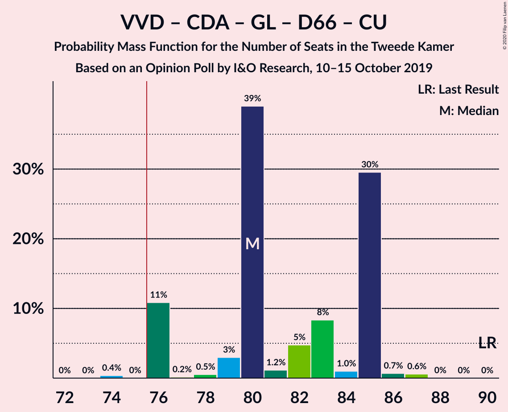

| Number of Seats | Probability | Accumulated | Special Marks |
|:---------------:|:-----------:|:-----------:|:-------------:|
| 74 | 0.4% | 100% |  |
| 75 | 0% | 99.6% |  |
| 76 | 11% | 99.6% | Majority |
| 77 | 0.2% | 89% |  |
| 78 | 0.5% | 89% |  |
| 79 | 3% | 88% |  |
| 80 | 39% | 85% |  |
| 81 | 1.2% | 46% | Median |
| 82 | 5% | 45% |  |
| 83 | 8% | 40% |  |
| 84 | 1.0% | 32% |  |
| 85 | 30% | 31% |  |
| 86 | 0.7% | 1.3% |  |
| 87 | 0.6% | 0.6% |  |
| 88 | 0% | 0% |  |
| 89 | 0% | 0% |  |
| 90 | 0% | 0% | Last Result |

### Volkspartij voor Vrijheid en Democratie – Christen-Democratisch Appèl – Partij van de Arbeid – Democraten 66 – ChristenUnie

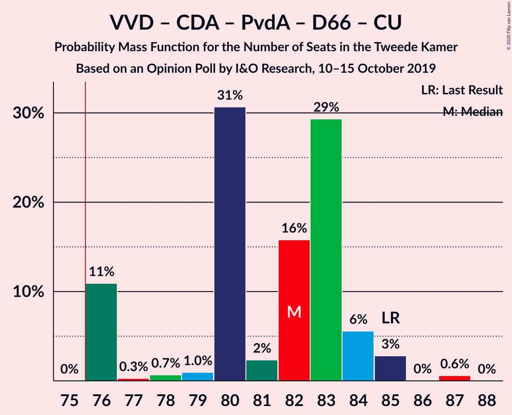

| Number of Seats | Probability | Accumulated | Special Marks |
|:---------------:|:-----------:|:-----------:|:-------------:|
| 76 | 11% | 100% | Majority |
| 77 | 0.3% | 89% |  |
| 78 | 0.7% | 89% |  |
| 79 | 1.0% | 88% |  |
| 80 | 31% | 87% |  |
| 81 | 2% | 56% | Median |
| 82 | 16% | 54% |  |
| 83 | 29% | 38% |  |
| 84 | 6% | 9% |  |
| 85 | 3% | 3% | Last Result |
| 86 | 0% | 0.6% |  |
| 87 | 0.6% | 0.6% |  |
| 88 | 0% | 0% |  |

### Volkspartij voor Vrijheid en Democratie – Christen-Democratisch Appèl – Partij voor de Vrijheid – Forum voor Democratie – Staatkundig Gereformeerde Partij

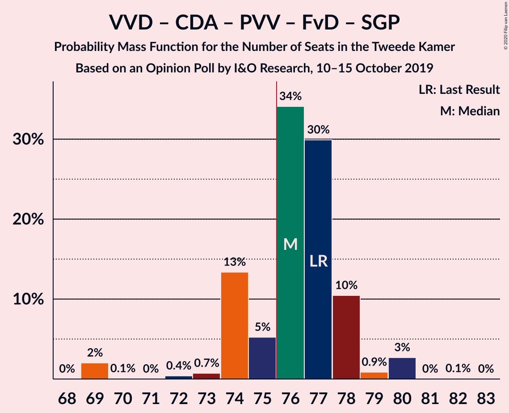

| Number of Seats | Probability | Accumulated | Special Marks |
|:---------------:|:-----------:|:-----------:|:-------------:|
| 69 | 2% | 100% |  |
| 70 | 0.1% | 98% |  |
| 71 | 0% | 98% |  |
| 72 | 0.4% | 98% |  |
| 73 | 0.7% | 97% |  |
| 74 | 13% | 97% |  |
| 75 | 5% | 83% | Median |
| 76 | 34% | 78% | Majority |
| 77 | 30% | 44% | Last Result |
| 78 | 10% | 14% |  |
| 79 | 0.9% | 4% |  |
| 80 | 3% | 3% |  |
| 81 | 0% | 0.1% |  |
| 82 | 0.1% | 0.1% |  |
| 83 | 0% | 0% |  |

### Christen-Democratisch Appèl – Partij van de Arbeid – GroenLinks – Democraten 66 – ChristenUnie – Socialistische Partij

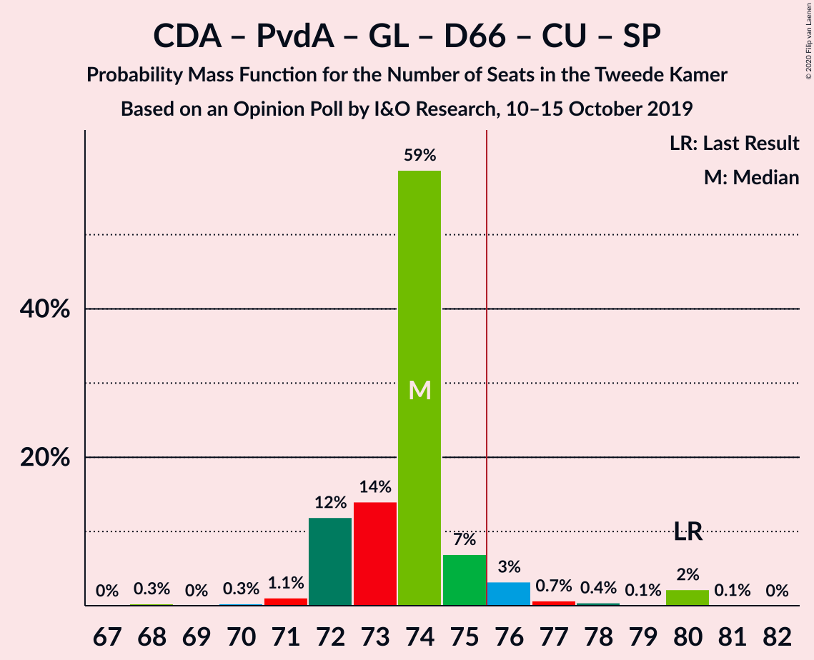

| Number of Seats | Probability | Accumulated | Special Marks |
|:---------------:|:-----------:|:-----------:|:-------------:|
| 68 | 0.3% | 100% |  |
| 69 | 0% | 99.7% |  |
| 70 | 0.3% | 99.7% |  |
| 71 | 1.1% | 99.4% |  |
| 72 | 12% | 98% |  |
| 73 | 14% | 86% | Median |
| 74 | 59% | 72% |  |
| 75 | 7% | 14% |  |
| 76 | 3% | 7% | Majority |
| 77 | 0.7% | 3% |  |
| 78 | 0.4% | 3% |  |
| 79 | 0.1% | 2% |  |
| 80 | 2% | 2% | Last Result |
| 81 | 0.1% | 0.1% |  |
| 82 | 0% | 0% |  |

### Volkspartij voor Vrijheid en Democratie – Christen-Democratisch Appèl – Partij voor de Vrijheid – Forum voor Democratie

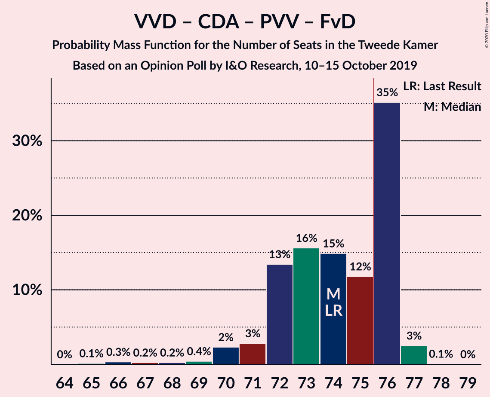

| Number of Seats | Probability | Accumulated | Special Marks |
|:---------------:|:-----------:|:-----------:|:-------------:|
| 66 | 2% | 100% |  |
| 67 | 0% | 98% |  |
| 68 | 0.2% | 98% |  |
| 69 | 0.9% | 98% |  |
| 70 | 12% | 97% |  |
| 71 | 32% | 84% | Median |
| 72 | 4% | 52% |  |
| 73 | 44% | 49% |  |
| 74 | 1.0% | 5% | Last Result |
| 75 | 0.8% | 3% |  |
| 76 | 3% | 3% | Majority |
| 77 | 0% | 0.1% |  |
| 78 | 0% | 0.1% |  |
| 79 | 0.1% | 0.1% |  |
| 80 | 0% | 0% |  |

### Volkspartij voor Vrijheid en Democratie – Christen-Democratisch Appèl – Forum voor Democratie – 50Plus – Staatkundig Gereformeerde Partij

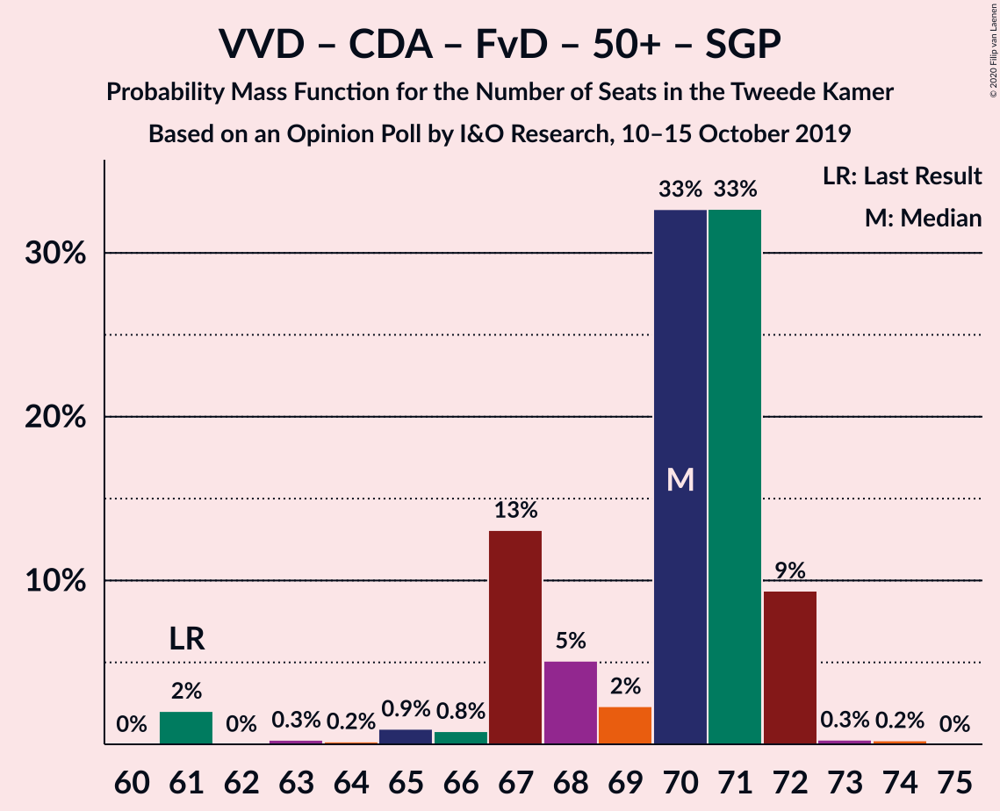

| Number of Seats | Probability | Accumulated | Special Marks |
|:---------------:|:-----------:|:-----------:|:-------------:|
| 61 | 2% | 100% | Last Result |
| 62 | 0% | 98% |  |
| 63 | 0.3% | 98% |  |
| 64 | 0.2% | 98% |  |
| 65 | 0.9% | 98% |  |
| 66 | 0.8% | 97% |  |
| 67 | 13% | 96% |  |
| 68 | 5% | 83% |  |
| 69 | 2% | 78% | Median |
| 70 | 33% | 75% |  |
| 71 | 33% | 43% |  |
| 72 | 9% | 10% |  |
| 73 | 0.3% | 0.5% |  |
| 74 | 0.2% | 0.2% |  |
| 75 | 0% | 0% |  |

### Christen-Democratisch Appèl – Partij van de Arbeid – GroenLinks – Democraten 66 – ChristenUnie

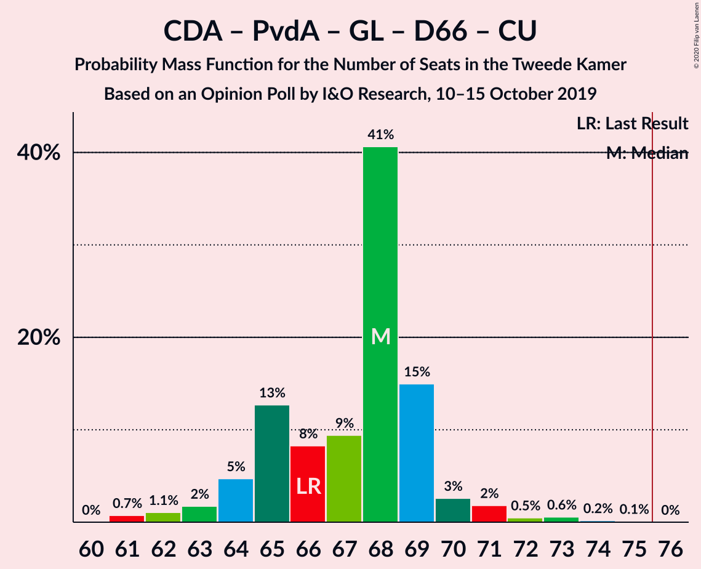

| Number of Seats | Probability | Accumulated | Special Marks |
|:---------------:|:-----------:|:-----------:|:-------------:|
| 59 | 0.2% | 100% |  |
| 60 | 0.1% | 99.8% |  |
| 61 | 0% | 99.8% |  |
| 62 | 0.1% | 99.8% |  |
| 63 | 0% | 99.7% |  |
| 64 | 11% | 99.7% |  |
| 65 | 0.7% | 88% |  |
| 66 | 1.0% | 88% | Last Result |
| 67 | 33% | 87% | Median |
| 68 | 43% | 54% |  |
| 69 | 3% | 11% |  |
| 70 | 4% | 8% |  |
| 71 | 0.4% | 3% |  |
| 72 | 0.4% | 3% |  |
| 73 | 0.2% | 2% |  |
| 74 | 2% | 2% |  |
| 75 | 0% | 0% |  |

### Volkspartij voor Vrijheid en Democratie – Christen-Democratisch Appèl – Democraten 66 – ChristenUnie

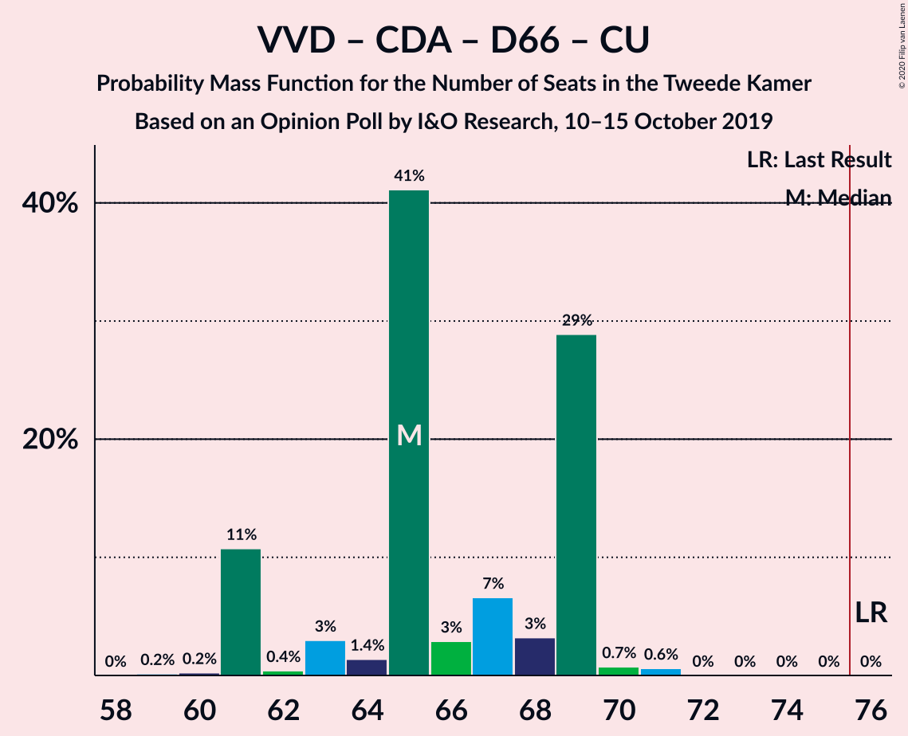

| Number of Seats | Probability | Accumulated | Special Marks |
|:---------------:|:-----------:|:-----------:|:-------------:|
| 59 | 0.2% | 100% |  |
| 60 | 0.2% | 99.8% |  |
| 61 | 11% | 99.6% |  |
| 62 | 0.4% | 89% |  |
| 63 | 3% | 88% |  |
| 64 | 1.4% | 85% |  |
| 65 | 41% | 84% |  |
| 66 | 3% | 43% | Median |
| 67 | 7% | 40% |  |
| 68 | 3% | 33% |  |
| 69 | 29% | 30% |  |
| 70 | 0.7% | 1.4% |  |
| 71 | 0.6% | 0.6% |  |
| 72 | 0% | 0% |  |
| 73 | 0% | 0% |  |
| 74 | 0% | 0% |  |
| 75 | 0% | 0% |  |
| 76 | 0% | 0% | Last Result, Majority |

### Volkspartij voor Vrijheid en Democratie – Christen-Democratisch Appèl – Forum voor Democratie – 50Plus

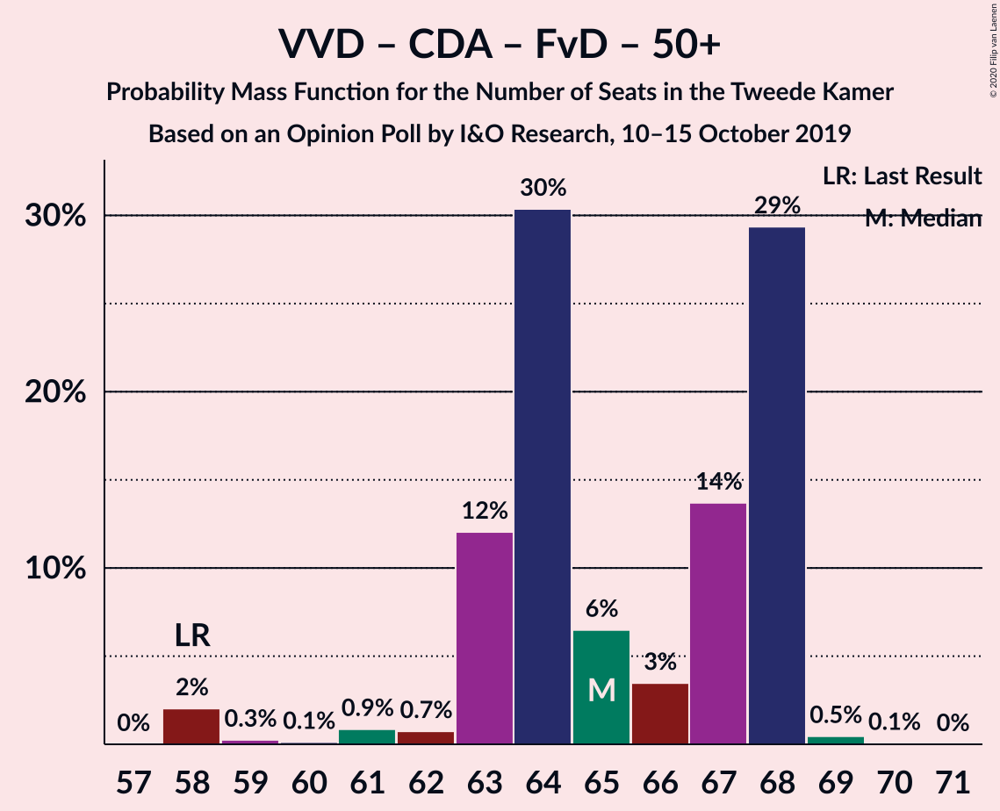

| Number of Seats | Probability | Accumulated | Special Marks |
|:---------------:|:-----------:|:-----------:|:-------------:|
| 58 | 2% | 100% | Last Result |
| 59 | 0.3% | 98% |  |
| 60 | 0.1% | 98% |  |
| 61 | 0.9% | 98% |  |
| 62 | 0.7% | 97% |  |
| 63 | 12% | 96% |  |
| 64 | 30% | 84% |  |
| 65 | 6% | 54% | Median |
| 66 | 3% | 47% |  |
| 67 | 14% | 44% |  |
| 68 | 29% | 30% |  |
| 69 | 0.5% | 0.5% |  |
| 70 | 0.1% | 0.1% |  |
| 71 | 0% | 0% |  |

### Volkspartij voor Vrijheid en Democratie – Christen-Democratisch Appèl – Forum voor Democratie – Staatkundig Gereformeerde Partij

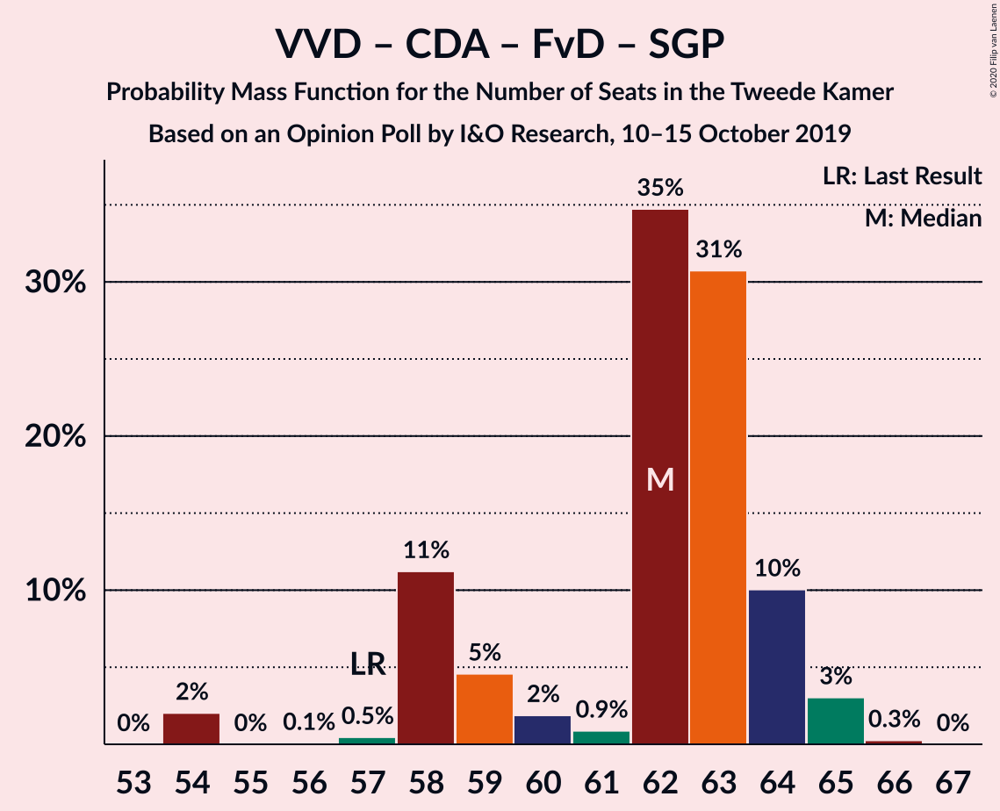

| Number of Seats | Probability | Accumulated | Special Marks |
|:---------------:|:-----------:|:-----------:|:-------------:|
| 54 | 2% | 100% |  |
| 55 | 0% | 98% |  |
| 56 | 0.1% | 98% |  |
| 57 | 0.5% | 98% | Last Result |
| 58 | 11% | 97% |  |
| 59 | 5% | 86% |  |
| 60 | 2% | 82% |  |
| 61 | 0.9% | 80% | Median |
| 62 | 35% | 79% |  |
| 63 | 31% | 44% |  |
| 64 | 10% | 13% |  |
| 65 | 3% | 3% |  |
| 66 | 0.3% | 0.3% |  |
| 67 | 0% | 0% |  |

### Volkspartij voor Vrijheid en Democratie – Christen-Democratisch Appèl – Partij van de Arbeid

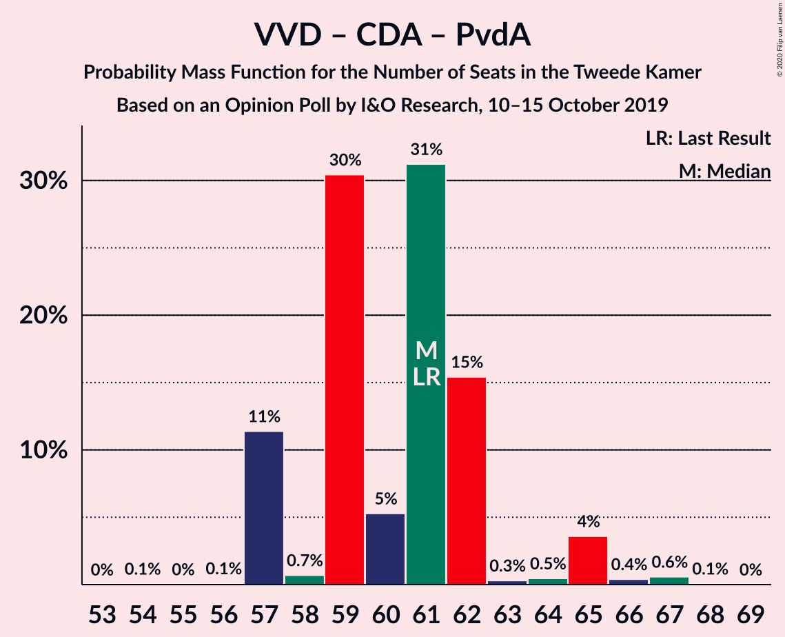

| Number of Seats | Probability | Accumulated | Special Marks |
|:---------------:|:-----------:|:-----------:|:-------------:|
| 54 | 0.1% | 100% |  |
| 55 | 0% | 99.9% |  |
| 56 | 0.1% | 99.9% |  |
| 57 | 11% | 99.8% |  |
| 58 | 0.7% | 88% |  |
| 59 | 30% | 88% |  |
| 60 | 5% | 57% | Median |
| 61 | 31% | 52% | Last Result |
| 62 | 15% | 21% |  |
| 63 | 0.3% | 5% |  |
| 64 | 0.5% | 5% |  |
| 65 | 4% | 5% |  |
| 66 | 0.4% | 1.1% |  |
| 67 | 0.6% | 0.7% |  |
| 68 | 0.1% | 0.1% |  |
| 69 | 0% | 0% |  |

### Volkspartij voor Vrijheid en Democratie – Christen-Democratisch Appèl – Partij voor de Vrijheid

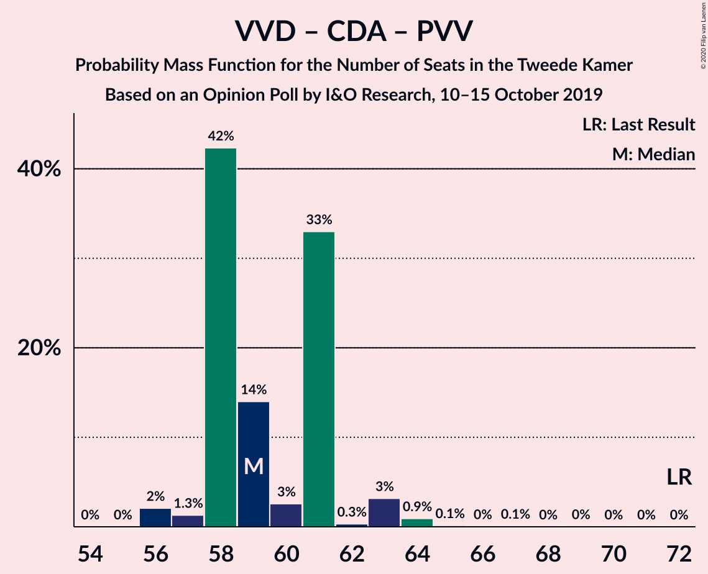

| Number of Seats | Probability | Accumulated | Special Marks |
|:---------------:|:-----------:|:-----------:|:-------------:|
| 56 | 2% | 100% |  |
| 57 | 1.3% | 98% |  |
| 58 | 42% | 97% |  |
| 59 | 14% | 54% | Median |
| 60 | 3% | 40% |  |
| 61 | 33% | 38% |  |
| 62 | 0.3% | 5% |  |
| 63 | 3% | 4% |  |
| 64 | 0.9% | 1.2% |  |
| 65 | 0.1% | 0.3% |  |
| 66 | 0% | 0.2% |  |
| 67 | 0.1% | 0.1% |  |
| 68 | 0% | 0% |  |
| 69 | 0% | 0% |  |
| 70 | 0% | 0% |  |
| 71 | 0% | 0% |  |
| 72 | 0% | 0% | Last Result |

### Volkspartij voor Vrijheid en Democratie – Christen-Democratisch Appèl – Forum voor Democratie

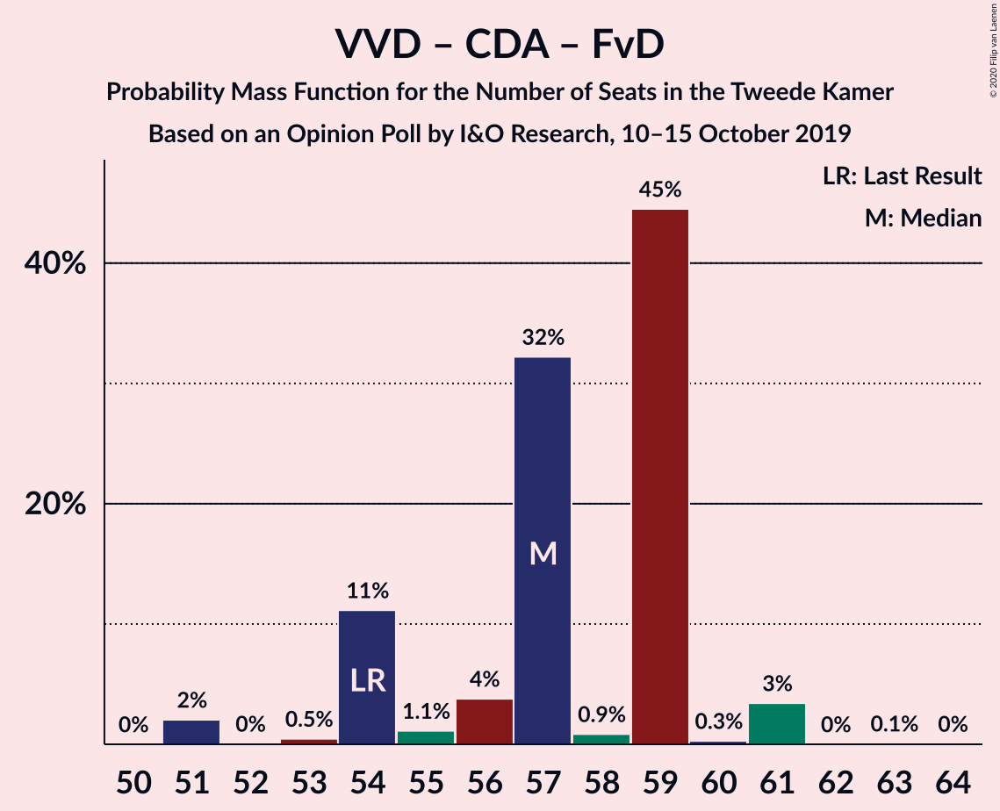

| Number of Seats | Probability | Accumulated | Special Marks |
|:---------------:|:-----------:|:-----------:|:-------------:|
| 51 | 2% | 100% |  |
| 52 | 0% | 98% |  |
| 53 | 0.5% | 98% |  |
| 54 | 11% | 97% | Last Result |
| 55 | 1.1% | 86% |  |
| 56 | 4% | 85% |  |
| 57 | 32% | 81% | Median |
| 58 | 0.9% | 49% |  |
| 59 | 45% | 48% |  |
| 60 | 0.3% | 4% |  |
| 61 | 3% | 4% |  |
| 62 | 0% | 0.1% |  |
| 63 | 0.1% | 0.1% |  |
| 64 | 0% | 0% |  |

### Volkspartij voor Vrijheid en Democratie – Christen-Democratisch Appèl – Democraten 66

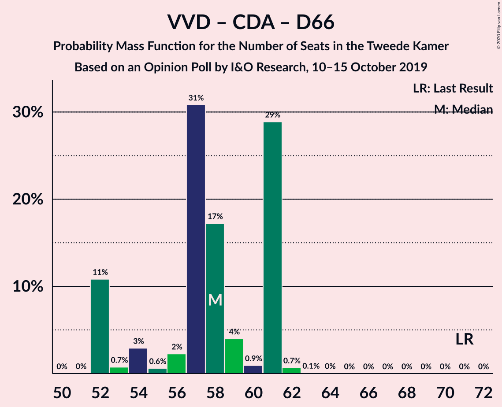

| Number of Seats | Probability | Accumulated | Special Marks |
|:---------------:|:-----------:|:-----------:|:-------------:|
| 52 | 11% | 100% |  |
| 53 | 0.7% | 89% |  |
| 54 | 3% | 88% |  |
| 55 | 0.6% | 85% |  |
| 56 | 2% | 85% |  |
| 57 | 31% | 83% |  |
| 58 | 17% | 52% | Median |
| 59 | 4% | 35% |  |
| 60 | 0.9% | 31% |  |
| 61 | 29% | 30% |  |
| 62 | 0.7% | 0.8% |  |
| 63 | 0.1% | 0.1% |  |
| 64 | 0% | 0% |  |
| 65 | 0% | 0% |  |
| 66 | 0% | 0% |  |
| 67 | 0% | 0% |  |
| 68 | 0% | 0% |  |
| 69 | 0% | 0% |  |
| 70 | 0% | 0% |  |
| 71 | 0% | 0% | Last Result |

### Volkspartij voor Vrijheid en Democratie – Partij van de Arbeid – Democraten 66

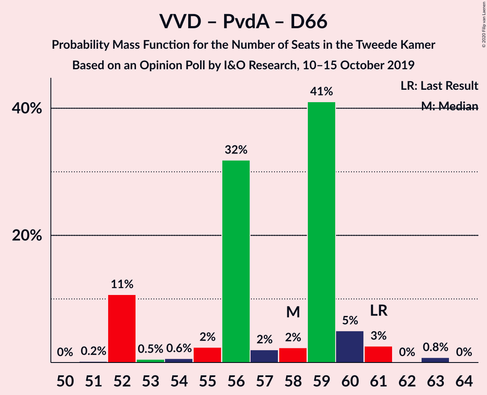

| Number of Seats | Probability | Accumulated | Special Marks |
|:---------------:|:-----------:|:-----------:|:-------------:|
| 51 | 0.2% | 100% |  |
| 52 | 11% | 99.8% |  |
| 53 | 0.5% | 89% |  |
| 54 | 0.6% | 89% |  |
| 55 | 2% | 88% |  |
| 56 | 32% | 86% |  |
| 57 | 2% | 54% | Median |
| 58 | 2% | 52% |  |
| 59 | 41% | 49% |  |
| 60 | 5% | 8% |  |
| 61 | 3% | 3% | Last Result |
| 62 | 0% | 0.8% |  |
| 63 | 0.8% | 0.8% |  |
| 64 | 0% | 0% |  |

### Volkspartij voor Vrijheid en Democratie – Partij van de Arbeid

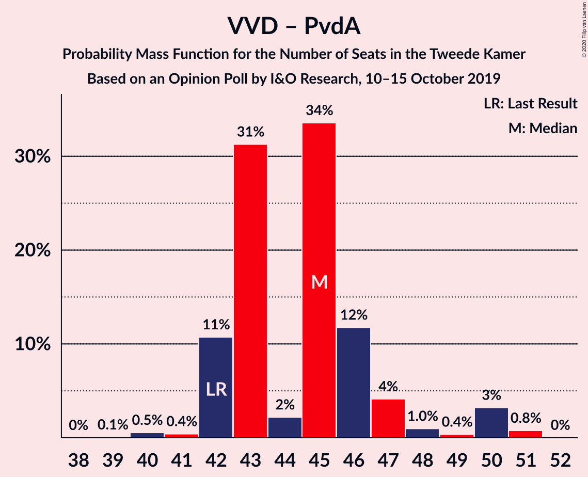

| Number of Seats | Probability | Accumulated | Special Marks |
|:---------------:|:-----------:|:-----------:|:-------------:|
| 39 | 0.1% | 100% |  |
| 40 | 0.5% | 99.9% |  |
| 41 | 0.4% | 99.4% |  |
| 42 | 11% | 99.0% | Last Result |
| 43 | 31% | 88% |  |
| 44 | 2% | 57% | Median |
| 45 | 34% | 55% |  |
| 46 | 12% | 21% |  |
| 47 | 4% | 9% |  |
| 48 | 1.0% | 5% |  |
| 49 | 0.4% | 4% |  |
| 50 | 3% | 4% |  |
| 51 | 0.8% | 0.8% |  |
| 52 | 0% | 0% |  |

### Volkspartij voor Vrijheid en Democratie – Christen-Democratisch Appèl

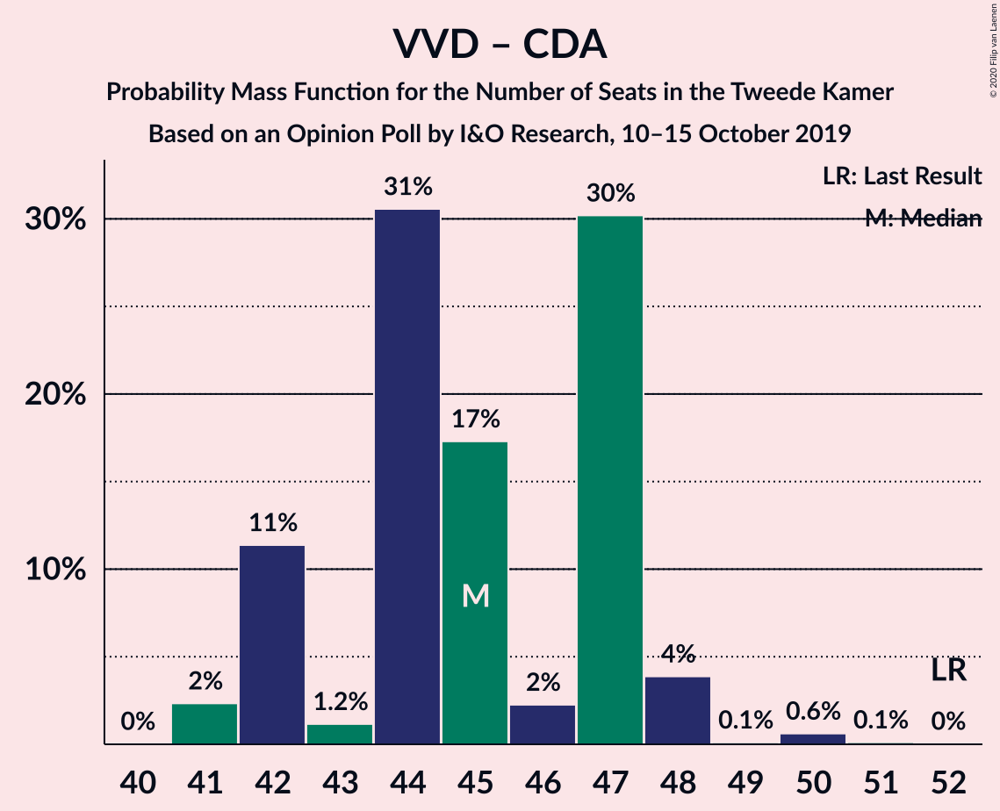

| Number of Seats | Probability | Accumulated | Special Marks |
|:---------------:|:-----------:|:-----------:|:-------------:|
| 41 | 2% | 100% |  |
| 42 | 11% | 98% |  |
| 43 | 1.2% | 86% |  |
| 44 | 31% | 85% |  |
| 45 | 17% | 55% | Median |
| 46 | 2% | 37% |  |
| 47 | 30% | 35% |  |
| 48 | 4% | 5% |  |
| 49 | 0.1% | 0.9% |  |
| 50 | 0.6% | 0.8% |  |
| 51 | 0.1% | 0.2% |  |
| 52 | 0% | 0% | Last Result |

### Christen-Democratisch Appèl – Partij van de Arbeid – Democraten 66

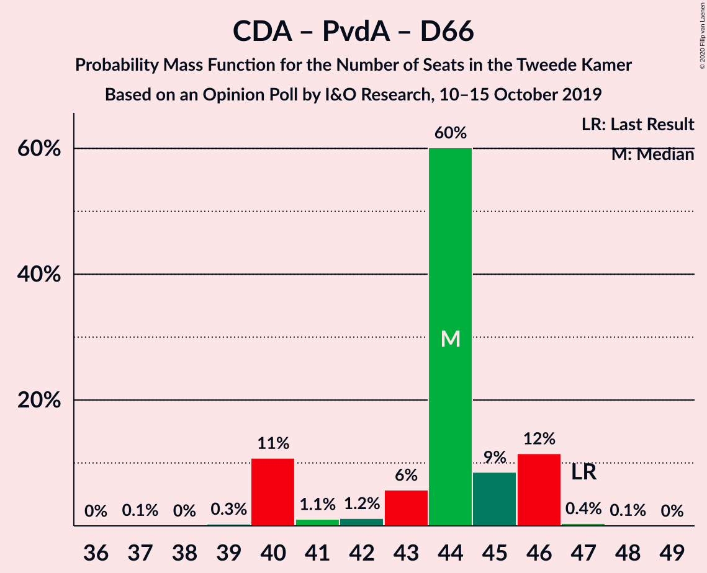

| Number of Seats | Probability | Accumulated | Special Marks |
|:---------------:|:-----------:|:-----------:|:-------------:|
| 37 | 0.1% | 100% |  |
| 38 | 0% | 99.9% |  |
| 39 | 0.3% | 99.8% |  |
| 40 | 11% | 99.5% |  |
| 41 | 1.1% | 89% |  |
| 42 | 1.2% | 88% |  |
| 43 | 6% | 86% |  |
| 44 | 60% | 81% | Median |
| 45 | 9% | 21% |  |
| 46 | 12% | 12% |  |
| 47 | 0.4% | 0.6% | Last Result |
| 48 | 0.1% | 0.1% |  |
| 49 | 0% | 0% |  |

### Christen-Democratisch Appèl – Partij van de Arbeid – ChristenUnie

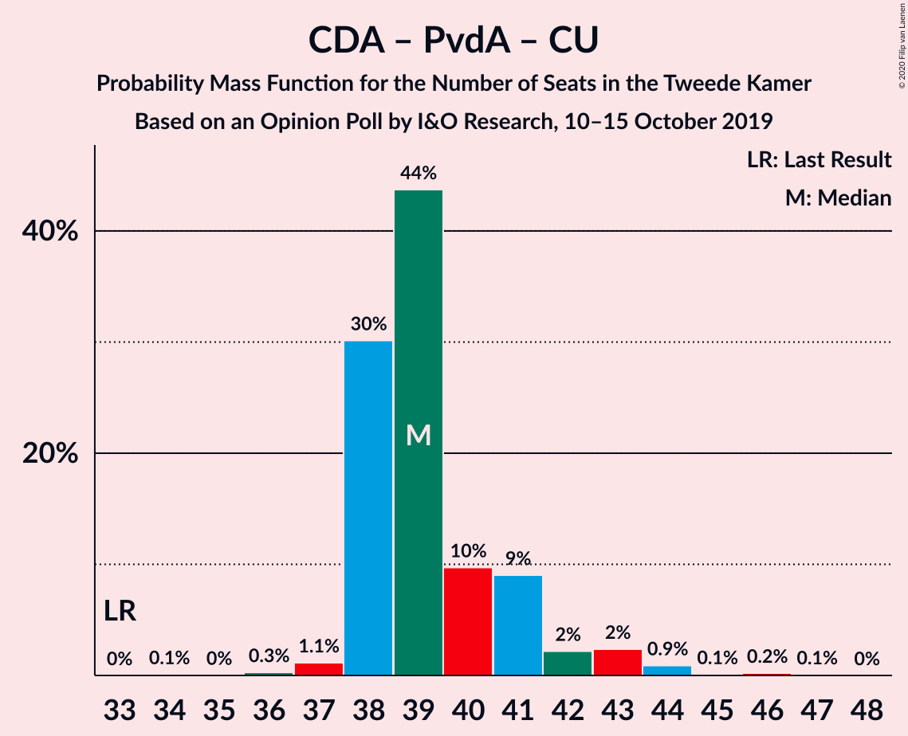

| Number of Seats | Probability | Accumulated | Special Marks |
|:---------------:|:-----------:|:-----------:|:-------------:|
| 33 | 0% | 100% | Last Result |
| 34 | 0.1% | 100% |  |
| 35 | 0% | 99.9% |  |
| 36 | 0.3% | 99.9% |  |
| 37 | 1.1% | 99.6% |  |
| 38 | 30% | 98% |  |
| 39 | 44% | 68% | Median |
| 40 | 10% | 25% |  |
| 41 | 9% | 15% |  |
| 42 | 2% | 6% |  |
| 43 | 2% | 4% |  |
| 44 | 0.9% | 1.3% |  |
| 45 | 0.1% | 0.4% |  |
| 46 | 0.2% | 0.3% |  |
| 47 | 0.1% | 0.1% |  |
| 48 | 0% | 0% |  |

### Christen-Democratisch Appèl – Partij van de Arbeid

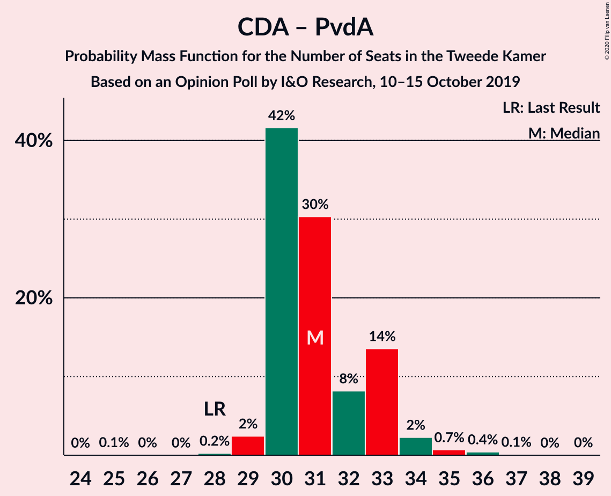

| Number of Seats | Probability | Accumulated | Special Marks |
|:---------------:|:-----------:|:-----------:|:-------------:|
| 25 | 0.1% | 100% |  |
| 26 | 0% | 99.9% |  |
| 27 | 0% | 99.9% |  |
| 28 | 0.2% | 99.9% | Last Result |
| 29 | 2% | 99.6% |  |
| 30 | 42% | 97% |  |
| 31 | 30% | 56% | Median |
| 32 | 8% | 25% |  |
| 33 | 14% | 17% |  |
| 34 | 2% | 4% |  |
| 35 | 0.7% | 1.3% |  |
| 36 | 0.4% | 0.6% |  |
| 37 | 0.1% | 0.2% |  |
| 38 | 0% | 0.1% |  |
| 39 | 0% | 0% |  |

### Christen-Democratisch Appèl – Democraten 66

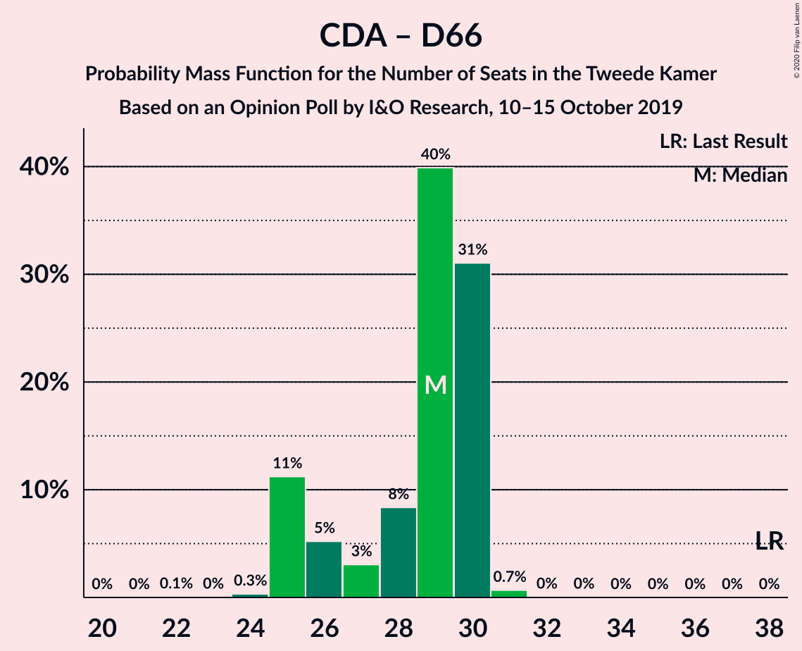

| Number of Seats | Probability | Accumulated | Special Marks |
|:---------------:|:-----------:|:-----------:|:-------------:|
| 22 | 0.1% | 100% |  |
| 23 | 0% | 99.9% |  |
| 24 | 0.3% | 99.9% |  |
| 25 | 11% | 99.6% |  |
| 26 | 5% | 88% |  |
| 27 | 3% | 83% |  |
| 28 | 8% | 80% |  |
| 29 | 40% | 72% | Median |
| 30 | 31% | 32% |  |
| 31 | 0.7% | 0.8% |  |
| 32 | 0% | 0.1% |  |
| 33 | 0% | 0.1% |  |
| 34 | 0% | 0% |  |
| 35 | 0% | 0% |  |
| 36 | 0% | 0% |  |
| 37 | 0% | 0% |  |
| 38 | 0% | 0% | Last Result |

## Technical Information

### Opinion Poll

+ **Polling firm:** I&O Research
+ **Commissioner(s):** —
+ **Fieldwork period:** 10–15 October 2019

### Calculations

+ **Sample size:** 1757
+ **Simulations done:** 131,072
+ **Error estimate:** 3.00%

