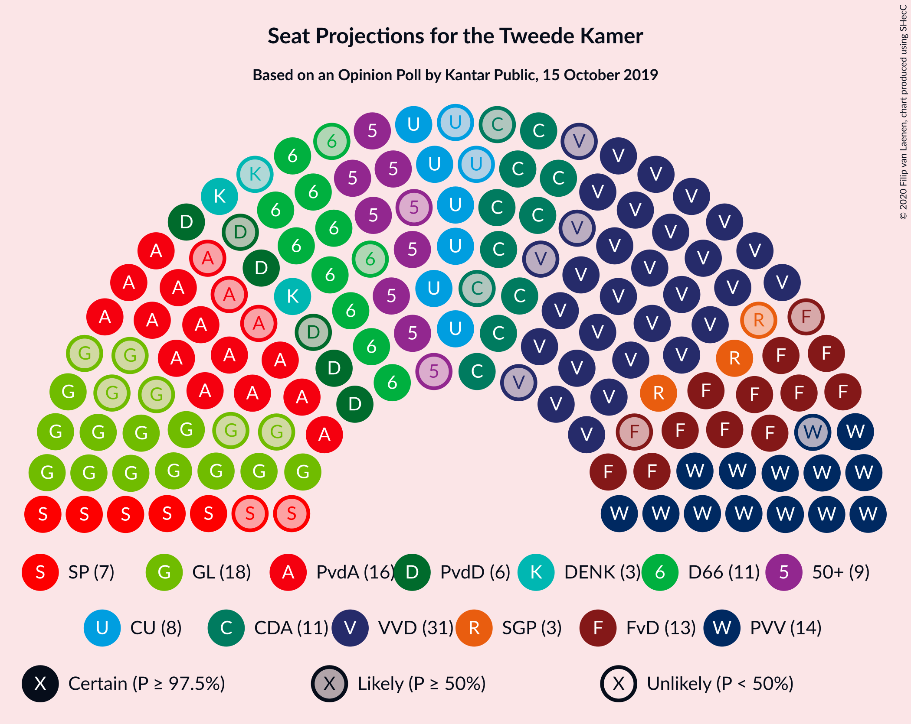
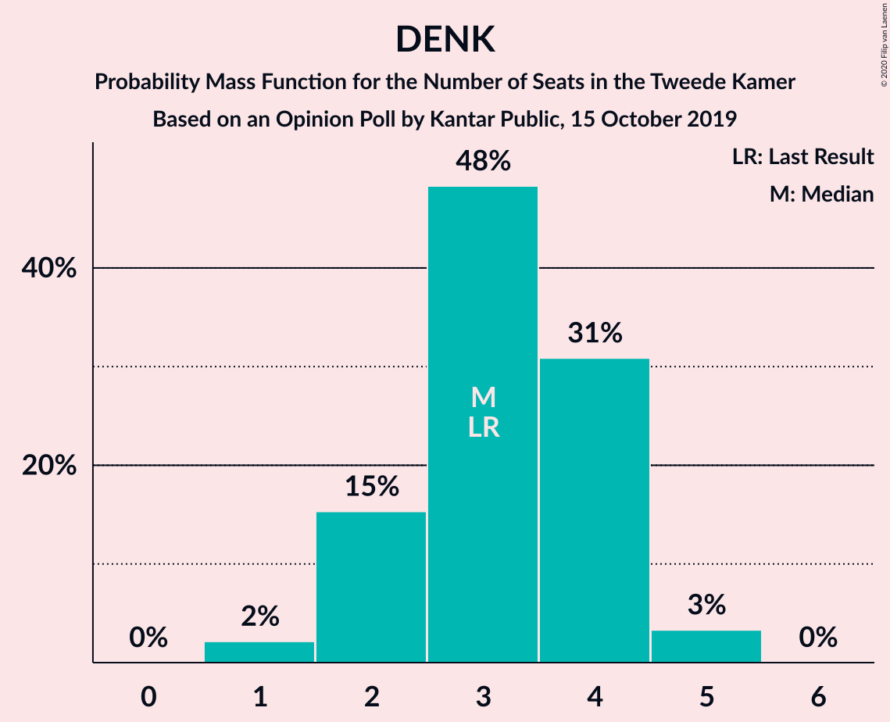
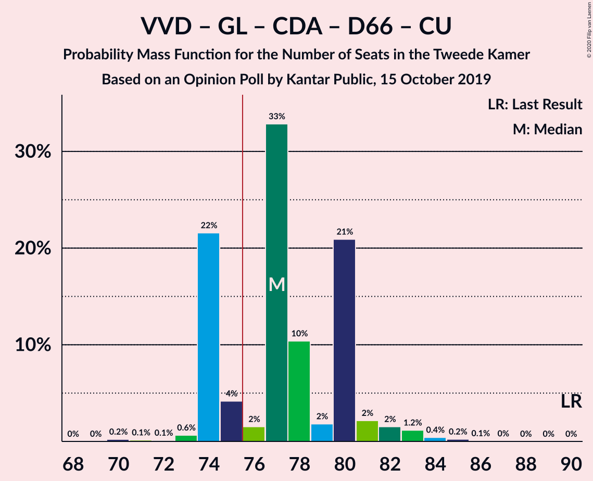
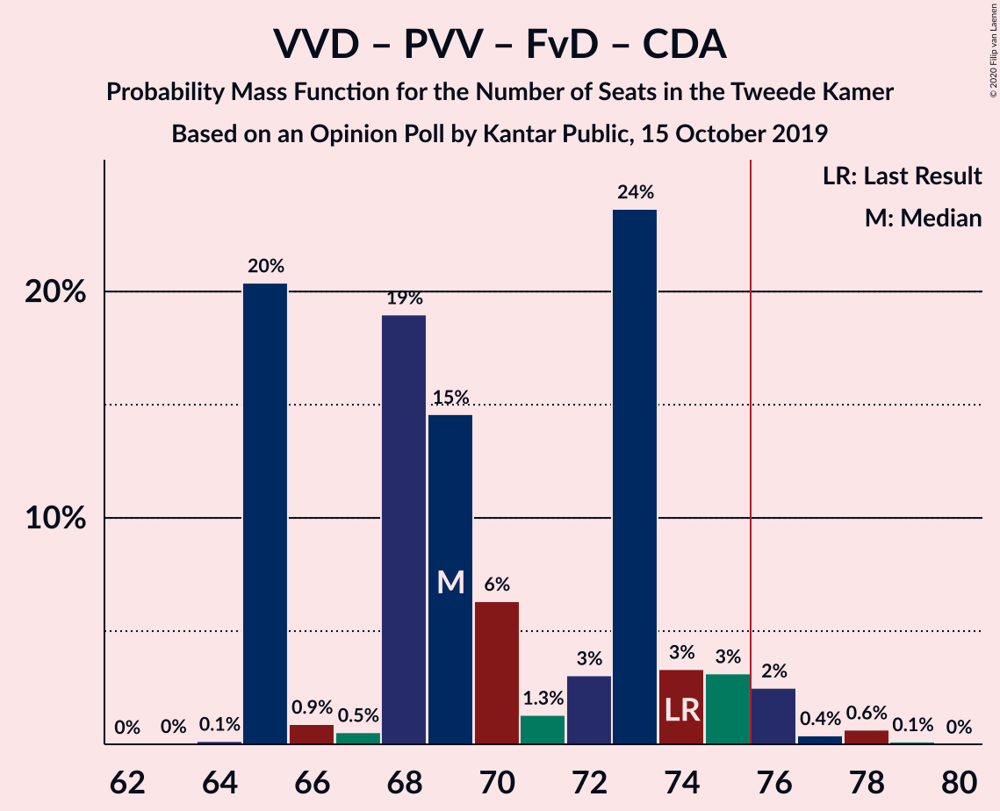
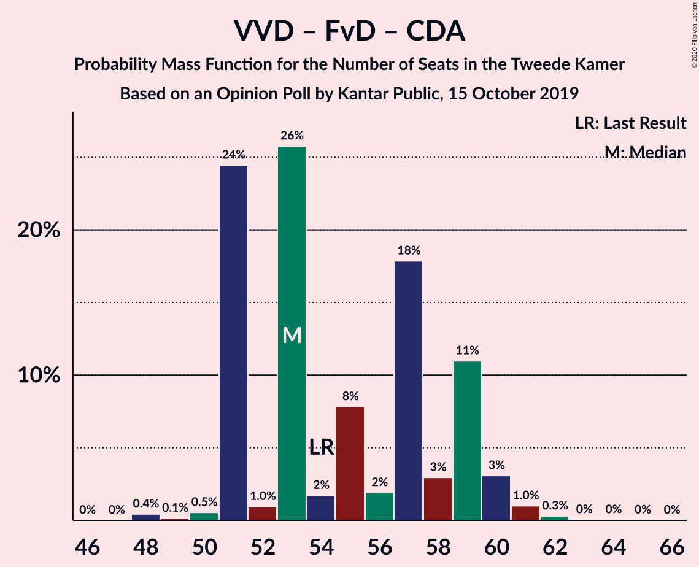
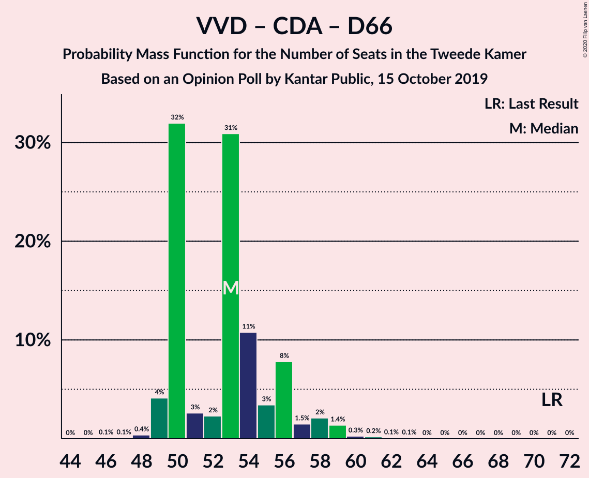
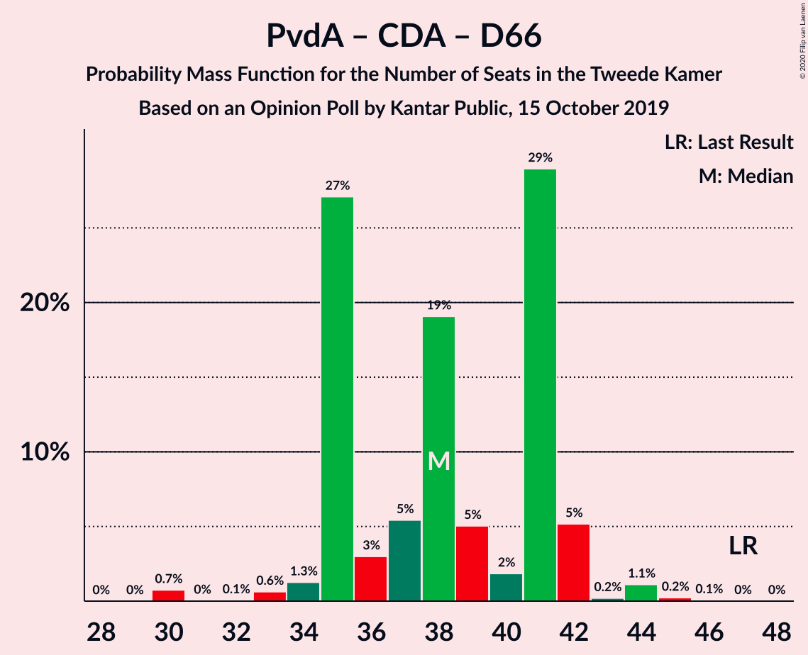

# Opinion Poll by Kantar Public, 15 October 2019

<a href="#voting-intentions">Voting Intentions</a> | <a href="#seats">Seats</a> | <a href="#coalitions">Coalitions</a> | <a href="#technical-information">Technical Information</a>

## Voting Intentions

### Confidence Intervals

| Party | Last Result | Poll Result | 80% Confidence Interval | 90% Confidence Interval | 95% Confidence Interval | 99% Confidence Interval |
|:-----:|:-----------:|:-----------:|:-----------------------:|:-----------------------:|:-----------------------:|:-----------------------:|
| Volkspartij voor Vrijheid en Democratie | 21.3% | 20.7% | 19.1–22.4% |18.6–22.9% |18.2–23.4% |17.5–24.2% |
| GroenLinks | 9.1% | 10.7% | 9.5–12.1% |9.2–12.5% |8.9–12.8% |8.4–13.5% |
| Partij van de Arbeid | 5.7% | 10.7% | 9.5–12.1% |9.2–12.5% |8.9–12.8% |8.4–13.5% |
| Partij voor de Vrijheid | 13.1% | 10.0% | 8.8–11.3% |8.5–11.7% |8.2–12.0% |7.7–12.7% |
| Forum voor Democratie | 1.8% | 8.7% | 7.6–10.0% |7.3–10.4% |7.1–10.7% |6.6–11.3% |
| Christen-Democratisch Appèl | 12.4% | 8.0% | 7.0–9.2% |6.7–9.6% |6.4–9.9% |6.0–10.5% |
| Democraten 66 | 12.2% | 7.3% | 6.4–8.6% |6.1–8.9% |5.9–9.2% |5.4–9.8% |
| 50Plus | 3.1% | 6.0% | 5.1–7.1% |4.8–7.4% |4.6–7.7% |4.3–8.2% |
| ChristenUnie | 3.4% | 5.4% | 4.5–6.4% |4.3–6.7% |4.1–7.0% |3.7–7.5% |
| Socialistische Partij | 9.1% | 4.6% | 3.9–5.6% |3.6–5.9% |3.5–6.1% |3.1–6.7% |
| Partij voor de Dieren | 3.2% | 4.0% | 3.3–4.9% |3.1–5.2% |2.9–5.4% |2.6–5.9% |
| Staatkundig Gereformeerde Partij | 2.1% | 2.0% | 1.5–2.7% |1.4–2.9% |1.3–3.1% |1.1–3.5% |
| DENK | 2.1% | 2.0% | 1.5–2.7% |1.4–2.9% |1.3–3.1% |1.1–3.5% |

*Note:* The poll result column reflects the actual value used in the calculations. Published results may vary slightly, and in addition be rounded to fewer digits.

## Seats

### Confidence Intervals

| Party | Last Result | Median | 80% Confidence Interval | 90% Confidence Interval | 95% Confidence Interval | 99% Confidence Interval |
|:-----:|:-----------:|:------:|:-----------------------:|:-----------------------:|:-----------------------:|:-----------------------:|
| <a href="#volkspartij-voor-vrijheid-en-democratie">Volkspartij voor Vrijheid en Democratie</a> | 33 | 28 | 27–32 |27–32 |27–33 |26–35 |
| <a href="#groenlinks">GroenLinks</a> | 14 | 18 | 17–21 |14–21 |12–21 |12–21 |
| <a href="#partij-van-de-arbeid">Partij van de Arbeid</a> | 9 | 18 | 14–18 |14–18 |14–18 |13–19 |
| <a href="#partij-voor-de-vrijheid">Partij voor de Vrijheid</a> | 20 | 14 | 14–16 |14–16 |12–17 |12–19 |
| <a href="#forum-voor-democratie">Forum voor Democratie</a> | 2 | 13 | 13–14 |13–15 |12–16 |11–17 |
| <a href="#christen-democratisch-appèl">Christen-Democratisch Appèl</a> | 19 | 11 | 11–12 |10–14 |9–14 |8–14 |
| <a href="#democraten-66">Democraten 66</a> | 19 | 12 | 9–12 |9–13 |9–14 |7–14 |
| <a href="#50plus">50Plus</a> | 4 | 7 | 7–10 |7–10 |7–10 |7–11 |
| <a href="#christenunie">ChristenUnie</a> | 5 | 9 | 6–9 |6–9 |6–10 |6–10 |
| <a href="#socialistische-partij">Socialistische Partij</a> | 14 | 7 | 7 |7–8 |6–9 |5–9 |
| <a href="#partij-voor-de-dieren">Partij voor de Dieren</a> | 5 | 6 | 5–7 |4–7 |4–7 |4–7 |
| <a href="#staatkundig-gereformeerde-partij">Staatkundig Gereformeerde Partij</a> | 3 | 4 | 2–4 |2–4 |2–4 |1–4 |
| <a href="#denk">DENK</a> | 3 | 3 | 3 |2–4 |1–5 |1–5 |

### Volkspartij voor Vrijheid en Democratie

*For a full overview of the results for this party, see the [Volkspartij voor Vrijheid en Democratie](party-volkspartijvoorvrijheidendemocratie.html) page.*

| Number of Seats | Probability | Accumulated | Special Marks |
|:---------------:|:-----------:|:-----------:|:-------------:|
| 26 | 1.0% | 100% |  |
| 27 | 48% | 99.0% |  |
| 28 | 1.2% | 51% | Median |
| 29 | 0.4% | 49% |  |
| 30 | 3% | 49% |  |
| 31 | 3% | 46% |  |
| 32 | 39% | 44% |  |
| 33 | 3% | 4% | Last Result |
| 34 | 0.3% | 1.2% |  |
| 35 | 0.8% | 0.9% |  |
| 36 | 0.1% | 0.1% |  |
| 37 | 0% | 0% |  |

### GroenLinks

*For a full overview of the results for this party, see the [GroenLinks](party-groenlinks.html) page.*

| Number of Seats | Probability | Accumulated | Special Marks |
|:---------------:|:-----------:|:-----------:|:-------------:|
| 12 | 3% | 100% |  |
| 13 | 0.2% | 97% |  |
| 14 | 2% | 97% | Last Result |
| 15 | 1.0% | 95% |  |
| 16 | 3% | 94% |  |
| 17 | 5% | 91% |  |
| 18 | 49% | 86% | Median |
| 19 | 0.3% | 37% |  |
| 20 | 0.1% | 37% |  |
| 21 | 36% | 36% |  |
| 22 | 0% | 0% |  |

### Partij van de Arbeid

*For a full overview of the results for this party, see the [Partij van de Arbeid](party-partijvandearbeid.html) page.*

| Number of Seats | Probability | Accumulated | Special Marks |
|:---------------:|:-----------:|:-----------:|:-------------:|
| 9 | 0% | 100% | Last Result |
| 10 | 0% | 100% |  |
| 11 | 0% | 100% |  |
| 12 | 0.1% | 100% |  |
| 13 | 0.5% | 99.9% |  |
| 14 | 38% | 99.4% |  |
| 15 | 4% | 62% |  |
| 16 | 4% | 58% |  |
| 17 | 2% | 54% |  |
| 18 | 50% | 52% | Median |
| 19 | 1.2% | 2% |  |
| 20 | 0% | 0.4% |  |
| 21 | 0.4% | 0.4% |  |
| 22 | 0% | 0% |  |

### Partij voor de Vrijheid

*For a full overview of the results for this party, see the [Partij voor de Vrijheid](party-partijvoordevrijheid.html) page.*

| Number of Seats | Probability | Accumulated | Special Marks |
|:---------------:|:-----------:|:-----------:|:-------------:|
| 10 | 0.1% | 100% |  |
| 11 | 0% | 99.9% |  |
| 12 | 3% | 99.9% |  |
| 13 | 0.4% | 97% |  |
| 14 | 51% | 97% | Median |
| 15 | 4% | 45% |  |
| 16 | 37% | 41% |  |
| 17 | 2% | 4% |  |
| 18 | 0.3% | 2% |  |
| 19 | 2% | 2% |  |
| 20 | 0% | 0% | Last Result |

### Forum voor Democratie

*For a full overview of the results for this party, see the [Forum voor Democratie](party-forumvoordemocratie.html) page.*

| Number of Seats | Probability | Accumulated | Special Marks |
|:---------------:|:-----------:|:-----------:|:-------------:|
| 2 | 0% | 100% | Last Result |
| 3 | 0% | 100% |  |
| 4 | 0% | 100% |  |
| 5 | 0% | 100% |  |
| 6 | 0% | 100% |  |
| 7 | 0% | 100% |  |
| 8 | 0% | 100% |  |
| 9 | 0% | 100% |  |
| 10 | 0.2% | 100% |  |
| 11 | 2% | 99.7% |  |
| 12 | 2% | 98% |  |
| 13 | 85% | 95% | Median |
| 14 | 4% | 11% |  |
| 15 | 3% | 7% |  |
| 16 | 2% | 4% |  |
| 17 | 2% | 2% |  |
| 18 | 0% | 0% |  |

### Christen-Democratisch Appèl

*For a full overview of the results for this party, see the [Christen-Democratisch Appèl](party-christen-democratischappèl.html) page.*

| Number of Seats | Probability | Accumulated | Special Marks |
|:---------------:|:-----------:|:-----------:|:-------------:|
| 7 | 0.1% | 100% |  |
| 8 | 2% | 99.9% |  |
| 9 | 1.3% | 98% |  |
| 10 | 2% | 96% |  |
| 11 | 49% | 94% | Median |
| 12 | 39% | 45% |  |
| 13 | 1.3% | 6% |  |
| 14 | 5% | 5% |  |
| 15 | 0.1% | 0.1% |  |
| 16 | 0% | 0% |  |
| 17 | 0% | 0% |  |
| 18 | 0% | 0% |  |
| 19 | 0% | 0% | Last Result |

### Democraten 66

*For a full overview of the results for this party, see the [Democraten 66](party-democraten66.html) page.*

| Number of Seats | Probability | Accumulated | Special Marks |
|:---------------:|:-----------:|:-----------:|:-------------:|
| 7 | 0.8% | 100% |  |
| 8 | 0.1% | 99.2% |  |
| 9 | 37% | 99.1% |  |
| 10 | 2% | 62% |  |
| 11 | 5% | 60% |  |
| 12 | 49% | 55% | Median |
| 13 | 4% | 7% |  |
| 14 | 3% | 3% |  |
| 15 | 0.1% | 0.1% |  |
| 16 | 0% | 0% |  |
| 17 | 0% | 0% |  |
| 18 | 0% | 0% |  |
| 19 | 0% | 0% | Last Result |

### 50Plus

*For a full overview of the results for this party, see the [50Plus](party-50plus.html) page.*

| Number of Seats | Probability | Accumulated | Special Marks |
|:---------------:|:-----------:|:-----------:|:-------------:|
| 4 | 0% | 100% | Last Result |
| 5 | 0.2% | 100% |  |
| 6 | 0.2% | 99.8% |  |
| 7 | 51% | 99.6% | Median |
| 8 | 4% | 48% |  |
| 9 | 2% | 44% |  |
| 10 | 41% | 42% |  |
| 11 | 1.0% | 1.1% |  |
| 12 | 0.1% | 0.2% |  |
| 13 | 0% | 0% |  |

### ChristenUnie

*For a full overview of the results for this party, see the [ChristenUnie](party-christenunie.html) page.*

| Number of Seats | Probability | Accumulated | Special Marks |
|:---------------:|:-----------:|:-----------:|:-------------:|
| 5 | 0% | 100% | Last Result |
| 6 | 41% | 100% |  |
| 7 | 4% | 59% |  |
| 8 | 4% | 55% |  |
| 9 | 48% | 51% | Median |
| 10 | 2% | 3% |  |
| 11 | 0.3% | 0.4% |  |
| 12 | 0.1% | 0.1% |  |
| 13 | 0% | 0% |  |

### Socialistische Partij

*For a full overview of the results for this party, see the [Socialistische Partij](party-socialistischepartij.html) page.*

| Number of Seats | Probability | Accumulated | Special Marks |
|:---------------:|:-----------:|:-----------:|:-------------:|
| 5 | 2% | 100% |  |
| 6 | 0.3% | 98% |  |
| 7 | 89% | 97% | Median |
| 8 | 4% | 8% |  |
| 9 | 4% | 4% |  |
| 10 | 0.2% | 0.2% |  |
| 11 | 0% | 0% |  |
| 12 | 0% | 0% |  |
| 13 | 0% | 0% |  |
| 14 | 0% | 0% | Last Result |

### Partij voor de Dieren

*For a full overview of the results for this party, see the [Partij voor de Dieren](party-partijvoordedieren.html) page.*

| Number of Seats | Probability | Accumulated | Special Marks |
|:---------------:|:-----------:|:-----------:|:-------------:|
| 3 | 0.3% | 100% |  |
| 4 | 6% | 99.7% |  |
| 5 | 40% | 93% | Last Result |
| 6 | 4% | 53% | Median |
| 7 | 49% | 49% |  |
| 8 | 0.2% | 0.2% |  |
| 9 | 0% | 0% |  |

### Staatkundig Gereformeerde Partij

*For a full overview of the results for this party, see the [Staatkundig Gereformeerde Partij](party-staatkundiggereformeerdepartij.html) page.*

| Number of Seats | Probability | Accumulated | Special Marks |
|:---------------:|:-----------:|:-----------:|:-------------:|
| 1 | 0.5% | 100% |  |
| 2 | 38% | 99.5% |  |
| 3 | 9% | 61% | Last Result |
| 4 | 52% | 52% | Median |
| 5 | 0.1% | 0.2% |  |
| 6 | 0% | 0.1% |  |
| 7 | 0.1% | 0.1% |  |
| 8 | 0% | 0% |  |

### DENK

*For a full overview of the results for this party, see the [DENK](party-denk.html) page.*

| Number of Seats | Probability | Accumulated | Special Marks |
|:---------------:|:-----------:|:-----------:|:-------------:|
| 1 | 3% | 100% |  |
| 2 | 3% | 97% |  |
| 3 | 88% | 95% | Last Result, Median |
| 4 | 3% | 7% |  |
| 5 | 4% | 4% |  |
| 6 | 0% | 0% |  |

## Coalitions

### Confidence Intervals

| Coalition | Last Result | Median | Majority? | 80% Confidence Interval | 90% Confidence Interval | 95% Confidence Interval | 99% Confidence Interval |
|:---------:|:-----------:|:------:|:---------:|:-----------------------:|:-----------------------:|:-----------------------:|:-----------------------:|
| Volkspartij voor Vrijheid en Democratie – GroenLinks – Christen-Democratisch Appèl – Democraten 66 – ChristenUnie | 90 | 77 | 92% | 77–80 | 75–80 | 75–82 | 73–82 |
| Volkspartij voor Vrijheid en Democratie – Partij van de Arbeid – Christen-Democratisch Appèl – Democraten 66 – ChristenUnie | 85 | 77 | 61% | 73–77 | 73–79 | 73–80 | 73–81 |
| Volkspartij voor Vrijheid en Democratie – Partij voor de Vrijheid – Forum voor Democratie – Christen-Democratisch Appèl – Staatkundig Gereformeerde Partij | 77 | 71 | 5% | 69–75 | 69–75 | 69–77 | 69–77 |
| GroenLinks – Partij van de Arbeid – Christen-Democratisch Appèl – Democraten 66 – ChristenUnie – Socialistische Partij | 80 | 74 | 0.2% | 69–75 | 68–75 | 68–75 | 66–75 |
| Volkspartij voor Vrijheid en Democratie – Partij voor de Vrijheid – Forum voor Democratie – Christen-Democratisch Appèl | 74 | 68 | 0.1% | 65–73 | 65–73 | 65–74 | 65–75 |
| Volkspartij voor Vrijheid en Democratie – Forum voor Democratie – Christen-Democratisch Appèl – 50Plus – Staatkundig Gereformeerde Partij | 61 | 64 | 0% | 62–69 | 62–70 | 62–72 | 60–72 |
| Volkspartij voor Vrijheid en Democratie – Forum voor Democratie – Christen-Democratisch Appèl – 50Plus | 58 | 61 | 0% | 58–67 | 58–67 | 58–69 | 56–69 |
| GroenLinks – Partij van de Arbeid – Christen-Democratisch Appèl – Democraten 66 – ChristenUnie | 66 | 66 | 0% | 62–68 | 61–68 | 60–68 | 57–69 |
| Volkspartij voor Vrijheid en Democratie – Christen-Democratisch Appèl – Democraten 66 – ChristenUnie | 76 | 59 | 0% | 59–60 | 59–63 | 59–65 | 59–65 |
| Volkspartij voor Vrijheid en Democratie – Forum voor Democratie – Christen-Democratisch Appèl – Staatkundig Gereformeerde Partij | 57 | 56 | 0% | 55–60 | 55–62 | 55–63 | 52–63 |
| Volkspartij voor Vrijheid en Democratie – Partij van de Arbeid – Democraten 66 | 61 | 57 | 0% | 55–57 | 55–60 | 55–62 | 55–63 |
| Volkspartij voor Vrijheid en Democratie – Partij van de Arbeid – Christen-Democratisch Appèl | 61 | 56 | 0% | 56–58 | 56–60 | 55–61 | 54–64 |
| Volkspartij voor Vrijheid en Democratie – Partij voor de Vrijheid – Christen-Democratisch Appèl | 72 | 55 | 0% | 52–60 | 52–60 | 52–60 | 52–62 |
| Volkspartij voor Vrijheid en Democratie – Forum voor Democratie – Christen-Democratisch Appèl | 54 | 52 | 0% | 51–57 | 51–59 | 51–60 | 48–60 |
| Volkspartij voor Vrijheid en Democratie – Christen-Democratisch Appèl – Democraten 66 | 71 | 51 | 0% | 50–53 | 50–55 | 50–59 | 50–59 |
| Volkspartij voor Vrijheid en Democratie – Partij van de Arbeid | 42 | 45 | 0% | 45–46 | 45–47 | 45–51 | 43–52 |
| Volkspartij voor Vrijheid en Democratie – Christen-Democratisch Appèl | 52 | 40 | 0% | 38–44 | 38–44 | 38–46 | 37–47 |
| Partij van de Arbeid – Christen-Democratisch Appèl – Democraten 66 | 47 | 41 | 0% | 35–41 | 35–41 | 35–42 | 35–44 |
| Partij van de Arbeid – Christen-Democratisch Appèl – ChristenUnie | 33 | 38 | 0% | 32–38 | 32–38 | 32–38 | 30–39 |
| Partij van de Arbeid – Christen-Democratisch Appèl | 28 | 29 | 0% | 26–29 | 26–29 | 26–30 | 23–31 |
| Christen-Democratisch Appèl – Democraten 66 | 38 | 23 | 0% | 21–23 | 21–25 | 19–27 | 19–27 |

### Volkspartij voor Vrijheid en Democratie – GroenLinks – Christen-Democratisch Appèl – Democraten 66 – ChristenUnie

| Number of Seats | Probability | Accumulated | Special Marks |
|:---------------:|:-----------:|:-----------:|:-------------:|
| 71 | 0.2% | 100% |  |
| 72 | 0.1% | 99.7% |  |
| 73 | 1.1% | 99.6% |  |
| 74 | 0.2% | 98.6% |  |
| 75 | 7% | 98% |  |
| 76 | 0.2% | 92% | Majority |
| 77 | 49% | 92% |  |
| 78 | 0.6% | 43% | Median |
| 79 | 2% | 42% |  |
| 80 | 37% | 40% |  |
| 81 | 0.9% | 4% |  |
| 82 | 2% | 3% |  |
| 83 | 0% | 0.2% |  |
| 84 | 0.1% | 0.2% |  |
| 85 | 0.1% | 0.1% |  |
| 86 | 0% | 0.1% |  |
| 87 | 0% | 0% |  |
| 88 | 0% | 0% |  |
| 89 | 0% | 0% |  |
| 90 | 0% | 0% | Last Result |

### Volkspartij voor Vrijheid en Democratie – Partij van de Arbeid – Christen-Democratisch Appèl – Democraten 66 – ChristenUnie

| Number of Seats | Probability | Accumulated | Special Marks |
|:---------------:|:-----------:|:-----------:|:-------------:|
| 71 | 0.1% | 100% |  |
| 72 | 0.2% | 99.9% |  |
| 73 | 37% | 99.7% |  |
| 74 | 0.2% | 63% |  |
| 75 | 1.2% | 63% |  |
| 76 | 0.1% | 61% | Majority |
| 77 | 52% | 61% |  |
| 78 | 3% | 10% | Median |
| 79 | 3% | 7% |  |
| 80 | 3% | 3% |  |
| 81 | 0.3% | 0.8% |  |
| 82 | 0% | 0.5% |  |
| 83 | 0.1% | 0.4% |  |
| 84 | 0.3% | 0.4% |  |
| 85 | 0.1% | 0.1% | Last Result |
| 86 | 0% | 0% |  |

### Volkspartij voor Vrijheid en Democratie – Partij voor de Vrijheid – Forum voor Democratie – Christen-Democratisch Appèl – Staatkundig Gereformeerde Partij

| Number of Seats | Probability | Accumulated | Special Marks |
|:---------------:|:-----------:|:-----------:|:-------------:|
| 66 | 0% | 100% |  |
| 67 | 0% | 99.9% |  |
| 68 | 0.1% | 99.9% |  |
| 69 | 48% | 99.8% |  |
| 70 | 0.1% | 52% | Median |
| 71 | 2% | 52% |  |
| 72 | 0.2% | 50% |  |
| 73 | 0.3% | 49% |  |
| 74 | 3% | 49% |  |
| 75 | 42% | 47% |  |
| 76 | 0.5% | 5% | Majority |
| 77 | 4% | 4% | Last Result |
| 78 | 0.3% | 0.5% |  |
| 79 | 0.2% | 0.2% |  |
| 80 | 0% | 0.1% |  |
| 81 | 0% | 0% |  |

### GroenLinks – Partij van de Arbeid – Christen-Democratisch Appèl – Democraten 66 – ChristenUnie – Socialistische Partij

| Number of Seats | Probability | Accumulated | Special Marks |
|:---------------:|:-----------:|:-----------:|:-------------:|
| 65 | 0.4% | 100% |  |
| 66 | 1.1% | 99.6% |  |
| 67 | 0.1% | 98.5% |  |
| 68 | 6% | 98% |  |
| 69 | 37% | 92% |  |
| 70 | 0.9% | 55% |  |
| 71 | 1.1% | 54% |  |
| 72 | 0.3% | 53% |  |
| 73 | 1.5% | 53% |  |
| 74 | 3% | 51% |  |
| 75 | 48% | 48% | Median |
| 76 | 0% | 0.2% | Majority |
| 77 | 0.1% | 0.2% |  |
| 78 | 0% | 0.1% |  |
| 79 | 0% | 0% |  |
| 80 | 0% | 0% | Last Result |

### Volkspartij voor Vrijheid en Democratie – Partij voor de Vrijheid – Forum voor Democratie – Christen-Democratisch Appèl

| Number of Seats | Probability | Accumulated | Special Marks |
|:---------------:|:-----------:|:-----------:|:-------------:|
| 63 | 0.1% | 100% |  |
| 64 | 0.1% | 99.9% |  |
| 65 | 48% | 99.8% |  |
| 66 | 0.3% | 52% | Median |
| 67 | 0.9% | 52% |  |
| 68 | 1.1% | 51% |  |
| 69 | 0.2% | 50% |  |
| 70 | 2% | 49% |  |
| 71 | 0.6% | 47% |  |
| 72 | 5% | 47% |  |
| 73 | 38% | 42% |  |
| 74 | 3% | 4% | Last Result |
| 75 | 0.7% | 0.7% |  |
| 76 | 0% | 0.1% | Majority |
| 77 | 0% | 0.1% |  |
| 78 | 0% | 0% |  |

### Volkspartij voor Vrijheid en Democratie – Forum voor Democratie – Christen-Democratisch Appèl – 50Plus – Staatkundig Gereformeerde Partij

| Number of Seats | Probability | Accumulated | Special Marks |
|:---------------:|:-----------:|:-----------:|:-------------:|
| 60 | 0.9% | 100% |  |
| 61 | 0.2% | 99.0% | Last Result |
| 62 | 48% | 98.8% |  |
| 63 | 0.1% | 51% | Median |
| 64 | 2% | 51% |  |
| 65 | 0.2% | 49% |  |
| 66 | 0.3% | 49% |  |
| 67 | 1.3% | 49% |  |
| 68 | 0.5% | 47% |  |
| 69 | 40% | 47% |  |
| 70 | 3% | 7% |  |
| 71 | 0.9% | 4% |  |
| 72 | 3% | 3% |  |
| 73 | 0% | 0% |  |

### Volkspartij voor Vrijheid en Democratie – Forum voor Democratie – Christen-Democratisch Appèl – 50Plus

| Number of Seats | Probability | Accumulated | Special Marks |
|:---------------:|:-----------:|:-----------:|:-------------:|
| 56 | 0.9% | 100% |  |
| 57 | 0% | 99.1% |  |
| 58 | 48% | 99.1% | Last Result |
| 59 | 0.3% | 51% | Median |
| 60 | 0.2% | 51% |  |
| 61 | 1.1% | 51% |  |
| 62 | 1.0% | 50% |  |
| 63 | 1.4% | 49% |  |
| 64 | 0.3% | 47% |  |
| 65 | 1.3% | 47% |  |
| 66 | 3% | 46% |  |
| 67 | 40% | 43% |  |
| 68 | 0.3% | 3% |  |
| 69 | 3% | 3% |  |
| 70 | 0.1% | 0.2% |  |
| 71 | 0% | 0% |  |

### GroenLinks – Partij van de Arbeid – Christen-Democratisch Appèl – Democraten 66 – ChristenUnie

| Number of Seats | Probability | Accumulated | Special Marks |
|:---------------:|:-----------:|:-----------:|:-------------:|
| 57 | 0.5% | 100% |  |
| 58 | 0.3% | 99.5% |  |
| 59 | 0.1% | 99.1% |  |
| 60 | 4% | 99.0% |  |
| 61 | 4% | 95% |  |
| 62 | 37% | 91% |  |
| 63 | 0.1% | 55% |  |
| 64 | 2% | 55% |  |
| 65 | 3% | 53% |  |
| 66 | 1.5% | 50% | Last Result |
| 67 | 0.2% | 49% |  |
| 68 | 48% | 49% | Median |
| 69 | 0.7% | 0.8% |  |
| 70 | 0% | 0.1% |  |
| 71 | 0% | 0.1% |  |
| 72 | 0% | 0.1% |  |
| 73 | 0% | 0% |  |

### Volkspartij voor Vrijheid en Democratie – Christen-Democratisch Appèl – Democraten 66 – ChristenUnie

| Number of Seats | Probability | Accumulated | Special Marks |
|:---------------:|:-----------:|:-----------:|:-------------:|
| 54 | 0.1% | 100% |  |
| 55 | 0% | 99.9% |  |
| 56 | 0.2% | 99.9% |  |
| 57 | 0% | 99.7% |  |
| 58 | 0.1% | 99.7% |  |
| 59 | 88% | 99.5% |  |
| 60 | 2% | 12% | Median |
| 61 | 2% | 10% |  |
| 62 | 1.3% | 8% |  |
| 63 | 3% | 7% |  |
| 64 | 1.0% | 4% |  |
| 65 | 3% | 3% |  |
| 66 | 0.1% | 0.3% |  |
| 67 | 0.1% | 0.2% |  |
| 68 | 0% | 0.1% |  |
| 69 | 0.1% | 0.1% |  |
| 70 | 0% | 0% |  |
| 71 | 0% | 0% |  |
| 72 | 0% | 0% |  |
| 73 | 0% | 0% |  |
| 74 | 0% | 0% |  |
| 75 | 0% | 0% |  |
| 76 | 0% | 0% | Last Result, Majority |

### Volkspartij voor Vrijheid en Democratie – Forum voor Democratie – Christen-Democratisch Appèl – Staatkundig Gereformeerde Partij

| Number of Seats | Probability | Accumulated | Special Marks |
|:---------------:|:-----------:|:-----------:|:-------------:|
| 52 | 0.9% | 100% |  |
| 53 | 0.1% | 99.1% |  |
| 54 | 0.2% | 99.0% |  |
| 55 | 49% | 98.8% |  |
| 56 | 1.2% | 50% | Median |
| 57 | 1.4% | 49% | Last Result |
| 58 | 0.3% | 48% |  |
| 59 | 37% | 47% |  |
| 60 | 2% | 11% |  |
| 61 | 3% | 9% |  |
| 62 | 3% | 6% |  |
| 63 | 2% | 3% |  |
| 64 | 0% | 0.1% |  |
| 65 | 0% | 0% |  |

### Volkspartij voor Vrijheid en Democratie – Partij van de Arbeid – Democraten 66

| Number of Seats | Probability | Accumulated | Special Marks |
|:---------------:|:-----------:|:-----------:|:-------------:|
| 53 | 0% | 100% |  |
| 54 | 0.1% | 99.9% |  |
| 55 | 37% | 99.9% |  |
| 56 | 1.4% | 63% |  |
| 57 | 52% | 62% |  |
| 58 | 1.4% | 10% | Median |
| 59 | 3% | 8% |  |
| 60 | 2% | 6% |  |
| 61 | 0.1% | 3% | Last Result |
| 62 | 2% | 3% |  |
| 63 | 0.4% | 0.8% |  |
| 64 | 0.1% | 0.5% |  |
| 65 | 0.1% | 0.4% |  |
| 66 | 0.3% | 0.3% |  |
| 67 | 0% | 0% |  |

### Volkspartij voor Vrijheid en Democratie – Partij van de Arbeid – Christen-Democratisch Appèl

| Number of Seats | Probability | Accumulated | Special Marks |
|:---------------:|:-----------:|:-----------:|:-------------:|
| 53 | 0.1% | 100% |  |
| 54 | 2% | 99.9% |  |
| 55 | 1.0% | 98% |  |
| 56 | 49% | 97% |  |
| 57 | 2% | 48% | Median |
| 58 | 37% | 46% |  |
| 59 | 3% | 10% |  |
| 60 | 3% | 7% |  |
| 61 | 3% | 4% | Last Result |
| 62 | 0.2% | 1.4% |  |
| 63 | 0% | 1.2% |  |
| 64 | 0.8% | 1.2% |  |
| 65 | 0% | 0.3% |  |
| 66 | 0.3% | 0.3% |  |
| 67 | 0% | 0% |  |

### Volkspartij voor Vrijheid en Democratie – Partij voor de Vrijheid – Christen-Democratisch Appèl

| Number of Seats | Probability | Accumulated | Special Marks |
|:---------------:|:-----------:|:-----------:|:-------------:|
| 49 | 0.1% | 100% |  |
| 50 | 0.1% | 99.9% |  |
| 51 | 0% | 99.8% |  |
| 52 | 48% | 99.8% |  |
| 53 | 0.2% | 52% | Median |
| 54 | 0.9% | 52% |  |
| 55 | 3% | 51% |  |
| 56 | 2% | 48% |  |
| 57 | 0.4% | 46% |  |
| 58 | 4% | 46% |  |
| 59 | 3% | 42% |  |
| 60 | 37% | 38% |  |
| 61 | 0.5% | 1.4% |  |
| 62 | 0.7% | 0.9% |  |
| 63 | 0.1% | 0.1% |  |
| 64 | 0% | 0.1% |  |
| 65 | 0% | 0% |  |
| 66 | 0% | 0% |  |
| 67 | 0% | 0% |  |
| 68 | 0% | 0% |  |
| 69 | 0% | 0% |  |
| 70 | 0% | 0% |  |
| 71 | 0% | 0% |  |
| 72 | 0% | 0% | Last Result |

### Volkspartij voor Vrijheid en Democratie – Forum voor Democratie – Christen-Democratisch Appèl

| Number of Seats | Probability | Accumulated | Special Marks |
|:---------------:|:-----------:|:-----------:|:-------------:|
| 48 | 0.9% | 100% |  |
| 49 | 0% | 99.1% |  |
| 50 | 0.2% | 99.0% |  |
| 51 | 48% | 98.9% |  |
| 52 | 1.1% | 51% | Median |
| 53 | 2% | 50% |  |
| 54 | 0.8% | 48% | Last Result |
| 55 | 0.4% | 48% |  |
| 56 | 1.1% | 47% |  |
| 57 | 37% | 46% |  |
| 58 | 3% | 9% |  |
| 59 | 2% | 6% |  |
| 60 | 3% | 3% |  |
| 61 | 0.1% | 0.1% |  |
| 62 | 0% | 0% |  |

### Volkspartij voor Vrijheid en Democratie – Christen-Democratisch Appèl – Democraten 66

| Number of Seats | Probability | Accumulated | Special Marks |
|:---------------:|:-----------:|:-----------:|:-------------:|
| 48 | 0.1% | 100% |  |
| 49 | 0.3% | 99.9% |  |
| 50 | 48% | 99.6% |  |
| 51 | 2% | 52% | Median |
| 52 | 3% | 49% |  |
| 53 | 38% | 47% |  |
| 54 | 3% | 9% |  |
| 55 | 3% | 6% |  |
| 56 | 0.5% | 4% |  |
| 57 | 0.4% | 3% |  |
| 58 | 0.1% | 3% |  |
| 59 | 2% | 3% |  |
| 60 | 0% | 0.1% |  |
| 61 | 0% | 0.1% |  |
| 62 | 0% | 0.1% |  |
| 63 | 0.1% | 0.1% |  |
| 64 | 0% | 0% |  |
| 65 | 0% | 0% |  |
| 66 | 0% | 0% |  |
| 67 | 0% | 0% |  |
| 68 | 0% | 0% |  |
| 69 | 0% | 0% |  |
| 70 | 0% | 0% |  |
| 71 | 0% | 0% | Last Result |

### Volkspartij voor Vrijheid en Democratie – Partij van de Arbeid

| Number of Seats | Probability | Accumulated | Special Marks |
|:---------------:|:-----------:|:-----------:|:-------------:|
| 40 | 0% | 100% |  |
| 41 | 0% | 99.9% |  |
| 42 | 0.2% | 99.9% | Last Result |
| 43 | 0.9% | 99.7% |  |
| 44 | 1.2% | 98.8% |  |
| 45 | 50% | 98% |  |
| 46 | 39% | 48% | Median |
| 47 | 4% | 9% |  |
| 48 | 0.8% | 5% |  |
| 49 | 0% | 4% |  |
| 50 | 0.3% | 4% |  |
| 51 | 3% | 4% |  |
| 52 | 0.7% | 1.1% |  |
| 53 | 0.1% | 0.4% |  |
| 54 | 0.3% | 0.3% |  |
| 55 | 0% | 0% |  |

### Volkspartij voor Vrijheid en Democratie – Christen-Democratisch Appèl

| Number of Seats | Probability | Accumulated | Special Marks |
|:---------------:|:-----------:|:-----------:|:-------------:|
| 36 | 0.1% | 100% |  |
| 37 | 1.1% | 99.9% |  |
| 38 | 48% | 98.8% |  |
| 39 | 0.1% | 51% | Median |
| 40 | 3% | 51% |  |
| 41 | 5% | 48% |  |
| 42 | 0.4% | 44% |  |
| 43 | 0.1% | 43% |  |
| 44 | 39% | 43% |  |
| 45 | 0.3% | 4% |  |
| 46 | 3% | 4% |  |
| 47 | 0.8% | 1.0% |  |
| 48 | 0.1% | 0.2% |  |
| 49 | 0.1% | 0.1% |  |
| 50 | 0% | 0% |  |
| 51 | 0% | 0% |  |
| 52 | 0% | 0% | Last Result |

### Partij van de Arbeid – Christen-Democratisch Appèl – Democraten 66

| Number of Seats | Probability | Accumulated | Special Marks |
|:---------------:|:-----------:|:-----------:|:-------------:|
| 34 | 0.1% | 100% |  |
| 35 | 37% | 99.9% |  |
| 36 | 2% | 63% |  |
| 37 | 4% | 61% |  |
| 38 | 0.6% | 57% |  |
| 39 | 0.5% | 57% |  |
| 40 | 2% | 56% |  |
| 41 | 50% | 55% | Median |
| 42 | 2% | 4% |  |
| 43 | 0% | 2% |  |
| 44 | 2% | 2% |  |
| 45 | 0.4% | 0.4% |  |
| 46 | 0% | 0% |  |
| 47 | 0% | 0% | Last Result |

### Partij van de Arbeid – Christen-Democratisch Appèl – ChristenUnie

| Number of Seats | Probability | Accumulated | Special Marks |
|:---------------:|:-----------:|:-----------:|:-------------:|
| 29 | 0.5% | 100% |  |
| 30 | 0.1% | 99.5% |  |
| 31 | 0.1% | 99.4% |  |
| 32 | 37% | 99.3% |  |
| 33 | 4% | 63% | Last Result |
| 34 | 2% | 59% |  |
| 35 | 3% | 57% |  |
| 36 | 2% | 55% |  |
| 37 | 0.2% | 53% |  |
| 38 | 52% | 52% | Median |
| 39 | 0.4% | 0.6% |  |
| 40 | 0.1% | 0.2% |  |
| 41 | 0% | 0.1% |  |
| 42 | 0% | 0.1% |  |
| 43 | 0% | 0% |  |

### Partij van de Arbeid – Christen-Democratisch Appèl

| Number of Seats | Probability | Accumulated | Special Marks |
|:---------------:|:-----------:|:-----------:|:-------------:|
| 23 | 1.4% | 100% |  |
| 24 | 0.2% | 98.6% |  |
| 25 | 0.2% | 98% |  |
| 26 | 40% | 98% |  |
| 27 | 1.4% | 58% |  |
| 28 | 0.9% | 56% | Last Result |
| 29 | 51% | 56% | Median |
| 30 | 4% | 4% |  |
| 31 | 0.2% | 0.6% |  |
| 32 | 0.1% | 0.4% |  |
| 33 | 0.3% | 0.4% |  |
| 34 | 0% | 0.1% |  |
| 35 | 0% | 0% |  |

### Christen-Democratisch Appèl – Democraten 66

| Number of Seats | Probability | Accumulated | Special Marks |
|:---------------:|:-----------:|:-----------:|:-------------:|
| 18 | 0.1% | 100% |  |
| 19 | 3% | 99.9% |  |
| 20 | 1.5% | 97% |  |
| 21 | 37% | 95% |  |
| 22 | 0.3% | 58% |  |
| 23 | 50% | 58% | Median |
| 24 | 0.6% | 8% |  |
| 25 | 4% | 8% |  |
| 26 | 0.3% | 3% |  |
| 27 | 3% | 3% |  |
| 28 | 0.1% | 0.1% |  |
| 29 | 0.1% | 0.1% |  |
| 30 | 0% | 0% |  |
| 31 | 0% | 0% |  |
| 32 | 0% | 0% |  |
| 33 | 0% | 0% |  |
| 34 | 0% | 0% |  |
| 35 | 0% | 0% |  |
| 36 | 0% | 0% |  |
| 37 | 0% | 0% |  |
| 38 | 0% | 0% | Last Result |

## Technical Information

### Opinion Poll

+ **Polling firm:** Kantar Public
+ **Commissioner(s):** —
+ **Fieldwork period:** 15 October 2019

### Calculations

+ **Sample size:** 953
+ **Simulations done:** 262,144
+ **Error estimate:** 2.51%

