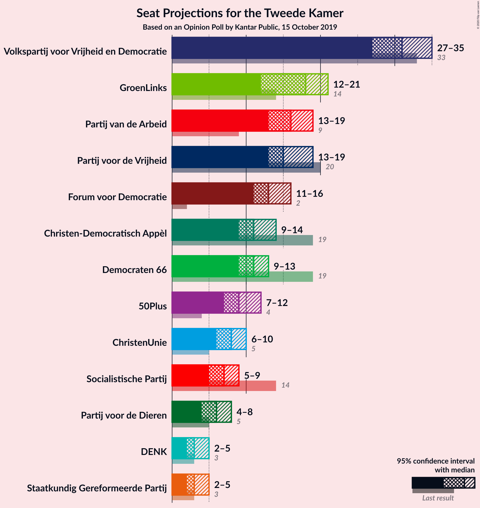
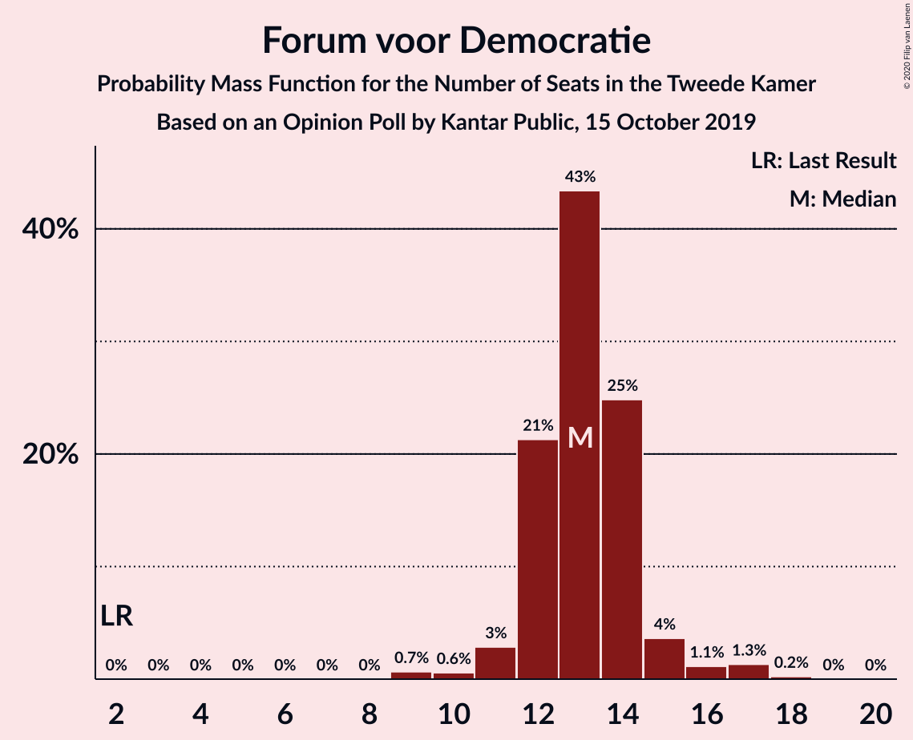
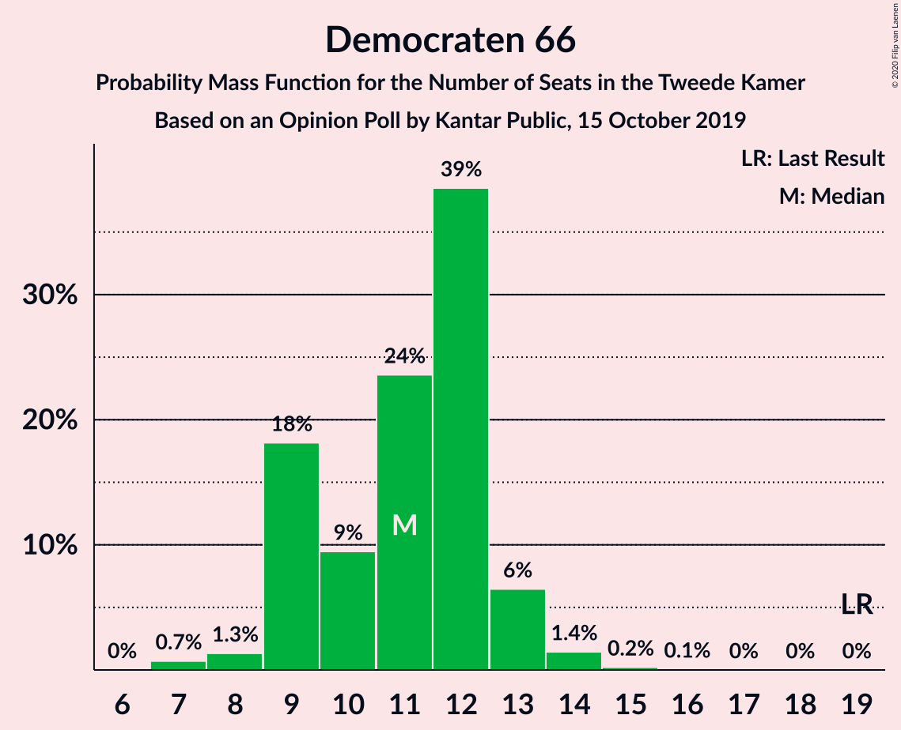
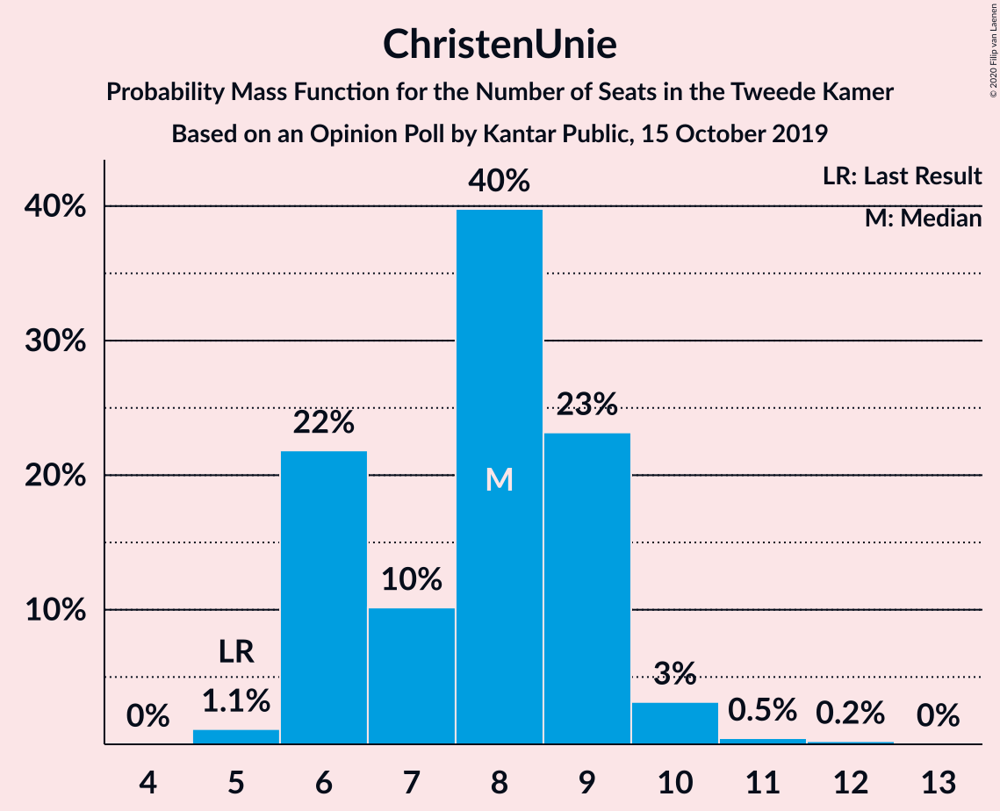
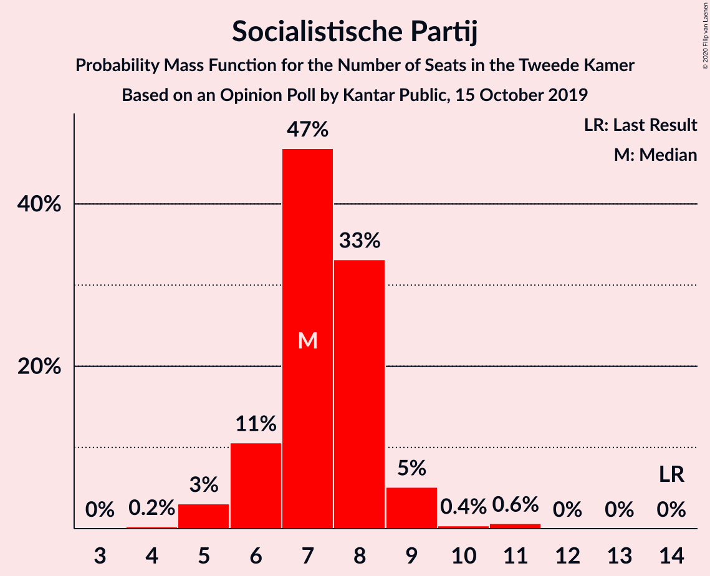
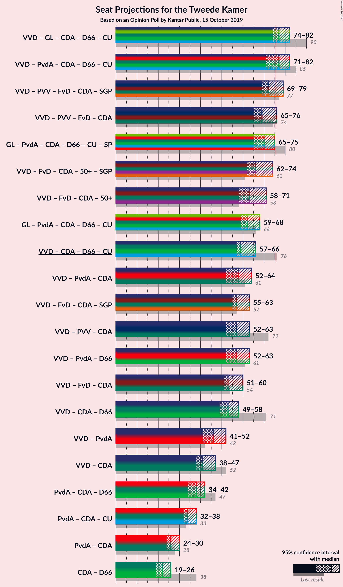
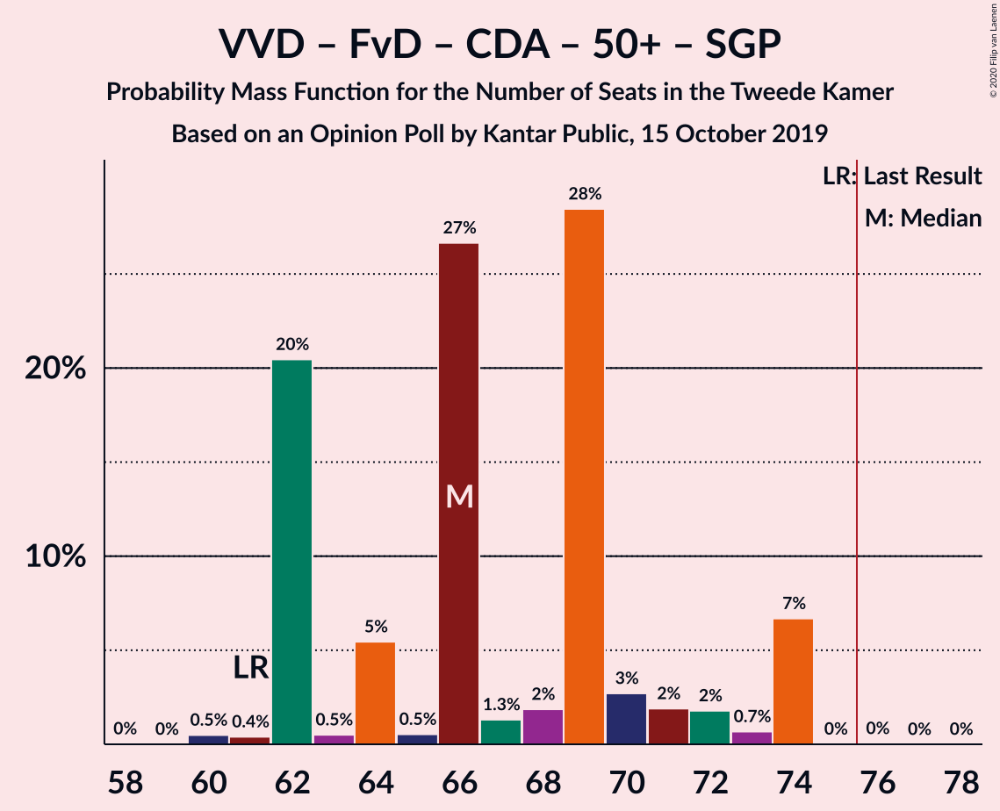
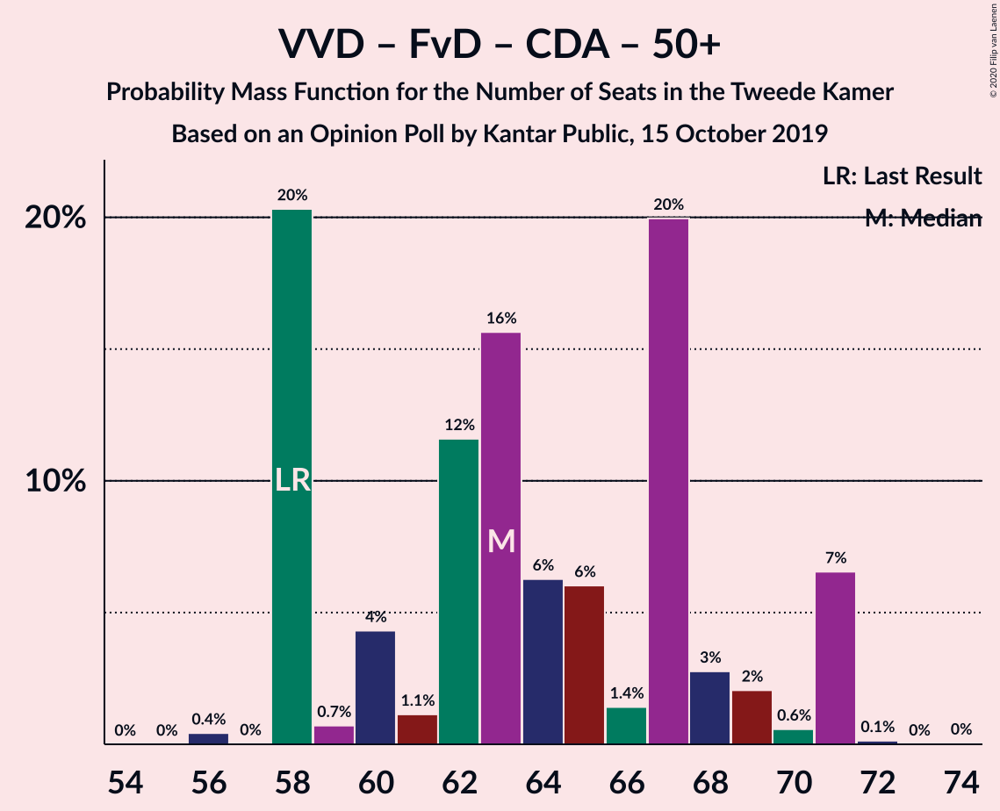
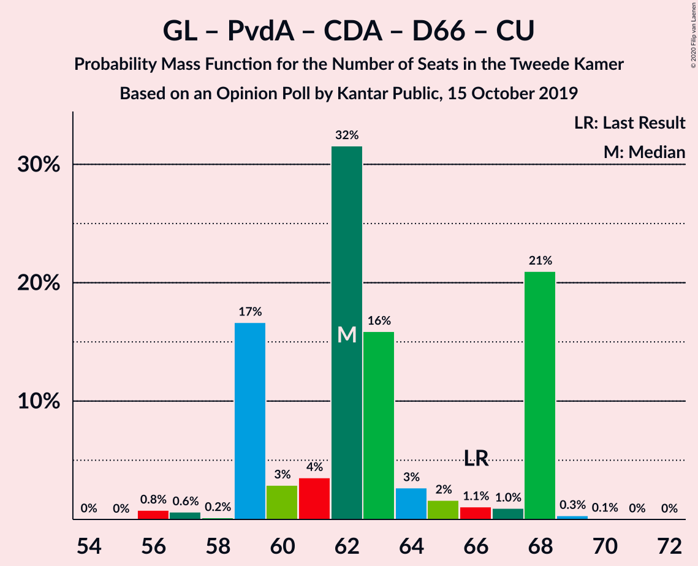
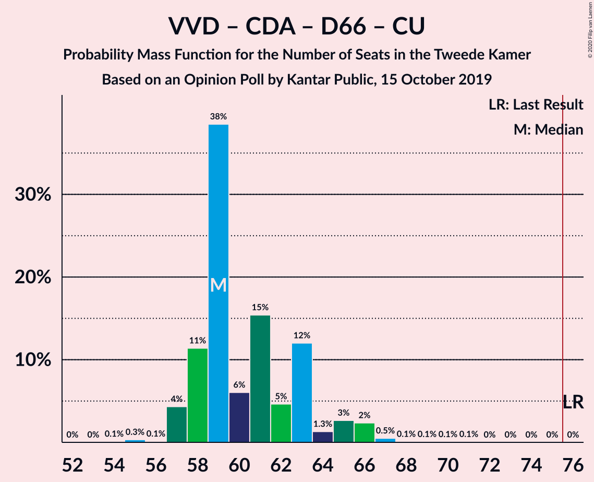

# Opinion Poll by Kantar Public, 15 October 2019

<a href="#voting-intentions">Voting Intentions</a> | <a href="#seats">Seats</a> | <a href="#coalitions">Coalitions</a> | <a href="#technical-information">Technical Information</a>

## Voting Intentions

### Confidence Intervals

| Party | Last Result | Poll Result | 80% Confidence Interval | 90% Confidence Interval | 95% Confidence Interval | 99% Confidence Interval |
|:-----:|:-----------:|:-----------:|:-----------------------:|:-----------------------:|:-----------------------:|:-----------------------:|
| Volkspartij voor Vrijheid en Democratie | 21.3% | 20.7% | 19.1–22.4% |18.6–22.9% |18.2–23.4% |17.5–24.2% |
| GroenLinks | 9.1% | 10.7% | 9.5–12.1% |9.2–12.5% |8.9–12.8% |8.4–13.5% |
| Partij van de Arbeid | 5.7% | 10.7% | 9.5–12.1% |9.2–12.5% |8.9–12.8% |8.4–13.5% |
| Partij voor de Vrijheid | 13.1% | 10.0% | 8.8–11.3% |8.5–11.7% |8.2–12.0% |7.7–12.7% |
| Forum voor Democratie | 1.8% | 8.7% | 7.6–10.0% |7.3–10.4% |7.1–10.7% |6.6–11.3% |
| Christen-Democratisch Appèl | 12.4% | 8.0% | 7.0–9.2% |6.7–9.6% |6.4–9.9% |6.0–10.5% |
| Democraten 66 | 12.2% | 7.3% | 6.4–8.6% |6.1–8.9% |5.9–9.2% |5.4–9.8% |
| 50Plus | 3.1% | 6.0% | 5.1–7.1% |4.8–7.4% |4.6–7.7% |4.3–8.2% |
| ChristenUnie | 3.4% | 5.4% | 4.5–6.4% |4.3–6.7% |4.1–7.0% |3.7–7.5% |
| Socialistische Partij | 9.1% | 4.6% | 3.9–5.6% |3.6–5.9% |3.5–6.1% |3.1–6.7% |
| Partij voor de Dieren | 3.2% | 4.0% | 3.3–4.9% |3.1–5.2% |2.9–5.4% |2.6–5.9% |
| Staatkundig Gereformeerde Partij | 2.1% | 2.0% | 1.5–2.7% |1.4–2.9% |1.3–3.1% |1.1–3.5% |
| DENK | 2.1% | 2.0% | 1.5–2.7% |1.4–2.9% |1.3–3.1% |1.1–3.5% |

*Note:* The poll result column reflects the actual value used in the calculations. Published results may vary slightly, and in addition be rounded to fewer digits.

## Seats

### Confidence Intervals

| Party | Last Result | Median | 80% Confidence Interval | 90% Confidence Interval | 95% Confidence Interval | 99% Confidence Interval |
|:-----:|:-----------:|:------:|:-----------------------:|:-----------------------:|:-----------------------:|:-----------------------:|
| <a href="#volkspartij-voor-vrijheid-en-democratie">Volkspartij voor Vrijheid en Democratie</a> | 33 | 27 | 27–31 |27–33 |27–33 |27–35 |
| <a href="#groenlinks">GroenLinks</a> | 14 | 18 | 16–18 |14–18 |12–18 |12–18 |
| <a href="#partij-van-de-arbeid">Partij van de Arbeid</a> | 9 | 18 | 16–18 |15–18 |15–18 |13–18 |
| <a href="#partij-voor-de-vrijheid">Partij voor de Vrijheid</a> | 20 | 14 | 14 |14–15 |12–17 |12–19 |
| <a href="#forum-voor-democratie">Forum voor Democratie</a> | 2 | 13 | 13–15 |13–16 |12–17 |11–17 |
| <a href="#christen-democratisch-appèl">Christen-Democratisch Appèl</a> | 19 | 11 | 11–12 |10–14 |8–14 |8–14 |
| <a href="#democraten-66">Democraten 66</a> | 19 | 12 | 11–12 |11–13 |10–13 |7–14 |
| <a href="#50plus">50Plus</a> | 4 | 7 | 7–8 |7–10 |7–10 |6–11 |
| <a href="#christenunie">ChristenUnie</a> | 5 | 9 | 7–9 |6–9 |6–9 |6–10 |
| <a href="#socialistische-partij">Socialistische Partij</a> | 14 | 7 | 7–8 |7–9 |7–9 |5–9 |
| <a href="#partij-voor-de-dieren">Partij voor de Dieren</a> | 5 | 7 | 4–7 |4–7 |4–7 |4–7 |
| <a href="#staatkundig-gereformeerde-partij">Staatkundig Gereformeerde Partij</a> | 3 | 4 | 3–4 |3–4 |3–4 |2–4 |
| <a href="#denk">DENK</a> | 3 | 3 | 3 |2–4 |1–5 |1–5 |

### Volkspartij voor Vrijheid en Democratie

*For a full overview of the results for this party, see the [Volkspartij voor Vrijheid en Democratie](party-volkspartijvoorvrijheidendemocratie.html) page.*

| Number of Seats | Probability | Accumulated | Special Marks |
|:---------------:|:-----------:|:-----------:|:-------------:|
| 25 | 0.1% | 100% |  |
| 26 | 0% | 99.9% |  |
| 27 | 81% | 99.9% | Median |
| 28 | 2% | 18% |  |
| 29 | 0% | 17% |  |
| 30 | 4% | 17% |  |
| 31 | 3% | 13% |  |
| 32 | 4% | 10% |  |
| 33 | 4% | 5% | Last Result |
| 34 | 0.3% | 2% |  |
| 35 | 1.2% | 1.3% |  |
| 36 | 0.1% | 0.1% |  |
| 37 | 0% | 0% |  |

### GroenLinks

*For a full overview of the results for this party, see the [GroenLinks](party-groenlinks.html) page.*

| Number of Seats | Probability | Accumulated | Special Marks |
|:---------------:|:-----------:|:-----------:|:-------------:|
| 12 | 4% | 100% |  |
| 13 | 0.1% | 96% |  |
| 14 | 2% | 96% | Last Result |
| 15 | 1.1% | 94% |  |
| 16 | 4% | 93% |  |
| 17 | 6% | 89% |  |
| 18 | 82% | 82% | Median |
| 19 | 0% | 0.2% |  |
| 20 | 0.2% | 0.2% |  |
| 21 | 0% | 0% |  |

### Partij van de Arbeid

*For a full overview of the results for this party, see the [Partij van de Arbeid](party-partijvandearbeid.html) page.*

| Number of Seats | Probability | Accumulated | Special Marks |
|:---------------:|:-----------:|:-----------:|:-------------:|
| 9 | 0% | 100% | Last Result |
| 10 | 0% | 100% |  |
| 11 | 0% | 100% |  |
| 12 | 0.1% | 100% |  |
| 13 | 0.9% | 99.9% |  |
| 14 | 0.1% | 99.1% |  |
| 15 | 6% | 99.0% |  |
| 16 | 6% | 93% |  |
| 17 | 3% | 87% |  |
| 18 | 84% | 85% | Median |
| 19 | 0.1% | 0.1% |  |
| 20 | 0% | 0.1% |  |
| 21 | 0% | 0.1% |  |
| 22 | 0% | 0% |  |

### Partij voor de Vrijheid

*For a full overview of the results for this party, see the [Partij voor de Vrijheid](party-partijvoordevrijheid.html) page.*

| Number of Seats | Probability | Accumulated | Special Marks |
|:---------------:|:-----------:|:-----------:|:-------------:|
| 12 | 4% | 100% |  |
| 13 | 0.1% | 96% |  |
| 14 | 86% | 96% | Median |
| 15 | 5% | 10% |  |
| 16 | 0% | 4% |  |
| 17 | 3% | 4% |  |
| 18 | 0.4% | 1.4% |  |
| 19 | 0.9% | 1.0% |  |
| 20 | 0% | 0% | Last Result |

### Forum voor Democratie

*For a full overview of the results for this party, see the [Forum voor Democratie](party-forumvoordemocratie.html) page.*

| Number of Seats | Probability | Accumulated | Special Marks |
|:---------------:|:-----------:|:-----------:|:-------------:|
| 2 | 0% | 100% | Last Result |
| 3 | 0% | 100% |  |
| 4 | 0% | 100% |  |
| 5 | 0% | 100% |  |
| 6 | 0% | 100% |  |
| 7 | 0% | 100% |  |
| 8 | 0% | 100% |  |
| 9 | 0% | 100% |  |
| 10 | 0.1% | 100% |  |
| 11 | 2% | 99.9% |  |
| 12 | 2% | 98% |  |
| 13 | 81% | 96% | Median |
| 14 | 5% | 15% |  |
| 15 | 4% | 10% |  |
| 16 | 2% | 6% |  |
| 17 | 4% | 4% |  |
| 18 | 0% | 0% |  |

### Christen-Democratisch Appèl

*For a full overview of the results for this party, see the [Christen-Democratisch Appèl](party-christen-democratischappèl.html) page.*

| Number of Seats | Probability | Accumulated | Special Marks |
|:---------------:|:-----------:|:-----------:|:-------------:|
| 8 | 4% | 100% |  |
| 9 | 0% | 96% |  |
| 10 | 3% | 96% |  |
| 11 | 81% | 93% | Median |
| 12 | 3% | 12% |  |
| 13 | 1.1% | 9% |  |
| 14 | 8% | 8% |  |
| 15 | 0.1% | 0.1% |  |
| 16 | 0% | 0% |  |
| 17 | 0% | 0% |  |
| 18 | 0% | 0% |  |
| 19 | 0% | 0% | Last Result |

### Democraten 66

*For a full overview of the results for this party, see the [Democraten 66](party-democraten66.html) page.*

| Number of Seats | Probability | Accumulated | Special Marks |
|:---------------:|:-----------:|:-----------:|:-------------:|
| 7 | 1.2% | 100% |  |
| 8 | 0.1% | 98.8% |  |
| 9 | 0% | 98.7% |  |
| 10 | 2% | 98.7% |  |
| 11 | 8% | 96% |  |
| 12 | 81% | 88% | Median |
| 13 | 6% | 8% |  |
| 14 | 1.0% | 1.1% |  |
| 15 | 0.1% | 0.1% |  |
| 16 | 0% | 0% |  |
| 17 | 0% | 0% |  |
| 18 | 0% | 0% |  |
| 19 | 0% | 0% | Last Result |

### 50Plus

*For a full overview of the results for this party, see the [50Plus](party-50plus.html) page.*

| Number of Seats | Probability | Accumulated | Special Marks |
|:---------------:|:-----------:|:-----------:|:-------------:|
| 4 | 0% | 100% | Last Result |
| 5 | 0.3% | 100% |  |
| 6 | 0.2% | 99.7% |  |
| 7 | 86% | 99.5% | Median |
| 8 | 5% | 14% |  |
| 9 | 0.9% | 9% |  |
| 10 | 6% | 8% |  |
| 11 | 2% | 2% |  |
| 12 | 0% | 0.1% |  |
| 13 | 0% | 0% |  |

### ChristenUnie

*For a full overview of the results for this party, see the [ChristenUnie](party-christenunie.html) page.*

| Number of Seats | Probability | Accumulated | Special Marks |
|:---------------:|:-----------:|:-----------:|:-------------:|
| 5 | 0% | 100% | Last Result |
| 6 | 5% | 100% |  |
| 7 | 7% | 95% |  |
| 8 | 5% | 88% |  |
| 9 | 81% | 83% | Median |
| 10 | 2% | 2% |  |
| 11 | 0.4% | 0.4% |  |
| 12 | 0% | 0% |  |

### Socialistische Partij

*For a full overview of the results for this party, see the [Socialistische Partij](party-socialistischepartij.html) page.*

| Number of Seats | Probability | Accumulated | Special Marks |
|:---------------:|:-----------:|:-----------:|:-------------:|
| 5 | 1.1% | 100% |  |
| 6 | 0.2% | 98.9% |  |
| 7 | 86% | 98.7% | Median |
| 8 | 6% | 12% |  |
| 9 | 6% | 6% |  |
| 10 | 0.2% | 0.2% |  |
| 11 | 0% | 0% |  |
| 12 | 0% | 0% |  |
| 13 | 0% | 0% |  |
| 14 | 0% | 0% | Last Result |

### Partij voor de Dieren

*For a full overview of the results for this party, see the [Partij voor de Dieren](party-partijvoordedieren.html) page.*

| Number of Seats | Probability | Accumulated | Special Marks |
|:---------------:|:-----------:|:-----------:|:-------------:|
| 4 | 10% | 100% |  |
| 5 | 4% | 90% | Last Result |
| 6 | 5% | 86% |  |
| 7 | 81% | 81% | Median |
| 8 | 0.1% | 0.1% |  |
| 9 | 0% | 0% |  |

### Staatkundig Gereformeerde Partij

*For a full overview of the results for this party, see the [Staatkundig Gereformeerde Partij](party-staatkundiggereformeerdepartij.html) page.*

| Number of Seats | Probability | Accumulated | Special Marks |
|:---------------:|:-----------:|:-----------:|:-------------:|
| 2 | 2% | 100% |  |
| 3 | 13% | 98% | Last Result |
| 4 | 85% | 85% | Median |
| 5 | 0.1% | 0.1% |  |
| 6 | 0% | 0% |  |

### DENK

*For a full overview of the results for this party, see the [DENK](party-denk.html) page.*

| Number of Seats | Probability | Accumulated | Special Marks |
|:---------------:|:-----------:|:-----------:|:-------------:|
| 1 | 4% | 100% |  |
| 2 | 3% | 96% |  |
| 3 | 85% | 93% | Last Result, Median |
| 4 | 4% | 8% |  |
| 5 | 4% | 4% |  |
| 6 | 0% | 0% |  |

## Coalitions

### Confidence Intervals

| Coalition | Last Result | Median | Majority? | 80% Confidence Interval | 90% Confidence Interval | 95% Confidence Interval | 99% Confidence Interval |
|:---------:|:-----------:|:------:|:---------:|:-----------------------:|:-----------------------:|:-----------------------:|:-----------------------:|
| Volkspartij voor Vrijheid en Democratie – GroenLinks – Christen-Democratisch Appèl – Democraten 66 – ChristenUnie | 90 | 77 | 89% | 75–77 | 75–79 | 75–82 | 75–82 |
| Volkspartij voor Vrijheid en Democratie – Partij van de Arbeid – Christen-Democratisch Appèl – Democraten 66 – ChristenUnie | 85 | 77 | 97% | 77–78 | 77–79 | 75–80 | 73–80 |
| Volkspartij voor Vrijheid en Democratie – Partij voor de Vrijheid – Forum voor Democratie – Christen-Democratisch Appèl – Staatkundig Gereformeerde Partij | 77 | 69 | 6% | 69–75 | 69–77 | 69–77 | 69–77 |
| GroenLinks – Partij van de Arbeid – Christen-Democratisch Appèl – Democraten 66 – ChristenUnie – Socialistische Partij | 80 | 75 | 0.2% | 68–75 | 68–75 | 68–75 | 66–75 |
| Volkspartij voor Vrijheid en Democratie – Partij voor de Vrijheid – Forum voor Democratie – Christen-Democratisch Appèl | 74 | 65 | 0.1% | 65–72 | 65–73 | 65–74 | 65–74 |
| Volkspartij voor Vrijheid en Democratie – Forum voor Democratie – Christen-Democratisch Appèl – 50Plus – Staatkundig Gereformeerde Partij | 61 | 62 | 0% | 62–69 | 62–71 | 62–72 | 62–72 |
| Volkspartij voor Vrijheid en Democratie – Forum voor Democratie – Christen-Democratisch Appèl – 50Plus | 58 | 58 | 0% | 58–66 | 58–67 | 58–69 | 58–69 |
| GroenLinks – Partij van de Arbeid – Christen-Democratisch Appèl – Democraten 66 – ChristenUnie | 66 | 68 | 0% | 61–68 | 60–68 | 60–68 | 57–69 |
| Volkspartij voor Vrijheid en Democratie – Christen-Democratisch Appèl – Democraten 66 – ChristenUnie | 76 | 59 | 0% | 59–61 | 59–63 | 59–65 | 59–65 |
| Volkspartij voor Vrijheid en Democratie – Forum voor Democratie – Christen-Democratisch Appèl – Staatkundig Gereformeerde Partij | 57 | 55 | 0% | 55–61 | 55–62 | 55–63 | 55–63 |
| Volkspartij voor Vrijheid en Democratie – Partij van de Arbeid – Democraten 66 | 61 | 57 | 0% | 57–58 | 57–60 | 57–62 | 56–62 |
| Volkspartij voor Vrijheid en Democratie – Partij van de Arbeid – Christen-Democratisch Appèl | 61 | 56 | 0% | 56–59 | 56–61 | 56–61 | 54–64 |
| Volkspartij voor Vrijheid en Democratie – Forum voor Democratie – Christen-Democratisch Appèl | 54 | 51 | 0% | 51–58 | 51–59 | 51–60 | 51–60 |
| Volkspartij voor Vrijheid en Democratie – Partij voor de Vrijheid – Christen-Democratisch Appèl | 72 | 52 | 0% | 52–58 | 52–59 | 52–59 | 52–62 |
| Volkspartij voor Vrijheid en Democratie – Christen-Democratisch Appèl – Democraten 66 | 71 | 50 | 0% | 50–54 | 50–55 | 50–59 | 50–59 |
| Volkspartij voor Vrijheid en Democratie – Partij van de Arbeid | 42 | 45 | 0% | 45–47 | 45–51 | 44–51 | 43–52 |
| Volkspartij voor Vrijheid en Democratie – Christen-Democratisch Appèl | 52 | 38 | 0% | 38–41 | 38–46 | 38–46 | 38–47 |
| Partij van de Arbeid – Christen-Democratisch Appèl – Democraten 66 | 47 | 41 | 0% | 40–41 | 37–42 | 36–42 | 36–44 |
| Partij van de Arbeid – Christen-Democratisch Appèl – ChristenUnie | 33 | 38 | 0% | 35–38 | 34–38 | 33–38 | 29–38 |
| Partij van de Arbeid – Christen-Democratisch Appèl | 28 | 29 | 0% | 29 | 26–30 | 26–30 | 23–30 |
| Christen-Democratisch Appèl – Democraten 66 | 38 | 23 | 0% | 23–25 | 19–27 | 19–27 | 19–27 |

### Volkspartij voor Vrijheid en Democratie – GroenLinks – Christen-Democratisch Appèl – Democraten 66 – ChristenUnie

| Number of Seats | Probability | Accumulated | Special Marks |
|:---------------:|:-----------:|:-----------:|:-------------:|
| 72 | 0% | 100% |  |
| 73 | 0% | 99.9% |  |
| 74 | 0% | 99.9% |  |
| 75 | 11% | 99.9% |  |
| 76 | 0% | 89% | Majority |
| 77 | 82% | 89% | Median |
| 78 | 0.2% | 7% |  |
| 79 | 2% | 7% |  |
| 80 | 0.6% | 5% |  |
| 81 | 0% | 4% |  |
| 82 | 4% | 4% |  |
| 83 | 0% | 0.1% |  |
| 84 | 0% | 0.1% |  |
| 85 | 0% | 0.1% |  |
| 86 | 0% | 0% |  |
| 87 | 0% | 0% |  |
| 88 | 0% | 0% |  |
| 89 | 0% | 0% |  |
| 90 | 0% | 0% | Last Result |

### Volkspartij voor Vrijheid en Democratie – Partij van de Arbeid – Christen-Democratisch Appèl – Democraten 66 – ChristenUnie

| Number of Seats | Probability | Accumulated | Special Marks |
|:---------------:|:-----------:|:-----------:|:-------------:|
| 73 | 0.9% | 100% |  |
| 74 | 0% | 99.1% |  |
| 75 | 2% | 99.0% |  |
| 76 | 0% | 97% | Majority |
| 77 | 86% | 97% | Median |
| 78 | 1.2% | 11% |  |
| 79 | 5% | 10% |  |
| 80 | 4% | 4% |  |
| 81 | 0.3% | 0.4% |  |
| 82 | 0% | 0.1% |  |
| 83 | 0% | 0.1% |  |
| 84 | 0% | 0.1% |  |
| 85 | 0% | 0.1% | Last Result |
| 86 | 0% | 0% |  |

### Volkspartij voor Vrijheid en Democratie – Partij voor de Vrijheid – Forum voor Democratie – Christen-Democratisch Appèl – Staatkundig Gereformeerde Partij

| Number of Seats | Probability | Accumulated | Special Marks |
|:---------------:|:-----------:|:-----------:|:-------------:|
| 68 | 0% | 100% |  |
| 69 | 81% | 99.9% | Median |
| 70 | 0% | 19% |  |
| 71 | 0.2% | 19% |  |
| 72 | 0.1% | 19% |  |
| 73 | 0.2% | 19% |  |
| 74 | 4% | 19% |  |
| 75 | 9% | 15% |  |
| 76 | 0% | 6% | Majority |
| 77 | 6% | 6% | Last Result |
| 78 | 0% | 0.1% |  |
| 79 | 0% | 0.1% |  |
| 80 | 0% | 0% |  |

### GroenLinks – Partij van de Arbeid – Christen-Democratisch Appèl – Democraten 66 – ChristenUnie – Socialistische Partij

| Number of Seats | Probability | Accumulated | Special Marks |
|:---------------:|:-----------:|:-----------:|:-------------:|
| 65 | 0% | 100% |  |
| 66 | 0.8% | 99.9% |  |
| 67 | 0.1% | 99.1% |  |
| 68 | 10% | 99.0% |  |
| 69 | 0% | 89% |  |
| 70 | 1.3% | 89% |  |
| 71 | 2% | 88% |  |
| 72 | 0% | 86% |  |
| 73 | 0.4% | 86% |  |
| 74 | 5% | 86% |  |
| 75 | 80% | 81% | Median |
| 76 | 0% | 0.2% | Majority |
| 77 | 0.2% | 0.2% |  |
| 78 | 0% | 0% |  |
| 79 | 0% | 0% |  |
| 80 | 0% | 0% | Last Result |

### Volkspartij voor Vrijheid en Democratie – Partij voor de Vrijheid – Forum voor Democratie – Christen-Democratisch Appèl

| Number of Seats | Probability | Accumulated | Special Marks |
|:---------------:|:-----------:|:-----------:|:-------------:|
| 64 | 0% | 100% |  |
| 65 | 81% | 99.9% | Median |
| 66 | 0% | 19% |  |
| 67 | 0% | 19% |  |
| 68 | 0.1% | 19% |  |
| 69 | 0.2% | 19% |  |
| 70 | 3% | 19% |  |
| 71 | 0.2% | 16% |  |
| 72 | 8% | 15% |  |
| 73 | 2% | 7% |  |
| 74 | 5% | 5% | Last Result |
| 75 | 0.1% | 0.1% |  |
| 76 | 0% | 0.1% | Majority |
| 77 | 0.1% | 0.1% |  |
| 78 | 0% | 0% |  |

### Volkspartij voor Vrijheid en Democratie – Forum voor Democratie – Christen-Democratisch Appèl – 50Plus – Staatkundig Gereformeerde Partij

| Number of Seats | Probability | Accumulated | Special Marks |
|:---------------:|:-----------:|:-----------:|:-------------:|
| 61 | 0.3% | 100% | Last Result |
| 62 | 80% | 99.6% | Median |
| 63 | 0.1% | 19% |  |
| 64 | 1.3% | 19% |  |
| 65 | 0% | 18% |  |
| 66 | 0% | 18% |  |
| 67 | 2% | 18% |  |
| 68 | 0% | 16% |  |
| 69 | 6% | 16% |  |
| 70 | 4% | 10% |  |
| 71 | 1.5% | 6% |  |
| 72 | 4% | 4% |  |
| 73 | 0% | 0% |  |

### Volkspartij voor Vrijheid en Democratie – Forum voor Democratie – Christen-Democratisch Appèl – 50Plus

| Number of Seats | Probability | Accumulated | Special Marks |
|:---------------:|:-----------:|:-----------:|:-------------:|
| 58 | 80% | 100% | Last Result, Median |
| 59 | 0.4% | 20% |  |
| 60 | 0% | 19% |  |
| 61 | 0.1% | 19% |  |
| 62 | 1.3% | 19% |  |
| 63 | 2% | 18% |  |
| 64 | 0% | 16% |  |
| 65 | 1.3% | 16% |  |
| 66 | 5% | 14% |  |
| 67 | 6% | 10% |  |
| 68 | 0.1% | 4% |  |
| 69 | 4% | 4% |  |
| 70 | 0% | 0.1% |  |
| 71 | 0% | 0% |  |

### GroenLinks – Partij van de Arbeid – Christen-Democratisch Appèl – Democraten 66 – ChristenUnie

| Number of Seats | Probability | Accumulated | Special Marks |
|:---------------:|:-----------:|:-----------:|:-------------:|
| 57 | 0.8% | 100% |  |
| 58 | 0% | 99.2% |  |
| 59 | 0% | 99.1% |  |
| 60 | 6% | 99.1% |  |
| 61 | 5% | 93% |  |
| 62 | 0.3% | 88% |  |
| 63 | 0.1% | 88% |  |
| 64 | 2% | 88% |  |
| 65 | 4% | 86% |  |
| 66 | 0.3% | 82% | Last Result |
| 67 | 0.2% | 82% |  |
| 68 | 81% | 82% | Median |
| 69 | 0.9% | 1.0% |  |
| 70 | 0% | 0.1% |  |
| 71 | 0% | 0% |  |

### Volkspartij voor Vrijheid en Democratie – Christen-Democratisch Appèl – Democraten 66 – ChristenUnie

| Number of Seats | Probability | Accumulated | Special Marks |
|:---------------:|:-----------:|:-----------:|:-------------:|
| 57 | 0.1% | 100% |  |
| 58 | 0.2% | 99.9% |  |
| 59 | 84% | 99.7% | Median |
| 60 | 2% | 15% |  |
| 61 | 3% | 13% |  |
| 62 | 1.4% | 10% |  |
| 63 | 4% | 8% |  |
| 64 | 0.1% | 4% |  |
| 65 | 4% | 4% |  |
| 66 | 0% | 0.1% |  |
| 67 | 0% | 0.1% |  |
| 68 | 0% | 0.1% |  |
| 69 | 0% | 0% |  |
| 70 | 0% | 0% |  |
| 71 | 0% | 0% |  |
| 72 | 0% | 0% |  |
| 73 | 0% | 0% |  |
| 74 | 0% | 0% |  |
| 75 | 0% | 0% |  |
| 76 | 0% | 0% | Last Result, Majority |

### Volkspartij voor Vrijheid en Democratie – Forum voor Democratie – Christen-Democratisch Appèl – Staatkundig Gereformeerde Partij

| Number of Seats | Probability | Accumulated | Special Marks |
|:---------------:|:-----------:|:-----------:|:-------------:|
| 54 | 0% | 100% |  |
| 55 | 81% | 99.9% | Median |
| 56 | 1.3% | 19% |  |
| 57 | 2% | 18% | Last Result |
| 58 | 0.2% | 16% |  |
| 59 | 0% | 16% |  |
| 60 | 2% | 16% |  |
| 61 | 4% | 13% |  |
| 62 | 5% | 9% |  |
| 63 | 4% | 4% |  |
| 64 | 0% | 0% |  |

### Volkspartij voor Vrijheid en Democratie – Partij van de Arbeid – Democraten 66

| Number of Seats | Probability | Accumulated | Special Marks |
|:---------------:|:-----------:|:-----------:|:-------------:|
| 52 | 0.1% | 100% |  |
| 53 | 0% | 99.9% |  |
| 54 | 0% | 99.9% |  |
| 55 | 0.2% | 99.9% |  |
| 56 | 2% | 99.7% |  |
| 57 | 87% | 98% | Median |
| 58 | 1.4% | 11% |  |
| 59 | 1.2% | 10% |  |
| 60 | 4% | 8% |  |
| 61 | 0% | 4% | Last Result |
| 62 | 4% | 4% |  |
| 63 | 0.2% | 0.3% |  |
| 64 | 0% | 0.1% |  |
| 65 | 0% | 0.1% |  |
| 66 | 0% | 0% |  |

### Volkspartij voor Vrijheid en Democratie – Partij van de Arbeid – Christen-Democratisch Appèl

| Number of Seats | Probability | Accumulated | Special Marks |
|:---------------:|:-----------:|:-----------:|:-------------:|
| 51 | 0% | 100% |  |
| 52 | 0% | 99.9% |  |
| 53 | 0% | 99.9% |  |
| 54 | 0.8% | 99.9% |  |
| 55 | 2% | 99.1% |  |
| 56 | 81% | 98% | Median |
| 57 | 3% | 17% |  |
| 58 | 0.4% | 14% |  |
| 59 | 4% | 14% |  |
| 60 | 4% | 10% |  |
| 61 | 4% | 5% | Last Result |
| 62 | 0.1% | 1.4% |  |
| 63 | 0.1% | 1.4% |  |
| 64 | 1.2% | 1.3% |  |
| 65 | 0.1% | 0.1% |  |
| 66 | 0% | 0% |  |

### Volkspartij voor Vrijheid en Democratie – Forum voor Democratie – Christen-Democratisch Appèl

| Number of Seats | Probability | Accumulated | Special Marks |
|:---------------:|:-----------:|:-----------:|:-------------:|
| 51 | 81% | 100% | Median |
| 52 | 0% | 19% |  |
| 53 | 2% | 19% |  |
| 54 | 1.3% | 17% | Last Result |
| 55 | 0.2% | 16% |  |
| 56 | 2% | 16% |  |
| 57 | 0.9% | 14% |  |
| 58 | 5% | 13% |  |
| 59 | 4% | 8% |  |
| 60 | 4% | 4% |  |
| 61 | 0% | 0% |  |

### Volkspartij voor Vrijheid en Democratie – Partij voor de Vrijheid – Christen-Democratisch Appèl

| Number of Seats | Probability | Accumulated | Special Marks |
|:---------------:|:-----------:|:-----------:|:-------------:|
| 52 | 80% | 100% | Median |
| 53 | 0% | 19% |  |
| 54 | 1.5% | 19% |  |
| 55 | 4% | 18% |  |
| 56 | 0% | 14% |  |
| 57 | 0.2% | 14% |  |
| 58 | 7% | 14% |  |
| 59 | 5% | 7% |  |
| 60 | 0% | 1.4% |  |
| 61 | 0% | 1.4% |  |
| 62 | 1.2% | 1.4% |  |
| 63 | 0.1% | 0.1% |  |
| 64 | 0% | 0.1% |  |
| 65 | 0% | 0% |  |
| 66 | 0% | 0% |  |
| 67 | 0% | 0% |  |
| 68 | 0% | 0% |  |
| 69 | 0% | 0% |  |
| 70 | 0% | 0% |  |
| 71 | 0% | 0% |  |
| 72 | 0% | 0% | Last Result |

### Volkspartij voor Vrijheid en Democratie – Christen-Democratisch Appèl – Democraten 66

| Number of Seats | Probability | Accumulated | Special Marks |
|:---------------:|:-----------:|:-----------:|:-------------:|
| 49 | 0% | 100% |  |
| 50 | 81% | 99.9% | Median |
| 51 | 2% | 19% |  |
| 52 | 4% | 17% |  |
| 53 | 2% | 13% |  |
| 54 | 3% | 11% |  |
| 55 | 4% | 9% |  |
| 56 | 0% | 4% |  |
| 57 | 0.2% | 4% |  |
| 58 | 0.1% | 4% |  |
| 59 | 4% | 4% |  |
| 60 | 0% | 0.1% |  |
| 61 | 0% | 0% |  |
| 62 | 0% | 0% |  |
| 63 | 0% | 0% |  |
| 64 | 0% | 0% |  |
| 65 | 0% | 0% |  |
| 66 | 0% | 0% |  |
| 67 | 0% | 0% |  |
| 68 | 0% | 0% |  |
| 69 | 0% | 0% |  |
| 70 | 0% | 0% |  |
| 71 | 0% | 0% | Last Result |

### Volkspartij voor Vrijheid en Democratie – Partij van de Arbeid

| Number of Seats | Probability | Accumulated | Special Marks |
|:---------------:|:-----------:|:-----------:|:-------------:|
| 40 | 0% | 100% |  |
| 41 | 0% | 99.9% |  |
| 42 | 0% | 99.9% | Last Result |
| 43 | 1.5% | 99.9% |  |
| 44 | 2% | 98% |  |
| 45 | 81% | 97% | Median |
| 46 | 4% | 16% |  |
| 47 | 6% | 12% |  |
| 48 | 0.4% | 6% |  |
| 49 | 0% | 6% |  |
| 50 | 0.3% | 5% |  |
| 51 | 4% | 5% |  |
| 52 | 1.2% | 1.3% |  |
| 53 | 0% | 0.1% |  |
| 54 | 0.1% | 0.1% |  |
| 55 | 0% | 0% |  |

### Volkspartij voor Vrijheid en Democratie – Christen-Democratisch Appèl

| Number of Seats | Probability | Accumulated | Special Marks |
|:---------------:|:-----------:|:-----------:|:-------------:|
| 37 | 0% | 100% |  |
| 38 | 81% | 99.9% | Median |
| 39 | 0% | 19% |  |
| 40 | 2% | 19% |  |
| 41 | 7% | 17% |  |
| 42 | 0.2% | 10% |  |
| 43 | 0.1% | 10% |  |
| 44 | 4% | 10% |  |
| 45 | 0% | 5% |  |
| 46 | 4% | 5% |  |
| 47 | 1.3% | 1.4% |  |
| 48 | 0% | 0.1% |  |
| 49 | 0.1% | 0.1% |  |
| 50 | 0% | 0% |  |
| 51 | 0% | 0% |  |
| 52 | 0% | 0% | Last Result |

### Partij van de Arbeid – Christen-Democratisch Appèl – Democraten 66

| Number of Seats | Probability | Accumulated | Special Marks |
|:---------------:|:-----------:|:-----------:|:-------------:|
| 35 | 0% | 100% |  |
| 36 | 4% | 99.9% |  |
| 37 | 4% | 96% |  |
| 38 | 0% | 92% |  |
| 39 | 0.3% | 92% |  |
| 40 | 2% | 91% |  |
| 41 | 85% | 90% | Median |
| 42 | 4% | 5% |  |
| 43 | 0% | 1.1% |  |
| 44 | 1.0% | 1.0% |  |
| 45 | 0% | 0.1% |  |
| 46 | 0% | 0% |  |
| 47 | 0% | 0% | Last Result |

### Partij van de Arbeid – Christen-Democratisch Appèl – ChristenUnie

| Number of Seats | Probability | Accumulated | Special Marks |
|:---------------:|:-----------:|:-----------:|:-------------:|
| 29 | 0.8% | 100% |  |
| 30 | 0% | 99.2% |  |
| 31 | 0% | 99.2% |  |
| 32 | 0% | 99.1% |  |
| 33 | 4% | 99.1% | Last Result |
| 34 | 2% | 95% |  |
| 35 | 4% | 93% |  |
| 36 | 3% | 89% |  |
| 37 | 0.2% | 86% |  |
| 38 | 86% | 86% | Median |
| 39 | 0.1% | 0.2% |  |
| 40 | 0% | 0.1% |  |
| 41 | 0.1% | 0.1% |  |
| 42 | 0% | 0% |  |

### Partij van de Arbeid – Christen-Democratisch Appèl

| Number of Seats | Probability | Accumulated | Special Marks |
|:---------------:|:-----------:|:-----------:|:-------------:|
| 23 | 0.8% | 100% |  |
| 24 | 0% | 99.2% |  |
| 25 | 0.1% | 99.1% |  |
| 26 | 6% | 99.1% |  |
| 27 | 2% | 93% |  |
| 28 | 0.1% | 91% | Last Result |
| 29 | 86% | 91% | Median |
| 30 | 5% | 5% |  |
| 31 | 0.2% | 0.3% |  |
| 32 | 0% | 0.1% |  |
| 33 | 0% | 0.1% |  |
| 34 | 0% | 0% |  |

### Christen-Democratisch Appèl – Democraten 66

| Number of Seats | Probability | Accumulated | Special Marks |
|:---------------:|:-----------:|:-----------:|:-------------:|
| 19 | 5% | 100% |  |
| 20 | 2% | 95% |  |
| 21 | 0.1% | 93% |  |
| 22 | 0.1% | 92% |  |
| 23 | 82% | 92% | Median |
| 24 | 0.2% | 11% |  |
| 25 | 6% | 11% |  |
| 26 | 0% | 5% |  |
| 27 | 5% | 5% |  |
| 28 | 0.1% | 0.1% |  |
| 29 | 0% | 0% |  |
| 30 | 0% | 0% |  |
| 31 | 0% | 0% |  |
| 32 | 0% | 0% |  |
| 33 | 0% | 0% |  |
| 34 | 0% | 0% |  |
| 35 | 0% | 0% |  |
| 36 | 0% | 0% |  |
| 37 | 0% | 0% |  |
| 38 | 0% | 0% | Last Result |

## Technical Information

### Opinion Poll

+ **Polling firm:** Kantar Public
+ **Commissioner(s):** —
+ **Fieldwork period:** 15 October 2019

### Calculations

+ **Sample size:** 953
+ **Simulations done:** 131,072
+ **Error estimate:** 3.92%

