# Opinion Poll by Peil.nl, 14–19 October 2019

<a href="#voting-intentions">Voting Intentions</a> | <a href="#seats">Seats</a> | <a href="#coalitions">Coalitions</a> | <a href="#technical-information">Technical Information</a>

## Voting Intentions

### Confidence Intervals

| Party | Last Result | Poll Result | 80% Confidence Interval | 90% Confidence Interval | 95% Confidence Interval | 99% Confidence Interval |
|:-----:|:-----------:|:-----------:|:-----------------------:|:-----------------------:|:-----------------------:|:-----------------------:|
| Volkspartij voor Vrijheid en Democratie | 21.3% | 18.0% | 17.1–18.9% |16.9–19.2% |16.7–19.4% |16.2–19.9% |
| Partij van de Arbeid | 5.7% | 13.3% | 12.6–14.2% |12.3–14.4% |12.2–14.6% |11.8–15.0% |
| Partij voor de Vrijheid | 13.1% | 11.3% | 10.6–12.1% |10.4–12.3% |10.2–12.5% |9.9–12.9% |
| Christen-Democratisch Appèl | 12.4% | 10.0% | 9.3–10.7% |9.1–10.9% |9.0–11.1% |8.7–11.5% |
| Forum voor Democratie | 1.8% | 9.3% | 8.7–10.1% |8.5–10.3% |8.3–10.4% |8.0–10.8% |
| Democraten 66 | 12.2% | 8.7% | 8.0–9.4% |7.8–9.6% |7.7–9.7% |7.4–10.1% |
| GroenLinks | 9.1% | 8.0% | 7.4–8.7% |7.2–8.9% |7.1–9.0% |6.8–9.4% |
| Socialistische Partij | 9.1% | 6.0% | 5.5–6.6% |5.3–6.8% |5.2–6.9% |5.0–7.2% |
| 50Plus | 3.1% | 4.7% | 4.2–5.2% |4.1–5.3% |4.0–5.5% |3.7–5.8% |
| ChristenUnie | 3.4% | 4.0% | 3.6–4.5% |3.4–4.6% |3.4–4.8% |3.2–5.0% |
| Partij voor de Dieren | 3.2% | 2.7% | 2.3–3.1% |2.2–3.2% |2.1–3.3% |2.0–3.5% |
| DENK | 2.1% | 2.0% | 1.7–2.4% |1.6–2.5% |1.6–2.6% |1.4–2.8% |
| Staatkundig Gereformeerde Partij | 2.1% | 1.3% | 1.1–1.6% |1.0–1.7% |1.0–1.8% |0.9–2.0% |

*Note:* The poll result column reflects the actual value used in the calculations. Published results may vary slightly, and in addition be rounded to fewer digits.

## Seats

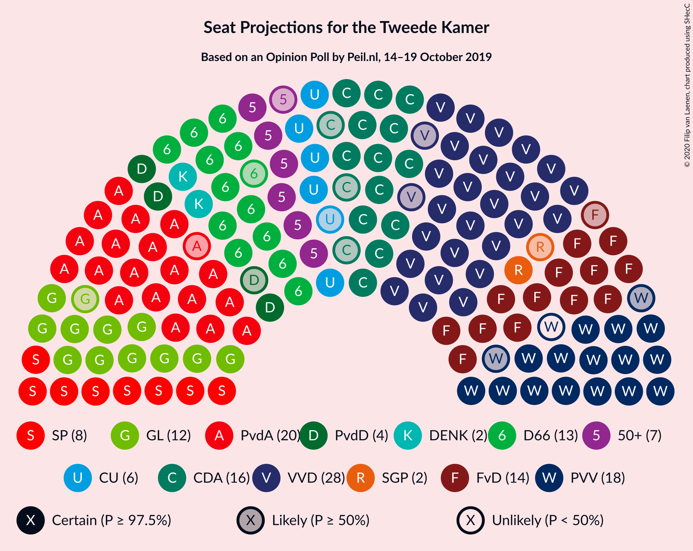

### Confidence Intervals

| Party | Last Result | Median | 80% Confidence Interval | 90% Confidence Interval | 95% Confidence Interval | 99% Confidence Interval |
|:-----:|:-----------:|:------:|:-----------------------:|:-----------------------:|:-----------------------:|:-----------------------:|
| <a href="#volkspartij-voor-vrijheid-en-democratie">Volkspartij voor Vrijheid en Democratie</a> | 33 | 28 | 27–29 |27–29 |26–29 |26–30 |
| <a href="#partij-van-de-arbeid">Partij van de Arbeid</a> | 9 | 20 | 19–22 |19–22 |19–22 |19–22 |
| <a href="#partij-voor-de-vrijheid">Partij voor de Vrijheid</a> | 20 | 17 | 16–19 |15–19 |15–19 |15–20 |
| <a href="#christen-democratisch-appèl">Christen-Democratisch Appèl</a> | 19 | 15 | 13–16 |13–16 |13–16 |13–18 |
| <a href="#forum-voor-democratie">Forum voor Democratie</a> | 2 | 14 | 13–15 |13–15 |12–15 |12–16 |
| <a href="#democraten-66">Democraten 66</a> | 19 | 13 | 12–13 |12–14 |12–14 |12–14 |
| <a href="#groenlinks">GroenLinks</a> | 14 | 12 | 12–13 |11–14 |11–14 |10–14 |
| <a href="#socialistische-partij">Socialistische Partij</a> | 14 | 9 | 8–10 |8–10 |8–10 |8–10 |
| <a href="#50plus">50Plus</a> | 4 | 7 | 7 |7 |6–7 |6–8 |
| <a href="#christenunie">ChristenUnie</a> | 5 | 6 | 5–7 |5–7 |5–7 |5–7 |
| <a href="#partij-voor-de-dieren">Partij voor de Dieren</a> | 5 | 3 | 3–4 |3–4 |3–4 |3–5 |
| <a href="#denk">DENK</a> | 3 | 3 | 2–3 |2–3 |2–3 |2–3 |
| <a href="#staatkundig-gereformeerde-partij">Staatkundig Gereformeerde Partij</a> | 3 | 2 | 1–2 |1–2 |1–2 |1–3 |

### Volkspartij voor Vrijheid en Democratie

*For a full overview of the results for this party, see the [Volkspartij voor Vrijheid en Democratie](party-volkspartijvoorvrijheidendemocratie.html) page.*

| Number of Seats | Probability | Accumulated | Special Marks |
|:---------------:|:-----------:|:-----------:|:-------------:|
| 25 | 0.3% | 100% |  |
| 26 | 3% | 99.7% |  |
| 27 | 13% | 97% |  |
| 28 | 36% | 84% | Median |
| 29 | 48% | 48% |  |
| 30 | 0.7% | 0.9% |  |
| 31 | 0.2% | 0.2% |  |
| 32 | 0% | 0% |  |
| 33 | 0% | 0% | Last Result |

### Partij van de Arbeid

*For a full overview of the results for this party, see the [Partij van de Arbeid](party-partijvandearbeid.html) page.*

| Number of Seats | Probability | Accumulated | Special Marks |
|:---------------:|:-----------:|:-----------:|:-------------:|
| 9 | 0% | 100% | Last Result |
| 10 | 0% | 100% |  |
| 11 | 0% | 100% |  |
| 12 | 0% | 100% |  |
| 13 | 0% | 100% |  |
| 14 | 0% | 100% |  |
| 15 | 0% | 100% |  |
| 16 | 0% | 100% |  |
| 17 | 0% | 100% |  |
| 18 | 0.5% | 100% |  |
| 19 | 36% | 99.5% |  |
| 20 | 16% | 63% | Median |
| 21 | 18% | 48% |  |
| 22 | 30% | 30% |  |
| 23 | 0.2% | 0.2% |  |
| 24 | 0% | 0% |  |

### Partij voor de Vrijheid

*For a full overview of the results for this party, see the [Partij voor de Vrijheid](party-partijvoordevrijheid.html) page.*

| Number of Seats | Probability | Accumulated | Special Marks |
|:---------------:|:-----------:|:-----------:|:-------------:|
| 15 | 5% | 100% |  |
| 16 | 31% | 95% |  |
| 17 | 40% | 64% | Median |
| 18 | 13% | 24% |  |
| 19 | 10% | 11% |  |
| 20 | 0.8% | 1.0% | Last Result |
| 21 | 0.2% | 0.2% |  |
| 22 | 0% | 0% |  |

### Christen-Democratisch Appèl

*For a full overview of the results for this party, see the [Christen-Democratisch Appèl](party-christen-democratischappèl.html) page.*

| Number of Seats | Probability | Accumulated | Special Marks |
|:---------------:|:-----------:|:-----------:|:-------------:|
| 13 | 17% | 100% |  |
| 14 | 2% | 83% |  |
| 15 | 32% | 81% | Median |
| 16 | 48% | 49% |  |
| 17 | 0.3% | 0.8% |  |
| 18 | 0.5% | 0.5% |  |
| 19 | 0% | 0% | Last Result |

### Forum voor Democratie

*For a full overview of the results for this party, see the [Forum voor Democratie](party-forumvoordemocratie.html) page.*

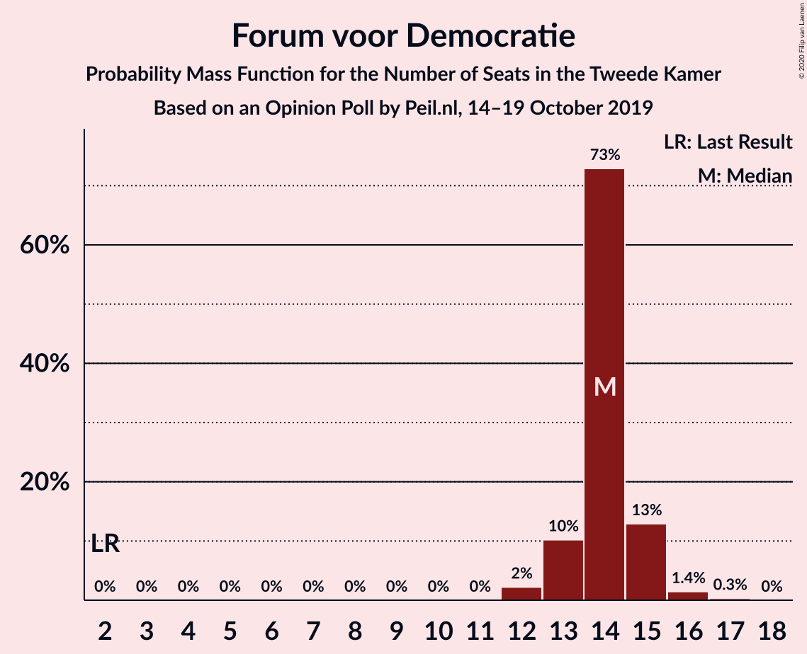

| Number of Seats | Probability | Accumulated | Special Marks |
|:---------------:|:-----------:|:-----------:|:-------------:|
| 2 | 0% | 100% | Last Result |
| 3 | 0% | 100% |  |
| 4 | 0% | 100% |  |
| 5 | 0% | 100% |  |
| 6 | 0% | 100% |  |
| 7 | 0% | 100% |  |
| 8 | 0% | 100% |  |
| 9 | 0% | 100% |  |
| 10 | 0% | 100% |  |
| 11 | 0% | 100% |  |
| 12 | 3% | 100% |  |
| 13 | 8% | 97% |  |
| 14 | 75% | 88% | Median |
| 15 | 12% | 13% |  |
| 16 | 2% | 2% |  |
| 17 | 0% | 0% |  |

### Democraten 66

*For a full overview of the results for this party, see the [Democraten 66](party-democraten66.html) page.*

| Number of Seats | Probability | Accumulated | Special Marks |
|:---------------:|:-----------:|:-----------:|:-------------:|
| 11 | 0.1% | 100% |  |
| 12 | 38% | 99.9% |  |
| 13 | 57% | 62% | Median |
| 14 | 5% | 5% |  |
| 15 | 0.4% | 0.4% |  |
| 16 | 0% | 0% |  |
| 17 | 0% | 0% |  |
| 18 | 0% | 0% |  |
| 19 | 0% | 0% | Last Result |

### GroenLinks

*For a full overview of the results for this party, see the [GroenLinks](party-groenlinks.html) page.*

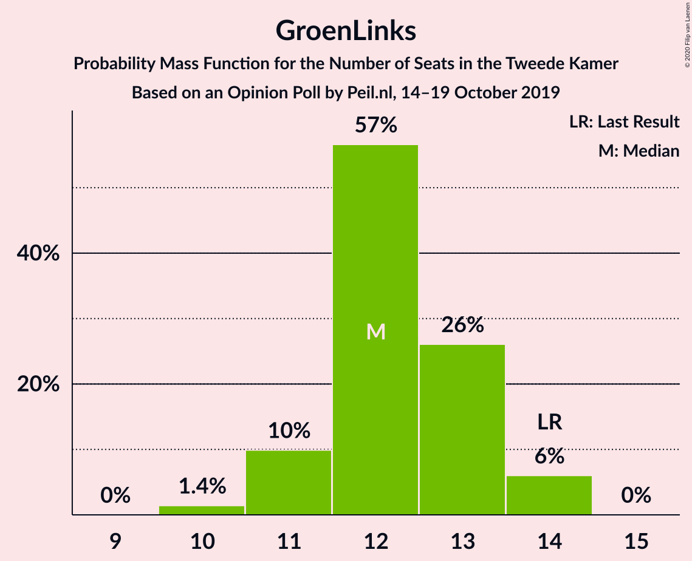

| Number of Seats | Probability | Accumulated | Special Marks |
|:---------------:|:-----------:|:-----------:|:-------------:|
| 10 | 0.9% | 100% |  |
| 11 | 8% | 99.1% |  |
| 12 | 45% | 91% | Median |
| 13 | 37% | 46% |  |
| 14 | 9% | 9% | Last Result |
| 15 | 0% | 0% |  |

### Socialistische Partij

*For a full overview of the results for this party, see the [Socialistische Partij](party-socialistischepartij.html) page.*

| Number of Seats | Probability | Accumulated | Special Marks |
|:---------------:|:-----------:|:-----------:|:-------------:|
| 7 | 0.3% | 100% |  |
| 8 | 41% | 99.7% |  |
| 9 | 46% | 58% | Median |
| 10 | 12% | 13% |  |
| 11 | 0.4% | 0.4% |  |
| 12 | 0% | 0% |  |
| 13 | 0% | 0% |  |
| 14 | 0% | 0% | Last Result |

### 50Plus

*For a full overview of the results for this party, see the [50Plus](party-50plus.html) page.*

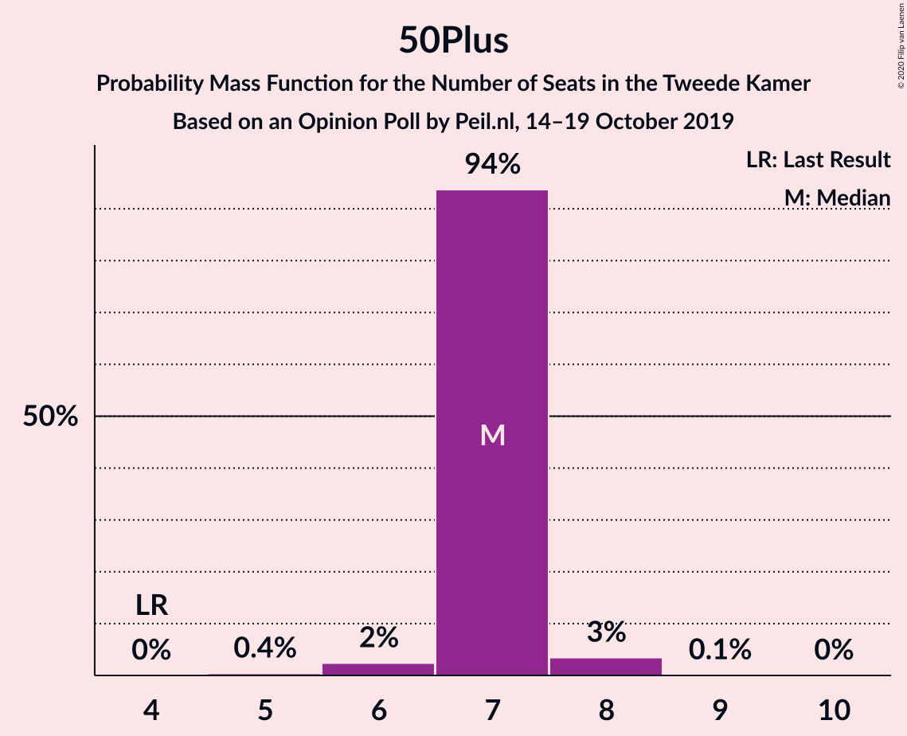

| Number of Seats | Probability | Accumulated | Special Marks |
|:---------------:|:-----------:|:-----------:|:-------------:|
| 4 | 0% | 100% | Last Result |
| 5 | 0.4% | 100% |  |
| 6 | 2% | 99.6% |  |
| 7 | 95% | 97% | Median |
| 8 | 2% | 2% |  |
| 9 | 0.1% | 0.1% |  |
| 10 | 0% | 0% |  |

### ChristenUnie

*For a full overview of the results for this party, see the [ChristenUnie](party-christenunie.html) page.*

| Number of Seats | Probability | Accumulated | Special Marks |
|:---------------:|:-----------:|:-----------:|:-------------:|
| 4 | 0.5% | 100% |  |
| 5 | 44% | 99.5% | Last Result |
| 6 | 20% | 56% | Median |
| 7 | 36% | 36% |  |
| 8 | 0.1% | 0.1% |  |
| 9 | 0% | 0% |  |

### Partij voor de Dieren

*For a full overview of the results for this party, see the [Partij voor de Dieren](party-partijvoordedieren.html) page.*

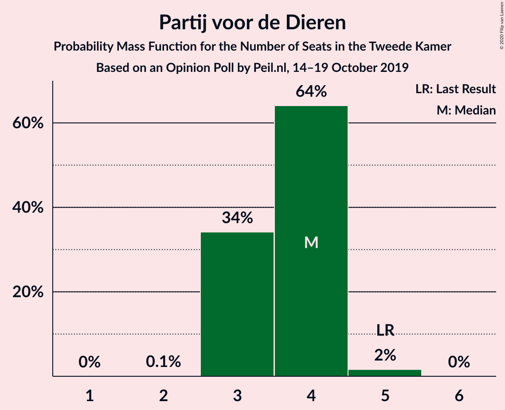

| Number of Seats | Probability | Accumulated | Special Marks |
|:---------------:|:-----------:|:-----------:|:-------------:|
| 2 | 0.1% | 100% |  |
| 3 | 50% | 99.9% | Median |
| 4 | 48% | 50% |  |
| 5 | 2% | 2% | Last Result |
| 6 | 0% | 0% |  |

### DENK

*For a full overview of the results for this party, see the [DENK](party-denk.html) page.*

| Number of Seats | Probability | Accumulated | Special Marks |
|:---------------:|:-----------:|:-----------:|:-------------:|
| 2 | 47% | 100% |  |
| 3 | 53% | 53% | Last Result, Median |
| 4 | 0.3% | 0.3% |  |
| 5 | 0% | 0% |  |

### Staatkundig Gereformeerde Partij

*For a full overview of the results for this party, see the [Staatkundig Gereformeerde Partij](party-staatkundiggereformeerdepartij.html) page.*

| Number of Seats | Probability | Accumulated | Special Marks |
|:---------------:|:-----------:|:-----------:|:-------------:|
| 1 | 16% | 100% |  |
| 2 | 81% | 84% | Median |
| 3 | 2% | 2% | Last Result |
| 4 | 0% | 0% |  |

## Coalitions

### Confidence Intervals

| Coalition | Last Result | Median | Majority? | 80% Confidence Interval | 90% Confidence Interval | 95% Confidence Interval | 99% Confidence Interval |
|:---------:|:-----------:|:------:|:---------:|:-----------------------:|:-----------------------:|:-----------------------:|:-----------------------:|
| Volkspartij voor Vrijheid en Democratie – Partij van de Arbeid – Christen-Democratisch Appèl – Democraten 66 – ChristenUnie | 85 | 83 | 100% | 81–83 | 78–83 | 78–83 | 78–84 |
| Volkspartij voor Vrijheid en Democratie – Partij voor de Vrijheid – Christen-Democratisch Appèl – Forum voor Democratie – Staatkundig Gereformeerde Partij | 77 | 76 | 73% | 74–78 | 74–79 | 73–79 | 73–79 |
| Partij van de Arbeid – Christen-Democratisch Appèl – Democraten 66 – GroenLinks – Socialistische Partij – ChristenUnie | 80 | 75 | 45% | 74–76 | 74–77 | 74–78 | 72–79 |
| Volkspartij voor Vrijheid en Democratie – Partij voor de Vrijheid – Christen-Democratisch Appèl – Forum voor Democratie | 74 | 74 | 16% | 73–77 | 72–77 | 72–77 | 72–78 |
| Volkspartij voor Vrijheid en Democratie – Christen-Democratisch Appèl – Democraten 66 – GroenLinks – ChristenUnie | 90 | 74 | 43% | 72–76 | 71–76 | 71–76 | 69–77 |
| Partij van de Arbeid – Christen-Democratisch Appèl – Democraten 66 – GroenLinks – ChristenUnie | 66 | 66 | 0% | 65–68 | 64–68 | 64–69 | 64–70 |
| Volkspartij voor Vrijheid en Democratie – Christen-Democratisch Appèl – Forum voor Democratie – 50Plus – Staatkundig Gereformeerde Partij | 61 | 67 | 0% | 63–67 | 63–69 | 63–69 | 63–69 |
| Volkspartij voor Vrijheid en Democratie – Christen-Democratisch Appèl – Forum voor Democratie – 50Plus | 58 | 65 | 0% | 62–65 | 61–67 | 61–67 | 61–67 |
| Volkspartij voor Vrijheid en Democratie – Partij van de Arbeid – Christen-Democratisch Appèl | 61 | 64 | 0% | 62–66 | 60–66 | 60–66 | 59–66 |
| Volkspartij voor Vrijheid en Democratie – Christen-Democratisch Appèl – Democraten 66 – ChristenUnie | 76 | 62 | 0% | 60–64 | 58–64 | 58–64 | 57–64 |
| Volkspartij voor Vrijheid en Democratie – Partij van de Arbeid – Democraten 66 | 61 | 61 | 0% | 59–63 | 59–63 | 59–63 | 58–64 |
| Volkspartij voor Vrijheid en Democratie – Partij voor de Vrijheid – Christen-Democratisch Appèl | 72 | 60 | 0% | 59–62 | 59–62 | 58–62 | 57–63 |
| Volkspartij voor Vrijheid en Democratie – Christen-Democratisch Appèl – Forum voor Democratie – Staatkundig Gereformeerde Partij | 57 | 60 | 0% | 56–61 | 56–62 | 56–62 | 55–62 |
| Volkspartij voor Vrijheid en Democratie – Christen-Democratisch Appèl – Forum voor Democratie | 54 | 58 | 0% | 55–59 | 54–60 | 54–60 | 53–60 |
| Volkspartij voor Vrijheid en Democratie – Christen-Democratisch Appèl – Democraten 66 | 71 | 56 | 0% | 54–57 | 52–58 | 52–58 | 52–58 |
| Partij van de Arbeid – Christen-Democratisch Appèl – Democraten 66 | 47 | 48 | 0% | 47–50 | 45–50 | 45–51 | 45–51 |
| Volkspartij voor Vrijheid en Democratie – Partij van de Arbeid | 42 | 48 | 0% | 47–50 | 47–50 | 46–50 | 46–50 |
| Volkspartij voor Vrijheid en Democratie – Christen-Democratisch Appèl | 52 | 44 | 0% | 41–44 | 40–45 | 40–45 | 39–45 |
| Partij van de Arbeid – Christen-Democratisch Appèl – ChristenUnie | 33 | 41 | 0% | 40–43 | 39–43 | 39–43 | 39–43 |
| Partij van de Arbeid – Christen-Democratisch Appèl | 28 | 35 | 0% | 34–38 | 33–38 | 33–38 | 33–38 |
| Christen-Democratisch Appèl – Democraten 66 | 38 | 28 | 0% | 26–29 | 25–29 | 25–30 | 25–31 |

### Volkspartij voor Vrijheid en Democratie – Partij van de Arbeid – Christen-Democratisch Appèl – Democraten 66 – ChristenUnie

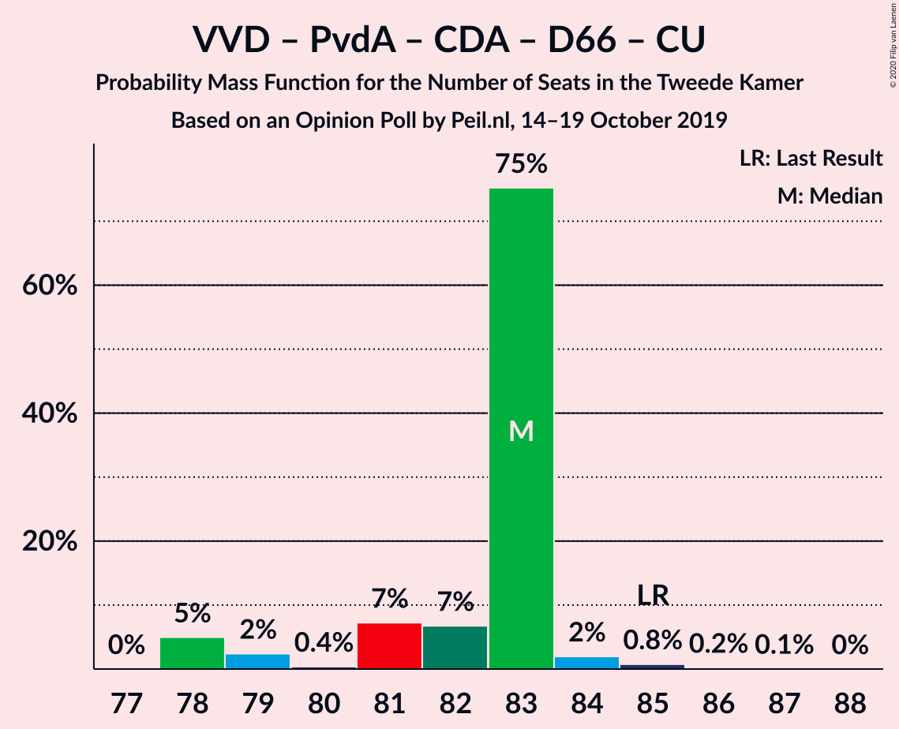

| Number of Seats | Probability | Accumulated | Special Marks |
|:---------------:|:-----------:|:-----------:|:-------------:|
| 78 | 8% | 100% |  |
| 79 | 2% | 92% |  |
| 80 | 0.4% | 91% |  |
| 81 | 3% | 90% |  |
| 82 | 6% | 87% | Median |
| 83 | 79% | 81% |  |
| 84 | 1.5% | 2% |  |
| 85 | 0.2% | 0.2% | Last Result |
| 86 | 0% | 0.1% |  |
| 87 | 0.1% | 0.1% |  |
| 88 | 0% | 0% |  |

### Volkspartij voor Vrijheid en Democratie – Partij voor de Vrijheid – Christen-Democratisch Appèl – Forum voor Democratie – Staatkundig Gereformeerde Partij

| Number of Seats | Probability | Accumulated | Special Marks |
|:---------------:|:-----------:|:-----------:|:-------------:|
| 72 | 0.2% | 100% |  |
| 73 | 3% | 99.8% |  |
| 74 | 8% | 97% |  |
| 75 | 17% | 90% |  |
| 76 | 29% | 73% | Median, Majority |
| 77 | 33% | 44% | Last Result |
| 78 | 2% | 11% |  |
| 79 | 9% | 9% |  |
| 80 | 0% | 0.3% |  |
| 81 | 0.3% | 0.3% |  |
| 82 | 0% | 0% |  |

### Partij van de Arbeid – Christen-Democratisch Appèl – Democraten 66 – GroenLinks – Socialistische Partij – ChristenUnie

| Number of Seats | Probability | Accumulated | Special Marks |
|:---------------:|:-----------:|:-----------:|:-------------:|
| 71 | 0.1% | 100% |  |
| 72 | 0.6% | 99.9% |  |
| 73 | 2% | 99.3% |  |
| 74 | 25% | 98% |  |
| 75 | 27% | 72% | Median |
| 76 | 37% | 45% | Majority |
| 77 | 6% | 9% |  |
| 78 | 0.2% | 3% |  |
| 79 | 2% | 2% |  |
| 80 | 0% | 0.1% | Last Result |
| 81 | 0% | 0.1% |  |
| 82 | 0.1% | 0.1% |  |
| 83 | 0% | 0% |  |

### Volkspartij voor Vrijheid en Democratie – Partij voor de Vrijheid – Christen-Democratisch Appèl – Forum voor Democratie

| Number of Seats | Probability | Accumulated | Special Marks |
|:---------------:|:-----------:|:-----------:|:-------------:|
| 70 | 0.1% | 100% |  |
| 71 | 0.1% | 99.9% |  |
| 72 | 6% | 99.8% |  |
| 73 | 19% | 93% |  |
| 74 | 30% | 74% | Last Result, Median |
| 75 | 28% | 44% |  |
| 76 | 6% | 16% | Majority |
| 77 | 10% | 10% |  |
| 78 | 0.3% | 0.6% |  |
| 79 | 0.1% | 0.3% |  |
| 80 | 0.1% | 0.1% |  |
| 81 | 0% | 0% |  |

### Volkspartij voor Vrijheid en Democratie – Christen-Democratisch Appèl – Democraten 66 – GroenLinks – ChristenUnie

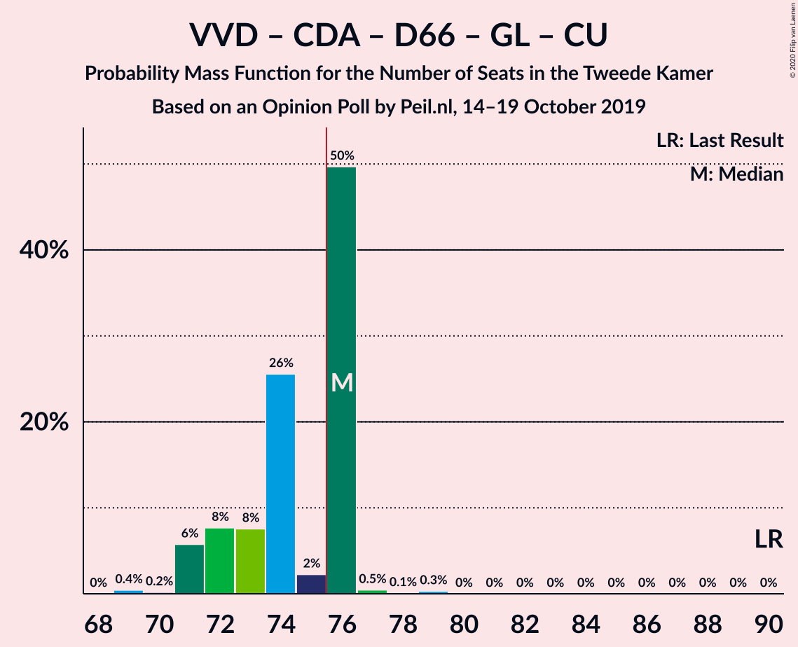

| Number of Seats | Probability | Accumulated | Special Marks |
|:---------------:|:-----------:|:-----------:|:-------------:|
| 69 | 0.5% | 100% |  |
| 70 | 0.1% | 99.5% |  |
| 71 | 7% | 99.4% |  |
| 72 | 4% | 92% |  |
| 73 | 9% | 88% |  |
| 74 | 35% | 79% | Median |
| 75 | 2% | 45% |  |
| 76 | 42% | 43% | Majority |
| 77 | 0.6% | 0.6% |  |
| 78 | 0.1% | 0.1% |  |
| 79 | 0% | 0% |  |
| 80 | 0% | 0% |  |
| 81 | 0% | 0% |  |
| 82 | 0% | 0% |  |
| 83 | 0% | 0% |  |
| 84 | 0% | 0% |  |
| 85 | 0% | 0% |  |
| 86 | 0% | 0% |  |
| 87 | 0% | 0% |  |
| 88 | 0% | 0% |  |
| 89 | 0% | 0% |  |
| 90 | 0% | 0% | Last Result |

### Partij van de Arbeid – Christen-Democratisch Appèl – Democraten 66 – GroenLinks – ChristenUnie

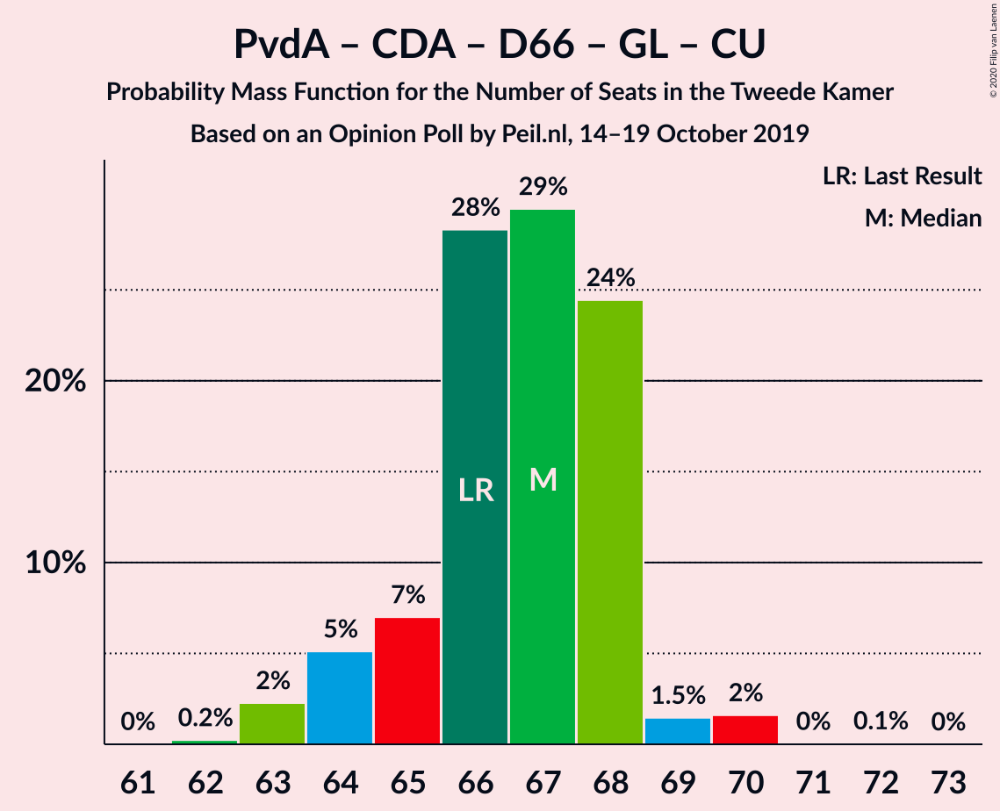

| Number of Seats | Probability | Accumulated | Special Marks |
|:---------------:|:-----------:|:-----------:|:-------------:|
| 62 | 0.2% | 100% |  |
| 63 | 0.1% | 99.8% |  |
| 64 | 8% | 99.7% |  |
| 65 | 10% | 92% |  |
| 66 | 41% | 82% | Last Result, Median |
| 67 | 2% | 41% |  |
| 68 | 36% | 38% |  |
| 69 | 0.3% | 3% |  |
| 70 | 2% | 2% |  |
| 71 | 0% | 0.1% |  |
| 72 | 0.1% | 0.1% |  |
| 73 | 0% | 0% |  |

### Volkspartij voor Vrijheid en Democratie – Christen-Democratisch Appèl – Forum voor Democratie – 50Plus – Staatkundig Gereformeerde Partij

| Number of Seats | Probability | Accumulated | Special Marks |
|:---------------:|:-----------:|:-----------:|:-------------:|
| 61 | 0% | 100% | Last Result |
| 62 | 0.2% | 99.9% |  |
| 63 | 12% | 99.7% |  |
| 64 | 8% | 88% |  |
| 65 | 1.0% | 79% |  |
| 66 | 13% | 79% | Median |
| 67 | 57% | 66% |  |
| 68 | 1.0% | 9% |  |
| 69 | 8% | 8% |  |
| 70 | 0.2% | 0.2% |  |
| 71 | 0% | 0% |  |

### Volkspartij voor Vrijheid en Democratie – Christen-Democratisch Appèl – Forum voor Democratie – 50Plus

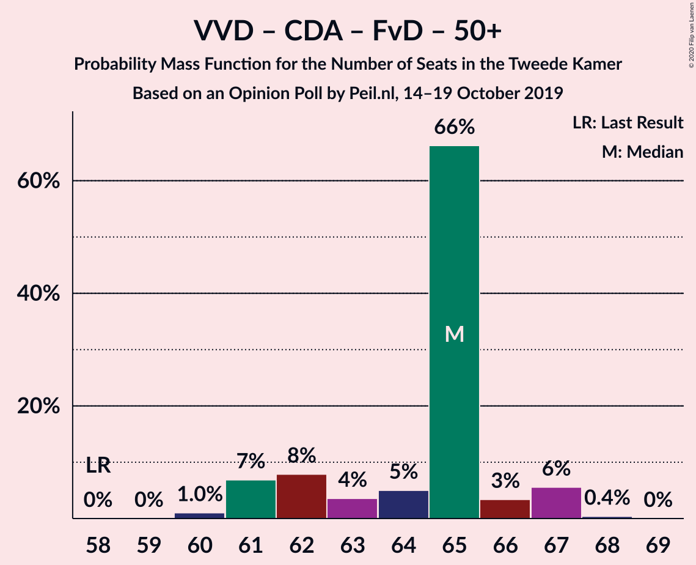

| Number of Seats | Probability | Accumulated | Special Marks |
|:---------------:|:-----------:|:-----------:|:-------------:|
| 58 | 0% | 100% | Last Result |
| 59 | 0% | 100% |  |
| 60 | 0.3% | 100% |  |
| 61 | 9% | 99.7% |  |
| 62 | 10% | 91% |  |
| 63 | 4% | 81% |  |
| 64 | 1.2% | 77% | Median |
| 65 | 66% | 76% |  |
| 66 | 2% | 10% |  |
| 67 | 8% | 8% |  |
| 68 | 0.2% | 0.2% |  |
| 69 | 0% | 0% |  |

### Volkspartij voor Vrijheid en Democratie – Partij van de Arbeid – Christen-Democratisch Appèl

| Number of Seats | Probability | Accumulated | Special Marks |
|:---------------:|:-----------:|:-----------:|:-------------:|
| 58 | 0.1% | 100% |  |
| 59 | 1.4% | 99.9% |  |
| 60 | 7% | 98.6% |  |
| 61 | 1.1% | 91% | Last Result |
| 62 | 3% | 90% |  |
| 63 | 35% | 87% | Median |
| 64 | 16% | 53% |  |
| 65 | 8% | 36% |  |
| 66 | 28% | 28% |  |
| 67 | 0.1% | 0.1% |  |
| 68 | 0% | 0% |  |

### Volkspartij voor Vrijheid en Democratie – Christen-Democratisch Appèl – Democraten 66 – ChristenUnie

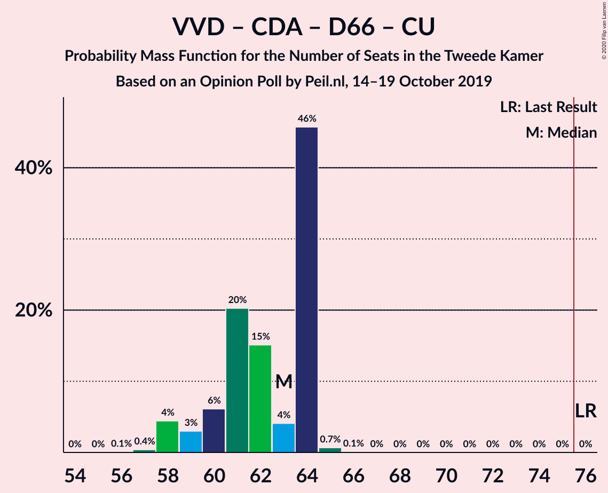

| Number of Seats | Probability | Accumulated | Special Marks |
|:---------------:|:-----------:|:-----------:|:-------------:|
| 57 | 0.5% | 100% |  |
| 58 | 7% | 99.5% |  |
| 59 | 2% | 93% |  |
| 60 | 3% | 91% |  |
| 61 | 31% | 88% |  |
| 62 | 19% | 57% | Median |
| 63 | 2% | 38% |  |
| 64 | 36% | 36% |  |
| 65 | 0.4% | 0.4% |  |
| 66 | 0% | 0.1% |  |
| 67 | 0% | 0% |  |
| 68 | 0% | 0% |  |
| 69 | 0% | 0% |  |
| 70 | 0% | 0% |  |
| 71 | 0% | 0% |  |
| 72 | 0% | 0% |  |
| 73 | 0% | 0% |  |
| 74 | 0% | 0% |  |
| 75 | 0% | 0% |  |
| 76 | 0% | 0% | Last Result, Majority |

### Volkspartij voor Vrijheid en Democratie – Partij van de Arbeid – Democraten 66

| Number of Seats | Probability | Accumulated | Special Marks |
|:---------------:|:-----------:|:-----------:|:-------------:|
| 57 | 0.1% | 100% |  |
| 58 | 0.7% | 99.9% |  |
| 59 | 10% | 99.2% |  |
| 60 | 2% | 90% |  |
| 61 | 41% | 88% | Last Result, Median |
| 62 | 34% | 47% |  |
| 63 | 12% | 13% |  |
| 64 | 0.5% | 0.6% |  |
| 65 | 0.1% | 0.1% |  |
| 66 | 0% | 0% |  |

### Volkspartij voor Vrijheid en Democratie – Partij voor de Vrijheid – Christen-Democratisch Appèl

| Number of Seats | Probability | Accumulated | Special Marks |
|:---------------:|:-----------:|:-----------:|:-------------:|
| 56 | 0.1% | 100% |  |
| 57 | 2% | 99.9% |  |
| 58 | 2% | 98% |  |
| 59 | 14% | 96% |  |
| 60 | 38% | 82% | Median |
| 61 | 27% | 44% |  |
| 62 | 15% | 17% |  |
| 63 | 1.3% | 1.5% |  |
| 64 | 0.2% | 0.2% |  |
| 65 | 0% | 0% |  |
| 66 | 0% | 0% |  |
| 67 | 0% | 0% |  |
| 68 | 0% | 0% |  |
| 69 | 0% | 0% |  |
| 70 | 0% | 0% |  |
| 71 | 0% | 0% |  |
| 72 | 0% | 0% | Last Result |

### Volkspartij voor Vrijheid en Democratie – Christen-Democratisch Appèl – Forum voor Democratie – Staatkundig Gereformeerde Partij

| Number of Seats | Probability | Accumulated | Special Marks |
|:---------------:|:-----------:|:-----------:|:-------------:|
| 54 | 0% | 100% |  |
| 55 | 1.4% | 99.9% |  |
| 56 | 11% | 98.6% |  |
| 57 | 9% | 88% | Last Result |
| 58 | 0.7% | 80% |  |
| 59 | 13% | 79% | Median |
| 60 | 56% | 66% |  |
| 61 | 2% | 10% |  |
| 62 | 8% | 9% |  |
| 63 | 0% | 0.2% |  |
| 64 | 0.2% | 0.2% |  |
| 65 | 0% | 0% |  |

### Volkspartij voor Vrijheid en Democratie – Christen-Democratisch Appèl – Forum voor Democratie

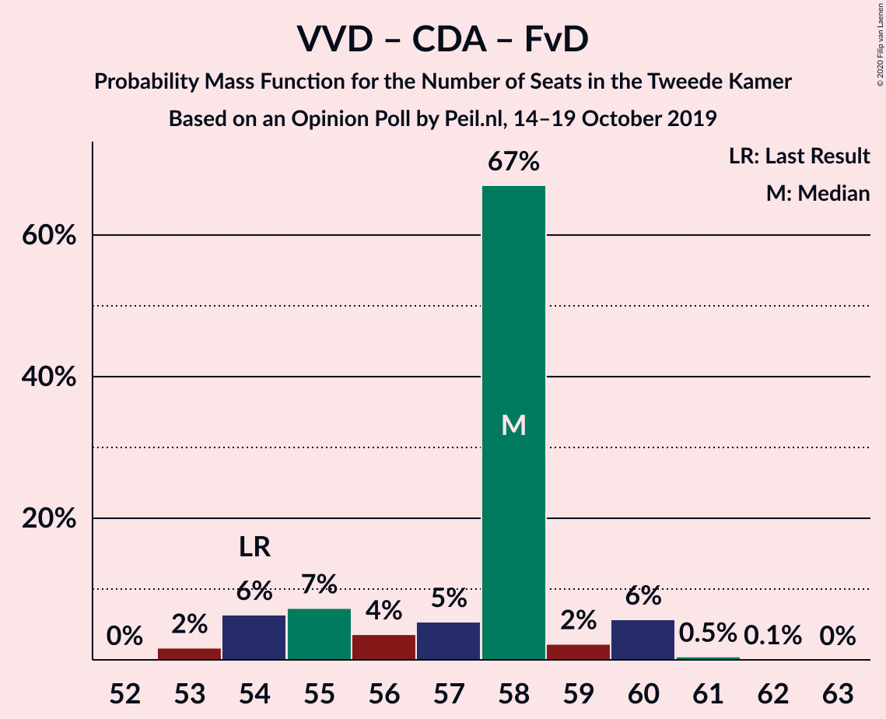

| Number of Seats | Probability | Accumulated | Special Marks |
|:---------------:|:-----------:|:-----------:|:-------------:|
| 53 | 1.4% | 100% |  |
| 54 | 7% | 98.6% | Last Result |
| 55 | 10% | 91% |  |
| 56 | 3% | 81% |  |
| 57 | 1.4% | 77% | Median |
| 58 | 65% | 76% |  |
| 59 | 2% | 11% |  |
| 60 | 8% | 9% |  |
| 61 | 0.3% | 0.5% |  |
| 62 | 0.2% | 0.2% |  |
| 63 | 0% | 0% |  |

### Volkspartij voor Vrijheid en Democratie – Christen-Democratisch Appèl – Democraten 66

| Number of Seats | Probability | Accumulated | Special Marks |
|:---------------:|:-----------:|:-----------:|:-------------:|
| 52 | 9% | 100% |  |
| 53 | 0.5% | 91% |  |
| 54 | 2% | 91% |  |
| 55 | 9% | 89% |  |
| 56 | 30% | 80% | Median |
| 57 | 40% | 50% |  |
| 58 | 9% | 10% |  |
| 59 | 0.2% | 0.4% |  |
| 60 | 0.2% | 0.2% |  |
| 61 | 0% | 0% |  |
| 62 | 0% | 0% |  |
| 63 | 0% | 0% |  |
| 64 | 0% | 0% |  |
| 65 | 0% | 0% |  |
| 66 | 0% | 0% |  |
| 67 | 0% | 0% |  |
| 68 | 0% | 0% |  |
| 69 | 0% | 0% |  |
| 70 | 0% | 0% |  |
| 71 | 0% | 0% | Last Result |

### Partij van de Arbeid – Christen-Democratisch Appèl – Democraten 66

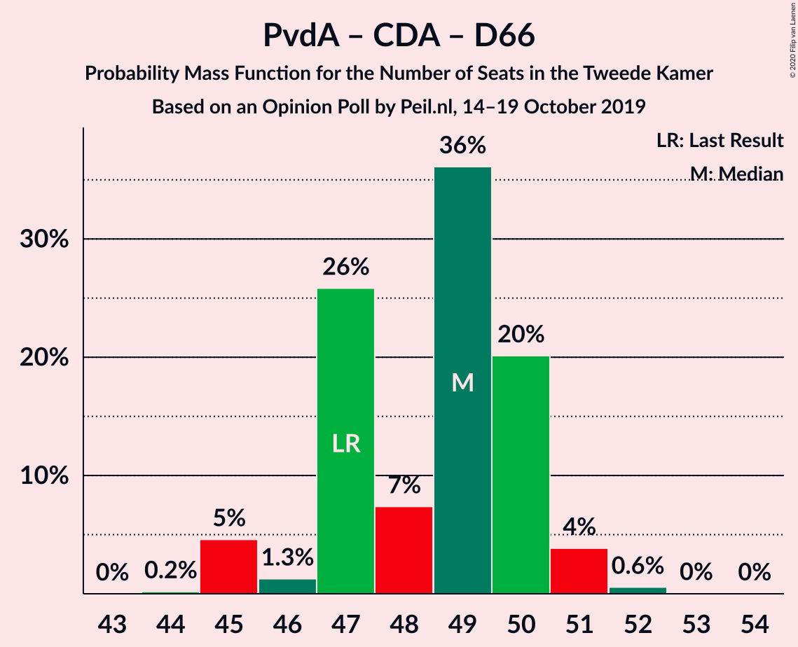

| Number of Seats | Probability | Accumulated | Special Marks |
|:---------------:|:-----------:|:-----------:|:-------------:|
| 44 | 0.3% | 100% |  |
| 45 | 7% | 99.7% |  |
| 46 | 2% | 93% |  |
| 47 | 36% | 91% | Last Result |
| 48 | 10% | 55% | Median |
| 49 | 12% | 45% |  |
| 50 | 29% | 34% |  |
| 51 | 5% | 5% |  |
| 52 | 0.1% | 0.1% |  |
| 53 | 0% | 0% |  |

### Volkspartij voor Vrijheid en Democratie – Partij van de Arbeid

| Number of Seats | Probability | Accumulated | Special Marks |
|:---------------:|:-----------:|:-----------:|:-------------:|
| 42 | 0% | 100% | Last Result |
| 43 | 0% | 100% |  |
| 44 | 0.1% | 99.9% |  |
| 45 | 0.1% | 99.9% |  |
| 46 | 3% | 99.7% |  |
| 47 | 10% | 97% |  |
| 48 | 42% | 87% | Median |
| 49 | 5% | 45% |  |
| 50 | 41% | 41% |  |
| 51 | 0.1% | 0.3% |  |
| 52 | 0.2% | 0.2% |  |
| 53 | 0% | 0% |  |

### Volkspartij voor Vrijheid en Democratie – Christen-Democratisch Appèl

| Number of Seats | Probability | Accumulated | Special Marks |
|:---------------:|:-----------:|:-----------:|:-------------:|
| 39 | 1.4% | 100% |  |
| 40 | 8% | 98.6% |  |
| 41 | 3% | 91% |  |
| 42 | 8% | 88% |  |
| 43 | 6% | 81% | Median |
| 44 | 65% | 75% |  |
| 45 | 10% | 10% |  |
| 46 | 0.2% | 0.3% |  |
| 47 | 0.1% | 0.1% |  |
| 48 | 0% | 0% |  |
| 49 | 0% | 0% |  |
| 50 | 0% | 0% |  |
| 51 | 0% | 0% |  |
| 52 | 0% | 0% | Last Result |

### Partij van de Arbeid – Christen-Democratisch Appèl – ChristenUnie

| Number of Seats | Probability | Accumulated | Special Marks |
|:---------------:|:-----------:|:-----------:|:-------------:|
| 33 | 0% | 100% | Last Result |
| 34 | 0% | 100% |  |
| 35 | 0% | 100% |  |
| 36 | 0% | 100% |  |
| 37 | 0% | 100% |  |
| 38 | 0.5% | 100% |  |
| 39 | 8% | 99.5% |  |
| 40 | 4% | 92% |  |
| 41 | 52% | 88% | Median |
| 42 | 5% | 35% |  |
| 43 | 31% | 31% |  |
| 44 | 0.2% | 0.3% |  |
| 45 | 0.1% | 0.2% |  |
| 46 | 0% | 0% |  |

### Partij van de Arbeid – Christen-Democratisch Appèl

| Number of Seats | Probability | Accumulated | Special Marks |
|:---------------:|:-----------:|:-----------:|:-------------:|
| 28 | 0% | 100% | Last Result |
| 29 | 0% | 100% |  |
| 30 | 0% | 100% |  |
| 31 | 0% | 100% |  |
| 32 | 0.5% | 100% |  |
| 33 | 8% | 99.5% |  |
| 34 | 35% | 91% |  |
| 35 | 11% | 56% | Median |
| 36 | 12% | 45% |  |
| 37 | 3% | 33% |  |
| 38 | 30% | 30% |  |
| 39 | 0% | 0.1% |  |
| 40 | 0% | 0% |  |

### Christen-Democratisch Appèl – Democraten 66

| Number of Seats | Probability | Accumulated | Special Marks |
|:---------------:|:-----------:|:-----------:|:-------------:|
| 25 | 7% | 100% |  |
| 26 | 10% | 93% |  |
| 27 | 0.8% | 82% |  |
| 28 | 62% | 82% | Median |
| 29 | 14% | 19% |  |
| 30 | 4% | 5% |  |
| 31 | 0.7% | 0.7% |  |
| 32 | 0% | 0% |  |
| 33 | 0% | 0% |  |
| 34 | 0% | 0% |  |
| 35 | 0% | 0% |  |
| 36 | 0% | 0% |  |
| 37 | 0% | 0% |  |
| 38 | 0% | 0% | Last Result |

## Technical Information

### Opinion Poll

+ **Polling firm:** Peil.nl
+ **Commissioner(s):** —
+ **Fieldwork period:** 14–19 October 2019

### Calculations

+ **Sample size:** 3000
+ **Simulations done:** 524,288
+ **Error estimate:** 1.42%

